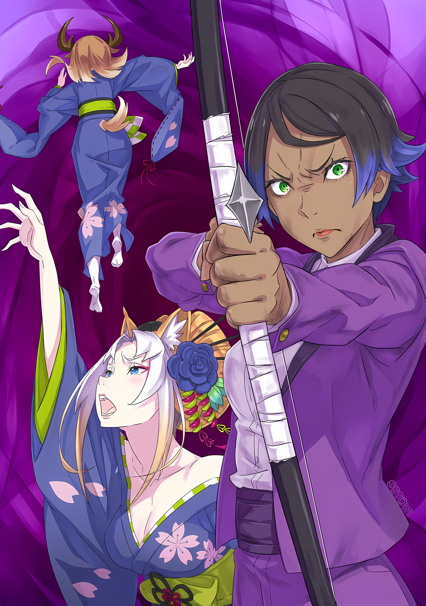

???: Эй, Таритта. Меня выбрали «Звездочетом», и я должна исполнить одну заповедь.

Та, кто доверилась Таритте, была еще одна из «Племени Судрак», Мариули.

Все судракийки родились и выросли в Джунглях Будхейма, и именно там заканчивалась их жизнь.

Поэтому все односельчане в поселении были для них как родные, и Мариули не была исключением.

Однако для Таритты, Мариули была особенным и близким другом. Причиной тому было то, что она и Таритта родились в один и тот же день; сестры-души, поднявшие свой родовой крик в одном и том же месте.

……По поверьям судракиек, души детей, родившихся в один и тот же день, были связаны.

Эта связь считалась сильнее, чем связь между матерью и сестрами, к ним относились как к половинкам самих себя.

По древнему обычаю судракиек, души сестер были связаны глубокой и прочной связью; Куна и Хоули тоже были сестрами по душам, родившись в один день.

Если вспомнить о дружбе между этими двумя, можно было понять, что существует связь, превосходящая кровную.

Прекрасная судракийка, женщина по имени Мариули с черными волосами, окрашенными на концах в розовый цвет, была сестрой души Таритты.

Она была нежной и спокойной, хорошо ладила с Тариттой, которая была тревожной и застенчивой.

Таритта также часто советовалась с сестрой-души о своей настоящей сестре. Она просила ее прислушаться к ее тревогам и неуверенности в своей способности поддержать старшую сестру, которая со временем займет пост вождя племени.

Любые конфликты или неловкие неуверенности, которые у нее возникали, она, естественно, могла доверить Мариули.

Поэтому, когда Мариули сказала ей, что ей нужно раскрыть секрет, Таритта была рада, что к ней обратились за советом, чувствуя себя обязанной отплатить за доверие.

И вот она заговорила.

……Она была избрана «Звездочетом» и получила заповедь, которую должна исполнить.

Мариули: Выполнение заповеди — важная роль «Звездочета». Это большая честь, Таритта.

Таритта: Ну, я не понимаю… Что говорят тебе небеса, Мариули?

Мариули: Это не небеса, Таритта. Это звезды говорят нам. Звезды отводят нам определенную роль. Очень, очень важную роль… Вообще-то, я не собиралась никому говорить, но….

Таритта: …………

Мариули: Ты — моя сестра по душе.

Глядя на улыбающуюся Мариули и ее доверие, Таритта не могла ничего сказать.

Это была всего лишь тема, которую ее сестра Мариули доверила Таритте, полагаясь на нее. Мысль о том, чтобы раскрыть такое кому-то, кроме самой себя, не представлялась даже Таритте.

Кроме того, такие вещи, казавшиеся навязчивой идеей, можно было быстро забыть, как мимолетное заблуждение.

Это было действительно мимолетное заблуждение, которое не стоило воспринимать всерьез. Поверив в это, Таритта отвлеклась от вопроса о Мариули.

Но изменения проявлялись, медленно, но верно превращаясь в аномалии.

И вот однажды.

Когда Таритта и Мизельда вернулись с охоты, Мариули, заботившаяся о деревенских детях, пела незнакомую песню. ……Это было очень странно.

«Племя Судрак» в деревне можно было разделить на две роли.

Одна из них — охотники, те, кто покинул поселение и сделал своей профессией охоту на добычу; Мизельда, Таритта и многие другие судракийки принадлежали к этой группе.

Роль остальных — опекуны, которые оставались в деревне, воспитывали детей и защищали поселение.

Мариули принадлежала к тем, кто играл роль опекуна.

Ее охотничьи навыки никогда не улучшались; ее способности были настолько ужасны, что если бы она взяла лук, то промахнулась бы во всех случаях из ста. Однако она прекрасно готовила и шила, а ее сильной стороной было пение песен и рассказывание детям историй из прошлого.

Отныне не было ничего удивительного в том, что Мариули пела.

Мариули была прекрасной певицей, и на пирах все просили ее спеть.

Таритта же, напротив, была бесполезна в большинстве обязанностей опекуна, да и петь умела не очень хорошо. Воистину, эти двое были половинками одного человека, иначе они не смогли бы выполнять работу целого человека.

И все же……

Мизельда: ……Я не помню, чтобы слышала эту песню Мариули раньше.

Таритта: С-сестра….

Мизельда: Но песня хорошая. Приятная.

Остановившись послушать ту же песню, Мизельда не обратила внимания на аномалию.

То же самое было и с остальными, Куной и Хоули. Все они заметили, что Мариули поет песню, которую они не знали, но не задумались о ее значении.

Лишь Таритта испытывала страх и опасения по поводу источника песни.

Именно Мариули говорила о том, что звезды сообщили ей о роли, которую она должна исполнить, например, о заповеди.

Конечно, она не стала бы говорить, что даже этой песне ее научили звезды……

Мариули: Нет, Таритта. Это недоразумение. Я не училась этому у звезд, я просто спела песню, которую уже знала.

Таритта: Ты знала песню?

Мариули: Да, я знаю эту песню… Не лично, конечно, но другой «Звездочет» знает….

Таритта: ……Кх, я не понимаю, что это значит!

Это был не тот ответ, которого Таритта опасалась.

Однако в каком-то смысле ответ Мариули превзошел все опасения Таритты.

Это замечание «Звездочета» было доказательством того, что она не забыла небылицы, вышедшие из ее уст. Это было доказательством того, что ее фантазия все еще жива. ……Нет, это было доказательством того, что все становится еще хуже.

Однако из-за того, что Таритта ничего не поняла из того, что она говорила о «Звездочетах», Мариули сделала грустное лицо, подобное одиночке.

Таритта мучилась из-за того, что, похоже, предала ее доверие, из-за чего-то, чего она не могла понять.

……После этого медовый месяц «Звездочета» Мариули продолжился.

Она проводила свои дни, демонстрируя незнакомые знания, исполняя незнакомые песни, рассказывая незнакомые истории и выполняя незнакомые заповеди.

Это была Мариули, которую Таритта не знала.

Она всегда все обсуждала с Мариули.

В ее жизни не было случая, чтобы Таритта не посоветовалась с Мариули по поводу того или иного решения. То же самое было и с Мариули, даже в отношении выбора имени ее дочери.

Однако внимание Мариули всегда было приковано к небу.

Казалось, что приоритет отдается чему-то другому, кроме «Племени Судрак», чему-то другому, кроме Таритты и ее дочери, ее жизнь медленно и постепенно становилась ловушкой звезд, связанной заповедью.

Кто-то, кто не был звездой, вкладывал в нее мудрость.

Подозревая это, Таритта даже пыталась косвенно проникать в ее окружение. Однако, исполняя роль хранительницы, она никогда не покидала деревню. У нее не было возможности получить знания о внешнем мире.

Было похоже, что звезды шепчут ей.

Таритта: Это вы вводите Мариули в заблуждение?

Взглянув на ночное небо, она обратилась к звездам, видневшимся сквозь просветы в кронах деревьев.

Однако звезды, говорившие с Мариули, не говорили с Тариттой, с которой она была связана душой.

Незнакомые знания, песни, которых никто никогда не слышал, заповедь, которую нужно исполнить….

Таритта: ……Верните мне мою сестру-души.

С силой натянув тетиву, Таритта прицелилась в самую яркую звезду на ночном небе.

Как только она отпустила тетиву, острая стрела взвилась в ночное небо… И естественно, она бесцельно упала вниз, не задев ничего.

Звезды отказались признать даже непокорную волю Таритты.

Звезды не говорили, они не давали заповедей.

Что же тогда изменило Мариули? Она не могла этого понять.

Она даже не знала, кому она должна позволить услышать это причитание.

Все беды и страдания, которые она не могла выразить, были услышаны Мариули. Тогда к кому же ей обратиться, чтобы выслушать свои переживания и страдания, вызванные Мариули?

Она была уверена, что ее старшая сестра не поймет ее. Ее старшая сестра была сильной и собранной.

То, что она может зациклиться на чем-то или стоять на месте, было немыслимо. Кроме того, ужас от того, что она доверилась старшей сестре, был больше, чем от того, что ее просто не поймут.

Нынешняя Мариули противоречила учениям и образу жизни «Племени Судрак».

Одобрит ли это Мизельда, ставшая теперь вождем племени? Или, возможно, она изгонит Мариули из деревни из-за ее опасных идей?

В прошлом некоторые из них были изгнаны из племени и больше никогда не могли вернуться в джунгли.

Она не хотела терять Мариули из виду.

Даже если сейчас Мариули изменилась по сравнению с той, с чьей душой была связана душа Таритты.

Поэтому Таритта долгое время хранила свою боль в груди.

А затем….

Мариули: ……Что мне делать, Таритта? Я «Звездочет», и все же….

……И тогда инцидент того дня, такой же, как и кошмары, которые она видела каждую ночь, действительно начался.

△▼△▼△▼△

Чувствуя изменение состояния битвы, каждый на поле боя начал действовать по-своему.

Поскольку ситуация была необратимой, никто не отставал, их лица были насторожены, так как нервы были на пределе.

«Великое Бедствие» продолжалось, бушующие тени охватывали и поглощали окрестности, разрушая и увеличивая гибель.

Однако никто из тех, кто закалил свои сердца, чтобы противостоять бедствию, не дрогнул. Это была заслуженная награда тех, кто преодолел первое препятствие.

Для того чтобы бросить вызов «Великому Бедствию», существовало условие.

Они должны были быть воинами. ……Это означало, что они должны обладать силой для борьбы. Одновременно это означало, что они должны обладать сердцем, способным противостоять ему.

Если не хватало ни силы, ни сердца, человек не мог стоять на поле боя в качестве воина.

И наоборот, если человек мог доказать, что он обладает обоими этими качествами, то на его пути не было бы других препятствий, чтобы бросить вызов «Великому Бедствию».

Луис: Уау!

Возвысив беззвучный голос, Луис со стиснутыми зубами продолжала уклоняться от натиска тени.

У нее не было ни привязанности, ни связи с Хаосфлеймом, ей не было никакого дела до того, будет ли город уничтожен или нет. Если бы город исчез, ее бы это ничуть не беспокоило.

Хотя она выглядела молодой и хрупкой, она прилагала все усилия, чтобы пережить «Великое Бедствие» по своим причинам.

Если это наделяло Луис силой, сердцем, никто не имел права удерживать ее.

И это касалось не только Луис.

Медиум, орудовавшая варварским мечом с ее маленьким телом; Ал, прижимавший Меч Синего Дракона к собственной шее; Кафма, мобилизовавший всю силу «насекомых» в своем теле; и жители Города Демонов, у которых горел один глаз; все они обладали решимостью не отступать перед «Великим Бедствием», равной решимости Луис.

У каждого из них были свои собственные, отличные от других причины сразить «Великое Бедствие», разрушающее Город Демонов.

Для тех, кто преодолел это первое препятствие, «Великое Бедствие» вело себя просто, и, несмотря на его опасность, справиться с ним было не слишком сложно.

……«Великое Бедствие» не было живым существом. Это было самым важным фактором.

«Великое Бедствие» больше не было бедствием такого рода; вместо этого можно было сказать, что оно было явлением разрушения как такового.

Тени, разрушающие все, с чем они соприкасались; аморфная фигура, бурлящая и извивающаяся, которая не позволяла быть уверенным в успехе атаки. ……Впрочем, это было все.

Ал: У нее даже нет мозгов, чтобы ответить на наши атаки или изменить свои действия.

Бегая по полю боя, используя обломки в качестве опоры, Ал пристально смотрел на «Великое Бедствие», одновременно раздавая указания окружающим.

Хотя панику, просачивающуюся из глубины его тела, было не изгнать, с помощью бравады и понимания ситуации он смог дать своему разуму передышку. Передышку, чтобы Ал мог подумать.

Поведение «Великого Бедствия» было, проще говоря, предсказуемым.

Оно стряхивало или поглощало все, что приближалось, и, если бы его не отвлекли, извивалось бы и поглощало окружающее, чтобы причинить еще больший ущерб.

Однако оборонительные силы, в том числе и Ал, не позволили бы «Великому Бедствию» разрастаться дальше.

Отбивая атаки или отвлекая его внимание от цели переполненных теней, становясь сами приманкой, они создавали паузу в его разрастании, теряя время. Неоднократно.

Если бы «Великое Бедствие» было живым существом, оно бы узнало…… узнало, как реагировать и изменить ход битвы.

Или же оно могло бы изменить свое поведение из-за эмоционального обострения, что, безусловно, должно было бы привести к изменению хода битвы. Но поскольку этого не произошло, даже эта боевая сила смогла сдержать его, хотя и с трудом.

Однако……

Йорна: ……Всем приготовиться к отступлению.

Одним ударом земля разлетелась на куски, и ударная волна расколола гигантское тело «Великого Бедствия» на две части.

Конечно, вскоре после этого «Великое Бедствие» скорчилось, быстро вернувшись в исходное состояние, но именно абсолютная подавляющая способность Госпожи Города Демонов позволила ей нанести ощутимый урон.

Йорна Миссигр, которая совершила этот поступок, в своих гэта на толстой подошве, издающих громкие звуки, блокировала тени, которые нахлынули, как волны бурного моря, словно желая смести землю и все, что на ней находится.

Медиум: Йорна-чан!

Йорна: Отставить! Хоть мне и неприятно, но мы сделаем так, как говорит этот человек.

Медиум: Вы имеете в виду Абел-чина?

Когда они разговаривали среди бури, тонкая челюсть Йорны поднималась и опускалась в кивке в ответ на вопрос Медиум. Ее миндалевидные глаза смотрели на красивого мужчину в маске Они, стоявшего на вершине холма с видом на поле боя.

Даже если у него не было возможности вступить в бой, он не убегал, а все еще присутствовал, возможно, из-за какой-то гордости.

В любом случае, план, который он разработал с помощью представлений, кружащихся в его голове, был передан Йорне, и она приняла его как план действий.

Затем…….

Йорна: Я позволю этому городу быть поглощенным, а затем взорву его изнутри. Кроме этого, нет другого способа пресечь зародыши этого бедствия, вызывающего этот разврат.

Кафма: Ты сможешь это сделать?

Йорна: Если одного замка недостаточно, тогда нужно использовать один город. Но если и этого будет недостаточно, тогда мне придется стать Императрицей и использовать всю страну.

Кафма: Как один из его приближенных, я должен решительно осудить тебя за такое!

Услышав план Йорны, Кафма накричал на нее, покраснев из-за ее ненужного замечания. Однако честный воин Клана Клетки Насекомых сразу же изменил выражение лица и кивнул головой в знак согласия, сказав «Понял».

Вероятно, он понял, что решение Йорны оставить свой город — это выбор, который принес боль сродни разрезанию собственного тела.

Короткий ответ Кафмы упал на ее уши, глаза Йорны слегка опустились вниз, после чего она очаровательно и нежно улыбнулась.

Йорна: Тебе нет нужды беспокоиться. Со мной и теми, кто меня любит, можно основать такой же город. ……Мне и им это будет утешением.

Йорна, положив руку на грудь и заявив об этом, не возражала.

На самом деле, насколько сильным окажется туз в рукаве Йорны, было неясно, но он прекрасно понимал, что, кроме него, ничто другое сейчас не может склонить чашу весов против «Великого Бедствия».

Отныне……

Медиум: Мы все вместе должны будем пробиваться назад! Как можно быстрее!

Эти короткие слова, произнесенные Медиум, стали сигналом к тому, что последний гамбит в битве за Город Демонов будет выполнен.

△▼△▼△▼△

……Кошмары, снились ей каждую ночь, начались в одну прохладную ночь, под бледной луной и ледяным холодом.

Исповедуя себя «Звездочетом», Мариули дошла до того, что стала открывать неизвестные знания.

Ее сестрам было все равно, откуда пришло это знание, но страх Таритты рос с каждым днем. Однако она не могла никому рассказать о своих страданиях.

Мариули никому, кроме Таритты, не рассказывала о том, что стала «Звездочетом». Не из-за корысти, а скорее из-за простых уз, связывавших их.

Существовали клятвы и секреты, которыми можно было обмениваться только между сестрами-души.

У Куны и Хоули, которые обе испытывали сильное чувство принадлежности к Судрак, несомненно, тоже были свои секреты, о которых они не рассказывали другим своим собратьям.

В случае Мариули это была ее роль «Звездочета», которую она доверила Таритте. Кроме того, было практически немыслимо, чтобы сестра-души выдала секрет, доверенный с такой верой…… другим.

Поэтому муки Таритты продолжали грызть ее сердце, не позволяя поделиться ими ни с кем другим.

Однако эти дни должны были закончиться так, как она и не предполагала.

Этим было……

Мариули: ……Что мне делать, Таритта? Я «Звездочет», и все же….

Слова Мариули стали шоком для Таритты, которая была настолько ошеломлена, что не могла пошевелиться.

Ведь из ее рта вырвались не только ее слабые причитания, но и свежая красная кровь, залившая переднюю часть ее груди.

Изначально, ее тело не было здоровым.

Причина, по которой она работала хранительницей, а не охотницей, заключалась не только в ее неопытности в охотничьих навыках, но и в хрупкости ее тела.

В детстве она часто лежала в постели из-за болезней. Но когда она стала старше и эти приступы стали реже, все, видимо, ослабили бдительность, полагая, что с ней все непременно будет в порядке.

И, несмотря на это, демон нездоровья медленно вгрызался в ее сердцевину, доводя до точки невозврата.

Мариули снова и снова рвало кровью, ее лицо было белым, как простыня. Любой мог ясно видеть, что с каждым днем ее тело становится все более изможденным, а свет ее жизни начинает меркнуть.

И теперь……

???: Остальное зависит от силы воли Мариули, Таритта.

Таритта: Старшая… сестра…

???: Проведи немного времени с Мариули. До последнего. Это долг сестры-души.

Заставив ее выпить настой, Мизельда произнесла слова, которые тяготили Таритту.

Долг сестры-души — это было похоже на заповедь.

Заповедь, сказанная ей старшей сестрой, ничем не отличающаяся от заповеди небес, гласящая, что она должна ее исполнить.

Другие судракийки, знавшие Мариули некоторое время, такие как Куна и Хоули, обменялись с ней несколькими словами. Затем они удалились, оставив Таритте несколько слов.

Все понимали, что это их последний шанс поговорить с Мариули.

И той, кто увидит конец Мариули своими глазами, будет не кто иная, как Таритта. Ее сестра по душе, которая родилась в тот же день, что и она, но умрет в другой.

???: Маа….

Маленькая дочь Мариули, которая все еще не могла понять, что происходит, сжала руку матери и нежно потерлась щекой о ее щеку.

Под влиянием окружающей обстановки мать и дитя закончили свое последнее прощание без малейшего понимания. Прощание между невинной дочерью, которая не сомневалась, что завтра увидит ее снова, и матерью, лежащей на смертном одре.

Мариули: Спокойной ночи.

Мариули закончила прощаться со своим машущим ребенком, а также со своими сестрами, которые обращались к ней по очереди; перед лицом собственной смерти, это было нечто особенное.

Не было сомнений, что Мариули, в которую Таритта верила и которую любила, была сильной в своей основе.

Однако……

Мариули: Что мне делать, Таритта. Я все еще не выполнила свою заповедь, и все же….

Таритта: Мариули…

Мариули: Я все еще не выполнила ее… Почему… Я…

Как только она осталась наедине с Тариттой, напряжение резко спало.

Лицо Мариули стало еще бледнее, чем было. Ее волновала не смерть, нависшая над ней, не будущее ее ребенка, а нечто непонятное, похожее на шепот звезд.

Глаза Мариули наполнились слезами, когда она в отчаянии задалась вопросом, почему.

Но первой отчаялась Таритта, еще до ее слез и выражения лица.

Таритта: Ты все еще продолжаешь об этом…!

Мариули: Таритта….

Таритта: Заповедей или чего бы то ни было, ничего подобного не существует. Абсолютно нет! Ты Мариули из Судрак! Больше ничего не нужно, чего ты еще хочешь!

Живи как судракийка и умри как судракийка.

Это должно было быть самым важным, самым приоритетным.

Итак, что нужно было сделать, чтобы Мариули, одна из Судрак, так это……

Мариули: ……Смысл… рождения……

Таритта: …Смы…сл?

Мариули: Это то, чего я хочу.

Слова Мариули, которая даже в такое время видела ценность в заповеди, пронзили Таритту насквозь.

Родиться как судракийка, жить как судракийка, умереть как судракийка.

Когда ее спросили, чего она может желать дальше, она ответила, что желает смысла рождения.

……У нее родилась дочь. У нее была Таритта. У нее был Судрак. И все же она сказала, что желает смысла.

В тот же миг она, Мариули, отказалась от крови, текущей в ней, отвергнув ее как бессмысленную.

Она предала свою кровь и заявила, что находит смысл в шепоте звезд, который был всего лишь притворством.

Такое предательство, по мнению Таритты, было очень трудно простить.

Поэтому, по этой причине……

Таритта: ……Достаточно.

Мариули: …………

Таритта: Я твоя сестра по душе… Как ты можешь говорить о смысле рождения в моем присутствии?

Словно говоря, что ей невыносимо больше это слушать, Таритта продемонстрировала свои намерения, используя холодный клинок.

Она вытащила кинжал, его острие было спокойно направлено на бледное горло Мариули. Таритта надеялась, что Мариули придет в себя, заставив ее отказаться от своих слов остротой и холодом клинка.

Естественно, могло случиться так, что эти угрозы не дойдут до Мариули, поскольку она находилась на пороге «Смерти».

Однако Таритта не могла представить себе другого способа. Отныне оставался только он.

И все же это была самая большая ошибка, которую Таритта совершила в своей жизни.

Мариули: Верно, Таритта. ……У меня была ты.

Таритта: А?

Ее лицо было белым, как простыня, Мариули сосредоточилась на Таритте.

Оттенок ее глаз отличался от того, что Таритта когда-либо знала о Мариули, и это заставило ее тело напрячься.

Это мгновение оказалось роковым. ……Для Мариули.

Таритта: Мариули…!?

Тонкая рука Мариули крепко сжала руку Таритты, надавливая на направленный на нее клинок.

Таритта тут же попыталась сопротивляться, но не смогла этого сделать из-за мгновенного замешательства и из-за того, насколько нетипично сильной чувствовала себя Мариули.

Клинок был из тех, что противостоят толстым шкурам зверей.

Отточенное до остроты, лезвие прорезало тело Мариули, словно вода, проливая кровь. Раздался тошнотворный звук, и она поняла, что острие ее кинжала смертельно разорвало грудь Мариули.

Таритта: Нужно…! Нужно немедленно тебя подлатать…!

Мариули: Нет, Таритта! У тебя есть своя роль….

Таритта: Пожалуйста, прекрати говорить эти глупости! Сейчас не время для этого….

Мариули: ПОСЛУШАЙ МЕНЯ!

Таритта: ……тц!

Она издала крик, похожий на извержение крови… Нет, она буквально извергала кровь.

Ее грудь была разорвана кинжалом, свет ее жизни становился все тусклее с каждым мгновением, но рука Мариули не отпускала Таритту. Кровь пенилась из уголка ее рта, а глаза буравили Таритту.

Цепляясь за свою жизнь, которую она могла потерять в любой момент, она говорила, с силой впиваясь в нее ногтями,

Мариули: После того, как… пройдет тысяча ночей… я… ты… встретишь путника….

Таритта: …………

Мариули: Этот путник — союзник «Великого Бедствия», которое приведет эту землю к гибели… Поэтому ты должна убить его….

Таритта: Мариули…

Мариули: Должна… убить…

Таритта: Мариули…? Мариули!

Ее голос, полный страдания и смешанный с кровавым кашлем, лишил руки Таритты силы.

Но не успела она опомниться, как невероятная сила Мариули иссякла. Именно тогда ей следовало встать и позвать кого-нибудь. ……Но было уже слишком поздно. Было слишком поздно для всего.

Мрачный жнец уже обхватил пальцами душу Мариули, и ее вот-вот заберут.

Отсрочить это хоть на секунду было просто желанием.

Мариули: Путник, с темными волосами и темными глазами… Убей его.

Таритта: …………

Мариули: Останови «Великое Бедствие», Таритта… Это мой долг… Я больше не смогу его выполнить… Поэтому, пожалуйста… Таритта… Моя сестра по душе…

Таритта: Ты все еще говоришь это….

Проливая кровь, Мариули потратила последние силы на эту мольбу, и за это Таритта впервые возненавидела ее.

Все это время Таритта отчаянно пыталась держать ее в узде, ведь они были связаны душами. И все же она проигнорировала это и заговорила об этом в самые последние минуты своей жизни.

Это было так подло; эти слова поразили Таритту в самое сердце.

Услышав плачущий голос Таритты, глаза Мариули слегка дрогнули.

И в тот же миг силы покинули тело Мариули, и ее голова медленно опустилась,

Мариули: …У…та…

Таритта: Мариули?

Мариули: ……….

Таритта: МАРИУЛИ!!!

В самом конце из нее вырвался слабый, хриплый вздох, и он был последним.

Тело Мариули лежало без пульса, кинжал все еще торчал в ее груди. Таритта несколько секунд стояла ошеломленная, затем быстро выбежала из хижины, пытаясь позвать старшую сестру и остальных.

Однако……

???: ……А.

Таритта распахнула дверь хижины и попыталась выбежать наружу, но остановилась на пороге.

Там сидел маленький силуэт, которого там не должно было быть.

Возможно, она беспокоилась о своей прикованной к постели матери, а возможно, как ребенок, почувствовала дурное предчувствие.

Как бы там ни было, но девочка, обладавшая всеми необходимыми качествами, чтобы стать отличным охотником, проявила свои качества в ночь, когда ей не следовало этого делать, проскользнув мимо глаз взрослых.

Маленькая девочка, Утаката, смотрела на Таритту, пропитанную кровью её матери, проливая слезы за слезами.

△▼△▼△▼△

Тень «Великого Бедствия» надвигалась, и катаклизмическое землетрясение раскололо Город Демонов изнутри.

Решение Йорны дошло до всех жителей Города Демонов: каждый из них должен был покинуть землю, ставшую им домом.

Было принято горькое решение. Для них это было последнее место, которое принимало тех, кому больше некуда было идти, которое давало им свободу без необходимости бежать и прятаться.

Потеря всего этого, как можно было не оплакивать это?

Однако….

Йорна: Если есть жизнь, я сохраню ее. Ради того, чтобы увидеть новый Город Демонов своими глазами, мы должны действовать быстро, без промедления.

С тех пор как Госпожа Города Демонов, последний оплот беспомощных, объявила об этом, люди поверили, что смогут сплотиться и восстановить свой дом; они начали бежать, повернувшись спиной к своей земле, к дому, в котором привыкли жить.

Руины поглотили и уничтожили Город Демонов; ответственность за это лежала на «Великом Бедствии», масштабы которого постоянно увеличивались.

Тени, которыми оно управляло, становились все плотнее, извивающаяся струйчато-черная масса разбухала на глазах.

Увеличение как размеров, так и количества используемых теней означало, что Великое бедствие представляет собой повышенную опасность.

По мере того, как область, охваченная волной разрушения, расширялась, а сама земля и городской пейзаж были изрезаны, Йорна была поражена тем, какие огромные усилия прилагал некий достойный человек, чтобы свести человеческие жертвы к минимуму…… Ал.

Ал: Мисс Медиум! Назад! Хватит! Ты не выживешь, если останешься там, как сейчас, мисс! Пора идти!

Медиум: У~! Обидно! Но, спасибо!

Доверившись мнению Ала, Медиум, неся меч варвара, сразу же убежала.

Шквал теней устремился за спиной девушки, но их преградила стена шипов лозы, вырвавшаяся сбоку, что позволило девушке, чье маленькое тело играло опасную роль приманки, сбежать.

Ал: Спасибо за спасение, Щупальца-брат! Но тебе давно пора….

Кафма: Пора? Ты собираешься сказать мне отступить? Если да, то я, Кафма Ирулюкс, не стану слушать такие разговоры!

Ал: Нет, знаешь, я знаю что ты персонаж, который всегда так говорит, но я действительно это имею в виду.

Кафма: Что ты хочешь сказать!?

Ал: Неважно.

Пожав плечами, Ал рассеянно покачал головой в ответ на гневный возглас Кафмы.

Без поддержки Кафмы битва с «Великим Бедствием» оказалась бы гораздо более опасной. Хотя Ал был благодарен ему за помощь, его вспыльчивый нрав раздражал.

В любом случае……

Ал: ……Лиса-сестра!

Йорна: Мне не нравится, как ты меня называешь, но я поняла.

На голос, который Ал подал в ее сторону, Йорна кивнула в знак согласия.

От центра города до внешних садов операция по выходу из «Великого Бедствия» достигла своего апогея. Решение Йорны покинуть Город Демонов стало известно, и эвакуация значительной части населения была завершена.

Как они и решили, теперь они позволят тому, кто поглотил Город Демонов, «Великому Бедствию», испытать свое возмездие. …Если бы только в этом была какая-то ошибка, но в этом не было никакой необходимости.

Йорна: Возможно, есть какая-то затянувшаяся привязанность….

«Великое Бедствие» внезапно достигает своего предела, рушится и исчезает, начиная от своих краев, ну или слабое место внезапно обнажается, позволяя атаковать только на это одно место: таких удобных чудес не бывает.

Они поняли это без труда. ……«Великое Бедствие» — это бедствие, которое будет продолжаться неиссякаемо.

Если бы оно не прекратилось, оно не ограничилось бы только Городом Демонов; гораздо, гораздо больше людей было бы вовлечено в его разрушение.

Чтобы предотвратить это, они должны пожертвовать своим драгоценным Городом Демонов.

Йорна: …………

Закрыв глаза, Йорна на мгновение замешкалась, в ее голове промелькнуло сожаление.

Даже в истории способности, называемой «Техникой Брака Душ», собственная способность Йорны была уникальной.

По сути, масса душ, которую мог нести человек, не имела никакого значения, независимо от того, насколько велика была разница между ними. Однако Йорна, в силу определенных обстоятельств, обладала душой в тысячи раз более объемной, чем у других.

Это была не та сила, которой она желала. Если говорить прямо, то она даже хотела бы отказаться от нее.

Она была полезна для получения должности, которую занимала сейчас, но она не ожидала, что представится возможность воспользоваться ею. ……Нет, скорее, следует сказать, что она избегала думать об этом.

Именно поэтому ей потребовалось столько времени, чтобы принять решение, когда пришло время.

И это……

Йорна: ……Тот человек.

Йорна оглянулась через плечо на фигуру человека в маске Они, наблюдавшего за происходящим вдалеке.

Стоя во внешних садах Города Демонов, места, которое уже не могло избежать разрушения, мужчина со скрещенными руками ничуть не дрогнул. Возможно, его безэмоциональный взгляд был вызван тем, что он считал жертвы, необходимые для остановки «Великого Бедствия», предрешенными?

Но даже в этом случае тот факт, что он остался стоять на месте, не двигаясь, чтобы увидеть развязку своими глазами, возможно, был способом этого человека проявить человечность по отношению к Йорне, побуждая ее принять решение.

Ал: ……Кх, этот идиот!

Мгновение спустя, когда она решила отдать все силы своему противнику, «Великому Бедствию», до барабанных перепонок Йорны донесся звук проклятий.

Повернувшись в сторону его происхождения, затем увидев, что это был Ал, и проследив за взглядом из-за его маски, направленным на «Великое Бедствие», Йорна поняла, на что он ругается.

Маленькое тело прыгало вокруг «Великого Бедствия», пиная обломки и сдерживая его…… тело Луис.

Ее золотистые волосы плясали, белый наряд был испачкан грязью и пылью, плечи тяжело вздымались и опускались, все тело обливалось потом, девочка продолжала атаковать «Великое Бедствие».

Цель Луис была всего одна. Найти черноволосого мальчика, который находился как раз там, где возникло «Великое бедствие».…

Йорна: Тот ребенок.

Так как она не нашла средств для его спасения, Йорна мучилась, приходя к этому выводу.

Это было не менее болезненно, чем покинуть Город Демонов, а может быть, и более, принося боль, сродни той, что испытывает ее тело.

Когда этот план осуществится, что будет с тем, что поглотило «Великое Бедствие»? Возможно, если бы это было возвращено, черноволосый мальчик был бы включен в этот список.

Но Йорна знала, что шансы на это ничтожно малы.

По этой причине она также знала, что упорная борьба Луис закончится безрезультатно.

Кафма: Мы должны вернуть эту девочку!

Ал: Ты, наверное, шутишь! Оставь это отродье в покое! Во-первых, она….

Кафма: А как же та девочка!?

Ал: Она…… тц.

Вскрикнув при виде прыгающей Луис, Кафма уставился на Ала. Под его резким взглядом второй поперхнулся словами, видимо, у него были какие-то мысли о Луис.

Йорна хотела спасти Луис. ……Пока желание ее не могло быть исполнено, Йорна хотела хотя бы спасти ей жизнь.

Возможно, она была бы счастливее, если бы они умерли вместе.

Это было то, чего Луис, возможно, желала от мальчика, поглощенного тьмой.

Ал: Черт, черт, черт, черт! Почему я должен волноваться из-за нее? Я буду на тебя обижаться, брат!

Выкрикнув это, Ал начал бежать с энергией, которая не выдавала тон его голоса.

На его пути была Луис, постоянно прыгающая из стороны в сторону, наперерез «Великому Бедствию». Она была достаточно проворна, чтобы не позволить этому черному монстру нацелиться на себя, однако……

Ал: Я вижу тебя насквозь!

Луис: У!?

Уклоняясь от дождя обломков, сыпавшихся на него после действий тени, Ал обернулся около Луис, словно знал, как она будет двигаться, а затем подхватил тело девушки в подмышку.

Так как они все еще держались друг за друга, пара едва избежала шторма теней, направленного на них. Ал невероятным образом защитил обоих, едва избежав атаки.

Луис: Уу! Уау! Аау!

Ал: ……Поспи немного!

Луис: Укх.

Все это время Луис боролась в руке Ала, отчаянно пытаясь дотянуться в направлении «Великого Бедствия». Однако Ал нанес сильный удар рукоятью Меча Синего Дракона, и голова Луис отключилась, обмякнув.

С этими словами Ал поднял маленькое тело Луис, а затем начал спринтерский бег, повернувшись спиной к «Великому Бедствию».

Ал: Щупальца!

Кафма: Я Кафма Ирулюкс!

В ответ на его срочный призыв лианы Кафмы развернули маршрут побега для убегающего Ала. «Великое Бедствие» интенсивно преследовало Ала, пытаясь загнать его в угол, пока он мчался по дороге, проложенной колючими кустарниками.

Однако, прокладывая путь для Ала, лианы в то же время создавали препятствия для «Великого Бедствия».

Ал, неся Луис, бежал по полю боя в потрясающей комбинации наступательного и оборонительного огня прикрытия, затем….

Абел: Делай это, Йорна Миссигр!!!

В последний момент сзади раздался крик, призывающий к решительным действиям, и Йорна вытянула руки перед собой.

Сам жест был бессмысленным. Очень похоже на то, как был проглочен замок. Этим жестом Йорна просто дала понять, скольким она готова пожертвовать ради достижения цели.

Йорна: Я не люблю тебя.

С этими несколькими словами, на фоне «Великого Бедствия», поглотившего большую часть Города Демонов Хаосфлейм, душа Йорны взорвалась. Ее мощь была такой, словно сам город рухнул….

В результате взрыва образовалось нечто похожее на взрывную волну, и огромный шторм взорвал Город Демонов.

Под действием ударной волны все, что составляло Город Демонов, было сломано, раздавлено, уничтожено. На фоне всего этого «Великое Бедствие», находящееся в центре ударной волны, было охвачено разрушением и, конечно же, также было уничтожено.

Таким образом, одним ударом, нанесенным в обмен на сам город, «Великое Бедствие» было сведено на нет……

Абел: ……Недостаточно.

Среди неутихающей бури и клубов дыма раздался тихий мужской голос.

Поняв, что это голос человека, который никогда не отворачивался, даже в ситуации, когда никто не мог помочь, а только смотреть в лицо, Йорна, ее тело теряло силы, затаив дыхание.

Она перенесла удар, в который вложила все силы, но, тем не менее, присутствие извивающейся тьмы осталось на противоположной стороне столбов дыма.

Она добилась чего хотела. Но этого было недостаточно. Конечный результат заставил ее скрежетать зубами.

Йорна: ……А.

Прежде чем она решилась предпринять действия, чтобы закрасить свое разочарование, голос Йорны ускользнул от нее.

Причина была проста. ……Что-то действовало быстрее, чем она.

Однако неугасимые угли «Великого Бедствия» не были из этого разряда.

Это была……

Йорна: ……Танза?

Это была маленькая фигурка девочки-оленихи, выпрыгнувшей из взорванного подвала гостиницы.

△▼△▼△▼△

Утаката: Уу видела это. Маа зарезала себя, руками Таа.

Показания Утакаты, дочери Мариули, маленького ребенка, который был свидетелем всего этого дела, стали решающим фактором.

Тело Мариули было пронзено кинжалом Таритты, последняя даже не сделала попытки вытереть кровь, которой она была залита. На чей-то взгляд, это ужасающее зрелище выглядело бы так, будто Таритта убила Мариули.

Однако дочь Мариули из всех людей опровергла это мнение, аннулировав позор Таритты.

……Убийство своих сородичей позорило их душу, запрещая им возвращаться на одну почву с духами предков.

Это было то, что Судрак ненавидел превыше всего, «Отбросов Судрак».

Свидетельство Утакаты опровергло это подозрение. Кроме того……

Мизельда: То, как она была зарезана. Если бы Таритта ударила ее ножом, она бы целилась в то место, которое не принесло бы страданий. Это не дело рук моей сестры.

То, как лезвие пронзило тело, и, что еще важнее, место раны.

С одного взгляда Мизельда смогла определить, что Мариули ударила себя ножом.

То же самое заметили и другие, более проницательные, чем в среднем, судракийки…… те, кто был наиболее проницателен; те же, кто не был проницателен, были убеждены вердиктом Мизельды.

Они не пришли к выводу, что вождь, Мизельда, пытается прикрыть свою биологическую младшую сестру, Таритту.

Скорее наоборот…… Только Мизельда никогда не пыталась защитить Таритту. Не из-за отсутствия сестринской привязанности, а потому что Мизельда была настоящей судракийкой среди судракиек.

Их сильная судракийская кровь была основой для суждений Мизельды.

Было решено, что Таритта не виновата, а Мариули, забрав кинжал у первой, покончила с собой, используя его.

Возможно, в попытке избавиться от мук болезни, а возможно, чтобы оставить свою смерть в собственных руках, а не в руках демона нездоровья. С точки зрения Судрак, последний вариант выглядел бы в лучшем свете.

Но……

Таритта: Я… пусть Мариули умрет…

Не кто иная, как сама Таритта, смотрела на это иначе.

Таритта выхватила свой кинжал, чтобы заткнуть рот Мариули. Чтобы не дать ей произнести слова, которые она не желала слышать, чтобы она не оставила после себя больше проклятий.

Если бы не неосторожность Таритты, Мариули не умерла бы таким образом.

И прежде всего……

Таритта: ……Заповедь.

На пороге смерти Мариули заставила Таритту выслушать заповедь, данную ей самой.

До тех пор Мариули не объясняла Таритте ни малейшего содержания заповеди, хотя и говорила, что она передала ее ей. Только на смертном одре она позволила Таритте впервые услышать ее.

Таритта: ……«Великое Бедствие».

Заповедь заключалась в том, чтобы избежать разрушения, а разрушение…… это «Великое Бедствие», так объяснила Мариули.

Осуществление контрмер, чтобы предотвратить его, было заповедью Мариули.

Таритта: ……Путник, с темными волосами и темными глазами.

Может ли действительно существовать такая вещь, как путник, который появляется через тысячу ночей после настоящего?

Как смерть путешественника может предотвратить разрушение, достаточно большое, чтобы его можно было назвать «Великим Бедствием»?

Но до самого конца Мариули верила в заповедь, в долг «Звездочета».

Не выполнив его полностью, она чувствовала себя так же бессмысленно, как и вся ее жизнь.

Таритта: Это было бессмысленно….

То, что это было абсурдно, Таритта могла утверждать без сомнения.

Сколько раз слова Мариули, ее доброта были для нее спасением?

Благодаря ее существованию Таритта была избавлена от комплекса неполноценности, который она испытывала по отношению к собственной старшей сестре, достойной носить имя Судрак. Лишенная ее поддержки, Таритта не смогла бы существовать в том виде, в котором она существует сейчас.

В этом тоже была заслуга Мариули. Таритта никому не позволит утверждать, что это было бессмысленно.

Прежде всего, у Мариули была Утаката, ребенок, которого она родила после мучительной беременности.

Таритта: Я никому не позволю сказать, что все это было бессмысленно….

С силой стиснув зубы, она подняла глаза к ночному небу.

Небо, усеянное небесными звездами, не изменилось. Они не передали Таритте ни одного из своих учений.

Конечно же, нет. Звезды ничего не говорили. Разум Мариули находился в ловушке заблуждения.

Даже если бы она искала спасения в этом заблуждении, даже если бы она дала клятву.

Таритта: Эти звезды или что бы то ни было, я желаю, чтобы они исчезли…!

Одновременно с ненавистью к ночному небу Таритта просила об этом.

Как шепнула Мариули, в лес придет путник.

Душа Мариули, во власти отчаяния и сожаления, будет продолжать скитаться, не в силах окончательно соединиться с духами предков.

Не разорвав связь с отчаянием и сожалением, ее сестра-души не встретит искупления.

То, что произошло в те последние мгновения, было тайной, которую не могла знать еще молодая Утаката.

Это была тайна, в которую не должны вмешиваться даже кровные родственники, а только сестры-души.

Таритта: Конечно, моя стрела……

Ее стрела застрелит путника, оторвав Мариули от ее томительных привязанностей.

С этой целью она ждала и ждала, ждала и ждала без конца визита путника, и наконец……

……Однажды Таритта натянула лук при виде долгожданного путника.

Субару: ……Рем!!!

Выстрел из натянутого лука не попал в цель, и темноволосый, темноглазый путник прыгнул на защиту девушки.

Прицелившись в его грудь, сердце Таритты сильно сжалось, и она стиснула коренные зубы.

Спустя тысячу ночей черноволосый путник появился в лесу.

Пораженная потрясением, сродни тому, что ее сердце замерло, Таритта прикрепила стрелу к луку и стала охотницей.

Спокойно, невозмутимо опустился наконечник стрелы, нацелившись на путника.

Но душа ее ревела огненными аплодисментами. Ревела. Ревела.

Ревела, все ревела.

△▼△▼△▼△

……Когда девочка-олениха выпрыгнула, все звуки исчезли из мира.

Огромная ударная волна, возникшая незадолго до этого, в центре которой находилось «Великое Бедствие», заставила мир буквально содрогнуться; сила, снесшая сам город в результате сильного взрыва, обладала энергией, способной уничтожить «Великое Бедствие».

Все их тела были охвачены жестоким ветром ударной волны, и этого было достаточно, чтобы они были убеждены, что любое существо, охваченное ударной волной, в тысячи, десятки тысяч раз более мощной, чем эта, будет разбито на куски.

Однако, несмотря на эту уверенность, «Великое Бедствие» пережило это разрушение.

Хотя нельзя было сказать, что она жива и здорова, Таритта, став сторонним наблюдателем, осознавая, что дрожит, стоя на одном колене, почувствовала присутствие «Великого Бедствия», избежавшего уничтожения из-за шлейфа дыма.

Луис, Медиум, Ал, жители города…… они наблюдали за этим отчаянным сопротивлением.

Не в силах решить, как ей быть, не в силах противостоять велению, которым она постоянно управляла, и вспоминая лицо Мариули, окрашенное в цвет крови, Таритта не могла двинуться навстречу «Великому Бедствию».

Каждый выполнял свою роль, оставив бесполезную Таритту позади.

Так же, как Йорна Миссигр, Госпожа Города, нанесла удар ценой своего любимого города.

Как раз в этот момент девочка-олениха, видя, что удар недостаточен, выскочила из своего укрытия.

Танза: ……….

Яростно бегущая, с горящим правым глазом, девушка в кимоно, вестница, появившаяся в трактире.

По другую сторону от девушки, представившейся Танзой, за клубящимся шлейфом дыма виднелось «Великое Бедствие». Таритта не понимала, что ей делать.

Однако……

Йорна: ……Не надо!

Поправляя дрожащие ноги, Таритта поняла цель и решимость Танзы, случайно услышав реакцию Йорны, крикнувшей в спину пробегающей мимо девушки.

Танза рисковала собственной жизнью, чтобы бросить вызов «Великому Бедствию» с помощью какого-то приема.

Йорна, догадываясь о том, что она делает, и из-за любви к девушке, попыталась остановить ее.

Но остановить девочку означало бы упустить золотую возможность уничтожить «Великое Бедствие», чье движение было остановлено одним ударом с Городом Демонов в качестве жертвы.

Или, возможно, если Йорна, одна из «Девяти Божественных Генералов», будет так настроена, она сможет совершить решающее действие против «Великого Бедствия» и прогнать его каким-то другим способом.

……Но так ли это на самом деле?

Таритта: ……кх

Проклиная себя за то, что пыталась выдать желаемое за действительное, Таритта тихонько вздохнула.

Окинув взглядом окружающую обстановку, Таритта жаждала найти средство изменить ситуацию, шанс сделать ход. Она даже надеялась, что кто-то, кроме нее самой, начнет действовать.

Однако у развалин разлетевшихся обломков и людей, которых отбросило и разбросало в разные стороны, не осталось сил, чтобы справиться с ситуацией. .…Только у Таритты.

Только у Таритты, которая не решалась участвовать в бешеном наступлении, пытаясь переждать бурю, в этот момент был лишь один вариант.

И тогда……

Абел: ……Таритта.

Таритта повернулась на слабый зов и увидела фигуру человека, стоящего на холме.

Абел. Из-под маски Они текла кровь, его темные глаза неподвижно смотрели на Таритту. Вместо того чтобы воспользоваться языком, он молча указал пальцем на небо.

Смотреть на небо — это не то, что он хотел сказать.

Абел указал на небеса, точнее, на звезды. ……Заповедь.

Когда Таритте сказали выбирать, она была вынуждена принять решение.

Таритта: …………

В ее сознании воскресли последние мгновения жизни окровавленной Мариули и поручение убить темноволосого и темноглазого странника.

Если бы она исполнила его, они избежали бы «Великого Бедствия». Душа Мариули освободится от оков.

Следовательно……

Таритта: ……….

Таритта спокойно, без колебаний достала из колчана стрелу и, наложив ее на лук, прицелилась.

Это была охотничья процедура, которую она повторяла тысячи и тысячи раз; она превратила Таритту из испуганной, растерянной и глупой девушки, неспособной выполнить свою работу, в охотницу.

Если бы ей сказали что-то столь высокое и могущественное, как выбор метода спасения мира, она бы выбрала именно этот способ.

Все это время ответ Таритты на предложение небес, на шепот звезд, был уже давно решен.

Другими словами……

Таритта: ……Я даже не знаю, что такое заповедь.

Тетива была отпущена, и наложенная на тетиву стрела яростно полетела по воздуху, рассекая ветер.

И не промахнулась: она пронзила ногу высокой женщины, которая собиралась встать и перейти на бег.

С испуганным криком женщина упала вперед и споткнулась.

С нетерпением и удивлением, написанными на ее белом лице, женщина протянула руку в знак скорби и повысила голос.

Даже в мире, где исчезли все звуки, Таритта прекрасно понимала, что этот голос выкрикивает имя девушки, прыгнувшей навстречу «Великому Бедствию».

Тем не менее, она сделала свой выбор.

Иллюстрация к **Ранобэ** Том 30 | Разукрасил Setowi

……Не повинуясь заповеди, доверенной ей «Душевной сестрой», она позволила девочке исполнить ее самое большое желание, подтолкнув ее к тому, чтобы поставить на кон свою жизнь.

Танза: ……Йорна-сама.

Оттолкнувшись от земли, перед тем как ворваться в противоположную сторону от облака дыма, губы девушки с любовной преданностью произнесли это имя.

А затем ее маленькое тело поглотило «Великое Бедствие», которое ждало ее за облаком дыма……

……На этот раз «Великое Бедствие» снесло монументальный второй удар, экстремальный взрыв, сравнимый со взрывом в Городе Демонов.
