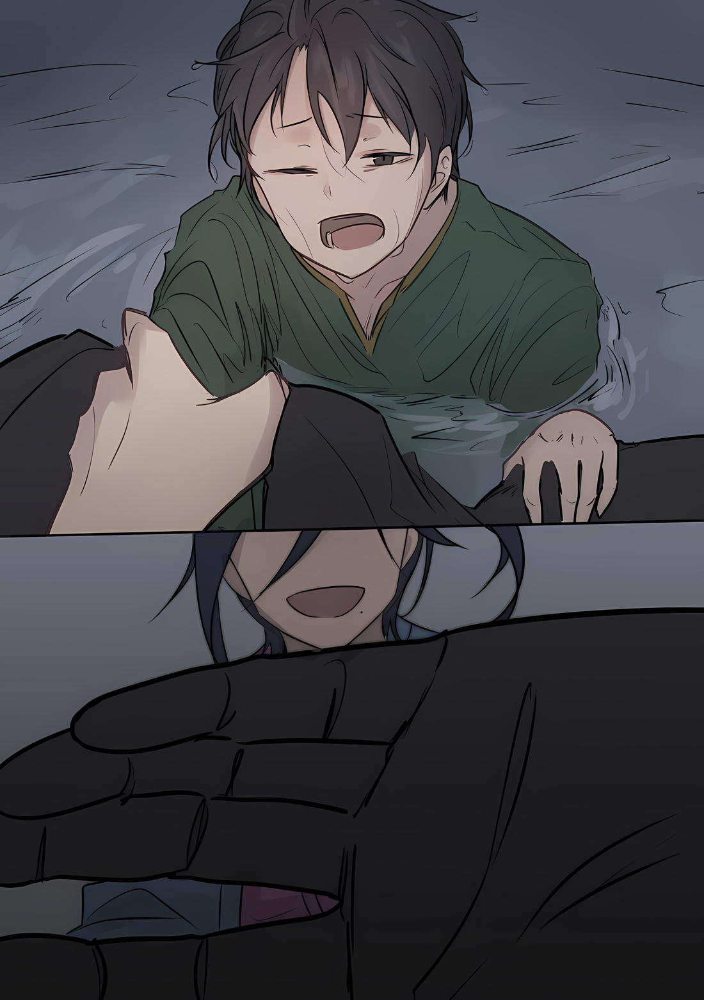

Винсент: ……Йорна Миссигр должна отречься от Города Демонов в попытке уничтожить «Великое Бедствие». «Техника Брака Душ» может преуспеть в этом, но гарантии нет.

Танза: ……Предположим, что Город Демонов был принесен в жертву, но этого оказалось недостаточно….

Винсент: Если это произойдет, «Великое Бедствие», которое невозможно остановить, грозит охватить всю Империю, а возможно, и больше, распространившись за ее пределы. С Городом Демонов в качестве эпицентра.

Танза: …………

Винсент: …………

Танза: Йорна-сама не одобрит отказ от этого города.

Винсент: Это не ситуация для сентиментальности. Независимо от того, хочешь ты этого или нет, город должен быть оставлен. В первую очередь, не мне убеждать тебя в этом.

Танза: Вы верите, что он сможет убедить Йорну-сама?

Винсент: Если он не сможет, все превратится в пыль. Если он должен, он сделает это. Таков уж он человек, он придерживается такого образа жизни с веками.

Танза: ……Я не понимаю. Если вы так много знаете и так уверены в нем, что вы хотите от меня?

Винсент: Ты уже должна знать, что я хочу. Ты молода, но Госпожа Города Демонов может использовать тебя в своих целях.

Танза: …………

Винсент: Если «Великое Бедствие» не будет уничтожено, Йорна Миссигр сильно пострадает. Город Демонов будет использован против «Великого Бедствия», которое еще не развилось в полной мере, но если этого будет недостаточно…

Танза: ……Я…

Винсент: …………

Танза: Йорна-сама… Ради Йорны Миссигр, самой великолепной из всех, дамы, похожей на сострадательную мать, ради этой далекой любви я должна умереть мученической смертью, я полагаю.

Винсент: ――. Это грандиозная затея.

Танза: Я не нуждаюсь ни в утешении, ни в комплиментах. Разве что слезах Йорны-сама.

△▼△▼△▼△

Йорна: ……Не надо!

Танза бежала с голосом Йорны позади нее, та протягивала руку, крича с болезненным выражением лица.

Бросившись вперед, Танза проворно ударила ногами по земле, ее правый глаз пылал красным, ее молодое тело было наполнено силой, с которой не могли сравниться даже тяжелобронированные имперские солдаты.

Она не была выдающимся бойцом, не преуспевала в магии или особых техниках.

Тем не менее, никто не мог остановить ее нынешнюю сущность.

Причина этого заключалась в том, что она осознавала, что любима Йорной, любима больше, чем кто-либо другой.

Она поддерживала Йорну рядом с собой, ее ласкали, с ней разговаривали, ей помогали, о ней думали, за нее молились.

Любить Йорну и быть любимой ею было необходимой квалификацией для получения максимальных преимуществ «Техники Брака Душ»…… и все же любовь Танзы к Йорне была не из корыстных побуждений.

Возможно, кто-то скажет, что любовь не требует ничего взамен, говоря с видом всезнайки.

Однако Танза верила в это. ……Она считала, что чувство любви к кому-то само по себе является наградой.

Мысль об этом человеке и биение его сердца были наградой за любовь.

Тогда Танза должна была ответить взаимностью, всем своим маленьким телом, в ответ на то, что она получила.

Это было именно……

Танза: Причина, по которой мне была дана эта жизнь.

Когда Танза впервые удостоилась аудиенции у Йорны, будучи изгнанной из другого места, она была слишком юна. Спрятавшись за спиной своей доброй старшей сестры, она не могла сделать ничего, кроме как смотреть на Йорну и ее достойное поведение.

Но впервые в жизни ей было обещано, что она сможет прожить свои дни, не подвергаясь ничьей угрозе. Поверив в это обещание, она более чем мимолетно подумала о том, чтобы провести свои дни со старшей сестрой.

Во второй раз, когда она получила аудиенцию у Йорны, после того как ее старшая сестра была украдена, Танза в отчаянии набросилась на Йорну; однако она не упрекнула ее.

Напротив, она искренне выслушала мольбы Танзы и даже помогла отомстить за смерть потерянной сестры. ……Даже если в ответ ее заклеймят как бунтарку.

Почему она не должна любить ее?

Доброго человека, который раньше дал Танзе столько любви и сострадания.

Она плакала о смерти старшей сестры Танзы, сожалела о том, что не смогла выполнить свое обещание, и просила прощения у Танзы.

……Почему она не должна любить ее?

Танза: …………

Перед собой она видела ужасающую, извивающуюся черную массу застоя, собирающуюся за шлейфом дыма.

Город, любимый Йорной, был разрушен, но ее упрямое упорство оставалось непоколебимым. Танзу не пугала тьма, которая заставляла всех отводить от себя взгляд.

Если страх был причиной для того, чтобы дрогнуть, то не он управлял сердцем Танзы.

Поэтому Танза прыгнула вперед, используя обломки как опору, и ринулась в мерцающее «Великое Бедствие».

Если бы она обернулась, это стало бы затянувшейся привязанностью. Она знала, что это, в свою очередь, станет проклятием.

Но……

Йорна: Танза……!

Услышав, как любимый человек зовет ее по имени, взгляд Танзы устремился за спину.

Там она увидела Йорну, лежащую на земле и протягивающую руку. Одна стрела больно пронзила ее ногу; она поняла, что это сделал человек, державший лук далеко от нее.

Если бы не эта стрела, Йорна бросилась бы в сторону «Великого Бедствия», к Танзе.

Танза была благодарна стрелку, так как сама не смогла бы сделать ничего столь радикального.

И тогда……

Танза: ……Йорна-сама.

Ее губы шевельнулись.

Дошли ли последующие слова до Йорны или остались неслышными, она не знала.

Однако в тот момент, как и каждый день перед сном, каждый раз, когда она просыпалась, если у нее было хоть немного времени, она вознесла молитву.

……Пусть вы, моя возлюбленная, будете в добром здравии каждый день.

△▼△▼△▼△

Свет залил все вокруг, белый свет опалил сетчатку глаз.

Когда свет померк, а глаза постепенно восстановили свои способности, все существа стали свидетелями конца Города Демонов.

???: …………

В центре Города Демонов, где должен был находиться Замок Красного Лазурита, зияла титаническая дыра.

Словно рука великана вырыла огромную яму…… буквальный знак, подтверждающий существование страшной сущности, поглотившей весь Город Демонов.

А бедствие, которому противостояли силы согласованной битвы, внезапно исчезло.

Это был результат козырной карты, разыгранной Йорной Миссигр, Госпожой Города Демонов, и все, кто участвовал в битве, знали, что последний толчок был сделан маленькой девочкой, которая поставила на карту свою жизнь.

Другими словами……

???: ……Нас спасла эта девочка. Я в плачевном состоянии.

Это пробормотал человек, заглядывая на дно зияющей дыры, протягивая лозы терна, которыми он орудовал…… Кафма Ирулюкс.

В этих словах не было фальши; вероятно, они были правдой, исходившей из его сердца. Как и подобает воину, стоящему на голову выше остальных, этот честный юноша, придерживающийся философии Империи, упрекал себя за то, что позволил другим исправить свои собственные недостатки.

И еще больше усугубляло ситуацию то, что на это была потрачена жизнь молодой девушки.

Кафма: Изначально я враждовал с вами и вашим народом. Теперь, когда все улеглось, я вижу, что перемирие должно закончиться здесь, и что мы должны повернуть к этому….

???: …Значит, вы будете сражаться с нами?

Кафма: ――. Не получится.

Оглянувшись на большую дыру позади себя, Кафма покачал головой в ответ на вопрос.

Перед Кафмой стояла Медиум, ее варварский меч, слишком большой для ее маленького тела, висел у нее на спине. Вопрос побитой девушки, покрытой грязью, был лучом света, даже среди разрушений.

Этот прекрасный луч света был тем, что, по мнению Кафмы, было необходимо, чтобы не допустить ухудшения ситуации.

Как бы то ни было, в итоге Город Демонов Хаосфлейм был разрушен, и ни одно здание не могло стоять прямо. С этого момента началась борьба выживших за выживание.

Конечно, роль Кафмы как «Генерала» Империи заключалась в том, чтобы разобраться с этими беженцами и с Йорной Миссигр, которая должна была их возглавить.

Кафма: Сейчас я путешествую в качестве телохранителя очень важной персоны. Прежде всего, я должен уделить первоочередное внимание встрече с этим человеком. Все остальное в данный момент мелочи.

Медиум: Мелочи? Вы сказали мелочи? Я думаю, что так говорить — это ужасно!

Кафма: Н-нет, я не это имел в виду….

Получив замечание за беспринципность, Кафма слегка вздрогнул от колкостей Медиум. Но тут мрачный голос окликнул ее: «мисс Медиум», предлагая ему своевременную помощь.

Навстречу им, медленно приближаясь, шла однорукая фигура……

???: Это просто собственная забота того парня. Он говорит, что у него есть более важные дела, поэтому он не будет с нами драться. Так что давай уладим это, так?

Кафма: ……Я сам ничего не могу сказать. Я оставлю на ваше усмотрение, как вы это интерпретируете.

???: Хейхей. Вокруг полно таких, как ты; ну, знаешь, таких круглых, как ты, большой брат.

Пожав плечами в отчаянии, однорукий человек…… Ал — встал рядом с Медиум. Глядя на него, ее глаза расширились со звуком «Ах».

А затем, когда она указала на его лицо,

Медиум: Ал-чин, ты действительно смог найти свой шлем?

Ал: Да, каким-то образом. Он лежал неподалеку от трактира, так что это было замаскированное благословение. Мне просто нужно было найти его, так как я знал, что он не сломается.

Медиум: ……? Ты хочешь сказать, что он прочный?

Ал: Да, я имею в виду прочный. Никто в этом мире не сможет его сломать.

Заявив это, Ал постучал пальцами по черному шлему, который он надел. Медиум кивнула головой со словами: «Правда~?», в ответ, но Кафма резко взглянул на Ала.

Заметив выражение его глаз, Ал наклонил голову и спросил: «Что ты собираешься делать?».

Ал: Ты считаешь, что не хочешь с нами драться, верно? Конечно, то же самое относится и к нам…… Или, возможно, я должен сказать, что мы все слишком измотаны для этого.

Кафма: Ты блестяще руководил нами во время той битвы. Почему ты знал, как будет двигаться «Великое Бедствие»?

Ал: Коммерческая тайна. Если я не скажу тебе об этом, перемирия не будет?

Кафма: ――. Нет, я не откажусь от своего заявления.

Покачав головой, Кафма ответил на слова Ала с неподдельной искренностью. Затем он смахнул рукой пыль со своего потрепанного плаща и повернулся спиной к Алу и Медиум.

Он повернулся к тому, кто, по его словам, был очень важным человеком.

Кафма: Я сотрудничал с вами в этот раз из-за этих событий. Но мы с вами враги… Что бы ты не думал, мы встретимся на поле боя. В это время я не подставлю свою руку.

Ал: Это можно было бы понять и без твоих слов….

Медиум: То же самое касается и нас… Спасибо, что помогли нам.

Кафма: Я лишь сделал то, что должен был сделать как «Генерал» Империи.

С этими словами Кафма расправил свои прозрачные крылья на крепкой спине и улетел одним стремительным движением, при этом биение крыльев издавало громкий шум.

Медиум и Ал смотрели ему вслед, пока он удалялся, облако пыли и дыма окутывало его, вздымая пыль все шире и выше. Как только Кафма скрылся из виду,

Медиум: …Ал-чин, спасибо тебе большое. Правда, спасибо. Ты спас мне жизнь.

Ал: Ну, это беспроигрышная ситуация. Если бы не твоя настойчивость, нападение той большой штуки было бы гораздо более однобоким. Было бы гораздо больше мертвых людей.

Медиум: Мертвых людей…

Услышав ответ Ала, Медиум осторожно опустила глаза.

Глядя на то, как Медиум опускает взгляд с душераздирающим выражением лица, Ал пошевелил пальцами швы козырька своего шлема и сказал,

Ал: Я знаю, что ты не понимаешь, о чем я, и знаю, что это не слишком утешительно, но если бы этот ребенок… Если бы Танза не сделала этого, мы были бы стерты с лица земли. Наверняка.

Медиум: Может быть, мы могли бы постараться.

Ал: Не, этот способ не сработал бы. ……Эксперименты с этим пошли прахом.

Слова удрученного Ала действительно не имели для Медиум никакого смысла. Однако она бы солгала, если бы сказала, что это ее не утешило.

Она понимала, что Ал сказал что-то ради того, чтобы утешить Медиум. Так что это было настоящее утешение.

Медиум: Спасибо, Ал-чин.

Ал: …Не за что.

Слова, которыми Ал ответил, снова не имели для Медиум никакого смысла.

△▼△▼△▼△

???: Ты уже решила, что делать, Йорна Миссигр?

Йорна: …Это вы?

Груды обломков, разрушенные останки зданий и непостижимо большая дыра образовались после ожесточенной битвы.

На уровень ниже Йорны появился человек, пока та стояла на вершине холма, обозревая зрелище шрамов, оставшихся после того, как Город Демонов Хаосфлейм вступил в тотальную войну с «Великим Бедствием».

Абел, лицо которого было скрыто под маской Они, спросил о ее чувствах тоном голоса, лишенным даже намека на эмоции.

Неспешно Абел пробирался через обломки, желая увидеть ту же сцену, что и Йорна; однако, не вкладывая в свой голос никаких эмоций, он заговорил,

Абел: Я могу предложить тебе то, что написал в письме. Давай же послушаем твой ответ.

Йорна: Неужели это действительно то, что вы должны сказать, глядя на эту трагическую сцену?

Абел: Даст ли приют утешение или убежище — жалость? Мы с тобой родились среди имущих, среди тех, кто выбрал свой долг. Поэтому секунда от нас не равноценна секунде от других.

Йорна: …………

Не желая ни утешения, ни сочувствия, он был тем, кто выбрал такой способ существования.

Понимая это, Йорна сдержалась, чтобы не восстать против его отношения. Самое главное, Йорна ничего не получит, если будет враждовать с ним по эмоциональным причинам.

Йорна: Я и так слишком много потеряла сегодня.

Абел: Город, его жители. Было бы ошибкой добавлять к ним время, которое ты потратила на откладывание этого дела.

Йорна: Ей была… Танза.

Абел: …………

Йорна: Любимое дитя, которое пожертвовало собой, чтобы спасти нас в конце… Ее звали Танза.

С этими словами Йорна вытащила из своего кимоно брошь и показала ее Абелу.

Абел бросил на нее косой взгляд, пока та чистила ее круговыми движениями, безмолвно сомневаясь в ее намерениях. Внешний уголок глаз Йорны слегка опустился из-за этого вопросительного взгляда,

Йорна: Этот сувенир был сделан из рогов старшей сестры той девушки. Когда Танза оплакивала труп своей сестры, она сделала его для меня… и кроме этого.…

Абел: …………

Йорна: И эти заколки — подношения от моих любимых детей. Это знаки тех детей, которые были изгнаны из своих домов, тех детей, у которых ничего не было, и они отдали себя, чтобы отплатить мне.

Разноцветные украшения и заколки — все это были подношения от жителей Города Демонов.

Кто-то снимал чешую, кто-то собирал перья, кто-то полировал рога и клыки, чтобы потом предложить их Йорне — их образ жизни и благодарность придали им форму.

Для Йорны они были ценнее всех драгоценных камней и сокровищ, и, получив их, она чувствовала, что должна оправдать их любовь.

И все же……

Йорна: Я не могу позволить себе больше ошибаться в своих обещаниях….

Абел: ――. Рано или поздно, ушедший Винсент Волакия и его группа начнут движение. Они не будут оставаться здесь, учитывая ситуацию, но это лишь вопрос времени. Которого у нас нет в запасе.

Йорна: Что вы решили с местом, где будут жить мои дети?

Абел: У нас не будет другого выбора, кроме как использовать город-крепость в качестве базы. По пути мы захватим другие города и присоединим их к нашему знамени. С тобой и жителями Города Демонов это возможно.

С потерей факультетов Города Демонов необходимо было найти место, где можно было бы принять оставшихся жителей.

Предложение Абела было силовым, абсурдным, навязывающим другим неразумное. Но у Йорны были схожие приоритеты. Спасти тех, кого она любила.… такова была Йорна.

А кроме этого……

Йорна: Вы уверены, что действительно готовы выполнить мое желание, которое было в вашем письме?

Абел: Я не намерен говорить об этом дважды. Однако ты должна тщательно обдумать его.

Йорна: Обдумать….

Абел: Что для тебя важнее — твое давнее желание или твоя собственная «любовь»?

С Абелом, чьи эмоции не были видны, Йорна не могла сказать, были ли его слова, или, скорее, то, что казалось его советом, даны из благосклонности или неблагосклонности.

Но Йорна, пораженная его словами, сняла с пояса кисэру, закрепила пальцем его кривой кончик, подожгла и выпустила пурпурный дым.

Внизу близкие Йорны обшаривали разрушенный город, собирая свои жизни, те части, которые поддерживали их, готовясь к тому, что последует дальше.

Йорна должна была дать им приют и стать светом, указывающим им путь в завтрашний день.

Дать Абелу преимущество и вытащить Винсента Волакию…… нет, фальшивку, выдававшую себя за него…… с трона и заставить его выполнить обещание, данное в его послании.

И о содержании обещаний, которые должны быть выполнены……

Йорна: ……Разве не родители умирают первыми, Танза?

И вот, любимое дитя, решившее свою судьбу, исчезло, подобно фиолетовому дыму на быстротечном ветру.

△▼△▼△▼△

Наблюдая издалека за поднимающимся фиолетовым дымом, она поприветствовала человека в маске Они, когда тот вышел из-под него.

Тот, кого приветствовали, Абел, слегка фыркнул при виде неподвижно стоящей Таритты,

Абел: Если тебя беспокоит простреленная нога, то это не более чем ненужное беспокойство. Рана уже начала заживать. К завтрашнему дню она полностью восстановится.

Таритта: ……Я рада этому. Но я беспокоилась не об этом.

Абел: Хо?

Как и говорил Абел, то, как стояла Йорна, не выдавало какого-либо физического дискомфорта. Ее кимоно и взъерошенные волосы, если смотреть со спины, выдавали усталость, но правая нога, пробитая стрелой, выдавала другую ауру.

Это само по себе было, возможно, преимуществом тайных искусств, которыми она манипулировала. Однако результат нанесения раны был тяжелее, чем сама рана.

Конечно, Таритта прекрасно осознавала эту тяжесть.

Таритта: …………

В тот последний момент, когда ей доверили выбор, Таритта сама оставила решение за стрелой.

Если следовать заповеди Мариули как «Звездочета», Таритта должна была прострелить Абелу сердце этой стрелой. Правда, это была самая многообещающая возможность среди всех вариантов Таритты, хотя трудно было представить, какая причинно-следственная связь привела бы к тому, что это помогло бы устранить «Великое Бедствие».

Но если учесть, что Мариули, которая была ей так дорога, превратилась в неведомое ей существо, подчинявшееся лишь звездам, это решение ничем не отличалось от решения оборвать собственную жизнь.

……В конце концов, именно этот момент заставил Таритту принять это решение.

Таритта ненавидела звезды, изменившие Мариули. Поэтому она не следовала за ними.

Возможно, простое следование заповедям хорошо сочеталось бы с характером Таритты… ей нравилось, когда ей говорят, что делать, когда ей указывают путь, когда она находится под чужим влиянием.

Однако встреча Таритты со звездами была неудачной.

Если бы звезды с самого начала говорили с Тариттой, а не с Мариули, Таритта, возможно, жила бы для звезд. Но этого не случилось.

Поэтому……

Таритта: ……В этот момент я помогла той девушке-оленихе, которая бежала, не раздумывая.

В результате девушка каким-то образом породила свет, который затем уничтожил «Великое Бедствие» изнутри.

В обмен на это жизнь молодой девушки исчезла, а ущерб, нанесенный земле, на которой когда-то стоял Город Демонов, был немаленьким. Однако можно было заявить, что она смогла защитить то, что хотела защитить.

Абел: Но, несмотря на это, ты не выглядишь такой довольной.

Таритта: ……Я была права, не так ли? Не следовать заповеди и не стрелять в вас.

Абел: Как будто я, находясь на месте того, в кого не стреляли, сказал бы тебе, что ты должна была выстрелить. Насколько правильным или неправильным было твое решение, не входит в круг того, о чем я должен говорить. Как бы банально это ни звучало, правильность твоего выбора может быть доказана только твоими собственными действиями в дальнейшем.

Таритта: ……Эти слова, я не думаю, что они принадлежат вам.

Абел: Верно. «Айрис и Терновый Король». ……Цитата из классики.

Заговорив о том, чего Таритта не понимала, Абел покачал головой в сторону, заявив: «Тебе не нужно это понимать».

Затем он оглядел Таритту сверху донизу,

Абел: Возможно, ты и сейчас испытываешь некоторый трепет, но, похоже, ты в какой-то степени справилась с ним. Теперь, что ты будешь делать?

Таритта: Точно я не знаю. Я просто хочу вернуться в тот город и поговорить с моей сестрой и моим народом. Я бы хотела поговорить с дочерью моей уже покойной сестры-души.

Абел: Сестра-души, которая оставила тебе заповедь, понятно…… Теперь понятно, почему ты сама не «Звездочет». Все более отвратительная компания.

Таритта: Отвратительная….

Абел: Ты не та, о ком я говорил. Я понял твой общий план.

Абел повернул голову в ответ на бормотание Таритты.

Большое количество людей вышло на улицы, превратившиеся в руины, собирая домашнюю утварь, которая не пострадала, а также материалы, которые можно было использовать для каких-то целей, и начали расставлять приоритеты, чтобы выжить.

Таритта была поражена стойкостью образа жизни, которого придерживались жители Города Демонов.

Вспоминая происхождение Города Демонов, они, вероятно, привыкли к преследованиям, угнетению и потерям. Даже если принять это во внимание, так оно и было.

Однако….

Таритта: Эти люди, вы собираетесь втянуть их в свой бой?

Абел: Верно.

Невольно Таритта почувствовала себя обескураженной из-за этого короткого, повершительного ответа.

Колебаний не было; Абел оставался верен своей первоначальной цели прихода в Хаосфлейм, наблюдая за людьми, которые переступили через свои принципы, идя по земле разрушенного города,

Затем……

???: ……Хотя мнение Абела-чан может быть правильным, интересно, будут ли люди вокруг него так спокойно подчиняться? Даже лисичке будет трудно эмоционально быть на нашей стороне, верно?

Выражая разумное мнение, Ал присоединился к Абелу и Таритте.

Некоторое время его не было видно, но, судя по тому, как он водрузил на голову свой привычный шлем и вяло пошел к ним, казалось, что к нему вернулось что-то помимо его обычных размеров.

Рядом с Алом стояла Медиум, которая смотрела на Абела своими круглыми голубыми глазами

Медиум: Я чувствую то же самое, что и Ал-чин. Я была бы счастлива, если бы Йорна-чан была на нашей стороне, но после того, что случилось с Танзой-чан и городом, я не уверена, что она захочет участвовать в этом.…

Абел: Ты хочешь сказать, что Йорна Миссигр не должна следовать за нами, теми, кто привел с собой существо в центре катастрофы? Эта идея слишком сентиментальна. Она уже приняла решение.

Медиум: Правда? Абел-чин, ты не сказал ей снова что-то ужасное?

Абел: Независимо от того, насколько кто-то бессердечен, я скажу то, что должно быть сделано. Мои намерения чисты.

Щеки Медиум надулись, когда Абел отказался отрицать заданный ею вопрос.

На самом деле, судя по тому, что уловила Таритта, обмен мнениями между Абелом и Йорной не был эмоциональным, но также не был и нежным, спокойным и ласковым.

Тем не менее, причина, по которой Абел не сомневался в намерениях Йорны, заключалась в следующем,

Ал: Ты готов воспользоваться слабостью мисс Йорны…… В конце концов, если она не идет по тому же пути, что и мы, она не сможет защитить жителей города, которым больше некуда идти, верно?

Медиум: Боже правый…! Опять твои бессердечные слова, Абел-чин.

Абел: Какой у них еще есть выбор? Единственный оставшийся для них вариант — это продолжать свое бессмысленное упрямство и умереть собачьей смертью.

Медиум: Нет другого выхода, но есть другой способ сказать это! Почему ты этого не понимаешь?

Абел устремил холодный взгляд на Медиум сквозь маску Они, а та, повысив голос, требовала от него ответа.

Таритта была совершенно уверена, что Абел бездумно отнесется к жалобам Медиум, но ее собственные чувства были схожи с ее эмоциями.

Однако, пока он следовал завету между Императором прошлого и «Племенем Судрак», Таритта не могла отказаться от Абела и разорвать их отношения.

Союзники по чувствам не имели никакого значения на реальном поле боя.

Ал: Ты права, что сердишься, мисс Медиум. Однако мне лично не нравится идея Абела использовать все, что можно. Я бы не возражал, если бы мисс Йорна отправилась с нами только в утилитарных целях.

Медиум: Говорю тебе, у меня много возражений против этого. Я тоже ненавижу тебя, Ал-чин!

Ал: У меня сердце болит от того, что мисс Медиум меня ненавидит. Но это неважно….

Прервав на этом свою фразу и не давая Медиум, которая смотрела на Абела и на него самого, оглянуться, он окинул взглядом окрестности, обратив свое внимание на большую дыру в центре разрушенного участка.

Как только это движение привлекло внимание Таритты и остальных, и, повернувшись к нему, он произнес:

Ал: Давайте поговорим об одном из наших. ……О брате.

Все: …………

Когда Ал затронул эту тему, пересохший воздух стал еще более сухим.

Это была тема, о которой, как они все знали, нужно говорить, но в то же время, это то, из-за чего они все чувствовали себя немного неловко, думая, что сказать.

Во всяком случае……

Медиум: Субару-чин, куда ты пропал…?

Мрачное бормотание Медиум говорило о том, что «Великое Бедствие» нанесло ущерб меньшего масштаба.

По сравнению с тем, что один из крупных городов, которыми гордилась Империя, полностью исчез, а жизни двух Императоров были поставлены под угрозу, этот ущерб можно было назвать довольно незначительным.

Однако для группы, пришедшей в Город Демонов, это был ущерб, который нельзя было не заметить.

Медиум: Йорна-чан сказала, что от Субару-чина исходили тени.

Ал: Старик Ольбарт тоже так сказал. Он улыбался, несмотря на то, что его правая рука исчезла. Его поведение, для меня, как человека у которого давно нет одной руки, было противоестественным.

Таритта: Ты имеешь в виду отношение старика? Или то, что он сказал?

Ал: Это огорчает, но я говорил о его отношении. Что касается того, что он сказал, я уверен, что это правда.

Щелкнув языком, Ал сказал, что доверяет показаниям Ольбарта.

У Таритты тоже не сложилось хорошего впечатления о чудовищном старике, но было верно и то, что у него не было причин лгать. Пока то, что он говорил, совпадало с тем, что сказала Йорна, так что, это, скорее всего, было правдой.

Внезапно Таритте пришло на ум воспоминание о последней воле и завещании Мариули: «Путник, с темными волосами и темными глазами».

Когда она впервые увидела Субару в лесу и устремилась отнять его жизнь, у нее не было никаких сомнений на его счет. Позже, когда она узнала о существовании и личности Абела, о том, что он заперт в деревне, она посчитала, что без сомнения ошиблась в своем противнике, но….

Таритта: А что если….

А что, если именно Субару, а не Абел, был виновником «Великого Бедствия», предсказанного Мариули как «Звездочета»?

Возможно, именно поэтому «Великое Бедствие» разразилось с Субару в центре.

Такие сомнения не давали покоя сердцу Таритты.

Абел: Есть одна вещь, в которой мы должны объединить наши взгляды.

Таритта отвлеклась от своих переживаний, когда Абел поднял палец в центре группы.

Привлекая их внимание, Абел осмотрел лица Медиум, Ала и Таритты соответственно, а затем объявил:

Абел: Судя по тому, как ты говоришь, в выживании Нацуки Субару ты не сомневаешься. Ты всерьез веришь, что он выжил после той ужасной сцены?

Медиум: ……Кх, конечно! Его смерть — это что-то……

Абел: Не говори ничего такого, что ты не хочешь об этом думать. Даже если тебе трудно с этим смириться, то, что должно произойти, произойдет. Жизнь и смерть других людей проходит по тонкой грани.

Медиум: Абел-чин……

Фактический тон Абела столкнулся с эмоциональной настойчивостью Медиум.

Что касается Таритты, то и здесь ее чувства склонялись в сторону Медиум. Но она не надеялась, что Субару мог выжить, ведь он был в самом центре этой катастрофы.

Возможно, это было связано с тем, что ее повседневная жизнь проходила на охоте, в контакте с жизнью и смертью живых существ.

Племя Судрак были храбрыми воинами, но даже обычные охоты были смертельно опасны. Иногда звери сопротивлялись в предсмертных муках, и ее спутники теряли свои жизни.

Люди умирали. Легко. Были ли эти люди важными или нет, не имело никакого значения.

Таритта: К сожалению, Субару….

Ал: Брат жив.

Медиум: ……Ал-чин!

Покачав головой, Таритта попыталась выразить свои соболезнования. Но ее слова были прерваны словами Ала, полными убежденности; услышав их, лицо Медиум озарилось.

Естественно, Абел обратил свой взгляд, который, казалось, был в плохом настроении, на Ала.

Абел: Клоун, почему ты так уверен в его выживании?

Ал: Просто и ясно, потому что Нацуки Субару такой парень. Вернее….

Абел: Вернее?

Ал: Мир не был разрушен. Это мое основание.

Таритта не могла полностью воспринять обоснование и логику, которую изложил Ал. Похоже, то же самое было и с Медиум, которая тоже наклонила голову с выражением непонимания.

Абел тоже оборвал его одним махом, дословно сказав ему: «Хватит быть дураком»,

Абел: У меня нет времени слушать твои глупости. Если ты хочешь быть клоуном, делай это рядом с Присциллой.

Ал: Я бы с удовольствием это сделал, но, к сожалению, принцессы здесь нет. Говоря об этом прискорбном факте, я хотел бы попросить о том же тебя, Абел-чан.

Абел: Что?

Ал: Что ты думаешь, Абел-чан? Ты веришь, что брат мертв?

Коснувшись подбородка своего шлема, Ал поинтересовался у Абела, что тот думает. Его мнение, однако, казалось незыблемым. Именно он изначально начал допрос в таком тоне, сомневаясь в их здравом уме, что Субару еще жив.

Естественно, для него вера в то, что Субару, который находился в самом центре «Великого Бедствия», выжил….

Абел: ……Поскольку это не было «Великим Бедствием», роль, которую он должен выполнить, остается. Если он обладает способностями для этой цели, было бы преждевременно считать его мертвым.

Таритта: Хм….

Медиум: Абел-чин!?

Но то, что Абел заявил на самом деле, было противоположно тому, что ожидала Таритта.

Ответ заставил Таритту потерять дар речи, и даже Медиум, которая должна была получить ответ, который она искала, округлила глаза от удивления.

Однако Абел, не встретив взгляда Таритты и остальных, сразу же развернул свое тело и медленно пошел прочь от этого места.

Оглянувшись друг на друга, Таритта и Медиум последовали за ним. Ал тоже шел за спинами этих троих, склонив голову в недоумении.

Медиум: Абел! Что ты имеешь в виду, объясни уже!?

Абел: Что тебе нужно объяснять?

Медиум: Все! Всего минуту назад ты говорил так, будто Субару-чин мертв, вот почему!

Абел: Я сказал, что если вы не верите в его смерть, то вам нужно привести хоть какие-то аргументы, кроме эмоциональных. Я верю, что у него есть причина выжить. Вот почему я думаю, что он выжил. Конец истории.

Медиум: ~~Кх!

Ответ Абела, лишенный доброты, заставил Медиум покраснеть и выразить недовольство. Это тоже не произвело на Абела никакого эффекта; он даже не оглянулся.

Пройдя некоторое время, ноги Абела с троицей на буксире, наконец, остановились. Они сделали это прямо перед огромной дырой, образовавшейся в результате «Великого Бедствия», где когда-то стоял Город Демонов.

И там….

???: Уау….

Там, скрючившись на краю дыры, сидела маленькая девочка…… Луис, свесив голову вниз.

Ее белая одежда была полностью испачкана, и она слабо разгребала землю голыми руками. Ее руки были в грязи, но также было заметно, что они окрасились в красный цвет из-за кровоточащих сломанных ногтей.

Медиум: Луис-чан…!

В панике Медиум подбежала к Луис и обняла девочку сзади; даже в объятиях ее руки все еще не останавливались.

Ударяя руками по земле или отталкивая обломки, девушка продолжала что-то искать. ……Нет, не что-то.

Таритта: Она ищет Субару….

Ал: К лучшему или к худшему, я думаю… Тц, но мне это не нравится.

Наблюдая за спиной маленькой Луис, Таритта и Ал выдохнули, каждый о своем.

Таритта не знала, что отношение Ала к Луис стало ужасно раздражающим. Однако именно Ал защитил Луис от последнего удара, того самого, который уничтожил «Великое Бедствие». Поэтому Таритта не могла точно определить, какие отношения связывали их в этом отношении.

А выяснение этого вопроса сейчас, вероятно, никого не обрадует. Она имела смутное представление, но ведя себя так, словно не слушала, о чем шла речь.

Абел: Хватит уже. Копание в грязи и поиски под обломками не помогут тебе найти то, что ты ищешь.

Луис: У… Аау!

Пока Медиум обнимала Луис, Абел стоял позади нее. Повернув голову, чтобы увидеть направленный на нее взгляд маски Они, Луис сделала лицо, которое нельзя было назвать ни гневом, ни печалью.

Казалось, оно одновременно осуждало Абела и призывало его не останавливать ее.

Абелу было все равно, если бы это было первое, а если бы даже и второе, то его слова были бы услышаны. Так что он выпятил подбородок в направлении большой ямы, расположенной сбоку от Луис….

Абел: Его обнаружение потребует от тебя больших усилий. По крайней мере, твои шансы найти его малы, пока ты продолжаешь в одиночку пробираться через грязь. ……Кроме того, ты даже не знаешь, куда его унесло.

Луис: Ау! аау! Уаууа!

Абел: Ты можешь продолжать его поиски, как простачка, но ты никогда его не найдешь. Эта мысль должна придти тебе в голову.

Луис: Уу! Ууу!

Хладнокровные слова Абела заставили Луис покраснеть и открыть рот в яростном протесте.

По ее энергичному и гневному взгляду было видно, что она никогда не откажется от поисков Субару, и что она очень хочет непременно его найти.

И тут……

Медиум: Абел-чин, есть ли способ найти Субару-чина?

Луис: У, у?

Медиум: Ты только что сказал, что Луис-чан не сможет найти Субару-чина в одиночку. Есть ли у тебя на примете лучший способ как поступить? Или его не существует? Есть ли у тебя такой?

Пока Медиум задавала вопрос Абелу, глядя ему в глаза, она не могла успокоиться из-за слов последней. В то время, как Луис не могла успокоиться из-за слов Медиум, Абел закрыл один глаз,

Абел: Ты не очень проницательна, но у тебя хорошая интуиция, не так ли? Вы с братом как две капли воды похожи.

Медиум: Конечно, ведь мы с братухой — брат и сестра. Что еще важнее, ответь мне! Есть ли способ найти Субару-чина? Есть? Есть!?

Ожидания раздувались, а Медиум снова и снова задавала один и тот же вопрос. Вздохнув, когда она подалась вперед, Абел сделал небольшую паузу, а затем добавил,

Абел: Это не такой правильный метод поиска. Первоначальной целью было бы не найти исчезнувшего человека, а найти предлог для того, чтобы устроить беспорядки в Имперской Столице.

Медиум: Сделай свои слова более понятными!

Абел: ……Если этот план сработает, то ваше с этой девушкой желание может исполниться. В конце концов, вся Империя начнет поиски одного человека.

Таритта: Вся Империя будет искать Субару……?

Уловив интригующую часть слов Абела, Таритта нахмурила брови.

Как и Медиум, Таритта была не самым проницательным человеком. Разница была лишь в том, что Медиум говорила вслух то, что она не понимает того, чего не понимает, а Таритта держала это в себе.

В любом случае, объяснение Абела, которое он попытался озвучить в доступной для понимания форме, Таритта не совсем поняла из-за своей неосведомленности.

Однако……

Луис: ……Уау, ауау?

Смысл этих слов был понятен только тому, кому они были адресованы.

Луис, которая была на грани вспышки ярости, расслабилась в объятиях Медиум, и, глядя на неподвижного Абела, она задала вопрос без использования языка.

В ответ Абел кивнул, произнеся: «Конечно». Хотя, вероятно, он не знал его точного значения.

Ал: Так что же нам делать? Как мы можем осуществить этот план по поиску брата?

Абел: Ничего сложного, просто распространяйте информацию.

Медиум: …………

Абел ответил на вопрос Ала, и Медиум снова резко взглянула на него. Затем он вздохнул, как бы предвидя упреки, которые последуют со стороны Медиум, и продолжил.

Сказав….

Абел: Что незаконнорожденный сын Винсента Волакии, черноволосая, черноглазая мерзость, стремится занять место своего отца. Очень похоже на реконструкцию «Гильотины Магризы».

△▼△▼△▼△

……В тот же день, в то же время, в определенном месте.

???: ……Кх

Он с силой толкнул мокрое тело вверх, приближая себя к земле, за которую едва цеплялись пальцы. Если бы он хоть на мгновение отпустил это чувство, тело было бы не вернуть.

Этот человек был буквально в смертельной борьбе… нет, скорее, в жизненной борьбе.

Черная вода, в которой не было никакого укрытия, сильно снижала температуру тела и выносливость, и много раз ему казалось, что он терпит до последнего. Он не мог понять, сон это или реальность.

Ему казалось, что его снова и снова кусает большая рыба, скрывающаяся под водой. Он чувствовал себя так, будто утонул, при этом ощущал вкус крови, внутри легких была едкая вода, он не мог дышать. Бывало, что он терял сознание от переохлаждения или недостатка выносливости, его жизнь угасала во сне.

И вот, повторяя это, накапливая это, барахтаясь, наконец, он……

???: Бхаа, фааааф.…

Он тащил тело на берег, кашляя от воды, которую проглотил. Это было тяжело, мучительно и больно. От всего сердца он желал использовать обе руки, чтобы облегчить ситуацию. Однако он не мог этого сделать.

Правая рука, которая вцепилась в берег и левая рука, в которой было что-то, что он никак не мог отпустить.

Он терпел неудачи снова и снова, прежде чем понял его сущность. В конце концов, он отпустил его.

Однако, когда он понял, что это такое, он совершенно не мог это отпустить. Он уже накопил множество ошибок; и все же он не сдался……

???: …………

Прежде чем сделать это с собой, он вытолкнул на берег того, кого обхватывал в левой руке.

Несмотря на небольшой размер, оно было довольно тяжелым. Тот факт, что тот, кто нес, был не в лучшем состоянии, и что ни один из них не был снаряжен для плавания, был прискорбным.

Тем более, что на ней было кимоно, а в нем больше ткани, чем в обычной одежде. Значит, оно впитает больше воды.

Он надеялся, что она простит его за то, что он снял часть ее кимоно по пути, чтобы сделать ее легче.

Что-то резко уперлось ему в бока и затылок, когда он потянул ее к себе. Причиной тому были великолепные рога, растущие из ее головы. ……С такой болью он предпочел бы, чтобы она истолковала это как то, что они поквитались.

Оставалось только……

???: Ахх, гах…!

Он подтолкнул девушку к берегу, и теперь оставалось только собрать последние силы и вытащить себя на берег.

Однако, возможно, из-за того, что нить напряжения оборвалась, как только девушка оказалась на берегу, он не смог собрать последние силы, и его руки лишь безрезультатно царапали сушу.

Мотающаяся голова и звон в ушах укоряли его, давая понять, что он не может оставаться в прежнем состоянии.

Это было предзнаменование того, что его сознание угасает. А потеря сознания здесь означала «Смерть».

Если напряжение прервется, а сила воли, необходимая для достижения чего-либо, пропадет, он застрянет в повторении сна и реальности, чтобы снова обрести эту удачу.

Что угодно, только не это, подумал он, прилагая все больше, больше и больше усилий, чтобы оживить свое сознание.

Его сознание ослабевало. В конце концов, рука отпустила берег….

???: ……Ой, осторожно.

В этот момент, когда он ослабил свою хватку за берег и снова погрузился в воду, кто-то ухватился за эту руку.

Крепкие тонкие пальцы обхватили запястье, вытягивая его тонущее тело на берег. Его лицо вынырнуло из воды, когда он задыхался, и, прежде чем потерять сознание, он посмотрел на человека перед ним.

Однако кто именно поймал его за руку……

???: Не, давай без этого. Ты ведь в любой момент можешь потерять сознание, верно? Это было бы не очень хорошо, если бы так произошло. Получив такой шанс, я бы предпочел начать все в более драматичной манере.

Рука, противоположная той, что держала его, прикрыла ему глаза, когда он попытался разглядеть собеседника. То, что он увидел, было не более чем морщинами на ладони другого человека.

Рука неизвестного человека с необычайно длинными линиями ладони.

Это было последнее, что он увидел, и его сознание угасло….

???: Однако, молодец, что доплыл сюда! Действительно, такое странное совпадение, идя туда, куда нес меня ветер, я оказался здесь! Боже мой, боже мой, очень мило, не правда ли!?

Подхваченный угасающим сознанием, веселый голос сопровождал его до самого конца пути.

Этот голос, почти похожий на задорный раскат грома.

???: ……Разве у тебя нет ощущения, что сейчас начнется великая история?

С этим безответным вопросом, его сознание…… сознание Нацуки Субару, было потеряно без ответа.

Арт от Pazspi_
