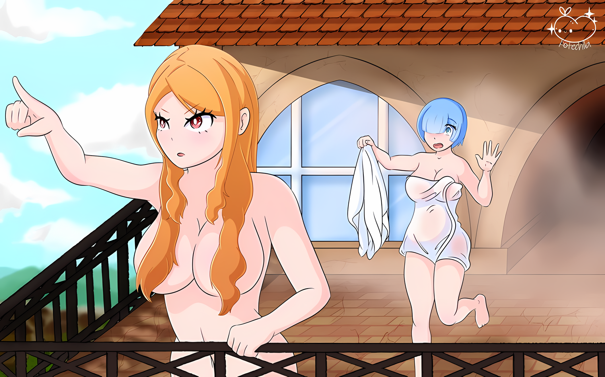

……Пронзительно голубое небо бросает величественный взгляд на деятельность людей снизу.

Блестящее белое солнце, большие белые облака медленно плывут по небу.

Теплый ветерок ласкал ее шею и ерошил бледно-голубые волосы, которые глубоко и спокойно дышали.

Чувствуя мир всем телом, она осознавала себя его частью.

Это была довольно претенциозная фраза, и чувствовалось, что кто-то произнес очень сложное. Однако, получив ответ, что в данный момент от неё требуется именно это, она сначала применяла это на практике, а сомнения отбросила на потом.

Кроме того, она сама попросила, чтобы ее научили этому. Это были еще первые дни. У нее был не тот темперамент, чтобы заставить ее же отказаться от этих уроков.

Хотя……

???: ……Я не могу лгать о своем нетерпении.

Мягко положив руку на грудь, она ждала, когда вдыхаемый ею воздух начнет действовать в легких.

Она не могла понять, будет ли это чувство питать ее изнутри. Оно разочаровывало и вызывало чувство ненависти к собственной мелочной натуре, стремящейся к мгновенному удовлетворению.

……Нет, возможно, дело было не в том, что в ее природе было стремление к немедленным результатам, а скорее в ситуации, в которую она попала.

Не ее собственная, а кого-то другого, кто пытался выполнить свою роль в другом месте……

???: ……Ах! Вот вы где!

И тут позади нее раздался голос, обращенный к ее тихой медитирующей спине, напомнив ей о дыхании, которое она задерживала. Выдохнув воздух, скопившийся в груди, она оглянулась и увидела маленькую фигурку, бегущую к ней.

Это был маленький мальчик с пушистыми розовыми волосами. Он был таким неуверенным ребенком с милым личиком, вишнево-красными щечками и ослепительно белыми голыми ножками в коротких штанишках.

Когда подошел мальчик, которому на вид было лет одиннадцать или двенадцать, улыбнулся.

Мальчик: Присцилла-сама хочет видеть тебя! Я бы хотел, чтобы ты пошла со мной!

???: Поняла. Благодарю за беспокойство, Шульт-сан.

Шульт: Ни в коем случае! Это не то, что заслуживает такой благодарности.

Ведя себя скромно, его щеки раскраснелись от восторга, уголки рта мальчика… рта Шульта опустились из-за обстоятельств.

Но дело, которое он принес с собой, было поручением. Они не могли просто продолжать разговаривать и улыбаться, помня об этом.

На этой ноте он напряг свои расслабленные щеки и кивнул с небольшим выдохом, а затем……

???: Так что, пойдем вместе?

Шульт: Да, конечно! Я присоединюсь к вам, Рем-сан!

Подпрыгивая, Шульт отсалютовал ей рукой, а девушка…… Рем, несколько удивленная энергичностью Шульта, кивнула, и они вдвоем направились к тому, кто ее позвал.

К Присцилле Бариэль, временному хозяину Рем в Городе-крепости Гуарал.

△▼△▼△▼△

Падение Города-крепости Гуарал…… Прошло около десяти дней с момента проведения этой ужасно абсурдной операции, в результате которой город был захвачен с минимальными человеческими жертвами.

К счастью, в городе почти не было хаоса, во многом благодаря способностям Зикра Османа, командира Имперских солдат, и лидерству Мизельды, чье влияние не уменьшилось даже после передачи роли вождя своей сестре.

Присутствие этих двоих оказывало влияние на тех, кто был наделен военной мощью, предотвращая беспорядки и трагедии.

Конечно, в городе присутствовали не только те, кто мог сражаться.

Скорее, подавляющее большинство присутствующих составляли горожане, которые были далеки от военного дела. Однако, даже если они не зарабатывали на жизнь боями, горожане Гуарала все равно находились в гуще событий.

Вначале появились сообщения о сильном презрении к Зикру и Имперским солдатам, поскольку они были лишены реальной власти после того, как ратуша была захвачена практически без боя.

Однако вскоре подобные жалобы горожан были заглушены.

Это было потому……

Присцилла: В Империи принято следовать за сильным. Всем должно было быть очевидно, что мои действия были более праведными, чем действия людей, которые занимаются только прихожей.

Рем: Это….

Присцилла: Это слова тех, кто недостоин быть услышанным, или, возможно, тех, кто склоняет голову, перенося бурю, громко кричит, когда ветер стихает, требуя, чтобы их обители были отремонтированы. Стоит ли чего-нибудь слово такого человека?

Рем: Как ни крути, такая крайность, на мой взгляд, несправедлива.

Это была не простая позиция, а способ говорить о том, кто смотрит на другого свысока, занимая более высокое положение. В ответ на такой способ, Рем дала спокойный ответ.

Перед ее ответом возникла пауза, а затем последовал легкий смешок,

Присцилла: Ты оскорбляешь меня как трусиху? Я вижу, ты очень смела, Рем.

Рем: Это было бы безрассудно, если бы на кону стояла моя жизнь. Но Присцилла-сан не настолько вспыльчива.

Присцилла: Ты смеешь оценивать меня по своим меркам?

Рем: Потому что, для начала, мне больше не с чем мерить.

Багровые глаза смотрели на нее, но Рем упорно опровергала их.

Для Рем, потерявшей память и не имевшей настоящего прошлого, каждая вещь, которую она видела, была новой, каждое действие, которое она совершала, было неизвестным опытом.

Бояться чего-то, что в результате может вызвать недовольство Присциллы, означало неспособность сделать шаг вперед. Для ее нынешнего «я», чье существование началось примерно двадцать дней назад, было несомненно то, что за эти последние несколько дней Рем смогла провести время с женщиной перед ней, не теряя присутствия духа.

Поэтому….

Присцилла: Хмф, что за мелочность. Милая девчонка.

Сказав это, она зарыла топор войны, не обманув ожиданий Рем.

Хотя Присцилла иногда действовала абсурдным образом по непонятным для Рем причинам, ее впечатление о Присцилле сводилось к тому, что это разумная женщина, которая держит свои бурные высказывания при себе.

Присцилла сидела в роскошном кресле, положив подбородок на руку, с раскрытой книгой на коленях. Она выглядела весьма живописно, вела себя так, словно была хозяйкой этого дворца или, возможно, особняка, хотя это было лишь временное пристанище.

Присцилла, в данный момент пребывавшая в Городе-крепости, заняла самый большой особняк в городе и неторопливо проводила там дни. Он, не считая ратуши, был самым большим зданием в городе; роскошная растрата пространства, в которой могли разместиться от двадцати до тридцати человек.

Конечно, первоначальные владельцы особняка выразили протест по поводу захвата, но все было улажено в духе Империи…… варварским способом, сопровождавшимся пролитием крови.

Другими словами, для того, чтобы заставить каждую сторону признать свои претензии, использовалась сила….

Рем: …………

Рем быстро перевела взгляд в один из углов комнаты.

В комнате, где Присцилла созвала и собрала тех, кто находился в положении слуг, кроме Рем и улыбающегося Шульта присутствовал еще один человек.

Это был тот самый человек, который размахивал мечом во время «Дуэли» за управление особняком.

Рем: Хейнкель-сан.

Хейнкель: ……что?

Рем: Ничего, мне показалось, что вы смотрите на меня как-то многозначительно, вот я и подумала, что что-то не так.

Человек, ответивший на зов Рем низким голосом, сделал угрюмое лицо из-за повторных вопросов. При этом он бурно почесал свои красные волосы.

Хейнкель: Ничего страшного. Я просто был ошеломлен тем, что ты такая безрассудная девчонка и так разговариваешь с госпожой Присциллой.

Рем: После того, как меня назвали смелой, я стала безрассудной, да? Но на самом деле это не так….

Хейнкель: Мне так показалось. Не будь мелочной.

Щелкнув языком, мужчина махнул рукой, почесывая голову в ответ на слова Рем.

Мужчина с огненно-красными волосами, хорошо сложенной, высокой фигурой и внешностью, а также с врожденной мужественностью, которую портила щетина, был человеком по имени Хейнкель, одним из подчиненных Присциллы.

После того как Присцилла самовольно решила остаться в Городе-крепости Гуарал, Хейнкель и Шульт прилетели сюда из своего первоначального штаба. Вместе с человеком в шлеме…… с Алом…… они составляли группу последователей Присциллы.

Шульт: Конечно, Рем-сама теперь тоже одна из нас!

Хейнкель: Не решай это по своей прихоти, пискля. Эта женщина дружит с одним из врагов госпожи Присциллы. Она не только не на нашей стороне, но и потенциальный враг.

Шульт: Эх!? Рем-сама, вы были нашим врагом!?

Рем: Эххм, это подождет.

Рем ответила на панику, поднявшего переполох Шульта, идеально круглые глаза которого расширились от удивления.

Манера Хейнкеля выражаться была экстремальной, но то, что положение Рем было сложным, отрицать было нельзя. Рем, потеряв память, не обладала достаточной осведомленностью и информацией, чтобы подтвердить свою принадлежность.

Конечно же, больше всего на то, что положение Рем было непрочным, повлияло….

Рем: …Этот человек.

Она знала, что присутствие этого черноволосого мальчика… присутствие Нацуки Субару, того, кто покинул Город-крепость, чтобы выполнить свою роль, было тем, что вносило определенность в смутное положение Рем. Однако она чувствовала, что не может ни прислушаться к его словам, ни принять их так безропотно.

Причиной, по которой Рем не могла принять его действия и слова, были ужасные миазмы, окружавшие все тело Субару.… Нет, сейчас это была не единственная причина.

Миазмы, конечно, мешали Рем принять Субару за чистую монету, но она уже поняла, что ни в его словах, ни в его поступках не было ничего обманчивого или злого.

Причина того, что Рем не приняла его так покорно, заключалась в том, что ее собственная основа была нестабильна.

Кто она и какие у нее отношения с Нацуки Субару и остальными, гадала она.

Если она не сможет ответить на этот вопрос, то застывшее время и остановившиеся ноги Рем не смогут двигаться дальше.

Хотя Рем хотела встретиться с Субару, чтобы утвердить свое существование, но для того чтобы это сделать, ей нужно было упрочить существование внутри себя.

Это уже была дилемма, сродни заблуждению в лабиринте, из которого нет выхода.

Присцилла: Похоже, ты переживаешь сильное потрясение. Складка между бровями — явное тому подтверждение.

Рем: Это… правда. Я пытаюсь применить совет Присциллы-сан на практике, но….

Присцилла: В чем дело?

Рем: Слова Присциллы-сан всегда так трудно понять.

Опустив глаза вниз, Рем со стыдом объяснила, что она сама является причиной своего невежества.

Говоря загадками, Присцилла подбирала слова эзотерические и трудные для понимания. Что еще важнее, Присцилла была быстро сообразительна, и, кроме того, она редко обращала внимание на других.

Характер, которым она обладала, очень напоминал характер Абела…… Или, возможно, это следует перефразировать: у них был один и тот же характер, а не они были похожи. Возможно, и Присцилла, и Абел будут недовольны, если это будет упомянуто, так что Рем не станет поднимать эту тему.

Хейнкель: Совет? Ты сказала совет? Госпожа Присцилла что-то советовала этой женщине?

Шульт: Да, господин Хейнкель. Я знаю об этом! Рем-сама учится у Присциллы-сама! И она заботится о личных нуждах Присциллы-сама, как и я!

Хейнкель: Ой, ой, ой, ой, вы в своем уме, госпожа Присцилла? Что нам с этого? Вы только помогаете нашим врагам расти.

Хейнкель, которому не рассказали подробности ситуации, был ошарашен, узнав о договоре между Рем и Присциллой.

Подойдя к Присцилле на трибуне и указав на Рем, он открыл рот:

Хейнкель: Я думал, вы просто держите их рядом с собой в качестве лакеев… Чтобы они могли выдавать информацию о своем Лагере. Идти напролом, чтобы просто оказаться в невыгодном положении, есть предел играм.…

Присцилла: Молчи, кретин. Ты намерен приказывать мне?

Хейнкель: Гх…

Присцилла: Я нанесла тебе несколько болезненных ударов, но ты человек, который никогда не учится, не так ли? Мои руки не свободны, чтобы бить тебя. Потому что их задача — перевернуть страницу этой книги.

Обведя взглядом обложку книги, лежащей у нее на коленях, Присцилла сообщила об этом Хейнкелю.

В голосе Присциллы не было особого гнева, но Хейнкель в ответ на это задрожал, как будто перед ним был меч, и сделал шаг или два назад.

Рем почувствовала, что страх Хейнкеля слишком преувеличен.

Конечно, она своими глазами видела, как Присцилла одержала победу над одним из самых могучих воинов Империи, одним из «Девяти Божественных Генералов». Даже не обращая внимания на этот факт, Рем кожей чувствовала, что Присцилла — женщина несравненной силы.

Однако….

Рем: Я не думаю, что господин Хейнкель настолько ниже ее, хотя….

Но Рем должна была оговориться, что это только с ее точки зрения.

Однако во время дуэли за этот особняк, когда противником был мечник, представляющий владельца особняка, Хейнкель одержал победу, не лишив его жизни, выхватив у него меч прежде, чем он успел что-либо предпринять.

Его чистый боевой дух и превосходное владение мечом были таковы, что даже если бы Имперские солдаты в округе набросились на него, они бы не смогли ему противостоять.

Тем не менее, страх Хейнкеля казался вершиной чрезмерной реакции.

Вместе с тем, Рем была дилетантом, даже в том, чтобы быть «самой собой». Возможно, у сильных есть свой взгляд на мир, который она не могла постичь.

В любом случае….

Присцилла: Пристальный взгляд на эту девушку — всего лишь моя прихоть. Но также по моей прихоти я подобрала Шульта, умирающего от голода в бесплодных землях, и вызвала тебя, когда ты был в крови от бесплодных усилий.

Шульт: Да! Я был спасен благодаря хорошему настроению Присциллы-сама! Мне очень повезло!

Хейнкель: Ты действительно не против этого…?

Постучав пальцем по обложке книги, Присцилла заявила, что все зависит от ее настроения. Рем была ошеломлена, почти в шоке от этих слов, в то время как Шульт радостно хвастался своей удачей.

Хейнкель, казалось, тоже избавился от страха, который он испытывал до этого момента, но в его глазах, когда он смотрел на Рем, все еще сохранялась некоторая настороженность.

Возможно, он был единственным, кто смотрел на вещи наиболее прямолинейно.

Рем: Итак, Присцилла-сан, по какой причине вы позвали всех нас?

Присцилла: Хм.

Рем: Если это просто забота о вашей персоне, то почему не только я или Шульт-сан? Я не могу придумать причину, чтобы Хейнкель-сан тоже был здесь.

Что касается распределения обязанностей, то Рем и Шульт вполне могли разделить заботы о повседневной жизни Присциллы в особняке. Рем уже вполне привыкла жить с тростью, и простые домашние дела не вызывали у нее беспокойства.

Возможно, она и раньше принимала участие в этих обязанностях.

Поскольку работа была распределена таким образом, не было причин для присутствия Хейнкеля.

Если бы она пошла еще дальше……

Рем: Что именно делает Хейнкель-сан… Я вижу его только размахивающим мечом, пьющим или играющим с Шультом-сан.

Хейнкель: ……Говорю тебе, я не помню, чтобы я играл с этой писклявкой.

Шульт: Верно! Хейнкель-сама часто заботится обо мне, но это я подхожу к нему, потому что хочу! Хейнкель-сама всегда кажется одиноким, когда он остается наедине, поэтому я решил позаботиться о том, чтобы ему не было грустно….

Рем: О, поняла, Шульт-сан очень добрый.

Шульт: Хихи

Вопрос, возникший в ее голове, был решен, и Рем нежно погладила Шульта по кудрявой голове. В нем было какое-то странное очарование, из-за которого Рем захотела погладить его вот так.

Из тех, кто жил в городе, Рем также хотела погладить Утакату, которая время от времени заходила к ней.

Возможно, ей просто хотелось гладить детей.

Хейнкель: Эх, черт, я не могу за тобой угнаться. Госпожа Присцилла! Просто ответьте на вопрос. Если я вам не нужен, я буду в таверне….

Присцилла: ……Пришло время тем, кто покинул этот город, прибыть в Город Демонов.

Хейнкель: А…

Присцилла: Если обстоятельства изменятся, велика вероятность, что эта возможность будет использована с максимальной пользой. Не ослабляйте бдительность.

Влажность в воздухе изменилась, когда Присцилла сказала это, прислонившись щекой к руке на подлокотнике.

Пересушенный, душный воздух был признаком того, что слова Присциллы не остались без внимания; выражение лица Хейнкеля заострилось, и Рем почувствовала себя так, словно ее ткнули пальцем в грудь.

Только Шульт, на голове которого все еще лежала рука Рем, выразил признательность группе, отправившейся в долгое путешествие, сказав: «Ал-сама, спасибо за ваши усилия~».

Рем: …………

Если обстоятельства изменятся, — так предварила свое заявление Присцилла. Но, по крайней мере, для Субару и других ушедших это привело бы к определенным изменениям, как хорошим, так и плохим.

Переговоры с единственным потенциальным союзником — эти переговоры, безусловно, определят решения Абела впредь.

Хейнкель: Вся эта история с использованием возможностей…. Госпожа Присцилла, есть ли что-то особенное, что вы заметили?

Присцилла: Нет, ничего конкретного. Это просто мое правило, которое я знаю.

Хейнкель: Правило большого пальца, не так ли? Что это значит….

Присцилла: Когда великие вещи движутся, они движутся все сразу, как будто тишина, царившая до этого момента, была ложью. Это как будто специально, все сразу, как будто выстроенные в ряд строительные блоки падают вниз.

В равнодушной манере Присциллы говорить была какая-то невыразимая убедительная сила.

В конце концов, это была единственная мысль о том, что нельзя терять бдительность, но Рем глубоко вздохнула и опустила взгляд, чтобы снова посмотреть на свои ноги. Если бы она зациклилась на Субару и остальных настолько, что пренебрегла бы тем, что было рядом с ней, это было бы все равно, что поставить телегу впереди лошади Галевинда.

К тому же, если выразить словами то, что она зациклилась на Субару, снова было понятно, насколько неприятна эта ситуация.

Рем: Будь он рядом или нет, он доставляет хлопоты….

Шульт: Рем-сама? Все в порядке? Ваше лицо немного покраснело.

Рем: Все в порядке. Просто во мне что-то всколыхнулось. И я разозлилась.

Шульт: Злиться нехорошо! Рем-сама прекрасно выглядит, когда улыбается~!

Уголки глаз Рем опустились, потому что Шульт замахал конечностями и поднял мощный призыв. Лицо Хейнкеля, с другой стороны, стало серьезным после наставления Присциллы.

Хейнкель: Госпожа Присцилла, если это все, о чем вы хотели поговорить, то я ухожу.

Присцилла: Делай, что хочешь. Ты волен предаваться алкоголизму или проводить время в лени.

Хейнкель: Я не в настроении для выпивки. Я пойду поговорю с лохматым командиром в ратуше.

Ответив с серьезным выражением лица, Хейнкель широкими шагами вышел из комнаты. Проводив его, Рем повернулась к Присцилле.

Рем: Так что вы собираетесь делать, Присцилла-сан?

Присцилла: Тебя беспокоит моя деятельность?

Рем: Это… само собой разумеется. Я не думаю, что все, что делает Присцилла-сан, правильно, но…

Тем не менее, Присцилла оценивала вещи со знанием и проницательностью, которых у Рем не было.

Для Рем, которая обладала очень малым опытом, это был ценный ресурс, позволяющий определить, что решать дальше. На ее замечания, которые в некотором смысле были очень грубыми, Присцилла рассмеялась:

Присцилла: Значит, ты не планируешь стать куклой без собственного разума? Ну, в таком случае не было бы смысла держать тебя рядом со мной.

Рем: Присцилла-сан?

Присцилла: Судя по ответу на мой вопрос, подготовку будет вести этот простак. «Генерал» и Племя Судрак также могут быть использованы соответствующим образом. С этим я буду….

Рем: Присцилла-сан будет…?

Слегка удивившись, Рем ждала следующих слов Присциллы. Неосознанно, рядом с ней, Шульт тоже сжал кулаки в ожидании ответа их госпожи.

Когда она встретилась с ними взглядом, миндалевидные глаза Присциллы сузились,

Присцилла: ……Приготовьте горячую ванну. Разложите лепестки и сожгите благовония.

Рем: ……А?

Присцилла: Не заставляй меня повторять дважды. Я приму ванну. Приготовьте баню как можно скорее.

Взмахом руки Присцилла призвала Рем и Шульта поторопиться.

Конечно, Рем не смогла скрыть своего недоумения, издав «Ч-что?». Но Шульт молниеносно отсалютовал ей,

Шульт: Понял, да, конечно! Я сейчас же пойду и нагрею воду~!

Ответив бодро, Шульт так же бодро выбежал из комнаты. Проводив его маленькую спину, Рем повернулась к Присцилле.

Присцилла все еще опиралась подбородком на руку, собираясь снова продолжить чтение книги.

Присцилла: Не пора ли тебе? Если оставить Шульта одного, я уверена, он забудет про пробку, и много горячей воды будет потрачено впустую.

Рем: Я помогу Шульту-сан. Просто, о чем вы думаете?

Присцилла: Твой скептицизм также является признаком твоих предвзятых взглядов. Ты считаешь меня Наблюдателями этого мира, которые могут манипулировать каждым событием по своему желанию?

Рем: Я бы не стала заходить так далеко, но… .

Убежденная фактами и логикой, импульс вопросов Рем сдулся.

Присцилла посмеялась над поведением Рем и продолжила: «Слушай»,

Присцилла: Все в этом мире создано для моего удобства. Но это не значит, что все должно следовать моей воле. Такая скука — не то, чего я желаю.

Рем: Иметь все по своей воле — это скука?

Присцилла: Какой смысл смотреть в завтрашний день, если все, что может произойти, уже произошло? Рем, ты хочешь мир, в котором все было кончено со дня твоего рождения?

Рем: …………

Получив такой вопрос от Присциллы, Рем молча закрыла рот.

Слова Присциллы снова были эзотерическими, так что она едва уловила смысл разговора. Жить так, как хочется, означало никогда не сталкиваться с новым и неизвестным.

А это для Присциллы было нежелательным аспектом.

Однако……

Рем: Как человек, не умеющий правильно выполнять многие вещи, я с этим категорически не согласна.

Рем проводила Субару в путь, оставшись в Городе-крепости рядом с Присциллой. В основе этого лежало желание найти «Рем», которая была потеряна, и поиск способа или шанса освободиться от ее нынешнего неадекватного «я».

Способ Присциллы получать удовольствие от того, что не соответствует ее желаниям, был непонятен Рем, которая страдала от того, что не могла ничего делать так, как ей хотелось.

Даже если это заставляло Присциллу отказываться от нее, считая ее неинтересной женщиной.

Присцилла: Я не жду, что ты будешь такой же, как я, и не жду, что ты будешь хотеть того же. Делай, что хочешь.

Но реакция Присциллы на Рем, которая даже была готова высказать свое жалкое убеждение, была неожиданно мягкой.

Присцилла смотрела на Рем округлившимися от удивления глазами, как будто разглядывая беспомощного щенка,

Присцилла: Мир прекрасен таким, какой он есть.

В тихом бормотании Присциллы, казалось, содержались ее истинные чувства без всякого компромисса.

Заранее подумав так, Рем отбросила эту мысль как нелепую. Ведь если это и были ее истинные чувства без всяких компромиссов, то они были слишком грандиозны.

Присцилла любила и заботилась о вещах слишком грандиозных.

Рем: Заботиться и лелеять — это прямо противоположное впечатление от Присциллы-сан……

Присцилла: Ты что-то сказала?

Рем: Нет, ничего особенного…

Рем рассеянно покачала головой; неясность в ее груди немного ослабла.

Не все было ясно, но темное облако, которое только что было там, исчезло. Действительно, Рем только что сделала еще один шаг в своем самоанализе и……

Шульт: В-ва-ва~! Горячая вода, горячая вода переполняет! Я тону~!.

И вот, они услышали истошные крики Шульта, доносящиеся из бани особняка. Конечно же, Рем вспомнила о Шульте, последнем в неожиданной ситуации, и направила свое лицо вверх.

Глаза Присциллы встретились с ее глазами, затем первая подергала ее белый подбородок и скомандовала: «Иди».

Рем: Я не буду подчиняться вашей прихоти, Присцилла-сан.

Присцилла: Но ты не можешь игнорировать крики Шульта. Видишь, победитель — я.

Сопротивление Рем тому, чтобы хотя бы не быть в ее власти, рассеялось, словно эфемерное.

Поскольку безопасность Шульта была под угрозой, дальнейшего ответа не последовало.

△▼△▼△▼△

……Совет Присциллы с уверенностью вбил клин глубоко в сердце Рем.

Когда события разворачивались с размахом, они не обращали внимания на каждого отдельного ничтожного человека.

Не заботясь о тех, кто был вовлечен в это, они накрывали последних, словно набегающие волны.

Рем считала, что испытала это на собственном опыте.

Проснувшись без воспоминаний, нынешняя Рем начала вспоминать незнакомое место, незнакомого человека, который держал ее за руку.

Убегая от того мальчика, наткнувшись на него еще раз, попав после этого в плен к многочисленным Имперским солдатам, будучи спасенной из дыма и пламени, она теперь проводила свои дни в этом городе, просто плывя по течению.

Настолько, что Рем считала, что «турбулентность» — самое подходящее слово для того, через что ей пришлось пройти.

……Впрочем, то, что даже это ее понимание было слишком наивным, Рем скоро узнает.

Рем: ……Присцилла-сан?

Рем нахмурила брови, глядя на Присциллу, которая встала, плавно уклонившись от ее рук.

Окутанная теплым паром, Рем находилась в ванной комнате особняка, завернувшись в банное полотенце. Главная причина, по которой Присцилла приобрела этот особняк, заключалась в наличии этой великолепной ванной комнаты.

Ванна, которую можно было наполнить горячей водой, вытянуть конечности и полностью погрузиться в нее, казалось, была сделана по проекту владельца особняка. Ничто в мире не могло ее заменить.

Хотя на самом деле Рем разрешалось купаться в ней только после того, как она заканчивала помогать Присцилле с ее собственной ванной, у нее был такой опыт общения с ней, что она даже могла понять чувства Присциллы, желающей завладеть всем этим для себя.

Во всяком случае, во время купания в бане Присцилла осторожно встала, отстраняясь от рук Рем, которые мыли ей волосы, и направилась к окну ванной.

Рем: Присцилла-сан, я все еще в процессе мытья вашего тела, так что…… Ах!

Что вы пытаетесь сделать, — этот вопрос Рем, похоже, останется без ответа, так как Присцилла, обнажив свое прекрасное тело, открыла окно в ванной.

Холодный открытый воздух, который не мог сравниться с горячим паром, ворвался в ванную, и Рем бессознательно втянула его в свое тело. Однако внезапные действия Присциллы на этом не закончились.

Она наклонила свое тело над открытым окном и продолжила движение к балкону за пределами ванной.

Рем: Ч-что вы делаете!? Вас увидят другие! Неважно, что это последний этаж, вы не можете просто….

В спешке, схватившись за трость и полотенце, Рем погналась за Присциллой, которая вышла на улицу. Накидывая полотенце на свои стройные плечи, она осуждала себя за то, что считала себя приспособленной к внезапности.

Однако, не обращая внимания на размышления Рем, Присцилла устремила свой взгляд в небо.

Арт от PotechibiArt

Присцилла: ……Это небо.

Рем: Небо… Мы не так высоко, чтобы быть там. Давайте, пока вода не остыла, давайте…

Вернемся назад; когда она попыталась потянуть за руку, движение Рем было прервано.

Присцилла обернулась, нежно и плавно прижав палец к губам Рем. На глазах у последней, чьи глаза бессознательно широко раскрылись, кроваво-красные зрачки Присциллы колыхнулись и….

Присцилла: Посмотри на небо, Рем. ……Похоже, этот отпуск заканчивается.

Она не поняла этих слов, но ее тон не позволил Рем усомниться.

Ее взгляд переместился наверх, словно ведомо, и Рем тоже перевела глаза на небо, на которое смотрела Присцилла. Ее голубые зрачки сфокусировались, чтобы увидеть то же самое, что видела Присцилла.

Однако она не могла с энтузиазмом заявить, что не пропустила это.

Что же касается причины……

Рем: Это….

Над балконом, над Рем и Присциллой, греющимися на ветру, в небе, которое освещало слишком большое солнце, плавало черное пятно света, медленно приближаясь.

Виднелось всего одно черное пятно…… Нет, два, три, медленно множась; по мере того как их размытые очертания становились все более отчетливыми, из горла Рем невольно вырвался вздох.

Их число росло, и истинная сущность приближающихся черных пятен была….

Присцилла: ……Поторопись, и скажи тем, кто внизу, чтобы приготовили оружие. Стая крылатых драконов — не повод для смеха.

Совет Присциллы становился все более явным с реальностью, это было то, что Рем восприняла кожей, душой.

△▼△▼△▼△

……В то же время, глядя сверху на город, окруженный высокими стенами, золотые зрачки сузились.

Тело, полностью окутанное лазурным небом, несущееся по грандиозному пространству, словно оно принадлежит ей, существо, прорезающее ветер, летящее рядом с облаками…… Это величайшее из всех созданий мира, стая летающих драконов.

???: ……Город-крепость Гуарал.

Когда она произнесла название города-цели, ее кипящий, пылающий боевой дух разогнал кровь во всем теле.

В ответ на этот поднимающийся боевой дух, дух и энтузиазм окружающий ее летающих товарищей усилился. Звук квохтанья смешивался с хлопаньем крыльев в небе, их предвкушение приближающегося времени охоты нарастало на глазах.

Тот, кто назвал бы это безрассудством, был бы лишь позором для охотников лазурного неба — драконов.

Тот, у кого кровь не закипала от этого ожидания, был трусом, не имеющим права соседствовать с белыми облаками.

Дракон: ……РРРРРАААААААААА!!!

???: Поняла. Давайте делать нашу работу должным образом, как сказал дряхлый старик.

Призыв, поднимающийся из-под ее ног, был ожиданием охоты от того, чью спину она одолжила.

На спине летящего дракона, хлопающего крыльями, маленькая фигурка человечка со скрещенными руками выражала понимание этого волнения.

Небесно-голубые волосы, спускающиеся до плеч, и золотые глаза, которые ярко сияли. Пышное платье, окутывавшее эту изящную на вид фигурку, ни в малейшей степени не выражало свирепости и дикости этого существа.

На первый взгляд, некоторые могли бы даже назвать ее внешность очаровательной. Однако так было лишь до тех пор, пока на голове фигуры не появились два черных рога.

Даже в Империи Волакия, где рогатых рас было не мало, увидеть «Черные Рога» было чем-то редким…… Нет, этого никогда не должно было случиться.

Потому что это было не что иное, как доказательство существования того, чего не должно быть.

???: Все, вы готовы?

Фигура с черными рогами, которой не должно быть, своим призывом позвала бесчисленные клички…… отклики стаи летающих драконов, властителей неба, неукротимой стаи из нескольких сотен.

С солнцем за спиной, пересекая голубое небо, воплощение разрушения двигалось толпами.

Если бы она пронеслась вниз, в воздухе раздались бы крики и вопли. Все живое бы погасло, исчезло, превратившись в ничто.

Странно, но в то самое время, когда «Великое Бедствие» опустошало далекий город, катастрофа в иной форме приближалась к городу, защищенному крепостью.

Перед началом занавеса абсолютной, неизбежной, жестокой охоты золотые глаза Мэделин Эшарт сузились, а ее щеки исказились в улыбке.

«Генерал Летающих Драконов», «Девятая» из «Девяти Божественных Генералов», получив приказ уничтожить город, вынесла свой приговор.

Мэделин: Трепещите от страха, пытайтесь бежать. Пути для отступления больше нет. ……Ибо я, дракон, пришла.

Сказала она.
