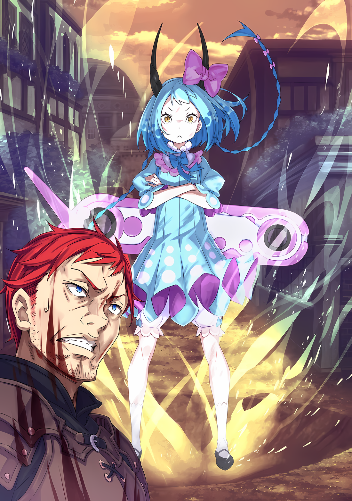

……Вернемся чуть-чуть назад, во время до нападения крылатых существ.

???: Уф, я опять все испортил… Я и в правду не силен в этом…

Мальчик шел по улице, покачивая головой, увенчанной розовыми пушистыми волосами.

Мальчик из самого большого особняка города… Шульт… был одет в короткие штаны, обнажающие его белые ноги. Вздохнув, с унылым видом он протянул и раскрыл свои стройные, мягкие, не слишком крепкие руки.

Шульт, еще молодой, уже решил, что до конца жизни у него будет только один хозяин.

Родившись в бедной деревне, Шульт влачил жалкое существование за счет тяжести сбора налогов за год и был обречен на голодную смерть на обочине дороги после того, как его выселили из дома. Голодный и жаждущий, он ел грязь и едва не стал пищей в, казалось, последний миг своей жизни, но тут появилось лучезарно прекрасное солнце и спасло его.….

Его спас тот образ жизни, который испепелил весь мир дотла, и это стало причиной того, что Шульт существует сейчас.

Именно поэтому Шульт искренне надеялся посвятить все свое нынешнее и будущее существование своему благосклонному хозяину.

И все же……

Шульт: Я ненавижу себя за то, что не могу ничем помочь….

С глубоким вздохом… и даже этот вздох был слабее, чем у обычного человека с его рациональным объемом легких… голова, грудь и сердце Шульта коллективно болели от собственной неадекватности.

В последнее время он с трудом справлялся с поручениями своего важного господина и даже полностью их портил.

Наполнить баню горячей водой было тривиальной задачей, но в итоге вода перелилась через край, а волшебный камень, использованный для нагрева воды, был неправильно использован, что привело всех в замешательство.

Он все еще был новичком на службе у Присциллы, и это тоже доставляло Рем неудобства — человеку с больными ногами. И на этот раз он действительно был сыт по горло тем, каким жалким он был.

Шульт: Присцилла-сама и Ал-сама говорят, что мне не нужно спешить меняться….

Он был рад, что добрая Присцилла и непредубежденный Ал так утешили его.

Но Шульт ненавидел себя за то, что не может ничем отплатить этим двоим. В этом отношении Хейнкель смотрел на вещи по-другому, чем они оба, и поэтому относился к Шульту по-другому, казалось, более понимая его.

Хейнкель также учил Шульта фехтованию не так, как это делал Ал, поскольку тот заявил, что это не подходит ему. Благодаря этому он почувствовал, что его бицепсы стали более твердыми, чем раньше.

Шульт: Способ Хейнкеля-сама махать мечом каждый день был для меня лучше, чем способ Ала-сама делать десять дней перерыва после одного дня махания. Я не могу сказать об этом Алу-сама, потому что не хочу его разочаровывать….

Несмотря на такие признаки роста, Шульт тоже был в некотором замешательстве.

И небеса не простили Шульту ни его наивности, ни его самодовольства. Он размышлял о том, что именно это привело к фиаско в бане.

Сейчас Рем, вероятно, помогала своей хозяйке, Присцилле, мыться в наполненной горячей водой ванне. Шульт искренне считал, что Рем может все, и уважал ее за это.

Шульт: Прямо как Яэ-сама… Яэ-сама, как ты…?

Внезапно в голове Шульта ожило воспоминание о веселой и яркой горничной по имени Яэ Тензен, которая раньше работала у Присциллы.

Раньше она отвечала за личный уход за Присциллой, всегда радостно болтала с Алом и была добра к нему из-за этого Шульт полюбил ее.

Но однажды у нее случился семейный казус, и она резко бросила работу в особняке, чтобы вернуться в деревню. У Шульта не было времени попрощаться с ней, и он почувствовал себя совсем опустошенным. Последний, кто провожал ее, Ал, сказал ему, что она хотела чтобы он передал привет Шульту.

Возможно, Рем могла бы занять место Яэ как слуга, наиболее приближенный к Присцилле.

Если добрая и трудолюбивая Рем станет таким человеком, Шульт будет очень рад этому; она хорошо ладила с Присциллой, и он был уверен, что Рем это тоже понравится.

Прежде всего……

Шульт: Все очень счастливы, когда находятся вместе Присциллой-сама.

Его личный опыт подчеркнул значимость присутствия Присциллы в сознании Шульта.

Рем, возможно, тоже была в том периоде своей жизни, когда ее многое беспокоило; она часто была мрачной и озабоченной своими мыслями. Даже если у нее было такое мрачное, озабоченное лицо, возможно, солнце, которым была Присцилла, заставит ее просветлеть.

???: А, Шуу здесь.

Шульт: Ммм! Это я!

С этой мыслью Шульт, который двигал головой вверх-вниз, остановился. Причиной этого было то, что он услышал знакомый голос. Перед собой он увидел человека, указывающего в его сторону.

Прямо перед идущим по улице Шультом, указывая на него, стояла молодая девушка с черными волосами, выкрашенными в розовый цвет на концах. Рядом с девушкой стоял молодой человек, который, заметив, что Шульт и девушка узнали друг друга, радостно воскликнул «Какая встреча!».

???: Это случаем не Дворецкий-кун? Принцесса-кун сейчас не с тобой, верно?

Шульт: Присцилла-сама в особняке, Флоп-сама. Вы с Утаката-сама были на прогулке?

???: Это редкость, когда Уу называют «-сама». Забавно.

Молодой человек, мягко улыбаясь и размахивая рукой… Флоп, кивнул со словами «Верно» на вопрос Шульта. Утаката, девушка с ним, тоже приложила руку к щеке, очевидно, глубоко тронутая почестями, оказанными ей Шультом.

Флоп и Утаката были первыми двумя людьми, которых Шульт встретил после прибытия в Гуарал. Согласно тому, что слышал Шульт, Флоп был торговцем, путешествующим из города в город, а Утаката — воином из племени под названием «Племя Судрак».

Оба были прекрасными людьми со своими собственными местами.

Флоп: О? У тебя довольно унылое лицо, Дворецкий-кун. Судя по лицу, у тебя , возможно, есть какие-то проблемы?

Шульт: Эх!? Потрясающе! Флоп-сама понял!?

Флоп: О, конечно, я понял! У большинства людей есть свои заботы! И у моей младшей сестры, которая может выглядеть так, будто у нее нет никаких проблем, на самом деле они тоже есть!

Утаката: У Мее, похоже, нет проблем.

Флоп: У нее они тоже есть! Удивительно, не правда ли!?

Положив руки на бедра, Флоп широко открыл рот и разразился взрывом смеха. Видя его веселый настрой, Шульт тоже почувствовал себя немного бодрее.

Флоп, как и Присцилла, был подобен солнцу, которое освещало мир в их окружении. Конечно, вокруг него расцвело бы множество красочных цветов.

Шульт: Как принц в поле цветов.

Флоп: Хахаха, я не такой великий, как принц. Я всего лишь торговец! Итак, Дворецкий-кун, что за проблема тебя беспокоит? Почему бы тебе не поговорить со мной?

Шульт: Вы уверены? Я думал, вы на прогулке….

Тело Флопа наклонилось, согнувшись в талии; Шульт был благодарен, что тот его выслушал. На него смотрела Утаката, якобы прогуливавшаяся с Флопом.

Однако Утаката сузила расширенные глаза и покачала головой, ничуть не выглядя обеспокоенной.

Утаката: Уу нечем заняться. Игра с Флоо была просто для того, чтобы убить время, так что давайте послушаем о проблемах Шуу.

Флоп: Точно. О, не думай, что это убийство времени. Каждая проблема важна для человека, страдающего от нее. Так что давайте вы будете слушать внимательно.

Итак, после не очень сильного толчка в грудь, Флоп повел Шульта и Утакату в конец улицы, к краю бордюра клумбы.

И вот они втроем, положив свои задницы на бордюр, с ветерком, начали болтать.

Проблема Шульта, как уже говорилось выше, заключалась в том, что он был бесполезен.

Для Присциллы он хотел быть более самодостаточным, быть способным на большее.

Шульт: Так как же вы, Флоп-сама и Утаката-сама, стали такими великими людьми, какими являетесь сегодня?

Флоп: Хохо, понятно, как мы стали такими, какие мы есть сейчас, а? Какой философский вопрос!

Шульт: Философский… Неужели…?

В ответе улыбающегося Флопа Шульт уловил намек на еще не открытую мудрость.

Не понимая, что такое эта философия, может ли она ответить на его вопросы? Если да, то он был готов погрузиться в ее изучение.

Утаката: Уу стала Уу, потому что Маа родила Уу.

Шульт: Маа, да? Это……

Утаката: Мать Уу! Она была хорошей подругой Таа. Но потом она ударила себя ножом и умерла.

Шульт: Это……

Рассказывая историю смерти своей матери, Утаката раскачивалась на болтающихся ногах.

Хотя отношение Утакаты было отстраненным, Шульт был поражен, услышав о событиях, которых он не ожидал. Флоп, сидевший между ними, нежно погладил ее по голове.

Флоп: Понятно, поступок твоей матери… Это ужасно, мисс Утаката.

Утаката: Для Таа это было труднее, чем для Уу. Все помогали Уу расти, так что все в порядке. Я выросла точно так же.

Флоп: Да, действительно, мисс Утаката растет очень хорошо. Уверен, твоя мама была бы рада это услышать.

Утаката: ――? Маа умерла, так что она не обрадуется. Ты говоришь странные вещи, Флоо.

Утаката рассматривала, поглаживающего ее по голове Флопа, с любопытным выражением лица. Однако то, что Флоп погладил ее по голове, не показалось Утакате таким уж неприятным, поэтому она не попыталась остановить его.

Реакция Утакаты была встречена спокойным сужением голубых глаз Флопа,

Флоп: Что ж, ответ мисс Утакаты был очень приятным. На самом деле, если мы собираемся поговорить о том, как я стал тем человеком, которым являюсь сегодня, я думаю, мой ответ будет очень похожим.

Шульт: Похожим…… Получается, Флоп-сама, вас воспитывало Племя Судрак так же, как Утакату-сама?

Флоп: Если бы это было так, я был бы очень рад, что у меня такая большая семья! Но моя семья умерла, единственная, кто у меня осталась — это моя младшая сестра Медиум. Ты можешь подумать, что это очень грустно и одиноко.

Шульт: …Так ли это?

Первую половину своей речи Флоп работал в своей обычной манере, затем его голос немного дрогнул во второй половине. Опустив глаза из-за своего ответа, Шульт снова почувствовал разочарование в себе.

Он расспрашивал Утакату и Флопа о каких-то очень бестактных вещах.

Даже Шульт не смог бы дать радостный ответ на вопрос о семье, которая его бросила. Ему следовало быть более внимательным, прежде чем спрашивать.

Флоп: Нечего корить себя, Дворецкий-кун. Ты извлечешь из этого урок. И это именно то, что ведет к следующей части моего ответа из предыдущего.

Шульт: Из предыдущего… тот, который должен быть похож на ответ Утакаты-сама?

Флоп: Да, точно, как и мисс Утаката, на меня повлияли люди вокруг меня, чтобы стать тем, кем я являюсь сегодня.

Раскинув руки, Флоп улыбнулся, словно демонстрируя свое нынешнее «я».

Его веселая улыбка и обнадеживающий тон голоса были важными элементами «флоповскости» Флопа. Шульт задался вопросом, были ли они также культивированы под влиянием других.

Флоп: Давным-давно я и моя младшая сестра жили в довольно ужасных условиях. Это был детский дом, но там было очень мало еды, нам не платили за работу, а взрослые били детей, когда те попадали в беду. Это было ужасное место.

Шульт: Это ужасное место…! Что ребенку делать в таком месте!?

Утаката: Мы бы сожгли его дотла.

Шульт: Сжечь его!

Флоп: Хаха, возможно, это была бы хорошая идея. Но вряд ли бы это удалось.

Шульт согласился с предложением Утакаты сжечь суровое прошлое Флопа. Но посмеявшись над их ответом, он уже давно перешагнул через это.

Как именно они это пережили……

Флоп: Ну, это было благодаря чьей-то помощи. Был один благодетель, который помог нам. Это была семья моей младшей сестры и моя. Правда, они уже умерли.

Шульт: ……Они помогли вам, это правда? Мне приятно это слышать.

Флоп: Ты понимаешь меня, Дворецкий-кун?

Шульт: Я понимаю… Меня тоже спасла Присцилла-сама.

Осторожно положив руку на грудь, он кончиками пальцев почувствовал, что больше не является телом, в котором нет ничего, кроме кожи и костей. Это было доказательством того, чем Присцилла наделила Шульта и по сей день.

Крепкость, сила, энергия и респектабельность Шульта доказывали, что действия Присциллы в тот день не были ошибкой, и ей не придется о них жалеть.

Увидев блеск в красных глазах Шульта, Флоп слегка усмехнулся,

Флоп: По большей части, у меня похожие чувства. Поэтому я сейчас пытаюсь осуществить свою большую цель. Это трудный путь, но я хочу идти вперед и не сдаваться.

Шульт: Я надеюсь, что вы не сдадитесь! Ах! Но, пожалуйста, будьте немного конкретнее. Как вы стараетесь, Флоп-сама?

Флоп: Хм, интересно. После долгих раздумий… Я расскажу вам одну вещь, но не о себе, а о моей младшей сестре. Я расскажу вам о своей младшей сестре, которая выше, сильнее, энергичнее и искуснее меня.

Шульт: Оооо, я понял!!!

Причина, по которой Флоп поднял руку так высоко над головой, заключалась в том, что его сестра, о которой шла речь, была настолько хорошим во всех аспектах человеком.

Это был не первый раз, когда Флоп упоминал о своей сестре, но Шульту еще не довелось встретиться с ней лично, так как в то время, когда он и Хейнкель прибыли в Гуарал, чтобы встретиться с Присциллой, сестра Флопа уже уехала в другое место.

Оставим это в стороне……

Утаката: Мее большая и сильная. Мии впечатлена.

Флоп: Самое лучшее в ней то, что она бойкая и не боится. И, конечно, она более искусна, чем я, как ее старший брат, я очень горжусь! Она много работает, чтобы стать сильнее.

Шульт: Стать сильнее…… вот как!? Как добродетельно!

Несомненно, она упорно трудилась, чтобы стать сильнее, оставаясь позитивной и никогда не теряя из виду свои амбиции.

Шульт попытался согласиться с тем, что, возможно, ключ к прогрессу — это продолжать стараться изо всех сил, не падая духом; однако Флоп пожал плечами, сказав: «Нет, нет».

Флоп: Ты так думаешь, не так ли? Но, кстати, Медиум стала сильнее — это немного более негативное выражение.

Шульт: Негативное? Что это значит?

Флоп: Хм, все просто. ……Когда меня били взрослые, Медиум, ну, она всегда нежно гладила мои раны.

Говоря с ностальгией о прошлом, Флоп так и заявил, опустив уголки глаз.

Однако Шульт был озадачен несоответствием между мягким тоном его речи и содержанием его слов. Когда ему сказали, что поглаживание раны от побоев — это начало становления сильнее, в этом не было никакого смысла.

Шульт: Мне очень жаль, что вас избивали. Но, Флоп-сама, что вы делали, когда ваша сестра нежно гладила эти раны?

Флоп: Я? Я улыбался. Я был рад за чувства Медиум. Если бы я не улыбался, она, та, которую защитили, сильно бы переживала.

Шульт: …………

Флоп: Итак, когда я в первый раз не смог прикрыть ее и она получила удар, тогда удивление поразило ее до глубины души. А когда дотронулась до своей раны, полученной в результате избиения, она почувствовала боль. Она не зажила, и боль не ушла. Как это ни прискорбно.

Покачав головой, Флоп уныло ответил.

Услышав ответ Флопа, даже дремучий Шульт наконец понял его истинные намерения. Он наконец-то понял, почему его сестра хотела стать сильнее, и как ей удалось не сдаться на этом пути.

Утаката: Если не хочешь, чтобы было больно, нужно не получать удары. Это то, о чем подумала Мее?

Флоп: Ну, именно так! Очень простой и хороший ответ, несмотря на то, что она моя младшая сестра. Благодаря этому, Мее стала сильнее, и путешествие наших братьев и сестер стало безопаснее!

Флоп преувеличивал свою улыбку, когда говорил, но для Шульта она выглядела несколько иначе.

Она была не только яркой, но и гордой. Конечно, Флоп гордился своей сестрой от всего сердца. Этому можно было только позавидовать.

Шульт: Я тоже хочу быть сильнее. Как ваша сестра, Флоп-сама…!

Флоп: Уверен, Медиум будет рада это услышать. Нет, она может смутиться. Не так часто удается испытать себя в роли чьего-то примера для подражания, это звучит очень весело.

Флоп улыбнулся и поставил свою печать одобрения Шульту, а тот сжал свои маленькие кулачки.

Слушая обмен мнениями этих двоих, Утаката посмотрел на Шульта и спросила: «Шуу?»,

Утаката: Если хочешь стать сильным, потренируешься с Уу? Начни с лука.

Шульт: Лук, да? Но я также тренируюсь с мечом… Хм, я сделаю это! Я буду делать и то, и другое! Так я смогу стать вдвое сильнее!

Флоп: Если ты можешь делать и то, и другое, значит, все именно так, как ты говоришь! Как мудро!

Подняв обе руки к небу, Флоп присоединился к Шульту в своей пламенной решимости. Утаката тоже раздула ноздри и выпятила грудь, пообещав тренироваться вместе.

Затем она показала Шульту лук на своей спине,

Утаката: Уу будет упорно трудиться, как и Шульт, чтобы стать мастером, как Таа.

Шульт: Ну, я бы тоже хотел познакомиться с Таа-сама. Утаката-сама, почему вы хотите стать мастером лука?

Утаката: Маа сказала кое-что. Чтобы Уу убила путника из лука и стрел.

Шульт: Понятно. Подожди, что…!?

Поскольку ответ был более экстремальным, чем он ожидал, осознание Шульта задержалось на мгновение.

Убить путника…… вот что она сказала ранее, но что именно это значит? Шульт, только что обдумав ситуацию, пришел к выводу, что стоит спросить подробности.

……И вот, пока Шульт беспокоился об этом, он был лишен времени для расспросов.

Флоп: ……Дворецкий-кун! Мисс Утаката!

Шульт: ……!?

Утаката: Флоо?

Внезапно резкий голос позвал их двоих, и выражение лица Флопа изменилось. Плечи Шульта напряглись, а руки Флопа крепко обхватили его плечи.

Затем Флоп придвинул Шульта и Утакату, сидевших на обочине, ближе к себе и крикнул,

Флоп: Небо начинает казаться опасным! Давайте скорее убираться отсюда!

И……

△▼△▼△▼△

……В то время, когда стая была замечена в далеком небе, Хейнкель находился в городской ратуше.

Среди присутствующих были назначенные командиры гарнизона, размещенного в Городе-крепости.

Генерал Второго класса Зикр Осман и его люди, которые изначально были посланы в город, но во время захвата Города-крепости перешли в ряды Присциллы…… точнее, в ряды человека по имени Абел.

А еще было «Племя Судрак», племя охотников из джунглей, меньшее по численности, чем присутствующие Имперские солдаты, но не менее сильное индивидуально, вместе с тем, кто их возглавлял, их действующим вождем, Мизельдой.

Когда Хейнкель посетил ратушу, они как раз проводили личную встречу, чтобы обсудить будущее.

Хотя Присцилла говорила о предзнаменованиях, похожих на предсказания, Хейнкель не верил, что она способна предсказывать будущее, но он также знал, что нельзя недооценивать силу взгляда существа, столь далекого от нормы.

Не только Присцилла, но и люди с особыми способностями и судьбами обладали более высокой перспективой по сравнению с обычными людьми.

Те, кто мог смотреть на мир с более высокого места, видели пейзаж, отличный от того, что видели другие. Те, кто мог видеть дальше по сравнению с нормальным человеком…… вернее, по сравнению с обычным человеком, — никогда не смогли бы понять последнего.

За сорок лет своей жизни Хейнкель хорошо усвоил это.

Поэтому он не отмахивался от вещей, даже не прислушиваясь к ним, только потому, что не понимал их.

По этой же причине он не отмахнулся от слов Присциллы и отправился в мэрию.

А потом……

Мизельда: …………

Первой аномалию за окном заметила Мизельда, принюхиваясь; ее лицо было таким, словно она о чем-то догадывалась.

Она была бывшим вождем Племени Судрак, который, очевидно, потерял одну из своих ног в битве во время захвата Города-крепости. Чтобы заменить ногу, она орудовала палкой, похожей на кончик трости, прикрепленной к правой ноге, которая отсутствовала ниже колена.

Каждый раз, когда она шла, трость издавала звук, и когда она поворачивалась, раздавался тот же звук.

Как только профиль суровой красавицы Мизельды, обладательницы пронзительных глаз, напрягся, присутствовавшие при этом Хейнкель и Зикр мгновенно поняли, что что-то не так, и посмотрели в том же направлении.

Затем, увидев рой черных точек, появившихся из-за неба, Зикр пробормотал про себя.

Зикр: ……Стая летающих драконов.

Мизельда: ……Кх! Зикр! Скажи своим солдатам! Я мобилизую Судрак!

Сразу же после осознания опасности Мизельда с огромной силой прыгнула бы с крыши ратуши на широкие плечи Зикра.

Однако она только что потеряла одну из ног. Вместо того чтобы выпрыгнуть в окно, она соскочила с лестницы и очень торопливо выбежала на улицу.

Подхваченный ее стремительным бегом, Зикр напустил на себя пустой вид и закричал,

Зикр: Тревога! Нападение врагов! Они идут с неба!

Его крик дал толчок в спину его помощникам, чтобы они оповестили весь Город-крепость о критической ситуации.

Увидев реакцию всех, Хейнкель тоже положил руку на меч у себя на поясе. Затем, громко и резко, как звон колокола тревоги, он щелкнул языком.

Зикр: Хейнкель-доно! Присцилла-доно….

Хейнкель: Госпожа Присцилла в особняке. Она знала, что что-то случится. Скоро она будет в пути.

Когда Зикр повернулся, Хейнкель обратил внимание на вражеские тени в небе.

За считанные секунды рой явно потемнел и увеличился в размерах, приближаясь к городу с огромной скоростью. Нельзя было терять ни секунды.

Хейнкель: Если предположить, что это вражеская атака, есть ли у вас какие-нибудь идеи, кто может быть нападающим?

Зикр: ――. Количество летающих драконов необычайно велико. У Имперской Столицы нет сил мобилизовать такое количество наездников летающих драконов, так что… Есть только один вариант.

Хейнкель: И каков же этот вариант?

Слова Хейнкеля стали грубыми, так как время сокращалось из-за того, что Зикр говорил окольными путями.

Столкнувшись с тем, что Хейнкель преследует его, Зикр сделал паузу, а затем сказал,

Зикр: «Генерал Летающих Драконов», Мэделин Эшарт…… Она управляет летающими драконами. Другими словами… …

Хейнкель: Черт возьми, одна из «Девяти Божественных Генералов»…… тц.

Хейнкель почесал голову при упоминании знакомого имени.

Он не был экспертом во внутренних делах Империи, но он был заместителем командующего Королевской Гвардией Королевства Лугуника. Благодаря своему положению, он был гораздо более осведомлен в информации о других странах, чем большинство людей.

Он, по крайней мере, слышал имена и псевдонимы «Девяти Божественных Генералов», высшей военной силы, которой обладала Империя.

Казалось, что все они были воинами с необычайными способностями, и только лучшие в Королевстве, в число которых входил и Маркос, командир Королевской Гвардии, могли сравниться с ними.

И, конечно, был самый могущественный человек Королевства, «Святой Меча», но……

Хейнкель: Разве кто-то не говорил нелепицу, что какой-то парень сражался с Райнхардом….

Говорили, что сильнейший мечник в Империи Волакии не уступает Райнхарду.

Конечно, у «Девяти Божественных Генералов» были свои сильные и слабые стороны, но мысль о том, что на него нападет монстр одного с ним уровня, была самым страшным кошмаром Хейнкеля.

У Хейнкеля изначально не было намерения прибыть в Империю.

Он просто поехал с ней, когда Присцилла решила отправиться в Волакию по собственному желанию. Он не был заинтересован в существовании или разрушении Города-крепости.

Однако……

Хейнкель: Я не могу позволить себе вызвать недовольство госпожи Присциллы… Даже если госпожа Присцилла станет королевой, все будет бессмысленно, если она прогонит меня.

Присцилла была эксцентричной, и, в конце концов, он понятия не имел, что у нее на уме.

Что бы ни привело к этому, Хейнкель пока был у нее наготове, но если он не окажется полезным, от него откажутся, и он выйдет с пустыми руками.

Этого не должно случиться. Присцилла теперь была единственным человеком, который был для Хейнкеля соломинкой, за которую он мог ухватиться.

Хейнкель: У нас нет времени на пустую болтовню. Давайте избавимся от стаи летающих драконов. Зикр, ты здесь, чтобы проконтролировать все это!

Зикр: Я намерен, но как насчет тебя, Хейнкель-доно?

Хейнкель: ……Я буду делать то, что захочу.

В отличие от Зикра и Мизельды, у Хейнкеля не было ни солдат, ни компаньонов, которыми он мог бы руководить.

А если бы и были, то его титул заместителя командующего Королевской Гвардией был всего лишь декоративным. Он давно перестал изучать основы военной стратегии, а главное, никто не слушал его указаний.

Поэтому с самого начала Хейнкель мог сделать только одно.

Хейнкель: …………

Сразу же после принятия этого решения Хейнкель, не дослушав ответа Зикра, побежал на балкон ратуши и спрыгнул оттуда на город внизу.

Он поставил ноги на крышу высокого здания, оттолкнулся ногой от крыши, а затем побежал к следующему зданию. Он продолжал многократно прыгать, омываемый ветром, направляясь к вершине укреплений, окружающих город.

Запрыгнув на возвышающуюся крепостную стену с западной стороны, куда направлялась стая летающих драконов, он перевел дух.

По всему городу уже звонили тревожные колокола, предупреждая о нападении врага; повсюду в городе царил беспорядок среди людей, и стражники призывали их эвакуироваться, чтобы подавить хаос.

Хейнкель: …А, черт.

Запах в воздухе заметно изменился, а вкус слюны на языке стал горьким.

По мере приближения поля боя, крови и стали, Хейнкель был вынужден прислушиваться к иллюзорному, высокочастотному звону в глубине своих ушей.

Помимо Хейнкеля, к западным валам устремились и Имперские солдаты.

Если догадка Зикра была верна, нападавший был одним из «Девяти Божественных Генералов». Как они были готовы сражаться с противником, занимающим должность Генерала Первого класса Империи?

Неужели они не думали, что в этом есть что-то неправильное, тем более, если они были под одним знаменем? Или все было в порядке, пока они могли сражаться? Если бы им пришлось умереть в бою, они были бы довольны этим?

Хейнкель: Черт, черт, черт, черт, все они, все они, ЧЕРТ…!

Кипящий, пульсирующий, черный жар хлынул из его груди во все тело.

Хейнкель стиснул зубы до скрипа, наслаждаясь темным жаром, который зародился в его сердце, прошел через внутренние органы и нижнюю часть живота, а затем дошел до кончиков конечностей и пальцев.

Рука Хейнкеля медленно потянулась к мечу на поясе, мечу с именем…… «Астрея», и он крепко сжал рукоять.

А затем……

Хейнкель: ……ВАШЕ МЕСТО В АДУ, УБЛЮДКИ!!!

С воем невыносимой ярости меч Хейнкеля вспыхнул, и толстая шея пролетающего мимо дракона, брызнув кровью, раскололась на части.

△▼△▼△▼△

Звон колоколов тревоги, крики людей, убегающих из города, перекрывались весьма изысканным, но в то же время пугающим образом. Город-крепость Гуарал превратился в поле боя, наполненное слуховым столпотворением.

Наступающая с западного неба армия летающих драконов, состоящая не менее чем из нескольких сотен особей величественного вида, разбила сердца жителей, которые успокаивались тем, что город защищен стенами со всех четырех сторон.

Если и было слабое место в этих стенах, способных выдержать даже разрушительную энергию мощных пушек из магического камня, то это было не что иное, как ужасающие существа, способные обойти даже большие стены.

Будь то существо, способное перешагнуть через стены, или владыка неба, способный перелететь через них.

Несомненно, не было преувеличением сказать, что в этот день на Город-крепость напал его величайший, самый грозный враг.

Флоп: ……Это не очень хорошо.

Избегая главной улицы, по которой эхом разносились крики, Флоп выглянул из переулка и нахмурился.

Через несколько минут после появления в небе летающих драконов ситуация изменилась к худшему: Город-крепость снова превратился в поле битвы, как это случилось десять дней назад, и краткая передышка была стерта из памяти жителей.

Однако на этот раз, по сравнению с тем, что происходило десять дней назад, перемены были в худшую сторону.

Во всяком случае……

Флоп: Мистер старался нанести как можно меньше повреждений, но… на этот раз, похоже, противник не был так внимателен.

Субару намеревался провести «Бескровную Осаду», используя смелый способ переодевания в женщину.

Хотя эта цель была сорвана неожиданным вторжением, количество пролитой крови было бы несравнимо больше, если бы был использован план, отличный от плана Субару.

Флоп удивлялся тому, что чувства жителей Города-крепости, а также Имперских солдат, размещенных там, не деградировали до крайней степени; возможно, это было результатом размышлений Субару.

Однако на этот раз враг, казалось, не имел таких рыцарских мыслей.

Шульт: Ээй!

Шульт закричал рядом с Флопом, когда ужасающий рев и сотрясающий землю удар пронеслись по воздуху.

Это было неудивительно. Нападение врага с помощью летающих драконов было настолько сильным и эффективным.

Флоп: Хотя они просто позволяют летающим драконам нести камни, а затем сбрасывают их с неба.

То, что они делали, было простым и понятным, это была просто примитивная атака.

Однако, хотя даже валун размером с человеческую голову мог нанести серьезную травму, камни, которые падали с воздуха уже некоторое время, были размером с одну или две головы.

Сила камней разрушала каменные здания, создавала огромные воронки на улицах. Конечно, если бы кто-то попал под удар, это была бы катастрофа, свидетелем которой не хотелось бы быть никогда.

Флоп и остальные бросились в переулок, но у них не было подтверждения, что это место безопасно.

Бежать под землю или направиться к кому-то, кто просто силен; если бы существовало безопасное место, это было бы оно.

Утаката: Мии и остальные находятся в большом здании в центре.

Шульт: Присцилла-сама в особняке…!

Флоп: О, да, конечно. Вы оба очень умные, я с вами согласен. Проблема в том, что мы находимся прямо посередине между этими двумя местами!

Призванные Мизельда и Зикр были надежны в своей способности защитить город.

Хотя она была боевой силой, состоящей всего из одного человека, способности Присциллы были сравнимы со способностями «Девяти Божественных Генералов».

Флоп тоже размышлял, в каком направлении спешить.

И пока они волновались……

???: П-помогите…… Уааа!!!

Прямо перед переулком, где прятались Флоп и остальные, фигура, бегущая по улице, закричала, а затем исчезла. ……Нет, она не исчезла. Тело мужчины было поднято в небо тенью, летящей с огромной скоростью, и унесено одним махом.

Очевидно, у летающих драконов в рейде были разные роли, и они делились на две группы. Те, что были раньше, пускавшие в ход большие камни, и те, что атаковали напрямую.

Или, что более вероятно, были летающие драконы, которые взяли на себя другие роли.

Шульт: Т-только что, тот человек…… кх.

Флоп: Даже если бы мы хотели помочь, мы бы не смогли! И обойти их мы тоже не можем. Если мы попадем в когти или клыки летающего дракона, нас троих вместе заберут в небо.

Утаката: Лук Уу здесь! С его помощью я смогу сразить летающего дракона!

С энтузиазмом говоря, Утаката показала лук и стрелы в своих руках. Если бы это была Хоули, Куна или другая взрослая судракийка, Флоп бы задумался.

Однако Флоп, однажды сопровождавший Утакату на тренировку с луком, понимал, что ее способностей недостаточно для настоящего поля боя.

Флоп: ……Вы хотели лучшего для детей, не так ли? Я понял.

Закрыв глаза, Флоп думал о благодетеле, который спас его и его сестру от гибели.

Он всегда отличался прямотой и грубостью, но, несмотря на это, его благодетель никогда не поступался своими принципами. Поэтому Флоп хотел стать «взрослым», за которого не будет стыдно.

Они не могли вечно прятаться и затаивать дыхание там, где они были. Куда бы они ни пошли…… в мэрию или в особняк…… им нужно было предпринять какие-то действия.

Чтобы доставить Шульта и Утакату в безопасное место….

Флоп: ……Я хочу, чтобы вы оба слушали меня. С этого момента я буду…

Сделав небольшой вдох, Флоп попытался решительно донести до них свой план.

И в тот момент, когда два ребенка смотрели на говорившего Флопа……

???: ОООООАААА……!

???: ……КААААА!

С леденящим кровь гневным ревом что-то огромное упало с неба на улицу. То, что шлепнулось на землю, сопровождаемое гневными криками и воплями, было летающим драконом, по всему телу которого текла черная кровь.

С распростертыми крыльями размах крыльев дракона достигал трех-четырех метров. Отчаянно пытаясь спастись, он хлопал крыльями, сломанными от удара при падении.

В этот момент……

???: НЕ СМЕЙ УБЕГАТЬ! УБЛЮДОК!

Летающий дракон упал на землю вместе с фигурой, которая энергично перекатилась и прыгнула ему на спину. Затем он вонзил свой меч в извивающегося летающего дракона, пронзив его сердце сзади.

Крики летающего дракона не прекращались еще долгое время; затем он рухнул на землю, обливаясь кровью.

Затем, увидев, что дыхание летающего дракона остановилось……

???: Эти маленькие засранцы….

Со спины мертвого летающего дракона спустился рыжеволосый мужчина, его плечи вздымались и опускались. Увидев его, Шульт, который был на руках у Флопа, крикнул: «Ах!»,

Шульт: Хейнкель-сама! Так вы были в безопасности!

Хейнкель: Хааа?

Высоким голосом воскликнул Шульт, заставив рыжеволосого мужчину обернуться с плохим настроением. У Шульта тут же перехватило горло, его слова заблокировались из-за внешнего вида мужчины, все его тело окрасилось в ярко-красный цвет.

Затем, широко раскрыв глаза, Шульт вырвался из рук Флопа и бросился к мужчине. Увидев его, мужчина вытер рукавом окровавленное лицо.

Хейнкель: Какого черта, это ты, пискля?

Шульт: Вы весь красный, Хейнкель-сама! Где вы ранены!?

Хейнкель: Ранен? О, если ты имеешь в виду кровь, то это только драконья. Если я и ранен, то это всего лишь царапина.

Шульт: Неужели? Точно…?

С удивленным взглядом в глазах Шульт прикоснулся к окровавленному телу мужчины, чтобы убедиться в этом. Видя, что тот не заботится о том, чтобы испачкать руки и одежду, мужчина посмотрел на мальчика и вздохнул.

В этот момент Флоп выпустил дыхание, которое он сдерживал из-за своей решимости, и сказал,

Флоп: Дворецкий-кун, я не думаю, что тебе стоит беспокоиться. Он не выглядит так, как будто его пытаются выставить напоказ, и он не очень-то ранен, верно?

Хейнкель: Ты… тот странный человек. Ты вместе с писклявыми?

Флоп: То что я «странный» немного обидно, но ты прав! Я просто бегал с Дворецким-кун и мисс Утакатой. Я рад, что ты здесь.

Когда Флоп улыбнулся ему, человек в крови… Хейнкель… отвел взгляд.

Он не смутился, его реакция была недовольной. На самом деле, он даже прищелкнул языком. Но это была правда, что он убил летающего дракона, что сыграло свою роль в том, что Шульт обрел душевный покой.

Как и Шульт, Хейнкель, похоже, был одним из последователей Присциллы, и хотя Флоп ожидал, что он будет уметь драться, поскольку носил меч, он оказался более искусным, чем можно было ожидать.

Огромное количество крови, окрасившей его тело в пурпурный цвет, вряд ли можно было списать только на кровь, вытекшую из только что убитого им летающего дракона. Это было свидетельством того, что он подвергся воздействию крови, вытекающей из множества летающих драконов.

Шульт: Мы собирались отправиться к Присцилле-сама сейчас! А вы, господин Хейнкель?

Хейнкель: К госпоже Присцилле…? Так будет безопаснее. Но….

Флоп: Сейчас в городе очень мало безопасных мест. Если все наши враги — летающие драконы, думаю, было бы неплохо найти здание с подвалом и местом, где хранятся специи.

Утаката: Специи…?

Флоп прервал разговор Шульта и Хейнкеля, а Утаката наклонила голову в сторону непонятной ей части разговора. Взглянув на него, Хейнкель тоже перевел взгляд на нее, в его глазах читалось замешательство.

Для человека, не знакомого с экологией летающих драконов, это не имело смысла.

Флоп: У летающих драконов очень хорошее обоняние. Они могут учуять кровь на большом расстоянии. С другой стороны, им не нравятся сильные, резкие запахи. Поэтому, если мы посыплем все тело перцем, мы сможем избежать нашей поимки.

Хейнкель: …Ты кажешься хорошо информированным.

Флоп: Я торговец, который путешествует с места на место! Кроме того, я знаю человека, который много знает о летающих драконах. Возможно, он был самым осведомленным о них человеком в Империи!

Однако от этого человека он часто слышал о хороших сторонах летающих драконов, поэтому он не ожидал, что столкнется с ними как с угрозой.

По крайней мере, если полученные им знания верны, то его план обмазаться специями, чтобы спастись от летающих драконов, должен сработать.

Флопу и двум детям повезло, что они смогли объединиться со способным бойцом Хейнкелем, но в целом в этой битве за Город-крепость это не было удачей.

Флоп: Не могу сказать, что это хорошая идея — использовать Красного-сан в качестве нашего сопровождения.

Хейнкель, который мог в одиночку сражаться с летающими драконами, был ценным активом для города, атакованного бесчисленным их количеством.

Независимо от того, как развернется битва дальше, он будет одним из факторов, влияющих на исход сражения. Ставить его рядом с тремя некомбатантами было не лучшей идеей.

Поэтому……

Флоп: Мы уходим под землю, чтобы скрыться от глаз и обоняния летающих драконов. Может ли Красный-сан сопроводит нас в ближайший ресторан или склад? Там мы сможем обмануть их глаза…… Или, скорее, обмануть их носы? Как только мы это сделаем, мы сможем позаботиться об остальном сами.

Шульт: Флоп-сама….

На лице Шульта отразилось удивление от предложения Флопа, как будто идея разделиться вообще не приходила ему в голову. Но в противовес удивлению Шульта, Утаката кивнула и сказала,

Утаката: Уу думает так же, как и Флоо. Уу и Флоо защитят Шуу. Не волнуйтесь.

Шульт: Утаката-сама…… тоже?

Утаката утвердительно кивнула головой, и круглые глаза Шульта опустились. Через несколько секунд он поднял голову с решительным выражением лица и посмотрел на Хейнкеля.

Шульт: Я понимаю. Я сделаю все возможное с Флопом-сама и остальными. Итак, Хейнкель-сама, будьте осторожны со своими травмами….

Хейнкель: ……Я уже давно об этом думаю, но не надо себя накручивать. Почему я должен вдруг начать подчиняться тому, что вы мне говорите?

Шульт: Э!?

Однако решимость Шульта была бесцельной, так как Хейнкель нахмурился и прямо заявил об этом.

Он вытер кровь со своего меча плащом, указав подбородком на свое окружение,

Хейнкель: Позвольте мне сказать сейчас, я ничем не обязан этому городу. Если я не смогу защитить эту писклю, мисс Присцилла, вероятно, будет недовольна, верно? Я бы предпочел избежать этого.

Флоп: Постой, постой, постой, Красный-сан! Подожди секунду! Так ты думаешь, что защита настроения Принцессы-кун важнее, чем защита города? Это….

Хейнкель: ……Верно.

Флоп: ……….

Ответ был настолько четким и определенным, что Флоп не смог удержаться от разочарованного взгляда. Хейнкель уставился на Флопа, его голубые глаза сверкали среди красной грязи, покрывавшей его лицо.

Хейнкель: У меня есть кое-что поважнее этого города, поважнее чьей-то жизни. И это не этот пискля. У мисс Присциллы, которая печется об этой пискле, есть кое-что, что я должен ей дать, несмотря ни на что. Если это то, что нужно, чтобы получить это, тогда мне все равно, сколько людей умрет.

Флоп: Рыжий-сан…

Хейнкель: Кроме того, я не такая уж большая шишка, да и ты тоже. Ты должен знать свое место. ы не можешь делать очень много. Не пытайся выйти за рамки. Ты только выставишь себя дураком.

Флоп: ……….

Хейнкель: Никто не может быть мечом.

Когда он произнес это, рука Хейнкеля потянулась к плечу Шульта.

Когда рука обхватила стройное плечо Шульта, юноша обратил свои влажные глаза на Хейнкеля. Испуг, наполнивший эти глаза….

Шульт: Хейнкель-сама, вы выглядите так, будто вам больно.

……Нет, не страх, а скорее сострадание.

Щеки Хейнкеля слегка порозовели под искренним взглядом мальчика. Но это не тронуло его решительное сердце.

Хейнкель: Я отведу этого писклявого мальчишку к госпоже Присцилле. Вы, ребята, сами по себе, если хотите следовать за мной. Но не заблуждайтесь, думая, что я буду вас защищать.

С этими словами Хейнкель схватил Шульта и повернулся спиной к Флопу и Утакате. Он вышел на улицу, направляясь к особняку, где находилась Присцилла.

Флоп колебался, стоит ли ему прислушаться к его предупреждению, когда… …

???: ……Это вы убиваете нас, драконов?

……Мгновение спустя, сопровождаемое этими короткими словами, падающая тень приземлилась на землю с яростным ревом.

???: …………

Плотное облако пыли и обломков поднялось вверх, когда незваный гость внезапно вырезал большую дыру в земле.

Маленькая фигурка стояла со скрещенными короткими руками перед Хейнкелем, который пытался увести Шульта, преграждая им путь.

……С первого взгляда трудно было понять, кто это.

То, что только что произошло, и впечатление, которое производила фигура, совершенно не совпадали.

Маленький рост, прекрасное лицо, белая кожа без изъянов, небесно-голубой наряд, подчеркивающий их красоту; поскольку их внешность не отличалась от внешности Шульта или Утакаты, трудно было поверить, что они появились только что в результате сокрушительного удара.

Однако важно было лишь то, что произошло, и никто не мог отрицать случившегося.

Появившаяся тень сузила свои золотистые глаза, посмотрела на четверых людей, стоявших на улице, и кивнула.

А затем……

???: Вы пролили нашу кровь, драконов, и поэтому во искупление ваша кровь будет пролита до тех пор, пока ее не останется. ……Глупцы.

Иллюстрация к **Ранобэ** Том 30 | Разукрасил NorvakG
