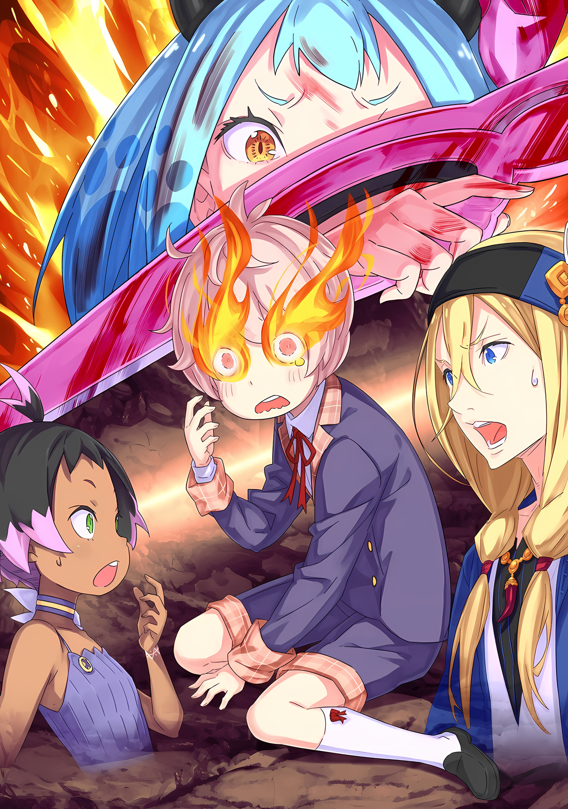
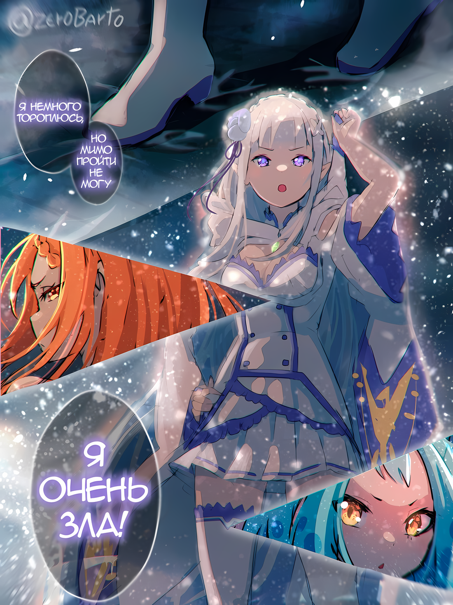

……Как только он увидел маленькую девочку, стоящую среди клубов дыма, в голове Флопа раздался сигнал тревоги.

Но не настоящая тревога, эхом разносившаяся по всему Гуаралу; это была тревога его собственных инстинктов выживания как живого существа. Его шум был настолько громким, что от него болела голова.

Откровенно говоря, Флоп не был похож на Медиум; он был человеком, не способным сражаться.

Попытки тренировать свое тело принесли ему некоторое разочарование, и он не хотел отвлекать сестру от ее роли, которую она выбрала по-своему после долгих раздумий, осознав, что, поглаживая его раны, причиняет брату боль.

Поэтому он не обладал ни интуицией воина, ни проницательностью.

И все же……

Флоп: Эта девочка — плохая новость.

И тут он сглотнул горькую слюну, когда маленькая девочка высунула ногу из зияющей дыры, образовавшейся в результате падения.

Девочка: …………

Молодая девушка невысокого роста, зрачки ее золотистых глаз сузились, глядя на Флопа и остальных.

На вид она была на два-три года старше Шульта и Утакаты, но атмосфера, которую она излучала, была наравне с атмосферой Медиум или Мизельды…… нет, даже опаснее.

Она была почти как тот внушительный «Божественный Генерал», который лишил Мизельду ноги.

Флоп: ……Рыжый-сан, как ты думаешь, ты сможешь создать брешь? Я хочу, чтобы по крайней мере Дворецкий-кун и мисс Утаката смогли сбежать.

Тот, кому Флоп шепотом высказал это предложение, был Хейнкель, единственный, кто обладал хоть какой-то боевой силой в этом месте.

Продемонстрировав свое мастерство владения мечом, убив летающего дракона, он был бы более чем способен помочь в защите Утакаты и остальных, в отличие от Флопа, который стал бы лишь мясным щитом.

В идеале, было бы здорово, если бы Хейнкель был достаточно силен, чтобы победить эту маленькую девочку.

Хейнкель: ………тц

Флоп: Рыжий-сан?

Оставив свою защиту в сторону девочки, Флоп задал вопрос Хейнкелю, но ответа не последовало.

Он не решался отвести взгляд от стоящей перед ним угрозы, но работа с Хейнкелем была первоочередной задачей. Набравшись решимости, Флоп взглянул на Хейнкеля, чтобы изучить его.

……Глаза Хейнкеля были широко раскрыты от шока, лицо бледное, с каплями пота.

Шульт: Х-Хейнкель-сама? Вы в порядке?

Хейнкель: Э, а…

Флоп и Шульт почти одновременно обратили внимание на необычное поведение Хейнкеля.

Шульт выразил явное беспокойство за Хейнкеля, и щеки красноволосого мечника порозовели от слов юноши, из его горла вырвался невнятный голос.

Трудно было сказать, глядя со стороны, была ли эта реакция вызвана тем, что он знал о личности девушки. Однако, независимо от вопроса, существовал один ясный и неоспоримый факт.

Этим было……

Девочка: Что с тобой? Ты боишься?

Прищуренный взгляд девушки был устремлен на ноги Хейнкеля, когда он стоял там. Его ноги дрожали в обоих коленях, настолько, что ему едва удавалось стоять.

В его глазах были страх и трепет, очевидные для любого, кто посмотрит на него. Другими словами, отчаяние.

Флоп: Привет! Я никогда не видел тебя раньше, маленькая леди, не могла бы ты поговорить со мной немного!?

Заметив отчаяние Хейнкеля, Флоп тут же выкрикнул это.

И тут же плечи Хейнкеля и Шульта напряглись, а стоявшая перед ними девушка обратила на него свои глаза, полные подозрения. Сам по себе ее взгляд не убил бы его, но гнетущее ощущение, исходящее от него, было таким, что не удивительно, если бы это произошло.

Но Флоп воспрянул духом, размял щеки и широко развел руки, изобразив улыбку.

Флоп: Я Флоп О'Коннелл, скромный торговец. Я нахожусь в довольно сложной и непонятной ситуации. Похоже, ты знаешь об этом больше, чем я, не так ли?

Девочка: ――. Ты побочный ущерб? Тогда тебе не повезло.

Флоп: Ну, не повезло — это фраза, которую мне не привыкли говорить. У меня много чего нет, но я с гордостью могу сказать, что мне повезло. Почему же ты говоришь, что мне не повезло?

Девочка: Ты можешь убить всех в этом городе. Так сказал дряхлый старик.

Флоп: Всех в городе.

Девочка дернула подбородком, жестом указывая на окрестности, на что Флоп натянуто улыбнулся. Но в глубине души его состояние далеко не соответствовало горькой улыбке, он был скорее в панике, чем в чем-то еще.

Можно ли вести переговоры, учитывая, что ее целью было полное уничтожение жителей города?

Если бы только он мог поговорить с «Дряхлым Стариком», который приказал ей совершить такой поступок.

Флоп: Судя по тому, что я слышал, дряхлый старик, похоже, ошибся, велев тебе уничтожить весь город. Так почему бы тебе не перепроверить это со своими друзьями и коллегами, которые пришли с тобой?

Девочка: Нет ни друзей, ни коллег. Со мной, драконом, есть только братья и враги. ……Ты насмехаешься над драконом. Похоже, ты не знаешь страха.

Флоп: Насмехаться над тобой, это возмутительно! Я хочу найти с тобой общий язык. Для начала, я просто хотел спросить, как тебя зовут. Вы согласны?

Шульт: Да-да, именно так! Я тоже хотел бы знать твое имя! Мое — Шульт!

Когда девочка была на грани того, чтобы стать недовольной, Флоп хлопнул в ладоши, спрашивая согласия у своих союзников. Шульт, воспользовавшись ситуацией, назвал свое имя, подняв руку.

После того, как Флоп и Шульт представились, девушка наморщила лоб на своем красивом лице и……

Девочка: ……Мэделин Эшарт. Я, дракон, из «Девяти Божественных Генералов».

Хейнкель: Девять бо…… кх

Непринужденно, девочка…… Мэделин представилась по своему титулу, на что Хейнкель растерялся.

Его колени, которые дрожали с момента их встречи, затряслись еще сильнее, когда он услышал ее титул, что подтверждал ее силу. Это было чудо, что он не упал на ягодицы.

Даже Флоп не мог рассмеяться над Хейнкелем. Его противник, которого Флоп считал таким же опасным, как «Божественный Генерал», на самом деле оказался одним из «Девяти Божественных Генералов».

И помимо этого……

Флоп: ……Мисс Утаката.

Тихо заметив изменения в ситуации, Флоп обратился к имени человека, вызвавшего эти изменения.

Утаката, девочка, которую назвал Флоп, зашевелилась, сосредоточившись на Мэделин, стоящей перед ней. Сняв со спины лук, она приготовила стрелу, нацелив ее на Мэделин.

Расстояние между ними составляло семь или восемь метров; даже учитывая ее способности, она не промахнулась бы.

Однако если это можно назвать преимуществом, то это не так уж далеко от истины.

Утаката: Этот враг — лидер стаи летающих драконов. Она такая же, как Мии раньше, и такая же, как Таа сейчас. Победить ее означает закончить бой

Шульт: Это так?

Флоп: Возможно, концепция мисс Утакаты верна. Если, конечно, кроме нее нет других «Божественных Генералов».

Когда Флоп бросил взгляд в ее сторону, Мэделин ничего не сказала.

Судя по ее поведению, она была ребенком, который реагирует на сказанные слова. Если бы они сказали что-то явно неправильное, для нее было бы естественнее как-то отреагировать.

Другими словами, Мэделин возглавила штурм Города-крепости. Мнение Утакаты о том, что победа над ней заставит летающих драконов отступить, было верным.

Единственная проблема заключалась в том, что это, похоже, невозможно было сделать.

Мэделин: Ты воин, ты воин, и ты… не убежишь. Ты тоже воин.

Шульт: А… я? Ты про меня?

Мэделин: Да. Ты тоже воин.

После того, как на Шульта неожиданно указали пальцем, его глаза стали более круглыми.

К удивлению Шульта, Мэделин указала своей маленькой рукой на Утакату, Флопа и себя, назвав их «воинами».

Затем Мэделин указала пальцем на последнего, Хейнкеля….

Мэделин: Ты не воин. Даже если ты убил дракона, ты трус.

Хейнкель: Гх……

Мэделин: Достань свой меч. Ибо я, дракон, поражу тебя. За каждую пролитую каплю крови.

Сказав это, Мэделин медленно сделала шаг к нему.

И так, медленно, ноги Мэделин преодолевали расстояние, направляясь к убийце летающих драконов Хейнкелю, не заботясь о том, что в нее может попасть стрела Утакаты.

Утаката: ……Ударь ее!

Синхронно с этим заявлением о намерениях, Утаката выпустила стрелу, целясь в грудь Мэделин. Она полетела прямо в нее, но была поймана двумя ее пальцами поднятой руки.

Мэделин даже не посмотрела на Утакату. Ее взгляд был направлен прямо на Хейнкеля.

Флоп: Рыжий-сан!

Шульт: Хейнкель-сама!

Осознав опасность, Флоп закричал, а Шульт попытался потянуть Хейнкеля за руку. Однако сил Шульта не хватило, чтобы заставить Хейнкеля даже дернуться.

Напротив, столкнувшись с приближающейся к нему Мэделин, Хейнкель прочистил горло и стряхнул руку Шульта, пытавшегося его оттащить.

Шульт упал на задницу; Хейнкель сжал коренные зубы.

Хейнкель: О, ооооо…!

Рука Хейнкеля крепко сжала рукоять меча, наливаясь силой. Его щеки стали пурпурными, когда он сжал челюсти и нижнюю челюсть, кровь хлынула в его тело, пытаясь разогнать страх, от которого дрожали ноги.

Но, несмотря на это, Мэделин не остановилась, продолжая сокращать расстояние до Хейнкеля.

По сравнению с летающим драконом эта маленькая девочка была несравненно меньше по размерам.

Против приближающегося маленького ребенка, Хейнкель нанес удар своим мечом….

Хейнкель: ……Ох.

С громким звоном меч выпал из дрожащей руки Хейнкеля.

В тот момент, когда вся мощь его техники меча должна была раскрыться, он не смог поднять руку, выпустив меч.

И……

Мэделин: В конце концов, ты не воин.

Презрительные слова Мэделин были впечатаны в бок Хейнкеля, сопровождаемые ударом кулака.

Удар пришелся по крепкому телу Хейнкеля, и с огромной силой красноволосого мечника отбросило в сторону. Все его тело врезалось в каменное здание, расколов каменную стену в форме его человеческой фигуры.

От этого удара глаза Хейнкеля закатились к затылку, а также возник сильный вихрь.

Несмотря на то, что удар произвел бум, а энергия кулака была не ниже энергии камней, которые летающие драконы неоднократно бросали в город, ярость Мэделин не ослабла.

Хейнкель: Кха!

Когда Хейнкель повалился вперед, другой кулак Мэделин врезался ему в нос. Затылок ударился о стену, а когда он отрикошетил в ответ, удар девушки пробил его туловище.

Удар прошел сквозь него, заставив дом позади него с грохотом рухнуть, подвергшись воздействию этой разрушительной силы. Схватив Хейнкеля за ногу, когда его охватил шлейф дыма, Мэделин грубо швырнула его в противоположном направлении.

Тело Хейнкеля с шумом и грохотом упало обратно на землю улицы. Здание через дорогу от дома, которое только что рухнуло, теперь крепко поприветствовало его.

Окна разлетелись вдребезги от удара, разбросанные обломки посыпались на Хейнкеля, как дождь. Упав, он даже не дернулся, так как по всему его телу остались мелкие порезы.

Флоп: …………

Будь на его месте Флоп, этот удар был бы смертельным.

Кроме Флопа, большинство людей погибло бы от такого нападения. Было неизвестно, мертв Хейнкель или жив, его осыпали серией ударов, которые, возможно, не смогла бы выдержать даже Медиум.

Но Мэделин, чьей профессией было сражаться, не допустила бы такой полусерьезной развязки.

Мэделин: Тряпка.

Рука Мэделин потянулась за спину, бормоча голосом, не скрывающим презрения. Пояс на ее спине был расстегнут, и сразу после этого с шумом открылся хранившийся там предмет.

Это было складное, острое как бритва лезвие, длинное оружие в форме широко раскрытых ножниц. Флоп вспомнил, что видел нечто подобное во время охоты кочевников на широких, величественных пастбищах.

Называемое «Летающее Крылатое Лезвие» умелый пользователь мог метнуть на десятки метров, раскручивая клинок вокруг себя и возвращая обратно в руку пользователя.

Однако оружие Мэделин было таким же высоким, как и маленьким, это было острое оружие со специальной рукояткой, которую можно было использовать не только для метания.

Лишенная милосердия, она направила его на лежащего на земле Хейнкеля, который оказался в таком состоянии после того, как его избили голыми руками. Если бы он был поражен этим оружием, от него, несомненно, не осталось бы и следа.

Флоп: Может быть хватит, мисс Мэделин? Я понимаю твой гнев. Я знаю, как ты злишься после убийства твоих друзей. Но если на кого-то напали, то у него нет другого выбора, кроме как дать отпор.

Прикусив губу, чтобы сдержаться, Флоп сказал это в спину Мэделин. Держа в руке Летающее Крылатое Лезвие, она отвернулась и ответила Флопу: «Не путай»,

Мэделин: Драконы — величайшие существа в мире. Если вы, люди, огрызаетесь на драконов, вы заслуживаете того, чтобы быть истребленными. Кроме того….

Флоп: Кроме того?

Мэделин: Можно ли терпеть действия такого труса, интересно?

Золотые глаза Мэделин затряслись от гнева, и Флоп понял причину ее раздражения.

Естественно, она злилась из-за того, что сопровождавший ее летающий дракон был убит, но куда важнее было то, что совершивший это деяние Хейнкель был не в состоянии вести бой, выпустив из рук меч.

Она была возмущена тем, что ее спутник был убит кем-то столь незначительным.

Это было оскорблением не только для Хейнкеля, но и для жизни убитого им летающего дракона……

Флоп: Уа!

Утаката: У!

Мгновение спустя, Мэделин пнула камешек на земле, чтобы остановить Флопа, прежде чем он успел двинуться. Он ударил Флопа, который собирался сделать шаг, и Утакату, которая собиралась приготовить следующую стрелу, попав в их ноги и руки соответственно, тем самым затруднив следующие действия.

Тем временем Мэделин подняла свое Летающее Крылатое Лезвие, чтобы уничтожить Хейнкеля, находившегося прямо под ее глазами.

Но……

Шульт: Н-нет, пожалуйста, не надо….

В отличие от тех двоих, в которых попали камешки, Шульт, стоявший в стороне из предосторожности, в отчаянии бросился между ними. Юноша протянул руки и встал между Мэделин и Хейнкелем.

Маленькое тело Шульта накрыло Хейнкеля…… слишком хрупкое убежище, чтобы противостоять надвигающейся буре.

Но Мэделин не сдержалась, увидев безрассудство мальчика.

Мэделин: Никто не собирался оставлять тебя в живых в любом случае.

Глаза Мэделин сузились, и Летающее Крылатое Лезвие вонзилось в голову Шульта.

△▼△▼△▼△

???: ……Рем! Ты в порядке!?

Выкрикнув это, стройная женщина распахнула большую дверь и вбежала в особняк

Рем, которая бежала по коридору, посмотрела в сторону знакомого голоса и ответила: «Да!»,

Рем: Куна-сан! И Хоули-сан.

Хоули: Я рада, что ты в порядке~! Весь город уже в полном хаосе~!

Перед широко раскрытыми глазами Рем, к ней устремилась пара шагов, один легкий, а другой тяжелый, принадлежащие двум членам Племени Судрак, находящимся в городе, Куне и Хоули.

Услышав голоса этих двоих, Рем облегченно вздохнула,

Рем: Я рада, что вы двое в порядке. У вас есть какие-нибудь ранения?

Куна: Мы в порядке, пока что. Просто….

Хоули: ……Все так покалечены~.

Тон голосов обоих понизился, они оглядели зал, по которому бежала Рем, высказывая свои мысли.

Вокруг них троих толпами собирались жители, получившие ранения и травмы во время хаоса, разразившегося в городе. Место было похоже на полевой госпиталь, так как добровольцы помогали всех латать.

Если рана была неглубокой, ее можно было зашить и перевязать. Однако если рана была глубокой и опасной для жизни..,

Рем: Я должна что-то сделать….

Прикусив губу, Рем сжала руки.

Ее правая рука, противоположная трости, уже была измазана чужой кровью. Сколько бы она ни пыталась оттереть ее, кровь на руке слишком сильно засохла.

Вскоре после того, как Рем и Присцилла увидели с балкона бани стаю летающих драконов, черные пятна, приближавшиеся издалека, быстро превратились в угрозу, начав нападение на город.

Некоторые из летающих драконов сбрасывали с неба большие камни, а некоторые устраивали жестокую охоту, хватая с земли убегающих людей, чтобы затем сбросить их обратно с большой высоты.

Граждане, у которых не хватало сил противостоять ни одному из этих нападений, становились легкой добычей.

Подвергаясь такой опасности, люди устремлялись сюда в поисках убежища и лечебного центра; это и было причиной тех страданий, которые сейчас царили в особняке.

Можно было подумать, что Присцилла сильно расстроена такими событиями, и все же……

*«Присцилла: Начнем с того, что особняк был захвачен для того, чтобы местонахождение драгоценной целительницы стало где-то внятным, где-то звучным. Зикру и остальным также было приказано сопровождать раненых.*

*«Рем: Я… это так…!?»*

*«Присцилла: Что? Ты действительно поверила, что я захватила особняк только из-за бани? Истинная причина — это баня и простор.»*

И так, следует отметить, что подобный обмен уже происходил ранее.

В любом случае, Присцилла разрешила раненым войти в особняк. Очевидно, Зикр, Мизельда и другие ключевые лица в городе были проинформированы об этом.

Рем: Тогда я не знаю, почему мне ничего не сказали об этом, ведь это самый важный аспект, но……!

Почувствовав, что получить удовлетворительный ответ невозможно, Рем не стала углубляться в этот вопрос.

Прежде всего, у Рем не было времени беспокоиться о детском озорстве Присциллы. В конце концов, раненые, которым требовалась ее помощь, поступали один за другим.

Рем: Куна-сан и Хоули-сан, вы двое….

Хоули: Вождь… Ах! Больше же нет~! Бывший вождь Мизельда сказала это~!

Куна: Чем больше людей погибнет, тем ниже будет моральный дух. Мы не хотим, чтобы меньше людей могли сражаться, поэтому мы — охранники Рем. Так что опустим этот момент….

Прервав на этом свои слова, Куна сузила свои миндалевидные глаза. Из-за резкости взгляда, Рем напряглась, а Куна подбородком указала на раненых в особняке,

Куна: Где та принцесса, которая заботилась о тебе? Только не говори мне, что она отдыхает в своей комнате, когда вокруг творится такой хаос?

Хоули: Если так, то она очень крепко спит~. Я тоже, но даже если бы я дремала и у меня был полный живот, я бы проснулась от такого шума~.

На вопросы пары, тон которых отличался напряжением, Рем покачала головой.

Конечно, Присцилла была обладательницей эгоцентричной и высокомерной личности, и вполне понятно, что эти двое будут обеспокоены тем, что она такая капризная.

Рем: Удивительно, но госпожа Присцилла — очень надежный человек.

И сразу после комментария Рем об отсутствующей Присцилле,

???: ……ХАРАААА!!!

Высокий звук, похожий на сильный ветер, дующий между зданиями, обрушился на передний двор особняка.

Подняв огромное облако пыли, и скребя по газону, неудачно приземлилось массивное тело дракона с крыльями. Общий размах крыльев дракона составлял примерно четыре метра в длину, неуклюже рухнул на землю, как будто летел в первый раз.

Впрочем, это было вполне естественно.

Основные маневры приземления, которые обычно основываются на опыте и инстинктах, не могли быть удовлетворительно продемонстрированы, поскольку его голова была разбита.

В этот момент прямо рядом с трупом летающего дракона с неба приземлилась фигура. Красивая женщина, подол ее красного платья развевался, в руке она держала украшенный драгоценными камнями багровый меч…… Присцилла.

Присцилла: Ты использовала меня как охранника. Этот долг дорого тебе обойдется, Рем.

Рем: Большое спасибо. Я вымою ваши волосы в знак искренней благодарности.

Присцилла: Как дерзко с твоей стороны пытаться выкрутиться. Я разрешаю. Мне это приятно.

Присцилла согласилась с ответом Рем, ястребиным тоном произнесенным через открытый дверной проем.

Она в полной мере использовала свои необыкновенные физические способности, чтобы срубить и отогнать летающих драконов, которые взмывали в воздух, приближаясь к особняку.

Куна и Хоули, как и следовало ожидать, не могли скрыть своего изумления.

По какой-то причине Рем почувствовала мелкую гордость, вызванную реакцией этих двоих. Однако Присцилла, сражавшаяся против драконов, не была полностью свободна от беспокойства.

Главная причина этого заключалась в прекрасном мече с красными драгоценными камнями, который она держала в руке……

Рем: Присцилла-сан, как поживает ваш Меч Света…?

Присцилла: Как видишь, солнце потемнело. Пока что это просто тупой предмет, который нельзя назвать мечом. Хотя….

Выяснив, что с «Мечом Света» что-то не так, Присцилла обернулась.

В тот же миг на Присциллу набросился летающий дракон, его открытая пасть с хищными клыками была нацелена ей в спину. Присцилла безжалостно вонзила тупой Меч Света в пасть дракона.

Клыки оскалились, и острие Меча Света со страшной силой вонзилось в горло дракона, убив его.

Присцилла: Для меня крылатый дракон — ничто, даже с тупым предметом, который не может резать.

Взмахнув мечом, Присцилла отшвырнула труп дракона к краю сада. С легкостью избавившись от угрозы, она обернулась и заметила Куну и Хоули, стоявших рядом с Рем.

Присцилла: Судракийки, да. Полагаю, вы пришли защитить Рем.

Рем: Госпожа Присцилла, эти двое пришли помочь раненым….

Присцилла: Не теряй реальность из виду из-за романтических идеалов. Какая польза от раненых на поле боя? Кто здесь самый ценный? Кроме меня, это ты.

Рем: ……кх

Рем поперхнулась, столкнувшись с резким опровержением Присциллы. Куна кивнула головой в подтверждение безжалостной оценки Присциллы: «Верно»,

Куна: Наша роль — защищать Рем. А ее роль…….

Хоули: Минимизировать потери, насколько это возможно~!

Тихие слова Куны были подкреплены веселым замечанием Хоули.

Обожженная их словами и взглядом Присциллы, Рем порицала себя. Еще накануне она жалела себя за то, что не занимает столь важного положения.

Она больше не могла успокаиваться по поводу своего положения. Прежде всего, Рем сама этого хотела.

Рем: Я буду сражаться сама. Куна-сан, Хоули-сан, спасибо вам большое.

Куна: О!

Хоули: Ты главная~!

Куна и Хоули кивнули, ответив на решимость Рем ободряющими улыбками.

Дав спасение своим чувствам, Рем посмотрела в сторону Присциллы. Она защищала особняк, пока не появились охранники, способные защитить Рем…,

Рем: Вы уходите, не так ли?

Присцилла: Мне кажется, есть много ситуаций, в которых ты не сможешь выстоять без меня. Зикр знает, как справиться с недостатком сил, но он не сможет противостоять основным силам противника.

Рем: Главные силы врага — это……

Присцилла: ……Естественно, это будет «Божественный Генерал».

Рем вздохнула, так как Присцилла ответила, закрыв один глаз.

Существование «Девяти Божественных Генералов» было критическим фактором, влияющим на ход войны в Империи. Чтобы набрать их как можно больше, Субару, Абел и остальные отправились в Хаосфлейм.

Тем не менее, тот факт, что один из «Девяти Божественных Генералов» напал на этот город, не был случайностью.

Присцилла: Конечно, это дело рук кого-то из противной стороны. Положение Абела выглядит все более мрачным. Как получилось, что он построил что-то на таком никудышном фундаменте?

Рем: Я не могу ничего сказать об этом, потому что я не очень хорошо знаю, как работает Абел-сан. Оставляя все как есть, я уверена, что окружающим его людям было бы очень трудно….

Хотя у Рем было много сомнений по поводу Субару, она не считала, что отношение Абела также заслуживает похвалы. Абел, который выделялся своим высокомерным поведением, обусловленным его умом, прозорливостью и умением читать ситуации, был сложным противником для Рем, у которой не было воспоминаний, чтобы поддержать себя.

Находясь в верхушке страны, он должен был быть окружен огромным количеством людей. Маловероятно, что все они так легко приняли бы его идеи и подчинились ему.

Именно поэтому и было поднято восстание. Однако……

Рем: Тем не менее, допустить что-то столь ужасное, как это, из-за такого…!

Рем, которая построила себя на хрупком фундаменте, обратилась к Присцилле взглядом.

На восклицание Рем Присцилла издала смешок, сопровождаемый улыбкой, как бы говоря, что она знает, о чем та думает. Когда ее голубые глаза расширились в ответ, Присцилла отвернулась, а улыбка исчезла, как будто ее и не было,

Присцилла: Эта стая летающих драконов может быть объяснена как работа «Генерала Летающих Драконов». Этот Генерал Первого класса, должно быть, вырос во время моего отсутствия. Если то, что говорила Серена, правда, то ее товарищ стал «Генералом Летающих Драконов».

Рем: Конечно, «Девятая»… Она должна быть где-то в городе……

Присцилла: ……В мэрии.

Рем: …………

Присцилла: Если враг не слишком глуп, он направится именно туда. В конце концов, у них есть прямой путь к ней, рассекающий небеса. Нет причин, по которым они могли бы обойти вниманием этот командный пункт.

Мысли Рем на мгновение помутились из-за очевидности такого замечания.

Но как только эти слова прозвучали в ее сознании, ее тут же охватила неотложность ситуации. Однако спокойная и бесстрастная манера поведения Присциллы заставила Рем впасть в панику.

Рем: На командный пункт напали, разве это не переломный момент!? Присцилла-сан!?

Присцилла: Дурочка. Хоть он и пухлый, но Зикр все еще остается «Генералом» Империи. Он не погибнет так легко, и он не настолько глуп, чтобы держать рядом с собой тех, кто не может сражаться.

Рем: Это… А. Кстати, о тех, кто не умеет сражаться, Шульт-сан!

Она забеспокоилась, вспомнив о мальчике, который покинул особняк до того, как Присцилла и Рем начали принимать ванну.

Трудолюбивый, но неуклюжий, Шульт был мальчиком не более сильным, чем те, кто нуждался в помощи Рем.

Если бы только у него был кто-то взрослый, на кого он мог бы положиться, чтобы объединиться с ним, но если нет……

Рем: Присцилла-сан, быстрее, пожалуйста, поторопитесь!

Присцилла: Как минимум, твой долг — искренне просить меня о моей безопасности. На самом деле, не стоит так торопиться, Шульт так просто не умрет.

Рем: А…?

Присцилла фыркнула, глядя на Рем, которая нетерпеливо помахивала рукой.

Рем нахмурила брови, не понимая смысла слов Присциллы. Куна и Хоули, естественно, тоже ничего не поняли, их лица выражали замешательство, а причиной тому была информация об этом ребенке

Как она могла быть уверена, что Шульт, используя в качестве оружия только свою миловидность и трудолюбие, будет в безопасности?

Встретив скептические взгляды Рем и остальных, Присцилла положила руку на дверь особняка, укрывая их от натиска летающих драконов.

Присцилла: ……Потому что он завоевал мое расположение своим обаянием и храбростью, знаете ли.

И с этим ответом дверь особняка была закрыта.

△▼△▼△▼△

Раздался резкий, тупой стук, и Флоп почувствовал, как его душа рухнула под тяжестью собственной беспомощности.

Боль от камешка остановила его на месте, трагедия, которая не позволила ему даже протянуть руку.

Он хотел закрыть глаза, отвести лицо от их гибели, но не сделал этого. По его мнению, это означало бы бегство от своей ответственности, проистекающей из его бессилия, из его неспособности что-либо сделать.

По крайней мере, он сам должен был установить результат того, что он сделал, и того, что он не смог сделать.

С такой скромной решимостью Флоп отказывался смотреть в сторону.

И тогда……

Мэделин: Что… ты?

Мэделин взмахнула Летающим Крылатым Лезвием в руке, намереваясь разрезать свою жертву надвое его острым краем.

Несомненно, она пыталась одновременно разрубить пополам обоих —и позорного Хейнкеля, и Шульта, который пытался его защитить. Не было похоже, что она остановилась на полпути своей атаки.

И все же……

Шульт: Уу, ууу…!

Крепко стиснув зубы, Шульт накрыл упавшего Хейнкеля.

Его тело не было ни разорвано, ни раздавлено. Однако удар Мэделин должен был попасть ему точно в затылок и раздробить его.

В действительности Флоп видел этот удар своими глазами и слышал его тупой звук.

Однако только тупой звук отозвался эхом.

Мэделин: ……?

Мэделин наклонила голову, ее любопытные глаза постоянно перемещались туда-сюда между ее оружием и затылком Шульта. Все еще наклонив голову, она снова взмахнула Летающим Крылатым Лезвием.

Раз, два, три, четыре, снова и снова, в быстрой последовательности……

Шульт: Нет, нет, пожалуйста, остановись! Мне больно!

Мэделин: Странно. Я, дракон, намеревалась убить тебя. Почему бы тебе просто не умереть?

Флоп: Это… Возможно, твое нежелание убивать человека заставляет твою руку ослабнуть перед самым ударом… Гуа!

Мэделин: Не смейся над драконом!

Сокрушаясь о том, что ничего не понимает, Мэделин направила свой гнев на Флопа.

Она отправила в полет камень, больший, чем тот, который она использовала, чтобы остановить Флопа на его пути; он попал ему прямо в грудь, опрокинув его на спину.

Его грудь хрустнула от силы удара, и Флоп больше не мог нормально дышать.

Однако……

Шульт: Ой-ой, больно….

Фактом было то, что Шульт, снова и снова получая удары острым лезвием, стонал от боли, но не умирал. Это странное явление в конце концов вызвало вспышку гнева у Мэделин.

Схватив рукой волосы Шульта, персикового цвета, и приподняв его тело, Мэделин скрежетнула зубами.

А затем……

Мэделин: Ты, что ты скрываешь…?

Шульт: ~~кх!

Пока его поднимали, Шульт кричал в агонии. Но реакция Мэделин, когда она обратила на него свой гневный взгляд, превзошла его реакцию.

Золотистые глаза Мэделин расширились, губы дрогнули от волнения. Флоп, со слезами на глазах от боли, все же смог разобрать, что заставило ее так отреагировать.

В облике Шульта произошла резкая перемена.

Ей было……

Утаката: Глаза Шуу… они горят.

Утаката, наблюдавшая ту же сцену, кратко и точно описала ее.

На первый взгляд, то, что отметила Утаката, не имело смысла, но лучшего способа описать происходящее не существовало. С точки зрения Флопа, все было именно так, как она описала.

Это была что-то с чем-то: в обоих красных глазах Шульта полыхало мерцающее пламя.

Шульт: Э, э, э…

Однако тот, о ком говорили, Шульт, не обратил на это внимания, моргая глазами, его лицо выражало, что он не в состоянии понять реакцию окружающих его людей. Его блуждающий взгляд в конце концов остановился на собственном лице, отраженном в поразившем его Летающем Крылатом Лезвии, и тогда он понял, что именно привлекло всеобщее внимание.

Черты лица Шульта, отраженные в изогнутом клинке, казались искаженными, но в его глазах ясно виднелся огонь.

Шульт: Ч-что это? Горячо! А! Нет, не горячо!

Проводя рукой по лицу, Шульт воскликнул, что не может почувствовать пламя.

Оказалось, что, хотя его лицо и не вспыхнуло самопроизвольно, причина пожара была необъяснима. Однако только Флоп и его спутники были озадачены значением пламени.

Взглянув в лицо Шульта, Мэделин с изумлением увидела, что ее щеки напряглись, когда она распознала пламя, пылающее в глазах ребенка.

Вследствие этого она воскликнула о своем подозрении.

Мэделин: Ты… не можешь быть родственником этой женщины-лисы!?

Шульт: Лисы….

Флоп: Женщины?

Утаката: ……?

Взволнованная, Мэделин хлопала глазами, потому что эти трое не понимали, о чем она говорит.

Не имея возможности заметить, что тон ее голоса прервался незадолго до того, как это произошло, она, пораженная сильным удивлением и замешательством, уставилась на Шульта.

Рука, схватившая Шульта, отпустила его, и мальчик, упав вперед со звуком «Вах!», опустился на землю. Мэделин с силой оттолкнулась ногой от земли перед мальчиком, который снова прикрывал Хейнкеля.

Мэделин: ……….

Иллюстрация к **Ранобэ** Том 30 | Разукрасил NorvakK

Одним махом фигура Мэделин прыгнула, поднявшись в небо над улицей.

Из-за ее резкости и скорости Флопу показалось, что она просто исчезла. Однако земля, на которую она ступила, с силой провалилась, а здание, которое она использовала в качестве опоры для ускорения своего движения, рухнуло.

Поднявшись таким образом высоко в воздух, Мэделин со всей силы подняла Летающее Крылатое Лезвие в обе руки.

Мэделин: Ты снова мешаешь мне, мешаешь дракону…… Уйди, ПОМЕХА!!!

Этот голос протеста эхом разнесся по воздуху, и Летающее Крылатое Лезвие покатилось вниз, яростно приближаясь к земле.

Принцип его действия был таким же, как и у летающих драконов, бросающих свои камни, но сила, стоящая за готовым клинком, была на порядки больше. В отличие от больших камней, бросаемых без цели, этот клинок стремился рассечь тело Шульта на две части.

По какой-то логике тело Шульта стало прочным.

Однако от новых и новых ударов Шульт все равно вскрикивал от боли. Это означает, что его тело не стало неуязвимым для ударов.

Более того, каким бы крепким ни было его тело, ребенок все равно будет кричать, если ему будет больно….

Флоп: Если я ничего не сделаю, Медиум будет сердиться на меня.

Терпя боль в груди, Флоп бросился к Шульту.

Он не знал, каким щитом будет его тело перед лицом этой атаки. Но если ему удастся хоть немного ослабить удар и спасти Шульта, он будет доволен.

Не имея больше времени на раздумья, Флоп выставил себя перед угрозой, которое представляло собой Летающее Крылатое Лезвие,

???: ……Отлично.

Не зная причины, он отчетливо услышал этот голос, хотя он и не был громким; раздался треск, и от сильных взаимных ударов вспыхнул свет, опаливший глаза Флопа.

Флоп: ………

Это сияние было вызвано столкновением ярко-красного драгоценного клинка со стороной быстро вращающегося Летающего Крылатого Лезвия, приближающегося прямо сверху.

Беззвучно вспыхнул багровый свет, и Флоп почувствовал ложное ощущение, будто все его тело окутывает ветер.

После этого последовали тупые удары плоти о плоть.

Флоп: ……Кх!

Взглянув вверх, фигура человека пролетела по воздуху под углом, сопровождаемая криком боли, и врезалась в здание на земле. Флоп запоздало понял, что это тело Мэделин с такой силой обрушило каменное здание.

Ответственной за это была красивая женщина в красном одеянии, которая приземлилась перед запыхавшимся Флопом и его спутниками.

Флоп: Принцесса-кун!

Шульт: Присцилла-сама!

Утаката: Прии!

Присцилла: Разве вы еще не знаете? То, что нужно кричать в такое время — это похвала.

Неторопливо расчесывая подол платья, Присцилла заявила.

В то время, когда город был осажден атаками летающих драконов, и даже был отправлен «Божественный Генерал», ее неукротимый настрой и образ жизни были несравненно надежнее.

По правде говоря, она только что нанесла серьезный удар Мэделин, и в процессе спасла Флопа и остальных из опасной для жизни ситуации.

Присцилла: Однако в том, что тебя будут держать в таком месте, я не сомневалась. Я думала, что вы, естественно, сразу же направитесь в мэрию.

Флоп: Да, мы пытались решить, стоит ли нам это делать. Думали, идти ли нам в особняк, где Принцесса-кун и Мисс, или в мэрию, где Шароголовый-кун….

Присцилла: Ни в коем случае. Это именно та цель Генерала Первого класса, которая напала на город.

Взмахом подбородка Присцилла остановила Флопа, указав на место, куда врезалась Мэделин.

Услышав это, Флоп на мгновение задумался, но тут же отмахнулся от этой мысли, сочтя ее пока несущественной. Затем он позвал Присциллу: «Принцесса-кун…»,

Флоп: Спасибо, что спасли нас. Я собираюсь найти убежище вместе с Дворецким-куном и мисс Утакатой, но, пожалуйста, скажите нам, куда идти. Я должен взять с собой Красного-сан.

Присцилла: Хоо, значит, ты можешь здраво рассуждать? В таком случае, отправляйтесь в особняк. Там будет безопаснее, чем в мэрии, на которую они напали. И….

Присцилла перевела взгляд на Хейнкеля, лежащего на земле позади него. Она сузила свои багровые глаза, затем испустила минутный вздох,

Присцилла: Не стесняйтесь оставить его. Если он не поможет, то на этом все и закончится.

Флоп: К сожалению, этого не произойдет. Рыжий-сан станет ценным сотрудником, когда очнется, и самое главное, что ваш драгоценный Дворецкий-кун прошел через много боли, чтобы защитить его.

Присцилла: …………

При звуке слов Флопа взгляд Присциллы внезапно остановился на Шульте.

В глазах Шульта, потрясенного тем, что его вовремя спасло появление хозяина, появилась вода. Оба его глаза все еще горели, плач и пламя представляли собой потрясающее зрелище.

Однако Шульт не выразил своего беспокойства по поводу странной ситуации, которая с ним приключилась; вместо этого он сжал ногу упавшего Хейнкеля,

Шульт: Я буду нести Хейнкеля-сама…! Но, Присцилла-сама, что будет…

Присцилла: Есть кое-какие дела, о которых нужно позаботиться. Конечно, ты понимаешь.

Шульт: Да. Что-то великое, с чем может справиться только Присцилла-сама…!

Как вера этого храброго мальчика, вера Шульта в нее, повлияла на Присциллу?

Присцилла, выражение лица которой не изменилось, просто беззвучно кивнула, принимая слова Шульта. Не делая ни секунды паузы, она бросила взгляд в сторону переулка,

Присцилла: Избегайте главной улицы, идите по переулкам со стороны высоких зданий. Шульт, ты должен вспомнить дорогу.

Шульт: Да! Я старательно ходил по этой тропинке каждый день!

Присцилла: Я хвалю тебя.

После краткой похвалы за его усилия Присцилла повернулась спиной к Шульту.

Ее позиция была ясна: время для болтовни прошло. Инстинкты Флопа тоже подсказывали ему, что оставаться в этом месте дольше — не лучшая идея.

Однако если они останутся рядом с Присциллой, то будут в безопасности от угрозы летающих драконов.

Флоп: Дворецкий-кун, мне нужно, чтобы ты показал мне окрестности. Я как-нибудь справлюсь с Рыжим-саном. Что касается госпожи Утакаты, будь начеку на улицах вместо нас. Уверен, ты привыкла к охоте, я буду полагаться на тебя!

Шульт: Я-я понял. Я сделаю все возможное, чтобы показать вам дорогу!

Утаката: ……Уу тоже поняла.

Утаката, заметно колеблясь, не убежать ли на секунду, кивнула, когда ей дали ее роль.

На этом распределение ролей было завершено. Оставалось только….

Флоп: Принцесса-кун! Еще раз спасибо!

Присцилла: Благодарности и тому подобное не нужны. Не нужно ничего, кроме слов похвалы в мой адрес.

Повернувшись к нему спиной, Присцилла ответила на благодарность Флопа. Посмеиваясь над ее откровенным поведением, он продолжил поднимать упавшее тело Хейнкеля.

Высокий и тренированный, его тело было довольно тяжелым. Хорошо, что он привык нести Медиум и бежать в критических ситуациях. Неся тело на обоих плечах, как багаж, он каким-то образом все еще мог двигаться.

Шульт: Мы не должны забывать и об этом.

И вот Шульт поднял упавший меч Хейнкеля, крепко сжав его в своей тонкой руке.

С этими словами Флоп, Шульт и Утаката коротко переглянулись и кивнули друг другу, после чего побежали в переулок, к особняку.

Однако не успели они полностью скрыться……

Шульт: Присцилла-сама, этот огонь, несомненно… Спасибо вам большое!

С горящими глазами, широко раскрытыми, Шульт выразил свою благодарность Присцилле.

△▼△▼△▼△

……И вот, после того, как Шульт и другие шумно и поспешно ушли.

Присцилла: Шульт и тот парень, который назвался Флопом или что-то в этом роде. Если бы тот другой человек оказался в таком затруднительном положении без такой помощи, ему бы не повезло.

Среди безлюдной улицы Присцилла тихо пробормотала это.

Этот комментарий был адресован не Шульту, глаза которого пылали, не Флопу, который компенсировал свое неумение тактом, не Утакате, великодушие которой было слишком велико для ее размеров, а последнему оставшемуся человеку.

Он выжил в ситуации, которая, несомненно, убила бы его. Это было не что иное, как дьявольское везение.

Хотя….

Присцилла: Сомнительно, что того, кто не погиб, когда должен был погибнуть, следует называть счастливчиком.

В эти слова была вложена не жалость, а что-то близкое к ней.

Они растворились в ветре поля битвы, овеянные запахом крови, и исчезли, никем не услышанные.

В тот момент……

Присцилла: …………

Со звуком разбилось украшение, украшавшее оранжевые волосы Присциллы.

Это не означало, что хрупкая часть украшения сломалась, скорее все украшение треснуло и рассыпалось в пыль одним махом.

Мгновенно длинные собранные волосы Присциллы распустились и волнами потекли по спине.

А затем……

Мэделин: ……И ты не умираешь?

Медленно, вместе со звуком взлетающих обломков, на улице появилась тень.

Там стояло существо, все тело которого было покрыто пылью, однако оно было еще энергичным — фигура с двумя черными рогами, растущими из ее головы, на что Присцилла сузила глаза,

Присцилла: Полудракон. Где откопали такую древность?

Мэделин: Ты думаешь, что можешь недооценить дракона? Ты же не веришь, что тебе это сойдет с рук в обмен на ничто?

Оскалив зубы из-за слов Присциллы, девушка… Мэделин… прищурила зрачки своих глаз, похожие на драконьи.

Почувствовав, как от ее маленькой фигурки, словно ветер, исходит драконья энергия, Присцилла нежно погладила рукой свои распущенные волосы,

Присцилла: Кажется, ты возмущена тем, что я не умерла, не так ли?

Мэделин: Ну, мне следовало бы сплющить эти чрезмерно раздутые груди. Люди, которые не умирают, даже если их сердца разбиты, раздражают, кем бы они ни были.

Присцилла: ……Даже если их сердца разбиты, значит?

Вздохнув по поводу того, как выразилась Мэделин, Присцилла посмотрела вниз на грудь, на которую та указала — на свою собственную.

Широкие груди Присциллы были более выражены, чем обычно, из-за стягивающей конструкции ее платья, но удар Мэделин, несомненно, достиг этих дорогих грудей.

Этого не было видно ни Шульту, ни остальным, но борьба в воздухе была очень болезненной.

Как удар Присциллы отправил Мэделин в полет, так и контратака Мэделин нанесла сильный удар в грудь Присциллы.

Если казалось, что Присцилла сейчас смотрит на все так, будто ничего страшного не происходит, то это было потому, что……

Присцилла: Видимо, даже сама моя собственность не желает видеть меня потерянной для этого мира.

Мэделин: ……«Техника Брака Душ».

Когда неожиданные слова вырвались из уст Мэделин, Присцилла подняла брови.

Мэделин продолжала смотреть на Присциллу, указывая на здание…… Нет, далеко, далеко за ним, далеко на юго-востоке.

Мэделин: Ты такая же, как та женщина-лиса. Ты ее знаешь?

Присцилла: Не знаю. Если у тебя есть хоть какое-то представление о чем-то подобном из моих собственных владений, то они — моя «Копия». Я — «Оригинал».

Мэделин: ……?

Присцилла: Ты не понимаешь?

Слова, которых она никогда раньше не слышала, были брошены в адрес Мэделин, и на ее лице появилось замешательство. Поэтому Присцилла решила все упростить, чтобы прояснить ситуацию.

Другими словами……

Присцилла: Подобно тому, как кто-то осознает, что это будет трудным делом для него, внутри себя ты знаешь, что не подходишь мне.

Мэделин: ……Кх, не дури дракона!

Присцилла: Глупости. Как будто ты можешь выбирать, кто ты есть. ……Только я на вершине, а все остальные — внизу.

Как только она ответила улыбкой, гнев Мэделин достиг точки кипения.

Полудракон, с полным красного цвета лицом, а так же со светящимися золотыми глазами, зарычала, ведь над ее глазами нависла угроза.

Прямо перед Мэделин, Присцилла посмотрела на небо.

Словно в его поисках…… Нет, в поисках рукояти багрового сокровенного меча, ножнами которого служила атмосфера.

Присцилла: Солнечный свет угас? Будет несколько сложнее.

△▼△▼△▼△

……Потрясения и разрушения начались в одном углу Города-крепости, но на этом не закончились.

???: …………

Ожесточенная битва сначала началась в южной части города, вызвав цепь разрушений в скоплении плотно стоящих зданий, что, казалось, слишком красноречиво говорило о масштабности катаклизма, вызванного летающими драконами, и сопровождалось шлейфом дыма.

Однако то, что повергло южную часть Города-крепости в состояние опустошения, не было катаклизмом, вызванным летающими драконами.

Конечно, охота летающих драконов, когда они сбрасывали с неба огромные камни, уничтожая землю внизу, сама по себе была бедствием.

Когда появлялись люди, бегущие в укрытие в страхе перед дождем камней, когти и клыки летящих драконов разрывали и разгрызали их на куски, в результате чего на улицах скапливалось множество трупов.

Некоторые сопротивлялись. Некоторые наносили ответный удар, стреляя из луков в летающих драконов, сбивая их с ног.

Однако большинство людей, подвергшихся одностороннему нападению летающих драконов, искали спасения.

Вот таким огромным и колоссальным был ущерб, нанесенный летающими драконами.

Но ожесточенная битва была настолько разрушительной, что даже летающие драконы избегали приближаться к ней.

Мэделин: ГЫААААААА…!!!

Воющее, прыгающее маленькое тело схватилось обеими руками за могучее Летающее Крылатое Лезвие.

Кривой клинок ловко преодолевал сопротивление ветра и воздуха и, будучи брошенным, вращался, чтобы затем вернуться в исходное положение. Для экспертов он служил в качестве метательного орудия, с помощью которого можно было настигать головы удаляющейся добычи. Однако, брошенный с потрясающей энергией, он летал вокруг, сметая все на своем пути.

Его вес, острота и разрушительная сила не шли ни в какое сравнение с якобы маленьким Летающим Крылатым Лезвием.

Если обычное Летающее Крылатое Лезвие было размером с одноручный меч, то это было таким же массивным, как два больших меча, соединенных вместе, и даже тяжелее, чем десять больших мечей, переплавленных и брошенных вместе.

Когда-то в этом мире было создано десять мечей, зачарованных и святых, обладающих особой силой.

Это чудовищное оружие, сделанное из металла, якобы не уступающего остальным, в полной мере продемонстрировало свою мощь, доказав, что оно было гораздо более смертоносным, чем казалось.

С каждым броском на площади в несколько десятков метров сбривалось все; все, что попадалось на пути, будь то здание или живое существо, поражалось без разбора.

Необычная физическая сила драконов и их менталитет, не заботящийся об ущербе, наносимом окружающей среде, были причиной этой разрушительной тактики, которая была бы возможна, только если бы драконам удалось разрушить южную часть Города-крепости.

У тех, кто противостоял летающим драконам в разных частях города, не было времени повернуться, чтобы посмотреть на землю, а это значит, что они даже не могли заметить этого.

Конечно, звук грохота и землетрясения дошел до них, но они были слишком заняты, глядя в небо, обмениваясь словами с кем-то, кто был рядом с ними, чтобы обратить внимание на повреждения.

И это была удача на фоне ее отсутствия.

Если бы они были свидетелями всепоглощающего разрушения, они бы забыли даже о том, что нужно цепляться за тонкие нити выживания, упав на колени.

В какой-то степени существование таких буйных драконьих поколений было катастрофой, отличной от катастрофы, вызванной летающими драконами.

Попасть одновременно в два стихийных бедствия в одном городе было не иначе как кошмаром.

И более того, одно из этих стихийных бедствий было вызвано для того, чтобы уничтожить всего лишь одного человека.

Присцилла: …………

Присцилла била ногами по земле, словно танцуя, постоянно уклоняясь от атак Мэделин.

Хотя физическое мастерство драконьего рода нельзя было недооценивать, боевому стилю Мэделин не хватало изящества. Она не изучала никаких боевых искусств. Возможно, это потому, что она оценивала людей как низших.

Присцилла: Хотя я сама никогда не обучалась боевым искусствам.

Если Присцилла и помнила что-то, что хорошо видела, так это движения тех, кто владел мечом. Кроме того, она прекрасно понимала, что представляет собой ее тело и как оно движется.

Если и была причина, по которой ей удавалось обращаться с Мечом Света, как мастеру, то именно по этой причине.

Однако в то время, когда она не могла достать Меч Света, каждый удар Мэделин был угрозой.

Присцилла: …………

Дневной свет закончился, солнце опустилось за горизонт.

Для использования «Меча Света» существовали определенные правила. Солнце светило не всегда. Половину дня оно делило свои обязанности с луной, используя это время для накопления сил.

Если бы существовало солнце, которое светило всегда, то это была бы не кто иная, как сама Присцилла.

Хотя……

Присцилла: Чем дольше это займет, тем глубже будет рана, не так ли?

Присцилла осторожно отвечала на атаки Мэделин. Конечно, отсутствие решающего Меча Света было предлогом для того, чтобы она не смогла пробиться вперед, но высокая живучесть драконьего рода также вызывала опасения.

Если ее не убить одним махом, контратака Мэделин, скорее всего, настигнет Присциллу.

Достижение патовой ситуации путем взаимных травм, как это было в первый раз — это не то, что можно повторять снова и снова.

Если завершение поединка будет и дальше откладываться, ущерб, нанесенный Городу-крепости, будет только увеличиваться.

Так же, как южная часть города была уничтожена разрушением Мэделин, в других местах потери продолжали бы расти, так как нападение за нападением летающих драконов продолжало обрушиваться.

Кроме того……

???: ……ХАРИАХ!!!

Мэделин поймала Летающее Крылатое Лезвие в ответ, а затем поставила ноги на землю; все это служило доказательством ее боевого духа. Непрерывно поднимающийся дух полудракона, передающийся по воздуху, вдохновлял летающих драконов в небе города.

Для людей это было бы моральным стимулом, но у самых свирепых видов, живущих в дикой природе, это пробуждало инстинкты, которые следовало бы назвать безумием.

Если бы летающие драконы становились все более свирепыми, все более агрессивными, они стали бы буквально неуправляемыми.

Она хотела начать действовать, пока этого не произошло. Для этого……

Присцилла: Мне нужно еще одно движение.

Чтобы ситуация сдвинулась с мертвой точки, ей нужен был какой-то грандиозный ход.

Присцилла: …………

Увернувшись от атаки Мэделин и сделав большой прыжок вперед, Присцилла стояла среди разрушенного городского пейзажа.

Город, который называли Городом-крепостью, его прочность — гордость жителей, опора мира и спокойствия, теперь был лишь тенью себя прежнего. Даже после изгнания этого бедствия восстановление будет нелегкой задачей.

Однако все эти вещи станут проблемой только после того, как будет устранена великая катастрофа.

Мэделин: Следующий удар……тц!

Продолжая осыпать Присциллу бессодержательными ударами, от которых она с легкостью уклонялась, Мэделин ревела как зверь.

Но она также медленно корректировала свою тактику, продолжая наносить неудачные удары. Это было бы прекрасно, если бы она была противником, обладающим скудной волей к обучению; но поскольку это не так, она будет расти во время боя.

Мэделин резко выдохнула белый воздух перед Присциллой, надеясь избежать дальнейшего развития событий.

Кровь дракона циркулировала по ее телу, повышение температуры тела вызвало пар, поднимающийся от миниатюрной фигуры девушки.

В сочетании с белым дыханием ее фигура казалась даже окутанной белым паром….

Присцилла: ……Нет.

Как странно, подумала Присцилла, закрывая один глаз и глядя на Мэделин.

По мере того, как битва затягивалась, стало неудивительно, что кровь дракона пробудилась. Также было ясно, что зарождающиеся эмоции Мэделин, которая была драконьим родственником, приводили летающих драконов в ярость.

Однако на фоне климата Империи Волакия ее выдох был белым и туманным.

Не говоря уже о……

Присцилла: Невозможно, чтобы шел снег.

Оглядевшись вокруг, Присцилла заметила белые хлопья, вяло падающие на краю ее зрения.

Медленно, но верно увеличиваясь, снег падал на Город-крепость, в то время как большинство убежищ, защищавших его жителей, были потеряны.

Для описания этого события не хватало таких слов, как «редкое», его можно было назвать своего рода стихийным бедствием.

В Волакии было немало людей, которые никогда не видели снега.

Попасть одновременно в два стихийных бедствия в одном городе — не что иное, как кошмар, как уже было сказано.

Но что, если бы одновременно с этим стихийным бедствием произошло новое, третье?

Было бы это кошмаром или……

???: ……Достаточно.

Голос доносился с земли, среди холодных капель с небес, медленно падающих на них.

Красивый, но звонкий звук, похожий на звон серебряного колокольчика.

……Это третье стихийное бедствие, если оно совпадет с остальными, будет ли оно кошмаром?

……Или это может быть грандиозный ход?

???: Я немного тороплюсь, но мимо пройти не могу. Я очень зла.

В том месте, где все и вся встретило натиск великой катастрофы, раздались шаги серебристоволосой девушки.

В поисках своего пропавшего рыцаря, «Ведьма», сопровождаемая снегом, пришла в Город-крепость.

Арт от ZeroBarto | Перевод выполнен под контекст перевода rezero7arc
