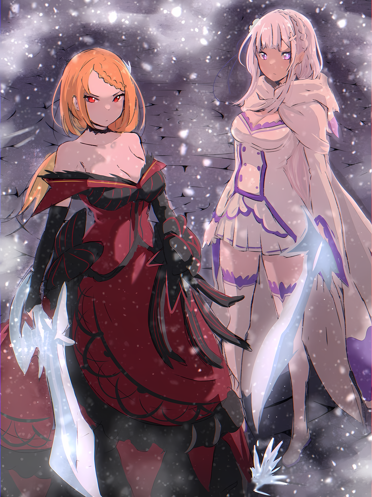
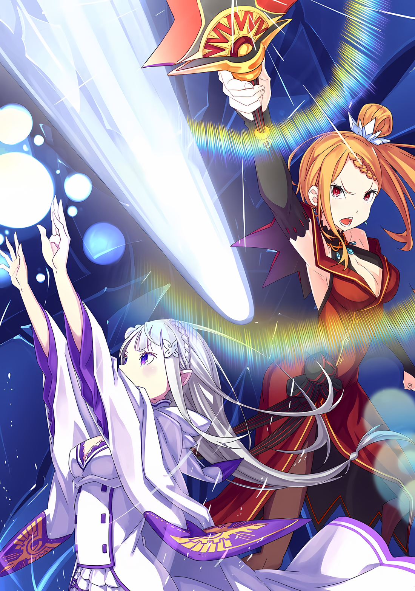
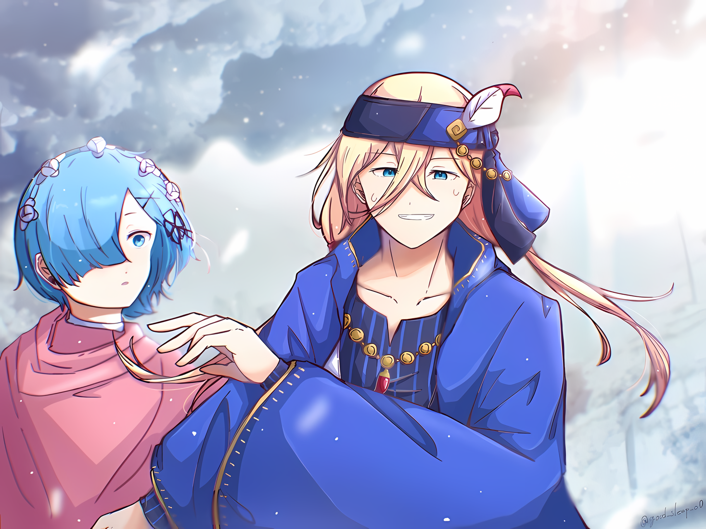

……Как только она узнала о местонахождении Нацуки Субару, Эмилия запаниковала и устроила самый большой переполох в своей жизни.

Эмилия: Пожалуйста, Субару… Я очень надеюсь, что ты будешь в порядке с Рем.

Буря теней, атаковавшая Сторожевую Башню Плеяд, унесла Субару и Рем…… Точнее, не только их. Она знала, что вместе с ними был еще один неизвестный объект.

Эмилия пережила это, не потеряв самообладания, потому что Беатрис и Рам, которые были связаны с этими двумя, подтвердили, что они выжили.

Конечно, даже если бы они были живы, вероятность того, что они могут столкнуться с чем-то опасным или страшным, все еще существовала.

На самом деле, именно потому, что он должен был спасти спящую Рем в неизвестной стране, было определенно, абсолютно точно, что Субару будет действовать безрассудно. Однако, поскольку с Субару не было ни Эмилии, ни Беатрис, он, должно быть, был в панике.

Эмилия: Я должна поспешить и найти их…!

Приняв это решение, Эмилия и группа, приступившая к завоеванию Сторожевой Башни Плеяд, двинулись в путь.

Для начала им нужно было найти способ проникнуть в страну на юге, куда, как считалось, унесло Субару, в Империю Волакия — страну, запретившую путешествия в Королевство Лугуника и из него.

???: Мы попробуем разобраться с этим вопросом в Карараги. Безопасность в Карараги может быть слабее, так как Лугуника и Волакия находятся в состоянии конфронтации.

Это были слова Анастасии, обещавшей сотрудничать в поисках Субару.

Считалось, что группа Анастасии, в которую входили Юлиус и Ехидна, не располагает большим запасом сил после столь мучительного опыта в Сторожевой Башне Плеяд.

Но то, что они все же предложили сделать это для группы Субару, очень обрадовало Эмилию.

Эмилия: Я очень рада, что подружилась с Анастасией-сан.

Анастасия: Нуу, я думаю, мы немного отличаемся от друзей. Как и раньше, наши позиции останутся соперническими и все такое. Но….

Эмилия: Но?

Анастасия: После того, как все дела с Нацуки-куном и Королевским Отбором будут закончены, может, мы станем друзьями? Я похожа на Эмилию-сан тем, что у меня не так много друзей.

Сказав это с легким сердцем, Анастасия пообещала придать им сил.

Несмотря на то, что Эмилия знала, что сейчас не время, это обещание… обещание о поисках Субару… было для нее приятным. Однако, она очень хотела дня, когда оно исполнится и они станут друзьями.

И……

???: Если Анастасия-сама придумает, как пройти через Карараги, то мы попытаемся просто найти путь через границу Волакии…… это будет лучший план, не так ли?

Воссоединившись с Эмилией и остальными после их возвращения из Сторожевой Башни Плеяд, Розвааль, понимая срочность ситуации, уважал желание Эмилии немедленно искать Субару.

Однако, даже используя ранг и силу Розвааля, оказалось, что проникнуть в Империю Волакия не так-то просто. И даже если бы они прилетели, казалось, что летающие драконы загрызли бы их.

Даже заслужив одобрение Розвааля, войти в Империю будет нелегко.

Прежде всего, хотя она и называлась Империей, она была очень большой. Даже если им каким-то образом удастся проникнуть в нее, они не знали, смогут ли они сразу же найти Субару и Рем.

В середине этой все более волнующей ситуации, предложение по выходу из тупика поступило от человека, который в очередной раз доказал свою надежность.

???: По поводу того, как попасть в Империю Волакия, у меня есть идея, а может и нет. Однако это не совсем похвальный способ, и он сопряжен с некоторым риском.

Так заявил, с некоторым колебанием, тот, чье возвращение совпало с возвращением группы Эмилии домой, Отто.

Он, оставшись в Водном городе Пристелла, чтобы восстановиться, вернулся вместе с Гарфиэлем, который остался рядом с ним, и указал путь к надежде для группы Эмилии, которая была сильно обеспокоена своим вызовом.

Однако, эти средства были решительны……

Отто: ……Проникновение через контрабанду. В Пиктате… Один из Пяти Великих Городов к югу от Лугуники. Возможно, я смогу подготовить для вас способ въезда из этого города, моего родного города.

Въезд через контрабанду был тайным проникновением в страну в обход обычных процедур и договоренностей.

Как сказал Отто, это был не очень похвальный метод, и, несомненно, это был довольно опасный выбор, если бы их нашли.

Однако, если другого выхода не было.

Эмилия: Мы должны сделать для них все возможное.

Заручившись твердой решимостью, Эмилия передала свое решение всем остальным.

Никто не сказал ничего вроде «Не будем» на решимость Эмилии, даже Рам и Отто, которые находились под сильным стрессом. Все молились за безопасность Субару.

Эмилия гордилась этим больше всего на свете.

???: Чего бы это ни стоило, мы вернем Субару в целости и сохранности, на самом деле. Мы сделаем это, я полагаю.

Эмилия: Угу, верно. ……Давайте сделаем все, что в наших силах.

Она мягко ответила, крепко сжав руку Беатрис, которая больше всех переживала за Субару.

А затем, в родном городе Отто, пройдя через ссору с его старыми знакомыми, которые охотились за его жизнью; пройдя через красивые переговоры Петры с группой, которая должна была переправить их через границу, и под влиянием свадебной паники по поводу особой вежливости Фредерики, группа, разыскивающая Субару, пересекла страну, и….

Эмилия: ……Достаточно.

В Городе-крепости, где царит безумие, Эмилия, принесшая снег, провозгласила.

△▼△▼△▼△

???: …………

Многочисленные здания рухнули, и от некогда прекрасного городского пейзажа не осталось и следа.

И все же гнев Эмилии только усилился, когда она увидела издалека, как большие фигуры двигаются по небу влево и вправо, используя свои крылья, чтобы крушить жизни людей.

Как они могли сделать такую ужасную вещь?

Мог ли быть лучший способ сделать это, и приложили ли они хоть какие-то усилия, чтобы найти его? Тем не менее, даже та, кто верил в это, сама Эмилия, не могла придумать, как остановить бой в данный момент, кроме как использовать свою собственную силу, что было досадно.

Поэтому Эмилия расстраивалась изо всех сил, стараясь не забыть это чувство.

Для этого……

Эмилия: ……Ледниковый период.

Вокруг Эмилии, пока она это бормотала, мир начал терять тепло с бешеной скоростью.

Воздух медленно остывал, с ледяного неба начали плавно падать белые снежинки. Стремительно, без исключения, Эмилия покрыла холодом периметр города.

С большой осторожностью, регулируя магическую силу, она старалась не переусердствовать.

Она не могла позволить себе ошибиться и допустить, чтобы город превратился в лед, как Великий Лес Элиор, родина Эмилии. Само собой разумеется, даже если у нее и были мысли о том, чтобы растопить его позже, охлаждать его до состояния условной стадии, как жен Регулуса, было строго запрещено.

Все, что Эмилии оставалось сделать, это принести невыносимый ледяной сезон в непривычные к холоду земли Империи.

Пронизывающий холодный ветер, падающие белые снежинки, скапливающиеся, белое дыхание магического сезона льда, накрыли бы Город-крепость, пораженный этим катаклизмом летающих драконов.

И тогда….

Присцилла: Драконье племя слабо противостоит холоду. А когда речь идет о летающих драконах, которые никогда не знали мороза, суровость еще сильнее отразится на их крыльях.

С этими словами на полуразрушенную стену, на которой стояла Эмилия, вскочила фигура, сопровождаемая легким звуком шагов.

Оглянувшись, Эмилия кивнула головой, сказав «Да»,

Эмилия: Перед тем, как я взлетела, Петра-чан сказала мне, что летающие драконы не любят холод. Она очень хорошо учится, и очень быстро узнала много нового об Империи.

Присцилла: Так ты полагаешься на мудрость своего слуги? Неудивительно, ты заставила меня думать, что это достойный план для полудьявола, лишенного мудрости.

Эмилия: Не нужно так говорить. Кроме того, откуда ты знаешь, что я полуэльф…… А?

И тут Эмилия округлила свои аметистовые глаза, ее губы сложились в дудочку из-за того, как говорил собеседник.

Женщина в красном платье, ее длинные оранжевые волосы развевались на холодном ветру; ее прическа отличалась от того, что она помнила, но вот……

Эмилия: А, Присцилла? Почему ты здесь? Это ведь не Лугуника, ты в курсе?

Присцилла: Я скажу тебе то же самое. Хотя, у меня есть идея, почему ты ступила на землю Империи… Как ты проникла в страну?

Эмилия: О, этот способ — секрет. Я не должна рассказывать такое. Я также должна скрывать, кто я такая. Поэтому я должна быть осторожной. Я…

Эмилия была удивлена, увидев Присциллу, женщину, которую она никак не ожидала увидеть в этой чужой стране на юге, но она была странно тронута ее видом.

Однако она не могла остаться просто удивленной. То, как Эмилия проникла в Империю, было неразумным поступком, чем-то, что называют проступком.

Поэтому она не хотела говорить об этом Присцилле без необходимости.

Но……

Эмилия: ……! Присцилла, осторожно!

Прервав то, что она собиралась сказать, Эмилия побудила Присциллу прислушаться.

В следующее мгновение Присцилла, щелкнув языком, отскочила в сторону, и лезвие…… Летающее Крылатое Лезвие, яростно вращаясь, пронзило то место, где она находилась.

Избитая, почти рухнувшая стена была начисто срезана острием клинка, и, наоборот, чудом убереглась от обрушения. Присцилла, чей подол платья развевался, сумела этого избежать и приземлилась на этот раз ближе к Эмилии.

И……

Мэделин: Один за другим, что вы за люди?

Голос девушки, полный гнева, донесся до Эмилии, когда та поймала возвращающееся Летающее Крылатое Лезвие одной рукой.

Если посмотреть вниз, на разрушенный городской пейзаж, то можно увидеть, что среди него стояла девушка с рогами, ее яркие глаза смотрели на Эмилию и Присциллу, стоявших бок о бок.

Казалось, та стояла очень злая. Но Эмилия тоже была очень зла.

Поэтому Эмилия ткнула пальцем в сторону девушки,

Эмилия: Меня зовут Эмили… Эмили! Я просто проходящий Пользователь Духовных Искусств!

Едва не назвав свое настоящее имя в горячке, Эмилия сумела назвать вымышленное имя, которое было заранее оговорено. Глаза Присциллы сузились от ее смелости, а маленькая девочка, которой Эмилия представилась, пробормотала «Пользователь Духовных Искусств…» с настороженным взглядом.

Мэделин: Ты такая же, как та собачка, не так ли…?

Присцилла: Если Аракия — та, о ком ты думаешь, то она — «Пожирательница Духов», а не Пользователь Духовных Искусств. Это было бы заблуждением, Мэделин Эшарт.

Мэделин: Гх….

Присцилла словно прочитала мысли маленькой девочки…… Мэделин, отчего ее щеки заалели. Однако, только что произошло нечто, о чем Эмилия не могла не знать больше.

Эмилия: Что значит «Пожирательница Духов»? Что она делает с духами?

Присцилла: Это именно то, что ты и услышала, она питается духами. Они берут их силу на себя и используют ее по максимуму. Эта практика близка к исчезновению, Аракия — последний оставшийся пользователь в Империи.

Эмилия: Они едят духов!? Как ужасно….

Для Эмилии, Пользователя Духовных Искусств, которая сама заключила контракты со многими микро-духами, это было обескураживающим известием.

Если бы Пак или Беатрис встретили «Пожирателя Духов», их формы были бы съедены? От одной мысли об этом ей становилось жаль их.

Однако, вместо того, чтобы беспокоиться о вещах, которые еще не произошли, приоритетом сейчас была текущая проблема.

Эмилия: Ты, Мэделин-чан?

Присцилла: ……Не принижай этого дракона, полудьявол.

Эмилия: Тогда давай обсудим это как следует, Мэделин. Это из-за тебя эти летающие драконы нападают на город. Я хочу, чтобы ты прекратила это, прямо сейчас.

Переведя взгляд вдаль, Эмилия посмотрела за пределы того места, где бушевала Мэделин, на группу летающих драконов, возобновивших нападение на другом конце города. Их движения казались медленнее, чем мгновение назад, хотя и незначительно.

Сила Эмилии снижала температуру, что, в свою очередь, влияло на жизнеспособность летающих драконов.

Если бы все продолжалось в том же духе, то летающих драконов в этом районе можно было бы ослабить до невозможности полета. Однако она хотела избежать этого, если это возможно. Она также не хотела, чтобы летающие драконы погибли.

Эмилия: Если тебе дороги летающие драконы, то, пожалуйста, прислушайся к моей просьбе.

Мэделин: …………

Эмилия: Мэделин?

Эмилия постаралась как можно честнее передать свои слова.

Возможно, Отто, Рам и Петра могли бы общаться лучше. Но, увидев, что город атакует стая летающих драконов, Эмилия была единственной, кто бросился к нему.

Теперь, когда Эмилия первой оказалась на месте происшествия, она сделала бы все возможное, чтобы помочь.

В результате……

Мэделин: Это ужасно самонадеянно с твоей стороны — обращаться с просьбой к дракону, ты, человек….

Она сделает это, даже если это вызовет гнев Мэделин.

Присцилла: ……Ее никто не сможет убедить, даже если это будешь ты. Не стоит прислушиваться к словам полудракона, тем более той, что прочно прикована к земле.

Услышав ответ Мэделин, полной негодования, Эмилия затаила дыхание. Присцилла, молча слушавшая обмен мнениями между ними, высказала свои соображения по поводу срыва переговоров.

Эмилия расширила глаза, так как это, казалось, ободрило ее.

Эмилия: Присцилла, я всегда думала, что ты так груба со мной.

Присцилла: Я не считаю злом говорить, что то, что недостойно, недостойно. Не извращай мои благожелательные слова. ……Итак, как мы поступим?

Эмилия: Хм.

Кивнув, Эмилия создала ледяную заколку для волос в вытянутой левой руке. Вручив ее Присцилле, последняя с подозрением закрыла один глаз.

Увидев реакцию Присциллы, Эмилия кивнула в знак согласия,

Эмилия: Давай вместе остановим эту девушку. Не будь злой.

Присцилла: Не считай мои поступки проявлением ребячества, ничтожный полудьявол.

Нанеся ответный удар, она приняла заколку, затем собрала свои длинные, струящиеся волосы и закрепила их. Услышав, как щелкнула ледяная застежка, и поняв, что настроение Присциллы вернулось к тому, с которым она была знакома, Эмилия повернулась к стоящей внизу Мэделин.

И……

Мэделин: ……Тошнит от людей, которые бесстрашно относятся к драконам.

Эмилия: У меня недавно был бой с большим Драконом. Так что……

Мэделин: ……кх

Эмилия: Даже если бы ты хотела, чтобы я боялась тебя, у меня не получится!

Угроза Мэделин, продемонстрировавшей свои белые клыки, получила четкий ответ от Эмилии.

Сразу же после этого глаза Мэделин сузились, как у наземного дракона, и Летающее Крылатое Лезвие в ее руке яростно метнулось, нацелившись на Эмилию и Присциллу с огромным импульсом и скоростью.

Наблюдая за его вращающимся приближением, Эмилия создала большой ледяной молот, держа его в обеих руках.

Эмилия рискнула отразить вращающееся Летающее Крылатое Лезвие взмахом своего ледяного молота снизу вверх.

Эмилия: Хия!

Почувствовав мощную отдачу в обеих руках, Эмилия, бросившись вперед, сделала все возможное, чтобы взмахнуть ледяным молотом вверх. Хотя и с трудом, она отклонила траекторию полета лезвия, который прошел над головами Эмилии и Присциллы.

Но ледяной молот разбился с невероятной силой, и Эмилия посмотрела на свои руки, говоря,

Эмилия: Такая сильная… Возможно, сильнее, чем я….

Мэделин: Конечно! Неправильно сравнивать меня, дракона, с людьми, используя один и тот же стандарт….

Маленькая фигурка Мэделин с триумфом шагнула вперед над страдающей Эмилией. ……И тут на голову Мэделин обрушилась глыба льда, более массивная, чем здание мэрии.

Мэделин: ……кх!?

Внезапное появление ледяной массы, а также ее размер и вес, заставили Мэделин растеряться, а затем ее фигура расплющилась.

Волны холода хлынули во всех направлениях, сосредоточившись на ней; белые ветры раздували обломки и рушили здания, вызывая огромные разрушения.

Присцилла: Ты, как ты смеешь разрушать этот город?

Эмилия: А!? Но он уже был разрушен….

Присцилла: У тебя довольно поверхностный взгляд на вещи. Я уверена, что твой слуга, должно быть, очень устал. Тем не менее, ты, наконец, поймешь.

Эмилия: Наконец… поймешь?

Глядя на место, куда упала ледяная глыба, Присцилла скрестила руки и сузила глаза. Эмилия задала вопрос в ее профиль, но ответ прозвучал одновременно и из уст Присциллы, и от зрелища, представшего перед ней.

Ледяная глыба, которая должна была придавить Мэделин к земле, слегка содрогнулась, когда изнутри нее раздался громкий звук, похожий на треск земного шара.

Он исходил от куска льда, под которым подразумевалась земля, откуда девушка, в момент удара, высунула свою руку в воздух.

Присцилла: ……Какими неприятными могут быть полудраконы.

Сразу же после слов Присциллы длинная глыба льда с громовым ревом раскололась пополам.

Удар от разрушения ощущался по всей области, и раздробленный лед превратился в частицы маны, начиная с внешней стороны. Среди разбросанных осколков к дуэту с ревом подскочило само воплощение Дракона…… полудракон.

△▼△▼△▼△

……Ледяные ветры бушевали, прекрасные женщины танцевали на поле боя, где бродили толпы разрушителей.

Если бы кто-нибудь наблюдал за битвой издалека, он бы не поверил своим глазам из-за ее величественности.

Было ли это реальностью или просто сном?

Мэделин: ……РРРРРААААА!!!

С силой, достаточной, чтобы разрушить землю, на которой она стояла, маленькая представительница полудраконов бросила вихрь смерти.

Лезвие разрушения прочертило дугу; с красотой, выдававшей страшную опасность, оно рассекало все на своем пути, разрывало, разрывало мир.

Если бы это была картина или даже красивая обрезка мира, а не разрушение, это было бы прекрасным зрелищем для любого человека, который мог бы созерцать это только из эстетических соображений.

Гнев Мэделин Эшарт был столь утонченным и инстинктивным.

Однако……

Эмилия: Присцилла! Поднимайся!

Небесная красавица с танцующими серебряными волосами создала в воздухе ледяные опоры, увернувшись от брошенного в нее Летающего Крылатого Лезвия; затем она махнула рукой вниз, и, вся земля на улице, замерзнув, потеряла свой первоначальный вид.

Из замерзшей земли поднялся красиво украшенный меч из инея.

Прекрасная принцесса, бегущая по улицам, одним плавным движением выдернула его из земли,

Присцилла: От такого меча пальцы любого, не считая мои, отвалились бы. ……К слову, украшения меча хороши. Я все же использую его.

Арт от ZeroBarto

Бледно-голубая полоса льда вспыхнула, прорезав тело Мэделин по диагонали.

Однако Мэделин, какая бы сила ни была скрыта в ее маленьком теле, лишь слегка отпрянула от удара. Вместо этого ледяной меч, нанесший удар, разлетелся вдребезги.

После этого подошедшая Мэделин взмахнула рукой в сторону Присциллы,

Эмилия: Хья!!!

Не позволяя этому акту насилия пройти бесконтрольно, Эмилия двумя ногами ударила Мэделин, падая прямо сверху.

Обе ее ноги были покрыты льдом, когда она вращалась и наносила удары с высоты, Эмилия безжалостно врезалась в два плеча Мэделин, заставив крепкую девушку отступить на шаг назад.

В тот же миг……

Эмилия: Пожалуйста!

Присцилла: Не указывай мне, что делать.

После того, как Эмилия приземлилась на землю и подставила руки, Присцилла взяла только что созданную пару ледяных мечей, и, перепрыгнув через склонившуюся Эмилию, бросилась на Мэделин.

Ледяные клинки в правой и левой руке Присциллы нацелились на Мэделин под разными углами, но были быстро пойманы когтями ее вытянутых рук, отчего раздался высокий звон.

Мэделин: Не испытывай судьбу…!

Эмилия: АААРИАА!

Разобравшись с мечами-близнецами, Мэделин уже собиралась перейти в контр-атаку, когда ледяной шип прошел прямо рядом с головой Присциллы. Мэделин тут же наклонилась вперед, а Эмилия, поменявшись местами с Присциллой, выпустила ледяное копье со скоростью, которую невозможно было оценить человеческими глазами.

Присцилла: Моя очередь.

Как только Мэделин отбила копье, Присцилла продолжила танец с ледяным мечом.

Подол ее красного платья затрепетал, два сверкающих голубым льдом меча грациозно взмахнули, и танец меча Присциллы среди белого ледяного мира ударил по всему телу Мэделин, заставив ее отступить назад.

Мэделин: ……Почему, почему, почему, почему, почему все так?!

Воскликнула Мэделин, вынужденная бороться с мечами-близнецами Присциллы, которые теперь были в обороне.

Но натиск Присциллы не замедлился. И что еще хуже для Мэделин, как только Присцилла прекратила свой танец с мечами,

Эмилия: Получай! И еще! Хья!

В полной мере используя необычайную скорость реакции, Эмилия в прыжке, не давая Мэделин времени отдышаться, создавала ледяное оружие за ледяным оружием, чтобы обрушить их со всей силы.

……Присцилла была умением, Эмилия — мускулами, и благодаря им наступательные и защитные возможности Мэделин были полностью перекрыты.

Летающее Крылатое Лезвие рассекало, разбивало, размахивало, летало.

Врожденные физические способности драконьего рода были несравнимы со способностями хрупкого человека. Даже получеловек, который был относительно более выносливым по сравнению с обычным человеком, перед драконьим родом был как засохшая веточка.

То же самое касалось даже расы Они, которая, как это ни отвратительно, могла бы стоять на одной земле рядом с полудраконами.

О полудраконах и Они иногда говорили как о сильнейших расах, но это было что-то запредельное.

В конце концов, они были всего лишь высшей расой среди полулюдей. Полудраконы в корне отличались от них.

Полудраконы не были полулюдьми. Ведь они отличались от тех видов, которые были связаны с человеческой расой на базовом уровне.

Полудраконы не принадлежали к человечеству. ……Но почему, тем не менее, все происходило именно так?

Мэделин: Что вы за люди…… Что вы такое!?

Оскорбившись на свой гнев и не сумев нанести ни одного удара, она окончательно израсходовала весь свой гнев.

И вот, после того, как гнев дракона был исчерпан, остался лишь его скрипучий вой. Летающее Крылатое Лезвие в ее руках метнулся в сторону, Эмилия пригнулась, а Присцилла в прыжке уклонилась от него.

Затем, как сверху, так и снизу, обе стороны одновременно ответили на вопль Мэделин.

Кто вы, спросила она….

Эмилия: ……Эмили!

Присцилла: А это я.

Поднятый топор из инея и два сверкающих ледяных клинка нанесли прямой удар по Мэделин.

Острые рога на ее голове были сбиты ледяными лезвиями, а туловище пробито яростным ударом топора мороза, Мэделин была отправлена в полет, не в силах остановить эти удары.

Во время борьбы тело Мэделин подпрыгнуло один раз, затем два раза, высоко в воздухе над тонким слоем снега, и, не теряя скорости, она плюхнулась в кучу обломков, из которой затем поднялся белый шлейф дыма, сопровождаемый громким треском.

Мэделин: …………

Выйдя из рук Мэделин, Летающее Крылатое Лезвие пронзило стену позади нее, и таким образом, роль стены в защите Города-крепости от угроз с юга подошла к концу.

Бросив последний взгляд на стены, рухнувшие с громким стуком, Эмилия медленно поднялась на ноги, настороженно глядя на груду обломков, под которыми была погребена Мэделин.

Эмилия: ……Полагаю, мы сделали это.

Присцилла: Произошел подходящий отскок. К сожалению, укуса не было.

Эмилия: Укуса?

Присцилла шагнула вперед рядом с Эмилией, та наклонила голову, наблюдая, как мечи-близнецы в ее руках превращаются в пыль. По какой-то причине она не могла не посмотреть на рот Присциллы, хотя та ничего не ела.

Присцилла встретила взгляд Эмилии своими пунцовыми глазами и заговорила,

Присцилла: Неужели это все, что из себя представляет та, кто не только полудракон, но и одна из «Девяти Божественных Генералов», вот о чем я говорю.

Эмилия: Что такое… *девять пажественных генералов*… и *полудракон*? Это ведь получеловек, верно?

Присцилла: Раса, которая, как считается, вымерла давным-давно. Говорили, что они обладают способностью общаться с Драконами, расой, которая больше не встречается в этом мире, но я думаю, что это всего лишь суеверный миф.

Эмилия: Драконы… Значит ли это, что они могут говорить и с Волканикой? Волканика немного не в себе….

Когда Эмилия робко попыталась растопить лед, Присцилла подняла брови. Затем она осторожно прижала палец к губам,

Присцилла: Я никогда не думала, что такое слово может прозвучать из твоих уст. Может быть, ты что-то перепутала?

Эмилия: ……? О, ты думаешь, что я шучу? Я вовсе не шучу. Я встречалась с Волканикой совсем недавно, но он был не в себе, потому что так долго был один.…

Эмилия поспешила защититься от недоверия Присциллы. Но она быстро вспомнила о своих приоритетах, сказав: «Сейчас не время»,

Эмилия: Теперь, когда мы победили ее, Мэделин должна остановить летающих драконов!

Присцилла: Учитывая такую холодную погоду, очередь всех этих медлительных летающих драконов еще придет.

Эмилия: А в это время люди будут в опасности! Даже Субару и Рем могут оказаться в опасности….

Присцилла: ……Хм.

Она вскочила с места рядом с Присциллой и направилась к завалу, под которым была погребена Мэделин. За спиной Эмилии она нахмурила брови, глядя на только что произошедший обмен мнениями.

Эта реакция, однако, осталась незамеченной Эмилией, чьи длинные ноги стояли на обломках. Сделав лопату изо льда, она вонзила ее в обломки, пытаясь откопать погребенную Мэделин.

Тем не менее Присцилла выдохнула, глядя ей вслед.

Хорошо, что неожиданно появившийся грандиозный ход привел к меньшим последствиям. Однако от огромного ущерба, нанесенного Мэделин и летающими драконами, они не могли избавиться.

В худшем случае им придется переместить свою базу в Город Демонов Хаосфлейм и положиться на помощь ее соратницы, Верховной Графини Серены Дракрой.

Присцилла: В любом случае, сначала нам придется заставить ее сложить крылья.

Остановившись, чтобы обдумать предстоящие действия, Присцилла взглянула на белое облачное небо.

Огромное количество маны, которым обладала Эмилия, хоть и имело предел диапазона, все же было достаточным для изменения климата, а значит, у нее было множество способов использовать свою силу.

Конечно, то, что ценилось в Волакии, не обязательно ценилось в Лугунике. Скорее всего, если бы она решила жить в Волакии, это не было бы пустой тратой времени.

Но, не смотря на ее характер, личность Эмилии не позволила бы ей жить в Волакии……

Присцилла: …………

Итак, когда Присцилла рисовала мысли в небе, ее глаза тускло мерцали.

Эти пунцовые глаза, похожие на драгоценные камни, мерцали, поскольку они уловили небольшое возмущение в небе над головой.

Затем, как только Присцилла поняла природу этого возмущения..,

Эмилия: Вот ты где! Мэделин, сейчас я тебя вытащу. Но, пожалуйста, будь большой девочкой и расскажи нам свою историю….

Мэделин:……Ах.

Эмилия: А?

Найдя девочку, погребенную под обломками, Эмилия воспользовалась ледяной лопатой, чтобы разгрести остатки здания. Девочка-полудракон лежала на спине, она и ее одежда были покрыты сажей и снегом.

Эмилия внимательно прислушалась, когда губы девушки зашевелились и из них вырвался слабый голос.

Эмилия надеялась, что слова, признающие поражение, заставят летающих драконов отступить.

Однако надежды Эмилии не оправдались: то, что произнесли губы Мэделин, не было признанием поражения.

Она пробормотала только одно слово. Имя.

Мэделин: ……Мезорея.

……В следующее мгновение рев «Дракона», зародившегося над облаками, обрушил на землю разрушения.

△▼△▼△▼△

В тот момент, когда с небес был выпущен белый луч света, Эмилия и Присцилла одновременно бросились в бой.

Без единого звука или предупреждения из земли выросла ледяная башня, на вершину которой вскочили две красавицы…… серебряная и огненная.

В одно мгновение башня выросла до высоты более десяти метров. Стоя на ее вершине, Эмилия подняла обе руки к небу, создав огромный ледяной купол, который накрыл место, куда должен был ударить белый луч.

К нему добавился еще один, еще меньший купол, потом еще один, еще меньший, и так продолжалось до тех пор, пока небо не покрыли шесть ледяных куполов.

Пока Эмилия устанавливала покрытие изо льда и снега, Присцилла протянула свои блестящие пальцы в небо и достала Меч Света из пустоты.

Сокровенный меч был украшен множеством привлекательных драгоценных камней и сиял ярко-красным светом. Однако свет, льющийся изнутри, оставался слабым и даже не приближался к тому, каким он был на пике своих сил.

Несмотря на это, Присцилла подняла свой заветный меч и посмотрела вверх.

В следующее мгновение надвигающийся белый луч света ударился о внешний купол, а менее чем через секунду он пронзил первый, второй и третий купола, устремившись к земле.

Однако было бы неправильно сказать, что купола, которые были пробиты и прорваны, совсем не выполнили своего предназначения.

Как только луч прошел сквозь них, его угол слегка изменился.

Если в первом, втором и третьем случае изменения были незначительными, то в четвертом и пятом они стали более значительными. Наконец, когда была пробита шестая, способ проникновения луча, конечно же, изменился.

Белый луч устремился прямо вниз, к ледяной башне, к тем двоим, что стояли на ее вершине.

И вот на встречу ему пришло глубокое малиновое мерцание, которое красиво, вибрирующе превратилось во вспышку сопротивления, и таким образом, оно было высвобождено….

Иллюстрация к **Ранобэ **Том 30 | Разукрасил NorvakK

△▼△▼△▼△

???: …………

Все звуки полностью исчезли; впервые в жизни он мог наслаждаться полной тишиной в течение, казалось, десяти секунд.

Возможно, на самом деле это длилось меньше секунды, но как только это произошло, распространяющаяся ударная волна, исходящая из южной части, охватила Город-крепость во всех направлениях, и все перевернулось.

Земля поднялась с поверхности, а здания были вырваны из своих фундаментов. Тех, кто не имел укрытия, сдуло, как мертвые листья, и даже стая парящих в небесах драконов была атакована ураганом.

Без пощады, без предвзятости, ударная волна, поглотившая все, обрушилась на всех в городе.

Естественно, Флоп, который бегал за ранеными в самом большом особняке города, превращенном во временный центр лечения раненых, также был потрясен ударом и его отбросило к стене.

Флоп: ……ТЦ

Насколько он мог почувствовать, это могло длиться несколько секунд, либо десяток секунд, или даже несколько минут.

Он почувствовал мощный удар по спине, от которого ему показалось, что все его внутренние органы выворачиваются наизнанку. Он не почувствовал сильной боли, но возможность того, что боль появится позже, или он мог пострадать от чего-то настолько болезненного, что не мог ничего почувствовать, тоже существовала.

Если бы это действительно было так, он хотел бы продолжать свою обычную жизнь, смотреть, как его младшая сестра Медиум живет в безопасности и счастье, наслаждаться чувством выполненного долга, которого он достиг, успешно отомстив миру, и не замечать этого до самой старости и смерти.

После этого невозможно будет определить, умер ли он от ран или от старости.

Флоп: Посмотрим, может быть, это не слишком серьезно….

Будучи очень осторожным, он поднял свое тело, тщательно оценив свое состояние.

Его руки и ноги двигались, и все пальцы остались на руках. Похоже, ему повезло, что он чувствовал и уши, и нос, да и глаза были тоже в полном порядке. Он не мог ослабить бдительность, но и не должен был быть слишком пессимистичным.

Тряхнув головой, Флоп встал, протер затуманенные глаза и окинул взглядом окружающую обстановку.

Некогда величественные и роскошные декорации были полностью изменены, а внутри особняк превратился в адский пейзаж, в котором преобладали запах крови и стоны. Добавьте к этому только что прошедшую ударную волну, и мрачная ситуация в этом месте стала еще мрачнее.

У некоторых из тех, кому была оказана помощь, ударная волна, возможно, вновь усилила или усугубила боль. Им нужно было облегчить их боль, то есть протянуть руку помощи.

Флоп: Интересно, Дворецкий-кун и мисс Утаката тоже в порядке….

Оставив Присциллу разбираться с Мэделин, с которой они столкнулись, Флоп и остальные присоединился к Рем в особняке и помогал, как мог, с ранеными.

Он помогал одновременно беспокоясь о Присцилле и Шульте…… глаза последнего все еще пылали, даже когда ему удалось как-то успокоиться.

Флоп не смог бы спокойно жить, если бы все оборвалось из-за этого взрывного удара.

???: Что за……?

Когда Флоп огляделся вокруг, он услышал голос, произнесенный тоном, полным боли.

Направив взгляд в сторону этого голоса, он увидел Рем, выглядывающую из глубины зала. Она была одной из тех, кто оказывал помощь тяжелораненым, остро нуждавшимся в целительной магии, а также одной из тех, кто был ошеломлен произошедшим накануне крушением.

Рем, скорчив гримасу, держа трость, выглянула в окно, чтобы посмотреть, что произошло.

Флоп тоже встревожился, гадая, не случилось ли чего-то более страшного, чем стая летающих драконов или один из «Девяти Божественных Генералов», разбушевавшийся на полную катушку.

И сразу после этого……

Рем: ……Какой ужас.

Глаза Рем расширились, выражение лица стало мрачным, и она в панике бросилась к двери особняка. Флоп крикнул ей в спину «Мисс!», когда она бросилась наружу, гадая, что же она увидела снаружи.

Несмотря на больные бока и колени, Флоп погнался за Рем, когда она выбежала на улицу. Когда она достигла палисадника особняка, она присела рядом с упавшей фигурой.

Это был еще один раненый, которого выбросило наружу в результате предыдущего удара.

Подойдя к сидящей Рем, которая проверяла состояние фигуры, Флоп понял ужасные последствия предыдущего удара, которые он не смог увидеть из особняка.

Флоп: Это….

Мерцающие белые снежинки падали на Гуарал. Южное небо было покрыто слоями плотных облаков, сквозь которые пробивались солнечные лучи.

Выдыхая белое дыхание, Флоп дрожал от почти фантастического зрелища.

Внезапно температура в окрестностях резко понизилась, и в придачу к этому развернулось такое захватывающее зрелище, как это. Даже во сне такую сцену было бы трудно воплотить в реальность.

Говоря иначе, у него возникла парадоксальная мысль, что это не сон, на что Флоп покачал головой.

Рем: Флоп-сан, пожалуйста, помоги мне. Нам нужно отнести эту девушку внутрь….

Флоп: Да, конечно. Даже под этим таинственным небом мы можем делать только то, что в наших силах. Поэтому, мы обязаны сделать все, что в наших силах….

Повернувшись, Флоп попытался помочь Рем. Затем, прервав свою речь на полуслове, он расширил свои голубые глаза.

Причина была очевидна, и она лежала на спине Рем, которая просила его о помощи.

Позади Рем была маленькая фигура, которую отбросило в сторону после предыдущего удара и которую она предложила отнести в особняк для оказания медицинской помощи. Она была небольших размеров и изящного вида, и на голове у нее были сдвоенные черные рожки.

После чего, возможно ошеломленная, девочка медленно приподнялась за спиной Рем, собираясь небрежно взмахнуть рукой, украшенной острыми когтями.

Флоп: …………

Флоп снова испытал ощущение, что звук исчезает, а течение времени искажается.

Глядя на него, Рем не замечала угрозы, нависшей над ней. Эта самая угроза, девушка, казалось, действовала скорее из защитного инстинкта, чем из намерения причинить Рем вред.

Должно быть, она пережила ужасный опыт. Он сочувствовал ей, но это было что-то прискорбное и неуправляемое, что не изменишь сочувствием.

Флоп: …………

Куне и Хоули, отвечающим за охрану особняка, вероятно, потребуется некоторое время, чтобы оправиться от полученного ранее удара. В пределах видимости не было никаких признаков этих девушек, и он не мог рассчитывать на то, что они справятся с этим.

Шульт, глаза которого горели огнем, Утаката, которая оказывала медицинскую помощь и поддерживала боевой дух бойцов, даже Хейнкель, который потерял сознание и никак не мог очнуться…… ни на кого из них нельзя было рассчитывать.

Когда он закрывал глаза, то видел свою младшую сестру, которая улыбалась ему до своих век.

Он гордился своей сестрой, которая поклялась себе, что станет настолько сильной, что ее брат никогда не пострадает. В его голове пронеслись несколько фигур — его благодетеля и его заклятого брата, тех, кто дал ему и его сестре возможность выйти в мир.

……Цени свою жизнь, Флоп. Самопожертвование — это для идиотов.

Однажды его благодетель уже смеялся над безрассудным образом жизни Флопа.

В этот момент Флоп заявил то же самое, что и тогда.

Флоп: Называйте меня идиотом, если хотите.

Арт от good_sleep_o0

Потому что все, кто любил его, хлопали в ладоши и смеялись над его ответом.

Рем: Флоп-са….

Он шагнул и вытянутой рукой надавил на стройные плечи Рем, выводя ее из-под удара.

И, на пути замахнувшейся руки с когтями, этот идиот вклинился вместо неё.

……Брызнула кровь, и Флоп О'Коннелл упал на холодную землю.
