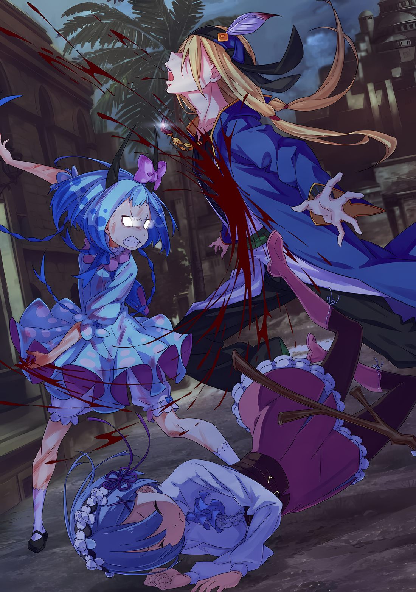

……Это было унизительно.

Ее клыки скрипели, скрежеща, внутренности кипели от ярости, душа трещала от негодования.

Что она сделала? Ее разыгрывали ничтожные людишки, ее загнали в угол, не сделав того, что нужно было сделать, ее заставили раскрыть свою козырную карту, зная, что так поступать не следовало.

???: Какой беспорядок.

Это было постыдное зрелище, она выставила себя в таком состоянии, которое драконьему роду не следовало так легко демонстрировать.

Если бы здесь присутствовали другие полудраконы, они бы наверняка скорчили свои лица из-за этой ужасной ситуации. А также, прокляли бы Мэделин за такое затруднительное положение и за позор, который она принесла драконьему роду, прежде чем убить ее; Мэделин и так наполовину была готова умереть в приступе гнева, направленного как на себя, так и на всех остальных.

Но этого никогда бы не случилось.

Других драконов не было. Мэделин всегда была одна. Вот почему……

……Поэтому, чего бы ей это ни стоило, она должна была уничтожить убийцу человека, которого она хотела видеть своим товарищем.

???: Флоп-сан, пожалуйста, помоги мне. Мы должны отнести эту девочку внутрь….

Из глубин своего затуманенного сознания она услышала голос, который, казалось, исходил от кого-то.

Нет, не от кого-то, этот голос исходил от человека. Поскольку других драконов не было, все, кто говорил на языке людей, были людьми, существами, в корне отличавшимися от нее самой.

И вот, ее голова раскалилась добела, перед лицом слишком знакомого унижения, полученного от рук существ, отличающихся от нее самой.

Женщина багрового цвета, одетая в платье, и женщина серебряного цвета, принесшая с собой снег.

Они действовали вместе с ужасающей точностью, доводя сознание Мэделин до белого каления.

Она подняла свое тело, словно кто-то нес ее, и вытянула свою руку в сторону, откуда доносился голос.

На ее глазах она почти разорвала стройную спину, однако……

???: Называйте меня идиотом, если хотите.

Она услышала голос, исходящий от кого-то другого, и сразу после этого силуэт перед ее глазами сменился другим.

Оттолкнувшись от стройной спины, перед ее глазами стоял стройный некто. И именно на него она замахнулась когтями, после чего почувствовала отдачу от острия, раздирающего плоть в ее руке.

Иллюстрация к **Ранобэ** Том 30 | Разукрасил NorvakK

???: ………

Кровь брызнула повсюду; стройная фигура беспомощно рухнула, пораженная силой драконьего рода.

«Я сделала это» — не думала она. Как ни странно, отсутствие реакции заставило ее понять, что стройная фигура, которую она разорвала, не была объектом ее жгучей ненависти.

Несмотря на это……

Мэделин: Итак, кто следующий…?!

Кто хочет быть разорванным на части моими когтями, или так она пыталась выкрикнуть, обнажив клыки.

Она пнула ногой тело своего теперь уже мертвого противника, собираясь отдать свое тело свирепости в поисках следующей добычи. При этом она смотрела на фигуру своего поверженного врага..,

Мэделин: …Э?

На земле лежал мужчина, его длинные золотистые волосы рассыпались по полу, бледная кожа пропиталась кровью.

Она не знала его. Она могла лишь приблизительно различать лица представителей человеческих рас, но этот мужчина не принадлежал к числу тех, кого она могла различить.

Поэтому ее внимание привлек не сам человек, а то, что он носил.

На слабой груди упавшего мужчины, разорванной и обнаженной, залитой кровью, висело украшение, которое он носил на шее, сделанное из клыка зверя.

……Нет, не из клыка зверя.

Оно было из… Оно было из… Оно было из… онобылоизонобылоизонобылоиз….

△▼△▼△▼△

Рем: …………

Когда Флоп подбежал к ней и толкнул ее в плечо, Рем упала на траву в саду.

Она не ожидала такой силы. Не сумев удержать равновесие, она упала боком на зелень.

Однако расспрашивать Флопа о том, что он вдруг натворил, было некомильфо.

Ведь гораздо более красноречивый ответ был разложен перед Рем в виде яркого пурпурного цвета.

Рем: Флоп-сан!

Прижав свои руки к траве, голос Рем надломился из-за этой сцены.

Перед ней, лежа на спине там, где Рем была несколько секунд назад, лежал Флоп, на его теле были глубокие раны от плеча до пояса.

Четыре раны, словно нанесенные острыми лезвиями, прорезали переднюю часть тела Флопа.

И Рем сразу поняла, что эти раны — результат его попытки защитить ее.

И что это сделала маленькая девочка, к которой Рем побежала, чтобы оказать помощь.

Рем: …………

Девочка с небесно-голубыми волосами стояла неподвижно, замахнувшись рукой, с кончиков ее когтей капала кровь после того, как она вырвала плоть Флопа.

Тот был ранен, когда защитил Рем от девочки, которая пыталась ее убить.

Рем тут же попыталась подняться, чтобы осмотреть его раны,

Рем: Дай мне пройти! Флоп-сан! Дай мне осмотреть твои раны… Ааа!

Но когда Рем попыталась подойти ко Флопу, ей помешали тонкие руки маленькой девочки. Девочка сделала шаг ко Флопу, затем схватила Рем за плечо и толкнула ее вниз.

Когда Рем испугалась, что та, возможно, собирается прикончить Флопа, кровь в ее теле резко зациркулировала еще сильнее.

И тут же рука маленькой девочки схватила Флопа за шею, и, грубо обращаясь с ним, заставила его встать.

Затем……

Мэделин: Почему клык дракона… Почему клык Карильона висит у тебя на шее?

С отчаянием и горем на лице девушка задала этот вопрос, издав что-то похожее на крик.

На мгновение ход мыслей Рем приостановился, не понимая смысла вопроса. Тем временем девочка все еще повторяла вопрос «Почему?», обращаясь к Флопу, глаза которого были закрыты.

Никакого ответа от Флопа не последовало, сознание которого оставалось погруженным во тьму. Однако не было никаких сомнений в том, что слабые угольки его жизни угасают, поскольку раны на его теле продолжали непрерывно кровоточить.

Мэделин: Ответь мне! Ответь! Если ты не можешь сделать этого….

Рем: П-пожалуйста, остановись! Он без сознания! Он сейчас умрет!

Мэделин: ……тц.

Рем схватилась за руку маленькой девочки, которая грубо схватила Флопа, как бы желая приблизиться к ней. Золотистые глаза маленькой девочки в гневе повернулись из-за вмешательства Рем, но она и ее дух выдержали интенсивность этого взгляда.

Когда на кону стояла жизнь Флопа, Рем никак нельзя было запугать.

Рем: Позволь мне немедленно его вылечить! Иначе, Флоп-сан….

Мэделин: Какой смысл его лечить? Если он все равно умрет, прежде чем это случится….

Рем: Исцеляющая магия! Я могу исцелять!

Отчаянная мольба Рем заставила руки маленькой девочки слегка расслабиться.

Флоп, как бы тяжело он ни был ранен, никак не мог быть спасен простым медицинским лечением. Но исцеляющая магия — это совсем другое дело. Золотистые глаза девочки впервые правильно отразили Рем.

Мэделин: ……Ты можешь его спасти?

Рем: ――. Я сделаю это. Чего бы мне это ни стоило…!

Мэделин: Тогда сделай это немедленно.

Доверилась ли она словам Рем или поняла, что другой альтернативы нет?

Приняв одностороннее решение, девочка толкнула тело Флопа, заставив его упасть на Рем. Но у нее не было возможности протестовать против такого поведения.

Рем: Выглядит ужасно….

Оценивая раны Флопа, когда он был передан ей, Рем пробормотала про себя, что это ужасное зрелище.

Белая кожа Флопа была разодрана, словно когтями зверя, оставив четыре зияющие раны. Они были глубоки и на вид болезненны, похожие на трещины в стене.

Кровь, которая текла непрерывным потоком, была задержана тканью, которой Флоп обмотал голову, и на раны была наложена исцеляющая магия — сразу после этого все тело Рем охватило чувство усталости.

Рем: ……кх.

Это произошло после того, как она уже исцелила многих людей, пострадавших во время налета летающих драконов.

Хотя она ограничила свои целительные техники пациентами, которым это было совершенно необходимо, чтобы уменьшить истощение, они требовали так много энергии, что усталость была неизбежна.

Затем наступило время лечения Флопа, человека, находящегося на грани смерти. Психическое бремя тоже было тяжелым.

Рем: Тем не менее, сдаваться нельзя….

Поэтому Рем сказала себе, что такой возможности не существует, и сосредоточила свое внимание на ранах Флопа.

Когда Рем сосредоточилась, слова Присциллы ожили в ее сознании. Они послужили ей советом, пока она размышляла над своими воспоминаниями, обстоятельствами и обязанностями.

Слова, сказанные ей во время дней, проведенных с Присциллой в городе после расставания с Субару и остальными……

«Присцилла: Смотри не на рану, а на саму жизнь. Ведь тело живого существа — это не только кровь, но и всевозможные невидимые вещи, которые циркулируют в нем. За пределами этого ты и должна постичь целительные искусства.»

«Присцилла: Что же это такое, я не смогу открыть тебе, поскольку я ими не пользуюсь. Для удобства я называю это жизнью. Ты можешь называть это так, как тебе больше нравится. Однако….»

«Присцилла: Помни, Рем, ты — жалкая девушка, потерявшая память, потерявшая основу. Ты потеряла все, но ты обладаешь силой исцелять людей. Это твоя сущность.»

«Присцилла: ……Никто не может убежать от того, кто он есть. Старайся помнить мои слова, будь усердна.»

Рем: ……Смотреть… на жизнь.

Болезненные раны сами по себе не были тем, что нужно было залатать; скорее, сама жизнь, то, что вытекало из Флопа и нуждалось в сохранении, должна была быть сдержана. Или, возможно, ее даже нужно было увеличить, чтобы спасти его жизнь.

Целительская магия заключалась не только в том, чтобы заполнить изрезанную плоть, заклеить раны или облегчить боль.

По сути, целительское искусство — это не магия, исцеляющая раны, а магия, спасающая жизни.

Если бы она могла применить это осознание и технику вмешательства в жизнь….

……то Флоп сможет сохранить свою сокращающуюся жизнь, что спасет его от смерти.

Рем: …………

Стремясь оптимально использовать свои ограниченные силы, Рем довела до предела отточенную технику исцеления.

Соединяя нити жизни, которые нужно было соединить, останавливая поток жизни, который нужно было остановить, и возвращая жизненную силу угасающему свету жизни. ……Она спасет жизнь Флопу.

Рем: Флоп-сан……!

Его дыхание, ставшее поверхностным и слабым, и цвет его щек, ставших бледными и бескровными.

Когда оба эти признака постепенно начали проявляться, Рем попыталась позвать его, чтобы получить твердый ответ. На ее зов длинные ресницы Флопа дрогнули, и его голубые глаза слегка приоткрылись.

Сознание Флопа по-прежнему оставалось пустым. Однако, если она продолжит применять целительную магию, он выживет.

И вот, когда Рем уже собиралась вздохнуть с облегчением, губы Флопа задрожали.

Затем, слабо выдохнув, он заговорил.

Флоп: ……Не надо… исцелять меня полностью.

Рем: ……Э?

Эти невероятные слова ударили по барабанным перепонкам, и Рем издала приглушенный вздох.

Шок был настолько сильным, что ее концентрация была нарушена, и даже использование магии исцеления было затруднено. Веки Флопа снова закрылись, и его сознание ускользнуло, прежде чем Рем успела поспешить сосредоточиться на своей целительной магии.

На этот раз Флоп был полностью без сознания; Рем сосредоточила свою целительную магию на ране, наполовину сбитая с толку значением его предыдущих слов.

Почему Флоп сказал эти слова?

Что именно он имел в виду, говоря, что она не должна его лечить?

Рем: Ты сказал что-то настолько странное, потому что был дезориентирован?

Это было возможно. Учитывая количество пролитой крови, то, что он пришел в сознание даже на одно мгновение, было чудом.

Неудивительно, что, поскольку его сознание было затуманено, Флоп говорил бессмысленные вещи. Однако, несмотря на их короткое знакомство, доверие Рем к нему было велико.

Флоп был человеком, который тщательно все обдумает и всегда выскажет свое честное мнение.

Предположим также, что слова Флопа были результатом того, что он выжал из себя все, что мог.

Возможно, было бы слишком неискренне отвергать их как бредни.

Рем: …………

Почему он сказал, что его нельзя исцелять?

……Нет, во-первых, что сказал Флоп? Это было не «не исцеляй меня». Это было «не исцеляй меня полностью».

Рем: Ты… не хочешь, чтобы я исцелила тебя полностью?

Фраза «исцелять полностью» была странной.

Она не собиралась прекратить исцеление, а скорее исцелить не до конца. Однако, если она не исцелит его до конца, то жизнь Флопа останется под угрозой.

Мана Рем тоже была ограничена. Прежде всего, она не понимала смысла такого поступка. Она спасет жизнь Флопа должным образом, и только потом……

Рем: ……А.

Подумав об этом, Рем поняла, что ее восприятие ситуации было неверным.

Она так отчаянно концентрировалась на лечении Флопа, что совершенно не замечала окружающую обстановку.

Рем: …………

Девушка, совершившая этот поступок, стояла позади Рем, которая лечила раны Флопа. Более того, стая летающих драконов все еще летала над стремительно замерзающим городом, и в разных его частях продолжались ожесточенные бои.

Ничего не могло измениться к лучшему. Даже если бы раны Флопа были исцелены.

И этот призыв Флопа напомнил Рем об одной возможности.

Это было……

Рем: ……Кто ты?

Не оборачиваясь, Рем задала этот вопрос девушке позади себя.

Хотя Рем не стояла перед ней, когда она говорила, девочка поняла, что предметом ее вопроса была она сама. Сразу же после этого раздался звук щелкающих клыков маленькой девочки.

Мэделин: Ты, сейчас не время для таких разговоров. Если у тебя есть время волноваться, то исцели этого человека!

Рем: Я тоже хочу его исцелить! Но….

Мэделин: Но, что!?

Рем: Но! Я не могу сосредоточиться, потому что мне интересно, кто ты. Если это будет продолжаться, я не смогу продолжать магию.

Не в силах придумать оправдание, Рем ответила ужасно по-детски. Если бы это вызвало гневный ответ другой стороны, то неудивительно, что когти, пронзившие Флопа, теперь были направлены на Рем.

Но в ответ на неудачное опровержение Рем, девушка испустила бурный выдох, и……

Мэделин: …Мэделин.

Рем: ……Что ты сказала?

Мэделин: Мэделин Эшарт! Генерал Первого класса Империи!

В тоне голоса, который нельзя было назвать ни сердитым, ни нетерпеливым, девушка… Мэделин… ответила на вопрос Рем.

Отчасти удивление вызвал тот факт, что она вообще ответила, но еще большее потрясение вызвал титул Мэделин. Она называла себя Генералом Первого класса Империи, и Рем знала, какое значение имела эта должность на этой земле.

И это понимание совпадало с возможными подозрениями, зародившимися в Рем.

Другими словами….

Мэделин: ……? Ты, что ты делаешь? Почему…?

Рем: …………

Мэделин: Почему ты перестала лечить того человека?

Сделав глубокий вдох, Рем убрала руку, которую держала над раной Флопа.

Естественно, исцеляющая магия для лечения ран Флопа была прервана, что заставило Мэделин сорваться; она схватила Рем за воротник, заставив ее повернуться к себе.

Пересилив силу ее руки, Рем мужественно посмотрела на Мэделин.

А затем……

Мэделин: Отвечай! Ты, во что ты играешь!?

Рем: ……Если ты хочешь, чтобы я продолжила лечить Флоп-сана, у меня есть условие.

Мэделин: Условие…? Что, ты вдруг стала бредить…

Рем: ……Пожалуйста, заставь стаю летающих драконов, атакующих город, уйти. Если ты не согласишься на это условие, я не смогу продолжать исцеление.

И вот, переговоры были предложены непосредственно маленькой девочке, возглавлявшей стаю летающих драконов.

△▼△▼△▼△

……Она не должна исцелять его до конца.

Именно так Рем истолковала загадочные слова Флопа.

По неизвестным причинам Мэделин была сильно обеспокоена выживанием Флопа. За ее привязанностью к нему должна была быть какая-то причина, и в настоящее время только Рем могла решить, что с ним случится.

Используя жизнь Флопа в качестве разменной монеты, она могла положить конец нападениям на город.

Этот поступок, который, возможно, можно было бы назвать бесчеловечным, Рем твердо решила довести до конца.

Она не собиралась придумывать никаких оправданий, говоря, что этого хотел сам Флоп. Она думала о том, что, использовав его жизнь, она спасет Город-крепость от нынешнего бедственного положения.

Даже если это расходилось с истинными намерениями Флопа, Рем уже начала действовать.

Мэделин: Что…?

Мэделин воскликнула в недоумении от предъявленного ей требования.

Это было вполне естественно. Рем была в таком же замешательстве, когда услышала слова Флопа. Она понимала, что с Мэделин происходит то же самое.

Однако она не испытывала к ней никакого сочувствия. Это было не то, что Рем могла себе позволить.

Рем: …………

Возбуждение, вызванное приостановкой исцеления Флопа, медленно сжигало грудь Рем.

В глубине души она хотела только одного — немедленно возобновить магию исцеления и сделать все, чтобы спасти его жизнь. Его жизнь, и без того близкая к исчезновению, висела на кончиках ее пальцев; ее восстановление должно было решиться в этот критический момент.

С каждым мгновением шансы Флопа уменьшались все больше и больше.

Рем: Каков твой ответ? Пожалуйста, решай быстрее.

Стараясь не выдать своего нетерпения, Рем надавила на Мэделин, чтобы та приняла решение.

Она пыталась внушить Мэделин мысль, что это ее загоняют в угол, а не она сама. Тем самым она надеялась максимально сохранить мизерные шансы Флопа.

Белый свет, потрясший весь город некоторое время назад, все еще оставлял сильное впечатление; Куну и Хоули, охранявших особняк, нигде не было видно. Им потребуется некоторое время, чтобы прийти в себя.

Надеяться на то, что из этого тупика удастся выбраться извне, было нельзя. Исход дела полностью зависел от Рем.

Рем: Мэделин-сан, у нас нет так много вре….

Мэделин: ……Не смотри на драконов свысока.

Рем: Гх…!

Все дальнейшие попытки вырвать у нее руку были прерваны тем, что ладонь Мэделин с силой надавила на ее горло.

Маленькая рука сжалась на шее Рем, не давая ей произнести ни слова. ……Нет, Мэделин вообще отказывалась вести переговоры.

Ее золотые глаза пылали гневом, она не могла смириться с дерзостью Рем, навязывающего свои условия.

Пугающая, могучая драконическая энергия, выдававшая детскую внешность Мэделин, захлестнула Рем, заставив ее сердце сжаться от страха; внутри нее возникло желание немедленно отказаться от своего безрассудного поступка.

Ей захотелось встать на колени и попросить прощения за свое высокомерие.

Однако……

Рем: …………

Ей вспомнился Субару, который стоял перед Рем, пытаясь защитить ее от врага, столь же могущественного, как и этот.

Несмотря на то, что Субару был одет в нелепую женскую маскировку, представляя собой неприглядное и постыдное зрелище, он все же стоял там, рискуя жизнью, чтобы защитить Рем. …Нет, дело не ограничилось только этим случаем.

В глазах Рем Субару не был ни особенным, ни сильным.

Однако, несмотря на испуг перед опасностью, Субару не отступал ни на шаг.

Рем, представляя себе Субару, ругала себя за то, что так переполнена страхом, что не может сдвинуться с места.

Он никогда не опускал взгляд и не бросался наутек.

Он никогда не проявлял таких наивных представлений и такой шаткой решимости.

Рем: Даже….

Мэделин: Что такое?

Рем: Даже если ты убьешь меня… Ты проиграешь…

Глаза Мэделин расширились от удивления, когда Рем произнесла фразу, задыхаясь от удушья.

Если бы Мэделин в порыве гнева убила Рем, она бы упустила возможность поговорить с Флопом.

Так что в конечном итоге природа и суть выбора, с которым столкнулась Мэделин, не изменились.

Уничтожить город или оставить Флопа в живых — таковы были два варианта.

Как Генерал Первого класса Империи, Мэделин была обязана выполнить возложенную на нее роль. Однако в ее поведении и словах Рем нашла крохотную возможность для успеха.

Мэделин действительно хотела обменяться словами с Флопом. Она хотела кое-что уточнить. Насколько важно было для Мэделин что-то подтвердить?

В этом Рем увидела нечто ценное, что могло решить исход этой битвы……

Рем: ……Что ты будешь делать?

Мэделин: …………

Рем: ……Выбирай. Убьешь или оставишь в живых?

△▼△▼△▼△

……Ее затуманенное белым сознание постепенно прояснилось, и мир вокруг нее медленно обрел цвет.

???: ……Ух.

Вместе с пробуждением сознания, она почувствовала ужасно тяжелое гнетущее ощущение во всем теле.

Казалось, что на ее тело навалились обломки, тяжелое ощущение давило на все ее существо, затрудняя дыхание. Она пошевелила руками, пытаясь оттолкнуть его любым способом, и……

???: Ххы, нааа……

Как только она вытянула руки из стесненного положения, давление исчезло с громким стуком.

Только тогда она поняла, что это не было ее воображением; она действительно находилась под грудой обломков, внезапно осознав причину, по которой ей было так трудно дышать.

Убедившись в этом, она стала пытаться вспомнить, почему она оказалась в ловушке под обломками….

Эмилия: ……Точно. Я была с Присциллой, сражалась с Мэделин.

Вспоминая события, произошедшие незадолго до этого, Эмилия наблюдала за окружающим пейзажем.

Перед ней расстилались бесхозные обломки городского пейзажа. Здания рушились, их обломки разлетались в разные стороны.

При виде этого зрелища, похожего на опавшие листья, разбросанные сильным ветром, Эмилия испустила небольшой вздох.

Белый снег, падающий тут и там, был результатом пространства оледенения, созданного Эмилией — особая техника, которую Субару назвал «Ледниковый период».

Однако то, что окрасило сознание Эмилии в белый цвет, было другое белое нечто, упавшее с неба.

Это……

Эмилия: ……Вызывает те же ощущения, что и Волканика.

Белый свет, спустившийся с небес на землю, был атакой, вызванной волей Мэделин.

Даже не зная, что должно было произойти, Эмилия предприняла быстрые действия и объединилась с Присциллой, создав ледяные барьеры, чтобы перехватить этот белый свет.

Слои ледяной защиты были разрушены, и наконец, заветный алый меч Присциллы вспыхнул….

Эмилия: После этого меня завалило и… Это нехорошо! А как же Присцилла!?

Вспомнив о случившемся, Эмилия начала искать Присциллу, которой нигде не было видно.

Поскольку Эмилия оказалась под завалами, неудивительно, что Присцилла, которая была рядом с ней, пострадала так же. Если так, то существовала вероятность, что Присцилла будет погребена, не в силах выбраться, в отличие от такой физически сильной, как Эмилия.

Она должна была быстро помочь ей. Было бы печально, если бы она дрожала от безутешного страха.

Эмилия: Присцилла! Присцилла, где ты!? Ответь! Я сейчас же вытащу тебя!!!

???: ……Уйми свой щебет, полудьявол.

Эмилия: Присцилла!?

Пересиливая боль, Эмилия перевернула обломки рядом с собой. Получив ответ на свой вопрос, она торопливо побежала на голос.

И там, на развалинах рухнувших городских стен, по другую сторону горы скопившихся обломков, она нашла Присциллу.

Сидя на обломках, Присцилла фыркнула на Эмилию, бросившуюся к ней.

Присцилла: Какое уродливое упрямство. Полагаю, ты жива.

Эмилия: Да, спасибо, что беспокоишься обо мне. Ты тоже в порядке, Присцилла… верно? Но я рада, что с тобой все в порядке.

Присцилла: Хмф.

Столкнувшись с Эмилией, поглаживающей себя чуть выше груди в знак облегчения, Присцилла вздохнула, выглядя немного более усталой, чем обычно. Ее великолепное красное платье было порвано тут и там, ее светлая кожа была испачкана пылью и синяками.

Поскольку Присцилла всегда была такой безупречной, смотреть на нее было тем более больно.

Однако, когда Эмилия опустила глаза от грусти, Присцилла недовольно посмотрела на нее и сказала: «Не смотри на меня свысока»,

Присцилла: Не смеши меня своими тревожными размышлениями. Ты и я — враги, соперничающие за трон, прежде всего. Твоим истинным желанием должно быть мое падение.

Эмилия: Хмф, опять ты говоришь гадости. Я не хочу, чтобы Присцилла пострадала. Кроме того….

Присцилла: Что?

Эмилия: Ты серьезно считаешь меня врагом. Это немного удивительно.

Эмилия предполагала, что Присцилла не проявляет к ней никакого интереса.

Эта оценка была неожиданной и приятной для Эмилии, которая знала, что она отстает от других кандидатов на Королевских Выборах, таких как Круш, Анастасия и Фельт.

То, что ее поставили рядом с этими удивительными людьми, было признанием ее усилий.

Присцилла: …………

Эмилия: Оо, но если ты в безопасности, Присцилла, мы должны действовать быстро, мы не знаем, куда отправилась Мэделин, поэтому мы должны нейтрализовать всю опасность в городе…!

Она могла только радоваться, что Присцилла цела и невредима, теперь, когда кризис, в котором находился город, закончился.

Правда, ей хотелось, чтобы Мэделин остановила нападение летающих драконов, но раз уж ей не удалось обнаружить Мэделин во время поисков Присциллы, то, скорее всего, она сбежала.

Если на Мэделин нельзя будет положиться, Эмилии и остальным придется самим отгонять летающих драконов.

Поэтому, чтобы помочь в битве, она решила поспешить туда, где летающих драконов было больше всего.

Присцилла: ……Постой, полудьявол.

Эмилия: Я бы хотела подождать тебя, но мы не можем отдыхать, нам нужно спешить….

Присцилла: Нет необходимости. Ситуация меняется.

Остановив свой торопливый бег, Эмилия обернулась и удивленно воскликнула: «А?».

Присцилла, остановив ее, подняла голову, сидя на обломках. Ее жест привлек внимание Эмилии, и она посмотрела вверх, на затянутое облаками небо, с которого сыпался белый снег.

Только тогда она поняла смысл сказанного Присциллой.

Эмилия: ……Летающие драконы… отступают?

В тот момент, когда Эмилия произнесла эту фразу, перед ее мысленным взором предстали летающие драконы, которые до этого бороздили городские небеса, без разбора охотясь на людей. Расправив крылья, они медленно отдалялись в небе.

На мгновение Эмилия не знала, что это значит, но потом подумала: «Может быть…»,

Эмилия: Мэделин прислушалась к нашей просьбе….

Присцилла: Глупые бредни.

Эмилия: Наверное, нет? Но я думаю, что Мэделин — единственная, кто может приказать летающим драконам улететь….

Самая приятная возможность была отброшена Присциллой, и Эмилия задумалась над этим.

Конечно, даже летающий дракон, выполняющий чей-то приказ, не был бы настолько самоубийцей, чтобы бросить собственную жизнь на произвол судьбы. Они отступят, если столкнутся с вероятным поражением, и вполне возможно, что даже поспешат бежать, если, например, вожак стаи будет побежден.

Однако будет ли поражение Мэделин считаться поражением вожака стаи?

Даже если Мэделин считала себя проигравшей, удар из-за облаков, который Эмилия и Присцилла не смогли остановить общими усилиями уже произошел.

Скорее, в тот момент, в опасности находились Эмилия и остальные.

Мэделин могла бы затянуть схватку еще надолго, если бы продолжала сражаться бок о бок с летающими драконами.

И все же……

Присцилла: Значит, должна быть причина, почему они отступили.

Эмилия: Причина, почему они отступили? Что бы это могло быть?

Присцилла: Даже я не могу разгадать все. Возможно, Мэделин получила приказ отступить из-за того, что было обнаружено присутствие «Облачного Дракона». Или….

Эмилия ждала, что скажет Присцилла, прикрывая рот рукой, пока размышляла над этим.

Выждав несколько секунд, Присцилла перевела взгляд на удаляющихся от них летающих драконов.

Присцилла: ……Неужели она нашла что-то, что должно превалировать над приказами столицы Империи?

△▼△▼△▼△

……Рассуждения Присциллы будут признаны правильными или неправильными после того, как стая летающих драконов прекратит свое существование.

В результате нападения Мэделин Эшарт, «Генерала Летающих Драконов», город оказался на грани разорения, а многие его жители и защитники получили ранения.

Затем наступил невиданный в Империи Волакия ледяной сезон, а с неба пришел ужасный белый свет, который разрушил весь город. Среди этого отчаяния, которое заставило всех поверить, что город не избежит гибели, эти угрозы внезапно исчезли. Город был потрясен этим непредвиденным, едва спасшимся от гибели событием.

Даже если бы они захотели отстроиться заново, им пришлось бы сначала выяснить степень нанесенного ущерба, и можно ли залечить раны. Это была бы сложная и трудная задача, сродни подсчету капель пролитой крови.

Прежде чем выжившие жители Города-крепости приступят к этому, следует добавить один факт.

Мэделин Эшарт, «Генерал Летающих Драконов», отступила вместе со своей стаей летающих драконов.

Одновременно с ее отлетом из Города-крепости в сопровождении летающих драконов исчезли и два человека.

……Торговец, известный как Флоп О'Коннелл, и девушка по имени Рем, внезапно исчезли.
