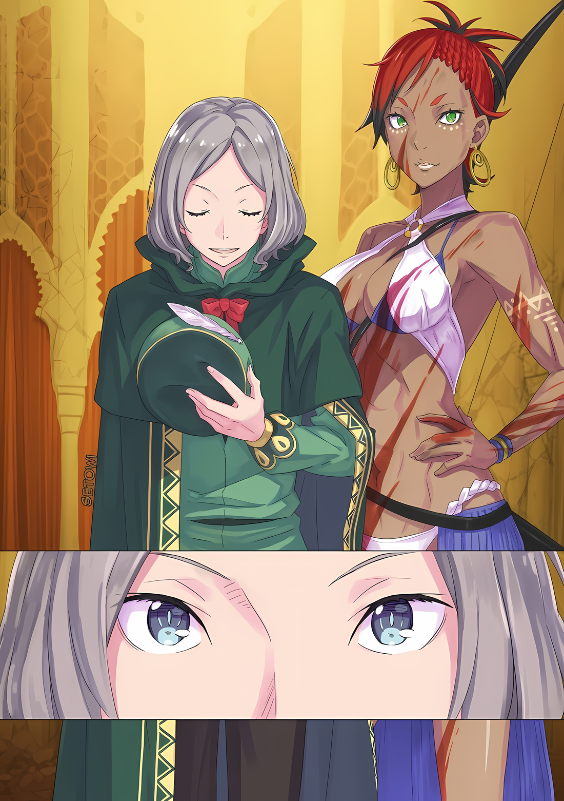
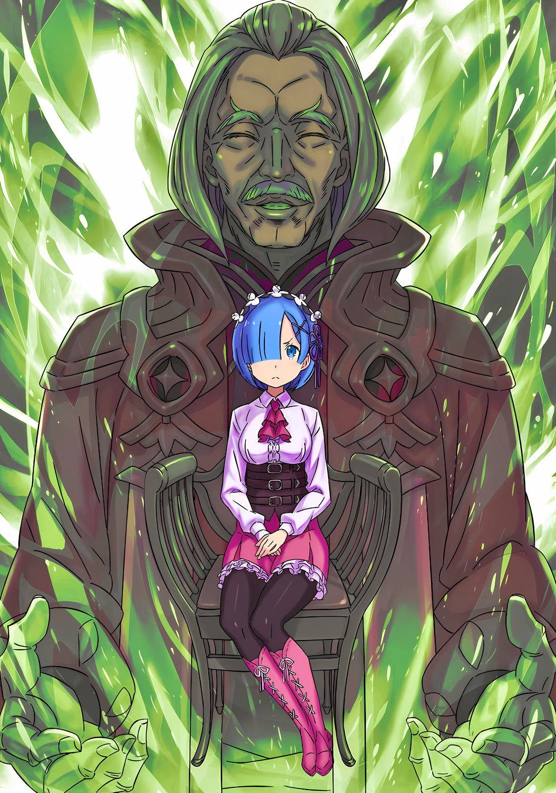
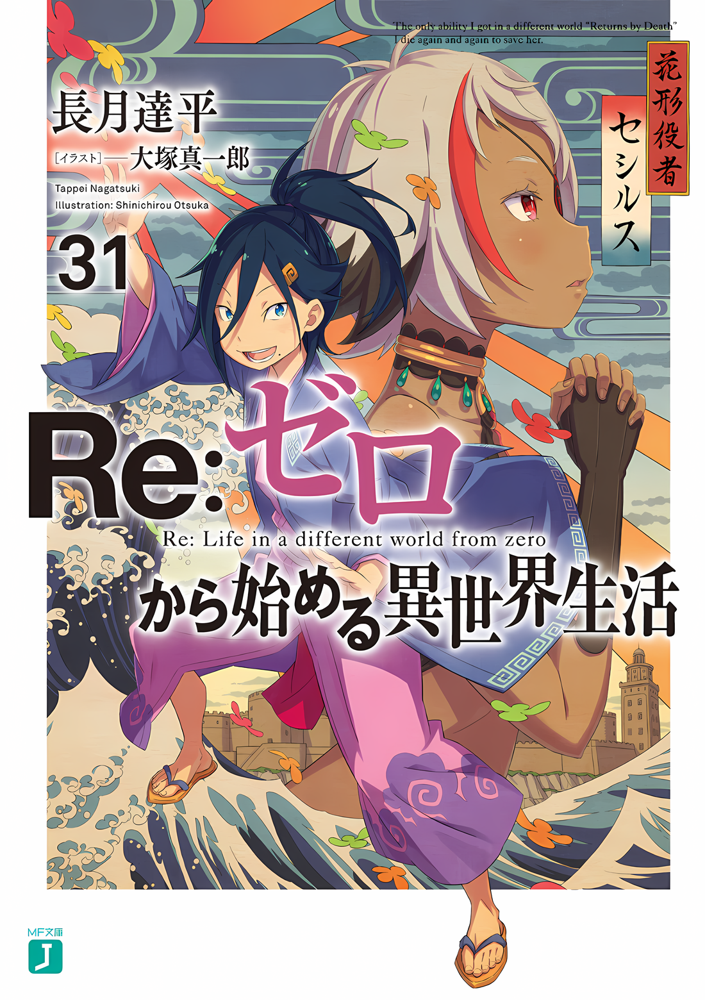

Майлз: Цени свою жизнь, Флоп. Самопожертвование — это для идиотов.

Именно такой совет дал ему Майлз, благодетель, забравший Флопа из убогой среды.

Оказалось, что детский дом, где Флоп и Медиум провели свое детство, был гораздо хуже, чем они могли предположить.

Взрослые в приюте привычно говорили им, что это место обеспечивает крышу над головой для детей, у которых нет семьи, которым просто некуда идти и не на кого положиться.

Воспитатель: Вы благословенны по сравнению со многими другими детьми, которым нечего есть и не на кого работать.

На самом деле, он тоже так думал.

Для него и его младшей сестры Медиум, брошенных семьей, это была суровая жизнь, в которой они снова и снова проходили через ад. Что касалось еды, то они питались травой, насекомыми и иногда кроликами, которые вызывали большой фурор среди детей после такой поимки. В худшем случае им приходилось питаться землей и мхом, чтобы утолить голод.

По сравнению с этим жизнь в приюте была намного лучше.

Им давали одеяла, хоть и тонкие и рваные, давали еду, хоть и состоящую из безвкусного супа с куском хлеба. Им поручали рутинную работу, где их количество имело значение, и хотя взрослые избивали их по прихоти, это было лишь от случая к случаю.

В напутственных словах взрослых была доля правды: внешний мир был гораздо более болезненным. Поэтому мысль о побеге даже не возникала.

Как бы то ни было, он не мог подвергать Медиум и других детей ударам и пинкам взрослых. Поэтому Флоп научился вести себя как можно веселее, чтобы привлекать внимание взрослых.

Флоп решил, что каждый день он будет тем, кто будет зазывать на себя все их внимание.

Заметность Флопа заставляла взрослых смягчать свое отношение к другим детям. Даже в те дни, когда взрослые были в плохом настроении, именно Флоп, выделяясь, становился первой мишенью для оскорблений.

Выделяться — это уже само по себе было оружием.

Громкий голос и жесты, преувеличенные выражения лица и манеры поведения. К счастью, выработать привычку делать такие вещи было несложно. Похоже, у него был природный талант привлекать внимание.

……Флоп сместил фокус их гнева с младших детей на себя и прошел через ужасные испытания, в результате которых он остался полумертвым. Именно там, в ту ночь, когда Медиум все это время утешала раны Флопа, он окончательно принял это решение.

Это была та роль, которую он должен был играть в этом месте.

Среди мучительной боли внутри него Флоп говорил себе именно это……

???: Конечно, нет, тупица.

Флоп: Э……

???: Впервые я показался здесь бог знает сколько лет, и, глядя на это место, оно все так же отвратительно, с такими же глупыми детьми, делающими такие же глупые вещи. Когда речь идет о сумасшедших детях, мелкого Балле более чем достаточно.

Определив роль, которую он сам должен взять на себя, Флоп был готов взять на себя худшие стороны жизни приюта.

Однако однажды ночью планы Флопа были резко разрушены.

Человек, появившийся верхом на летающем драконе, мягко говоря, не отличался опрятной внешностью.

Он не скрывал своей дурной и жестокой натуры, а то, как он раздраженно ерошил свои седые волосы, заставило Флопа даже в детстве поверить, что это такой человек, с которым лучше не иметь ничего общего. Его черты лица, напоминающие покорную крысу, также способствовали этому впечатлению. Существо, рядом с которым обычно следует держать голову опущенной, чтобы не получить удар.

Этот человек… Майлз… вяло подтвердил неприятное впечатление Флопа о нем.

Майлз: Я из этого же заведения, как и вы все. Ну, это было ужасное место даже в те времена. Поэтому я убрался отсюда к чертям собачьим и выжил, находясь на воле.

На ночь дверь в детскую комнату закрывалась на тяжелый металлический замок, чтобы дети не могли улизнуть в то время, когда они должны были спать.

С силой сломав тяжелый замок и заглянув внутрь, и увидев почти две дюжины детей, теснящихся в маленькой комнате, Майлз с досадой прищелкнул языком.

Затем он выпроводил детей, напуганных появлением незнакомого взрослого, из комнаты; бросив им одно лишь слово «Подождите», он направился в комнату взрослых.

После чего……

Майлз: Я день за днем находился на грани между жизнью и смертью, но в конце концов моя судьба начала меняться. Потом, спустя годы, я вспомнил о нашем доме мерзостей и нашел…… это.

Раскатывая связанных взрослых по полу комнаты и пиная их по лицу, он оскорблял их как неблагодарных, после этого Майлз вульгарно улыбнулся и плюнул на них, сказав: «Так вам и надо».

Этим детям, должно быть, было очень тяжело общаться со взрослыми. При этом Флоп не мог не наклонить голову и не задуматься, стоит ли ему идти на такие крайности.

Повернувшись к Флопу, Майлз поднял свои тонкие брови и заявил,

Майлз: Что, ты тоже хочешь присоединиться? Тогда давай, поквитайся. Поквитайся с ними в сотни раз больше, чем они с тобой.

Флоп: О, нет, я не…

Майлз: ……Давай!!!

Дьявольский шепот Майлза заставил Флопа замешкаться с ответом.

В тот момент Медиум выскочила из-за спины Флопа и без колебаний ударила по голове связанного взрослого, используя ветку, которую она подобрала. ……Нет, это была не просто Медиум.

Все дети, кроме ошеломленного Флопа, превратились в разъяренных отступников.

???: Ты всегда нас обижал!

???: Я ненавижу тебя!

Медиум: Это за братуху!

Стойте-стойте-стойте, — кричали взрослые, связанные и неспособные сопротивляться, заглушаемые яростными криками детей.

Они царапали когтями лица взрослых, били их по щекам и, наконец, мочились на них, выпуская свой гнев.

Майлз: Бвахахахаха! Посмотрите на их лица! Какой шедевр!

Флоп, ошарашенный, наблюдал за бунтом своей младшей сестры и других детей, а Майлз истерически смеялся над пошлостью всего этого.

Флоп не мог заставить себя смеяться над этим. Он просто смотрел, как остальные заставляют взрослых пройти через все это, и думал, что же с ними теперь будет.

Майлз: Ну что ж, теперь делайте, что хотите… Или это то, что я хотел бы сказать, но я не знаю, будет ли графиня Дракрой выливать на меня свое дерьмо, если я брошу вас всех.

Оглядев детей после завершения их эмоционального бунта, Майлз обратился к своим юным помощникам, находившимся теперь за пределами учреждения. Продолжая фразу «И так»,

Майлз: Сейчас я отведу вас к графине. После этого вы можете делать все, что захотите. Вам не обязательно следовать за мной.

Получив грубое приглашение Майлза, дети посмотрели друг на друга.

На их лицах появились тревога и недоумение. Майлз заявил, что они вольны следовать за ним или нет, но это был «Выбор», которого ни у Флопа, ни у других детей никогда раньше не было.

Они никогда не обладали правом выбора, всю жизнь следуя указаниям взрослых. Поэтому, внезапно получив такое право, они были повергнуты в смятение.

Видя нерешительность детей, Майлз пожал плечами, сказав: «Эй-эй»,

Майлз: Как жаль, теперь уже слишком поздно. ……Назад пути нет. Вы, ребята, можете выбирать, что хотите делать.

Только после того, как Майлз сказал об этом, дети впервые это осознали.

Как и сказал Майлз, они уже решили восстать.

……Когда все закончилось, никто из детей не захотел оставаться в приюте.

Конечно, хотя он и не был соучастником, Флоп не мог сказать, что останется в детском доме, который так с ним поступил. Для начала Медиум поспешила принять приглашение Майлза, сказав: «Я пойду!», призывая Флопа тоже присоединиться к ней, воскликнув: «Пойдем!».

Флоп никак не мог отказаться от желания Медиум и расстаться со своей сестрой. По этим причинам, немного более спокойно, нежели другие дети, Флоп покинул учреждение.

Он совершил нечто возмутительное.

Или, возможно, он впутал себя в нечто совершенно возмутительное; сожаление терзало его сердце.

Однако……

Медиум: Спокойной ночи, братуха.

По дороге к хозяину Майлза, или как там его, он услышал слова, когда они с сестрой спали в каком-то месте без крыши, завернувшись в принесенные из учреждения одеяла.

Вид его сестры, бросившей себя на произвол судьбы. Вид снаружи, лишенный тюрьмы, называемой убежищем.

Он понял, что больше не нужно беспокоиться о том, что его будут бить, или о том, что его сестра будет доведена до слез.

Флоп: ……хфф.

И, заметив это, Флоп заплакал.

Он плакал, плакал и плакал, смакуя соленый вкус своей свободы.

△▼△▼△▼△

……Вдалеке, хлопая крыльями драконы улетали в серое, покрытое облаками небо.

Зикр оставался настороже, дабы не упустить возможное продолжение следующей атаки, после того, как тени исчезла из его поля зрения, у него появилась возможность расслабиться.

По неизвестной причине стая летающих драконов отступила. Поскольку ратуша пала не полностью, причин для отступления было две: либо они достигли цели своей операции, либо оказались не в состоянии ее выполнить.

С точки зрения Зикра, первый вариант был предпочтительнее.

Если принять во внимание драматические события, произошедшие во время интенсивного штурма, длившегося всего час или около того, то объективно казалось, что первое более вероятно.

Зикр: Резкое падение температуры и катастрофические разрушения в южной части города….

Проведя рукой по своим обильным кустистым волосам, Зикр обратил внимание на две аномалии, которые он не мог определить.

Во время битвы температура в Городе-крепости упала в мгновение ока, а когда белый снег начал падать вниз, он усомнился в своих глазах. По всей видимости, снег иногда выпадал на вершинах высоких, очень высоких гор, но если бы снег выпал в Волакии, то это явление должно было бы сопровождаться каким-то стихийным бедствием.

Другими словами, снегопад, случившийся во время битвы, был ничем иным, как стихийным бедствием.

Но это само по себе оказалось удачным для Зикра и остальных.

Резкие изменения температуры делали летающих драконов уязвимыми, тем более когда становилось холоднее. Их проблемная способность летать заметно снизилась. Без нее ущерб был бы гораздо больше и сильнее.

Однако……

Зикр: Что это был за белый свет…?

Неконтролируемое разрушение уничтожило южную часть города.

Это было что-то вроде зрелища конца света, даже термин «стихийное бедствие» был недостаточен для его описания. Несмотря на то, что дальнейших разрушений не последовало, город получил болезненный удар от одного этого взрыва.

Командная цепочка была нарушена, что привело к задержке оценки состояния боя. Если бы летающие драконы продолжали наступать, возможно, город постепенно бы пал.

По этой причине то, что стая летающих драконов отступила, показалось странным и удачным.

В связи с этим Зикр предположил, что это могло быть как-то связано с их врагами.

Неужели кто-то нанес сокрушительный удар по врагу вместо Зикра и его людей, которые были вынуждены защищать город? В таком случае наиболее вероятными кандидатами были бы Мизельда или Присцилла, у которой был опыт победы над Аракией, Генералом Первого класса.

Кто бы из них ни совершил это деяние……

Зикр: В конце концов, женщины прекрасны. Однако я не хочу принимать как должное позор, когда тебя защищают женщины, стоя к тебе спиной.

Тот факт, что женщины были выше, не был оправданием для Зикра, чтобы быть ниже.

В то время как женское великолепие следует почитать и любить, собственные недостатки следует порицать.

В любом случае……

???: Я никогда не думал, что подвергнусь такому натиску, но, полагаю, предварительная подготовка принесла свои плоды.

Зикр: ……Летающие драконы — стандартная практика при попытке захвата укрепленного города. Однако следовало ожидать, что будет послан «Генерал Летающих Драконов», а не эскадрилья летающих драконов.

Зикр покачал головой в ответ на слова своего раненого начальника штаба, из головы которого текла кровь.

Перспективы были не очень хорошими. Подготовка к атаке летающих драконов включала размещение большинства наступательных орудий на западной стене в ожидании нападения из столицы Империи, однако летающие драконы атаковали со всех сторон.

После ухода Генерала Первого класса Аракии, они предполагали, что потребуется некоторое время для отправки следующего «Генерала», но это был просчет, и, учитывая обстоятельства, это было неудивительно.

Это было не просто восстание, ограниченное одним городом, а предвестник гораздо более масштабных политических потрясений.

С точки зрения интриганов из столицы Империи, осведомленных о ситуации, следовало ожидать, что они приложат все свои усилия, чтобы погасить пламя восстания, пока оно еще мало. Они должны были рассмотреть возможность отправки еще одного генерала первого класса сразу после этого.

Зикр: Нет, подумаем об этом позже. Теперь, когда городские стены повреждены, будет легче захватить город, даже без летающих драконов. Надо оценить ущерб. Посмотрим, можно ли восстановить стены….

???: ……Сложи оружие сейчас же! Это приказ!

???: Пфф.

Быстро определив аспекты для размышления, Зикр отложил их в уголок своего сознания.

Как раз в тот момент, когда он собирался проверить ущерб и обдумать меры на будущее, резкий, напряженный голос сотряс прохладный воздух.

Приглядевшись, он увидел фигуру, окруженную теми, кто отразил нападение летающих драконов на здание, использовавшееся в качестве командного пункта…… мэрию.

Оружие и внимание, которые до этого момента были направлены на летающих драконов, теперь были сосредоточены исключительно на человеке, злобно смотрящем на окружающих его людей. В обеих его руках были длинные мечи, с кончиков которых капала кровь.

Однако эта кровь принадлежала не людям, а летающим драконам.

Зикр: Это….

Начальник штаба: Он один из солдат, которых мы послали из подвалов, чтобы противостоять летающим драконам. Владеет двойными мечами……

Зикр: Да, я тоже видел. Он очень силен. ……Эй, постойте!

Зикр, кивнув на слова начальника штаба и вытянув руки, приказал своим людям. По его команде один из его людей повысил голос: «Генерал Второго класса!»,

Солдат: Это опасно! Я выпустил его из тюрьмы из-за ситуации, но…

Зикр: Значит, ты хочешь просто бросить его обратно в тюрьму, как только угроза летающих драконов миновала? Как будто он просто и безропотно примет это. Жертвы, которые мы должны будем принести, чтобы заставить его вернуться…… это еще большая проблема.

Ответив своему напряженному подчиненному, Зикр подошел к человеку, который оказался в его окружении.

Способности обладателя двуручного меча были значительно выше, чем у обычного Имперского солдата. На самом деле, без его вдохновляющего выступления не было уверенности, что они смогли бы отразить полчища летающих драконов, налетевших на ратушу.

Если бы этот меч был направлен на них, он причинил бы еще больше ненужного вреда.

Зикр: Очевидно, что если ты будешь продолжать в том же духе, то и твоя жизнь будет потеряна. Именно поэтому……

Мужчина: Именно поэтому, что?!

Зикр: …………

На попытку Зикра растопить лед, мужчина ответил резким голосом и поведением. Он направил один из двух мечей в своих руках на Зикра, и выпустил «Ха!» вместе со свирепой улыбкой

Мужчина: Ты хочешь, чтобы я сдался так покорно? Это ничем не отличается от того, что говорят остальные парни, верно, «Генерал-Бабник» Второго класса?

Солдат: Ты! Ты смеешь насмехаться над Генералом Второго класса Зикром!

Зикр гордился своим званием, которое, возможно, звучало позорно; но в только что прозвучавшем заявлении этого человека было явное намерение высмеять его. Это вызвало раздражение и враждебность людей Зикра, но последний снова сдержал их одной рукой,

Зикр: Ты можешь сдаться, хотя это не то, что я хотел предложить. Твоя работа была выдающейся. Хотя мы стоим на разных сторонах, тот факт, что ты внес свой вклад в защиту города, не умаляется. Поэтому ты будешь освобожден.

Мужчина: ――. Ты серьезно?

Зикр: Определенное наказание или награда — это правило Волакии и желание Императора.

Император Волакии, оценивавший людей по их способностям и достижениям, был основой меритократии Империи, принципом верности, который Зикр тоже уважал.

Однако, как только мужчина услышал ответ Зикра, его отношение стало откровенно колючим.

От всего его тела и глаз исходила жуткая аура…… Поскольку правый глаз мужчины был закрыт повязкой, он уставился на Зикра левым; все его эмоции передавались через него.

Мужчина: Как может мятежный Генерал, который предал своего Императора и Империю, объединившись с врагом, быть настолько бесстыдным, чтобы говорить такое……? Если бы это был я, мне было бы так стыдно за себя, что я бы просто вырезал себе кишки.

Зикр: …………

Неподвижно глядя на человека, Зикр затаил дыхание, когда услышал эти слова, источник его сильной враждебности, похоже, лежал в его преданности Империи.

Этот солдат, посаженный в темницу, скорее всего, был одним из тех, кто до самого конца сопротивлялся совету Винсента сдаться, поскольку последний завоевал Гуарал с помощью своего плана. Другими словами, он был человеком, который твердо придерживался принципов Империи.

Затем……

Зикр: Если я сообщу тебе, что я, как и ты, клянусь в неизменной верности Империи и Его Превосходительству Императору, захочешь ли ты меня выслушать?

Мужчина: Че?

На вопрос Зикра, мужчина широко открыл левый глаз и издал хамский голос. Он пристально посмотрел на него, похоже, не испугавшись его взгляда, затем, после короткой паузы, бросил мечи на пол.

Мечи звякнули о землю со звонким звуком, и теперь уже безоружный человек поднял обе руки.

Зикр: Могу ли я считать, что ты собираешься выслушать меня?

Мужчина: Пока что я прекращу буйствовать, чтобы умереть достойной смертью. Если бы я действительно хотел попробовать, я мог бы, по крайней мере, отрубить голову вероломному Генералу….

Оглядевшись по сторонам, мужчина вызывающе посмотрел на подчиненных Зикра. Их тревога усилилась от его взгляда, но мужчина лишь усмехнулся,

Мужчина: Но я не буду. Хотя, если этот разговор, который ты хочешь провести, будет скучным….

Зикр: Я намерен, чтобы это был достаточно интересный разговор. Как тебя зовут…?

Опустив оружие, чтобы подойти ближе, Зикр спросил у мужчины, как его зовут. На мгновение мужчина замешкался с ответом, но так как обманывать было бессмысленно, почесав голову, он ответил,

Мужчина: ……Джамал О'Рейли. Рядовой Первого класса.

Назвав свое имя и звание.

В ответ на такое отношение Зикр также выразил глубокое согласие кивком.

Зикр: Джамал, значит. Как ты, возможно, знаешь, я Зикр Осман. Получив звание Генерала Второго класса Империи, я также известен как «Бабник». Хотя….

Джамал: Че?

Зикр: Я бы чувствовал себя гораздо лучше, если бы меня теперь называли «Трусом».

Это прозвище, которое раньше считалось позором, теперь приобрело для Зикра особое значение.

Услышав ответ Зикра, мужчина…… Джамал… скорчил гримасу непонимания. Было очевидно, что Джамал хорошо владеет оружием, но не умеет думать и рассуждать.

В таком случае он мог бы прислушаться, если бы кто-то высказал праведность.

И тут……

???: ……Простите, вы представитель этого города, верно?

Джамал сдался, и мэрия освободилась от напряжения, готового вот-вот лопнуть. Вслед за этим раздался голос, который словно ждал подходящего момента, чтобы прервать его.

Тихий, мягкий тон этого голоса ударил по барабанным перепонкам так, что вызвал чувство облегчения у тех, кто его услышал.

Тем не менее, незнакомый голос заставил Зикра обернуться и нахмурить свои кудрявые брови.

Обладатель голоса появился на лестнице, соединяющей верхний этаж командного центра с нижним. Подняв руки в знак отсутствия враждебности, седовласый мужчина повернулся, чтобы посмотреть на него,

???: Вы «Генерал» Зикр Осман-сан?

Он без колебаний определил Зикра как Генерала среди тех, кто носил такую же красную форму.

Конечно, учитывая плащ, который он носил, и знаки различия на его плечах, определить, что Зикр является самым высокопоставленным человеком в комнате, было проще простого. ……Проблема заключалась в том, чтобы набраться смелости указать на это.

Наглость — явиться на командный пункт, где всего несколько минут назад шла битва, и назвать имя незнакомого командира. Зикр задался вопросом о принадлежности этого невзрачного, но не внушающего страха человека.

Поскольку они не были признаны частью жителей города, вполне вероятно, что они смешались с ними во время битвы.

Лучшим ответом в таком случае будет то, что он……

Зикр: Посланец из столицы Империи… Возможно, посланец для нас?

Седовласый мужчина: А? О, нет-нет, вовсе нет! Сейчас сложно объяснить, но мы не связаны со столицей или чем-то подобным.

Размахивая поднятыми руками в знак отрицания, молодой человек поспешил опровергнуть подозрения Зикра. Если бы он поверил ему на слово, положение юноши стало бы еще более непонятным.

Поэтому вместо Зикра, нахмурив брови, Джамал выкрикнул «Ублюдок!», скрежеща зубами,

Джамал: Чур, он первый! Если ты войдешь сюда после меня…… я надеру тебе задницу!

Седовласый мужчина: Я очень сожалею об этом. Я не ожидаю, что в данный момент мы сможем спокойно поговорить. Поэтому, если вы можете, дайте мне разрешение.

Джамал: Разрешение? Разрешение на что?

Седовласый мужчина: Помочь в лечении раненых и в восстановлении города после этого…… Так сказать, помочь в ликвидации последствий битвы. Я уверен, что мои спутники и я сможем оказать какую-то небольшую помощь.

В ответ на то, что Джамал напряг щеки, молодой человек вздохнул и сказал «Хотя». Его лицо, немного усталое и немного раздраженное, слегка расслабилось,

Седовласый мужчина: Поскольку мы уже начали, отказ вам только навредит, хотя бы частично.

Зикр: ――. Я ценю само предложение, но это….

???: Все не так сложно, Зикр. В словах этого человека нет лжи.

Прежде чем Зикр успел задать целый ряд вопросов, его прервал достойный голос, к которому он не мог не прислушаться.

Раздался резкий стук трости по полу, и тень, приближавшаяся по лестнице, поравнялась с юношей. Это была Мизельда, ее доблестная фигура была залита кровью, что усиливало ее свирепую красоту.

Судя по всему, вся кровь, окрасившая ее прекрасное тело, была пролита кем-то другим, так как на ней не было заметно никаких внешних повреждений, кроме ноги, которая была ранена ранее. Зикр с облегчением увидел, что она вернулась целой и невредимой.

Вернувшись, Мизельда похлопала юношу по худому плечу, словно была с ним знакома

Мизельда: Спутники этого человека уже начали свою работу. Уверяю вас.

Зикр: Госпожа Мизельда, я так рад, что вы в безопасности. А он?

Мизельда: Я его не знаю. Он не наш враг, он просто парень с красивым лицом, поэтому я его пропустила.

Зикр: Госпожа Мизельда….

Эстетическое чувство Мизельды несколько отличалось от эстетического чувства Зикра, но она, безусловно, была права, говоря, что черты лица молодого человека были приятными, красиво оформленными.

Атмосфера, которую он испускал, была несколько нейтральной, но в его глазах было странное ощущение цели.

В то, что он не плохой человек, Зикр верил. Но у него также было чутье.

Зикр: Я не верю, что найдется человек, готовый помочь в этой ситуации и не желающий получить что-то взамен. Кто ты?

Седовласый мужчина: Как я уже говорил, ситуация сложна для объяснения. Однако я не намерен враждовать с вами. ……Есть люди, которых мы ищем, только это.

Зикр: Ищете людей….

В ответ на слова Зикра молодой человек кивнул головой, после чего сказал «Да».

Затем он снял зеленую шляпу, которая была на нем, и положил ее на грудь, поклонившись…… вежливый жест, демонстрирующий уважение, но не так, как это сделал бы кто-то из Империи.

Седовласый мужчина: Меня зовут Отто Сувен. ……Я ищу своего друга, а также младшую сестру моего друга.

Иллюстрация к **Ранобэ** Том 30 | Разукрасил Set0wi

Так, с глазами, подобные хитрой гиене, он изложил свою цель.

△▼△▼△▼△

……Хозяйка Майлза, Серена Дракрой, была Верховной Графиней и женщиной с яростным характером.

В молодости она вела упорную борьбу с высшими эшелонами аристократии Империи и, в соответствии с кодексом крови и железа, который был олицетворением Империи, придавала большое значение меритократии, отдавая предпочтение талантливым.

С другой стороны, она также обладала честностью, которая не позволяла сильным унижать слабых по своему усмотрению. По этой причине с детьми, привезенными Майлзом домой, не обращались жестоко.

Серена: Я слышала об этом. Майлз, который избегает неприятностей, даже привел тебя в этот дом. Должно быть, он сжалился над вашей ситуацией. На моей территории вы можете делать все, что пожелаете.

Серена широко улыбнулась, приветствуя Флопа и других детей.

Флоп был ошеломлен пугающим ощущением присутствия перед существом, превосходящим его по росту, отчего ему захотелось спрятаться в своем детском сердце; а также интерьером дома, поскольку он никогда прежде не видел ничего столь богато украшенного и просторного.

Майлз: У таких людей, как Графиня, нет причин издеваться над теми, кто слабее их, даже если у них есть свобода действий. В конце концов, взрослых, которые бьют детей, тоже били взрослые, когда они были детьми.

Так, со своей обычной грубостью, Майлз ответил Флопу и детям, которых искупали в горячей воде, накормили досыта и переодели в чистую, хорошо пахнущую одежду.

В отличие от Медиум и остальных, чьи глаза были обращены к миру, где все, что они видели и трогали, было свежим и новым, Флоп был впечатлен незнакомым ему миром и образом мышления.

В частности, на него сильно повлияла философия, о которой Майлз говорил так непринужденно.

Без Майлза Флоп никогда бы не узнал, что существуют способы видеть и понимать вещи, о существовании которых он и не подозревал.

Прежде всего……

???: О, мы одинаковые, не так ли? Большой брат Майлз тоже тебя подобрал?

Флоп, следуя за спиной своей сестры, которой дали свободу бегать по особняку, остановился у прекрасного сада на обширной территории.

В тот момент, когда он был потрясен видом больших цветов в полном цвету, его окликнул мягкий голос.

Хотя он и испугался, оглянувшись в поисках источника голоса, он не смог найти в саду другого человека. Флоп наклонил голову,

???: Сюда. Извини за это, я внизу.

Флоп: Вау!

???: Уф, какое падение.

Когда прямо перед ним внезапно появилась голова, высунувшаяся из-за забора, к которому он прислонился, чтобы заглянуть в сад, Флоп непроизвольно попятился назад.

Флоп моргнул, когда над ним стали смеяться за то, что он упал на спину.

Тот, кто смеялся над падением Флопа, был мальчиком постарше, хотя выглядел он еще совсем юным. Ему было около двенадцати или тринадцати лет, он был с очаровательным лицом и каштановыми волосами.

Флоп: ……Ты очень много смеешься, не так ли?

Мальчик: О, прости. Но это только что было нечто достойное внимания. Я бы помог тебе подняться, но сейчас я не могу двигаться.

Флоп: Не можешь двигаться, говоришь….

Встав и похлопав себя по спине, Флоп обошел забор и направился к юноше. Так он наткнулся на мальчика, который сидел, скрестив ноги, на земле с круглой массой на коленях.

Увидев это, Флоп широко раскрыл глаза от удивления.

Флоп: Это яйцо?

Мальчик: Да, да, это большое яйцо, верно? На самом деле это яйцо летающего дракона.

Флоп: Что ты собираешься делать с яйцом летающего дракона?

Мальчик: Я собираюсь его высидеть, конечно же.

Размер белого яйца требовал, чтобы мальчик держал его обеими руками, и поэтому он прижимал его к телу, широко улыбаясь Флопу.

……Такова была первая встреча между Флопом и Медиум О'Коннелл с Балроем Темегрифом, человеком, который станет их заклятым братом на всю оставшуюся жизнь.

△▼△▼△▼△

……Можно сказать, что они получили больше, чем просто знания об угрозе летающих драконов.

Угроза их когтей и клыков, широта стратегий, которые они могли использовать с помощью своих крыльев, свирепость, с которой они без колебаний наносили вред своим врагам; все это было более чем остро ощутимо при виде разрушенного города и тех, кто подвергся нападению, соответственно.

Честно говоря, трудно было понять, как кто-то мог подумать, что столь опасное существо можно приручить и использовать так эффективно. Оно казалось непримиримым противником…… таким же опасным, как гигантская змея, с которой они столкнулись в джунглях.

Однако……

???: …………

Рем тихо прищурилась, разглядывая пейзаж за окном.

В саду особняка летающий дракон отдыхал, сложив крылья, а солдат кормил его. Летающий дракон, вопреки представлениям о том, что он якобы страшен и свиреп, имел мягкий взгляд и излучал сладкий тон, когда его кормил солдат.

С точки зрения Рем, которой рассказывали, что летающие драконы свирепы и злобны, и которая воочию убедилась в их опасности, появление летающего дракона, так дружелюбно относящегося к людям, было удивительным.

Девушка, которая, по-видимому, была хорошо знакома с драконами, сказала ей, что они гордые и не любят людей. Не стоит винить их за то, что они думают иначе.

???: Ты выглядишь довольно мрачной.

Вдруг, когда Рем смотрела на сад, она услышала позади себя голос.

Но Рем не удивилась: она знала, что кто-то идет по дороге, так как было слышно шаги, приближающиеся к ней.

Однако, услышав голос незнакомца и почувствовав себя несколько напряженно, учитывая место, в котором она находилась,

Рем: Не знаю, может быть, я мрачна, но у меня есть некоторые мысли. Это не то место, куда я хотела попасть, но меня все равно привели сюда.

???: Хм, ты более прямолинейна, чем я ожидал. Какой приятный человек.

Рем: ……Вы…

В комнате, куда ее определили, в здании, где даже комнаты, отведенные военнопленным, были роскошными, Рем расспрашивала о личности появившегося старика, в то время как кресло, на котором она сидела, слишком роскошное, чтобы быть удобным, скрипело.

Это был старик с белыми волосами, белыми усами и тонкими, как нитка, глазами.

Его одежда была далека от одежды воина, можно было только предположить, что это человек высокого ранга.

Его поведение и возраст, а также тот факт, что солдаты, охранявшие Рем, выпрямились и склонили головы, говорили о том, что он занимает особо высокое положение.

На неодобрительный взгляд Рем старик легким взмахом руки приказал охранявшим его солдатам покинуть комнату. Солдаты немедленно повиновались и, поклонившись, вышли из комнаты.

И вот, когда старик остался в комнате наедине с Рем, он указал рукой на кресло напротив того, в котором она сидела.

Старик: Могу ли я сесть?

Рем: ……Да.

Старик не спеша занял место прямо напротив Рем, та кивком дала согласие.

Обратившись прямо к Рем, он погладил пальцем подбородок и заговорил,

Старик: Ты слышала от нее что-нибудь обо мне?

Рем: Нет, ничего. Я не слышала ничего, кроме «лечи его», «отдыхай» и «если ты сделаешь что-нибудь неординарное, я тебя убью».

Размышляя над указаниями хозяйки дома… Мэделин, которая ее не слушала… она покачала головой.

Рем находилась под домашним арестом, к ней приставили охрану. Ей был дан строгий приказ не пытаться бежать; хотя она и не собиралась убегать, ситуация была не из приятных.

Старик кивнул головой, ответив: «Понятно»,

Старик: У меня есть несколько вопросов по поводу ее отношения к гостье. Я передам Генералу Первого класса Мэделин слова предостережения.

Рем: ……Вы можете предостеречь ее?

Рем была ошеломлена словами незнакомого старика.

Проведя с Мэделин ни много ни мало времени между событиями в Городе-крепости и доставкой в этот особняк, Рем была раздосадована отсутствием общения с ней.

Мэделин была упряма и своенравна, хотя ее спасительной чертой была убедительная прямота.

Рем: Я считала, что она была человеком, который не любит, когда другие говорят ей, что делать. Если кто-то ей что-то говорил, она тут же начинала злиться и буянить….

Высказав свои чувства до такой степени, Рем положила одну свою руку на другую.

Теперь, когда она спокойно все обдумала, ей стало стыдно за себя, и она подумала, какое лицо она сделала, когда заявила это, как человек, который однажды сломал другому человеку палец, потому что она не послушала, что тот хотел сказать.

Тем не менее, старик слегка улыбнулся, услышав «Хм» в ответ на самоанализ Рем,

Старик: Вопреки твоим ожиданиям, ты не ошиблась в этом. Даже если мне больно это слышать. На самом деле, она и в этот раз не смогла правильно выполнить мои указания. Правда….

Рем: …………

Старик: На этот раз, однако, другой фактор оказался важнее капризов Генерала Первого класса Мэделин.

Старик держал губы расслабленными, но намек на улыбку исчез из тона его голоса.

Рем на мгновение затаила дыхание, когда на нее устремился его взгляд: что-то за пределами этих узких, проницательных глаз, казалось, оценивало ее. Взгляд красноречиво рассматривал Рем как «Еще один фактор».

И этот фактор привел к нежелательным последствиям для стоящего перед ней старика.

Рем: ……Кто вы?

Старик: Прошу прощения за столь позднее представление. Я премьер-министр Священной Империи Волакия, Беллстетз Фондальфон.

Рем: Премьер-министр… Беллстетз.…

Старик… Беллстетз, благоговейно согнулся в талии в ответ на вопрос.

Как только Рем услышала его имя и должность, ее щеки стали еще жестче, а плечи напряглись еще больше.

Она вспомнила, что слышала и имя, и должность.

Рем: Значит, вы…

Беллстетз: Да. Я враг Его Превосходительства Винсента Абеллюкс.

Рем: ………….

Он утверждал это без колебаний, и Рем снова осталась не в состоянии продолжать разговор.

Это было подтверждение того, что она уже знала, но она не ожидала, что это будет сказано так прямолинейно. Кроме того, это была серьезная проблема, в которую она оказалась втянута, независимо от того, нравилось ей это или нет. Тот факт, что ее привели в место, расположенное ближе всего к этому водовороту, не мог не показаться ей ужасно неуместным и ироничным.

Ведь здесь на ее месте должны были быть Абел, Присцилла и Субару.

Учитывая это, Рем была рада, что Субару здесь нет.

Рем: Если бы он был здесь один, он был бы безрассуден, определенно….

Не было места для сомнений в быстроте мышления черноволосого юноши и его способности расширять границы воображения. Даже в этой ситуации он мог бы вызвать необычные события, выходящие за рамки воображения Рем.

В этом смысле хорошо, что его не было в городе во время налета летающих драконов. Вряд ли он смог бы что-то предпринять и только получил бы еще больше травм.

Однако……

Рем: …………

Интересно, когда он узнает, что ее забрала Мэделин, что он почувствует?

Это было так ужасно, что грудь Рем терзала боль от острого лезвия, которое было ее воображением.

Рем: ――. Значит, вы знаете, что Абел-сан — настоящий Император, верно?

Заставив себя не обращать внимания на боль от глубокого пореза, оставшегося в сердце, Рем задала вопрос Беллстетзу. На что тот ответил отрывистым «Да»,

Беллстетз: Конечно. Позволить ему сбежать было ошибкой, но после этого все пошло по плану. Или, лучше сказать, шло. Поскольку, по сути, уничтожение Гуарала осталось незавершенным.

Рем: Почему вы так поступили с Абелом-сан? Я не могу представить, каково это — прийти к решению сделать что-то вроде мятежничества…… Это из-за личности Абела-сан?

Беллстетз: Мы не ищем индивидуальности в Императоре, вершине нации. Личные чувства и привязанности тривиальны с точки зрения управления нацией. Если что-то и нужно искать, то только компетентность, доверие и работоспособность человека, способного выполнять свои обязанности.

Неторопливо покачав головой, Беллстетз ответил безэмоциональным голосом и выражением лица.

Тон его голоса не дрогнул, выражение лица не изменилось ни на йоту. Отсутствие жизненного опыта у Рем в сочетании с превосходными коммуникативными навыками Беллстетза не позволили ей прочесть его сокровенные мысли.

Он был лишен эмоций и поэтому лгал, или же он был правдив; что именно?

Однако ей хотелось верить в то, что ей говорили: характер Абела не был причиной для поднятия восстания.

Рем была свидетелем крови и смерти стольких людей в Городе-крепости. Не только те, кто погиб, но и она сама не смогла бы убедить себя в том, что причиной тому был плохой характер Абела.

Поэтому……

Рем: Вы хотите сказать, что сместили Абела-сан, потому что он не годится на роль Императора?

Беллстетз: Отстранение не было моим намерением. Это просто ретроспективный взгляд.

Рем: Чего не хватало Абелу-сан? Я не знаю ни бремени, которое несет должность Императора, ни требуемых способностей, но я верю…… что он прекрасный человек.

Рем задалась вопросом, почему она чувствует себя обязанной защищать Абела, и выбрала слова, чтобы убедить ноющее чувство внутри нее.

На самом деле, если не брать во внимание его умение сражаться, Абел выделялся своим остроумием и запасами мудрости.

Тот факт, что Мизельда, Зикр и даже Субару были готовы следовать его доводам, свидетельствовал о том, что он также обладал лидерскими качествами, чтобы убедить других в своих взглядах.

Хотя Рем и не понимала, что именно это качество присуще тем, кто стоит на вершине.

И это было бы чем-то необходимым для того, кто занимает самое высокое место в государстве.

Это……

Беллстетз: Я еще не слышал вашего имени, Целительница-доно.

Рем: ……Рем, кажется.

Беллстетз: Хм.

Отчасти из-за неприязни к Беллстетзу, она сообщила об этом как о чем-то вроде слухов.

Рем уже смирилась с тем, что ее зовут «Рем», что вполне понятно. С тех самых пор, как она представилась Присцилле с самообладанием… или с того момента, когда она позволила Субару называть ее так.

Так или иначе, ознакомившись языком с именем Рем, Беллстетз сделал небольшой выдох, а затем…

Беллстетз: Рем-доно, как ты думаешь, сколько наследников у Его Превосходительства Императора в настоящее время?

Рем: Наслед… ников… Вы имеете в виду детей, не так ли?

Беллстетз: Да.

Пока Беллстетз безмятежно кивал, Рем мысленно представила себе Абела.

У Рем не было воспоминаний, но это не означало, что она утратила все знания, приобретенные до того, как она их потеряла. Она также сохранила знания о том, как сношаются люди.

Однако было сомнительно, что Абел сможет установить такие же правильные отношения с другим человеком. Прежде всего, Рем не могла представить себе женщину, способную встать на одну ступень с Абелом.

Рем: Я не могу себе этого представить. Наверное, таких нет?

Беллстетз: ……Ты прекрасно мыслишь. Ты права, их не существует.

Рем: О, конечно, это так. Хотя, наверное, это делает Абел-сана….

Невежливость, Рем уже собирался продолжить, но тут ее слова прервали.

Не то чтобы Беллстетз что-то заявил в адрес Рем, и не то чтобы ей велели замолчать; просто сузившиеся глаза молчаливого старика слегка приоткрылись. Его лицо, в котором виднелось странное выражение, приблизилось к ее лицу. Голос Рем заглушила аура, настолько жуткая, что ее невозможно было постичь.

Беллстетз тихо положил руку на стол между ними. От всего его тела безмолвно исходила невообразимая, сильная ярость.

Беллстетз: Преемников, как видишь, нет. ……Вот в чем проблема.

Рем: ……А.

Беллстетз: Империя должна быть сильной. Иначе этот народ….

Когда Рем перед ним издала хриплый вздох, Беллстетз оборвал ее речь, раскрыл свой кулак, положенный на стол, и выдохнул.

Затем, снова спрятав глаза за веками, старик посмотрел на Рем.

Беллстетз: Прошу прощения. Я впервые выступаю в роли мятежника и должен сказать, что слегка разволновался.

Рем: ……Зачем вы сейчас мне все это говорите?

Беллстетз: ……….

Рем: Рассказывать все это было необязательно.

Слова Беллстетза были наполнены не эмоциями, а чем-то более весомым и ясным.

Рем не чувствовала, что это была ложь, но именно поэтому она и задавала ему вопросы. Почему он позволил ей услышать такое?

Рем не считала, что она на каком-то важном посту, да и в целом не была на нем.

Бывали случаи, когда Рем оказывалась в положении, близком к Абелу и Присцилле, но это происходило просто потому, что так сложились обстоятельства, а не потому, что она была особенной.

Рем: Так почему?

Иллюстрация к **Ранобэ** Том 30 | Разукрасил 112oVic2

Беллстетз: ……Ты целительница и принадлежишь к расе Они. Я бы хотел взять тебя к себе, если это возможно. Ты — драгоценное существование.

Рем: …………

Хотя этот ответ и не был ложью, он был не совсем правдив.

Однако Беллстетз, похоже, решил больше не посвящать время Рем, которая искала дальнейшие ответы. Медленно старик поднялся с кресла, в котором сидел.

Беллстетз: Я хотел бы поговорить с тобой подольше, но у такого человека, как я, есть дела, которые я должен сделать. Прошу прощения, что причиняю тебе неудобства, но я постараюсь сделать все возможное для тех, кто находится в особняке, так что, пожалуйста, будь спокойна.

Рем: ……Беллстетз-сан, что вы сделаете в отношении Мэделин-сан?

Беллстетз: Меня можно назвать скорее совладельцем. Конечно, складывается впечатление, что, с ее точки зрения, она использует мудрое человеческое существо в виде меня. Но этот особняк также является и моим владением.

Беллстетз ответил, неожиданно пожав своими здоровыми плечами, что побудило Рем оглядеть комнату и посмотреть в сторону сада.

Поскольку Мэделин проводила там время так, словно это место принадлежало ей, можно было предположить, что это ее особняк, но, похоже, даже это оказалось неверным. Однако элегантность здания и его интерьеров убедила Рем.

Рем: Но я не думаю, что смогу проводить время, слоняясь без дела, да и не хочу этого.

Беллстетз: Откровенная манера речи, весьма восхитительная. Итак, еще раз, доброго здоровья тебе, Рем-доно.

Улыбнувшись, Беллстетз еще раз согнулся в талии и вышел из комнаты.

Она подумала о том, чтобы попытаться остановить его, но, не найдя нужных слов и решив, что сама не в силах остановить его, Рем ушла.

На смену Беллстетзу, покинувшему комнату, вернулись стражники, которых отправили на улицу.

Окинув ее суровым взглядом, Рем снова выглянула наружу.

Летающий дракон только что закончил трапезу и, медленно хлопая крыльями, поднимался в небо, а на его спине сидел человек, который его кормил.

Рем: …………

Хотя это был свирепый, грозный летающий дракон, нестись на его спине в полете было захватывающе приятно.

Конечно, в сложившихся обстоятельствах у нее не было возможности насладиться этим: от Гуарала до места назначения они добрались меньше чем за день, и ей стало интересно, чем же было их путешествие до сих пор.

Пока Рем лечила раненого Флопа, Мэделин привела их сюда……

Рем: ……Столица Империи, Рапгана.

Город, в котором Абел стремился вернуть себе трон, после того как был свергнут с него.

С места, где Рем находилась в плену, виднелся Хрустальный Дворец в самом центре города. Прикоснувшись к неоткрывающемуся окну и ощутив стекло на кончиках пальцев, ей пришла в голову неожиданная мысль.

Рем: ……Он.

Пройдет ли боль через его сердце, когда он узнает, что Рем больше нет?

Боль в его сердце, также как и в сердце Рем, ощущалась как глубоко вонзившееся лезвие.

Откуда в ее голове взялись такие мысли, Рем не знала.

△▼△▼△▼△

……Флоп медленно открыл глаза и взглянул на потолок незнакомой комнаты.

Флоп: ………

Он потратил мгновение на то, чтобы собраться с мыслями и быстро осмотреть свое окружение, чтобы оценить ситуацию.

Это была его привычка, как торговца, который часто разбивал лагерь в дикой местности. Конечно, его сестра, обладавшая более острой интуицией, чем он, должна была быть бдительной, но это не повод ослаблять собственную бдительность.

Вполне возможно, что его слабая реакция может стать причиной разницы между жизнью и смертью. Поэтому быстро вставать с постели — это умение, которому он научился как само собой разумеющемуся, чтобы выжить……

Флоп: Это место…… Ух!

В тот момент, когда он попытался осмотреться, соблюдая осторожность, он издал крик, когда его грудь наполнилась ужасной болью.

Если бы это произошло на улице посреди ночи, то он поступил бы очень глупо, позволив зверям узнать о своем местонахождении. Тем не менее, что сделано, то сделано.

Чтобы прийти в себя, Флоп, тяжело дыша, попытался перейти в вертикальное положение,

Флоп: Ч-что за… Я вообще не могу двигаться…!

Он не только не мог приложить силы к рукам, но и мягкая кровать всасывала его вес. Все его тело мягко прогибалось, если бы ему сказали, что это скорее клетка, чем кровать, он бы поверил.

Тем не менее, он извивался и боролся в отчаянной попытке как-то выбраться,

Флоп: Мне, мне…! Мне и впрямь трудно!

???: ――. Ты довольно странный человек.

Флоп: Что!? Кто там!?

Позади Флопа, когда он боролся с кроватью, раздался высокий голос, поэтому он попытался обернуться. Но его усилия были тщетны, его ослабленное тело не могло даже повернуться как следует.

Пока Флоп бился, как рыба на суше, послышался глубокий вздох,

???: Это я, дракон. Твои раны находятся в процессе заживления, так что перестань волноваться понапрасну.

Второй участник разговора шагнул к кровати, и Флоп слабо выдохнул.

Девушка с небесно-голубыми волосами, золотыми глазами и двумя черными рогами на голове… Мэделин. Генерал Первого класса Империи, напавший на Город-крепость, существо, известное как «Генерал Летающих Драконов».

И, из того, что Флоп помнил в последний раз……

Флоп: Если я правильно помню, твои когти вонзились в меня, и это было очень больно…

Мэделин: Верно. Когти дракона вырвали из тебя жизнь…… Та девушка исцелила тебя.

Флоп: Та девушка… О, точно.

Отведя взгляд, Мэделин пробормотала это с неловким выражением лица. Ее слова вызвали в голове Флопа образ, заставив его осознать произошедшее с ним событие.

В то же время он вспомнил, что в своем угасающем сознании он попросил ее… он попросил Рем сделать что-то ужасное.

Флоп: Мисс Мэделин, верно? Я хочу спросить, что случилось с Гуаралом? Этот город пережил ужасно большой взрыв, плюс нападение твоих друзей.

Мэделин: …………

Флоп: Итак, учитывая, что я едва спасся, думаю, мы с Миссис выжили. Но этот результат — второй худший, на мой взгляд. Конечно, худшим результатом был бы тот, в котором Миссис и я оба умерли.

Подняв палец, Флоп продолжил говорить и адресовал эти слова Мэделин.

Мэделин сохраняла невозмутимое выражение лица, глядя в сторону на его палец. Подумав, что это знак того, что она не хочет говорить на эту тему, Флоп продолжил.

Флоп: Я не знаю, мисс Мэделин. По твоему лицу видно, что ты недовольна или дуешься. Моя младшая сестра тоже так ерзала, когда дулась. То, что она не выглядит при этом сдержанной, учитывая, что ее тело такое большое, очень мило; но я полагаю, что ты тоже такая?

Мэделин: …фф.

Флоп: Да? Что?

Мэделин: Город в безопасности! Я не смогла уничтожить его полностью! Ты это хотел услышать?

Показав свои острые клыки, Мэделин зарычала в ответ на слова Флопа. Он облегченно вздохнул, чувствуя, как по его телу пробегает иллюзия яростного глотка воздуха.

«В безопасности» — не слишком подходящий ответ, учитывая то, что Флоп помнил о состоянии Гуарала, но Мэделин заявила, что не смогла разрушить город.

Если это так, то……

Флоп: Миссис хорошо использовала мою жизнь, не так ли….

Флоп вспомнил свой поступок прямо перед тем, как потерял сознание, когда его сознание было расплывчатым, а в ушах стоял звон.

Мэделин была так сильно расстроена видом Флопа, истекающего кровью и находящегося на грани потери жизни, что он краем глаза заметил ее. Казалось, она о чем-то расспрашивала Флопа, как бы цепляясь за него.

Ему пришла в голову мысль, что его жизнь можно сделать полезной. Можно заключить соглашение, по которому в обмен на спасение жизни Флопа Мэделин получит желаемый ответ, а значит, возможность того, что Гуарал выберется из своего затруднительного положения, действительно существует.

То, что пацифистка Рем способна принять такое хладнокровное решение, было для него немыслимо. Это должно было стать для нее непосильным бременем, хотя, учитывая текущую ситуацию, похоже, она справилась.

Флоп: Где Миссис, та, что залечила мои раны?

Мэделин: ……Ее тоже взяли с собой. Это было условие, которое я, дракон, предложила, и она приняла его. Дракон держит свои обещания. Я позабочусь о том, чтобы она тоже сдержала свое обещание дракону.

Флоп: Обещание….

Мэделин: Это.

Флоп с облегчением услышал, что Рем в безопасности. Но тут ему на глаза попалось украшение с изображением клыка зверя…… точнее, клыка дракона, окрашенного в красный цвет.

Драгоценный предмет, который Флоп обычно носил на шее и носил с собой, не позволяя ему расстаться с ним.

Его прижали к кончику носа Флопа, когда он лежал на кровати.

Флоп: О, ты подобрала это для меня? Спасибо тебе большое. Это очень, очень ценная вещь. Я был бы неспособен жить и выглядеть счастливым без него. Вот почему….

Мэделин: ……Карийон.

Флоп: …………

Протянув руку, Флоп попытался забрать клык. Но Мэделин легко увернулась от руки Флопа и, вместо того, чтобы вернуть предмет, произнесла имя.

Это имя заставило Флопа задержать дыхание, и Мэделин продолжила,

Мэделин: Это клык Карийона. Почему он у тебя?

Дважды Мэделин произнесла «Карийон», и Флоп безошибочно расслышал это имя.

Невозможно было бы ошибиться. Потому что это имя было……

Мэделин: Ответь! Почему у тебя Карийоновский…

Флоп: Я был там, когда родился Карийон. Я придумал его имя вместе с ними. Вместе со старшим братом Майлзом и Балроем.

Мэделин: ……….кх.

Флоп: Когда его клыки отросли, мы получили по одному на память. Это было доказательством связи с моим заклятым братом… моей семьей. Вот почему у меня и моей сестры есть клыки Карийона.

Тихо ответил Флоп, словно приоткрывая крышку драгоценного сундука в глубине своего сердца.

Он ответил на вопросы о происхождении клыка летающего дракона, покачивающегося в руке Мэделин. Их драгоценные члены семьи…… их благодетель и их заклятый брат, память о двух людях, которых больше нет на свете.

Услышав ответ, Мэделин потеряла дар речи, ее губы задрожали, а глаза расширились.

Основываясь на ее реакции и на том, что ей было знакомо имя Карийона, Флоп сделал некоторые предположения и, предварив их словами «Можно?», сказал,

Флоп: Откуда ты знаешь имя Карийона? Ты даже узнала его клык с первого взгляда. Я не думаю, что ваши отношения были мимолетными. Кроме того, ты….

Мэделин: ……кх

Флоп: Ты та девушка, которая заняла место Балроя в качестве «Девятого». Возможно, ты была знакома с Балроем и Карийоном какое-то время?

Ее реакция выражала ее боль; у него заболело в груди, от того, что он увидел, как это преследовало юную Мэделин.

Однако однажды грудь Флопа испытала более сильную боль, чем при виде страданий Мэделин, и это была та же тема. Ничто в мире не было для него более разрушительным, чем лицо рыдающей сестры.

Поэтому он без колебаний загнал Мэделин в угол, чтобы докопаться до сути того, что лежало в ее сердце.

……Балрой Темегриф.

Один из «Девяти Божественных Генералов» Империи Волакия, заклятый брат Флопа и Медиум, мятежник, погибший во время восстания против Императора. Добрый и любимый человек, глубоко любивший своего дорогого дракона Карийона и своего благодетеля Майлза.

Каковы были отношения между ним и Мэделин?

И……

Флоп: Почему ты стала «Божественным Генералом»?

Мэделин: ……Ради мести.

Прежде чем ответить, она немного замешкалась, но слова, которые прозвучали из ее уст, были прозрачными.

Губы Мэделин задрожали, а глаза расширились; медленно выражение ее лица изменилось, и золотые глаза наполнились яростью, от которой исказилось ее лицо — сияющей яростью.

Ярость маленькой девочки, опалила все тело Флопа, когда он лежал на кровати.

Она была настолько жестокой, что у него начались галлюцинации.

Мэделин рассказала, что заняла должность «Божественного Генерала», чтобы отомстить.

Слово «месть» было тем, о чем Флоп тоже думал. ……Для него это была цель всей его жизни. Однако целью его мести был не один человек, а весь мир.

Месть против самого мира, мира, в котором людей заставляли принимать решения против их воли.

Однако гнев в глазах Мэделин был совершенно иным.

Что касается бурных эмоций, пылавших в ее золотых глазах, то он знал, на кого они должны быть направлены.

Флоп: За кого ты хочешь отомстить?

Мэделин: ……За Балроя, месть за человека, который должен был стать товарищем дракона.

Флоп: …………

Мэделин: Я, дракон, никогда не прощу того, кто убил любимого дракона. По этой причине….

Она отомстит за смерть Балроя; маленькая фигурка Мэделин переполнялась яростью, когда она это ответила.

Флоп не знал, как познакомились Балрой и Мэделин, через какие переживания они прошли и какую форму приняла их связь.

Однако он понимал, что Мэделин от всего сердца оплакивала и оплакивает его смерть.

И, следовательно, именно поэтому….

Флоп: ……Кто убийца Балроя? Как может быть осуществлена твоя месть?

Если бы здесь присутствовала Медиум, она бы непременно обняла Мэделин.

Если бы это была Медиум, которая пролила водопад слез и громко рыдала при смерти Балроя и Майлза, она бы непременно научила Мэделин оплакивать погибших.

Дорогой ей человек был убит. И при виде этого лицо Мэделин пришло в ярость.

Она не умела скорбеть. Будучи существом огромной силы с черными рогами, существом, которому подчинялись летающие драконы, она могла придумать только один способ скорби. Ярость.

То же самое было и с Флопом, который забыл, как плакать.

И вот……

Мэделин: Тот, кто стал причиной смерти Балроя, был….

Мэделин ответила на вопрос Флопа, сжав свои маленькие руки.

Лишившись места, куда можно было излить свою любовь, и сохранив ее в своем маленьком теле, Мэделин, решив отомстить, позволила уголькам своего гнева разгореться вместо того, чтобы проливать слезы.

Флоп: …………

Флоп, услышав это имя, произнесенное устами Мэделин, закрыл свои глаза.

Он закрыл глаза, сохраняя молчание. На время он забыл о боли от еще не зажившей раны, которую Мэделин сделала в его груди, и отдался темноте за веками.

Закрыв глаза, он все еще мог вспомнить лица тех, кто был ему дорог.

«Майлз: Вы с Медиум плохо соображаете. Вам следовало остаться с Графиней, я не смогу позаботиться о вас всех.»

«Балрой: Это способ старшего брата Майлза показать свою заботу. Если бы ты остался здесь, то смог бы заботиться о них столько, сколько захочешь. Он не очень откровенен, не так ли?»

«Майлз: Захлопнись, мелкий Балле! Те, кто продвинулся в жизни, не поворачивают назад на полпути!»

«Балрой: Нет, я не создан для этого. Мне больше подходит проводить время здесь с Майлзом, Флопом и Меди. Не так ли?»

Это вызвало приятные воспоминания о Балрое, который приехал издалека и заглянул к ним в день их отъезда, и о Майлзе, а также об их позднем ночном обмене мнениями.

Взмахнув рукой, они с Медиум покинули место, которое так долго заботилось о них, и……

Прибыв наконец в столицу Империи, голубые глаза Флопа О'Коннелла засветились.

С этими светящимися глазами его губы сплели слова.

ими были….

Флоп: ……Убийцей Балроя был… Мистер Шеф. ……Нет, Император, Винсент Волакия.

※※※※※※※※※※※

**Re:Zero. Жизнь с нуля в альтернативном мире**

Арка 7: Страна волков

Том 31 (ранобэ)

Файл оформлен telegram-каналом: https://t.me/rezeroranobeandwebnovel

Дополнительная редактура: djoenfoej

**Описание**

*Остров Гладиаторов Гинунхайв, где мечники рискуют жизнью, чтобы удовлетворить жажду крови Империи, — новый этап для Нацуки Субару, преодолевшего безумие Города Демонов. Последствия инфантилизации все еще не устранены, пока Субару проходит инициацию на Острове Гладиаторов, он объединяется с людьми, оказавшихся в одинаковой ситуации, и бросает вызов жестокой битве на смерть. Однако, казалось бы объединенные Субару и остальные были осмеяны, темные тучи над Островом Гладиаторов становились все темнее и темнее. И в судьбоносной схватке Нацуки Субару вновь сталкивается с величайшим ужасом Империи.*
