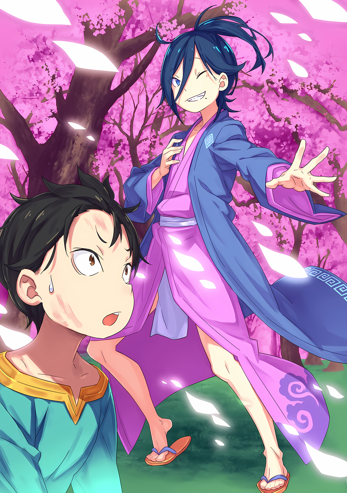
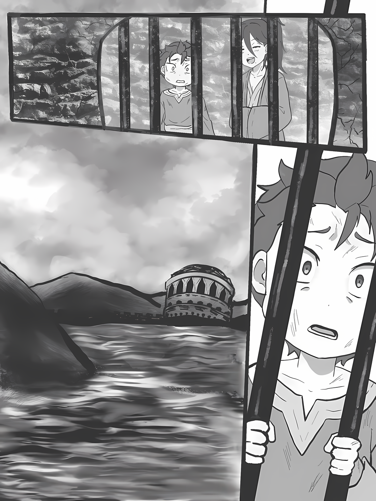

……Он чувствовал себя так, словно его оставили в холодном, темном месте.

Было темно, будто он закрыл глаза, холодно, будто он прижался щеками к остывшей глыбе железа. Он отчаянно искал спасения, чувствуя, как все его тело сковывают цепи плена.

Именно поэтому он, словно в трансе, продолжал протягивать руку в поисках всего, что только можно найти.

Однако не поэтому он протянул свою руку в сторону надвигающегося в самом конце белого света.

Этот свет…… скорее, его личностью была девушка с трагическим выражением решимости на лице. Он протянул к ней руку не потому, что искал у нее спасения, а потому, что чувствовал, что должен спасти ее.

И вот, сгибая цепи, не позволявшие ему ни на дюйм сдвинуть свое тело, он протянул руку, свою собственную руку.

А затем.…

???: ……Такая маленькая.

Пробормотав это, Нацуки Субару уставился на свою собственную руку, которая теперь отражалась в его затуманенном зрении.

Рука, поднятая к верху, ладонью наружу, была его собственной рукой, вытянутой из плеча. Она сжималась и разжималась, двигаясь точно по его воле. Без сомнения, это была его рука.

Однако это была рука ребенка, размером меньше, чем ожидал Субару.

Что значит….

Субару: Я не превратился обратно в нормальное состояние……

Это был его шанс выбраться из безнадежной ситуации, он должен был получить его, пройдя через невыразимые трудности. Он буквально ставил свою жизнь на кон снова и снова, и казалось, что результат ускользнул из его рук.

Сколько жертв он принес ради того, что ушло из его рук?

Сколько. Жертв……

Субару: ……!? Вот именно, черт возьми, что я делаю!?

От толчка, внезапно пробежавшего по его затуманенному сознанию, Субару поднес руку, на которую он смотрел, к лицу.

На него нахлынули воспоминания о странной ситуации, с которой он столкнулся в Городе Демонов, а также об опасной игре в прятки с Ольбартом, где ему пришлось несладко; настолько несладко, что это перевешивало остальные неприятности.

Субару удалось одержать победу после бесчисленных «Смертей». Он должен был получить свою награду победителя…… а именно, избавиться от своей «Инфантилизации».

Субару вспомнил, как Ольбарт прикоснулся к его груди, пытаясь избавиться от «Инфантилизации».

И сразу после этого он почувствовал, что кто-то прошептал ему в уши слова любви, и……

Субару: После этого я потерял сознание, а потом… что было потом?

Субару попытался найти в своих нечетких воспоминаниях то, что произошло. Однако, даже когда он толкал и тянул на себя дверь, в которой хранились его прерванные воспоминания, она не открывалась.

Крепко стиснув задние зубы, Субару становился все более нетерпеливым, так как чувствовал, насколько упрямой была эта дверь….

???: ……Сейчас, сейчас, давай успокоимся, не нужно нервничать. К счастью, вы выбрались живыми, так что можешь не торопиться и заняться делами после того, как очнется маленькая миссис, которая прибыла с тобой.

Субару: ……А?

Внезапно Субару услышал голос, раздавшийся прямо рядом с ним, и он повернулся, чтобы посмотреть на него в оцепенении. Когда он лежал на жесткой кровати, его глаза встретились с кем-то, кто опирался подбородком на свои руки.

Этот кто-то ухмылялся от уха до уха, заглядывая ему прямо в лицо.

Субару: УААА!??

???: Стоп. Мне нравится такая реакция, но лучше бы тебе не шуметь. Если мы будем слишком шумными, то привлечем внимание вождя острова, и он устроит надоедливый бой до смерти. Но опять же….

Субару: Э… а… э…

???: Хоть это и дурной вкус, но мне не противна такая идея. Точнее, она мне нравится.

Перед Субару, который не задумываясь вскочил на ноги и растерянно озирался по сторонам, стоял синеволосый человек и бесстрастно хвастался.

Его длинные волосы были завязаны в хвост, а одет он был в нечто, напоминающее японскую одежду, которую здесь редко встретишь. Пораженный тем, насколько незнакомым он выглядел, Субару сделал глубокий глоток, прежде чем выбрать слова и вопросы.

Незнакомым был не только собеседник, но и место, обстановка, атмосфера……

Субару: ……Кто ты? Где мы?

???: ……О, как великолепно! Какие замечательные вопросы! Как я и ожидал… Нет, это превосходит даже мои ожидания!!!

Субару: Э?

Субару осторожно попытался оценить его отношение, но другой человек, сверкая глазами, быстро взял Субару за руку, тряся ее вверх-вниз с такой силой, что тот подумал, что ему оторвет плечо.

Не похоже, чтобы Субару был настороже. Но, несмотря на это, казалось, что он вообще не может реагировать.

На глазах у ошеломленного Субару, он отпустил его руку со звуком «Хехе», покружился на месте, словно танцуя, и сказал:

???: Ты пересек черное озеро и достиг этого острова…… Острова Гладиаторов Гинунхайв! Ты, с таким неприятным взглядом в глазах, кишащий такими прекрасными предчувствиями! Я действительно отвечу тебе!

Его тон и жесты были театральными, и для человека, которого он только что встретил, он был довольно плохо воспитан. Однако он не показал никаких признаков того, что знает, о чем думает Субару, и вместо этого нагло придерживался своего отношения, своей театральности.

Как будто он был актером на сцене и наслаждался аплодисментами, как будто это было естественно….

???: ……Сесилус Сегмунт.

Иллюстрация к **Ранобэ** Том 30 | Разукрасил NorvakK

То, как он вытягивал руки влево и вправо, когда произносил свое имя, создавало впечатление, что он принимает позу прямо из театра кабуки.

Естественно, кабуки не должно существовать в этом мире, поэтому он, вероятно, не имитировал настоящий театр. Тем не менее, поза, которую он принял, была настолько убедительной, что у Субару перехватило дыхание.

И опять же, у Субару перехватило дыхание не только от его мощной позы, но и от того, как знакомо прозвучало его имя. Где он слышал его раньше? Как только он вспомнил, то нахмурился.

Он слышал его прямо от Абела.

Если он не ошибается, то его имя принадлежало одному из «Девяти Божественных Генералов».….

Сесилус: Я — «Синяя Молния» Волакии. Главный актер этого мира.

Субару вытаращился, услышав, как величественно он заявил об этом перед ним.

И его имя, и титул соответствовали тому, что Субару помнил. ……Однако была одна вещь, которая представляла собой огромную проблему.

А именно……

Субару: ……Сильнейший из Волакии… ребенок?

……Сесилус Сегмунт, улыбающийся прямо перед ним, был ребенком примерно того же возраста, что и уменьшившийся Субару, с повадками несносного сопляка.

△▼△▼△▼△

……Тяжелое воздействие «Инфантилизации» сказывалось как на разуме, так и на теле Нацуки Субару.

Физические последствия было легко понять. Как и следовало ожидать от нынешнего внешнего вида Субару, то, чем он обладал, соответствовало лишь физическим возможностям ребенка примерно десяти лет. Его сила рук и ног, а также, естественно, выносливость и взрывная сила — все это было возвращено к маловозрастной стадии.

Впрочем, были сомнения в том, насколько полезными были изначальные физические способности Субару по стандартам этого мира. Так что можно с уверенностью сказать, что разница была невелика, как бы ему ни хотелось это признать.

Гораздо серьезнее, однако, было воздействие на его внутреннее, а не внешнее состояние.

Субару: Может, у меня в голове все перепуталось….

Это было не совсем корректное выражение, но это был простой способ выразить плохое положение, в котором оказался Субару.

Его способность соображать, думать и черпать знания ослабевала. Хотя он использовал тот же стол, что и раньше, его способность открывать ящики была слабее, и он не мог добраться до ящиков, которые были выше.

……В башне Замка Красного Лазурита разворачивалась адская игра в прятки, авторства Ольбарта.

На аномально большое число попыток, предпринятых им для реализации контрмеры, очень сильно повлиял регресс его мыслительных способностей. Он был уверен, что до него он нашел бы решение несколько быстрее.

Возможно, ему пришла бы в голову эта идея, и он быстрее положил бы конец этому испытанию, вплоть до того, что не почувствовал бы боли.

К счастью, в тот момент его спас не сам Субару, а все, кто был важен для него.

Он слышал голоса всех, их поддержку, эхом отдававшуюся в его голове, и……

Субару: Нет, нет, это не то….

Вдруг что-то медленно поднялось в его сердце, и Субару поспешил избавиться от этого рукой.

Смешанное чувство облегчения и меланхолии, вероятно, было чувством, больше похожим на тоску по дому. До инфантилизации он мог бы вынести эти чувства, учитывая хаос и чувство ответственности, но, похоже, его детское тело даже ослабило оплот, защищавший его от разрывов. Если бы он не был осторожен, то, скорее всего, разрыдался бы.

Субару: …Не… плачь, не плачь. Я идиот? Нет… я точно идиот.

Сколько бы он ни горевал, он не мог заимствовать силу у тех, кто не присутствует здесь.

Позволив трению от руки убрать слезы, Субару изо всех сил старался вернуться к главному. Он должен был это сделать, ведь только так у него появится шанс воссоединиться со всеми.

Сейчас важны были не его слабый разум и не зарождающееся чувство ностальгии. Скорее, ему нужно было сосредоточиться на сути своего затруднительного положения.

А если точнее….

Субару: Я когда-нибудь слышал от Абела или Зикр-сана о возрасте «Первого»…?

Фыркнув, Субару поискал в памяти ответ на свой вопрос.

Сесилус Сегмунт…… он слышал, что тот был сильнейшим среди «Девяти Божественных Генералов» Волакии. Это означало, что он был самым могущественным человеком в Империи.

Причина, по которой они отправились в Город Демонов Хаосфлейм, заключалась в том, чтобы заставить Йорну, одну из «Девяти Божественных Генералов», стать их союзником. Для того чтобы вернуть себе трон, их стороне нужно было заполучить как можно больше «Девять Божественных Генералов».

Затем, конечно же, следовало должным образом обсудить тему человека, занимающего первое место.

Итак, он открыл этот жесткий ящик, ища хоть какой-то ответ, но……

Субару: Единственное, что я могу вспомнить, это то, что он непопулярен, а значит, не очень надежен….

Он не был уверен, потому ли, что эта часть произвела на него наибольшее впечатление, или потому, что это было все, что ему действительно сказали, но это была вся информация, которой Субару обладал относительно «Первого».

К сожалению, он не смог найти никакой информации о его внешности, возрасте или чего-либо подобного, а именно это ему хотелось узнать в данный момент.

Субару: Но если речь идет о том, что он непопулярен из-за того, что он ребенок, то я без труда понимаю, почему так.

В Империи, где почитали сильнейших, было бы странно, если бы самый могущественный был непопулярен.

Если бы это было связано с тем, что самый сильный человек — ребенок, это имело бы смысл. Многие взрослые не захотели бы следовать за ребенком, каким бы сильным он ни был.

Итак, пока Субару смирялся с этой информацией и своими новыми знаниями,

Сесилус: ……Похоже, ты пришел к какому-то выводу.

На это заявление Субару поднял голову и увидел синеволосого мальчика…… Сесилуса, стоящего перед ним в той же величественной позе, которую он принял ранее.

Оставив его стоять на месте, Субару, потерявшийся в своих мыслях, моргнул глазами и сказал:

Субару: П-прости, я оставил тебя ненадолго.

Сесилус: Ах, нет, вовсе нет, не беспокойся обо мне. В конце концов, я часто остаюсь в стороне от дискуссий! Я привык, что меня оставляют в покое и не разговаривают со мной, хахаха!

Субару: Это так….

Сесилус сверкнул белыми зубами, беззаботно рассказывая о своей печальной ситуации.

Хотя он был ошеломлен таким отношением, и был рад, что его грубый ответ не испортил ему настроение. В конце концов, у него было много вопросов, которые он хотел задать ему.

Он наклонил голову в недоумении, не зная, с какого из многочисленных вопросов начать.

Субару: Прости за грубость, еще раз прошу прощения. Я… ..

Сесилус: Как. Я. И. Сказал! Нет никаких проблем. Конечно, это не значит, что грубость, неуважение и действия без учета интересов других приемлемы, но я готов терпеть это до некоторой степени. Если ты нетерпим, мал и поверхностен, то разве это не то же самое, что играть второстепенную роль и получать по заслугам?

Субару: Да, ты прав. Спасибо, это помогло. так вот, я….

Сесилус: Точно, вспомнил! Я не спросил тебя об этом, потому что ты был погружен в свои мысли, но что ты думаешь об этой позе? Поскольку я вложил в эту позу все свои силы, я бы хотел услышать твою реакцию. Я подумал, не добавить ли это к моему представлению, чтобы дать ему последний толчок, который ему нужен!

Субару: Подожди секунду, пожалуйста, я говорил……

Сесилус: О да! Есть еще несколько вещей, о которых я хочу спросить, они мне очень интересны! Что ты думаешь!? Если бы ты мог рассказать мне что-нибудь об этом очень подробно, я бы….

Субару: ……ПОСЛУШАЙ МЕНЯ!

Хотя он пытался говорить спокойно, все его попытки были прерваны молниеносной речью собеседника.

Опасаясь, что его захлестнет темп разговора, Субару непроизвольно издал громкий крик. После этого Субару испытал шок, так как миндалевидные глаза Сесилуса расширились,

Сесилус: О, случайно, я снова это сделал?

Субару: В наше время практически никогда не услышишь такого уровня дефолтный фидбек……

Сесилус: Дэфолтный? Фитбэг?

Субару: Хм, это фраза из моего родного города, означающая что-то вроде стандарта или клише.

Сесилус: Хохо, из твоего родного города! Это очень интересно! Ах, неловко получилось.

С блеском в глазах «Синяя Молния» быстро набросилась на объект своего любопытства.

Возможно, это прозвище также символизировало его характер, который был слишком честен в отношении своих желаний, словно молния, ищущая высокое место для падения. Он был совершенно неугомонным человеком.

……Но, возможно, он скорее скрывал свой истинный характер притворством.

Сесилус: Ну-ка, о чем ты будешь говорить? Я не могу остановить пульсацию в моей груди, ожидая услышать, что ты скажешь дальше! Хаааа~, я чувствую себя таким счастливым!

Субару: ……Это совсем не похоже на выступление.

Сверкая глазами, мальчик желал, чтобы слова из уст Субару сложились в рассказ.

Его отношение, казалось бы, полностью лишенное какого-либо обмана или заговора, заставило Субару усомниться в том, что Сесилус вообще умеет лгать. В первую очередь, какой смысл сейчас устраивать Субару такую ловушку?

Если бы он не был с Абелом, Субару не привлек бы к себе никакого внимания в Империи.

……Конечно, были исключения, которые без конца пытались покуситься на жизнь Субару.

Субару: Но это исключения, и я не хочу их больше видеть, если это возможно.

Сесилус: ……? Ты о чем?

Субару: А, я просто разговаривал сам с собой. Кроме того, я Нацуки Субаруу…аагх…

Когда Сесилус в замешательстве наклонил голову, Субару назвал свое имя, чтобы избавиться от сомнений, но тут же осознал свою неосторожность в раскрытии своей истинной личности.

В то время, когда он переодевался, Субару принял имя «Нацуми Шварц», с благоразумием, чтобы не распространять свое имя в Империи по неосторожности, но его детское легкомыслие все испортило.

Если по какой-то случайности, по какой-то маленькой возможности, Сесилус, человек с должностью Генерала Первого класса Империи, знал о Королевском Отборе соседней страны Королевства Лугуника, и о людях, вовлеченных в него, тогда….

Сесилус: Нацуки Субару, не так ли? Любопытно звучит, но как-то очень гладко ложится на язык. Кстати, фамилией будет… Нацуки или Субару?

Субару: ――. М-моя фамилия Нацуки, а имя Субару.

Сесилус: Хахахаа, принял к сведению. Тогда я буду звать тебя Субару-сан! Но если я найду лучший способ называть тебя, я просто изменю его в зависимости от настроения, так что не пугайся.

Махнув рукой, Сесилус ответил с лицом, на котором не было и намека на узнавание.

Субару почувствовал облегчение, но в то же время в его голове зародилось легкое сомнение. ……Действительно ли этот ребенок — Сесилус Сегмунт?

Субару: …………

Если подумать, любой может просто утверждать, что он может быть потенциальной личностью. Конечно, мальчик перед ним мог это сделать, точно так же, как Субару назвал себя Нацуки Субару.

Конечно, имя и псевдоним «Синей Молнии», сильнейшего в Волакии, были известны.

Было бы чересчур ожидать встретить самого сильного человека в Волакии в незнакомом и сомнительном месте, таком как это. Кроме того, более вероятно, что это мог быть просто какой-нибудь мальчишка, выдающий себя за Синюю Молнию, потому что он восхищается именем и титулом. Это было бы гораздо более естественной мыслью.

Сесилус: Боже мой. Что за подозрительный взгляд в твоих глазах? Это из-за меня?

Субару: ……Ты — настоящая «Синяя Молния»?

Сесилус: Вот оно! Они опять это сказали! И так каждый раз!

Поскольку выяснять отношения с кем-то было не в его силах, он бросил мяч в Сесилуса, который тут же разразился громким смехом.

Он подумал, может ли он и дальше называть этого мальчика Сесилусом, но, похоже, что люди, кроме Субару, тоже сомневались в подлинности его личности.

Однако……

Сесилус: Мои слова подлинные! Хотя так легко об этом воскликнуть, на самом деле это ничего не доказывает, не так ли? С другой стороны, любая скрытая информация, которая может быть полезна для доказательства моей личности… Даже если я скажу тебе что-нибудь подобное, сможешь ли ты отличить подлинное от неподлинного? Субару-сан, ты ведь не так уж хорошо меня знаешь?

Субару: Это… Да, ты прав.

Сесилус: Тогда, это пустая трата времени спорить о подлинности моей личности. Давай просто отбросим бесполезные вещи и перейдем к следующей теме! Это гораздо конструктивнее, хотя я и специалист по разрушению вещей!

Он чувствовал, что его подначивают своим напором и красноречием, но поскольку Сесилус выдвигал свои аргументы так яростно и без пауз, у Субару не было возможности возразить. Кроме того, то, что он говорил, было правдой, хотя и крайней.

У Субару не было способа определить, действительно ли это «Синяя Молния» или нет. Не было у него и подсказки, которую он мог бы использовать. И даже если бы он заподозрил этого неуверенного Сесилуса, он никогда не нашел бы ответа.

А раз так……

Субару: …………

Как только он отбросил Сесилуса как объект своего интереса, следующий вопрос, который должен был встать на передний план, касался его ситуации.

Когда Субару собирался позволить Ольбарту отменить его «Инфантилизацию», его сознание поглотила пустота… нет, что-то гораздо более темное поглотило его, и его сознание исчезло.

Однако было ясно, что он не просто потерял сознание, и все.

Вот пример: Субару лежал на ветхой кровати, лицом к Сесилусу.

Даже с учетом ограниченных ресурсов Племени Судрак, были предприняты усилия, чтобы сделать кровати удобными, используя мягкую траву и дерево. Однако на этой кровати ничего подобного не было.

Единственное, что здесь было…… это подставка, на которую можно было просто лечь.

К этому мрачному впечатлению добавлялся пустой, голый интерьер комнаты, лишенный всего, кроме кровати.

Серые стены были сухими и потрескавшимися, а пол был испачкан грязью, которую невозможно было очистить. Влажный, свинцовый воздух проникал в легкие, и обстановка не располагала к комфорту.

Было ощущение, что он находится в тюремной камере.

Субару: Сеси, можно тебя кое о чем спросить?

Сесилус: Сеси! Что, кто? Это случайно не я?

Субару: Не уверен, могу ли я называть тебя Сесилусом, когда не знаю, настоящий ты или ненастоящий….

Не то чтобы он готовился к встрече с настоящим Сесилусом, скорее это был компромисс, к которому Субару пришел в отношении мальчика, подлинность которого не могла быть установлена.

Называть его «условным Сесилусом» было бы невежливо и хлопотно. Помимо того, что он был слишком болтлив до подозрительности, его поведение было очень дружелюбным, и он хотел избежать неприязни.

Субару: Думаю, он может быть самым дружелюбным человеком в Империи… Нет, он не сможет сравниться с Флопом и Медиум. Но я думаю, что он может дать им хороший бой.

Однако он не мог это утверждать, так как были примеры, когда люди, которые сначала были дружелюбны, потом меняли свои взгляды.

С другой стороны, то, что Субару случайно встретил брата и сестеру О'Коннелл, когда был с Рем, было нехарактерным проблеском удачи. Возможно, это была самая большая удача за всю его жизнь.

Он задался вопросом, почему Флоп позвал его тогда. Возможно, ему было невыносимо видеть Субару в таком состоянии с Рем.

Сесилус: Сеси, Сеси, это… Какое особое ощущение! Изысканный звук! Теперь, когда я задумался об этом, меня никогда не называли по прозвищу. Чувствую свежесть в своей жизни!

Сесилус, с другой стороны, был в восторге от своего первого прозвища.

Субару выбрал для него несколько дешевое имя, но если он так доволен им, то мешать его восторгу было бы нежелательно, и он счел излишним придумывать альтернативу. Других идей у него действительно не было.

Субару: Итак, вернемся к теме…… Это ведь не Хаосфлейм, верно?

Сесилус: Хаосфлейм…… ты имеешь в виду Город Демонов? Да, вовсе нет. Скорее, он находится на противоположной стороне Империи, с востока на запад! Как я уже сказал, это Остров Гладиаторов Гинунхайв

Субару: Остров Гладиаторов….

Губы Субару скривились, когда он почувствовал, как незнакомое слово, Гинунхайв, сорвалось с его языка.

Это название ничего не напоминало, но название места вызвало у него тревожное чувство. Если Хаосфлейм называли «Городом Демонов» из-за большого количества живущих там полулюдей, то должна была быть причина, почему и Гинунхайв носит это название.

Гладиаторы… остров… то есть……

Субару: ……Остров… Гладиаторов?

Слово «Гладиатор» вызвало в его голове определенный образ, так как он вспомнил, что где-то слышал его раньше.

Если он правильно помнил, это было слово, которое Ал действительно время от времени произносил. Он провел на нем десять лет, а потом и больше, в качестве гладиатора, постоянно думая, что умрет.

Несмотря на то, что он потерял левую руку, ему удалось выжить и выбраться оттуда.

Затем он понял, это место…

Субару: Не может быть, это место для дезматчей…?

Сесилус: Дэз мачей? Это фраза из твоего родного города? Что она означает?

Субару: ……Что-то вроде арены, место, где люди убивают друг друга.

Сесилус: Понятно! Значит, ты быстро понял! Вот именно, это и есть «Земли Дезматчей»!

Субару: ……тц

Сесилус рассмеялся над Субару, которого охватил холодок ужаса после упоминания этой ужасающей возможности.

То, что он хлопал в ладоши перед грудью и говорил непринужденно, заставило Субару заподозрить, что он где-то ослышался. Но сколько бы он ни ждал, слова, которые он хотел услышать, не прозвучали из уст Сесилуса.

……Нет, слова просочились, но это были не те слова, которые Субару хотел услышать.

Сесилус: Еще раз… добро пожаловать на Остров Гладиаторов. Такие молодые люди, как я и Субару-сан, редко сюда попадают, а если и попадают, то живут недолго, так что желаю тебе всего наилучшего.

Субару: Спа… тск!

Сесилус: Что?

Субару: Это нелепо! Это… Это должно быть какая-то ошибка!

Его лицо исказилось, голос Субару сорвался на Сесилуса.

Это было слишком сложно принять. Чтобы оказаться в таком месте, это должна быть какая-то ошибка.

Субару: Потому что я был в Хаосфлейме, пока не проснулся, и….

Сесилус: Нетнет, ты лежал на этой кровати, пока спал. Ты даже стонал, когда спал. Я понимаю причины стонов из-за недостатка комфорта во время сна, но когда я был в Хаосфлейме.….

Субару: Это не то, что я имею в виду! Разве ты не понимаешь!?

Сесилус: Хм.

Раздраженный непостижимым Сесилусом, изо рта Субару разлетелись слюни, когда он пытался ему пояснить ситуацию.

Закрыв один глаз на его жалобу, Сесилус показал готовность слушать и не стал вмешиваться. Это поведение заставило Субару отвести от него взгляд, вместо этого оглядывая комнату.

Субару: Я…… был в Хаосфлейме. То, что я здесь, должно быть, какая-то ошибка. Я был занят другими делами с другими людьми.

Сесилус: Даже если ты говоришь, что это ошибка, все-таки ты здесь. Если я приму этот аргумент, это значит, что я должен быть тем, кого отправили с острова в Город Демонов.

Субару: Разве это не возможно, если я на Острове Гладиаторов?

Сесилус: Не понимаю. ……Но если тебе нужен ответ на этот вопрос, то я могу дать его тебе очень быстро.

Пожав плечами на истерику Субару из-за того, что он его не слушал, Сесилус спокойно протянул руку. Тонкий палец указал на стену в задней части комнаты.

……Нет, это была не стена. Он указал на окно с железными решетками.

Окно, расположенное высоко, выходило на улицу, и через него дул влажный ветерок.

Субару: Нет, нет, нет, нет…!

Арт от pabobingu

Его губы дрожали, Субару в панике спрыгнул с кровати.

Как только он встал босыми ногами на холодный пол, его голова дернулась, и он почувствовал слабость, но ему удалось подавить ее и броситься к окну. Подпрыгнув, он ухватился за решетку и с силой приподнялся, уперевшись подбородком в оконную раму и неловко извиваясь.

Затем, каким-то образом, ему удалось открыть вид на улицу……

Субару: ……Мо… ре?

Сесилус: Верно, это озеро.

Выглянув в окно, Субару в ужасе пробормотал это.

Сесилус попытался подтвердить его слова, уловив это бормотание. Однако он ошибся, так как Субару сказал «море», а не «озеро».

Действительно, Сесилус ошибся. Если он действительно ошибся, то, возможно, он ошибся и в окружающем пейзаже.

По крайней мере, Субару понимал, что это лишь то, во что он надеялся верить.

Субару: Насколько я могу судить, это абсолютно черное озеро….

Сесилус: Весь остров окружен озером. Единственный способ попасть на другой берег — «поднять» единственный разводной мост. Воистину, естественное укрепление, или, скорее, тюрьма!

Не в силах подняться, Субару отполз от окна. Сесилус разинул рот, когда Субару стоял на полу, опустившись на колени.

Почему он был в таком хорошем настроении в таком безнадежном месте

Субару: Почему…

Сесилус: М?

Субару: Почему ты выглядишь таким веселым?

Взрослый Субару, скорее всего, не решился бы это спросить, но сейчас он задал этот вопрос прямо.

Будучи ребенком без самоконтроля, вопрос просто вырвался наружу, вытекая изо рта. Сесилус ответил на слишком прямолинейный вопрос Субару с детским выражением в глазах и сказал,

Сесилус: Ну, потому что я чувствую конец первого акта!

Субару: Первый акт….

Сесилус: Увы, хотя я не очень понимаю, меня бросили в эти «Земли Дезматчей», и я должен был сражаться насмерть в вихре крови! Новый ветер дул ко мне с другим запахом крови и другим предчувствием! Учитывая это, вполне логично, что история перейдет в следующую фазу.

Он совершенно не понял рассказ Сесилуса, так как тот говорил глубокомысленно, подняв пальцы. ……Нет, дело было не в том, что он не понимал. Дело в том, что он не хотел понимать.

Потому что если бы он попытался полностью понять то, что говорил Сесилус, это означало бы……

Сесилус: Иначе было бы неинтересно. Нельзя держать звездного актера вне сцены; это было бы святотатством в нормальной истории!

……Сильнейший в Волакии, «Синяя Молния», был помешан на драме.

△▼△▼△▼△

Сесилус Сегмунт, театральный чудак, был человеком многословным.

До такой степени, что можно было заподозрить, что если его предоставить самому себе, он будет продолжать болтать без умолку.

Сесилус: Итак, я просто прогуливался снаружи, а тут вы, просто подползаете к берегу. Удивительно, не правда ли? Такое нечасто случается. Это было предначертано судьбой, безусловно! Или, лучше сказать, это было похоже на что-то из сказки.

Субару: …………

Сесилус: Ты, наверное, не знаешь, но у меня всегда была хорошая интуиция. Вот и сегодня я нашел тебя, когда гулял по городу, потому что мне показалось, что ветер зовет меня. Так что я настолько благосклонен к миру, что это меня пугает.

Субару: …………

Сесилус: Конечно, ты выжил в той ситуации, так что у тебя есть все шансы стать любимцем мира! Давай покажем все, на что способны, Суба… Бару… Хммм~?

Задрав свою голову, Сесилус о чем-то размышлял, бормоча себе под нос.

Слушая бессодержательную и бессмысленную речь, льющуюся со рта мальчика, босые ноги Субару ступали по холодному каменному полу.

Было бы безрассудно выходить и гулять вот так за пределами комнаты, в которой он проснулся, ведь это место было для него неизвестным.

Тем не менее, ему нужно было кое-что подтвердить.

Субару: Все так, как ты сказал, верно? Я был не один?

Сесилус: А? Ааа, да, это правда. Я бы хотел похвалить тебя за это. Ты не только вышел из той ситуации живым, но и спас жизнь своей спутнице, что действительно является подвигом удачи и мужества…… Что-то вроде таланта!

Субару: Да-да, конечно, талант, мужество и все такое, верно. Итак, тот другой человек….

Сесилус: Был маленькой девочкой. Более или менее похожа на тебя, Басу… А! Неплохо звучит, не так ли?

Разговор пошел под откос без всяких усилий, но он смог получить ответы на вопросы, которые хотел задать.

Возможно, Сесилус ломал голову над тем, как называть Субару в ответ на прозвище «Сеси», которое тот ему дал. Пока прозвище не было ужасным, для него не имело значения, как его называют.

Важнее всего была информация, которую он смог получить от него….

Субару: ……Луис.

Кто-то примерно того же возраста, что и он сам…… когда речь заходила о ком-то, кому было столько же лет, сколько сейчас Субару, на ум, естественно, приходила Луис. Ситуация сейчас была такова, что Медиум тоже была примерно такого же возраста, но так как она не присутствовала на той башне, она не была кандидатом.

Однако, честно говоря, мысленное впечатление Субару о Луис было беспорядочным.

Субару: Я не собираюсь бросать тебя до того, как получу ответ на этот вопрос. Кроме того, может быть, с твоей силой….

Если они смогут воспользоваться телепортом Луис, то, возможно, им удастся выбраться с этого опасного острова.

Он еще не знал всего острова, и хотя Сесилус был единственным человеком, которого он встречал в этом месте, из того, что тот ему рассказал, это, без сомнения, должно было быть абсолютно худшее окружение для ребенка, чтобы проводить в нем время.

Так что….

Субару: Мы должны убраться с этого острова как можно скорее.

Сесилус: Вот это стремление, но я думаю, что на пути будет много препятствий. Насколько я слышал, только одному человеку удалось сбежать из этого места, и именно по этой причине было создано «Правило Проклятия».

Субару: Тогда я буду вторым. Нет, ты и мой спутник — трое.

Решимость Субару вмешалась, ответив рефлекторно. Сесилус, услышав это, посмотрел на него, как на какую-то мелочь, а затем издал высокий свист.

Похоже, это как-то подняло ему настроение, но сейчас было не до этого.

И……

Сесилус: Басу, сюда.

Пройдя немного по тускло освещенному проходу, наполненному сырым, холодным воздухом, Сесилус резко остановился. Сцепив руки за головой, он подбородком указал на комнату с выцветшей деревянной дверью.

Посмотрев на дверь, Субару спросил: «Сюда?»,

Сесилус: Это комната исцеления. Ее также называют комнатой трупов. Многие люди становятся здесь трупами после неудачного боя на арене.

Субару: К-комната исцеления, да? А целитель?

Сесилус: Целитель, ха! У нас есть несколько целителей, вроде как, но ни один из них не владеет магией. Было бы меньше смертей, если тех назначили сюда, но это не сходится с политикой начальника острова.

Субару: …………

Получив такой легкомысленный ответ, Субару невольно замолчал.

Это совершенно вылетело у него из головы, но в Империи Волакия было очень мало людей, способных владеть магией исцеления. Именно поэтому целительная магия Рем считалась ценной.

Но факт оставался фактом: Луис поместили в лечебную комнату, где не было целителя.

Сесилус: Девочка, которую ты привел с собой, была очень слабой, вот почему. Цель этой комнаты, по крайней мере, по названию, лечить раненых, поэтому здесь есть одеяла и вещи, чтобы хотя бы подлатать людей. С нами, гладиаторами, обращаются плохо, как ты и убедился ранее, условия для сна ужасны, не так ли?

Субару: …Ты здесь единственный гладиатор.

Сесилус: Ахахахаха, ты прав! Ну, устрой эмоциональную встречу.

Сесилус похлопал Субару по плечу.

Подгоняемый его напором, Субару сглотнул слюну, взял себя в руки и направился к двери. Открыв ее, он нахмурился от неприятного запаха, исходящего изнутри.

Оттуда исходил запах смеси крови и разлагающейся плоти, это было вершиной антисанитарии.

Может быть, их чувство гигиены умерло и исчезло? В этой не слишком просторной комнате можно было увидеть изношенные инструменты и неряшливо выстиранные бинты, оставленные сушиться.

И в этой не очень хорошей обстановке……

Сесилус: Твой компаньон спит вон там.

Субару: ……Кх, Луис!

Сесилус указал на кровать в задней части комнаты, а Субару огляделся.

Похоже, это была комната, служившая лазаретом, с двумя кроватями, которые были немногим лучше той, на которой лежал Субару.

Субару поспешил к нему, торопимый своими смешанными чувствами. Он торопился к Луис, но не мог решить, что ей сказать.

Однако……

Субару: ……Э?

Подбежав к девочке и попытавшись потрясти ее за плечо, Субару застыл от удивления.

Не потому, что он не мог найти нужных слов…… а потому, что он не смог найти того, кому бы он мог их сказать.

Девочка, которую, как говорили, принесли на берег вместе с Субару и уложили там спать, была не Луис, которая вызывала в его сердце смешанные чувства.

У нее была маленькая голова, два торчащих рога и льняные волосы, которые собирались у плеч. С девушки было снято нарядное кимоно, окутывавшее ее миниатюрное тело, и на ней было лишь простое нижнее белье.

Это была не Луис и не его спутница Медиум, сопровождавшая его в Город Демонов Хаосфлейм, которая тоже стала маленькой из-за технике Ольбарта.

Та, кто была там……

Субару: ……Т-Танза?

Спящая девочка никак не отреагировала на его трепетный зов.

Но даже если она не ответила, то, взглянув на нее, он понял. Он знал, что она не Луис и не Медиум, а Танза… девушка-олениха, помощница Йорны Миссигр, Госпожи Города Демонов.

Субару: Почему… Почему эта девушка здесь…?

Сесилус: О-о-о? Я опять что-то натворил?

Позади Субару, который с удивлением увидел спящее лицо, отличное от того, которое он себе представлял, Сесилус произнес что-то глупое.

Конечно, он не был виноват. Он не виноват, но……

Субару: Это не то, о чем мне говорили! Ты же сказал мне, что здесь будет Луис!

Сесилус: Не-а, интересно. Кажется, я объяснил, что была девушка, которая сошла на берег острова вместе с тобой, Басу. Я так же, как и ты, удивлен, что это не та девушка, о которой ты подумал.

Субару: Э, кх……

Субару растерялся, не в силах ничего сказать в ответ на разумный ответ Сесилуса.

Действительно, Субару сам догадался, что под «девушкой с ним» он имел в виду Луис. Он мог только извиниться перед Сесилусом за это.

Но это было странно. Почему Танза должна быть с Субару?

Для начала, если Танза была с ними прямо здесь и сейчас, то……

Субару: А как же Луис….

Положив руки на голову, Субару беспокоился о благополучии Луис, которой нигде не было.

Получив информацию о том, кто она, Абел, Ал и Медиум теперь видели в Луис угрозу. Йорна, возможно, могла бы защитить ее, но только потому, что не знала о ее настоящей личности.

Если бы она узнала, что Луис — Архиепископ Греха, даже она изменила бы свое мнение, как это сделала Медиум.

И он не мог найти ни одной причины, по которой Абел и остальные держали бы личность Луис в секрете.

Субару: Я должен вернуть ее Рем.

Существование Луис было очень похоже на тонкую и слабую нить, связывающую страдающую амнезией Рем и Субару.

Несмотря на то, что Луис последовала за ним без разрешения, у Субару была причина, по которой он не мог позволить себе не вернуть ее. Прежде всего, в глубине души он еще не решил, что делать с Луис.

И несмотря на это, местонахождение Луис было ему неизвестно, а Субару по какой-то чертовой причине оказался на этом острове.

Субару: Я не должен так терять время…!

Мысли Субару никак не укладывались в голове, они представляли собой беспорядочную мешанину из множества вещей.

Тем не менее, он знал, что должен немедленно убраться с этого острова и вернуться в Хаосфлейм.

Субару: Если возможно, я возьму ее с собой…

Сесилус: О, ты уверен? Разве эта девочка не та, которую ты ждал, Басу?

Субару: Нет. Она не та, но нет причин оставлять ее позади, верно? Кроме того, Йорна-сан должна искать ее.

Йорна была настолько ласкова, что без колебаний отдала себя даже ради маленького ребенка, которого только что встретила.

Без нее он не смог бы одержать победу в игре с Ольбартом или вообще уговорить чудовищного старика согласиться на первоначальное пари.

Поэтому возвращение Танзы Йорне было естественным способом отплатить за услугу.

Сесилус: Я думаю, что твой энтузиазм и внимательность достойны восхищения, но, как я уже говорил, я думаю, что это будет трудно.

Однако мнение Сесилуса омрачило парад Субару.

Несмотря на то, что его манера говорить и вести себя оставалась неизменной с самого начала, обстоятельства, о которых поведал Сесилус, были серьезными в своей основе. И все же Субару не мог не расстроиться из-за такой суровости реальности.

Субару: Я тебя услышал. Ты говоришь, что это место очень трудно покинуть, верно? Но если мы поищем лодку или поднимем разводной мост, о котором ты говорил раньше, то….

Сесилус: Мы «поднимем» разводной мост. Это было бы сложно, я думаю, но проблема в другом. Самая большая проблема — это *правило проклятия*, понимаешь? *Правило проклятия*.

Субару:* Правило*… проклятия…?

Это слово было незнакомым, но игнорировать его было невозможно, учитывая, что оно было названо самой большой проблемой.

Субару нахмурил брови, Сесилус ответил «Да», а затем заправил руки в рукава своего кимоно

Сесилус: *Правило проклятия* или же «Правило Проклятия». Очень хлопотное и могущественное правило, установленное вождем острова, который правит этим Островом Гладиаторов. Нарушишь его — и умрешь! Не подчинишься ему — и умрешь! Будешь сопротивляться ему, и умрешь! ……Проклятие смерти!

Субару: ……А.

Сесилус: Оно распространяется на весь остров. Понимаешь?

Провозгласив это, Сесилус закружился на месте, размахивая рукавами в воздухе.

Это было сказано в легкомысленной манере, без намека на серьезность, но существование смертельного проклятия такого рода слишком соответствовало представлению Субару об Империи, чтобы он мог посмеяться над этим как над ложью.

Субару: Значит, никто не может покинуть это место?

Сесилус: Да, верно. Если бы не это, я бы уже ушел отсюда. Зверодемоны в озере могут быть грозным противником, но я могу бежать по воде, если таково мое желание. Ты же это знаешь? Я имею в виду, как бегать по воде. Ты выставляешь левую ногу, пока правая не утонула….

Сесилус начал передавать эту не совсем обычную и причудливую идею ошеломленному Субару.

Похоже, именно так ниндзя бегают по воде, и, похоже, многие сверхлюди в этом мире действительно были способны на это. Не, сейчас не время так убегать от реальности.

Субару: Начальник острова, это он наложил проклятие на остров? Если да, то как насчет того, чтобы он же и снял проклятие? Потому что я здесь по ошибке….

Сесилус: Хахаха, очаровательная шутка! Будь то ошибка, казус или промах, к тому моменту, как ты оказался на этом острове и на тебе выгравирован знак проклятия, ты уже один из гладиаторов. Можно сказать, что этот факт доказывает твою предрасположенность к бытию гладиатора.

Субару: ……кх.

Слова, за которые он цеплялся, были отвергнуты, и Субару в удивлении проглотил слюну.

Слово «Проклятие» не вызывало у Субару ничего, кроме плохих воспоминаний. И, как и следовало ожидать, было решено, что плохие воспоминания будут наслаиваться друг на друга, чтобы стать еще хуже.

Субару: Это не шутка…… кх.

Не успел он опомниться, как его забросило в неизвестное ему место, с неизвестной ему девушкой. Мало того, почти неизвестный ему человек сказал ему, что если он попытается самостоятельно покинуть это неизвестное место, то может умереть из-за проклятия, наложенного на него еще одним неизвестным человеком.

Во что он должен верить и что вообще делать в этой ситуации……

Субару: ……Вот оно. Да, точно! Сеси, ты ведь один из «Девяти Божественных Генералов», не так ли?

Сесилус: Оо?

Субару: Тогда, может быть, ты можешь связаться с внешним миром или что-то в этом роде? Эта спящая девочка — подчиненная Йорны-сан в Хаосфлейме….

Субару схватил Сесилуса за плечи.

Когда тот закрыл один глаз в ответ на прикосновение, Субару забыл о собственном бесстыдстве.

Относясь к Сесилусу как к мальчику-волку*, Субару теперь ожидал, что он окажется «Синей Молнией», как он сам о себе и заявлял.

**метафора на фразеологизм «волк в овечьей шкуре».*

Поскольку он был одним из «Девяти Божественных Генералов» Империи Волакия, самым сильным в Империи, и к тому же очень доступным, он мог бы прислушаться к словам Субару.

На самом деле это было не более чем детское, эгоцентричное предположение.

Следовательно, рассуждения Субару, как обычно, закончились бы бесплодными усилиями.

Или, возможно, если бы его мышление не было притуплено «Инфантилизацией», Субару мог бы сам прийти к очевидному вопросу.

Но……

Сесилус: Скажи, Басу.

Субару: Оу, да, что такое?

Сесилус: ……Что за *Девять Пажественных Генералов*?

Субару: Э……?

Поскольку Субару держал его за плечи, Сесилус с любопытством наклонил голову.

Субару был поражен, не понимая, что ему говорят. Однако Сесилус продолжил: «Знаешь, я имею ввиду…»,

Сесилус: Если серьезно, я действительно не знаю, зачем я здесь. Я думаю, что есть некое развитие событий, которое продвинет историю, и мне интересно, не ты ли это, Басу.

Это была бомба, которая еще больше запутала разум молодого Субару.
