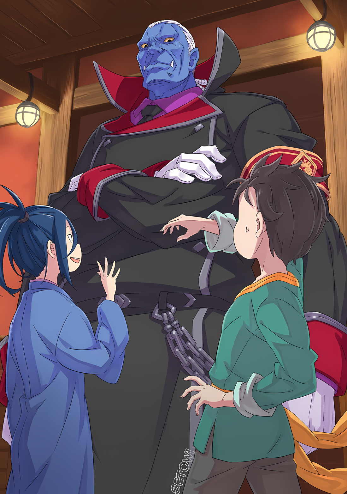

……Причины того, почему он находится здесь, и кто такие «Девять Божественных Генералов» были неизвестны Сесилусу.

Разум Субару был охвачен смятением, так как он не смог обработать это внезапное заявление.

Шок был гораздо сильнее, чем от холодной воды, и он не мог не моргнуть несколько раз, проверяя не сон ли это.

Субару: В-всмысле? Ты говоришь, что не знаешь почему ты тут оказался….

Сесилус: Я имею в виду то, что я и сказал. Я оказался выброшенным на этот Остров Гладиаторов, с совершенно новым окружением и перспективами на будущее, что привело меня в замешательство. Ну, могу сказать, что это довольно удобное место для меня и моего типа жизни, так что не скажу, что у меня слишком много придирок.

Субару: …………

Сесилус: Оо? Возможно, ты снова задумался? Чееел, Басу точно любит думать. Я имею в виду, я думаю, что это нормально; я на стороне тех, кто не любит много думать, видишь ли. Я не смеюсь над людьми, погруженными в размышления, и не хочу их прерывать, так что тогда я буду держать рот на замке!

Прошло немало времени, прежде чем Сесилус закрыл рот, но затем он замолчал. Однако за то время, пока он молчал, его ноги весело подпрыгивали, а глаза беспрестанно метались.

Хотя он, возможно, и не дурачился, но это более чем достаточно отвлекало.

Но у Субару не хватало самообладания, чтобы справляться с такими вещами. Если он собирался с чем-то разбираться, то это должно быть, по крайней мере, что-то значимое.

Например……

Субару: Почему ты ничего не знаешь о «Девяти Божественных Генералах», но знаешь, что тебя называют «Синей Молнией»? Странно, не правда ли?

Сесилус: А, ответ на этот вопрос прост. Не кто иной, как я сам придумал этот шокирующий псевдоним! Сесилус Сегмунт, «Синяя Молния» Волакии! Что ты думаешь? Это прозвище производит очень яркое и элегантное впечатление, ты не находишь? Когда-нибудь мое имя станет настолько известным, что все на свете будут восхищаться мной как главным актером! Это проявление моей страсти.

Субару: Прозвище, которое ты придумал….

Услышав такой гордый ответ, плечи Субару опустились в разочаровании.

Сесилус, озадаченный его поведением, спросил «А? Что случилось~?», бесстрастно глядя на выражение его лица. Но Субару потерял силу воли, чтобы ответить на этот вопрос.

Был ли мальчик перед его глазами настоящим «Сесилусом Сегмунтом» или подделкой, это заставило его прийти к выводу.

Теория о том, что существует множество взрослых, не уважающих детей, как и следовало ожидать, не имела силы опрокинуть его возмутительное заявление о том, что он никогда не слышал о «Девяти Божественных Генералах».

С какой стороны ни посмотри, настоящий Генерал Первого класса никак не мог последовать заявлению о том, что он никогда не слышал о «Девяти Божественных Генералах».

Субару: Не зная, что ты «Генерал» Империи, ты, должно быть, шутишь….

Было совершенно бессмысленно пытаться осмысленно действовать в рамках такой дырявой логики.

Поэтому в голове Субару исчезла всякая возможность того, что мальчик перед ним — настоящий Сесилус. Он был просто шутником, мальчиком-волком…… фальшивым Сесилусом.

И вот, тонкая нить надежды, проросшая в этом тупике, оборвалась.

Оставалось только одно зерно надежды…… что фальшивый Сесилус просто лжец, и, возможно, его рассказ об очень страшном острове был просто еще одной его ложью……

???: ……Так вот в каком месте ты жил, Сегмунт.

Субару: Уваа!?

В следующий момент размышляющий Субару подпрыгнул, когда глубокий мужской голос поразил его сзади, пока он размышлял.

Голос, который не принадлежал ни фальшивому Сесилусу, ни Танзе, которая, конечно же, спала на койке. Субару оглянулся на вход в лечебную комнату, откуда он и услышал этот голос, и его удивлению не было предела.

……Ибо фигура, стоявшая у входа в лечебную комнату, была немыслимо большим человеком.

Субару: О-огромный…!

Мужчина был настолько велик, что невозможно было не восхититься его ростом.

Нет, он был не только высоким, но и толстым как по вертикали, так и по горизонтали, все его тело соответствовало описанию толстого и большого. Его шея и конечности были тяжелыми, как бревна, а черная одежда, которую он носил, похожая на одежду полицейского или солдата, была настолько упругой и тугой, что казалось, будто она вот-вот лопнет.

rezero7arc | Разукрашенная иллюстрация **Ранобэ** Том 31 от Set0wi

Несмотря на то, что Субару уменьшился в размерах, это был настолько огромный мужчина, что, глядя на него снизу вверх, можно было повредить шею.

Его рост легко превышал два метра, и, возможно, это был самый высокий человек, которого Субару видел в этом альтернативном мире. Такие особенности, как его колоссальное тело, суровое лицо, клыки, выступающие даже при закрытом рте, и голубой цвет кожи, были слишком многочисленны.

Однако самая выдающаяся черта еще не была описана.

Этой самой выдающейся чертой была……

Сесилус: Йоу, как дела, Густав-сан! Сегодня утром ты выглядишь великолепно и чинно! Твое внимание к каждой детали своего внешнего вида — основа джентльмена, я считаю, что это действительно образцовое отношение!

Густав: Не нужно комплиментов, я рад видеть, что ты как всегда чрезмерно здоров. Такое существо, как ты, должно быть использовано на гладиаторской арене, так что я, как чиновник, по всей справедливости, строго сужу тебя.

Сказав это, огромный человек…… тот, кого звали Густав прерывисто вздохнул в ответ на язвительные слова фальшивого Сесилуса и дал ответ, скрестив свои четыре толстые руки.

Именно так, четыре руки.

Крупный мужчина с лицом демона, чье огромное тело было покрыто массой мышц, имел особенность в виде четырех рук, причем две из них росли из каждого плеча. Насколько он помнил, существовала раса полулюдей под названием Племя Многоруких, которые обладали такой особенностью; он слышал о них от одного знакомого старика.

Старик, которого он знал……

Субару: Точно, это был Вильгельм-сан.

Даже вспомнить имена своих знакомых было трудно для Субару.

Не обращая внимания на тяжелую борьбу Субару, фальшивый Сесилус рассмеялся над словами Густава, сказав «Нее»,

Сесилус: Твоя забота очень ценится! Я понимаю, о чем ты говоришь, Густав-сан! Если мне и суждено умереть, то только на поле боя. Я так благодарен, что у меня есть такой разумный человек в качестве вождя острова, я действительно счастливчик!

Густав: Смешение государственных и частных дел мешает порядку. Нет смысла заниматься такой глупостью, как чиновничество.

Сесилус: Да-да, я понимаю! Большое спасибо губернатору Густаву за внимание~!

Густав сузил свои умные глаза на фальшивого Сесилуса, когда тот изобразил глупую улыбку и сложил свои руки вместе.

В тонком смысле, заявление «не смешивайте государственные и частные дела» прозвучало для Субару так, будто он лично недолюбливал фальшивого Сесилуса, но не было смысла углубляться в это.

Кроме фальшивого Сесилуса, наконец-то был кто-то, с кем Субару мог поговорить.

Густав: Итак, Сегмунт, говоря о вон том мальчике.

И, как по команде, Густав тоже обратил свое внимание на Субару.

Когда на него смотрели с такой высоты и таким удушающим взглядом, казалось, что все его тело в миг было окутано воздухом запугивания. Эти четыре скрещенные руки, кулаки на их концах размером с голову ребенка, Субару, наверное, умер бы, если бы получил удар.

Рефлекторно Субару сглотнул слюну, а фальшивый Сесилус хлопнул в ладоши рядом с ним.

Сесилус: О да, он наконец-то проснулся. И, поскольку он беспокоился о своей спутнице, молодой леди, я привел его сюда. Но, похоже, спящая маленькая леди оказалась не той, кого он ожидал, и, кажется, возникло много несоответствий. Шок от этого сейчас рассеивается, так что теперь история будет разворачиваться отсюда! И это только то, на чем мы сейчас остановились.

Густав: Спасибо за объяснение. Однако я помню, что приказал, что если бы он очнулся, то первое, что ты должен был сделать, это привести его ко мне, как к официальному лицу. Это было бы условием для того, чтобы я, в своем качестве, дал разрешение на высадку этого мальчика и девочки на остров.

Сесилус: Так ли это? Прости, я забывчив.

Густав: ……………

Когда Сесилус ничего не ответил, Густав молча потер пальцем меж бровей.

При этом человек, который был гораздо ближе к небу, чем Субару и остальные, уставился в потолок, ворча про себя: «Как чиновник, я слежу за порядком; я не буду смешивать государственные и частные дела…»

Субару не был уверен, какие отношения были у Густава с фальшивым Сесилусом, но тот, вероятно, доставлял ему немало хлопот.

Осознав это, он хоть и пожалел Густава, но почувствовал некоторое облегчение.

Субару: Я не единственный, кем помыкает Сеси.

Сесилус: Это возмутительно думать, что я мог бы помыкать людьми. Думаю, я правильно объяснил, что хотел узнать Басу, и проводил тебя туда, куда ты хотел пойти, чтобы увидеть того, кого ты хотел увидеть

Субару: Да, ты прав, я неправильно выразился. В объяснении было много обходных путей, и человек, с которым мне разрешили встретиться, был не тем, с кем бы я хотел встретиться, а еще мне сказали, что я не могу пойти туда, куда бы я хотел пойти, и это меня угнетает, но……

Казалось, в фальшивом Сесилусе не было злобы, поэтому и не было смысла говорить об этом.

Когда Субару сказал ему об этом, фальшивый Сесилус издал «Тц», недовольно поджав губы. С этим Густав снова повернулся к Субару, как будто его разочарование в Сесилусе было успешно преодолено.

А затем……

Густав: Мальчик, если ты проснулся, давай начнем наш разговор заново.

Субару: Я буду рад это сделать. Всегда рад это услышать. Особенно если это говорит человек с высоким положением на этом острове.

Густав: Понятно.

Пока Субару тщательно подбирал слова, Густав коснулся двумя правыми руками своего подбородка.

На первый взгляд, внешне он выглядел сурово, но его речь и атмосфера были очень тихими и спокойными, а в глазах был умный блеск, что создавало впечатление, близкое к кустистому Зикру.

Другими словами, это был образ взрослого разумного человека.

Как бы подтверждая ожидания Субару, Густав глубоко и с достоинством кивнул,

Густав: Как официальное лицо, меня зовут Густав Морелло, и мне было доверено управление этим островом Его Превосходительством Императором Винсентом Волакия, Семьдесят Седьмым Императором Священной Империи Волакия. А теперь, можешь ли ты назвать свое имя и принадлежность?

Вежливо назвав свою должность и имя, он обратился непосредственно к Субару.

Субару был слегка удивлен этим фактом, затем положил руку на грудь и склонил голову.

Субару: Спасибо, что представились. Меня зовут Нацуки…… Нацуки Шварц.

Густав: Понятно. Шварц.

Субару, хотя и под давлением, назвал свое имя в ответ Густаву.

На мгновение задумавшись, использовать ли свое настоящее имя или псевдоним, он дал несколько неоднозначный ответ, но на данный момент это можно считать успехом.

Честно говоря, он не был уверен, правильно или неправильно было лгать Густаву.

Однако было бы нехорошо, если бы настоящее имя Субару распространилось. Возможно, для фальшивого Сесилуса это не имело большого значения, поскольку он был фальшивым Генералом Первого класса, но никогда не знаешь, кто может быть осведомлен о делах Королевства.

То, что можно скрыть, должно быть скрыто. Даже если Сесилус, услышав нынешний псевдоним Субару, многозначительно наклонил голову со словами «А?».

Густав: Но если ты Нацуки Шварц, то почему Сегмунт назвал тебя Басу?

Субару: Я думаю, что у Сеси есть свои собственные доводы. Не хотите ли вы подтвердить это?

Густав: ――. Нет, не будем. Учитывая обязанности, возложенные на меня как на чиновника, у меня нет времени на бессмысленные начинания. Возможно, я не являюсь мудрецом в своем качестве, но я стараюсь быть мудрым.

Покачав головой, Густав принял мудрое решение в духе Субару.

Было несколько неприятно думать, что это произошло из-за обычного поведения фальшивого Сесилуса, поэтому лучше было считать это результатом поведения Субару.

В любом случае……

Густав: Ты способен откликнуться и, судя по твоему внешнему виду, у тебя нет никаких физических недостатков. По словам целителя, твои силы значительно истощены, разве ты этого не чувствуешь?

Субару: Мои силы… Возможно, я чувствовал себя немного уставшим. Но, спасибо за все, что вы сделали, чтобы помочь мне.

Густав: Позволь мне исправить одну вещь, Шварц. Это Сегмунт помог тебе, а не я. Что касается моих возможностей, то я согласился принять тебя лишь условно.

Субару: Понятно.

Хорошо аргументированные ответы Густава почти заставили Субару замешкаться.

То, как он говорил, и содержание его слов не были особенно приветливы по отношению к Субару, а тон его голоса был где-то между холодным и безэмоциональным, но его простые и понятные объяснения были действительно полезны.

По сравнению с фальшивым Сесилусом, то, как много он говорил, и количество информации в его словах было намного, намного более сбалансированным.

Даже вопрос, который он только что задал, казалось, был вызван беспокойством о состоянии Субару после его пробуждения, и если все будет продолжаться в том же духе, то вполне возможно, что он выслушает его, если Субару просто поговорит с ним.

Субару, как и Танза, попал на этот Остров Гладиаторов по ошибке.

Субару: Густав-сан, я и эта девушка… Ее зовут Танза, но эта девушка… это какая-то ошибка. Кажется, мы попали сюда по какой-то ошибке.

Густав: Ошибка, говоришь?

Субару: ……! То есть, я не знаю причины. Просто мы были так далеко… Вы ведь знаете о Хаосфлейме? Мы должны были быть в том городе!

По словам поддельного Сесилуса, этот остров и Город Демонов находились довольно далеко друг от друга.

Одного этого должно было быть достаточно, чтобы все, включая Субару, поняли, что то, что с ними случилось, было серьезным затруднением. Быть посланным из Города Демонов на этот остров было далеко не обычным событием.

Субару: Я знаю, что это эгоистично с моей стороны говорить это после всей помощи, которую мы получили, но мы не можем оставаться здесь дольше. Я уверен, что наши люди ищут нас! Если возможно, я хочу дать им знать, что мы в безопасности, и присоединиться к ним как можно скорее.

В идеале он должен был покинуть это место вместе с Танзой, если бы позволили обстоятельства.

Субару не знал, почему и он, и Танза оказались на острове, но он был уверен, что Йорна беспокоится о ней. Поскольку первоначальной целью было привлечь Йорну на свою сторону, Абел не рассердится, если он сделает что-то, что сделает ее счастливой.

Кроме того, Субару очень любил Йорну.

Он подумал, что если он сможет сделать эту нежную женщину счастливой, то так будет лучше.

Субару: Итак, я должен выбраться отсюда как можно скорее….

Густав: ……Достаточно. Достаточно, Шварц.

Субару наклонился вперед, собираясь повысить голос, но огромная ладонь остановила его. Две правые руки были выставлены перед его лицом, и, замолчав, Субару оборвал свои слова, произнеся: «Ух».

Перекрестив правую руку, Густав использовал левые руки, чтобы одновременно погладить его подбородок и голову.

Густав: Я понимаю твою точку зрения. Можно сказать, что я примерно понимаю вашу ситуацию. Кроме того, вы должны выслушать то, что я, в моем качестве, могу сказать. Это было бы справедливо.

Субару: Справедливо….

Густав: Действительно, справедливо. Это справедливо, это строго, это беспристрастно, это абсолютная истина… это необходимо для создания того, что называется порядком, определенным разумом.

Субару был прерван и нахмурился от того, что на него обрушился поток медленно произносимых слов.

Такие вещи, как справедливость или правосудие, звучали довольно легко с точки зрения человека, который торопится. Но Субару все равно кивнул, понимая, что против Густава здесь не попрешь.

Увидев реакцию Субару, Густав закрыл один глаз, произнеся «Очень хорошо»,

Густав: Ты помнишь, что я говорил ранее, не так ли? Что это Сегмунт спас тебя, и что тот факт, что я, как официальный представитель, позволил тебе и той девушке остаться здесь, был связан с определенными условиями.

Субару: Это… Да, я помню, но….

Его внимание было направлено на то, что им помогли, а не на то, чем это было обусловлено. Но Густав действительно сказал об этом Субару, причем деспотичным тоном.

Но что это были за условия? На каких условиях Субару и Танзе было позволено попасть на остров?

Густав: Шварц, дело в том, что ты здраво рассуждаешь, ты не настолько обделен знаниями, чтобы не знать, как ответить на мои вопросы, ты пользуешься своим образованием, чтобы обращаться ко мне, как к официальному лицу, с почтением, на основании диагноза целителя ты здоров, и есть факт, что ты сам не страдал никакими физическими недугами. Есть возражения?

Субару: От ваших слов сразу у меня кружится голова… Думаю, у меня нет возражений.

Густав: Ты считаешь, что это несколько неубедительное мнение. У тебя есть возражения или нет?

Субару: ――. У меня нет возражений.

Взгляд Густава не позволил Субару дать даже половинчатый ответ.

Ошеломленный этим, Субару посмотрел на своего оппонента. Его взгляд вернулся к страшному, статному лицу Густава, цвет его глаз и выражение лица не изменились.

Разговор был довольно односторонним, и продолжался так, что Густав перехватил инициативу.

Это вызывало у Субару растущее чувство страха, но он не мог найти быстрого решения. Как обычно, у него не было никакой информации. Другими словами, у него не было вариантов.

И вместо Субару……

Сесилус: Видишь, я же говорил тебе, не так ли? Басу соответствует вашим стандартам, Густав-сан. К тому же, он как раз вовремя для сегодняшнего расписания, так что вы не можете жаловаться, верно?

Густав: Однако, девушка еще не проснулась.

Сесилус: Что касается этого, э-э, есть способы адаптации и манипулирования вещами под юрисдикцией губернатора, верно?

Густав: Да. Если девушка не проснется, мы начнем на одного человека меньше, чем указано в правилах.

Сесилус: Ну и ну, мы действительно разворошили осиное гнездо, а!?

Пока Субару оставался в недоумении, тот, кто переговаривался с Густавом, был фальшивым Сесилусом.

Хотя он не мог разобрать основную тему разговора, он смог понять, что она касалась его и Танзы. Также он понял, что фальшивый Сесилус был неспособен вести разговор должным образом.

Более того, Субару чувствовал, что тот, кто должен оплатить счет за эту неудачу, был не фальшивый Сесилус.

Сесилус: Мне жаль, Басу. Похоже, что моя помощь возможна только до этого момента. Остальное тебе придется делать самому. Я уверен, что ты справишься!

Субару: Погоди-погоди! Весь этот разговор слишком зловещий! Что это был за обмен мнениями? Густав-сан! Каковы были условия нашего пребывания на этом острове….

Густав: ……Вы должны участвовать в «Спарке».

Субару: Спарке…?

Субару нахмурился, услышав незнакомое слово, упавшее с высоты.

Если Густав сказал, что они будут участвовать, то эта «Спарка» должна была быть каким-то мероприятием. Любое мероприятие, проводимое здесь, на Острове Гладиаторов…… он не мог отделаться от неприятного предчувствия.

Раньше Ал говорил, что жизнь на Острове Гладиаторов была для него страшной и болезненной.

События там должны были быть страшными и болезненными.

Субару: Подождите, Густав-сан! Почему мы должны участвовать в «Спарке»!? Мы же не специально приехали на этот остров!

Густав: Военнопленные, рабы, преступники…… Обстоятельства тех, кто попадает на этот Остров Гладиаторов, могут быть разными, но мало кто попадает сюда добровольно. И единственная роль, которую я, как чиновник, выполняю, это исполнить свой долг, согласно пожеланиям Его Превосходительства, и навести порядок на Острове Гладиаторов, где содержатся все эти преступники.

Субару: Его Превосходительство… Пожелания Императора…

Густав: ……Превратить этот Остров Гладиаторов в самую значимую кровавую баню в Империи.

Это заявление было настолько ужасно безэмоциональным, что кровь Субару похолодела сразу после того, как он огрызнулся.

Оттенок глаз Густава, то, как он говорил, казались холодными и непоколебимыми, но это было бы ошибкой. Для описания Густава были более подходящие слова.

Он был словно робот, неорганический и холодный.

Когда Субару затаил дыхание, напрягшись от изменения своего впечатления о Густаве, тот обратился к нему: «Шварц».

Затем он посмотрел вниз на Субару, который был намного меньше его самого,

Густав: Ты должен называть его Его Превосходительство Император. Первый раз — предостережение, второй раз — предупреждение, третьего раза не будет.

Субару: ……Кх.

Густав: Также хочу повторить, что я не позволю тебе отказаться от «Спарки». Если ты откажешься принять участие в Спарке, ты и девочка будете страдать от своей первоначальной судьбы.

Субару: Наша изначальная судьба, что вы имеете в виду…?

Густав: Просьба Сегмунта отвергается, и вам не разрешается переплывать на другой берег. ……В смысле, что вы станете жертвами водных Зверодемонов, живущих в водах озера.

Плоско, без всяких колебаний, Густав изложил варианты будущего Субару.

Этот огромный мужчина сказал ребенку, что отказ означает смерть. Вот что значит быть хладнокровным, и это также вызвало у Субару желание проклясть свое невезение за то, что ему не пришлось испытать ничего, кроме боли, пока он был уменьшен.

Разве люди обычно не добрее к детям?

Или в Империи Волакия, где почитали сильных, детей убивали без раздумий только за то, что они были слабыми?

Субару: Если это так, то такая нация должна быть уничтожена….

Густав: Я не знаю, что ты имеешь в виду, но я позволю тебе проклинать. Если заглушить всякую речь, то недовольство будет нарастать. Семена великого безрассудства произрастают на грядке недовольства, поливаемого враждой.

Медленно покачав головой, Густав схватил Субару за плечи, когда тот стиснул зубы.

Пойманный в ладонь, которая могла легко схватить его голову, Субару не мог ничего сделать, чтобы сопротивляться. Скорее, он думал о том, чтобы оказать силовое сопротивление и сбежать из этого места, но……

Сесилус: Я не рекомендую такой подход, Басу. Тебе, скорее всего, придется очень плохо. Это не из доброты или чего-то подобного, скорее, я просто чувствую, что это было бы скучно, поэтому я настоятельно прошу тебя об этом.

Субару: Спасибо, что открыл свое сердце. Иди к черту, Сеси.

Сесилус: Вау, я искренне спас тебя, а ты говоришь мне такие ужасные вещи. Хотя, я не понимаю, какие чувства заставили тебя их сказать, так что я не буду на тебя сердиться.

Когда фальшивый Сесилус небрежно загородил вход, Субару лишился последней капли сопротивления.

В конце концов, даже если он и попытался выразить свое возмущение ситуацией с помощью ругательств, брошенных в сторону фальшивого Сесилуса, статус которого как друга или врага был неясен, реагировать на его ответ было для Субару пустой тратой сил.

Во всяком случае, Субару был вынужден участвовать в этом бесполезном мероприятии под названием Спарка.

Если бы он отказался, его скормили бы рыбам, а если бы он сделал то, что ему сказали……

Густав: Пройди квалификацию, и я, как губернатор, возьму на себя ответственность и приму тебя как гладиатора.

Субару: ……Супер.

Если он хорошо справится, то станет рабом, а если нет, то его скормят рыбам.

Субару думал, что с тех пор, как он стал меньше, с ним не произошло ничего хорошего, но он должен был это исправить.

……С тех пор как он прибыл в Империю, с ним не произошло ни одной хорошей вещи.

Субару: ……Я действительно ненавижу Империю Волакия.

Ненавистная жалоба Субару, как бы в знак уважения к Танзе, которая продолжала спать, была низкой, тихой и минутной.

А затем……

△▼△▼△▼△

……Он почувствовал жар, охвативший зал, по всему своему телу.

Но самое жуткое заключалось в том, что, несмотря на множество взглядов, устремленных на них, в зале царил небольшой переполох.

Это было странное ощущение оглушительной тишины, а не какого-то приглушенного волнения или запала.

Однако у Субару не было возможности злиться или жаловаться на это.

???: Дерьмо, дерьмо…… Да вы шутите, это хуже некуда…!

???: Я сделаю это, я бля буду тем, кто сделает это……

???: Молчать! Все вы послушно выполняйте мои приказы! Сделаете это и вы выберетесь живыми!

Сквозь шумную тишину, в непосредственной близости от Субару находились трое мужчин.

Чешуйчатый ящер с кожей, напоминающей камень, лысый мужчина с множеством татуировок на теле и молодой человек с приятным лицом и длинными волосами цвета ржавчины.

Все они принадлежали к разным слоям общества и расам, но их объединяла одна общая черта.

Они пренебрегали Субару, когда дело касалось живой силы, и в их глазах читалось напряжение этой ситуации «жить или умереть».

Как бы то ни было, хотя даты их рождения были разными, даты их смерти будут одинаковыми.

Густав: ……Господа, прежде всего, поздравляю вас с высадкой на этот остров. Его Превосходительство Император Винсент Волакия в столице Империи будет очень рад. Как губернатор, которому Его Превосходительство Император лично доверил управление этим Островом Гладиаторов, я рад представить вас к почетному суду.

Так он, Густав Морелло, губернатор Острова Гладиаторов Гинунхайв и директор этого местного развлечения, громко говорил со специального места на вершине высокой стены с видом на гладиаторскую арену.

И тут, под ногами Густава… открылись ворота прохода, который выводил воинов на гладиаторскую арену… из темноты медленно, медленно выплыло ужасающее существо.

Морда льва с глазами, окрашенными в красный цвет, четыре копытных ноги, как у оленя. С закрученными рогами и клыками, с устрашающе длинным хвостом, его огромное тело заставило даже Густава, каким бы высоким он ни был, показаться маленьким.

Со слюной и рычанием, льющимися из пасти, страшный враг, Зверодемон……нет, здесь его назвали бы Зверодемоном-гладиатором…… приближался тяжелыми шагами.

Это было именно то, чему Субару и остальные трое должны были противостоять…

Густав: ……Как того желает Его Превосходительство Император, докажите свой престиж как сильные граждане Империи!

……Это были слова экзаменатора «Спарки», варварского испытания, чтобы стать гладиатором.
