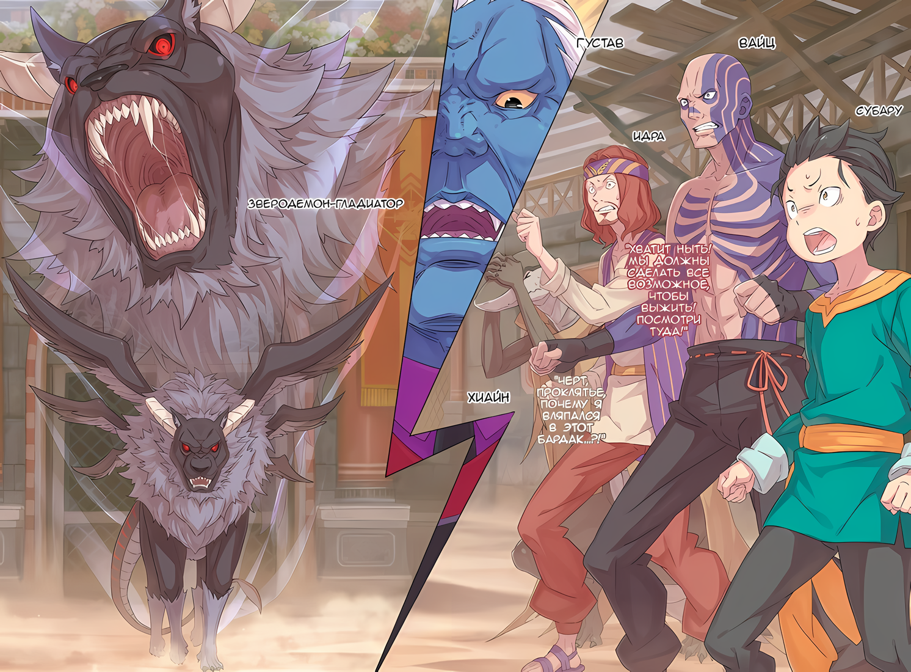

……Вернемся немного назад.

Густав: ……С этого момента вы, господа, будете подвергнуты испытаниям, чтобы убедиться, что вы подходите на роль гладиаторов на этом острове.

Субару вывели из лечебной комнаты и ввели в другую комнату, а Густав скрестил свои четыре мощные руки, оглядывая представшее перед ним зрелище.

Этот механический, холодный взгляд был устремлен на четырех человек, включая Субару.

Ящер с серой чешуей в грязных лохмотьях, тощий мужчина с татуировками по всей обнаженной верхней части тела и налысо обритой головой, и бесстрашный на вид молодой мужчина с волосами цвета ржавчины.

Все они оказались в той же комнате, что и Субару.

Судя по тому, что им только что рассказали, Субару и эти люди были в одинаковой ситуации, как считал Густав.

Однако, похоже, что среди тех, кого затолкали в комнату, было некоторое несогласие с этой мыслью.

???: Подождите, губернатор Густав! Вы собираетесь начать «Спарку» сейчас? С этим ребенком в наших рядах? Это не шутка!

Увидев Субару, которого вталкивали спиной в комнату, молодой мужчина с волосами цвета ржавчины выкрикнул это.

У него было довольно симпатичное лицо, но щетина и изможденное выражение, а также недовольства, значительно снижали это качество.

Однако его внешность здесь не имела значения. В доказательство этого еще два человека набросились на Густава, словно в горячке.

Ящер: Да, мужик! Как это отродье нам поможет? Я рискую своей жизнью!

Татуированный мужчина: Превращать гладиаторские бои в жестокое зрелище. Это вроде как политика губернатора, или так я слышал, но..?

Ржавоволосый: Все именно так, как они говорят. Нам понадобится хорошее объяснение. Прежде всего, даже если мы добавим ребенка в группу, нам не хватит людей. Пять человек на группу, вот что вы сказали!

Ящер, татуированный мужчина и ржавоволосый мужчина в унисон повысили голос, их гнев был направлен на Густава.

Не понимая до конца, что представляет собой «Спарка» и как она их касается, Субару оказался в ситуации, когда он не мог легко вмешаться. Однако, так или иначе, он смог кое-что понять.

Очевидно, Субару, похоже, обманул их ожидания, и из-за этого они направили свое недовольство на Густава.

Субару: ……Густав-сан, это то, что все хотят сказать, и все же…

Густав: Я слышал их, Шварц. В моем качестве у меня только два уха, как и у тебя, в отличие от количества рук, но я намерен выполнять свои обязанности в полной мере. Включая мою единственную голову.

Ржавоволосый: Если так…

Густав: ……Тишина. Если вы прервете меня в моем качестве, это будет равносильно воспрепятствованию воле Его Превосходительства Императора.

Этими несколькими словами были пресечены все дальнейшие высказывания ржавоволосого.

Густав не изменил ни выражения лица, ни тона голоса. Однако смысл, заложенный в его словах, был намного тяжелее, чем раньше.

Ржавоволосый мужчина, как и двое других, закрыли рты. Видя это, Густав кивнул.

Густав: Хорошо, я продолжу. Как я уже объявил, я начинаю «Спарку». Зрители будут состоять из гладиаторов, проживающих на острове, без гостей со стороны. Это лакмусовая бумажка, чтобы убедиться, способны ли вы развлекать таких важных гостей.

Субару: Аудиенция….

Тихо, с чувством досады, пробормотал Субару.

Фальшивый Сесилус, который был с Субару до того, как его втолкнули в комнату, сказал ему: «Удачи! Я буду наблюдать оттуда!», когда они расставались.

Он не подтвердил, какое значение это имело, но это дало ему приблизительное представление.

Субару: Не говори мне, ты собираешься заставить нас сражаться друг с другом….

Ящер: Ха! Ты действительно ничего не знаешь, не так ли, сопляк? Если бы это было так, то мы были бы очень рады, если бы у нас был кто-то вроде тебя!

Субару: Э-э….

Как только он облек свои мысли в слова, ящер высмеял его, выпустив свой длинный язык.

Но они были правы. Если бы «Спарку» проводили присутствующие здесь члены, то ребенок был бы желанным гостем среди них.

Скорее, их беспокоило то, что Субару не сможет стать способным бойцом….

Субару: То есть, мы все собираемся с кем-то сражаться?

Татуированный мужчина: Ты довольно умен, парень. У меня кроткий характер. Так что заткнись на секунду….

Вместо того чтобы мягко похвалить его за правоту, с налитыми кровью глазами татуированный мужчина сделал ему предупреждение.

На данный момент, казалось, что их командная игра определенно пошла под откос. Хотя это была не та ситуация, когда он мог говорить вот так просто.

Ржавоволосый: С чем вы собираетесь заставить нас сражаться?

Густав: Я не говорю об обученных гладиаторах. С ними у тебя не будет ни единого шанса. В моем качестве, это все, что я могу тебе сказать. ……Потому что этот враг никогда не появляется на свет.

Ржавоволосый: ……? Загадка? Какой дурной вкус.

Уголки его рта искривились в гримасе, когда ржавоволосый мужчина ответил на слова Густава.

Затем он сделал небольшой вдох и продолжил: «Ну что ж»,

Ржавоволосый: Хотя вы заставляете меня молчать, позвольте мне хотя бы спросить вас об этом. Если этот ребенок — четвертый человек, то как насчет пятого? Наш «Отряд»….

Густав: Пятый человек из вашего «Отряда» все еще спит в лечебной комнате. Пока он не проснется, только эти товарищи будут проходить испытание «Спарки».

Ржавоволосый: Вы с ума сошли, губернатор…!

Густав: Если будет необходимо выполнить волю Его Превосходительства Императора, я воспользуюсь либо здравомыслием, либо безумием.

Получив бессердечный ответ Густава, ржавоволосый отвернулся, так ничего и не добившись. Затем, переведя взгляд на Субару, он обратился к нему на «ты».

Из-за этого угрожающего отношения, а также из-за того, что его неожиданно позвали, щеки Субару напряглись,

Субару: Ч-что……?

Ржавоволосый: Судя по всему, ты просто бедный ребенок, но что ты можешь? Какие-нибудь особые навыки? Какая-нибудь магия? Может быть, у тебя есть что-то сильное и полезное?

Субару: П-полезные специальные навыки….

Глаза Субару в панике метались по сторонам, пока ему задавали ряд вопросов.

К сожалению, после уменьшения он не чувствовал, что сможет правильно обращаться с кнутом, а без очаровательной Беатрис он был беспомощен, когда дело доходило до магии. Кроме того, даже его различные маленькие хитрости не могли быть использованы должным образом, пока он был уменьшен.

Субару, не в силах ответить, продолжал молчать. Ржавоволосый мужчина приложил руку ко лбу,

Ржавоволосый: Действительно, это всего лишь ребенок… Какая неприятность.

И пробормотал голосом, в котором звучало разочарование.

Ящер: Хаха, нам подкинули сопляка и теперь нам точно не хватит боевой силы. Все кончено. Конец! КОООНЕЦ!

Татуированный мужчина: Не повышай свой чертов голос, чешуйчатый ублюдок. Ты хочешь умереть, потому что разозлил меня…?

Ящер: Ахн? Я тебя не слышу, у тебя слишком тихий голос!

Взаимодействие между Субару и ржавоволосым мужчиной было прервано, и теперь уже между ящером и татуированным мужчиной началась большая ссора. Они смотрели друг на друга, и казалось, что драка вот-вот начнется. Затем ржавоволосый мужчина ворвался между ними с криком «Подождите!»,

Ржавоволосый: Почему мы ссоримся!? Я знаю, что вы жалеете себя, но послушайте меня! До того, как попасть сюда, я был воином, служившим кому-то очень уважаемому! Если вы будете следовать моим указаниям, вы….

Ящер: Заткнись! Ты был воином? Тогда какого черта ты здесь? Потому что тебя избили и взяли в плен, да!? Это нехороший знак!

Татуированный мужчина: Нет ничего более идиотского, чем отдавать свою жизнь в чужие руки. Я не позволю никому распоряжаться моей судьбой.

Ржавоволосый: Вы ублюдки…!

Однако и ящер, и татуированный мужчина совершенно не прислушались к словам ржавоволосого, стоявшего между ними.

Хуже того, когда оба заговорили в ответ, ржавоволосый покраснел и начал злиться. Учитывая, что было впереди было неизвестно, ситуация была не из лучших.

Субару: Густав-сан….

Густав: Шварц, в моем качестве больше нечего сказать. Я, как официальное лицо, уже сказал тебе о своих намерениях. Даже одна капля крови, пролитая на Острове Гладиаторов, будет использована для процветания Империи. Даже одна капля.

Субару: Даже если вы повторите это еще раз, я все равно не пойму….

Трое затеяли потасовку, а оставшийся Субару никак не мог уловить смысл слов Густава.

Глядя на них четверых в их безвыходном положении, Густав больше ничего не говорил.

И тогда……

△▼△▼△▼△

……Отношения между ними четырьмя остались на худшем уровне, и, таким образом, «Спарка», проблема, с которой они столкнулись, началась.

Субару: …………

Круглое поле, окруженное высокими стенами, было сценой для гладиаторов, называемой гладиаторской ареной.

По другую сторону стены находилась лестница, похожая на сиденья для зрителей. Эти места постепенно заполнялись фигурами сидящих людей, и можно было заметить, что спокойное воодушевление охватило всю арену.

Однако жутко было то, что те, кто смотрел на гладиаторскую арену…… так называемые гладиаторы, если следовать объяснению Густава…… делали это без жалости.

По представлениям Субару, публика в таком месте должна была быть вульгарной и шумной.

Однако столь значительное отличие от того, что он себе представлял, было, пожалуй, неизбежным.

В конце концов, именно Густав тот, кто контролирует и управляет этим островом. ……И было немыслимо, чтобы этот большой, несгибаемый человек терпел вульгарное отношение со стороны гладиаторов.

Субару: Простое бегство по коридору, вероятно, повлечет за собой суровое наказание.

Поэтому Субару изо всех сил старался держаться мужественно, отводя глаза от реальности.

Иначе ему пришлось бы в любой момент заставить свои дрожащие колени бежать.

Постепенно из-за открывающихся железных ворот показался блеск глаз Зверодемона.

Зверодемон-гладиатор: …………

Вышедший Зверодемон носил львиную морду, и Субару сразу узнал его аляповатое тело.

Это был большой Зверодемон, которого в прошлом привела в особняк девочка с косами, и он же был тем монументальным противником, который стал материалом для кнута Субару. Хотя его имя не сразу пришло ему на ум.

Субару: Л-лев…?

Зверодемон-гладиатор: ……РАААААА!!!

Словно отвечая на призыв Субару, Зверодемон, а точнее, лев-гладиатор, зарычал. Рев эхом разнесся по всей гладиаторской арене, и Субару почувствовал, как звук отдается в его теле.

Зверодемон был больше Густава, даже просто увидеть что-то подобное на расстоянии было невыносимо страшно.

Ржавоволосый: Если мы не убьем эту тварь, нам не выжить.

Глядя на льва, ржавоволосый мужчина заговорил неприятным голосом.

Действительно, это было верно. Таково условие, дабы покончить со «Спаркой», задача, которую Субару и трое других должны были решить совместными усилиями.

Это было ужасное испытание без шансов на победу.

Ящер: Черт, проклятье, почему я вляпался в этот бардак…?!

Ржавоволосый: Хватит ныть! Мы должны сделать все возможное, чтобы выжить! Посмотри туда!

Цветная иллюстрация к **Ранобэ** Том 31 | Перевод неофициальный и выполнен под контекст перевода rezero7arc | Клин djoenfoej

Ящер: А?

Закрыв лицо обеими руками, ящер причитал так, словно это был конец света. Похлопав его по плечу, ржавоволосый мужчина указал на то, что казалось краями гладиаторской арены…… точнее, на что-то, прикрепленное к левому и правому краю площадки, что могла наблюдать группа Субару, расположившаяся в углу напротив льва.

Там они увидели что-то прикрепленное к каждому из этих углов……

Татуированный мужчина: ……Это что, мечи?

Субару: О, мне тоже так кажется…!

Согласившись со словами татуированного мужчины, Субару получил холодный взгляд. Но даже если его союзники не одобрили его слова, увиденное не исчезло как дым.

Там действительно было два меча, воткнутых в землю.

Ржавоволосый: Они не стали бы просто так отдавать нас на съедение Зверодемону без оружия. Поэтому наша первоочередная задача — раздобыть оружие. Однако, только меч справа пригоден для использования.

Татуированный мужчина: ……Верно

Татуированный мужчина кивнул в знак согласия со словами ржавоволосого. Субару был того же мнения, но промолчал, так как подумал, что на него снова холодно посмотрят, если он хоть как-то выскажется.

В конце концов, меч справа был маленьким, а слева — слишком большим. Меч слева был слишком велик, а его лезвие было слишком толстым, не говоря уже о том, насколько он был громоздким, что заставляло задуматься, не предназначался ли случаем этот меч для Густава.

Даже если бы Субару не уменьшили, меч все равно бы был по сравнению с ним настолько огромным, что казался неподъемным.

Возможно, ржавоволосый и татуированный тоже не смогли бы использовать такой большой меч.

Поэтому в качестве оружия можно было использовать только тот, что поменьше. Если бы у них был участник, который мог бы использовать такой большой меч, это было бы обнадеживающе.

Ржавоволосый: Он слишком большой. Нет другого способа, кроме как достать оружие и нацелить его в глаза Зверодемона. Мы всколыхнем внутренности его головы и прикончим его. Это наш единственный путь к победе.

Татуированный мужчина: ……Ты умеешь пользоваться мечом?

Ржавоволосый: Я же говорил тебе. Я был воином. Я умею пользоваться им лучше, чем ты.

Ржавоволосый ответил уверенно, а татуированный закрыл один глаз и задумался. Принудительно расценив это молчание как утвердительный ответ, он повернулся обратно к Субару и ящеру,

Ржавоволосый: Когда он объявит о начале, я схожу и принесу этот меч. А пока, поскольку я буду беззащитен, держите этого Зверодемона подальше от меня.

Субару: А как я должен держать его подальше?

Ржавоволосый: Ты можешь привлечь внимание, крича или издавая звуки. По крайней мере, догадайся об остальном сам!

Субару: Понял….

На мощный ответ ржавоволосого мужчины, Субару кротко кивнул.

Это была довольно безрассудная и пугающая стратегия, но он не мог придумать другого способа. Если ржавоволосый владеет мечом настолько хорошо, насколько позволяла его уверенность, то они смогут одолеть льва.

Ему нужно было покончить с этой ужасной «Спаркой», чтобы придумать дальнейшие действия.

Поэтому……

Густав: ……Ну что ж, пусть «Спарка» начнется!!!

С этим смелым, резким заявлением Густава разъяренный лев приготовился к нападению.

Задыхаясь от его пугающего присутствия, Субару сделал вдох, готовясь привлечь внимание Зверодемона-гладиатора, чтобы выиграть время, пока ржавоволосый не принесет оружие.

Ржавоволосый мужчина: Гуаа!?

Субару: ……Кх!?

Быстрее, чем он успел крикнуть, Субару тут же потерял дар речи, увидев, как ржавоволосый мужчина рухнул на землю прямо рядом с ним.

Ржавоволосый мужчина, который планировал начать бежать сразу после заявления Густава, рухнул на землю. Это само по себе было неожиданностью, но еще более удивительным было то, что удар ногой пришелся ему в лицо.

Это сделал татуированный мужчина, который, как предполагалось, был его товарищем.

Он сбил ржавоволосого с ног, когда тот собирался бежать, и нанес удар ногой, когда тот упал. Затем, убедившись, что ржавоволосый мужчина упал и растянулся на земле,

Татуированный мужчина: Я же говорил. Я не отдам свою жизнь в чужие руки…

С этими словами татуированный мужчина бодрым шагом убежал, направляясь к маленькому мечу.

Глаза Субару расширились от неожиданности ситуации, и он в панике думал, что же ему делать

Ящер: Н-не я! Я не собираюсь умирать!

Субару: Эй!?

Ящер закричал дрожащим голосом и убежал повернувшись спиной ко льву. Так он прижался к стене гладиаторской арены и начал медленно менять цвет своей чешуи.

Его чешуя серого цвета сливалась с цветом стены, из-за чего его огромное тело было удивительно трудно заметить.

Один человек пошел наперекор плану, другой прижался к стене, третьего избил его товарищ, а последний просто расширил глаза в панике, совершенно сбитый с толку ситуацией.

……Это было худшее начало из всех возможных.

Субару: Ч-что я могу…

…сделать — И, когда лицо Субару побледнело от шока, он посмотрел в сторону льва.

Глядя на эту группу с нулевым чувством единства, какое впечатление произвел о них Зверодемон-гладиатор? Если выражаться точнее, Субару испугался того, клыки монстра пронзят его, как только он по обернется к нему.

Однако……

Зверодемон-гладиатор: …………

Субару: Э?

Начало было объявлено, и он подумал, что Зверодемон, конечно же, будет играть с ними, как с глупыми существами. Но лев оставался в той же позе, что и в начале боя, без малейшего движения.

Из-за этого казалось, что начало еще не было объявлено.

И, размышляя об этом, Субару понял. ……Что все развивалось именно так, как ему казалось.

Субару: Я… Это нехорошо…

Он попытался продолжить, протянув свою руку, но не смог сразу же заговорить.

В конце концов, Субару не знал его имени. Он не мог назвать имя незнакомого человека, поэтому, даже если бы он позвал его, насколько это было бы действенно?

Из-за этого голос Субару потерял силу и не мог остановить то, что должно было произойти.

Татуированный мужчина: Теперь, когда у меня есть это, я могу….

Опережая своих товарищей, татуированный мужчина, который так энергично бежал, достиг меча, воткнутого в землю гладиаторской арены.

Усмехаясь про себя, он вытащил меч из земли и ощутил его в своих руках. Сколько мужества придало ему, безоружному, ощущение холодного металла и его вес.

Нехотя он повернул голову, его лицо было таким, словно врагов и не было.

Зверодемон-гладиатор: ……РАААА!!!

Татуированное лицо мужчины было безжалостно снесено львом взмахом передних лап.

Его острые когти отправили в полет все, что было на шее мужчины, и, поскольку его тело еще не осознало свою гибель, прошло немного времени, прежде чем кровь с силой хлынула наружу.

Субару: Ик….

При виде этой ужасной сцены у Субару перехватило горло.

В то же время он в глубине души проклинал себя за глупость, что не понял все раньше.

Лев встал в тот самый момент, когда татуированный мужчина схватился за рукоять меча.

Для льва это было настоящим признанием того, что событие началось. До этого момента у Субару и его команды, конечно, еще было время, чтобы отточить свою стратегию.

Однако из-за нетерпения и беспокойства команда Субару все испортила.

Зверодемон-гладиатор: ……РЫААААА!!!

Вместе с громким звоном, раздавшимся при ударе меча о землю, безголовое тело татуированного мужчины опрокинулось назад. Не обращая внимания на смерть своей жертвы, лев громко завыл и начал свирепый бег на четырех больших лапах. ……Прямо к стене гладиаторской арены.

Ящер: Стой,стойстойстой, неподходинеподходиНЕПОДХОДИИИИ!!!

Он не понимал, каким способом лев обнаружил местонахождение замаскированного у стены ящера. Хотя он и не понимал этого, но что он знал наверняка, так это то, что неспособность ящера выдержать приближение к нему льва, из-за чего он издал крик и захотел убежать, несомненно, стала причиной для решающего удара.

Зверодемон-гладиатор: РАААА!

Лев врезался головой в стену, его мощный удар головой сокрушил нижнюю половину ящера, прежде чем тот смог убежать, в результате чего содержимое его тела выплеснулось наружу, как лягушка, попавшая под машину.

Ящер: Гхэ.

Хотя он и принял цвет стены, органы, вылетевшие из разинутой пасти, приобрели яркий красно-розовый цвет, и Субару рассеянно подумал о том, что цвет его внутренностей остался прежним.

С этими мыслями Субару также без тени сомнения понял, что раздавленный ящер перед ним мертв.

И тогда……

Ржавоволосый: Что… Что за… бред….

Покачав головой, ржавоволосый мужчина слабо зарычал при виде этих двух смертей.

Он отчаянно пытался выпутаться из этой ситуации и заставить всех объединить усилия. Но один из его спутников перехитрил его, а другой попытался убежать, что полностью свело на нет эту возможность.

Ржавоволосый не ожидал от Субару никаких способностей мало равных способностям татуированного мужчины или же того ящера.

А даже если он действительно ожидал от него хотя бы чего-то, сам Субару не чувствовал, что сможет сделать хоть что-то значительное.

Вероятно, осознав внутренние мысли Субару, ржавоволосый мужчина посмотрел ему прямо в глаза.

Ржавоволосый: ……Держись позади меня.

Многие ли люди, поняв, насколько безнадежно их положение, смогли бы так храбро выступить и встретить свою смерть лицом к лицу?

Ржавоволосый мужчина, лишенный оружия, лишенный товарищей, мог лишь надеяться, что его последние минуты пройдут честно.

Укрыв за спиной маленького Субару, он уставился на обернувшегося льва.

В ответ на его взгляд лев издал короткий рык, а затем бросился на Субару и мужчину, подняв облако пыли, когда его четыре мощные конечности оттолкнулись от земли.

Субару: Ой-ой……!

Он никак не мог взять в толк, что произошло за эту долю секунды.

Если бы здесь был хотя бы один из его надежных друзей, смог бы он как-то найти выход?

Если бы Луис, Медиум, Флоп, Таритта, Ал, Абел, Мизельда, Хоули, Куна, Утаката, Рем.……

Если бы хоть кто-то из его друзей был здесь, смог бы он как-то это сделать?

Субару: В таком месте….

…я должен. …И Субару попытался выдавить из своего дрожащего голоса все остальное.

Однако ему это не удалось. Потому что прежде, чем он успел это сделать, лев нагнал Субару и мужчину…… нет, не совсем так.

Субару не смог выдавить слов из-за того, что его резко схватили за плечи и со всей силой кинули вперед.

Ржавоволосый: Нет, я не хочу, я не хочу умирать…. кх!!!

Крича, мужчина с волосами цвета ржавчины толкнул Субару ко льву.

Тот в изумлении уставился на него и не успел даже ругнуться. Только тело Субару полетело, словно лист с дерева, как лев моментально налетел на него.

Субару: …………

Какое же у него было хрупкое тело.

Тело Субару было быстро разрушено таранной атакой Зверодемона-гладиатора. Но это не значило, что он был расчленен, скорее его внутренности разлетелись на мелкие кусочки.

Кости, внутренние органы…… все сломалось и раскрошилось, как будто его сбил грузовик.

Ржавоволосый: Спасите меня! Я совершил ошибку! Я солгал! То, что я воин, было ложью! Я просто пытался казаться важным! Выпустите меня! ВЫПУСТИТЕ МЕНЯ!!!

Под кружащимися в воздухе остатками Субару, ржавоволосый мужчина кричал и вопил, пытаясь запрыгнуть на стенку. В отчаянии он взывал к Густаву, находящемуся высоко над стеной.

Но Густав, увидев плачущего мужчину, у которого из носа текли сопли, стоял с бесстрастным лицом, не шевеля бровями.

Возможно, он уже знал о лжи ржавоволосого.

Возможно, его совершенно не интересовало, правда это или ложь.

Что бы это ни было, это не имело значения.

Ржавоволосый: Спасите……

Пока ржавоволосый умолял, прижимаясь к стене, затем его ударила одна из львиных лап, направленная прямо в его спину, и он был раздавлен, как помидор, брошенный в стену.

Татуированный мужчина, ящер и ржавоволосый мужчина…… все они пали перед Зверодемоном-гладиатором.

???: ……Су, Басу, ты меня слышишь?

Внезапно услышав голос среди громкого звона в ушах, Субару резко вскинул голову.

Только тогда он понял, что его снесло, и, не успев тогда опомниться, упал на землю. Даже если он и понял это, он все равно был бессилен остановить происходящее.

Кроме того, голос, который он услышал, доносился с вершины стены, откуда за кувыркающимся на земле остатками Субару наблюдала какая-то фигура.

Мальчик со связанными синими волосами и несколько отвратительным лицом.

Сесилус: Виноват, похоже, я ошибся в своих ожиданиях! Я думал, что у меня получится, но, похоже, я не так хорош, как мой отец. Видимо, я не очень хорошо разбираюсь в характерах!

Субару: А, ах….

Сесилус: Кстати, есть ли что-нибудь, что ты хочешь рассказать своей спутнице, когда она проснется? Я подумал, как было бы здорово передать сообщение, так почему бы мне не воспользоваться этой возможностью!

Пока он наблюдал за мучениями Субару, поведение поддельного Сесилуса казалось совершенно непоколебимым.

Подумав об этом, можно сказать, что его отношение никогда не менялось. Ни когда Субару проснулся, ни когда они с Субару разговаривали в лечебной комнате, никогда Субару был на грани смерти.

Он чувствовал, что этот безумный взгляд на жизнь и смерть был тем элементом, который заставлял фальшивого Сесилуса, хотя он якобы был просто мальчиком-волком, казаться немного более подлинным.

Если так считать, то он действительно был самым могущественным Генералом Империи Волакия.

Субару: ……могу

Сесилус: А? Что? Басу, пожалуйста, говори громче, ведь это твои последние слова! Если я неправильно пойму смысл, думаю, я буду жалеть об этом вечно.

Субару: Терпеть… не могу…

Сесилус: …………

Так он заявил в сторону фальшивого Сесилуса, который прижал вокруг уха руки, пытаясь услышать голос Субару.

Фальшивый Сесилус поднял брови на эти слова. Он заговорил чуть громче, из глубины своего горла.

Субару: Империя, я, действительно, терпеть не могу ее.

Сесилус: ……Да, да, конечно. Я хорошо запомню это и передам ей, Басу.

Крепко держась за свое негодование, он проклял фальшивого Сесилуса, лицо которого выглядело так, будто он занимается чужой проблемой.

Но уничтожит ли его проклятие Империю, Субару не мог быть уверен.

В конце концов……

Зверодемон-гладиатор: ……РАААААААА!

Из четверых, сражавшихся против него, остался только Субару, и тогда Зверодемон подошел к нему, открыл свою гигантскую пасть и безжалостно проглотил Субару целиком, головой вперед.

Субару: ……Кх!

Хотя все кости его тела были уже раздроблены, львиные клыки разорвали все части его тела на ленточки.

Небольшая пощада, которую он получил, заключалась в том, что его тело стало неспособно чувствовать боль из-за того, что было смято, и поэтому он не мог чувствовать ничего, кроме дискомфорта от того, что его пожирают в ничто.

Затем он изо всех сил попытался воскликнуть звуки ада, пока он прибывал в глотке льва, однако у него это не удалось.

Потому что его хитрая голова, пытавшаяся что-то сделать, была полностью раздавлена одним укусом……

△▼△▼△▼△

Ржавоволосый: Если мы не убьем эту тварь, мы не выживем.

Это было всего через несколько мгновений после того, как его раздавила красновато-черная плоть.

Услышав этот голос, Субару, казалось, был застигнут врасплох, и его вернули к реальности. Однако эта реальность была настолько безнадежной, что при пробуждении ее можно было принять за кошмарный сон.

Шумная жара и сухие пески расстилались по территории гладиаторской арены.

Худший сценарий развивался прямо на его глазах, а его товарищи…… вернее, те, кто просто оказался в такой же ситуации, как и он…… каждый из них придумывал различные способы защиты собственной жизни, считая их приоритетом номер один.

Если бы он не считал их таковыми, ему было бы очень трудно принять все, что только что произошло.

Субару: А, а, а, ах…!

Хотя в этом не было необходимости, он все равно думал об этом.

Из-за этого все тело Субару вспомнило таранную атаку Зверодемона, страх быть загрызенным и его безрассудный гнев на реальность.

От нахлынувших мыслей он едва мог стоять прямо.

Ржавоволосый: Черт, он же еще ребенок…… Ну, с меня хватит! Ребята, посмотрите туда!

Ящер: А?

Ржавоволосый мужчина сказал татуированному мужчине и ящеру посмотреть на большой и маленький мечи, приготовленные для них.

Однако их внимание, естественно, было сосредоточено на меньшем мече. Не обращая внимания на большой, непригодный для использования меч, их стратегия была направлена на то, чтобы завладеть вторым и победить Зверодемона-гладиатора.

Татуированный мужчина: ……Ты умеешь пользоваться мечом?

Ржавоволосый: Я же говорил тебе. Я был воином. Я умею пользоваться им лучше, чем ты.

То, что он слышал ранее, продолжалось без остановки, и беспокойство начало кипеть внутри Субару.

Но даже в состоянии охваченности страхом и тревогой, это замечание он не мог оставить без внимания.

Субару: ……Это ложь.

Ржавоволосый: ……Что?

Внезапно, стратегическое совещание мужчин было прервано голосом Субару.

Как только он услышал это, тон голоса ржавоволосого мужчины изменился. Он обернулся и посмотрел вниз на Субару, когда тот присел на колени. Будучи на коленях, Субару неподвижно посмотрел на лицо мужчины.

И вот он повторил это еще раз.

Субару: То, что ты раньше был воином, это ложь. Ты просто нагло лжешь!

Ржавоволосый: На каком основании…! Ты, ублюдок, собираешься оскорблять меня только потому, что я назвал тебя ребенком!?

Субару: Кто здесь оскорбляет!? Лгать и пытаться казаться выдающимся — это гораздо большее оскорбление! В такой ситуации, как эта, какой смысл изображать крутого парня?!?!?

Ржавоволосый: Гх, гхх…… тц.

Возможно, он думал, что сможет заставить ребенка замолчать, крича громким на него своим голосом, но, вместо этого, ржавоволосый мужчина был заметно взволнован тем, что Субару огрызнулся в ответ.

Татуированный мужчина, который говорил ранее, вероятно, тоже почувствовал его потрясение.

Татуированный мужчина: ……Эй, то, что сказал тот парень, правда? Что ты не воин на самом деле, и что ты пытался обмануть меня?

Ржавоволосый: Погоди, это всего лишь бредни ребенка! Ты не можешь говорить такие глупости в месте, где на кону наша жизнь….

Татуированный мужчина: Вот именно, раз уж наши жизни под угрозой, почему бы тебе не попытаться объясниться….

Татуированный мужчина схватил его за воротник, скелетоподобная татуировка на его лице исказилась от гнева. Ржавоволосый мужчина сглотнул слюну от такого угрожающего отношения, задыхаясь, словно от удушья.

Из-за его необдуманного вмешательства разгорелась такая драка. Ящер, не участвовавший в драке, медленно стал отступать назад и начал готовиться к бегству.

Хотя вмешательство Субару послужило толчком, эта команда снова оказалась в состоянии беспорядка и раздробленности.

Более того, независимо от того, был ли Субару и его команда в таком состоянии или нет……

Густав: ……Ну что ж, пусть «Спарка» начнется!!!

Густав не стал медлить с объявлением о начале битвы.

Татуированный мужчина: Не хочешь объяснить, ты… ААААААА!!!

Глубокий голос громогласно объявил о начале битвы, и сразу же после этого трещащий голос мужчины прорезал гладиаторскую арену.

Любой, кто мог присмотреться, увидел бы, из-за чего крикнул татуированный мужчина, требовавший ответа от ржавоволосого. Каким-то образом последний укусил руку, схватившую его за воротник, и, похоже, откусил его пальцы.

Хотя рот ржавоволосого был испачкан кровью, он оттолкнулся от груди кричащего татуированного мужчины и бросился за мечом.

Ящер: Н-не я! Я не собираюсь умирать!

И вот, в отличие от ржавоволосого мужчины, бегущего к мечу, ящер поступил как раньше и прилип к стене гладиаторской арены, а затем начал менять цвет своей чешуи для маскировки.

Потеряв два пальца, татуированный мужчина скрючился, сжимая свою правую руку, а колени Субару дрожали от страха перед ситуацией на его глазах, которая была еще хуже, чем в прошлый раз.

Ржавоволосый: А теперь думай о себе…! Если бы ты только послушно сделал то, что я сказал!

Не обращая внимания ни на Субару, ни на остальных, ржавоволосый мужчина с налитыми кровью глазами подошел к маленькому мечу.

Проклиная, что его ложь была раскрыта, и что татуированный мужчина схватил его, он протянул руку и вытащил меч из земли, приготовив его, как подобает воину.

Зверодемон-гладиатор: ……РААААА!

Затем, получив сигнал «Старт», лев яростно на них набросился.

В результате произошел практически тот же инцидент, что и накануне, когда татуированный мужчина выхватил меч. Ржавоволосый мужчина не успел даже взмахнуть приготовленным мечом, как обе его руки полностью оторвались, попав под лапы Зверодемона-гладиатора.

Руки ржавоволосого мужчины, которые крепко держали меч, оторвались от локтей вниз, и в этот момент, когда он изумленно уставился на врага и издал тонкий возглас «Ах», лев с силой бросился на безрукое тело мужчины и отправил его в полет, ударив головой о стену.

Ржавоволосый мужчина превратился в пятно на стене, а ревущий Зверодемон-гладиатор, не обращая внимания на Субару и татуированного мужчину, яростно рванул прямо к задней стене гладиаторской арены.

Ящер: Стой,стойстойстой, неподходинеподходиНЕПОДХОДИИИИ!!!

Ящер, замаскировавшись под стену, закричал от надвигающегося на него потока ветра бегущего льва.

Выдав себя криком, ящер поспешил сменить позицию, но времени не хватило. Львиный удар сокрушил нижнюю половину его тела, смертельно ранив его, и он извергнул свои внутренние органы.

Затем лев, в мгновение ока убивший двух мужчин, медленно повернулся к Субару и татуированному мужчине, издав кровавый рев.

Субару: Ик…

Татуированный мужчина: Черт, становится только хуже……

Его мозг онемел, парализованные мысли медленно начали течь по новой. Из-за этого тело Субару вспомнило страх, его зубы лязгнули, а внутренние органы сжались.

Как сказал татуированный мужчина, скрежеща зубами, худшее продолжало нагромождаться на худшее, и в результате ситуация стала еще хуже и безнадежнее.

Называть ржавоволосого лжецом не имело смысла.

Хотя ничего хорошего от разоблачения лжи ржавоволосого там не было, Субару все равно сделал это, не подумав. Из-за этого все пошло наперекосяк.

Татуированный мужчина: ……Все еще хочешь жить, парень?

Субару: Э……

Татуированный мужчина: Если хочешь жить, возьми в руки меч.

Мужчина с татуировками говорил это Субару, но зрение ребенка было затуманено, и казалось, что он вот-вот разрыдается в любой момент.

Глядя в его сторону, татуированный мужчина ударил по земле кровоточащей правой рукой и встал, обливаясь жирным потом. При этом он указал подбородком на лежащий на земле меч…… то, что упало на землю вместе с отрубленной рукой ржавоволосого.

Татуированный мужчина: Я привлеку внимание этого монстра… Ты хватай меч и бросай его мне.

Субару: Но….

Татуированный мужчина: Даже если у меня нет двух пальцев, я им управлюсь лучше, чем ты, парень…

Получив столь ясный ответ, Субару растерялся.

Было два меча, большой и маленький, и хотя он имел в виду меньший, это все равно был меч, слишком длинный и большой для детского тела. Как и сказал татуированный мужчина, даже если Субару будет держать его обеими руками, единственным результатом будет то, что он упадет от его длины и веса.

Однако, когда татуированный мужчина заявил, что он возьмет меч и победит льва, Субару подумал, что это невозможно, вспомнив свою смерть в прошлый раз.

И все же….

Субару: Я тоже не… хочу сдаваться…

Татуированный мужчина: ……Ты лучше, чем этот лжец и тот трус.

Терпя боль, татуированный мужчина искривил губы, приветствуя решимость Субару.

И с этими словами, татуированный мужчина посмотрел на льва, который внимательно наблюдал за ними, и, шаг за шагом, приближался к ним,

Татуированный мужчина: Вайц….

Субару: …А?

Вайц: Это мое имя, Шварц.

Когда его назвали Шварцем, глаза Субару расширились от удивления.

Субару задумался, где он мог слышать это имя, ведь Густав был единственным, кто называл Субару Шварцем. Именно поэтому татуированный мужчина… Вайц… вспомнил имя, которым его назвали во время их первой встречи.

Конечно, это ничего не значило, и он знал, что в прошлый раз Вайц поступил как трус, пытаясь перехитрить ржавоволосого.

Он знал это, но……

Вайц: ……Давай!

Крик Вайца в этот момент стал причиной положиться на него и бежать без колебаний.

Субару: …………

Сдерживая желание закричать, Субару со всей силы побежал по земле гладиаторской арены.

Естественно, он был медлителен. Его детское тело имело короткие конечности, а внутренние органы, сжатые страхом и напряжением, испытывали ужасную боль. Хотя он и так часто страдал от недостатка сил в обычных обстоятельствах, это тело было слишком слабым.

И все же он отчаянно бежал. Он бежал, и бежал, и бежал, пока не достиг меча.

Субару: Ух, кух…!

Обе руки ржавоволосого все еще цеплялись за меч, и от одного взгляда на них хотелось блевать. Однако сейчас было не время для рвоты.

Отрывая по очереди твердые, жесткие пальцы, он с силой вырвал меч из рук ржавоволосого.

Затем, тяжело дыша, Субару поднял меч.

Субару: Да, я вытащил его!

Сделав большой вдох, Субару поднял меч. Затем он повернулся и уже собирался бросить его в сторону Вайца, как вдруг……

Вайц: Шварц!!!

Бешеный голос Вайца заставил все волоски на теле Субару встать дыбом.

Субару обернулся, и в поле его зрения оказался лев, с широко раскрытой пастью, несущийся на него. В этот момент он почувствовал себя оленем, которого вот-вот съедят, из-за чего движения льва казались замедленной съемкой.

Субару: …………

Медленно, страшный лев приближался.

Казалось, что он может увернуться от него, но так как его движения были замедленными, как и его зрение, он не смог бы убежать. Он решил, что метнет меч, который держал в своей руке.

По крайней мере, он хотел метнуть меч до того, как львиная атака поразит его.

*……Быстрее, быстрее, быстреебыстреебыстрее!!!*

В удручающей медлительности, голос в голове Субару отчаянно кричал, призывая всю силу его рук и пальцев.

Достигнет ли он его? Меч наконец покинул руку Субару, кружась и вращаясь вертикально, он пролетел мимо мчащегося льва и направился к Вайцу.

Вайц, вытянув руку с отсутствующими пальцами, что-то кричал Субару, на которого мчался лев. Однако он не понимал истинной формы этого крика. Даже если он не понимал, это было нормально.

В любом случае, ему просто нужно было использовать брошенный меч по назначению.

Субару: У… ВАААХ……!!!

В тот момент, когда он думал, что выполнил свою часть, замедленный мир вернулся в нормальное состояние.

Воющий лев бросился на него, и Субару, крича и ожидая, что его разорвут на части когти или клыки Зверодемона-гладиатора, упал на задницу. Слезы и сопли текли по его лицу, Субару смирился с тем, что ему предстоит сделать невероятно жалкое, предсмертное лицо.

И все же……

Субару: ……А?

Атака льва, которая должна была убить Субару, не достигла его.

Потому что лев уперся передними лапами в землю прямо перед Субару, рассеивая свой собственный импульс, а затем ударил задними лапами в Вайца прямо за собой.

Вайц: Бх.

Получив меч, брошенный Субару, Вайц ударил льва сзади. Его лицо, изрисованное татуировками, было разбито копытами задних лап льва.

Как и прежде, Вайц умер, когда все, что было выше его шеи, лопнуло. Меч, которым он орудовал, выпал из его руки и покатился по земле вдаль.

Зверодемон-гладиатор: ……РАААА!

Затем лев, только что убивший Вайца, медленно повернулся к Субару.

В нем не было снисхождения, чтобы спустить его с крючка, только свирепое намерение убить.

Сесилус: Басу! Басу! Прости меня, но как ты думаешь, ты еще сможешь оправиться от этого?

Позади него, взывая со зрительской гладиаторской арены, стоял ненастоящий Сесилус, который наблюдал за этим жалким поединком. И когда он посмотрел вниз на Субару, который упал на ягодицы, он сказал:

Сесилус: Похоже на пробуждение скрытой силы или высвобождение какой-то запечатанной техники, вызванное жестокой смертью товарища! Это вероятно? Ммм?

Субару: ……У меня нет ничего подобного.

Сесилус: Даааа~, похоже на правду. Виноват, похоже, я ошибся в своих ожиданиях! У тебя есть послание для девушки, которая была с тобой, или что-то еще? Интересно, насколько это будет похоже на историю!

Не изменившись с того времени, когда он умер, когда с ним разговаривали таким спокойным тоном, Субару выдохнул «Ха». Что отличалось от прежнего, так это то, что кости его тела еще не разлетелись на куски.

Хотя после этого его могло разорвать на части, и хотя он был напуган до смерти, ему еще предстояло умереть.

Субару: Сеси, только один вопрос.

Сесилус: Не послание, а вопрос? Так называемый сувенир для загробной жизни? Будет ли моя речь отвечать на вопрос Басу или нет, это будет проверкой расцвета актерского мастерства….

Субару: Этот лев, почему он не убил меня раньше?

Сесилус: ……Хмм

Указывая на Зверя-гладиатора перед собой, Субару спросил фальшивого Сесилуса, сидящего на стене.

Субару не был уверен, что он, мальчик-волк даст прямой ответ, которого он хотел. Он просто утешал себя мыслью, что это не так уж и плохо для бесполезной борьбы.

На вопрос Субару фальшивый Сесилус ответил, поглаживая свой тонкий подбородок,

Сесилус: Это просто, Басу. ……Даже если он свиреп, зверь есть зверь. В этом случае зверь охотится только по инстинкту. Инстинкт — это сила жить.

Субару: ……Что ты имеешь в виду?

Сесилус: Если бы Басу был тем зверем, в кого бы ты целился?

Фраза, похожая на загадку, не дала Субару простой последовательности вопросов и ответов.

Раздраженный, Субару задумался над смыслом слов поддельного Сесилуса. Если бы Субару был тем львом, на кого бы он нацелился?

Если бы он нацелился на кого-то, какова была бы его причина….

Субару: ……А.

Внезапно его осенило. *Так вот в чем причина*, понял он.

И……

Сесилус: Когда она проснется, я скажу ей, что Басу был храбрым. Я не умею врать, так что, слава богу, ты был храбрым!

Услышав такой бесчувственный голос, он не успел ничего ответить.

Достигнув понимания, Субару расширил глаза, а стоящий перед ним лев взмахнул лапой в его сторону.

Впервые Субару действительно услышал звук раздавливания собственного тела.

△▼△▼△▼△

Ржавоволосый: Если мы не убьем эту тварь, мы не выживем.

Его череп был раздавлен, его плечи были раздавлены, его тело было раздавлено, его бедра были раздавлены, каждая его часть была раздавлена.

Медленно, Субару ощущал, как тело получает удары такой невыносимой силы и скорости, боль от которых он даже не успевал осознавать, и было похоже, будто он наблюдал на это со стороны.

Конечно, это действительно не было чьей-то проблемой.

Если возможно, он встретит конец с наименьшим количеством страданий. С минимальным количеством боли и страха. Тем не менее, такой образ мышления Субару был возможен только благодаря тому, сколько опыта он получил в Хаосфлейме.

……Эти десять секунд ада.

С тех пор, как это случилось, Субару глубоко осознал важность всего лишь нескольких секунд.

И поскольку это понимание проникло в его тело……

Ящер: Черт, проклятье, почему я вляпался в этот бардак…?!

Ржавоволосый: Хватит ныть! Мы должны сделать все возможное, чтобы выжить! Посмотри туда!

Прямо рядом с ним ящер и ржавоволосый мужчина в отчаянии приняли ситуацию, в которой оказались.

Прислушиваясь к этому уже знакомому разговору, Субару сказал:

Субару: Вайц! Держи этого парня!

Вайц: Что……?

В тот момент, когда Субару выкрикнул это, татуированный мужчина…… татуировка на лице Вайца…… исказилась в замешательстве.

Это было естественно. Хотя он ни разу не упоминал об этом, Субару знал его имя. Но даже если бы его назвали по имени, он не собирался делать то, что ему сказал какой-то жуткий мальчишка.

Но ни растерявшийся Вайц, ни ржавоволосый мужчина, ни ящер, испуганные внезапным громким голосом Субару, не успели остановить свои резкие действия.

И тогда……

Субару: ……Лев! В кого ты целишься!?

Маленькая рука Субару с силой схватила меч, воткнутый в землю, и он закричал.

В этот момент, не дожидаясь команды Густава, Зверодемон-гладиатор завыл, уперся ногами в землю и яростно рванул вперед к Субару.…

*«Если бы Басу был тем зверем, в кого бы ты целился?»*

Слова фальшивого Сесилуса, словно загадка, больно врезались в мозг Субару.

Действительно, так оно и было. Если бы Субару был львом, он бы в первую очередь набросился на «опасных». Например, в этом месте это был бы тот, кто владеет оружием.

Зверодемон-гладиатор: ……РАААА!

Субару заскрипел зубами, столкнувшись с воющим львом, набросившимся на него. Его била крупная дрожь страха, но он не сдался, не убежал и не заплакал.

Его уже дважды убивали, и неважно, сколько еще раз ему придется столкнуться с этим страшным опытом.

Субару: Не думайте, что только потому, что я ребенок, я заплачу и сразу же сдамся!!!

Сотрудничая с трусом, пугалом и лжецом, со всей своей силой, со всей своей мощью, всем своим телом и душой, он будет бороться со «Спаркой» до самого конца.

……В этот решающий момент мощная лапа льва свирепо вырвала жизнь Нацуки Субару вместе с его третьей попыткой.
