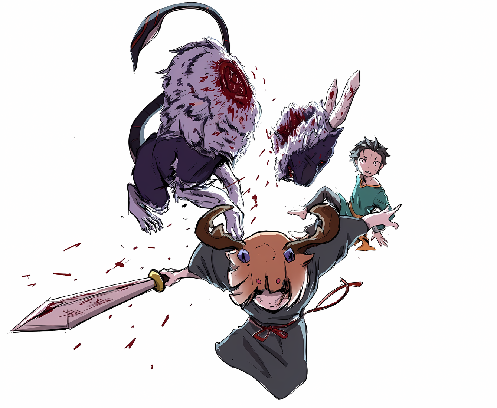
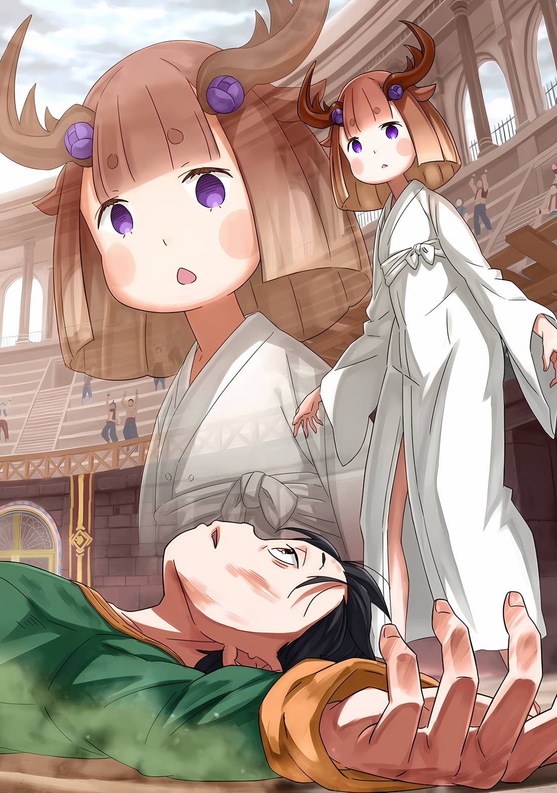

……Омерзительная техника, оставленная «Порочным Стариком» Ольбартом Дарккенном.

Вмешиваясь в чужой Од, тайная техника инфантилизации шиноби могла значительно замедлить рост тела.

Все живые существа были не более чем сосудами для того, что появилось на свет из небытия — Од. В зависимости от его формы, размер и вид сосуда менялись соответственно.

Поэтому все живые существа могли принимать различные обличья и становиться уникальными формами жизни.

Если эта теория верна и тело служит лишь вместилищем для Од, то, изменяя его форму, можно свободно изменять вид его вместилища.

Если сжать Од, то тело, служащее сосудом, тоже можно было бы сжать….

???: Ну, по правде говоря, я не уверен, как предки шиноби пришли к этим идеям. В первую очередь, им должно было быть страшно, находясь в незнании методов тренировки своего тела до смерти, а так же, как определять ее грань, верно?

???: И вот, что такое шиноби. Когда приходит время пытаться стать им, ты становишься на путь Шуры, и это не говоря уже о том, что рассказ превращается в постоянное хождение по горам трупов.

???: Есть много техник, но если ты не проверишь их собственной жизнью, ты не сможешь оставить их в книге секретов, понимаешь? Моя секретная техника… всего лишь одна из нескольких десятков, но даже в этом случае она не является исключением.

???: Но, забавно, что реальный результат и эффект так сильно расходятся, знаешь ли. Я был уверен, что они просто уменьшат кого-то, но это доходит и до точного состояния мозга в его молодом состоянии.

???: К сожалению, я тоже до конца не понимаю, почему. Скорее всего, это потому, что в Од насильно вмешиваются. Так же, как твое тело уменьшается, чтобы соответствовать твоему Од, твой разум, вероятно, также уменьшится, чтобы тоже соответствовать твоему Од, верно?

???: Ну, эту технику я использую нечасто, потому что обычно мне приходится убивать того, на ком я ее применяю, поэтому я никогда не пытался выяснить причину. На самом деле, легче убить кого-то, если уменьшается не только его тело, но и содержимое его головы, так что это идеальное решение, знаешь ли.

???: Хотя, иногда попадаются парни, в которых уже заложена серьезная решимость, еще с детства! Нельзя ожидать, что этот трюк сработает с такими парнями, даже если у них в голове все уменьшилось. ……А, и…

???: …………

??? …О, ничего страшного. В любом случае, мне это нравится, так как это одна из самых забавных техник шиноби, понимаешь? Легче иметь дело со слабым врагом, не так ли?

△▼△▼△▼△

……Гнев, гнев кипел в Субару, опаляя его душу.

Был страх. Было также напряжение. Кроме того, была и тревога.

Он подумал, что из всех негативных эмоций, которые только можно придумать, он, вероятно, обладает всеми ими.

Но все эти негативные эмоции пылали, сжигая каждую тщательно сложенную и завернутую вещь, пока не осталось ничего без исключения, и его яростный гнев вырвался наружу.

Ящер: Черт, проклятье, почему я вляпался в этот бардак…?!

*Заткнись, идиот. Никто не будет слушать твое нытье.*

Ржавоволосый: Я же говорил тебе. Я был воином. Я умею пользоваться им лучше, чем ты.

*Заткнись, идиот. Это ложь, ты просто пытаешься выпендриться, это уже давно очевидно.*

Вайц: Я же говорил. Я не отдам свою жизнь в чужие руки…

*Заткнись, идиот. Черта с два ты сможешь пережить это в одиночку. Оглянись вокруг себя немного больше.*

*……Да, оглянись на все, что ты можешь использовать и сделай это как следует.*

Субару: Вайц, возьми его! Он будет целиться в того, у кого меч!

В тот момент, когда он схватил меч, по гладиаторской арене разнесся рев: черный лев бросился в яростную атаку.

Он уже знал, что он целится в него…… Нет, в добычу, владеющую мечом. Поэтому, схватив оружие, он швырнул его в сторону Вайца, который стоял на месте.

Когда Субару побежал вперед, переходя в спринт, трое членов его команды замерли от удивления.

Среди этих трех человек, застывших на месте, единственным, кто должен был принять меч, который Субару метнул, был татуированный мужчина…… Вайц, единственный, кто пришел в себя в последние мгновения.

Вайц: М-малыш…!

Увидев, что крутящийся меч угодил ему под ногу, Вайц тут же схватил его за рукоять.

Однако, прислушавшись к голосу Субару, он быстро понял, что меч был не ключом к победе над львом, а скорее флагом для смены цели.

Проблема была в том, что……

Ржавоволосый: Отдай мне меч! Я расправлюсь со Зверодемоном-гладиатором и….

Придя в себя, ржавоволосый попытался выхватить меч у Вайца.

Его разум был охвачен напряжением и страхом, а рассудок ржавоволосого человека не поддавался восстановлению. Если бы это продолжалось и переросло в потасовку из-за меча, они оба стали бы жертвами львиных лап.

Поэтому он должен был предотвратить это прежде, чем это произойдет.

Субару: Хиайн! Сзади!

Хиайн: С-сзади…!?

Как раз перед тем, как ржавоволосый схватился за Вайца, Субару выкрикнул имя неосведомленного ящера…. Хиайна, убеждая его, что он загнан в угол надвигающейся позади опасностью.

Будучи самым трусливым из троих, он в панике обернулся на голос Субару, чтобы убедиться, что на него вот-вот нападут.

Но там ничего не было. Субару просто хотел, чтобы он обернулся.

С застывшим от страха телом, Хиайн повернулся и….

Хиайн: Гух!

Инстинктивно вытянув хвост, Хиайн ударил ржавоволосого сбоку. От неожиданного удара тот покатился по земле, что позволило Вайцу выхватить меч.

Затем лев побежал в сторону Вайца, который стоял на страже, сменив цель с Субару на него.

Субару: Пригнись!

Вайц: Тч!

Услышав голос Субару, Вайц присел, когда клыки льва впились в воздух прямо над ним. Татуированное лицо Вайца исказилось в гримасе, когда он нырнул под брюхо льва, высвобождая меч перед следующей атакой.

С грохотом меч, брошенный без силы, полетел к груди Хиайна, который инстинктивно схватил его.

Хиайн: А?

Зверодемон-гладиатор: ……РРАААААА!

Хиайн: ХАЯЯЯЯЯЯ!!!

Естественно, внимание льва переключилось на резко отреагировавшего Хиайна.

Словно не до конца понимая ситуацию, Хиайн повернулся ко льву спиной с мечом в руках, и с удивительно быстрой скоростью бега мгновенно отдалился от льва.

Лев без устали преследовал его и продолжал наступление.

Субару: Пока это происходит, я…!

Пока Вайц и Хиайн как-то справлялись, Субару бежал вдоль стены гладиаторской арены. Его взору предстала небольшая ручка, вмонтированная в стену…… что-то похожее на рычаг.

С первого взгляда его внимание привлекли два меча, большой и маленький, воткнутые в землю гладиаторской арены, но при ближайшем рассмотрении он заметил, что рычаг был незаметно установлен на стене.

Субару: Если я потяну за него… что произойдет!?

Рычаг был слишком высок для ребенка Субару, поэтому он подпрыгнул и потянул за ручку. Вложив на нее свой вес, он с силой опустил рычаг, и раздался тяжелый звук.

Заскрежетали шестеренки, и от ощущения того, что что-то начало греметь и двигаться, у него под ногами появилась дрожь. Это было ощущение, что прямо под гладиаторской ареной приводится в действие что-то механическое.

Таким образом, ситуация изменилась, и Субару оглянулся на обстоятельства гладиаторской арены,

Субару: Уу… уваа!

В следующий момент, издав звук, разделивший гладиаторскую арену на две части, из земли поднялась железная ограда.

Это была стена, которая была поднята и разделяла круглую гладиаторскую арену на два полукруга; при правильном использовании, можно было заставить льва перейти на другую сторону.

Однако……

Зверодемон-гладиатор: ……РЫАААА!!!

На этот раз он потерпел неудачу, он загнал льва не на ту сторону.

Лев был на своей стороне поднятого забора, поэтому забор только сузил пространство для побега Субару. Из-за того, что его охотничьи угодья стали меньше, львиное тело как будто удвоилось в размерах, а останки того, что раньше было Хиайном, оказались в его окровавленной пасти.

Ржавоволосый: ГУАААХК!

Кроме того, у ног льва лежал ржавоволосый мужчина и кричал от боли.

Похоже, что он находился прямо над оградой, когда она была поднята. Из-за этого он был отправлен в полет и, по несчастью, упал на ту сторону, где находились лев и Субару.

В отличие от них, неповрежденный Вайц ошарашено стоял по другую сторону забора.

Ржавоволосый: С-сто…!

Подняв лапу над его головой, он растоптал лежащего на земле ржавоволосого мужчину, безжалостно проломив ему голову.

Раздался звук, похожий на разбивание льда, и крик ржавоволосого оборвался на полуслове. Лев, не сумев перелезть через забор позади него, обратил свой взгляд в сторону Субару.

От того, как он слегка пригнулся, у него по коже поползли мурашки, когда вдруг он бросился в его сторону.

Меч находился по другую сторону забора с Вайцем, но казалось, что если атака не могла его достать, то лев не считал его опасным.

Поэтому он яростно набросился на Субару.

Вайц: Шварц!!!

— воскликнул Вайц. В такие критические моменты он каждый раз звал Субару по имени.

Конечно, это происходило, только тогда, когда он не умирал раньше Субару.

Но при этом он держал это в глубине своей памяти……

Субару: ……Дальше!

Как только он это выкрикнул, острые когти Зверодемона-гладиатора вонзились в грудь Субару.

Меньше чем за секунду, вместе с ударом, который был подобен удару молнии, тело Субару разделилось на две части, а его сознание стало белым……

△▼△▼△▼△

Субару: Идра! Забор больше не выдержит! Как там меч?

Идра: Я не могу его вытащить! Он слишком тяжелый! Я никак не могу его сдвинуть!

От мощных таранных ударов железная ограда сильно деформировалась, и лев перевернулся на бок.

Он слышал, что даже люди могут пройти через самые узкие места, если только голова пролезет. Несмотря на то, что его форма значительно отличалась, а морда Зверодемона-гладиатора напоминала кошачью, он, вероятно, мог пройти еще легче.

Позади Субару, который в тревоге стучал своими зубами, ржавоволосый мужчина…… Идра… отчаянно пытался вытащить большой меч, застрявший в земле, но тот не сдвигался ни на дюйм.

Рычаг, чтобы поднять ограду, и два меча — большой и маленький. То, что он нашел после тщательных поисков, было лишь этими двумя видами уловок. Остальное будет настоящим состязанием способностей.

Идра: Мальчик! Что нам делать!?

Субару: Не бойся! Ты же наследник своего благородного отца!?

Идра: ……Кх, т-так точно! Я… не собираюсь трусить!

Паника сквозила в голосе Идры, но слова Субару вернули силу в его глаза.

Идра не был воином, ничего подобного. Он попал на Остров Гладиаторов, потому что не смог выплатить свои долги и был низведен до статуса раба.

Но причиной его долга была защита семейного бизнеса, который он унаследовал от отца.

Хотя Идра не был воином, он не хотел быть человеком, который опозорит своего отца; таковы были его истинные чувства.

Идра: ААААААААА!!!

Неталантливый сын мельника, приложив свой вес, наклонился, чтобы выкорчевать большой меч. Субару тоже бросился на сторону Идры и точно так же приложил свой вес к большому мечу.

Лев надвигался на них с другой стороны забора, а за ним лежали трупы Вайца и Хиайна, оба уже были убиты.

Теперь шансов на победу почти не было. ……Тем не менее, Идра не бросил Субару и не убежал. Это был первый подобный случай.

Зверодемон-гладиатор: ……РАААААА!!!

Субару: Идра, он приближается!

Идра: Я знаю!

Раздался сильный звук скрипа железного забора, после чего лев наконец-то перешел на их сторону.

Даже если сломанный забор ранил шкуру льва, покрытую черным мехом, он не выказал ни малейшей боли. Напротив, обвинив в своей боли их, лев кинулся в сторону своих врагов.

Идра: Ух… кх!

Идре каким-то образом удалось вытащить кончик большого меча из земли, и с помощью силы взвалить его на плечо. Субару положил руки на кончик меча снизу и, используя принцип рычага, помог Идре попытаться махнуть им, хотя бы немного.

Если Субару подтолкнет кончик меча снизу вверх, то он должен стать немного легче для замаха.

Если меч ударит льва должным образом……

Субару: ДАВААААААЙ!!!

Идра: НЫАААААААААААААА……!!!!

Субару и Идра объединили усилия, чтобы ударить мечом по морде льва, когда он бросился на них.

Большой меч, занесенный с силой броска над плечом Идры, с удивительной точностью попал в голову льва.

Но……

Идра: ……Ох.

Очевидный удар был отбит когтями Зверодемона без заминки, а Субару и Идра были поражены силой этой таранной атаки, одновременно от нее разлетевшись.

Затем, они врезались в стены гладиаторской арены, став единым целым.

Идра: Бха.

Их кровь, неотличимая друг от друга, разлетелась и окрасила стены…….

Субару: …Даль… ше.

△▼△▼△▼△

……Гнев, гнев кипел в Субару, опаляя его душу.

Вайц: Я отчаянно нуждался в еде, поэтому я воровал… Если бы я позволил им думать, что я опасный человек, удивительно, но я мог бы избежать смертельных ситуаций.

Вайц говорил это, поглаживая свою кожу, на которой было столько татуировок, что не осталось ни одного незакрытого места.

Казалось, он извинялся за то, что создал ложное впечатление, но Субару считал это доказательством того, что Вайц открылся ему в последние минуты жизни.

Хиайн: Вы все равно собираетесь использовать меня как приманку, чтобы сбежать! Я… Меня больше не будут использовать! Черта с два меня будут использовать!!

Жутко избегая зрительного контакта, Хиайн говорил это, словно причитая.

Он обладал способностью убегать и прятаться, меняя цвет своей чешуи, что, похоже, было хорошо известно среди его собственного народа. Он заявил, что ему всегда поручали самые опасные роли, и в конце концов он добровольно стал приманкой и был превращен в раба.

Эта робость была привита ему окружением. Хиайн не был в этом виноват.

Идра: Люди, которым я доверял, обманули меня, украли у меня бизнес моей семьи, и в итоге я стал рабом. Если честная жизнь только выставит меня дураком, по крайней мере, я буду последним, кто устоит…!

Прикусив губу от досады и смущения, Идра прорыдал эти слова.

Не привыкший говорить ложь, он не смог придерживаться ее до конца. Прежде всего, с тех пор как его привезли на Остров Гладиаторов, он представлялся воином; это была ложь, и он не слишком задумывался о последствиях.

В любом случае, это было бы раскрыто позже. Конечно, Субару сразу же узнал об этом. Хотя это было результатом обмана.

……Сотрудничая с трусом, пугалом и лжецом, он переживет эту «Спарку».

Субару: Дальше…!

Субару: Дальше!

Субару: Дальше!!!

Субару: Еще дальше!

Субару: Дальше точно… кх

Субару: Ещё…!

Субару: Нужно дальше…

Субару: ……Дальше!

Субару: И ещё дальше!

Противоречия накопления «Смертей» для того, чтобы выжить, накапливались все больше и больше.

Ему больно, трудно, страшно, тяжело, хочется остановиться, хочется плакать, хочется кричать, хочется завыть, хочется горевать, хочется скулить, хочется смириться, хочется отказаться, хочется сетовать, хочется сдаться, но сдаваться нельзя.

Он обрывал свои возможности.

Из этих бесконечных возможностей, дробя пути, ведущие в тупики, дробя их снова и снова, без конца.

Он поворачивал свое маленькое тело на этот неизвестный путь, прокладывая его впереди тех, кого он сокрушал.

Вайц, Хиайн, Идра умрут.

Конечно, Субару погибнет столько же раз, и все же он поднимал голову и шел вперед.

Сесилус: Басу, есть ли что-нибудь, что ты хочешь, чтобы я сказал твоей спящей спутнице?

Субару: .…Дальше!!!

Крикнул Нацуки Субару в ответ на невнимательный голос, и хотя все его тело было покрыто «Смертью» от когтей, он все еще отказывался отступать.

Потому что… потому что… потому что……

Субару: Я не проиграю.

……Потому что он ни капельки не хотел проигрывать.

△▼△▼△▼△

???: О? Ты только что не решился что-то сказать? Боже, ты умный парень, не так ли?

???: О, я рассказывал тебе о парне, который был проблемным, даже когда уменьшился, не так ли? Даже если разум уменьшится, эффект будет только наполовину сильнее на тех, чья решимость осталась прежней. Конечно, у таких парней также уменьшится тело, так что их будет гораздо легче убить.

???: ……Хотя, давай представим. Допустим, есть парень, чье тело и разум были совершенны с самого детства, как ты думаешь, что произойдет, если ты применишь на нем эту технику?

???: Ахх, я знаю, знаю. Я не думаю, что есть такой парень, понимаешь. Но знаешь, я невероятно пессимистичный человек. Я всегда представляю себе худшее, поэтому я могу изводить своих оппонентов самыми худшими способами. Верно?

???: Вот что я считаю худшим возможным сценарием против этой техники. Когда парень становится более опасным, когда уменьшается, это действительно чертовски страшно.

???: Это не ограничивается только мной, но когда становишься старше, приходится от чего-то отказываться и идти на компромисс, понимаешь. Что если эти вещи исчезнут у такого парня?

???: ……Страшно, да?

△▼△▼△▼△

Субару: Дальше!

……Такой исход, это было слишком иронично.

Техника «Порочного Старика» Ольбарта Дарккенна и вред «Инфантилизации», который она приносит, превратили тело Нацуки Субару в ребенка, и регрессировали те крохи интеллекта, которыми он уже обладал.

Постепенно теряя свои знания и воспоминания, Субару превратился в слабого и хрупкого юношу.

Отведение угроз, как физических, так и ментальных, было целью этой техники.

Для шиноби, которые используют все возможные средства для достижения своей цели, можно сказать, что тайное искусство было довольно подходящей тайной техникой.

Правда заключалась в том, что по мере того, как его воспоминания исчезали, словно отслаиваясь, и лица тех, кто был важен для Субару, становились все более далекими.

Так, в соответствии с внешним обликом Нацуки Субару, он снова стал маленьким ребенком лет десяти.

Около десяти лет…… раньше, в те времена, когда Нацуки Субару был вундеркиндом.

Субару: Дальше!

Раньше Нацуки Субару был ребенком-вундеркиндом.

То, что он был талантлив настолько, что его называли вундеркиндом, было не так уж важно. А важнее было то, что таким уровнем самооценки обладал не кто иной, как сам Субару.

Будучи маленьким ребенком, Нацуки Субару был переполнен уверенностью в себе и не сомневался в том, что может добиться всего.

Привлекая окружающих его детей, его вера в то, что он сможет достичь звездного неба, была непреходящей.

Субару: Дальше!

По мере роста его самооценка ослабевала перед лицом реальности и в конце концов была полностью утрачена.

Его истина номер один была стерта и несмотря на то, что он собирался сделать, все, что осталось у Субару, было чувством чувством тревоги и бессилия, нежели всемогущества. Сияющие звезды были скрыты пасмурным небом.

Вместе с ростом своего сознания Нацуки Субару потерял уверенность в себе.

Субару: Дальше!

Этот момент, когда самооценка Субару достигла своего минимума, определенно был днем, когда его отправили в другой мир.

После этого его встречи, переживания, разговоры и поступки постепенно наполняли Нацуки Субару новыми желаниями, а также привели его к выводу, что его собственное упорство…… не такая уж плохая вещь.

И все же, он все еще был недостаточен, его сердце все еще жаловалось на это.

Субару: Дальше!

То, что Нацуки Субару приобрел благодаря росту, и то, что он потерял с ростом, исчезло.

Вместе с тем, как молодеет тело, люди регрессируют и психически, поэтому человек должен был стать слабее. Физически Субару был именно таким. Он стал слабым. ……А как насчет психики?

Субару: Дальше!

Раньше Нацуки Субару был ребенком-вундеркиндом.

Он никогда не знал поражений, никогда не умел сдаваться, даже когда его мечты не сбывались, даже когда он делал все возможное, но не смог достичь, даже когда он оплакивал собственную неадекватность, даже когда он сетовал на тупик, даже когда он угрюмо отстранялся, он никогда не знал этого.

От просто бесчувственного до откровенно безрассудного состояния, он твердо верил, что может добиться всего.

Он безрассудно верил, что является правителем мира — именно таким мальчиком он был.

Затем, волшебные слова, которые поддерживали чувство собственного достоинства Нацуки Субару….

«???: ……Его сын, что не говори.»

Безграничная сила, изливающаяся из этих слов, освободила сердце юного Нацуки Субару от оков.

Это было не просто страшно, это было отвратительно. Это было не просто больно, это было досадно. Больше, чем хотелось плакать, ему хотелось улыбаться.

В стране, которую он ненавидел, объединившись с товарищами, к которым он не испытывал особой эмоциональной привязанности, чтобы вернуться туда, где его должны ждать любимая девушка и его друзья…… какой смысл колебаться?

Поэтому в этот раз, поскольку он был призван в другой мир……

Субару: …Дальше!

……Как сильнейшее существо, Нацуки Субару растопчет Гинунхайв.

△▼△▼△▼△

Все: …………

Все остались без слов.

С самого начала гладиаторы получили строгий приказ от губернатора острова, Густава Морелло, спокойно наблюдать за битвой «Спарки».

Поэтому, можно сказать, было неизбежно, что гладиаторскую арену окутает какая-то странная тишина.

Однако на этот раз тишина и безмолвие возникли не просто потому, что Густав объявил об этом.

Даже если бы Густав не дал таких указаний, никто не смог бы ничего сказать. Эта леденящая кровь сцена настолько ошеломила их.

Субару: Вайц! Идра! Разбегайтесь вправо и влево! Хиайн, я знаю, что ты напуган, но не убегай! Подними меч, привлеки его внимание, а затем брось его!

Свирепо рыча, Гилтилоу, Зверодемон-гладиатор, яростно скакал по гладиаторской арене.

Зверодемон был обучен для использования в «Спарке», его рога были отломаны и теперь он лишился звериного упрямства; вместо них ему тщательно вдалбливали степень угрозы, которую представляли собой люди, известные как гладиаторы.

Вот почему он взял на себя инициативу нацеливаться на противников с оружием и уничтожать их, поскольку они были опасными существами.

Только, поскольку у него была дурная привычка неустанно следовать этой тактике, можно было представить, что члены Отряда смогут рассеивать его внимание, передавая оружие друг другу.

Хотя нередко случалось, что отряды не могли распознать это с первого взгляда и, как следствие, подвергались полному уничтожению.

Можно сказать, что если кто-то смог распознать это, то определенный уровень мастерства был гарантирован.

Но даже если так, сцена в этот раз была необычной.

Сесилус: Хахаха! Удивительно, удивительно! Ты действительно стараешься изо всех сил, не так ли, Басу!

Среди всех, кто потерял дар речи, приветствуя зрелище перед собой теплым приемом, был только один мальчик, хлопающий в ладоши.

Его длинные голубые волосы были завязаны за головой, и его очаровательное лицо украшала улыбка. Видимо, демонстрируя безразличие к командам Густава, мальчик подбадривал отряд, храбро сражавшийся на гладиаторской арене.

Имело ли это подбадривание какой-либо эффект, неизвестно, но, уклоняясь от ударов Зверодемона-гладиатора на волосок, трое мужчин и мальчик, бросивших вызов «Спарке», продолжали отчаянно сражаться.

Из-за отсутствия решающих ударов ход смертельного матча был в определенной степени скучным.

Однако, один момент заключался в том, что даже если казалось, что они умрут, они не теряли свои жизни, а другой момент заключался в том, что их поддерживал непрерывный голос мальчика; эти два момента делали невозможным мысль, что дезматч был скучным.

Следуя указаниям мальчика, трое мужчин, которые продолжали двигаться, тоже были в отчаянии.

Это было естественно, у них была свобода игнорирования указания мальчика. Однако его указания уже много раз спасали их жизни от Зверодемона-гладиатора, поэтому эта свобода была закрыта.

С «Мальчиком», стоявшим в центре, их отряд словно стал единым живым существом с идеальной координацией.

То, что битва стала исключительно оборонительной, было вызвано их безнадежным отставанием в боевой мощи, или, возможно….

???: ……К чему ты стремишься?

В сердцах всех гладиаторов, наблюдавших за боем, зародилось одно и то же жгучее предвкушение.

△▼△▼△▼△

……Гнев, гнев кипел в Субару, опаляя его душу.

«Смерти» накапливались, а боль и страх усугублялись, его руки, ноги и внутренние органы все сильнее истощались. Стоило ему закрыть глаза, как на задней стороне век всплывали в памяти морда, клыки и внутренности пасти льва, которого он столько раз видел вблизи.

Появился непостижимый страх. Хотя, пока он кипел, вместе с ним пришла и ярость. ……Гнев.

От этих мучительных мыслей, бодрящих его трусливые внутренности и конечности, Нацуки Субару открыл глаза.

Все эти попытки, которые он уже устал считать, были ради того, чтобы хоть на шаг приблизиться к победе.

Он не имел ни малейшего намерения проиграть, чтобы доказать это самому себе.

Субару: Хиайн! Брось меч Вайцу, а затем беги к Идре!

Хиайн: Черт! Я понятия не имею, что происходит!

Яростно бегая на четвереньках по земле, Хиайн бросил меч, который держал в руках, Вайцу. Он ускорился, чтобы быстрее подойти к Идре, к стороне большого меча.

Вайц едва успел поймать меч, кружась и вращаясь в воздухе, и пока Субару пытался скоординировать их дальнейший путь, его глаза расширились от удивления.

Зверодемон-гладиатор: ……РААААААААА!

Ревущий лев, еще мгновение назад преследовавший убегающего Хиайна, остановился на другой половине круглой гладиаторской арены.

Между тем, вместо того, чтобы расположиться на другой половине круга, все они оказались прямо перед ним.

Все были живы, и, кроме того, они впервые оказались в таком идеальном положении.

Субару: Вайц, готовься! Идра и Хиайн тоже!

С энергией, подобной крови, хлынувшей из его горла, Субару распределил роли этих троих.

Хотя, возможно, этого было недостаточно, чтобы все понять, Вайц приготовил свой меч и встал лицом ко льву, а Идра и Хиайн поспешно бросились к большому мечу.

Затем Субару тоже неуклюже побежал изо всех сил, направляясь к стене.

Зверодемон-гладиатор: ……РРЫЫЫЫЫААА!!!

Один шаг, два шага; во время его удручающе медленной скорости, лев завыл у них за спиной.

И с этим лев оттолкнулся от земли с силой, подобной взрыву, и бросился на Вайца, который держал меч наготове.

Направив на него, безо всякой паузы, Вайц держал меч наготове, но если бы он столкнулся с этой силой, ничто не смогло бы его остановить. Один удар — и он умрет. Он прекрасно понимал это.

Однако было очевидно, что только у Вайца хватит мужества сражаться со львом до последней минуты.

Вайц: Ух, НААА……!!!

Пасть, выпускающая дыхание, пасть, украшенная клыками, похожими на мечи, пасть, которая перекусывала Субару и остальных троих бесчисленное количество раз, неслась прямо на того, кто держал меч, Вайца.

И прежде чем он смог лишить Вайца жизни……

Субару: ……ДАВАААЙ ЖЕ!!!

В тот момент, когда кончики его пальцев схватились за рычаг, Субару использовал весь свой минутный вес тела, чтобы потянуть его вниз.

Сразу же после этого из-под их ног раздался звук вращающихся шестеренок, и железная ограда, устремившаяся вверх, ударила по низу головы льва. Врезавшись в его пасть, львиная зияющая пасть была с силой захлопнута.

От силы заряда, врезавшегося в железную ограду, Вайц, до последней секунды обрисовывавший противника, с возгласом «Вуаа!??» удивленно вскрикнул от ударной волны из-за которой его отбросило в сторону.

От удара железная ограда смялась, и из погнутой части ограды показалась голова льва. Получив сильный удар по морде,он поскреб землю передними лапами, а затем, каким-то образом встав на ноги, он, казалось, снова попытался прорваться через забор,

……Но ему не позволили это сделать.

Субару: Идра! Хиайн!

Хиайн: У… УААААЯ……!

Идра: РААА!!!

Вместо Вайца, которого только что снесло, Идра и Хиайн бросились к железной ограде. В руках обоих был зажат очень громоздкий большой меч.

Это было оружие,которым ни один из них, по отдельности, не сумел бы воспользоваться, однако не было правила, что они должны использовать его в одиночку.

Также не было правила, что они не могут использовать двух человек, чтобы поднять его и обрушить на противника, неспособного двигаться.

Зверодемон-гладиатор: ….АААРААА!!

Со всей силы большой меч, которым взмахнули двое мужчин, опустился прямо сверху на шею льва, торчащую из железной ограды. Когда он пронзил толстую шею зверя, львиный крик эхом разнесся по небу.

Хлынула кровь, и, словно отвергая смерть, лев стал яростно сопротивляться.

Хиайн: Умри, умри, умри!!!

Идра: Пожалуйста, пусть это закончится!!!

Хиайн и Идра с воплями навалились на большой меч, и лезвие все глубже погружалось в его шею. Если они продолжат и обезглавят льва, наступит момент их долгожданной победы.

Снова и снова эти когти и клыки убивали его, убивали и убивали….

Зверодемон-гладиатор: ……РЫАААААА

Хиайн: Гаа!?

Субару: Ребята!?

Они были всего в одном шаге от победы, однако, как и они, лев не хотел умирать.

С большим мечом, застрявшим в его шее, лев с силой повернул свое тело и вытянул правую лапу на их сторону забора. Эта лапа смахнула тела двух мужчин, схватившихся за большой меч.

Он мог видеть, как Хиайн и Идра импульсом кувыркаются по земле, издавая крики боли.

Невозможно было сказать, насколько глубоки были полученные ими раны.

Однако важнее, чем броситься к двум упавшим, было допрыгнуть до этого большого меча.

Субару: Как будто я тебя отпущу!

Не желая упустить победу, пройдя такой длинный путь, Субару прыгнул к рукояти большого меча. Но он был слишком легким. Принимая во внимание вес тела Хиайна и Идры, нынешний Субару был слишком легким.

Большой меч вонзился чуть глубже, но, словно в ответ, лапа отмахнулась от него.

Как и двое до него, Субару тоже был поражен лапой……

Вайц: Не думай… Что я просто отпущу тебя, тварь…… Кх!

Его передняя лапа была пригвождена к земле ударом меча, направленного вниз.

Тот, кто вонзил меч, был тем, кого предположительно снесло ударом, а именно Вайцем. Собрав всю свою мощь, стиснув зубы и исказив лицо татуировками, он использовал меч, чтобы прижать лапу льва.

А потом……

Идра: Лежа здесь, как я могу называть себя воином!

Хиайн: Да сдохни ты уже, говнюк!

Поднявшись на ноги, Хиайн и Идра прыгнули на большой меч, с которого свисал Субару.

С силой трех, вернее, двух с половиной человек, большой меч еще глубже вонзился в шею льва. Поскольку Вайц также крепко прижимал переднюю лапу, четверо членов отряда объединили усилия, чтобы отрубить льву голову.

Завывая, лев сильно корчился от боли, а железная ограда жалобно скрипела.

Больше шансов не было. Он не мог проиграть, он не хотел проиграть, он не должен проиграть, стиснув зубы, Субару отчаянно вцепился в большой меч.

И все же……

Зверодемон-гладиатор: ……РААААА!

Субару: УАААА…… кх!!!

Тряся головой со всей силы, огромное тело льва отбросило Субару и его товарищей.

Оторвав тела, которые цеплялись за большой меч, трое из них… Нет, включая Вайца, все четверо вяло упали на землю.

Из-за того, что он буквально выдохся от отчаянных усилий, в его конечностях не осталось сил.

Субару: Я должен встать….

Он должен был встать, он должен был снова подскочить к этому большому мечу и отрубить ему голову.

Несмотря на эти мысли, его тело не слушалось его слов. Казалось, что не только Субару, но и остальные трое были в такой же ситуации.

Даже после всего этого лев оставался самым энергичным из них.

Зверодемон-гладиатор: ……РЫЫААААР!

С мечом, который был вонзен примерно наполовину в его шею, лев застонал низким голосом.

Голос был скорее не слабым, а таким, словно накопленная ярость достигла предела. Конечно, это, вероятно, имело скучный эффект, но его силы не были истощены.

Субару: Проклятье…… кх.

Даже после того, как он пытался, пытался и пытался, и, наконец, оказался всего в одном шаге от того, чтобы дотянуться до победы.

Он все еще не мог дотянуться до нее. Хотя он использовал все, что мог придумать, и зашел так далеко.

Вот почему в следующий раз он не проиграет.

Субару: В следующий раз….

Он обязательно вернется на то же место и сцену, Субару твердо поклялся в этом.

Не обращая внимания на его клятву, лев проскользнул сквозь железную ограду и поднял свою невредимую лапу в сторону Субару и….

???: ……Простите меня.

В следующее мгновение толстая шея льва была перерублена одним быстрым движением.

Субару: А?

Стоя перед лицом смерти, Субару с удивлением смотрел не на свою кончину, а своего противника.

Обезглавленная голова льва с грохотом упала на землю, а тело льва медленно завалилось набок. Виной тому был большой меч, который глубоко вошел в его шею

Была произведена неожиданная атака, и с неба упала маленькая фигура, которая наступила на большой меч и вдавила его внутрь.

Таким образом, лев был обезглавлен.

Арт от punibaba

И той, кто совершила это деяние, была……

???: ……Почему… я в таком месте?

На обычно безэмоциональном лице девушки…… Танзы… появилось выражение беспокойства.

При виде девушки, чье кимоно было снято, и которая была одета только в хададзюбан*, Субару испустил тихий вздох.

Он был не в состоянии что-либо ответить. Однако, когда Субару повернул голову и оглянулся, трое других, казалось, тоже спаслись на волосок.

Другими словами……

Густав: ……Достаточно! Вы хорошо постарались и выжили в «Спарке»! В соответствии с моей юрисдикцией, как официального лица, я принимаю вас всех в члены Острова Гладиаторов!

Громкий, рокочущий голос раздался с высоты, и заявление Густава ознаменовало конец схватки.

Тут же, до сих пор спокойно наблюдавшие за боем зрители… нет, гладиаторы, встали и, все разом, восхваляя победу Субару и его товарищей, повысили свои голоса.

???: Молодцы!

???: Это был огромный подвиг!

???: У тебя они точно есть, малыш!

В то время как голоса возбужденных мужчин обрушились на него, Густав скрестил свои четыре руки и ничего не сказал.

Услышав одобрительные возгласы толпы, Субару с грохотом бросился на землю. Танза, с трепетом приблизилась к нему и взглянула на его лицо.

Танза: Прости, ты…

Субару: Нацуки Шварц.

Танза: А?

Иллюстрация **Ранобэ** Том 31 | Разукрасил floating_here

Увидев, что круглые глаза на удивленном лице Танзы стали еще круглее, Субару выпустил длинный, длинный вдох и продолжил.

Субару: Прежде всего, я Нацуки Шварц, так что приятно познакомиться. Я много о чем хочу поговорить, но….

Танза: Да, но?

Субару: …Я хочу, чтобы ты дала мне отдохнуть, хотя бы немного.

Ему было жаль Танзу, которая наклонила свою голову, но Субару уже достиг своего предела.

Натянутая нить напряжения оборвалась, жар, кипевший в его душе, тоже угас. Конечно, ненависть к этой ситуации все еще тлела в нем.

Тем не менее, ему каким-то образом удалось пережить «Спарку».

Субару: Так что, пожалуйста… Дай мне немного поспать.

С этими словами, словно провалившись в яму, сознание Субару улетучилось.

△▼△▼△▼△

Густав: ………

Посмотрев вниз, Густав сузил глаза на мальчика, который потерял сознание, растянувшись на гладиаторской арене внизу.

Он точно мог сказать, что это была невероятная битва с неожиданным исходом.

Ему бы никогда в голову не пришла мысль, что этот мальчик обладает такими талантами.

Сесилус: Чтооож~, это было потрясающе, не так ли, Густав-сан. Выбрав Басу, ты попал в точку. Здорово, что ты оставил его у нас, а не выбросил! Разве это не славное достижение для меня?!

Густав: ….Сегмунт.

Пока Густав был погружен в свои мысли, Сесилус подошел и непринужденно заговорил с ним.

При словах мальчика, чьи руки были скрещены за головой, Густав потер свой лоб и брови двумя правыми руками,

Густав: В твоем заявлении была доля правды. Это то, чего ты ожидал?

Сесилус: У меня были свои ожидания, понимаешь? Я думал, что было бы хорошо, если бы это случилось, и в итоге, это случилось. Это именно то чувство, когда то, во что ты веришь, спасает тебя!

Густав: …Такая неопределенная возможность, и ты ставишь на карту свою жизнь.

Сесилус: ……? Да, поставил, и что?

Наклонив голову, Сесилус сделал озадаченное лицо.

Это было такое выражение, как будто он размышлял, не сказал ли он что-то странное.

Если два человека, которых он вытащил…… Шварц и Танза…… не могут быть использованы, он возьмет ответственность за них на себя и заплатит своей собственной жизнью; он вел себя так, будто никогда этого не утверждал.

Сесилус: В итоге ничего особенного не произошло, не так ли? С моей точки зрения, это было очень щедрое предложение. Я не тот человек, который бы поддался безделью в таком месте!

Густав: Я не в состоянии постичь твою логику. И кроме этого, что ты сделал в тот последний момент?

Густав спросил Сесилуса, который, улыбаясь, гордо выпячивал свою тонкую грудь.

В тот последний момент, посреди «Спарки», на которую он даже поставил свою жизнь, Сесилус исчез лишь однажды и лишь на короткое время.

Учитывая то, что произошло после этого, можно примерно представить, что……

Густав: Ты пошел будить девушку?

Сесилус: О боже, если ты знаешь ответ, то можешь не спрашивать меня. Во-первых, поскольку в отряде пять человек, и если бы девушка не проснулась, им пришлось бы делать это при недостатке людей; так сказал Густав-сан. Это значит, что она может присоединиться в любой момент после пробуждения, верно?

Закрыв один глаз, Сесилус посмотрел на высокого Густава и произнес: «Или»,

Сесилус: Ты хочешь отозвать результаты? Сказав, что эта «Спарка» признана несправедливой.

Густав: ――. Она не несправедлива. Его Превосходительство Император будет доволен рождением великолепного гладиатора.

Сесилус: Хахаа, это только мое мнение, но похоже, что Его Превосходительство Император не очень порядочный человек!

Густав: Оскорбления в адрес Его Превосходительства Императора не будут приняты. Второго раза не будет.

Сказал Густав строгим голосом, а Сесилус пожал плечами и немного отступил. Выдохнув через нос в таком состоянии, Густав снова посмотрел на гладиаторскую арену.

Шварца, самого достойного, и трех мужчин выводили стражники под командованием Густава. В лечебной комнате они должны были получить лечение у целителя.

Молодая девушка, на вид отстраненная, тоже сопровождала их.

Густав: Неужели все в «Отряде» выжили только благодаря одному человеку?

Это был вывод, который не мог быть сделан без помощи каждого, но несомненно, он проявил самую большую силу.

Не упуская из виду оружие и механизмы, которыми была оснащена гладиаторская арена, следя за своими товарищами в тех же условиях и даже наблюдая за передвижениями противника, когда это было возможно, они преодолели тонкую нить.

Как тот, кто видел это окончательное решение……

Сесилус: Видишь? Разве у тебя нет ощущения, что сейчас начнется великая история?

Таким образом, Сесилус гордо попросил одобрения; сохраняя строгое лицо, чувствуя, что любой его ответ будет раздражать, Густав молча скрестил свои четыре толстые руки.
