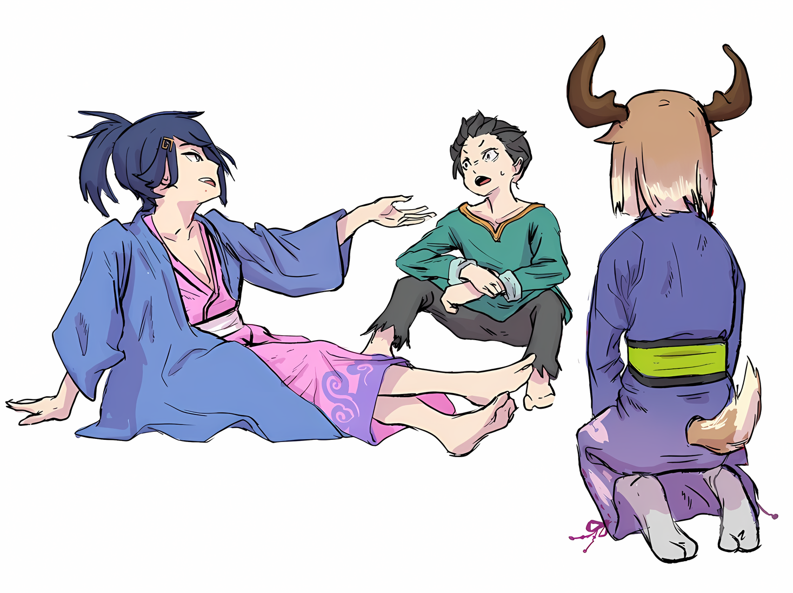

*Примечания переводчика (привет):*

**Хоть название главы и «Борец за школьную еду», в большинстве своем этот термин означает «Соревновательный едок»/«Едок на скорость»*

***Слово Мясорубка, в этой и последующих главах, означает смертельные битвы по типу Спарки, просто уточняю, чтобы не запутались.*

*Приятного чтения!*

※※※※※※※※※※※

???: Хаосфлейм был уничтожен большой, очень большой катастрофой. Эвакуация жителей должна была быть завершена Йорной-сама, но что касается чего-то большего, чем это……

Кончики ее нежных бровей опустились; с опущенными глазами, голос девушки был наполнен грустью.

Он всегда считал ее ребенком, который не проявляет много эмоций; на самом деле, даже сейчас ее выражение лица нельзя было назвать печальным. Однако он считал, что любой, кто не считает это грустью, — идиот.

Субару не был очень умным, но он не хотел продолжать быть идиотом. Поэтому он решил серьезно принять то, что она… что сказала Танза, и посочувствовать ее боли.

Однако……

???: Хахахаа, катастрофа, которая уничтожит Город Демонов, будет очень большой проблемой, не так ли? Пока я заперт на острове, мир переживает множество безумных событий. Боже, я должен помнить об этом, чтобы не опоздать, это было бы совершенно неуместно!

Субару: Сеси, ты можешь заткнуться на секунду?

Сесилус: А? Я опять сделал что-то не так?

Персонаж, который полностью игнорировал внутренние чувства Субару и душевную боль Танзы, продолжая говорить, фальшивый Сесилус, получил пристальный взгляд, наклонив голову в сторону, с растерянным выражением лица.

Субару был трижды поражен таким отношением, которое никогда не менялось, несмотря ни на что, как до, так и после «Спарки».

Это усугублялось усугублялось еще тем, что когда он вспоминал десятки раз, как Сесилус пытался хладнокровно выслушать последнюю просьбу Субару.

Субару: ……И несмотря на это, все было бы напрасно, если бы Сеси не разбудил Танзу в конце.

Сесилус: Ах, нет нужды чувствовать себя в долгу из-за этого. В тот момент, когда ты зашел так далеко, это была победа Басу, а последний толчок был чем-то вроде бонуса. Кроме того, очнется эта девушка или нет — это была авантюра!

Танза: Прошу прощения за беспокойство.

Поддельный Сесилус был несильно скромен перед горько выглядящим Субару. Услышав это, Танза слегка склонила свою голову, находясь рядом с тем, кого она спасла, когда он вдруг растерялся.

……Субару смог преодолеть «Спарку», опасную церемонию приветствия на Острове Гладиаторов.

Повторив множество раз это испытание, которое теперь казалось далеким, так или иначе, Субару и его команда достигли победы, отрубив голову льва. Однако он был вынужден сказать, что это было бы невозможно, если бы не сотрудничество с Танзой и фальшивым Сесилусом.

Если бы поддельный Сесилус не разбудил Танзу в конце, и если бы она не отрубила льву голову мечом, воткнутым в шею……

Субару: Я не знаю, сколько еще раз мы бы потерпели неудачу.

Конечно, варианта сдаться не существовало, потому что это была постоянная борьба, которую нельзя было прекратить, пока они бы не добились успеха. Но даже в этом случае, хватило бы у них силы воли сделать это или нет, сильно повлияло бы на результат.

И вполне возможно, что, если бы возникла такая ситуация, они бы не выжили в полном составе.

Если бы все так и случилось, он бы навсегда пожалел об этом.

Субару: Вайц, Хиайн и Идра, мы все вместе упорствовали.

Сотрудничать как единое целое было очень трудно, но они бы не выжили, если бы хоть один из них не участвовал.

Тот факт, что все они выжили, был лучшим сценарием для Субару. Это был большой заряд уверенности для него, ведь он смог сделать что-то типичное для лидера.

Благодаря этому он мог с гордостью сказать, что является сыном Нацуки Кеничи.

Танза: Шварц-сама?

Субару: О, прости-прости, я немного заблудился в своих мыслях. Так вот, насчет Хаосфлейма….

Танза: ――. Да. Я хочу вернуться как можно скорее, чтобы помочь с восстановлением.

Субару: ……Да, верно. Я тоже хочу вернуться и воссоединиться со всеми.

Возвращаясь к первоначальной теме, Танза с опущенным лицом выглядела очень жалко.

Вполне естественно, что она беспокоилась о своей семье и родном городе, и Субару тоже испытывал подобные чувства. Тем более, что он слышал о том, через какие потрясения пришлось пройти Хаосфлейму без его ведома.

Он беспокоился о том, нашлись ли все, с кем он был разлучен…… в частности, Луис и недоброжелательного Абела.

Он подумал, что если Йорна будет с ней, то она наверняка защитит Луис.

Танза: …………

Опечаленная Танза теперь снова была одета в кимоно, которое он видел в Городе Демонов.

Субару проспал целый день после того, как «Спарка» закончилась, по крайней мере, так ему сказали. Когда он проснулся в лечебной комнате, беззубый старик, назвавшийся целителем, сказал ему, что с его физическим здоровьем все в порядке, но он будет чувствовать себя истощенным и тяжелым психически.

Однако он не мог позволить себе спокойно пребывать в растерянности.

Субару: А что с остальными тремя… Вайцем и остальными? Все ли уже проснулись?

Танза: Что касается этих троих, они уже проснулись и вернулись в свою комнату. Похоже, что все они живут в одной комнате. Шварц-сама и я тоже живем в одной комнате, а также….

Сесилус: Да, да, это я. Видишь ли, эта комната, в которой Басу впервые проснулся, не является нашей спальней. А еще я рад, что люди, которые могут делить со мной комнату, наконец-то пришли. Хотя можно сказать, что не вы пришли сюда, а я сам вас сюда затащил!

Танза: Затащил……?

Субару: Не волнуйся об этом слишком сильно. В конце концов, это просто история о том, как я и Танза каким-то образом оказались в озере.

Если подумать, у него было слабое воспоминание о том, как он судорожно плавал и пытался не утонуть.

Проплыл ли он за один раз или тонул несколько раз, он помнил довольно смутно, но это было не так важно, так что думать об этом было бесполезно.

В любом случае, услышав, что остальные трое тоже в безопасности, он почувствовал облегчение. Хотя это было неизбежно, он многое узнал об их различных обстоятельствах в разгар событий в «Спарке».

Трус, соплежуй и лжец. Несмотря на то, что их личности не слишком похвальны, у них тоже были свои причины называться таковыми.

Субару: Да, прямо как будто я супермен, да?

Сесилус: О боже, твое лицо переполнено уверенностью. Мне кажется, это даже повышает уровень твоей мужественности и придает ей приятное ощущение. Быть настолько поглощенным ситуацией, что беспокоиться о том-то и том-то, это поведение второстепенного актера или представителя масс! Басу должен стоять высоко!

Субару: Я не собираюсь идти на поводу у повествовательного мышления Сеси, но я тоже так думаю.

В первую очередь, нехорошо слишком зацикливаться на вещах.

Хотя, по какой-то причине, Субару до сих пор был слишком пассивен в отношении многих вещей.

Несмотря ни на что, пассивный ответ привел бы к тому, что противник стал бы слишком самоуверенным. Будь то ненавистный соперник или сама судьба, все было одинаково. А в последнее время судьба стала слишком самоуверенной.

Субару: С этого момента я буду более активно продвигаться к достижению своих целей с помощью скупости.

На данный момент целью Субару было сбежать с острова.

Сбежать с Острова Гладиаторов и вернуться в Хаосфлейм вместе с Танзой. Конечно, конечной целью было покинуть Империю и вернуться ко всем в Королевство, однако….

Субару: Ты, в конце концов, перегоришь, если будешь озабочен большими целями. Даже летние домашние задания нужно выполнять по одному за раз. Ты не сумеешь расписать целый дневник заданий за один присест.

Несмотря на то, каким он казался, Субару был из тех людей, которые прилежно делали домашние задания во время летних и зимних каникул.

Иногда находились одноклассники, которые приходили в школу после каникул, не сделав ни одного домашнего задания, но он никогда не понимал, что за наглость в них была, и о чем они думали, ничего не делая.

Хотя, так или иначе, ощущение, что он проиграл в плане идеи и смелости, было немного разочаровывающим.

Субару: Но я делал домашнее задание, поэтому я выше всех….

Танза: ……Что ж, Шварц-сама, можно тебя на минутку?

Субару: Да?

Танза робко обратилась к Субару, который положил руку на подбородок, поливая себя самолюбованием.

Направляя взгляд Субару на себя, она указала рукой на фальшивого Сесилуса рядом с собой. И, сидя на кровати, наблюдала, как он свесил ноги с беззаботным выражением лица,

Танза: Это — союзник, но… Сесилус Сегмунт-сама….

Субару: Хм, да, он мальчик-волк, он продолжает настаивать на этом.

Сесилус: А-ха-ха, говорят, я настойчив, знаешь ли! И что ты имеешь в виду под мальчиком-волком? Если это значит, что я волк, не мог бы ты прекратить это злословие? Конечно, я могу говорить непонятные вещи, но этого достаточно, чтобы сделать меня опасно привлекательным, верно?

Субару: Извини, я понятия не имею, о чем ты говоришь.

Осыпаемый вопросами, Субару спонтанно пропустил это мимо ушей и схватился за грудь.

Закрыв глаза, он вспомнил лицо прекрасной девушки, а вместе с ним и лица всех, кто был ему дорог. Однако он прекрасно понимал, что ящик с этими воспоминаниями становится все труднее вытаскивать.

Нельзя было допустить, чтобы эта ситуация продолжалась долго.

Субару: Не считая легкомысленных комментариев Сеси, что тебя так встревожило, Танза? Генерал Империи и знаменитость, стоит ли удивляться, что найдется ребенок, у которого хватит наглости выдать себя за него?

Танза: Возможно, это и так, но… Ну, я как-то видела Сесилуса-сама, и мне показалось, что он очень похож на него….

Субару: Ты видела его раньше? Сеси?

Танза: Я видела Сесилуса Сегмунта-сама. Однажды его послали убить Йорну-сама.

Танза объяснила, что видела только настоящего Сесилуса.

Услышав эти слова, Субару также вспомнил историю, которую слышал раньше. Насколько он помнил, Йорна часто поднимала восстание против Императора, и поэтому раз за разом туда посылались силы подавления.

Однако теперь, когда он знал о личности Йорны, с точки зрения Субару, это стало довольно неожиданным впечатлением.

Субару: Чтобы попытаться убить Йорну-сама, он должен был быть действительно ужасным парнем….

Танза: Это верно. Сесилус-сама — зверский изверг… Нет, не это важно; мне просто интересно, что, хотя у этого Сесилуса-сама и того Сесилуса-сама разница в возрасте, они похожи как две капли воды.

Субару: Совершенно одинаковые, только с разницей в возрасте?

Танза: Да. ……Возможно, он родной брат Сесилуса-сама.

Услышав, что Танза, которая видела обоих Сесилусов, говорила о том Сесилусе и этом фальшивом Сесилусе, Субару неподвижно уставился на последнего.

Он не рассматривал такую возможность. Вернее, это было естественно, что он ее не рассматривал. Субару не знал настоящего Сесилуса, поэтому не мог судить, похожи они или нет.

Однако, к счастью, у него был партнер, который знал настоящего. Сдавшись, лживый фальшивый Сесилус покорно отверг их домыслы….

Сесилус: Нетнет, это неверно. Я единственный ребенок, поэтому у меня нет брата или сестры, которые были бы похожи на меня! Конечно, возможно, что мой отец сделал мне младшего брата после того, как наши пути разошлись, но если мы идем по течению разговора, то тот, кого вы упомянули был бы моим старшим братом, не так ли?

Субару: Это верно, но ты не знаешь, когда нужно сдаваться, не так ли….

Сесилус: Как обидно! Но на это есть основания, знаешь ли! Даже если бы у меня был старший брат или был бы младший брат, мое основание в том, что оба они были бы странными.

Он скрестил руки и откинулся назад, а Субару и Танза неподвижно уставились на него. Насколько убедительным может быть основание для обиженного лица фальшивого Сесилуса?

В ответ Субару и Танзе, которые жаждали услышать его ответ, намекая ему об этом глазами, он продолжил,

Сесилус: Основа проста. Мое существование.

Субару: Что ты имеешь в виду?

Сесилус: Если бы у меня был старший брат, то мой отец убил бы его, когда у него был я! А если бы у меня был младший брат, то было бы странно, если бы отец не убил меня! Другими словами, учитывая, что я жив, не может существовать ни старшего, ни младшего моего брата! Как это?

Субару: ……Что ты имеешь в виду?

Это была теория, которая не имела для него никакого смысла, хотя он говорил ее энергично, как будто это было само собой разумеющимся.

По его описанию выходило, что на отце фальшивого Сесилуса лежит какое-то проклятие, из-за которого у него не может быть больше одного ребенка. Независимо от того, правда это или нет, он чувствовал себя парнем, который предпочел бы подчиниться проклятию.

Что касается Субару, то ему хотелось бы думать, что лжец Сесилус нагромождал ложь на ложь.

Однако……

Субару: Учитывая, что он так нагло говорил об этом до сих пор, мне начинает казаться, что это правда. Что ты думаешь, Танза?

Танза: …Я бы… хотела быть в соответствии с мнением Шварц-сама.

Субару: Хм, это серьезная ответственность.

Опираясь на сдержанную Танзу, Субару приложил тонкий палец к своему маленькому подбородку и задумался.

Фальшивый Сесилус наклонил голову, словно удивляясь, почему они не могут его понять; но даже если бы они спросили его о семейном окружении, казалось, что ответа не будет.

Единственное, что здесь имело значение, это то, поверят ли они фальшивому Сесилусу или нет.

Если они не поверят ему, то все будет так же, как было до сих пор; они будут относиться к фальшивому Сесилусу как к простому мальчику, который плачет по-волчьи.

Но если они поверят фальшивому Сесилусу в том, что у него не было братьев и сестер, то останется только свидетельство Танзы о том, как сильно похожи фальшивый Сесилус и настоящий Сесилус, о котором она говорила.

И если бы он полностью поверил ее показаниям и собственному осознанию фальшивого Сесилуса……

Субару: Боюсь спросить, Сеси, но, возможно, твое тело уменьшилось?

Это была перспектива, которую он хотел бы отрицать, если это возможно, но еще это также была перспектива, которую он не мог позволить себе игнорировать.

Если бы здесь находился взрослый Субару, то он, возможно, не решался бы задавать столько вопросов после того, как напустил на себя важный вид. Однако, так как Субару здесь был постсолдатским и неразвитым, то долгое вынашивание сомнений его не устраивало.

Иногда он небрежно задавал вопросы, намереваясь извиниться, если обидит их своим вопросом.

На этот конкретный вопрос фальшивый Сесилус слегка расширил глаза от удивления:

Сесилус: Ты говоришь, что я уменьшился? Ахаха, ты действительно говоришь интересные вещи, Басу! Если бы существовала такая интересная вещь, как уменьшение человеческого тела, разве это не было бы очень забавно?

Истерически смеясь, фальшивый Сесилус похлопал Субару по плечу в хорошем настроении, когда говорил эти слова.

Субару очень сильно запутался в его словах и нахмурился.

Субару: Тогда, что же это……?

Прикидывался ли он дурачком или нет? И если он прикидывался дурачком, то делал ли он это сознательно или бессознательно?

Субару и сам чувствовал, что его воспоминания выпадают большими каплями из-за последствий «Инфантилизации», так что вполне возможно, что фальшивый Сесилус забыл многое именно по этой причине.

Но по сравнению с Субару, который все еще помнил многое, фальшивый Сесилус забыл даже то, что он был уменьшен.

Возможно ли такое вообще?

Если бы фальшивый Сесилус был «Инфантилизирован» так же, как Субару, может ли его нынешнее душевное состояние быть тем, чем в итоге станет Субару?

Субару: Т-такой мерзкий старик…! Неужели Сеси тоже стал меньше из-за Ольбарта-сан?!

Если бы это было так, то это был бы серьезный инцидент… это стало бы серьезным инцидентом среди «Девяти Божественных Генералов».

О том, что это тоже дело рук Ольбарта, он не хотел думать. Но, с другой стороны, он также не хотел думать, что кто-то, кроме Ольбарта, способен использовать такую абсурдную технику.

Естественно, он был склонен думать, что Ольбарт был тем, кто уменьшил фальшивого Сесилуса.

Субару: Стоп-стоп, другими словами, Сеси — не подделка, а оригинал, значит, Ольбарт-сан превратил настоящего Сеси в ребенка, а Сеси — это результат того, кем я стану в конце концов?

Танза: Ш-Шварц-сама, с тобой все в порядке? Похоже, ты совсем запутался…

Субару: ……Я в порядке. Я невероятно запутался, но все складывается невероятно хорошо.

В голове Субару ситуация свелась примерно к двум вариантам, хотя если слушать только те мысли, которые вытекали из его рта, это будет звучать довольно беспорядочно.

Первая заключалась в том, что поддельный Сесилус был «Инфантилизированной» версией настоящего Сесилуса Сегмунта, в теории уменьшенным «Мерзким стариком Ольбартом».

Другая теория гласила, что, пользуясь сходством с настоящим Сесилусом, он был верен своей природе мальчика-волка и сублимировал ложь, что получило название «Теория отродья фальшивого Сесилуса».

Субару: Отродье и мерзкий старик, надо держать их обоих в уме, пока мы разрабатываем стратегию.

Сесилус: Хохо, это звучит довольно интересно. Могу я попросить тебя рассказать мне об этом побольше?

Субару: Нет. Не думаю, что есть смысл говорить с тобой об этом, Сеси.

Сесилус: А-ха-ха! Какое холодное отношение! Это довольно эгоцентричная мысль, но мне не противен такой подход к делу, более того, он мне нравится.

Арт от punibaba

Вместо того, чтобы злиться на жестокость, на фальшивого Сесилуса…… условного, но все же фальшивого Сесилуса, эта его реакция была полезной во многих отношениях.

В мире и так было много поводов для беспокойства, поэтому было полезно иметь кого-то, о ком не нужно было беспокоиться.

Субару: На данный момент, Танза, ты также должна отложить все, что касается Сеси. Потому что независимо от того, настоящий он или фальшивый, факт его ненадежности не изменится.

Танза: ……Да, это верно. Поскольку именно он пытался причинить вред Йорне-саме, я лично не испытываю к нему никаких симпатий.

Субару: Спасибо за прямоту и честность. Теперь….

Придя к какому-то выводу, Субару переключился на другую тему.

Теперь, когда они проснулись, они также закончили занимать кровати в лечебной комнате. Им предстояло отправиться в комнату, о которой Танза говорила ранее, комнату, которая была отведена для них троих.

Но перед этим……

Субару: Я бы хотел накормить свой очень пустой желудок. Видите ли, мой желудок уже некоторое время жалобно ноет.

Так что, потирая живот, Субару бесстыдно потребовал еды у острова, на котором он был заключен.

△▼△▼△▼△

……Существует поговорка: «Нельзя вести войну на голодный желудок».

После этого момента все препятствия, с которыми столкнется Субару и его группа, будут носить характер сражений. Для того чтобы противостоять, его группа должна быть в идеальном физическом и психическом состоянии, иначе, если они не смогут действовать когда дело дойдет до драки, то они окажутся в беде.

Чтобы действовать, не жалея времени на сон, следует избегать принятия столь поспешных решений.

Субару: Мне кажется, что до того, как я уменьшился, поскольку у меня было больше физической силы, чем сейчас, я часто совершал подобные необдуманные поступки. Скорее всего, я получу по заслугам, если неправильно пойму что-либо.

Таким образом, они хотели получить все возможное время для еды и сна.

Как-то так получилось, что из-за усталости от «Спарки» он проспал целый день; он принял это как достаточный отдых и теперь намеревался найти возможность восстановить свои физические силы.

Поэтому, когда пришло время поесть, фальшивый Сесилус повел их к месту, где они будут получать еду….

???: ……Ешь, Шварц, твоя доля такова.

С грохотом перед его глазами появилось большое блюдо, и Субару в изумлении уставился на мясо с костями, поданные на этом блюде.

Когда Субару поднял голову, чтобы посмотреть, что происходит, брови на покрытом татуировками лице мужчины нахмурились, словно говоря: «Что?». Хотя он и сделал такое лицо, Субару на самом деле был тем, кто хотел сказать «Что?».

Что именно он должен был сделать, когда с ним поступили подобным образом без всяких объяснений?

???: Вайц, говори что хочешь, но я не думаю, что ты это сделаешь. Смотри, Шварц застыл на месте.

???: Ха, ты хочешь сказать, что нам не о чем беспокоиться, а? Начнем с того, что нет необходимости наваливать горы мяса для этого карлика. Мы разделим его между нами… Ауууу!

???: Это порция, которую мы обсудили и определили для него… И если ты собираешься игнорировать это, почему бы тебе не попытаться убедить меня…

Сказав это, татуированный мужчина ткнул ящера вилкой в бок. Закричав, последний отбежал на другую сторону стола.

Вздохнув при этом, ржавоволосый мужчина посмотрел на Субару, пожав плечами.

???: Извини за шум, Шварц. Как твое тело?

Субару: ……Чувствую себя нормально. Вы как?

???: Мы тоже не сильно пострадали. Спасибо… тебе.

Перефразировав это, ржавоволосый мужчина…… Идра, слегка склонил голову в сторону Субару.

Это был не только Идра. Ссорящиеся татуированный мужчина и ящер, Вайц и Хиайн, подняв руки в знак сдачи, согласились с Идрой, кивнув головой в сторону Субару.

В данный момент Субару находился в углу одного из открытых для гладиаторов помещений острова…… большого зала со столами и стульями, обычно используемого в качестве обеденного места.

Как только он появился в зале, Субару тут же схватили трое людей, попавших в поле его зрения, и неожиданно подвели к одному из столов, поставив перед ним блюдо.

Честно говоря, это была головокружительная, странная ситуация, и все же…

Субару: Ты приберег это для меня?

Хиайн: А? А что еще это может быть? Неблагодарное отродье… Аууу!

Вайц: Не говори так, будто это твоя заслуга, я тебя побью…

Хиайн: Я этого не говорил, и я благодарен за то, что ты сделал, черт побери!

Указывая на груду мяса с костями, Субару задал вопрос, что привело к последующей перепалке.

Это нельзя было назвать очень умным способом, но, похоже, это был знак благодарности. Для такого пиршества, как это, Субару стал совершенно не уверен в том, как обращаются с гладиаторами.

Субару: Их заставляют убивать друг друга, но затем позволяют им наесться досыта…?

???: Технически, это не убийство друг друга, это мясорубка, знаешь ли. Кроме того, политика Густава-сан такова, что если гладиатор умирает, это должно происходить только на гладиаторской арене. Если позволить им умереть где-либо еще, это только докажет некомпетентность руководства. Так что вы можете расслабиться и наслаждаться своим пребыванием здесь.

Рядом с Субару, наклонившим голову, сидел фальшивый Сесилус, который с большим энтузиазмом выдвинул стул.

Субару подумал, что он потянется за своей тарелкой, учитывая его наглость, но, к удивлению, он этого не сделал. Вместо этого он наполнил обломанную чашку из кувшина и сделал глоток воды.

Танза: Все, я считаю, что Шварц-сама оказал величайшую услугу. Поэтому мы решили приготовить угощение.

Субару: Танза…. Ребята, это правда?

Танза села в кресло напротив фальшивого Сесилуса, а Субару расположился между ними. Удивившись словам Танзы, он посмотрел на группу из трех человек, в которую входил Идра.

Идра глубокомысленно кивнул под этим взглядом и ответил: «Да»,

Идра: Как я уже говорил, благодаря тебе мы все еще в безопасности. В ту ночь, когда мы пережили первую «Спарку», мы устроили пир для «Отряда», и я подумал, что было бы странно, если бы ты не получил свою долю.

Вайц: Для протокола, это предложил я……

Хиайн: Хех, хотя я не собирался оставлять ничего для этого отродья!

В свою очередь, они рассказали ему, почему блюдо с едой было припасено для него. Но на слова, оставленные Хиайном, Танза рядом с ним наклонила голову,

Танза: Интересно, так ли это? Насколько я помню, именно Хиайн-сама первым сказал, что ему неудобно есть только с присутствующими.

Хиайн: Хуу!? Я этого не говорил! Я ничего об этом не знаю! Эй, маленькая сучка, я не потерплю, чтобы ты говорила такую брехню!

Идра: Прекрати, Хиайн. Тебе не одолеть Танзу. Эта девочка обезглавила Гилтилоу.

Танза: Это правда.

Когда Идра остановил его своей рукой, Танза поклонилась, а Хиайн, не имея возможности ответить, отпихнулся своим «Гух» и отказался от контраргумента, отвернув свое рептилоидное лицо.

Так что это был знак признательности от всех них, включая не очень честного ящера.

Субару: Я благодарен, тогда я не буду стесняться принимать эту еду!

Сесилус: О, да ты действительно прожорливый едок! То, как ты показываешь свое щедрое согласие, также ужасно прекрасно, знаешь ли.

Вайц: Не переусердствуй и не получишь боль в животе….

Субару: Не волнуйся. Может, я и выгляжу так, но раньше я был известным борцом за школьную еду, который съедал все школьные обеды тех, кто отсутствовал.

Получить молоко у детей, которые не хотели его пить, было проще простого, а еще он чистил зубы перед завтраком — таков был стиль боя школьного борца за еду Нацуки Субару.

Мясо было холодным и жестким, но его щедрая приправа была не так уж плоха, так что он не мог жаловаться. Прежде всего, это было угощение, которое все приберегли для Субару, и это было лучшей приправой.

И все же, глядя, как Субару откусывает мясо от кости, Вайц отвернул свое покрытое узорами лицо в сторону и сказал: «Нет…»,

Вайц: Не надо никаких жутких недоразумений… Не то чтобы я беспокоился о тебе…

Субару: ……? Так ты теперь жалеешь о том куске мяса, который ты мне дал, или что?

Вайц: Я не про это… А про мясорубку…

Субару: …………

Слова Вайца были негромкими и тихими, но они вызвали глубокий отклик у Субару.

В тот же миг Субару чуть не выронил мясо из рук, но пальцы фальшивого Сесилуса поймали его сбоку и быстро сунули в рот Субару.

Субару: Угугуггугху…!

Сесилус: Спокойноспокойно, ты подавишься. Кроме того, Татуировка-сан сейчас был немногословен. Не волнуйся, в ближайшее время мясорубки не будет.

Субару: Уггу… Это… так?

Танза: Действительно. В настоящее время мы не получали никаких уведомлений об этом. Однако мы не знаем, в какое время нам сообщат о мясорубке, судя по всему.

Доев все мясо, оставив только кость, и обгладывая остатки на своей тарелке, он посмотрел на Вайца. Выслушав все, что добавил фальшивый Сесилус вместе с Танзой, Вайц кивнул.

Вайц: Это то, о чем я и говорил…

Субару: Нет, не так! Я думал, они собираются заставить нас убить друг друга в ближайшее время!

Идра: Я слышал, что раньше это решалось таким образом, о котором Шварц был обеспокоен, однако после смены главы острова политика изменилась.

Субару: После смены… Значит, с тех пор, как Густав-сан стал начальником?

Идра кивнул в ответ на вопрос, а Субару потянулся за следующим куском мяса.

Вспоминая напряженное лицо Густава, на котором не было видно никаких эмоций, Субару размышлял о том, что же это был за человек.

Он был достаточно безжалостен, чтобы внезапно бросить Субару в «Спарку», как только взглянул на последнего после пробуждения.

Он думал, что лично будет олицетворять жестокие правила такой же жестокой Империи Волакия, но, судя по тому, что он слышал, гладиаторов не сразу заставляли вступать в, казалось бы, смертельные бои.

Субару: А может, им просто нравится делать это медленно, а не все сразу?

Сесилус: Как ты заметил, я не просто «делаю по прихоти». На самом деле, если бы Басу не проснулся, возможно, только эти трое были бы в «Отряде» перед «Спаркой». Если бы это случилось, у вас, вероятно, было бы гораздо более мрачное выражение лица на этом званом обеде!

Хиайн: Э-это не смешно, знаешь ли! В первую очередь, какого черта ты вообще здесь делаешь!?

Поддельный Сесилус рассмеялся над словами Субару, после чего Хиайн указал на него пальцем и рявкнул ему в лицо.

Действительно, если задуматься, то это было правдой. Поддельный Сесилус был тем, кто помог Субару и Танзе выбраться на берег острова, но это была единственная связь между ними.

Идра: Я слышал, что каждый гладиатор здесь вступает в «Отряд» «Спарки» в тот или иной момент. После этого, в зависимости от их успехов, они могут разбить «Отряд» на части, но твой «Отряд»……

Сесилус: Ах, если ты беспокоишься о моем «Отряде», то не стоит. Все, кроме меня, умерли, и, к счастью, я уже гладиатор, которому выделяют мясорубки, чтобы он выступал один.

Субару: Что…?

Сесилус: То есть, я самый сильный! Никто не может победить меня, так что вам не стоит беспокоиться обо мне, а-ха-ха!

Субару и все остальные замолчали, когда фальшивый Сесилус хлопнул себя по колену.

Однако причины молчания Субару и Танзы, несомненно, отличались от причин молчания остальных трех мужчин. Если уж на то пошло, то и у Субару, и у Танзы они тоже были несколько иными в своей основе.

Идра и другие, вероятно, сочли бы слова фальшивого Сесилуса большой ложью, в то время как Танза подозревала, что фальшивый Сесилус на самом деле связан с настоящим Сесилусом Сегмунтом.

Кроме того, Субару думал, что он может быть уменьшенным Сесилусом Сегмунтом, и если это правда, то фальшивый Сесилус может быть самым сильным даже в таком состоянии.

Если так, то было бы очень выгодно иметь фальшивого Сесилуса на своей стороне….

Сесилус: ……Ты не должен этого делать, Басу. Если ты будешь смотреть на своего противника такими жадными глазами, то будешь презираем.

Субару: Хаа?

Сесилус: Человек, обладающий качествами стоять на вершине и впереди, не должен иметь такой скупой, умоляющий взгляд в глазах. Это не умно ни в каком смысле, форме или виде, так что прекрати это! Если ты хочешь произвести на меня впечатление, не используй слова. Используй действия, решительность и заветную фирменную фразу.

Сказав это, фальшивый Сесилус посоветовал Субару, взяв две кости из своей тарелки и скрестил их перед лицом, сформировав из них символ X.

Получив нечто настолько проницательное, будто фальшивый Сесилус словно прочитал его мысли, Субару свою сглотнул слюну,

А затем……

Субару: ……Ты сказал, что дело не в словах, но если нужна фирменная фраза, то и слова нужны, верно?

Сесилус: Эй, это правда! Это было довольно небрежно! Что же меня поразило из всех людей?!

С широко раскрытыми глазами, фальшивый Сесилус тяжело откинулся на спинку стула, а затем наклонился вперед, как будто его подтолкнули. Субару напрягся, когда его лицо внезапно приблизилось к нему; увидев это, он превратил все свое лицо в широкую ухмылку.

Сесилус: Ну тогда извини, что прервал тебя. У меня тоже много дел, с которыми нужно поговорить, и способов скоротать время, так что я пока оставлю тебя здесь. Не волнуйся, я буду в другой комнате, рядом с тобой, так что если тебе еще нужно о чем-то поговорить, иди туда!

Субару: А, угу, окей.

Сесилус: Оу кей? Я не знаю, что это такое, но звучит довольно галантно! Ну что ж, давай!

Немного ошибившись, фальшивый Сесилус поднял руку и убежал, прежде чем его успели остановить.

Хотя причин останавливать его не было, Субару был потрясен молниеносной скоростью, с которой он ушел.

На самом деле, он не был настолько большой помехой, чтобы его можно было назвать препятствием, ведь он просто хотел иметь рядом кого-то, кто знал бы все тонкости Острова Гладиаторов.

Субару: Ну, надоело слушать, как он говорит в пять раз больше информации, чем мне нужно.

Танза: Шварц-сама, пожалуйста, продолжай трапезу.

Субару: Ах, да, верно. Мне нужно восстановить силы.

О чем бы ни думал Густав, он не собирался молчать до тех пор, пока не будет назначена следующая мясорубка.

Прежде всего, он не собирался долго оставаться здесь в качестве гладиатора. Его целью было схватить Танзу и убраться с острова сегодня или завтра.

В худшем случае, они могут стать враждебными Густаву.

Однако, если они это сделают……

Хиайн: Что случилось, Шварц?

Субару: Ммм, я просто хотел спросить, не волнуетесь ли вы, ребята. Вы можете сделать это без меня?

Хиайн: А? О чем ты говоришь? Ты же не думаешь сбежать? Если это так, тогда верни мясо, мясо!

Хиайн открыл свой большой рот, чтобы накричать на встревоженного Субару.

Хотя они имели полное право злиться, у Субару были люди, которые были для него важнее, чем они. Должен ли он подумать о том, чтобы покинуть Остров не только с Танзой, но и вместе с остальными тремя?

Субару: ……Может быть, у всех удастся сбежать?

Танза: Шварц-сама?

Субару: Ах, прости, прости, я просто разговаривал сам с собой. Как и следовало ожидать, это был просто бред.

Это была тревожная мысль, которую он не мог позволить другим людям услышать беззаботно, даже если он просто разговаривал сам с собой под дых.

Однако Вайц, Идра, Хиайн и, конечно же, Субару и Танза были вынуждены прийти на Остров Гладиаторов, несмотря на то, что не хотели участвовать в здешних мясорубках.

Если это касается и других людей, то, как ни удивительно, возможно, идея Субару была не такой уж нелепой, как можно было подумать.

И, как раз в тот момент, когда Субару подумал об этом.

???: Так ты наконец-то проснулся, малыш.

???: Та «Спарка» на днях, это было чертовски круто, знаешь ли!

???: Я облажался не придя посмотреть её. Только потом до меня дошли слухи обо всем.

Люди собрались вокруг Субару, когда он потянулся за мясом на своей тарелке.

Все мужчины, которые так дружелюбно разговаривали с Субару, выглядели так, словно у них была причина находиться здесь… даже без подробного объяснения он был уверен, что все они были гладиаторами.

В большом зале собрались и новички, и те, кто наблюдал за Субару и его товарищами издалека, создавая вокруг него некоторую суету.

Субару: Вы все…?

???: Разве ты не можешь сказать, просто посмотрев? Мы — ваши предшественники на этом острове. У вас, ребята, была довольно суматошная и совсем не скучная «Спарка»!!!

Мужчины начали смеяться вокруг Субару, глаза которого расширились от удивления.

Только говорили они это не в издевательском тоне, а в искренне комплиментарном. Кстати, находясь в их окружении, Идра принужденно улыбался, Хиайн выглядел неловко, а Вайц молча дулся.

Гладиатор: Выход этой девушки в конце был просто зрелищем. Она намного сильнее, чем кажется.

Танза: Большое спасибо. Это все благодаря милости тех, кто меня любит.

Гладиатор: О? Понятно. Я не совсем понял, но это был хорошая мясорубка!

Не слишком вникая в то, что говорила склонившаяся Танза, крупные мужчины совершенно открыто делились своими мыслями. Пока они рассказывали о том, как Субару и его команда сражались в «Спарке» каждым своим жестом,

Гладиатор: Однако, это большое дело. Этот стремный лев расправился со множеством «Отрядов».

Другой Гладиатор: Если бы вы, ребята, были уничтожены, я думаю, общее число «Отрядов», выбитых этой тварью, было бы десять. Недавние «Спарки» продолжают быть жестокими.

Гладиатор: Это, конечно, то, чего хочет губернатор Густав. Как только тебя примут как гладиатора, с тобой будут обращаться хорошо, ведь вход — самая трудная часть… Следующие выступления будут страшными.

В темах для обсуждения не было заметно недостатков, пока они оживленно обсуждали ситуацию на Гинунхайв. Субару кивал, призывая каждого из них продолжать, пока он собирал информацию об острове.

Похоже, что с тех пор, как Густав стал вождем острова, политика на острове стала совсем другой, чем раньше. Кроме того, лев оказался довольно сильным, а Субару и другие победители получили высокую оценку.

Субару: Понятно, значит, это стоило всех трудов с нашей стороны… Шоу, говоришь?

Гладиатор: Да, у нас тут регулярно проходят шоу, на которые съезжаются дворяне со всей Империи и устраивают зрелище из наших смертельных матчей. «Спарка» и ежедневные мясорубки — это тренировка для настоящего дела!

Субару: Тренировка…

Гладиатор: Смерть во время тренировки не принесет ничего хорошего. Губернатор знает это. Если будешь усердно работать, не получишь выговоров… А, есть исключение.

Субару: Исключение?

Субару наклонил голову при виде сильного, мускулистого мужчины со свирепым взглядом, поглаживающего свой нос, как будто ему было трудно сказать это.

Он замолчал на мгновение, затем глубоко вздохнул и продолжил,

Сильный Гладиатор: Мне неприятно говорить тебе это, потому что ты так хорошо с ним ладишь, но не связывайся с этим парнем.

Субару: С этим парнем…?

Если вспомнить фразу сильного мужчины, то под эту категорию подпадал только один человек.

Субару продолжил со словами: «Может быть…?»,

Субару: Вы не имеете в виду Сеси? Если что, он преследует меня….

Сильный Гладиатор: Да, похоже, ты ему понравился, но насколько ты можешь на это рассчитывать? ……Он пришел сюда всего двадцать дней назад.

Субару: Ммм.

Сильный Гладиатор: Во время своей первой «Спарки» он ничего не делал и смотрел, как уничтожают его «Отряд», а когда его союзников не стало, он убил Зверодемона-гладиатора голыми руками, без особых усилий!

Субару: …………

Сильный Гладиатор: После этого каждый раз, когда ему назначали мясорубку, он имел наглость подбадривать своего противника, пока все остальные не были мертвы. И, по какой-то причине, он называет себя по имени Генерал Первого класса Сесилус Сегмунт.

Пока он говорил, сильный мужчина смотрел на вход в зал со смесью искреннего подозрения на лице и в голосе. Вход, через который всего мгновение назад вышел фальшивый Сесилус…… Сесилус Сегмунт.

И не только сильное лицо, говорящее прямо с Субару, обладало такими глазами.

За исключением товарищей Субару по «Отряду», которые не знали его, то же самое было верно для всех присутствующих.

Это был человек, который был дружелюбен к Субару, который демонстрировал свой непостижимо повествовательный мозг до такой степени, что он ему надоел, который постоянно спрашивал его в предсмертное для Субару время, о его последней воле и завещании, и которого яростно не любили гладиаторы, живущие бок о бок со смертью.

То есть……

Сильный Гладиатор: ……Губернатор Густав и этот Бог Смерти являются центральными фигурами в нынешних нарушениях на Острове Гладиаторов.
