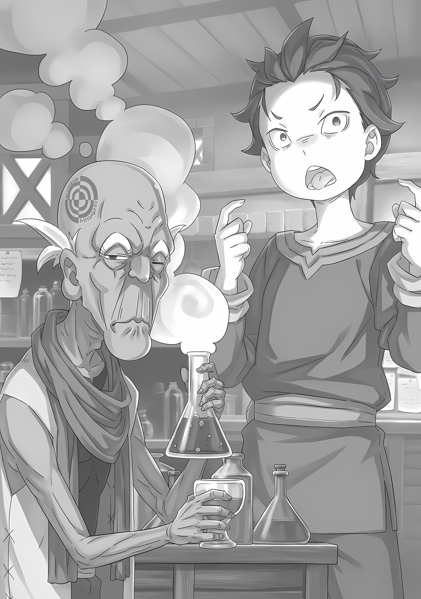

……Жизнь на Гладиаторском Острове Гинунхайв была не так уж плоха для Субару.

Выступление Субару во время соревнований «Спарки» было хорошо принято гладиаторами, соревнующимися на Острове Гладиаторов. И поэтому, куда бы он ни пошел, его ждал такой же прием, как и в том большом зале.

Даже в условиях, когда человек был вынужден сражаться, Путь Империи Волакия оставался неизменным.

Поэтому, похоже, принцип, согласно которому ценится сильный, все равно действовал, и «Спарка» в исполнении Субару и других членов «Отряда» вполне соответствовала этому принципу.

???: Несмотря на то, что он просто тощий мальчишка, у него есть смелость.

Похоже, это была общая оценка Субару.

Должно быть, им было забавно, что Субару, ребенок, которого при желании можно было задушить одной рукой, дал хороший отпор льву Зверодемону-гладиатору.

То, что Субару казался обычным ребенком для своего возраста, в отличие от поддельного Сесилуса, возраст которого совпадал с возрастом Субару, возможно, способствовало такому впечатлению. С другой стороны, репутация фальшивого Сесилуса была просто ужасной.

Сесилус: Наверное, я хочу сказать, что я просто живу своей жизнью, поэтому меня не волнует, что обо мне думают окружающие. В конце концов, никто из вас не сможет жаловаться, когда увидит результаты. О, я имею в виду не физические, а эмоциональные результаты.

Плюс-минус, такова была его реакция в тот момент, когда он услышал о своей репутации от окружающих его людей.

Он уже в какой-то мере чувствовал, что так оно и есть, но у фальшивого Сесилуса не было желания менять свой образ жизни, как и не было желания жить в соответствии с окружающими его людьми.

Он обладал сильной волей, чтобы придерживаться своих убеждений, и силой, чтобы довести их до конца…… и то и другое подтверждало запредельное самомнение фальшивого Сесилуса.

И, согласно правилам Острова Гладиаторов и Империи, это было приемлемо.

Идра: Но то, что нас за это ненавидят, на самом деле не приносит пользы. Мы не можем выжить на острове в одиночку, потому что мы — единое целое.

Вайц: То есть ты хочешь сказать, что в этом кроется сила выживания, что…… Судя по неконтролируемому поведению этого отродья, он, похоже, тоже уверен в своей правоте….

Хиайн: Тч, что за чудак, это не наше дело. Я имею в виду, иметь дело с этими двумя жуткими сопляками — этого достаточно.

Именно такое впечатление сложилось у членов «Отряда» о фальшивом Сесилусе.

Возможно, это прозвучало резко, но это была вполне естественная мысль. Начнем с того, что все гладиаторы, если только они не были очень сильны и не находились в безопасном месте, боролись, чтобы выжить изо дня в день.

Это было нормой, поэтому у них оставалось мало времени на заботу об окружающих.

Субару: Ну, у меня есть проблема с тем, что Хиайн обращается с нами как с жуткими сопляками, но что ты думаешь, Танза? О Сеси.

Танза: Для меня это не важно. Важнее, Шварц-сама…

Субару: Да?

Танза: ……Шварц-сама, ты действительно собираешься покинуть это место?

От неожиданности вопроса, прозвучавшего в ее голосе с полувозмущением и полуупреком, глаза Субару расширились, он обернулся и бездумно выдал «А?».

В общей комнате, предоставленной гладиаторам…… помещении, которое можно назвать общей камерой…… Танза, соседка Субару по комнате, нахмурила свои ровные брови и вздохнула почти драматично.

Танза: Сейчас не тот момент, чтобы говорить об этом. Я вижу, что Шварц-сама хорошо проводит время со всеми гладиаторами в последние несколько дней, но помнишь ли ты план, который у тебя был в самом начале?

Субару: План в самом начале…?

Танза: ……Кх, ты хотел покинуть остров и вернуться в Хаосфлейм.

На мгновение голос Танзы прозвучал в ответ на слова Субару, как будто он не понимал, на что она намекает.

И с этим, девушка отвела взгляд от Субару и предварила его словами «Мои извинения», прежде чем продолжить,

Танза: Я намеревалась следовать плану Шварца-сама, если это возможно. Но если Шварц-сама не будет действовать активно, то все изменится. Я должна встретиться с Йорной-сама.

Субару: …………

Танза: Даже сейчас я все еще ничего не знаю о том, что произошло после Хаосфлейма, только то, что Йорна-сама цела и невредима, о чем свидетельствует ее постоянная любовь ко мне….

Сказав это, Танза прикоснулась к своему правому глазу.

Этот жест означал изменения, которые Субару наблюдал в жителях Города Демонов…… такое же пламя в глазах тех, кто находился под действием «Техники Брака Душ» Йорны.

Обезглавить льва одним ударом Танза, конечно, не могла. Это означало, что сила, дарованная благосклонностью Йорны к ней, все еще в действии.

Субару: Это значит, что Йорна-сама здорова, не так ли?

Танза: …Физически. Но я не знаю, здорова ли она сердцем.

Субару: Это… Ну, да. Потому что Йорна-сама дорожила всеми в городе…

Поскольку она была слишком доброй, с ней неоднократно обращались как с предательницей за то, что она не следовала политике Империи.

Субару считал, что в какой-то мере понимает обстоятельства Йорны и чувства Танзы и всех остальных, кого защищали идеалы Йорны.

Поэтому было понятно, почему Танза хочет немедленно вернуться к Йорне.

Субару: Но нельзя торопиться. Нельзя добиться желаемого, бродя в потемках.

Танза: Но! Я не могу позволить себе быть такой же неторопливой, как ты, Шварц-сама!

Субару: Неторопливой……

Танза: Правильно. Я думала, что последние два дня ты слонялся по острову в поисках способа сбежать, но оказалось, что ты общался со своим «Отрядом» и с другими гладиаторами….

Считая по пальцам, Танза критиковала поведение Субару за последние пару дней.

Действительно, в течение двух дней Субару только и делал, что разговаривал с людьми. Он не искал способ сбежать или выяснить, как работать с единственным разводным мостом, который соединял с внешним миром.

Иногда он проводил время с Вайцем и другими людьми из его отряда, но приоритет отдавал изучению правил Острова Гладиаторов, а также других интересных сведений от тех, кто находился на Острове дольше.

В глазах Танзы это были очень неторопливые действия, и, возможно, это выглядело так, будто Субару готовился сделать Остров своим домом до самой смерти.

Но если бы это было так……

Субару: Это совершенно неверно, Танза. У меня тоже есть кое-кто, кого я хочу видеть так же сильно, как Танза хочет видеть Йорну-сама. Мне совершенно необходимо выбраться отсюда.

Танза: ……Скажи, это те люди, которые были с тобой?

Субару: Это правда, за исключением Абела, есть и другие… В большом городе, обнесенном стеной. А также в стране по соседству с Империей. Я был очень занятым, знаешь ли.

Танза: …………

Как только Субару ответил, что у него есть другие люди, с которыми он хотел бы встретиться повсюду, Танза замолчала.

Возможно, она подумала, что ее единственная любовь к Йорне была больше, чем любовь Субару к множеству людей, но она не стала говорить об этом вслух.

Одного этого было достаточно, чтобы понять, насколько она искренна. Можно было только восхищаться преданностью Йорны своему образованию, ведь именно ей предстояло научить ее стольким вещам.

Субару: Все-таки, наверное, я умею пользоваться своей головой лучше, чем ты.

Танза: ……? Что это значит…?

И что-то произошло в тот момент, когда Танза наклонила голову в ответ на слова Субару.

???: ……Басу! Разводной мост поднимается! Новые люди только что прибыли!

С громким криком фальшивый Сесилус пронесся по коридору и появился перед ними. Плечи Танзы подпрыгнули от интенсивности и громкости его голоса, но реакция Субару была прямо противоположной.

С восклицанием «Вот оно!», подпрыгнув на месте, он продолжил,

Субару: Это намного быстрее, чем я слышал, это обычный темп?

Сесилус: Нет, как я уже говорил, последняя «Спарка», вашей группы, была исключением. Все, кроме трех членов «Отряда» Басу, не смогли спастись и оказались на дне озера… Так что Басу и его команда в спешке восполнили недостаток людей.

Субару: А, понятно.

Как сказал фальшивый Сесилус, пожав плечами, предыдущая «Спарка» прошла с нарушениями.

Кандидаты в гладиаторы, которые первоначально должны были войти на Остров Гладиаторов вместе с Вайцем и остальными, попытались массово сбежать. Однако эта попытка закончилась неудачей, в результате чего их повозка перевернулась. Все, кто сбежал с разводного моста в озеро, стали пищей для водных Зверодемонов.

В результате, «Спарку» не провели для Вайца и остальных, так как не было достаточного количества членов, и ее собирались отложить до тех пор, пока не будет пополнено число, необходимое для формирования отряда, но…

Субару: Значит, тогда, когда мы с Танзой пришли, Вайц и остальные, должно быть, были очень подавлены, хех.

Новые рекруты должны были пройти «Спарку», и не только это, Субару и Танза были теми, кто присоединился… и Танза была без сознания.

По сути, с учетом одного ребенка с неприятными глазами, это была «Спарка» из четырех человек.

Все трое, должно быть, думали, что это самый неудачный день в их жизни.

Субару: Однако на самом деле это был самый счастливый день в их жизни.

Сесилус: О, у тебя очень милое и уверенное выражение лица. Итак, Басу, что ты хочешь делать теперь?

Субару: Да, я собираюсь проверить разводной мост. Я бы хотел также поговорить с некоторыми людьми снаружи.

Сесилус: Это может быть сложновато. Я думаю, что «Спарка» начнется довольно рано по сравнению с прошлым разом, так что у тебя может не быть шанса встретиться с ними.

Субару: Понятно… Сложновато, конечно, но если это так, то есть способы, чтобы это сработало.

Когда Субару ответил на это, положив руку на подбородок, фальшивый Сесилус поднял брови в ответ.

Его интерес, или, возможно, благоприятное впечатление от ответа Субару, было легко понять по его реакции. Он был из тех, кто с трудом хранит секреты, но все же это был человек, с которым нужно было быть начеку.

В этом мире было мало людей, способных убить человека, независимо от того, насколько он им нравится.

Слухов о личности фальшивого Сесилуса на Острове было достаточно, чтобы Субару относился к нему, как к тикающей бомбе.

Конечно, слишком сильное опасение только укоротит фитиль, так что найти правильный баланс было хорошей идеей.

Как бы то ни было……

Субару: Наконец-то, кажется, есть какой-то прогресс. Танза, что ты думаешь?

Танза: Нет, ну, что ты имеешь в виду? Ты с Сегмунтом-сама что-то замышляешь?

Сесилус: Ничего подобного! Мне ничего не говорили о мыслях Басу, а если и говорили, то ничего особенного. Он просто сказал, чтобы я сообщил ему, когда будет поднят разводной мост. Все, что планируется потом, находится в голове Басу, так то!

Танза: ……Шварц-сама?

Видя, что от Сесилуса, показывающего, что у него нет ни малейшей информации, ничего не добиться, взгляд Танзы обратился к Субару, как бы обвиняя его в том, что он что-то от нее скрывает. Хотя он и не собирался ничего от нее скрывать.

Однако он намеревался действовать довольно осторожно.

Субару: А сейчас давайте поговорим, пока мы идем проверять мост. Мы все были бы глупцами, если бы пропустили это.

С Танзой, которая выглядела так, словно хотела что-то сказать, и забавным поддельным Сесилусом на буксире, Субару вышел из общей комнаты и направился на верхний уровень острова, откуда был виден разводной мост. На вершине острова гладиаторам была предоставлена большая свобода в их деятельности, и за исключением тех, чье поведение было отвратительным на ежедневной основе, они не были ограничены ничем, кроме того, когда они ложились спать или проводили свои смертельные поединки.

Существовали определенные правила, когда принимать ванну или пищу, которые, очевидно, нужно было соблюдать, но это было далеко не то, что он себе представлял…… жизнь раба или заключенного в тюрьме.

В центре Острова Гладиаторов находилась гладиаторская арена, которая стала сценой, где проводились грандиозные состязания для зрителей из-за пределов Острова. Поэтому, поскольку гладиаторская арена и ее окрестности были тем, что должны были видеть посторонние, она была оформлена в довольно ярком и выделяющемся стиле.

С другой стороны, остальные помещения для свободного проживания гладиаторов были простыми, поэтому, за исключением минимально необходимых для жизни помещений, остров в целом казался «Серым».

Субару: Но ведь есть еще целительская комната, а также библиотека, не так ли?

Танза: Говорят, что они начали принимать книги с тех пор, как губернатор Густав стал главой острова. Удивительно, но я слышала, что она стала местом, где все вместе проводят время отдыха.

Субару: Да, там было много книг. Хотя было бы неплохо, если бы я тоже мог их читать.

Кивая на описание Танзы, Субару почесал пальцем висок.

Буквы этого мира, которые он якобы изучал, казалось, были выбиты из его мозга сразу после того, как он уменьшился, так что он мог читать и понимать их лишь с трудом.

Некоторые фрагменты он помнил смутно, так что расшифровать их было несложно, если очень постараться, но чтобы прочитать хоть одну страницу, ему приходилось использовать свой ум, словно в поисках сокровищ.

Субару: Если бы Сестра-сама узнала об этом, она бы очень расстроилась из-за меня….

Человек, который оказал Субару наибольшую помощь в изучении писем, была Сестрой-сама…… Рам. Поэтому, если бы она узнала о нынешнем положении Субару, она бы очень рассердилась.

Даже если не принимать это во внимание, он оставил Рем одну. Он был уверен, что Рам, узнав об этом, разозлится. Это было то, на что Субару тоже хотел рассердиться.

Танза: Шварц-сама?

Субару: ……Для того, чтобы мы смогли выбраться с этого острова, есть две вещи, которые станут нашими препятствиями. Одна из них — разводной мост, соединяющий остров с другим берегом реки

Танза: ……Да, я знаю об этом.

Он предназначался для управления гладиаторской ареной, которая была построена на Острове в центре озера.

Поскольку половина арены находилась со стороны острова, а другая половина — со стороны берега реки, разводной мост нельзя было пересечь, если он не был подвешен с обеих сторон. Это было проблематично, потому что обычно его поднимали так, чтобы через него нельзя было перебраться.

Сесилус: Вот почему его обычно опускают. Его поднимают только в случае необходимости.

Субару: Это все равно не имеет смысла для меня, сколько бы раз ты мне не говорил. Вот почему я хочу увидеть все в живую.

Хотя тон голоса Сесилуса был таким, как будто он говорил с кем-то, кто просто не хотел слушать, во всяком случае, у Субару образ разводного моста был, без сомнения, таким: один мост разделен на два посередине, и каждая сторона заставляет его отходить.

Естественно, согласно этому образу, разводной мост должен быть «Опущен».

Танза: Тогда, Шварц-сама, второе препятствие….

Отмахнувшись от концептуального образа в голове Субару, Танза поинтересовалась направлением разговора. При этих словах он издал «Угу» и сделал короткий вдох, продолжив,

Субару: Нет нужды говорить, что это правило проклятия. То, которое, по словам Густава, наложено на всех гладиаторов.

Танза: …………

Опустив кончики нежных бровей, Танза сделала сложное лицо.

Естественно, она поняла бы вопрос даже без подсказки — это было правило проклятия.

На всех людях находящихся на Острове Гладиаторов была наложена метка проклятия, и она активировалась у тех, кто нарушал правило проклятия, лишая их жизни. Это была главная причина, по которой Густав продолжал оставаться абсолютным правителем Острова Гладиаторов в качестве губернатора.

Никто не мог ослушаться Густава; ослушание стоило ему жизни.

Даже если человек не бросает ему вызов, пока метка проклятия не снята, он не знает, когда его жизнь прервется за нарушение этого правила.

Как снять метку, а также подробности правила проклятия никто, кроме самого Густава, не знал.

Субару: Если вы спросите меня, чего я боюсь, то это того, что я не знаю подробных правил. Я могу просто нормально проводить время, а потом ненароком нарушить их и умереть, не осознавая этого.

Сесилус: Ну, из того, что я знаю, было такое беспокойство, когда Густав только стал губернатором, но в последнее время это беспокойство, кажется, по большей части исчезло. Тем не менее, похоже, что Густав не хочет сокращать число гладиаторов по глупости, так что это облегчение, что он объявил то, что никогда не должно быть сделано.

Субару: Объявил… Значит, это будет что-то вроде: «Не бросать вызов страже», «Драки между гладиаторами вне мясорубки запрещены», «Не сбегать с этого острова без разрешения» и так далее.

Сесилус: Ага.

Субару: ……Как я и думал, проблема в последнем пункте.

Для поддержания правил жизни на Острове Густав ввел правило проклятия.

Тем не менее, это действительно противоречило целям Субару и Танзы.

Субару: Кроме менее честных методов, есть и другие способы нарушить правило проклятия и перестать быть гладиатором, верно?

Сесилус: Да, конечно, есть. В данном случае речь идет о масштабном шоу, которое они проводят раз в год. Приглашается Его Превосходительство Император, и это знаменитая награда за мясорубку, которую они проводят в его присутствии. Есть и другие способы, например, кто-то из зрителей тратит много денег, чтобы убрать тебя. Поэтому гладиаторы тоже должны хорошо выглядеть, то есть возникает необходимость очаровать их великолепной красотой.

Субару: ……По той или иной причине мой мысленный образ — это образ гладиаторов.

Это было нечто, напоминающее так называемых гладиаторов из Римской Империи.

Он не знал подробностей, но это было похоже на раба, которого заставляли сражаться мечом, что, можно сказать, буквально то же самое, что и гладиаторы Острова.

Он слышал, что был человек, вроде бы известный гладиатор древности, который поднял восстание вместе с другими гладиаторами, но….

Субару: Я хочу сбежать, а не восстать, поэтому я думаю о побеге из тюрьмы.

Что может стать подсказкой, так это модели тех, кто сбежал из тюрьмы.

Однако знание таких фильмов и манги у Субару было довольно туманным. Казалось, что они не смогут воспользоваться этим при существующем положении вещей, поэтому Субару все еще должен был найти правильный ответ.

Субару: Как бы там ни было, для того, чтобы выбраться с Острова, мы должны что-то сделать с этими двумя вещами, разводным мостом и правилом проклятия. По этой причине нам совершенно необходимо пойти посмотреть на разводной мост, понятно?

Танза: ……Я согласна. Тем не менее, это не объясняет, почему Шварц-сама не торопился, пока мост не сдвинулся с места.

Субару: Ты вроде моя союзница….

В ответ на пристальный взгляд Танзы, Субару почесал голову, сделав озабоченное лицо.

Пока они так разговаривали, все трое направились к искомой точке обзора. На полпути вверх по горе, которая становилась все выше по мере приближения к центру острова, был построен балкон, с которого открывался вид на половину озера.

Точнее было бы назвать его не балконом, а смотровой площадкой, но кроме Субару и двух других людей там находилось еще несколько человек. Остальные гладиаторы, похоже, пришли сюда в качестве любопытных зрителей.

Среди рядов зрителей вдруг появилась фигура и помахала Субару и остальным.

???: Это Шварц, не так ли? Что ты здесь делаешь?

Субару: О, Хиайн, ты тоже тут. Пришел «*просто посмотреть*»*?

*слово「冷やかし？」в японском означает приценку товара без намерения покупки, т.е. как наше знаменитое «*просто посмотреть*».

Хиайн: Как будто я могу заниматься чем-то подобным…! Я слышал, что следующие жертвоприношения уже в пути, вот почему.

Отведя глаза, ящер Хиайн не смог продолжить остальные слова.

Будучи членом того же «Отряда», что и Субару, он, вопреки своему самоуверенному поведению, был довольно робким. Он не был плохим существом, но, с другой стороны, его характер не был тем, что можно открыто хвалить.

Даже то оправдание, которое прозвучало только что, не развеяло полностью ни одной части той цели «просто посмотреть».

Танза: Хиайн-сама, не хотите ли вы взглянуть на тех, кто идет следом?

Хиайн: Уф…

Танза: Если вы не хотите отвечать мне, это меня не особенно беспокоит, однако.

На сдержанный вопрос Танзы, Хиайн скривил свой большой рот и не решался ответить. Но когда тишина сразу стала невыносимой, Хиайн дрожащим голосом сказал: «Именно так!».

Опираясь локтями на перила и хмуро глядя на озеро внизу, он заговорил,

Хиайн: Я хотел бы увидеть лица парней, которые придут сюда. Разве это неправильно?

Субару: Это не неправильно, но по какой причине? Раз уж ты выжил в «Спарке», было бы неосмотрительно приходить сюда, чтобы проверить, сможет ли следующая группа прибывших выжить в «Спарке», или что-то в этом роде.

Хиайн: Как будто я сделаю что-то настолько злое…! Я не говорю, что таких парней нет.

«Я не такой», и этим Хиайн отверг подозрения Субару.

На данный момент он решил довериться этому ответу. Субару также искренне понимал, что Хиайн не плохой парень, он просто боязливый. Кроме того, он был тем, кто, похоже, меньше всего привык к правилам этого Острова Гладиаторов.

Хиайн: ……Так зачем вы, ребята, пришли?

Субару: Мы пришли не «*просто посмотреть*», и не как любопытные зрители. Конечно, нас интересуют люди, которых привезут на этот раз, но мы хотим увидеть разводной мост.

Хиайн: Ты хочешь увидеть мост? Ты что, сопляк…? Подожди, ты и вправду сопляк, да?

Субару: Нет, все верно, к слову, ты говоришь очень громко.

Губы Субару искривились из-за того, что Хиайн безрассудно говорил очень громко, возможно, чтобы скрыть свои чувства. Стоя рядом с ним, они смотрели на озеро внизу.

Несмотря на то, что солнце было еще высоко в небе, над Островом Гладиаторов было пасмурное небо.

По какой-то причине казалось, что облака в этом районе никогда не рассеиваются, и он слышал, что пасмурное небо было здесь круглый год. Судя по тому, как оно выглядело, это было место, которое омрачало дух людей.

Сесилус: Ну, есть значительное количество людей, которым нравится такая обстановка, мне она скорее нравится.

Субару: Это удивительно. Я думал, что Сеси будет большим любителем солнечных дней…… Но ты называешь себя «молнией», так что, возможно, тебе все равно, если пасмурно.

Сесилус: Понятно, это не то, что меня когда-либо сильно волновало, но теперь, когда ты об этом упомянул….

Пожав плечами на фальшивого Сесилуса, который прикрыл рот рукой, сверкнув глазами от неожиданного откровения, Субару и остальные выстроились перед перилами, ожидая, пока поднимут разводной мост.

И вскоре после этого……

Субару: О, ооо…

Сначала откуда-то послышался дребезжащий звук движущихся шестеренок и механических частей.

Он подумал, что в этом механизме должен был использоваться тот же принцип, что и в железной ограде на гладиаторской арене, но разводной мост был совсем другого масштаба. В конце концов, просто построить мост огромной длины было бы невозможно, поэтому, судя по всему, им пришлось уравновесить это вращением либо больших шестеренок, либо большого количества шестеренок.

На глазах Субару разводной мост медленно «Поднялся»…

Субару: …………

То, что появилось так медленно, было разводным мостом, который был погружен глубоко в озеро.

Точно так же, как фальшивый Сесилус много раз поправлял его, двигаясь вместе с механизмом вращающихся шестеренок, он «Поднялся» из озера, чтобы показаться.

Вместо того чтобы опустить его, они «Подняли» погруженный в воду разводной мост.

Точнее говоря, был поднят не один отдельный мост, а несколько соединенных между собой мостов, поднятых со дна озера, которые, по всей видимости, были построены таким образом, чтобы образовать единый мост. Когда мост, разделенный на несколько секций, был поднят на один уровень, они были соединены вместе, чтобы стать единым целым, что и было завершено, пока с него сливалось большое количество воды.

Этот же механизм действовал и на берегу реки, поэтому разводной мост поднимался и на противоположном берегу. Два разводных моста, поднятые таким образом, становились одним, освобождая Остров Гладиаторов от изоляции на ограниченное время.

Субару: То, что двигает мост, это….

Сесилус: Есть башня, которая управляет разводным мостом, так что он в основном управляется в этой башне, знаешь ли. Я никогда не был внутри, поэтому не знаю, чего ожидать.

Субару: ……Внутри башни управления.

Что касается моста такого масштаба, то, вероятно, было бы трудно поднимать и опускать его скрытно.

Тем не менее, пересечь озеро на небольшой лодке мешало присутствие в воде Зверодемонов. Казалось, что его мышления все еще недостаточно, чтобы обеспечить реальный способ побега.

Танза: ….Скорее всего, это карета, в которой едут следующие люди.

Рядом с размышляющим Субару, Танза пробормотала это, глядя в сторону противоположного берега.

Тянущая единственную повозку большая лошадь Галевинд медленно пересекла разводной мост. Лошадь Галевинд выглядела как армейский конь, оснащенный броней, и с первого взгляда казалась довольно крепкой.

Охрану кареты, расположившуюся вокруг нее, составляли солдаты, ехавшие на чем-то меньшем, чем лошадь Галевинд. Казалось, они опасались, что карета перевернется, как в прошлый раз, поэтому их бдительность была усилена.

Сесилус: О, это Густав-сан. Похоже, он едет лично.

На другой стороне разводного моста группа ожидала прибытия кареты. Среди стражников в черных мундирах стоял Густав, его необычайно большая грудь вздымалась.

Была ли это мера предосторожности против последнего случая, когда карета перевернулась? Или, учитывая, что это был Густав, он должен был присутствовать независимо от этого.

Субару: До другого берега реки чуть больше километра, может быть, не больше двух километров…?

Хотя расстояние до разводного моста было более или менее таким, как он предполагал, было трудно сказать, так как расстояние до него было довольно большим.

Даже с механизмом, позволяющим распределять его вес, разводной мост такой длины был немыслим. Даже если в основу была положена магия или какой-нибудь другой специальный магический инструмент, это все равно было несомненным подвигом.

И вот, когда он проверял состояние своей цели, разводной мост….

Хиайн: Аа……!?

Хиайн, который, как Субару и остальные, смотрел на разводной мост, воскликнул срывающимся голосом.

……Нет, он смотрел не на мост, а на проезжающую повозку. Запряженная огромной лошадью Галевинд карета, закончила пересекать разводной мост, после чего, люди внутри нее вышли.

Это были люди, которых передадут Густаву в качестве гладиаторов, или, вернее, кандидатов в гладиаторы. При виде этих лиц глаза Хиайна расширились.

Хиайн: Эти идиоты… В итоге попались…!

Прикрыв лицо обеими руками, Хиайн уставился вниз сквозь щели между своими большими перепончатыми пальцами.

Увидев новые лица, Субару понял смысл его слов. Все привезенные люди были похожи на Хиайна — ящеролюди. Хотя цвет их чешуи говорил о том, что они, возможно, принадлежат к другой этнической группе, их все равно можно было отнести к этой категории.

И реакция Хиайна была вызвана тем, что он знал, кто они такие.

Хиайн: ……Даже использовав меня в качестве приманки, чтобы сбежать.

Субару сузил глаза и посмотрел на Хиайна, который горько пробормотал это про себя.

Во время «Спарки», когда он снова и снова пытался познакомиться с Хиайном и другими участниками, ему рассказали об обстоятельствах, которые привели Хиайна на Остров Гладиаторов.

Он рассказал Субару, что его заставили играть роль приманки с его способностью менять цвет чешуи и сливаться с толпой, и что его использовали в качестве жертвенной пешки, чтобы выиграть время для своих друзей и спастись от работорговцев.

Тем не менее, из ответа Хиайна стало ясно, что они….

Субару: Это они использовали тебя в качестве приманки.

Хиайн: Гх….

Танза: Хиайн-сама…

Выражение лица Хиайна изменилось, как только Субару произнес свои слова, что заставило Танзу посмотреть на него с беспокойством. Хотя она, вероятно, не любила его, она, возможно, испытывала симпатию к человеку, с которым обменивалась словами.

Но как только он увидел, что мальчик и девочка смотрят на него, Хиайн фыркнул.

Хиайн: Заслужено! Выставили себя дураками, потому что воспользовались мной! После всей боли, которую они мне причинили… Нелепо!

Сесилус: Хм-м.

Хиайн: Ч-что, у тебя проблемы или что-то в этом роде!?

Фальшивый Сесилус закрыл один глаз на слова Хиайна, а тот злобно оскалился, исказив на него свой рот. Когда он безрассудно огрызнулся в ответ, фальшивый Сесилус покачал головой: «Нет, нет»,

Сесилус: Я не критикую тебя. Я просто был удивлен и поражен одновременно, потому что это было просто посредственное заявление посредственного персонажа, который существует только для того, чтобы его били.

Хиайн: Я персонаж, который существует только для того, чтобы его били…?

Сесилус: Что еще я могу сказать? Это то, о чем я уже давно думаю, но почему все эти люди, которые должны быть побочными персонажами, всегда говорят вещи, которые заставляют их звучать так, будто они и есть побочные персонажи? Почему бы им просто не прочитать одну из этих книжек с картинками и не понять, как глупо все это звучит?

На глазах у Хиайна, голос которого дрожал, фальшивый Сесилус высоко поднял руки.

Сухим звуком фальшивый Сесилус привлек внимание окружающих к себе,

Сесилус: Посмотри вокруг и убедись сам. Я не читал все истории о прошлом и настоящем и о каждом месте, но если ты прочтешь те, которые привлекут твое внимание, от корки до корки, ты обнаружишь, что в них много действенных лиц. Знаменитые говорят и делают вещи, достойные их известности, а те, кто не знаменит, говорят и делают вещи, достойные их глупости. И это относится к реальности за пределами книжных картинок больше, чем ты думаешь.

Хиайн: Ч-что за хрень ты несешь…?

Сесилус: Слабые люди говорят вещи, которые кажутся слабыми! Сильные люди говорят вещи, которые кажутся сильными! Ведущие актеры говорят самые крутые вещи, а второстепенные персонажи шепчут голосом, который трудно расслышать! О, это все так причудливо и странно, ты не находишь?

Хиайн: …………

Сесилус: Почему вы все так стремитесь играть самые маленькие роли по собственной воле? Мы все актеры, которым нужно прожить свою собственную жизнь. Конечно, главным актером могу быть только я.

Не сводя с них взглядов, фальшивый Сесилус легонько постукивал по земле своими обутыми в сандалии ногами, направляя не только их взгляды, но и их слух на себя.

И……

Сесилус: Почему бы тебе не подумать, прежде чем что-то сказать? Это заявление делает тебя похожим на мелкого мальчишку, который вот-вот умрет.

Хиайн: ……Тц.

Хиайн сглотнул, когда фальшивый Сесилус приблизил к нему свое лицо, глядя на него снизу вверх.

С улыбкой на лице, несмотря на реакцию Хиайна, фальшивый Сесилус быстро отступил назад. Но он, казалось, испугался взгляда фальшивого Сесилуса и запыхался.

И тогда Хиайн повернулся спиной, чтобы убежать от поддельного Сесилуса, и……

Субару: Хиайн.

Хиайн: Что!? Оставь меня в покое! Единственный раз, когда я в союзе с тобой, только тогда, когда мы вместе как «Отряд», и….

Субару: А как же те люди внизу? Я думал, они твои спутники.

Субару остановил Хиайна, когда тот уже собирался уходить, и задал ему вопрос. Услышав его слова, он выдохнул: «Ха!»,

Хиайн: Все так, как я и говорил! Они использовали меня как приманку, а потом все испортили! Мне плевать на этих идиотов!

Субару: ……Но ведь когда ты сбросил мешок с обрыва, они поделились с тобой своей едой, не так ли?

Услышав слова Субару, глаза Хиайна расширились со звуком «Ах».

К удивлению Хиайна, Субару продолжил: «Тем более»,

Субару: Они помогли тебе убежать от бандитов, а когда ты не мог развести огонь, они сделали это за тебя… Последнее, что ты помнишь о них, может быть плохим воспоминанием, но…

Хиайн: …………

Субару: Слишком одиноко думать, что последнее, что ты видел о них, составляет все об этих людях.

Есть поговорка, что человек проявляет себя в экстремальных обстоятельствах.

Субару хотел сказать «как же это нелепо», дабы он отбросил эту логику.

Нелепо предполагать, что, когда человек попадает в чрезвычайную, неконтролируемую ситуацию, его действия определяют все о нем.

Тогда, может ли то, что делали Хиайн, Вайц и Идра во время «Спарки», быть их истинной личностью?

Будет ли Субару считать их до конца соплежуем, трусом и лжецом… И что это максимум их существования?

Были моменты, когда они сотрудничали с Субару, не убегая, не перехитряя друг друга, не обманывая, и именно поэтому они были здесь все вместе, едва избежав смерти.

Именно поэтому……

Субару: Если ты поговоришь с ними, то, возможно, получишь другую историю.

Даже Субару не смог с самого начала полюбить людей, которых теперь любил.

Он видел и менее приятные стороны этих людей. Тем не менее, Субару хотел нравиться всем. Он считал себя не единственным уникальным человеком в этом отношении.

Хиайн: ……Ты — жуткое маленькое отродье. Всегда говоришь так, будто все знаешь.

В ответ на обращение Субару, Хиайн пробормотал что-то злобное.

С его точки зрения, это должно было быть довольно неприятно, когда ему рассказывали историю, которую Субару не знал. И все же, с лицом, изображающим мысль, которая предшествовала жути, которую он чувствовал, он продолжил,

Хиайн: Они никогда не пройдут «Спарку». Значит, это невозможно.

С этими словами Хиайн отошел от своей грубости, на этот раз не останавливаясь.

Но понял ли он это? Ответ Хиайна не исходил из его чувств в тот момент, а был лишь оправданием того, почему он не может сделать эти вещи. Потому что ситуация стала бы еще более удушающей.

Понимал ли он, что, если обстоятельства изменятся, это оправдание будет уже неприемлемо?

Танза: Шварц-сама, мне жаль слышать о Хиайне-сама и его знакомых, но….

Когда Хиайн отвернулся, Танза осторожно коснулась рукава Субару. В ее круглых глазах мерцало нетерпение, сопровождаемое сочувствием.

Из всех препятствий, которые им предстояло преодолеть, одним из них был разводной мост. Поскольку она видела его своими глазами, это должно было укрепить ее решимость сбежать с острова.

Естественно, для Танзы выбраться с Острова было гораздо важнее, чем чувства Хиайна. Конечно, то же самое было и с Субару.

У Субару тоже есть вещи, которые были важны для него, и вещи, которые он хотел поставить на первое место.

Не было необходимости сравнивать Хиайна с тем, с чем Субару сталкивался в прошлом.

И все же……

Сесилус: ……Басу, это то, что называется тернистым путем.

Субару: Сеси…

Пока Субару боролся с кипящим, жгучим чувством в глубине своей груди, фальшивый Сесилус сказал ему это.

Когда Субару повернулся, чтобы посмотреть на него, фальшивый Сесилус издал: «Хоп», а затем проворно встал на перила перед ним. Это зрелище заставило его почувствовать легкое беспокойство, но фальшивый Сесилус ловко балансировал на узких перилах.

Сесилус: Редко бывает, чтобы все было так, как мы хотим, независимо от того, сколько лучших решений мы принимаем в тех обстоятельствах, в которых оказались. Для тех существ, которые получают все, есть предварительное условие. Квалификация быть избранным ведущим актером. Если ты не обладаешь ею и хочешь чего-то, чего не заслуживаешь….

Субару: И что если так?

Сесилус: Тебя ждет только смерть, не так ли?

Когда фальшивый Сесилус заявил это, его тело сильно наклонилось к другой стороне перил. Увидев это, глаза Танзы расширились, и она быстро попыталась протянуть руку.

Но быстрее, чем она успела это сделать, фальшивый Сесилус, согнувшись в коленях, остановил импульс своего падения. Затем, приседая, он оказался лицом к лицу с Субару перед перилами,

Сесилус: Так что гораздо легче продвигать дела, если думать о них как о том, что должно быть сделано, нравится тебе это или нет.

Субару: ……Что должно быть сделано?

Сесилус: Да, именно так. Принимая то, что перед тобой, как в высшей степени естественное, приходишь к выводу, что не можешь изменить судьбу. Тот, кто не может преодолеть препятствия собственными силами, неизбежно застопорится на предстоящем пути. У тебя нет другого выбора, кроме как прокладывать свой собственный путь… Это то, что нужно делать, независимо от того, что ты об этом думаешь.

Фальшивый Сесилус говорил это, присев на корточки, искусно сохраняя позу, не двигая ни единым мускулом. Когда на Субару обрушился шквал этих слов, в его голове всплыли слухи о фальшивом Сесилусе.

Говорили, что в «Спарке», в которой участвовал фальшивый Сесилус, он не действовал, пока все его союзники не были уничтожены.

Затем, как только он остался один, он в одиночку убил Зверодемона-гладиатора, и с тех пор он сражался до смерти без членов своего «Отряда», забирая жизни всех, с кем сталкивался.

Субару: Так вот почему ты не помогаешь другим, Сеси?

Сесилус: Ты должен уметь сам прокладывать себе путь через любые препятствия. Если же ты достигнешь чего-то, заимствуя силу других, ты не сможешь преодолеть то же самое в следующий раз. У тебя не получится заимствовать чью-то силу вечно. Люди рано или поздно умирают. Даже я не бессмертен.

Его намерения были понятны. Его логика тоже не была непостижимой.

Но это был тот тип логики, который мог заявить только фальшивый Сесилус, потому что он был сильным, тем, кто мог преодолевать проблемы. Это было очень жестко и недоброжелательно.

Субару: Несмотря на твои слова Сеси, иногда встречи могут изменить человека. И тогда изменившийся человек сможет преодолеть следующее препятствие. Кроме того….

Сесилус: Кроме того?

Стоя на одной ноге на перилах, фальшивый Сесилус уперся локтем в согнутое колено и подпер рукой подбородок. Субару оскалил зубы, глядя на это лицо, сдерживающее ухмылку.

Как обычный человек, который не мог жить в одиночку, перед этим сверхчеловеком, который мог справиться с чем угодно в одиночку.

Субару: Сеси, ты говоришь относиться к этому независимо от моих чувств, но важно сохранить ощущение невозможности этого сделать.

Сесилус: …………

Субару: Это ощущение невозможности отбросить свои личные чувства, чтобы сделать что-то, является движущей силой для спасения кого-то другого. Даже если мне скажут, что это эгоизм наивного мальчишки, я уже знаю, что так оно и есть.

Действительно, Субару хотелось бы верить в это.

Размер тела не имел значения. Так думал Нацуки Субару, независимо от того, насколько он был велик или мал.

Вера. Наивная логика, которую не может игнорировать ум, выдаваемый за зрелость.

Сесилус: Аха!

Услышав заявление Субару, выражение лица фальшивого Сесилуса изменилось.

Из тонкой улыбки оно превратилось в большую, довольную ухмылку.

Увидев это краем глаза, Субару решил, что ему пора заняться делом и ушел.

Танза: Шварц-сама! Сегмунт-сама, что…

Сесилус: О, как здорово, Басу! Это соответствует и моей логике. Крутые люди говорят крутые вещи, сильные люди говорят вещи, которые кажутся сильными. Оба актера начинают с того, что говорят вещи, достойные их положения. Таков дух того, кто восстает против судьбы!

Танза: Сегмунт-сама!

Танза повернулась к фальшивому Сесилусу, который гоготал на перилах. Однако у Субару не было времени тратить время на этих двух людей.

Было два места, куда ему нужно было пойти, и хотя он мог просто зайти в первое, ему нужно было провести небольшую беседу, убедить или, возможно, немного необоснованно обвинить другого.

Это было то, к чему он должен был подготовиться позже….

Субару: Старик Нулл!

Быстро вернувшись на Остров, Субару поспешил в лечебную комнату. Распахнув дверь, он увидел спину запаниковавшей фигуры, которая тайком дремала внутри.

Старик с худым телом и бровями, выглядящими как ватный тампон, был стариком Нуллом, целителем, запертым в целительской комнате.

Нулл покачал головой и моргнул, глядя на ворвавшегося в комнату Субару. Тот предварил свой вопрос словами: «Простите, простите», а затем…

Субару: ……То, о чем я просил, готово?

Оригинальная иллюстрация **Ранобэ** | Том 31

△▼△▼△▼△

???: Похоже, у них будет следующая «Спарка»…… У нас должен быть повод пойти посмотреть….

Хиайн ненавидел Вайца, который, не сумев разобраться в ситуации, сделал такое предложение.

Поскольку они были собраны как члены одного «Отряда», у них часто не было другого выбора, кроме как быть вместе, однако с самого начала Хиайн никогда не ладил с Вайцем.

Кроме того, он знал, что именно здесь он, импульсивно вспыхивающий на людей и плохо ладящий с мужественным Вайцем… будет первым изрыгать подстрекательские слова.

Несмотря на то, что он знал об этом, он никогда не мог это исправить.

Из-за этого ему пришлось пройти через ужасные испытания. Его отправили на Гинунхайв в качестве гладиатора, и это тоже было вызвано катастрофой, которую устроил его рот.

Правда, люди, с которыми он работал, использовали его в качестве жертвенной пешки, чтобы спастись от работорговцев. Но, прежде всего, это был собственный промах Хиайна, который привлек к ним внимание работорговцев.

Раздосадованный тем, что не может найти достойную работу даже на день, он ввязался в драку в баре с группой явно опасных людей, за что и был привлечен к ответственности.

После нескольких дней, проведенных в преследовании, он, наконец, дошел до того, что перешел к прямому насилию. И, чтобы его товарищи могли спастись, было принято решение.

Хиайн: Черт возьми, я знаю это….

Хотя он был пугливым, вспыльчивым и срывался на людей, из-за этого у него возникали проблемы, но до самого конца товарищи не оставляли его.

Не желая и дальше полагаться на других и стараясь выглядеть хорошо, он сказал им: «Если ситуация станет безнадежной, пожалуйста, просто бросьте меня». Однако, несмотря на эти слова, в его голове была мысль о том, что у них хватило мужества оставить его.

В самом конце, убедившись, что они такие же пугливые, как и он, что у них не хватит смелости бросить одного из своих товарищей, он воспользовался ими.

Хиайн: Я знаю, что я самый безнадежный из всех, черт возьми….

Его бросили, использовали как приманку, как жертвенную пешку; глупо было поднимать из-за этого шум.

То, что это было очень глупо, понимал и сам Хиайн.

Но если бы он не сказал этого, то не смог бы защитить свое сердце. Он не был виноват, и все же именно его товарищи были неправы и заставили его страдать; он твердо хотел в это верить.

По крайней мере, проклиная таким образом своих товарищей, проклиная их, избежавших беды, он хотел оправдать себя.

Хиайн: Несмотря на это, какого черта вы все попались…!

После всех неприятностей, через которые он прошел, попавшись вот так, и оказавшись в такой безнадежной ситуации, почему они тоже попались? Оправдываясь за то, что он проклял их, Хиайн был не более чем придурком.

Опустившись до уровня простого засранца, у него не было выбора, кроме как смотреть, как его друзья беспомощно здесь умирают.

???: Похоже, с теми, кого привезли на этот раз, у тебя была дружба. В отличие от нас, их бросили сразу же, как только они прибыли….

Скрестив руки, с дрожащим голосом Идра смотрел на гладиаторскую арену со своего места среди зрителей.

Идра попытался скрыть дрожь в голосе, но безуспешно. Идра мог быть сильным, но в глубине души он мало чем отличался от соплежуя Хиайна.

Но даже тогда у Идры хватало решимости напустить на себя личину силы. У Хиайна этого не было. Он был жалок.

???: ……С этого момента «Спарка» начинается!!!

Когда сиденья заполнились гладиаторами, тяжелый голос Густава, губернатора, разнесся по толпе.

Хотя они не успели заметить его во время своей «Спарки», в одном из углов гладиаторской арены находился помост, с которого Густав мог обозревать зрителей…… вернее, место, где во время представлений сидели высокопоставленные лица.

Оттуда Густав смотрел вниз на арену, раскинув четыре руки.

В этот момент прямо под Густавом открылся проход, ведущий в заднюю часть гладиаторской арены, и из его внутреннего пространства, закрытого железной оградой, медленно вышел Зверодемон-гладиатор.

Это был Зверодемон, отличный от того, с которым сражались Хиайн и остальные: очень, очень большая крыса с мягким на вид мехом, окутывающим все тело, и птичьими крыльями, растущими из обеих рук.

Однако различия между этими двумя существами заключались лишь во внешнем виде, а в их свирепости и опасности не было никаких существенных различий.

Другими словами, это не тот случай, когда из-за другого Зверодемона-гладиатора, сложность «Спарки» бы уменьшилась.

Вайц: Итак, похоже, что на этот раз это участники….

Услышав низкий рев Зверодемона-гладиатора, как и говорил Вайц, ограждение прохода перед ними открылось, и оттуда появились участники этой «Спарки»… пять ящеров.

Чешуя каждого из них дрожала от волнения и напряжения, все их лица были знакомы Хиайну.

Последняя надежда на то, что он перепутал их, потому что видел издалека, рухнула.

Внезапно повернув лицо вниз, Хиайн понял, что бежать ему некуда.

Что же стало причиной этого? Пугливый Хиайн пережил «Спарку».

Его товарищи, попав в то же место, что и Хиайн, не смогли бы пережить «Спарку» и в итоге погибли бы… Что же это за проклятие?

То, что им пришлось пройти через это, было результатом его проклятия?

Если так, то эффект от проклятия Хиайна должен был быть значительным. Тогда он проклял бы всех на этом острове, кроме себя… нет, скорее он проклял бы всех в пределах этой Империи, проклинал бы их, пока у него не кончатся проклятия, и все же.

Идра: Идиот.

Хиайн: ……А?

Для начала, если бы он хотел проклясть кого-нибудь, он бы начал с работорговцев, которые бросили его и его товарищей здесь.

Хиайн, занятый такими причудливыми и бесполезными отступлениями от реальности, был приведен в чувство ошеломленным бормотанием Идры.

Что произошло? Широко раскрытыми от изумления глазами Идра уставился на гладиаторскую арену. И это делал не только он, но и Вайц рядом с ним…… нет, не только они двое.

……Все множество гладиаторов, собравшихся на арене, изумленно смотрели на него.

Причина этого была ясна, и, глядя на гладиаторскую арену, выражение лица Хиайна стало таким же, как и у остальных.

Потому что рядом с пятью ящерами стояла фигура шестого человека, которого не должно было быть…

Хиайн: Ч-ч-что ты делаешь, Шварц!?

Его горло дрожало, Хиайн назвал имя того, кого здесь не должно было быть, имя черноволосого мальчика.

Мальчик, с которым он только что расстался на этом месте, мальчик, который так нахально разговаривал с ним, обернулся, услышав жалостливое восклицание Хиайна.

Затем, стоя посреди ящеров, дрожащих из-за угрозы их жизни «Спарки», он щелчком своих пальецв указал на лицо Хиайна в зале и объявил.

Его спросили, что он творит, на что послышалось…

„…Сильнейшее подкрепление“.
