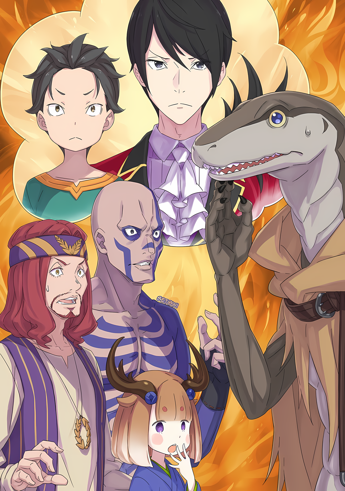

Сначала, когда старик Нулл услышал просьбу Субару, его рот с несколькими отсутствующими зубами исказился в величественной манере.

Из того, что он слышал, старик Нулл был целителем на Острове…… по крайней мере, его так называли; он никогда не занимался лечением других людей, поэтому он действовал лишь как имитация врача.

Старик Нулл появился на Острове еще до того, как Густав стал вождем и губернатором Острова. В период, когда на острове было гораздо суровее и смертоноснее, он случайно получил роль целителя.

Все началось с того, что он лишь приложил грязную тряпку к открытой ране гладиатора, потерявшего руку.

После того, как он начал лечить людей, число обращений к нему увеличилось, и вскоре он был освобожден от необходимости выступать на гладиаторской арене в качестве гладиатора и получил приказ работать целителем в лечебной комнате.

С тех пор он провел много времени в качестве целителя и, как и подобает его должности, столкнулся со множеством кровавых сцен.

Благодаря этому он стал способен хотя бы на такие вещи, как зашивание ран или смешивание простых лекарств. С верой в то, что он будет спокойно жить в качестве целителя до самой смерти, он улыбнулся своими желтыми зубами.

Субару также чувствовал себя виноватым за то, что лицо старика Нулла исказилось таким грандиозным образом.

Субару хотел реализовать свое желание сделать кое-что на этом острове, что-то, что было как никогда необходимо.

Именно поэтому Субару обратился с просьбой к старику Нуллу, который выполнял похвальную работу по спасению людей.

Субару: ……Вы можете приготовить яд, который может мгновенно убить человека, просто немного попробовав его?

△▼△▼△▼△

Ему было ужасно жаль старика Нулла.

Но это было необходимо. Для Субару было бы большей проблемой потерять сознание посреди боя или выжить каким-то полумертвым способом…… должен был быть способ начать все сначала.

И, как только он получит возможность для этого, Субару будет абсолютно идеален.

Субару: Ну, это помогло бы, если бы мои ноги были немного длиннее.

Такие жалобы были мнением тех, кто столкнулся в бою с ситуацией, когда одного большого шага было недостаточно.

Конечно же, этот один шаг решался силой, когда нужно было сделать два шага вперед, еще быстрее, к следующей возможности. Повторяя пробы и ошибки, чтобы найти наилучшее действие, он мог постичь желаемое будущее.

Вот почему……

Густав: ……Достаточно! Вы хорошо постарались и даже выжили в «Спарке»! В соответствии с моей юрисдикцией, как официального лица, я принимаю вас всех в члены Острова Гладиаторов!

Звучное заявление, произнесенное таким же резким голосом, ознаменовало окончание ожесточенной битвы, разыгравшейся на гладиаторской арене.

В центре гладиаторской арены лежал труп Зверодемона-гладиатора, лежащего на спине с двумя мечами, большим и малым, пронзенными в тело. Два крыла и длинный хвост были отрублены, оставив зверя в жалком состоянии.

Но то, как он использовал свои крылья для передвижения, а для атак — острый хвост, действительно, доставляло ему немало хлопот.

Поскольку решение этих двух проблем было абсолютно необходимо, дабы повредить его тело, он хотел сказать, чтобы они не причиняли ему лишнего вреда и сосредоточились на главных целях.

И……

Субару: Густав-сан, серьезно?

Тяжело дыша и поводя плечами, Субару посмотрел на Густава, стоявшего у ближайших к арене кресел.

Губернатор Острова, скрестив четыре мощных руки, наблюдал за завершением «Спарки». Он казался упрямым, несгибаемым человеком, но Субару не ожидал, что его заявление о завершении битвы будет повторяться слово в слово.

Трудно было представить, что он случайно использовал одни и те же слова и для этой битвы, и для битвы группы Субару, из-за чего казалось, что декларация Густава, вероятно, каждый раз одна и та же.

В любом случае……

???: Мы, сделали это… Мы сделали это, мы сделали это! Мы выжили! Мы выжили!!!

???: Мы живы…! Аааах!

???: Ууфффф…

???: …Не могу поверить. Я думал, это конец…

???: Может быть, мы умерли и попали в Од Лагуну…?

Вокруг трупа Зверодемона-гладиатора стояли пять человек, каждый по-своему ошеломленный и радующийся своей победе.

Это были Орсон, Хиттс, Надрей, Консон и Кодли. Все они были ящерами, но ни один из них не был одинаковой национальности, и формула победы заключалась в понимании уникальных особенностей каждого и того, как они работают вместе.

Как и в случае с Вайцем и другими, победа была бы недостижима, если бы ни один из них не присутствовал. ……Конечно, это было бы невозможно без Субару.

Субару: Однако, они победили…!

Субару щелчком указал пальцем на Густава, сидящего на ближайших к арене местах.

Суровое лицо Густава осталось неизменным, даже несмотря на провокационное поведение Субару, он отреагировал лишь прищурив глаза.

Не сказав ни слова, Густав отвернулся и отошел от сидений, вернувшись на остров.

Уборка трупа и работа с выжившими гладиаторами была возложена на стражников, его подчиненных.

???: Шварц!

Субару: Оо?

Когда Субару наблюдал за уходящим Густавом, кто-то, бегущий навстречу, окликнул его по имени. Это был Хиайн, спрыгнувший с трибун и побежавший к Субару.

Казалось, все его тело покрылось мурашками, и, схватив Субару за плечо своими большими перепончатыми пальцами, он произнес,

Хиайн: О чем ты думал!? Нет, как ты вообще оказался в «Спарке»… .

Субару: Наказание, да? Наказание.

Хиайн: Это было… наказание?

Субару: Да. Другие гладиаторы рассказали мне, что если ты ослушаешься Густава-сан или стражников…… администрацию Острова, то сначала тебя предупредят, а потом накажут. Злостные нарушители подвергаются проклятию.

Поговорив с несколькими гладиаторами, он убедился в этом, подтвердив сказанное.

Все, похоже, понимали желание Густава не тратить гладиаторов впустую и минимально сокращать их число.

Наказание… другими словами, принудительное участие в «Спарке», проводимой не связанной с ним группой.

Субару: «Спарка» — это обряд посвящения для тех, кто собирается стать новым гладиатором, а те, кто уже стал гладиатором, не участвуют. У них есть свои собственные «Отряды», поэтому им незачем это делать.

Кроме того, «Отряд», собранный для «Спарки», определялся случайным образом, из числа людей, попавших на Остров Гладиаторов в момент проведения «Спарки». Другими словами, выбрать людей, с которыми можно было бы совместить свои силы, и выбрать людей, которые бы нравились, было невозможно.

Быть в паре с людьми, чьи возможности, сильные стороны или даже личность были неизвестны, и быть вынужденным работать с ними, чтобы победить Зверодемона-гладиатора, чтобы убить его, было довольно сложной задачей.

Опасная мясорубка, в которой участие не имело никакого значения, но где вероятность смерти была слишком велика.

По единодушному мнению гладиаторов, «Спарка» была их самым сложным событием на Острове Гладиаторов.

Субару: Ну, теперь, похоже, из-за Сеси сложилось мнение, что мясорубка с ним — худшая.

Хиайн: ――. Я понимаю, почему ты присоединился к этой «Спарке». Но…

Субару: Но?

Хиайн: В первую очередь! За что тебя должны были наказать? Знаешь, странно, что ты смог присоединиться к «Спарке» сразу после всех этих разговоров! Как будто….

Тут Хиайн сделал паузу в своей гневной речи, позволив своему взгляду блуждать.

Субару пожал плечами, глядя на то, как Хиайн не решается произнести слова, оставшиеся после этой фразы. В какой-то степени он понял, что хотел сказать Хиайн.

Субару: Как будто я пытался помочь Орсону и остальным?

Хиайн: ….Тц.

Субару: Ты не ошибаешься. Если бы не я, все они были бы убиты.

На самом деле, даже с Субару ситуация в битве была ужасной.

Ведь чтобы стать единым целым с ними, неприспособленными к бою, ему пришлось для начала стать их союзником, учитывая, что они были едины как собратья-ящеры.

Тем не менее, воспоминание о встрече с Хаосфлеймом было весьма полезным.

Субару: Насколько я понял, вы все пытались добраться до Хаосфлейма?

Хиайн: Что…

Субару: Вам стоит поговорить о таких вещах. В конце концов, вы, ребята, снова увидели друг друга.

Как только он это сказал, Субару положил свою руку на руку Хиайна на своем плече.

Хиайн уставился в черные глаза Субару своими широко раскрытыми глазами со щелевидными зрачками. Уставившись на него, Субару задрал подбородок в сторону пяти ящеров.

Эти пятеро, наслаждавшиеся радостью своего выживания, постепенно пришли в себя настолько, что начали оглядываться по сторонам от удивления; затем один из них, Кодли, заметил присутствие Хиайна.

И тогда……

???: Хиайн! Это Хиайн! Он жив… Он жив!

Раздался голос Кодли с веселым выражением лица, а затем остальные четверо посмотрели на Хиайна. Все они выразили свой восторг по поводу его присутствия, положительно реагируя на него.

Видя, как исказилось лицо Хиайна, наблюдавшего за реакцией своих товарищей, Субару заговорил,

Субару: Это шанс, ради которого я рисковал своей жизнью. Наслаждайся им, брат.

Похлопав его по сгорбленной спине, Субару отправил Хиайна в сторону своих товарищей.

Хиайн несколько раз замешкался, но затем пошел вперед нетвердыми шагами и..

Хиайн: Ш-шварц!

Субару: Да?

Хиайн: ……Спасибо.

С этими словами Хиайн подошел к пяти ящерам, ожидавшим его.

Орсон и остальные не испытывали к Хиайну ни вражды, ни злобы, потому что Субару уже знал, почему эти пятеро были схвачены и доставлены на Остров Гладиаторов.

У них не было причин враждовать друг с другом, если, конечно, им удастся все как следует обсудить.

???: …Шварц-сама?

Субару: А!

Наблюдая за воссоединением Хиайна с друзьями, он был напуган голосом, раздавшимся сзади.

Подпрыгнув в воздух, Субару так удивился, что разразился приступом кашля,

Субару: Это было близко… Я чуть не умер…! Не пугай меня так!

???: Это то, что я должна была сказать! Почему ты вытворяешь такое так внезапно… Ты хочешь умереть!?

Субару: Нет, я не хочу умирать!?

Танза отругала Субару, который отвернулся, прикрыв свой рот рукой, и сурово наказала его.

На бурные протесты маленькой девочки Субару беспомощно замотал головой. Танза, однако, выглядела совсем не убежденной этим оправданием.

Танза: Я была очень удивлена, когда увидела, что ты ни с того ни с сего присоединился к их «Спарке». И зная, что это было результатом того, что ты бросил вызов губернатору Густаву, я не могу не думать, что ты выбрасываешь свою жизнь, потому что считаешь ее ненужной.

Субару: Это было бы недоразумением. Я не думаю, что есть много людей, которые понимают ценность жизни лучше, чем я, понимаешь? Вот почему я спас и друзей Хиайна.

Танза: Я говорю о твоей собственной жизни… Я рада, что ты смог спасти их, потому что в конце концов все закончилось хорошо, но, с моей точки зрения, было много случаев, когда ты находился в опасном положении. Это просто чудо.

Субару: Чудо, ха.

Снизив тон своего голоса, Танза укорила Субару за безрассудство с прагматической точки зрения.

Как она и заявила, это, вероятно, правда, ведь было несколько томительных моментов, пока она наблюдала за происходящим. Субару мог понять, почему Танза хотела назвать это чудом. ……Но это не было чудом.

Субару: Чудеса являются проделками Бога, но это — моя заслуга.

Следовательно, это не было чудом.

Это было доказательство того, что Нацуки Субару отбросил такую дерьмовую судьбу.

Танза: ……Ты поступил так безрассудно только для того, чтобы помочь спутникам Хиайна-сама? Или это просто месть за твои разборки с Сегмунтом-сама?

Субару: Нет, это правда, что я был зол на Сеси, но я должен быть действительно сумасшедшим, чтобы рисковать своей жизнью из-за этого… Знаешь, у меня была веская причина, чтобы спасти друзей Хиайна.

Танза: ………….

Субару: Эти глаза ужасно полны подозрения!

Было удивительно, насколько резко упала убедительность объяснений Субару.

Ссутулив плечи под недоверчивым взглядом Танзы, словно она смотрела на преступника, пойманного с поличным, Субару слабо пробормотал «Это правда…».

Танза выдохнула, глядя на жалкое состояние Субару.

Танза: Тогда, какова твоя цель, Шварц-сама?

Субару: Это….

Поскольку Танза изменила свое отношение и ушла от темы, Субару снова повернулся, чтобы ответить на ее вопрос.

Хиайн и пять его спутников разговаривали вместе. Субару мог слышать, как голос Хиайна едва заметно повышался, когда он говорил.

Вот почему……

Субару: Может быть, нам стоит подождать еще немного, прежде чем говорить об этом.

Танза: ……Шварц-сама?

Субару: Эти глаза ужасно полны подозрения!

Раздраженный таким недоверием к себе с ее стороны, Субару незаметно сунул палец в рот. Затем он проверил положение пакета, прикрепленного к *моляру**.

**моляр — коренной зуб.*

Субару: …………

То, что лежало там, было последним средством, которое Субару попросил придумать старика Нулла.

Он ухватился за эту петлю, преодолев отчаянный вызов, и совершенно не хотел случайно испортить ее непреднамеренной ошибкой. Ему нужно было быть очень осторожным, чтобы не умереть от неосторожной ошибки.

……Подумав так, Субару засунул завернутое «Лекарство» за моляр.

△▼△▼△▼△

???: Согласно тому, что сказала группа Орсона, похоже, что Хаосфлейм уничтожен.

Танза: …………

На горький доклад Хиайна, Танза опустила круглые брови и опустила глаза вниз.

Даже если она и представила себе худшую из возможных ситуаций, это не смягчило шока от того, что ей сообщили, что это действительно произошло. Даже если кто-то знал, что споткнется и упадет, падать было все равно больно.

После того как «Спарка» закончилась, Орсона и остальных, выживших без проблем и принятых как гладиаторов, стражники повели их показывать помещения острова и общие комнаты.

Хотя они и были товарищами, они с Хиайном принадлежали к разным «Отрядам», поэтому не могли находиться вместе, поэтому Хиайн незаметно вошел в комнату Субару и Танзы, которые были в том же «Отряде», что и он.

Именно так он и рассказал истории, которые Субару хотел узнать.

Хиайн: Ты ведь хотел узнать эти истории извне, верно? Ведь если ты останешься на этом острове, то не сможешь получить никакой информации извне.

Субару: Это лишь одна вторая. Нет, пусть будет семь к трем. Сторона с цифрой семь — это та, где группа Хиайна и Орсона.

Хиайн: Что ты говоришь, жуткий мальчишка!

Хиайн сказал это так, как будто говорил серьезно, но, скрестив руки, отвернулся.

Субару был рад, что Хиайн привел свои чувства в порядок и задумался о том, с какой целью первый присоединился к «Спарке».

Выражение лица Хиайна несколько просветлело, несомненно, потому, что он смог услышать важные темы от Орсона и остальных.

Ими были……

Хиайн: ……Этих идиотов поймали, когда они пытались вернуть меня у работорговцев. Их уже не спасти.

Субару: Бог и судьба бессердечны. Вот почему я помог им…… Или лучше сказать — нам?

Хиайн: Хех, что ты имеешь в виду? На самом деле, ты единственный, кто участвовал в «Спарке».

Субару: Хиайн, ты встал на колени с соплями, стекающими по носу, и убедительно попросил, мол: «Я умоляю тебя помочь мне, пожалуйста, Шварц-сама….».

Хиайн: Не говори ерунды!

Протянувшаяся рука схватила его за голову и трясла его по кругу. Затем, отпустив потерявшего сознание Субару, сопящий Хиайн заметил состояние Танзы.

Выслушав рассказ о Хаосфлейме, Хиайн окликнул девушку: «Эй, эй, девчонка», но она так и осталась стоять с опущенными глазами.

Хиайн: Ты расстроена из-за Хаосфлейма? Почему…

Танза: ……Хаосфлейм — мой родной город. Когда город был близок к краху……

Хиайн: Я-я понял…… Это, это все, это все, ха…

Глаза Хиайна колыхались из стороны в сторону, озадаченные неожиданным ответом. Его характер быть уязвимым к случайностям вырвался наружу, но он тут же воскликнул: «Но!»,

Хиайн: Конечно, кажется, что город был разрушен, но, как известно, люди, жившие в нем, не были стерты с лица земли. Все из того города ушли в другое место… Это нелегко объяснить, но……

Танза: Это нелегко объяснить…?

Хиайн: Нет, я просто не знаю, насколько я должен в это верить.

С этой преамбулой Хиайн колебался, какие слова сказать дальше. Но интерес Танзы и Субару был направлен на продолжение его рассказа.

Почувствовав это, Хиайн тяжело вздохнул, а затем,

Хиайн: Судя по всему, снаружи происходит большое восстание. Говорят, что многие из Хаосфлейма присоединились к этому восстанию. Говорят, что глава Города Демонов часто поднимала восстания, и в результате ее глупости город был уничтожен…… Ик.

Танза: ……Йорна-сама не глупая.

Хиайн: Я-я извиняюсь! Я не совсем понимаю, почему, но я извиняюсь!

Хиайн, быстро извиняясь, пискнул испуганным голосом под острым взглядом Танзы.

Хиайн снова навлекал на себя гнев другого человека своей ненужной бравадой, но Субару нашел в его словах некоторое облегчение.

Конечно, это при условии, что он верил всему, что Хиайн передал из разговора с группой Орсона.

Субару: Возможно, Хаосфлейму и конец, но Йорна-сама и горожане в порядке. Если все-же все говорят о восстании, то, похоже, Абел и остальные целы и невредимы.

Битва за возвращение столицы Империи не могла бы продолжаться, если бы Абела не было.

Другими словами, Абел все еще был жив. Он надеялся, что Медиум, Таритта и Ал тоже в безопасности. ……А также надеялся, что Луис была в безопасности рядом с Йорной.

Субару: ……Как я и думал, нельзя терять время.

Получив хотя бы частичное представление о ситуации снаружи, желание Субару сбежать наружу усилилось.

Естественно, он беспокоился не только за всех в Хаосфлейме, но и за людей в Гуарале, с которыми группа Йорны и Абела попытается объединиться… за Рем.

У него было чувство, что если она узнает, что он уменьшился, то наверняка снова разозлится на него.

Субару: ――. Несмотря на то, что я действительно хотел показать Рем свои надежные стороны.

Лично он считал, что теперь он в лучшей форме, его голова яснее, но Субару не мог оправдать тот факт, что его внешнему виду не хватало убедительной силы. Тот факт, что Танза постоянно переводила взгляд на него с подозрением, вероятно, не был связан с его маленьким телом.

В любом случае……

Субару: Ммм, я понял. Спасибо, Хиайн, ты мне помог.

Хиайн: На самом деле… помог…. Ну, неважно, раз уж ты понял.

Хиайн неловко ответил Субару, а тот поблагодарил его. Немного посмеиваясь над тем, как ему ответили, Субару подумал, что ему следует продолжить разговор на стороне Танзы.

???: ……Шварц, тебя вызывает губернатор.

Снаружи общего зала раздался голос стражника Острова Гладиаторов, одетого в черную форму. Услышав этот зов, Хиайн напрягся, а глаза Танзы расширились от удивления.

Она посмотрела на стражника,

Танза: Губернатор Густав вызывает Шварца-сама? Почему…

Стражник: Мне не сказали почему. Поэтому нет причин для разговора. Тихо повинуйтесь. Иначе….

Субару: Все в порядке! Я бы послушно пошел с тобой, даже если бы ты не был так враждебен… Кстати, ты накажешь меня, если я не подчинюсь?

Стражник: …………

Субару: Шучу, шучу.

Столкнувшись с болтливостью Субару, закрывшего один глаз, стражник, который был в самом расцвете сил, скривил губы.

Было очевидно, что он не очень любит Субару. Это было очевидно, что он его недолюбливал. Этот стражник случайно присутствовал при разговоре Субару с Густавом перед «Спаркой».

Все это было потому, что он также был тем, кто видел, как Субару начал участвовать в «Спарке», или, другими словами, он присутствовал, когда Субару стал объектом наказания. С его точки зрения, истинная природа Субару казалась загадкой.

Поскольку он был готов присоединиться к «Спарке» по собственной воле, он, несомненно, был ребенком, который не в своем уме.

Субару: Ну, я отлучусь ненадолго. Танза, пожалуйста, будь хорошей девочкой и подожди меня.

Танза: ……Хоть это и ты, Шварц-сама, позаботься о том, чтобы умерить свое озорство.

Субару: Да, с этим не поспоришь.

Когда Танза подавила свой тон голоса, кривая улыбка Субару становилась все шире и шире. С этими словами, повинуясь стражнику, который молча призывал его поторопиться, он вышел из комнаты.

В этот момент Хиайн окликнул Субару со спины, сказав: «Шварц».

Хиайн: Хм, ну….

Субару: М? Что случилось?

Хиайн: А, нет… Позаботься о себе. В конце концов, мы будем в беде, если количество людей в нашем «Отряде» уменьшится, даже если ты будешь таким, какой ты есть сейчас.

Лицо Субару стало озадаченным от этих неискренних слов заботы. Затем он тут же испустил звук «Пфф» и кивнул в сторону Хиайна.

Субару: Да, я знаю. Ну, увидимся позже.

Взмахнув рукой, Субару временно отделился от Танзы и Хиайна. Затем, следуя за спиной стражника, шедшего впереди него,

Субару: Господин Густав зол?

Стражник: ……Губернатор не склонен к эмоциям. В отличие от меня.

На намек, что не стоит провоцировать его лишними словами, Субару удрученно опустил голову.

△▼△▼△▼△

……И таким образом, они вдвоем провожали Субару, когда его уводили стражники.

Вайц: Эй, а что сделал Шварц….

Идра: Причиной за что его только что забрали стражники, было чем-то другим, кроме «Спарки»?

С этими словами Вайц и Идра появились в комнате, где остались Танза и Хиайн. Они тоже наблюдали за «Спаркой» Субару со зрительских мест.

Естественно, им хотелось о многом спросить Субару, виновника такого безрассудства.

Хотя… хотя они не были так загнаны в угол, как Хиайн, не похоже, чтобы их самообладание было настолько коротким, чтобы заставить их спрыгнуть со зрительских мест, но….

Вайц: Танза, ты понимаешь, что происходит?

Танза: ……Я и в курсе, и не в курсе, это сложно. Похоже, что Шварц-сама тоже что-то от меня скрывает.

Вайц: Он подозрительный парень… Хотя у него есть некоторые навыки в своем роде….

После слов Танзы, чьи глаза были опущены, Вайц и Идра обменялись взглядами и вздохнули.

Прислушиваясь к разговору этих троих, Хиайн молча стоял на месте. Хотя он был ящером, что затрудняло определение выражения его лица, его глаза, колыхавшиеся из стороны в сторону, явно говорили о том, что он чем-то обеспокоен.

В результате, трое окликнули его, сказав «Хиайн», «Хиайн» и «Хиайн-сама» соответственно,

Идра: Что это за лицо….

Хиайн: Нет, ребята… В-вы же в курсе того, что этот парень Шварц намеренно впутался в «Спарку»… Верно?

Идра: Так… кажется, все так подумали, увидев эту ситуацию.

Идра ответил на слова замявшегося Хиайна, и Танза с Вайцем кивнули головами в знак согласия.

Похоже, это было общее мнение всех гладиаторов, наблюдавших за боем на гладиаторской арене. Тогда, с точки зрения любого, Спарка, проводимая в настоящее время, не была бы успешной без активного участия Субару.

Вайц: Я не знаю, каковы были его намерения, делая это, но…

Хиайн: ――. У меня тоже нет никаких идей. Но, но…

Вайц: ……? Но, что?

Хиайн: Я точно не знаю, почему он это сделал, но причиной, знаете, может быть…

«Я, возможно, понял» — продолжил он, и трое, кроме Хиайна, похоже, тоже поняли.

Вопрос был не в том, почему Субару присоединился к «Спарке», а в том, как Субару присоединился к «Спарке» и смог выжить. Этот вопрос не был не связан с Вайцем и Идрой, а Танза осталась в стороне.

Поэтому, встретившись с заинтересованными взглядами, Хиайн сглотнул слюну.

А затем……

Хиайн: Я слышал от тех, кто только прибыл снаружи… что появились слухи о незаконном сыне Императора где-то тут. Дело в том, что говорят….

Все: …………

Хиайн: ……говорят, у этого мальчишки черные волосы и черные глаза.

rezero7arc | Разукрашенная иллюстрация к **Ранобэ** Том 31 от Set0wi
