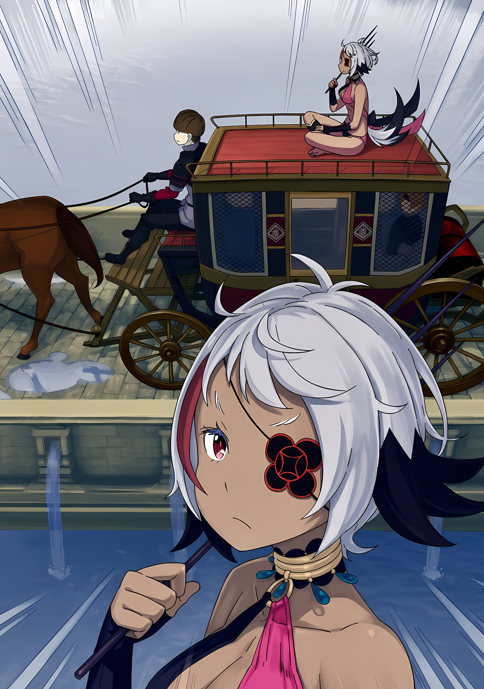
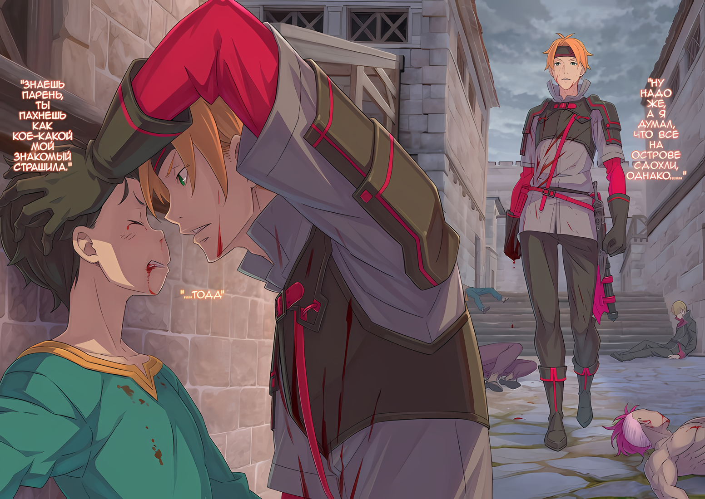

……Трудно было решить, какое событие считать главным между второй «Спаркой» и последующим грандиозным банкетом, но прошло уже три дня с тех пор, как произошло и то, и другое.

За это время на Острове Гладиаторов не произошло ничего примечательного.

Субару не понравилось и то, что не было третьей «Спарки», на которую пригласили бы новых кандидатов в гладиаторы со стороны, и не было организовано ни одной обычной мясорубки.

Обычные мясорубки были подготовкой к шоу, своего рода тренировочным матчем, чтобы гладиаторы не теряли свои силы.

Однако, несмотря на то, что это были лишь тренировочные матчи, все же существовала неизменность: вполне возможно, что те, кто терял концентрацию, в итоге становились трупами, а также были опасные люди, способные превращать в трупов независимо от того, теряли они концентрацию или нет.

И в отличие от «Спарки», даже если бы он получил наказание в связи с этими мясорубками, поскольку Субару было трудно вмешаться, это было бы большой помощью.

???: Стража ужасно нервничает. Думаю, они просто боятся тебя, брат, и нас тоже, не так ли?

Это были слова Хиайна, который последние несколько дней воспринимал атмосферу Острова Гладиаторов как приятную.

Казалось, этот ящер был очень рад, что его друзья спаслись во время второй «Спарки», и с тех пор его дружелюбие к Субару перешло в другую лигу.

Субару первый назвал его братом, а затем и Хиайн начал относится к нему как к брату.

Субару: Ну, я нисколько не чувствую себя виноватым.

Несмотря на то, что Субару был ошеломлен его эгоцентризмом, он тепло принял отношение Хиайна.

Было бы удобнее, если бы все мирно уживались друг с другом, а не находились в напряжении. Смягчение отношения Хиайна было очень поразительным, но и отношение Вайца и Идры тоже изменилось.

Вайц в значительной степени доверял ему, а Идра проявлял какое-то смутное уважение; именно так они относились к Субару.

И это изменение в отношении распространялось на гладиаторов на Острове в позитивном ключе.

И тогда……

???: Йоу, Шварц, твои глаза сегодня выглядят уверенно!

???: Ты переполнен боевым духом!

???: Стража очень жалеет о твоем присутствии. Такими темпами они потеряют всех своих Зверодемонов-гладиаторов!

Количество людей, которые разговаривали с Субару в такой веселой и дружелюбной манере, сильно возросло.

Его впечатление от этого было таким же, как и от Хиайна, поэтому Субару тепло поприветствовал его. Поскольку людей, с которыми он мог поговорить, было как можно больше, Субару было легче собрать необходимую информацию.

На данный момент, ситуация была такова, что Субару мог забыть о «Правиле Проклятия» Густава, так как информация, которую Субару хотел получить больше всего, была……

Субару: ……Башня управления разводным мостом.

Единственное средство, связывающее Остров с внешним миром. Как он мог управлять разводным мостом находясь в башне?

В данный момент, эта информация была тем, чего Субару желал больше всего.

Субару: Сама башня управления у всех на виду, но, похоже, внутрь попасть нельзя….

Эта вышка гордо возвышалась на Острове, в непосредственной близости от разводного моста.

Там не было никакой охраны, но вход закрывался очень внушительным замком, и открыть большую металлическую дверь без ключа было невозможно.

В течение последних нескольких дней они пытались найти ключ, но поскольку Густав, очевидно, сам управлял разводным мостом, вполне вероятно, что ключ находился при нем.

Субару: Хм-м-м, если сразиться с Густавом-сан, у нас, конечно, будет мало шансов.

На самом деле, сила Густава была неизвестна даже Субару.

По внешнему виду, он был оснащен четырьмя руками. Кроме того, ему было доверено управление Островом Гладиаторов, а учитывая его положение — управлять грубыми и неуклюжими гладиаторами, он никак не мог быть слабым.

Конечно, если бы они сразились один раз, он мог бы оценить, силен или слаб Густав, но……

Субару: Я не хочу усугублять положение Густава-сан…

С его точки зрения, у Субару и Густава были конфронтационные отношения как гладиатора и вождя, но лично он не испытывал неприязни к Густаву.

На самом деле, в Империи, где многие люди были довольно сложны в общении, он ни разу не повысил голос на Субару. Поэтому его впечатление о Густаве было таким, что он был ценным человеком, с которым можно было нормально поговорить.

По крайней мере, это было гораздо лучше, чем фальшивый Сесилус, который болтался на грани между другом и врагом.

Поэтому идеальным вариантом было бы пробраться внутрь и украсть ключ у Густава.

Субару: Однако я не хочу, ошиваться рядом с Густавом-сан как Сеси.

Теперь, когда правило проклятия больше не связывало его, казалось, что Густав, который был верен своим обязанностям, больше не представлял опасности для Субару в некотором смысле. Тем не менее, он не был настолько нагл, чтобы открыто искать или спрашивать о местонахождении ключа.

Худший сценарий для Субару заключался в том, что Густав сочтет его помехой, закроет его где-нибудь на Острове и не позволит ему ничего делать.

Если бы это произошло, Субару пришлось бы прибегнуть к последнему средству, оставшемуся за его моляром.

И тогда……

Субару: Придется понемногу продолжать расследование.

Почесывая голову, Субару ворчал, поджав губы от предстоящих трудностей.

Чтобы получить информацию о разводном мосте, Субару изучал людей, контролирующих его, другими словами, стражников, следящих за гладиаторами.

Стражников, следовавших за Густавом на вершине, было меньше, чем гладиаторов на острове, но их присутствие создавало впечатление, что это сильные Имперские солдаты, у которых не было места для слабости или уязвимости.

Руководство и инструкции Густава казались настолько тщательными, что даже если ребенок Субару пытался заговорить с ними, стражники становились более бдительными, а не наоборот. Возможно, это было связано с прецедентом, созданным поддельным Сесилусом, ребенком еще менее любвеобильным, чем Субару.

В любом случае, получить информацию от стражников было очень сложно.

Независимо от того, передал ли Густав информацию о том, что задумал Субару, или нет, где бы он ни находился, их суровые взгляды были направлены на него, так что, возможно, он совершил небольшую ошибку.

Хотя он и пытался разобраться в правилах проклятия, это заставило Густава насторожиться.

Субару: Если бы меня наказали не за это…… Не, не стоит об этом говорить.

Хотя размышления были важны, сожаление не приносило ничего ценного.

Сожаление было лишь тем, что он хотел сделать. Однако у Субару не было времени сожалеть о собственной глупости. Нельзя терять ни минуты, ни секунды.

Если бы один стражник отмахнулся от него, ему пришлось бы бороться с десятками, сотнями других.

Субару: Точно, один великий человек однажды сказал, что в подборе девушек главное — количество. Хотя… я и не подбираю девушек.

Сжав кулаки, Субару обратился к словам профессионалов в разных дисциплинах, чтобы помочь себе сориентироваться.

И с этим, бодро шагая по Острову, чтобы заставить стражников в каком-нибудь другом районе возненавидеть его,

???: Ты беспокойный парень, Шварц….

Субару: Что, Вайц?

Субару негромко разговаривал с Вайцем, пока тот ходил вокруг и искал стражников.

Увидев Вайца, сидящего на земле, прислонившись к стене, Субару наклонил голову. Их местонахождение было рядом с проходом, соединявшимся с гладиаторской ареной. Однако гладиаторская арена была недоступна вне «Спарки» или по случаю мясорубки, поэтому в коридоре были опущены железные ворота.

Другими словами, этот день был полон одних тупиков.

Субару: Что ты делаешь в таком месте? Прятки?

Вайц: Не знаю, что это такое, но, скорее всего, нет… Я пришел посмотреть, что происходит в подвале……

Субару: Подвал… А, вон тот.

Вайц дернул подбородком, и Субару повернулся, чтобы взглянуть в том направлении.

Прямо рядом с проходом на гладиаторскую арену находилась дверь, ведущая в подвал Острова. Как он знал, Остров находился средь озера, и поэтому подвал никуда не вел.

Скорее, он был более или менее связан с внешним миром, однако……

Субару: Это просто прямое соединение с озером, так что его назначение — выбрасывать тела, как они сказали.

Вайц: Гладиаторов и Зверодемонов-гладиаторов, погибших в мясорубках… объединяют вместе… Если бы мы проиграли, мы бы точно так же стали кормом для рыб…

Субару: От этого бросает в дрожь.

Под рыбьим кормом он имел в виду водных Зверодемонов, обитавших в озере.

Судя по всему, там водились довольно дикие существа; самой распространенной причиной смерти на Острове Гладиаторов были мясорубки, но второй по распространенности причиной смерти было то, что они становились жертвами Зверодемонов случайно или при попытках сбежать.

Если Субару не сможет воспользоваться разводным мостом, он тоже станет не более чем кормом для этих зверей.

Вайц: Ты слышал… историю о гладиаторе, который сбежал с Острова в прошлом?

Субару: А? О, да, я слышал. Я слышал, что из-за того, что он сбежал, предыдущий начальник был уволен, а новым начальником был выбран Густав-сан.

Вайц: Те плохие условия улучшились… но теперь положение гладиатора стало стабильным… Что ты думаешь…?

Субару: Что я думаю…?

Вайц: Должны ли мы… смириться с положением гладиатора, с положением, когда нами управляют…?

Субару: …………

Слова Вайца заставили Субару рефлекторно проверить, нет ли кого поблизости.

Его высказывание было совсем не в духе гладиатора с Острова Гладиаторов. Если бы это услышал стражник с плохим характером, это стало бы достаточным поводом для предупреждения.

Несмотря на это, на Вайца, вероятно, будут смотреть строже, чем на других гладиаторов, потому что он был в том же «Отряде», что и Субару.

Субару: Вайц, я думаю, тебе не стоит быть слишком осторожным в своих словах. Я не против, но мне интересно, что об этом подумают другие люди.

В этот момент Субару попытался исправить мысли Вайца.

Если бы только Субару попал в следующую «Спарку», то можно было бы найти способы справиться с ситуацией. Однако, если бы к этому добавился Вайц, уровень сложности резко бы возрос.

Но в ответ на мысли Субару, Вайц продолжил со словами «Шварц…»:

Вайц: Почему, как ты думаешь, я ходил в подвал… Это для того, чтобы я мог помочь тебе…

Субару: ……Кх.

Вайц: Ты намерен выбраться отсюда… И я тоже пойду с тобой… Я не собираюсь оставаться здесь гладиатором… Я в долгу перед тобой…

Говоря это, Вайц медленно поднялся на ноги.

Затем, на своем покрытом татуировками лице, он устремил серьезный взгляд на Субару. Под пристальным взглядом этих глаз он сглотнул слюну и напрягся.

Атмосфера была не та, чтобы шутить или обманывать кого-то.

Субару: Вайц, я….

Вайц: Я знаю, кто ты…

Субару: А?

Вайц: Но дело не в этом… Не путай меня с Хиайном и его сладкоречием… Меня не интересует корона, которую ты носишь… Я просто хочу дать тебе свою силу. Запомни это…

Волосы на теле Субару встали дыбом от слов Вайца, сказавшего, что он знает его истинную сущность. Но то, что он сказал после этого, заставило все тело Субару онеметь. Даже если Субару был никем, Вайц заявил, что выполнит свой долг и одолжит ему свою силу.

То есть, это чрезвычайно…

Субару: …Обнадеживает, Вайц.

Вайц: Хм….

Когда Субару поднял большой палец вверх и засмеялся, Вайц отвернулся и шмыгнул носом. Он воспринял эту не совсем честную реакцию с юмором, так как это было типично для Вайца.

Причина, по которой Вайц пришел исследовать подвал, заключалась в поиске способа управлять разводным мостом…… чтобы помочь Субару, который искал способ выбраться наружу.

В итоге ничего подобного здесь не нашлось, и, как и ожидалось, не было никакого способа выйти, кроме разводного моста, так что, похоже, им оставалось вернуться к первоначальному способу.

Но в тот момент, когда Субару пришел к такому выводу, что-то произошло.

Субару: ……Аа, эта тряска!

Вайц: Разводной мост….

Когда из-под земли почувствовалась дрожь, и раздался низкий звук, Субару и Вайц обменялись взглядами, придя к одному и тому же выводу.

Для большого механизма, способного потрясти весь Остров Гладиаторов, было только два возможных варианта: гладиаторская арена и разводной мост. И, поскольку проход, ведущий к гладиаторской арене, был уже закрыт в непосредственной близости от Субару и Вайца, разводной мост был единственным естественным кандидатом.

Субару: Новая группа людей….

Прибытие людей означало, что следующая «Спарка» скоро начнется.

Вайц посмотрел на Субару, который что-то бормотал про себя, ощущая жажду во рту. Поймав взгляд Вайца, он улыбнулся.

Как бы успокаивая его, что беспокоиться не о чем.

Субару: ――. Пойдем посмотрим…

Подействовала ли его улыбка или нет, и что почувствовал Вайц, сказать было невозможно, так как тот повернулся к нему спиной. Но, следуя за Вайцем, который говорил скупые слова, он и Субару поднялись с нижнего яруса острова на средний, а затем на возвышенность с видом на разводной мост.

Субару: Было бы неплохо увидеть, как открывается и закрывается вход в башню, если это возможно….

???: Шварц-сама, сюда.

Субару: Танза.

Голос молодой девушки окликнул Субару, когда тот, вытирая пот с подбородка, запыхавшись, бросился вверх по лестнице. Танза, которая достигла возвышенности раньше, махнула рукой, и Субару с Вайцем присоединились к ней.

В то время как Танза обратила внимание на Вайца,

Танза: Кажется, ты был с Вайцем-сама.

Субару: Мы случайно встретились внизу и имели неловкий разговор… А ты, Танза?

Танза: ……Я осматривала башню. Как и ожидалось, похоже, что ключ находится у Густава-сама.

Субару: Ффф, я так и знал.

Танза также знала, что для того, чтобы сбежать с острова, нужно было открыть разводной мост. Поскольку они оба знали о правиле проклятия, двое детей сговорились вместе выбраться с острова.

Однако в этот момент неожиданно вмешался Вайц,

Вайц: Если вы хотите забрать ключ… Может быть, нам стоит сражаться числом…?

Субару: Этот план ужасно недальновидный! Скорее всего, если ты попытаешься сделать что-то настолько безрассудное, то попадешь под правило проклятия.

Танза: ……А?

Вайц: Вот именно….

Недальновидное предложение Вайца было опровергнуто Субару, использовавшим правило проклятия в качестве предлога.

Услышав это, глаза Танзы расширились, и Субару приложил палец к ее губам, чтобы успокоить ее.

О том, что на самом деле никакого правила проклятия не существует, он еще никому не рассказывал, кроме Танзы. Конечно, фальшивый Сесилус, случайно оказавшийся в том месте, тоже знал, но, с другой стороны, у него не было друзей, с которыми он мог бы поговорить об этом, поэтому не было опасений, что информация распространится.

Тем не менее, Субару считал, что эта правда была бы очень пугающей, если она распространится.

Субару: Частично гладиаторы ведут себя так из-за правила проклятия.

Не было серьезных жалоб на обращение с ними, поскольку существовало правило проклятия, нарушение которого стоило им жизни.

Именно по этой причине гладиаторы в Гинунхайве так послушно управлялись Густавом. Если выяснится, что правила проклятия не существует, появятся люди, мыслящие так же, как Вайц.

Если это произойдет, начнется тотальная война между стороной гладиаторов и администрацией.

С точки зрения численности, несмотря на потери, сторона гладиаторов, возможно, победит, однако…

Субару: У каждого стражника есть Зверодемон со сломанным рогом, поэтому они могут нанести тонну урона.

Не только сами стражники Острова Гладиаторов были сильны, но и также то, что их сопровождали Зверодемоны, тоже доставляло немало хлопот.

Поскольку все гладиаторские звери, используемые в «Спарке», были Зверодемонами, которых держали стражники, оставалось еще много других, таких как лев и крыса, которых Субару и остальным было трудно победить.

Поэтому, если Вайц проявит нетерпение в этот момент, у них будут проблемы.

Танза: Мне кажется, что ждать, пока Шварц-сама победит всех Звередемонов-гладиаторов в «Спарке», не очень практично.

Субару: Это так же безрассудно, как и звучит… Во-первых, если Зверодемоны-гладиаторы пополнятся, мой дух будет сломлен. Я не планирую такую стратегию.

Танза: Если это так…

Субару: Я многое обдумал, так что не волнуйся. Ты не обязана мне верить, но, пожалуйста, доверься моим чувствам, что есть люди, которых я определенно хочу видеть.

Понимая, что секрет должен быть сохранен от Вайца, Танза замолчала после слов Субару. Она слегка опустила глаза, затем продолжила: «Те, кого ты хочешь увидеть»

Танза: Это твоя семья?

Субару: Хм? Ну, это такие же важные для меня люди, как и семья, там даже есть девушка, которая мне нравится.

Субару ответил на слегка запоздалый вопрос наклоном головы.

Услышав это, губы Танзы все еще шевелились, как будто она хотела что-то сказать. Но прежде чем она успела это сделать, Вайц указал на разводной мост внизу, сказав: «Смотрите…».

С их стороны и с противоположной, то есть с обоих концов, разводной мост был поднят, и новые жители Острова Гладиаторов ехали сюда.

Субару: Что это будут за люди…? Наверняка на этот раз это знакомые Вайца или Идры.

Вайц: Я был бы не против, если те, кто знает меня в лицо, умерли….

Субару: Пожалуйста, не говори таких одиноких и страшных ве….

В тот момент, когда он пытался сказать это, он ясно увидел карету, проезжающую через разводной мост.

Карету тянула бронированная черная лошадь Галевинд, но что-то в ней немного отличалось от той, что была три дня назад, разница была в том, насколько послушными были люди, ехавшие в карете.

В прошлый раз друзья Хиайна, Орсон и остальные, казалось, ехали в карете послушно, но в этот раз люди были не такими. .…Кто-то был на крыше кареты.

На крыше качающейся кареты, с коричневой кожей, была стройная женщина…

Субару: ……Тц!?

Как только Субару увидел это лицо и характерные черты ее внешности, он подавил крик в горле и поспешно присел. Спрятавшись за перилами, он пригнулся.

Его сердце билось с огромной скоростью, а звук крови, перекачиваемой через голову, был взрывоопасным.

Танза: Ш-шварц-сама? Что-то не так, отчего ты вдруг стал таким….

Субару: Та…

Танза: Что?

Субару: Эта… женщина… плохие новости.

Рядом с Субару, когда тот присел, Танза, также присев, расширила глаза.

Но Субару не мог позволить себе беспокоиться об удивлении Танзы.

Вайц: Женщина… Эта женщина…?

Услышав бормотание Субару, Вайц, прислонившись к перилам, посмотрел в сторону разводного моста. Даже глазам Вайца показалось, что он увидел человека на крыше подъезжающей кареты.

Вайц, похоже, не знал, кто эта женщина, но Субару была известна ее личность. И, зная это, он подумал, что сейчас самое неподходящее время для ее появления.

Эта карета, или, по крайней мере, женщина на крыше, не была кандидатом на роль следующей «Спарки».

В конце концов, личность той женщины была……

Субару: ……Я не вспомню имени… но она одна из «Девяти Божественных Генералов».

Потому что она была очень сильной женщиной, с серыми волосами и повязкой на глазу, той, кто уже однажды бушевала в Гуарале.

Иллюстрация к **Ранобэ*** Том 31 | Разукрасил -

△▼△▼△▼△

???: Новоприбывшие на этот раз не гладиаторы, а, видимо, посланцы из столицы Империи.

Таков был доклад Идры, который он услышал от стражника.

Субару и его товарищи наблюдали за прибытием карет с наблюдательного пункта, но шок, вызванный появлением женщины на крыше… этого трансцендентного врага, был слишком велик.

???: Эта женщина заметила меня и посмотрела в ту сторону….

Рядом с Субару, который тут же присел, Вайц, наблюдавший за тем, как карета пересекает разводной мост, с дрожью в голосе наблюдал за чем-то невероятным.

Им казалось, что они находятся на расстоянии ста метров, но почувствовать на себе пристальный взгляд даже оттуда было чудовищно. Субару правильно сделал, что присел на корточки, ведь та женщина смотрела в сторону Вайца, по его собственным словам.

Конечно, даже если бы она посмотрела на Субару сейчас, то, скорее всего, не узнала бы его.

Танза: Полусобака, Одна из «Девяти Божественных Генералов»… По всей вероятности, она Генерал Первого класса Аракия, я уверена.

???: Ты тоже ее знаешь, Танза?

Танза: ……Она одна из тех, кто ранее напала на Йорну-сама в Хаосфлейме. Я не видела этого своими глазами, но слышала, что она охватила пламенем целый городской квартал.

???: Ты просто безвкусно шутишь. Верно?

Хиайн попытался рассмеяться над серьезностью в голосе Танзы. Но здесь не было никого, кто мог бы посмеяться над этим.

Субару, в частности, получил значительный удар.

Субару: Люди, которые просто сильны, обычно доставляют мне больше всего хлопот.

У Субару был шанс победить, если была возможность воспользоваться преимуществом, или если с противником можно было справиться, проявив немного изобретательности.

Однако, когда дело доходило до противников со слишком большим разрывом в способностях, он терял стратегию. В конце концов, они были сильны. Дешевые трюки не действовали на сильных противников.

Это была привилегия сильного человека — растоптать все его приготовления.

Танза: Шварц-сама, пожалуйста, не будь слишком пессимистичен. Раз она посланница из столицы Империи, это не значит, что с нами что-то случится. Объявить их врагами сейчас — слишком……

Субару: Слишком рано, да. Да… да, это имеет смысл. Это абсолютно понятно, но…

Танза: …………

Субару: Я не могу не думать о худшем сценарии… Ты меня понимаешь?

Обнимая свои тонкие руки, Субару ответил это Танзе, которая подбадривала его.

Он ценил чувства Танзы, и был уверен, что она сама не хотела наживать врагов среди «Девяти Божественных Генералов». Мягко говоря, Аракия была так же сильна, как Йорна, если даже не сильнее.

Оказавшись в ловушке на таком острове, Субару чувствовал, что не сможет сражаться с таким противником на высшем уровне силы.

Хиайн: Н-но почему ты так беспокоишься, брат? Если эта партия прибыла из столицы Империи…

Идра: Хиайн, ты что, не понимаешь? Сейчас Империя расколота на две части.

Хиайн: А? А… ААА! Черт, так вот оно что….

Кроме Субару, погруженного в размышления, Хиайн и Идра тоже рассуждали с серьезным выражением лица.

Субару не совсем понимал ход их разговора, но у него не было времени беспокоиться об этом.

На самом деле, скорее всего, Субару слишком много думал.

Субару: На данный момент я не думаю, что Танза или я для этой….

Танза: Генерал Первого класса Аракия.

Субару: Для Аракии… являемся целью.

Даже если Субару и его товарищи были несколько заметны на Острове, вряд ли они были известны за его пределами. А даже если бы и были, то это был бы он, в нынешнем виде.

Было бы неразумно считать это проблемой. Даже если Ольбарт захочет что-то сделать с Абелом, он не мог придумать ни одной причины, по которой Ольбарт мог бы беспокоиться о Субару или Танзе.

Танза: Итак, с какой целью гонец прибыл из столицы Империи на Остров?

Вайц: Подумав… Возможно, из-за шоу Острова…?

Танза: Шоу… Это первоначальная цель Острова Гладиаторов.

Вайц и Танза придумали возможную причину визита Аракии.

Шоу Острова, первоначальная роль Гинунхайва, Острова Гладиаторов, заключалась в том, чтобы устраивать зрелище мясорубок между гладиаторами для зрителей, прибывших из других мест.

Это было мероприятие в дурном вкусе, но Субару слышал, что оно помогало обуздать страшные желания жителей Империи.

Хиайн: Если будет шоу, значит, они снова заставят нас драться…? Но, учитывая, что происходит восстание и повсюду паника, зачем им делать это в такое время?

Идра: Есть также идея, что это будет именно потому, что такие времена. Цель — навязать мысль, что народ Империи должен быть сильным, в ситуации, когда Империю трясет….

Вайц: Мысли Его Превосходительства Императора, ха……

Когда голос Хиайна надломился, Идра убеждал, а Вайц серьезно что-то бормотал, глаза каждого из них обратились к Субару.

Как будто они ожидали, что Субару знает ответ, но у него не было ответа. Ему ничего не оставалось, кроме как покачать головой.

Субару: Я думаю, что обе идеи Хиайна и Идры возможны. Но…

Вайц: Но?

Субару: Интересно, действительно ли Императору есть дело до этого места….

Субару уже знал, что Император, отдающий приказы в столице Империи, был подделкой.

И настоящий, и поддельный находились в Хаосфлейме, а поскольку там происходило восстание, маловероятно, что Абел вернулся без ведома Субару.

Так что, раз они прибыли из столицы Империи, то это должна была быть идея поддельного Императора. Трудно было поверить, что Винсент, фальшивый Император, который мог разработать план, практически не уступающий плану Абела, стал бы тратить свое время и энергию на бесполезные вещи.

Субару: Для этого должна быть причина, безусловно.

Какова их причина посылать одного из «Девяти Божественных Генералов» на этот средиозерный Остров, отрезанный от всего мира?

Танза: Генерал Первого класса Аракия, она ведь не ворвалась сюда с большой группой людей?

Субару: Да….

Танза: Я тоже видела только издалека, но там была одна приехавшая карета. Там было не больше пяти или шести человек. Единственный, кто из них выделялся, была Генерал Первого класса.

Субару: Это… так?

Опустив глаза, Танза споткнулась о то же самое, что и Субару, не понимая, что задумал другой.

Можно сказать, что они слишком много думают, и что им следует просто не высовываться и ждать, пока пройдет буря. Это тоже можно рассматривать как вариант.

Вайц: А если подумать с другой стороны… Спрятаться в карете, в которой ехал гонец, и покинуть Остров….

Субару: Спрятаться в карете… помнится, это уже было сделано в Хаосфлейме.

Танза: Меня вполне устроит тот же метод, если только он сработает не один раз…

Субару и Танза серьезно отнеслись к предложению Вайца. Но Хиайн, который слушал их троих, громко сказал: «Подождите, подождите, подождите!».

Серокожий ящер своим громким голосом заставил их повернуться к нему,

Хиайн: Вы серьезно думаете о том, чтобы покинуть Остров? Вы с ума сошли?! Вы умрете!

Вайц: Если ты останешься здесь, то в конце концов умрешь, сражаясь с чем-нибудь, идиот….

Хиайн: Но не сегодня и не завтра! Шварц… Брат, ты мне нужен!

Субару: Я тоже не собираюсь оставаться здесь навсегда. То есть, я не хочу оставаться тут слишком долго.

Хиайн вздрогнул, когда его большой рот, усеянный крошечными клыками, не переставал непроизвольно дышать от плана Субару. Возможно, с точки зрения Хиайна, ему было бы комфортнее жить на Острове, чем снаружи.

Не будет преувеличением сказать, что после того, как кто-то пережил «Спарку» и стал гладиатором, его жизнь вне мясорубок стала безопасной. Вполне понятно, что у человека может возникнуть соблазн думать именно так.

Хиайн: Соплячка! Идра! Будьте вы прокляты, скажите……

Танза: Как и у Шварца-сама, у меня есть свои причины не хотеть оставаться здесь дольше.

Идра: Я… я… бы тоже покинул это место, если бы мог, вот что я думаю.

Слова Хиайна, который, казалось, считал себя в неблагоприятном положении, получили такие ответы от Танзы и Идры. Несмотря на разницу между положительными и неохотными ответами, ни один из них не испытывал положительных чувств по отношению к Острову Гладиаторов.

Хотя Хиайну было трудно в это поверить.

Хиайн: Есть предел тому, насколько безрассудно ты можешь относиться к своей жизни…!

Субару: Прости, что ставлю тебя в затруднительное положение, Хиайн, но я хочу, чтобы ты тоже подумал об этом. Стоит ли тебе оставаться здесь навсегда?

Хиайн: …………

Хиайн посмотрел на Субару и остальных, его взгляд подсказывал, словно он смотрел на что-то ужасающее.

Но Хиайн знал бы это, если бы долго и упорно думал об этом. Душевное спокойствие и безопасность, которые они могли получить здесь, были лишь ступенькой, достигнутой только после того, как они пожертвовали многим.

Хиайн: ……Даже если ты сбежишь, что ты будешь делать с правилом проклятия?

После того, как он отказался от своего коленопреклоненного отрицания, это был следующий шаг Хиайна.

Невидимые цепи, сковывающие гладиаторов на Острове Гладиаторов, главная причина, по которой гладиаторы все еще оставались там…… это то, о чем упоминал и Вайц.

О том, что оно уже нейтрализовано, он не хотел говорить до самого конца. Но пока он продолжал осторожничать, Хиайн продолжал сомневаться в здравомыслии Субару и всех остальных.

Поэтому Субару решил заставить его хотя бы немного ослабить свою бдительность.

Субару: Я что-нибудь сделаю с правилом проклятия. На самом деле, у меня есть идея, как это сделать.

Хиайн: ……Кх!? Насчет правила проклятия?

Субару: Верно.

Субару кивнул с уверенным выражением лица, давая понять, что не стоит терять здесь время.

Ответ удивил не только Хиайна, но и Вайца с Идрой. Только Танза, которая уже знала, что никакого правила проклятия не существует, спокойно наблюдала за этой сценой, ничего не говоря.

Субару не мог сказать правду, но его надутая грудь здесь поможет развеять страхи Хиайна и остальных. Следовательно, Субару не мог показать отсутствие уверенности.

Даже если цели Аракии как эмиссара останутся неизвестными….

Субару: Конечно, я найду способ выбраться с этого острова. Так что… ..

Когда придет время, мне понадобится твоя сила. ……Это то, что он хотел сказать в тот момент.

Но Субару не произнес этих слов.

Точнее, продолжать их не имело смысла.

Хиайн: ……Кха

Раздался звук прерывистого дыхания, и Хиайн упал, его глаза налились кровью.

Субару: …………

Дрожащее, с налитыми кровью глазами, большое тело Хиайна перевернулось набок.

Субару не смог быстро отреагировать на столь внезапное и неожиданное событие, и не смог поддержать Хиайна, когда тот упал.

Субару: Хи…айн?

С сильным ударом тело Хиайна упало на пол общей комнаты. После падения Хиайн был неподвижен. Все, что было видно, так это его спазмы его конечностей.

В его мыслях было то, что это похоже на цикад. Цикады в середине лета, перевернувшиеся на дороге.

Хиайн умирал, двигаясь, как цикада.

……Хиайн был не единственным.

Субару: ……А

Раздался звук, легкий по сравнению со звуком падения Хиайна, и Субару ошеломленно обернулся.

Все трое, разговаривавшие с Субару, Идра, Вайц и Танза, лежали на полу, одинаково конвульсируя и дрожа.

Субару: Танза?

Он ничего не понимал. Он ничего не понимал, и поэтому не мог реагировать.

Присев рядом с упавшей Танзой, он перевернул ее обмякшее тело. Из глаз Танзы текли кровавые слезы, а сама она лежала без сил, запрокинув голову.

Кровь текла из глаз, носа и ушей, стекая струйками на пол.

Субару: ИИИ!

И тут из горла Субару вырвался визг, заставивший его уронить тело Танзы.

Он бросился проверять остальных троих. Все они перестали двигаться, из их глаз и носов текла кровь.

Субару: П….

Почему — вопросительный голос зазвучал в его голове.

Почемупочемупочему? — голова Субару кружилась, звон в ушах был очень слишком громок, его разум был полон вопросов, почему и как сцена перед ним не имела смысла.

Ощущение того, что его голова раскалывается, вот-вот поглотит Субару….

Субару: Н-нет….

Субару поднял голову, одновременно держась за нее.

Резкая, сильная боль пронзила его голову, и из носа Субару потекла струйка крови. Звон в ушах не прекращался, и также было ощущение, что кровь вытекает наружу.

Последовательность событий была иной. Субару страдал от той же боли, что и Танза и остальные, хотя и медленнее.

Он задавался вопросом, что это значит.

Субару: Это… не имеет смысла…

Опираясь руками о пол и стену, Субару сумел встать. Он встал и вышел в коридор, чтобы посмотреть, что происходит.

Внутри комнаты Танза и остальные были уже вне всякой надежды. И не только Танза и другие были вне всякой надежды. Их было больше, гораздо больше.

Субару: …………

Соседний общий зал, проходы здесь и там, главный зал, разводной мост…… все в них были лишены надежды.

Хромая на ноги, с неморгающими глазами и с ощущением, будто содержимое его головы вытекает из ушей, Субару, одежда которого была вся в крови, оглядел Остров.

Все были мертвы. Абсолютно все были мертвы.

Они все были мертвы, кровь текла из глаз, носа и ушей. Они все были мертвы. Мертвы.

Субару: Почему?

Так внезапно гладиаторы, стражники и все остальные без исключения умерли.

Все, и так внезапно.

Субару: Почему?

Все исчезли. Внезапно, неожиданно.

Не в силах поверить и принять это, ему не оставалось ничего другого, как попятиться и спросить.

Кому, если интересно, то небу. Если не небу, то воде.

Субару: Поч……

???: ……Эй.

Внезапно кто-то ответил на голос Субару, на который никто не должен был ответить.

Внезапно, без предупреждения, Субару был оставлен на Острове, где все резко умерли. У него самого шла кровь из носа и ушей, что заставило его забеспокоиться. Страшно.

Поэтому, услышав голос того, кто мог бы дать ему ответ, Субару обернулся, а затем.

???: ……Эй ты, что ты делаешь в таком месте?

Там стоял человек, который заставил Субару мгновенно замереть, сразу же после того, как заставил его почувствовать себя спасенным.

△▼△▼△▼△

???: Ну надо же, а я думал, что все на Острове сдохли, однако….

Говоря это, человек с черной банданой хрустнул суставами на шее.

С ярко-оранжевыми волосами, собранными банданой, украшенной красными линиями, стройный силуэт имел выглядел как Имперский солдат.

На первый взгляд, его лицо производило впечатление дружелюбного человека. Однако это было ужасное заблуждение. Не обманывайте себя.

И его нежное лицо, и голос, звучавший так, словно он хотел стать хорошим другом, были полной выдумкой.

Имя человека, который сфабриковал такие вещи, было……

Субару: …Тодд.

Субару, которому якобы все труднее, хотя и незначительно, открывать ящик своих воспоминаний, хранил это имя в важном месте у себя в голове, что мог легко его извлечь.

Затем, если бы кто-то спросил, почему это имя было важным.

Тодд: ――. Эй ты, откуда ты знаешь мое имя?

Потому что, когда его окликнули этим единственным словом, его отношение изменилось на все сто. Вот почему человек, сокративший расстояние между ними, был опасен.

Делая длинные шаги, мужчина… Тодд… громоздился в направлении Субару. Даже если бы он попытался поспешно убежать от Тодда, его тело, изнемогая само по себе, не позволило бы ему этого сделать.

Его спину тут же настигли, и тело Субару с силой впечаталось в стену.

Субару: А…!

Тодд: Я точно тебя не узнаю. Я никогда не забываю лицо, когда вижу его, но это лицо мне действительно незнакомо. ……Нет.

Его лицо было прижато к стене здания, а на щеке появилось шершавое ощущение. Пока Субару корчился от непрекращающейся боли, нос Тодда приблизился к его волосам.

Тодд шмыгнул носом и почувствовал запах волос Субару.

Тодд: Знаешь парень, ты пахнешь как один мой знакомый страшила.

Цветная иллюстрация к **Ранобэ** Том 31 | Перевод неофициальный и выполнен под контекст перевода rezero7arc | Клин djoenfoej

Субару вздрогнул, когда с ним заговорили низким голосом, не понимая, о ком говорит Тодд. Это было похоже на комбинированную технику, которая смешивала ощущение, что тот, о ком он говорил, был сам Субару, с неприятными чувствами, которые возникали при встрече с Тоддом.

Если возможно, его лицо было лицом, с которым он хотел бы никогда больше не сталкиваться, так почему же тогда все происходит именно так? Почему он оказался на Острове?

Субару: Почему….

Тодд, человек, который должен был бежать из Гуарала, в этом месте?

Если подумать, при побеге Тодд забрал с собой захваченную Аракию. Он должен был это понять. Если Аракия была здесь, то и Тодд, возможно, тоже.

Подобное было абсурдно. То, что они сбежали вместе, не означало, что их совместное пребывание в следующем месте гарантировано.

Почему? Как? Мне это не нравится. Это пугает. Почему Тодд здесь?

Субару: Почему все…

Тодд: Были убиты? Эй, я не могу отвечать на такие вопросы. С моей точки зрения, то, что ты выжил, было просчетом. Ну, если я оставлю все как есть, то это будет лишь вопросом времени, но….

Субару: ……Тц.

Тодд: Время, случайность и все такое, я бы не хотел оставлять все на волю случая, понимаешь?

Когда голос Тодда прошептал рядом с его ухом, что-то холодное мягко прижалось к его шее. Это было лезвие большого ножа, который он снял с пояса.

Нож, который, казалось, можно было использовать для снятия шкуры с крупного животного, причем до такой степени, что, если его слегка дернуть, то не только шея Субару будет перерезана, но и вся голова, скорее всего, оторвется.

И, казалось, даже если бы его противником был ребенок, Тодд не стал бы колебаться.

Только….

Субару: ……….

Существовал крайне маловероятный сценарий.

Тодд не стал бы убивать Субару… Нет, он не стал бы убивать его здесь, а, возможно, отложил бы это на потом. Был вариант, что он попытается расспросить Субару о чем-то. Если бы это произошло, то все стало бы необратимым.

Все стало бы необратимым, безнадежным.

Поэтому он скорее……

Тодд: Подожди-ка.

Субару: ……Кх.

Его голова болела, кровь из носа не прекращалась.

Чувствуя, что его сознание колеблется из-за потери крови, чтобы как-то использовать последнее средство, Субару провел языком по молярам.

В следующее мгновение Тодд засунул свои пальцы в рот Субару.

Субару: ……А.

Когда в его рот против его воли насильно вторглись, Субару изо всех сил извивался. Его желудок собирался извергнуть свое содержимое. Однако, не беспокоясь ни о чем, Тодд продолжал двигать пальцами.

Затем, вместе со срыгнутой едой, он вытащил и это.

Тодд: …Что это? Не может быть, это яд?

Субару: …………

Тодд: Ойой, что ты за сопляк? Приготовить яд во рту для самоубийства, на такие случаи? С тобой должно быть что-то не так, раз ты так относишься к своей жизни.

Вытирая свои грязные пальцы об одежду Субару, Тодд нагло сказал это.

Хотя не было ощущения, что он смеется над ним. Он действительно не мог поверить в мысли Субару; именно такое ощущение вызывало его отношение.

Он как бы говорил, что самоубийство — глупая мысль.

Тодд: Наверное, это правильно. Не то чтобы меня особенно волновало, что ты страдаешь. Не стесняйся, пользуйся.

Субару: Это…

Тодд: А, если ты умрешь, то даже самоубийство подойдет. Тогда я завершу это, не испачкав свой нож.

С этим доказательством Тодд пожал плечами и вложил завернутое «Лекарство» обратно в рот Субару.

Он осторожно положил его на один из моляров, в таком положении, чтобы при сильном укусе упаковка порвалась. Тогда содержимое вытечет наружу, и жизнь Субару оборвется. Он прекрасно это понимал.

Тодд: Я не против. Лишь бы ты умер.

Схватив его за плечи, он развернул Субару лицом к себе.

С фигурой Тодда прямо перед его глазами, Субару прижался спиной к стене. Так или иначе, он хотел нанести Тодду ответный удар, но его тело быстро теряло силы, и он онемел.

Медленно, та же «Смерть», которую испытали Танза и остальные, разъедала Субару.

Но почему это происходит так медленно, он не понимал.

Тодд: Время кончается, самоубийство или нож.

Субару: ……….

Тодд: Выбирай.

Тодд поднял три пальца, требуя от Субару ответа.

Крайне, крайне молчаливо, Субару ненавидел Тодда.

Танза, Хиайн, Вайц, Идра — мертвы.

Орсон и остальные, старик Нулл, даже стражники — все мертвы.

По какой причине Тодд был жив? По какой причине Субару тоже должен был умереть?

Субару: ……кх.

В то время как эти мысли так ужасно разрывали его грудь, Субару сильно сжал моляры.

Упаковка разорвалась, и содержащееся в ней «Лекарство» вытекло наружу. Постепенно оно вливалось в щели его языка и зубов, лилось еще дальше, а затем…

Субару: ……Бхаа.

Большое количество крови наполнило его рот, и он решительно выплюнул ее в сторону Тодда, стоявшего перед ним.

В его намерениях было желание уничтожить его вместе с собой. Чувствуя месть, он думал испачкать его одежду. Однако восприятие Тодда было превосходным. Как только Субару приготовился это сделать, он отпрыгнул в сторону.

Из-за этого кровь не попала на него. Поэтому, просто выплюнув кровь, Субару рухнул.

Рухнул, рухнул, а затем, затем, затем……

Субару: Ах, аа, ааАА…!

Пока все его тело дрожало от страха, яд циркулировал с невероятной силой.

Из его носа и ушей кровь хлынула с большей силой, чем когда-либо прежде, глаза набухли, выпучились до такой степени, что казалось, они взорвутся, и в унисон плоть и кости его тела начали стонать.

Нет, это только казалось, что они стонут. Все его тело кричало.

Субару: ГХ… ГКХА… ГА… ГХЭЭЭ!

Жар был сродни жару крови. Жар был сродни тому, как если бы его погрузили в кипящий котел.

Все его тело кипело, как будто с него сняли кожу, а затем тщательно размазали по всему телу такие вещества, как васаби, горчицу и всевозможные другие острые вещества, как будто в него вонзили целую гору игл, как будто все его тело соскребли на мелкой терке, больно, больно, больно, больно.

От одной только боли он начинал хотеть умереть.

Только страдая, он начинал хотеть умереть.

Тодд: С тобой должно быть что-то не так.

Страшно сопротивляясь, как рыба, которую поймали на удочку, он шел навстречу смерти.

Глядя на Субару, тонущего в море крови, Тодд что-то бормотал. Что бы он ни говорил, Субару не мог понять, он не понимал, это больше не было тем, что он мог понять.

Он больше ничего не мог понять. Он не мог понять ничего…

Тодд: ……Если ты используешь яд, чтобы самоубиться, разве не было бы лучше приготовить такой, что не заставит тебя страдать?

Голос был далеким; его сознание помутнело.

И все же, до самого конца… до самого конца, боль, страдания, и кровь, кровь, кровь, кровькровькровькровькровькровькровькровьмногокрови……

Хлопок, брызг крови, и его глаза больше ничего не видели.

△▼△▼△▼△

???: Я знаю, кто ты…

Субару: …………

???: Но дело не в этом… Не путай меня с Хиайном и его сладкоречием… Меня не интересует корона, которую ты носишь… Я просто хочу дать тебе свою силу. Запомни это…

Все его тело пронизывала жгучая, жгучая, жгучая боль.

Как только он почувствовал, что боль внезапно закончилась, Субару оказался в прохладном месте, чувствуя холодный воздух.

И тут……

Субару: Ай, ааА…

Вайц: Шварц…?

Субару: АААААА…!!!

Обхватив свое тело руками, Субару широко открыл рот и закричал.

Он кричал, кричал, пытаясь изгнать яд изнутри себя. Он пытался изгнать яд, который больше не должен был присутствовать в его теле. У него было ощущение, что в нем остался яд, который принесет конец через смерть.

Смертельный яд, который заставит Субару страдать, заставит его страдать и обязательно приведет его к смерти.

Неважно, сколько раз он бы пробовал его….

Субару: ГХА, ХУ, АААА…!

«Смерть», вызванная этим препаратом, стала для Субару напоминанием о том, что нет легкого способа умереть; рекурсия, которую ему никогда не остановить.
