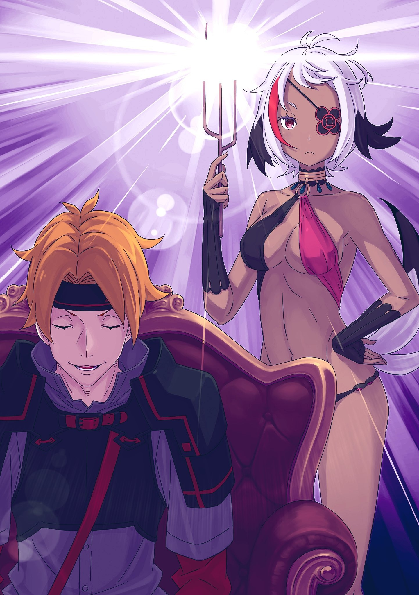

……«Правило Проклятия», которого якобы не существовало, было активировано, чтобы убить всех на Острове Гладиаторов.

То, что оборвало жизнь Субару в самый последний момент, было остротой холодного ножа.

Однако незадолго до этого ощущение медленного умирания по краям его тела разъедало Субару без остатка, работая над тем, чтобы он умер жестокой смертью.

В итоге все, кроме Субару — гладиаторы, Танза и остальные, а также стражники и Зверодемоны-гладиаторы, которые предположительно находились на административной стороне Острова, и даже Сесилус, умерли в одно мгновение по неизвестным причинам.

В качестве некоторого исключения, Субару был единственным, кто пережил его, но почему?

Возможно, этот вопрос был тем, на который невозможно найти ответ, даже если задуматься над ним.

Не было человека, у которого он мог бы спросить ответ, и он решил, что не стоит тратить на это время и мозговые клетки.

Вместо этого ему нужно было сосредоточиться на информации, которую он мог надежно собрать.

Субару: Такая реакция Тодда…… Ответ — это правило проклятия.

На грани смерти, лишенным крови мозгом, ему пришлось выбирать между двумя вариантами, но он получил правильный ответ.

Если бы Субару там не переосмыслил ситуацию, зациклившись на мысли, что это произошло благодаря магии Аракии, он не смог бы вернуться с такой уверенностью.

Именно потому, что он поразился истине, Тодд принял решение убить Субару в ту долю секунды.

Он пришел к выводу, что Субару — не ребенок на грани смерти, а риск, который он должен немедленно устранить.

Скорость, с которой Тодд переключил передачу, послужила основанием для вывода Субару, что виновником было правило проклятия.

Субару: Но почему именно правило проклятия?

Теперь, когда возможность применения ядовитого газа была исключена и появились доказательства в пользу правила проклятия, он больше не собирался допускать мысль о том, что правило проклятия было просто тактикой устрашения и не существовало.

Но если это так, то поведение Густава теперь было слишком неестественным.

Основанием для вывода Субару о том, что правила проклятия не существует, было то, что Густав не наказал его с помощью правила проклятия, несмотря на то, что Субару нарушил правила Острова Гладиаторов и опасно пытался разрушить порядок.

Конечно, Густав не хотел, чтобы гладиаторы погибли, но если сравнивать порядок на Острове с одним только Субару, то ему не имело смысла колебаться в использовании правила проклятия.

Вот почему, если подумать об этом с другой стороны……

Субару: ……Когда я провоцировал его, даже если Густав-сан хотел использовать правило проклятия, он не использовал его. Но, когда все на Острове были убиты, условия для его использования были выполнены?

На данный момент, это был тот вариант развития событий, который он мог рассмотреть с учетом имеющейся у него информации.

Субару: ……Густав-сан — враг, ха?

Поскольку было применено правило проклятия, то, по всей вероятности, начальник, Густав, был врагом Субару и остальных.

Другими словами, если Густав присоединится к Тодду и Аракии, можно будет сказать, что это три врага. Было хорошо знать с уверенностью, что Сесилус не враг, но в то же время, этого было недостаточно, чтобы он был доволен.

Ведь это правило проклятия представляло собой угрозу такого уровня, что даже лишило Сесилуса жизни.

Субару: …………

В обмен на полученную информацию в котел бросали все больше и больше плохих ингредиентов.

Можно ли было процедить содержимое котла, в котором кипит тьма, и увидеть все до самого дна?

Таким образом, что касается плохих ингредиентов, то от них нужно было избавиться.

Причина была……

???: Шварц…!

Субару: ……Тц.

???: Эта тряска….

Субару присел, зажимая грудь, на которой не было раны, только остатки шока от удара ножом.

Вайц, который беспокоился о Субару, с удивлением почувствовал дрожь, исходящую из-под его ног. Конечно, Субару знал, что это произойдет, и в чем причина этой тряски.

Он-то знал, но существовала большая проблема.

……Отсрочка до того момента, как разводной мост начнет двигаться, была короче, чем для его предыдущего повторного суда над «Смертью».

△▼△▼△▼△

Если бы он отвлекся от того, о чем не хотел думать, и заткнул уши, вопрос был бы решен, и ему не пришлось бы расстраиваться.

Но если бы он сделал это и превратил свое мышление в мышление неудачника, то не было бы никакого способа преодолеть надвигающееся поражение.

Поэтому, какой бы неприятной ни была реальность, он не мог закрыть глаза и заткнуть уши.

……Даже если эта реальность, например, заключалась в том, что точка сохранения сдвинулась на десять секунд вперед.

Субару: …………

Полномочие «Посмертного Возвращения», которой обладал Субару, давала аномальные результаты, которые особенно проявились в последнее время.

Помимо установки необычных точек перезапуска, в этот раз было небольшое расхождение во времени…… период был сокращен на десять секунд.

Это была аномалия, отличная от предыдущих случаев, в которых периоды были крайне ограничены, что делало ситуацию идеальной для подпитки чувства тревоги и отчаяния Субару.

В этот раз оно сократилось примерно на десять секунд, но не было никакой гарантии, что оно не сократится еще больше.

Если эта аномалия будет повторяться снова и снова, пока время до смерти не станет меньше секунды, или если вообще «Посмертное Возвращение» станет невозможным, что останется делать Субару?

Даже если бы он не хотел строить планы, основанные на «Посмертном Возвращении», он все равно рассмотрел бы возможность использования «Посмертного Возвращения».

Теперь, когда он стал меньше, Субару был более беспомощен, чем до того, как уменьшился. Царства этой Империи не были настолько добры, чтобы позволить ему почивать на лаврах только потому, что он был очарователен.

Поэтому……

× × ×

???: О-ои, Шварц…… Мы что, серьезно будем просто сидеть здесь?

Субару: Серьезно. Я умоляю тебя, это очень важно, не психуй в этот раз, Хиайн.

???: Я не буду! Я не буду, но….

Хиайн, находившийся рядом с Субару, стиснул зубы и не решался заговорить, его голос дрожал так сильно, что все могли понять, что он просто притворяется сильным.

Субару понимал, почему Хиайн испугался и пытался заставить его передумать.

Если их найдут, им не дадут покоя; Хиайн не понимал, почему Субару хочет совершить такой безрассудный поступок.

Однако, если бы Субару честно рассказал о последующих событиях, поверил бы он в это или нет, не было никаких сомнений, что Хиайн не станет сотрудничать с Субару.

По этой причине Субару обманом заставил Хиайна сотрудничать с ним под ложным предлогом.

Он был готов быть несколько безрассудным с Хиайном, чтобы получить информацию, которую он не мог игнорировать.

Эта информация, которую Хиайн также не мог игнорировать, была……

Хиайн: Черт, посланники из столицы Империи приехали поговорить о шоу…? Это, наверное, шутка…!

Субару: ――. Я попросил Вайца выиграть нам немного времени. Мы собираемся узнать подробности.

Хиайн: Понял, понял, правда…

Нетерпеливый и расстроенный, Хиайн был обеспокоен происходящим на Острове…… показательными мясорубками с участием гладиаторов, главной причиной, по которой был запущен Гинунхайв.

После того как он пережил «Спарку» и получил условия, в которых трудно погибнуть в мясорубке между гладиаторами в целях тренировки, самой большой угрозой для его жизни было бы проведение такого мероприятия.

Ложно утверждая, что у него есть информация о предстоящем шоу, Субару попросил помощи у Хиайна.

Как результат……

???: ……Входите. Позвольте мне выслушать вас.

Строгий голос, звук открываемой двери эхом разнесся по комнате.

Две бревенчатые руки распахнули вход, и атмосфера стала тяжелой от возвращения хозяина комнаты.

Субару: …………

Субару закрыл рот, когда они вошли, и потрепал Хиайна по плечу. Хиайн тоже ответил молча, как бы решаясь на ситуацию, из которой они уже не могли выйти.

Это было вполне естественно. Субару и Хиайн больше не могли позволить себе оплошать.

Причина в том, что……

???: Генерал Первого класса Аракия, и….

???: Тодд.

Прямой женский голос ответил на слова Густава, человека крупного телосложения, открывшего дверь. В этом коротком, нелицеприятном ответе прозвучал намек на натянутую улыбку,

Тодд: Рядовой Первого класса Тодд Фанг. На время, пока это задание не будет выполнено.

Так звучал голос мужчины, словно сокрушая самую душу Субару.

Не обращая внимания на чувства Субару, два человека, которых вели…… Тодд и смуглокожая женщина с повязкой на глазу… Аракия, вошли в комнату.

Это был кабинет Густава. Комната, в которую Субару также был вызван для строгого предупреждения на днях; Тодд и Аракия вошли туда, как эмиссары из столицы Империи

Тодд: Для человека с такой должностью, как губернатор, это ужасно простая комната.

В центре комнаты, стоя сбоку от дивана для гостей, Тодд осмотрел свое окружение.

Признаться, вещей в комнате Густава было немного. С рабочим столом и книжным шкафом, можно сказать, что это была комната, которая соответствовала своему названию «кабинет» и не содержала ничего, кроме самого необходимого для выполнения его работы.

Было понятно, почему он обратил внимание на этот момент. Но Субару хотел бы, чтобы он не смотрел по сторонам.

И уж тем более, не смотреть в сторону книжной полки в углу комнаты.

× × ×

Густав: ――. Это кабинет. Я собрал все, что мне, в моем качестве, необходимо. Вы здесь, чтобы провести инспекцию?

Тодд: Вовсе нет, я всего лишь помощник Генерала Первого класса Аракии. «Генерал» очень щепетилен и не имеет никаких подчиненных, кроме меня.

Аракия: Немногочисленно, но из числа элиты.

Тодд: Слыша, что я элита, я чувствую, что оценка немного невежлива по отношению к начальству.

Тодд пожал плечами в сторону Густава, который закрыл дверь в свою комнату и направился к своему рабочему столу. Тодд медленно сел на диван, выражение его лица не изменилось от последующих слов Аракии.

Отведя взгляд от книжной полки, Субару внутренне вздохнул с очень, очень большим облегчением.

Это был немыслимо напряженный момент.

Сколько бы он ни думал об этом, но тем, кто перекрасил худшую ситуацию в страх, был Тодд.

Вот почему он от всего сердца боялся, что его снова могут заметить.

……За книжным шкафом, прикрываясь Хиайном, маскирующимся под окружающий пейзаж, Субару внимательно слушал эту ситуацию.

Субару: …………

Субару попросил Вайца задержать прибывающую карету, и в это время он и Хиайн проникли в кабинет Густава, спрятавшись с помощью маскировки.

Хотя прецедент успешной задержки был, можно ли обнаружить камуфляж или нет, нельзя было узнать, не попробовав. Он думал, что понял механизм маскировки Хиайна благодаря первой «Спарке» и их последующим разговорам, но его уверенность в этом была совсем другим делом.

Точность маскировки Хиайна в большей степени зависела от его нервов, когда он оставался неподвижным, а не от состояния его разума и тела. Если бы у него хватило мужества оставаться неподвижным, он был бы почти невидим, растворившись в пейзаже. Он мог бы обнять маленькое тело Субару, чтобы тот же эффект распространился и на него.

Однако, стоило ему пошевелиться, как маскировочная чешуя стала бы беспорядочной, превратив его в подобие ребенка, играющего в прятки; они оказались бы на виду у всех.

В борьбе с этим львиноподобным Зверодемоном-гладиатором его пугливая натура не раз приводила его к смерти. Слабое сердце Хиайна мешало его сильным сторонам.

……Однако, маскировка, которую он сейчас применял, должна была устранить эти слабые стороны и улучшить их.

*«Субару: Если они не найдут нас, нам не придется беспокоиться о том, что они что-то с нами сделают. Прибывшие эмиссары — Одна из «Девяти Божественных Генералов» и ее остроглазый замкомандир, но пока твой камуфляж не дрогнет, все будет в порядке. Кроме того…»*

*«Хиайн: Кроме того…?»*

*«Субару: ……Я буду с тобой.»*

Перед тем, как они вошли в кабинет, Субару посмотрел ему прямо в глаза и сказал это.

И хотя это были слова дерзкого ребенка с короткими руками и ногами и еще не ставшим глубоким голосом, они дошли до Хиайна, жизнь друзей которого он спас. И действительно, казалось, они нашли отклик у него самого.

……Вот почему «Впервые» камуфляж Хиайна остался незамеченным.

Что же Аракия и заместитель командира Тодд прибыли на Остров, чтобы обсудить с Густавом, помимо этого момента? Это был первый случай, когда разговор мог начаться.

Густав: Генерал Первого класса Аракия, не хотите ли присесть?

Аракия: ……Я постою. Поскольку я не могу сесть.

Густав: Вы не можете сесть?

Аракия: Кажется, с тех пор, как я приехала на Остров, произошло много разных событий. Думаю, это потому, что рядом находится гнездо дракона.

Даже когда ей предложили присесть, Аракия покачала головой и осталась стоять. Ее второй помощник, Тодд, сидел на диване, а Аракия стояла позади него.

Несмотря на это, картина Тодда с его начальником за спиной не показалась Субару неуместной, возможно, потому, что он слишком хорошо представлял себе Тодда как кого-то очень сильного и грозного.

Как только камуфляж Хиайна слегка исказится, он сразу же пойдет на убийство, поэтому невозможно было не опасаться такого человека. Но….

Густав: Если вы не против, то для меня, как для официального лица, это не проблема. Итак, цель вашего визита….

Тодд: Я ценю возможность сразу приступить к работе. Мы тоже не хотим затягивать. Генерал Первого класса, разрешите передать письмо?

Аракия: Делай, что считаешь нужным.

Тодд: Я вам благодарен. Губернатор, это письмо из столицы Империи, от премьер-министра.

Пока Аракия стояла буквально как декорация, Тодд достал письмо из кармана и передал его Густаву. Теперь, в руках Густава, письмо было запечатано соответствующей восковой печатью, чтобы указать отправителя.

Хотя Субару не смог подтвердить наличие оттиска печати.

Субару: Империя… Премьер-министр….

Когда Тодд объяснил, кто доверил им письмо, от его слов у Субару пересохло на языке.

Как он помнил, согласно тому, что Субару слышал от неприятного Абела, человек, занимающий пост премьер-министра, был одним из главных виновников того, что Абела изгнали из столицы Империи.

Густав получил письмо от злобного премьер-министра, который прогнал императора с плохим характером. Более того, тот, кто доставил письмо, был дьяволом в облике человека…… Тоддом.

Учитывая резню, которая произойдет на Острове Гладиаторов после этого, это письмо было не более чем плохим предчувствием.

Тодд: Верховный граф Густав Морелло, я слышал, что вы были назначены на этот Остров в качестве губернатора по приказу Его Превосходительства Императора Винсента Волакии.

Густав: В вашем понимании нет никаких расхождений.

Тодд: Даже если это было по приказу Его Превосходительства Императора, такая ненавистная работа, как управление Островом Гладиаторов Гинунхайв, не подходит для такого человека, как кровный родственник героя Волакии, Кургана Восьмирукого.

Словно в подтверждение предчувствия Субару, атмосфера в комнате наполнилась желанием убить.

Причиной тому была грубая, бессвязная манера Тодда говорить. И Субару знал, что именно разозлило Густава, основываясь на их предыдущих встречах.

Причиной гнева Густава было, в большей степени, чем то, что было сказано о нем самом……

Густав: ……Таким образом, вы сомневаетесь в благородном суждении Его Превосходительства Императора?

Этот гнев был вызван нелояльностью к его превосходительству императору, или, другими словами, нелояльностью к Абелю, который был Винсентом.

× × ×

Тодд: …………

В ответ на суровый взгляд Густава, Аракия внезапно выстроилась рядом с Тоддом.

По лицу Аракии не было видно, о чем она думает, но одно это действие заставило Субару подумать, что крайняя лояльность Густава будет подавлена силой.

Однако, сказав «Генерал Первого класса» и подняв руку, не кто иной, как сам Тодд, остановил угрозу в виде Аракии.

Тодд: Только что я зашел слишком далеко со своими словами. Гнев губернатора оправдан.

Аракия: ……Но я не позволю тебе умереть. Ты должен отомстить за своего друга. Верно?

Тодд: ――. Конечно, верно. Сейчас это цель, ради которой я живу.

Несмотря на порицание Аракии, на лице Тодда отразилась грусть, когда он отвечал.

Месть за своего друга, так Аракия указала на Тодда; Субару не мог не изогнуть губы, стараясь не пропустить ни единого слова, сказанного им.

Тодд и месть — это были слова с такой ужасно плохой сочетаемостью.

Субару не знал Тодда достаточно хорошо, чтобы так говорить, но он предполагал, что это означает, что у Тодда есть люди, которые важны для него.

Пренебрегая своей невестой, несмотря на то, что так сильно хотел ее увидеть, он приехал на этот Остров, чтобы убить много людей.

Тодд: Простите за необдуманные слова, губернатор. У нас с Генералом Первого класса Аракией есть некоторые внешние проблемы. Из-за этого мое поведение было неадекватным. Я приношу свои извинения.

Густав: ……Я принимаю ваши извинения. Но, заходя слишком далеко в своих словах, вы можете навлечь на себя беду.

Тодд: Что касается этого, то это больно слышать. Я очень, очень хорошо это понимаю.

Тодд, который сдерживал Аракию, сделал горькое лицо на совет Густава. Не обращая внимания на реакцию Тодда, Густав взломал толстыми пальцами сургучную печать и открыл письмо.

Премьер-министр Империи, человек, ответственный за нынешний хаос в Империи, содержание его письма было….

Густав: ……Это…

Тодд: Это было намерением моего невежливого разговора ранее, я не хотел обидеть. Я просто хотел сказать, что если губернатор устал управлять Островом Гладиаторов, то это совершенно нормально.

Когда Густав пробежал глазами по письму, на его каменном лице появились мелкие морщинки.

Густав пробежал глазами по письму и вырезал маленькие морщинки на своем похожем на камень лице. Тодд закрыл один глаз, так как ему показалось, что на настоящем камне появилась трещина, и эта трещина распространяется.

Оставив Аракию молчать, Тодд продолжил, выглядя так, словно он был главным представительным эмиссаром.

Тодд: Гладиаторы этого Острова могут стать причиной внутреннего конфликта. В соответствии с пожеланиями Его Превосходительства Императора, они должны быть уничтожены, все сразу.

△▼△▼△▼△

× × ×

Непринужденно и бесстрастно, словно речь шла о выносе мусора в день уборки, Тодд обратился к Густаву с настоятельной просьбой избавиться от гладиаторов Острова Гладиаторов…… нескольких сотен человек.

Субару: …………

Единственная причина, по которой Субару смог смириться с тем, что прогноз худшего исхода оказался верным, заключалась в том, что он уже видел резню, фактически убившую всех на острове, и отныне закалил свое сердце.

Поэтому было просто чудом, что Хиайн, узнав неожиданную информацию, не закричал.

Хотя правильнее было бы сказать, что он был слишком ошеломлен, чтобы понять ситуацию.

Субару: …………

Этот одинокий голос был настолько лишен всякого ощущения реальности, что Хиайн забыл даже пошевелиться.

Однако, несмотря на то, что им удалось пройти мимо, благодаря счастливой случайности — маскировка не была сорвана, Субару не мог не сжать коренные зубы.

Эта просьба привела к активации правила проклятия, которое должно было убить всех на Острове.

Как он и боялся, Тодд, Аракия и, наконец, Густав стали его врагами.

Пока он не сможет остановить этих троих от совершения этого отвратительного поступка, он не сможет предотвратить эту бойню.

Густав: Боязнь внутренних конфликтов, говорите….

Тодд: Внутренние конфликты — это внутренние конфликты, это то, что своей наглостью омрачает благосклонное влияние Его Превосходительства Императора. Как бы то ни было, премьер-министр не верит, что это то, что скрывает Густав. Преданность губернатора — это настоящее дело.

Густав: …………

Тодд: По этой причине, это должно вызывать в вашем сердце муки. Мне сказали, что с тех пор, как губернатор был назначен на этот Остров, качество гладиаторов, представленных на представлениях, несравнимо с тем, что было раньше.

Приказывая избавиться от этих гладиаторов, Тодд всем своим видом выражал признательность за работу Густава.

Когда он посмотрел на письмо, выражение лица Густава не изменилось. Как же слова Тодда нашли в нем отклик? Субару не понимал, что происходит.

Густав: ――. Снизив риск ненужных смертей, позволив им получить основы умения сражаться, и заставив их стоять бок о бок, а не переигрывать других, качество выживших гладиаторов улучшится.

Но, по мнению самого Густава, управлявшего Островом Гладиаторов, в тоне его голоса, когда он спокойно отвечал, чувствовалось что-то похожее на гордость.

Вместо того чтобы превратить гладиаторов в простое зрелище, Густав обучал их, воспитывал и реформировал правила Острова, чтобы завоевать расположение Императора и его подданных.

Вероятно, мягкость, сродни привязанности или нежности по отношению к гладиаторам, там не присутствовала.

Это было решение Густава как человека, назначенного на должность губернатора, и только.

Аракия: Закончили? Говорить.

Итак, Аракия спросила Густава, который, закрыв глаза, положил все четыре руки на стол, на котором лежало письмо.

Это был бестактный вопрос, полностью игнорирующий течение разговора, на который Субару мог бы отреагировать гневом и покрасневшим лицом, будь он на месте Густава.

Но Густав не стал возражать, и Тодд просто принял это как данность.

Тодд: Я слышал о правиле проклятия, которое было бы очень удобно для утилизации. Похоже, что у вас есть инструмент проклятия, данный вам Генералом Первого класса Груви Гамлетом, из «Девяти Божественных Генералов». Используя его, вы можете получить их всех одним махом, ну… или не махом)

× × ×

Густав: Конечно.

Тодд: Тогда это будет быстрое дело. Давайте покончим с этим и вместе вернемся в столицу Империи. Нам понадобится время, чтобы подготовить новых гладиаторов, поэтому придется, видимо, на время закрыть Гинунхайв….

Тодд заговорил так, как обычно говорят в конце урока, убирая все использованные принадлежности. Отсутствие серьезности в его речи мешало Хиайну перезагрузиться, его мышление все еще было отключено.

Однако, даже если Хиайн еще не переосмыслился, казалось, что времени до смертного действия оставалось все меньше.

Если Густав активирует правило проклятия в соответствии с письменным указом Тодда и Аракии, последует полное уничтожение.

Зная, что это было капризное и неостановимое будущее, единственным способом остановить его было для Субару сделать шаг прямо сейчас. Но как именно он должен действовать?

Он уже прекрасно понимал, что если он будет действовать без плана, то его убьют на месте.

С другой стороны, даже если бы они попытались взять того, кто, вероятно, мог использовать правило проклятия, Густава, он был значительно сильнее и Субару, и Хиайна.….

Густав: ……Я отказываюсь.

Густав отклонил требования Тодда и Аракии, чтобы воспользоваться этим. Воспользоваться.

Преимущество, воспользоваться преимуществом, что бы это было?

Тодд: ……Что?

Субару, отчаянно пытаясь разобраться в своих мыслях, путался в них так же, как и Хиайн.

В отличие от Субару, который потерял ход мыслей, голос Тодда был бесстрастным и резким.

Субару почувствовал, как атмосфера в комнате стала более густой и вязкой.

Это изменение температуры в корне отличалось от того, когда Густав оскорбился на манеру говора Тодда. Дело было не в жаре или влажности атмосферы, скорее изменился сам ее цвет.

Окутанный в эту атмосферу, глядя на Густава, который положил руки на свой стол, Тодд сказал:

Тодд: Есть ли какие-либо расхождения между содержанием письменного указа и тем, что вы поняли с нашей стороны?

Густав: Нет. В письме содержится та же информация, которую вы мне только что сообщили. Имя премьер-министра и его печать напечатаны правильно.

Тодд: Если это так, то какие намерения вы выражаете?

Раскинув руки, Тодд спросил об этом Густава, который отмахнулся от его требований.

Субару тоже ничего не понимал в происходящем. Густав отверг требования Тодда, привезенные из столицы Империи, нейтрализлвать всех гладиаторов на Острове Гладиаторов, используя правило проклятия.

Но почему? Причина этому……

Густав: ……Как официальное лицо, я получил приказ от Его Превосходительства Императора. «Готовясь к чрезвычайным ситуациям, старайся развивать гладиаторов, обученных как телом, так и разумом».

Тодд: Печать премьер-министра отражает волю Его Превосходительства Императора. Вы хотите сказать, что из-за того, что она противоречит твоему предварительному приказу, вы не можете принять решение? Ведь письменный указ — это реальная вещь.

Густав: Я не подозреваю подлога. Я принимаю его как письменный указ премьер-министра.

Тодд: ……Но это все равно не стоит рассматривать?

Нахмурившись, Тодд перевел свой проницательный взгляд на Густава, которого он не мог понять.

Только на этот раз Субару разделял мнение Тодда. Хотя он и был благодарен Густаву за то, что тот отмахнулся от его требований, он не имел ни малейшего представления об истинных мотивах, стоящих за этим.

Затем, на глазах у Субару и Тодда, которые были в одинаковом недоумении, Густав продолжил.

Густав: От Его Превосходительства Императора я получил прямой приказ.

Тодд: Как я уже сказал, письменный указ отменяет это и приказывает вам подчиняться следующим приказам….

Густав: Приказ Его Превосходительства Императора поступил, когда я только был назначен губернатором этого Острова.

Прерывая слова Тодда, Густав излагал основания для своего варианта. Несколько лет назад Густав был назначен губернатором Острова Гладиаторов.

Тогда……

Густав: Его превосходительство император сказал мне это. «……Даже если ты получишь приказ от меня, не ослушайся моего первого приказа».

Тодд: …………

Это, несомненно, были слова, которыми должен был руководствоваться Густав, попавший в эту ситуацию.

Эти слова предвидели, что Густав окажется в этой ситуации. Что-то вроде «надлежащей подготовки» не было адекватным ни в малейшей степени, так что это был приказ, который не мог быть установлен без предвидения.

Из-за Императора Волакии, Винсента… нет, из-за Абела, была подготовка к будущему.

Тодд: То есть, вы хотите сказать, что из-за того, что у вас есть предыдущие приказы Его Превосходительства Императора, вы не можете подчиняться нынешним приказам Его Превосходительства Императора?

Густав: Он также сказал мне, что я не должен знать причину. Как губернатор, я согласен. Независимо от того, знаю я или нет, обязанности, которые я, в моем качестве, должен выполнять, не меняются.

Покачав головой, Густав твердо ответил на вопрос Тодда.

Тодд слегка сузил глаза, встретившись взглядом с Густавом, который сохранял свою решительную позицию. Его взгляд пытался как-то убедить Густава, но по его лицу было видно, что он думает совсем не об этом.

В конце концов, у него больше не было причин тратить свои слова, пытаясь убедить решительного человека, который отказывался слушать.

Другими словами……

Тодд: Аракия. ……Переговоры сорвались.

Густав: ……Кх!

Вот так, Тодд ровным голосом обратился к Аракии.

В следующее мгновение, прежде чем возникла фатальная ситуация, Густав схватился всеми четырьмя руками за все стороны стола, собираясь поднять его и бросить в двух посетителей.

Когда мышцы его толстых, сильных рук вздулись, он легко поднял стол, который, казалось, весил около ста килограммов.…

Аракия: Плещи~и……

Иллюстрация к **Ранобэ*** Том 31 | Разукрасил -

Вместе с этим бесстрастным песнопением Аракия направила деревянную ветку, которую держала в руках, в сторону Густава.

Сразу же после этого из кончика палочки вырвалась мощнейшая струя воды, снесшая каменное лицо Густава вместе со всем остальным выше шеи, и его жизнь превратилась в смерть.

△▼△▼△▼△

Раздался сильный удар, и стол, ножки которого на мгновение приподнялись, упал на пол. Через мгновение, словно пытаясь сбросить стол всем своим существом, тело Густава, потеряв все, вплоть до шеи, рухнуло на пол.

Из раны на шее, где он потерял голову, хлынуло большое количество крови, которая безостановочно пачкала пол кабинета.

Растекающаяся свежая кровь, казалось, настаивала на скорой смерти Густава, которая не ощущалась реальной.

Тодд: Люди племени Многоруких точно такие же, независимо от того, сколько у них рук. Одной головы всегда достаточно.

Тодд хрустнул костями в шее, глядя на мертвого Густава. Затем он оглянулся на Аракию, которая пристально смотрела на кончик своей ветки, и спросил «Что случилось?», наклонив голову.

Тодд: Не может быть, ты же не можешь быть удивлена своей собственной силой, верно?

Аракия: Неверно. Но я удивлена… Столько силы… от простой воды.

Тодд: О, это, ага. Если ты нацелена на толпу людей, которые разбросаны, то огонь лучше, но если твой противник — один человек, то вода определенно лучше. В следующий раз просто помести один стакан воды или около того в голову противника, этого будет достаточно.

Аракия: Поняла… Тодд?

Предлагая какие-то пугающие вещи, Тодд подошел к трупу Густава. Вскинув брови, Аракия окликнула его, который достал из кармана большой нож.

Не отвечая на ее зов, Тодд обошел труп, лежащий на столе, и, не щадя ножа, всадил его в толстую спину, вертикально разрезав ее.

Это был метод, не щадящий никого, как при разделке рыбы.

Из шеи вытекло большое количество крови, но струи крови из уже мертвого тела были минимальными; несмотря на это, купаясь в немалом количестве крови, Тодд препарировал тело Густава.

Субару: …………

Рефлекторно отведя глаза от этой сцены, Субару осознал, что его самого бьет дрожь.

До сих пор Субару считал Тодда страшным врагом, но впервые он видел его вовлеченным в такое гротескное поведение. ……Подумать только, он мог взять человека и расчленить его, словно животное.

Насилие Тодда было неизменно направлено на устранение врагов и опасности.

Если ему так нравилось осквернять трупы, то Субару задался вопросом, каждый ли раз, после того как Тодд убивал его, его собственный труп осквернялся таким же образом.

При этих мыслях невыносимое чувство ужаса и отвращения охватило все его тело.

Среди неприятных звуков, от которых хотелось заткнуть уши, Субару не мог этого сделать.

Даже в сценарии, который заставлял его инстинктивно убивать свои эмоции, он никогда не знал, что может скрываться там. Возможно, когда он убегал от Тодда, если поблизости были трупы, то он мог отвлечься на них.

И почему он думал о такой глупой вещи….

Тодд: ……Вот оно.

Аракия: ……? Что это?

Внезапно этот неприятный влажный звук оборвался, и разговор Тодда и Аракии переключился что-то на другое.

Аракия тоже понизила голос из-за вульгарного вкуса Тодда, на что Тодд ответил довольно равнодушно, вытирая кровь, брызнувшую на щеку, тыльной стороной ладони.

Тодд: Это инструмент проклятия, типа… инструмент проклятия. Я посчитал, что такой человек, как он, будет держать его каким-то образом в своем теле.

Аракия: Инструмент проклятия….

Тодд: Он необходим для активации правила проклятия… А, ничего страшного, если ты не знаешь. Как бы то ни было.

Во время этих слов Тодд вытащил из тела Густава то, что оказалось черной сферой, которая была вмонтирована в его большое тело.

Шар, который Тодд назвал инструментом проклятия, был размером с мяч для гольфа, не больше.

Тем не менее, это был инструмент проклятия, необходимый для активации правила проклятия.

Другими словами……

Тодд: Пока у меня есть эта штука, неважно, жив ее владелец или мертв. ……Он точно сделал глупость.

Размахивая инструментом проклятия в руке, Тодд отошел от спины трупа Густава, который при героических обстоятельствах лишился головы, взывая к нему.

В его голосе не было ни жалости, ни сочувствия. Вместо этого в нем звучали нотки безразличия и отвращения.

Тодд: Странно, что ты думал, что можешь соревноваться с монстром.

— пробормотал Тодд, наклонив голову, предположительно имея в виду Аракию, который убил Густава за один вдох.

Однако ни Густав, потерявший свою жизнь, ни Субару, присутствовавший на месте преступления, не могли не подумать, что «Монстр», о котором идет речь, несомненно, Тодд.

Субару: …………

……Так, во что бы то ни стало, он должен украсть инструмент проклятия у этого «Монстра».

Тодд: Аракия, дай мне воды. Мне нужно смыть кровь, а что касается парней на Острове….

Разорвав труп Густава, Тодд обратил внимание на Аракию, желая отмыть свой окровавленный нож и руки.

Положив на мгновение инструмент проклятия на рабочий стол, Тодд повернулся к Аракии.

……Инстинктивно Субару решил, что это должно произойти именно тогда.

Аракия: А.

И, побуждаемый словами Аракии, с открытым ртом, Тодд обернулся. Заметив ребенка, внезапно появившегося посреди комнаты и протягивающего руку к инструменту проклятий на столе, Тодд широко раскрыл глаза.

Камуфляж Хиайна подошел к концу, завершив свое действие.

Да так тщательно, что ни дотошный Тодд, ни монстр класса Аракия, не заметили присутствия Субару и Хиайна.

Субару: Хиайн!

В тот же миг, когда Субару зацепился кончиками пальцев за инструмент проклятия, он позвал Хиайна, который скрылся, слившись с полом, на котором лежал.

Однако взгляд его был устремлен совсем в другую сторону…… на вход в кабинет.

Повернувшись лицом в ту сторону, он повысил голос.

Субару: Взорвать всю комнату!!!

Тодд: ……Кх, Аракия!

Услышав напряженный крик Субару, Тодд тут же позвал Аракию. Не сводя глаз с двери, Аракия прижалась к боку Тодда.

Если бы со стороны двери последовала атака, они могли бы ответить на нее.

Однако……

Тодд: ……Это блеф!?

За одну секунду, за мгновение, в течение которого ничего не произошло, Тодд разгадал намерение Субару. Но, получив эту секунду, Субару смог выполнить свою цель.

Он схватил инструмент проклятия, и сразу после……

Хиайн: Уууууууааааа!

Завывая, Хиайн подлетел к талии Субару, схватившего инструмент проклятия, и прижал его. Сразу после этого Хиайн обнял Субару, и они врезались в противоположную от входа сторону комнаты…… в окно кабинета.

Весь вес их тел врезался в него, и Субару и Хиайн вылетели наружу, так как оконная рама была разрушена.

В момент, когда они выпрыгнули….

Аракия: Плещи~и

И, с силой, невообразимой для такого бесчувственного песнопения, наводнение опустошило кабинет.

Вода с огромным напором снесла верхний слой Острова Гладиаторов, а мебель и книжные шкафы, которые Густав, хозяин кабинета, так тщательно расставлял, были сметены без пощады.

Однако……

Аракия: Они исчезли.

Наблюдая, как предметы в комнате один за другим вылетают из разбитых стен, Аракия, ответственная за это, ступила на мокрый пол и пробормотала.

Взглянув на внешнюю сторону разрушенного кабинета, вниз, можно было увидеть белую ткань, привязанную вдоль стены.

Если ухватиться за нее и заставить руки скользить, то можно было спуститься вниз.

Аракия: Это……

Тодд: Значит, они были полностью готовы устроить нам засаду, да? ……Этот ребенок, кто он такой?

Рядом с Аракией, также смотря на стену, Тодд прикрыл рот рукой, что-то бормоча.

Сузив глаза, Тодд в задумчивости испустил небольшой вздох,

Тодд: Аракия, иди, найди инструмент проклятия. Убивать можно.

Аракия: Поняла. А ты, Тодд?

Тодд: То, что я собираюсь сделать… тебе не нужно об этом знать.

Покачав головой, Тодд отмахнулся от вопроса Аракии. Однако Аракию это не обеспокоило, и вместо этого она оттолкнулась от разрушенной стены и упала прямо вниз.

Без дешевых трюков, без какой-либо помощи, с высоты десятков метров.

А потом, проводив Аракию взглядом, когда она погналась за нарушителями, Тодд вздохнул,

Тодд: ……У этого отродья точно был отвратительный запах.

И, пробормотав это, его глаза лишились всякого выражения, он раздраженно прищелкнул языком.
