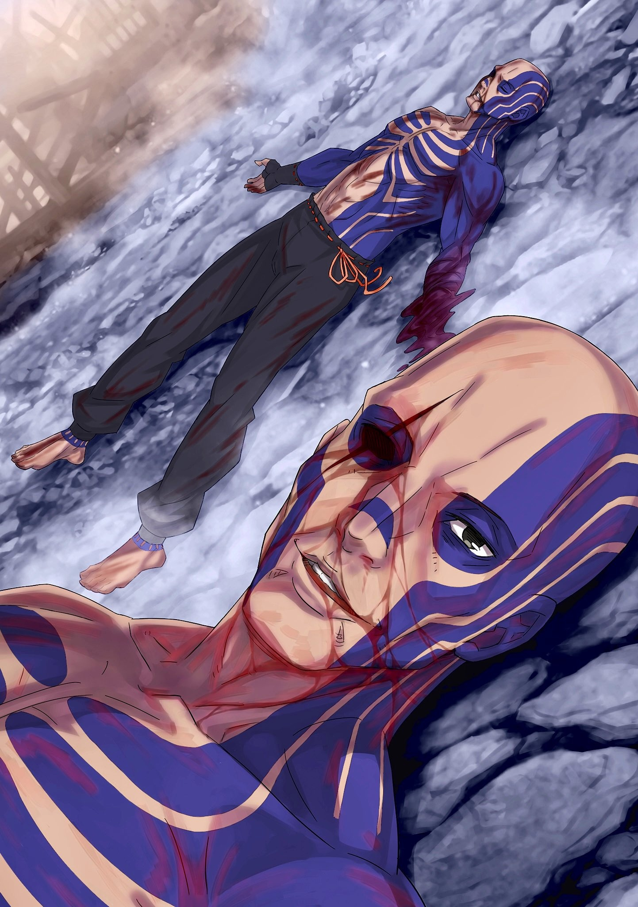

……Вайц Логун никогда не верил, что может жить или умереть честно.

Так или иначе, то, что называется обществом, имело тенденцию недооценивать слово «нормальный».

Слово «нормальный» использовалось для передачи значения «среднестатистический» или «обычный», что-то, что не выделяется, но это был недостижимый стандарт, с точки зрения тех, кто был неестественным.

Город Железа и Крови «Гларасия» — так назывался родной город Вайца, где он родился и вырос.

Это был город, где производилось оружие и доспехи, используемые во всей Империи, а также многочисленные инструменты, необходимые для сражений. Здесь ремесленники усердно трудились над созданием оружия ради того, чтобы ранить других, они ковали сталь день и ночь.

Примерно половина жителей была вовлечена в производство оружия в той или иной форме, и Вайц не был исключением. В то время, когда он начал осознавать окружающие его вещи, у него не было родителей, и его заставляли выполнять работу в мастерской ремесленника, поэтому он не испытывал ни интереса, ни гордости к такой работе.

Он выполнял свою работу, чтобы поесть, и работал в мастерских только потому, что место, где он родился, было Городом Железа и Крови.

Если их основным занятием было конское снаряжение, он помогал его делать, если сельское хозяйство, он таскал мотыгу.

Без всякой привязанности или интереса Вайц молча работал под пристальными взглядами мастеров, ковавших сталь. Не зная, о чем он думал, находились те, кто называл антисоциального Вайца трудягой, но большинство, вероятно, считало его загадочным и жутким парнем.

Вайца это тоже не волновало. Он не думал о том, как найти общий язык с кем-либо.

Он считал, что раз он был одинок с рождения, то вполне естественно будет одинок и после смерти.

Такое эфемерное безразличие, такой образ жизни, вероятно, не нравился другим.

Когда возникли подозрения, что материалы из мастерской, которую он часто посещал, продаются по нелегальным каналам, Вайц был первым, кто попал под подозрение.

Вайц, который часто работал в одиночку, не имея ни одного партнера, который мог бы его защитить, не располагал абсолютно никакими средствами, чтобы рассеять навеянные на него подозрения.

В конце концов, не сумев оправдаться от ложных обвинений, Вайц был привлечен к суду за преступление, о совершении которого он ничего не знал, и стал преступником. ……Первая татуировка, которую ему нанесли, была свидетельством его наказания, чтобы с первого взгляда его можно было узнать как преступника.

Люди не носили одежду с длинными рукавами, поскольку город был постоянно окутан горячим воздухом от ковки стали; поэтому его татуировки постоянно оголяли оба его предплечья.

Даже если бы он носил одежду с длинными рукавами, сразу стало бы ясно, что это потому, что он в чем-то провинился.

Как только на нем появились следы преступления, он уже не мог жить прежней жизнью.

Возможно, до этого момента его жизнь не была прекрасной, но именно тогда он отказался от идеи быть «Нормальным».

Не имея больше возможности работать в легальной мастерской, Вайц обратился к воровству для получения ежедневного дохода, начав красть материалы и продавать их через нелегальные каналы. В конце концов, он стал настоящим преступником.

……Если в кратце: его мнимый грех догнал реальность.

Когда его подозревали в продаже через нелегальные каналы, и никто не хотел слушать его версию, Вайц не был преступником. Но после этого Вайц в конце концов стал преступником.

Возможно, это было чем-то вроде неизбежности.

Вайц: Если я являюсь для кого-то отталкивающим ублюдком, меня это устраивает….

Украшенный татуировками и ставший преступником, в глазах любого человека он выглядел бы оторванным от понятия «Нормальный». Даже совершая преступления, чтобы заработать деньги, он был таким же, как и раньше; он не мог ужиться с другими.

В таком случае ему следовало с самого начала разорвать все неприятные отношения и тому подобное.

Татуировки, которые раньше были только на предплечьях, а теперь красовались на плечах и груди, были увеличены его собственными руками. Вскоре они покрыли верхнюю часть его тела, ног и даже достигли лица и головы.

Татуировки на руках свидетельствовали о преступнике, но татуировки по всему телу были признаком человека опасного, того, к кому нельзя приближаться.

Уступите дорогу, все, бойтесь и не поддавайтесь. Некогда жалкого человека, оставленного всеми и погрязшего в преступлениях, больше не было. Остался лишь некто «Неестественный», некто проблемный, которому уже нечего терять.

Вот почему……

???: ……Стой, преступная мразь! Не думай, что сможешь уйти безнаказанным!

Окруженный городской стражей с направленным на него оружием, Вайц быстро сдался.

У его ног, окровавленный и упавший, лежал кто-то из его бывшей мастерской…… из того места, где Вайц впервые стал преступником, это был человек, работавший подмастерьем у ремесленника.

У этого человека было откушено ухо, он плакал и кричал, когда текли слезы и кровь. В тот день он ложно обвинил Вайца в том, что тот преступник, и, услышав, как этот слух просочился за выпивкой, Вайц нанес ответный удар.

Выплюнув ухо, которое было у него во рту, Вайц был схвачен стражниками и брошен в тюрьму.

Вайц пользовался дурной славой в Городе Железа и Крови. Не имея ничего похожего на путь спасения, вскоре после этого было решено отправить его, как преступного раба, на печально известный Остров Гладиаторов.

Не имея желания сопротивляться, он принял это решение. Не желая сопротивляться, он пересек озеро.

В том месте, куда его отправили, его вместе с группой людей, похожих на людей с похожими обстоятельствами, заставили участвовать в церемонии борьбы с чрезвычайно страшным Зверодемоном.

*Мне все равно, что произойдет. Я не намерен умирать.*

*Неважно, кем мне придется пожертвовать, неважно, кого мне придется перехитрить, я выживу, и тогда, в один прекрасный день.*

*В один прекрасный день, со мной……*

Субару: ……Вайц! Хватай меч! Я рассчитываю на тебя!!!

*……Со мной будут обращаться как с «Нормальным» человеком; таково было его желание.*

△▼△▼△▼△

Вайц: В укрытие……!

Как только он увидел голову стражника, летящую по воздуху от удара ногой и кружащуюся вокруг него, разбрызгивая кровь, Вайц немедленно бросил Шварца, стоявшего рядом с ним, в сторону Танзы.

Одетая в кимоно, девушка, вопреки юной внешности, обладала большой силой.

Однако она еще не овладела этой силой. Сила ее тела и ее разум были несопоставимы, и полагаться на нее было слишком рискованно. ……Со Шварцем они составляли хорошую комбинацию.

Слабый телом, но сильный умом, им был Шварц. Вместе с ним, Танза, вероятно, была бы использована с пользой.

Поэтому в данный момент подтолкнуть его к Танзе, сильной телом, но слабой умом, было, предположительно, правильным выбором.

А затем, сам Вайц, исполнитель такого поступка……

Вайц: Ы-АААААА…!!!!

Выбежав вперед, он взмахнул руками и ударил головой летящего к нему стражника в пол прохода.

Обезглавить своего союзника в одно мгновение, а затем ударить по голове, чтобы она разлетелась, — этот шокирующий поступок был схемой, которая поставила мысли Вайца и остальных в тупик…… Но, похоже, дело было не только в этом.

На самом деле решения четырех человек, кроме Вайца, были на один удар медленнее, но Вайц сделал шаг.

Шварц так бдительно следил за этим человеком, так что не похоже, что это было единственной его целью.

И это произошло сразу после того, как Вайц так подумал.

Вайц: ……Кх!?

Прямо рядом с Вайцем, который смотрел на человека перед ним, взявшего в руку топор, налетела чудовищная черная птица…… Зверодемон-гладиатор, разрушив стену прохода.

Разрушив стену в полушаге позади Вайца, она также разрушила проход верхнего слоя Острова прямо рядом с ним.

Нацелившись на Вайца и остальных, летающий Зверодемон-гладиатор приблизился, чтобы зарубить…… нет, это было неправильно. Неправильно было то, что это был Зверодемон-гладиатор, но эта птица не целилась в Вайца и остальных.

Зверодемон-гладиатор: ……ШИИИИ!!!

Разбив стену и появившись, клюв чудовищной птицы пронзил голову обезглавленного стражника.

Нацелившись на голову обезглавленного стражника, чудовищная птица врезалась в проход. Он не понимал, что это значит, и у него не было времени подумать об этом.

Вайц: Я……!!!

Пока его спина была покрыта ранами от осколков стены, разорвавшейся от сильного удара, который произошел в полушаге позади него, а также от острых крыльев Зверодемона-гладиатора, стиснув зубы, Вайц не сводил глаз с человека.

Даже поинтересовавшись родословной Шварца, он не поклонился, а скорее усилил свое намерение убить — он был опасен.

Он был настоящей угрозой, не похожей на татуировки Вайца, которые только создавали ощущение опасности.

Несмотря ни на что, он остановит его.

Тодд: ………….

Увидев, что Вайц движется вперед, мужчина безжалостно сузил глаза.

По взгляду этих глаз, не произнося ни слова, Вайц понял, что его противник намерен его убить. Без паузы, увидев, как мужчина поднял топор над головой левой рукой, Вайц поднял свою собственную левую руку.

Именно на этой руке первой появилась татуировка, ставшая доказательством того, что он преступник, толчком к тому, что он попал на эту землю.

Решительно направив всю свою силу, он попытался принять удар, нанесенный этим человеком……

Вайц: Гх, гха…… кх.

Не щадя себя, размашистый топор нацелился в голову Вайца с левой стороны.

Заставляя поднятую руку двигаться по траектории, рука Вайца встретила лезвие топора не сверху, а сбоку. В момент удара кости его локтя были раздроблены, а кости верхней части руки и плеча были раздроблены вместе с плотью.

От удара и боли его зрение стало темно-красным, а левая рука окрасилась в темный цвет, совершенно отличимый от цвета татуировки

Но……

Вайц: Я выдержал……!

Он не ждал этого, скорее, сделав шаг вперед, он смог немного ослабить силу, стоящую за топором.

Это была главная причина, почему топор не размозжил голову Вайца, почему не оборвал его жизнь. С самого начала у него была сила воли, из-за которой его называли ненормальным, но он не обладал рассудительностью, чтобы соответствовать этому.

Объединение этой хватки и рассудительности произошло в результате встречи с ребенком, гораздо более безрассудным, чем он сам

Следовательно, эта встреча позволила руке Вайца дотянуться до человека….

Тодд: Не выдержал.

Со раздробленной левой рукой, он попытался схватить мужчину оставшейся правой рукой; в этот момент форма мужчины исчезла.

……Нет, форма человека не исчезла, Вайц просто не смог ее увидеть.

Выйдя из своего поля зрения, он не смог разглядеть фигуру своего противника в темном, размытом пространстве.

Произошло нечто похожее. Однако это было странно. Это было странно. Внезапно, в правой части поля зрения Вайца, часть, которую он не мог видеть, расширилась за один вдох.

Как будто что-то внезапно раздавило правую часть зрения Вайца.

???: Вайц……!!!

Не найдя исчезнувшего человека, Вайц ощутил физическое беспокойство, когда кто-то окликнул его.

Медленно повернувшись, он посмотрел назад, где находился разрушенный проход и клубы дыма. Затем он увидел голову чудовищной птицы, разрушившей проход, которая разлетелась от удара топора исчезнувшего человека.

Вайц: …………

За человеком, обезглавившим Зверодемона-птицу, он увидел четырех человек, стоявших над разрушающимся проходом.

Среди них были и те, кто рухнули, отступая, но, похоже, все они избежали столкновения с чудовищной птицей. То, что он сам почувствовал облегчение по этому поводу, Вайца немного удивило.

И хотя он был удивлен, он хотел сказать им, изумленно наблюдавшим за ним, одну вещь.

Его сломанная левая рука сильно болела. По какой-то причине правая сторона его лица тоже начала сильно болеть.

Он использовал эту боль, чтобы как-то удержать свое сознание, которое становилось все более отдаленным,

Вайц: Это был первый раз….

???: Вайц…!

Вайц: Когда кто-то сказал, что верит в меня….

Бормоча, Вайц понял, что это было то, что засело в его сердце.

Поняв это, он потерял силу в ногах и упал прямо там и тогда.

???: Вайц!!!

Услышав свое имя, выкрикнутое с таким чувством, он закрыл глаза.

По какой-то причине это было ужасно приятное ощущение.

rezero7arc | Иллюстрация **Ранобэ** Том 31 | Разукрасил @112oVic2

△▼△▼△▼△

Когда он попытался броситься к рухнувшему Вайцу, его остановили тонкие пальцы, протянувшиеся к нему.

Со слезами на глазах, качая головой, когда Субару обернулся, чтобы посмотреть на нее, девушка в кимоно не позволила Субару совершить импульсивное действие.

И затем, прежде чем он смог стряхнуть эти пальцы……

???: ………ТЩИИИИИИИ!!!

Раздался отвратительный, разрывающий уши визг, и потолок прохода был раздавлен сверху.

Прямо над павшим Вайцем проход поддался весу и рухнул с сильным скрипом; прямо под падающим потолком Вайц был поглощен, а пол провалился.

Разрушенный проход открыл отверстие в нижние пласты, и Субару стал свидетелем падения Вайца вниз головой вместе с гигантской серой лягушкой, раздавившей потолок.

Вайцу, который получил удар топором по левой руке и удар ножом по правому глазу, он обязан.

Субару: ВАЙЦ!!!

— закричал Субару, протягивая руку в сторону падающего прохода, в сторону рушащегося пола и потолка.

Вайц упал. Вайц, который бросился вперед, чтобы защитить Субару и остальных. Быстро, быстро, они должны были спрыгнуть вниз и спасти Вайца.

Тодд: Повезло, что второй тоже сдох. Зверодемонов убивать — та еще морока.

На глазах у Субару, мысли которого улетучились, Тодд пробормотал, бросив боковой взгляд на обвалившийся проход.

У его ног лежал труп обезглавленной гигантской черной птицы. Зверодемон был убит Тоддом топором после того, как он врезался в проход.

События произошли слишком быстро, чтобы Субару успел их переварить.

То, что сделал Тодд, то, что произошло на его глазах, все и вся. Пока он не разберется с ними, он не сможет думать ни о чем другом. ……Он не мог думать о Вайце.

О том, что случилось с Вайцем и что с ним стало, он был бы не в состоянии думать.

Он был не в сост…

Тодд: ……Что касается Зверодемонов, они съедят труп того, кто сломал их рог.

Субару: …………

Внезапно Тодд сказал это, положив топор на плечо.

Субару, как и все остальные, еще не до конца осознали ситуацию, сложившуюся перед ними; от слов Тодда у них перехватило дыхание, и они повернулись к нему лицом.

Поймав взгляды четырех человек, Тодд указал на мертвое тело у своих ног.

Тодд: Когда кто-то ломает рог Зверодемона, он может заставить его слушаться себя, но, похоже, за то время, что он отдает ему команды, обязательно накопится обида. Когда человек умрет, Зверодемон в отместку съест его труп. Отвратительно, не правда ли?

Пожав плечами, Тодд рассказал об этой малоизвестной экологии Зверодемонов.

Субару не хотел знать, как Тодд узнал об этом, да и сама информация была не из тех, которые ему было бы полезно знать в первую очередь.

Однако она давала адекватное объяснение тому, что там произошло.

Причина, по которой гигантская птица врезалась в проход, заключалась в том, что обезглавленный стражник был тем, кто отломал ей рог, и Тодд заранее знал, что она набросится на его труп.

Подбросив голову в воздух, он попытался сделать так, чтобы Субару и остальные были поглощены большой птицей, когда она нацелится на него.

Но этого не произошло. Потому что… потому что… потому что…

Потому… что….

Субару: Вайц.

Тодд: Он выглядел как парень, который заботился о своих товарищах. ……Поэтому он и умер.

Субару: ……А.

Неподобающе для Тодда, это было тщательное объяснение произошедших событий.

Никого не выслушать, никого не уведомить, никому не объяснить, убить, не предоставив никакой информации — таков был способ Тодда. Несмотря на это, почему он говорил без умолку, позволяя им услышать все это только что?

Дать им услышать, дать понять, чтобы разум Субару перешел к следующему вопросу.

Взаимоотношения между двумя убитыми стражниками и ворвавшимся Зверодемоном.

Как только этот вопрос был решен, мысли Субару могли перейти к следующему. Следующий вопрос был о Вайце.

О том, как Вайц умер, и что он ничего не может с этим поделать.

Субару: АА-ААААААА……!!!

Он не должен был умереть. Вайц, не должен был умереть.

Столкнувшись с ужасом, которым был Тодд, он не должен был пытаться защитить Субару и остальных. Этот монстр, который убил бы кого-то за противостояние, не должен был противостоять ему.

В конце концов, если бы он умер здесь……

Тодд: Твое выражение лица наконец-то стало похоже на выражение лица сопляка.

В тот момент, когда он понял, что Вайц умер, в голове Субару промелькнуло сожаление и нетерпение.

Видя такую реакцию, Тодд улыбнулся, словно все шло по плану, и поднял над головой свой топор.

Цель осторожного объяснения Тодда заключалась в том, чтобы дать Субару возможность привести свои мысли в порядок.

Заставляя Субару столкнуться со смертью Вайца, о которой он бессознательно старался не думать, он хотел, чтобы его сердце было разбито, чтобы превратить загадочного врага в обычное человеческое существо из плоти и крови.

Танза: Шварц-сама……!

Ноги Субару подкосились от шока, а разум Хиайна и Идры все еще не мог прийти в себя. Первой, кто сдвинулся с места раньше, чем эти трое, была Танза.

Танза увидела, что к ним приближается Тодд; раскинув руки, она встала перед Субару.

Однако Тодд нахмурился, наблюдая за поведением Танзы,

Тодд: Эй ты, ты все делаешь неправильно.

Танза: А?

Сказав это перед Танзой, который стоял на пути, Тодд упал на колени на месте. Пока глаза Танзы были прикованы к этому движению, присевший Тодд протянул руки к ее внутренним бедрам и поднял ее.

В этот момент маленькое тело Танзы взлетело вверх и было отброшено в сторону. ……Через большое отверстие в стене, разрушенное гигантской птицей, которое выходило наружу.

Танза: Ах.

Несмотря на то, что она обладала физическими способностями, немыслимыми для ребенка, она не могла бросить вызов гравитации или законам физики. Естественно, ее тело было даже не тяжелее, чем у взрослого, так как вес Танзы был весом одной маленькой девочки.

Мгновенно Танза протянула руки, но ее тонким кончикам пальцев некуда было дотянуться, и ее тело отбросило на другую сторону острова.

Тодд: Иди поиграй.

Подброшенная в воздух, крики Танзы быстро стихли, когда она опустилась вниз.

Таким образом, кроме Танзы, которая стояла на пути, теперь никого не осталось, чтобы защитить Субару и остальных от топора Тодда.

Идра: Он — Его Превосходительства Императора….

Тодд: Да?

Идра: Он сын Его Превосходительства Императора! Ты с ума сошел!?

Глядя на Тодда, который отвернулся, Идра выкрикнул это.

Глаза налились кровью, приветливые черты лица пылали гневом, он упрекал Тодда в том, что его не поколебала «Ложь» о том, что Субару — незаконнорожденный сын Императора Волакии.

Однако ответ Тодда на эту жалобу был прост.

……Бессмысленно, он просто взмахнул своим топором, чтобы размозжить голову Идры.

Идра: Сто-йуааа!

За мгновение до того, как его голова была разбита, Идра, с которого сдернули одежду, упал на задницу. Топор промахнулся и упал позади Идры, глаза которого расширились, а Субару, который дернул его вниз, поспешно покачал головой.

Это было невозможно, словами до него не достучаться. С самого начала эта угроза была ошибкой.

Субару попытался использовать легкий выход из ситуации.

В наказание за это он попал в эту ситуацию.

Тодд: Ты все-таки уклонился от удара, виноват-виноват. Однако….

Поправляя хватку топора, Тодд с выражением отвращения отвернулся в сторону. В том месте, куда был направлен его взгляд, рядом с Субару и Идрой, упавшим на спину, Хиайн замаскировался под окружающий пейзаж.

Ассимилировавшись с разрушенным полом и стенами, он не смог бы сказать, что Хиайн здесь.

Но он не мог двигаться с большой скоростью.

Тодд: Исчезновение прямо передо мной, каков твой план?

Хиайн: Шва……

Встретившись взглядом с Тоддом, Хиайн вздрогнул, и его маскировка была мгновенно нарушена.

До этого момента его ассимиляция с пейзажем была идеальной; словно часть картины была испорчена, она превратилась в нечто крайне неприглядное, на что невыносимо было смотреть.

На этот раз на картину была нанесена красная краска, которая хлынула из Хиайна.

Хиайн: …………

Получив удар топором по плечу, он пробил нижнюю часть груди, и Хиайн рухнул. Когда кровь обильно вытекла из него, маскировка его тела была разрушена, и останки серого ящера с грохотом упали на землю.

Вайц умер, Танза была отброшена оттуда, и Хиаин тоже был убит.

Один за другим, на глазах у Субару.

А затем……

Идра: Я… это дуэль… тц

Голос его дрожал, оторвав взгляд от трупа Хиайна, Идра встал.

Указывая пальцем на человека, который за мгновение до этого убил его товарища на его глазах, скрежеща зубами, лицо Идры было красным от гнева, синим от страха, и, как будто он не знал, что делать, его лицо побелело, когда он смотрел на Тодда.

В том месте, где проходила «Спарка», он сказал ложь, чтобы вдохновить Субару и остальных, а также подбодрить себя.

В отличие от дешевой лжи Субару, ложь о его титуле несла в себе идеалы.

Идра: Если ты тоже воин….

Эти идеалы Идры, идеалы, которые, возможно, были слишком идеалистичными, были преданы.

Тодд: ВАУ!

Идра: ……Кх.

Несомненно, это была слабая надежда, но предложение Идры было неистовым и искренним.

Крикнув громким голосом, чтобы перебить его, Тодд набросился на Идру, пытаясь показать себя сильным, даже если это была всего лишь бравада, в тот момент когда он был не готов. Таким образом, он всадил свой клинок во время этой неподготовленности.

Идра: Гха!

Тодд: Я не воин, я солдат.

Идра, упав на колени, поднял дрожащие руки к шее. В середине его горла застрял нож Тодда, его острый кончик торчал из задней части шеи.

Несмотря на это, руки Идры схватились за рукоятку ножа, чтобы вытащить его. И тут, прежде чем он успел вытащить его, топор вонзился в голову Идры прямо сверху.

Идра: ……Аа-х.

Идра упал вперед, и Тодд вытащил нож из его тела. Труп Идры, неуклюже упавший, и труп Хиайна выстроились в ряд, словно что-то из ночного кошмара.

Где-то далеко, под обломками рухнувших обломков было погребено тело Вайца.

Неужели что-то случилось с Танзой, которая упала с высоты и не вернулась? Это напомнило ему, что лягушка, упавшая вместе с Вайцем, предположительно тоже находилась там, внизу.

Если это так, то Танза, а также гладиаторы этого Острова….

Тодд: Что на самом деле здесь происходит?

Субару: Хм…

Тодд: Ты… действительно ребенок Его Превосходительства Императора?

Тодд, держа топор на плече, посмотрел на Субару, который опустился на землю с пустыми глазами.

Потеряв своих товарищей и не имея сил убежать, Субару, глядя на его состояние, понял, почему его держали в живых до тех пор, пока он не остался последним.

Ложь, которую Субару сказал, что он незаконнорожденный сын Императора, вбила настоящий клин в Тодда.

Он тоже рассматривал возможность того, что Субару действительно незаконнорожденный сын Императора.

Субару: В таком случае….

Тодд: Хм?

Субрау: Почему бы тебе просто не сдаться? Я действительно….

Если он рассмотрел возможность того, что Субару был его сыном, то, предположительно, оставалось рассмотреть обращение Субару и остальных.

Субару решил пойти на поводу у непонимания Танзы и остальных, использовав эту стратегию, потому что он считал, что это будет лучшим способом снова поставить его «Отряд» на ноги, и потому что это был проблеск надежды для них.

Вполне возможно, что Тодд, вместо того чтобы выбрать вариант, при котором они убьют друг друга, предпочел бы поднять белый флаг, чтобы выжить.

Но в результате этого Субару потерял всех своих товарищей, а Тодд сохранил свою жизнь.

Субару: Почему… в чем дело? Ты….

Тодд: Если я сделаю что-то вроде капитуляции, меня убьют из-за какого-то полубезумного оправдания, и я ничего не смогу сделать.

Субару: …………

Тодд: Я решил, что всегда лучше интересоваться подлинностью вопроса, когда ситуация складывается в мою пользу. Я могу посвятить все свои мысли принятию решения, и к тому же так труднее ошибиться. ……Также, это дает мне душевное спокойствие.

На последней причине, которая казалась самой важной, как выразился Тодд, Субару вздохнул.

Было такое чувство, будто все это время Тодд душил его шею.

Тодд: Неважно, незаконнорожденный ты сын Императора или нет, мне интересно твое имя.

Субару: Мое имя…?

Тодд: Нацуки Шварц, это похоже на имя одного моего знакомого страшилы. И в довершение ко всему, то, как ты пахнешь, тоже похоже на того страшного парня.

Принюхавшись, Тодд посмотрел на Субару холодными глазами.

Что-то насчет его запаха…… ему сказали то же самое еще во время первой бойни, когда он впервые узнал, что Тодд прибыл на Остров Гладиаторов.

Когда ему сказали, что дело в его запахе, в голове Субару зародилась неприятная догадка.

Субару: Ты знаешь о миазмах?

Тодд: Миазмы? А, нет-нет, не пойми неправильно. Оно действительно пахнет… запах твоего тела. У меня немного хороший нюх. Вот почему это так странно.

Субару: …………

Тодд: ……Эй, у тебя есть старший брат или типа того? Если да, то я буду рад сохранить тебе жизнь в качестве разменной монеты с ним.

Отвергнув вопрос Субару, Тодд сделал неожиданное предложение.

«Я буду рад сохранить тебе жизнь», даже подумать страшно, что такое может прозвучать из уст Тодда. Более того, старший брат, о котором говорил Тодд, по всей вероятности, был не кто иной, как сам Субару.

Он подумал, что Субару со взрослыми конечностями был старшим братом уменьшившегося Субару.

Более того, Субару, кажется, помнил, как представился Тодду, когда тот был одет как женщина, и из-за этого он мог подозревать, что Субару связан с «Нацуми Шварц».

В любом случае, если «Не убивать» стало вариантом в сознании Тодда.

Субару: …………

Смерти Вайца, Хиайна и Идры произошли прямо рядом с ним.

Если он закрывал глаза, в памяти всплывали смерти Густава и старика Нулла. Он также мог видеть смерти многих гладиаторов, видеть их останки, свидетелем которых он был по пути.

Абсолютно все были мертвы. Они погибли, затем……

……затем, чтобы не умер Субару.

Субару: ……Ты знаешь, о Братике-чан?

Воспользовавшись непониманием Тодда, он переключился на продолжение разговора.

Если Тодд был как-то осторожен с большим Субару, то, используя эту осторожность, маленький Субару мог жить.

Если он сможет выжить в этом месте таким образом….

Тодд: ……Погоди.

Субару: А?

Субару открыл рот и попытался связать несколько слов, которые помогли бы ему выжить. Тодд протянул ладонь и схватил лицо Субару, когда оно приняло выражение, и Субару мог видеть его глаза сквозь щели между пальцами.

Приседая и хватая Субару за лицо, Тодд одарил его ужасно холодным взглядом.

А затем……

Тодд: ……Эй, ты пытался манипулировать мной, не так ли?

С тупым стуком острое ощущение вонзилось в его грудь.

Почувствовав холод от острия клинка внутри своего тела, Субару расширил глаза. Затем, спустя один удар, боль, настолько сильная, что его конечности онемели; с силой, боль закричала в его затылке.

И из-за этого мощного крика, рот Субару тоже закричал.

Субару: ГГГААААА, ХЫААЭЭЭЭ!!!

Тодд: Виноват-виноват, здесь нет места беспечности или слабости.

Огромный нож глубоко вонзился в грудь Субару.

Вытащить его или не вытащить было невозможно, он был слишком велик. Он пронзил его. Пронзив его, он, вероятно, разрушил то, что было важным в его груди.

Кровь запеклась по краям его рта, и, выплескивая красную слюну, тело Субару задрожало.

Сильно закашлявшись, из его рта выпал сверток, испачканный во что-то красное.

Это не имело значения. Это больше не имело значения. Он не мог его использовать. Он не мог им воспользоваться. Умереть, он не должен умереть. Если он умрет, это будет ужасно. Если он умрет, произойдет смерть, он не должен умирать.

Тодд: Не двигайся.

Лежа, пытаясь отползти от этого места, Тодд наступил Субару на живот, пока тот говорил. Чтобы он не мог двигаться, чтобы он не мог убежать, его остановили.

Остановив его, на глазах у Субару Тодд поднял над головой свой топор.

Эту боль, этот страх, этот ужас, эту опасность, хотя бы, хотя бы… эту красноту, эту холодную боль, это… хотя бы это… он должен… остановить хотя бы это.

Субару: Я должен… не.. умереть…

Тодд: Раз… два… и три!

Слабо, но он поднял руки, чтобы защитить голову. Бесполезно.

Голова под руками Субару, и сама его жизнь, лезвие падающего топора раздробило все это…

△▼△▼△▼△

Субару: ……КХ.

Когда его голова была разбита, все, что было в ней, выплеснулось наружу.

Чувствуя себя так, как будто он наблюдал эту ужасную сцену, крик вырвался из глубины горла Субару. Протянув обе дрожащие руки, он потрогал свою голову.

Она не была разбита. Голова не была разбита, грудь не болела, жизнь не оборвалась — все было на месте.

Убедившись в этом и вздохнув с облегчением, Субару поднял голову к небу и……

Субару: ……Аа.

Там стоял человек, покрытый татуировками, который медленно повернулся, чтобы посмотреть на Субару.

Его левая рука была искалечена топором, правый глаз выбит ножом, он проливал огромное количество крови. Вайц.

Вайц: Это был первый раз….

Его губы дрожали, окровавленный Вайц произнес эти слова.

Видя это, Субару выпустил «Аа» вместе с действительно, действительно жалким глотком воздуха.

Вайц: Когда кто-то сказал, что верит в меня….

Субару: ААААААААААА……!!!!

Произнеся эти жалкие слова, тело Вайца рухнуло на бок.

Даже если бы он протянул руку, что бы он ни сделал, тело Вайца уже нельзя было спасти.

Он не должен был умереть. Субару… не должен был умирать.

Он не должен был позволить этому стать абсолютным.

Начальная линия Субару, возобновившись в точке «Смерти», продолжала двигаться вперед.…

Субару: АААААААААААА……!!!!

……до того момента, что спасти кого-то перестанет быть возможным, и «Сердце» Нацуки Субару будет разбито вдребезги.
