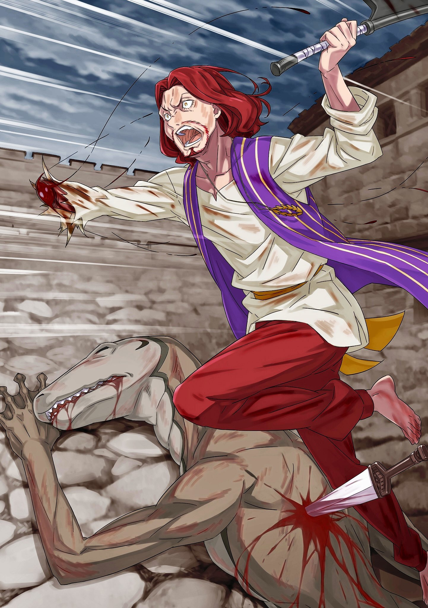

Звук шагов, звук неуклонно приближающихся шагов, парализовал сердце Субару.

Было совершенно необходимо предотвратить резню, вызванную прибытием Тодда и Аракии из столицы Империи.

Неистово, искренне, чтобы отбросить злобу и нелепость, постигшие его, он боролся изо всех сил. Он все боролся и боролся, он продолжал бороться, однако произошел наихудший сценарий.

Точка перерождения продолжала двигаться вперед, сделав точку «Смерти» настоящим временем.

На этот раз Субару больше всего боялся не самой «Смерти». Скорее, он боялся, что после встречи со «Смертью» и возвращения реальность станет абсолютной.

……Того, что чья-то жизнь, которую он не смог спасти, останется в прошлом, этого он боялся больше всего.

Неизбежная смерть кого-то, постепенно приближающаяся, — вот чего он боялся больше всего.

Субару: АААААААААААА……!!!!

Когда перед ним предстала сцена, рухнувший и окровавленный Вайц, у Субару вырвался крик.

Вскрикнув, он попытался убежать, но пальцы, торчащие из рукава, схватили его и запретили двигаться. Его схватила Танза, девушка, чьи нежные глаза были полны слез, когда она отчаянно качала головой, глядя на Субару.

Это он тоже видел. Он ведь уже видел. Он смотрел, глазел на это, это было что-то знакомое ему.

Та же сцена, сцена, которую он наблюдал всего минуту назад, он наблюдал ее еще раз.

???: ………ТЩИИИИИИИ!!!

Сразу же после этого раздался отвратительный, разрывающий уши визг, и проход был раздавлен вместе с рухнувшим телом Вайца, которое, как и было, провалилось сквозь пол вниз с горы острова.

Эти обломки, падая вниз вместе с большим телом серой лягушки, поглотили Вайца, и он исчез из виду.

Субару: Нет, нет, нет!!!

Танза: Шварц-сама!?

Бешено размахивая руками, Субару стряхнул руку Танзы. Не обращая внимания на голос шокированной девушки, Субару помчался к месту падения Вайца.

Если бы он бросился прямо сейчас, он мог бы подхватить падающего человека, забинтовать раны, которые тот носил на глазу и левой руке, обмотать его бинтами в лечебной комнате, если бы он мог просто дать всему лечение, тогда, конечно, конечно, конечно….

Субару: Еще не….

Тодд: Ты точно слабее, чем я думал.

Чтобы спасти Вайца, он бросился бежать с безрассудством.

Субару был встречен лоб в лоб чем-то замахнувшимся, чтобы сбить его с ног. Только после того, как раздался тяжелый звук, а его поле зрения начало быстро вращаться, он понял, что это было лезвие топора, окрашенное в темно-красный цвет.

В поле зрения Субару, быстро вращающемся, когда оно поднималось ввысь, он увидел тело ребенка, неуклюже бегущего вприпрыжку. Увидев, как оно покатилось вперед и рухнуло, он понял, что это было его собственное безголовое тело.

В таком случае, куда делась его голова? Что еще важнее, Вайц… он должен… должендолжендолжендолжен.

× × ×

Вращаясь по кругу, а затем резко закрепившись на одном месте, мозг Субару метался.

Его полукружные каналы, которые на самом деле не двигались, вызывали беспорядочные ощущения, с энергией, подобной яростно вращающейся камере, резко останавливающейся.

С подступающей тошнотой и замешательством, что оттуда он должен спасти Вайца, что сейчас не время останавливать ноги, что нетерпение……

Вайц: Это был первый раз….

Затем на Субару, к которому вернулось зрение, окровавленная форма Вайца пробормотала это.

Секунду спустя, фигура Вайца распалась, огромное количество крови вытекло из его левой руки и правого глаза.

Вайц: Когда кто-то сказал, что верит в меня….

Субару: ААААААААААА……!!!!

Реальность, которую невозможно отменить, сокрушительно растоптала душу Нацуки Субару.

△▼△▼△▼△

Медленно, но верно, толчки разрушения приближались.

Началась резня, и Субару, не препятствуя ей, пустился в бега.

Однако, начиная с того, что точка перезапуска сдвинулась на десять секунд вперед, период новой жизни словно сбрили, отдалив чудо; вычеркнув из сердца Субару всю надежду.

Прокравшись в кабинет Густава, он узнал правду о резне, сотрудничая с Хиайном.

Много раз они были обнаружены прежде, чем разговор Тодда и Аракии с Густавом достиг своей сути, ошибки накапливались, повторяясь методом проб и ошибок, чтобы в следующий раз…… это стало необратимым.

Точка отсчета была перенесена на тот момент, когда он прятался с Хиайном в кабинете.

Субару: ………….

С того момента Субару слышал великий голос разрушения, смеющийся в его сердце.

Нависая над Субару, он слышал биение сердца испуганного Хиайна, которое, вероятно, билось сильнее, чем сердце Субару.

Не имея возможности остановить резню, что бы он сделал, если бы точка перезапуска сдвинулась дальше?

Если точка перезапуска сделала это место невозврата, наполненное отчаянием, Нацуки Субару задался вопросом, что он может вообще сделать.

И тут….

Аракия: Плещи~и……

Вместе с этим бесчувственным голосом, Густаву снесло голову, и тогда Субару понял.

Он не должен больше умирать. Смерть и возвращение в прошлое, если это было после убийства Густава, что его жизнь больше не может быть спасена, станет абсолютной.

Если он сделает чью-либо «Смерть» абсолютной, то это уже будет равносильно тому, что Субару убьет его самого.

Позволив миру, который невозможно спасти, стать абсолютным, независимо от того, чьими руками наступила эта «Смерть», Нацуки Субару будет убийцей.

Поэтому он отчаянно пытался не умереть.

Даже если Густав умрет, даже если старик Нулл умрет, даже если гладиаторы умрут, даже если стражники умрут, даже если кто-либо умрет, он отчаянно сопротивлялся, чтобы не умереть.

Если Субару умрет, то те, кто был убит, умрут по-настоящему.

Хотя он понимал, что это неразумное предположение, Субару не мог ничего сделать, кроме как бороться таким образом.

Если Субару не умрет, оставалась возможность, что он сможет закончить дело, не дав погибшим товарищам умереть. А если он сделает это, он сможет закончить дело, не дав им умереть, вот почему……

Если он не умрет до конца вечности таким образом, он сможет закончить все, не дав никому умереть, такова была фантазия.

Такая фантазия была не более чем фантазия, жизнь Субару, который безжалостно умер, была тому доказательством.

△▼△▼△▼△

Сколько раз он уже приветствовал «Смерть»?

???: Исчезновение прямо передо мной, каков твой план?

???: Шва……

Голос, который собирался назвать его имя, прервался перед Субару, который упал на колени.

Топор, лишенный милосердия, вонзился в тело Хиайна, забрав с собой его жизнь, отчего тот грохнулся на пол с широко раскрытыми глазами.

Струящаяся кровь хлынула на пол, смешиваясь с кровью из тела Идры, упавшего ранее.

Идра, голова которого была расколота, был убит раньше Хиайна.

Субару не смог спасти его от первой атаки Тодда. Сначала был убит Идра, затем Хиайн, и, наконец, Субару снова остался один.

И все это после того, как Танза уже была отброшена Тоддом в стенное отверстие.

Мир уже был перемотан назад до того момента, когда послышались крики летящей Танзы.

Вайц, его рука и лицо были повреждены, проглоченные обрушившимся проходом вместе со Зверодемоном-лягушкой, вместе с Танзой, выброшенной наружу при попытке защитить Субару, были «Заперты» в реальности, которую нельзя было изменить.

И тогда……

Тодд: Что на самом деле здесь происходит?

Субару, который скорчился на месте, его колени были испачканы текущей кровью, задал вопрос Тодд, держа топор на плече.

Онемевший мозг Субару получил толчок, подсказавший ему последующие слова.

Вопрос Тодда, который ему задавали уже столько раз, был…

Субару: Ты… действительно ребенок Его Превосходительства Императора?

Тодд: ……Не надо предсказывать то, что собираются говорить другие.

Тодд выпустил это бормотание с тоном, выражающим недовольство, в ответ Субару, который все еще держал голову опущенной.

Он не знал, что на самом деле чувствует Тодд по поводу того, что его опередили, но Субару не казалось, что ситуация была настолько опасной, чтобы Тодд мгновенно разъярился и попытался его убить.

Не то чтобы он пытался создать ощущение опасности, это просто вырвалось из его уст в порыве паники.

Но если бы темп Тодда хоть немного нарушился……

Субару: Если не хочешь умереть, оставайся на месте.

Сказав это, Субару достал из кармана черную сферу…… инструмент проклятия, который был помещен в тело Густава. Он протянул его, чтобы показать Тодду.

Черная сфера, очищенная от крови, по текстуре и на ощупь напоминающая стеклянный шар, была гораздо тяжелее мяча для гольфа.

Из чего он был сделан и из какого материала — знание об этом не имело значения.

Важно было помнить, что в нем скрыта очень большая и жестокая сила.

Если это действительно был ключ, необходимый для активации «Правила проклятия», того, что Тодд желал, то он мог использовать его.

Возможно, это может стать для него вторым шансом быть услышанным.

Субару: Похоже, это то, что нужно для правила проклятия. Если ты не хочешь умереть… ..

Тодд: ――. Эй ты, что у тебя там….

Субару: ……Я тот! Кто говорит! Прямо сейчас!!! Я же сказал «если не хочешь умереть», ты же ведь меня прекрасно услышал, не так ли?!

Субару рявкнул, размахивая рукой с инструментом проклятия, отчего полетели плевки.

В его голове, переполненной сожалениями и отчаянием, не было места, и он не мог рассмотреть каждое слово Тодда. В нем нарастал сильный гнев, когда он просто приказывал ему делать то, что ему говорят.

Тодд: Боже правый, понял-понял.

Видя гнев Субару, Тодд издал небольшой вздох и поднял руки, опуская топор.

Субару был поражен тем, что Тодд так легко выполнил его указания. Его реакция заставила Тодда поднять бровь.

Тодд: Ты странный. Разве не ты сказал мне сделать это?

Субару: Н-ну… Не все так просто…

Не в силах возразить Тодду, Субару метался глазами по сторонам, явно смущаясь, и сокрушаясь о собственной глупости.

То, что он был незаконнорожденным сыном Императора, было ошибкой, ему следовало с самого начала использовать инструмент проклятия в качестве щита. Он был напуган и нетерпелив, поэтому решил воспользоваться легким вариантом. И из-за этого он все испортил.

Густав, Старик Нулл, Вайц и Танза…… все из-за Субару.

Все из-за того, что Субару не использовал свою голову должным образом…

Тодд: Кстати, парень, ты знаешь, как этим пользоваться?

Субару: А…?

Пока он осуждал и сожалел о собственной глупости, голос прервал его мысли.

Из-за вопроса Тодда, подняв руки, Субару издал хриплый голос и посмотрел на инструмент проклятия в своей руке. Как им пользоваться, он не знал. У него не было понятного переключателя или механизма, который подсказывал бы ему, как его использовать, просто взяв в руки.

Субару: ……Наверняка.

Тодд сразу понял угрозу по тому, как дрогнул его взгляд.

Тодд: Если бы ты знал, ты бы этого не сделал, не было бы необходимости в угрозах.

Субару: А.

Сразу же после этого Тодд отбил руку Субару взмахом ноги, его руки все еще были подняты.

Отбросив руку, державшую инструмент проклятия, черный шар взлетел прямо над головой. Субару рефлекторно проследил за ней взглядом; и снова он поступил глупо.

Смотреть вверх было то же самое, что предлагать врагу свою шею.

Субару: …………

Его взгляд преследовал летящий инструмент проклятия, пока его внезапно не прервали.

Перед самым прерыванием ему показалось, что он услышал стук, доносящийся с левой стороны от него справа, но у него не было ни возможности, ни причин знать наверняка, что это было.

И у него не было выбора, кроме как признать кое-что.

……Он не мог придумать, как остановить Тодда Фанг.

△▼△▼△▼△

……Дурак, у которого отняли все, после того как он сыграл хорошего парня и над ним посмеялись.

Так оценивали Идру Мисанга, человека, потерявшего семейный бизнес, оказавшегося на улице и ставшего рабом.

Родиной Идры была небольшая фермерская деревня на северо-западе Империи, земля, где семья Мисанга на протяжении многих поколений поддерживала семейный мельничный бизнес.

Идра слышал, что мельница была основана в поколении деда его деда, который, по-видимому, при жизни был очень искусным человеком.

Господин доверил ему управлять водяным колесом, построенным вдоль реки в деревне, и мельницей, которая её использовала, и он отвечал за помол всего зерна из деревни.

Вознаграждение было высоким, труд — низким, и Идра происходил из привилегированного сословия в глазах тех, кто был вынужден полагаться на семью Мисанга в деле помола урожая, который они производили.

Однако ни сам Идра, ни его семья не использовали свой бизнес для того, чтобы вести жизнь, которой они могли бы похвастаться.

Несомненно, они были зажиточными по сравнению со своими соседями. Но в то же время они вели себя как члены деревни, беря на себя функции, которые обычно должен выполнять деревенский староста, например, платили налоги господину от имени жителей деревни во время неурожая или напрямую шли на переговоры с господином.

……Вести дела честно и стремиться заслужить всеобщее доверие и уверенность.

Это был семейный девиз и философия семьи Мисанга как мельников.

В процессе помола с помощью водяного колеса многие прикарманивали часть зерна. Действительно, Идре и его отцу их собственные родители, руководившие семейным бизнесом, сурово говорили, что мир сурово смотрит на мельников, и именно поэтому важно быть скромным.

Поскольку у него была роль, в которой он легко мог вызвать подозрения, он всегда сохранял открытость в общении с людьми.

Никогда не монополизируя богатство, он делил радости и горести с окружающими. Даже если это не было правильным образом жизни в Империи Волакия, которая уважала сильных, это считалось правильным образом жизни в отдаленной сельской деревне, которая была недосягаема для железного и кровавого правления столицы Империи.

Идра тоже был одним из тех, кто с детства рос на его преимуществах.

Поэтому даже после того, как его тяжело больной отец рано передал ему семейный бизнес, он старался поддерживать традицию.

???: Это честная и хорошая жизнь, не так ли? Я завидую.

Завидуя жизни Идры, мужчина зашел в деревенский бар.

Мужчина, излучающий атмосферу бывалого солдата, раскрыл свою личность как наемник, который путешествовал по полям сражений с большим мечом.

Поскольку люди со стороны были редкостью, Идра разделил с ним выпивку, слушая его различные истории.

Для Идры, не имевшего особых знаний о внешнем мире, мир, о котором рассказывал мужчина, был полон сюрпризов.

В отличие от сельских деревень, где время текло медленно и мирно, мир, в котором жил этот человек, был опасным и жестоким. Но в то же время он был наполнен незабываемым теплом.

К тому времени Идра уже испытывал смутную тоску по нему.

Как человек, родившийся в Империи Волакия, он задавался вопросом, существует ли какой-нибудь другой вариант, кроме как взять на себя семейное дело, — надежда, которую он не принимал всерьез.

Жизнь воина, уважающего свою силу и веру, никогда бы не выбрала низкий образ жизни.

Мужчина: Идра, у тебя есть двоюродная сестра. В общем, я заинтересовался ею…

Идра сблизился с человеком, который приезжал в деревню каждые несколько месяцев, и каждый раз выпивал с ним.

И вот, после нескольких таких ночей, проведенных вместе, мужчина рассказал Идре об этом, сделав серьезное лицо. Его младшая двоюродная сестра все еще не была жената, и Идра мог доверять этому человеку.

Поэтому, не раздумывая, Идра познакомил его с двоюродной сестрой, создал условия для того, чтобы пара сблизилась, и отпраздновала рождение их новой семьи выпивкой в ночь бракосочетания.

Месяц спустя этот человек вступил в сговор с его двоюродной сестрой, чтобы украсть семейный бизнес по производству мельниц.

Мужчина настаивал на том, что двоюродная сестра Идры также имеет право управлять семейным бизнесом семьи Мисанга, и говорил дальнейшую ложь, что Идра и его отец, которые до сих пор работали на мельнице, подделывали результаты своего помола перед жителями деревни.

Конечно, Идра утверждал, что это не так, но подозрение, связанное с профессией мельника, не могло быть рассеяно, и мнение деревни разделилось пополам.

Прежде чем удалось договориться, его отец, который был очень болен, умер от болезни, а мать, страдавшая от сердечной боли, ушла из жизни, как бы погнавшись за ним.

Идра: У меня кончилось терпение. Я буду защищать свой дом любой ценой…!

Оплакивая своих родителей, Идра решил дать отпор, даже проклиная собственную беспечность.

Если его двоюродная сестра и этот мужчина задумали что-то гнусное, Идра непременно восстановит свои права. По этой причине Идра попросил присутствия жителей деревни, чтобы привлечь мужчину к ответственности.

Он верил, что доверие, которое семья Мисанга завоевала благодаря честной деловой практике, позволит восстановить справедливость.

Однако……

Идра: ……За что… что с этим миром?

Никто не явился в условленное место, и, напротив, в доме Идры были обнаружены приготовления к вооруженному восстанию.

Брошенный и приведенный на нежелательный суд к своему господину, Идра отчаянно доказывал свою невиновность, но никто из жителей деревни его не защищал.

Его двоюродная сестра и мужчина организовали все это.

Жители деревни предпочли честному Идре человека, который лгал, но приносил прибыль.

Не было ни малейшей надежды на победу.

Лишившись семейного бизнеса и попав в рабство, Идра был отправлен работорговцами на Остров.

Место для тех, кому больше некуда идти, ужасный Остров, где с единственным, что у них осталось, их жизнями, будут играть в игрушки. Гинунхайв.

В этом месте, где борьба за свою жизнь превращалась в зрелище, Идра почувствовал, что его сердце впадает в отчаяние, а душа гниет, и он решил последовать за своим отчаянием.

Разве этого уже недостаточно?

*Как я могу быть мотивирован на тяжелую работу, когда я так много работал и не был вознагражден?*

*То, во что я верил, было ложью. То, на что я полагался, было ошибкой.*

*Каждый стремится воспользоваться всеми остальными, пытаясь спасти только себя.*

Если это так, то нет ничего плохого в том, что он тоже так поступает.

Действительно, Идра был никем.

Вполне естественно, что никто его не выбрал.

У него не было ни тренированной силы, ни способностей, которые могли бы принести какую-то особую пользу. Кто бы выбрал Идру?

Даже Идра не выбрал бы Идру.

И все же, кто бы в мире выбрал Идру, который был честен до безобразия, этого Идру….

Субару: ……Ты ведь хотел стать воином, Идра?! Если да, то сейчас у тебя есть шанс! Сейчас самое время сделать это!

……День, когда он будет вознагражден за честную жизнь, не должен был наступить.

△▼△▼△▼△

Идра: ……………

Чувствуя пульсирующую, ноющую боль в голове, Идра был совершенно не в состоянии двигаться.

Его язык онемел, и, как будто его горло было заблокировано, он не мог дышать. Ощущения в конечностях были далекими, его охватил страх, сродни тому, что его собственное тело разорвали на части.

Страх, он больше не мог избежать столкновения с ним.

Если учесть, что произошло незадолго до этого, еще в родном городе, когда никто не встал на его сторону, то холодное ощущение крови, застывшей во всем теле, было далеко от этого страха.

Вайц был убит на его глазах, а храбрая Танза была выброшена за проход.

Наблюдая за происходящим, Идра просто застыл, не в силах что-либо предпринять. Было бы слишком иронично, если бы эта трусость стала причиной того, что он смог пережить Вайца и Танзу.

Смогут ли эти несколько секунд, может быть, около десяти, справиться с унижением, которое жгло его грудь?

Не в силах ничего сделать, он наблюдал, как погибли два человека, которые могли бы что-то сделать.

Отчаяние и сожаление, которые принесли этот факт Идре, были еще тяжелее, чем в прошлом, когда семейный бизнес стал жертвой его неосторожного поведения.

Идра: ……Хех.

Подумав так, Идра посмеялся над собственной неопытностью в жизни.

Несмотря на радостные переживания, он не мог вспомнить ни одного болезненного, кроме крушения его жизни, когда у него отобрали семейный бизнес. ……Он действительно чувствовал, что был благословлен и изобилен.

Возможно, именно его образ жизни спровоцировал мужчину, который отнял у него средства к существованию.

Но даже если это и так, он никак не мог простить этого мужчину за то, что тот сделал.

Идра: …………

Идра, дыша неровно, с затуманенным зрением, проверил свое окружение.

Что же произошло? Были ли боли во всем теле и отсутствие способности понимать как-то связаны между собой? Было ли это вообще реальностью?

То, что все на Острове Гладиаторов могут быть убиты, что Шварц — незаконнорожденный сын Императора, что Вайц и Танза оба были убиты, — он задавался вопросом, не было ли все это сном.

Все это было сном, а Идра все еще имел возможность скучать по своей привилегированной жизни.…

Тодд: Ты, конечно, совершил смелый поступок.

Идра застыл от ужаса, забыв о боли в теле, когда услышал холодный голос.

Кровь во всем теле застыла, и Идра медленно осознал, что шаги обладателя голоса приближаются.

А затем……

Тодд: Это лучше, чем стоять на месте, но вот что случается, когда прыгаешь без плана.

Голос мужчины, казавшийся сытым, был направлен не на Идру.

Поскольку голос прозвучал где-то на небольшом расстоянии от него, Идра почувствовал облегчение. Затем он с тоской посмотрел туда, куда был направлен голос.

И там……

???: ……Ах… фф.

Он увидел ползущую фигуру оборванного, окровавленного, черноволосого мальчика.

Идра: …………….

Вид ползущего мальчика и тот факт, что это был не тот проход верхнего слоя, который он видел мгновение назад, напомнил Идре о том, что произошло до того, как его сознание помутилось.

Вайц был убит, Танза была выброшена наружу, Идра кричал о непостижимом мышлении этого гнусного человека, а незадолго до его смерти Шварц немного переместился.

Разглагольствуя и беснуясь, Шварц вцепился в талии застывших Идры и Хиайна и прыгнул через дыру в стене напротив того места, куда была сброшена Танза.

Через дыры в стене, образовавшиеся в результате падения большой птицы, Танза упала куда-то в другую часть Острова, а Шварц вместе с Идрой и остальными прыгнул в дыру на противоположной стороне — все равно шансы на то, что они выживут, были невелики.

Их поцарапали о стену и ненавистные выступы, затем шлепнули на землю с огромной высоты и бросили умирать.

Это был безрассудный и отчаянный побег, с вероятностью девять из десяти, но это был единственный способ спастись.

То, что он смог ухватиться за этот единственный шанс спасти свою жизнь, можно назвать чудом. Однако на этом чудеса закончились.

Ни ползущий Шварц, ни упавший Идра не смогли убежать от преследовавшего их человека.

Они не могли разглядеть Хиайна, либо потому что он не успел упасть на эшафот, на котором они находились, либо, возможно, потому что он использовал свой камуфляж, чтобы спрятаться и затаиться.

Даже если бы он прятался, на храбрость Хиайна рассчитывать не приходилось.

Он ни в коем случае не был плохим парнем, но он не был храбрым. Хотя он был покорным и трусливым, хотя он мог увлечься, хотя он был привязан к Шварцу, от него нельзя было ожидать большего.

Несмотря на это, если у него был хоть какой-то шанс пройти через это и не умереть, то он должен был затаить дыхание и спрятаться.

Если чудо, за которое так отчаянно хватался Шварц, сохранит Хиайну жизнь, то это будет прекрасно.

По крайней мере, Шварц должен был отплатить за это.

Идра: …………

Внезапно ему пришла в голову одна мысль.

Теперь, когда он упал с огромной высоты и был в клочья разбит, а тот человек обратил внимание на Шварца, может быть, и Идра тоже не будет замечен в смерти.

Он был страшным парнем, но он ни за что не стал бы крушить головы всем трупам.

В зависимости от состояния Идры, если ему удастся убедительным представлением заставить его думать, что он мертв, то, возможно, он сможет пройти через это, не умерев. Так он сможет выжить, пусть даже в одиночку.

Идра: …………

Пришло время выбирать.

Чем пожертвует Идра Мисанга, что сделает, чтобы выжить?

В этом жестоком мире, где сильные и хитрые получают все, что пожелают, каким человеком станет Идра Мисанга?

Если бы он был честен, люди бы верили в него; и глупо, искренне полагая, что ему будут доверять, этот человек, потерявший все….

Тодд: ……Раз… два… и три!

Он поднял топор; схватив его обеими руками, он собирался обрушить его на голову ползущего мальчика.

Затаив дыхание, закрыв глаза, он прятал лицо почти от всего.

……Что этим можно спасти?

Идра: Н-НЕЕЕЕЕЕЕЕЕЕЕТ……!!!!

Он заставил все свое тело двигаться, оторвав его от земли, к которой оно, казалось, прилипло, и неуклюже побежал, выплевывая много крови.

Он добежал и бросился на спину мужчины. Он не мог двигать левой рукой, поэтому он просто использовал свою правую руку, чтобы схватить это тело, отчаянно пытаясь укусить его.

Тодд: Я знал, что ты жив.

Мгновение спустя, словно в насмешку над решимостью Идры, мужчина выронил топор, который поднял над спиной. Его пустая рука тут же выхватила нож, и, развернувшись, в мгновение ока правое предплечье Идры было отрублено по локоть.

Поскольку он работал на водяном колесе мельником, его неношеная, тонкая рука, никогда не знавшая тяжелого труда, отлетела.

Однако……

Идра: ……ВОЗЬМИ ЕГО И УХОДИИИ!!!

Когда от отрубленной руки вверх пополз палящий жар, зрение Идры окрасилось в темно-красный цвет. Но лишь на мгновение, забыв о боли, Идра закричал изо всех сил.

Человек перед ним слегка приподнял брови от громкости этого голоса, так как Идру все еще рвало кровью.

Вероятно, он не понимал цели крика и действий Идры.

И все же……

Тодд: Тч.

Мужчина повернулся, щелкнув языком, и бросил нож, которым порезал руку Идры.

Он бросил его позади себя, целясь в Шварца, который ползал по земле…… нет, его там больше не было. Было видно лишь двигающуюся декорацию, несущую Шварца на себе.

Это был Хиайн.

Затаив дыхание в укрытии, Хиайн взвалил Шварца на спину и сбежал. Увидев это, Идра стиснул зубы и бросился в спину мужчины.

Поскольку он потерял правую руку, а левой пошевелить не мог, он прикусил и вцепился в одежду мужчины.

Идра: Бфт.

Он получил удар локтем в грудь, и его согнутое тело повалили на землю. Однако его левая рука, пострадавшая от удара при падении, вместо того, чтобы испытывать сильную боль, начала двигаться. Его вывихнутое плечо было вправлено обратно.

А потом, в довершение всех чудес, рядом с его левой рукой лежал топор, который он выронил.

Тодд: Ты не думал, что он сбежит?

Не выпуская из рук нож и потеряв топор, мужчина наклонил голову, глядя на Идру.

Несмотря на то, что он потерял свое оружие, он нисколько не выглядел ущемленным. Это было само собой разумеющимся. Кровь, которую пролил Идра, и кровь, которую проливал он, не прекращалась.

То, что он остался жив, было чудом, а чудес уже произошло слишком много.

Отныне Идра покачал головой в ответ на вопрос мужчины.

Идра: Нет, я думал, что он сбежит. Но я и надеялся.

Тодд: …………

Идра: Я надеялся, что он не сбежит.

Человек, который был просто раболепным и трусливым… который легко увлекался, но не был плохим парнем.

В то, что все будет хорошо, если Хиайн не сбежит, Идра верил глупо и искренне.

В конце концов, люди так просто не меняются.

Он пытался обмануть и использовать людей вокруг себя, заставляя их думать, что он воин, но эта ложь была быстро разоблачена.

Он должен был быть честным, и ему должны были доверять и полагаться на него.

Даже если они будут указывать на него и смеяться над ним за то, что он хороший человек.

Идра Мисанга не станет ни воином, ни обманщиком.

Размахнув топором в левой руке, проливая кровь, Идра прокричал:

Идра: Я Идра Мисанга! Сын мельника!!!

Тодд: Никогда не слышал о нем.

Собрав все силы, Идра бросился на человека с апатичным лицом.

……Он был рад, что, благодаря Шварцу, не стал лжецом в этот день.

△▼△▼△▼△

Его несли на теле, которое бежало за своей жизнью, и он был вырван из челюстей смерти.

Его жестоко трясли, не заботясь о его ранах и безопасности, но это было естественно.

Субару тоже был потрепан, но, учитывая состояние тела другого существа, сейчас было не время беспокоиться об этом.

Субару: Хи… а… Хиа… йн…

Больно обхватив себя за талию, Субару впился ногтями в тело другого человека. Он даже не был уверен, куда именно он впивается ногтями. Существо, которое он царапал ногтями, уже выглядело полным беспорядком.

Не то чтобы он был весь исцарапан или что-то в этом роде, но цвета, узоры, все было перепутано.

Поскольку он безостановочно имитировал каждый кусочек окружающего пейзажа, он даже не мог точно определить, что должно быть правильно. Фигура, бегущая в таком состоянии, внезапно потеряла силы и упала вперед.

Хиайн: Гааах!

Конечно, если бы он упал, Субару тоже последовал бы его примеру.

Вылетев со своего упавшего товарища, Субару кувыркнулся на холодный каменный пол. Поскольку он не смог удержаться от падения, ему показалось, что от удара у него сломался передний зуб.

Без паузы он поднял сочащееся болью лицо и огляделся, растянувшись на полу.

И прямо там……

Хиайн: Хаааф, фуууф……

Буквально едва дыша, Хиайн лежал, развалившись на земле.

В спину Хиайна был воткнут большой нож. Субару понятия не имел, когда его ударили ножом.

Неважно, когда они убегали, или до этого, или еще раньше, он ничего не мог сделать.

Если бы Субару умер, он бы вернулся в тот момент, когда Идре размозжили голову.

А может, и после того, как она уже будет разбита. ……Нет, он выпрыгнул наружу, чтобы этого не произошло, так что, возможно, это будет до их падения, после их падения или когда они будут в воздухе.

Как бы это ни было сделано, трудно было упасть трем людям так, чтобы никто из них не умер, и в первый раз, когда им это удалось, пришел Тодд.

Голос Идры и дыхание Хиайна были так далеки.

Скоро они окажутся там, где их ничто не сможет достать.

Хиайн: Так… странно…

Слабый голос Хиайна донесся до ушей Субару, когда тот попытался подползти к нему.

Причина, по которой он говорил так, словно пробивал головой поверхность воды, заключалась, вероятно, в том, что его горло было залито кровью. Вероятно, ему требовалось какое-то лечение, что-то вроде откачивания крови, или что-то в этом роде.

Это было то, что он должен был сделать. Даже если он не был врачом, он должен был это сделать.

Хиайн: Я как-то слышал, что… жизнь… как цветы, сначала выбираешь красивые…

Субару: П-помолчи… Я сейчас… сейчас…

Хиайн: Если все так, то странно, что кто-то с поганой личностью, как я, умирает первым… Аах.

Он полз. Он продолжал ползти.

Так он смог подтянуть Хиайна, который тонул в собственной крови на земле.

И все же, он не мог двинуть свое тело вперед, даже немного.

Хиайн: Но…

Раз он не может идти дальше, значит, он не сможет туда добраться.

Хиайн: ……Будет лучше, если я буду первым, да?

Он полз медленнее черепахи. Полз слишком медленно, с движениями, хуже чем у муравья.

Он полз и полз, и когда он наконец добрался до места, было уже слишком поздно.

Цвет кожи Хиайна вернулся к своему первоначальному серому цвету.

С ножом в спине, сломанной рукой и кровью, стекавшей по телу, было бы странно, если бы Хиайн умер по дороге сюда.

Возможно, он бежал, умирая. Наверное, так оно и было.

Все уже были мертвы, а Субару не мог им помочь.

Субару практически убил их.

rezero7arc | Иллюстрация **Ранобэ** Том 31 | Разукрасил @112oVic2

Поскольку он не смог спасти всех, это было похожим на то, что он их убил.

Субару: Гху!

Кровь, слезы или сопли заливали его лицо?

Он уже не знал, кто есть кто, что есть что, зачем да почему, каков ответ.

Он просто, он просто, он просто, он просто, он просто, он просто больше ничего не понимал.

???: ……О боже, это случайно не ты, Басу, там стонешь?

Субару: …………

???: Да, я так и знал, Басу! Дорогой мой, какое неожиданное совпадение — встретить тебя в такой обстановке. Все стало довольно оживленным, разве это не радует тебя?

Веселый голос окликнул Субару, который лежал ошеломленный, чувствуя себя так, словно отпустил все.

Он не мог повернуться в ту сторону, откуда доносился голос. Используя все силы своего тела, он собирался как-то подняться, посмотреть в глаза тому, кто произнес эти глупые слова, и сказать что-нибудь.…

???: Тебе не нужно рисковать своей жизнью, просто поворачиваясь.

Субару: ……Аа.

???: В конце концов, это не тот момент, где стоит переусердствовать, не так ли?

И с этим, он подошел к Субару и показался спереди…… Сесилус смотрел в лицо Субару, пока говорил.

Левая половина его тела была выжжена, но «Синяя Молния» беззаботно улыбался.
