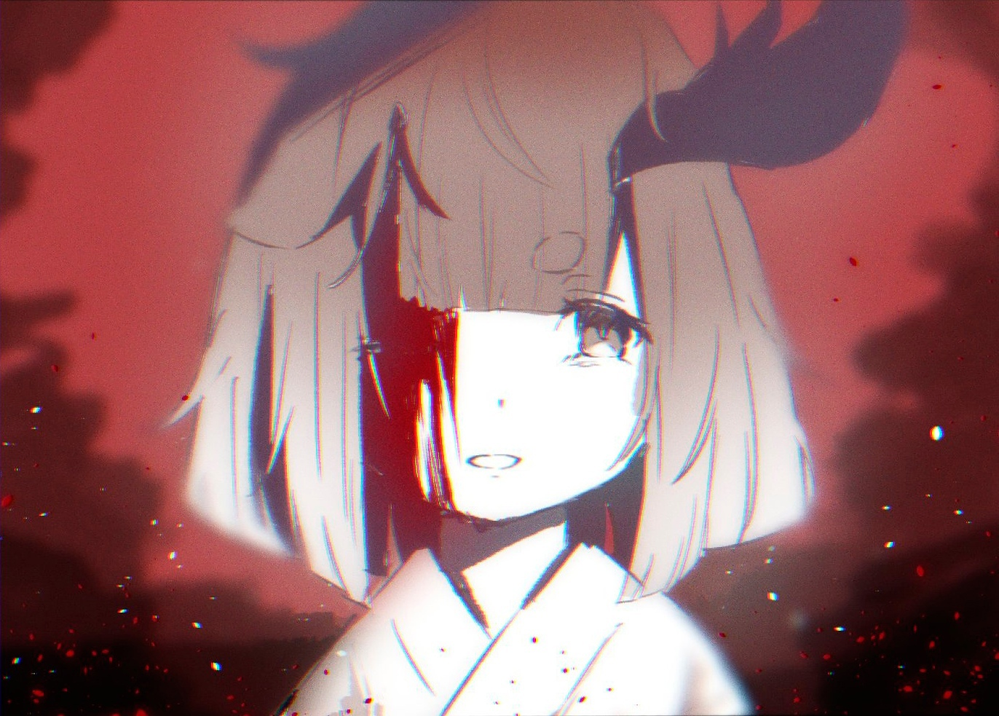
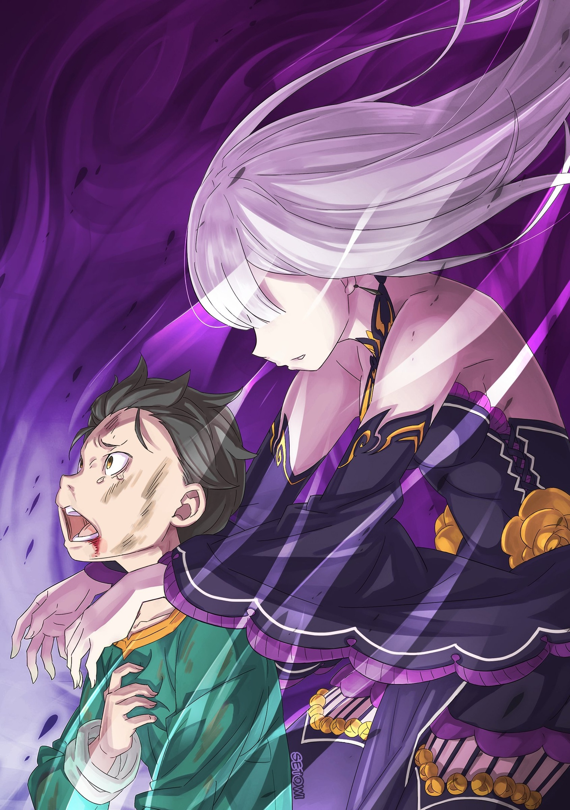
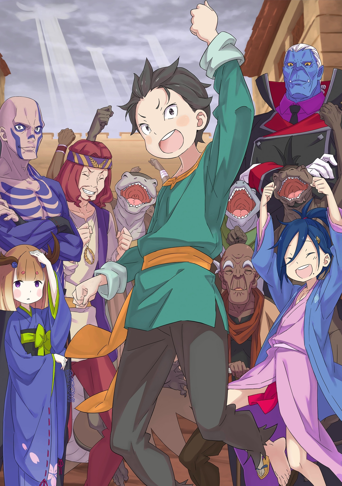
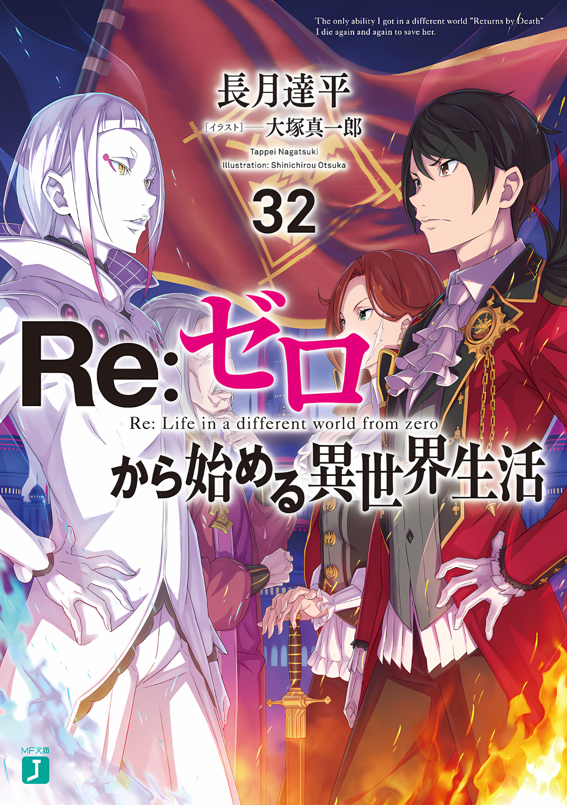

……В этой жалкой и безнадежной сцене такой веселый голос и улыбка были ужасно неуместны.

С первого взгляда было видно, что его кимоно яростно тлеет, и, несмотря на то, что левая половина его лица также была выжжена черным, отношение Сесилуса, когда он смотрел на Субару, было таким же, как и всегда. Это было слишком ненормально.

Дело было не только в нем. ……Сейчас все, кто остался в живых на этом Острове, все они были ненормальными существами.

Те, кто были нормальными… все они, конечно, уже умерли.

Сесилус прямо перед ним, Тодд преследующий его, убивающая Аракия, и Субару — великий грешник.

Все до единого, поскольку они не были праведными, а наоборот, бесстыдными людьми, смогли выжить.

Вот почему……

Субару: Се… си…

Сесилус: Судя по всему, тебе тоже пришлось нелегко. На этой ноте Ящер-сан умер, и при таком раскладе маленькая девушка-олениха и другие твои друзья из твоего «Отряда» будут уничтожены, не так ли?

Субару: ………Кх

Сесилус: О, возможно, ты еще не понял, что он умер?

По дрожащим глазным яблокам дрожащего Субару, Сесилус читал все его искренние мысли.

В этот момент в нем вспыхнуло негодование. Несмотря на то, что он, казалось бы, читал сердце Субару, почему он совершенно не мог сочувствовать ему?

Хиайн умер, и если бы Субару сказали об этом, что бы стало с его чувствами? И почему?

Почему он так легкомысленно говорит об этой смерти?

Сесилус: Он действительно умер, знаешь, абсолютно и безвозвратно…… Только лицо, с которым он умер, было не таким уж плохим.

Субару: Несмотря на то, что он умер…… кх.

Сесилус: Ты думаешь, что не имеет значения, было ли оно хорошим или плохим? Похоже, это просто разница во мнениях. Если у них был хороший способ проводить жизнь, то у них был и хороший способ умереть. Нам, слушателям, довольно бестактно влезать в разговор о том, что мы думаем по этому поводу, поэтому давай остановимся на этом. У Ящера-сан была хорошая смерть. Его лицо — тому доказательство.

Субару: …………

Сесилус: Это лицо умершего после выполнения своего долга, я тоже хочу так уйти.

Субару ничего не сказал Сесилусу, который непрерывно изрыгал свой бред.

Его не заводили эти слова, скорее, он считал их бессмысленными. Он не видел, какой облик принял Хиайн после своей кончины, поэтому было совершенно немыслимо, чтобы он мог понять Сесилуса.

Поэтому у Субару не было даже малейшей причины вступать с ним в дискуссию.

Сесилус: Ну что ж, хотя мы случайно встретились здесь и болтаем, на самом деле я сейчас очень занят. У меня сейчас фантастическая схватка с полуголой женщиной, которая бесчинствует на Острове.

Растягивая рывком свою сгорбленную спину, Сесилус продолжал говорить, как ему было угодно.

Субару знал, что упомянутый в разговоре человек — это Аракия, даже не задумываясь.

Аракия начала резню по приказу Тодда. Отсутствие у него выдающихся боевых качеств было его единственным достоинством, но в паре с ней это исчезло, превратив его в безупречное зло.

Он думал, что больше не увидит ее после того, как она начала превращать головы гладиаторов в водяные шары, но, похоже, единственным, кто сдерживал ее, был Сесилус.

Даже когда последний ослаб, могло ли случиться так, что один из «Девяти Божественных Генералов» был подавлен своим товарищем, другим членом «Девяти Божественных Генералов»?

Сесилус: Но, как ты можешь видеть, я нахожусь в самом разгаре рукопашной битвы. Что ж, меня в какой-то степени одолели. Похоже, она здесь, та, кто может соперничать со мной лицом к лицу. Хотя я всегда думал, что, без сомнения, путь к Небесному Мечу — это то, что нужно преодолевать самостоятельно.

Субару: ……Почему?

Сесилус: Прости? Ты о чем?

Субару: Почему… мне кажется… что тебе это нравится…?

Совершенно буквально, в конце мучительной борьбы, которая, казалось, выжала из него всю душу, гнев вырвался из его уст.

Действительно, он просто выплеснул свой гнев. В этой адской ситуации, на этом острове, где погибли Вайц, Танза, Идра, Хиайн и почти все, улыбка Сесилуса вызывала отвращение.

Почему он улыбался? Что его так забавляет в этой ситуации?

Субару: Почему…!

Сесилус: Аа, ты перепутал причину и следствие. Я улыбаюсь не потому, что мне все это приятно, я улыбаюсь, чтобы сделать ситуацию этой пьесы более приятной.

Субару: ……А?

Сесилус: В этом жестоком мире каждый стремится к своему идеальному счастью. Мириады различных людей, философий, которым каждый из них следует, это стремление остается неизменным для всех них, но кто бы это ни был, они должны возвещать веру, которая им подходит. Таким образом, вера, которую я возвещаю, является причиной такого образа жизни.

Пока он говорил, Сесилус коснулся правой рукой своей обожженной левой щеки. Хотя его потрескавшаяся и обугленная кожа шелушилась и отслаивалась, даже посреди, казалось бы, невообразимой боли, его улыбка не портилась.

Не полагаясь ни на какие дешевые уловки вроде отсутствия боли, Сесилус продолжал улыбаться.

Сесилус: Я главный актер этого мира! Поэтому я не собираюсь строго придерживаться сценария, вместо этого сценарий будет строго придерживаться меня. Если ты спросишь меня, почему я улыбаюсь, то таковым будет мой ответ.

Субару: …………

Сесилус: Ради кого я смеюсь, это ради меня самого. ……Да будет так, чтобы Наблюдатели на небесах никогда не испытывали стыда, когда смотрят на меня.

Субару: …………

Сесилус: Ну, Басу, какую же веру провозглашаешь ты?

Такова была философия Сесилуса, когда он сохранял улыбку, в то время как половина его тела тлела.

Это было нечто, чего Субару не мог понять ни в малейшей степени, но, как будто что-то заставляло его колебаться, не пнуть ли Сесилуса за то, что он полагается на свои эмоции, он почувствовал что-то сродни этой особой вере.

Наблюдатели… Сесилус однажды уже говорил о том же самом.

Кто-то, или скорее что-то, неземной природы наблюдало за ними…… похоже, именно это он и хотел сказать.

Даже в той ситуации, в которой они оказались, он упорно придерживался этого своего высказывания, так что, конечно, никто не смог бы его опровергнуть.

Вот почему……

Сесилус: Посмотри-ка… кажется, антракт закончился.

Когда он это сказал, даже при виде спускающейся фигуры Аракии, выходящей из прохода нижнего уровня, его улыбка не исчезла.

Конечно, ни у кого из гладиаторов не было бы шансов против Аракии, все тело которой было объято пламенем. И все же деревянная ветка в ее руке сломалась, и она потеряла повязку, скрывавшую один из ее глаз.

Ненавидя тот факт, что она могла видеть глазом под этой повязкой, Аракия закрывала левый глаз свободной рукой, а ее лицо, которое раньше было безэмоциональным, исказилось, выражая совершенно сложные эмоции.

Аракия: Сесилус……!

Сжав зубы, она смотрела на Сесилуса, зрачки женщины мерцали от волнения и гнева.

Из ее спины вырвались крылья пламени; сила их огня колебалась, словно в унисон с ее эмоциями, испепеляя, продолжая пронизывать проход ужасающим жаром.

В воздухе витал запах гари: женщина продолжала испепелять все, что ее окружало.

Стены и пол прохода, подсвечники и двери, и даже рухнувшие останки Хиайна…

Субару: ……Тц.

Сесилус: Если мы все вместе сгорим здесь до смерти, будет ли это достойной компенсацией за лицо, с которым он умер? Это было бы довольно нехарактерно для меня. Делай, что хочешь, не стесняйся, оставайся или уходи.

Видя, как куски тела Хиайна загораются, выражение лица Субару изменилось, когда голос Сесилуса донесся до него. Он уперся рукой в пол и, постепенно отрывая свое тело от земли, которая начала нагреваться, встал.

Его голова болела. Ему не хватало крови. Его грудь словно переполняло чувство бессилия.

Но все же, почему Субару все еще стоял? Он все еще не сгорел до смерти, не прокусил «Лекарство», помещенное за моляр, но почему?

Сесилус: Тогда, еще увидимся.

Неизвестно почему, Субару повернулся спиной к пылающему проходу и начал спринтерский бег.

Он бежал в очень медленном темпе, хромая.

Быстрее, если бы только он смог превзойти эту скорость, разве он не смог бы закончить все, не дав Идре и Хиайну, Вайцу и Танзе умереть? И пока он сокрушался по этому поводу.

Субару продолжал убегать.

△▼△▼△▼△

Сесилус: ……Ну, теперь и Басу исчез, хах.

Аракия: …………

Сесилус: Боже мой, похоже, меня ужасно ненавидят.

Почувствовав, как отдаляется присутствие его медленного бега, Сесилус, прикрыв один глаз, изобразил кривую улыбку.

Женщина, облаченная в пламя, окинула его напряженным взглядом; он понял, что сам стал объектом ее гнева, но не совсем понял, в чем источник этого гнева.

Он чувствовал, что гнев вызван не его противодействием и не тем, что он помешал ей расправиться с гладиаторами.

Возможно, были и другие причины.

Однако……

Сесилус: Вообще, у меня есть особое умение злить людей, с которыми я вступаю в контакт, но, как обычно бывает в таких ситуациях… у меня нет ни малейшего представления, почему!

Аракия: ……Кх, как долго ты будешь продолжать шутить…!

Сесилус: Хмм, я шучу, но. Могу я поинтересоваться, над какой именно частью я шучу?

Аракия: Эта! Эта… внешность, что с ней….!

Эти красные глаза смотрели на него, она отметила его внешность.

Она спросила, в чем дело, хотя не кто иной, как она, «готовила» его, пока он не стал жареным только с одной стороны.

Сесилус: Но ты ведь не это имеешь в виду? Возможно ли, что мы с тобой случайно знакомы?

Аракия: Шутишь……

Сесилус: На самом деле нет, но, учитывая это, поскольку я не могу предоставить никаких доказательств, чтобы ты мне поверила, я не могу ничего сделать, кроме как настаивать и настаивать на этом. Однако, я вижу, если так подумать, то многие вещи обретают смысл.

Пока он говорил, Сесилус покрутил вытянутым пальцем правой руки и кивнул, вертя в руках повязку, которую он украл у нее в разгар битвы.

Его воспоминания вплоть до переполоха на Острове Гладиаторов были ужасно неясными. То, что это соответствовало тому, о чем Субару спрашивал раньше, было фактом. То, что он не обратил на это особого внимания, тоже было фактом. Тем не менее, как раз в тот момент, когда он пытался представить промежутки до этого момента, перед его глазами появилась эта женщина, и ее лицо выглядело так, как будто она знала его.

На пути, чтобы достичь Небесного Меча……

Аракия: Всегда так… Никто никогда мне ничего не говорит…!

Сесилус: О?

Однако на глазах у Сесилуса, пока он размышлял, голос женщины задрожал от разочарования, и мощная горечь начала смешиваться с ее суматохой и яростью.

Пламя на ее спине сменило оттенок с красного на синий. В нем появилось изящное очарование.

По мере того, как происходило это изящное преображение, ее дыхание казалось напряженным,

Аракия: Принцесса и Его Превосходительство… оба скрываются… Я всегда…

Сесилус: У тебя мучительные мысли о том, что тебя оставили?

Аракия: ……Тц.

Как будто это краткое замечание каким-то образом попало в цель, отчего выражение ее лица стало жестким.

Он видел, как эти красные глаза дрогнули, словно ее глубокая эмоция запульсировала из потустороннего мира, и хотя, даже если бы эта глубокая эмоция не забилась, ее отношение к нему было чем-то, в чем он не был уверен.

Сесилус: Ну, было бы странно, если бы ты пыталась убить меня, при условии наличия у нас хороших отношений, так что, несомненно, у нас были были довольно суровые отношения. Это как нельзя лучше подходит к данной ситуации!

Аракия: Сесилус……!

Сесилус: Зрители заскучают от такого длинного диалога. Самое время начать сцену. К сожалению, я не смогу дать тебе никаких ответов, но с твоей груди может быть снят небольшой груз.

Медленно скрывая ноющую половину своего тела, крепко ухватившись за вращающуюся повязку, он подошел к ней лицом к лицу.

После этого он закончил разговор, его отношение было таким, словно он желал, чтобы разговор не перешел в область ненужных слов. Затем женщина, помолчав некоторое время, медленно опустила свою левую руку.

За ней находился красный глаз, лишенный всякого света. Встретив его взгляд своими глазами, Сесилус криво улыбнулся.

Сесилус: Не стесняйся. ……Каждый раз жарь яйца только с одной стороны.

Аракия: ……Кх.

Сесилус: Э? Что это только что было?

Сесилус наклонил голову, удивляясь словам, которые вырвались из его рта, словно по рефлексу.

Хотя, похоже, это еще больше разожгло ее гнев.

Аракия: …………

Яростно вздымаясь, голубое пламя испепеляло нижние слои острова.

Не имея возможности побеспокоиться о своем окружении, погрузившись в ад, Сесилус превратился в «Синюю Молнию».

△▼△▼△▼△

Субару: Хаааф, ффааафф….

Чувствуя жар инферно на своей спине, Субару бешено бежал из нижнего слоя.

Действительно, он бежал. Не сопротивлялся, не боролся, а именно бежал.

Что это было — стратегическое отступление или доблестное бегство, чтобы в следующий раз принять меры, — он не мог оправдываться.

В конце концов, ему нечего было делать дальше.

Все погибли, никого уже не вернуть.

Хотя Вайц и остальные пожертвовали своими жизнями, чтобы он мог сбежать, он не мог ничего сделать.

Он намеревался преуспеть во всем, и в том, и в другом.

В действительности он намеревался, дважды одолев «Спарку», помогая товарищам из своего «Отряда», а также товарищам Хиайна, преодолеть все трудности.

Это было ужасно ошибочное намерение.

Начнем с того, что Субару много раз умирал. Даже если бы он умер, если бы у него был шанс сделать все заново, все бы получилось; но сейчас — уже ничего не могло получиться.

Если бы он действительно был способным человеком, он должен был сделать так, чтобы все было хорошо, не умерев ни разу.

Как если бы он был тем ужасным существом… как если бы он был Тоддом Фангом.

Даже не обладая способностью начать жизнь заново после смерти, он был способен преодолеть любую ситуацию благодаря своей силе.

Не обладая выдающейся боевой силой, он был идентичен Субару, так почему же тогда Субару не мог делать то же самое, что и Тодд?

Так как он не мог сделать эти вещи, Субару, в конце концов, убил огромное количество людей.….

Субару: Проклятье…… кх!

Когда он выбежал из нижнего слоя острова, как только он почувствовал свежий воздух, его досада невыносимо возросла. Ударяясь о внешнюю стену, к которой он прислонился, Субару проклинал себя за собственную слабость.

Его маленький кулак, его хрупкое тело, его нефункционирующий разум, его бесполезное Полномочие. Если бы он начал перечислять причины своего поражения, на ум приходило бы бесконечное множество вариантов.

Точнее, чем же он, сопляк со страшными глазами, мог обладать……

???: ……О.

Субару, с сожалением прекратив свои шаги и проклиная себя, подавил крик в горле от неожиданного звука.

От звука в этом месте, все его тело сильно задрожало, когда он представил себе самое худшее из возможного. Неужели Тодд, от которого Идра отчаянно пытался отбиться, догнал его?

Однако……

???: Шварц… сама…

Субару: ……Танза?

Когда хриплый голос продолжил звучать, Субару испытал шок, хотя это не был ужас.

Субару, слабо дыша, звал ту, которую Тодд выбросил из прохода и в безопасности которой он впоследствии не был уверен, — Танзу.

Все тело девушки, прихрамывающей, было облито водой, и, сбросив кимоно, она была одета в свой белый дзюбан. Она была в ужасном состоянии, один из двух рогов, растущих из ее головы, был отломан.

Но даже так……

Танза: Шварц-сама, слава богу, с тобой все в порядке….

Арт от @k_rezero_fanart

Когда в ее нежных глазах промелькнуло облегчение, Субару ощутил мучительное чувство, идущее из глубины его сердца.

Увидев промокшую девушку, он понял, что ее бросили в озеро с верхнего уровня. В озере обитали водные дикие Зверодемоны, и ее сломанный рог служил доказательством того, что их не стоит списывать со счетов.

Это была фигура, которая, по идее, должна была прижиматься к взрослому, взывая: «Больно… больно, помоги мне».

И все же Танза нашла Субару, выпустив «Слава богу» с довольным видом.

Нацуки Субару, который вообще ничего не мог сделать, нашли.…

Субару: ……Аах.

И это случилось в тот самый момент, когда он подумал об этом.

Силы в ногах иссякли, и Субару опустился на пол там, где стоял. Нить напряжения оборвалась, внутренности его головы, которые до этого только разглагольствовали и бесновались, быстро затихли.

То, что он почувствовал облегчение, встретившись лицом к лицу с живой Танзой, было не тем, что произошло.

Он не испытал чувства удовлетворения, найдя прорывное решение, и не стряхнул с себя страх, направленный Тоддом.

……Просто у него кончилось терпение по отношению к самому себе.

Танза: Шварц-сама…!?

Увидев, что Субару упал на колени, Танза бросилась к нему, выражение ее лица изменилось.

То, как она бежала, выглядело странно, возможно, она повредила ногу. Присмотревшись, он увидел, что бока ее белого дзюбана медленно окрашиваются в красный цвет.

Несмотря на рану, причинявшую, казалось бы, ужасную боль, она все еще беспокоилась о Субару.

Когда он понял, что не сможет оправдать ни одного из ожиданий Танзы, он потерял все силы.

Смирение захлестнуло его сердце.

Субару: …………

Это не было ни болью, ни страхом.

То, что повергло Нацуки Субару в отчаяние, не было чем-то таким же простым и понятным, как трудности.

**Он не смог оправдать возложенных на него надежд и желаний.**

Это, прежде всего, приводило Нацуки Субару в отчаяние, отчаяние, которое стало для него смертельным ядом

Танза: Шварц-сама, успокойся…… Остальные… Идра-сама и Хиайн-сама.…

Оказавшись рядом с ним, Танза коснулась плеч Субару, беспокоясь о двух отсутствующих людях.

Она не назвала имя Вайца. Это было само собой разумеющимся. Танза тоже видела, как Вайца убили на ее глазах. Тогда, в отношении двух не присутствующих здесь существ, она, несомненно, уловила дурное предчувствие.

И это предчувствие оказалось точным до безнадежности.

Субару: Эти двое… Они умерли…

Танза: ……Кх

Субару: И Идра, и Хиайн, защищали меня…

Все погибли. Мало того, что он не смог спасти их, так они его еще и спасли.

Вайц, Идра и Хиайн, все трое погибли, защищая Субару. Танза была близка к смерти еще и потому, что пыталась защитить обездвиженного Субару.

Все погибли по вине Субару.

В том, что все погибли, был также виноват Субару.

В ужасной трагедии, постигшей Остров Гладиаторов, был виноват Нацуки Субару.

Танза: Шварц-сама… Давай покинем это место. Сейчас же, мы должны спрятаться где-нибудь.

Субару: Даже если мы спрячемся, это бессмысленно… Несмотря ни на что, нас сразу же найдут.

Танза: Даже так! Неужели ты ничего не предпримешь и будешь вот так ждать, пока тебя не убьют? Тогда ради чего все в нашем «Отряде» потеряли свои жизни!?

Субару: …………

Покачивая головой из стороны в сторону, Танза испустила разочарованный крик, направленный на Субару, который все еще не двигался.

Однако ее слезный призыв не только не зажег сердце Субару, но и вызвал лишь холодное понимание.

Действительно, Субару, ради безопасности которого все трое поставили на кон свои жизни, был совершенно бесполезен.

Другими словами, он позволил им троим погибнуть напрасно. Ведь все они пытались защитить Субару.

Он не смог оправдать их надежд. Даже если он дошел до того, что солгал им.

Было бы лучше, если бы они не поверили в эту ложь. Если бы он не смог обмануть их до конца, или если бы Субару не было выгодно говорить эту ложь, и даже если бы они не поверили в эту ложь.

Если бы это было так, то они трое не пытались бы умереть вместо Субару.

Это было сделано не ради ребенка Императора, не ради Нацуки Шварца, а ради Нацуки Субару; этого они никогда не узнают.

И теперь, когда он подумал об этом, оказалось, что был еще один человек, которого он обманул той же ложью.

Танза: Шварц-сама! Если ты рухнешь здесь….

Субару: ……Все… все это было ложью, Танза.

Танза: …………

Субару: То, что я незаконнорожденный ребенок Императора, это откровенная ложь. Я ребенок достойного похвалы, невероятного и крутого отца…… но я не являюсь ребенком Императора.

Опустив взгляд, Субару с готовностью признался, что неосторожно попытался положиться на эту ложь и их ложные ожидания.

Если бы он только сделал это раньше…… Нет, ему не следовало говорить такую ложь с самого начала.

Танза: …………

Когда ее и без того круглые глаза еще больше расширились, Танза потеряла дар речи от признания Субару.

Это было естественно. Учитывая ситуацию, мысль о том, что он солгал, заставила Субару проклясть самого себя. Обманутой девушке было бы ничуть не странно поддаться гневу.

Скорее, даже если бы он погиб от руки Танзы, это было бы неизбежно.

То же самое касалось и всех остальных.

Шанс понести заслуженное наказание для коварного Субару был упущен теми, кого он обманул.

Так что, даже если Танза сделает это.

Танза: ……Шварц-сама.

Субару: …………

Танза: Быстрее, давай уйдем отсюда. Я понесу тебя на спине.

Субару: Э….

Субару, который закрыл глаза, готовясь к тому, что все, что выйдет из ее уст, будет естественным, поднял голову, услышав слова Танзы.

Облизнув тонкие губы, Танза попыталась потянуть Субару за руку. Она искренне пыталась взвалить его на спину и убраться из этого места; в этот момент в его голосе прозвучало «Подожди».

Он рассказал все, все до мельчайших подробностей. Он сказал, что это была ложь.

Субару: Ты не расслышала меня, не так ли… Я…!

Танза: Не незаконнорожденный ребенок Его Превосходительства Императора, я слышала тебя. Мы решим этот вопрос позже….

Субару: Позже все будет так же дерьмово, не так ли?!? Я не связан с Императором! И сейчас, как таковой причины для моего спасения….

Нету. Притворство о том, что что-то есть, хотя на самом деле этого не было, являлось грехом Субару.

Именно это и лишило жизни тех троих….

Танза: ……Шварц-сама, ты действительно так считаешь?

Стряхнув маленькие руки, касавшиеся его плеч, Субару прекратил ее движение.

Напротив него стояла Танза и пристально смотрела прямо в глаза упавшего Субару. Не в силах оторвать от нее взгляд, он пытался понять смысл слов, которые она произнесла в его адрес.

Независимо от того, что она думала, все, все было именно так, как он сказал.

Танза: Вайц-сама, Идра-сама, Хиайн-сама, причина, по которой все были готовы отдать свои жизни, дабы защитить тебя, Шварц-сама, была из-за лжи, которую ты говорил… ты действительно веришь в это?

Субару: Но ведь… ведь я сказал, что я — дитя Императора.

Танза: Я и все остальные, все мы верили в это. Тем не менее, эти трое…… Эти существа… соплежуй, трус и лжец, как ты думаешь, стали бы они рисковать своей жизнью из верности и патриотизма к Империи?

Если бы Субару был незаконнорожденным ребенком Императора, он был бы известен как принц Империи.

Поэтому для этих троих, как для людей Империи, было бы вполне естественно попытаться защитить Субару. Но он снова медленно переваривал слова Танзы, размышляя над ними.

Хиайн, будучи соплежуем, пытался убежать, чтобы спастись.

Вайц, будучи трусом, пытался выжить, обманывая окружающих.

Идра, будучи лжецом, пытался казаться значимее, чтобы иметь возможность управлять всеми.

Ни один из них не казался ему существом, с которым он мог бы поладить. Уверен, что все трое испытывали схожие чувства.

Но несмотря на это, в конце концов, эти трое поставили на кон свои жизни, встав на защиту Субару. Защитили его. Позволили ему сбежать.

Почему так произошло? Потому что все трое считали Субару незаконнорожденным ребенком Императора.

Хотя, это было возможно. ……Возможно, это было и не так.

Субару: Тогда… почему…?

Танза: Это потому, Шварц-сама, что ты сблизился с теми тремя.

Субару: …………

Танза: Ты вел с ними реальные разговоры, отвечал им и пытался прийти к взаимопониманию…… Сделав это, Шварц-сама, ты сблизился со всеми.

Не догадываясь, что Субару не хватает понимания, когда он озвучил этот вопрос, Танза заговорила, глядя ему в глаза.

Что сделал Субару? Почему те трое пытались спасти Субару? Она пыталась донести до него ответ.

Но Субару не понимал смысла слов Танзы.

В конце концов……

Субару: Такие вещи…… естественны. Я не сделал ничего даже отдаленно особенного.

Разговаривать с напарниками, с которыми он сотрудничал, и понимать их было для него вполне естественно.

То, что он не мог сделать, конечно, существовало. То, что он хотел бы сделать, но не мог. Но делать что-то настолько естественное со всеми, сближаться с ними — это не было чем-то необычным.

Танза: Лично я понимаю, что они все чувствовали. Меня тоже однажды спасла Йорна-сама. Я смогла сблизиться с ней. Без сомнения, то же самое было и с этими тремя, с их чувствами к тебе.

Субару: …………

Танза: Тем не менее, в том, что они поставили свою жизнь на кон, был смысл…… Бывают времена, когда человек вынужден чувствовать себя так.

Несправедливо, эти слова были несправедливы.

Если бы у нее был только опыт общения с Субару, Танза не смогла бы сказать ему такое в лицо. Но она говорила о своем собственном опыте, который она получила от Йорны.

Йорна Миссигр, Госпожа Города Демонов, города, где жили многие племена, — насколько знал Субару, она была самой доброй женщиной в Империи.

Ставить его на один уровень с Йорной… что за абсурдная идея. Даже у неуважения есть свои пределы.

Танза оценила Субару слишком высоко.

Однако……

Субару: …………

Однако как это было для Хиайна, Вайца и Идры?

По всей вероятности, Субару знал об этих троих больше, чем они думали.

Ненависть Хиайна к себе, ложные обвинения Вайца, неудача Идры — обо всем этом он знал.

Он знал, что, пережив тяжелые времена, пройдя через несчастья, не имея возможности ни на кого положиться, все они были отправлены на этот Остров.

Он не задумывался об этом. Ведь, несомненно, у всех троих тоже были бы свои шансы.

И несмотря на то, что он думал, что это будет их конец и они умрут именно здесь.

Субару: Я хотел спасти всех.

Танза: Ты спас их. До такой степени, что они готовы пожертвовать своей жизнью, чтобы защитить тебя, Шварц-сама.

Субару: Нет, ты ошибаешься. Это не так….

По какой-то случайности, возможно, все было именно так, как сказала Танза.

По какой-то вероятности, больше, чем Субару полагал, эти трое считали его своим товарищем.

Возможно, по какой-то случайности, Субару спас сердца этих троих.

Но только их сердец было недостаточно.

Было бы немыслимо просто спасти их сердца и оставить все как есть. Он хотел спасти всех.

Субару желал для тех, кто принял его сторону, для тех, кто хорошо к нему относился, для всех, чтобы их сердца и тела были спасены им самим.

Если бы он не смог этого сделать, то не был бы сыном Нацуки Кени…… Нет.

Субару: ……Терпеть не могу.

Когда он безнадежно выл, когда все в его окружении вымирало, этому миру наступал конец.

Не успел он опомниться, как Остров Гладиаторов заволокло черным дымом, он горел, несмотря на то, что был Островом, плавающим посреди озера; горел, а языки пламени распространялись все сильнее, унося с собой жизни.

Субару: Я не….

*Не позволю ничего подобного. Я не хочу допускать ничего подобного. Я не хочу, чтобы мои колени подкосились из-за такого конца, из-за невозможности спасти всех.*

*Я не могу принять такой конец, когда все жертвуют своими жизнями.*

*Я не могу принять это. Поэтому……*

Субару: ……Я не хочу проиграть тебе.

???: Меня не волнуют такие вещи, как победа или поражение.

Из-за поднимающегося черного дыма, постукивая по плечу топором в руке, мужчина ответил, наклонив голову.

△▼△▼△▼△

На мгновение Субару принял этого мужчину, который появился с расслабленным видом, неся на плече окровавленный топор, вместо кого-то другого.

Без своей фирменной банданы, со свисающими вниз оранжевыми волосами, он производил совершенно иное впечатление, чем тот человек, с которым Субару был знаком.

Однако, эта пара глаз…… зеленые радужки, злость в которых невозможно было полностью скрыть, не могли полностью фальсифицировать его личность.

Субару: Тодд….

Тодд: Тебе просто дьявольски везет. Хотя я и преследовал тебя, мне потребовалось некоторое время, чтобы догнать тебя, так как проход был в огне. Я сказал Аракии, чтобы она использовала воду, но….

Субару: …………

Тодд: Почему-то кажется, что Аракия не справляется. Она бесполезна в те моменты, когда это действительно важно.

Сказав это с прямотой и раздражением, Тодд, отчасти из-за своих опущенных волос, не имел и намека на позитив. Надуманная аура дружелюбного молодого человека из их первой встречи испарилась, и теперь в нем присутствовала лишь холодная жажда насилия.

Возможно, даже это насилие было недоразумением со стороны Субару, а возможно, и очередной выдумкой.

Он был человеком, который при необходимости говорил только необходимую ложь, используя тех, кто его окружал, — выдумка, как это было типично для Тодда,

Танза: Пожалуйста, не подходи ближе….

Глядя на Тодда, который пытался сделать шаг вперед, Танза подняла ближайший камень.

С силой рук, которой обладала Танза, силой, немыслимой для ребенка, даже обычный камень был бы достаточным смертельным оружием при броске. Однако в случае, когда противником был Тодд, Субару не чувствовал, что камень будет иметь хоть какую то пользу, кроме того, как быть камнем.

И на самом деле, Тодд не был трусом, он просто сузил глаза,

Тодд: Несмотря на то, что ты упала в озеро, ты довольна упряма, маленькая мисс. Ты такая же, как те ребята?

Танза: …Если ты имеешь в виду всех из «Отряда»….

Тодд: У тебя тревожный взгляд. Я не собираюсь недооценивать, насколько опасно это отчаяние. Если бы я это сделал, это было бы неприятно, так как мы лишили бы друг друга возможности двигаться.

Говоря это, Тодд провел рукой по своим волосам. Из этого жеста следовало, что снятие его банданы было достижением, оставленным Идрой.

Дело не в том, что он смог победить Тодда, даже не в том, что он ранил Тодда, а просто в том, что он выхватил у него бандану.

И несмотря на это, из-за того, что Идра совершил одно возмездие, Тодд проявлял осторожность по отношению к Субару и Танзе.

Танза: Что… Что именно ты хочешь?

Тодд: ……? Я просто хочу вернуться домой к своей невесте?

Поднявшись на ноги, Тодд ответил на вопрос Танзы.

Лишенный явного намека на шутку или сарказм, Тодд прямо заявил о своем желании. Он просто хотел домой, это было единственное, чего он желал. Тодд так и заявил.

Возможно, это не было ложью.

Танза: ….Тц.

Субару: Танза, тебе больше не нужно с ним разговаривать. Говорить с ним буду я.

Отстранив Танзу, которая бросила на Тодда суровый взгляд, Субару молча перевел свой взор на него.

Увидев перед собой пару ослабленных до нехотя детей, Тодд пожал плечами.

Тодд: Мне не о чем говорить, мальчик.

Субару: Я составлю тебе компанию, пока ты ищешь лазейку. А может, ты боишься ребенка, который так близок к смерти?

Тодд: Конечно, страшно. Сопляк все еще пытается провоцировать меня, несмотря на ситуацию, испуг неизбежен.

Не позволяя себя ни в малейшей степени провоцировать, не ослабляя бдительности, он не стал бы срезать углы, даже если бы его противником был ребенок.

По правде говоря, против противника, доставляющего массу хлопот, он считал вполне естественным загнать себя в такой угол. Однако он подумал и о другом. Тодд был человеком, который осторожно использовал свою смекалку и не переоценивал свои способности, такой способ ведения дел был.…

Субару: Ты тот, кто пытается справиться со всем сам.

Тодд: ――. Невозможно сделать все. Я знаю пределы своих возможностей.

Субару: Хотя ты пришел вместе с Аракией как товарищи, ты действительно нисколько ей не доверяешь.

В отношении Тодда к Аракии он не почувствовал никакого внимания.

Не потому, что он не был уверен в силе Аракии, и не потому, что считал, что она ни за что не проиграет, а скорее потому, что, независимо от ее силы или слабости, Тодда просто не заботила Аракия.

И это не ограничивалось только ею. Такой образ мыслей относился ко всему, что находилось поблизости от Тодда.

Поэтому его мысли, его действия, его идеалы — все это было исполнено исключительно им самим.

Субару: Я не хочу проиграть такому парню.

Тодд: Дело не в победе или поражении. Я не особенно против. Хорошо, если ты победишь, лишь бы ты умер.

Субару: Мое поражение, будет не только моим поражением. Это будет поражение Танзы, Хиайна, Вайца, Идры, всех в «Отряде».

Это было совершенно отвратительно.

Все вместе, Субару и остальные сражались, они сопротивлялись, и они шли к победе. Как единое целое.

Вот почему они победили. ……Вместе со всеми, он пойдет и победит.

Субару: …………

Стоя на коленях, его тело было близко к смерти, Субару приложил руку к своей груди.

Хотя Тодд и нахмурился при этих словах, он не стал бездумно отвлекаться от Танзы. Естественно, если бы Субару попытался предпринять какие-либо заметные действия, Тодд, несомненно, стал бы ему мешать.

Однако, поскольку Субару оставался стоять на коленях, он не двигался. Он и не собирался двигаться.

Субару: Тодд.

Ему и не нужно было двигаться. ……Есть только одна вещь, которую он должен был сказать.

Субару: ……Я могу… «Посмертно Возвращаться».

Преодолевая легкое колебание, Субару заговорил так.

Приготовившись к тому, что может случиться при этих словах, прижав руку к груди, Субару четко произнес эти слова.

И затем……

Тодд: ….Чего?

После мгновенного молчания, из-за слов Субару, Тодд наморщил лоб, образовав глубокие складки.

Неспособная уловить смысл этих слов, Танза все равно вернула признаки сомнения. По реакции этих двоих и по отсутствию боли, исходящей из его груди, Субару понял причину расхождения.

Хотя его тело и уменьшилось, он не мог забыть те воспоминания об агонии.

Если он скажет об этом, Субару непременно постигнет беда. Черные тени, управляющие миром остановленного времени, причинили бы ему невыносимую боль в наказание за нарушение табу.

Но этого не произошло. По какой причине? ……Ведьма потеряла Субару из виду.

На башне Замка Красного Лазурита, во время «Спарки» на Острове Гладиаторов, во время резни, устроенной Тоддом…… несоответствие сопровождало спирали «Смерти», возникавшие в каждой из этих сцен.

Инстинктивно, бессознательно, Субару понимал это.

Подобно тому, как птица не забывает, как летать. Как рыба не забывает, как плавать.

Нацуки Субару не забыл, как использовать свое Полномочие.

Была ли причина в том, что его отправили в Империю Волакия? Или причиной было дальнейшее действие «Инфантилизации»?

До этого, задолго до этого, он смог заметить это.

Даже во время «Спарки», даже во время резни, когда высвобожденные Зверодемоны-гладиаторы… не бросились на Субару, стало ясно, что он вырвался из рук «Ведьмы».

Таким образом, он закричал.

Субару: Я могу «Посмертно Возвращаться»!

Тодд: ……Кх, что ты…

Субару: Я… могу «Посмертно Возвращаться»! «Посмертно Возвращаться» говорю! Слышишь? «Посмертно Возвращаться»!

……«Посмертное Возвращение» было тем, что он не должен был никому раскрывать.

Потому что за это полагалась невыносимая боль, и, кроме того, существовала вероятность, что это может привести к отчаянию, сродни тому, что его сердце расколется.

Чтобы посеять жизни слышавших, злоупотребляя этим механизмом, он не ожидал ничего подобного.

Он не стал препятствовать тому, чтобы это дошло и до ушей Танзы. Он даже одарил Тодда информацией, которую не хотел, чтобы тот услышал.

Однако тот, кого он действительно хотел услышать, был не Тодд, и никто другой на Острове.

Субару: ……Я… МОГУ «ПОСМЕРТНО ВОЗВРАЩАТЬСЯ»!

Подняв глаза к небу, Субару проецировал свой голос на то же самое пасмурное небо, к которому поднимался черный дым.

Его тело было разорвано на куски, и отзвук его громкого голоса причинял боль его внутренностям. Он был близок к смерти. Тем не менее, Субару был полон решимости, ибо боль, которую он желал, была совсем не такого рода.

«Да будет так, чтобы Наблюдатели на небесах никогда не испытывали стыда, когда смотрят на меня», — таковы были бессвязные слова, оставленные Сесилусом.

Маловероятно, что Субару и Сесилус представляли себе одно и то же. Во-первых, была большая вероятность того, что это было просто одно из необдуманных замечаний Сесилуса. Тем не менее, эти необдуманные замечания помогли ему понять.

Подобно Наблюдателям, о которых знал Сесилус, существовало нечто, что якобы наблюдало за Субару.

Если бы то существо, которое якобы наблюдало за Субару, наблюдало за ним и сейчас, не расставаясь с ним, то эти петли, лишенные надежды, лишенные «Любви», не появились бы на свет.

Субару: ……Я могу «Посмертно Возвращаться»!

Я здесь. Найди меня.

Я знаю, что это эгоистично. Но я хочу спасти всех.

Его Полномочием, Полномочием Нацуки Субару и больше никого.

Вот почему……

Субару: ……Найди меня, Сателла.

*«……Люблю тебя».*

Это случилось в тот момент, когда было названо это имя.

Субару: …………

Мир резко потерял цвет. Громкий пульсирующий звук, звон в ушах исчез вдали.

Он был не в состоянии двигать конечностями. Его язык пересох и онемел. Он не мог ни двигать глазами, ни дышать. Сила, сковывающая его свободу воли, угроза, медленно нарушающая биение сердца, — все это было, потому что….

……В платье, сотканном из черных теней, перед его глазами появилась «Ведьма», о которой он так мечтал.

*«Люблю тебя».*

Как только она это произнесла, волшебные руки ведьмы черного цвета протянулись к нему.

Поглаживая щеку Субару, нежно лелея его, она скользнула вниз по шее, прослеживая ключицы, вниз к солнечному сплетению, чтобы затем, наконец, прийти к тому месту, которое она искала.

Иллюстрация к **Ранобэ** Том 31 | Разукрасил Set0wi

*«Люблю тебя. Люблю тебя. Люблю тебя».*

Пока она шептала слова любви, к которым привыкли его уши, ее пальцы перемещались по груди Субару, по груди ребенка, а затем нежно обхватили орган, в котором содержались жизненные силы.

*«Люблю тебя. Люблю тебя. Люблю тебя. Люблю тебя. Люблю тебя».*

Субару каким-то образом сумел это сделать, это было совершенно точно.

Бесчисленные шепоты, пропитанные силой слова «люблю», кончики пальцев, обвивающие его сердце, которые, казалось, противоречили этому, последующая боль, которая длилась, казалось, до конца этого мира — он жаждал всего этого.

Поэтому……

*«Люблю тебя. Люблю тебя. Люблю тебя. Люблю тебя. Люблю тебя. Люблю тебя. Люблю тебя. Люблю тебя. Люблю тебя. Люблю тебя. Люблю тебя. Люблю тебя. Люблю тебя. Люблю тебя. Люблю тебя. Люблю тебя. Люблю тебя. Люблю тебя. Люблю тебя. Люблю тебя. Люблю тебя. Люблю тебя. Люблю тебя. Люблю тебя. Люблю тебя. Люблю тебя. Люблю тебя. Люблю тебя. Люблю тебя. Люблю тебя. Люблю тебя. Люблю тебя. Люблю тебя. Люблю тебя. Люблю тебя. Люблю тебя. Люблю тебя. Люблю тебя. Люблю тебя. Люблю тебя. Люблю тебя. Люблю тебя. Люблю тебя. Люблю тебя. Люблю тебя. Люблю тебя. Люблю тебя».*

….Даже если бы этот отталкивающий мир был полностью пронизан силой, заключенной в этих словах, Нацуки Субару не был бы сломлен.

△▼△▼△▼△

По мере того, как мир вновь обретал свои краски, как возвращался его некогда исчезнувший шум в ушах, как исчезали ощущения в конечностях и онемение языка, как он делал хриплые вдохи, течение времени для всего вне Субару пришло в движение.

Субару: Гх….

Казалось, и Тодд, и Танза не поняли, что имел в виду Субару, и последний, застонав, сильно сжал грудь.

Тем не менее, последующее изменение должно было быть замечено ими обоими сразу же.

Тодд: Что…!?

Глаза заострились, выражение лица стало жестким от ужаса, Тодд перевел взгляд на окружающую обстановку.

Причиной этого было не что-то видимое глазу, а приближающийся, слышимый сигнал…… рев, если быть точным. Зверодемоны, все еще остававшиеся на Острове Гладиаторов, завывали в унисон, как будто договорились об этом заранее.

Более того, аура, вызванная необычным сигналом, была настолько грозной, что казалось, будто они лишились чувств.

Тодд: ……Кх.

В тот же миг, вернувшись мыслями к ощущению кризиса, Тодд сразу определил Субару как его причину.

Казалось, что даже сам Тодд не знал значения того «Посмертного Возвращения», которое выкрикнул Субару. Но у него не было необходимости постигать его, поэтому, отбросив эту мысль, он тут же реализовал свое намерение убить.

Сохраняя бдительность в отношении контратаки Танзы, тело Тодда яростно набросилось на Субару.

Противостоя Тодду, Танза с огромной скоростью бросила камень, который держала в руке. Камень полетел точно в цель, устремившись к самому центру тела Тодда.

И все же……

Тодд: Черт…!

Выпустив минутное ворчание, Тодд заскрипел коренными зубами от боли, исходящей из его левой руки, по которой ударил камень.

Не позволяя ему уклониться, Танза прицелилась в самую крупную мишень — его торс. Уловив это, Тодд пожертвовал левой рукой и тем самым свел к минимуму нанесенный ему ущерб.

После этого Тодд замахнулся топором правой рукой и попытался разрубить миниатюрную фигуру Танзы.

Однако Субару не позволил этого сделать.

Танза: Шварц-сама!?

Ее плечи взлетели из-за толчка сзади, Танза вскрикнула, упав на бок.

Тем, кто отправил ее в полет, был Субару, которого она защищала своей маленькой спиной незадолго до этого. Вместо Танзы Субару попал под траекторию атаки нисходящего удара топора.

На мгновение зрачки Тодда сузились, однако импульс его топора не прекратился, замах был доведен до конца.

Лезвие приближалось без спешки, оно должно было отправить голову Субару в полет…… это произошло в тот момент.

Тодд: ……А!?

Упругий звук и увесистый удар породили пустое эхо, и тело Тодда завертелось в воздухе.

Тодд, отлетев в сторону, теперь лежал на спине на полу и быстро поднялся на ноги. Но из огромной раны на его губах капала кровь, а колени, казалось, вот-вот подогнутся.

Тодд: Гхуо… Только что… это…!

Не понимая, что только что произошло, глаза Тодда метались по сторонам.

Ткнув пальцем в сторону Тодда, Субару……

Субару: ……Невидимое Провидение.

Субару вежливо объяснил ему, что именно означал этот удар в беззащитную челюсть.

Субару: Далее, я снесу тебе голову.

Тодд: …………

Убрав оттопыренный палец, Субару поднял средний палец и сказал это.

Возможно, из-за того, что его челюсть была сломана, кровотечение не прекращалось; выплевывая кровь, Тодд вдруг прищурил глаза. Этим он начнет свое возмездие за сломанную челюсть, или так он думал….

Тодд: …………

Спокойно переведя взгляд на Субару, Тодд медленно отступил на задний план. Его ноги уперлись в поднимающийся черный дым, и, не задерживаясь, он исчез в нем.

Как только он заметил, что ситуация стала неблагоприятной для него, отбросив почти все свое нежелание, он решил сбежать.

Субару: Ну… я думал… что он сделает это, но…

Танза: Шварц-сама!

Увидев исчезновение Тодда своими глазами, Танза бросилась к Субару, выражение ее лица изменилось. Прежде чем он успел взять ее за руку, он не был в силах стоять и упал прямо там же.

Он уже был на грани смерти, даже не дойдя до этого места. Скорее всего, во время спуска вместе с Идрой и Хиайном он получил серьезные ранения — у него было сломано множество костей.

Полномочие «Лени», которым он не пользовался уже долгое время, как обычно, сильно стимулировало мозг Субару; кровь хлынула у него из носа, но он был не в силах остановить ее.

Хотя в любом случае, даже если бы он смог остановить ее, это не имело бы большого значения.

Топор Тодда своим последним ударом раздробил правое плечо Субару, и его лезвие сейчас находилось в нем.

Тот факт, что он не потерял сознание, доказывал, что жизнь Субару уже канула в лету, настолько, что боль или что-либо еще уже не имело значения.

Танза: Шварц-сама, Шварц-сама…!

Прижимаясь к рыдающей Танзе, Субару в глубине души испытывал чувство вины.

С этим маленьким телом, с искренностью, Субару прижался ближе к ней, к девушке, которая отчаянно пыталась сохранить ему жизнь, которой он должен оставить что-то после себя.

Только……

Субару: Возьми… это…

Танза: ……Кх, инструмент проклятия?

Из своего кармана он достал черную сферу и вложил ее в руку Танзы.

Не то чтобы у него была какая-то идея. Он подумал, что должен хотя бы что-то оставить Танзе, даже если он скоро погибнет.

Субару: Сеси, он… там… с Аракией…

Танза: П-понятно…! Я поняла… поняла…

Субару: О Тодде уже… не… нужно… беспокоиться.

Что касается личности Тодда, Субару не мог себе представить, что после столь болезненного опыта первый вздумает снова бросить ему вызов. Это был отвратительный аспект этого человека, и в то же время это была вера, на которую он мог положиться и использовать.

Вот так, сквозь слезы, Танза прикоснулась к Субару, который судорожно нанизывал слова.

Ради Субару, который так волновался за нее, она отчаянно чувствовала до самого конца, что должна что-то сделать.

Но это было неправильно.

Такой порядок вещей был совершенно обратным.

Танза относилась к нему по-доброму. Она исправила почти все мысли Субару.

То, что Нацуки Субару до самого конца был тем, кому лучше не сдаваться, она помогла ему это вспомнить.

Благодаря этому, он снова был способен бороться.

Именно поэтому……

Субару: ……В следующий… раз.

Действительно, когда Субару тихо сказал о своей решимости, Танза расширила глаза.

Тем не менее, для девушки это прозвучало как последнее проявление упрямства Субару, который вот-вот уйдет из жизни.

Пока слезы копились в ее глазах, стойко перенося эти эмоции, маленькая рука Танзы, ее тонкие пальцы, нежно обхватили дрожащую руку Субару.

А затем……

Танза: Да, ты прав, Шварц-сама. В следующий раз, без сомнения, мы не проиграем.

Заботясь о том, чтобы не опозорить последнее желание Субару, Танза, плача, произнесла это.

Они не стали друг для друга единым целым. Но даже так, они были едины в своем желании спасти друг друга.

Этого было достаточно.

С этим достаточным желанием, неся в себе чувства этого момента……

Субару: ……Я обязательно…

*……спасу всех.*

С этой решимостью в свой последний момент жизнь Нацуки Субару сгорела пеплом……

△▼△▼△▼△

……Темнота и пустота, мир кромешной тьмы.

В этом пространстве, куда не проникал свет, не существовало ничего, кроме тьмы, эта далекая земля была местом, куда не могли добраться ни молитвы, ни желания.

Это место всегда грызло его сердце, навязывая чувство беспомощности, принося горе и печаль; проклятая земля, недоступная ни одному существу.

Однако в этот раз, в этот самый момент, его мысли желали, предвкушали это прибытие.

Субару: ………….

Тьма, против которой он не мог выстоять в одиночку, поглощала все, забирая абсолютно все.

Даже если его мучило чувство беспомощности, отказ от всего, что было рядом, даже от самого себя, чувство поражения, возникающее от того, что он больше ничего не мог сделать, опаляло его тело.

*«Люблю тебя».*

Субару: ……Возможно, это еще не все. Но я знаю.

То, чего он мог достичь в одиночку, было не так уж и много.

Он не был человеком, амбициозным до такой степени. Поэтому он также мог совершать ошибки, и поэтому его решимость тоже могла пошатнуться.

Но даже так……

*«Люблю тебя».*

Субару: Я это знаю, правда. Я знаю.

Уже расставшись с ней, он наконец-то понял, что произошло.

В то же время он не знал, как ему сохранить эмоции, которые он испытывал до этого момента.

Тем не менее, как он и думал, он хотел знать.

Самое главное, он знал это, действительно знал.

Субару: Спасибо. ……Теперь я пойду.

В то место, в тот край изолируемый водой, где все живое было уничтожено… Ради того, чтобы больше не терять, ради того, чтобы не позволить растоптать тех, кто был ему дорог, Нацуки Субару снова восстанет.

……Еще раз, он восстанет.

※ ※ ※ ※ ※ ※ ※ ※ ※ ※ ※ ※

**Данный отрывок взят из Ранобэ и отсутствует в Веб-новелле.*

*Однако диалоги сохранены из Веб-новеллы.*

*???: ……Кх.*

*Заставляя себя и его намокшее тело, он поймал пальцами твердую землю и потянул себя вперед.*

*В буквальном смысле это была борьба на смерть…. нет, это было похоже на борьбу за жизнь.*

*В кромешной тьме, которая не давала никакого убежища, он отчаянно боролся… боролся… боролся,*

*???: Ахх, гах…!*

*Напротив правой руки, которая ухватилась за землю, он подтолкнул к берегу то, что обхватил левой рукой. Однако вместо того, чтобы сделать это с силой, он сделал это с большой осторожностью, как будто нес хрупкий предмет.*

*Поскольку этот ребенок был здесь, он все понял. Он понял, какую огромную любовь он испытывает к окружающим его людям.*

*???: Бхаа, фааааф.…*

*Он подтолкнул девушку к берегу. Оставалось только использовать последнюю силу воли, чтобы спастись самому. Он слишком долго думал.*

*???: ……Кх.*

*???: ……Ой, осторожно.*

*Как ни странно, в тот момент, когда все усилия, которые он приложил, пропали, и его пальцы соскользнули, его рука была схвачена вместе с последующим голосом.*

*Тонкие пальцы вцепились в его запястье, и его собственная рука вцепилась в ответ. После этого, заметив, что реакция как бы говорит: «Я ждал», мальчик наклонил голову со звуком: "О?*

*???: О-о-о, возможно, здесь было больше свободы действий, чем я думал? Твоя рука протянулась довольно поспешно.*

*???: Нет, едва-едва. Хороший тайминг. …Возможно, ты ждал по своему усмотрению?*

*???: А-ха-ха! Нет, вовсе нет, я просто подумал, что наша кульминация должна была произойти на пару секунд позже!*

*На вопрос о такой маловероятной возможности был получен довольно пугающий ответ, в котором не было ни «да», ни «нет». Не стесняясь такого обмена мнениями, он бездумно улыбнулся,*

*???: Однако, молодец, что доплыл сюда! Действительно, такое странное совпадение, идя туда, куда нес меня ветер, я оказался здесь! Боже мой, Боже мой, очень мило, не правда ли!?*

*Непреклонное отношение к утопающему пронзило его насквозь, и было глупо, что он почувствовал от этого что-то вроде облегчения.*

*Однако все началось именно отсюда. Отныне это будет началом.*

*???: ……Разве у тебя нет ощущения, что сейчас начнется великая история?*

*???: Да. На самом деле, я думаю, что мы сами должны ее начать.*

*……С яростной улыбкой Нацуки Субару ответил на этот веселый звон.*

※ ※ ※ ※ ※ ※ ※ ※ ※ ※ ※ ※

△▼△▼△▼△

……Он почувствовал, как карета, запряженная лошадью Галевинд, сотрясается от грохота.

Путешествие было не слишком комфортным.

Дело было не в том, насколько комфортной была поездка, а скорее в том, насколько комфортно было ему. Что касается первого, то, скорее всего, это была редкая привилегия, даже в пределах Империи. Он не испытывал особой благодарности по этому поводу.

Что касается того, почему он чувствовал себя так неуютно в такой роскошной карете, то это было связано с нехваткой окон и с тем, что он не контролировал вожжи. Естественно, и то, и другое оставляло возможность стать мишенью для обмена, поэтому предпочтение отдавалось разным людям.

Просто он терпеть не мог, когда его реакция задерживалась из-за того, что он оставлял дела другим.

Сама повозка, запряженная лошадью, была сделана довольно прочной благодаря защите Магии Земли, а когда дело дошло до бдительности по отношению к их окружению, ею управлял тот, кто обладал гораздо большими чувствами, чем он.

Мужчина: Это действительно оставляет желать лучшего. Кроме того, это путешествие, о котором я точно не мечтал.

Как и следовало ожидать от обычаев страны, где почитают сильных, экстравагантная похвала, которой удостоились генералы, была довольно экстремальной вещью.

Другими словами, учитывая, что с ним так обращались, он мог бы даже сказать, что, похоже, его причислили к сильным мира сего, но, по его мнению, это само по себе было неприятной любезностью.

По его личному мнению, пока он не является вершиной мира, он потеряет гораздо больше, чем приобретет, если будет считаться сильным. Считать себя слабым было намного, намного проще.

Именно по этой причине дискомфорт от этого лечения стал логическим завершением.

???: ……Тебе скучно?

Вдруг его закрытые глаза медленно открылись, и виновником этого стал голос, доносившийся с крыши.

Владелец голоса, который он слышал, находился там; салон вагона был пуст, исключая его самого. Отсутствие людей было довольно приятным, поскольку в присутствии других ему было бы душно, но его спутник был невыносим, он был кем-то недостойным цивилизованного человека.

Несмотря на это, он не был тем, кто должен говорить сам. Он предпочел бы, чтобы кто-то другой занимался ее воспитанием и дисциплиной.

Он также не собирался долго с ней общаться. Хотя она, похоже, с пониманием отнеслась к его намерению отомстить, для него будет лучше, если он придумает какую-нибудь историю и выберет в качестве врага кого-нибудь наугад.

???: Ты слышишь?

Мужчина: Я тебя слышал. Я просто думал кое о чем. А как насчет тебя, ты хорошо помнишь свои инструкции?

???: Даже мне удастся столько запомнить.

Немыслимо, вот что он хотел сказать, но оставалось место для сомнений, можно ли в это поверить.

Во-первых, он никогда не слышал о «Генерале», который передал бы полный контроль над своими планами подчиненному, который сам был не более чем Рядовым Первого класса, только потому, что тот не очень хорошо умел думать. Ему вежливо приказали замолчать, и он ответил в точности в соответствии с ее пожеланиями, но что у нее на уме, было совершенно неизвестно.

Возможно, она привязалась к нему. Если он думал о ней как о женской версии Джамала, то, похоже, разница была невелика.

Хотя, похоже, найти место, где можно было бы оставить ее, было труднее, чем Джамала, что не могло не беспокоить.

???: Я вижу Остров. Ты готов?

Мужчина: Пока я не потерял письмо премьер-министра, осталось только заставить губернатора-сан, о котором мы слышали, выполнить приказ. Не нужно ни с кем ссориться, это легкая работа.

На крыше Аракия слушала его, глядя на место назначения кареты, на другую сторону разводного моста, через который она переезжала.

Отвечая, он ощупывал письмо в кармане. Действительно, их роль была сродни роли посыльных; пока они заставляли его следовать указаниям, все было бы хорошо.

Однако, если бы обычных гонцов действительно было бы достаточно, то не было бы смысла посылать Аракию.

Это была единственная вещь, которая его беспокоила.

Мужчина: Это должна быть легкая работа, вроде как.

Аракия: ……Цель — уничтожение Острова. Это возможно?

Мужчина: При условии, что губернатор согласится послушно активировать правило проклятия.

Губернатор Густав Морелло, управляющий Островом Гладиаторов, где находилась их цель, ввел абсолютное правило под названием «Правило Проклятия» для управления гладиаторами, собравшимися на Острове.

Правило проклятия вступало в силу, когда кто-то, на ком была выгравирована метка проклятия Густава, нарушал правило. Тогда жизнь отнималась без всяких споров. Это была действительно удобная вещь.

Инструмент проклятия, созданный одним из «Девяти Божественных Генералов», «Мастером Зачарованных Предметов», служил спусковым крючком для правила проклятия, и условия для его применения были простыми и понятными…

Мужчина: ……На определенном расстоянии, те, кто отойдет слишком далеко от инструмента проклятия, умрут.

Аракия: ……Есть какие-либо опасения по поводу жителей Острова?

Мужчина: Похоже, что безопасная зона — это примерно вся территория Острова. Во всяком случае, даже если они попытаются скрытно ускользнуть, они умрут если их метка проклятия не была удалена. Она может помешать их побегу, даже если они с перепугу перейдут разводной мост. Этой способности сдерживать их достаточно, чтобы удержать их внутри.

По правде говоря, если бы они позволили одному гладиатору умереть в качестве примера действия правила проклятия, то, вероятно, никто не попытался бы сделать то же самое, чтобы перепроверить его. Таких безрассудных дураков не существовало.

Это было проклятие, которое активировалось без необходимости смотреть в глаза получателю или оказывать на него какое-либо давление. Помимо особенности Острова, он искренне восхищался тем, как тщательно в них вбивали это сдерживающее устройство.

Однако, если бы они поняли, что правило проклятия нельзя использовать свободно, это сразу же вызвало бы восстание.

Мужчина: Ну, я намерен уничтожить их, когда придет время, так что можно просто выбросить инструмент проклятия в озеро.

Вода вокруг Острова Гладиаторов была довольно глубокой. Если бы не большой разводной мост, его берег был бы недостижим, как изолированный Остров среди вод, но расстояние до дна озера было еще глубже.

Если бы инструмент проклятия был брошен в озеро, то к тому времени, как он достигнет дна, он окажется в зоне действия правила проклятия.

В худшем случае, если губернатор не будет сотрудничать, выбросить найденный инструмент проклятия в озеро также будет вполне возможно.

Мужчина: Необходимо готовиться к самому худшему. Место, где спрятан инструмент проклятия, в том числе.

Тот, кто нетактично гордится своей работой, будет беспокоиться, если это станет причиной трудностей.

Для него было бы лучше всего сотрудничать в уничтожении всех гладиаторов, покорно, разумно, без инцидентов. Он хотел как можно скорее вернуться домой, завершив таким образом их задание и выполнив тем самым цель их путешествия.

Мужчина: Катя….

Поскольку они были разлучены так долго, их короткое воссоединение укрепило его привязанность.

Это был жестокий поступок, сродни тому, чтобы пролить хоть каплю воды в его пересохшее, жаждущее воды горло. Он желал глотать воду до тех пор, пока не лопнет желудок. Возможно, это можно назвать естественной эмоцией для человека, подумал он.

Даже если бы это ускорило процесс на одну секунду, он бы выполнил свою задачу и вернулся в столицу Империи. Если бы это было так……

Мужчина: ……Я полностью согласен на любые жертвы.

Действительно, именно тогда один из переключателей в нем самом переключился в сторону насилия.

Аракия: ……Тодд, что-то не так.

Названный по имени, мужчина… Тодд… поднял голову с вопросом «Что?».

Ее тону не хватало серьезности, но именно в такой манере она вела себя чаще всего. Тем не менее, возвысившись до ранга одной из «Девяти Божественных Генералов», ее истинные способности не были чем-то из ряда вон выходящим, и это также было правдой, что обычный человек не смог бы их разгадать.

То, на что она указала, было их целью, Островом Гладиаторов, к которому они неуклонно приближались…… они были уже почти на полпути через разводной мост, в месте между двумя берегами, где карета должна была перейти на Островную половину моста. Его окликнули как раз перед тем, как они вошли в логово своего противника, и его одолело дурное предчувствие.

И тогда……

Тодд: ……Стой!

???: А?

Тодд: Прямо сейчас! Стой! Поверни назад!

Едва взглянув на дорогу за окном, Тодд выкрикнул это, чем привел в недоумение солдата на водительском сиденье.

Щелкнув языком от неторопливости реакции, Тодд тут же забрался на сиденье водителя, выхватил у солдата поводья, остановил карету и хлестнул лошадь Галевинд, чтобы она поскорее развернулась.

После этого он проигнорировал растерянного кучера и посмотрел назад на крышу,

Тодд: Аракия, следи за Островом, будь начеку! Если будет движение, открывай огонь на поражение.

Аракия: ――. Поняла.

Кучер: Идемте, наша обязанность как эмиссаров премьер-министра……

Тодд: ………

Кучер: Аа, ээ…

Аракия повиновалась без жалоб, кучер озвучил свое чувство долга. Не обращая внимания на первого и глядя на стоящего рядом второго, который плохо понимал происходящее, Тодд спокойно сузил глаза.

Под этим взглядом Тодда кучер, дух которого угасал, поперхнулся словами и закрыл рот.

Это был правильный выбор. Если бы он попытался упорствовать в этом вопросе, его бы столкнули в озеро.

Было бы лучше, если бы они избавились от необходимости терять кучера при возвращении, и то, что это произошло, было заслугой Аракии, которая заметила что-то ненормальное еще до того, как они закончили пересекать разводной мост. ……Кажется, ситуация уже изменилась.

Аракия: Тодд.

Тодд: Похоже, опасения премьер-министра Беллстетза были обоснованными.

Ответив на ее короткий призыв, Тодд повернул лошадь Галевинд в противоположную сторону, повторяя путь, по которому они прибыли.

Они не могли допустить, чтобы разводной мост был отведен от них. Те, кто контролировал разводной мост на дальнем складе, не ограничивались людьми, не сотрудничающими с их противниками.

Во всяком случае……

Тодд: ……Если они ждут нас в полной готовности, значит, ими руководит довольно опасный человек.

Аракия: Мы не сможем победить? Даже если я буду там?

Тодд: Да, это так.

Тихо, слыша, как напряженно звучит голос Аракии, Тодд кивнул.

Вздрогнув, он почувствовал, как страх пробежал по его спине……

Тодд: ……Это не тот противник, которого мы можем победить. По крайней мере, сегодня.

Так он сказал.

△▼△▼△▼△

???: ……Я думал, что они повернут назад, но это решение покончить с потерями показалось слишком быстрым.

Наблюдая за тем, как карета развернулась ровно на полпути к разводному мосту, отступая без всяких колебаний, он вздохнул.

Он был поражен и впечатлен скоростью их решения, но даже в этом случае все было в пределах его ожиданий. Если бы он действительно намеревался совершить внезапную атаку, то сначала незаметно заманил бы противника на Остров.

Однако такая ситуация никогда бы не разрешилась, и обе стороны остались бы невредимы.

Зная о резне, которая начнется в случае, если они заманят карету, он не мог пойти на такую рискованную авантюру.

……Только потому, что он уже бросился с головой в самую рискованную авантюру.

???: Шварц-сама, эмиссары…

Субару: Да, они сбежали. Как и ожидалось, им показалось странным, что мы просто выстроились в очередь, чтобы поприветствовать их. Хотя, я хотел, чтобы они так подумали, так что это был блеф.

???: Это так…? Я рада, что мы не сделали «Вторую» нашим противником.

Девушка в кимоно стояла рядом с Субару, который, прижав руки ко лбу, прикрывал глаза, глядя в сторону разводного моста. Нежно похлопывая себя по груди, Танза переваривала облегчение от успеха плана.

Два рога на ее голове были целы и невредимы, а на ее красивой и молодой коже не было видно ни одной раны.

Не имея абсолютно никаких проблем, она была в целости и сохранности. Восхитительно совершенная Танза.

Танза: ――. П-прости, Шварц-сама?

Субару: М?

Танза: Нет, мне просто интересно, почему ты гладишь меня по голове….

Субару: Ах, прости, это был рефлекс.

На вопрос Танзы, рожденный от смущения, Субару извинился, осознав, что подсознательно гладил ее по голове. Но, несмотря на извинения, он не перестал гладить ее по голове.

Когда Субару продолжал ласкать ее голову, Танза поджала губы и не сопротивлялась.

Чтобы ее угрюмое лицо снова стало детским, Субару решил, что будет продолжать гладить ее по голове, несмотря ни на что, лишь бы его не стряхнули, однако….

???: ……Сколько ты еще будешь это делать!? Неужели сейчас самое время для флирта друг с другом!?

Субару: Хах.

В тот момент, когда сзади раздался энергичный голос, рука Субару перестала похлопывать. Поспешно оторвав руку от Танзы, он недовольно скривил губы и обернулся.

В поле зрения Субару попал ящер…… Хиайн, со словами «Ч-чего это ты…», застыв на месте, поочередно смотрел на двоих рядом с ним, словно прося о помощи,

Хиайн: Почему ты смотришь на меня такими глазами!? Даже если я только что сказал что-то очевидное! Я не прав!?

???: Кажется, дело скорее в том, как ты это сказал, и момент, когда ты это сказал, был ужасным. Хотя, это не то, что я бы сказал, даже если бы момент был подходящим.

???: Он лучше чем ты… Подумай немного, ящероподобный ублюдок…

Хиайн: Хаааа!?

Преданный двумя людьми на своих флангах…… Идрой и Вайцем… Хиайн в недоумении огляделся по сторонам.

В ответ на реакцию Хиайна Идра криво улыбнулся, а Вайц фыркнул. При виде фигур этих троих, выстроившихся в ряд, Субару вспомнил о своих глубоких эмоциях.

В ответ на то, что Субару так смотрел на них, Идра нахмурился,

Идра: Шварц, этот несколько осмысленный взгляд в твоих глазах настораживает….

Субару: Ничего. Просто я думал о том, как далеко я зашел.

Идра: .…?

Когда Субару ткнул пальцем себе под нос, Идра озадаченно покачал головой. Независимо от реакции Идры, рядом с ним Вайц скрестил свои мощные руки, пробормотав «Понял…».

Искажая устрашающие татуировки на своем теле, Вайц посмотрел на другую сторону разводного моста,

Вайц: Мы прогнали гонцов из столицы Империи…… После такого у нас нет пути к отступлению. Не так ли…?

Субару: ――. Ты немного далек от истины, но это тоже правда.

Вайц: Немного далек от истины…!?

Его вид, будто он понимает больше всех, рухнул, и глаза Вайца расширились от удивления. Саркастически улыбнувшись в ответ на эту реакцию, Субару задумался о том, насколько глубокие эмоции, которые он испытывал, отличались от того впечатления, которое производили те трое с гордостью.

Эти трое… вернее, никто ничего не знал, но это было совершенно нормально.

А Субару, он бы запомнил все до мелочей.

И тогда……

???: ……Очевидно, их вердикт был вынесен.

Обернувшись на этот весомый и внушительный голос, он увидел человека, ожидавшего эмиссаров у разводного моста.

Конная повозка, на которой ехали эмиссары, повернула назад, и, убедившись, что она закончила переправу на другой берег, он серьезно уставился на Субару с ужасающим выражением лица, как у демона.

Когда гигант, обладающий устрашающей аурой, медленно приблизился к ним, и у него возникло легкое впечатление, что Хиайн и остальные, стоящие за ним, были ошеломлены, Субару пожал плечами и заговорил,

Субару: После такого вы мне верите?

???: Без возражений. Имперское повеление, данное мне, как официальному лицу, Его Превосходительством Императором, пришло время исполнить. То есть….

Субару: То есть?

???: Все гладиаторы Острова Гладиаторов Гинунхайв, должны быть переданы под ваше командование. ……Ваше Высочество, Шварц.

Во время этого заявления, сцепив кисти и кулаки своих четырех рук перед грудью, демонстрируя свою достойную осанку, осанку вождя Острова Гладиаторов Густава Морелло.

Стражники, стоявшие под Густавом, обменялись взглядами на его заявление, и все в унисон приняли идентичную стойку.

Вайц: Это не доставляет удовольствия……

Недовольный отношением Густава и его группы, Вайц пробормотал.

Субару оглянулся, и Вайц подергал своим подбородком, закрыв один глаз,

Вайц: Я против того, чтобы ты сам решал, что все гладиаторы должны подчиняться… Даже если ты губернатор и начальник Острова….

Густав: Вайц Логун, держи свое мнение в своем сердце. Однако есть вещи, которые имеют приоритет над личными намерениями. Я был бы обеспокоен, если бы ты забыл, что, в моем качестве, у меня есть средства, чтобы заставить тебя делать то, что я говорю.

Вайц: Ты хочешь отойти поговорить…?

Вайц фыркнул, и Густав тоже затаил молчаливое намерение в своих глазах. При таком положении вещей, казалось, что эти двое пойдут драться друг с другом, и прежде чем Субару успел вмешаться,

Идра: Губернатор, пожалуйста, не действуйте поспешно, Вайц, ты ничтожество…… Ты никогда не используешь достаточно слов. Мне кажется, что из-за этого ты напрашиваешься на недоразумение.

Вайц: Я нисколько не против драки из-за этого.…

Хиайн: Другие будут против, знаешь ли! Ах, черт возьми! Губернатор, мы не сделаем ничего такого постыдного, кроме как подчиниться вашему приказу из страха!

Пока Идра удерживал Вайца, Хиайн вышел вперед вместо него и заявил об этом без всякого стыда.

Хиайн не стал бы смотреть Густаву в глаза, если бы ситуация была неблагоприятной для него, но, не позволяя показать свою несдержанность, смело указывая рукой на Субару, он заговорил,

Хиайн: Даже без этой вашей странной угрозы, мы пойдем со Шварцем. Эй, не так ли, засранцы! Вы ведь не боитесь, правда?!

???: ……Не смеши меня, ублюдок ящер!

???: Кто боится? Кто!?

???: Эй, эй, пойдемте, Ваше Высочество, наш принц Империи!

???: Давай отберем его у твоего мерзкого старика, это начало нашей Империи!!!

На громкий призыв Хиайна откликнулась толпа голосов.

Один за другим вокруг них… нет, со всего Острова… поднимались голоса гладиаторов, собравшихся вместе, чтобы приветствовать эмиссаров.

Вместе с голосами множества мужчин, в крови которых кипела кровь, звучали голоса товарищей Хиайна, Орсона и его группы, а также голос старика Нулла, который, что самое необычное, присутствовал возле целительской комнаты.

Совершенно буквально, Гинунхайв, Остров Гладиаторов стал единым целым.

Субару: ……Спасибо.

Слыша радостные возгласы окружающих, Субару сжал грудь и пробормотал это.

Он был благодарен товарищам в окружении, потом самому себе, и прежде всего тому, кто дал ему этот шанс.

Затем Субару хлопнул себя по обеим щекам ладонями, поднял лицо, выражение которого было веселым, и….

Субару: Ну, теперь мы пойдем, но что ты собираешься делать, Сеси?

???: ……Хахахаа, точно, ты прав.

Когда Субару, наклонив голову, задал вопрос, силуэт закружился вокруг него, спускаясь вниз. Наблюдая за происходящим с высоты, Сесилус издал легкий звук, когда приземлился.

У него не была обожжена одна сторона тела, и его манера поведения не изменилась с того момента, когда он был обожжен. Он окинул взглядом Субару и большую толпу людей, окружавших его,

Сесилус: ……Как и следовало ожидать от тебя, ты добился совершенно неожиданного результата. Как ни крути, я не ожидал, что ты зайдёшь так далеко, воистину, я должен сказать браво. Однако, у меня есть один вопрос.

Субару: Эээ? Что же за вопрос?

Сесилус: Любезно, осторожно и тщательно обходя туда-сюда несколько мест, твоя способность покорить всех поистине превосходна и достойна похвалы. Но в этом-то все и дело, знаешь ли. ……Ты не собираешься меня убеждать?

Сесилус спросил об этом, спрятав обе руки в свои рукава, с лицом, на котором было написано искреннее любопытство.

Не понимая этого, улыбка, которую Сесилус всегда изображал на своем лице, исчезла. Увидев это выражение, Субару слегка расширил глаза, а затем удовлетворенно кивнул.

Это было правдой, Субару не пытался убедить Сесилуса.

Несмотря на то, что он убедил Густава, Хиайна, Вайца и Идру, Орсона и остальных, и старика Нулла, а также Рекса и Милзака, не без упоминания Кэшоу и Мойзы, или Дироя и Кригкина, и Кодру с Фенмелом, даже этого упрямого одиночку Джоусроу, однако он проигнорировал Сесилуса.

Причина была……

Субару: ……Сеси, я хотел увидеть твое лицо.

Каждый раз, до сих пор, единственным, с кем Субару не удавалось установить контакт в решающие моменты, был Сесилус.

Он не был настолько глуп, чтобы перейти опасный мост ради мести, но в результате всех его размышлений оказалось, что, к лучшему или худшему, это лучший способ повлиять на Сесилуса.

И вот, когда это произошло на самом деле, глаза Сесилуса расширились, когда он услышал это, и только тогда Субару сделал ему объявление.

Субару: Я заставлю тебя хорошенько поработать, если ты пойдешь с нами сейчас, идешь?

Сесилус: Ха… хахаха… хахахаха! А-ха-ха-ха-ха-ха!!!

Пожав плечами, Субару подмигнул. Как только Сесилус услышал это высокопарное приглашение, он широко открыл рот, а затем разразился взрывным смехом, выгибая спину.

Махая ногами на месте, Сесилус от души смеялся. Вдоволь насмеявшись, он вытер слезы, выступившие в уголках его глаз,

Сесилус: Ты шутишь! Ты шутишь надо мной, ты, должно быть, надсмехаешься надо мной, самим мной! Самим Сесилусом Сегмунтом, «Синей Молнии»! От ведущего актера этого мира! От меня, которого ты игнорировал, ты просишь этого!? Чтобы, пожалуйста, пойти вместе с тобой!? Это, это… совершенно нелепо, Басу!

Субару: ….И что ты будешь делать?

Сесилус: Я пойду с тобой, конечно! Я бы хотел сказать что-то вроде «Хотя это и раздражает, когда тебя берут с собой», но невероятно, как ты меня уговорил, что это ничуть не раздражает! Ах, невероятно! Очень приятно!

Сесилус с силой хлопнул в ладоши, и его действия полностью совпали с ожиданиями Субару. Испытав облегчение от такой решительности, Субару положил руку на подбородок.

По правде говоря, он думал об этом с самого начала, но……

Субару: Это обращение ко мне, Басу, просто не нравится мне ни капельки, знаешь ли.

Сесилус: Ух-хо-хо, неблагоприятные ветра! Разрываться вот так сразу после того, как я ответил, что пойду с тобой, ты ужасно плохо общаешься, но тогда, может, у тебя есть альтернатива, как мне тебя называть?

Субару: Похоже, ты прав….

Когда Сесилус подался вперед, Субару ненадолго задумался.

Он вдруг подумал о том, что рот Сесилуса привык произносить «Басу». В голову пришла идея, которая, неожиданно, оказалась не такой уж и плохой, Субару улыбнулся с лукавым выражением лица и……

Субару: ……Босс.

Сесилус: …………

Субару: С этого момента зови меня Босс.

Он не собирался быть претенциозным, но на удивление, соглашаться со склонностью Сесилуса к драматизму было не так уж плохо.

Когда Субару ответил таким образом, Сесилус вздохнул и сказал «Хохо»,

Сесилус: Хотя я понятия не имею о его значении, оно мне не противно, скорее, даже нравится.

Субару: Это означает лидер. Как раз то, что нужно, не так ли?

Сесилус: Да, действительно, босс! Тогда начнем!?

Весело улыбаясь, Субару кивнул и сказал «Да» на слова веселого Сесилуса.

Начав с Сесилуса, Субару затем посмотрел на Хиайна, Вайца и Идру, товарищей по отряду, а также на других гладиаторов, после чего перевел взгляд на Густава и сопровождавших его стражников.

В результате своего величайшего опыта, с товарищами, которые стали одним целым……

Субару: ……Пойдемте, все! Пойдемте, дадим моему старику-ублюдку в столице Империи по щеке!!!

Все: ДАААААААААА……!!!

На воодушевляющий крик Субару, жители Острова Гладиаторов ответили тем же.

Пока Субару грелся в этом напряженном настроении, настолько напряженном, что, казалось, весь остров, плавающий в озере, дрожал, он вдруг заметил пристальный взгляд Танзы.

Субару: Не волнуйся, Танза.

Единственный человек, который знал, что Субару не является незаконнорожденным ребенком Императора, Субару, ободряюще кивнув ей, решил без отдыха отправиться из этих западных земель в сторону столицы Империи.

Как сын Нацуки Кеничи, опираясь на доверие своих товарищей, он будет двигаться вперед.

Поэтому отныне, поскольку он был призван в другой мир……

Субару: ……На этот раз мы победим.

……Как сильнейшее существо, Нацуки Субару растопчет Империю Волакия.

rezero7arc | Иллюстрация к **Ранобэ** Том 31 | Разукрасил Set0wi

**Забавный факт, но в Oboreru IF Сесилус так же звал Субару «Босс».*

※※※※※※※※※※※

**Re:Zero. Жизнь с нуля в альтернативном мире**

Арка 7: Страна волков

Том 32 (ранобэ)

Файл оформлен telegram-каналом: https://t.me/rezeroranobeandwebnovel

Дополнительная редактура: djoenfoej

**Описание**

*Эмилия и ее друзья вступают на территорию Империи Волакия в погоне за пропавшими Нацуки Субару и Рем. Несмотря на заботу о безопасности Субару со стороны его друзей, пламя войны разгоралось в Империи день ото дня. Со свержением лжеимператора и мыслями об свергнутом императоре, признаки восстания, распространяющиеся по всей Империи, наконец, достигли предела, и в столице Империи Рапгана был поднят занавес великого восстания, которое оставит свой след в истории Империи. В начавшейся битве единственное, что стоит на пути Эмилии и ее друзей в их схватке, — это сильнейшие стражи Империи, защищающие бастионы. *
