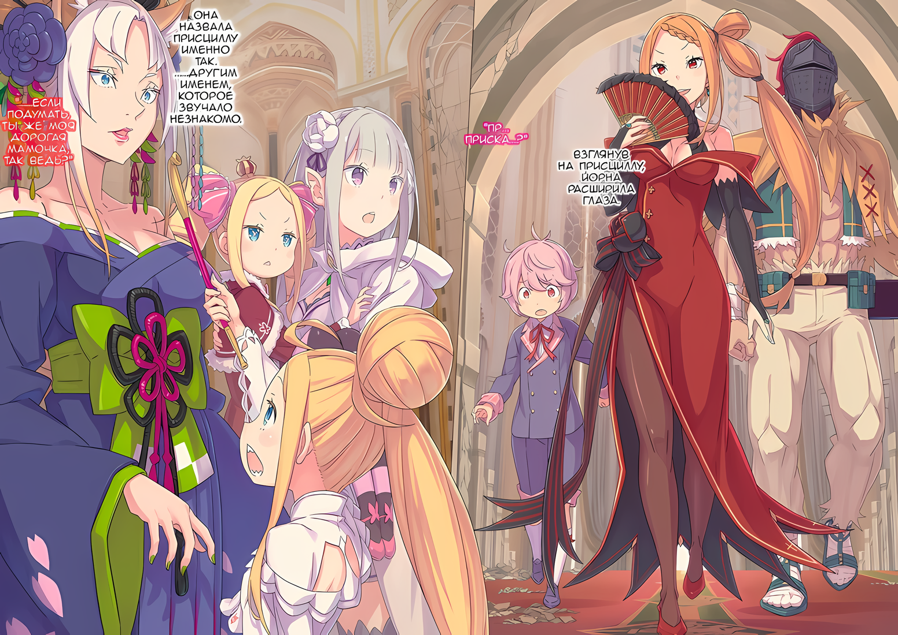

Она бежала, или иначе, буквально летела, изо всех сил стараясь не трясти головой девочки, которую держала на руках.

Караван повозок прибыл на южную сторону города, и как только Эмилия услышала, что многие прибыли из Города Демонов Хаосфлейм, ее серебряные волосы заплясали в предвкушении долгожданного воссоединения.

Эмилия: Очень скоро мы встретимся с Субару, Беатрис…!

Девушка, которую она держала на руках, спала с закрытыми веками — Беатрис.

Чтобы разбудить девушку, которая долгое время спала, чтобы не истощать свою ману, ей было совершенно необходимо установить контакт с Субару, с которым у нее был контракт, чтобы она могла получать от него запасы маны.

Субару также нуждался в том, чтобы Беатрис забирала его ману, иначе у него были бы проблемы, так что эти двое были действительно переплетены одной судьбой.

Их отношения, которые обычно выглядели так, что они всегда ладили друг с другом, рука об руку, теперь, когда Субару был выброшен в Империю и разлучен с ними, означали серьезные проблемы.

Субару и Беатрис должны были воссоединиться как можно скорее.

И……

Эмилия: ……Субару.

Эмилия сама хотела убедиться, что Субару в безопасности как можно скорее, пусть даже на одну секунду.

Она не чувствовала себя такой беспокойной с тех пор, как Пак в одностороннем порядке нарушил контракт и исчез по собственному желанию… нет, это было нечто большее.

Пак, возможно, и был в порядке сам по себе, но Субару — нет.

Кто-то, кто был способен понять Субару, должен был быть рядом с ним.

Эмилия: Оййй, извините!

Открыв глаза, Эмилия свернула ко входу в здание мэрии.

Хотя она должна была войти через дверной проем, а затем подняться по лестнице на самый верх, ее нетерпение было настолько велико, что вместо этого она сформировала столб изо льда. Оседлав ледяное образование, поднимающееся из земли, Эмилия, держа на руках Беатрис, поднялась на самый верх здания.

Это испугало стражников и горожан, но она не смогла удержаться.

Теперь, наконец……

Эмилия: Субару!

???: А, Эмили?

Когда ледяной лифт достиг высоты последнего этажа, Эмилия спрыгнула с него на здание.

Когда она приземлилась и посмотрела наверх, то увидела, что в мэрии уже собралось приличное количество людей, и все, казалось, были удивлены внезапным появлением Эмилии.

Посреди всего этого была Мизельда, женщина с протезом ноги, которая оставила сильное визуальное впечатление; та, кто объединил Племя Судрак, и та, кто принял появление Эмилии с чувством легкости.

Она ткнула в пол кончиком своей деревянной ноги и посмотрела на ледяной столб позади Эмилии, и затем:

Мизельда: Ты очень удобно пользуешься магией. Ты так отличаешься от нас.

Эмилия: Мм, я очень торопилась, поэтому я решила…… Ой, прости, что напугала! Я развею его через секунду!

Увидев впечатленную реакцию Мизельды, Эмилия поспешила растворить лед в мане.

В Королевстве было довольно распространено делать различные вещи с помощью магии, но в Империи, казалось, было не так много пользователей магии. Учитывая, сколько людей, по слухам, хотели сражаться в Империи, это казалось странным.

Мизельда: В большинстве случаев, если ты нападешь до того, как они используют магию, результат будет в одни ворота.

Эмилия: Я знаю это. Но это только если ты рядом, а не вдали.

Мизельда: Когда ты вдали, тогда и приходит на помощь мой лук. Хотя Таритта лучше владеет луком, чем я.

На улыбку Мизельды Эмилия ответила улыбкой, сказав «точно».

Имя «Таритта», которое она слышала несколько раз, должно быть, было именем младшей сестры Мизельды. Таритта, которая, очевидно, была гордостью и радостью Мизельды, была с группой, которая отправилась из Гуарала в Город Демонов на юго-востоке….

Эмилия: ……! Точно. Люди, отправившееся на юг, вернулись, верно?

На мгновение ее мысли ушли куда-то в сторону, но именно по этой причине Эмилия так спешила туда, используя свою магию.

Прижав Беатрис к груди, Эмилия осмотрела зал на верхнем этаже.

Тот факт, что среди толпы были люди в необычной дорожной одежде, доказывал, что группа, прибывшая в Город-крепость на лошадях и повозках, находится здесь.

В разгар всего этого……

Эмилия: Субару… ты здесь!? Мы пришли чтобы забрать тебя! Отто и Петра-сан… Леди Петра скоро будут здесь!

Она огляделась, ища в толпе долгожданного черноволосого юношу.

Когда Эмилия услышала в доме, где они остановились, что прибыла карета, она подхватила Беатрис на руки и поспешила в ратушу впереди Петры и Отто.

Они тоже очень спешили в ратушу, чтобы встретить Субару.

Зная, что она чувствует то же самое, что и эти двое, но все равно побежав впереди планеты всей, Эмилия понимала, что поступила несправедливо. Несмотря на это, она хотела встретиться с Субару как можно скорее.

Беатрис тоже была такого же мнения, но у Эмилии были свои причины для встречи с Субару….

Эмилия: ……Кх, Субару!

Внезапно, когда ее коснулись плеча, Эмилия отреагировала так, как будто ее перевернули.

Это было так неожиданно, что человек, который похлопал ее по плечу, испугался и расширил глаза. Однако, удивленный человек перед ней не был Субару.

???: Эмили….

Эмилия: Фредерика… Ты пришла первой. Ну… ладно.

Это было немного неловко, и Эмилия не знала, какое выражение сделать на своем лице.

Конечно, Фредерика тоже волновалась за Субару, поэтому неудивительно, что она пришла в мэрию первой.

Эмилия: Что же, ты успела поговорить с Субару? Слушай, я хочу сводить Беатрис к нему. Я тоже хотела бы поговорить с Субару, но сначала Беатрис….

Фредерика: ――. Я должна вам кое-что сказать.

Эмилия: А?

Фредерика опустила уголки своих прекрасных изумрудно-зеленых глаз и мрачным голосом обратилась к Эмилии, которая вспотела и говорила, словно искала оправдания.

Она не знала, почему у Фредерики такое отношение.

Эмилия: Ах, Гарфиэль….

Если присмотреться, то не только Фредерика, но и Гарфиэль прибыли в мэрию раньше. Когда Петра и остальные прибыли чуть позже, все спутники Эмилии, приехавшие в Гуарал, уже были здесь.

Все они будут приветствовать разлученного с ними Субару.

Эмилия надеялась на это, но……

Фредерика: К сожалению, Субару-сама снова был потерян в Городе Демонов Хаосфлейм…… Среди тех, кто вернулся, его не было……

Фредерика с болью передала столь душераздирающее сообщение.

△▼△▼△▼△

???: Что значит «братуху и Рем-чан забрали»!?

Расширив свои большие круглые глаза, девочка закричала, топая ногами.

Это была золотоволосая девочка со странной прической из кос и различных узлов. Девочка, которой на вид было лет двенадцать или тринадцать, с недоуменным выражением лица разглядывала окружающих ее взрослых.

В просторном зале на самом верхнем этаже ратуши Города-крепости Гуарал собрались те, кому были отведены различные роли в суматохе этого города, а точнее, этой Империи.

Посреди такой суматохи Отто Сувену захотелось схватить себя за голову, потому что они каким-то образом оказались втянуты в нее.

Хотя это происходило на глазах у людей, водрузивших флаги с изображением волка, пронзенного мечами. Полагая, что было бы немыслимо проявить такую слабость, он сохранил жесткое выражение лица.

Девочка: Я вернулась, а в городе беспорядок и стены пропали, это какая-то катастрофа! Кроме того, здесь нет братухи и Рем-чан, я напугана, и у меня кружится голова!

???: Аа, уу!

Как только она это сказала, глазные яблоки и голова девочки закружились, пока она разочарованно топала. Сбоку от нее стояла отдельная девочка примерно того же возраста, чтобы последовать ее примеру, эта молодая девочка со светлыми волосами начала аукать.

Взрослые выглядели озадаченными и недоумевающими по поводу обращения девочек друг к другу.

Ситуация требовала, чтобы кто-то взял на себя инициативу, но Отто раздумывал, стоит ли ему вмешаться, так как его одолевало таинственное беспокойство, не дававшее ему пошевелиться.

Отто: ……Хмм, мне кажется я где-то видел эту аукающую девочку.

Рядом с девочкой, которая взяла на себя инициативу говорить, Отто не мог отделаться от ощущения, что девочка, которая не произнесла ни одного осмысленного слова, была ему как-то знакома.

Хотя Отто обычно старался не забывать людей, с которыми обменивался словами, он смутно помнил времена, когда он слишком много пил. С тех пор как он начал работать в лагере Эмилии, он старался не напиваться до такой степени, чтобы потерять память, но ему было интересно, не столкнулся ли он с этой девочкой, пока был пьян.

Девочка: Эй, как дела у братухи и Рем-чан? Кто-нибудь знает….

Зикр: ……Прежде чем я продолжу, могу я прояснить одну вещь, юная леди?

Девочка: Хм? Какую же, Зикр-чин?

Пока Отто погрузился в размышления, к девочке подошел Зикр, представитель города.

Отто уже много раз обменивался с ним словами, и он считал его надежным партнером. Один тот факт, что он был человеком, с которым можно было общаться в Империи, делал его редкой находкой.

Зикр поднял свои густые брови и посмотрел на девочку сверху вниз…

Зикр: Если я не ошибаюсь в восприятии, то это мисс Медиум?

Медиум: А? Конечно, что не так? Это же легко понять, если просто посмотреть.

Луис: Ууу!

Девочка с руками на бедрах и надутой грудью…… ее звали Медиум, а рядом с ней, которая кивнула головой, девочка, которую он не мог вспомнить, приняла такую же позу.

После этих слов Зикр с обеспокоенным лицом посмотрел на человека рядом с Медиум.

И……

Зикр: ……Абел-доно, это…

Абел: Это из-за техники Ольбарта Дарккенна. Причина, по которой ее ответ не соответствовал действительности, заключалась в ее первоначальном образовании, а не в этом состоянии.

Зикр: Понятно. Техника Генерала Первого класса Ольбарта…… Я так рад, что ты невредима.

Медиум: Если так можно сказать, то… да.

Выслушав объяснение, Зикр осторожно положил руку на подбородок и словно задумался. Прояснив это для Зикра, Абел спокойно сложил руки и посмотрел на Медиум.

Абел: Те, кто остались, поражены. Увидев, что ты уменьшилась.

Медиум: Я? …А! Понятно! Простите, простите все! Я так привыкла к тому, что уменьшилась, да, я теперь крошечная! Как и Субару-чин!

С маленьким телом, Медиум подняла руку и объяснила свою ситуацию. Даже услышав это, Отто никак не мог взять в толк, но оригинальная Императорская группа казалась несколько убежденной.

Они хоть и были в замешательстве и не могли отрицать, что мало знают, считали, что более важно понять смысл слов другой стороны, ведь это наверняка было что-то, что Отто и его друзья не могли пропустить.

???: ……Субару

Луис: Уау…

И в то же время раздался слабый шепот, вероятно, с тем же смыслом.

Именно девочка с опущенным лицом рядом с Медиум вложила в этот звук тон, четко отличающийся от предыдущего аукания. А та, кто издала звук, имеющий тот же оттенок, что и у девочки, была…

Эмилия: Ты… тоже беспокоишься о Субару?

Это была Эмилия, которая опустила брови при виде девочки.

Эмилия, со спящей Беатрис на руках, была одной из тех, кто был особенно разочарован, услышав, что Субару не было в группе, возвращающейся из Города Демонов.

По сравнению с ней и Петрой было бы самонадеянно назвать чувства Отто разочарованием. Но это было не потому, что он предчувствовал, что встретиться снова может быть не так просто.

В любом случае……

Луис: Уу, аау.

Эмилия: Нет, я не думаю, что это твоя вина. Я очень разочарована, что Субару здесь нет, но сейчас не время хандрить. Субару прошел через гораздо большее.

Луис: Ууу….

Эмилия: Ты беспокоишься обо мне? Спасибо. Я знаю, что ты тоже через многое прошла.

Девочка с подавленным видом и Эмилия общались друг с другом таким образом.

Слова, вылетавшие из уст девочки, не имели четкого смысла, но Эмилия смотрела ей в глаза и обменивалась словами, как будто понимала их значение.

Это само по себе свидетельствовало о решимости разбитого сердца Эмилии, и такой обмен словами не мог не радовать Отто. Однако……

Абел: ……Я никогда не ожидал, что спутники Нацуки Субару проделают весь этот путь, чтобы навестить его.

Этот голос пронесся по залу, как холодный, сухой ветер.

Эмилия подняла взгляд и повернулась к тому, кто произнес это…… к человеку с маской Они на лице, который только что обменялся словами с Зикром и Медиум.

Аметистовые глаза Эмилии сузились при виде темноволосого мужчины с маской Они, закрывающей его лицо.

Эмилия: Вы тоже друг Субару?

Абел: У меня нет друзей. И он не думает обо мне в этом смысле. Наши взаимоотношения связаны лишь с совместной работой над достижением цели.

Эмилия: Значит, вы товарищ. Абел… может быть, вы тот человек, о котором Зикр-сан говорил ранее?

Ответ мужчины был жестким и резким, но Эмилия была невозмутима и повернулась к Зикру. В ответ на ее вопрос Зикр выпрямил спину и ответил: «Да».

Зикр: Это тот, кто должен вести нас, Абел-доно. Мне доверили город только под его руководством.

Абел: Кстати говоря, здесь, конечно, много разрушений.

Зикр: ……За это мне действительно стыдно.

С гримасой Зикр глубоко поклонился человеку…… Абелу за ущерб, нанесенный городу.

Вместо недовольства необоснованными выговорами, на горьком лице Зикра отразилось раскаяние в собственной неспособности выполнить свою работу.

Отто, который присутствовал на месте событий, считал, что Зикр и все остальные в городе сделали все возможное, чтобы предотвратить его полное разрушение, но……

Медиум: Абел-чин, не говори так! Все старались изо всех сил!

Абел: Даже если так, разве ты не злишься, что у тебя похитили брата?

Медиум: Братуха так старался, что его забрали! Если бы его не забрали, у нас были бы большие проблемы! Это мой братуха! Даже когда его забрали, братуха очень клевый!

Именно Медиум энергично подхватила заявление Абела.

Судя по течению разговора, ее брат, вероятно, тот самый мужчина-торговец, которого похитили вместе с Рем. Мизельда говорила, что он был нежным и дружелюбным убийцей чувств женщин.

Согласно другим рассказам Куны и Хоули, похищение этого мужчины и Рем стало решающим фактором, заставившим врага, члена «Девяти Божественных Генералов», отвести летающих драконов.

Другими словами, высказывания Медиум о ее брате были не так уж далеки от истины.

Абел, который только что вернулся из Города Демонов, никак не мог знать об этой ситуации……

Абел: Зикр.

Зикр: Да!?

Абел: Не обращай внимания на то, что я сказал. С самого начала ты имел дело с Мэделин Эшарт и группой летающих драконов. Ты заслуживаешь признания за свою работу в ситуации, когда город, возможно, пришлось бы оставить.

Зикр: ……! Я польщен.

Слова, которые продолжились без колебаний, не были результатом того, что его поразили уговоры Медиум.

С самого начала эти слова уже были подготовлены к тому, чтобы быть сказанными Зикру. С самого начала у него не было намерения обвинять его в ущербе, нанесенном Гуаралу.

Медиум: ……Абел-чин, твой характер ужасен!

Луис: Ууу!

Абел: Хватит.

Медиум и девочка атаковали Абела с двух сторон, пока он стоял со скрещенными руками. Абел дал короткий отпор, когда эти двое вцепились в него, дергая за рукава и тыкая в поясницу.

Можно было примерно представить себе их отношения……

???: ……Итак? Когда же мы продвинемся в этом деле?

Тем временем, женщина, которая спокойно наблюдала за происходящим, наконец, пошевелила губами.

Это была лисица-красавица с необычным присутствием и чрезмерно гламурной личностью…… в некотором смысле, личность, которая, просто находясь здесь, не могла не быть замеченной; как Эмилия, обладающая необычной красотой, и Абел, чья эксцентричная маска Они привлекала внимание.

Это было очевидно, даже ничего не говоря.

Она была причиной, по которой Абел и Медиум покинули окруженный стеной город и отправились в Город Демонов, Хаосфлейм.

???: Генерал Первого класса Йорна Миссигр.

Кто был источником этих слов?

Возможно, кто-то в комнате назвал это имя. Однако, поскольку никто не озвучил поправки, было очевидно, что это утверждение было верным.

……Йорна Миссигр.

Правительница Города Демонов, Хаосфлейм, и член «Девяти Божественных Генералов», самых могущественных военных в Империи.

Привлечение ее на свою сторону будет большим благом, которое всколыхнет государство этой обширной Империи.

Путешествие, во время которого пропал Субару, изначально было задумано с целью ее вербовки.

Зикр: Генерал Первого класса Йорна, прежде всего, я хотел бы поблагодарить вас за визит. Я Зикр Осман, Генерал Второго класса Империи Волакия.

Йорна: Я слышала твое имя по пути. В лицо ты кажешься симпатичным человеком, как и сказали Медиум с Тариттой.

Зикр: Мисс Медиум и мисс Таритта?

Зикр, который начал сурово говорить, моргнул, услышав ответ Йорны.

Сейчас было не время для этого, но его взгляд обратился к Медиум и другой высокой женщине. Смуглокожая женщина в мужском одеянии, вероятно, была Тариттой, о которой шла речь.

Обе ответили на взгляд Зикра улыбкой и кивком. Зикр, которого называли «Бабником» за его мягкое, мужественное поведение, возможно, и был смущен, но выглядел он очень довольным.

Кашлянув, он прочистил горло, как бы желая успокоить свои эмоции,

Зикр: Итак, Генерал Первого класса Йорна готова сражаться вместе с Абелом-доно?

Йорна: Ты можешь думать об этом так. У меня свои планы, но мои интересы… совпадают с интересами Абела.

Абел: Решено. В договоре с Йорной Миссигр нет никаких проблем.

Йорна была одета в роскошное кимоно и держала в руке золотое кисэру. Хотя ее предыдущая репутация создавала впечатление, что она была довольно беспокойной женщиной, ее поведение было спокойным и собранным.

Группа Отто слышала, что Хаосфлейм был серьезно поврежден.

Именно поэтому в Гуарал прибыл огромный караван повозок, и именно поэтому им пришлось разместить сразу такое большое количество людей.

И посреди всех этих разрушений, которым подвергся Город Демонов……

???: ……Субару куда-то отправили.

???: …………

В разговор ворвалась Эмилия с голосом, звучащим как серебряный колокольчик.

Войдя в историю под другим углом, взгляд Абела сквозь маску Они обратился к Эмилии. Она не вздрогнула, несмотря на явно недоброжелательный взгляд.

Беатрис была в ее объятиях, Петра и Фредерика тихо стояли рядом, а Гарфиэль имел суровое выражение лица. Возможно, Отто тоже немного поспособствовал этому.

Действительно, заявление Эмилии могло быть для них просто шумом.

Однако у них были свои обстоятельства. Будет проблематично, если разговор продолжится с игнорированием группы, которая спешно пересекла границу, чтобы попасть сюда.

Эмилия: Еще раз, давайте начнем с самого начала. ……Я Эмили, а ты Абел, верно? Друг Субару…… Нет, его товарищ.

Абел: ――. Да.

Эмилия: Субару уехал с вами в другой город… Ну, к Йорне-сан, а потом случилось что-то ужасное, и вы разлучились. Это правда?

Йорна: Да, это так. Правда… выражение «Что-то ужасное» не совсем подходит.

Абел и Йорна кивнули Эмилии, которая подняла свои брови, подтверждая только что описанное. Получив их реакцию, особенно слова Йорны, Эмилия приняла их с открытым сердцем и сказала: «Ясно».

С точки зрения собеседников, поверхностные слова постороннего человека могут быть оскорбительными, и Эмилия тоже тщательно подбирала слова, зная, что ее слова попадают в эту категорию.

Эмилия: Ты не можешь сказать, куда попал Субару после того, как он отделился от остальной группы. Несмотря на то, что все искали, вы не смогли его найти, а многие люди остались без дома. Вот почему ты вернулся в этот город в таком виде, и мы обсуждаем это здесь… Так?

Абел: Тут нечего исправлять. Тем не менее, это была трагедия такого масштаба. Учитывая ее масштаб, трудно поверить, что пропавший человек находится в безопасности….

Эмилия: ……С Субару все в порядке, это точно.

Эмилия прервала Абела, заговорив низким, но властным голосом.

Доверие в ее голосе заставило черные глаза Абела сузиться сквозь маску Они. Его глаза, омраченные глубокой задумчивостью, искали основание для замечания Эмилии.

Абел выдержал паузу, а затем спросил Эмилию: «Почему ты так уверена?».

Абел: Ты не знаешь подробностей того, что произошло в Городе Демонов. В таких обстоятельствах исчезновения одно неверное движение может стоить ему жизни… Почему ты так уверена, что он выживет в такой ситуации?

Эмилия: …………

До сих пор Отто и остальные слышали только новости о разрушении Хаосфлейма и слухи о том, что оно было вызвано невероятным бедствием.

Подлинность слов Абела была неизвестна, и невозможно было оценить, насколько он драматизировал факты. Но Отто мог быть уверен, что это не бессмысленный блеф.

В то же время в том, как он говорил, была небольшая заминка.

Тон Абела был холодным, но он мог почувствовать его намерение узнать о них больше. ……Нет, он скорее хотел узнать о Субару через Отто и остальных.

Похоже, он думал, что Субару что-то скрывает от него. Если речь шла о положении Субару в Королевстве, они не могли легкомысленно передать эту информацию.

Отто: Эмили, это…

Эмилия: Я верю в Субару, и я верю, что Субару будет делать все возможное, пока мы не приедем за ним. Неважно, насколько все сложно.

Опасаясь наводящих вопросов, Отто попытался контролировать разговор, но Эмилия ответила раньше него. Однако это было заявление о доверии, основанное на идеализме, а не на конкретной основе.

Это было не то, чего боялся Отто, и не то, чего хотел Абел. Естественно, Абел был разочарован и опустил взгляд.

Абел: Это все выдавание желаемого за действительное без каких-либо убедительных доказательств. Разочаровывает, что ты так рассуждаешь.

Эмилия: Да? Я думаю, что это очень приятно и важно, когда люди верят в меня. Я чувствую себя в безопасности, когда могу кому-то доверять, и это придает мне сил, когда доверяют мне. А ты?

Абел: В конце концов, чувства — это всего лишь чувства. Вряд ли они могут быть решающим фактором помимо этого.

Эмилия вздрогнула от ответа Абела, покачала головой и закрыла один глаз.

Отто не успел вмешаться, но этого было достаточно, чтобы он понял, что эти двое — вода и масло. Иными словами, такова была разница между Эмилией, которая верила в ценность сердца, и Абелом, который не верил.

Эта разница, скорее всего, была разницей во взглядах на жизнь, и вряд ли ее можно было легко преодолеть.

Поэтому……

Абел: ……Никто не может сказать наверняка, жив Нацуки Субару или мертв. Только потому, что он всегда избегал смерти на волосок от гибели, нет никакой гарантии, что так будет и в этот раз.

Это утверждение, похоже, было заключением Абела в этом разговоре.

Когда Эмилия услышала это, ее губы сжались,

Эмилия: Ты имеешь в виду Субару.…

Она быстро посмотрела на Абела и собиралась что-то сказать.

Но одна девочка выпрямилась быстрее, чем она успела продолжить свои слова. Это была маленькая деочка на руках Эмилии с закрытыми глазами.

Беатрис: Если вам нужно подтверждение того, что Субару жив, то оно есть у Бетти.

Эмилия: Беатрис!

Фредерика: -сама!

Прижавшись к ее груди, Беатрис открыла глаза, которые имели характерный рисунок. Эмилия, глаза которой расширились, тут же назвала ее имя, к чему Фредерика поспешила добавить почетный титул.

Независимо от того, было ли этого достаточно для маскировки, слова Беатрис имели определенный эффект, привлекая внимание Абела и других, кто не знал, что происходит.

Абел: Почему у тебя есть уверенность в том, что Нацуки Субару жив или мертв?

Беатрис: Все просто, я полагаю. Это потому, что Бетти и Субару связаны душой!

Йорна: ……Ах, так вот оно как. Если этот и тот ребенок глубоко связаны, то я вижу в этом логику.

Эмилия: Да-да, они находятся в договорных отношениях. Вот почему….

Абел: Эта девочка в ослабленном состоянии? В этом есть смысл.

Несмотря на отсутствие четкого объяснения, Абел и Йорна смогли разобраться в ситуации.

Раскрытие того факта, что Беатрис была Духом, не сулило ничего хорошего Отто и остальным, которые прибыли в Империю под чужими именами, но эти двое, скорее всего, уже поняли это.

Однако трудно было представить, что Абел и его группа, целью которой было восстание против Императора в столице Империи, станут что-то делать с ними на том основании, что они нарушили указ Империи.

Отто: Если вы убеждены, значит, вы понимаете. Помимо удобства и местонахождения Нацуки-сан, у нас есть средства, чтобы подтвердить, жив он или мертв. Поскольку Беатрис-сама так говорит, мы можем быть уверены, что неважно где… Нацуки-сан жив в том месте, куда его отправило.

Йорна: ……Это так? Тогда… возможно… Танзе будет приятно.

Брови Йорны слегка опустились на дополнительные слова Отто.

Она прошептала эти слова, которые, похоже, были именем человека. Судя по тому, как они прозвучали, кто-то потерял свою жизнь. ……Похоже, что это тоже не было не связано с разрушением Города Демонов.

Однако, чтобы разобраться в этом, нужно было быть готовым отправиться в мир Йорны.

Петра: Эм, мы можем немного отступить назад?

Эмилия: Петра-чан.

Фредерика: -сама!

Внезапно, не желая упустить минутное молчание, Петра подняла руку и попросила права говорить; Эмилия небрежно окликнула ее снова, и Фредерика тут же пришла ей на помощь.

С гордо стоящей рядом Петрой, она привлекла внимание группы взрослых, которые были ей незнакомы.

Петра: Ранее Медиум-чан сказала, что ее сделали маленькой. Это правда?

Медиум: Ах, да, это правда! Раньше я была очень высокой! Примерно такого же роста, как вон тот светловолосый мальчик…… ммм, нет, примерно такого же роста, как та женщина!

Гарфиэль: Во-первых, почему ты списала крутого меня?

Фредерика: Я понимаю, о чем ты. Хотя, мне тоже не очень приятно слышать о своем росте.

Получив указание Медиум, Гарфиэль и Фредерика ответили по очереди.

Однако история Медиум, скорее всего, была правдой, поскольку никто ее не опроверг. В это трудно поверить, но, видимо, произошло нечто таинственное, что заставило тело человека уменьшиться.

Возможно, это означало….

Петра: Субару тоже стал маленьким?

Петра спросила серьезным, немного твердым голосом.

Это был большой вопрос, который Отто и остальные не могли позволить себе игнорировать. Было бы достаточно сложно просто встретиться с Субару, которого отправили в Империю, но они не ожидали ситуации, в которой его тело уменьшится.

Отто, желая помолиться о том, что он ослышался, был убежден, однако, что его молитва никогда не была и не будет услышана в полной мере.

Не зная о чувствах Отто, Медиум слегка кивнула головой и сказала: «Все верно».

Медиум: Субару-чин совсем как я! Может, чуть меньше? В любом случае, он получился таким крошечным! Но я слышала, что Субару-чин и Йорна-чан вместе побили дедушку, так что Субару-чин просто супер!

Эмилия: Да, Субару удивительный!

Петра: Да, Медиум-чан права.

Беатрис: Естественно, я полагаю. Он же партнер Бетти!

Хотя само содержание было трудно принять, безоговорочная похвала Медиум была музыкой для ушей. На самом деле, Эмилия, Петра и Беатрис были в хорошем настроении, услышав похвалу в адрес Субару.

Ни Гарфиэль, ни Фредерика, ни Отто не чувствовали себя плохо. Они не чувствовали, но поскольку похвала сопровождалась нежелательной информацией, Отто стал весьма обеспокоен.

Отто: Если Нацуки-сан тоже уменьшился… Наверное, он стал ребенком? Не уставая просто переодеваться в женскую одежду, теперь он становится ребенком… инфантилизируется? Какой неугомонный человек……

Фредерика: Действительно, приставать к Субару-сама по поводу наличия партнера достойно сожаления, но… Но я беспокоюсь, я не могу позволить ему встретиться с Клиндом.

Отто: Это одно, но я уверен, что есть другие заботы, более важные……

Какими средствами было вызвано такое явление?

Поскольку это событие было так далеко от реальности, возникли сомнения, можно ли его обратить вспять, и если да, то будут ли какие-либо последствия. В худшем случае существовала даже вероятность того, что Субару вернется в Королевство Лугуника в качестве рыцаря Эмилии, оставаясь при этом маленьким.

Эмилия: Ну, в любом случае, с точки зрения способностей, разница не большая.

Субару был бы очень возмущен, если бы услышал это, но если они смогут найти его, это будет приемлемым ущербом.

Если бы он смог правильно вырасти, то у него не было бы слишком много проблем в отношениях с Эмилией, полуэльфийкой. Она сможет подождать, пока он подрастет.

Отто: Я не должен… Возможно, я тоже немного не в своей тарелке.

Казалось, что порядок приоритетов в заботах нарушился.

Пока что это была неудача, что они не смогли встретиться с Субару, но благодаря Беатрис они теперь были уверены в том, что он жив.

Теперь, с Зикром и остальными… Нет, если представителем был Абел, они должны решить, хотят ли они продолжать с ними сотрудничество или нет.

Гарфиэль: .…Беатрис-сама? Почему вы так выглядите?

Отто: ……?

Положив руку на подбородок, собираясь обдумать варианты, Отто случайно обратил внимание на слова, произнесенные Гарфиэлем.

Взгляд Гарфиэля обратился к Беатрис на руках Эмилии. Она проснулась, но, желая избежать изнеможения, осталась в объятиях Эмилии, причем ее хорошее настроение от предыдущей похвалы Субару было недолгим, так как глаза ее расширились.

Взгляд, отдающий ее дрожащими глазами, был направлен не на Медиум.

Там была другая девочка, прижавшаяся к ней, будто они были сестрами. Беатрис уставилась на нее, даже не услышав ее имени.

Беатрис: ……Почему ты здесь, я полагаю.

Луис: Уу?

Беатрис: Отвечай! Никаких лишних движений, я полагаю!

Сразу после того, как Беатрис задала вопрос дрожащим голосом, ее голос повысился, а выражение лица изменилось.

После этого звука маленькая девочка, наклонившая голову, подпрыгнула от удивления, и, естественно, Отто и остальные были удивлены реакцией Беатрис.

Отто: Бе-Беатрис… сама, что случилось? Ты вдруг накричала на эту девочку……

Беатрис: Кричать — это разумный поступок, я полагаю! Отто! Ты, наверное, еще не понял?

Отто: Я? Что…… А.

Перед лицом этого выговора в глубине сознания недоумевающего Отто что-то утвердилось.

Сначала, когда он увидел девочку, это было ноющее, туманное чувство, которое было с самого начала, но которое постепенно становилось все яснее и яснее из-за отношения Беатрис.

Да, Отто узнал эту девочку. Это было чувство… дежавю, которое не должно было существовать в Империи, месте, которое он посещал впервые.

Отто: Невероятно, это же……

Отто уставился на девочку, и в его сознании всплыла поразительная возможность.

Возможность, которая витала в воздухе, была чем-то, что, казалось, находилось в уголке смутной памяти Отто. В то время его нога была разрезана, и он то и дело терял сознание от боли и потери крови.

Поэтому, хотя он и не видел ясно, кто это сделал….

Эмилия: Беатрис, Отто-кун, что такое? Вы оба, просто посмотрите на эту девочку….

Смущенная реакцией Отто и Беатрис, Эмилия обратилась к ней без почестей, но никто не дополнил ее слова. А потом в этом уже не было необходимости.

Потому что больше не было причин для того, чтобы замешательство оставалось замешательством.

Беатрис: ……Это «Чревоугодие», я полагаю.

Эмилия: Ээ….

Глаза Эмилии расширились, когда Беатрис заговорила спокойным, но жестким тоном.

Однако не только Эмилия замерла, но и все остальные, кто услышал ее голос, и именно в этот момент голос Беатрис привлек внимание всех присутствующих в комнате.

Таким образом, все услышали личность этой маленькой девочки.

Беатрис: Эта девочка, Архиепископ Греха «Чревоугодия»…… девочка, по имени Луис Арнеб, я полагаю.

△▼△▼△▼△

……Как только Беатрис произнесла эти слова, в комнате воцарилась атмосфера нестабильности.

Гарфиэль: Это, должно быть, какая-то шутка. Архиепископ Греха? Что, черт возьми, тут вздумалось?

Понятно, что когда слова Беатрис отозвались эхом, шок, ужас и замешательство немедленно распространились.

Это было то, что сказала молодая девушка. Обычно ни один взрослый, обладающий здравым рассудком, не принял бы подобное без колебаний. Однако это не относилось к Отто и остальным.

Естественно, Отто, смутно узнавший внешность девочки… Луис, а также члены лагеря, считавшие, что Беатрис не станет лгать, сразу же приняли это как факт.

Соответственно, Гарфиэль шагнул вперед, хрустнув костяшками пальцев и обнажив клыки.

Сразу же Гарфиэль сузил зрачки своих зеленых глаз и уставился на Луис.

Гарфиэль: Вдобавок ко всему… «Чревоугодие»? Разве это не та, кто занимает первое место в списке ублюдков, которых мы должны побить? Это и есть Имперский Путь!?

Медиум: С-стойте! Это не правильно! Луис-чан не плохая девочка!

Загородив Гарфиэлю обзор, Медиум раскинула руки, чтобы защитить Луис.

Ее желание защитить стоящую за ней девочку было похвальным, но было крайне маловероятно, что она смогла бы остановить гнев Гарфиэля. В первую очередь……

Отто: Ты говоришь, что она не плохая девочка, серьезно? К твоему сведению, она некогда сильно покалечила мои ноги. У меня до сих пор осталось несколько шрамов, мне показать их?

Медиум: Это была не… Луис-чан, возможно, это была другая девочка…

Отто: Прости, но она явно представилась так. Кроме меня были и другие жертвы… несомненно, их было неисчислимое количество. Некоторые были нашими друзьями и друзьями наших союзников.

Медиум: Н-но… но… но…икхь!

Со слезящимися глазами Медиум отчаянно искала слова опровержения.

Однако, независимо от того, был ли ее интеллект настолько детским, насколько она выглядела, или даже если уменьшилась только ее внешность, Отто намеревался прекратить эту словесную войну.

В любом случае, никто в мире не мог защитить Архиепископа Греха.

Архиепископы Греха и Культ Ведьмы были отвратительны до такой степени.

Вот почему Эмилия, внешне идентичная «Ведьме Зависти», которая была причиной всего этого, не смогла избежать насмешек за свою несбыточную мечту.

Медиум: Возможно, Луис-чан была такой раньше… но сейчас Луис-чан другая!

Гарфиэль: Другая? На чем ты основываешься?

Медиум: Потому что! Она дружила с братухой, Субару-чин и Рем-чан! Я была с ней все это время… и она не сделала ни одного плохого поступка! Не сделала!

Отто: ……С Нацуки-сан?

Отчаянное, тщетное сопротивление Медиум, крики, когда она судорожно искала слова, ударили по его ушам чем-то странным, слишком большим, чтобы игнорировать.

Субару действовал вместе с Луис. ……Безусловно, это было не потому, что он не знал, кто такая Луис. Субару должен был быстро догадаться об истинной личности Луис.

Петра: Отто-сан, Субару не мог дойти до потери памяти или чего-то подобного, верно?

Отто: На мгновение меня охватил страх, но, судя по тому, что я слышал от Мизельды-сан и Зикра-сан, думаю, это не так уж и важно.

На тревожные слова Петры, Отто отмахнулся от своих опасений благодаря представленным на рассмотрение доказательствам.

Если бы дело обстояло так, что он был вместе с Архиепископом Греха «Чревоугодия» Луис, которая была здесь; ситуация, когда Субару лишили его «Воспоминаний», была, конечно, пугающей.

Поскольку он помнил Субару, вероятно, не было никаких опасений, что его «Имя» было съедено; но были ли съедены его «Воспоминания» — это вопрос личных симптомов Субару.

Однако……

Эмилия: ……Истории о Субару, которые мы слышали в этом городе, все еще рассказывают о том Субару, которого мы знаем. Так что не стоит беспокоиться об этом, Петра-чан… Петра-сама.

Петра: Спасибо, Эмили.

На словах Эмилии, которая пришла к такому же выводу, Петра тоже наконец-то показала выражение облегчения.

Хотя это было обоснованием того, почему они могли сказать, что «Воспоминания» Субару не были съедены, было трудно сказать, что это было основанием для принятия решения о том, как поступить с Луис, которая была сейчас здесь.

Конечно, нельзя отрицать вопрос о том, почему Субару так или иначе ничего не предпринял в отношении Луис, но……

Отто: Поскольку это Нацуки-сан, то, вероятно, это не был вопрос о том, чтобы заполучить в свои руки молодую симпатичную девочку или что-то в этом роде. ……Возможно ли, что он был обеспокоен требованиями отмены действия этого Полномочия?

Фредерика: Мы уже говорили об этом раньше. Даже если мы победим Архиепископа Греха «Чревоугодия», у нас нет никаких определенных доказательств того, что все, что было потеряно, вернется обратно.

Отто: Это хлопотно, но если это так, то понятно, почему он не действовал опрометчиво.

Как сказал Гарфиэль, сокрушить Архиепископа Греха «Чревоугодия» было горячим желанием их самих, а также кандидатов на Королевский трон, да и всего мира, что было трудно отпустить.

Однако это не было вызвано простым желанием отомстить; их главной целью было восстановление ущерба, нанесенного «Чревоугодием».

Если лишение жизни Луис вернет жертв ее Полномочия к тому состоянию, в котором они были раньше, то проблем не возникнет.

Однако что им делать, если жертвы не будут восстановлены? Субару мог опасаться, что если они поступят необдуманно, то способ вернуть жертв к нормальной жизни может быть навсегда потерян.

Гарфиэль: ……Я знаю, о чем ты думаешь, Оттобро. Но это не значит, что мы должны отпустить это ублюдство на свободу.

Несмотря на понимание мыслей Отто, Гарфиэль высокомерно заявил об этом.

По правде говоря, он был прав. Хотя он и боялся, что лишение ее жизни исключит такую возможность, трудно было поверить, что взятие ее под стражу вызовет какие-либо проблемы.

Напротив, опасность оставить Архиепископа Греха одного, скорее всего, была гораздо выше.

Поэтому в такие моменты Гарфиэль, склонный принимать скоропалительные решения, был надежен.

Постепенно, шаг за шагом, Гарфиэль сокращал расстояние, чтобы приблизиться к опасному Архиепископу Греха. При приближении Гарфиэля, Луис пригнулась, произнеся «Уу».

Медиум: Абел-чин! Скажи что-нибудь!

Защищая Луис за спиной и противостоя Гарфиэлю, Медиум позвала Абела.

Абел, который не вмешивался в ход событий, обратил свое внимание на призыв Медиум.

Абел: Что ты хочешь, чтобы я сказал? Это твое дело.

Медиум: Но я не могу их нормально убедить!

Абел: Не перекладывай на меня ответственность за свой порок. В конце концов, в этом нет необходимости.

Глаза Медиум дрогнули, когда ей сказали, что в этом нет необходимости.

Возможно, жестокая манера Абела говорить создала у нее впечатление, что он оставил Луис. Однако на самом деле это было не так.

Абел сказал, что ему нет нужды вмешиваться.

Гарфиэль: К-крутой я не собирается щадить тебя, даже если ты женщина!

???: Это великолепно. Иначе ты мог бы использовать мою красоту в качестве оправдания своей никудышности.

Перед Гарфиэлем, который приостановился, Йорна шагнула прямо между ними и неторопливо встала.

Вдобавок к высокому росту, Йорна носила толстые подошвы и смотрела на Гарфиэля сверху вниз, держа в руке кисэру. В ответ на ее взгляд он свирепо оскалил клыки.

Йорна будет защищать Луис и заявила о своем намерении сделать это.

Поскольку она изначально пришла в Гуарал из Города Демонов вместе с Луис, они знали, что она не собирается ее уничтожать, но в это было трудно поверить.

Отто: Я повторюсь, она — Архиепископ Греха. Вы же не хотите сказать, что ужасы Культа Ведьмы не известны в Империи Волакия?

Йорна: Нам известны деяния этих негодяев, и их отвратительность. Естественно, мы знаем и о злобе тех, кто называет себя Архиепископами Греха.

Отто: Я слышал, что раны Города-крепости Гаркла до сих пор не зажили.

Крупный Имперский город был разрушен в результате бесчинств «Жадности», Архиепископа Греха из Культа Ведьмы.

Преступник, «Жадность», был побежден в Пристелле, но во всем мире было известно, что Культ Ведьмы не выбирает, где бесчинствовать. Естественно, и в Империи тоже.

Несмотря на это, факт оставался фактом: они оставили Луис на свободе.

Отто: Вы думаете, что сможете их переубедить? Я должен сказать, что это неосмотрительно.

Абел: Если что-то полезно, я подумаю, как это использовать. Это вы, люди, сильно ошибаетесь, думая, что все встанут на вашу сторону.

Отто: …………

Абел уклонился от вопросов Отто и без труда снисходительно заметил это.

Как он и говорил, реакция собравшихся на верхнем этаже ратуши была неоднозначной. Конечно, были и те, кто проявил отвращение и враждебность, узнав, что Луис — Архиепископ Греха. Однако, как и Медиум и Йорна, значительное число из них проявили нежелание устранять Луис.

В частности……

Мизельда: ……Я скажу следующее: Субару и Рем — наши друзья. Поскольку именно они привели Луис с собой, только они имеют право решать судьбу Луис.

Фредерика: Мизельда-сама….

Мизельда: Конечно, если главнокомандующий не согласен, я уступлю.

С глазами, передающими сильную целеустремленность, и бросив пронзительный взгляд в ту сторону, Мизельда попыталась бы встать на сторону защиты Луис. Фредерика, у которой было много возможностей обменяться с ней словами в мэрии, удивилась под этим сильным взглядом.

Мизельда была представителем Судрака, и другие судракийки последовали бы за ней. ……Нет, точнее, они пойдут за вождем, который вернулся в город.

Целью слов и взгляда Мизельды была формально одетая в черное женщина, которой было доверено принять решение. Таритта, новая вождь Судрака, была спрошена своей старшей сестрой: «Что же будем делать?».

Таритта: Мое мнение совпадает с мнением сестры. Однако, это решение было принято не потому, что так сказала сестра; я защищаю Луис по своим собственным причинам. Я в долгу перед Луис.

Мизельда: Ха, понятно.

На четкий ответ Таритты, Мизельда расслабила губы и кивнула.

Сторона Отто не знала, каковы отношения этих сестер, но, похоже, Мизельда с радостью приняла утверждение Таритты.

Однако у них не было возможности считать это радостным.

Беатрис: Архиепископ Греха, да еще и такой, как «Чревоугодие»; закрывать на это глаза, по сути, нельзя. Вы все остудите свои головы, я полагаю?

Из объятий Эмилии слова Беатрис были наполнены силой.

Она зашла так далеко, подавляя свое изнеможение, но в критической ситуации ей было необходимо проявить свои способности. Как и у Субару, не колебаться в таких ситуациях было плохой привычкой Беатрис.

Эмилия: Это не хорошо, все успокойтесь! Так ругаться….

В то время как дух Беатрис и Гарфиэля, а также Йорны и Судрак поднялся, готовясь к битве, Эмилия с душераздирающим выражением лица пыталась остановить спор.

На самом деле, если речь шла о серьезном прекращении спора с помощью грубой силы, Эмилия была единственной, кто обладал способностями, наиболее подходящими для этого.

Если бы она использовала свою огромную ману, чтобы заморозить Гуарал, Отто тем временем постарался бы обезопасить Луис. В худшем случае они разорвут связи со всеми в Гуарале.

Эмилия: Это опаснее, чем закрывать глаза на Архиепископа Греха….

В этот неосторожный момент, когда Отто наблюдал за происходящим…

???: ……В чем дело, плебеи, вы еще недостаточно насражались? Здесь довольно горячо, не так ли?

Отто: …………

Внезапно новый мощный голос потряс атмосферу в большом зале ратуши.

Он принадлежал женщине, чьи туфли громко стучали, когда она неторопливо поднималась по лестнице. Некоторое время назад Отто сказал, что Эмилия, Абел и Йорна обладают присутствием, которое невозможно игнорировать, но обладательница этого голоса тоже была окутана воздухом, который не соответствовал этому впечатлению.

Колыхая подол своего кроваво-красного платья, неторопливо появилась красивая женщина.

У нее была светлая кожа и оранжевые волосы, она смело украсила себя многочисленными украшениями, но даже блеск этих драгоценностей проигрывал ее природной красоте…

…Присцилла Бариэль.

В Городе-крепости Гуарал появился последний человек, обладавший влиятельным голосом.

За ней неторопливо шел ее сопровождающий Шульт, чьи маленькие, скромные движения привлекали внимание, а также Ал с его незабываемо эксцентричной внешностью.

Вместе с Абелом, Медиум и другими, Ал был одним из тех, кто отправился в Хаосфлейм вместе с Субару. На обратном пути он встретился с Присциллой, и теперь, похоже, они вошли в помещение вместе.

Первоначально должен был быть еще один человек, Хейнкель, которого нигде не было видно, но это была незначительная деталь.

Важнее, с точки зрения Отто, было то, что к ним присоединилось существо, которое, казалось, еще больше усугубит эту нестабильную атмосферу.

Непостоянная и властная, Присцилла несла в себе такое присутствие, что невозможно было предсказать, какую сторону она выберет.

Скорее, казалось, что будет лучше, если они просто примут ее за врага.

Присцилла: Я пришла сюда, услышав, что Абел и остальные вернулись, но я не ожидала наплыв такой атмосферы так быстро. Несмотря на то, что город настолько опустошен, кажется, голодные собаки не могут все налаяться.

Эмилия: Присцилла! Сейчас все очень напряжены! Не говори странных вещей.

Присцилла: Глупости. Если бы я не пришла, ты бы снова устроила снег. Позволь мне сказать тебе, что какой бы холод ты не сотворила, я не прекращу ходить с обнаженными плечами. Тем не менее, становится холодно

Эмилия: Прости меня за это, но….

Эмилия обменялась нелепыми словами с Присциллой, когда та вошла, а затем извинилась.

Однако конец фразы потерял свою силу не из-за раскаяния Эмилии.

А потому, что грохот от падения твердого предмета разнесся по всему помещению.

Медиум: ……Йорна-чан?

Внезапно Медиум повернула голову и вскрикнула, глядя на женщину, стоявшую прямо перед ней. Ее голубые глаза уставились на единственное кисэру, упавшее к ногам Йорны.

Йорна вертела его в руках… изящный предмет, который не казался дешевым.

Луис: Ууу….

Со стоном Луис, которая была в центре разговора, подняла упавшее кисэру. Однако Йорна не приняла кисэру, когда ей предложили его.

Вместо этого взгляд Йорны был устремлен исключительно на Присциллу, которая только что вошла в большой зал.

Взглянув на Присциллу, Йорна расширила глаза.

Йорна, которая обычно казалась невозмутимой и спокойной, была поражена.

Ее накрашенные пунцовые губы широко раскрылись и задрожали.

Йорна: Пр… Приска…?

Она назвала Присциллу именно так. ……Другим именем, которое звучало незнакомо.

Застыв в шоке, широко раскрытыми глазами Йорна обратилась к Присцилле по этому похожему, но другому имени. Трое присутствующих откликнулись на это имя.

Один из них был Зикр, другой — Абел, а последним, что и говорить, была Присцилла.

Зикр умозрительно посмотрел на Йорну, Абел — созерцательно, а Присцилла… презрительно.

Присцилла: Что… ты? Почему ты так себя ведешь по отношению ко мне… нет.

Присцилла оглянулась на Йорну своими пунцовыми глазами, не скрывая своего недовольства.

Без паузы ее острый язык, казалось, был готов ударить ее, но прямо перед этим она остановилась. Присцилла снова пристально посмотрела на Йорну.

Голубые глаза Йорны и кроваво-красные глаза Присциллы встретились друг с другом, и на мгновение воцарилась тишина.

Затем Присцилла издала звук «Ахх», похожий на выдох:

Присцилла: ……Если подумать, ты же моя дорогая мамочка, так ведь?

Замечание, которое привело бы к переменам, отличным от и без того нестабильной ситуации, было высказано как ни в чем не бывало.

Цветная иллюстрация к** Ранобэ** Том 32 | Перевод неофициальный и выполнен под контекст перевода rezero7arc | Клин djoenfoej
