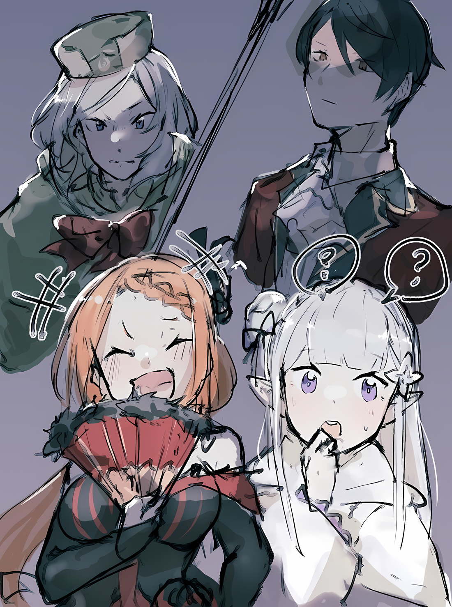

……Внезапное появление Присциллы вызвало вихрь благодаря силе ее слов.

???: ……………

Но в этот момент в зале воцарилась тишина и безмолвие, создавая у всех иллюзию, что время остановилось.

Это было заявление, которое невозможно было не расслышать, но она не совсем понимала, что оно означает. Она не могла правильно уловить смысл из слов, такое у нее сложилось впечатление.

«Дорогая Мамочка» — ей потребовалось некоторое время, чтобы найти в своем мозге значение этого словосочетания.

Однако….

Эмилия: ……? Йорна — мама Присциллы?

Эмилия с любопытством наклонила голову, и как только она услышала другой звук, обозначающий «Мама»; «Дорогая» и «Мамочка» были соединены, вследствие чего, она уловила суть словосочетания «Дорогая мамочка»

Контролируя трепещущие ощущения в собственной голове, Отто сравнил двух людей, приковавших его внимание…… Йорну и Присциллу. Йорна, которая смотрела на нее, не в силах пошевелиться, и Присцилла, которая смотрела в ответ со спокойным выражением лица.

У них были разные цвета волос и глаз, да и вообще они были разных рас.

Конечно, в случае смешанной крови существовали индивидуальные различия, в которых кровь одного из родителей была сильнее, но Присцилла и Йорна не имели никакого сходства во внешности.

Если можно так сказать, они обе обладали привлекательной внешностью, но……

Отто: Если бы мы относились к людям как к семье в таком смысле, мир был бы полон огромных семей.

Придя к такому выводу, Отто сдержал свое замешательство.

Тем не менее, услышав об отношениях Присциллы и Йорны, он обрел некоторый смысл. ……Строгое отношение Присциллы и ее характер, безусловно, вызывали сильное ощущение Имперского стиля.

Присцилла: Я чувствую неприятные взгляды, направленные на меня, но все же это нормально.

Отто ахнул от предостерегающего взгляда Присциллы, прочитав намерение ее взгляда. Оставив его в стороне, Присцилла посмотрела на Эмилию и сказала:

Присцилла: Полудьявол, все так, как ты говоришь. Подумать только, она стала одной из «Девяти Божественных Генералов». С детства я и думала что так будет, но как же это странно!

Эмилия: Нуу… я удивлена. Но раз уж ты об этом заговорила, думаю, вы обе очень похожи.

Присцилла подперла свой подбородок веером в руке, и Эмилия кивнула в ответ.

Отто и раньше отрицал для себя любое внешнее сходство между ними, так что, хотя неожиданное суждение Эмилии обеспокоило его, он отложил это на время.

Проблема была в том……

Йорна: ……Подождите.

Слова Присциллы были прерваны самой Йорной, которую она неожиданно выделила. Она на мгновение закрыла глаза и стерла явное волнение со своего лица,

Йорна: Я сама была немного удивлена, но это неприемлемое заявление. Почему ты думаешь, что я твоя мать….

Присцилла: Хватит придумывать пустяковые уловки. Если ты хочешь обмануть меня, то ты должна изменить свою душу. Как бы ты не поменяла свою внешность, ты не сможешь обмануть мои алые глаза.

Йорна: ……Кх.

Спокойное выражение лица Йорны снова напряглось при решительном ответе Присциллы.

Язык Присциллы был концептуальным, и, кроме того, она не собиралась идти на компромисс с другими. Из-за этого трудно было уловить точный смысл сказанного, но, похоже, для Йорны это было фатально.

Йорна была явно взволнована взглядом Присциллы и остротой ее языка.

Однако, Йорна была не единственной, кто проявил сильное волнение по этому поводу….

???: ……Абсурд.

Очевидно, изумление по поводу сложившейся ситуации выплеснулось наружу.

Оно было слабым, настолько слабым, что его можно было не заметить, но оно исходило от другой стороны, и Отто не пропустил голос, прозвучавший из-за маски Они.

Абел, человек, который казался скорее хладнокровным, чем спокойным и невозмутимым, сделал этот единственный комментарий.

«Присцилла», — позвал он, скрывая за маской легкое волнение,

Абел: Ты серьезно? Йорна Миссигр… это Сандра Бенедикт?

Присцилла: ……Вижу, ты тоже этого не знал, Абел. Я не виню тебя. Ведь даже у меня нет других способов знать это, кроме как с моих собственных уст.

Эмилия: Но вы заметили, что Присцилла толком ничего не сказала, верно?

Присцилла: Не перебивай меня. Молчать, полудемон.

Эмилия: Ты не должна так говорить….

Присцилла, невозмутимо ответившая на вопрос Абела, посмотрела на Эмилию, которая перебила ее, чтобы заставить замолчать.

Как бы там ни было, это был обмен мнениями, который оставил без внимания тех, кто в Королевстве, включая Отто, и тех, кто в Империи не знал, что происходит. Отто особенно интересовало содержание, углубляющееся во внутренние дела Присциллы, поскольку она тоже была кандидатом на Королевских Выборах, но….

Гарфиэль: ……Отставить разговоры о неожиданном воссоединении. Сейчас приоритетом является история этого ребенка!

Гарфиэль зарычал, обнажив клыки, не обращая внимания на изменения в воздухе.

Противником, которого пронзили эти зеленые глаза, была Луис; ее все еще защищали Йорна и Медиум. Гарфиэль был прав, они не могли двигаться ни вперед, ни назад, пока не решат, что с ней делать.

Конечно, вывод Отто о том, что Луис должна быть скована и лишена свободы, был неоспорим.

Гарфиэль: Крутой я не говорю убивать ее, но можно ее связать и прижать к земле. Это единственное, в чем крутой я не пойду на компромисс…… «История о конечностях Тиноса».

Ал: ……Это, вероятно, то, чего брат не захотел бы слышать.

Гарфиэль: Хаа?

Гарфиэль, который был согласен с Отто, оскалил клыки на это замечание.

Их прервал Ал, который поднялся на верхний этаж вместе с Присциллой. Он был все тем же эксцентричным парнем, почесывающим затылок своей единственной рукой в несколько невеселой манере.

Ал: Прежде всего, позволь мне сначала извиниться перед тобой. ……Прости, что не смог вернуть брата домой после нашей совместной поездки в Хаосфлейм.

Эмилия: Ал… нет, спасибо, что извинился. Но не только я разочарована тем, что не встретилась с Субару, Беатрис разочарована больше всех.

Ал: О, тогда я прошу прощения у этого ребенка и у остальных тоже.

Ал склонил голову, произнося извинения за отсутствие Субару.

Несмотря на обычное легкомысленное отношение Ала, его извинения выглядели искренними. Однако искреннее извинение не обязательно ведет к прощению или хорошему впечатлению.

Отто: Если что, легкое извинение только увеличит число людей, которые воспользуются тобой. На самом деле, если ты готов извиниться, я бы предпочел, чтобы ты не вмешивался.

Ал: Как жестоко. Но, как я уже говорил, поступать так с этой маленькой девочкой — это то, чего брат… Нацуки Субару не желает.

Гарфиэль: Какого черта!? Ты просто несешь полную ахинею……

Ал: ……Я тоже пытался убить ее, но был остановлен братом.

Раздраженные слова Гарфиэля были заглушены сухими словами Ала. На этот ответ, который заставил Гарфиэля затаить дыхание, Ал пожал плечами и кивнул Луис,

Ал: Вы, ребята, такие…… Разве не естественно, что я думал о том, чтобы убить ее? Но даже тогда….

Отто: Нацуки-сан отверг это желание?

Ал: Честно говоря, я не мог поверить своим ушам. Изначально я думал, что с ним была какая-то незнакомая девочка, но потом узнал, что она была Архиепископом Греха. Он пытался защитить ее своим телом. Я думал, что знаю, что у брата много безумных идей, но он превзошел мое воображение.

Когда он говорил это, взгляд Ала сквозь шлем устремился на Луис. Под этим взглядом она простонала «Уу…», но вместо того, чтобы спрятаться за Медиум и остальными, она посмотрела прямо на него.

Свет в этих голубых глазах не был ни тусклым, ни слабым.

Отто: …………

Наблюдая за происходящим, Отто изучал показания Ала.

Сам Отто считал, что причиной того, что Субару не смог добраться до Луис, была «Наивность».

«Наивность» которой обладали Субару и Эмилия, была одновременно и слабостью, и силой.

Отпустив ее, вы никогда не сможете ее вернуть, и хотя Отто чувствовал, что с ней трудно справиться, он никогда не хотел, чтобы она исчезла.

Отто: Мы… и окружающие нас люди, можем принимать решения без такой «Наивности».

Ал: Я понимаю… брата. Но сейчас все слишком сложно. В конце концов, мы говорим перед всеми этими людьми. От этого никуда не деться.

Фредерика: ……Отто-сама.

Фредерика решительно шагнула вперед и обратилась к профилю Отто. В ее прекрасных глазах мерцали беспокойство и тревога по поводу того, что придется действовать здесь.

Отто также чувствовал, что было ошибкой упоминать здесь личность Луис. …… Нет, для начала проблема заключалась в том, что Луис уже была принята вовлеченными людьми.

Решение Таритты и Мизельды получило широкое распространение в Городе-крепости.

Поэтому……

Отто: То есть, ты хочешь сказать, что просто позволишь ей свободно разгуливать?

Ал: Конечно, я бы не простил ее, если бы она сделала что-то плохое. Но….

Медиум: Луис-чан всегда пыталась защитить Субару-чина. Она никогда не вела себя плохо, пока была с нами. И никогда не будет!

Медиум повысила голос, вникая в слова Ала.

Ее заявление было всего лишь выдачей желаемого за действительное, и действия Луис на сегодняшний день не гарантировали того, что она будет делать в будущем. Это был самый главный вопрос.

Петра: Я видела, как это делал Мастер, так что, возможно, я смогу сделать клятву проклятой печатью.…

Отто: ――. Мы не должны этого делать. Я на какое-то мгновение уже думал, что так можно сделать.

Петра нерешительно предложила эту идею, но Отто отверг ее.

Она говорила о «Проклятой Печати», связывающей душу и которая заставляла получателя сдерживать свое слово, как пример можно привести Розвааля, что наложил на свое тело печать, которая, если ее нарушить, убьет его.

Розвааль, как вдохновитель событий, произошедших в «Святилище» и в своем бывшем особняке, лично начертал ее, чтобы продемонстрировать свою капитуляцию перед лагерем.

Как следовало из слов, «Проклятая Печать» являлась «Проклятием».

Как бы суеверно это ни выглядело, некоторые говорят, что проклятие в конечном счете отразится на пользователе. Если человек продолжит связывать других с помощью проклятия, то оно в конце концов сожжет и его душу.

Он не хотел, чтобы Петра брала на себя такое бремя, и даже если бы она смогла сделать это и наложить проклятую печать, которая связала бы действия Луис, это было бы не более чем страховкой.

Отто: Потому что у нас нет полного представления о том, что мы можем сделать, чтобы получить спокойствие.

Полномочие Архиепископа Греха, никто не знал в полной мере.

До тех пор, пока они не знали, какие скрытые козыри будут выкинуты, в конечном итоге, Отто никогда не сможет избавиться от настороженности по отношению к Луис. Если только они не отнимут ее жизнь.

А раз так, то не использовать что-то вроде проклятой печати, которая может привести к последствиям из-за их неосторожности, — вот что поможет им сохранить бдительность.

Отто: К сожалению, таков мой вывод.

Гарфиэль: Оттобро! Ты уверен в этом!? Это Архиепископ Греха!

Услышав мысли Отто, Гарфиэль повысил голос в крике.

Несмотря на то, что он был абсолютно прав, Отто понимал разочарование, вызванное тем, что его заставили оказаться в ситуации, когда он чувствовал, что его душат, и хотел посочувствовать душевной боли своего младшего брата.

Отто: Однако обсуждение этого здесь не получит всеобщего одобрения. В нынешней ситуации, когда еще многое осталось невысказанным, я не хочу, чтобы отношения со всеми вами испортились.

Присцилла: Поэтому, если мы и будем применять силу, то только после того, как выслушаем, что они скажут, верно? Как упрямо.

Отто: Я не собираюсь поступать так опрометчиво, но я приму это как комплимент, Присцилла-сама.

Когда Присцилла блестяще выразила чувства Отто, он, по крайней мере, попытался притвориться хорошим.

Как бы там ни было, для Гарфиэля ответ был удручающей реальностью.

Абел, обладающий значительным влиянием в городе, и «Племя Судрак», продемонстрировавшие свою непререкаемую позицию в отношении обращения с Луис…… их было не переубедить.

Не было никаких оснований для устранения Луис, кроме того, что она была Архиепископом Греха.

Поскольку это не сработало, у них не оставалось другого выхода, кроме как применить силу. Однако убийство Луис не обязательно сотрет эффект Полномочия «Чревоугодия», и стоит ли это того, чтобы потом настроить против них всю Империю?

Эмилия: Сражаясь таким образом, мы все становимся немного менее беспокойными. Ведь так оно и есть, верно?

Отто и Гарфиэль: ………….

Гарфиэль, скрежеща клыками, и Отто с закрытым глазом просто промолчали.

Аметистовые глаза Эмилии вспыхнули, когда она проследила за ходом разговора и пришла к такому выводу. Беатрис, которую она держала на руках, позвала ее именем «Эмили».

Эмилия: Мне жаль, ……Беатрис-сама. Вы очень волнуетесь, я знаю.

Беатрис: ……Раз ты понимаешь правильно, то хорошо, я полагаю.

Они обменялись взглядами и очень близкими словами, круглые глаза Беатрис были опущены. Эмилия кивнула головой, понимая чувства Беатрис, и перевела взгляд на Луис и Медиум.

Девочка, которая опиралась на нее, как сестра, направила взгляд в ответ,

Эмилия: Эта маленькая девочка… Луис может быть очень опасна. Это то, что сказал Отто-кун и другие, и ты это понимаешь, не так ли?

Медиум: ……Да, я понимаю.

Эмилия: Но ты не видела, чтобы Луис делала что-то опасное или плохое; Луис сделала что-нибудь тебе или Субару?

Медиум: Да, она пыталась защитить нас. Это правда; я не лгу. Разве это не так, Абел-чин, Ал-чин, Таритта-чан и Йорна-чан?

Глядя прямо на Эмилию, Медиум изо всех сил старалась подобрать правильные слова. Приняв решение, она попросила согласиться тех, кто вернулся из Города Демонов вместе с ней.

Абел и Йорна, все еще не оправившиеся от предыдущей перепалки с Присциллой, отреагировали вяло, но Ал пожал плечами, а Таритта кивнула.

Таритта: Да, Луис, старалась всех защитить. Она очень любила Субару, на мой взгляд.

Отто: Я бы сказал что он все такой же «Лолимансер», но атмосфера не та, чтобы так шутить.

Беатрис: ……Это прозвище… Бетти оно не очень нравится! Будь осторожен, я полагаю.

Недовольный, низкий голос Беатрис немного ослабил враждебность, которая присутствовала еще мгновение назад; возможно, Беатрис решила оставить на усмотрение Эмилии, как поступить с Луис.

Даже при том же выводе Эмилия мягко подстроила бы его под то, что представили Отто и Беатрис.

Затем Эмилия заговорила, глядя на Луис.

Эмилия: Ты беспокоилась о Субару. Я верю, что это не ложь. Поэтому я хочу верить в тебя так же, как и эта девочка, которая так старается поверить в тебя.

Гарфиэль: ……Кх, Эмилия-сама, но она!

Эмилия: Даже Гарфиэль поначалу относился к нам свысока. Но теперь он очень хороший друг, не так ли?

Рассуждения Эмилии были немного неискренними, учитывая, что Гарфиэль и Луис находились в разных положениях и при разных обстоятельствах. Тем не менее, когда Эмилия это сказала, действительно было трудно ответить.

По мере того, как ситуация развивалась, щеки Гарфиэля затвердели от горечи. Эмилия ответила извинением, а именно словами «Прости».

Эмилия: Может быть, будет трудно. Но я думаю, что лучше начать с нормального разговора, вместо того, чтобы сразу же начать враждовать. Конечно, иногда нужно быть враждебным с самого начала….

Гарфиэль: …………

Эмилия: Я здесь со всеми вами, и я думаю, что было бы хорошо, если бы все здесь могли поладить со мной. Я хочу сказать им, что хочу с ними дружить. Для этого я должна сначала разжать свою сжатую руку.

Сказав это, Эмилия посмотрела вниз на Беатрис в своих объятиях. Та нежно посмотрела на нее, а затем слегка кивнула.

Увидев кивок Беатрис, Эмилия медленно шагнула вперед.

Прямо перед Йорной, мимо озирающегося Гарфиэля и перед маленькой Медиум, укрывающей маленькую Луис за спиной.

А затем……

Эмилия: Я верю в Зикра-сан, Мизельду-сан и других, кто был так добр к Субару и Рем, и я хочу верить Медиум-чан и всем остальным, кто верит в них. Поэтому, пожалуйста, позволь мне верить в тебя, в ту, кому верит Медиум-чан.

Луис: …А …Уу.

Эмилия: Я счастлива, ведь мне очень приятно знать, что есть люди, которые в тебя верят.

Сказав это, Эмилия осторожно протянула свою правую руку Луис.

Держа Беатрис левой рукой, присевшая Эмилия направила руку Луис. Действия Эмилии заставили даже Медиум, которая пыталась защитить Луис, внезапно придвинуться к ней.

Эмилия: Луис-чан.

Таким образом она позвала ее.

Это был ее призыв, или, возможно, слова Эмилии имели какое-то значение для рассеянного Архиепископа Греха, что побудило Луис протянуть ей руку.

Когда Эмилия протянула правую руку, Луис положила свою правую руку поверх ее.

Отто на мгновение обеспокоился тем, что в результате этого на Эмилию может быть наложено Полномочие, но он пожалел об этом беспокойстве и почувствовал, что должен презирать его всем сердцем.

В любом случае……

Луис: Уау.

Эмилия: Угу, я тоже волнуюсь за Субару.

Обхватив друг друга руками, Эмилия улыбнулась в ответ, и это было заключение для их лагеря. Заключение было «Отложено».

……Однако Отто гордился Эмилией, ведь все то, что она сказала, сильно бы отличалось от его слов.

△▼△▼△▼△

Гарфиэль: ……Крутой я не сведу с тебя глаз, запомни.

Что касается ситуации с Луис, было принято решение ее «Отложить».

В ответ на это Гарфиэль, который до самого конца заявлял, что не может принять его, утвердил свою позицию по отношению к Эмилии и девочке, которой она подала руку.

Поскольку опасения и предостережения Гарфиэля были естественными, Отто не стал вмешиваться.

Отто: В конце коцов, союз с членом Культа Ведьмы, так еще и Архиепископом Греха — это не та смена взглядов на жизнь, которую я могу себе просто представить.

Сухое, прагматичное мышление Отто пришло к такому выводу.

Даже если бы это был трогательный исторический обмен между Эмилией и Луис. Однако, Отто также подумал, что это не похоже на него самого.

……Покорение Белого Кита, Великого Кролика и Архиепископов Греха «Лени» и «Жадности» также были невообразимыми.

Именно Нацуки Субару за год с небольшим неоднократно приводил все это в исполнение.

Мир считал это достижениями лагеря Эмилии, но все в лагере понимали, что вклад Субару особенно значителен. Поэтому он должен был тщательно обдумать эту возможность.

Могло быть так, что Нацуки Субару в очередной раз совершил нечто немыслимое.

Отто: Мне это не нравится……

Вопрос о том, как окружающие оценят Субару, когда это действительно произойдет, заставил его почувствовать себя подавленным.

Он подумал, что и другие должны быстро понять истинную человечность Субару…

Зикр: Полагаю, дискуссия утихла?

В большом зале, где настроение дискуссии разрядилось, Зикр поднял руку и с этими словами начал говорить.

Привлекая к себе внимание, он сделал предисловие «С вашего позволения» к своим замечаниям.

Зикр: Хотя меня очень интересуют отношения между мисс Присциллой и Генералом Первого класса Йорной, есть некоторые вещи, которые я хотел бы сначала уточнить у Абела-доно.

Абел: ――. Ты можешь говорить.

Зикр: Есть!

Абел, который до сих пор держал рот на замке, дал согласие, когда возникла эта тема.

Хотя он не стал вмешиваться в разговор о том, как будет вести себя Луис, казалось, что он сделал небольшую паузу для прежнего шока. Когда к нему обратились, он взглянул на Зикра, его черные глаза призывали его продолжать говорить.

Зикр: Мне известно о сотрудничестве Генерала Первого класса Йорны и о крахе Города Демонов Хаосфлейм… В результате госпожа Нацуми оказалась в опасности. Я хотел бы дополнительно узнать о слухах, которые распространились за последние несколько дней…

Абел: ……Слухах?

Зикр: Да. Слух о том, что где-то здесь находится ребенок Его Превосходительства Императора, наследный принц с черными волосами.

Зикр благоговейно склонил голову, сообщая об этом Абелу.

Слух о существовании сына Императора Винсента Волакии был распространен и даже достиг ушей Отто.

Кроме того, слух гласил, что у сына Императора есть повстанческая армия…… то есть он был лидером группы, собравшейся в Городе-крепости Гуарал, и что он поднимал знамя восстания против Императора, или что-то в этом роде.

Однако он не помнил, чтобы видел в городе кого-то, кто выглядел бы подобным образом.

Зикр: Согласно сообщениям, этот слух распространился с востока. Он уже распространился по всей Империи, но его источник….

Абел: Как ты уже догадался, он распространился из Города Демонов. ……Чтобы угрожать трону, нужна сила. А сила будет собираться только под великим делом.

Скрестив руки и медленно покачивая головой, Абел ответил бесстрастно.

Этот ответ был убедительным, но, во-первых, попытка угрожать трону Императора не была тем вопросом, в который их лагерь действительно хотел быть вовлеченным.

Что касается Отто, то его внимание было сосредоточено на том, как сдержать возможность того, что Эмилия скажет, что не может бросить этих людей, встретив их однажды.

В связи с этим можно сказать, что он поздно заметил возможности, на которые обычно обратил бы внимание.

Поэтому……

???: ……Черноволосый… наследный принц.

Петра, которая, казалось, размышляла, была единственной, кто пробормотал это немного погодя.

Она размышляла о чем-то, и ее красивые брови образовали небольшую складку. Затем она робко высказала свои мысли.

Ими были……

Петра: Хм, согласно тому, что Медиум-сан и остальные сказали ранее, Субару стал меньше, верно? Примерно как я или Беатрис-чан.

Фредерика: Это то, что было сказано. Я не могу себе этого представить, но если это был Субару, то вполне возможно, что с ним случилось такое несчастье…… А.

Отто: ……!

Кивнув на слова Петры, Фредерика расширила глаза, перебирая информацию. Почти одновременно с осознанием Фредерики, Отто тоже понял, о чем думала Петра.

И теперь ему пришлось проклясть, насколько неуместными были его собственные мысли.

Петра: Может ли быть так, что ребенок Императора, о котором ходят слухи, — Субару?

Вместо Отто, который проклял такую возможность, Петра напрямую подошла к сути вопроса.

Не двигаясь, девочка смотрела на Абела, и сквозь маску Они его черные глаза встретились с ее глазами. Не дрогнув, Абел спокойно кивнул в знак согласия с вопросом Петры,

Абел: Верно.

Петра: ……Кх, да это же…

В ответ на этот короткий ответ взгляд ее глаз обострился, и Петра попыталась повысить голос.

Однако, быстрее, чем Петра смогла ответить,

???: …Кха, хуахахахахаха!

Так и раздался искренне веселый голос.

Смех, не обращая внимания на обстоятельства, разрушил настроение в большой комнате. Однако никто не смог повысить голос сразу после этой вспышки, потому что этот громкий смех принадлежал Присцилле.

Она прижала веер ко рту, чтобы не показывать зубы во время смеха.

Присцилла: Как же… этот глупый простолюдин в роли наследного принца, вот что меня смешит. Ах, Абел… ты планируешь убить себя смехом? Ты значительно изменил свой образ действий, не так ли?

???: Принцесса?

Присцилла: Что не так, ты тоже должен смеяться, Ал. Нет, ты тоже принимал участие в этом заговоре? Если да, то как искусно ты рассмешил меня! Должна сказать, что ты великолепно справился с обязанностями клоуна.

Повернувшись к удивленному Алу, Присцилла с довольным видом похвалила его. Непредсказуемость реакции Присциллы на время умерила пыл в большом зале.

Конечно, это не означало, что исчезла вся путаница.

Эмилия: Хмм, что ты имеешь в виду? Не может быть, чтобы Субару был ребенком Императора, верно? В конце концов, Субару пришел из-за Великого Водопада.

Фредерика: Эмили, это одна из шуток Субару-сама.

Эмилия: Это так? Тогда… правда?

Отто: Что касается вопроса о том, является ли он ребенком Императора, это неправда. Это выдумка.

Эмилия: Чего?

Ошеломленная Эмилия выразила, что ничего не понимает.

Короче говоря, инфантилизация Субару и цель группы Абела, к счастью, совпали.

Фредерика: Если быть точной, то правильнее было бы сказать, что они воспользовались этим, как только это произошло.

Отто согласился со словами Фредерики, что это было эффективное использование ситуации.

Когда Абел и другие подняли восстание, им нужен был хороший предлог. Для этой цели не было никого более убедительного, чем ребенок Императора.

Конечно, вполне возможно, что использование несуществующего человека в качестве лидера было бы обоюдоострым мечом.

Отто: Поскольку Нацуки-сан действительно существует, вы собираетесь использовать его в качестве обоюдоострого меча?

Абел: Наглая манера говора, но она мне по душе. В таком случае, ты тоже должен понять.

Отто: ……Но все же, это досадно.

По праву, Отто и остальные должны были бы возмущаться тем, что обстоятельствами Субару пользуются.

Однако, хотя его ответ о том, что это досадно, не был ложью, было верно, что в ходе событий, которые придумал Абел, была определенная заметная ценность.

Это было потому, что……

Фредерика: ……Для Субару-сама, чье местонахождение неизвестно, это приведет к тому, что вероятность того, что он потеряет свою жизнь, значительно уменьшится.

Отто: ……Да.

Отто горько кивнул в знак понимания Фредерики.

Эмилия и Гарфиэль не сразу поняли мысли Отто и Фредерики. С выражением растерянности на лицах, они ломали голову и спросили: «В каком смысле?».

Эмилия: Я совершенно не понимаю, о чем вы говорите, но….

Гарфиэль: Я понимаю, что капитану дали странный титул. Но разве не сделать его капитаном восстания было бы еще опаснее?

Отто: Нет, это привлечет внимание, но угрозы для его жизни будут более или менее смягчены. Потому что ценность «Наследного Принца» может быть эффективно продемонстрирована только пока он жив.

Наследный принц, диссидент, угрожающий правлению Винсента Волакии.

Это существование в рядах повстанцев имело полезную ценность как для союзников, так и для врагов нынешнего Императора. Это само собой разумеется для стороны мятежников, но если бы его оставили в живых, было бы много способов использовать его и на стороне Императора.

Его казнь усыпит дух армии повстанцев, в то время как живого «Наследного Принца» можно использовать, чтобы заставить их отказаться от правого дела.

Отто: То есть, независимо от того, куда бросили Нацуки-сана, и даже если его взяли под стражу, вероятность того, что его не убьют на месте, высока. Вместо этого…

Эмилия: Вместо этого?

Отто: ……Борьба за трон Волакии. Любой выход из этого восстания исчез.

Получение благословения сопровождается ответственностью.

Независимо от того, хотел он того или нет, Субару оказался в самом центре восстания в Империи Волакия, на самом высоком посту, в качестве фигуранта.

По этой причине……

Присцилла: ……Ну и? Как тут не рассмеяться?

И при этих словах они наконец-то смогли догадаться, почему Присцилла, которая уже давно получила ответ, жестоко смеялась.

Арт от MaryHan
