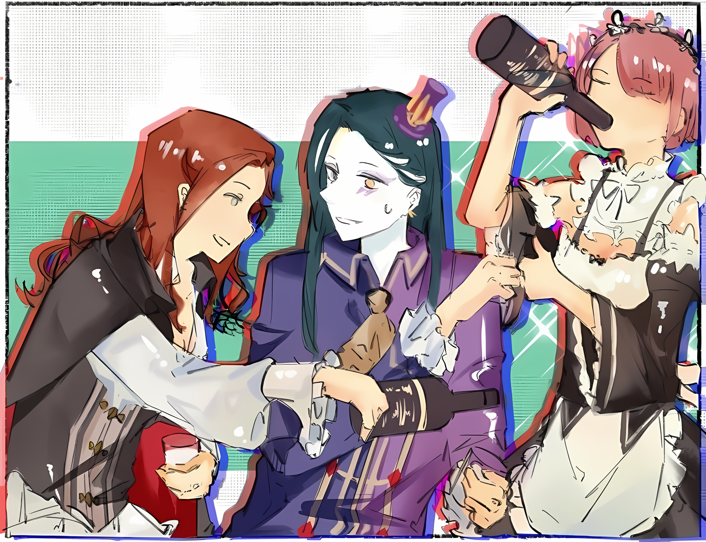

……Священная Империя Волакия под правлением ее нынешнего Императора Винсента Волакии наслаждалась эрой мира и спокойствия, невиданной с момента ее основания.

Случались небольшие стычки, но, кроме восстания Йорны Миссигр, не было ситуации, когда тысячи людей были бы вовлечены в конфликт.

До тех пор, пока отношения с Королевством Лугуника, которые уже много лет находились в состоянии противостояния, оставались стабильными, не могло произойти ни гражданской войны, ни даже ситуации территориальных споров с другими странами.

Легко сказать, что время было на их стороне, но это не принесло спокойствия всем тем, кто приложил немало усилий для поддержания этого мира.

Начнем с того, можно ли было совершить этот подвиг, просто имея на своей стороне время?

Продолжать отводить сам факт войн от Империи Волакия, которая на протяжении девяти лет своего правления была постоянным источником раздоров и поводом для конфликтов, было противоречивым поступком, похожим на разжигание костра на тонком льду.

Это произошло благодаря мастерству Винсента Волакии, нынешнего Императора, которого даже называли «Пацифистом».

Однако……

???: ……Хотя я уверена, что Его Превосходительство обрадуется, если его назовут «Пацифистом».

???: Действииительно? Ты же не чувствуешь себя ужасно, когда тебя признают за твои поступки, независимо от того, правильные они были или нет? На самом деле, стабильность страны — это то, чего хочет Его Превосходительство Император, не так ли?

???: Так ты гордишься тем, что тебя называют «Любителем Полулюдей»?

???: Несомненно. Это я популяризировал такое название в первую очередь!

???: Боже правый, похоже, ты не тот человек, которого нужно ставить в пример. В наши дни мои старые друзья, которые навещают меня, — странное множество. Но это меня занимает.

Женщина одарила свое красивое лицо дикой улыбкой и сузила зеленые глаза, откинув челку со лба.

Она была высокой и стройной, с гибким, хорошо тренированным телом.

Ее длинные, гладкокожие руки и ноги и женственные изгибы были облачены в одеяние, напоминающее торгового моряка, а рядом с изящным креслом, на котором она сидела, лежал изогнутый меч в ножнах. Все ее тело было наполнено приподнятым настроением, свойственным воину, словно в подтверждение того, что это не украшение, а практическое оружие.

Прежде всего, на левой щеке у нее был длинный, большой, белый шрам, который шел от лба до подбородка.

Это был бросающийся в глаза шрам, и стоило его увидеть, как он оставался в памяти и его трудно было забыть.

Однако даже шрам был не более чем украшением для той, кто создавал у окружающих впечатление, что она красива… «Раскаленной Леди», как ее называли.

……«Раскаленная Леди» Верховная Графиня Серена Дракрой.

Так звали и титуловали стоявшую перед ними свирепую леди, одну из величайших дворян Империи Волакия.

Для Розвааля, ее коллеги, она была другом, с которым он поддерживал связь с другого конца страны еще до того, как все это случилось.

Розвааль: Конечно, до тех пооор, пока ты серьезна, когда называешь меня старым другом.

Серена: Друзья или нет, я не собираюсь играть с тобой в такие тривиальные игры. Во-первых, когда ты — высокопоставленная Графиня, все, что кому-то хочется делать, это говорить о прибылях и убытках. Иногда мне хочется вести роскошные светские беседы без подобных вещей. Не слишком ли много надежд?

Розвааль: Я не говорю, что надеяться на это слишком сложно, но от этой печальной просьбы у меня разбивается сееердце.

С легкой усмешкой Розвааль взял со стола перед собой чашку и отпил чай, наслаждаясь теплым ароматом. Ароматное тепло танцевало на его языке. ……К сожалению, Розвааль не смог извлечь из еды и питья ничего больше, чем это.

Отсутствие вкуса во всем, что он ест или пьет, — это часть бремени, которое Розваалю пришлось нести, и цена, которую ему пришлось заплатить, чтобы оказаться там, где он сейчас находится.

Во всяком случае, он никак не мог не поблагодарить ее за гостеприимство, которое она оказала ему как гостю.

Тут Розвааль взглянул на сидящую рядом с ним миниатюрную фигуру, которая, вероятно, наслаждалась вкусом чая от имени Розвааля, и испустила небольшой вздох,

???: Эти чайные листья потеряли свою силу. Рекомендую сменить человека, ответственного за обслуживание.

Ее острые малиновые глаза сузились, и она прокомментировала чай еще более резким заявлением.

Розвааль закрыл один глаз на ее безжалостный и пренебрежительный тон, в то время как его получатель рассмеялся, произнеся: «Ха»,

Серена: Такое четкое заявление. Значит, стоит сменить обслуживающий персонал?

???: Да, они неуважительно относятся к чайным листьям.

Серена: На самом деле, поскольку все заняты делами, именно я заварила этот чай.

???: Вот как? Тогда будет лучше, если вы вообще не будете его заваривать.

Серена: Девушка, которая не знает, как проявить должное внимание, мне нравится. У тебя прекрасная жена.

Показав в ответ зубы, Серена озорно посмотрела на Розвааля.

Как обычно, она была женщиной с большим великодушием, или, возможно, женщиной, которая проявляла снисходительное отношение к грубости и невежливости. Несмотря на свое положение знатной аристократки, она не была одержима властью.

Этот образ мыслей и поведения не изменился с момента их первой встречи.

Розвааль: Однако я не из тех людей, которые не могут отличить грубость от оскорбления. Пожалуйста, следи за тем, что говоришь, Рам, потому что это только в малой степени юмор.

Рам: Поняла вас.

Розвааль: ――. Серена, я должен поправить тебя: она моя служанка, а не жена.

Серена: Понятно, не похоже, что твои получеловеческие вкусы были наконец пойманы. Отношения между нашими странами напряженные, но я считала, что отсутствие приглашения на церемонию — это довольно отстраненно.

Розвааль со вздохом посмотрел на Рам, которая спокойно приняла то, на что он указал, а затем беззаботно придвинулся ближе. Реакция Серены, когда она захихикала про себя, тоже показалась Розваалю несколько не соответствующей его намерениям.

Однако, по опыту, Розвааль уже давно знал, что чем глубже он копнет в эту тему, тем больше вреда это принесет. Поэтому он не стал углубляться дальше.

В любом случае……

Рам: Несмотря на это, я была удивлена, когда услышала это. То есть, что у Розвааля-сама и Графини Дракрой были такие близкие отношения.

Серена: Сомневаюсь, что я могла бы бессовестно назвать отношения без контакта в течение многих лет «близкими». Когда я думаю об этом, навестить меня, не связавшись со мной в такой суматошной ситуации…… Если бы ты был так откровенно груб, я бы точно хотела сжечь тебя до смерти, как мой отец.

Розвааль: Серена, эта шутка не очень смешная, если ты не из Империи.

Серена: Хм? Это так. В высшем обществе, как правило, это беспроигрышный вариант, чтобы рассмешить людей.

Это заявление, невольно заставившее Рам растеряться, было шуткой, высмеивающей одно событие из ее конфликта за престол…… На самом деле, оно было основано на правдивой истории о том, как она сожгла своего отца до смерти и захватила контроль над домом Дракрой.

Поскольку она сказала, что рана от меча на ее щеке также была нанесена ее отцом, прежде чем она убила его, это заставило Рам задуматься о ее мужестве, когда она решила, что это смешной анекдот, и об отношении Империи, посмеявшись над этим.

Когда Розвааль познакомился с ней, она была еще подростком…… Серена посетила Королевство Лугуника по делам и попыталась разрешить возникший там спор.

Проще говоря, поскольку он спас Серене жизнь, когда на нее напали убийцы, и более того, раскрыл, что покушение было организовано ее отцом, который сторонился ее, его связи с семьей Дракрой оказались неожиданно глубокими.

Однако личность Серены не изменилась ни до, ни после этого жестокого опыта, так что она, должно быть, родилась с ее стойким, свирепым характером.

Розвааль: Это правда, что я хочу вспомнить старые истории и поведение в вашем высшем обществе, но…… Как ты уже догадалась, была причина, по которой мы внезапно приехали, не связавшись с тобооой.

Приятная беседа со старым другом тоже была заманчивой, но для Розвааля не было ничего важного, кроме исполнения его давнего желания.

Все в жизни Розвааля было ради желания, которое погрузилось в самые глубины его сердца. ……Поэтому и его визит в Империю, и даже его моргание и дыхание — все это было вкладом ради его самого дорогого желания.

Розвааль: …………

В настоящее время Розвааль и Рам, расставшись с Эмилией и остальными, посетили территорию Верховной Графини Дракрой в северо-западной части Империи и имели аудиенцию у Серены Дракрой, повелительницы.

Само собой разумеется, целью визита была охрана Субару и Рем, которые исчезли из Сторожевой Башни Плеяд, и, как считалось, были заброшены в далекие земли Империи. Для Розвааля было бы достаточно, если бы он смог обеспечить безопасность Субару, но он не совершил такой глупости, как сказать об этом вслух.

В любом случае, они вернут своих пропавших друзей в Королевство. В этом и заключалась цель этого путешествия.

Однако, даже если бы они сказали, что их цель — просто вернуть их домой, дело было не таким уж простым и понятным.

У всех четырех основных стран, кроме Королевства Лугуника, были свои причины, по которым приезд и отъезд был затруднен. Города-государства Карараги, где требовались связи и много денег, были относительно предпочтительными, и можно было сказать, что Священное Королевство Густеко было оправдано в своей легкости, если только человек не ошибался в сроках и подходе к своей вере.

С этой точки зрения Империя, которая не ладила с Королевством, превосходила остальных по сложности.

Отношения между Лугуникой и Волакией исторически были плохими в течение долгого времени, и хотя сейчас они чудесным образом подтвердили пакт о ненападении, это тоже было сомнительно в том, насколько они могли свободно доверять ему.

Вместо того чтобы быть доказательством или признаком дружеских отношений, подтвержденный пакт о ненападении вызывал сильное ощущение предупреждения о том, что, поскольку для обеих стран настало время переключить свое внимание внутрь страны, им следует быть осторожными и не вмешиваться друг в друга без необходимости.

Вполне вероятно, что существует связь между тем, что государственная граница теперь перекрыта, и поддержкой пакта о ненападении.

Или, возможно……

Серена: ……Этот крупный инцидент, потрясший столицу Империи, также был заговором фракции, которая хочет аннулировать пакт о ненападении или что-то в этом роде? Есть предел тому, насколько подозрительным ты можешь быть. Это идея, неподобающая человеку Королевства.

Зеленые глаза Серены внезапно сузились, когда она догадалась, что именно было на уме у Розвааля.

Эта свирепая леди была довольно общительной, хотя и обладала катастрофическими способностями к завариванию чая; однако она была одной из немногих в Империи, кому была доверена роль Верховной Графини, и кто обладала подлинной наблюдательностью.

Империализм, в отличие от того, как это делалось в Королевстве, не ставил под сомнение возраст или происхождение человека, если у него были способности. Неизбежно, чем способнее был человек, тем более высокое положение он получал.

Соответственно, Серена Дракрой заслужила и продолжала занимать должность Верховной Графини.

То, что она только что сказала, было еще одной возможностью, которую Розвааль рассмотрел и принял к сердцу.

К тому времени, когда Розвааль и его группа прибыли в Империю, топливо восстания уже дымилось. До сих пор усилия по тушению пожаров, предпринимавшиеся при первых признаках беды, не приносили плодов.

Если существовала высокая вероятность того, что это приведет к полномасштабному восстанию, то, естественно, должна была существовать какая-то причина.

Вот почему……

Рам: ……Война за территорию с Королевством Лугуника, вот чего они ищут.

Когда Серена указала на свой скептицизм, Рам положила руки на колени и заговорила тихим голосом.

Глаза свирепой леди обратились к Рам, и она прямо посмотрела на них своими малиновыми глазами.

Рам: Над правлением Императора Винсента Волакии нависла угроза, и есть те, кто не желает мира, который был создан. Если это так, то, разрушив мир и покой, чего бы хотели эти люди? Естественно задаться вопросом, не является ли таковым Королевство Лугуника.

Серена: Вот как? Есть люди, которые бунтуют только потому, что им не нравится мысль о том, что кто-то превосходит их. Так было в прошлом году с лидером группы, который поднял против меня меч.

Рам: Давайте не будем обсуждать эти необычные случаи.

Серена: Я бы не стала так далеко заходить, чтобы назвать это необычным, но ты определенно упустила суть.

Проведя пальцем по подбородку, Серена внимательно изучила мнение Рам.

Розвааль не вмешивался в дискуссию, потому что не видел в мнении Рам ничего такого, что требовало бы исправления. Он никогда не обсуждал с Рам эти надвигающиеся проблемы, но его не удивляло, что она тоже обеспокоена теми же возможностями, что и он.

В любом случае……

Рам: Серена, вы ведь тоже не хотите войны с Королевством Лугуника. Конечно, совсем другое дело, если вы настолько возмущены, что хотите восстать против Императора.

Серена: К счастью, я никогда не была недовольна меритократией Его Превосходительства. Поведение Генерала Первого класса Йорны, чьи истерики время от времени случаются, также чуждо мне, как человеку, владеющему территорией вдали от Города Демонов. Но мысль……

Рам: Мысль?

Серена: О том, что я не желаю войны с Королевством, из каких домыслов возникло это мнение? Если ты скажешь, что у нашей стороны мало шансов, мое сердце тоже начнет колебаться вместе с ветром.

Губы Серены расслабились, когда она смотрела на нее, ее взгляд был пронизан покалывающим чувством.

Это был ее способ выразить собственную гордость за слова Розвааля. Ее называли «Раскаленной Леди», и как женщине, занимающей с ее мастерством положение Верховной Графини, было непростительно, чтобы на нее смотрели свысока.

Это было не то основание, на котором можно было сравнивать замечания Рам о чае.

Серена не вкладывала душу в чай, но она вкладывала душу в свою фамилию.

Серена: Как насчет этого, Розвааль. Я ошибаюсь? Или это была твоя оговорка?

Розвааль: Хм.…

Серена задала ему вопрос, чтобы перекрыть пути к отступлению, и когда он снова посмотрел в зеленые глаза своей старой подруги, Розвааль заметил рядом с собой Рам, которая смотрела на него сбоку.

По изменению атмосферы она, вероятно, могла почувствовать, что результат будет плохим в зависимости от того, как он ответит.

Кроме того, если хорошее настроение Серены испортится, это сильно затруднит передвижение Розвааля и остальных по Империи. Не только потому, что они потеряют своего сторонника или сторонницу, но и потому, что Серена знала о прошлом Розвааля.

Принимая во внимание все это, а также личность и человечность Серены, лучшим ответом, который Розвааль мог дать в этой ситуации, был….

Розвааль: Действительно, извини за недоразумение. Давай исправим это. ……Если дело дойдет до войны с Королевством, большое количество крови будет пролито напрасно. И кровь Империи тоже. Вот почему я не рекомендую этого делать.

Серена: Оо?

Брови Серены дернулись и приподнялись в ответ на точный ответ Розвааля.

Бледный шрам от удара мечом на ее лице дрогнул, а зрачки глаз слегка сузились. Пока это еще не привело к вспышке эмоций, но в зависимости от последующих слов такой исход может наступить.

Но он уже решил, какие слова последуют за этим. Он также не собирался пытаться лгать или притворяться.

Если бы Королевство и Империя вступили в бой, пролилось бы много Имперской крови.

Суть дела заключалась в……

Розвааль: В конце концов, у Королевства есть «Святой Меча», Райнхард ван Астрея. Каждый Имперский солдат, пересекающий границу, превратится в огромную реку крови.

Серена: Да ладно, это же незаконный ход!

Розвааль: Даже если ты называешь это незаконным ходом, пока он существует, нет другого выбора, кроме как вынести его на обсуждееение. Хотя, как ты говоришь, это козырь, который разрушает дискуссию. Однако……

На этом Розвааль прервал свои слова и закрыл один из глаз, цвет которого различался между левым и правым, оставив открытым только голубой,

Розвааль: Не будет никаких колебаний в том, чтобы разыграть этот козырь в самом начале.

Обычно козыри и секретное оружие нужно беречь, если это вообще возможно, но в случае со «Святым Меча» это было не так. Разыграть эту карту в самом начале было бы самым эффективным, а результаты были бы просто потрясающими.

А главное, человек, о котором идет речь, с радостью принял бы эту обязанность.

Серена: Боже правый, даже не хватает порядочности позволить мне провести мысленный эксперимент, ты заставишь меня плакать, военный стратег.

Внезапно атмосфера, царившая до этого, рассеялась, и Серена плюхнулась на спинку стула. Она надула губы, как будто была маленькой дующейся девочкой,

Серена: В Империи до меня доходили только слухи, но…… С твоей точки зрения, тот, кого называют «Святым Мечом», является сверхъестественным монстром?

Розвааль: До предыдущего поколения «Святые Меча» также обладааали определенным шармом, но «Святой Меча» нынешнего поколения больше подходит для этого выражения. Однако, без должного наблюдения ты все равно не поймешь.

Серена: Судя по тому, как ты говоришь, создается впечатление, что ты видел всех «Святых Меча» до сих пор. Однако, я поняла……

Язвительно улыбнувшись ответу Розвааля, Серена нахмурила брови.

Из-за их долгих отношений Серена полагала, что Розвааль ни за что не произнесет необдуманных слов, и тщательно его изучала.

Однако для всех Имперцев, кроме нее, еще предстояло решить, будут ли они разумными.

Розвааль: Если ты переоценишь свои силы или недооценишь силу «Святого Меча», то не сможешь избежать трагедии. Поэтому я напущу в твой разум неблагоприятный ветер. Ты не должнааа вступать в войну.

Серена: ……….

Розвааль: А тааакже, если ты решишь воевать против Королевства, тогда я стану твоим противником. Стоит ли демонстрировать? Безжалостность неумолимого натиска магии с такой высоты, что ты ничего не сможешь сделать.

Хотя он пожал плечами и пошутил, что продемонстрирует ей, Розвааль тоже был стратегической силой, с которой приходилось считаться.

Если так подумать, он не был так силен, как «Святой Меча», но все же мог подавить тысячи простых солдат, просто летая по воздуху и овладевая магией. Если он выбирал места сражений, с которыми у него была сильная совместимость, то вполне возможно, что он мог преодолеть фронт войны в одиночку.

Серена: В этом отношении я легко могу поверить, в отличие от слухов о «Святом Меча». В конце концов, я ведь видела тебя в бою своими глазами.

Розвааль: Это было более десяти лет назад. Сейчас я могу показать тебе гораздо более развитую магию, чем в те временааа.

Серена: Ты непостижимый человек. Как бы то ни было, выдающаяся сила приходит со своими оковами. Полагаю, именно по этой причине ты не можешь свободно распоряжаться ею в Империи.

Розвааль: Верно.

На этот раз, будучи загнанным в угол, настала очередь Розвааля выставить руки так, чтобы она могла их видеть.

На самом деле, если бы тактика, которую они только что обсудили, была приведена в действие, Розвааль непрерывно осыпал бы магией высоко в небе, вне досягаемости для людей, и смог бы превратить Империю в выжженную землю, пока его мана не иссякнет.

Однако, даже если говорить о широком мире, в нем не было никого, кроме Розвааля, кто был бы способен совершить подобное с помощью магии. Все было бы более или менее одинаково в тех местах, где он использовал благоразумие.

Показать свой выдающийся магический талант в пределах Империи Волакия было равносильно тому, чтобы раскрыть свою истинную личность.

Поэтому Розвааль должен был воздерживаться от любого вычурного поведения после въезда в Империю.

Те же доводы и ограничения были наложены на Эмилию во время их разлуки.

Рам: Хотя в сложившейся ситуации есть шанс, что она забудет об этом и сразу же вспыхнет.

Розвааль: Мне придется полагаться на теех детей. Ну, если принять во внимание обстоятельства, Гарфиэль тоже должен быть в состоянии держать ее в узде, так что мне не стоит слишком беспокоиться.

Вернее, если бы он не мог им доверять, он бы вообще не стал расходиться.

Так что это было бы нормально — доверить решения им, потому что у него было доверие к текущему состоянию результата. ……Такое выражение, как «доверие», он считал, что если Отто и Петра услышат это, то непременно сделают недовольное лицо.

Серена: ……Дай угадаю, вы были не единственными, кто попал в Империю при таких обстоятельствах, не так ли?

Пока Розвааль и Рам обменивались словами, Серена, поднявшись со спинки стула, продолжала. Встретив их взгляды, она провела пальцем по ране, нанесенной мечом, на своей щеке,

Серена: Вы что-то ищете…… нет, вы кого-то ищете? Похоже, это кто-то очень важный для вас, ребята.

Розвааль: Даже в наших с тобой отношениях, из-за твоей манеры спрашивать трудно кивать головооой.

Серена: Тем не менее, твои действия служат тому доказательством. В противном случае, человек не стал бы пересекать закрытую границу, чтобы попасть в Волакию. ……Если только это не судьба.

Слегка сузив глаза, Серена пробормотала тихим голосом.

Не понимая, что она имеет в виду, Розвааль нахмурился, испытывая чувство тревоги. Однако прежде чем он успел усомниться в истинном значении этих слов, Рам быстро кивнула и сказала: «Да»,

Рам: Есть кое-кто, кого я должна вернуть любой ценой. Кого-то, кто равноценен самой жизни Рам.

Розвааль: Рам.

Рам: Никакие уловки или обман с ней не сработают.

Хотя он укорил Рам, которая легко раскрыла информацию, которая вряд ли могла стать слабым местом, она ответила это и Розвааль не смог предложить опровержение.

Если само действие можно назвать ответом, то истина была именно такова.

Розвааль: Однако, даже если ты собираешься показать слабость, тогда у тебя должны быть какие-то техники презентации.

Серена: Не надо так осуждать Рам. Разве это не похвально? Меня больше удивляет то, что ты пошел на такие меры ради того, что важно для нее. Похоже, она очень важна для тебя.

Рам: Да, потому что Рам ничем не заменишь.

Розвааль: Это неоспоримый факт, но меня несколько беспокоит то, как ты это выразила.

Розвааль и Рам заявили, что есть кто-то, кого они хотели бы вернуть. Это, в свою очередь, похоже, вызвало непонимание у Серены, которая не знала, что дело обстоит именно так.

Поскольку они хотели заручиться помощью, то после этого они поделились подробной информацией о людях, которых они искали.

Серена: ……Как бы там ни было, я понимаю, почему ты предупредил нас не начинать войну.

Когда разговор вернулся к предупреждению Розвааля, обсуждению, предшествовавшему этому последнему, выражение лица Серены внезапно стало жестким. Она посмотрела на естественно напряженные лица Розвааля и Рам, и с внимательным взглядом продолжила: «Но»,

Серена: Я прислушаюсь к вашему совету, но я не могу ручаться за отношение других граждан Империи. Большинство из них впадут в ярость, даже если им скажут, что у них нет шансов победить в схватке со «Святым Меча».

Розвааль: В этом разница с Королевством, где нет необходимости объяснять истинную силу «Святого Меча».

Рам: Да, это верно. В Королевстве, если бы у вас был шанс взглянуть на «Святого Меча» Райнхарда, не было бы необходимости в дальнейших объяснениях.

Поскольку четыре великие страны заключили договор, запрещающий Райнхарду покидать страну Лугуника, у жителей других стран почти не было шансов увидеть его.

Если бы они могли получить такой шанс, то не было бы необходимости прибегать к подобным окольным путям убеждения.

……Один взгляд на «Святого Меча» Райнхарда ван Астрея, и любой мог бы сразу понять, насколько глупо было бы противостоять ему.

Только безумцы, живущие в мире, полностью оторванном от разума, не понимали этого.

Серена: Если все действительно так серьезно, как кажется, то мне остается надеяться, что Его Превосходительство подавит восстание без происшествий, или что мятежники, занявшие его место, будут разумны.

Восстание уже вспыхнуло и заставило общественность заинтересоваться тем, какова на самом деле их цель.

Если бы у мятежников были конкретные идеи и не было необоснованных амбиций вроде борьбы с Королевством, войны между двумя странами и массового кровопролития, о котором говорил Розвааль, можно было бы избежать.

Конечно, не было бы ничего лучше, чем если бы Императорская часть смогла подавить восстание должным образом.

Розвааль: Независимо от того, как разрешится эта гражданская война, будет тревожно, если после этого нападение будет направлено на Лугунику. Потому что ссора с Империей была бы инцидентом, который я не запланировал.

……Все действия Розвааля были путем, ведущим к самому заветному желанию, которое должно быть исполнено.

Таким образом, тот факт, что он получил возможность получить аудиенцию с Сереной в Империи, также не был исключением.

Это ничем не отличалось от желания получить помощь, чтобы вернуть Субару, или убедить ее, влиятельное лицо в Империи, в бесполезности войны с Королевством.

Для исполнения самого заветного желания Розвааля присутствие Субару было просто необходимо.

Кроме того, борьба с Империей Волакия или что-то в этом роде не входило в путь, по которому должен был идти Рохвааль. Так что сейчас было не время для войны между Королевством и Империей.

Не должно быть никакого вмешательства до дня «Церемонии Зарождения Дракона», когда завет между Королевством и Драконом будет возобновлен.

Вопросы, мешающие Королевским Выборам, должны быть устранены.

И для этого……

Розвааль: ……Мы должны попросить Его Превосходительство Императора быстро подавить восстание и продлить это первое время мира и спокойствия с момента основания Империи Волакия.

Серена: Хм? Давно я не видела такого злобного взгляда. Какой-то зловещий заговор?

Услышав слова Розвааля, Серена забавно подняла брови.

Сам он не знал о злобном выражении лица, на которое она указала, но, судя по ее словам, у него должно было быть такое выражение. Тем не менее, планы Розвааля не должны были идти вразрез с ожиданиями Серены.

Она также была членом Имперской знати, и пока она сама не участвовала в восстании, она, естественно, должна быть на стороне Императора.

Рам: Графиня Дракрой.

Внезапно, рядом с Розваалем, пока тот думал об этом, Рам начала свой собственный разговор с Сереной.

В этот момент Серена посмотрела на Рам,

Рам: Можно вас на минутку?

Серена: Конечно, я не возражаю. Только, пожалуйста, не называй меня Графиней Дракрой. Я просто хочу поболтать с друзьями…… Серена, пожалуйста.

Рам: Тогда, Серена-сама. ……Похоже, вы очень близки с Розваалем-сама, верно?

Серена: Да?

Глаза Серены расширились, когда Рам, которая сменила обращение, сфокусировала свой взгляд на ней. Однако ее лицо мгновенно стало озорным, она кивнула и сказала: «Понятно, понятно».

У Розвааля было плохое предчувствие по поводу того, что она только что поняла.

Серена: Тебе ведь интересно, как я познакомилась с этим парнем? Судя по всему, вы, ребята, тоже давно знакомы, но……

Рам: Прошло ровно десять лет.

Серена: В таком случае, мы знакомы чуть дольше. Рам, ты пьешь?

Рам: Не на таком уровне, как с чаем, но Рам довольно разборчива, если дело касается алкоголя.

Серена: Отлично!

Серена хлопнула ладонями по коленям и улыбнулась Рам.

Похоже, им предстояло выпить по бокалу хорошего напитка, а закуской послужили разговоры о воспоминаниях. Более того, если они собирались поговорить о том, как он познакомился с Сереной, то у Розвааля тоже было несколько юношеских проделок.

Розвааль: Серена, я благодарен за приглашение, но у нас есть неотложные дела. Об этих делах……

Серена: Ты хочешь, чтобы я помогла вам в этом, не так ли? Если это так, то тем более не стоит портить мне настроение. Если ты давно меня не видел, то хотя бы выпей со мной.

Розвааль: ……Рам.

Оставив попытки отговорить Серену от ее нелюбезного отношения, Розвааль посмотрел на Рам.

Так же, как Розвааль хотел вернуть Субару, Рам прибыла в Империю, чтобы вернуть свою вторую половину… Рем. Она думала, что раз уж она искренне ответила на предыдущий вопрос Серены, то сможет вернуть ее мысли от бокалов с вином к конструктивной дискуссии.

Однако……

Рам: Оставим Барусу в стороне на немного, Рам не думает, что было бы разумно отказаться от предложения Серены-сама ради Рем.

Розвааль: Это точно единственная причииина?

Рам: Конечно, если Рам также сможет услышать истории о Розваале-сама до того, как он встретил Рам и остальных, то даже если мы окажемся в одном тупике, Рам сможет сказать, что это был отличный план.

Рам не стыдилась, если это могло послужить ее целям и одновременно принести реальную пользу.

И, к большому сожалению Розвааля, Рам и Серена были чрезвычайно совместимы. Можно было не сомневаться, что их пьяные разговоры тоже будут оживленными и что они отлично поладят.

Это вполне могло стать началом головной боли для Розвааля.

Розвааль: В каком-то смысле, возможно, я должен рассматривать это как необходимую цену?

Все для того, чтобы они могли достичь своей цели, покинуть Империю и вернуться в Королевство.

Когда он обратился к старой подруге за помощью, он был готов заплатить определенную цену. Однако он ни в коем случае не думал, что все обернется именно так.

Серена: Только что, еще один гость ушел прямо перед вашим приходом, ребята. Она была веселой, так что я была близка к тому, чтобы почувствовать себя одинокой.

Рам: Потому что она была близка с вами?

Серена: Технически, я была близка с мужем гостьи, но да. Она скоро вернется, и тогда я их представлю. Сейчас же, скорее……

Встав, Серена направилась к витрине в углу комнаты. Когда дверь открылась, внутри стояли разнообразные бутылки с алкоголем, большие и маленькие, и было видно, что у нее отличный вкус.

Серена выбрала одну из них, и пока она возвращалась, достала с полки три бокала,

Серена: Когда я служила эмиссаром, представляющим моего отца, я случайно встретила Розвааля. На меня напали убийцы, когда я направлялась в Королевство…… их послал мой отец, но Розвааль спас меня там.

Рам: Так вот как это было. Продолжайте.

Затем в бокалы на столе налили спиртное, и начались старые истории.

Разговор между любопытной Рам и болтливой Сереной был оживленным, и хотя Розвааль чувствовал себя неловко, он решил, что это необходимый момент, и сдался.

Розвааль: …………

Все ради исполнения его самого заветного желания, и чтобы вернуть себе необходимые для этого части….

……Прогнозы Розвааля не оправдались, и он был вынужден предотвратить еще более глубокое вовлечение в гражданскую войну в Империи, когда два дня спустя имя черноволосой девы, стоящей на стороне повстанческой армии, «Нацуми Шварц», достигло поместья Графини Дракрой, и Рам взяла Верховную Графиню Серену Дракрой под свое крыло.

rezero7arc | Арт от @Lapetusea
