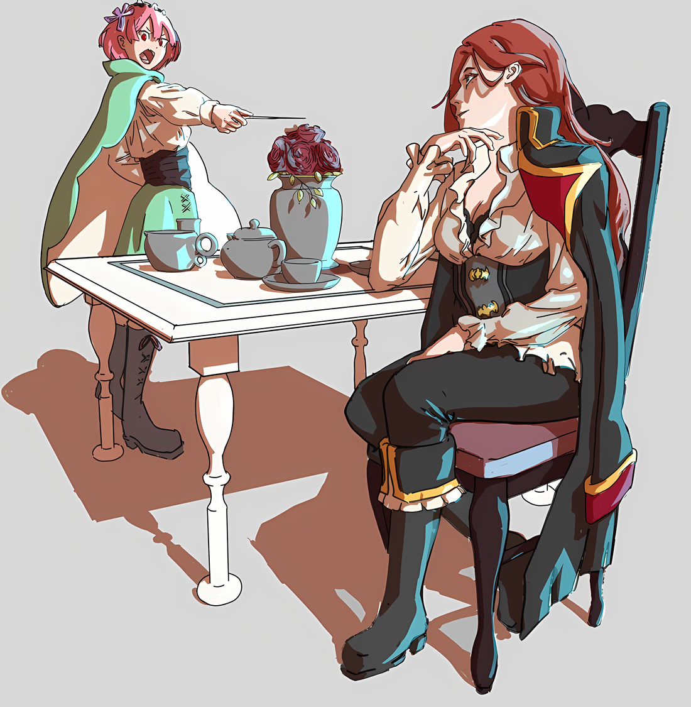
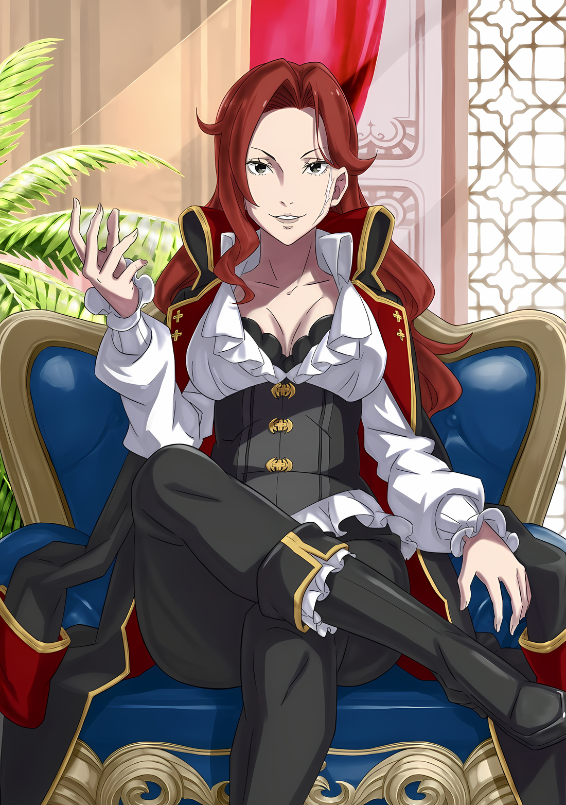

Серена: ……В конечном счете, подчинение меня не даст возможности владениям Дракрой сделать шаг. Как я и думала, у тебя прекрасная жена, не так ли, Розвааль?

Розвааль: ……Неприятно, что мне приходится поправлять тебя уже бесчисленное количество раз, однако Рам — моя служааанка.

На замечание Серены, которая была необычайно храброй, учитывая обстоятельства, в которых она оказалась, Розвааль неприязненно ответил, чувствуя себя на пределе сил.

Посещая территорию Серены, владения Дракрой, он искал кого-то в Империи Волакия…… Двумя днями ранее, он попросил помощи, чтобы найти пропавших Субару и Рем.

Занимая должность Верховной Графини, Серена была широко известна во всей Империи. Была надежда, что она сможет получить точную информацию, при условии, что речь идет о «мальчике с черными волосами и черными глазами, который выделяется, хочет он того или нет».

Куда бы его ни увезли, трудно было поверить, что Субару будет молчать, поэтому степень их ожиданий была высока и в этом смысле.

Таким образом, это было неизбежно, и в то же время неожиданно.

Розвааль: Рам, позволь спросить на всякий случай, причиной такого безрассудного поступка является….

Рам: ……Нацуми Шварц.

Розвааль: Понятно.

Звук, произнесенный губами Рам, таил в себе значение имени, которым Розваалю трудно было пренебречь.

Будучи отправленным в Империю, Нацуки Субару, оставшись без поддержки, направил сигнал бедствия тем, кто понимал значение этого имени — Розвааль и Рам также сразу уловили его намерение.

Указывая на то, что он здесь, Субару проявил необычайную осторожность. Действительно, сами действия Субару были безошибочны.

Если и была какая-то проблема, то это была «Сторона», с которой был поднят сигнал бедствия.

Поэтому Рам прибегла к тому, что можно назвать внезапной атакой или безрассудными действиями.

В результате получилась сцена, в которой Рам держит свою палочку вытянутой вперед, заставляя Серену продолжать сидеть на диване. Однако в этом нельзя было винить только безрассудное поведение Рам.

rezero7arc | Арт от 33Punyesh

Причиной была……

Серена: ……«Черноволосая Дева», возглавляющая восстание, Нацуми Шварц, и есть та, кого вы ищете?

Рам: Если быть точнее, этот человек — дополнительная награда для Рам.

Серена: Хотя для Розвааля это не так. Таким образом, то, что не так для Розвааля, должно быть необычайно важно для тебя.

На слова Серены, движения которой сковывала направленная на нее палочка, Рам придержала язык.

Даже когда Рам не позволяла ей двигаться, мысли Серены оставались острыми. В этих обстоятельствах она не теряла самообладания и в общих чертах понимала ситуацию Розвааля и Рам.

……«Нацуми Шварц» было чем-то вроде псевдонима, который использовал Нацуки Субару.

Хотя точное значение этого имени было более сложным, если принять во внимание причины, по которым Субару намеренно использовал его в Империи, его намерение использовать псевдоним было ясным.

Розвааль тоже хотел бы уважать это намерение, если это возможно, но……

Розвааль: Из всех вещей, быть на стороне повстанческой армии — это……

Хотя он и уловил намерение использовать псевдоним, направление, с которого был поднят маяк, было неожиданным.

Восстание, произошедшее в разгар их контрабандного проникновения в Империю, уже было поводом для беспокойства. Не будет преувеличением сказать, что оно не только проросло, но и расцвело ядовитым цветком.

К лучшему или к худшему, но это было действительно похоже на Субару.

Розвааль: Рам, ты тоже попала под дурное влияние Субару-куна?

Рам: Это немыслимо. В поведении Рам нет ни капли влияния Барусу.

Серена: Даже если ты попала в эту ситуацию в результате его действий в первую очередь?

Рам: Розвааль-сама, обсуждение с Сереной-сама.

Как только ситуация ухудшилась, она сменила тему и перехватила инициативу.

Закрыв один глаз от смелости Рам, Розвааль снова повернулся лицом к Серене.

В данный момент Розвааль и Рам были вызваны в ее кабинет и только что услышали о «Черноволосой Деве» не иначе как из уст Серены.

После того, как ей рассказали об особенностях Субару и Рем, которых искали, у нее, вероятно, сложилось впечатление, что это просто тема для разговора с деталью «Черные Волосы». Однако это было нечто, имеющее значение, которое Розвааль и Рам не могли пропустить.

Серена: По поводу проблем, возникших в Городе-крепости, я, как Верховная Графиня, должна сделать некое заявление о своих намерениях.

Это произошло сразу после того, как Серена заявила об этом. ……Тогда Рам двинулась, чтобы подавить ее.

Дерзкий характер Серены и тот факт, что в ее кабинете не было охраны, погубит ее.

Ее личные охранники стояли в коридоре за пределами кабинета, не обращая внимания на напряженную обстановку в комнате. Конечно, как только Серена повысит голос, они ворвутся в кабинет.

Рам: Но в таком случае я разорву Серену-сама на части.

Серена: О, как страшно. Мне нравится, когда ты серьезно настроена, а не просто угрожаешь. Розвааль, у тебя….

Розвааль: Она не моя жена, а моя служанка… этот вопрос уже решен. Я бы предпочел приложить усилия, чтобы вернуться к мирному общению между нами тремя, не меняя характера наших отношееений.

Серена: «Наших»… как похвально сказано. Для тебя, который всегда считает все дела делом других людей, принять эту проблему как свою собственную — это что-то новое.

При виде хихикающей Серены Розвааль вздохнул, прикрыв один глаз.

Все было именно так, как она сказала: из-за того, что сделала Рам, это не могло быть делом других людей. Дело было не в отношениях хозяина и слуги или ответственности, но это также была эмоциональная проблема.

Кроме того, хотя поступок Рам, безусловно, был поспешным, одновременно можно было сказать, что поспешность была ценностью необдуманного поступка.

В конце концов, если бы Рам не начала подавлять Серену……

Розвааль: Твоя гордость, «Эскадрилья Летающих Драконов», в мгновение ока сожжет повстанцев дотла.

Серена: …………

При словах Розвааля Серена Дракрой слегка сузила глаза.

«Эскадрилья Летающих Драконов», принадлежащая Графине Дракрой…… Это было командование многочисленными летающими драконами, населявшими Империю Волакия, ударная сила, свободно летавшая вокруг самых высоких вершин Империи.

Изначально наездники летающих драконов, владеющие техникой приручения и позволяющей управлять ими, демонстрировали на поле боя подавляющую боевую мощь. Поскольку Розвааль умел летать и тем самым мог полностью победить большинство противников, он понимал. ……Он понимал, что овладение воздухом — это высший шаг к господству на поле боя.

Поэтому в Империи Волакия владениям с превосходными наездниками на летающих драконах было легко добиться больших военных успехов.

Превзойдя тенденцию, наметившуюся еще при предыдущем поколении Графов Дракрой, эпоха Серены Дракрой считалась самой сильной «Эскадрильей Летающих Драконов».

Если она действительно захочет мобилизовать «Эскадрилью Летающих Драконов», то обычное восстание не будет для нее проблемой.

Серена: Неожиданно, человек, которого ты ищешь, теперь в армии повстанцев, и ты беспокоишься, что я разверну свои войска. Но ты же не можешь просто стоять здесь и смотреть на меня всю жизнь? Как ты поступишь?

Рам: Серена-сама, а как же ваша семья?

Серена: Если вы собираетесь угрожать мне ценой моих родственников, то это тщетно. Я не нашла достойного партнера с тех пор, как Розвааль бросил меня.

Рам: Розвааль-сама?

Розвааль: Не принимай шутки за правду. Такая вещь, как отношения между аристократами разных стран делают это невозмооожным. Серена, сейчас не время для шуток.

Даже если не принимать во внимание отношения Розвааля и Серены, нельзя сказать, что Рам сейчас очень терпелива.

Хотя с первого взгляда это было трудно понять, Рам сильно сожалела о событиях в Сторожевой Башне Плеяд. Она винила себя в том, что потеряла Субару и Рем и была разлучена с ними.

Не было сомнений, что и в этот раз ее крайние действия были вызваны нетерпением.

Розвааль: Давай не будем провоцировать Рам без необходимости, не попытаемся ли мы вместе нацелиться на хорошую посадку?

Серена: Хорошую посадку, да? Если это так, то чего конкретно вы, ребята, хотите?

Розвааль: …………

Серена: Нет таких дураков, которые полетели бы на летающем драконе без цели. В противном случае, будет потрачено не мало выносливости, а мои всадники тоже имеют ценность. Ты должен понять мои опасения. Верно?

Положив подбородок на одну из рук, Серена посмотрела на Розвааля, словно проверяя его.

Учитывая, что Субару присоединился к повстанческой армии, а также то, что Рем, скорее всего, тоже была там, не было ничего удивительного в том, что Рам приняла быстрое решение. Обвинять ее в этом было бессмысленно, ведь время нельзя повернуть вспять.

Если бы они захотели, можно было бы причинить вред Серене, а затем, воспользовавшись хаосом, бежать с территории.

Однако это было бы не более чем глупым поступком, отказавшись от первоначальной цели и создав ненужных врагов. Даже в Империи, где сила значила все, солдаты не были настолько глупы, чтобы с благодарностью принимать поражение своих хозяев.

Чтобы ослабить мощь «Эскадрильи Летающих Драконов», находящейся во владении Графини Дракрой, — такое, возможно, приветствовалось бы повстанческой армией…… и Розвааль сомневался, стоит ли это действие головы его старого друга.

Конечно, если бы это была необходимая жертва ради его самого дорогого желания, Розвааль без колебаний лишил бы Серену жизни.

Однако, если жертва не требовалась, то ему не приходило в голову сделать это.

Поэтому слова, которые Розвааль произнес здесь Серене, были……

Розвааль: ……В этой ситуации, не хочешь ли ты присоединиться к восстанию вместе с нами?

Серена: Ха?

Розвааль: Если ты сделаешь это, то разногласия между тобой и нами будут похоронены. Если наши цели станут одинаковыми, у Рам пропадет причина направлять на тебя свою палочку. По сути, мы сможем мирно уладить наши отношения.

Глаза Серены расширились при виде Розвааля, который сказал это прямо, сложив руки перед грудью.

В ее глазах промелькнули шок и удивление, а также немного любопытства. В связи с тем, что ее интерес был подогрет, она не стала делать замечание, которое было бы совершенно необоснованным.

Опираясь на это, Розвааль начал работать над своими отношениями с ней.

Серена: Ты говоришь «мирно уладить наши отношения», но, похоже, это касается только последнего. То, что ты предлагаешь мне по итогу — это восстание. Моя территория получила помощь от Его Превосходительства Императора, какая польза от ненужного обострения ситуации?

Розвааль: ……У тебя нет недовольств по поводу Его Превосходительства Императора. Разве это действительно так?

Серена логично рассуждала о безопасности своего плацдарма. Однако, прервав ее на полуслове, Розвааль посмотрела ей прямо в глаза.

Будучи Верховной Графиней Империи, она была талантливым человеком, обладала широким кругозором и умела воплощать свои намерения в жизнь. По этой причине он должен был твердо смотреть ей в глаза, когда говорил ей об этом.

«???: Когда кто-то говорит с тобой, ты должен смотреть ему в лицо!»

Внезапно эти слова промелькнули в голове Розвааля.

Неожиданно он почувствовал, как будто получил толчок от этих слов, и……

Розвааль: Не то, чтобы я провел последние два дня тихо и спокооойно. Пока ты была занята, я навострил уши, как только мог.

Серена: Значит, вместо того, чтобы составить мне компанию с алкоголем до утра, ты усердно подслушивал?

Розвааль: При твоей нынешней нагрузке, я рекомендую изменить свой образ жизни, а именно — пить до утра каждый день.

Естественно, в условиях, когда гостей принимают в мирное время, все было бы иначе, но даже тогда его искреннее желание как ее старого друга заключалось в том, чтобы она ограничила количество выпитого.

В любом случае, оставив в стороне свои опасения по поводу печени Серены, Розвааль представил плоды своего внимательного слушания. Секретные обстоятельства, которые хранят владения Дракрой, это……

Розвааль: ……До меня дошли слухи, что инцидент позапрошлого года, когда один из «Девяти Божественных Генералов» вступил в сговор с целью покушения на убийство, оказал весьма продолжительное влияние.

Серена: …………

Розвааль: Я слышал, что виновник того инцидента, член «Девяти Божественных Генералов», который погиб, был всадником на летающем драконе… и, кроме того, этот человек был одним из твоих подчиненных. Его звали….

Серена: ……Балрой Темегриф.

Сказав это низким, тихим голосом, Серена прервала Розвааля.

Она по-прежнему опиралась подбородком на руку, однако жар в глазах изменился по сравнению с прошлым. В какой-то степени оттенок удовольствия от этой ситуации исчез в тишине, похожей на гладь озера, лишенного ветра.

С этими спокойными глазами она посмотрела на Рам, которая стояла позади 4Розвааля,

Серена: Опусти свою палочку, Рам. Я буду говорить, даже если ты не будешь направлять ее на меня.

Рам: Но….

Розвааль: Рам, делай, как она говорит. Серена не отступает от своих слов.

Розвааль вынудил ее этими словами, и Рам неохотно опустила палочку.

Конечно, она тут же восстановила свою готовность, но и в этой бдительности Серена не нашла недостатка. Только она повернулась лицом к окну, к простирающемуся за ним пейзажу…… Нет, она смотрела в небо.

В небо, где летающие драконы, хлопая крыльями, свободно летали по небу.

Серена: Думаешь… там есть свобода? В небе?

Розвааль: ……Судя по твоей манере говорить, это не тааак.

Серена: В Империи вода, почва, воздух, даже плоть и кровь ее жителей — все это принадлежит Его Превосходительству Императору. Даже небо не является исключением. ……Кто говорил об этом?

Розвааль: Интерееесно, разве не трудно ограничиться только «кто»? В конце концов, это то, о чем думают все.

На вопрос Розвааля, который пожал плечами, Серена коротко ответила «Вот как?».

Имя, которое она назвала…… Балрой Темегриф, был бывшим членом «Девяти Божественных Генералов» и исполнителем покушения на Императора, которое произошло в столице Империи в позапрошлом году.

Изначально он был способным человеком, назначенным Сереной на важную должность во владениях Дракрой, и благодаря его выдающейся силе и мастерству наездника на летающих драконах, казалось, что у него были хорошие перспективы, чтобы пройти путь наверх и дослужиться до звания Генерала Первого класса.

Разумеется, то, что Балрой обратил свой клинок против Императора, поставило Серену, которая его рекомендовала, в неприятное положение.

Хотя должность Верховной Графини не была отнята, чувства столицы Империи были подпорчены, надежды, которые они возлагали на ее «Эскадрилью Летающих Драконов», были потеряны, и ей также не дали возможности восстановиться.

И в довершение всего, человек, который был установлен в качестве замены Балроя в «Девяти Божественных Генералах», был……

Розвааль: ……«Генерал Летающих Драконов», Мэделин Эшарт… словно ехииидный намек, не так ли.

Серена: Не имея военного опыта, существо, которое внезапно поднялось до должности Генерала Первого класса по рекомендации премьер-министра, кажется, что ее род удивительно схож на род полудраконов. Если полудракон может управлять летающими драконами без секретной техники приручения летающих драконов, то тратить время и силы на обучение наездников летающих драконов будет бесполезно, ведь так?

Рам: Это не позиция Серены-сама, у которой есть «Эскадрилья Летающих Драконов».

Серена: Ну и ну, не надо смотреть свысока на мою «Эскадрилью Летающих Драконов». Отсутствие необходимости в наездниках имеет как преимущества, так и недостатки. Правда, время, необходимое для обучения, сокращается, но летающий дракон без наездника может полагаться только на свои инстинкты в тактике. Всадник на летающем драконе может понять и применить тактику.

Рам: …………

Розвааль: Самое главное, что данный род полудраконов, похоже, сокрушает их силой численности.

Секрет Волакии по укрощению летающих драконов…… даже Розвааль не знал подробностей техники использования свирепых летающих драконов, которые, впрочем, не испытывали никакого интереса к людям. Однако он слышал, что даже если талантливый наездник летающего дракона может подчинить себе одного дракона, он должен постоянно находиться рядом с ним.

Другими словами, наездник на драконе должен был состоять из одного летающего дракона и одного человека.

В отличие от этого, существование «Генерала Летающих Драконов», который мог командовать бесчисленным количеством летающих драконов, не тратя на это времени, было естественным врагом Серены, чья сила заключалась в «Эскадрилье Летающих Драконов, а также занозой в ее боку.

Серена: Балрой был надежным другом, который долгое время находился у меня. Если он пошел против Его Превосходительства и даже направил на него копье, можно сказать, что вина неизбежно перейдет на меня. Но……

Рам: Готовы ли вы смириться с этим позором — это уже другая история, не так ли?

Серена: ――. Каждое твое слово проникает в глубины моего сердца.

Рам: Мне очень жаль.

В ответ на поклон Рам с извинениями, Серена глубоко вздохнула.

Серена не стала отрицать того, на что указали Розвааль и Рам, когда на нее надавили их голоса. К тому времени, когда она заставила Рам опустить палочку, она уже приняла решение.

Это был знак того, что она готова говорить на равных, а не разглашать обстоятельства под угрозой.

Другими словами……

Серена: ……Даже несмотря на все это, вы ведь не собирались создавать проблемы, находясь здесь?

rezero7arc | Иллюстрация к **Ранобэ **Том 32 | Разукрасил V!c.ll2o

С этими словами Серена Дракрой потрогала белый шрам на своем лице и свирепо улыбнулась.

Ее поразительно свирепая улыбка была той самой, которую Розвааль видел в молодые годы, когда познакомился с ней; амбициозной, которую она демонстрировала перед тем, как украла у отца пост главы семьи.

Однако теперь ее улыбка была направлена не на отца, чьи глаза затуманились, когда дочь начала красть у него доверие его приближенных, а на грозное существо, управлявшее этой огромной Империей…

Розвааль: ……Я все понял, Серена, ты……

Увидев эту улыбку, Розвааль запоздало осознал свое непонимание.

Пытаясь предотвратить ухудшение ситуации, вызванной поспешным решением Рам, он попытался направить мысли Серены в нужное русло, разъяснив, в какое положение попала территория Дракрой, но это было ошибкой.

Не было никакой необходимости направлять ее в сторону поддержки восстания.

Даже подъем повстанческой армии с «Черноволосой Девой» был для нее не более чем шансом. Серена уже решила, на чьей она стороне, и по-своему проявила внимание к Розваалю и остальным.

По-своему она проявила уважение, не втягивая старого друга, который пришел искать пропавшего человека и ничего не знал.

Однако Розвааль и остальные бездумно перешли в лагерь противника. Не понимая, что они влили маны в уже воспламенившиеся магические камни.

Другими словами……

Серена: Я была настолько осторожна, насколько могла. Только в этот раз можно пожалеть о том, что встретил умную жену. Или, может быть, о том, что ты отверг мое предложение руки и сердца.

Розвааль: Серена.

Серена: Не волнуйся. Если бы я раскрыла твою личность, меня бы заподозрили в сговоре с Королевством. В таком случае война на два фронта была бы чистым безумием. Если я собираюсь сделать это, я буду сражаться там, где есть шанс победить.

Контроль над дискуссией был перехвачен, и ситуация с Сереной изменилась на противоположную.

Поскольку их позиции пересекались, у Розвааля и остальных не было причин вредить Серене. С другой стороны, у нее была свобода действий, чтобы в полной мере использовать обстоятельства, в которых оказались Розвааль и остальные.

Рам: Розвааль-сама, может ли это значить……

Розвааль: Да, мы попали прямо в охотничьи угодья звеееря. ……Серена, а что если бы мы не затронули эту тему?

Серена: В таком случае, я бы оказала вам соответствующее гостеприимство на несколько дней, а затем позволила бы вам сбежать до того, как гражданская война будет в самом разгаре. Но если меня приглашает сражаться вместе старый друг, то тут уж ничего не поделаешь, верно?

Розвааль: Как прямолинейно…

Было неясно, собиралась ли она действовать совместно с этим восстанием или предпринять самостоятельные действия. Тем не менее, Серена уже решила восстать.

Они не знали, было ли это гневом на жестокое поведение Императора или связано с тем, что ее доверенное лицо лишилось жизни.

Если бы только одно было точно……

Серена: Его Превосходительство Император Винсент Волакия… есть чрезвычайно большое количество людей, которые накопили недовольство его мирным правлением. Если однажды поднимется великое пламя войны, это пламя распространится одним махом.

Розвааль: ……Это великое пламя войны… может быть, у тебя есть какие-нибудь идеи о нем?

Серена: Интересно, что это может быть. Это у тебя есть идея, не так ли?

Серена усмехалась, казалось, у нее был туз в рукаве, о котором Розвааль не знал.

С другой стороны, у Розвааля тоже была идея о сингулярности, с которой не стоит шутить, если оставить ее без внимания, хотя он не знал, как она повлияет на эту незнакомую землю.

Если это был он, то, в какое бы затруднительное положение он ни попал, он справится с ним так или иначе. Оставалось только узнать, кого он встретит в этом затруднительном положении, насколько сильно он захочет их спасти и как распространится его влияние.

Или, возможно……

Розвааль: ……Ты тоже пошел поджигать всю Империю, Субару-кун?

Если это случится, как должен поступить Розвааль?

Конечно, для того, чтобы его давнее заветное желание исполнилось, необходимо было вернуться в Королевство с неповрежденной репутацией. Даже если бы это было не так, оставались обещания, которыми он обменялся с Субару.

Они были навязаны ему в одностороннем порядке, но, в отличие от Субару, он не мог их отменить. Будущее, которого лишен кто-то другой, было тем, с чем ему было трудно смириться, так как он решил собрать все по кусочкам.

Даже без обещания, данного Розваалю, он, вероятно, боролся бы так же сильно, как он протянул руку помощи.

По крайней мере, Розвааль будет действовать только для того, чтобы уменьшить количество его попыток.

Тогда остается только не дать Субару понять, что все обернулось нежелательным образом.

Серена: Ну, благодаря тому, что Рам подвергла опасности мою жизнь, моя злая воля исчезла. Я забуду о своих обязанностях на сегодня и открою праздничный напиток.

Рам: После своих действий, Рам, возможно, не имеет права говорить это, но вы уверены в этом?

Серена: Нам обоим необходимо культивировать более сильное единство в достижении одной цели. Вот почему мы должны выпить и узнать друг друга получше. Учитывая, кому мы собираемся бросить вызов, это очень естественное занятие.

Серена бесстрастно пригласила Рам выпить с ней, с лицом, на котором легкомысленно забыла о своей предыдущей вспышке.

Рам была необычайно озадачена таким радушием Серены, поскольку она, казалось, испытывала облегчение от того, что ей больше не нужно скрывать что-то от Розвааля и Рам.

Тем не менее, было немыслимо, чтобы Серена красноречиво обманула Розвааля и остальных и застала их врасплох таким неглубоким ходом.

Поступая так, Серена рисковала бы своей силой и даже жизнью в обмен на свободу Розвааля в Империи.

Розвааль: Итак, ты собираешься ждать, пока разгорится пламя войны? Или ты сама станешь им?

Серена: Я, по крайней мере, знаю, где я нахожусь. Не нужно торопиться, это не за горами. ……Или ты хочешь тихо оставаться на месте?

Розвааль: ……Конечно же нет.

Серена: Верно? Для меня это то же самое.

Хотя у обеих сторон могли быть разные представления об этом «Пламени Войны», они, похоже, одинаково воспринимали то, что имели в виду.

Розвааль задумчиво скрестил руки, отмечая этот факт. Серена, тем временем, бесстрастно подошла к витрине и начала искать напиток, чтобы развязать им языки.

Рам: Розвааль-сама, Город-крепость Гуарал.

Розвааль: С точки зрения позиции, Эмилия-сама и остальные находятся ближе к нам, атакуя с востока. Там ходят те же слухи, так что если у них появится возможность, то присоединятся. Конечно, для тебя это будет неприятно.

Рам: ……Нет.

Покачав головой, Рам ответила с затаенным разочарованием.

Она хотела бы воссоединиться с Рем как можно скорее. Поскольку слухи о Субару ходили по всему Городу-крепости Гуарал, Рем, скорее всего, была там.

С другой стороны, даже с магией полета Розвааля тщетная попытка была бы тяжелой неудачей.

Поиск людей в огромной Империи требовал определенной умопомрачительной рациональности.

Розвааль: По этой причине давай подождем и посмотрим. Как она сказала, пламя войны, которое поднимется….

Рам: ……Да.

С некоторым колебанием и дрогнувшим голосом Рам кивнула головой в здравом уме.

.…Спустя несколько дней «Пламя Войны», о котором говорила Серена Дракрой, поднялось.

Информация о восстании, возглавляемом сыном Императора Винсента Волакии, распространилась по всей Империи, а также среди повстанческих групп в различных регионах.

Поговаривали, что первой о своем намерении присоединиться к повстанческой армии заявила Верховная Графиня Дракрой, и говорили, что на стороне отважной леди были красивый незнакомец и его прекрасная служанка.
