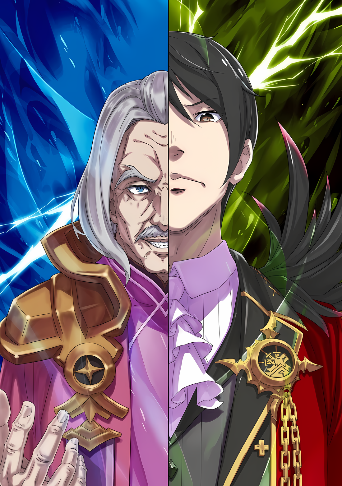

……Пока пламя восстания распространялось по всей Империи Волакия, признаки беспорядков росли с каждым днем.

Прошло более девяти лет с тех пор, как Винсент Волакия взошел на трон в качестве Императора, но впервые внутренние дела были сожжены дотла, а сердца людей охвачены смятением.

История Империи Волакия была историей войны.

Даже если наступила беспрецедентная в истории эра мира, конфликты, происходящие в местах, недоступных для глаз и ушей столицы Империи, невозможно было полностью предотвратить. В результате люди никогда не были по-настоящему спокойны.

Но даже несмотря на это, люди, живущие в столице Империи Рапгане, имели подобие мира.

Поскольку столица Империи находилась под пятой Императора, только в этом великолепном городе не возникало конфликтов. В какой-то мере эта безопасность опиралась на власть Императора Винсента Волакии…… Однако это осталось в прошлом.

Два года ранее в столице Империи произошла попытка покушения на Императора. Он был так тяжело ранен, что едва не лишился жизни, а виновником оказался один из «Девяти Божественных Генералов».

После этого инцидента люди узнали, что в Империи они никогда не были в полной безопасности. Узнав это, они тоже ожидали такой участи.

Поэтому статус Императора остался непоколебимым из-за духа восстания кого-то из «Девяти Божественных Генералов» на пике военной мощи Империи, и Волакия не распадется, как бы сильно она не была потрясена…

???: ……Безопасность и ожидания людей сильно пошатнулись в последнее время.

Доклад, признающий наличие трещин в основных принципах, заложенных в Империи.

Когда этот доклад эхом разнесся по величественному тронному залу, каждый, кто пытался закрыть уши от этих неприятных слов, мог быть безжалостно обезглавлен на месте, поэтому неудивительно, что все так колебались.

Гражданские чиновники и военные офицеры, выстроившиеся здесь, в Кристальном Дворце столицы Империи…… даже если их соответствующие поля сражений отличались, все люди, собравшиеся здесь, в самом центре Империи Волакия, несомненно, были воинами. Но даже эти люди не могли не колебаться, потому что показаться здесь трусливым воином было равносильно смерти.

Никто из них не боялся смерти. Они боялись лишь напрасной смерти.

Они боялись, что встретят смерть, недостойную храброго воина Волакии.

Поэтому Генералы отдали дань уважения беловолосому мудрому старику, который предложил это, премьер-министру Беллстетзу Фондальфону. А затем они ждали ответа Винсента, которому премьер-министр представил свой доклад.

Винсент: …………

Большой трон, вмещающий все его стройное тело, постоянно передавался по наследству как символ власти со времен первого Императора Волакии.

С поднятого за троном государственного флага на войска взирал национальный герб — волк, пронзенный мечами. С Волком-Мечом за спиной сидел спокойный и уравновешенный Винсент.

Неторопливо прислонившись спиной к трону, он не проявлял никаких признаков военной мощи.

Более того, никто никогда не слышал слухов о том, что этот Император, наделенный непостижимой мудростью, может преуспеть в боевых искусствах. Вряд ли кто-то видел, как он владеет мечом или проявляет интерес к охоте.

До тех пор, пока Император находился на Императорском троне, от него ожидалось, что он будет править всей Империей без исключения.

Несмотря на то, что Империя превыше всего ценила силу, владение боевыми искусствами не было обязательным требованием для Императора на ее вершине. Это объяснялось тем, что оружие Императора — это его несравненно могущественные последователи.

Однако……

???: ……Кх

Большая часть войск была под давлением Императора, который ничего не делал молча сидя на месте.

Они ничего не потеряли бы, если бы попытались его зарубить; трон находился всего в нескольких секундах пути. Если для сильного естественно угнетать слабого, то у Имперских войск не было ни малейшей причины бояться этого Императора.

Тем не менее, расстояние и неотразимое присутствие Императора были неприступны.

Винсент: Безопасность народа, хм?

Внезапно, нарушив молчание, эти слова сорвались с губ Императора.

Казалось, что напряжение, царившее в тронном зале, спадет, но вместо этого оно стало еще сильнее, сжимая сердца солдат.

Винсент сузил свои миндально-черные глаза и посмотрел на Беллстетза, который продолжал клясться в верности, сложив ладонь и кулак перед грудью,

Винсент: С каких это пор Императоры моей страны стали обращать внимание на страдания своего народа?

Беллстетз: ……Я понимаю, что вы говорите, Ваше Превосходительство. Однако реальность такова, что народная молва вызывает опасения по поводу правления Вашего Превосходительства. Если этим пренебречь, эта ядовитая кровь распространится, как болезнь, по всей Империи.

Винсент: Ты советуешь мне пролить всю эту ядовитую кровь?

Беллстетз: Покорнейше прошу заметить, что даже Ваше Превосходительство Император лишился бы жизни, если бы его обезглавили. Не будет ли неосмотрительным потерять голову вместо другой конечности?

Винсент: …………

Беллстетз: Конечно, было бы идеально, если бы это дело можно было пресечь с помощью пальцев, ушей и ногтей.

Завершая свое последнее замечание поклоном, Беллстетз таким образом высказал свое собственное мнение.

Это откровенное, или, другими словами, бесцеремонное предложение заставило остальных солдат вздрогнуть. Но в то же время они восхищались тем, что он говорил за них и сказал то, что нужно было сказать.

В конце концов, Беллстетз выразил коллективное мнение всех войск о восстании, распространяющемся по всей Империи.

Имперские солдаты были в ярости от того, что люди смирились с правлением Винсента и присоединились к тем, кто изредка поднимал голос, поднимая повсюду восстания.

Если бы кто-то был частью этой первой группы, он также мог бы выйти на сцену в качестве доблестного противника. Но как быть с позором тех, кто последовал за ними?

Борьба, победа и обеспечение безопасности были основополагающими принципами народа Империи.

Народ Империи должен быть сильным, но слишком много людей неправильно истолковали смысл этого изречения и использовали его в своих корыстных целях. Разве их истребление не было бы единственным способом воплотить в жизнь намерение «народ Империи должен быть сильным»?

Однако Винсент не принял упреждающих контрмер против этих восстаний и полагался на разбросанные гарнизоны, чтобы отбиться от них. Хотя……

Беллстетз: Отправка всех Генералов Первого класса только для того, чтобы пресечь восстания в зародышевой ситуации, не решит ее кардинально.

Винсент: Довольно красноречиво, Беллстетз. Стоя прямо передо мной, со всеми войсками в строю позади, ты выглядишь так, как будто являешься главой восстания.

Беллстетз: Вы шутите. Я не готов возглавить восстание и согнать Ваше Превосходительство с трона.

Винсент: Хмф.

С легким фырканьем Винсент не обратил внимания на опровержение Беллстетза.

Тем не менее, было понятно, почему Винсент так сказал. В конце концов, все слова Беллстетза уже давно были сказаны от имени сердец Имперских войск.

Включая тот момент, когда он упомянул о предполагаемом развертывании Генералов Первого класса и посоветовал отказаться от этого как от недостаточного.

Оставим в стороне последовавший за этим кровопролитный, остроязычный обмен мнениями….

Беллстетз: Ваше Превосходительство, это восстание…

Винсент: Я прислушался к твоему совету. Однако…

Беллстетз: …………

Винсент: У меня тоже есть план.

Взгляд Винсента окинул Беллстетза и собравшихся солдат, уничтожив всякое недоверие, которое они могли испытывать к Императору.

Когда было созвано совещание и их собрали в тронном зале, каждый из них по-своему воспринял нежелание Винсента выступить против этого мятежа.

На самом деле, от имени войск выступал Беллстетз, но все они разделяли его чувства, которые еще больше усилились, когда они услышали, что он хотел сказать.

Эти чувства, которые в определенном смысле готовы были распространиться, как пламя восстания, были погашены.

Подобно большому пожару, который гасят ветер и вода, они были замедлены, ослаблены и затушены.

И тогда……

Винсент: Или вы все сомневаетесь в моих словах?

Брови Беллстетза дрогнули, когда его спросил Император, обладатель столь глубокой мудрости.

Какие эмоции мерцали за этим узким, как нити, взглядом, не видимым остальным, было неизвестно никому из присутствующих.

Лишь одно было известно наверняка.

Солдаты: ……Нет, никак нет!

Солдаты в унисон заголосили, галантно отвечая на вопрос Императора.

Топая ногами, военные офицеры достали и подняли мечи с пояса. Гражданские чиновники сцепили ладони и кулаки перед грудью, каждый отвесил почтительный поклон, подобающий его положению, и ответили тем же на вопрос Императора.

Никто не мог расшифровать мысли Императора Винсента Волакии.

Однако если вопрос, поставленный здесь, заключался в том, стоит ли отбрасывать нечто недостойное доверия, ответом на него, конечно же было «нет».

Если для доверия необходимы слова и достижения, то Винсент продемонстрировал доказанную репутацию.

Его достижения были достойны внимания, начиная с «Церемонии Отбора Императора», за которой последовало правление без серьезных потрясений.

Продемонстрировав свои достижения, Император также произнес слова, необходимые для доверия.

— Вы все сомневаетесь в моих словах?

Винсент: Я хорошо обдумал ситуацию с восстанием. Если я не расскажу вам все, от начала до конца, вы не сможете удовлетворительно повиноваться?

Войска: ……Нет, никак нет!

Винсент: Тогда, если это так, навострите уши и сделайте то, что должно быть сделано, пока ваши глаза не разбежались. Я не намерен приукрашивать ваше положение для тех, кто не делает того, что должно быть сделано.

Речь Императора была одновременно холодной и резкой, поэтому он показался солдатам таким знакомым.

Взгляд и тон голоса Винсента были способны манипулировать рвением душ других людей. Его дьявольская сущность, способная быть то горячей, то холодной, заставляла сердца солдат пылать в этот момент.

Глаза солдат остекленели от тревоги и подозрительности, они гадали, о чем он думает.

Конкретного ответа не последовало. Но затуманенные глаза солдат прояснились. ……Потому что их Император дал им понять, что он работает над своими глубочайшими махинациями.

Только тогда многие Имперские солдаты смогли поверить в победу и сражаться дальше.

Беллстетз: Вы бы не хотели что-нибудь разгласить и нам, хотя бы чуть-чуть?

Винсент: С какой целью? Если я раскрою это, то это бросит тень на мою стратегию. Что мы получим? Душевное спокойствие для тебя и тех солдат, которые напуганы будущими событиями?

Винсент отмахнулся от Беллстетза резким тоном, как бы говоря, что нет смысла сравнивать их.

Но солдаты поддержали ответ Винсента. В их сердцах больше не было прежнего чувства, что слова Беллстетза говорят за них.

Скорее, они даже почувствовали гнев и разочарование от предложения Беллстетза. Винсент дал понять, что у него есть собственное мнение. Этого должно быть достаточно.

Винсент: Вы можете не соглашаться. Я, однако, не намерен предлагать объяснение, основанное исключительно на престиже Империи.

Глядя на молчащего Беллстетза, Винсент дополнил свои слова.

При звуке голоса Императора, убеждающего своих неубежденных противников, многие из солдат покачали головами. Дальнейшие слова были не нужны. И все же Император продолжил.

Винсент: Но, как я уже сказал. У меня нет желания раскрывать перед всеми вами свои намерения. Вместо этого у меня есть только несколько слов от себя.

Беллстетз: Ваше Превосходительство……

Винсент: Народ Империи должен быть сильным.

Беллстетз: …………

Винсент: ……Я подготовлю поле боя, подобающее пути Волка-Меча.

Глубокомысленно кивнув, Винсент пообещал это собравшимся войскам позади Беллстетза.

Через мгновение по телам солдат пронеслась палящая страсть. Охватившее их пламя было не менее яростным, чем пожар восстания, охвативший всю Империю.

Если восстание было пламенем недоверия к Императору, то горение внутри войск стало пламенем уверенности в Императоре.

Винсент и Беллстетз: …………

Винсент и Беллстетз молча смотрели друг на друга, наблюдая, как в войсках нарастает жар.

Император и премьер-министр, оба занимали самые высокие посты в Империи благодаря своей изобретательности; окружающие войска не могли догадаться о намерении взглядов, которыми обменялись эти двое.

Однако Беллстетз не стал делать никаких дальнейших заявлений, которые могли бы подорвать намерения Императора.

Но вместо этого………

Беллстетз: ……Ваше Превосходительство, при всем уважении, у меня есть еще один вопрос.

Винсент: Еще вопросы и подозрения? В отличие от первого раза, те, кто стоит за тобой, похоже, не на твоей стороне.

Беллстетз: Очень трудно для человека, занимающего пост премьер-министра, решать, давать или не давать рекомендацию, основываясь на наличии или отсутствии союзников.

Винсент: Раз уж твой рот все еще движется. Говори.

Винсент призвал его к этому, подергав тонкой челюстью.

В ответ Беллстетз предварил свои замечания словами: «Что же», а затем продолжил.

Этим было……

Беллстетз: ……Черноволосый «Наследный Принц».

Винсент: …………

Беллстетз: Те, кто восстает по всей земле, выбрали его своим лидером. Он черноволосый, черноглазый мальчик, и его происхождение…… гласит, что он сын Его Превосходительства.

Подобно огненным магическим камням, пропитанным маной, Беллстетз бросил их, к лучшему или к худшему, и снова заставил окружавших его солдат, которые не могли ясно осознать окружающее, потерять дар речи.

До солдат дошли слухи об этом. Даже для них было бы ложью сказать, что их не волновала правда этих слухов. Но у них не хватало смелости подтвердить их.

Беллстетз прямо спросил об этом, и снова возникло предвкушение, поскольку войска, которые должны были быть охвачены враждебностью, казалось, изменили свое мнение.

Существование «Наследного Принца» было теперь в центре внимания всех жителей Империи.

Как это выглядело для глаз Винсента, как это слышали его уши и как об этом говорили его уста.

После небольшой паузы Винсент обратился к премьер-министру со словами: «Беллстетз».

А затем……

Винсент: Не ведись на такие легкомысленные слухи. У меня нет детей. Если необходимо, выясни, откуда берутся эти слухи, и представь наследника престола передо мной. Я оставлю его в качестве клоуна для своего развлечения.

И с лукавой улыбкой на лице черноволосый Император заверил всех в этом.

△▼△▼△▼△

Беллстетз: ……Действительно ли «Наследный Принц» не сын Вашего Превосходительства?

Это был тот же самый вопрос, который был задан несколько минут назад в присутствии большой толпы.

Однако тон эмоций в его голосе был несколько иным и имел больший вес. Это был серьезный вопрос и голос, который поняли бы только те, кто его услышал.

Ведь для старика, задавшего вопрос, это был вопрос жизни и смерти.

Местом встречи был не тронный зал и не Кристальный Дворец, а резиденция премьер-министра в столице Империи.

Хотя они оба отвечали за управление Империей, напряжение между Винсентом и Беллстетзом всегда было на грани, и окружающие считали, что они, мягко говоря, не ладят.

По этой причине их диалог должен был стать большим шоком для тех, кто стал его свидетелем.

Винсент Волакия тайно посетил особняк Беллстетза Фондальфона, и они столкнулись друг с другом в комнате таким образом.

Конечно, если исходить из значения слова “шок”, то это было бы гораздо больше на стороне реальности.

Винсент: …………

Винсент сузил свои черные глаза в ответ на вопрос, затем он перевел взгляд на своего партнера и промолчал. Император не просто рассуждал, а делал паузы, чтобы загнать противников в угол, поэтому Беллстетз не спешил.

Он был старым человеком и знал, как действуют молчание и паузы.

В самом деле, хотя это называлось «Вопросом Жизни И Смерти», в облике Беллстетза, задавшего вопрос и ожидавшего ответа, не было ни следа беспокойства, волнения или самосохранения.

Действительно, не было ни малейшего намека на самосохранение. Именно это больше всего настораживало в этом старике.

Винсент: Очевидно.

Беллстетз: …………

Винсент: Ответ не меняется. У меня нет наследников. Все это чепуха.

Беллстетз: Как я уже говорил, обсуждение здесь не просочится наружу. Даже если бы это был Генерал Первого класса Ольбарт, его напряженные уши ничего не уловят. Вы это знаете.

После долгой паузы Беллстетз ответил на ответ Винсента.

«Чайная Комната» в особняке Беллстетза представляла собой небольшую крепость со всем необходимым для проведения секретных переговоров. Ходили разговоры, что в Волакии мистические барьеры, использующие редкую магию, применяют такие вещи, как таинственные проклятия или «Метеоры».

Ходили слухи, что одна только эта «Чайная Комната» стоила столько, что хватило бы на покупку целого города.

Беллстетз: Я получил необходимое жалование. Она перейдет в твои владения после моей смерти, чтобы ты мог использовать ее с пользой.

Винсент: Как ты думаешь, подойдет ли помещение с названием «Чайная Комната» Кристальному Дворцу?

Беллстетз: Название и интерьер не так важны, поэтому ты сможешь переделать ее как угодно. Важна ее функция…… Здесь не нужно надевать фальшивую кожу.

Вместо того чтобы использовать подразумеваемые значения, Беллстетз говорил в откровенном регистре, чтобы снять с него маску.

При этом Винсент закрыл один глаз. Это не было созерцанием. Ответ был очевиден. Это была просто еще одна пауза, еще один период молчания.

Хотя он знал, что это никак не повлияет на старика, стоящего перед ним, он не собирался срезать углы.

Он не собирался отступать от того, что уже решил. Легкомысленные старые знакомые прямо говорили ему, что это не игра, но это было в его характере.

Винсент: У меня нет причин следовать твоему примеру. Мы с тобой находимся в отношениях взаимной борьбы, основанной на наших общих интересах. Не пойми меня неправильно.

Беллстетз: Понятно. Если это так, то я хотел бы, чтобы ты развеял мои сомнения.

Винсент: …………

Беллстетз: Я спрошу еще раз. У вас нет сына, не так ли, Ваше Превосходительство Император?

Винсент: ――. Ответ остается прежним.

Винсент повторил один и тот же ответ снова. Беллстетз ответил коротким: «Понятно», без тени разочарования или облегчения на лице.

Если учесть, какую цель преследовал этот старик, он понял, что именно ему нужно ответить, но поскольку Винсент был в раздумиях над прошлым вопросом, он задал вопрос в ответ.

Винсент: Допустим, если бы у меня был ребенок, что бы ты сделал?

Беллстетз: Если бы у Его Превосходительства родился сын, это означало бы, что Его Превосходительство готов исполнять обязанности Императора. Сын был бы обеспечен как можно скорее, и мы вернули бы на трон настоящего Его Превосходительство.

Винсент: Хм. Тогда, что насчет меня?

Беллстетз: Мы оба знаем, как предатели встречают свой конец, не так ли?

Беллстетз был основателен в своем ответе, который был фактичным и спокойным.

Было приятно видеть человека, который прошел весь этот путь до крайности самоотверженно, чтобы служить образу жизни Империи. Тот факт, что в его внешности не было ни капли неуверенности, еще больше подчеркивал ненормальность.

И это несмотря на мысли Беллстетза……

Винсент: ……Слухи о «Наследном Принце», должно быть, распускает сам человек, который продолжает скрываться.

Беллстетз: Ты думаешь, это спровоцирует восстание в разных местах? Возможно ли, что были дети, о которых даже ты и Генерал Первого класса Сесилус не были проинформированы?

Винсент: Это невозможно.

Беллстетз: Даже ты не знаешь всего о Его Превосходительстве.

Винсент: ……Это невозможно.

Винсент покачал головой Беллстетзу, который любил уточнять мельчайшие детали.

Это не было выдачей желаемого за действительное, желанием или притворством, чтобы понять. Этого не могло произойти. Он мог заверить его без малейших сомнений.

Независимо от подлинности, у Винсента Волакии не было ребенка.

Этот человек, должно быть, был очень скрупулезным, чтобы не оставить места для подобных подозрений или даже проблеска возможности. Чтобы исключить любые сомнения, он даже никогда не делил постель с женщиной.

Стальная воля никогда не закрывать глаза перед другими — вот что заставляло его придерживаться своего образа жизни.

Поэтому……

Винсент: ……У Винсента Волакии нет ребенка. Твои действия были справедливы.

Беллстетз: Справедливы? Если бы это можно было назвать справедливостью, то узурпировать трон должен был я. Но этого не произошло, а значит это уже не справедливо. Во-первых….

Винсент: …………

Беллстетз: С такими руками, похожими на засохшие ветви старого дерева, я не в состоянии защитить мощь Империи.

Ровный тон голоса старика казался скорее неистовой одержимостью, чем чем-то еще.

Многие люди верили, что поступают правильно, и действовали соответственно. Иначе они не смогли бы в полной мере проявить свои способности и, конечно же, не смогли бы самоутвердиться.

Как много людей в этом мире смогли бы оставаться непоколебимыми, осознавая, что совершают ошибки? Они возвращаются с этими результатами только будучи непоколебимыми.

Так что же тогда……

Винсент: …………

……Так что же тогда что их ждало на пути, полным ошибок в прошлом.

Беллстетз: Если все сомнения рассеяны, то мои действия, остаются неизменными.

Пока Винсент размышлял, Беллстетз говорил беззаботным голосом.

Возможно, он вообще не предполагал, что существует «Наследный Принц». Если бы его ближайшее доверенное лицо сказало ему, что такой возможности нет, он мог бы на время отбросить свои сомнения.

Следовательно, внимание Беллстетза и тема его интереса также быстро перешли к следующему вопросу.

Беллстетз: Тогда, как мы поступим с мятежниками, которые обратят свои клинки против тебя?

Винсент: Ты был недоволен обменом мнениями в тронном зале?

Беллстетз: Я осмелился представлять войска, но в итоге я нахожусь в ином положении, чем они, поскольку они полностью доверяют твоей мудрости и авторитету. ……Мы отправили Генерала Первого класса Аракию и Генерала Первого класса Мэделин в различные части страны, чтобы подавить семена восстания, но одного этого недостаточно для компенсации.

Винсент: …………

Опираясь подбородком на кресле, Винсент молча выслушивал доклад Беллстетза.

На самом деле, поведение Беллстетза в тронном зале его не устроило. Но учитывая ситуацию в Империи и положение Винсента, это была лучшая тактика из возможных.

Таким образом, разочарование и подозрения войск были перенаправлены. Однако Беллстетз, который знал о том, что Винсент просто сидит на вакантном троне, сомневался в своих полномочиях.

Беллстетз: Обычно в этом пункте плана требуются командирские способности либо Генерала Первого класса Чиши, либо Генерала Первого класса Гоза. Поскольку мобилизовать их обоих сложно, альтернативный план…… как насчет возвращения Генерала Первого класса Груви?

Винсент: ……Передвижения северо-запада ужасно подозрительны. Будь то Карараги или другая сторона, у нас нет возможности отодвинуть его от этой границы в данный момент.

Изначально в обязанности Генерала Первого класса входило поддержание внутренней безопасности и сдерживание внешних угроз.

Эта ситуация была вызвана сотрудничеством Винсента и Беллстетза, но если она поставит под угрозу положение Империи, это будет все равно, что поставить карету перед лошадью Галевинд……задушить ее до смерти из-за эгоцентричного руководства.

Развертывание Груви Гамлета также было незаменимым стержнем в обороне Империи.

Беллстетз: Тогда, как насчет Генерала Первого класса Ольбарта?

Винсент: Мы не хотим бездумно перемещать его подальше от столицы Империи и без необходимости подвергать его опасности со стороны повстанческих сил. Необходимо оставить его в столице и разместить в стратегически важных точках. По крайней мере, пока он готов следовать за нами.

Беллстетз: Также необходимо восстановить руку, которая была потеряна во время инцидента в Городе Демонов. Учитывая обстоятельства, не будет слишком сложно оставить его в столице Империи. Если так, то остается Генерал Первого класса Могуро.

Винсент: У него есть долг, который может выполнить только он.

Постукивая по полу носком ботинка, Винсент отвергал предложения Беллстетза одно за другим.

Все «Девять Божественных Генералов» получили критически важные задания. Лишь немногие из «Девяти Божественных Генералов» не попадали в эту категорию.

Беллстетз: Что насчет Генерала Первого класса Сесилуса?

Винсент: Ему очень трудно отличить друга от врага. Его убеждения не меняются, какие бы принципы или великие цели он ни преследовал. Поэтому я исключил его из совета.

Они давно знали друг друга, достаточно сказать, что они были знакомы. Но ни разу у них не возникало ощущения, что они понимают друг друга.

Возможно, никто, кроме Сесилуса, не мог понять Сесилуса. Его умение владеть мечом было бесспорным, но в его позиции не было места для неуверенности.

Хотя для Сесилуса, который хотел стоять на великой сцене, эта история казалась весьма прискорбной.

Винсент: В любом случае, шансов на его возвращение нет. Пешки, которые доставляют хлопоты при использовании, не только не могут быть использованы, но и срывают расчеты. В целом, на мятежников следует смотреть аналогичным образом.

Беллстетз: ――. Я не возражаю, если его не вернут на доску. Но тогда какой военный потенциал ты имеешь в виду, который можно задействовать против «Наследного Принца», нагло выдающего себя за сына Его Превосходительства, набирающего силу повстанцев, вместе с Генералом Первого класса Йорной?

Винсент: Аракия, Ольбарт Дарккенн и Мэделин Эшарт.

Беллстетз: …………

Винсент: Если ты считаешь, что этого недостаточно, добавь Чишу Голд и Могуро Хагане.

При слове «недостаточно» Беллстетз покачал головой и просто сказал: «Вовсе нет».

Хотя было сомнительно, насколько непредвзятым можно быть в этом вопросе, это была экстраординарная ситуация, когда пять из «Девяти Божественных Генералов» противостояли противнику. Кроме того, были еще и Генералы Второго класса, с Кафмой Ирулюкс во главе, которых по силе можно было назвать Генералами Первого класса, и их было не мало.

Поэтому……

Винсент: ……В Рапгане, столице Империи, мы вступим в бой с мятежниками.

Беллстетз: Возможно, повстанцы изменят свою военную стратегию, когда соберут все свои силы.

Винсент: Черноволосый «Наследный Принц», чтобы собрать силы, и кучка коллаборационистов, использующих его как символ обмана? Как может такая группа людей быть настолько единой в своем упорстве в подлинности несуществующего наследного принца? В краткосрочной перспективе это может быть умным ходом, чтобы разжечь огонь восстания, но расхождения неизбежно будут накапливаться со временем.

Повстанцы воспользовались этой возможностью, чтобы поднять свой голос, многие из них — под знаменем фальшивого наследного принца.

Даже если бы все силы повстанцев со всей страны собрались в столице, они не смогли бы скоординировать свои действия друг с другом. Однако Винсент Волакия, конечно же, не упустил такую возможность.

Учитывая это, он испытывал некоторую тревогу. И, говоря о беспокойстве……

Беллстетз: ……Решающая битва в столице Империи, да? С момента основания Священной Империи Волакия, группа повстанцев идет прямиком на столицу Империи, словно как в «Гильотине Магризы».

Винсент: Беллстетз.

Беллстетз: Да?

Винсент: Ты, кажется, наслаждаешься собой.

На замечание Винсента Беллстетз выдал необычно растерянное «Да?». Однако, когда он ущипнул себя за щеку пальцами, он впервые осознал эти чувства.

Тщательно прощупывая слегка распространившуюся радость и ее истинное происхождение,

Беллстетз: Мне ужасно жаль. Я приношу свои искренние извинения.

Винсент: Извинения излишни. Почему ты улыбаешься?

Беллстетз: Улыбка… Просто, я подумал, что все проходит как и ожидалось.

Винсент: Как и ожидалось?

Беллстетз: Как и ожидалось, картина водоворота войны — это и есть сама Империя Волакия.

rezero7arc | Иллюстрация к** Ранобэ** Том 32 | Разукрасил V!c.ll2o

Для любого за пределами Империи это прозвучало бы как глупость, сказанная стариком.

Однако, вероятно, такого мнения придерживались почти все в Империи Волакия, и молодые, и старые, и Беллстетз не был уникальным в этом отношении.

……Нет, конечно, редко кто говорил такие вещи, даже в таком положении.

Винсент: Существование Империи Волакия полностью определяется этим?

Беллстетз: У каждого из нас есть своя картина будущего, которое мы представляем себе. У Вашего Превосходительства…… нет, у тебя ведь тоже, я в этом уверен.

Винсент: …………

В Чайной Комнате не было возможности подслушивать, тем не менее, он сказал слишком много.

Такая болтливость была нехарактерна для Беллстетза, и, возможно, это было доказательством того, что в его жилах течет человеческая кровь. Если это так, то, возможно, в Винсенте нет человеческой крови.

Причиной было….

Винсент: Ты сказал слишком много, Беллстетз. За кого ты меня принимаешь?

Действительно, в тихих словах его ответа не было ни восторга, ни сожаления, которые должны были бы присутствовать.
