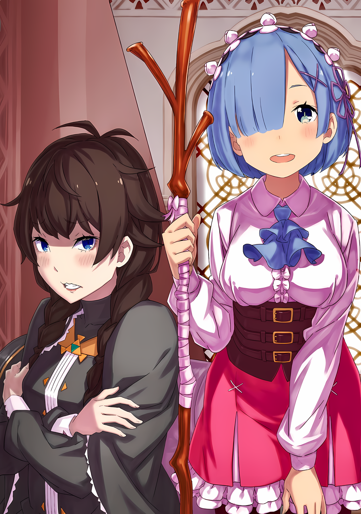

???: В последние несколько дней в особняке распространилась довольно мрачная атмосфера, не находишь?

Тихо пробормотала Рем, чувствуя, как в воздухе нарастает напряжение.

Сухой воздух и холодный ветер, принесенные извне, казалось, смешивались со слабым человеческим беспокойством и раздражением, поднимавшимся на поле боя.

Хотя это было лишь на короткое время, Рем несколько раз испытала на себе, что значит быть на поле боя.

Если поддаться этому чувству, то напряжение на коже будет нарастать день ото дня, ожидая момента, чтобы сорваться. Даже солдаты, охранявшие особняк, казалось, постепенно теряли самообладание.

Впрочем, это тоже, вероятно, было вызвано влиянием сложившихся обстоятельств.

Рем: Я слышала, что армия повстанцев одерживает верх…… Сейчас в разных частях Империи происходят восстания. Имперская армия была так занята их подавлением, что не смогла активно отреагировать.

По иронии судьбы, именно битва в Городе-крепости Гуарал, которая привела к похищению Рем, спровоцировала одновременное восстание этих повстанцев. Имперская армия предприняла тотальное наступление, к ним был также отправлен один из «Девяти Божественных Генералов», но даже так они с трудом отбились от разновидовой армии повстанцев.

Повстанческая армия…… Для Рем, которая знала, что Абел, возглавляющий их, был настоящим Императором, это был противоречивый способ обращения к ним, но она слышала, что силы сопротивления продолжают расти.

Ходили даже слухи, восхваляющие неукротимый город, который великолепно отразил безжалостную атаку «Генерала Летающих Драконов», что еще больше укрепляло веру в то, что Имперскую армию, беспомощно отброшенную назад, можно не бояться.

Рем: Можно сказать, что они не лгут, но….

С точки зрения Рем, как человека причастного к этому, командующая летающими драконами Мэделин отступила не по стратегическим причинам, и было сомнительно делать вывод, что город, пострадавший до такой степени, был победителем.

Конечно, с точки зрения повстанческой армии, победа все равно была победой, и не было причин упускать прекрасную возможность для распространения своих идей. Благодаря этому повстанцы со всех концов присоединялись к набирающему силу восстанию.

Со стратегической точки зрения, в этом не было ничего странного. ……Действительно, ничего странного.

Были и другие причины, по которым повстанцы были в приподнятом настроении.

Рем: ……………

Помимо победы в Городе-крепости, объясняющей беспрецедентный успех восстания повстанцев, есть еще одна причина: Госпожа Города Демонов Хаосфлейм, Генерал Первого класса Йорна Миссигр, присоединилась к этому делу.

Дезертирство этого капризного Генерала Первого класса, известного своими исключительными способностями, придало импульс восстанию.

И это, в частности, с самого начала было планом Абела, а также планом Нацуки Субару, который пошел с ним.

Рем: ……Он мог просто ходить рядом… и есть вероятность, что он вообще не был полезен.

Какая доля этих событий была приведена в движение Субару?

Упомянув о возможности того, что он ничем не был полезен, Рем сама признала, насколько неубедительными были эти слова. Гипотетически, если он и был бесполезен, то только потому, что все слова и действия Субару не воспринимались.

А поскольку она не могла представить себе Субару, держащего рот на замке и не предпринимающего ни малейших действий, он, вероятно, добился хоть чего-то. ……Или даже убедил Генерала Первого класса сменить сторону.

Впрочем, возможно, она слишком много думает об этом.

Рем: Действительно ли я……?

Неоспоримое предчувствие заставило ее задать себе этот вопрос.

Повстанцы восстали одновременно, и основы Империи задрожали, как никогда прежде. Ветры, наполненные запахом крови и стали, дули и в столице Империи, достигая даже Рем и остальных, попавших в плен.

В какой же степени Абел мог предвидеть эту ситуацию?

Рем: Была ли даже первоначальная самонаправленная враждебность частью его расчетов?

Возможно, он рассчитал и распространение восстания и то, что фальшивый Император соберет свои силы в столице Империи после последовательных выступлений мятежников.

Даже Субару был просто использован Абелом в качестве пешки для осуществления своего великого плана.

Вероятно, Субару не рассказали всех деталей плана. В конце концов, он был всего лишь пешкой, которую использовали для достижения целей Абела. ……Не то чтобы она не знала о причинах этого.

Она бессовестно притворялась, что не знает о таком обмане.

Рем: …………

В таком темпе небольшое восстание, вспыхнувшее в «Племени Судрак», охватит всю Империю и превратится в политический переворот для учебников истории?

И если да, то как в итоге будут рассказывать об Абеле и Субару, которые оказались в самом центре событий?

И в разгар всего этого, чего именно она должна достичь……

???: Эй.

Рем: А….

???: Что ты делаешь? Ты же сама сказала, что хочешь это сделать. Правильно… да, возьми на себя ответственность и сделай это до конца.

С этими словами Рем вернулась к реальности и широко раскрыла глаза.

С первого взгляда Рем заметила женщину, играющую со своими темно-каштановыми волосами…… Катю. Она сурово смотрела на Рем через зеркало на туалетном столике перед собой.

Ее непокорные волосы запутались в кончиках пальцев Рем. Это было вполне естественно, ведь Рем как раз занималась прической Кати.

Рем: Извини. Я кое о чем задумалась.

Катя: Тебе не обязательно говорить мне, конечно, у всех всегда есть что-то на уме, не так ли? Не надо сообщать о каждой мелочи, как будто это оправдание.

Рем: …………

Катя: ……Ах, не то чтобы я говорила, что ты не должна, но……

Подумав, что, возможно, зашла слишком далеко, Катя неловко поправила себя.

Извиняющаяся Рем непроизвольно почувствовала себя восхищенной из-за взгляда девушки.

Катя О'Рейли…… женщина, находившаяся в плену в особняке премьер-министра Беллстетза под домашним арестом, так же, как и Рем.

В отличие от Рем, которая была привезена в качестве целителя для раненого Флопа и помещена под домашний арест обеспокоенным Беллстезом, она, похоже, оказалась здесь по другим обстоятельствам.

Не то чтобы они обменялись подробностями своих обстоятельств, но по сравнению с их встречей даже возможность поговорить таким образом означала, что они значительно потеплели друг к другу. Катя была из тех людей, которые при малейшем замечании срываются и удваивают дистанцию до того, кто пытается сблизиться с ней.

Катя: ……Что это за выражение? Оно довольно раздражающее.

Рем: Прости. Даже сейчас я еще не привыкла к этому выражению. Я словно незнакома сама себе.

Катя: М-можешь не говорить такие страшные вещи? После истории о том, как ты потеряла память, я уже не могу понять, когда ты говоришь серьезно, меня это пугает!

Мрачно глядя в зеркало, Катя поднесла палец ко рту и прикусила его.

Когда что-то шло не так, Катя имела привычку так грызть ногти. Рем знала ее совсем недолго, но, к счастью или к худшему, она часто прибегала к этому, когда чувствовала себя на грани.

Грызя ногти, Катя укоризненно посмотрела в зеркало на себя и Рем, стоявшую позади нее. Позади женщины, сидящей в инвалидном кресле, она все еще смотрела на свое отражение в зеркале на туалетном столике.

В конце концов, то, что она рассказала Кате, было преувеличением.

Даже Рем, лишенная своих «Воспоминаний», уже давно смирилась с тем, что это выражение лица не чужого человека, а ее собственное. Она не может позволить себе огрызаться на все, что видит и к чему прикасается.

Если она начнет сомневаться в доброте Луис, жителей Судрак, Медиум, Флопа, Присциллы или Шульта, разве не останется от нее только пустое «я»?

Поскольку она знала это, не пора ли первому человеку протянуть ей руку помощи……

Катя: ……У тебя хорошо получается делать прически.

Рем: А?

Катя: Как я уже сказала, у тебя неплохо получается делать прически. Может быть, до того, как ты все забыла, ты выполняла такую работу… хотя такой работы не бывает, правда? Я сказала глупость. Забудь об этом. Просто забудь. Забудь.

Отвернувшись от своего отражения в зеркале, Катя покраснела при виде Рем, рассеянно делающей ей прическу. Не успела она и глазом моргнуть, как Рем закончила ее причесывать, можно было даже сказать, что ее мастерство явно заслуживало похвалы.

Взявшись обеими руками за косички, свисающие по обе стороны головы, Катя с дрожащими губами посмотрела на Рем.

Катя: Ты опять сбиваешься… Если я такая скучная собеседница… Тогда! Пожалуйста, не надо со мной возиться… да, иди к кому-нибудь другому!

Рем: Нет, все остальные в особняке заняты работой.

Катя: Тогда я одна бездельничаю? И потом, приходить ко мне, как ни к кому другому…

Рем: Все не так. Пожалуйста, не ставь меня в такое положение.

Катя: Кто тут из нас еще…!

Повернув колеса своей инвалидной коляски, Катя скрылась в глубине комнаты. Грызя ногти и глядя вверх, она была как свирепая кошка, чью территорию нарушили.

Непонятное отношение Рем не давало Кате покоя.

Рем: Катя-сан, прости за недоразумение. Я зашла в комнату Кати-сан, не потому что она была единственной свободной в особняке.

Катя: Тогда… тогда, что ты говоришь?! Почему ты пришла ко мне……

Рем: Ну…

Задав вопрос о подходящей причине, Рем на мгновение задумалась.

Так же, как она ответила Кате, Рем не настолько легкомысленно относилась к своему положению, чтобы искать кого-то, чтобы убить время в такой ситуации. Однако, немного пообщавшись, она поняла, что Катя не была особенно важной персоной и не владела никакими секретами Империи.

С точки зрения Рем, которая спешила по своим делам, общение с ней, несомненно, мало что давало.

Тем не менее, она активно пыталась наладить отношения с Катей, потому что……

Катя: П-почему? Скажи мне! Если ты не хочешь говорить……

Рем: Я думаю, все потому, что Катя-сан мне как друг.

rezero7arc | Иллюстрация к** Ранобэ** Том 32 | Разукрасил V!c.ll2o

Катя: ……………

Рем: Катя-сан?

Она серьезно пыталась заглянуть внутрь себя и найти подходящие слова, но все, что получалось…… это смутные мысли.

У Рем не было никаких проницательных мыслей, когда дело касалось Кати. Поэтому она не могла объяснить ей причину «Того», чего она хочет.

У Рем были бы проблемы, если бы она не смогла убедить Катю.

Катя: Друк…… Кто такой Друк?!

Рем: А? Ааа, это не чье-то имя. Друг означает что-то вроде компаньонства. Дружба создает компанию из друзей, даже если их всего двое.

Катя: Друк… ээм, ком… паньонство…?

Катя широко раскрыла глаза от удивления, как будто услышала невероятное слово. Ее реакция заставила Рем вдруг подумать, что обращение к ней как к другу было слишком привычным.

Начнем с того, что отношения с Катей были такими, которые Рем навязывала ей.

Возможно, было немного необдуманно называть двух людей друзьями, когда они узнали друг друга, находясь под невольным домашним арестом в особняке Беллстетза.

Рем: Прости, это было довольно корыстно. Лучше было выразиться «товарищ по домашнему аресту» или «спутники под стражей»… .

Катя: Д-друг!

Рем: Да?

Катя: Я сказала, что мы друзья. Да, я сказала это… Мы не особенно хорошие друзья, но все же……

Закрыв лицо обеими руками, Катя сказала это, глядя в сторону.

Когда Рем моргнула при этих словах, Катя выдохнула «Ах»,

Катя: Но если тебе это не нравится, знаешь, ты можешь прекратить в любой момент?

Рем: Я поняла. Тогда……

Катя: Ты… ты хочешь прекратить?

Рем: Я не хочу прекращать. Нет, я имею в виду, что мы с Катей-сан друзья.

Неожиданно Рем кивнула, надеясь, что ее собеседница согласна. Глаза Кати расширились, затем она откинула волосы, обкусала ногти и пробормотала: «Да».

Рем догадывалась, что она кусает ногти, когда волнуется, но поскольку та только что сделала это прямо перед ней, Рем подумала, не обиделась ли она или не напугала ее.

Однако она не выглядела расстроенной, поэтому Рем решила пересмотреть причину, по которой она грызла ногти.

Включая эту труднопонимаемую часть, она чувствовала, что Катя — человек, которого нельзя оставлять одного. Рем тоже многого не знала. Однако этого было бы достаточно, чтобы соответствовать требованиям друга.

Катя: ……Несмотря на все, ты, это……

Рем: Это?

Катя: Да, хм, это! ……Ты, кажется, много знаешь о восстании.

Катя, которая грызла ногти и закрыла глаза, сменила тему, как будто внезапно вспомнила.

На мгновение Рем не поняла, что она говорит, но быстро сообразила, что просто задумалась, делая Кате прическу.

Рем: Я не уверена, что знаю об этом достаточно, чтобы сказать, что я хорошо информирована, но у меня есть интерес к этому, потому что я изначально была привезена с места битвы. А у тебя, Катя-сан, по-другому?

Катя: ……Не совсем, нет. Однако я не хочу думать об этом слишком много. Мой старший брат… Мой глупый брат погиб, и я ненавижу войну.

Рем: ……Ох.

Опустив взгляд, Катя пробормотала, переплетая пальцы обеих рук на коленях.

Смерть брата Кати не была новостью для Рем. Должно быть, он был очень важен для нее. Она часто так говорила о своем умершем брате.

Последняя часть восстания Абела привела к смерти брата Кати. Возможно, его смерть не была не связана с битвой, в которой участвовала Рем.

Рем тоже не хотела бы сражаться, если бы погиб кто-то из ее близких. Даже сейчас она желала, чтобы конфликта не было.

Рем: Все равно, даже если ты заткнешь уши, это не сработает. Мне сказали, что жених Кати-сан тоже на поле боя. Уверена, ты волнуешься.

Катя: Только не он…! Он не умрет, несмотря ни на что. Однако……

Рем: Ты ведь так же думала о своем брате, верно?

Катя: …………

Возможно, это было то, чего нельзя было избежать, если ты родился в этой Империи, особенно если ты родился в аристократической семье.

Ее брат погиб в бою, и ее жених тоже ушел на войну. У Рем были смешанные чувства по поводу того, чтобы идти в бой в качестве Имперского солдата. ……Абел не проявлял милосердия к своим врагам.

Это было верно, даже если солдаты ранее должны были быть его подчиненными.

Рем: Странно….

Начнем с того, что Рем не вдохновлялась философией Абела и не была с ней согласна.

Первоначально она попала в плен в Имперском лагере, и Субару заручился помощью Абела и Племени Судрак, чтобы вызволить ее оттуда. Чтобы вернуть долг, Субару сотрудничал с ними…… Рем тоже сотрудничала с ними, пытаясь загладить свою вину, но это не должно было быть обязательством.

Да, этого не должно было случиться, но это уже было в прошлом.

Рем: Для Луис-чан, Присциллы-сан, группы Мизельды-сан, Флопа-сан и других…

Можно сказать, что люди, связанные с Рем, заботились или присматривали друг за другом.

Эти люди шли тем же путем, что и Абел. Не успев оглянуться, Рем с трудом закрыла от них свое сердце. Но такие вещи не волновали ни враждебных Имперских солдат, ни Катю.

Если бы Катя знала реальное положение Рем, простила бы она ее?

Катя: …………

Из-за того, что Катя скорбит о потере дорогого брата, у Рем не хватило смелости открыть ей свое сердце.

Катя: ……Ты?

Рем: А, нет, ничего. Если мне кажется, что я знаю подробности того, что происходит снаружи, то, думаю, это из-за людей, которые в последнее время собираются где-то в другом месте на территории особняка.

Катя: Где-то на территории особняка… Ах, эти парни.

Услышав рассказ Рем, Катя понизила голос, а ее глаза стали суровыми.

Такая тревожная реакция Кати была вполне объяснима. Начнем с того, что она была застенчивой и недоверчивой к людям, и Рем потребовалось много усилий, чтобы подойти к ней.

С ее точки зрения, появление в особняке все большего количества людей было нежелательным. Тем более, когда со всей страны собираются флаги восстания.

Катя: Их так много, неужели ты думаешь, что среди них есть…

Рем: ……Незаконнорожденный ребенок Императора.

Катя: …Меня даже опередили, думаю, мне нечего скрывать.

Оборвав ее ответ, Катя сделала неловкое лицо.

Еще одно лишнее слово, подумала она, но Рем не обратила на это внимания. Более того, смысл этого слова был слишком притягателен.

В особняке Беллстетза Фондальфона, в отдельной части особняка, где Рем также находилась под домашним арестом, было собрано большое количество детей с полей сражений по всей Империи.

……Все они были подростками… с чертой, которую разделял «Черноволосый Наследный Принц».

Катя: Как странно, я слышала истории, что у Его Превосходительства нет сына, ну, не было……

Говоря это тихим голосом, Катя напомнила Рем о том, как она встретилась с Беллстетзом один на один сразу после того, как ее привезли в особняк.

Беллстетз, свергнувший Абела с трона и заменивший его лжеимператором, утверждал, что Абел отказался от роли Императора как причины измены.

Их пренебрежение ролью было вызвано отсутствием наследника престола.

Катя: У Его Превосходительства никогда не было Императрицы, а… у всех предыдущих Императоров было много супругов и детей… поэтому выбор следующего Императора ложился на них.

Рем: Такова обычная практика. И все же, Абел-сан… нет, Император Винсент не придерживался этого. Тогда появились слухи о «Черноволосом Наследном Принце».

Катя: Похоже, ты хочешь сказать, что Империю нельзя оставлять в руках Его Превосходительства. Совершенно нелепо.

Рем: Нелепо, говоришь?

Она подняла бровь от слов Кати, которая бормотала с искренней ненавистью, глядя вниз.

Казалось, что бунтарские высказывания Кати проистекали из ее гнева на людей, которые начали войну, а не из ее раздражения по поводу причин войны.

Рем: Катя-сан, каково твое мнение об Императоре Винсенте?

Катя: Я… я никогда бы не сделала ничего настолько самонадеянного, чтобы судить Его Превосходительство Императора! …Но в Империи, где господствуют сильные, нет места для таких, как я, но… в мирное время между ними нет особой разницы. Так что мне было удобно.

Рем: Удобно, значит……

Рем опустила глаза, наблюдая, как Катя, заикаясь и запинаясь, рассказывает о своих чувствах.

Не похоже, что возможности Абела были недостаточны, и Беллстетз сказал, что он не стал бы задумываться о восстании, если бы не вопрос о наследстве. На самом деле, в Империи так долго царил мир, что, вероятно, было не мало людей с мнением, подобным мнению Кати.

Пока нет войны, меньше людей рискуют жизнью.

Брат Кати погиб, как только начались боевые действия, а ее жениха утащили на поле боя. С ее точки зрения, составить хорошее впечатление о войне было бы трудно.

Однако……

Рем: Я не думаю, что в этом месте можно найти настоящего «Наследного Принца».

Независимо от того, действительно ли у Абела был ребенок, Рем пришла к такому выводу.

Услышав ее ответ, Катя спросила тихим голосом: «Почему?». Рем отвела взгляд, повернув голову в сторону.

Рем: Те, кого держат в плену в той отдельной зоне — это «Наследные Принцы», которые участвовали в восстаниях по всей стране…… По крайней мере, они себя так называют.

Катя: Т-так я тоже слышала, но… Но, может ли такое быть?

Рем: Если ты спросишь меня, то самопровозглашенный сын Его Превосходительства Императора, подстрекающий к восстанию и тут же попадающий в плен, не похож на хорошо продуманную ситуацию.

Катя затруднялась утверждать подобное с уверенностью. Просто было слишком много обстоятельств и крупиц информации, о которых она не могла говорить.

Эти «Наследные Принцы» были взяты в плен живыми на многих полях боя, дабы можно было установить факты и идентификацию личности. Их собрали в этой отдельной части особняка, чтобы дождаться момента, когда будет решен вопрос об их положении.

Поскольку Рем уже знала характер Абела, настоящего Императора, он будет более осторожен, когда речь зайдет о его ребенке. По крайней мере, она не думала, что он будет настолько глуп.

В первую очередь, разве сторонники мятежников не должны сотрудничать с Абелом, ведь он их лидер?

Учитывая, что отец и сын будут вместе работать над свержением фальшивого Императора, трудно было поверить, что этот «Наследный Принц», которого так легко схватили, на самом деле настоящий.

Рем: Конечно, нельзя быть уверенной……

Даже Рем не могла утверждать, что ее мысли и впечатления абсолютны.

Даже Абел не был всемогущим. Конечно, существовал сценарий, при котором он мог быть захвачен и лишен возможности действовать из-за какой-то непредвиденной ошибки. Однако поражение в бою и плен — это совсем другая история.

Если бы существовал расчетный план, включающий попадание в плен, она могла бы его рассмотреть, но не было ясно, что один из «Наследных Принцев» в отдельном доме планировал это сделать.

Катя: Я… я ни в коем случае не уверена, но… кто ты для Его Превосходительства Императора?

Рем: ――. Я с ним никогда не встречалась. Это все, что мне есть сказать о нем. Но, интересно, так ли мало людей, которые разделяют мое мнение об этом «Наследном Принце»?

Катя: То есть, они обманывают людей? В чем вообще смысл такой страшной вещи……

Рем: ……Возможно, это просто хороший способ вербовать людей.

Использование биологического сына Императора в качестве пропагандистского хода было бы наилучшим предлогом, чтобы претендовать на трон.

Из того, что она слышала, в Империи Волакия не было случаев, когда Императорский трон был вытеснен в результате узурпации. Однако логика Империи не запрещала этого делать.

Если кто-то захватит столицу Империи, займет трон и обезглавит Императора, этот человек станет следующим Императором.

Было очень удобно поддерживать кандидата на пост следующего Императора в качестве предлога для сбора необходимой рабочей силы для осуществления такого плана.

Рем: Кроме того, «Наследного Принца» никогда не видели публично, и мы не знаем о нем ничего, кроме того, что у него черные волосы и черные глаза, так что люди вольны придумывать заявления ради своей выгоды.

Катя: ……Хм, кто те люди, которые начали это говорить?

Рем: Это значит, что они из части восстания…

Вопрос Кати заставил ее задуматься не столько о себе, сколько о людях, окружавших пленных «Наследных Принцев». Эти так называемые «товарищи» не уйдут безнаказанными, если у них заберут «Наследного Принца».

Для тех, кто бросает вызов Императору, есть только одно предназначение.

Катя: Они используют тебя, ими пользуются, а потом их за это убивают или арестовывают…. такие глупые люди.

Рем: Катя-сан…

Катя: А… что? Я что-то не так сказала? Или ты только что сказала, что ты тоже заложник? Ты хочешь сказать, что они лучше меня?

Голос Кати дрогнул, как будто она закатила истерику, отчего ее глаза слезились.

Возможно, причина, по которой она так упорно настаивает на том, что отличается от этих далеких людей, в том, что она осознала, как много общего у нее с ними, вопреки ее убеждениям.

Катя часто проклинала себя за собственную неадекватность, потому что осознание своего плена и угрызения совести, которые она испытывала, были бременем для окружающих…… прежде всего для ее жениха.

Рем: …………

Поскольку Рем знала, что она чувствует, она не находила слов.

Если бы она возразила, ее назвали бы мошенницей, а любые слова понимания были бы встречены оскорблениями за высокомерие. На данный момент она не была уверена, что они стали достаточно близки, чтобы она могла облегчить сердце Кати, не вызвав ссоры.

Размышляя над тем, что ей сказать, Рем в досаде сжала трость.

После чего……

???: ……Ты ужасно шумная, девчонка.

Рем: …………

При этих словах ужасно холодный голос эхом разнесся по комнате, и Рем с Катей затаили дыхание. ……Нет, она, может быть, и смогла бы смириться с этим, но не Катя.

Потрясенная, Катя перевела свой широко раскрытый взгляд за спину Рем на окно комнаты, выходящее во двор. Голос доносился из окна, иными словами, говорящий был там.

Катя посмотрела прямо в глаза собеседнику, но в итоге полностью застыла на месте.

Катя: А… э…

???: Достаточно твоего гнусавого голоса. Хватит быть бельмом на глазу. Это знак неуважения перед этим драконом.

Выпустив рваный вздох, Катя широко раскрыла глаза, и тут ее поразил холодный голос. Словно все ее тело было им крепко схвачено, что даже ее горло не смогло правильно отреагировать.

При виде дрожащей Кати Рем прикусила губу и обернулась, чтобы посмотреть назад.

Там была……

Рем: ……Мэделин-сан.

Мэделин: Девчонка-целитель, что ты здесь делаешь? Ты должна выполнять свои обязанности. Ты увлеклась в отсутствие дракона?

Рем: Это не было моим намерением.

Когда этот строгий голос был направлен на нее, Рем почувствовала себя запуганной. Однако она заслонила Катю от этого взгляда и прямо посмотрела на собеседника.

Во дворе, за окном комнаты, стояла миниатюрная девушка в прекрасной одежде и с двумя черными рогами, растущими из головы — Мэделин Эшарт.

Она была одной из «Девяти Божественных Генералов», и именно она привела Рем в этот особняк. Когда она возвращалась после приказов Беллстетза или Винсента покинуть особняк, Рем удивлялась ее появлению раз за разом.

Дело было не в ее внешности. А из-за ее свирепого вида.

Мэделин уверенно стояла во дворе, ее внешность была испачкана липкой черной кровью.

Рем: Это кровь? Ты ранена?

Мэделин: Не переводи тему. Я, дракон, точно сказала тебе исцелить раны того человека.

Рем: Я не перевожу тему. Раны Флопа-сан заживляются, шаг за шагом. Более того, пожалуйста, ответь мне. Эта кровь……

Мэделин: ――. Это не кровь дракона. Это брызги крови жертв.

Раздраженно нахмурившись, Мэделин потянула за одежду и ответила на вопрос Рем. Хрустящий звук, который она издала, вероятно, был вызван тем, что засохшая кровь уже прилипла к ее одежде.

У Рем перехватило дыхание, когда ей сказали, что это большое количество крови жертв. Каким образом можно причинить вред кому-то еще, или, возможно, скольким людям надо было причинить вред, чтобы искупаться в таком количестве крови?

Рем: Ты билась?

Мэделин: Битва — это что-то, что делается с противником, которого ты признаешь равным. Как ты думаешь, есть ли что-нибудь, что может сравниться с драконом? Дракон только и делает, что охотится. Охота с досадными ограничениями.

Рем: Досадными……

Мэделин: Пусть живут те, у кого черные волосы. Остальных убить.

Рем не могла легкомысленно ответить на прямую манеру речи Мэделин.

Однако она смогла понять, что на Мэделин возложена обязанность возвращать «Наследных Принцев» с различных полей сражений, чтобы держать их в плену в отдельном здании.

Как и ожидалось, Беллстетз, вероятно, был тем, кто приказал взять под стражу «Наследного Принца».

Учитывая первоначальную цель восстания, если бы у Абела действительно был незаконнорожденный ребенок, эта основополагающая причина была бы потеряна.

Рем не знала, боялся ли Беллстетз этого или приветствовал.

Она не знала, но……

Рем: Если он приказал захватывать, а не убивать….

Если настоящий «Наследный Принц» будет найден, у нее было чувство, что старик умрет довольным.

Это предположение леденило сердце Рем.

В любом случае……

Рем: Так ты вернулась, чтобы снова засунуть другого «Наследного Принца» в отдельное здание? Или чтобы убедиться, что я не халтурю в качестве целителя Флопа-сан?

Мэделин: Болтовня, разве у дракона есть причина болтать с тобой? Ты, не увлекайся. На данном этапе, даже без тебя, в Имперском городе достаточно целителей……

Рем: Смогут ли эти целители сохранить тайну? Если премьер-министр не назначил их, найти такого человека будет очень сложно.

Мэделин: ……Ты, не увлекайся.

Рем, непроизвольно надавив на нее, не пыталась быть назойливой. Мэделин подошла к окну и сузила зрачки своих золотистых глаз, как будто ее это обидело.

При виде этого свирепого, леденящего душу присутствия Рем почувствовала, как по позвоночнику пробежала легкая дрожь.

Катя: Идиотка! Не говори ничего лишнего! Это… это совсем неправда!

И тут, скрипя колесами, очень торопливо выскочила Катя.

Катя с еще более бледным лицом повернулась лицом к Мэделин, которая смотрела в окно, ее горло дрожало под ее взглядом.

Катя: В-вы не должны воспринимать всерьез все, что она говорит, не волнуйтесь… не волнуйтесь об этом! О-она просто ничего не знает, потому что все забыла, она идиотка.

Рем: К-Катя-сан….

Катя: Она идиотка, но будет лучше, если она будет здесь, так что прекратите. …Эм, точно! Я позволю ей делать свою работу правильно. И она будет поправлять его светлые волосы.…

Рем тихо застонала от бешеного выбора слов Катей. Глаза Мэделин сузились от энергичности Кати, и она уставилась на нее.

Затем, размышляя, что делать в случае, если на ее лице появится возмутительно опасное выражение, Рем ждала следующего шага Мэделин, готовая защитить Катю своим телом.

И тогда……

Мэделин: ……Не бросай вызов дракону, будучи таким слабым существом, как ты. Следующего раза не будет.

Катя: Ик!

Мэделин положила руку на подоконник и сжала ее, говоря безразличным тоном. От сильного звука у Кати перехватило горло, так как каменная кладка была раздавлена легким прикосновением.

Однако, несмотря на непростительное отношение Кати, Мэделин, похоже, решила оставить все как есть……

Рем: Пожалуйста, поправь свои слова, назвав Катю-сан слабой. Слабый человек не стал бы так укорять тебя.

Катя: С-стой! Хватит, идиотка! Умри! Идиотка! Прекрати!

Рем: Катя-сан! Но…

Катя: Никаких «но»! Просто остановись! Умри! Остановись!

Катя столкнулась с Рем, которая шла с тростью и пытался повернуться лицом к Мэделин. Поскольку она была хрупкой, это была слабая таранная атака, и даже Рем могла легко остановить ее, но поскольку Катя выглядела отчаянно, вытянув руки, естественно, она не смогла освободиться.

Что касается Рем, то она хотела, чтобы Мэделин отказалась от своего слишком снисходительного высказывания о Кате, но если та так судорожно останавливает ее, то она ничего не может поделать.

Мэделин фыркнула и повернулась спиной к Рем, которая таким образом отказалась от своего прямого обращения.

Мэделин: Следи за языком, девчонка. Я серьезно позабочусь о замене целителя.

Рем: Пожалуйста, подожди. Куда ты идешь?

Мэделин: К тому человеку. Дракону есть что обсудить с ним.

Рем: Если ты идешь к Флопу-сан, пожалуйста, иди после того, как смоешь кровь и переоденешься. Так как он ранен, тебе также нужно обратить внимание на его душевное состояние. Пожалуйста, прими это во внимание.

Мэделин: Ты…

Не задумываясь, Рем заявила ей об этом в ответ, когда она уже собиралась уходить. Тут Мэделин снова сделала неприятное лицо, а Катя сказала «Умри!», потянув Рем за рукав.

Однако Рем не могла умереть, и она не могла позволить Флопу умереть.

Она была покрыта кровью, и если подумать, это была максимальная антисанитария с ее стороны. Неважно, какой здравый смысл у драконьего рода или Империи, Рем не пойдет на компромисс.

Рем: Прими ванну.

Мэделин: ……Поняла.

Рем: Пожалуйста, переоденься. У нас много красивой одежды, чтобы переодеться как следует……

Мэделин: Я сказала, что поняла! Настойчивая девчонка!

Увидев и услышав как та оскалила клыки и повысила голос в ее адрес, у Рем, и, кстати, Кати, перехватило дыхание и появилось ощущение.

Тем не менее, Мэделин также, вероятно, понимала, что ей не следует идти против указаний Рем. Это было главным достижением Флопа, который успешно завоевал ее.

Сможет ли он когда-нибудь таким образом заставить Мэделин изменить свою сторону?

Мэделин: Не смотри на дракона дерзкими глазами, девчонка. ……Все, что ты задумала, тщетно.

Рем: Я не думаю, что ты можешь сказать, что все тщетно. Неважно, что ты там сказала о моей замене.

Мэделин: Я не об этом. Я говорю, что нет времени что-либо делать.

Рем: Нет времени?

Наклонив голову, Рем сузила глаза и попыталась найти истинный смысл слов Мэделин.

Однако в поисках истинного смысла не было никакой необходимости. Мэделин должна была ненавидеть Рем, но даже несмотря на это, возможно, из-за гордости и образа жизни драконьего рода, она ненавидела такие вещи, как ложь и обман.

Поэтому она четко объяснила значение сказанных ею слов.

Мэделин: Решающая возможность уладить дела с теми, кто ослушался Императора, близка. Именно для этого была призвана* дракон. ……Твоя роль также заканчивается на этом.

**женский род потому что под «драконом» Мэделин подразумевает себя.*

△▼△▼△▼△

С этими, казалось бы, безнадежными словами, Мэделин вышла из сада

Поскольку она не направилась прямо в комнату Флопа, то, предположительно, последовала совету Рем принять ванну и переодеться, а оттуда навестить его комнату.

Флоп сам по себе был бы рад этому, и если оне собирался пострадать, то у Рем не было причин ее останавливать.

Однако……

Рем: ……Решающая битва, с армией повстанцев.

Катя: Она не сказала, где……

Рем: …………

Грызя ногти и все еще беспокоясь о движениях за окном ушедшей Мэделин, Катя вынашивала те же опасения, что и Рем.

Ее беспокоила решающая битва между Имперской армией и повстанческой армией…… в частности, время и место.

Из слов Мэделин следовало, что это не за горами. Но где будет это место? Было ли там место, подходящее для тотальной конфронтации?

Учитывая, что по всей Империи поднимаются мятежи, а поля сражений разбросаны то тут, то там, если бы можно было подготовиться к тому, чтобы одним махом расправиться с таким противником, это было бы……

Катя: ……Черт, они действительно просто идиоты. Ты тоже. Ты еще большая идиотка!

Рем: Катя-сан…

Катя: Она была из «Девяти Божественных Генералов», полудракон, с которым нельзя общаться, верно? И все же, такое поведение могло привести к смерти! Если ты хочешь быть глупой, иди и умри! Умри, идиотка!

Катя обвиняла Рем срывающимся голосом, сменив тревогу ожидания на разочарование от сложившейся ситуации.

В отличие от Рем, которая умерила свою решимость, Катю вынудили. На самом деле, если бы Катя не вмешалась, вполне возможно, что гнев Мэделин мог привести к тому, что Рем пострадала бы, а то и могла погибнуть.

Рем: Мои извинения, спасибо. Но я не могла молчать после того, как она сказала плохо о Кате-сан……

Катя: Как будто меня это волнует! Я привыкла, что мне говорят, что делать! И все равно, такая идиотка……

Рем: Нелепо привыкать к тому, что тебе говорят, что делать. И сколько бы раз ты ни говорила, в той же ситуации я бы снова утверждала то же самое.

Не очень приятно было слышать, как Катя принижает себя. Тем не менее, унижение имело свою причину и смысл. Однако Рем не могла вынести того, что клинки обращены на совершенно незнакомого человека.

……Я думаю, это эгоистично — оглядываться на себя.

Рем: Это то, что я думаю, так что…

Она знала, что это эгоистично, но не хотела терять право голоса.

Катя несколько раз моргнула глазами, и ее рот дрогнул при ответе Рем.

Затем она посмотрела на Рем острыми, слезящимися глазами и прикусила ногти.

Катя: К-как будто мне не все равно… Такие вещи, как твои дела, как будто мне не все равно! Прекрати. Просто прекрати. Мы не друзья. Что касается меня, я просто прекращу…!

Рем: Нет, у меня должен быть выбор, прекратить или нет. Я отказываюсь.

Катя: Такой односторонний разговор!

Рем криво усмехнулась, когда ошарашенная Катя ответила ей.

Немного успокоив тесноту в груди, Рем задумалась.

……Решающая битва, о которой говорила Мэделин, если она так близка.

Рем: ……Интересно, что же я могу сделать?

В ее пустом «я», в котором ничего не было, могло ли что-то прозвучать?

Это было единственное, от чего сердце Рем продолжало бешено колотиться.
