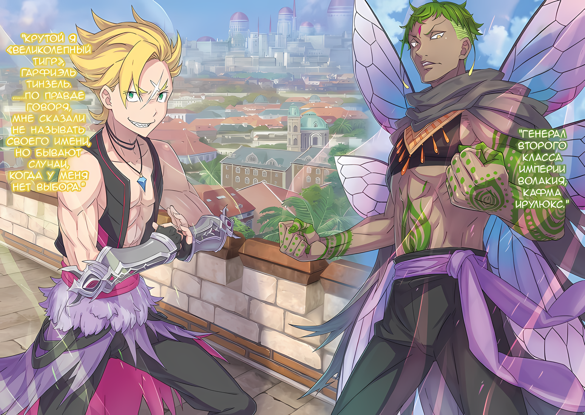

……«Гигантский Глаз» Измаил, был доблестным воином Племени Циклопов и надеждой своего клана.

В центре его мужественного лица находился большой голубой глаз, который, не задумываясь, устремлял свой взгляд в будущее.

Как следует из названия, Племя Циклопов было расой, у которой не было больше одного глаза. Если принять во внимание тот факт, что большинство рас рождаются с парой глаз, то единственный глаз почти никогда не может иметь преимущества в выживании.

В таком случае, было ли Племя Циклопов жалкой расой с неполноценной способностью к выживанию?

……Безусловно, можно сказать «нет».

Для Племени Циклопов, у которых было только одно глазное яблоко, в обмен на слабость их способности к выживанию, уменьшающейся с потерей одного глаза, это единственное глазное яблоко обладало многими особенностями.

Основой было зрение, которое могло видеть гораздо дальше, чем другие расы, и хотя оно варьировалось в зависимости от человека, было много тех, кто мог видеть концентрацию маны или тепла, или тех, кто был аномально превосходен в видении движения.

«Племя Злого Глаза» было еще одной расой, которые обладали особенностями глаза, но в отличие от их частых рождений со слабым телом в обмен на свои уникальные способности, Племя Циклопов было также физически сильным.

В некотором смысле «Глаз» превосходил все остальные способности в бою.

Нет нужды говорить, что в повседневной жизни объем информации, полученной из того, что человек мог видеть, составлял большую часть восприятия, и это становилось еще более очевидным на поле боя, где это было напрямую связано с выживанием.

Поэтому Племя Циклопов можно было назвать высшим видом, который был хорошо оснащен для производства отличных воинов.

Возвращаясь к теме, поговорим об Измаиле «Гигантском Глазе».

В свои двадцать один год Измаил был бойцом, владеющим огромным боевым топором с хорошо натренированным телом. Как уже говорилось, в центре его лица мерцал единственный голубой глаз, ставший тем, перед чем члены Племени Циклопов трепетали из-за его совершенства, а члены других племен — из-за его устрашающего вида.

Для чувства красоты Племени Циклопов существовало множество оценок красоты формы и размера глаза, а также его цвета и сияния, но глаз Измаила был первоклассным в каждой категории.

С красивым большим голубым глазом, как только он родился, от него ожидали, что он пойдет по пути, отличному от обычного, и с юных лет его прозвали «Гигантским Глазом», и вместе с надеждами своего клана он стал мальчиком… чуть позже он стал юношей… и, наконец, он стал воином.

Орудуя боевым топором, превосходящим его самого ростом, «Гигантский Глаз» с огромной силой косил поле боя…… Если бы он попал в эпоху, когда в Империи Волакия бушевала война, это имя было бы знаменито не только в его клане, но и во всей стране.

Однако время не ждало его взросления, и он благодушно погрузился в состояние застоя и расслабленности.

Многие проклинали это невезение Измаила. Однако судьба не оставила его.

Факел восстания, зародившийся на востоке, вскоре охватил своим пламенем всю Волакию и призвал Измаила, лишенного возможности сражаться, на поле боя.

Измаил: Пока у меня есть возможность сражаться….

*Тогда с помощью этого боевого топора я добьюсь в бою таких результатов, которым никто не сможет подражать.*

Это была гордость Измаила и обещанное будущее, в которое все в клане верили без сомнений. В Империи на вершине военного мастерства находились те, кого называли «Девятью Божественными Генералами», но если бы представился тот же шанс, который выпал этим людям, он поразил бы их всех.

Поэтому, когда Измаил «Гигантский Глаз» крикнул, что Император должен быть побежден, ни один член его племени не возразил, и они также активно помогали искать черноволосого ребенка.

Как признаки восстания распространились по всей Империи, так и существование «Черноволосого Наследного Принца»…… важно было не то, существует он на самом деле или нет, а то, что есть законопроект, выдвигающий обоснованное требование.

Проще говоря, наличие черноволосого мальчика давало право присоединиться к великому восстанию, начавшемуся в Империи Волакия, и те, кто не видел такой возможности, подрывали праведное дело, к которому они присоединялись в тот момент.

Те, кто спокойно наблюдал за происходящим, стоя в стороне и наблюдая за борьбой за господство со стороны, шли вразрез с устоями Империи.

……Народ Империи должен быть сильным.

По сей день это учение распространялось по всей Империи, даже среди тех, кто не был связан с ее столицей. Те, кто не мог понять этот принцип, не могли участвовать в этом великом восстании и не могли жить в Империи после него.

Когда Измаил осуществит свои амбиции, он выкорчует их всех и создаст более могущественную нацию.

И для этого….

Измаил: ……Я буду править Империей!

Прижав кончики ног к основанию колоссальной каменной стены, тело Измаила вознеслось в небо.

Он легко преодолел стену, которая, вероятно, считалась непреодолимой для людей снаружи, и ступил своими ногами на ее поверхность.

Увидев Измаила, приземлившегося на стене, воины, натянувшие луки, пришли в хаос и в панике попытались достать мечи, которые были у них на поясе, но они были слишком медлительны.

Измаил: Какое негодяйство для солдат Империи!

Схватившись за рукоять боевого топора, который он нес на спине, мышцы его правой руки вздулись, затем…… вспышка.

Выпущенное огромное лезвие без звука пронеслось по воздуху, и верхние части тел пяти солдат, оказавшихся на его пути, были разрублены одновременно. Потеряв все выше пояса, их нижние тела медленно рухнули, из них хлынуло огромное количество крови, а окружающие солдаты закричали.

Его барабанные перепонки уловили, что эти люди были полны сильной осторожности и скупой трепетности,

Измаил: Хамство.

Вместо воинов, которые проявляли бдительность и нервозность, те, кто поддался трусости, были крайне разочаровывающими. Измаил один раз моргнул своим голубым глазом и переключил мир, который он мог видеть.

В этот момент яркие цвета исчезли из яркого красочного мира, и его поле зрения заполнилось темными цветами. ……Нет, не только темные цвета. Из темноты появились красные, желтые и синие огни. Это были эмоции, переносимые живыми существами, и восприятие их как цвета было особенностью глаза Измаила.

С помощью силы своего глаза Измаил мог уловить, есть ли у врага желание сражаться, какими навыками он владеет, какова его история как воина.

Обладая полем зрения этих опущенных цветов, Измаил выбирал себе врагов.

А именно……

Измаил: Исчезните, трусы!

Шагнув вперед, боевой топор направился к посредственным людям, излучающим голубой свет, с их разумом, уже оторванным от поля боя, тем, кто пытался поставить во главу самосохранение.

Срезая повернутые к нему спины, отбрасывая ноги, пытавшиеся убежать, разбивая лица тех, кто пытался вымолить себе жизнь, смерть и кровь растекались по стене.

И так он бесчинствовал, видя, как голубые огоньки разгораются один за другим, его разочарование усиливалось.

Измаил: Что это, черт возьми, такое? Это должна быть столица Империи, территория, принадлежащая Его Превосходительству Императору Империи Волакия!

Направив свой боевой топор на внутреннюю сторону крепостной стены, Измаил выкрикивал свою ярость с вершины стены.

Вдали, в центре Империи Волакия, символа могущественной страны, которую никто никогда не мог победить, виднелся Кристальный Дворец, считавшийся самым красивым замком в мире, и Измаил мог добраться до него менее чем за несколько минут.

Он ворвется в Кристальный дворец, разгромит стоящих там воинов и получит голову Императора, сидящего на троне.

Вот чего хотел Измаил. Однако это……

Измаил: Это не такая уж дешевая честь, которую можно получить, тираня таких трусливых солдат!

Чувствуя предательство того, во что он верил, гневный голос Измаила звучал как причитание.

Несмотря на это, его старательно выкованный боевой топор был нацелен точно на жизнь врага, и с каждым шагом жизнь уничтожалась, а разочарование в «Гигантском Глазе» становилось все сильнее.

Вслед за Измаилом на вершину стены один за другим поднимались воины того же Племени Циклопов. Они тоже использовали свое оружие, чтобы отогнать бегущих солдат, сбивая их с ног и забирая их жизни.

Он хотел гордиться этим. Он хотел, чтобы стало известно, что Племя Циклопов здесь.

Измаил: Но… этого не произойдет, если нашим противником будете вы, ребята……

???: Погодите! Остановитесь…!

Перед печальными глазами Измаила, человек, за которым он гнался, упал.

Человек, убегая от воинов, упал перед самым опасным существом, увидев Измаила с ухмылкой на лице, тот закричал «Ааа!» дрожащим голосом.

Выставив обе руки вперед, он откинулся на ягодицы, нехотя покачав головой в сторону Измаила.

Солдат: Не убивайте меня! Я не хочу, я не хочу умирать!

Измаил: ――. Прекрати. Не выставляй больше собственный позор напоказ жизни.

Солдат: А-а-а-а!

Измаил: Хватит.

Лицо Измаила исказилось от такого жалкого поведения солдата. Когда слушать дальше стало совсем противно, он высоко поднял боевой топор в руках.

Пропитанное кровью лезвие тускло блеснуло, и в глазах солдата появилось отчаяние,

Измаил: Если ты воин, я хотя бы дам тебе достойный конец……

Солдат: Ты ошибаешься! Я не воин! Я даже не солдат!

Измаил: Что?

Когда он замахнулся своим боевым топором, его рука остановилась как раз перед тем, как он собирался выбить жизнь из своего противника вместе с его черепом. С щелчком топор остановился возле кожи на голове, и мужчина выдохнул «Фух», затихая.

Хотя, не то чтобы он пощадил эту жизнь по прихоти. Его остановило короткое замечание, прозвучавшее незадолго до этого.

Измаил: Не солдат… что ты имеешь в виду? Ты сейчас одет как солдат.

Солдат: Они заставили меня надеть это! Надеть это, взять лук и сражаться! Если я сделаю это……

Измаил: Если ты это сделаешь?

Солдат: Меня помилуют! Меня освободят, и я смогу выйти из тюрьмы…

Измаил: …………

Он вгляделся в лицо отчаявшегося человека. В его бледном, холодном лице не было ни капли лжи.

На лице человека, который лжет и пытается сговориться против тебя, должна была появиться разумная дрожь. Глаз Измаила, не упускавший из виду тонкостей этого дела, не обнаружил никакого обмана.

Измаил: Не может быть.

Осмыслив только что увиденное, Измаил обвел взглядом верхнюю часть стены.

Преследуемые Племенем Циклопов, взобравшимся на стену, Имперские солдаты в беспорядке разлеглись на вершине стены…… во всех них была трусость, от которой хотелось закрыть глаза, но сколько бы они ни сопротивлялись, этого никогда не будет достаточно.

На пути к атаке на столицу Империи солдаты гарнизона с копьями все же оказали лучшее сопротивление. Измаил был разочарован тем, что обычные солдаты, отвечающие за оборону столицы, находятся в таком состоянии.

Неужели это были не обычные солдаты, а преступники, которым дали снаряжение?

Если да, то с какой целью они….

Измаил: …………

Подумав об этом, Измаил вдруг понял ответ.

Если его мысли верны, то сейчас на вершине стены находились только воины Племени Циклопов, которое он возглавлял, и преступники, против которых они сражались.

Другими словами……

???: ……Сжечь всех сразу.

Внезапно тихий голос ударил по барабанным перепонкам Измаила на фоне неба, гулко отдающегося гневными криками и воплями.

Громкость голоса, который не должен был быть слышен, и сам факт того, что он был услышан, заставили все его тело насторожиться. Редкое явление на поле боя, такое, когда сила заключалась даже в голосе могущественного существа.

Несколько идиотский голос, казалось, лишенный серьезности, достиг ушей «Гигантского Глаза».

Измаил: …………

Расширив свой большой единственный глаз, Измаил посмотрел на небо столицы Империи.

Внутри крепостных стен города, защищенного другими прочными стенами, где здания были выстроены в порядке возрастания, в небе парила смуглокожая женщина, ноги которой стали огненными.

Прикрыв один глаз повязкой, она обратила к нему свой кроваво-красный взор, после чего……

Измаил: РЫЫЫААААА!!!

Как только он увидел ее, Измаил издал боевой клич и, оттолкнувшись от крепостных стен, взмыл в воздух.

Размахивая своим огромным боевым топором, он яростно обрушился на женщину в небе. Удар был настолько мощным, что даже если бы он не попал в жизненно важную точку, а лишь задел часть тела, то болезненный удар пронесся бы по всему телу.

Клетки его тела кричали, что он должен ударить со всей силы, чтобы этот удар на порядок отличался от тех, которые он делал ранее против трусливых противников, и что он не сможет победить, не выложившись на полную.

Он вонзил топор в стройное тело парящей в небе женщины……

???: Исчезни.

После единственного слова женщины, свет наполнил его зрение белым светом, который окутал мир Измаила.

△▼△▼△▼△

???: Кха… фф… фах… кх

Кашляя и страдая от жжения во всем теле, он сел.

Его горло горело, и когда он быстро потянулся к нему, его потрепанная, обугленная кожа и пальцы начали отваливаться. Увидев повреждения, он понял, что это чудо, что ему удалось выжить.

……Нет, это не было чудом.

Он сразу же использовал свой боевой топор в качестве щита, чтобы защититься от наступающего пламени. Но даже это было возможно лишь благодаря палящему жару, который, казалось, уничтожал все и вся на своем пути.

Только Измаил понимал, что он, вероятно, единственный, кому едва удалось выжить.

Измаил: …………

Когда он приоткрыл дрожащее веко и посмотрел вверх, то увидел, что стены столицы Империи раскалились докрасна, а воины Племени Циклопов, которые вели беспощадную борьбу, и мобилизованные преступники сгорели в один миг.

Несомненно, большинство из них были охвачены пламенем, даже не поняв, что произошло. Или, возможно, они поняли, а тем, кто успел среагировать, страдания затянулись.

Страдать и остаться единственным в живых — эта смерть была жестокой.

И самая жестокая из всех.

???: ……Что, еще есть выжившие? Тебе повезло… нет, может, не повезло? Ты точно плохой парень.

Среди запаха горящей растительности и человеческой плоти, ступая по земле, покрытой пеплом и сажей, появился один человек.

Человек с топором на плече наклонил голову и посмотрел вниз на Измаила на выжженном поле. Глядя в его страшные, холодные, пересохшие глаза, Измаил почувствовал инстинкт.

Разместив преступников на стене и сжигая их вместе с Измаилом и остальными, кто с ними сражался, именно этот человек был ответственен за осуществление этой жестокой стратегии.

Измаил: Т-ты… в-всех…

???: ……? Не смеши меня, это не я их сжег. Я не мог сделать такую возмутительную вещь. Это сделал монстр, который мог это сделать. Если ты хочешь затаить обиду, то затаи ее на нее.

У Измаила перехватило дыхание от тона его голоса, не насмешливого и не игривого, а как будто он искренне верил в это от всего сердца. Затем он быстро переключил зрение своего единственного глаза и сконцентрировал его, чтобы увидеть человека насквозь.

Однако Измаил был поражен. ……Он был синим.

Те, кто обладал сильным боевым духом, были красными, если у них была сильная степень нервозности и беспокойства, они были желтыми, а если они отвернулись от битвы в панике или страхе, они были синими.

Несмотря на то, что ему удалось успешно заманить в ловушку Измаила и остальных, он был синим.

Этот человек даже не был воином. Он не был и трусом. Он был чем-то гораздо более ужасающим.

Измаил: Я не могу оставить тебя в живых!!!

Действительно, действуя в соответствии с призывом своих инстинктов и мира, видимого его единственным глазом, Измаил вскочил на ноги.

Пламя, обрушившееся на него, опалило его внутренние органы, а его левая рука от плеча и дальше была полностью потеряна для огня. Из-за ран, нанесенных по всему телу, его движения были медленными по сравнению с тем, когда он был в лучшем состоянии. Однако даже расплавленного и потерявшего форму боевого топора, лежавшего рядом с ним, было достаточно, чтобы поразить противника насмерть.

Со всей силы он замахнулся боевым топором прямо на мужчину, услышав скрип обожженной руки и треск плоти.

???: Я согласен, что мы не можем оставить тебя в живых. Кроме того, я давно об этом думал, но….

Измаил: ……Кх!?

???: Не может быть, чтобы парень с одним глазом был сильным.

Перед глазами заряжающего Измаила, мужчина бросил небольшой пакет со своей талии. Пакет открылся в воздухе, и из него высыпалось содержимое…… черный порошок.

Это была своего рода приправа, и не было никакой возможности избежать ее использования против себя в качестве дымовой завесы. Правая рука, державшая его боевой топор, не могла от него избавиться, а о левой и говорить не приходится — она отсутствовала, и в результате его зрение было ослеплено черным порошком.

Выпустив ворчание «Гхаа», его атака боевым топором была прервана, и он отлетел назад.

Хотя представители Племени Циклопов обладали отличным зрением, его слабость была хорошо использована. Однако не стоит их недооценивать. Целиться в глаза циклопов было обычной практикой, поэтому были подготовлены контрмеры.

Большие глаза Племени Циклопов могли мгновенно выделять большое количество слез, в которых……

Измаил: ……Ох.

Измаил стимулировал свои слезные железы к выделению слез, но глаза больше не открывал.

В следующее мгновение в закрывшего глаз Измаила ударил снаряд из Пушки Волшебных Камней, который полностью уничтожил «Гигантского Глаза».

△▼△▼△▼△

Тодд вздохнул, когда на его глазах Племя Циклопов разлетелось на куски от пушечных ядер.

Он закончил дело без особых проблем, так как точно подстроил им ловушку, но если бы он изначально пытался устроить честный бой, он не был уверен, что у него есть шанс победить; таким уж он был экспертом.

Тодд: Страховка — это то, что нужно всегда иметь.

Глядя на трупы разнесенного Племени Циклопов и следы пушечных ядер, изрешетивших окрестности, Тодд поднял сжатый кулак к небу, давая понять артиллеристам на стене, что в преследовании нет необходимости.

Заставьте авангард противника подняться на стены и удерживайте его там, используя союзников, чья смерть не имеет значения. Затем, используя мощный огонь, сжечь всех на стороне противника дотла — это была действительно простая стратегия.

Однако результат был незамедлительным.

Тодд: В большинстве случаев люди, уверенные в себе, первыми пробивают вражеские ряды копьями.

Когда дело доходило до подобных сражений, в которых участвовало большое количество людей, те, кто вызывался на роль авангарда, были нетерпеливы в своем желании славы, или же они прекрасно понимали важность упреждающей атаки на войне.

Например, неважно, кто был противником, если его удар пройдет, то впоследствии это доставит неприятности. В этом смысле необходимо было остановить авангард.

Тодд: Ну, мы подавили начальный удар противника, но как они будут действовать дальше?

Даже если они победили самое энергичное Племя Циклопов, не было недостатка в тех, кто осмелился бы попытаться убить Его Превосходительство Императора. Это была выставка воинственных племен, собравшихся со всей Империи.

Помимо Племени Циклопов, он готовился к встрече с целой горой людей, отличающихся друг от друга количеством конечностей и глаз, размером частей тела, цветом кожи и крови, а также языками, так что трудно было даже подумать о том, как с ними справиться.

Однако……

Тодд: Неважно, сколько странных племен соберет противник, я не думаю, что это окажет значительное влияние. Во всяком случае….

Как только Тодд пробормотал это, Аракия пролетела над его головой, все ее тело облепил клубящийся ветер.

Отряд Племени Циклопов, должен был быть атакован одновременно, но тому, кто упустил эту возможность, захотелось напасть. Кроме того, на звездообразных бастионах, окружавших город, в четырех местах, отдельных от того, которым командовала группа Тодда, стражи, отвечающие за эти места, начали свои атаки.

……Фиолетовые шипы неистовствовали, уничтожая многочисленную армию Кентавров, которые пытались продвинуться вперед.

……Невероятно огромное Летающее Крылатое Лезвие пронзило небо, и Оружейники, которые использовали одну часть своего тела в качестве оружия, были разорваны на куски.

……Кулаки Каменных Големов, поднявшихся из земли, поразили жалких крылатых людей, у которых выросли крылья, неспособные к полету.

……Группа ненормальных людей, овладевших искусством резни, расправилась со Светящимся Народом, у каждого из которых во лбу был вмонтирован сверкающий камень.

Тодд: Если обстоятельства связаны с монстрами, то наша сторона будет иметь хорошее преимущество.

……Воссоединившись с природой, он превратил Племя Циклопов в пепел с помощью ярко-красного пламени, даже не напрягаясь.

Пять одинаково способных монстров стояли на бастионах стен, защищавших столицу Империи Рапгана. С пятью монстрами на пяти бастионах, могли ли повстанцы, у которых были только дух и амбиции, превзойти их?

Тодд: В любом случае, даже если бы меня попросили, я бы категорически отказался. Тем не менее……

Был план, как не дать им подойти к стенам, план, как убить тех, кто подошел, план для тех, кого они не смогли убить, и план побега.

Было бы лучше, если они не дойдут до последнего плана, но обстоятельства битвы трудно предугадать.

В первую очередь, тот факт, что повстанцы прибыли в столицу Империи вот так, и что эта битва вообще началась, превосходил то, что Тодд мог себе представить до начала войны.

Тодд: Из-за этого, несмотря на то, что я вернулся в столицу Империи, я не могу встретиться с Катей… Как же долго ты будешь мешать моей встрече с Катей, прежде чем ты будешь удовлетворен?

Это не было недовольством, которое он мог бы сказать о ком-либо или по отношению к кому-либо, скорее это было бы по отношению к миру; Тодд пнул землю выжженного поля, посмотрев в небо, густо пропитанное запахом смерти.

Еще много, очень много, невыносимо много людей погибнет.

Сколько еще людей должно умереть, чтобы решительный человек опустил оружие?

Тодд: Хватит с вас, ублюдки, разжигающие войну.

△▼△▼△▼△

???: ……К сожалению, вы, ребята, не в своей тарелке! Я не позволю вам идти дальше!!!

Стоя на стене, он широко раскинул обе руки, вызывая движение во всем теле.

Сразу же после этого внутренности тела Генерала Второго класса Кафмы Ирулюкса запульсировали, и из этих рук с огромной силой вырвались фиолетовые шипы, которые полетели в сторону группы кентавров, яростно скачущих по фермерским угодьям…… их верхняя часть туловища была человеческой, а нижняя — лошадиной, нижние части ног были подкошены, туловища пробиты, и они погрузились в твердую землю.

Уклоняясь от атак колючек, храбрецы еще ближе подходили к стене и, размахивая копьями, метали их.

Сила ног и бодрость коня передалась их верхней части тела, и сила брошенных копий была не меньше, чем у Пушки Волшебных Камней. В отличие от пушек, на которые требовались огромные деньги, пока у кентавров были копья и достаточное расстояние для разбега, их орудия обладали более чем достаточной разрушительной силой.

Это была оборонительная стена, защищавшая столицу Империи. Построенная в паре с Божественной Защитой Земли, она не разрушилась бы при обычных атаках, но если в нее ударили бы сотни копий такой силы, то некоторые повреждения могли бы проникнуть внутрь.

Однако……

Кафма: Вам не повезло, что вы выбрали бастион, который защищаю я.

Провозгласив это, Кафма широко раскинул руки, выпустившие шипы. В соответствии с этим движением они пронеслись боком по полю битвы и нанесли воинам Народа Кентавров, которые упали, завершающий удар.

Однако копья и бросавшие их храбрецы уклонились от преследования колючек.

Поэтому Кафма использовал не колючки, а другое «Насекомое», которое у него было.

Кафма: ……Кх!

Раздался звук скрипящих от боли костей, и грудь Кафмы, облаченная в легкие доспехи, разорвалась изнутри. Изнутри его тела открылись белые ребра, которые, содрогаясь, направили свои острые кончики вниз.

Храбрые полулюди из Народа Кентавров поскакали вперед, ведь они приготовились ко всему, что может произойти, и в этот момент, на эту группу была нацелена щель между ребрами, выходящая из открытой груди Кафмы.

Однако, даже если бы они приготовились, толку от этого не было.

……Сразу же после этого все тело Кафмы от такого удара резкого отскочило назад. Его обувь, которая была крепко вбита в землю, пробила вал, и Кафма посмотрел вперед, терпя раздирающую боль.

Под ним линия огня, на которую были направлены ребра Кафмы, была полностью выбита, и она поглотила всех кентавров, которые должны были быть на их пути, уничтожив их.

Как и шипы, это было новое «Насекомое», пригодное для борьбы с большим количеством врагов одновременно…… Он нервничал, что снова окажется в состоянии куколки во время важнейшего сценария.

Кафма: ……Но я успел вовремя. Пока я здесь, вам не миновать защиты столицы Империи.

Он твердо погладил свой торс, который избавился Народ Кентавров, и его ребра сомкнулись внутри открытой груди.

Новое «Насекомое» было мощным, но обратная реакция была столь же велика. Это был обоюдоострый меч, который полностью лишал силы его разум и тело, и его нельзя было пускать в ход раньше времени.

Однако, даже если ему пришлось обратиться к такой угрозе, в этой попытке была своя польза.

Кафма: Вы, проклятые мятежники, бездумно попираете мир, который Его Превосходительство установил благодаря своим способностям.

Будучи «Генералом», он близко видел правление Императора Винсента Волакии.

Как человек из редкого и постоянно избегаемого Клана Насекомых, он жил в мире, созданном Императором Винсентом Волакией.

Как человек, известный как Кафма Ирулюкс, он своими глазами видел масштабы великих свершений Императора Винсента Волакии.

По какой причине клинок должен быть обращен против Винсента Волакии?

Разве может кто-то другой соперничать с верховенством человека, который пытался изменить положение вещей в Империи и, по сути, продолжал его менять?

Поэтому……

Кафма: Я не могу позволить таким, как вы, пройти к Его Превосходительству Императору.

???: ……Гра, у тебя, вижу, большая решимость, верно говорю? Мне это не противно.

Уклоняясь и от шипов, и от белого обстрела, фигура оттолкнулась от земли и вскочила на стену. Глядя вниз на своего невысокого противника, Кафма сузил глаза.

Он был новичком и обладал достаточным мастерством, чтобы добраться до того места, куда не добрались храбрецы из Народа Кентавров. ……Проще говоря, он был грозным противником.

С самого начала он не умел обходить углы. Он также не умел легко идти на поводу или играть.

Однако Кафма решил, что это противник, с которым у него не будет ни малейшей свободы действий.

Кафма: Генерал Второго класса Империи Волакия, Кафма Ирулюкс.

Представившись таким образом, из спины Кафмы вырвались шесть прозрачных крыльев, прорвав плащ, который он носил. Видя, что подготовка к войне… Нет, скорее не подготовка к войне, он принял это как вступление.

Воину полагалось называть свое имя, когда он вступал в бой с другим воином. Конечно, на поле боя было немало тех, кто не следовал этому обычаю..,

Гарфиэль: ……Гарфиэль.

Кафма: …………

Гарфиэль: Крутой я «Великолепный Тигр», Гарфиэль Тинзель. ……По правде говоря, мне сказали не называть своего имени, но бывают случаи, когда у меня нет выбора.

Цветная иллюстрация к **Ранобэ** Том 32 | Перевод неофициальный и выполнен под контекст перевода rezero7arc

С этими словами, подросток со свирепой улыбкой на лице…… Гарфиэль, свел два красивых щита вместе перед грудью, издав приятный звук, словно музыкальным инструментом.

Кафма, которому было поручено охранять крепостные стены столицы Империи, был готов стоять до конца, сколько бы дней это ни заняло.

……Когда в первый день войны произошла решающая схватка, самый сильный человек из Генералов Второго класса Империи не прогадал.
