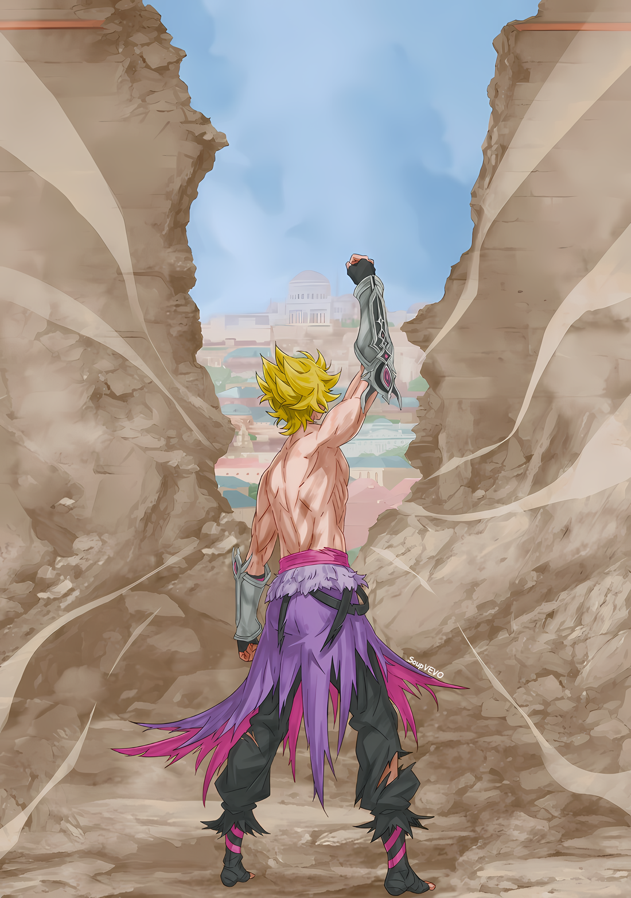

……Даже в Империи, где жили самые разные полулюди, были те, кого считали еретиками.

«Клан Насекомых» был именно таким, и даже в Империи, где смешивались полулюди различных видов, реальность заключалась в том, что они не были свободны от того, чтобы их считали странными и неортодоксальными

По внешнему виду их клан не сильно отличался от человеческой расы.

Многие из них были смуглокожими и имели обычай наносить татуировки, но не имели других очевидных характеристик, как «Племя Циклопов» и «Племя Злого Глаза» с их отличительными глазами, или «Многорукое Племя» и «Длинноногое Племя» с их отличительными руками и ногами, или особенно «Племя Зверей» и «Племя Полузверей», которые не могли быть более отличительными.

Тем не менее, была причина, по которой на Клан Насекомых другие расы смотрели своеобразно — их образ жизни.

Это было связано с их образом жизни в симбиозе с «Насекомыми» внутри их тел, что было уникальной характеристикой Клана Насекомых.

Как уже упоминалось выше, по сравнению с другими полулюдьми, Клан Насекомых мало чем отличался по внешнему виду от человеческой расы. Если бы в их телах не было «Насекомых», они могли бы жить как часть человеческой расы.

Однако это было не так. Клан имел «Насекомых» в своих телах и унаследовал их характеристики.

Это было, так сказать, приобретение характеристик полулюдей после рождения и запрещенное искусство преобразования тела, в котором они родились…… Это была основная причина, по которой их сторонились другие полулюди.

Это отличало их от Оружейников, которые рождались с металлизированной частью тела, которую по мере взросления можно было превратить в оружие по своему выбору, и от Светящихся, которые, как считалось, вбирали в себя души убитых ими людей, увеличивая тем самым сияние кристалла пироксена, растущего у них на лбу.

Образ жизни Клана Насекомых, которые не контактировали с другими и никогда не покидали свою родину, был окутан тайной.

Поскольку фальсифицированные знания часто распространялись с предрассудками, над некоторыми слухами Клана Насекомых было бы трудно не посмеяться, если бы у них была возможность их услышать.

Однако возможностей для исправления слухов было немного, как и возможностей для устранения недоразумений.

Самыми распространенными заблуждениями были о времени продолжительности вводимых «Насекомых» и связь между образом жизни насекомых и Клана Насекомых…… другими словами, речь шла об истории Клана Насекомых.

Начнем с того, что вживлять в тело «Насекомых» было довольно опасно.

В южном регионе Империи Волакия, в глубине деревни, где жил Клан Насекомых, была пещера, где жили «Насекомые», и пещера называлась «Бездна» из-за деформированных существ и ядовитого воздуха, который ее наполнял. «Насекомые», обитавшие в пещере, имели странный вид и в корне отличались от тех насекомых, о которых обычно думали.

Кому пришла в голову идея взять с собой этих загадочных существ, было неизвестно.

По общему мнению, вероятно, это был необычный метод, открытый шаманами, шиноби и другими сумасшедшими людьми с аномальными принципами получения силы, которую нельзя было получить обычными способами.

В любом случае, учитывая их быт, существование Клана Насекомых было лишь побочным продуктом.

Предки Клана Насекомых были теми, кто хотел жить в симбиозе со своими природными силами, имплантируя в свои тела таинственных «Насекомых», и это безумие передалось до наших дней.

Возвращаясь к первоначальной теме. ……Член Клана Насекомых должен был достигнуть двенадцатилетнего возраста, чтобы получить свое первое «Насекомое».

До этого возраста они тренировали свои тела и разум, чтобы стать подходящими сосудами для «Насекомых», чтобы во время церемонии их признали хозяевами «Насекомых» и чтобы время «вылупления» было организовано соответствующим образом.

После этого симбиотическое «Насекомое» признавало свое повиновение хозяину только при условии полного господства второго над первым, и тогда ему разрешалось называть себя полноправным членом Клана Насекомых.

Ритуал был запрещен до двенадцатилетнего возраста, поскольку принятие «Насекомых» было связано с риском для жизни.

Те, кто бросал вызов ритуалу до того, как они были готовы физически и умственно, были заживо съедены вживленными «Насекомыми». Минимальный возраст для участия в ритуале составлял двенадцать лет, но пока сосуд не был готов, возраст разрешалось продлить до пятнадцати лет. Если сосуд не был готов и к этому времени, его считали непригодным для того, чтобы считаться членом Клана Насекомых и бросали в «Бездну» в качестве пищи для «Насекомых».

Страдания, связанные с ритуалом принятия этих необходимых «Насекомых», были неописуемы.

У людей существуют различные типы крови, и попытка компенсировать недостаток крови путем переливания другой группы крови могла поставить под угрозу жизнь человека. Страдания во время церемонии «Насекомых» были схожи с этим.

Ощущение, что вся кровь, текущая по телу становится ядом; ощущение гниения органов и выжигание мозга.

«Насекомое» вырастало в куколку, которая проверяла хозяина, достоин ли он быть ее сосудом, а затем три дня и три ночи решала, использовать ли его в качестве своего сосуда или растворить и поглотить.

Когда куколка наконец вылуплялась, если человеческая форма оставалась нетронутой, ритуал проходил успешно, и «Насекомое» становилось симбионтом.

Первое физическое изменение происходило, когда «Насекомое» принималось в тело и вылуплялось из своей куколки.

Некоторые обретали усики и крылья, у некоторых развивались фасеточные глаза, у других вырастали многочисленные руки и ноги, а у третьи покрывало пальцы и тело панцирем.

Именно из-за того, что эти характеристики были схожи с характеристиками настоящих насекомых, Клан Насекомых назвали так, несмотря на то, что «Насекомые», которых они принимали, на самом деле вовсе не были насекомыми.

Конечно, даже в другой форме их сущность оставалась неизменной.

Однако были и те, кто считал Клан Насекомых ненормальными людьми, совершающими ритуалы, чтобы задним числом превратить себя в сосуды для «Насекомых».

Это было предрассудком, который ожидал их в конце страданий, и все же путь Клана Насекомых оставался неизменным.

Для того чтобы быть признанным членом Клана Насекомых, человек должен принять в себя одно «Насекомое». Однако чем больше «Насекомых» принимал человек, тем более сильным воином он становился.

Поэтому лучшие воины Клана Насекомых принимали не менее трех «Насекомых».

Однако при большем количестве интегрированных «Насекомых» возрастает риск того, что они будут пожирать друг друга внутри тела и подвергать опасности жизнь хозяина. Поэтому количество симбиотических «Насекомых» напрямую зависит от качества воина.

Нынешний вождь Клана Насекомых был известен как воин среди воинов, его почитали и уважали как героя своего клана за то, что он вживил в свое тело восемь «Насекомых».

……А Кафма Ирулюкс был чудовищем, вживившим в свое тело тридцать два «Насекомых».

Рождение чудовища, затмившего даже подвиги героев; чудовища, который с самого начала шел вразрез с кодексом Клана Насекомых.

Ритуал вживления «Насекомого» не должен был проводиться до двенадцатого дня рождения из-за опасения поставить под угрозу жизнь сосуда, но Кафма вживил свое первое «Насекомое», когда ему было всего несколько дней от роду.

Его отец, будучи старшим братом вождя, пришел в ярость из-за того, что оставался неполноценным по сравнению со своим гениальным братом, и направил гнев на собственного ребенка.

Как только Кафма осознал свое происхождение, отец поставил брата в известность о своих обстоятельствах.

Он был казнен своим младшим братом, вождем, и истинные намерения того остались неизвестными. Однако отец объявил сына мертвым вскоре после его рождения, изолировал Кафму и каждый год проводил ритуал вживления в него «Насекомого».

По иронии судьбы, когда о существовании Кафмы узнали, и его впервые вывели из укрытия в возрасте двенадцати лет, в тот же год его собратья должны были пройти ритуал вживления «Насекомых», а Кафма уже был чудовищем, живущим в симбиозе с тринадцатью «Насекомыми».

Даже среди Клана Насекомых разделились мнения о том, как поступить с Кафмой, немыслимым для клана существом.

Поскольку его отец уже умер после эмоциональной казни за нарушение закона и проклятие своего ребенка, причина, по которой Кафма смог объединить в себе более дюжины «Насекомых», была совершенно неизвестна…… В конце концов, его дядя, вождь, заявил, что берет на себя ответственность за существование Кафмы, и разрешил ему жить.

Это не было ложью, и Кафма Ирулюкс был благодарен вождю.

Его родной дядя, к лучшему или худшему, сохранял определенную дистанцию и осторожность в общении с Кафмой и не направлял на него чрезмерную вину или извинения из-за его отца.

То, что дядя не был ни особенно добрым, ни бессердечным, свидетельствовало о его осведомленности в том, чтобы не оказывать Кафме особого отношения как члену Клана Насекомых, за что Кафма был ему благодарен.

*Как бы ни относился ко мне дядя, факт остается фактом: я — аномалия среди клана.*

И все же поколение, которое еще не знало боли от имплантации «Насекомых», держало Кафму на расстоянии, а те, кто уже вживил насекомых, боялись его за то невообразимое количество, которое он содержал.

Клан Насекомых считался еретическим среди других кланов и племен, а Кафма стал еще более еретическим среди них.

Конечно, у Кафмы не было причин для обвинений или быть преследуемым.

Кафма мог бы не обращать внимания на пристальные взгляды и продолжать жить той жизнью, которую он вел, как чужак. Однако, несмотря на отличное от других воспитание, характер Кафмы был добродетельным.

*Я не ценил обстановку, в которой мой собственный народ боялся меня.*

Чтобы стать членом Клана Насекомых, нужно было вживить в себя «Насекомое».

Однако Кафма прошел через эту стадию еще до того, как обрел самосознание. Поэтому он не жалел усилий, чтобы понять своих собратьев с разных сторон.

Он активно взаимодействовал с другими, учился быть воином у своего дяди-вождя и показывал, что не отличается от них, проявляя упорство в общении со всеми поколениями.

Чтобы его уважали как воина Клана Насекомых, он бросил вызов ритуалу имплантации нового «Насекомого» в свое тело.

Это вызвало определенную оппозицию. Поскольку Кафма был уникальным в истории Клана Насекомых, вживив уже тринадцать «Насекомых», были большие надежды на то, что по мере его взросления, это число вырастет.

Они называли это ошибкой, которой не должно было случиться, говорили о том, что он потеряет свою жизнь еще до того, как оно вылупится.

Кафма знал, о чем думали эти старики, но не думал, что остановиться будет хорошей идеей.

Не получив разрешения, Кафма взял «Насекомое» и провел ритуал без стороннего наблюдения. Позже Кафма узнал, что это безрассудное поведение он унаследовал от своего отца.

Но на этот раз Кафма безрассудно взял свое четырнадцатое «Насекомое», и после трех дней и трех ночей страданий рвотой и кровью он выжил.

Таким образом, Кафма Ирулюкс наконец-то «вылупился» и стал членом Клана Насекомых.

Кафма, несмотря на свое необычное рождение, был наделен добродетельным духом и завоевал исключительное уважение своего клана, что сделало его самым сильным в истории Клана Насекомых.

В Империи Волакия почитали и прославляли именно сильных.

Возлагая на себя надежды и ожидания всего своего клана, Кафма также вознамерился стать «Генералом» Волакии и заявить о силе Клана Насекомых.

Естественно, везде находились любители посплетничать. Иногда он получал бессердечные оскорбления и преследования от тех, кто верил ложным слухам о Клане Насекомых. Но это были мелочи.

Для Кафмы все стало мелочью, как только он попал во внешний мир. Да, это было тривиально.

……Кафма Ирулюкс был «Чудовищем», рожденным в истории Клана Насекомых.

Обладая добродетельным духом и чувством товарищества со своими соклановцами, он взял на себя инициативу борьбы с врагом и защиты своего клана.

Однако, сколько бы усилий он ни прилагал, его соклановцы продолжали проводить границу между Кафмой и собой. Поскольку они знали, как трудно сосуществовать с насекомыми, они не могли воспринимать Кафму как одного из них.

Поэтому стремлением Кафмы Ирулюкса было покинуть его родное место.

Только там, где нет его соклановцев, Кафма мог увидеть свет, к которому он стремился.

По всем правилам, каждый в Клане Насекомых должен был пройти через процесс «вылупления», когда тот вырастет, замкнуться в себе, осознать, что он всего лишь один, пока, наконец……

△▼△▼△▼△

Гарфиэль: ……АРЫЫЫЫААААА!!!

Кафма сильно заскрежетал зубами из-за воющего, разъяренного, золотого тигра, который прыгнул на него.

Он сделал все возможное, чтобы встретить врага, который резко увеличился в размерах и вытащил из огромных лап острые звериные когти…… воина, который называл себя Гарфиэль Тинзель.

Кафма: Прости, что недооценил тебя!

Взмахнув разорванными крыльями, Кафма выпустил из вытянутых рук фиолетовые шипы.

Хотя шипы были новинкой среди «Насекомых», которых Кафма взял на вооружение, они часто использовались из-за простоты применения. Однако, даже обладая подавляющей силой, он не мог остановить натиск Гарфиэля.

Одним взмахом когтей он срубил верхушки шипов на каждом этаже крепостной стены, и ощущение крика «Насекомого» внутри потрясло мозг Кафмы.

Кажущееся бесконечным количество колючек было частью «Насекомого», которое Кафма принял в себя.

Естественно, если бы им был причинен вред, последовала бы пропорциональная ответная реакция. Он просто подавил ее с помощью своей жизненной силы, чтобы казалось, что реакции вообще нет.

Гарфиэль: ГРААА!!!

Гарфиэль шагнул вперед с неостановимым импульсом, и из угла его глаз, было видно, что Кафма соскользнул со стен благодаря ускорению своих крыльев и проскользнул мимо свирепого тигра.

Удар, точнее громовой рев, эхом разнесся по округе, и Кафма с ужасом понял, насколько сократилась возможность уклониться.

Каждая атака была еще быстрее и мощнее предыдущей.

Либо человек рос прямо в бою, либо черпал силы в спящем состоянии, но ни то, ни другое было нереально. Почти каждое изменение силы, происходящее на поле боя — это уменьшение силы.

Разумеется, любое идеальное состояние, созданное перед битвой, теряется с каждой секундой после начала боя, пока запасы энергии не истощатся, и оптимальных результатов достичь уже не удастся.

Вот почему важно было использовать максимальную огневую мощь и мастерство в течение первого хода битвы.

Конечно, Кафма был не чужд этому правилу, обрушивая на врага максимум огневой мощи и боевых приемов.

И Гарфиэль тоже должен был быть таким же. ……Так и должно было быть, поэтому это не имело смысла.

Такое увеличение силы и скорости за время боя, независимо от особенностей зверофикации.

Кафма: А ты…… ты, должно быть, серьезно ранен ……Кх!

Предыдущую атаку Кафмы можно было описать как подлую атаку или своего рода отравленное убийство.

Независимо от того, были ли средства хороши или плохи, Кафма не воздержался от самого действия. Если изящество было разницей между жизнью и смертью в бою, то следовало выбирать средства, соответствующие желаемому результату.

Если бы эти привязанности были связаны с тем, способен ли человек показать себя с лучшей стороны, тогда это была бы другая история.

Кафма: …………

Как бы то ни было, общие травмы Гарфиэля были необычными.

Самой большой травмой, которую он получил, была травма головы от атаки Кафмы, но и «Насекомые», которые зарылись в него, тоже были весьма гулкими. Однако те же методы не сработали бы снова.

Проглотив огненные магические камни, тело Гарфиэля все еще раскалялось докрасна.

Все его тело было охвачено пламенем, но внутри него, должно быть, бушевало еще более неуправляемое пламя.

В то время как тело носителя подвергалось риску при имплантации «Насекомого», «Насекомое» без носителя также было крайне уязвимо и могло легко погибнуть, попав в хоть немного суровые условия.

Не существовало такого «Насекомого», которое могло бы жить в постоянно горящем теле.

Кафма: Мысль об этом ужасает.

Даже если бы человек мог использовать магию исцеления, он не смог бы убить «Насекомых» с ее помощью. Вместо этого, чтобы магия могла исцелить рану, «Насекомое» нужно было удалить.

Это был лучший способ преодолеть антиномию, но маловероятно, что он смог додуматься до этого сам.

Скорее всего, это был результат следования инстинкту, а не умения думать головой.

Если бы он подумал головой, то не смог бы проглотить волшебный камень и сжечь свое тело.

Кафма: ……Тц.

Как только он скользнул в незащищенную сторону, из плеч Кафмы, словно пушечные ядра, вырвались красные усики.

Тело Гарфиэля с грохотом сорвалось со стен, когда кончики рогов «Насекомых» из преобразованных плечевых костей Кафмы пронзили его стальные мышцы живота.

Сокрушительный удар, однако сам Кафма не остался невредим.

Кафма: Гха.

Щеки Кафмы напряглись от омерзительной боли, когда два усика оторвались у основания. Если победа досталась ценой боли, это поставило Кафму на колени.

Но Кафма был не настолько глуп, чтобы встать на колени прямо сейчас.

Потому что……

Гарфиэль: ГРААА! ХФРА! РЫЫЫЫАААА!

Гарфиэль, которого якобы сдуло, пронзил своими когтями стену, и пополз к верху, а затем, на глазах у Кафмы, он подпрыгнул высоко вверх.

На той стороне его тела, где предположительно оно было пробито, появился красный пар, и рана закрылась. Кафма выдохнул, когда бледный свет магии исцеления яростно засветился, и рана быстро и неожиданно затянулась.

Кафма: Ха.

Кафма закрыл рот рукой, понимая, что это был порыв рассмеяться.

Затем, словно сдаваясь, он опустил руку и рассеянно покачал головой.

Кафма: Прекрасно.

Он признал это.

Кафма Ирулюкс в полной мере насладился битвой с Гарфиэлем Тинзелем.

Гарфиэль: ЫЫЫААА!

Воющий Гарфиэль опустил руки и побежал в его сторону, выглядя при этом как золотой диск. Кафма поднял обе руки и решил, что не сможет остановить его, поэтому он рванулся вперед, решив пройти под пахом Гарфиэля, прямиком к его спине.

Однако Кафма, не оборачиваясь, нанес свой крылатый удар и затем же был отброшен поднимающимся камнем. За мгновение до того, как атака Кафмы достигла его паха, Гарфиэль поставил вытянутую ногу на пол и активировал свою Божественную Защиту, блокировав атаку.

Более того, его крылья ударились о твердый камень и с шумом разорвались…… С другой стороны, задние ноги Гарфиэля с силой разжались.

Кафма: ……Кх!?

Оказавшись спиной друг к другу, тело Кафмы полетело после мощного удара.

Его попытки удержаться на ногах оказались катастрофическими, и вытянутое тело не смогло рассеять удар, отскочив от пола и выплевывая кровь, пробив своим высоким телом стену.

Дважды подлетев выше, он увидел лицо Гарфиэля, когда тот развернулся, преодолевая свой накатывающий импульс.

До самого низа……

Кафма: Еще раз…… Кх!

Его грудь раскрылась, и ребра раздвинулись; красноватые органы, хранившиеся глубоко внутри, заурчали, и ударная волна, исходившая от них, устремилась прямо в Гарфиэля.

Этот козырь Кафмы был не результатом внедрения нового «Насекомого», а новым органом, созданным в результате сосуществования и симбиоза тридцати двух «Насекомых», которые были введены до этого момента.

Функции множества «Насекомых» были объединены, чтобы выпустить ударную волну, которая поглощала и уничтожала все на своем пути с помощью свирепой точной вибрации, разрушительный удар, разрывающий все на куски.

В момент, когда любой воин попадал под его воздействие, невидимое глазу, оно превращало его в кровавый туман.

Кафма: ……Бхыа.

Это убеждение осталось непоколебимым, когда золотые волосы Гарфиэля окрасились кровью.

Любой воин превратится в кровавый туман. Поэтому……

Кафма: ……Чудовище.

Затормозив свое кувыркающееся тело ударом руки о пол, Кафма посмотрел вверх.

В этот момент Гарфиэль с дрожащей окровавленной верхней частью тела с широко открытым ртом бросился на него. «Чудовище» нанесло удар, который убил бы любого воина.

Гарфиэль: …………

Размах огромного кулака пришелся Кафме в лицо, и рефлекторный встречный удар взметнулся вверх, в челюсть его противника. Так завязалась жестокая драка, красные цветы крови расцвели на стене.

Это была битва, которую никто не мог прервать, схватка между чудовищами.

Кафма: Ха.

Выдыхая и не обращая внимания на боль, Кафма влил в нее всю свою энергию.

Он был необычным чудовищем, происходившим из необычного рода, и именно поэтому Кафма Ирулюкс так отличался от своих соклановцев, судьба, которую он проклял всем своим существом.

Покинув свой замкнутый родной город и выйдя в открытый мир, Кафма попытался сделать открытие.

Он пытался найти доказательства, чтобы потом с гордостью заявить, что он не чудовище.

Однако в действительности все было иначе.

Даже во внешнем мире удивительная истинная сила Кафмы выходила за рамки нормы и поэтому считалась еретической. Многие, с кем он стоял плечом к плечу как обычные солдаты, боялись доблести Кафмы и держались подальше от его ненормальности.

Где бы он ни был, он был чудовищем, что в конце концов это была судьба, которой он не мог избежать, — так думал Кафма.

Однако……

«???: ……Поднимись, Генерал Третьего класса Кафма! Давай вместе сделаем все, что в наших силах, во славу Его Превосходительства! Не думай об этом слишком много, ведь все мы, как и ты, чудовища!»

Громкий голос, слова крупного мужчины, издававшего этот мужественный смех, стали для Кафмы небесным благословением.

Желая отрицать, что он чудовище, Кафма пытался заискивать перед соклановцами. Поскольку это желание не было исполнено, он попытался искать его вовне, но все равно потерпел неудачу.

Однако что, если он посмотрит вверх?

Там собрались существа, с которыми не мог сравниться даже Кафма Ирулюкс, которого боялись как чудовища.

Не то чтобы Кафма хотел, чтобы ему сказали, что он не чудовище.

Просто он не хотел оставаться в одиночестве, которое никто не мог разделить или понять.

Даже если он был чудовищем, мир не оставил Кафму без внимания.

Поэтому……

Кафма: ……Ради нашего боя… еще раз.

Хотя все тело Гарфиэля было покрыто четырехгранным шквалом щупалец, выпущенных со сверхблизкого расстояния, он выдержал все с невероятной силой, исцелив свои раны по мере получения.

Необыкновенная защитная сила, живучесть и чрезвычайные способности к регенерации, которые, вероятно, включали в себя силу Божественной Защиты, были причудами «Чудовища» перед глазами Кафмы и причиной его энтузиазма.

Шипастые лианы, выпущенные из его правой руки, обвили все тело свирепого тигра, и пока они разрывали его кожу на куски шипы были с силой стряхнуты. Его панцири на руках, отбивающие каждый удар, столкнулись с блестящими серебряными щитами Гарфиэля, и разлетелись вдребезги.

Личинки «Насекомых», которые были коварно вживлены легким движением его левой руки и ударная волна, возникшая при падении на колени, от которой затрещали его внутренние органы, все же не смогли преодолеть эту способность к восстановлению и провалились.

Прекрасно. Как прекрасно.

В конце концов, он был военным, и как бы он ни пытался притворяться, он был чудовищем, и вместе с «Насекомыми», которые ликовали внутри него, не успел он опомниться, как улыбка прилипла к его щекам и уже не сходила с них.

Тридцать два «Насекомых», существа, которые стали единым целым с ним самим и были ему ближе, чем его собственная семья, были в восторге от того, что у них наконец-то появился шанс показать всю свою душу и сердце, и начали разглагольствовать и восторгаться.

Победа должна быть одержана.

Ради великого дела, ради славы Его Превосходительства Императора, управляющего Империей, ради того, чтобы отплатить своему благодетелю, вознесшему его на этот удел, и ради своих соклановцев, желающих улучшить положение Клана Насекомых.

Гарфиэль: ……Эй придурок, ты куда смотришь?

Он услышал голос среди боли, удушья и ускоряющихся мыслей, заполнивших его мозг.

Несмотря на то, что они оба бились с такой яростной силой и мощью, когда в любой момент один из них мог просто умереть, и даже несмотря на то, что не было момента для обычного обмена словами, он услышал его.

Пара изумрудно-зеленых глаз устремила свой взгляд вперед, и кровавый блеск пронзил его душу.

Острые клыки издавали звук, похожий на глотание плоти и крови, а звук скрипа костей заставил все его восприятие отдалиться.

И пока все было готово к битве, чудовище на его глазах заговорило.

Гарфиэль: Крутой я стою здесь.

Кафма: …………

Гарфиэль: Только в этот момент я не позволю ничему встать у меня на пути.

В тот же миг цвет исчез из мира, шум ветра и звон в ушах смолкли, и огромный враг перед его глазами стал всем, что осталось в мире Кафмы Ирулюкса.

Кафма устыдился собственной неадекватности, подумав, как бестактно он поступил.

Но затем он быстро отбросил эту постыдную бестактность в сторону и кивнул.

Кафма: ……Акх, только ты и я.

В этот момент их кулаки скрестились и врезались друг другу в лицо, а время ускорилось.

Открытая ладонь вцепилась в его лицо, и череп Кафмы заскрипел от этой необычайной силы захвата. Но он также засунул руку в рот противника, и оттуда посыпались шипы в тело противника.

Раз уж он не смог прорваться снаружи, значит, он сделает это изнутри.

Шипы бушевали внутри его тела, и завершение пожирания его изнутри было неизбежным. Однако, пока шипы впивались в Гарфиэля, он взмахнул телом Кафмы вверх, а затем с размаху опустил его тело вниз, врезав в крепостные стены.

Кафма: ……Кх

Когда его спина была зарыта в стены, его подняли и снова бросили. Подняли и бросили. Подняли и бросили. Подняли, подняли, подняли, подняли, бросили, бросили, бросили и еще раз бросили.

В стене, где было погребено все его тело, образовалась трещина, а верхушка бастиона звездной крепости раскололась надвое. Его зрение окрасилось в насыщенный красный цвет, а вместо дыхания хлынула кровь.

Тем не менее, шипы не потеряли своей силы и продолжали впиваться в тело Гарфиэля.

Пока Кафма не исчерпал все свои силы, «Насекомые» жаждали победы.

Гарфиэль: ……Гах.

Открытая пасть большого тигра была не в состоянии прокусить громоздкий пучок колючек. Сколько бы он ни рвал их когтями, волнистые слои колючек были слишком толстыми. Что бы он ни делал, Кафма не отпускал его.

Шипы тоже были конечны, существовал предел того, сколько он мог использовать.

Если бы Кафма выпустил их все, он потерял бы свой лучший шанс победить других повстанцев, которые приближались к стене. Однако эта победа будет того стоить.

……Нет, чудовище, известный как Гарфиэль Тинзель, будет того стоить.

Кафма: ЫААААААААА!!!

Не обращая внимания на боль от сломанных костей в теле, из горла Кафмы вырвался боевой клич.

Шипы переполнили тело Гарфиэля до краев, неся с собой смертоносное давление, которое приведет его тело к разрыву, а значит, и смерти.

Как бы он ни изворачивался, в какого бы зверя не превращался, он не даст ему победить.

Сконцентрировав остатки силы всех «Насекомых» в своем теле, Кафма подавил Гарфиэля и рванулся вперед, чтобы вырвать победу…… и тут он стал свидетелем невероятного.

Кафма: ……Какого…

Огромный тигр с золотистым мехом раздулся до предела от шипов, впившихся в его пасть. Не успело его тело лопнуть, как давление в шипах быстро пропало.

Почему? ……Потому что у шипов, находящихся в его теле, появился выход.

Острые когти Гарфиэля разорвали собственный живот, и из раны посыпались шипы.

Его ужасающе отчаянная тактика была актом варварства, приближавшим его к порогу смерти. Если бы шипы хлынули в образовавшуюся рану, то рана в животе могла бы открыться по той же причине, по которой невозможно закрыть рот. Тогда его тело разделилось бы надвое, и это был бы конец.

В самом деле, просто так пригласить смерть — это был слишком глупый акт варварства.

Однако, как только Кафма стал свидетелем этого варварства, мгновенная пустота в его сознании дала Гарфиэлю, который был на грани того, чтобы разорвать себя на части, мгновение, чтобы перевести дух.

Он сомкнул челюсти. Раздался звук раздираемых шипов, и огромная пасть тигра закрылась.

Кафма упустил решающий удар своими шипами, и не успел он это осознать, как Гарфиэль шагнул вперед, и его кулак с силой ударил серебряными щитами по лицу Кафмы.

Рухнув на вершину стены, кулак врезался в лицо Кафмы, лежавшего распростертым на полу, и теперь глубоко вбитый в него удар нанес решающий урон крепостной стене.

Раздался громовой раскат, и стена столицы Империи Рапганы, которую прославляли как неприступную, начала рушиться.

Чувствуя за спиной грохот обвала, Кафма смотрел прямо перед собой на Гарфиэля, который отдернул кулак.

Медленно избавляясь от своей звериной оболочки, юноша вновь обрел свой первоначальный человеческий облик…… рана в животе Гарфиэля была прикрыта засохшей кровью.

Это была смертельная рана, но, видя, как он так быстро забыл об этом, Кафма разразился хохотом.

Какое абсурдное зрелище.

Кафма: ……Чудовище.

В момент когда он пробормотал это про себя, переводя дыхание, стена полностью рухнула.

Упав вместе с рушащимися стенами и обломками, сознание Кафмы медленно угасало, угасало и угасало, пока не осталось ничего, за что можно было бы держаться……

Кафма: Ваше Превосходительство, я прошу прощения…

Он падал, с позором думая о себе то, что напускал на себя вид верного адъютанта… до самого конца.

……Голоса «Насекомых», которые он слышал с самого рождения, тоже казались ужасно тихими.

△▼△▼△▼△

С силой схватив тело мужчины, когда тот упал беззащитным, он оттолкнулся ногой от обломков, чтобы покинуть место обвала.

Зацепившись каблуком за землю, он погасил импульс и обернулся, чтобы увидеть, как стена рушится с громовым ревом, открывая путь.

Гарфиэль: Я сделал дыру… для нового ветра.

Эти слова он произнес перед началом битвы, вспомнив приказ Эмилии, его щеки исказились. Почувствовав боль в уголках рта, который был разорван, Гарфиэль закричал: «Гха!».

Он поспешно приложил руку ко рту и активировал свою исцеляющую магию.

Гарфиэль: Аргх… черт… как же больно… но…

Грубо залечивая разорванный рот, Гарфиэль пристально смотрел на свои руки.

Внезапная жестокая битва и состояние, в котором, откровенно говоря, не было бы странным, если бы он умер… Но ужасные раны по всему телу закрылись, и просачивающаяся боль стала затяжным ощущением.

Даже находясь в звериной форме, он думал, что смог сохранить определенную степень самообладания, продолжая сражаться. Благодаря этому он смог быстро оправиться от ран. ……И ведь действительно?

Гарфиэль: ……Крутой я стал сильнее?

Крепко сжимая раскрытую ладонь, Гарфиэль проговорил это.

Он не был до конца уверен. Возможно, лучше было бы назвать это удачей, но до сих пор Гарфиэль не сталкивался с противником, которому пришлось бы отдать всего себя.

За исключением битвы с Курганом «Восьмируким», в Городе Водных Врат, сражения, в которых Гарфиэль не мог использовать всю свою силу, продолжались.

Когда с него сняли оковы, и он снова смог сражаться во всю силу, у него появилось определенное ощущение.

Он пробил потолок на уровень выше, чем был до этого. В этом он убедился во время битвы.

Вот почему……

Гарфиэль: ……Ты назвал крутого меня чудовищем, но я бы сказал то же самое и про тебя.

С этими словами Гарфиэль опустил правую руку, уронив тело Кафмы на землю, и шмыгнул носом.

Грудь Кафмы слегка опускалась и поднималась, что означало что он еще дышал. Это была война, и чтобы считать ее настоящей победой, он не должен был оставлять противника в живых, хотя и понимал это.

Эмилия сказала, что они должны постараться уменьшить число людей, которые погибнут от их рук.

А Отто, в свою очередь, велел Гарфиэлю избивать их до тех пор, пока они не перестанут стоять на ногах.

Действительно, Эмилия сказала эти слова от чистого сердца, а Отто произнес их из заботы.

Он хотел исполнить эти слова.

Поэтому здесь и сейчас……

Гарфиэль: ……Крутой я победил!

И вот, преодолев один из бастионов на остриях звезды, Гарфиэль поднял в воздух кулак.

rezero7arc | Иллюстрация к **Ранобэ** Том 32 | Разукрасил coolcollin007
