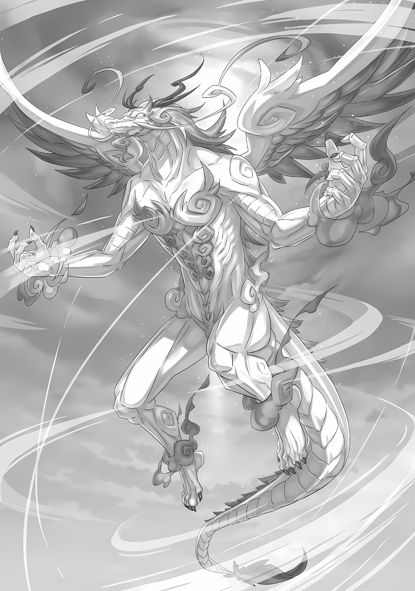

……Рев, похожий на отдаленный гром, потряс сознание Беатрис, когда она закрыла веки.

Беатрис: ……Такой неприятный звук, я полагаю.

Слабый шепот маленькой девочки вызвал в ее сознании воспоминания о том, как она снова и снова слышала подобные звуки.

Четыреста лет назад, в эпоху «Ведьм», во времена постоянных войн, нередко большое количество людей сталкивалось друг с другом, обменивалось ударами и боролось за свою жизнь.

Беатрис не была близко знакома с полем боя.

Она родилась и выросла в Дворце своей матери, Ехидны, в месте, свободном от человеческих конфликтов. Несмотря на то, что битвы были далеко за пределами ее внимания, они все равно были неприятны.

Время шло, она провела с доверенной ей книгой четыреста лет, в течение которых окружающий мир был далек от безумия тех дней, хотя все еще мог быть неспокойным.

Однако это некогда далекое безумие теперь было совсем рядом.

……То есть, борьба за бесчисленные жизни по всей столице Империи.

???: Умм, я беспокоюсь. Я встревожен.

???: Я знаю, что ты чувствуешь, Шуу. Думаю, Уу и остальным тоже пора уходить?

???: Ау! Уау! Аа..у!

???: Н-нет! Наша работа — ждать! Мы ждем!

Беатрис, стараясь закрыть глаза и сохранить энергию, подслушала этот обмен.

Слышны были голоса детей, с которыми она хорошо познакомилась за последние несколько дней — Шульта, Утакаты и Луис Арнеб.

Беатрис и другие дети расположились позади основного лагеря…… они ждали в палатке, с холма которой открывался вид на поле боя, и хоть их задание в виде защиты тыла лагеря звучало круто, Беатрис, по крайней мере, знала, что это всего лишь притворство, которого от них не ждут.

В Городе-крепости, людей неспособных сражаться, чаще всего детей, было бы разумно оставить позади.

Точно так же неспособные сражаться из числа жителей, которые перебрались из Города Демонов вместе с Йорной Миссигр и смогли выжить в битве, держались подальше от линии фронта и вместо этого сосредоточились на совместной поддержке, такой как логистика.

Причина, по которой дети не делали того же, заключалась в их опекунах.

«Присцилла: Стычка — это одно дело; но было бы жалко держать их на расстоянии, когда дело доходит до большой сцены. Окраины поля боя также приемлемы. Где бы ты ни был, ты не должен сомневаться в моем великолепии.»

«Мизельда: Утаката — одна из Судрак. Трусы, отвернувшиеся от поля боя и охотничьих угодий, не годятся для того, чтобы быть членом Племени Судрак. Естественно, она будет на поле боя.»

Это были соответствующие заявления опекунов Шульта и Утакаты; мнения, которые невозможно было опровергнуть, так как Шульт и Утаката были очень решительными.

Возможно, оба говорили, исходя из разных моральных принципов и убеждений, но Беатрис не имела права вмешиваться, пока стороны были в согласии на данный момент.

Честно говоря, как Великий Дух, Беатрис не была довольна ситуацией, в которой оказались она и эти дети. Тем не менее, поскольку у каждого в лагере была своя роль, было вполне логично, что ее назначили сюда, учитывая, насколько сдержанными были ее действия.

Роль, порученная ей, была……

Луис: Уу… ау.

Также как Шульту и Утакате, Луис было приказано оставаться в палатке.

Беатрис: …………

Только вот обращение с ней заметно отличалось от обращения с другими маленькими детьми.

В отличие от Шульта и Утакаты, здесь не было явного опекуна, однако, основной задачей было «Присматривать За Кое-Кем».

Конечно же, это был Архиепископ Греха. Опасность вряд ли уменьшится, что бы ни говорили те, кто знал ее.

Поэтому, в отличие от других детей, Луис была одинокой, и у них не было особого выбора, так как они не могли оставить ее в одиночестве.

«Отто: В настоящее время она — бомба замедленного действия. Беатрис-чан, я не хочу тебя слишком обременять, но, пожалуйста, присмотри за ней. Мы не можем рассказать об этом Эмилии-сама или Гарфиэлю, по крайней мере, мы должны оставаться уравновешенными.»

Так сказал Отто перед тем, как решил принять участие в полномасштабном восстании.

Возможно, это была мера предосторожности, чтобы Беатрис не падала духом от беспомощности, не имея никакой роли, и оставалась в ожидании, чтобы сохранить силы, но это также было тревожным заявлением, потому что она начала терять почву под ногами.

Тот факт, что он намеренно пытался сохранить спокойное выражение лица, был тревожным. ……У Петры и Фредерики были те же опасения, так что, возможно, они могли бы что-то предпринять.

В любом случае……

Беатрис: Тебе не стоит так много возиться. Успокойся, я полагаю.

Утаката: Бее, ты уже проснулась?

Беатрис: Бетти не спала все это время… Кроме того, мне неприятно имя, которое ты использовала, я полагаю. Складывается чувство, будто ты меня дразнишь.

В палатке не было кроватей, на которых можно было бы лечь, и не было коленей Эмилии или Петры, которые можно было бы занять. Поэтому Утаката надула губы на Беатрис, которая с закрытыми глазами сидела на простом стуле.

Открыв глаза от такой реакции, она посмотрела на трех беспокойных людей в лагере.

Шульт был встревожен, Утаката не могла справиться с боевым настроем, а Луис нетерпеливо подрагивала плечами при каждом звуке битвы и было трудно понять, что у нее творится в голове.

Беатрис: …………

Если смотреть только на поведение, то в Луис не было ничего подозрительного.

Просто сверхчувствительный к изменениям в окружении ребенок…… другие беззаботные люди, не подозревающие об угрозе «Чревоугодия», невольно сочли бы ее нормальным ребенком.

Но с Беатрис дело обстояло иначе.

Беатрис: Эмилия и все остальные делают все возможное, чтобы помочь Субару и остальным, я полагаю.

Причина, по которой Эмилия и ее лагерь были готовы вмешаться в это восстание и сражаться за свою жизнь, несмотря на отсутствие обязательств, заключалась в том, что они могли найти там своих друзей, Субару и Рем.

Если Беатрис не сможет сражаться вместе с ними, она, по крайней мере, сможет не отвлекаться, внимательно следя за Луис.

Итак, Беатрис собралась с духом и……

Луис: Уу?

Беатрис: …Ч-что ты удумала?

Губы Беатрис сжались, а маленькая рука погладила ее по голове. Она взглянула на Луис, которая смотрела на нее с опущенными бровями.

На мгновение ее тело напряглось из-за опасности прикосновения руки Луис, но она не почувствовала угрозы, и Луис не сделала никакого жеста, чтобы украсть у Беатрис ее «Имя».

Насколько Беатрис знала, для активации Полномочия «Чревоугодия» требовалось назвать «Имя» другого человека и съесть его, но рот Луис даже не произносил нужных звуков.

Конечно, если Луис требовалось только осознание, все равно оставалась возможность активировать Полномочие; поэтому Беатрис нервничала, когда Луис подносила руку, касавшуюся ее головы, к собственному рту.

Если Луис хоть малейшим жестом покажет, что хочет съесть «Имя» Беатрис, то……

Утаката: Бее, у тебя страшное лицо. Ты все еще ненавидишь Луу?

Беатрис: Какой ужасный способ описать очаровательное лицо Бетти, я полагаю. К тому же, Бетти не ненавидит эту девушку… Презирает, наверное, было бы правильнее.

При виде того, как Беатрис смотрит на Луис, Утаката прикрыла пальцами оба своих глаза, говоря при этом, что ее лицо не очаровательно, и Беатрис в конце концов дала волю своим истинным чувствам.

Так что да, она чувствует, что ненавидит Луис.

И не только Луис, но и Архиепископов Греха «Чревоугодия» в целом. ……Все, что заставило Субару и остальных страдать.

Беатрис: С сожалением.

Для лагеря Эмилии, и прежде всего для Субару, самой большой жертвой «Чревоугодия» была Рем. Наблюдая за тем, как Субару страдает из-за девушки, которая бесконечно спит, Беатрис постоянно жалела о времени, потраченном до заключения контракта с ним, когда она была безразлична к окружающему миру.

Интересно, что могло бы быть.

Если бы Беатрис открылась раньше и проявила готовность сотрудничать с Субару и остальными, все могло бы сложиться иначе. Не позволив Белому Киту, Культу Ведьмы и им подобным делать все, что им вздумается, Субару не стал бы демонстрировать такое бесконечное выражение печали рядом с Рем, когда она продолжала спать.

Именно поэтому она решила никогда больше не позволять Субару страдать подобным образом и оставаться рядом с ним до конца его жизни.

После разлуки с Субару она не могла в полной мере помочь Эмилии и другим членам группы, потому что была вынуждена экономить энергию. ……Смысл ее существования был нарушен.

Шульт: Бее… Беатрис-чан, ты не можешь так обращаться с Луис-сама.…

Беатрис: Бетти не жалеет ее, я полагаю. Ты поступаешь неосмотрительно. Почему ты обращаешься к Бетти как «-чан», когда остальных зовешь «-сама», я полагаю? Тебе не хватает уважения.

Шульт: Уф… Мне ужасно жаль, Беатрис-чан.

Почувствовав опасность, вмешался Шульт, когда она уставилась на него.

Как Шульт, который не дрогнул, несмотря на ужас, видел Беатрис? Может быть, он принял ее за маленькую девочку, ведь она все это время спала?

Беатрис: В любом случае, не стоит утомлять Бетти, я полагаю. Вся цель того, что ее оставили здесь, состоит в том, чтобы уберечь всех присутствующих от лишних действий. Как бы ни было больно делать именно это……

Луис: Уу.

Беатрис: Это гораздо лучше, чем позволить тебе разгуливать на свободе, я полагаю.

Беатрис схватила руку Луис, лежащую на ее голове, и заставила испуганную Луис сесть в кресло рядом с ней.

В конце концов, она решила держаться за ее руку и не отпускать ее.

Беатрис: Вы тоже. Шульт, хватит хандрить, а Утаката, если тебе нечем заняться, просто потренируйся с луком, я полагаю. Итак……

???: ……Похоже, мне нет нужды вмешиваться.

Беатрис: Вааа…?

Она вдруг услышала спокойный голос, вошедший в палатку, пока возилась с беспокойными детьми. Когда она посмотрела в ту сторону, то увидела мужчину с вьющимися волосами, Зикра Османа, заглянувшего внутрь.

Беатрис нахмурила брови при его появлении, так как он должен был находиться в главном лагере, командуя вместе с Абелом.

Утаката: Зии! Мы были заняты, но теперь ты здесь! Пришло время для Уу и остальных!

Беатрис: Как хочешь…! Но какое у тебя дело, я полагаю?

Зикр: Мои извинения, мисс Утаката, но сейчас не ваше время. Однако, есть вероятность, что мы можем переместить лагерь позже, поэтому я решил сообщить всем об этом заранее.

Шульт: Перемещение лагеря, говорите?

Интеллектуальные, круглые глаза Зикра заставили Шульта наклонить голову. Зикр кивнул и сказал «Да» в ответ, указывая на поле боя позади себя.

Зикр: В настоящее время мы направляем наши силы на прорыв городских стен, но как только бастион будет пробит, мы отправимся в Кристальный Дворец в столице Империи. В это время командир также должен отправиться на фронт.

Беатрис: Абел, похоже, не способен сражаться. Ему безопаснее находиться в тылу, сосредоточившись на отдаче приказов, я полагаю.

Зикр: Это правда…… однако, тогда войска не пойдут за нами. В случае, если мы проложим путь Его Превосходительству Императору, никто не позволит ему сесть на трон.

Беатрис: ――. Такие надоедливые национальные идеалы.

Основополагающим принципом Империи Волакия было то, что народ Империи должен быть сильным.

Однако это, очевидно, относилось даже к лидеру, возглавляющему нацию. Если верховный лидер не обладал силой, которой можно похвастаться, он был бы свергнут своими подчиненными в мгновение ока.

Зикр: Да, это немного беспокоит. Но такова наша родина.

Осторожно покачав головой, Зикр слегка улыбнулся.

Беатрис было трудно понять, какие эмоции там смешались. Возможно, ему это было не совсем по душе, но он не относился к этому отрицательно.

Шульт: Зикр-сама, может быть, вы собираетесь в бой?

Утаката: Зии?

Вдруг рядом с Беатрис, которая следила за губами Зикра, Шульт задал ему вопрос, а Утаката обратилась к нему тихим голосом.

Под взглядом детей Зикр слегка приподнял брови,

Зикр: Как вы уже догадались, я тоже буду участвовать. Несмотря на то, что мы превосходим их числом, мы все еще в невыгодном положении с точки зрения «Генералов» ниже Генерала Второго класса, поэтому мы должны изменить эту ситуацию.

Беатрис: ……Почему так, я полагаю?

Зикр: ……? Пардон?

Беатрис: Почему ты вообще сюда пришел? На твоем месте ты мог бы просто приказать своим людям сделать это, я полагаю. Какая цель в том, чтобы ты появился перед Бетти и остальными?

Зикр: А, вот что вы имеете в виду.

Если бы человек собирался в бой, он бы хотел быть еще более сосредоточенным в этот момент.

Тем не менее, Зикр появился в палатке лагеря, полной детей, которых нельзя было оставить на этом поле боя.

Когда его спросили о причине, Зикр смущенно улыбнулся,

Зикр: В главном лагере только мужчины, поскольку женщины Судрак также находятся на передовой. Если мы нуждаемся в ободрении перед битвой, то только женщины могут сделать тебя по-настоящему бодрым.

Беатрис: А?

Шульт: Понятно! Конечно, Утаката-сама и Луис-сама здесь, а также Беатрис-чан!

Услышав его неожиданный ответ, глаза Беатрис расширились. В отличие от реакции Беатрис, Шульт выглядел убежденным, а Утаката кивнула, сложив свои короткие руки.

Затем она повернулась к изумленной Беатрис и сказала,

Утаката: Не удивляйся. Зии, был таким с самого начала.

Беатрис: Это была большая ошибка — думать, что этот человек единственный здесь нормальный, я полагаю……

Признаки были налицо. По какой-то причине его назвали «Трусом», и вместо того, чтобы попытаться оспорить это, он гордился этим. Однако у нее не было причин глубоко вмешиваться, поэтому она просто промолчала.

В результате, эксцентричность Зикра была выставлена напоказ в последний момент, что привело к неловкой ситуации…

Зикр: Кроме того, если вы знаете, что за вами стоит, у вас будет больше шансов не заблудиться.

Беатрис: ――. У тебя есть семья?

Зикр: Мать и несколько сестер. Но когда я присоединился к этой стороне, их положение стало намного хуже. Это ужасное несчастье для моей семьи.

Изначально Зикр был «Генералом» на стороне Империи в звании Генерала Второго класса. Поскольку он дезертировал, было вполне естественно, что это коснется и его семьи.

Зикр был готов к этому и все же счел нужным выбрать эту сторону. Беатрис задавалась вопросом, достоин ли Абел такого выбора, но никто, кроме самого человека, не знал причин.

Ей было просто любопытно.

Беатрис: За что ты сражаешься, я полагаю?

Зикр: …………

Беатрис: Ты не должен быть таким, как те парни, которые дерутся ради того, чтобы драться. Так почему же, я полагаю?

Простой солдат, возможно, и был бы не против, что делало Империю Волакия таким страшным местом, поскольку многие ее воины имели подобный образ мышления, но это не относилось к «Генералу», тем более к Зикру.

В ответ на слова Беатрис, он приподнял густую бровь в легком раздумье,

Зикр: Разумеется, ради будущего Империи, в которую я верю и которой обязан верностью.

Сильным голосом он ответил, а затем продолжил: «Конечно».

Зикр: В конце концов, я «Трус», так что вряд ли смогу устоять. Итак, могу я спросить вас, мисс Беатрис?

Беатрис: ……Что же, я полагаю?

Зикр: Очевидное. Благословение прекрасной девы.

Сказав это, Зикр вытащил меч из своего бока и вручил его Беатрис.

Сузив глаза и посмотрев вниз на предложенный предмет, Беатрис вздохнула,

Беатрис: К сведению, Бетти не слишком хорошо знает этикет, я полагаю.

Зикр: В таких вопросах главное — чувства. Пока сердца дарящего и принимающего находятся в гармонии друг с другом, этикет не имеет значения.

Беатрис: С каких это пор наши сердца созвучны друг другу? Боже мой……

Бормоча, Беатрис приняла меч. Перед ней Зикр благоговейно опустил голову и преклонил колено.

Его серьезность напомнила ей церемонию, на которой она присутствовала однажды, когда Субару был посвящен в рыцари Эмилией, и она последовала ее примеру.

Получив меч, она коснулась им плеча стоящего на коленях Зикра.

Беатрис: Чтобы довести дело до конца, я полагаю. Ради чьего бы то ни было желания, кроме своего собственного.

Зикр: Как прикажете.

После благословения Беатрис он поднял голову в знак мрачного признания. Зикр убрал в ножны меч, возвращенный ему Беатрис, и посмотрел на Утакату и остальных, стоявших рядом с ней.

Увидев выражение его глаз, Утаката сказала: «Зии».

Утаката: Уу — воин Судрак, поэтому мы не делаем таких вещей, как Бее. Проводы в стиле воина.

Сказав это, Утаката достала нож с пояса. Ножом, сделанным из клыка зверя, она срезала тонкий кусочек кожи с ладони, вызвав небольшое кровотечение.

Рядом с искаженным от боли лицом Шульта Утаката осторожно прижала пропитанную кровью ладонь к доспехам Зикра, оставив на них отпечаток своей руки.

Утаката: Судракийская кровь, кровь сильных воинов. Сделай Зии тоже сильным.

Зикр: С благодарностью.

Шульт: Ну, я не могу придумать ничего лучше, чем Беатрис-чан или Утаката-сама, поэтому я буду болеть за вас! Ура! Ура! Зикр-сама! Вперед!

В ответ на действия Утакаты, Шульт громко крикнул Зикру «Ура». Зикр принял его слова с улыбкой и застыл.

А затем……

Зикр: Ооо.

Луис: Ау, Ууу.

Луис выскользнула из рук Беатрис и обняла Зикра за талию, когда он застыл. Зикр был поражен объятиями маленькой девочки и, нахмурившись, похлопал ее по плечу.

По мнению Беатрис, поведение Луис свидетельствовало о положительных чувствах по отношению к Зикру. Тот факт, что она не могла контролировать ее в мгновение ока, также объяснялся отсутствием признаков неприязни.

Зикр: Зикр Осман отправляется в бой. Пожалуйста, оставайтесь в добром здравии.

Шульт: Да будет вам успех в битве!

Вырвавшись из объятий Луис, Зикр вышел из палатки с веселым выражением лица. Шульт помахал ему рукой, а Утаката сузила глаза, глядя ему вслед.

Наблюдая за удаляющейся спиной Зикра, Беатрис поняла, что он идет в бой, полностью готовый к смерти. ……Как и четыреста лет назад.

Когда война шла в далеких краях.

Однако в Дворце ее матери часто бывали гости, и все они стремились к знаниям и сотрудничеству с «Ведьмой». Все из-за сильного желания улучшить ужасную ситуацию.

При этом каждый человек должен был сам воплотить в жизнь любой совет, полученный от знающих людей.

Увидев, какие возможности открываются в будущем после совета ее матери, многие отвернулись от Дворца и направились к своему собственному будущему. ……Спина Зикра казалась такой же, как и спина того времени.

Беатрис: Ты.

Луис: У?

Наблюдая за уходящим Зикром, Беатрис обратилась к Луис.

Обернувшись, Луис уставилась на нее и без того широкими глазами, которые стали еще шире на ее детском лице. Совершенно бездумное…… нет, это было бы ошибкой.

И все же, глядя на ее лицо, которое, казалось, было лишено всякого плана, она спросила,

Беатрис: На чьей же ты стороне?

△▼△▼△▼△

???: ……Кх!?

С размаху пара ледяных мечей ударила ее в грудь, и Мэделин с широко раскрытыми глазами отлетела далеко назад.

Преследуя ее, Эмилия крикнула «Спасибо!» существам, которые препятствовали движению Мэделин…… скульптурам Нацуки Субару, сделанным изо льда.

……Сражаться вместе с семью воинами льда было тактикой, которую Эмилия разработала в качестве последнего средства, когда она прошла «Испытание» Волканики в Сторожевой Башне Плеяд.

В одиночку ей, возможно, не хватило бы сил.

Не тратя времени на свои смутные опасения, ледяные солдаты стали результатом ее уверенности в том, что «я внимательно слежу за Субару!».

Что касается официального названия, она собиралась попросить Субару дать его, как только покажет их ему.

Эмилия: Так что, пока что, просто старайтесь как солдаты!

Прямого ответа на слова Эмилии не последовало, но один за другим семь ледяных солдат подняли кулаки вверх, отвечая на возгласы Эмилии.

Пока она думала об этом, Эмилия и ледяные солдаты приблизились к Мэделин, которую отбросило в сторону. Возможно, это выглядело как сцена, когда восемь человек издеваются над маленькой девочкой, но……

Мэделин: ГАААААРР!!!

Если бы кто-то увидел, как воющая Мэделин размахивает руками, снося верхние части тел двух ледяных солдат, то такое неторопливое впечатление, вероятно, не пришло бы на ум.

Даже без ее Летающего Крылатого Лезвия, драконьи когти и сверхчеловеческая сила Мэделин были чрезвычайно пугающими.

Лед Эмилии был твердым и прочным, и даже если он не был до такой степени железным, он был, по крайней мере, таким же твердым, как крепкий валун. Если бы кто-то неосторожно ударил по нему голой рукой, он был бы достаточно тверд, чтобы сломать руку.

Лед просто был расколот обычными пальцами Мэделин.

Эмилия: Извини.

Солдаты, похожие на Субару, были уничтожены, и Эмилия слышала крики Беатрис в своем сознании.

Извинившись перед ней в своей голове, Эмилия продолжала бдительно следить за контрнаступлением Мэделин. Не теряя бдительности, она решила не отступать, а продолжать наступать.

Эмилия: Хия! Тая! Па~!

Взмахнув парой ледяных мечей, она продолжила осыпать Мэделин, которая не смогла полностью остановить импульс первого удара. Хотя, когда пара мечей ударила по плечам Мэделин, ее широко расставленные руки заставили их разлететься на куски.

Прочная кожа полудракона оставалась неподатливой к ледяным ударам мечей. Ей нужно было использовать еще более тяжелые атаки.

Эмилия: Тогда…!

Разбитые мечи превратились в осколки льда, и Эмилия сделала вместо них большой ледяной молот.

Когда Эмилия взмахнула им, двое из стоящих на коленях ледяных солдат соединили руки, создав на ее глазах опору, затем она наступила на нее и высоко подпрыгнула. Сразу же набрав скорость, Эмилия ударила Мэделин ледяным молотом с силой, достаточной для того, чтобы ее тело вращалось превратилось в бумеранг.

Мэделин: ……Кх

Не защищаясь, Мэделин получила удар Эмилии прямо по голове. Приземлившись перед Мэделин, которая от удара повернулась вниз, Эмилия использовала отдачу, чтобы вложить силу во второй удар……

Эмилия: Фуф.

Как только она крепко схватила его, рукоятка ледяного молота разлетелась вдребезги. ……Нет, это была не только рукоятка, весь предмет был разрушен.

Ледяной молот, ударивший Мэделин по голове, был не в состоянии выдержать твердость противника. Увидев это, Эмилия расширила глаза, и одновременно с этим когти под ее глазами резко поднялись.

Как только когти оказались в пределах видимости, небольшой ледяной щит перехватил их траекторию.

Эмилия: Айй!

Однако в тот же миг ледяной щит был разбит, и раздался крик боли.

После вливания энергии в тело в самый нужный момент, кончики когтей прошлись около ее головы, и от легкого удара, задевшего ее серебристые волосы, зрение Эмилии сильно и яростно задрожало.

Тем не менее, атака на этом не закончилась.

Мэделин: Не смейся над драконом!!!

Дерущаяся Мэделин подняла когти вверх. Последовавший за этим ветер разрушения перевернул поверхность земли.

Она стремительно отлетела назад, чтобы избежать когтей, но налетевший следом ветер ударил ее, и тело Эмилии отлетело в сторону, получив удар. Захлестнутое волнами земли, тело Эмилии отскакивало и отскакивало, отлетая в сторону.

Эмилия: ……Ойойойой-ой!!!

С глазами, как у дракона или змеи, Мэделин подхватила и подняла над головой свое Летающее Крылатое Лезвие. Опустившись вниз, она ускорилась, целясь в поясницу Эмилии.

В мгновение ока Эмилия направила энергию в живот, чтобы попытаться выдержать встречный удар, но тут же поняла, что она не должна его принимать…… протянув руку, она крепко ухватилась за холодное и твердое ощущение.

Эмилия: …………

Ее рука с силой дернулась вверх, и тело Эмилии, подтянувшись, избежало траектории полета крылатого лезвия.

Это сделал ледяной солдат, который настиг отлетевшую Эмилию так быстро, как только мог, и потянул ее за руку, нырнув в кувырок вперед.

Ледяной солдат с силой потянул Эмилию вверх, а затем отбросил ее в сторону. Тело Эмилии крутанулось в полете, и в поле ее зрения ледяной солдат был настигнут и разрушен Летающим Крылатым Лезвием, от которого она уклонилась……

Эмилия: Субару……!!!

Это был не Субару, но Эмилия позвала его, чувствуя, что ему причинен вред.

Догнав Эмилию, которую снова отправили в полет, ледяной солдат отличался от того, который был уничтожен. Без паузы она перекинулась к следующему ледяному солдату, и затем еще раз перекинулась, таким образом убегая от полудракона.

Мэделин: Хватит! Хватит страдать херней!!!

С гневным ревом и вспышкой твердая земля раскололась в том месте, где на нее наступила Мэделин, ее лицо покраснело, и, крепко ухватившись за ее оружие, она с огромной и свирепой силой метнула его в сторону.

Летающее Крылатое Лезвие вращалось с такой огромной скоростью, что на первый взгляд оно казалось не чем иным, как диском. Это был диск, разрубающий все и вся на своем пути, и, овеваемый сильным ветром, он приближался к Эмилии.

Эмилия: Я рассчитываю на вас!

Прежде чем оно успело долететь до нее, ледяные солдаты, услышав голос Эмилии, один за другим бросились к ней.

Они выстроились в одну шеренгу и вклинились в промежуток между летящей Эмилией и летящим к ней диском. Все они взяли в руки ледяное оружие и использовали его для борьбы с Летающим Крылатым Лезвием.

……Как результат, звуки льда, разбивающегося на большой скорости, раздались эхом, и ледяные солдаты Субару были полностью уничтожены.

Однако, прежде чем каждый из Субару был разбит, они нанесли столько ударов, сколько смогли, по Летающему Крылатому Лезвию.

Изменение опасности Летающего Крылатого Лезвия было тем, о чем обычные люди не знали, но эта революция немного, совсем немного, совсем чуть-чуть, ослабла. Она чувствовала, что оно ослабло.

Эмилия: Да! Оно ослабло!!!

Она заявила это громким голосом, и действительно оказалось, что так оно и было.

Воспользовавшись свободой, которую ей предоставил ледяной Субару, Эмилия окутала ноги ледяными сапогами на толстой подошве, поставила две руки своего воздушного тела на землю и встретила ногами Летящее Крылатое Лезвие.

Эмилия хорошо понимала. ……Что ноги были немного сильнее рук.

Эмилия: Хия, аяяя……!

Крепко сжав зубы, Эмилия изо всех сил напрягла ноги.

Прямой удар Летающего Крылатого Лезвия потряс все тело Эмилии, от головы до ног, все кости в ее теле заскрипели. Выдерживая и выдерживая, все это до конца.

Используя ноги, которые испытывали сопротивление, даже когда в ее ледяных сапогах начали образовываться щели, Эмилия ударом ноги подбросила Летающее Крылатое Лезвие в небо.

Мэделин: ЧТО!?

Казалось, что это превзошло ожидания Мэделин, что она остановилась и повысила голос от удивления. Столкнувшись с этим, Эмилия встала и прыгнула, протягивая руку к взметнувшемуся вверх Летающему Крылатому Лезвию.

Она крепко ухватилась за край Летающего Крылатого Лезвия, и в эту руку она влила значительное количество силы.

Эмилия: На этот раз… я отвечаю взаимностью!

Летающее Крылатое Лезвие было намного тяжелее, чем казалось, но Эмилия также обладала неукротимой силой.

С одной рукой было трудно, поэтому она развернула свое тело, чтобы перейти на двуручный хват. Затем, собрав все свои силы, она решительно отбросила Летающее Крылатое Лезвие в сторону со звуком «Хиии!».

Мэделин: ……Кх!

Увидев, что Летающее Крылатое Лезвие отброшено в сторону, Мэделин расширила глаза.

Получив энергию быстрого вращения, Летающее Крылатое Лезвие взлетело вверх. Несмотря на то, что оно побледнело по сравнению с тем, когда Мэделин бросила его, опасное оружие все еще рассекало ветер в полете.

Летело… летело и летело в неправильном направлении, и удивительным образом улетело вдаль.

Эмилия: Эмм……

Мэделин: ……Ты, каковы твои намерения.

Эмилия: Возможно, я что-то напутала….

Она пыталась нанести ответный удар, но не смогла справиться с Летающим Крылатым Лезвием, и оно отлетело в сторону. На лбу Мэделин, которую это разозлило, быстро начала набухать вена.

Сразу же после этого щеки Мэделин напряглись, и она шагнула вперед, чтобы преследовать улетевшее Летающее Крылатое Лезвие.

Однако……

Эмилия: Ни-ни!

Вытянув руки, Эмилия создала ледяную стену перед Мэделин.

Стена льда, воздвигнутая из земли, была толстой, а по горизонтали она была довольно длинной. Обойти ее или перепрыгнуть через нее…… ни то, ни другое не удалось бы так легко.

Ей не очень хорошо удавалось использовать Летающее Крылатое Лезвие, но если бы Мэделин взяла его в руки, это было бы опасно.

Не то чтобы это было ее целью, но она решила, что нынешняя ситуация, когда она находится на расстоянии, наиболее выгодна.

Эмилия: Прости, но я не могу позволить тебе забрать это оружие. Если ты хочешь продолжить, то без него.

Мэделин: …………

Эмилия: Если ты сдашься, я приму это. Вообще, если ты это сделаешь, то будет очень хорошо. Что ты будешь делать? Хочешь продолжить?

Эмилия задала вопрос спине Мэделин, которая опустила глаза вниз, столкнувшись со стеной льда.

Если бы Мэделин, потерявшая оружие, сдалась, это был бы лучший сценарий. Чтобы заставить ее поверить, что она в невыгодном положении, Эмилия снова создала в окружении Субару изо льда, которые когда-то были уничтожены, и скрестила руки, стоя на месте.

Восемь против одного, на этот раз, в состоянии без своего оружия, Мэделин была в гораздо более невыгодном положении.

Со всем этим, значит…, — с энтузиазмом подумала Эмилия.

Но увы……

Мэделин: Почему ты думаешь, что я, дракон, сдамся?

Бормоча, Мэделин осторожно положила руку на ледяную стену перед глазами.

Глядя на этот жест, Эмилия рефлекторно перевела дыхание, издав «Ах». ……С треском, в тот самый момент, когда раздался этот высокий звук, вся гигантская ледяная стена начала трескаться с узором паутины.

Естественно, источником была ладонь Мэделин, поэтому трещины, протянувшиеся через всю ледяную стену, были сосредоточены на ней.

Эмилия приложила все усилия для создания этой ледяной стены.

Твердость и плотность льда были такими же, как и в предыдущих случаях, и, несмотря на это, его нельзя было легко разрушить.

Эмилия: Мэделин, ты……

Мэделин: При разговоре с вами, людьми, у дракона голова идет кругом. Ты, та целительница, тот дряхлый старый дурак, все вы стоите на пути дракона……

Эмилия: …………

Отвернувшись, не показывая своего опущенного лица, в дрожащий голос Мэделин примешивались сложные и запутанные эмоции. Гнев, печаль и многое другое.

Казалось, Мэделин и сама не понимала, какая из ее собственных эмоций самая сильная.

Она говорила о тех, кто стоял у нее на пути.

Конечно, Эмилия понимала, что сама находится в положении, противостоящем Мэделин. А вот те, кого она назвала целительницей и дряхлым старым дураком, были ли они ее врагами?

Как полудракон, как союзник Империи, Мэделин выступила против Эмилии и остальных, придя в ярость.

Эмилия: Мэделин, с какой целью ты сражаешься?

Мэделин: …………

На этот вопрос Мэделин наклонила голову.

Ее два черных рога были наклонены, золотые глаза Мэделин смотрели на Эмилию поверх ее плеч. Хотя ее охватило жуткое, леденящее кровь чувство, Эмилия не отвела взгляда.

Противясь инстинкту отвернуться, Эмилия устремила свой взгляд на Мэделин.

Подумав об этом сейчас, она должна была сделать это раньше, она должна была попытаться поговорить так с самого начала.

И в этот, и в прошлый раз, несмотря на то, что Мэделин, преграждавшая путь, была полна боевого духа, Эмилия поддалась ему и внезапно начала атаку, но……

Эмилия: Если мы можем поговорить друг с другом, то я действительно думаю, что разговор — это лучший сценарий. Мэделин, почему ты сражаешься? Ради кого?

Мэделин: ……А ты? Почему?

Эмилия: …………

Задумавшись, действительно ли нужно говорить это, Эмилия поняла, что Мэделин пытается продолжить.

То, что она так ответила, являлось чем-то затруднительным для Эмилии. Ведь причина в том, что она не готова рассказать правду Мэделин.

Если Эмилия откажется от диалога, результатом этого отказа станут взмахи когтями, и ей пришлось бы противостоять Мэделин.

Таким образом, когда щеки Эмилии напряглись,

Мэделин: Ты… почему ты со мной сражаешься? Против дракона у тебя нет шансов на победу.

Эмилия: Ах……

Мэделин: Почему… почему вы… почему вы все сражаетесь?

Это был вопрос, заданный со стороны Мэделин.

Не зная обстоятельств Эмилии, она ответила так на слова, от которых ей следовало бы отмахнуться.

Напротив, получив такой вопрос, Эмилия насторожила свой медлительный ум.

Она думала, что не сможет ничего ответить. Однако это было не так. Так как Эмилия не может заставить Мэделин говорить, то она сама должна первой открыть свое сердце.

В конце концов, это поле боя было суровым, поэтому Эмилия отдавала предпочтение тому, что хотела сделать сама, и тому, что хотела сказать. Но даже сейчас, в этот момент, по какой причине ей пришло в голову попробовать проявить хорошие манеры?

Почему она сражалась? По какой причине она здесь?

Ответ на все это был……

Эмилия: Я пришла сюда, чтобы встретить моего заветного рыцаря… Нет, всеобщего заветного рыцаря.

Сказав это, Эмилия коснулась плеча одного из ледяных солдат…… имитации Субару, прямо рядом с ней. Ей казалось, что она сделала их качественно. Прическу и «Спортивку», которую она никогда раньше нигде не видела, она повторила довольно достойно.

Однако, как бы хорошо они ни имитировали его, надежность Субару воспроизвести было невозможно.

Его позитивные слова, его надежное отношение, его доброта, которая приводила ее в восторг, практически все.

Нацуки Субару…… от одной мысли об этом у Эмилии становилось приятно тепло в груди, и этим не мог обладать никто, кроме самого Нацуки Субару.

Эмилия: Он действительно очень ценный человек. Этот человек и девушка, которая должна быть с ним, многие ждут их возвращения, поэтому я здесь. Для этого я стараюсь изо всех сил.

Мэделин: …………

Эмилия: Это и есть причина, по которой я сражаюсь. Мэделин, а ты?

Возможно, у нее был кто-то или что-то, кого она хотела защитить.

Если это так, они могли бы дать обещание не причинять вреда сокровищу другого, и они могли бы прекратить борьбу.

Субару и Рем, это открыло бы путь к тем двоим, кого она хотела вернуть.

Те надежды и желания, которые Эмилия связывала с ними, были……

Мэделин: ……Балрой Темегриф.

Эмилия: ……Это… имя?

Мэделин: Это… имя человека, который должен был стать возлюбленным дракона. ……Он — вся причина борьбы дракона.

……Мэделин была предана тому, кто уже был потерян.

Эмилия: …………

Услышав, что ее голос потерял всякий дух, Эмилия перевела дыхание.

Она не смогла найти нужные слова, чтобы сказать их в тот момент, а поскольку она была недостаточно близко, чтобы протянуть руку, Эмилия не смогла сделать это вовремя.

По этой причине……

Мэделин: Убить того, кто убил Балроя. Это давнее желание дракона.

Раздался яростный звук, когда Мэделин раздавила ледяную стену своей хваткой.

Не было другого способа описать это, кроме как «раздавила ее своей хваткой». Она крепко сжала руку, лежащую на стене, и от этого разрушение распространилось по всей ледяной стене; она разлетелась вдребезги одним усилием.

Взяв с другой стороны Летающее Крылатле Лезвие, Мэделин снова посмотрела на стоящую перед ней фигуру, и пока Эмилия переваривала горькие чувства, она и ледяные солдаты направились к Мэделин.

Потеряв дорогого ей человека, она отчаянно пыталась заполнить пустоту в своей груди. Шаг вперед, чтобы помочь ей — это был тот самый момент.

Мэделин: МЕЗОРЕЕЕЯЯЯЯ!!!

Обратив лицо к небу, купаясь в осколках разбитой ледяной стены, Мэделин закричала.

Словно разрывая на части сверкающие ледяные осколки, танцующие к низу, громкий голос эхом разнесся по всему небу. Услышав это, глаза Эмилии расширились, и она посмотрела на небо.

Звуки, которые издала Мэделин, Эмилия уже слышала однажды.

Ее губы уже произносили эта слово в тот день.

Эмилия: Тогда произошла очень сильная атака.

Белая корона непрерывно лилась вниз, и в мгновение ока скосила Город-крепость, сама местность была изменена.

Поскольку Эмилия в это время была вместе с Присциллой, они смогли как-то защититься от этого. Предположив, что здесь происходит то же самое, Эмилия задумалась, сможет ли она в одиночку противостоять этому.

Это было бы очень трудно. Но над головой запаниковавшей Эмилии не произошло того же самого.

Однако, несмотря на то, что этого не произошло, Эмилия не могла сильно радоваться.

Ведь в конце концов……

???: «……Я — Мезорея. В соответствии с голосом моего дорогого ребенка, я стану ветром с небес.»

Расправив свои крылья чистого белого цвета, тело колоссальных размеров, облаченное в саму сущность пасмурного неба, «Облачный Дракон» Мезорея, вызванный Мэделин Эшарт, опустился на небо столицы Империи.

rezero7arc | Оригинальная иллюстрация **Ранобэ** Том 32
