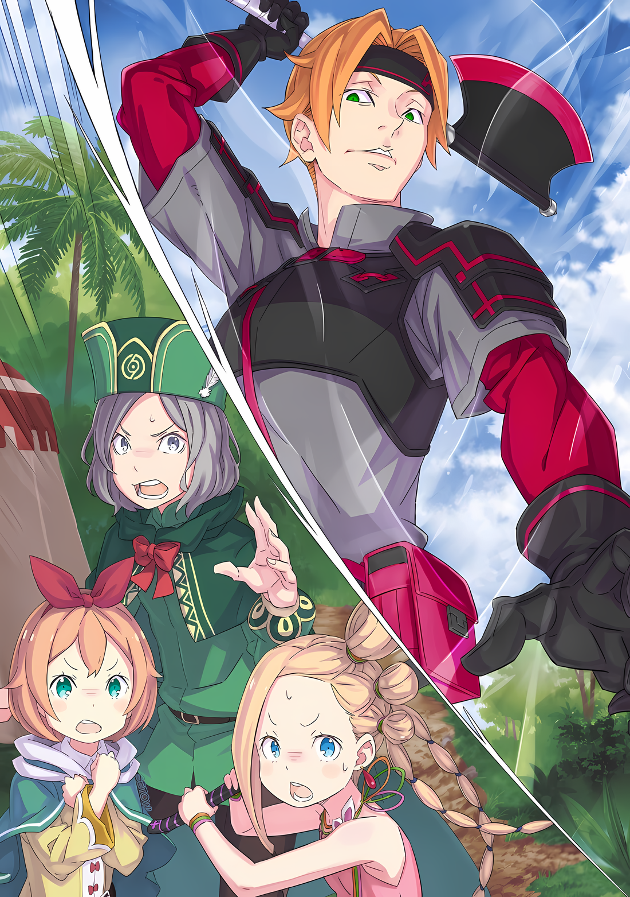

В этот момент все на поле боя увидели существо, появившееся над землей, облаченное в облака чистого белого цвета.

Чрезвычайно величественное, трансцендентное существо, которое с самого начала своего бытия находилось в совершенно ином измерении, нежели никчемная посредственность…… все поняли это с одного взгляда.

???: ……Это ведь… Дракон.

Расширив свои изумрудно-зеленые глаза, Гарфиэль пробормотал несколько слов, стоя рядом с разрушенной стеной.

После окончания смертельной схватки с Кафмой Ирулюкс, когда он, тяжело дыша, повел плечами, оглядываясь по сторонам в поисках новой битвы, случилось это.

Вдалеке, на поле боя, где вспыхнули самые боевые духи в этой Империи, в решающей битве на бастионе, застывшем в белом свете, появилось колоссальное присутствие, от которого казалось, что упало само небо.

Гарфиэль: Эмилия-сама……

Обладать Вратами с абсурдной пропускной способностью, использовать свою ману без необходимости, отнимать тепло у мира…… несомненно, Эмилия серьезно взялась за дело.

Если бы она сражалась с охраняющим одного из Пяти Бастионов крепостной стены, ее противником был бы один из «Девяти Божественных Генералов» или существо равной силы; даже в минимальном случае, этот противник будет на одном уровне с Кафмой.

Хотя одного этого было достаточно, чтобы он стал врагом, с которым Эмилия не хотела сражаться, было особенно абсурдно, что дополнительная боевая сила, появившаяся там, была мифическим существом.

Гарфиэль: «Генерал Летающих Драконов» вызвала его? Черт, я должен вытащить ее оттуда прямо сейчас…!

Скрежеща клыками, Гарфиэль сердцем решил сменить поле боя.

Сражаться с Эмилией и позволить ей сражаться было просто несовместимо. Сама Эмилия, скорее всего, возражала бы, но позволить ей сражаться было неприятным решением для лагеря.

Изначально она должна была наблюдать за всем с места, не опасаясь ранений.

Гарфиэль: Крутой я не смог бы противостоять капитану.

Вполне естественно, что Эмилия не хотела оставлять всю ситуацию на кого-то другого.

Он считал, что узколобость, в хорошем смысле слова, и вдумчивость — желательные черты характера. Но он не мог допустить всего этого и не мог позволить ей делать то, что она хочет.

Само собой разумеется, Гарфиэль был военным потенциалом лагеря Эмилии, и его роль заключалась в том, чтобы отражать все угрозы, которые сыпались на лагерь, и побеждать врагов, стоящих на их пути.

Гарфиэль: …………

Закрыв глаза, Гарфиэль спокойно проверил свое состояние.

Он получил тяжелое ранение в битве с Кафмой, все его тело было искорежено, внутренности вывалились наружу, он буквально сжег собственное тело, чтобы убить гнездившихся в нем «Насекомых», и все же Гарфиэль был жив и здоров.

Это была ситуация, когда единственное, чем он мог похвастаться, это тем, что он жив и здоров.

Гарфиэль: Возможно, будет преувеличением сказать, что я полон жизни… но я сделаю это.

Даже сейчас он впитывал силу через подошвы своих ног, стоящих на земле, и, используя целительную магию изо всех сил, тело Гарфиэля исцелялось с бешеной скоростью, как внутри, так и снаружи.

В обычных условиях это было бы нагрузкой на организм, которая потенциально могла бы сократить срок его жизни, но события в Городе Водных Врат заставили Гарфиэля вырваться из своей оболочки, как физической, так и ментальной.

Хотя этого не было заметно, Гарфиэль прорвал оболочку, которая, несомненно, раскрыла его потенциал.

От его многочисленных кровавых ран появлялся пар, как будто его тело действительно пылало жаром, и Гарфиэль твердо решил встретиться лицом к лицу с Драконом вдали.

Гарфиэль: Вы все! Крутой я проломил стену! Поторопитесь, мать вашу, и тащите свои задницы туда!

Открыв рот, Гарфиэль крикнул группе повстанцев, наблюдавших за ним издалека.

Это была та группа, которая бросила вызов Кафме чуть ранее Гарфиэля и была взбучена. Хотя значительное число из них, включая раненых, но поддержанных своими товарищами, все еще должно было быть способно функционировать как боевая сила, они держались подальше от поля боя Гарфиэля и Кафмы и оставались неподвижными даже после завершения битвы.

Кто-то мог сказать, что это произошло потому, что они были подавлены их битвой.

Однако дело было не только в этом.

???: Это ты пробил стену! Значит, ты должен пройти первым!

Гарфиэль: …………

???: Храбрый воин, мы уважаем твою силу! Никто, кем бы он ни был, не посмеет осквернить эту честь.

Так один из кентавров храбро ответил на слова Гарфиэля.

Победив Кафму, Гарфиэль заслужил право первым пробраться внутрь. Поэтому они остановились и стали ждать, когда он пройдет через стену.

Казалось, это было не только его мнение, но и мнение всех, кто видел поединок накануне. Те, кто начали сражение из корыстных побуждений, скрывали в себе гордость исторического воина.

Казалось, по их мнению, манера Гарфиэля сражаться была блистательной.

Их мнение, само по себе, было чистосердечным, однако……

Гарфиэль: Виноват, но есть место, куда крутой я должен пойти. Похоже на сюжет «Возвращения Уипфрока», но это не так. ……Мне нужно туда.

Гарфиэль дернул подбородком в сторону белого Дракона, царящего в далеком небе.

И в Сторожевой Башне Плеяд, и в Городе-крепости Гуарал были возможности встретиться с ним. Гарфиэль все время упускал их из-за нехватки времени, и вот наконец ему представилась возможность сразиться с Драконом.

Не то чтобы он хотел сражаться с ним. Это был противник, с которым он был обязан сразиться.

Повстанцы: …………

Увидев жест Гарфиэля, повстанцы дрогнули при виде белого Дракона.

Это было само собой разумеющимся, но они также знали о его существовании. Они боялись несмотря на то, что Имперским гражданам свойственно не вешать нос и сдаваться, а то, что бросят они ему вызов или нет — это уже другой вопрос.

Гарфиэль бросит. А значит……

Гарфиэль: Переход через стену я оставляю на вашу милость.

Если повстанцы перейдут через разрушенную стену и ворвутся в столицу, ситуация изменится.

Если все Пять Бастионов защищали величайшие военные державы Империи, то существовала вероятность, что оборона в районе вокруг Императора Винсента Волакии, который должен был находиться в Кристальном Дворце, будет слабой.

Существовала возможность, что буквально решающий удар может быть нанесен через большую дыру, которую он открыл в этой стене.

Гарфиэль: Вот почему……

Передав авангард атаки на столицу Империи повстанцам, Гарфиэль начнет сражение с белой угрозой.

Это случилось, когда он уже собирался направиться к бастиону, где находился Дракон.

……Гарфиэль вздрогнул, когда все волоски на его теле встали дыбом.

Гарфиэль: ……Кх

Свободен от мешающих мыслей. Он был свободен от мешающих мыслей.

Без колебаний, без вопросов, следуя ощущениям, которые донес до него мозг, он нанес удар, используя всю силу своего тела.

Стальной удар, способный раздробить крепчайший камень, попал по тому, что было впереди него….

???: ……Оо, так ты можешь видеть мою невидимость. Разве это не нечестно?

Хриплый голос послышался из-за его крепкого плеча.

Гарфиэль: Кха.

В тот же миг его удар должен был поразить тень позади него.

Несомненно, возникло ощущение, что что-то коснулось поверхности его щита. Тем не менее, из его рта вырвался горький звук, и Гарфиэль в шоке уставился в противоположную сторону и все его мысли были поражены этим ударом.

Он пришелся ему в спину. Чья-то маленькая ступня или палец идеально легли на спину Гарфиэля. Нелепый удар… Нет, это было в корне неверно.

???: Это был полностью твой удар. Я просто пропустил его через свое тело и вернул его тебе.

Голос ответил на его сомнения, и каждая косточка в теле Гарфиэля заскрипела, а его глаза расширились.

Было ли это правдой или ложью, но его зрение сильно пошатнулось, так как внутренние органы и мозг сотряслись от силы, эквивалентной удару, нанесенному с использованием всей силы его тела. Порезы, ушибы, сломанные кости и разорванные органы могли быть немедленно исцелены.

Даже если он не сможет полностью исцелиться, у него всегда есть возможность двигаться только благодаря своей силе.

Однако, атака, которая резонировала в сердцевине его тела, не могла быть отбита.

Гарфиэль: ……Кх

От онемения всего тела он стиснул зубы, и Гарфиэль был готов к последующей атаке. Он пошевелил медленно реагирующими конечностями и каким-то образом сумел защитить жизненно важные точки шеи и головы.

Однако последующей атаки, которой он опасался, не последовало.

Вместо этого произошла пауза.

???: Вообще-то, было бы неприятно, если бы они преодолели стену и вошли внутрь.

Со вздохом, смешанным с его словами, одновременно раздались болезненные крики десяти существ.

Когда Гарфиэль поднял голову, его взору предстала группа повстанцев, принявших его командование и прокладывающих себе путь в столицу. Те, кто выстроился в авангарде, пали.

Кентавры и зверолюди в одно мгновение лишились жизни, когда в их лбы и груди вонзились черные железные летающие лезвия…… метательные клинки, называемые кунаями.

Даже если бы он бросился к ним и воспользовался исцелением, он бы не успел. Это была атака, которая приводила к мгновенной смерти.

Как воины, они должны были обладать способностью сражаться со столицей Империи. Даже если они не были так хороши, как «Генерал» Кафма……

???: Если ты умрешь, ты — ничтожество. Какая разница, воин ты или нет?

Гарфиэль: …………

???: Какакка! Судя по твоим глазам, ты не слишком доволен, юнец. Ты ведь тот, кто разрушил стену, не так ли? Знаешь, это очень неприятно, когда опасные парни появляются один за другим, верно?

Маленькая тень засмеялась и провела пальцем по своим длинным белым бровям.

Наконец Гарфиэль оттолкнулся ногой от земли, и в поле его зрения появился старик маленького роста, ниже чем Гарфиэль, который и сам считался невысоким.

Однако «старик маленького роста» не очень подходил для описания этого чудовища.

Гарфиэль: Черт тебя побери…!

???: Оо, подожди-подожди, момент и я стану твоим противником. Оп.

Гарфиэль: А?

Гарфиэль враждебно посмотрел на него, а старик тем временем протянул руку, половины которой не было.

Он поднял бровь на отсутствие руки, а старик в это время потряс ногой.

Мгновение спустя, не понимая, что он сделал, горизонтальный размашистый удар прочертил глубокую линию в земле. Он также разделил пространство между собой, Гарфиэлем и повстанцами позади него.

Затем старик повернулся к повстанцам по другую сторону линии и сказал им.

???: Только попробуйте переступить эту черту. Попадете сюда — все умрете.

Повстанцы: ……Кх

???: Боже мой, как хорошо, что вы такие внимательные. Я хочу, чтобы люди из моей деревни учились у вас. В последнее время они не слушаются меня каждый раз, когда я что-то говорю. Хотя я ведь староста деревни, смекаете?

Пожав худыми плечами, старик усмехнулся, показав свои белые зубы.

Это было такое отношение, словно его совершенно не волновала угроза, которую он поведал повстанцам незадолго до этого момента. Однако все присутствующие инстинктивно поняли, что эта угроза не была ни ложью, ни чем-то еще.

Гарфиэль также понял. ……Понял, кто этот старик.

Гарфиэль: Ольбарт Дарккенн…… «Порочный Старик», я прав?

Ольбарт: Всегда всем твержу, что когда кто-то меня так называет, мне это очень не нравится. Это похоже на клевету, понимаешь?

Гарфиэль: ――. Какого хрена ты здесь делаешь?

Наклонив голову к старику…… к Ольбарту, Гарфиэль задал этот вопрос.

Он выглядел беззаботным и естественным, поэтому Гарфиэль ничуть не терял бдительности. Ольбарт стоял позади него, ничем не выдавая своего присутствия.

Прямо здесь, посреди этой равнины с хорошей видимостью.

Гарфиэль: ……….

Если бы он был вне поля зрения, где-нибудь скрывался и незаметно приблизился, то это еще можно было бы понять.

Но даже в этом случае угрозы было бы более чем достаточно, и тогда он мог бы быть доволен произошедшим. Однако как он мог воспринять существо, которое вторглось в это пространство без малейшего намека на присутствие?

А ведь он был существом, которое нельзя было воспринимать иначе как угрозу.

Перед дрожащим Гарфиэлем Ольбарт поднял бровь с неизменным выражением лица и произнес «Хо?»,

Ольбарт: Спрашиваешь, почему я здесь? А разве не логично? Это ведь наша работа — не пускать мятежников, Кафма имел наглость провалиться, и теперь я должен убирать за ним.

Сказав это, старик указал отсутствующей рукой на лежащего на земле Кафму. Затем, со словами «Упс», он убрал правую руку и указал левой.

Ольбарт: По тонкому льду шли, серьезно. Вот почему я сказал им, что будет опасно, если они не выведут Чишу или не вернут Груви, и все же, у него хватило наглости проиграть.

Гарфиэль: Достаточно! Старик, ты не имеешь права смеяться над этим парнем.

Ольбарт: Хоо?

Ольбарт закрыл один глаз и выглядел недовольным. Чтобы загородить взгляд старика, Гарфиэль вклинился между Ольбартом и Кафмой и выдохнул горячий воздух.

Кафма был врагом. Этого не изменить, но никто не имел права говорить о том, как он сражался, кроме Гарфиэля, который сошелся с ним лоб в лоб.

Гарфиэль: Этот парень был чертовски силен. Только вот крутой я оказался сильнее.

Ольбарт: ……? Ну… заметно. Я не собираюсь пытаться отрицать это, знаешь ли. Так что ты пытаешься сказать?

Гарфиэль: Я говорю, что мне не нравится твое чертово отношение! Разве можно так говорить о своем «Генерале»?! А!?

Широко открыв рот, Гарфиэль начал агрессировать в его сторону. От свирепого рева Ольбарт нахмурился и наклонил голову.

Похоже, что он действительно был в непонимании, старик спросил: «А ты вкурсе?»,

Ольбарт: Я — Генерал Первого класса, а Кафма — Генерал Второго класса. Мы даже отдаленно не похожи.

Гарфиэль: ……Кх

Непринужденно, замечания Ольбарта были просто передачей очевидных фактов. Зрачки Гарфиэля сузились, когда он почувствовал непонятный разрыв.

В тот момент, когда плотоядный зверь определил свою добычу, он поднял хвост и набросился на старика.

Он чувствовал, что должен отдать дань уважения Кафме. Однако этого не было по отношению к врагу, стоявшему перед его глазами.

Старик тоже не хотел и не желал этого.

В бою он ценил совсем другое, чем его противник, и признавая это……

Гарфиэль: Я тебя расхерачу!!!

Руки, обе поднятые вверх, сомкнулись над Ольбартом.

Его сильная рука, которую невозможно было измерить на ощупь, на удивление, отличалась от самой себя, в момент когда он разбивал стену, и, вероятно, она превосходила всю мощь, которую он использовал тогда; он вложил в нее достаточно разрушительной силы, чтобы ее было более чем достаточно для уничтожения этого маленького старого тела.

Затем, не дав ему уйти, его руки врезались в голову Ольбарта.

Бам, удар сотряс землю, и из разбитой земли поднялось облако пыли, как будто произошел взрыв. Пыль посыпалась на головы мятежников, которых остановил Ольбарт.

Возможно, Ольбарт был бы разбит на куски после того, как на него обрушилось бы столько силы.

Однако……

Гарфиэль: Чт…… кх

Глаза Гарфиэля расширились от увиденного зрелища.

Перед ним его кулаки врезались в голову Ольбарта с двух сторон, словно сэндвич. Это был определенный удар и сопротивление, которое Гарфиэль почувствовал по отдаче в своих руках.

Несмотря на это, старик, с головой, оказавшейся между кулаками Гарфиэля, показал свои белые зубы и рассмеялся, а затем,

Ольбарт: Невероятно, не правда ли? Я только что выпустил силу твоей атаки на землю.

Гарфиэль: ……Ах.

Ольбарт: Ну, земля взорвалась, потому что у тебя опасная сила рук, однако.

Сразу после того, как он закончил свои слова, лицо старика, зажатое между кулаками, высунулось из-под них. Гарфиэль проследил за ним взглядом, но….

Гарфиэль: Гха!?

Когда его взгляд проследил за Ольбартом, который должен был соскользнуть вниз, удар пришелся на его макушку.

Несмотря на то, что Ольбарт должен был пригнуться, что-то ударило его сверху.

Ольбарт: Верх, когда ты думаешь, что низ, низ, когда ты думаешь, что верх, это основа основ.

Гарфиэль: Гха… ЫАААА……!!!

На легкомысленные слова присевшего Ольбарта, Гарфиэль яростно взмахнул кулаками вниз. Они вонзились в его седую голову.

В этот момент резкий удар поразил затылок Гарфиэля, его спину и ягодицы.

Кулак Гарфиэля, замахнувшийся вниз, дрогнул и с огромной силой ударился о землю.

Вместо этого прямо сверху раздался голос Ольбарта, который мгновенно исчез.

Ольбарт: Вот почему, если ты думаешь, что я ниже тебя, я буду выше. Те, кто не учится, остаются позади, понимаешь?

Напрягая свое тело, он повернулся лицом к голосу и поднял руки вверх. Как только кончики его пальцев зацепились за что-то, Гарфиэль с силой замахнулся, пытаясь разбить это о землю.

Разбив его о землю, он помешал ему двигаться, а затем со всей силы ударил по нему. Он подумал, что если держать ноги раздельно, то его трюки будут невозможны……

Гарфиэль: …………

Призыв боевых инстинктов прекратился, когда он понял, что в его пальцах не Ольбарт, а тело Кафмы, которое старик перебросил через голову Гарфиэля.

Остановив свое движение, чтобы бросить тело на землю, губы Гарфиэля задрожали.

В этот миг……

Ольбарт: Послушай, ты, почему ты думаешь, что здесь пятьдесят Генералов Второго класса и только девять Генералов Первого класса? ……Все потому, что мы так глупо сильны.

Голос и шок ударили в голову Гарфиэля с двух сторон.

△▼△▼△▼△

……Когда спустилось огромное пламя, гнев неба намеревался поглотить мир целиком.

У Йорны создалось впечатление, что мир на ее глазах окрашивается в красный цвет.

Если бы кому-то удалось разбудить его накопленный гнев, мир, вероятно, выместил бы его на этом человеке.

Земля уже была выжженной, а все повстанцы были сожжены тем же методом. Эта разрушительная огневая мощь обрушилась на них, чтобы выжечь их до внутренностей так же, как и трупов.

Однако, несмотря на это, Йорна не сделала ни малейшего движения,

Йорна: ……Меч Света.

Присцилла: Ну и ну, заставлять свою дочь использовать такую ужасно грубую вещь.

Слова, произнесенные губами Йорны, послужили сигналом для вертикального взмаха сокровенного меча насыщенного багрового цвета.

Это был прекрасный меч, который притягивал взгляды тех, кто его видел, обжигал их сердца и даже пленял их души. Но эта завораживающая природа была лишь дополнением к сокровенному мечу, она не составляла и малой толики его первоначального предназначения.

Иными словами, когда он выполнит свою первоначальную задачу, блеск сокровенного меча станет еще сильнее.

Йорна: …………

«Меч Света», острие которого взметнулось вертикально, перехватил огромный огонь, обрушившийся на них.

В тот же миг могучее пламя, пронизывавшее их зрение, исчезло. ……Не то чтобы оно исчезло. Оно просто пропало, как будто его и не было.

Присцилла: Мой Меч Света сжигает то, что я хочу сжечь, и режет только то, что я хочу резать.

Эта логика была слишком жестокой, слишком иррациональной и слишком абсурдной.

Однако перед глазами материализовалось это зрелище, и инферно, которое, казалось, могло уничтожить даже мир, исчезло.

Вливая в себя соответствующее количество энергии, она выпустила эту мощную силу огня, намереваясь сдержать их первый шаг, но при виде того, как она была уничтожена одним взмахом меча, даже их противник не смог остаться спокойным……

Присцилла: Не смотри на нее свысока, ибо это «Пожиратель Духов».

Независимо от того, было ли это объяснение или предупреждение, это звучало довольно невежливо, и после этих слов фигура Присциллы отлетела в правую сторону.

Йорна же отлетела влево…… Между ними пронесся мощный поток воды.

Йорна: ……Тц

Как будто все содержимое колодца было выпущено наружу, и Йорна, успешно уклоняясь, почувствовала, что ее противник…… Аракия… усилила свои возможности по сравнению с ее предыдущим впечатлением.

Это был не первый раз, когда Йорна сражалась с Аракией.

До этого они пересекались лишь однажды, во время «Восстания», которое, как считалось, было вызвано Йорной.

Тогда за Аракией маячили сильнейшие Волакии, а в Хаосфлейме, где Йорна находилась в идеальной позиции для противостояния с ними, сложились совсем другие предпосылки.

Конечно, Йорна была серьезно настроена на борьбу, но ее истинные намерения на тот момент не были таковыми, как например их убийство.

Во время прошлых восстаний, особенно того, которое привело к столкновению с Аракией, целью Йорны было возмездие тем, кто вмешивался в дела жителей Города Демонов, и донести до них праведность своих действий.

Другими словами, ее цель была своего рода протестом, и Винсент, столкнувшийся с ней лицом к лицу, должен был знать об этом намерении, это было столкновение, в котором примирение казалось возможным.

Однако Аракия в то время не знала об этих обстоятельствах и, вероятно, не сдерживала себя в борьбе с Йорной.

С тех пор Йорна полагала, что сила Аракии полностью превосходит силу других войск, и поэтому от нее ожидали, что она будет выступать в качестве самостоятельной силы, сравнимой с армией.

Однако это представление было не только неверным, но и наивным.

Йорна: Итак, не обращая внимания на старика Ольбарта, вот что значит быть «Второй»?

Выпустив эти слова вместе с продолжительным вздохом, Йорна оглянулась назад…… под напором вырвавшейся на свободу воды земля разделилась по вертикали до самого горизонта.

Она понимала, что вода под давлением представляет угрозу.

Однако, увидев, насколько это необычно, Йорна закатала рукава своего кимоно.

Готовясь к решающей битве, она надела свое любимое кимоно.

Несмотря на это, она сомневалась, сможет ли она остановить удар Аракии.

Йорна: Раньше ты использовала только огонь, поэтому сожгла дотла половину моего города, но……

На одном дыхании Аракия сожгла половину ее города, а сегодня она также сожгла повстанцев у крепостных стен.

Аракия предполагала, что оборонительная линия огня, хорошо подходящая для каменных сооружений, и поле боя, где не нужно обращать внимание на окружение, будут удобны для нее, и что у нее нет причин менять свою стратегию боя.

Присцилла: Эта идея была подброшена и в твою голову, хотя она была бы гораздо более очаровательной, если бы не была направлена на меня.

Сказав это, Присцилла оттолкнулась от земли и приблизилась к Аракии.

С одним из бастионов звездной крепости позади, как бы защищая ее, Аракия парила в воздухе, ее ноги горели ниже колен.

Даже просто неослабевающая огневая мощь, обрушившаяся на нее с высоты, представляла собой достаточную угрозу.

Сначала Аракию нужно было заманить вниз, чтобы она могла приблизиться.

Присцилла: Дорогая мамочка!

Йорна: ……Кх, поняла!

Присцилла крикнула, прорываясь вперед, вызвав кратковременное замешательство в Йорне.

Она еще не успела как следует прочувствовать близость между ней и ее теперь уже воссоединенной дочерью. Скорее, она сомневалась в напыщенном отношении Присциллы к своей матери, которая изменила внешность.

Поскольку они расстались, когда она была грудным младенцем, у нее не было возможности узнать, как воспитывалась Присцилла.

Йорна: Танцуй.

Вынув кисэру изо рта, Йорна взмахнула его кончиком и ударила по земле башмаком на толстой подошве.

Затем, перед наступающей Присциллой, дрожащая земля медленно поднялась и стала опорой, чтобы поддержать путь Присциллы.

«Техника Брака Душ» Йорны также действовала на неорганические объекты.

Однако это была система, в которой сила ее действия была пропорциональна количеству времени и преданности, которые она вложила в нее. Поэтому у нее возникло сомнение. ……Насколько сильно она может любить землю, где она проводила время с любимым мужчиной?

Однако результаты были очевидны.

Присцилла: Твоя работа была направлена на великое дело.

Оставив свою мать с заявлением, которое не заставило ее почувствовать себя матерью, Присцилла запрыгнула на опоры прямо перед ней.

Разумеется, на этом опоры не остановились: они появлялись одна за другой, прокладывая путь к Аракии. Один прямой путь стал бы мишенью, поэтому она продолжала рассматривать возможность создания нескольких путей.

Из-за этого……

Аракия: ……Неприятность.

Когда Аракия взмахнула рукой, держащей ветку, сильный ветер, который был выпущен, полностью вырвал плавающую землю и скосил все тропинки.

Этот ветер не был слабым, скорее достаточно сильным, чтобы сравниться с ударом гигантской ладони, и сила его была такова, что сможет раздавить даже Присциллу, если бы он попал прямо в нее.

Присцилла: Чтобы так безжалостно использовать его против меня… неужели тебе не хватает моей красоты?

Аракия: Я приняла решение. Даже если ты лишишься конечностей, принцесса останется принцессой.

Присцилла: Не будет ли точнее сказать, что за тебя уже все решили?

Сузив свои глаза, Присцилла поразила Аракию этими словами, спустившись с небес. За мгновение до того, как сильный ветер снес опору, Присцилла быстро уклонилась прыжком в небо. Ей едва удалось избежать удара ветра, что было подвигом, но она все еще была уязвима для второго удара.

Истинно стерев колебания со своих глаз, Аракия прицелилась в ее конечности, когда та вынуждена была упасть, и подняла руку в безжалостной попытке лишить ее боеспособности.

А затем……

Йорна: Я буду обеспокоена, если ты забудешь обо мне.

Подлетев снизу, Йорна нанесла удар ногой в сторону Аракии, которая была занята тем, что собиралась поразить Присциллу, находящуюся над ее головой.

Длинные ноги Йорны устремились вверх, а ее тщательно ухоженные толстые подошвы, которыми она очень дорожила со временем, последовали за ее решающим ударом.

Присцилла: Неприлично в твоем возрасте быть более привлекательной, чем я.

Синхронно с ударом Йорны, Присцилла взмахнула «Мечом Света», держа его над головой, направляя прямо вниз. Аракия попала в перекрестную атаку матери и дочери.

В совершенном унисоне два чарующих удара, достойных самовосхваления, поразили друг друга ……Да, они ударили друг друга.

Присцилла и Йорна: ……Кх!?

Удар, который должен был зацепить Аракию, не вызвал никакой реакции, скорее, ожидаемый удар был немного смещен и вместо этого издал твердый звук.

Судя по всему, толстая подошва Йорны, ударившей вверх, столкнулась не с чем иным, как с лезвием Меча Света, которым Присцилла замахнулась вниз.

Их клешневая атака пропустила важнейшего противника, и вместо этого они поразительным образом ударили друг друга.

Еще более удивительным было то, что столкновение обеих атак Йорны и Присциллы произошло внутри кажущегося мерцающим тела Аракии.

Йорна: Удар… прошел сквозь нее?

Присцилла: Как дерзко.

Сразу после того, как изумление Йорны и раздражение Присциллы выплеснулись одновременно, тело Аракии, казалось бы, принявшее обе атаки, засветилось белым светом, и была предпринята контратака.

Как будто все тело Аракии взорвалось…… Нет, на самом деле оно взорвалось.

Тело Аракии рассыпалось на лучи белого света, которые с ужасающей силой разлетелись во все стороны, словно картечь, и ударили в Йорну и Присциллу, как фонтан воды.

Йорна: Кха……!

В одно мгновение Йорна собрала мелкие кусочки грязи, взметнувшиеся в воздух в результате предыдущей ветреной атаки, и окутала себя и Присциллу облаком пыли.

Вместо того, чтобы облачить их в одежду, которая прилипала к телу, это была тонкая техника, которая с большой скоростью циркулировала вокруг фигуры, отражая атаки.

Если бы картечь Аракии обладала лишь огневой мощью, которую можно было бы заметить с первого взгляда, это бы достаточно снизило ее силу.

Однако……

Йорна: ……Кх!!!

Легко пробив плащ земли, лучи Аракии пронзили Йорну и Присциллу.

От удара Йорна упала на землю и закричала в агонии. Собрав все силы, она мгновенно зарылась вытянутыми ногами в землю, чтобы избежать некрасивого падения.

Она не могла позволить себе рухнуть, а тем более упасть на спину.

Йорна: Потерять тех, кто любит меня……

Вес души, которую держала Йорна, поддерживался присутствием тех, кто ее любил.

Поэтому Йорна должна была ответить на эту любовь всей своей силой. Отвечать на любовь — это не то, что можно делать вполсилы.

Она должна была стремиться быть соответствующей в своих движениях, речи, поведении и даже эмоциях.

Будь то в повседневной жизни, в спальне или в разгар битвы, все было одинаково.

……Со слабым звоном рассыпалась заколка, удерживавшая волосы Йорны. На ней висели украшения, сделанные из слоистых чешуек.

Присцилла: Это был чей-то подарок дорогой мамочке?

Йорна: ……Это был подарок от моих любимых детей.

Рассыпавшись как песок и полетев как одуванчик; Йорна поймала пальцами кусочки пыли от украшения для волос и нежно посмотрела на них.

Большинство вещей, которые носила Йорна, были подарками. Ее кимоно, обувь и даже украшения для волос, будь то тканые, резные или литые, жители Города Демонов приложили немало усилий, чтобы своими руками создать эти прекрасные вещи, которые стали пропитаны душами их создателей.

Те, кто получал любовь Йорны, обретали способность быть пожертвованными, чтобы защитить ее в ответ.

Йорна: Что насчет тебя?

Присцилла: К сожалению, я не могу похвастаться такой же верностью, как ты, дорогая мамочка; только то, что у меня было под рукой с самого начала, дань от моего уже покойного мужа.

Говоря это, Присцилла осторожно показала свое ухо. При этом движении стало видно, что зеленая серьга с драгоценными камнями, которая должна была там находиться, исчезла.

Она тоже передала свою жизненную силу тем, кого любила, обеспечив себе более долгую жизнь.

Йорна: Твоего мужа? Присцилла, значит ты……

Присцилла: Какое кроткое выражение лица. Эти недостающие серьги, я получила от моего четвертого мужа.

Йорна: Четвертого……

Присцилла: Восемь раз я была одарена мужем. Конечно, это не ставит меня в сравнение с тобой, дорогая мамочка.

Когда Присцилла бесцеремонно произнесла этот неожиданный ответ, рот Йорны остался открытым от шока. Однако этот шок был сведен на нет тем, что Присцилла схватила сияющий Меч Света.

Странный феномен, произошедший ранее.

Йорна: Присцилла, если это Меч Света, то он должен быть способен достать любого противника. При условии, что их душа не была разорвана Мечом Жизни……

Присцилла: Даже без твоих слов, дорогая мамочка, я прекрасно знаю об этом. Однако есть кое-что, в чем ты ошибаешься.

Йорна: Ошибаюсь?

Присцилла: Мой Меч Света сжигает то, что я хочу сжечь, и режет только то, что я хочу резать.

Сказав это, Присцилла медленно подняла кончик своего Меча Света.

Когда Йорна проследила взглядом за ним и увидела Аракию, рассеянный белый свет постепенно формировал ее фигуру.

«Пожиратели Духов», как говорят, могли вместить силу, которой Духи обладали, в свои тела… Хотя истинная природа этой редкой способности была неизвестна, возможность расширения ее возможностей была поразительной.

Только что принцип преобразования Света в тело…… после размышлений он стал понятен.

Меч Света, который резал то, что хотел резать, сокровенный меч, который мог достичь всего.

Присцилла: ……Огонь, Вода или Ветер? Все это неважно, ведь несомненно, я смогу дотянуться до тебя.

Аракия: …………

Багровые глаза Присциллы сузились, встретившись со взглядом Аракии, чьи глаза были того же цвета.

Владелец Меча Света, способного охватить все сущее, и трансцендентное существо, обладающее способностью превращаться во что угодно, противостояли друг другу…

Йорна: Вижу, ты выросла с довольно проблемным противником.

Если бы это был Хаосфлейм, Йорна, возможно, смогла бы справиться с Аракией.

Но это был не Хаосфлейм, и Йорна вряд ли была в полной силе.

Поэтому решающий удар должна была нанести не Йорна, а….

Присцилла: В конце концов, именно я всегда нахожусь в центре сцены.

Девушка, красная как солнце, превращавшая любые трудности в пропитание для себя, милостиво улыбнулась.

Эта улыбка была ослепительной даже для Йорны, стоявшей рядом с ней.

Ослепительная улыбка Присциллы испепелила только одно существо, способное оставаться рядом с ней и не сгореть дотла, и этим существом оказалась Аракия, стоящая на пути Присциллы, — какой ироничный поворот судьбы.

△▼△▼△▼△

……Отто Сувен почувствовал изменение направления ветра.

Сначала это было предчувствие, затем оно сменилось предзнаменованием, которое нужно было принять, и, наконец, стало убеждением.

Военная ситуация, которая постепенно и медленно менялась, двигалась и кренилась…… Когда Отто открыл каналы, которые должны были оставаться закрытыми, и погрузился в работу по улавливанию всевозможных «Голосов», его охватило чувство всемогущества, как будто он сам был един с миром и был мимолетен.

Вещи, которые можно найти только в такой ситуации, были погружены во всепоглощающий вихрь информации. Чтобы извлечь их, нужно погружаться все глубже и глубже……

???: ……Отто-сан!

Отто: ……Кх.

Совсем рядом раздался голос из-за пределов его сознания, и в то же время жаждущий удар разрушил водоворот «Голосов».

Это было похоже на то, как если бы разбили резервуар с водой и вода из него вытекла; как если бы песчинки зачерпнули из песочницы и высыпали через щели между пальцами; «Голоса» вырвались наружу.

Хотя без этого он чувствовал себя пустым и сожалел об этом,

Отто: Ох, Боже… Спасибо, что спасла мне жизнь, Петра-чан……

Петра: У тебя сейчас такой ужасный цвет лица… Пожалуйста, вытри кровь из носа.

Отто: Оу, спасибо за помощь…… Я чувствую, что у меня сильно идет кровь, хотя я и не дрался.

Отто взял предложенный носовой платок и прижал его к носу.

Капающая кровь смачивала траву под ногами, и он отчетливо осознавал, как тяжело ему дается использование его Божественной Защиты. На самом деле, количество пролитой крови не казалось ему шуточным.

Впрочем, как и ожидалось, все было не так плохо, как когда его ноги были подвержены сильным ранениям в Пристелле.

Отто: Если я попытаюсь нырнуть далеко и глубоко, то……

Петра: Разве моя сила не помогает?

Отто: Нет, если бы не поддержка Петры, было бы, наверное, хуже. Истощение внутренностей моей головы… Наверное, я должен назвать это усталостью мозга. И это потому, что в нем ощущается тяжесть.

Им было трудно понять друг друга, даже тем, кто обладал Божественной Защитой, однако то, как они накладывают бремя на своих пользователей, сильно варьировалось в зависимости от их эффектов. Например, «Божественная Защита Уклонения от Ветра», которой обладал наземный дракон, была почти идеальным типом Божественной Защиты без каких-либо недостатков, за исключением резкой разницы в ее нагрузке между тем, когда она была задействована и когда нет.

«Божественная Защита Земляных Духов» Гарфиэля также оказывала положительный эффект, пока он стоял на земле, но в то же время она создавала большую нагрузку на его тело, чтобы поддерживать его физическое состояние.

Так получилось, что Гарфиэль был физически силен, поэтому негативные эффекты на него не распространялись, но если бы им обладал обычный человек, ему пришлось бы регулярно делать перерывы и снимать нагрузку с тела, поднимая ноги от земли.

С этой точки зрения, «Божественная Защита Духовной Речи» Отто сосредоточила большую часть нагрузки на его мозге.

Поскольку мозг преобразовывал «Голоса» живых существ, проникавшие через его уши, в голоса, которые Отто мог понимать, то естественно, что нагрузка была сосредоточена именно там.

Отто пытался уловить «Голоса», которые обычно оставались недоступными, и уловить все звуки, которые он мог слышать.

Поэтому он попросил Петру использовать только что освоенную ею Магию Света для физического укрепления тела Отто, особенно сосредоточившись на его голове.

Для опытного воина, как говорят, физическое укрепление с помощью маны происходит естественным образом, но в данном случае это было сделано с помощью внешнего вмешательства.

Конечно, даже при усилении функций головы с помощью Магии Света, интуиция Эмилии не стала бы вдруг такой же острой, как у Рам. Ожидалось, что Магия Света Петры улучшит выносливость Отто, а не функции его мозга.

Продлевая возможности мозга, Петра позволила бы Отто дольше держать каналы открытыми, подобно тому, как улучшение работы сердечно-сосудистой системы позволяет человеку дольше находиться под водой.

Без сотрудничества с Петрой результаты, несомненно, были бы меньше половины нынешних.

Отто: При этом есть много случаев, когда я слишком жадничаю и пытаюсь зайти глубже…

Петра: Если я почувствую, что ты в некоторой опасности, я могу просто дать тебе пощечину в меру своих сил, верно?

Отто посмеялся над заявлением Петры, которая была в состоянии обнадеживающей готовности.

На самом деле, если Отто был в опасности, в его интересах было, чтобы Петра оттащила его назад. Самым быстрым и надежным способом сделать это было принудительное отключение канала.

Следуя за звуком «Голоса», он начал бы терять представление о собственном положении.

Конечно, «Голос», на который Отто естественным образом ориентировался, когда разговаривал с Петрой, был основным, но если бы он потерял эту связь, то, вероятно, утратил бы способность распознавать языки.

Если бы этот голос стал неузнаваемым, Отто пришлось бы вечно держать канал открытым, чтобы общаться с кем-либо. ……Если это произойдет, то легко представить будущее, в котором даже простой шум ветра или шорох одежды будет восприниматься как «Голос», и Отто потеряет рассудок.

Отто: Когда это произойдет, я стану одним из тех, кто погиб из-за своей Божественной Защиты, как и многие другие с такой же Божественной Защитой.

Хотя ему повезло, что он смог преодолеть свое детство, не умерев, теперь он потеряет свое устоявшееся «я» из-за собственного решения открыть канал.

Слишком много подводных камней на жизненном пути носителя Божественной Защиты.

Хотя можно сказать, что чем сложнее был путь, тем большее вознаграждение он приносил……

Петра: И как успехи?

Отто: ……Первый и второй бастионы бесполезны. Там не осталось никого, кого я мог бы слушать. Первый был сожжен дотла, а второй…… там находится Эмилия-сама.

Петра: А… сестренка Эмилия……

Петра со сложным лицом посмотрела на Отто, который что-то бормотал, прижав к носу платок.

Первый бастион охраняла Аракия, один из самых высокопоставленных членов «Девяти Божественных Генералов». Ее сила, управляемая ее духом, сожгла все поле, в результате чего «Голоса» всех живых существ, которые мог слышать Отто, были полностью уничтожены.

Если птицы, мелкие животные или насекомые умрут, то Отто будет не в состоянии уловить какие-либо «Голоса» через свои каналы.

Петра: Если поле сожжено, разве земля под поверхностью не будет в порядке?

Отто: Даже если они выжили, подземные существа часто не разговаривают. Кроме того, как я уже сказал Петре-чан, «Божественная Защита Духовной Речи»……

Петра: Она только позволяет понимать речь слышимых существ, но не улучшает слух.

Отто: Верно.

Отто выразительно кивнул на слова Петры, которая склонилась перед ним.

Как только что сказала Петра, «Божественная Защита Духовной Речи» Отто была способна понимать только «Голоса», которые он слышал, и позволяла ему разговаривать с теми, кто говорил на другом языке.

Другими словами, Божественная Защита не могла быть использована должным образом, если живые существа не находились в месте, где можно было услышать их «Голоса».

Здесь также сыграло роль применение Петрой своей Магии Света для укрепления выносливости головы Отто.

Благодаря тому, что его слух и слуховые способности усилились, он смог улавливать «Голоса» в более широком диапазоне, чем обычно.

Однако……

Отто: У первого и второго бастионов больше нет шансов. Они были сожжены Аракией и заморожены Эмилией-сама, соответственно.

Петра: С-сестренка Эмилия не настолько злобная, чтобы сделать такое!

Отто: Я знаю. И даже если бы Эмилия-сама ничего не сделала, реакция остальных на втором бастионе уже была довольно негативной. ……Вероятно, потому что другие существа боялись полудракона.

То, что Петра сказала, что в Эмилии не было злобы, вместо того, что Эмилия не имела злого умысла, было вполне подходящей формулировкой.

Раз в Эмилии не было злобы, значит, не было и возможности ее проявить. Однако, несмотря на такие общие взгляды, утверждение Петры также было обманчиво верным.

Защитницей второго бастиона была Мэделин Эшарт, которая едва не повергла Город-крепость в состояние полного разрушения…… и которая принадлежала к расе полулюдей, настолько редкой, что люди сомневались в самом ее существовании.

Поскольку полудраконы были связаны с Драконами, которые царили на вершине всего сущего, их боялись животные, неважно какие, большие или маленькие, не оставляя им иного выбора, кроме как спасаться бегством.

Эмилия понизила температуру в этом районе до чрезвычайно низких градусов, что создавало впечатление крайности.

В любом случае……

Отто: ……Что касается пятого бастиона, Гарфиэль должен хорошо с ним справиться. Четвертый бастион постоянно атакует группа Светящихся людей. Согласно инструкциям, выжившие Оружейники и Племя Циклопов присоединятся к ним.

Петра: А на третьем бастионе судракийки присоединились к другим группам, сражающимся с каменными големами. Что насчет другого пути вокруг бастионов, который ты хотел исследовать?

Отто: Похоже, что от первого бастиона до замка есть прямой путь, который каким-то образом был засыпан заранее. Меня неожиданно начинает тошнить от того, что Абел-сан все угадывает правильно.

Петра: Но поскольку кому-то не обязательно идти и проверять это, мы можем сделать следующий шаг быстрее.

Приведя мысленный образ распределения «Голоса» в порядок, он сравнил его с картой, которую Петра разложила перед ним. Отто добавил только что полученную информацию на карту, на которой уже было нарисовано несколько символов, а Петра нанесла на нее стрелки и другие маркеры.

При усталости мозга и даже странном ощущении тяжести, как будто в голове скапливалась теплая вода, присутствие Петры было крайне важно для того, чтобы собрать воедино эти визуально неразличимые образы.

Для лагеря Эмилия включение Петры, возможно, было самым значительным. По крайней мере, Отто считал величайшим достижением Субару то, что Петра сейчас здесь.

Отто: Поскольку Нацуки-сан — причина, по которой мы это делаем, мы должны… кха…

С глубоким, кровавым вдохом, вырвавшимся из носа, Отто проверил, открыты ли еще его носовые ходы. Носовой платок Петры уже был испачкан кровью Отто.

Полагая, что позже он купит новый платок и отдаст ей, Отто медленно переключился на другой канал.

Там было……

???: ……Отто-чин! Петра-чан!

Отто: А, Медиум-чан.

Маленькая фигурка бежала к ним по лугу, размахивая руками широкой дугой.

Ее длинные светлые волосы танцевали в воздухе, когда она беспокойно бежала по полю боя. Она бежала по прямой линии к Отто и Петре.

Медиум: Ты был очень полезен, Отто-чин! Абел-чин хочет следующий отчет!

Отто: Я абсолютно уверен, что ты не хотела сказать это в милом смысле; однако я ценю это…… если это тебе поможет. Нет ничего хорошего в том, чтобы дарить что-то тому, кто не понимает ценности этому.

Петра: Зачем так остроумно, Отто-сан. Хотя это и понятно.

Отто и Петра слегка улыбнулись сообщению Медиум, в глазах которой появился блеск.

Неумышленно Медиум действовала как мягкий посредник в командной цепочке…… сосредоточившись на сборе информации, Отто был спокоен, поскольку он мог легко оставить управление этой информацией Абелу и его группе.

Это была еще одна схема, которая была бы невозможна без Медиум.

Медиум: Возможно, это было бы осуществимо, но и наверняка более неловко.

Отто: Возможно. Тем более, что Петра-ча… леди Петра и я — те, кто должен занять жесткую позицию против Абела-сан.

Медиум: ……? Меня хвалят? Ура!

Обмен Отто и Петры был встречен с большим восторгом Медиум, которая подняла обе руки вверх.

Чуть позади нее стояли четыре солдата, которые были посланы Отто и Петрой для установления связи с главным лагерем. Вероятно, это было следствием того, какое значение Абел придавал ценности информации, принесенной Отто.

Обычно Абелу было бы проще, если бы Отто также находился в главном лагере.

Медиум: Отто-чин, чтобы услышать «Голоса», нужно побродить вокруг, верно?

Петра: А все потому, что уши Отто-сана не такие большие.

Отто: И то, и другое — разные способы сказать одно и то же!

В отличие от бесхитростного замечания Медиум, Петра ответила шуткой, но оба они были по-своему хитры. Хотя, в целом, это было правдой, так что отрицать это было нельзя.

Во всяком случае, они передали только что нарисованную карту гонцам и получили взамен новую, отражающую текущие изменения в ходе битвы.

Отто: Пожалуйста, используйте это во благо. Здесь есть несколько опечаток, но стрелки и другие символы, которые добавила леди, должны быть понятны.

Посланник: Понял. Будьте осторожны с разведчиками, Аналитик-доно.

Отто: Аналитик……

Отто с горечью повторил титул, присвоенный ему вместе с картой, которой они обменялись.

Сначала торговец, потом министр внутренних дел, потом главный министр внутренних дел и военного потенциала, а теперь аналитик. Сколько должностей ему придется занять до завершения Королевских Выборов?

Или эти неприятности будут преследовать его и после их завершения?

Отто: Наверное, стоит отбросить эти блаженные заботы в сторону.

По крайней мере, завтрашний день, о котором мечтал Отто, не наступит, если он не завершит то, что было перед ним.

Завтрашний день — это то, с чем Отто должен был встретиться сам.

Вот почему……

Петра: Отто-сан, давай дальше.

Отто: Боже мой… как насчет минутки отдыха, леди?

Петра: Говорит человек, который обычно не отдыхает, даже когда ему говорят об этом. Когда все будет сделано, ты можешь напиться до потери сознания, так что постарайся сделать все, что в твоих силах.

Отто: Звучит так, как будто я самый большой пьяница в мире!

Когда Отто повысил голос по поводу последствий для репутации, Петра высунула язык, чтобы не отвечать.

Таким образом, он почувствовал заботу о себе, не став слишком серьезным; Отто похлопал себя по чистой щеке, чтобы вернуть себе сосредоточенность.

Он не был уверен, хочет ли он спросить Петру или Гарфиэля, насколько испуганно он выглядит, и может ли он вообще себе это позволить.

За все это обычно отвечал Субару, которого здесь не было.

Отто: Я могу получить преимущество ради победы. Поэтому……

Сразу же после того, как Отто открыл канал, чтобы собрать больше информации.

Громкий шум потряс сознание Отто.

Отто: …………

Петра: ……Отто-сан?

Увидев застывшее лицо Отто, Петра позвала его по имени.

Однако голос Петры не достиг ушей Отто. Это произошло потому, что они были закрыты оглушительными криками, заполнившими весь мир.

Отто: Афх… АА…!?

В одно мгновение разум Отто словно вскипел, и он в шоке схватился за голову. Однако, прежде чем его сознание улетучилось, он едва удержался на ногах.

Ужасные крики все еще наполняли мир.

Причиной было……

Отто: ….Ах.

Когда Отто был поражен внезапным шоком, две девушки, Петра и Медиум, посмотрели на небо и уронили челюсти.

Перед глазами этих девочек, когда он спускался прямо с неба на землю, величественно расправив крылья перед самым столкновением, было присутствие, которое даже на расстоянии передавало ощутимое чувство того, почему мир кричит.

Неудивительно, почему все живые существа в мире кричали.

???: Дракон……

Было неясно, кто это сказал: Петра, Медиум или один из солдат-посланников.

Отто мог с уверенностью сказать, что это был не он.

Почему……

Отто: ……Кх!

В тот момент, когда все на поле боя были захвачены появившимся белым Драконом, было только два человека, чье сознание не было отвлечено его присутствием — один из них, Отто, который одной рукой потянул Петру, а другой толкнул плечо Медиум.

Петра: ……КЬЯАА!

Петра издала крик и рухнула на грудь Отто, который с силой повалился назад. В нижней части его зрения оттолкнутая Медиум упала на спину.

Это были минимальные действия по уклонению, которые Отто мог сделать в этот момент.

……Масса раскаленного пламени опалила воздух, пройдя над головами приземлившихся Отто и Петры, а также сидящей Медиум.

Петра: ~~АААА!!!

После того, как ее потянуло вниз, тонкое горло Петры издало крик.

Но возможность кричать была своего рода сигналом безопасности. Если бы ситуация была более ужасной, чем эта, времени на крик просто не было бы.

На самом деле, как и солдаты-посыльные, которые были вне досягаемости Отто.

Отто: …………

Масса пламени пронеслась над головами Отто и девочек, задев при этом солдата-посыльного, державшего карту.

В следующее мгновение все тело этого солдата в красно-черной военной форме мгновенно сгорело дотла. Из-за карты в руках, не было никакой возможности предотвратить это.

И, увидев такое разрушение, они даже не смогли поднять голос от удивления.

???: ……! Осторожно!

Сразу же после громкого крика девушки раздался звук удара стали о сталь, который эхом разнесся по воздуху.

Медиум успела прокричать это, несмотря на то, что Отто толкнул ее. Она выпрямила свои длинные детские ноги из положения сидя и в низкой позе вытащила из-за пояса варварский меч.

Тем не менее, ей удалось отбить смертоносное лезвие, обрушившееся на Отто со всей силы.

Петра: Вставай, Отто-сан!

Отто попятился вперед, когда Петра потянула его за руку.

В момент, когда он отступил назад и оглянулся, то увидел Медиум, которая обеими руками сжимала свой варварский меч, слишком большой для ее маленького роста, и смотрела на нападавшего в упор.

Затем……

???: ……Виноват-виноват, а ведь я собирался сделать все быстро.

Говоря это, ворчащий человек, стоявший перед Медиум, был единственным, кроме Отто, кто сознательно игнорировал присутствие белого Дракона, создавшего эту ненормальную ситуацию на поле боя.

Это был Имперский солдат с банданой, обмотанной вокруг головы. В руках он держал длинноручный топор, и, судя по его нарукавной повязке, он не был высокопоставленным противником.

Обычный солдат. Вопрос был в том, что этот человек здесь забыл этот?

Пока его канал был сосредоточен, он оставался бдительным.

Как же этому человеку удалось избежать наблюдения Отто за «Голосами»?

С максимально возможной осторожностью Отто прикрыл Петру рукой и посмотрел на человека, стоящего перед Медиум.

Отто: Никакой пощады для детей? Это довольно варварски, не находишь?

Тодд: На это легко ответить, что дети и женщины, находящиеся на поле боя, как нельзя лучше подходят жителям Имперского города. Кроме того, не слишком ли это удобно?

Отто: Удобно?

Тодд: Если бы вы были непригодными, которых просто бросили на поле боя, твоя нынешняя логика могла бы быть верной. Но я не признаю непригодными людей, которые что-то да делают на поле боя.

Он был из тех людей, которые безжалостно нападают из засады с полным намерением убить.

Маловероятно, что разумные переговоры сработали бы с самого начала, но перед лицом его тщательности можно было сказать, что надежда полностью угасла.

Но все равно это не имело смысла.

Отто: Я и эти дети что-то да делаем? И что же мы можем делать так далеко от лагеря……?

Тодд: Кто знает. Однако моя интуиция мне подсказывает, что ты — корень всего зла в этой войне. А еще мое чутье кое-что мне говорит.

Отто: ……Что же?

Человек, который бесстрастно и пренебрежительно смотрел на Отто и остальных, сразу оборвал свои слова.

Когда Отто призвал его продолжать, мужчина посмотрел на них троих по очереди и……

Тодд: ……С вами, ребята, тоже лучше не тратить время.

При этих словах его топор взмахнул, сверкнув, безжалостно нацелившись лишить жизни Отто, Петру и Медиум.

rezero7arc | Иллюстрация к **Ранобэ** Том 32 | Разукрасил set0wi
