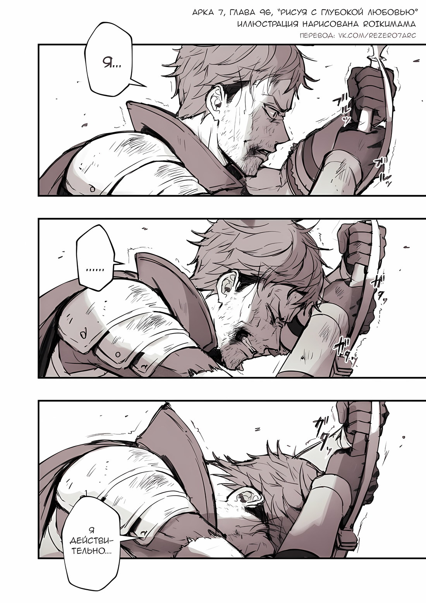
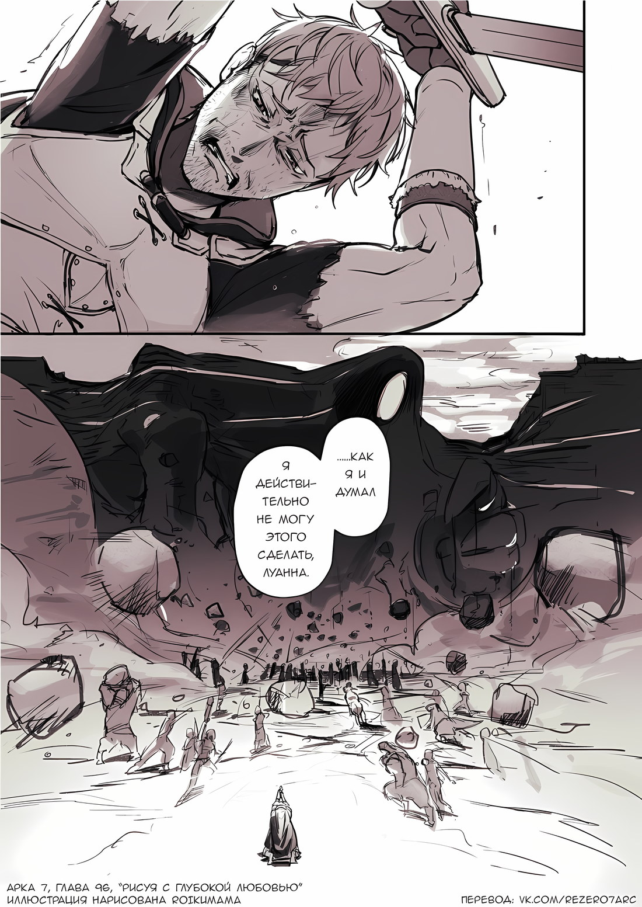
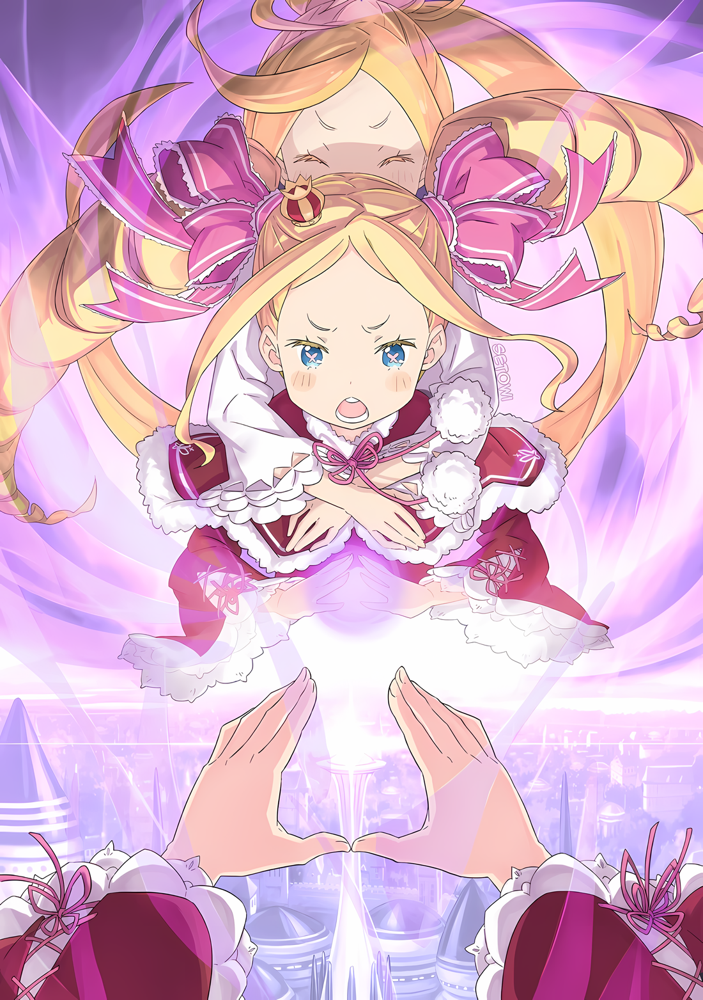
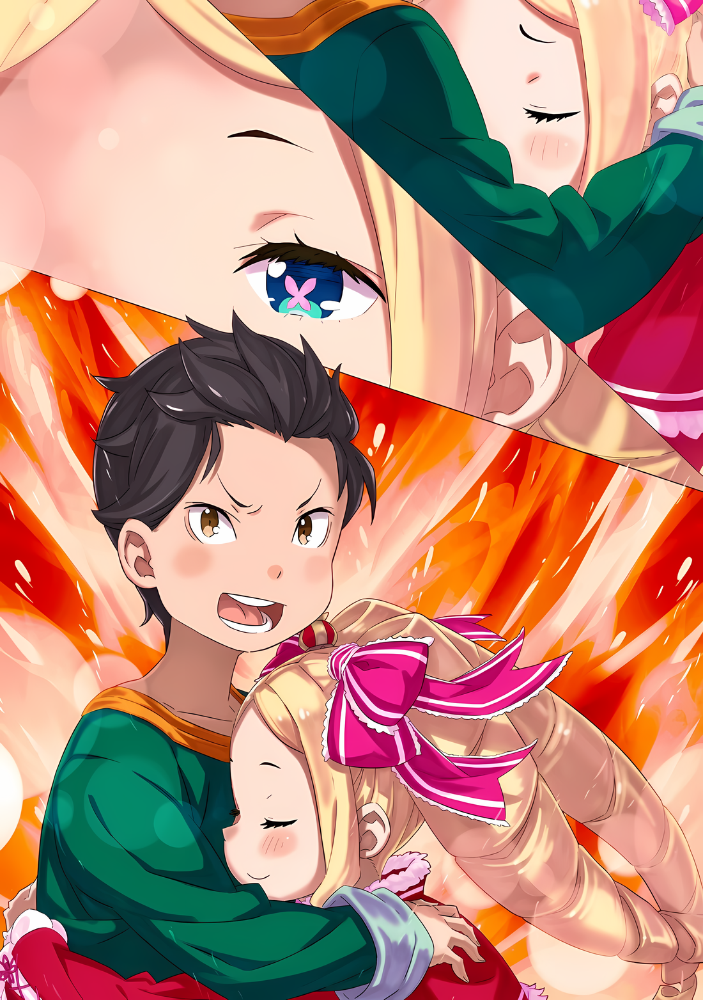
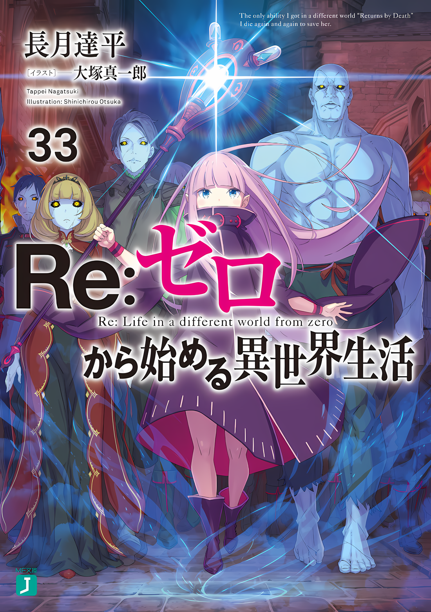

……Один из «Девяти Божественных Генералов», «Стальной», Могуро Хагане.

О том, что они не были истинными Стальными, было известно лишь немногим избранным даже в пределах Империи Волакия.

Изначально тела Стальных состояли из неорганических веществ, таких как минералы и металлы, и они рождались как существа в пространстве между людьми и предметами. Можно предположить, что Оружейники, чье тело состояло из металла, были расой, ответвившейся от Стальных, и многие аспекты их аномальной экологии были неясны.

Хотя они были не так редки, как полудраконы, Стальные отличались от человеческих племен не только внешним видом, но и менталитетом, поэтому в том смысле, что с ними было сложнее общаться, они превосходили полудраконов.

Существа, с которыми труднее установить контакт, чем с Духами, но с которыми можно общаться при наличии определенной подготовки, — таковы были Стальные.

Отныне, взойдя на вершину Империи в ранге Генерала Первого класса, а также будучи, как говорили, более легким в общении, чем другие члены «Девяти Божественных Генералов» с проблемами, Могуро был признан еретиком в рядах Стальных.

Однако на самом деле это было не так, и Могуро воспользовался своим внешним обликом, а также особой чертой, заключающейся в отсутствии связи с другими представителями Племени Стальных, и был существом, которое просто самопровозгласило себя Стальным.

Итак, что касается истинной личности Могуро Хагане, то Абел считал это абсолютной истиной.

……Он был уверен, что в этой решающей битве за захват столицы Империи Могуро станет самым большим препятствием.

△▼△▼△▼△

???: ……………

Подброшенный вверх ударом, охватившим все его тело, он встретился глазами с чрезвычайно могучим существом.

Сразу же после этого он получил еще один удар; он не мог избежать того, что будущее его жизни рассыпалось, и он был убежден, что наконец-то достиг конечного пункта назначения своей судьбы.

……Это было то, что должно было случиться.

???: Кхфа, акфа, фаф ……тц.

Его легкие, сдутые до предела, расширились, и эта боль вновь пробудила сознание Хейнкеля.

Его прерванное сознание вернулось, и первое, что он почувствовал, было ощущение твердой и большой опоры для спины…… это была земля. Поднятое в небо, его тело, которое должно было лететь по небу, оказалось на земле.

Осознание этого факта вызвало недоумение в его голове. По какой причине? Как? Что произошло?

Только в тот момент, когда его мозг осознал, что он все еще жив……

Хейнкель: Мой меч…

В пустой руке его тела, осажденного болью, не было ощущения рукояти меча. Даже когда его другая рука потянулась к поясу, в ножнах, висевших там, не было веса.

Повернув голову, Хейнкель увидел вдали от себя меч, воткнутый в землю под наклоном, и облегченно вздохнул.

То ли он исчез, то ли его потеряли, он почувствовал, как все его тело подпрыгивает, словно сердце охватило немыслимое чувство тревоги……

Хейнкель: ……Черт.

После того, как он прошел через все это, он начал ненавидеть себя за то, что переживал из-за потери меча.

Колебания его сердца в тот момент казались отображением его полубезумного «я».

Хейнкель: Только что……

По мере того как поводов для ненависти к себе становилось все больше, Хейнкель оторвался от своей отвратительной сентиментальности.

Он не был мертв. Он все еще жил. Однако это само по себе было странно.

В тот момент Хейнкель встретился взглядом с существом, представившимся одним из «Девяти Божественных Генералов», и в его адрес было направлено определенное намерение убить. ……Он ясно заявил, что убьет его.

По правде говоря, будучи запущенным в небо, а затем оттуда рассеянным другой атакой, с которой он ничего не мог поделать, жизнь Хейнкеля должна была быть потеряна.

По какой причине этого не произошло? В поисках ответа он огляделся вокруг……

Хейнкель: ……А?

Неосознанно прозвучал изумленный голос.

Однако это было само собой разумеющимся. То, что увидел Хейнкель, было достаточно абсурдным, чтобы это оправдать. Оно было слишком, слишком оторвано от реальности.

……С того места, где находился Хейнкель, мир был разделен надвое, и в нем разворачивались отдельные ады.

На правом небе массивные облака, образовавшиеся из ярко-красного пламени, застилали палящий мир.

На левом небе величественная фигура колоссального масштаба, облаченная в облака чистого белого цвета, расправила крылья, владычествуя над замерзшими землями.

Хейнкель: Горящее небо и белый Дракон……

Глядя на зрелище, которого не должно было быть, Хейнкель пробормотал в пустом изумлении.

Возможно, он ошибся, когда почувствовал, что не умер. От этого зрелища казалось, что Хейнкель уже умер, и именно поэтому он видит этот мир.

Хейнкель: ……Кх.

В мире, который выходил за рамки того, что он мог воспринять, мысли о желании уйти от реальности привели его в беспорядок.

То, что сделало это с Хейнкелем, заставив все его тело выпрямиться после лежания на земле, было черной тенью, внезапно надвинувшейся на него.

Он не хотел думать, что прямо над ним пролетел второй Дракон, но……

Хейнкель: Уааааааа… .!?

Взглянув на небо, Хейнкель закричал во все горло, когда увидел источник тени.

Над ним с огромной силой пролетел, вращаясь, огромный валун, который можно было принять за дом…… И даже не один или два.

Один за другим метательные камни аномального масштаба проносились над его головой, овеваемые чрезвычайно сильным ветром, они летели в ту сторону, куда были направлены его ноги.

А затем, в том месте, куда они летели……

Хейнкель: …………

Удар от столкновения потряс весь мир, и от него затряслись ягодицы Хейнкеля, отчего ему показалось, что земля яростно кашляет.

Поскольку выстрелы так же непрерывно раздавались, отдаваясь эхом при падении, Хейнкель в панике поднялся с места.

Тот, в кого постоянно целились эти валуны, нанося прямые удары один за другим, был фигурой ненормального масштаба…… это была сама стена.

Хейнкель: ……Могуро Хагане.

Это был один из девяти самых страшных людей в этой Империи, и, судя по тому, что он мог видеть, Хейнкель чувствовал это всем своим телом и душой.

Он посчитал что, то, что он увидел перед тем, как его сознание улетучилось, могло быть иллюзией или галлюцинацией из-за его страха, но это было ни то, ни другое.

……Большое тело, вероятно, превышающее десятки метров, буквально как третий бастион, который Хейнкель и остальные первоначально должны были захватить, преградило им путь, это был Могуро.

Да, совершенно буквально.

Возможно, именно такая ситуация существовала в этом мире, наиболее подходящая для слова «буквально».

В этом месте стена встала на колени, приняла форму голема и, используя в качестве рук и туловища тротуары с поднятой фермы, провела невероятную оборонительную операцию.

У ног этого массивного тела роились каменные големы, которых Хейнкель срубал, когда был в отчаянии, а удар гигантского кулака над их головами был подобен обрушению города.

Хейнкель: …………

В это массивное тело были нацелены большие валуны, которые незадолго до этого были обстреляны бесчисленное количество раз.

Это были как каменные ямы на пути к месту решающей битвы, столице Империи, так и камни, подготовленные из осыпавшихся скал крутых гор для осады.

Итак, продолжая отбрасывать их в сторону большого Могуро…… ими были те, кто ждал возможности напасть с тыла на крепость……

Хейнкель: ……Подчиненные Йорны Миссигр.

Точнее говоря, это были жители Города Демонов Хаосфлейм, которыми руководила Йорна.

Расы с рогами, ящеролюди, зверолюди и представители Многорукого Племени, они представляли собой смешанную силу без чувства единства, и была лишь одна общая черта, которая связывала их в единый строй.

……В глазах каждого из них горело красное пламя и высокий боевой дух — вот что их объединяло.

Это была группа, чей боевой дух горел в их глазах, и некоторые из них были способны поднимать невероятно большие валуны и бросать их на огромное расстояние.

Однако, даже если сказать, что Могуро получил прямое попадание от этих больших валунов, то суждение Хейнкеля было несколько сомнительным.

Конечно, от прямых ударов больших валунов, построенные Могуро стены и фермерские угодья разрушились и были разбиты. Однако, чтобы восстановить эти сломанные части, он превратил разбивающиеся о него валуны в следующие материалы, из которых было сформировано его массивное тело, и, конечно же, отбивал атаки.

Даже если смотреть издалека, бессмысленность этих атак была глубоко понятна.

Тем не менее, причина, по которой они не прекращали их бросать, была проста и ясна. ……Пока их атаки сдерживали огромное тело Могуро, другие повстанцы яростно атаковали.

Хейнкель: ……Глупости.

Хейнкель тоже слышал это. Что третий бастион имеет самую слабую защиту по сравнению с другими бастионами.

Однако это было до того, как Могуро воздвигся таким образом и начал использовать все свое массивное тело, чтобы преградить им путь. Несмотря на это, стратегия не была изменена, и повстанцы, которые решили уйти с других полей боя, сходились, и даже сейчас они продолжали наращивать свою военную мощь здесь.

Среди них было и Племя Судрак, с которым Хейнкель сражался бок о бок.

Хейнкель: Глупости.

Глубокие чувства Хейнкеля просочились наружу более отчетливым звуком, чем раньше.

Глупости. Это все нельзя было назвать иначе, как глупостью. Что еще можно было сказать? Смотреть направо или налево, вверх или вниз, вперед или назад…… ничего не было видно, кроме ада.

Что еще мог сказать Хейнкель?

Хейнкель: Вы… вы все сошли с ума… Все вы! Да что с вами со всеми творится!!!

Не успел он это осознать, как Хейнкель прыгнул к своему мечу, воткнутому в землю, чтобы ухватиться за него.

Приложив свой вес на рукоять меча, воткнутого в землю, он заскрипел зубами, подгоняя свои дрожащие колени. Что не так со всеми? Он не мог понять их менталитет.

Как он и думал, он не мог этого сделать. Он не мог этого сделать… он не мог этого сделать… он не мог этого сделать; он ничего не мог сделать.

Хейнкель: Какого черта, да что с вами со всеми……

В то время как Хейнкель бессильно опирался на свой меч, его горло слабо дрожало.

В окружении него, опустившего голову, мир сотрясался от пламени, Дракона и огромной армии. Неужели для него было таким грехом не сражаться против всего этого?

В таком случае……

Хейнкель: Я…

Это произошло сразу после того, как Хейнкель дал волю чувствам.

Раздался звук проворных копыт, и мимо него, топая по земле, пронеслась каштанового цвета лошадь Галевинд. Когда его красные волосы колыхнулись от ветра, Хейнкель поднял голову.

И тогда……

Хейнкель: …………

На мгновение Хейнкель обменялся взглядом с человеком с шарообразной прической, восседавшим на лошади Галевинд.

Это был Зикр Осман. Работая правой рукой Абела, отдавая приказы повстанцам из крепости, будучи одновременно «Генералом» Империи, он принимал участие в восстании против страны.

Сам он заявлял, что его боевое мастерство владения мечом оставляет желать лучшего, а с точки зрения Хейнкеля, его индивидуальный военный потенциал действительно трудно подсчитать, но он обогнал Хейнкеля.

……Когда Зикр пронесся мимо него, он бросил презрительный взгляд на Хейнкеля, согнувшего колени.

Хейнкель: Я действительно……

Миновав Хейнкеля, склонившего колени, лошадь Галевинд устремилась к полю боя.

Словно следуя за величественной фигурой Зикра, повстанцы, собравшиеся с разных фронтов, устремились вперед. Они устремились к крепостной стене Могуро Хагане.

Наблюдая за ними, Хейнкель все еще продолжал опираться на свой меч, не в силах пошевелиться.

И так как он не мог двигаться……

Хейнкель: ……Как я и думал, я действительно не могу этого сделать, Луанна.

rezero7arc | Арты от roikumama

△▼△▼△▼△

Когда он догнал красноволосого мечника, который преклонил колено на поле боя и повесил голову, словно его боевой дух был подавлен, в голове Зикра Османа промелькнуло сочувствие к тому, что он следует естественному ходу жизни.

Отважная женщина алого цвета, представившаяся как Присцилла Бариэль, смело приняла участие в этом восстании. Мечник, участвовавший в войне в качестве ее последователя, скорее всего, даже не принадлежал к Империи.

Было слишком жестоко навязывать такому человеку, как он, образ жизни Империи, согласно которому люди Империи должны быть сильными.

Зикр: Вряд ли можно сказать, что я сам следую этому образу жизни.

С мечом в руке, Зикр самодовольно покачивался на спине своего любимого коня, Лейди.

Сейчас он притворялся храбрецом, но Зикр занял место «Генерала» во многом благодаря силе, накопленной предыдущими поколениями Дома Османов.

Если бы Зикр не принадлежал к роду военных, ему, как и другим солдатам, пришлось бы пройти путь от рядового, то он, не владея мечом, скорее всего, не смог бы добиться успеха в жизни.

Не то чтобы он сетовал на это. Конечно, Зикр был человеком Империи.

Поэтому он размахивал мечом на передовой, и когда он впервые взмахнул им, его сердце жаждало, чтобы он существовал, напоминая «Девять Божественных Генералов», которые могли бы изменить военную ситуацию.

Однако, чтобы убедиться, что никто не сможет занять место Зикра, он снова превратил это желание в свое личное дело.

Поэтому……

Зикр: ……Я Генерал Второго класса Империи, «Трус», Зикр Осман!!!

Повысив голос до громкого звука, его любимый конь галопом пронесся по полю битвы, где произошла огромная перемена.

В большинстве случаев Лейди привыкла к легкому бегу как для прогулок, так и для военных кампаний, однако на этот раз она смогла угадать, что чувствует Зикр, поэтому показала лучший бег в своей жизни.

Увидев, как его любимая лошадь так смело бежит, совершенно не испытывая страха и тревоги, Зикр мог только снова влюбиться.

Чрезмерно красивый спринт Лейди проигнорировал непривычную военную речь Зикра и разжег пламя в сердцах многих повстанцев, когда она продолжала мчаться.

Зикр: Светящиеся на правом крыле! Оруженосцы на левом! Всем двигаться в соответствии с приказом! Все остальные, следуйте за мной! Мы победим «Стального», Могуро Хагане!

Все: ЕСТЬ!!!

Услышав приказ Зикра, собранные военные силы с ревом бросились на Могуро. Валуны, пролетавшие над головой, бросали солдаты-добровольцы ради прикрытия, солдаты, которых Йорна очень любила.

Если бы они привлекли внимание Могуро, и в командовании каменных големов возникли бы помехи, а главное, если бы заряд Зикра и остальных достиг своих целей, их главная цель была бы успешно достигнута.

???: ПЛИ!!!

Вдалеке послышался доблестный крик, и выпущенные стрелы обрушились на каменных големов, преграждающих путь, сшибая их на землю.

Начавшаяся издалека, открывшаяся по приказу Зикра дистанция, была подавляющим проявлением наступательных способностей с помощью Племени Судрак и мятежников, искусных в стрельбе из лука.

Он принял прикрытие от прекрасных и пылких женщин и двинулся вперед. Боевое построение, которое эти женщины предусмотрительно спустили вниз, казалось слишком хорошим, чтобы быть правдой, поэтому Зикр сжал коренные зубы.

Зикр: Нет, если что-то настолько хорошо, чтобы быть правдой, то это благословение.

Крепко сжав меч и глядя на его вытянутое лезвие, Зикр слегка разжал уголки губ.

Перед самым отъездом, Зикра благословила та милая девушка, чьи глаза внушали благоговение…… словно взгляд, проживший немыслимое для Зикра количество времени, она милостиво ответила на его мольбу.

Не то чтобы Трус был потрясен.

Просто, думая о долге, который он должен выполнить сам, Зикр пожелал благословения. Даже если шанс был невелик, он хотел положиться на свои суеверия.

???: Генерал Второго класса Зикр! Пожалуйста, отступите! Здесь мы сами справимся!

Зикр: Не говори ерунды! Здесь нет пути к отступлению! И совершенно неуместно отступать! Я тоже пойду вперед!

???: ……Кх

Сидя на своем коне Галевинд он покачал головой в ответ на призыв солдата, мчавшегося рядом с ним; Зикр не отказался бы от своего долга.

На мгновение подчиненный попытался что-то сказать, но не стал мешать решимости Зикра. Благодарный за такое внимание, он крепко, крепко сжал поводья.

???: Ха! Подумать только, что Генерал Второго класса Зикр Осман, «Бабник», отправится на передовую!

Затем, напротив подчиненного, скачущего рядом с ним, их догнала фигура, мчащаяся с той же скоростью, что и лошадь Галевинд. Присмотревшись, можно было заметить, что он носит повязку на глазу, это был солдат с двумя мечами — Джамал О'Рейли.

Он стал военнопленным во время падения Города-крепости, и после этого, поскольку он проявил сильную лояльность к Его Превосходительству Императору Винсенту Волакии, его взяли под командование Зикра в качестве мечника.

Зикр: Рядовой Первого класса Джамал, каково положение?

Джамал: Лучшее, бляха! Куда бы я ни посмотрел, налево, направо или прямо перед собой, там хренова туча врагов! Полный кайф!

Зикр: Ах, действительно великолепно. Это честь Имперского солдата. Я намерен сместить Генерала Первого класса Могуро с места «Восьмого», так что следуй за мной.

Джамал: Только если вы прикажете! Если хотите, я могу проежиться туда и расчистить путь!

На его лице появилась беззлобная, но обаятельная улыбка, и после этих слов Джамал ускорился. Он легко обогнал скорость Лейди и ринулся прямо на группу каменных големов прямо перед ними.

В момент, когда он бежал около него, Зикр подумал, что его храбрость надежна и почувствовал себя виноватым за то, что взял его с собой. ……Однако он тут же отбросил эти колебания.

Он выполнит то, что должен был сделать, в этом самом месте.

Об этом его попросили, и не кто иной, как сам Зикр, желал удовлетворить эти просьбы.

Оставалось только……

Зикр: ……Ваше Превосходительство, вы вольны поступать, как пожелаете.

Действительно, это было практически в то же время, когда Зикр возносил молитву.

……Кристальный Дворец столицы Империи Рапганы… Магические Кристаллы на его вершине начали светиться.

△▼△▼△▼△

……В решающей битве за столицу Империи было несколько человек, которые закрашивали картину, нарисованную Абелом.

Одной из них была Присцилла, которая присоединилась к битве на первом бастионе, с которым столкнулась Йорна Миссигр.

Одним из них был Отто, который, используя свою Божественную Защиту, продемонстрировал способность собирать информацию о деталях военной ситуации.

Одним из них был Гарфиэль, который вместо того, чтобы оказаться в тупике с Кафмой Ирулюксом, смог сокрушить его.

Одной из них была Эмилия, которая разозлила Мэделин Эшарт больше, чем предполагалось, и заставила ее призвать «Облачного Дракона».

И все же, даже если это и внесло некоторые изменения в окраску картины, нарисованной Абелом, это не были происшествия, сильно изменившие ее окончательный вид.

Если один из Пяти Бастионов, расположенных на остриях звездообразных стен, защищавших столицу Империи, будет прорван, то можно будет одержать победу, даже если остальные бастионы окажутся в безвыходном положении.

Для того, кто рисовал картину, главной причиной, по которой она не могла быть поколеблена, что бы он ни делал, был Могуро Хагане…… Нет, это был «Метеор», который управлял Кристальным Дворцом, сердцем Империи Волакия.

Кристальный Дворец, который мог похвастаться красотой и выдающимся статусом в мире, Магические Кристаллы, составлявшие кристальную часть дворца, были особенно чисты даже среди магических камней, и это превращало сам дворец в оружие для нападения на внешних врагов.

Мана, хранящаяся во дворце, могла быть пропущена через Магические Кристаллы, расположенные повсюду в здании, чтобы усилить ее, а затем выпущена через «Магическую Кристальную Пушку», установленную на самом верхнем уровне Кристального Дворца.

Эта сила была способна вызвать разрушения, достаточные для уничтожения целого города; она использовалась за сотни лет до этого, по преданиям, ее целью было «Великое Бедствие».

Отныне Магическая Кристальная Пушка дворца столицы Империи оставалась лишь легендой, но с тех пор, как стало известно о существовании настоящей пушки, ее стали реставрировать, чтобы сделать возможным ее использование, и угроза была восстановлена.

По иронии судьбы, эта Магическая Кристаллическая Пушка стала клыком, направленным на самого Абела, но пока она существовала, присутствовала большая вероятность того, что военная ситуация решающей битвы в столице Империи может быть легко перевернута.

Поэтому, несмотря ни на что, было необходимо, чтобы Магическая Кристальная Пушка выстрелила.

Это не было решающим ударом, чтобы изменить военную ситуацию, но было частью ущерба, принятого во внимание.

Для этого……

Абел: ……Ты решил дезертировать и убежать, Зикр Осман?

Именно так спросил Абел у Зикра, который сел на своего коня и направился к полю боя третьего бастиона.

У Зикра был выбор. Управляя повстанцами, которые решили отойти от сражений на других бастионах и сойтись на третьем бастионе, подняв свой боевой дух, столкнувшись с массивным телом Могуро, преградившим путь, он мог дезертировать с этого фронта.

Однако Абел догадывался, что он, скорее всего, этого не сделает.

Было ли это из-за благоразумия Зикра, как «Труса», который боялся даже малейшей возможности того, что его цель не будет выполнена, или, возможно, потому что он был одним из храбрых и праведных членов Имперской армии?

Что бы это ни было, Абел не был Зикром, а значит, не мог предположить.

Однако, какова бы ни была причина его решимости, Абел не стал бы препятствовать ей.

Жизнь или смерть Зикра была позицией, которая не имела окончательного влияния на картину, нарисованную Абелом.

Если говорить в масштабе вещей, то в конечном итоге, в рамках его картины, даже жизнь или смерть самого Абела……

???: ……Докладываю со смотровой площадки! Магическая Кристальная Пушка пришла в действие!

Абел: …………

???: Ее цель — третий бастион!!!

Раздавшийся по всей твердыне громогласный голос стал доказательством того, что цель Абела была достигнута.

Магическая Кристальная Пушка выстрелила в него. На третьем бастионе, то есть на поле боя Могуро, который превратился в стену, скорее всего, одним махом уничтожили бы повстанцев.

Но даже если бы это произошло, то пока истинное тело Могуро в Кристальном Дворце продолжало существовать, ни «Стальной» Могуро Хагане не будет побежден, ни третий бастион не будет преодолен.

Однако столица Империи потеряла бы огневую мощь Магической Кристальной Пушки, которая была способна переломить любую военную ситуацию.

Все было сделано ради этого, ведь это было нарисовано на его картине.

Поэтому……

???: ……На линии огня Магической Кристальной Пушки происходит что-то необычное!!!

Абел: ……Что?

……В тот момент, когда его план удался, это сообщение было инцидентом, полностью выходящим за рамки воображения Абела.

△▼△▼△▼△

……В решающей битве за столицу Империи было несколько человек, которые закрашивали картину, нарисованную Абелом.

Одной из них была Присцилла, которая присоединилась к битве на первом бастионе, с которым столкнулась Йорна Миссигр.

Одним из них был Отто, который, используя свою Божественную Защиту, продемонстрировал способность собирать информацию о деталях военной ситуации.

Одним из них был Гарфиэль, который вместо того, чтобы оказаться в тупике с Кафмой Ирулюксом, смог сокрушить его.

Одной из них была Эмилия, которая разозлила Мэделин Эшарт больше, чем предполагалось, и заставила ее призвать «Облачного Дракона».

А затем……

???: ……Невозможно.

Вдали, за громадными, изгибающимися городскими стенами Могуро Хагане, возвышался Кристальный Дворец, самое сердце любимой столицы Империи и символ власти Империи Волакия.

На вершине этого прекрасного дворца лишь немногие знали об этом оружии, и, по сути, даже «Генерал» не знал о существовании Магической Кристальной Пушки, пока не услышал о ней от Абела.

Зикр Осман рисковал своей жизнью, чтобы заставить их сделать осечку, чтобы единственный, драгоценный выстрел из этого решающего оружия, которое, если выстрелит, рассечет горизонт и полностью переломит ход битвы.

Пробегая на своем любимом коне через линию фронта, он громко заявлял, что у них есть шанс выиграть битву, и, сплачивая повстанцев, призывал их к поддержке, чтобы заставить пушку с Магическим Кристаллом сосредоточиться на них.

Все это делалось для того, чтобы ввести их в заблуждение и заставить поверить, что это лучшая возможность внести решающие изменения в ход битвы.

Поэтому, как только вершина Кристального Дворца засветилась, Зикр был уверен, что выполнил задачу.

В его голове пронеслись образы матери, старших и младших сестер…… женщин, сыгравших столь важную роль в становлении его собственного «я», и он даже улыбнулся тому, насколько они были похожи на него.

Слишком прекрасная молитва, чтобы позволить ей умереть в своих объятиях, смерть, которая должна была наступить мирно, но сменилась изумлением перед широко раскрытыми глазами Зикра.

Из-за……

Зикр: ……Мисс Беатрис?

△▼△▼△▼△

Беатрис: Я знала, что так будет.

Беатрис бормотала про себя, находясь в свободном падении, ее платье и длинные вьющиеся волосы развевались в воздухе.

Когда перед ней предстал Зикр, который пришел в палатку Беатрис и остальных, чтобы попросить ее благословения как воина, она нутром почувствовала, что он намерен умереть.

Четыреста лет назад, во времена постоянных войн, было много людей с таким же взглядом в глазах.

Тогда Беатрис не могла обратиться к ним. Некоторые не хотели, чтобы к ним обращались, а некоторые не знали, как к ним обращаться.

Возможно, даже если бы Беатрис вернулась в то время снова, трудно было бы представить, что она могла бы подойти к этому лучше.

Конечно, она снова испытала бы ту же беспомощность, глядя, как они идут на смерть.

Но это……

Беатрис: ……Нет причин делать то же самое сегодня, я полагаю.

???: Аа, у!

С характерным рисунком, глаза Беатрис смотрели вперед, а сзади стояла маленькая девочка, держащая ее тонкие плечи, как будто она крепко обнимала ее.

Беатрис не простила маленькую девочку с золотистыми волосами и голубыми глазами.

Это было правдой, что ее действия, неизвестные ей самой, сделали несчастными многих людей.

Но все же, на этот единственный миг, она задумалась.

На этот единственный миг она поверила в какое-то другое чувство, отличное от «Наивности» Нацуки Субару.

Беатрис: …………

Беатрис и маленькая девочка Луис были высоко в небе, даже выше городских стен.

После серии «Телепортов» на короткие расстояния, как будто не имея других средств, она привела Беатрис в это место, как бы доказывая свою состоятельность.

Только что Луис продемонстрировала свои достоинства.

В таком случае, Беатрис была следующей, кто ответит на эти действия.

Беатрис: Бетти просто видит сердитые лица всех присутствующих.

Сердитые… или, возможно, обеспокоенные, но, в конце концов, все равно сердитые.

Ее губы внезапно расслабились, когда перед ней возникли любящие лица ее спутников.

Но выбора не было. Потому что Беатрис……

Беатрис: Бетти — партнер Субару, я полагаю.

В тот момент, когда она пробормотала эти слова, весь прекрасный дворец, видимый издалека, засиял ослепительным светом, настолько ярким, что он был способен изменить форму мира, нацелившись на повстанцев, которые по прямой линии продвигались вперед по земле.

Зикр и его люди, возглавлявшие наступление, были бы охвачены выстрелом, который оказался бы для них слишком разрушительным. Прервав линию огня вместе с Луис, Беатрис сцепила руки перед грудью.

И тогда……

Беатрис: ……Аль Шамак.

rezero7arc | Иллюстрация к **Ранобэ** Том 32 | Разукрасил set0wi

……Тогда измерение, поглотившее свет, который изменил бы мир, открылось, а затем, через некоторое время, закрылось.

△▼△▼△▼△

Сколько было тех, кто мог правильно понять события того момента?

По правде говоря, если бы все произошло так, как обрисовал Абел, ущерб был бы огромен, даже если бы он был в пределах ожидаемого, воздействие, которое он оказал бы на тех, кто сражался на других бастионах, было бы неизмеримо.

Однако Магическая Кристальная Пушка не нанесла того урона, который должна была нанести, и Зикр Осман, готовый пожертвовать собой, продолжил с той же энергией сражаться с ордой каменных големов.

Спуск «Облачного Дракона» Мезореи и битва Эмилии с притащившей его Мэделин продолжалась, а нестареющий мастерством «Порочный Старик» Ольбарт загонял Гарфиэля в угол.

Йорна, «Чрезвычайно Яркая», и Присцилла, мать и дочь, были вынуждены вступить в жестокую схватку с «Пожирательницей Духов» Аракией, которая решила все перетряхнуть ради достижения собственных целей. Отто и Петра, которые планировали установить контроль над полем боя и, по сути, частично добились этого, противостояли злу вместе с Медиум.

Существенного влияния на состояние этих сражений не было.

Просто возможность того, что состояние этих сражений существенно изменится в неблагоприятную сторону, теперь была потеряна.

В обмен на это грандиозное достижение……

Луис: Уа! Аау! Ауу!

Присутствие маленькой девочки на руках Луис исчезало, пока она спускалась по воздуху в крепких объятиях.

Это было в буквальном смысле слова зрелище, как фигурка девочки постепенно исчезает. Как бы отрицая это, Луис обняла девочку… Беатрис, но это не помогало.

Как будто рассыпаясь в воздухе, тело Беатрис вот-вот превратится в свет.

Луис: Аа! Аа… Аааа!

Крича, Луис изо всех сил пыталась отрицать ситуацию, происходящую на ее глазах.

Но никакие причитания и крики не могли остановить разрушение существования Беатрис.

Чтобы спасти жизни многих людей, она выпустила в потусторонний мир свет разрушения.

В качестве компенсации за эту подавляющую силу, существование Беатрис стало рассеиваться. Даже если бы кто-то протянул пальцы к свету разрушения, их бы не остановила плоть, они бы прошли бы сквозь него.

Луис: Аа……!!!

Со слезами, наворачивающимися на ее потухшие, широко раскрытые голубые глаза, Луис закричала.

Кричала и кричала, хотя крики не помогали, она кричала отчаянно.

Она больше ничего не могла сделать, и она не могла найти ничего другого, что она могла бы сделать, поэтому она кричала.

И так она неистово кричала… кричала и все кричала……

Луис: ……А?

Крупные слезы свободно рассеялись в воздухе, а затем Луис повернулась.

Все еще обнимая Беатрис, она смотрела не на нее, что вот-вот исчезнет, не на небо, которое стало белым, не на небо, которое стало красным, не на землю, где многие люди кричали в гневе, но в этот момент, забыв обо всем, что составляло поле битвы, она смотрела вдаль.

И затем она прыгнула в ту даль.

Луис: У……

Расстояние, на которое она могла прыгнуть за один раз, составляло около десяти метров; при последовательном повторении прыжков ее органы напрягались, как будто их сдавливали, но ей было все равно.

Взяв на себя все бремя, которое должно было лечь на Беатрис, Луис прыгала.

Она прыгала, прыгала, прыгала, прыгала, прыгала, прыгала, прыгала, прыгала, и наконец……

Луис: …………

Достигнув земли, она упала вперед, как бы скрючившись. Не обращая внимания на общую вялость своего тела, Луис подняла невероятно легкую девочку на руках перед собой.

Беатрис, само существование которое пропадало, была вытянута вперед.

А затем……

Луис: Уау….

???: ……Да уж. Вы оба повели себя слишком безрассудно.

И вдруг раздался вздох, похожий на горький смех, и девочку выхватили из протянутых рук. ……Нет, ее не отняли. Ее бережно подняли на руки.

Затем тело Беатрис обмякло перед глазами стоящей на коленях Луис.

Именно там, в объятиях черноволосого мальчика, который был рядом, он нежно, бережно, крепко держал ее.

Приняв эти объятия, явно полные любви, девушка, выполнившая великую задачу, дрогнула веками, обрамленные длинными ресницами, а затем медленно открыла глаза.

Они замерцали характерным рисунком……

Беатрис: ……Ты оставил меня в таком беспокойстве.

???: Да, я тоже тебя люблю.

На этот шепот глубокой любви он ответил такой же гордой глубокой любовью, и руки, которые должны были воссоединиться, наконец соединились.

Мальчик рассмеялся перед Луис, которая наблюдала за этим из первого ряда и тихонько выдохнула.

Он засмеялся и сказал……

???: Ну что, начнем? ……Давай же, о неизбежная судьба!

rezero7arc | Иллюстрация к **Ранобэ** Том 32 | Разукрасил V!c.ll2o

※※※※※※※※※※※

**Re:Zero. Жизнь с нуля в альтернативном мире**

Арка 7: Страна волков

Том 33 (ранобэ)

Файл оформлен telegram-каналом: https://t.me/rezeroranobeandwebnovel

Дополнительная редактура: djoenfoej

**Описание**

*В кульминационный момент решающей битвы за столицу Империи Нацуки Субару и его гладиаторы наконец вступают в бой за Империю Волакия, врываясь на поле боя с запада. На каждое поле боя одно за другим прибывают подкрепления, перекраивая поле битвы, и вот уже не за горами время развязки — два императора, истинный и ложный, сталкиваются в Кристальном Дворце. Ради общей цели оба Винсента готовы отказаться от трона. По мере приближения судьбоносного момента, о котором говорил Звездочет, раскрывается истина заговора, охватившего всю Волакию, и Великого Бедствия, пришедшего извне…*
