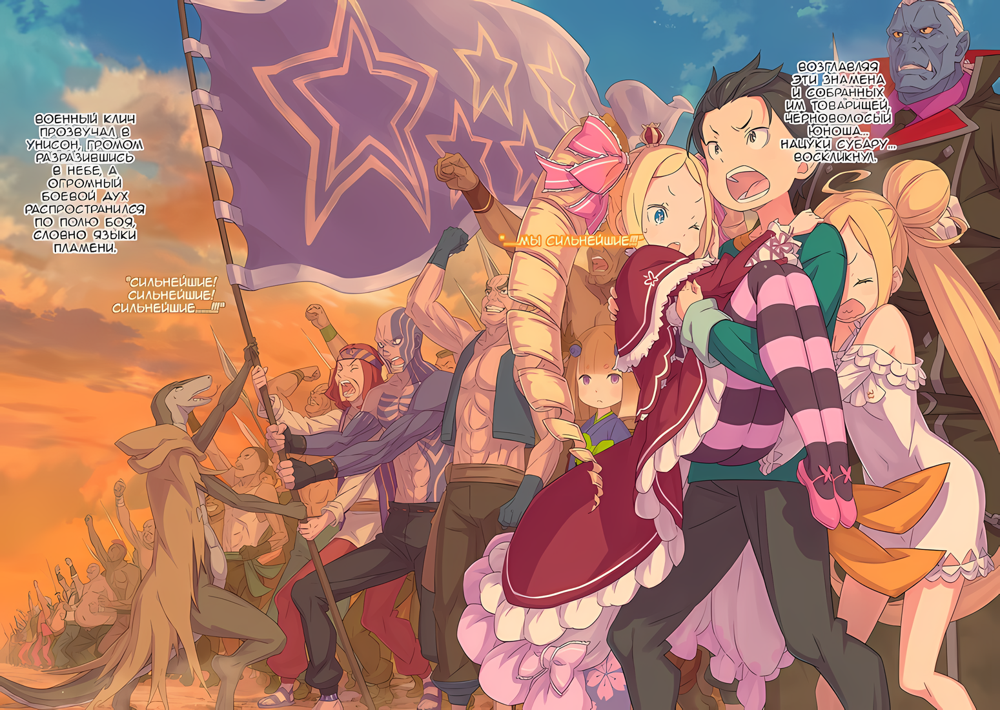

……Королевство Лугуника, Империя Волакия, Священное Королевство Густеко и Города-государства Карараги.

……Каждая из четырех основных стран, обычно называемых Четырьмя Великими Государствами, развила свою собственную культуру, которая была приспособлена к ее земле; наиболее примечательно, что в Королевстве Лугуника царит дух дракона, а в Священном Королевстве Густеко — вера в Искусство Духа. Четыре основные страны шли разными путями, как будто специально.

Это касалось не только национальной культуры и стиля, но и качества «Воинов».

В Империи Волакия «Магия» почти не развивалась.

Врата и другие необходимые условия в их телах ничем не отличались от таковых в других странах, независимо от того, пересекали они границу или нет, но по сравнению с Лугуникой и Карараги, Империя сильно отставала от других в этой области.

Империя, однако, не принимала этот факт близко к сердцу.

Конечно, отставание от других стран в любой области не приветствовалось, но тот факт, что область магии не развивалась, означал, что вместо нее развивались другие области.

По сравнению с технологическим мастерством Городов-государств Карараги, Искусствами Духа и проклятиями Святого Королевства Густеко, а так же магическими дисциплинами Королевства Лугуника, Империя Волакия превосходила всех в боевых искусствах.

«???: Иногда быстрее просто налететь и ударить, чем использовать магию, верно?»

И, хотя это утверждение, не относящееся к Пользователям Духовных Искусств, можно было полностью подтвердить, это было близко к общему отношению к магии в Империи Волакия.

Хотя это было крайне неправильно понято и вроде как не оговорено, использование маны в человеческом теле не ограничивалось только применением магии.

На ней было основано небольшое количество техник боевых искусств, так же как она использовалась в Искусствах Духа, Искусствах Проклятия и в активации некоторых «Метеоров».

Использовать ману для укрепления собственного тела было совершенно естественно, особенно для элитного воина.

Порой, если обладатель неестественных физических способностей сравнивался с обычными людьми, хитрость заключалась в управлении маной, циркулирующей в теле…… техника, называемая «Методом Потока», которая выполнялась сознательно.

Однако……

???: Ча-ча-ча-ча!

Со стуком, только одна нога коснулась земли, и в одно мгновение расстояние сократилось на дюжину метров.

Если следить за фигурой со стороны, то могло показаться, что время было остановлено его необычными движениями тела, но это не было иллюзией.

Это была аномалия, синеволосый мальчик, который бежал через поле боя.

Согласно объяснению, данному непосредственно перед этим, его бег, который без труда преодолевал человеческие ограничения, должен был быть результатом «Метода Потока». Однако мальчик с острым взглядом не проводил никаких записей о днях, проведенных за изучением подобных техник.

В мире редко встречались такие существа. ……Тут были те, кто рождался, неосознанно используя «Метод Потока», о котором гласили, что этот способ является одним из высших боевых искусств, что оставлял позади существ, охваченным естественным законом.

Сбежав по склону холма на одном дыхании, мальчик бросился на поле боя в поисках чести первого удара.

Хотя……

Синеволосый мальчик: Если битва уже в разгаре, честь первого удара — это ничто, однако не будем беспокоиться о деталях!

Он ворвался на поле боя из западных земель и посмотрел на великую армию, окружавшую вдалеке стены в форме звезды. Раскосые глаза юноши пылали и были влажными от возбуждения, которое никогда бы не ощущалось на поле боя, где горе и радость сменяли друг друга.

Существо, идущее в бой без надлежащих доспехов без какой-либо причины — поступало варварски, такое действие могло быть расценено враждебно как внутри, так и за стенами; теми, кто хотел защитить нынешнюю Империю, и теми, кто хотел ее уничтожить.

Однако……

Синеволосый мальчик: Высокий уровень амбиций — момент, заслуживающий внимания. С ним или без него, привлекательность речи, которая льется из ваших уст, меняется. Просто……

???: Чего!?

В красном снаряжении и грубых доспехах, происходили стычки между небольшими группами по несколько десятков человек, которые явно враждовали друг с другом. В одну из сторон, вмешался мальчик, и солдат с мечом вскрикнул одно слово.

Восхитительно четкий тон голоса, смесь гнева, разочарования, возбуждения, но с преобладанием боевого духа. Это был умный ход, призывающий к осторожности в отношении незваного гостя на поле боя.

Синеволосый мальчик: ……Он смертельно медленный!

???: Кт……

Кричать было правильным выбором, однако останавливаться и спрашивать что-либо — нет.

Правильно было считать врагом любое существо, появившееся на поле боя, не раскрыв своей верности. Солдату следовало не только оповестить окружение, но и рубить на звук голоса.

Тем не менее, враг был быстрее, и если бы понадобилось, он мог бы указать на десять или двадцать других недостатков.

Синеволосый мальчик: О, и если то, что ты сейчас хотел сказать, было вопросом о моей принадлежности, потому что ты понятия не имел, кто я такой, тогда я прошу прощения за то, что был слишком молниеносен, я бы ответил.

Солдат, открыв побелевшие глаза, опустился на землю позади безостановочно болтающего мальчика. Когда они проходили мимо друг друга, он вогнал руку, похожую на острое лезвие, в его шею. Он ожидал, что сможет отрубить ему голову, но удар оказался недостаточно сильным.

Встряхиваясь и размахивая руками, он крутил головой, чувствуя, что что-то не так.

Синеволосый мальчик: Так обидно, когда ты чувствуешь, что можешь что-то сделать, но не можешь. Не то чтобы я планировал смешивать свои идеалы и желания с тем, что реально осуществимо. Ну, если я случайно позволю ему умереть, я упаду в оценке Босса, так что будем считать это хорошим результатом.

Сразу же после того, как он стряхнул с себя легкий дымок, фигура смеющегося мальчика исчезла.

Мгновение спустя он уклонился от удара меча, обрушившегося на его позицию, и тыльная сторона сандалей ударила солдата по лицу, отбросив его в противоположную сторону. Отпрыгнув от солдата, благодаря такому удару, он приземлился позади другого солдата, поразив каждую из его жизненно важных точек одним ударом, прежде чем уединиться…… для того, чтобы проскользнуть прямо в следующую группу, отрезав сознание еще пяти или около того. Все это произошло в мгновение ока.

И последующие действия, и основная цель были преступным актом, чтобы лишить окружающих солдат времени.

Другими словами, мастерство этого мальчика над собственным телом было за пределами человеческого понимания и не могло быть достигнуто с помощью грубой силы…… можно назвать это высшей линией боевых искусств, развитых в Империи Волакия.

Конечно, никому не было так просто проанализировать подобную ситуацию на поле боя или смириться с тем, что ребенок двенадцати или тринадцати лет может быть способен на такое.

Прежде всего……

Синеволосый мальчик: ……Как нетактично.

???: …………

Синеволосый мальчик: Нетактично пытаться подорвать мастерство и внешность звездного актера во время его выступления. На сцене не нужно ничего другого, кроме восхищения, восторга и очарования. Конечно, если бы я хотел подняться на сцену таким же образом, мне пришлось бы добиваться более яркого внешнего вида с помощью соперника…… достойного…

Группа застыла, глядя на мальчика, хмуро взирающего на окружающую обстановку в центре медленно распадающейся Имперской гвардии.

Солдаты, которые должны были сцепиться оружием и сражаться за свою жизнь, с обеих сторон были ошеломлены присутствием мальчика и потеряли не только свое время, но и жизни.

Синеволосый мальчик: Достойного благословения актера……

Лишать других жизни. Мальчик получал определенное удовлетворение от этого ощущения.

Пока он наслаждался чувством выполненного долга, среди множества поверженных солдат, лишенных жизни в противостоянии с Имперской гвардией, был один плохо вооруженный воин, который открыл рот и сказал: «Ты».

Солдат: Откуда этот пацан? Он один из наших?

Синеволосый мальчик: Хмхмхм, на чьей я стороне? Неплохой вопрос. Как ты думаешь, кто я? Друг или враг?

Солдат: …………

Воин замялся, когда на его вопрос ответили другим вопросом в такой манере, что его невозможно было побеспокоить. Улыбка мальчика стала еще глубже, и он покачал головой: «Нет, нет».

Синеволосый мальчик: Я не дразню тебя. Просто я тоже серьезно об этом думал. Я постоянно думаю об этом. Я не слушал Босса, так что я не знаю, кто на моей стороне.

Солдат: А?

Синеволосый мальчик: Так что пока что я буду выступать в роли глашатая правосудия для обеих сторон.

Глаза солдата закатились, затем его изумленное лицо расплылось по сторонам, и в следующий момент он перевернулся на землю.

Фигура ухмыляющегося мальчишки заметалась, и на этот раз он проскользнул в группу воинов, сражавшихся с только что поверженными Имперскими солдатами, яростно скосив их.

Когда синие волосы заплясали, а звук резких ударов, казалось, эхом разнесся по воздуху, сознание воинов было стерто без единого горького крика. Эта жестокость была подобна буре…… Нет…

???: «Синяя Молния»……

Синеволосый мальчик: О, чудесно. Именно таким псевдонимом я и думал себя назвать.

Воин, у которого от шока перехватило дыхание, к концу этих слов потерял сознание.

Это была волакийская манера отвечать одинаково жестоко как на дружеское, так и на враждебное отношение… Впрочем, эта дикость, возможно, заставила бы даже Императора этой страны поднять брови.

Никто не был способен остановить мальчика.

И все же это оставалось абсолютно правильным поступком, согласно Имперскому укладу.

???: УААА!

Воины поздно отреагировали на угрозу, исходящую от этого маленького вихря, похожего на мальчика.

Больше не было различий между Имперскими солдатами и повстанцами, все были едины в мысли остановить этого мальчика. В каком-то смысле это была сцена великого достижения — остановить гражданскую войну в одиночку, хотя бы на этом небольшом пространстве.

Однако стальная решимость этих героев не встретила мирного ответа.

Наклонись назад, чтобы избежать взмаха клинка. Отступи назад, чтобы избежать удара рукой. Проскальзывай между ног, чтобы избежать ударов топоров. Уклоняйся от стрел, уклоняйся от копий, уклоняйся от клыков, уклоняйся от щитов, уклоняйся, уклоняйся, уклоняйся, уклоняйся, уклоняйся, уклоняйся, уклоняйся, уклоняйся, уклоняйся, уклоняйся, уклоняйся, уклоняйся, уклоняйся….

???: Безоружный……

Синеволосый мальчик: Да, это довольно затруднительное положение. Я бы хотел приукрасить свои позы, показав свое мастерство оружием, а не голыми руками, но я не хочу использовать что-то полукустарное. В конце концов, лучшие знают только лучшее. Ах, гляньте-ка, я говорю точь-в-точь как Босс.

???: Босс…?

Синеволосый мальчик: Верно. Он — лидер нашего Батальона Плеяд!

Улыбка мальчика стала еще глубже, когда он похвастался, легко уклоняясь от брошенного на него убийственного намерения и враждебности. Незнакомое слово, произнесенное его устами, наполнили воинов чувством необъяснимого страха.

Любой из них должен был быть готов рискнуть своей жизнью в битве, чтобы определить курс этой Империи.

Тем не менее, они не знали ни принадлежности мальчика, разговаривающего с ними, ни предела его силы, ни истинного значения его слов и поступков, ни чего-либо еще.

И хотя они не знали, что происходит, казалось, что все идет так, как хотел мальчик……

……В следующий миг со стороны холмов вдалеке послышался громогласный боевой клич.

Кто может винить воина за то, что он вздрогнул со звуком «Аа»? Такое же смятение и замешательство охватило и других воинов.

Поэтому улыбка на губах мальчика стала шире, но не потому, что он насмехался над испуганным состоянием воинов, а из-за чего-то более простого.

Синеволосый мальчик: Ну, вот и закончилась первая кульминация, Босс. ……Не забудь закончить ее эффектно.

△▼△▼△▼△

В этот момент необходимо упомянуть один очень прискорбный факт о «Магии».

Эта проблема отличается от описанной ранее, когда в Империи Волакия вместо магических техник были развиты только физические боевые искусства и «Метод Потока».

Среди шести выдающихся магических атрибутов в этом мире, возможно, не хватает практиков «Магии Тени» и «Магии Света», но есть и другие причины для их игнорирования, помимо того, что их трудно исследовать.

Манипулируя температурой, атрибут Огня создает пламя и даже лед.

Вмешиваясь в жизненную силу организма, атрибут Воды способствует заживлению ран и болезней, спасая жизни.

Вмешиваясь в окружающую среду, атрибут Ветра может отделить даже пригодные для жизни районы от негостеприимных регионов.

Манипулируя силой, атрибут Земли может как удобрять, так и морить землю голодом.

По сравнению с каждым из этих атрибутов, имеющих четкий образ, указывающий на их использование, атрибуты Тени и Света в основном рассматриваются как эффекты, которые либо усиливают, либо затрудняют работу организма.

Хотя технически это заблуждение, тот факт, что такой образ закрепился, является основным фактором отсутствия прогресса в развитии соответствующих атрибутов Магии Тени и Света на сегодняшний день.

И это может показаться неожиданным, но атрибут, который постоянно получает репутацию особенно неуместного и бесполезного — это «Магия Света»…… способность, позволяющая усиливать возможности людей.

Зная основные эффекты Магии Света, у многих может возникнуть соблазн усомниться в ее оценке.

Однако чем больше человек пытается воспользоваться возможностями Магии Света, тем больше и неизбежнее становятся ее проблемы.

Например, когда речь заходила об эффективности на поле боя, те, кто усиливал свои физические способности с помощью Магии Света, в большинстве случаев терпели полное поражение от противника.

Причина проста: они совершенно не умели обращаться с собственным усиленным телом и не могли продемонстрировать свою силу, как если бы они управляли чужим телом.

Усиление своих способностей можно свести к усилению пяти чувств, таких как зрение и слух; усилению физических способностей, таких как сила рук и ног; и укреплению защитных сил, таких как увеличение плотности костей и мышц.

Однако воины всегда тренируют свое тело и выходят на поле боя с полным пониманием своих навыков.

Что касается пользователей Магии Света, то они отказывались от своей обычной сущности и выходили на поле боя в новом теле с улучшенными характеристиками. В результате многие из них погибали, так ничего и не добившись.

Проблема усугубляется тем, что на эффективность Магии Света сильно влияет мастерство самого заклинателя, а также его физическое и психическое состояние в тот день.

Даже если воин, использовавший Магию Света, сможет адаптироваться к своему усиленному телу, нет никакой гарантии, что идентичное усиление будет столь же эффективным на следующий день.

Не ожидалось, что Магия Света улучшит способность воина к постоянному сражению; напротив, она признается как недостаток, который не позволяет ему удовлетворительно продемонстрировать свои обычные способности. ……Вот причина, по которой Магией Света пренебрегали.

В прошлом Империя Волакия также уделяла внимание силе магии, и у нее был Император, который стремился создать самую мощную армию. 31-й Император Империи Волакия, Муркия Волакия, планировал использовать Магию Света, чтобы превратить мощную армию в еще более мощную.

Принимая во внимание вышеупомянутые недостатки, он набрал пользователей Магии Света в свою мощную армию, обучил их так, чтобы их усиленное состояние стало естественным состоянием, а затем вступил в настоящую битву.

Однако результаты оказались катастрофическими: мощная армия стала зависимой от усиления и была разбита еще до того, как удалось применить Магию Света, навыки основных мастеров изменились, войска также подверглись многочисленным нападениям, поскольку те не могли функционировать как должны были, и жизнь Императора оказалась под угрозой.

Война, наконец, закончилась, когда Вива «Рассекатель», близкий союзник тогдашнего Императора Волакии, победил вражеского Генерала, но из-за этого колоссального поражения Муркия Волакия был вписан в историю под позорным псевдонимом «Император Великого Поражения».

Из-за этого прецедента ценность Магии Света, а значит и магия в целом, была обесценена в Волакии, что привело к распространению идеи о том, что владение боевыми искусствами является признаком сильного воина.

Это не изменилось и по сей день, и Винсент Волакия, со всей своей мудростью, отверг использование Магии Света в групповых сражениях как нечто, не подлежащее рассмотрению.

На самом деле, когда пользователь Магии Света может усилить только одну цель за раз, операция армии, требующая множества солдат, работающих в унисон, становится несбыточной мечтой.

Поэтому Магия Света оставалась средством преследования в смысле нанесения необычных физических эффектов врагу, и магия пришла в упадок в Империи Волакия…… даже в других странах Магия Света считалась проклятой практикой, которая редко использовалась, кроме как для самосовершенствования.

……Однако, как и во всем, были исключения.

???: Давайте сделаем это!!!

С большим вдохом, голос мальчика, еще не достигший своей полной громкости, прозвучал в холмах на западе, далеко от поля боя.

С мальчиком в сердце, воины, расположившиеся на вершине холма…… группа численностью не менее нескольких тысяч человек…… подняли один за другим свои флаги, чтобы выразить единство и волю группы.

Это был символ воли к борьбе, которая никогда не должна угаснуть; один из больших флагов держал рядом с мальчиком человек, чье тело было покрыто татуировками, в сопровождении серого ящера и человека с тусклой внешностью, в глазах которого, тем не менее, светилось достоинство.

На поднятом флаге, различимом даже издалека, была изображена эмблема в форме звезды.

Это был не герб семьи и не герб нации, а всего лишь свидетельство того, к чему лежит их сердце; объявление войны, и ничего больше.

Собравшаяся группа была разнообразной…… без преувеличения, она состояла из представителей многих рас.

Даже в пределах Волакии, где жило и сосуществовало гигантское количество видов, было мало отношений, состоящих в сотрудничестве через расовые границы. Одним из немногих исключений, способных функционировать как город, был Город Демонов Хаосфлейм, и даже во время осады столицы Империи среди повстанцев не было никакого подобия сотрудничества.

Однако эта группа была другой.

Можно сказать, что они просто работали вместе ради одной цели. Однако одно это не смогло бы собрать их под одним флагом, чтобы продемонстрировать их коллективную волю.

Дело не в том, что у них были одинаковые цели, скорее, у них была общая воля.

Поэтому эта группа…… да что там, Батальон Плеяд мог послужить козырной картой.

Возглавляя эти знамена и собранных им товарищей, черноволосый юноша… Нацуки Субару… воскликнул.

Субару: ……МЫ СИЛЬНЕЙШИЕ!!!

Плеяды: СИЛЬНЕЙШИЕ! СИЛЬНЕЙШИЕ! СИЛЬНЕЙШИЕ……!!!

Военный клич прозвучал в унисон, громом разразившись в небе, а огромный боевой дух распространился по полю боя, словно языки пламени.

Беатрис, обхватившая Субару руками, пока он кричал, закрыла уши, изумленно глядя на него. Луис также запрыгнула на Субару, но по итогу, только эти две девочки были ошарашены.

Цветная иллюстрация к **Ранобэ** Том 33 | Перевод неофициальный и выполнен под контекст перевода rezero7arc | Клин djoenfoej

Субару: ……МЫ НЕПОБЕДИМЫ!!!

Плеяды: НЕПОБЕДИМЫ! НЕПОБЕДИМЫ! НЕПОБЕДИМЫ……!!!

Хиайн, Вайц, Идра, Густав, группа Орсона, старик Нулл, Рекс, Милзак, Кэшоу, Мойза, Дирой, Кригкин, Кодру, Фенмел, Джоусроу и Танза; каждый из них громко ревел.

Земля затряслась, когда они ударили ногами по почве, и эта тряска вызвала еще большую тряску, когда они воспрянули духом.

В глубине его груди горело.

Это жгучее, очень жгучее, неумолимо жгучее, многообещающее, непреодолимое нечто пронеслось через все его тело.

Это жгучее, многообещающее, неотразимое нечто сорвалось с его языка……

Субару: ООООООООООО НЕИЗБЕЖНАЯ СУДЬБАААА!!!

Плеяды: ДАВАЙ! ДАВАЙ! ДАВАЙ! ДАВАЙ! ДАВАЙ! ДАВАЙ! ДАВАЙ!!!!

Группа закричала в унисон, и все их взгляды обратились к переднему краю, к полю битвы у подножия холма.

И тогда……

Субару: ……Начнем.

△▼△▼△▼△

Все на поле боя в тот момент почувствовали ощущение того, что небо, земля и весь мир сотрясаются.

Среди тех, кто не мог отнестись к этому как к чужой проблеме, были те, кто находились на западных стенах и столкнулись лоб в лоб с группами флагов, бегущими вниз по склону…… другими словами, Имперские солдаты, которым было приказано защищать четвертый бастион, который находился ближе всего к ним.

???: Но……

Не уступая их боевому духу, Гудда Диальмо, Генерал Второго класса Империи «Охотник на Тигров», остался стоять на своем.

На мгновение он был ошеломлен внезапным появлением и высоким боевым духом противника. Однако Имперские солдаты, подчиненные «Охотника на Тигров», были не настолько самодеятельны, чтобы быть ошеломленными количеством врага.

Более того, износ Гудды и его людей был практически минимальным, если говорить об этом поле боя.

Столица Империи находилась в тяжелейшей осаде, но жестокие атаки, предпринятые против других бастионов, почти не затронули четвертый бастион.

Это, несомненно, было достижением Ольбарта Дарккенна, который был стражем четвертого бастиона, и его можно было назвать демонстрацией возможностей «Порочного Старика».

«???: В первую очередь, неплохо бы лишить противника ног еще до того, как он доберется сюда. Основное правило ведения войны — лишить всего, что необходимо в бою, будь то вода или оружие.»

«Порочный Старик» описал причину, по которой наступление противника было крайне слабым по сравнению с другими бастионами, с такой жестокостью, что у солдат мурашки побежали по спине, когда они представили себе ужас от того, что не могут быть на одной стороне с ним.

Однако даже Ольбарт был вынужден перебраться к другому бастиону, чтобы выполнить свою роль по защите столицы Империи в случае, если ее вот-вот захватят.

Поэтому на четвертом бастионе сейчас не было силы кого-либо из «Девяти Божественных Генералов», величайшей силы Империи.

Наследие Ольбарта, его обученные шиноби, должны были справиться с Эскадрильей Летающих Драконов, что появилась с неба на том же западе, как и приближающаяся армия.

Поскольку у них не было огнестрельного оружия, техники шиноби были их единственным средством защиты от Эскадрильи Летающих Драконов.

А против группы, которая яростно рвалась внутрь……

Гудда: ……Я расправлюсь с вами всей своей душой!

С этими словами Гудда Диальмо уставился на стоящего перед ним врага, держа в руках фирменное вооружение «Охотника на Тигров» — две металлические дубинки весом почти в сто килограммов каждая.

Псевдоним Гудда был связан с тем, что когда он был еще Генералом Третьего класса, он уничтожил группу людей-тигров, которые тиранили страну, и забрал голову вражеского главаря, который убил Генерала Второго класса.

В результате этого героического смертельного поединка мускулистое тело Гудды ростом более двух метров с головы до живота было покрыто шрамами от белых тигриных когтей, поэтому после распространения слухов о той жестокой битве его стали называть «Охотником на Тигров».

Воля Гудды к борьбе оставалась непоколебимой даже тогда, когда его армия была на грани развала после гибели «Генерала».

Так почему же он должен был бояться, что его численность будет меньше, когда прямо за его спиной есть что нести?

Гудда: МЫ РАЗБЕРЕМСЯ!

С криком, похожим на выстрел пушки, огромное тело Гудды оттолкнулось от земли и надвинулось на вражескую орду.

Следуя примеру Гудды, его подчиненные, каждый со своим оружием, устремились к звездному флагу, который приближался с запада.

Гудда: ……Тот самый.

Приближаясь к моменту удара своими ногами, Гудда внимательно смотрел на авангард врага…… красного коня Галевинд, который скакал впереди группы, заставляя землю грохотать.

Его внимание привлек не человек, дергавший поводья лошади. Его внимание привлекла маленькая фигурка, скачущая на лошади Галевинд.

Это был черноволосый мальчик, державший на руках девочку и смотревший на них своими темными глазами.

В тот момент единственной мыслью, пронесшейся в голове Гудды, было то, что мальчик не теснился в толпе, а пробирался вперед, как будто для него было естественным находиться в таком положении.

Мальчик с черными волосами и черными глазами, совсем как «Черноволосый Наследный Принц» являющийся слухом, который ходил с самого начала войны.

Гудда: ……Кх!

Гудда отбросил эту мысль, стиснув зубы, и сосредоточился на том, что должен был сделать.

Воспользовавшись нелепым слухом, повстанцы подготовили большое количество «Черноволосых Наследных Принцев» и по глупости вызвали столицу Империи на решающую битву. Поэтому «Генералы», которым было поручено защищать столицу, а точнее, все войска, приняли решение.

*Подлинность черноволосого ребенка не имеет значения. ……Есть только один Император, на которого мы должны равняться.*

Гудда: ……Дабы защитить нашего Императора Винсента Волакию, мы с вами расправимся, проклятые предатели!!!

Орудуя двумя тяжелыми металлическими дубинами, Гудда зарычал, как тигр…… символ того, на кого он охотился…… и пошел на встречу к мальчику, скачущему впереди стаи.

Впереди них скакал мальчик на красном коне Галевинд, за которым следовали повстанцы.

Будучи «Генералом», Гудда хотел одним ударом сокрушить боевой дух врага, уничтожив их всех. Удар был настолько сильным, что от него бы лопнули слабые барабанные перепонки.

Толстые руки Гудды почувствовали удовлетворение, однако его глаза расширились.

Черноволосого мальчика, который должен был быть раздавлен вместе с лошадью Галевинд, не задели металлические дубины, как и саму лошадь……

???: Я должен защитить Шварца, так как это теперь моя главная обязанность.

С огромным телом и четырьмя толстыми, сильными руками, тот держал в руке большой щит, который он использовал, чтобы напрямую блокировать удар… или, скорее, двойной удар от металлических дубин Гудды.

У Гудды перехватило горло от этого поразительного зрелища, даже если принять во внимание физические возможности клана Многоруких.

Проскользнув сквозь эту мгновенную задержку……

???: А… моя работа — бить врагов Шварца…!

Гудда: ……Кх!

Его голос, тихий, но мужественный, наполненный сильным чувством гордости и чести, ударил Гудду в торс, подбросив его огромное тело в небо.

Человек, которого Гудда увидел, когда тот ударил его, имел татуировки по всему телу и владел большим двуручным молотом.

Он был хорошо обучен. Однако его телосложение и дилетантские движения врядли смогли бы… Хотя, правильнее было бы спросить о том, что случилось с его собственным телом.

Повстанцы: ЫЫЫАААААААА!!!

Гудда, взявший на себя инициативу, был снесен, и после этого столкновения между повстанцами и Имперскими солдатами продолжились.

Даже если бы Гудде отрубили голову, он достаточно хорошо обучил своих людей, чтобы они не потеряли волю к борьбе. Именно из-за этой гордости они не могли поверить своим глазам.

Не успев оказать достойного сопротивления, Имперские солдаты были полностью раздавлены и растерзаны натиском наступающей орды повстанцев.

Зрелище было настолько шокирующим, что все тело Гудды наполнилось негодованием, большим, чем в тот раз, когда он увидел голову своего Генерала, раздробленную на куски прямо у него на глазах……

Гудда: ……Какой абсурд.

И вот, закаленный в боях «Генерал» сказал два слова с хриплым вздохом при виде совершенно непостижимого зрелища.

△▼△▼△▼△

……Как и во всем, были исключения.

Таким исключением был Батальон Плеяд, угрожающая группа дилетантов, разбившая свирепого Генерала Гудду Диальмо и обученных им сильных воинов.

У них не было ни натренированных приемов, ни прекрасного вооружения, ни даже твердого дела.

Все, что у них было, это очень, очень сильная воля к объединению и клятва, что они не отступят, несмотря ни на что.

И именно это сделало Батальон Плеяд необыкновенной группой людей.

Вспомните длинную лекцию о недостатках Магии Света.

Ее использование, которое зависело от мастерства заклинателя и количества людей, и частое нарушение координации различных действий людей, было названо недостойным, поскольку это принесло бывшему Императору клеймо «Императора Великого Поражения», и даже Винсент Волакия, который был провозглашен мудрым Императором, быстро отказался от идеи использовать ее на стадии рассмотрения.

Но что если, гипотетически, нечто подобное было бы возможно?

Все сотни или даже тысячи воинов получили бы единое усиление одинаковой эффективности, и при этом все они не страдали бы от разрыва между их первоначальными боевыми способностями и уровнем мастерства их усиленных тел.

И, главное, не нужно будет иметь столько же пользователей Магии Света, сколько войск. ……Если бы такие сказочные или чудесные условия были выполнены, разве это не было бы возможно?

Это была несбыточная мечта, над которой Винсент Волакия посмеялся бы и отбросил, услышав ее.

Группа случайных совпадений, о которых можно было бы даже сказать, что они возможны только в это время войны, в этой ситуации, в этих обстоятельствах.

Только те, кто приняли Нацуки Субару…… или, скорее, «Нацуки Шварца»…… как центр себя, кто искренне считал его своим другом, кто искренне верил в него как в своего спутника, смогли совершить чудо.

……Усиливающий эффект Магии Света был применен к каждому из тех, с кем Субару разделял эффект «Кор Леонис»; то есть ко всем его друзьям, которые были вместе с ним.

Сила «Маленького Короля», первоначально предназначенная для разделения ран и бремени, теперь будет использоваться для использования силы, с которой король в одиночку не мог справиться, вместе со своими друзьями, которые поддерживали его.

Отсюда и появился Батальон Плеяд…

Субару: ……Я люблю вас… всех вас!!!

Тысячи «Негодных», путешествовавших вместе с Нацуки Субару, превратились в армию воинов и начали опустошать все поля сражений в битве за столицу Империи.
