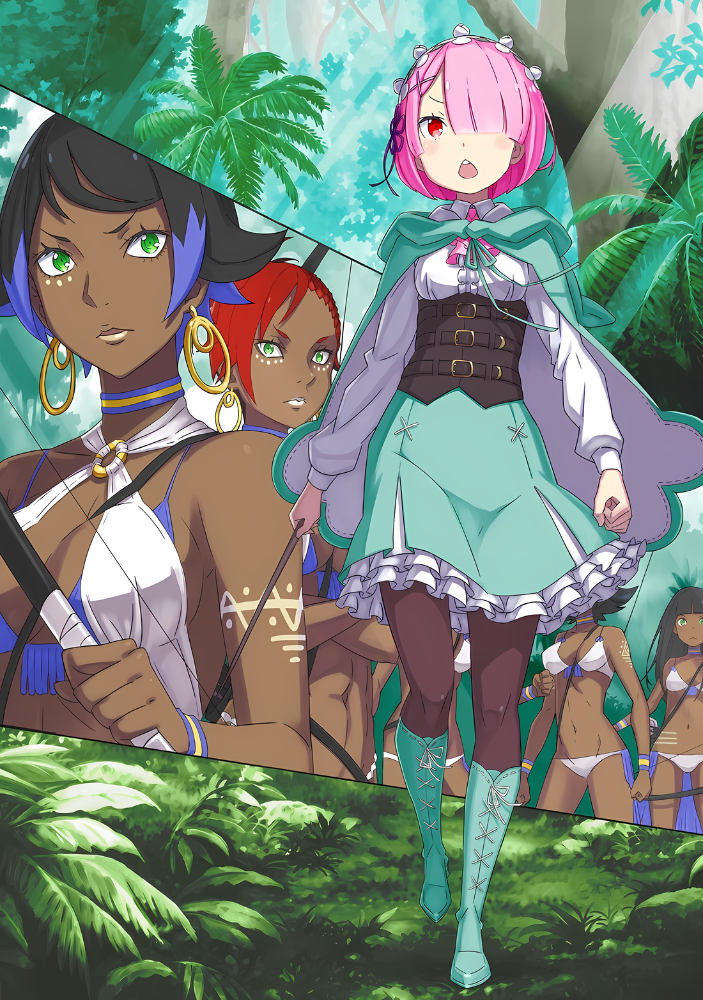
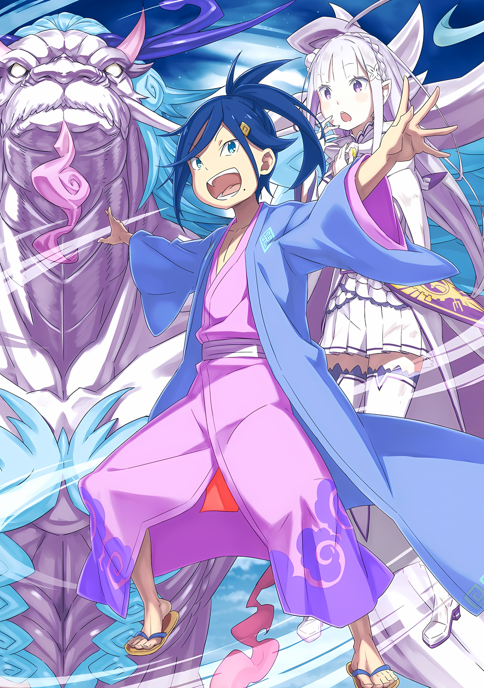

……Старость «Облачного Дракона» Мезореи.

Поразительное открытие правды загнало Эмилию в чрезвычайно сложное положение.

Эмилия: Тогда мне не нужно было побеждать Волканику, достаточно было приложить все усилия и завершить «Испытание», но……

На самом высоком этаже Сторожевой Башни Плеяд ее встреча с «Божественным Драконом» Волканикой завершилась тем, что она коснулась каменного монумента на пике, еще выше башни.

Что касается Эмилии, то она все еще не была уверена в том, правильно ли она выполнила «Испытание» Волканики; однако древний Дракон представил Эмилии один из своих когтей в качестве доказательства.

Так что пока она считала это символом одобрения.

Однако ее бой с Волканикой был в основном оборонительным, без намерения победить его, так что это не считалось сражением вообще.

И эта ситуация не изменилась, даже если противник сменился с «Божественного Дракона» на «Облачного Дракона».

Правда……

Эмилия: У меня нет другого выбора, кроме как победить его, но Мезорея потерял рас…… Акх!

Пока она это говорила, Эмилия вскочила со своего места и настигла Дракона с воздуха.

Тряся длинными усами, не показывая того, что отражалось в его глазах, Дракон безжалостно полоснул когтями по жалкому существу, летящему к нему.

Это была простая атака, но одного удара было бы более чем достаточно, чтобы убить человека, если бы он попал в цель.

Когти Дракона были намного острее любого обычного меча и могли легко разрубить тело Эмилии прямо пополам.

Эмилия: Солдаты!

Однако Эмилия смогла избежать этой атаки, прыгнув еще дальше в небо.

Опору в воздухе, которую использовала Эмилия, обеспечил ледяной солдат, который прыгнул вместе с ней и подставил обе руки, чтобы та могла подпрыгнуть.

Естественно, ледяной солдат не смог вовремя уклониться и стал жертвой когтей Дракона, которые разбили его на куски.

Эмилия: Эйя!!!

Держа в сердце эту жертву, Эмилия длинными ногами ударила Мезорею по морде.

Она нанесла этот удар ногами, укрепленными льдом, на каждой из которых было по большому острому шипу, образуя смертоносное оружие.

Поскольку Эмилия использовала свои ноги, она не стала тянуть с безжалостным ударом, поэтому абсурдно жестокий удар пришелся в бок беззащитной головы Мезореи.

Однако……

Эмилия: Это вообще не работает!

Огромное тело Мезореи не сдвинулось ни на дюйм от удара ногой по лицу.

Однако, казалось, оно было раздражено. Почувствовав враждебность, Эмилия сильно взмахнула верхней частью своего тела, чтобы сделать сальто в воздухе, используя другого ледяного солдата, для уворота от удара Дракона.

Другой ледяной солдат, оказавшись позади разбитого, подпрыгнул еще выше и вытянулся вверх. Выровнявшись, Эмилия бросилась с него на землю.

В то время как в ее барабанных перепонках раздался звук раскалывающегося льда, Эмилия приземлилась рукой на белую землю, а затем посмотрела вверх, на величественного Дракона в облаках, который спокойно парил в воздухе.

*Мезорея: «Я — Мезорея. В соответствии с голосом моего драгоценного ребенка, я стану ветром с небес.»*

Эмилия: Боже… Даже после всего этого…!

Даже после того, как Мезорея получил удар по лицу и разнес когтями двух ледяных солдат, его слова и поведение ничуть не изменились по сравнению с тем, когда он впервые появился на поле боя.

Эмилия: …………

Мезорея, видимо, считал Эмилию врагом.

Именно по этой причине он выставил когти в сторону приближающейся Эмилии, хлопая крыльями и обратив на нее свои белые глаза.

Но она просто не могла начать разговор. Как и с Волканикой, найти общий язык было невероятно трудно.

Единственной потенциальной зацепкой может быть……

Эмилия: ……Мэделин! Просто послушай меня!

Мэделин: Тихо! Не обращайся к дракону так небрежно!!!

Последний луч надежды Эмилии угас вдали, когда ее протянутая рука была жестоко стряхнута.

Несмотря на то, что Мэделин потеряла Летающее Крылатое Лезвие, которым она умела владеть с поразительным мастерством, серебряные волосы Эмилии трепались, пока она уклончиво отпрыгнула в сторону. Маленькая тень последовала прямо за ней…… это была Мэделин Эшарт, которая выпустила белый выдох, когда ее золотые глаза загорелись, и с каждым шагом раскалывала землю, размахивая своей разрушительной рукой.

Едва уклонившись от нее, Эмилия прикусила губу.

Тактика быстрого понижения температуры послужила своей цели — отвлечь разбушевавшихся Мэделин и Мезорею от остальных на поле боя, но дальше так продолжать было уже трудно.

Мэделин: Человек, человек, человек…!!!

С лукавым блеском в глазах Мэделин окутала свое маленькое тело белым паром. Казалось, что она сравнялась с Мезореей, окутанным облаками, но все-таки разница чувствовалась.

Температура тела Мэделин была настолько абсурдно высокой, что каждая снежинка испарялась, как только она на нее приземлялась… нет, даже не долетая до нее.

То же самое происходило и вокруг Мезореи, тактика «Подражания Пака» была не очень эффективна против этих двоих.

В таком случае……

Эмилия: Ледяной Барьер……!

Поскольку ледяная стена, разделяющая поля боя, все еще оставалась на месте, Эмилия изменила поток холодного воздуха. Отказ от неэффективной стратегии ради сохранения сил — это не то, что она делала.

Поскольку она покрыла слишком большую площадь, это не оказало желаемого эффекта на Мезорею и Мэделин.

Эмилия: Как насчет всего этого холода!

Нарисовав невидимые белые линии вокруг приближающейся Мэделин, Эмилия сконцентрировала холодный воздух, пронизывающий поле боя вокруг второго бастиона, в одном месте.

Это был не просто обычный холодок, это был действительно сильный холод, который окутал маленькое тело Мэделин, превратив пар в снег и заставив температуру тела полудракона мгновенно упасть ниже нуля.

Мэделин: ……Гха!?

Даже у Мэделин все тело замерзло от этого непредвиденно сильного холода.

Глаза Мэделин расширились, а зрение потускнело; однако Эмилия отбросила последние остатки жалости и сосредоточилась на том, чтобы направить всю свою силу на временное замораживание Мэделин.

Эмилия: Пожалуйста… А?

Направляя всю свою силу на замораживание Мэделин, Эмилия молилась о том, чтобы Мезорея повел себя правильно.

Любое действие «Облачного Дракона», заставило бы Эмилию преждевременно прекратить атаку. Однако в углу своего поля зрения она увидела парящего в небе Мезорею с пустым выражением лица и без малейшего намека на желание вмешаться в затруднительное положение Мэделин.

Эмилия: Странно, но…

В этой ситуации бездействие Дракона очень помогло ей.

Когда раздался ярый девичий голос и тот показался с неба, Эмилия поняла, что оказалась в еще более безвыходной ситуации.

Однако, судя по всему, Мэделин и Мезорея совсем не сотрудничали, постоянно меняясь между тем, что один из них атаковал, а другой стоял в стороне.

С точки зрения Эмилии, ситуация продолжалась, пока она чередовала противников один на один.

Конечно, ее выносливость все еще медленно истощалась, и она не могла думать ни о Мэделин, ни о Мезорее, как о противниках, которых она могла бы легко победить в схватке один на один.

Тем не менее……

Мэделин: Т-ты…!

Эмилия: Мне жаль, Мэделин. Я думаю, было бы лучше, если бы я смогла нормально поговорить с тобой. Но, поскольку ты отказываешься слушать, я хочу, чтобы ты была послушной!

Мэделин: Гхх……!

Все тело Мэделин яростно заскрипело, и она оскалила свои острые клыки, а ее глаза вспыхнули.

Однако, как только внутренняя часть ее тела охладилась до самой сердцевины, даже чрезвычайно сильный и энергичный полудракон не смог избежать вырванной свободы.

Мэделин: …………

Ее кровь и плоть… кости и кожа — все это было заморожено до белизны, и Мэделин была заключена Эмилией в ледяную тюрьму.

Все закончилось как раз перед тем, как рука Мэделин, которую она внезапно протянула, смогла дотянуться до груди Эмилии. Все еще с направленными руками на Мэделин, Эмилия посмотрела на неподвижную девушку и выпустила длинный выдох.

Эмилия: Было очень близко……

Похлопав себя по груди с облегчением, Эмилия опустила брови, глядя на девушку, которая была окрашена в белый цвет.

Она не испытывала ни восторга, ни сожаления по поводу победы или поражения. Прежде всего, это еще не означало конца.

Эмилия: Мезорея! Ты можешь не понимать, что я говорю, но ты должен прекратить балаганить! Если ты действительно не в состоянии вести диалог, то лучше отправляйся домой!

Она предполагала, что Мезорея может невероятно разозлиться в тот момент, когда та победит Мэделин, поэтому она почувствовала некоторое облегчение, увидев, что он не сделал никакого движения. Однако, не позволив облегчению просочиться в ее выражение лица, Эмилия уставилась на него острым взглядом.

Она пыталась сделать вид, что у нее еще много сил.

Однако на самом деле сил у Эмилии оставалось не так уж много.

Хотя ей удалось превратить Мэделин в лед, ей нужно было продолжать поддерживать ее в замороженном состоянии. А это тоже требовало постоянного расхода энергии.

Таким образом, даже если она остановила Мэделин, бороться с Мезореей будет очень сложно.

Если возможно, лучшее, что он мог сделать, это покинуть их и вернуться обратно к себе.

Вот почему……

Эмилия: В случае, если ты все еще хочешь продолжать, у меня тоже есть план.

Резко сверкнув глазами, Эмилия заявила это Мезорее. ……Это была ложь.

Хотя она и сказала это с огромной уверенностью, глядя на Мезорею, это была откровенная ложь, что у нее был какой-то план. Она подумала, что если будет настаивать, возможно, Мезорея решит, что Эмилия опасна, и скроется.

По примеру Субару и Отто, это был редкий блеф со стороны Эмилии.

*Мезорея: «Я — Мезорея. В соответствии с голосом моего драгоценного ребенка, я стану ветром с небес.»*

На что глубокий, низкий голос из уст Мезореи ответил именно так.

Эмилия была обескуражена его неразборчивым поведением, так как было непонятно, видит ли он то, что у него перед глазами, но она была полна решимости не быть побежденной и не ослабляла суровости своего взгляда.

И тогда……

*Мезорея: «Я — Мезорея. В соответствии с голосом моего……»*

Эмилия: .…А?

*Мезорея: «В соответствии с голосом моего… голосом… моего драгоценного… ребенка.…»*

Слова Мезореи, которые он повторял снова, обрываясь на полуслове, тут же затихли и больше не продолжались.

Но дело было не только в этом. Мезорея, мирно висящий в снежном небе, болезненно нахмурился и начал раскачивать свою большую голову из стороны в сторону.

Эмилия: Что вдруг случилось? У тебя болит голова?

Заметив изменения в Мезорее, аметистовые глаза Эмилии расширились от удивления.

Вполне естественно, что он впал в гнев, когда Мэделин была заморожена во льду. Это было бы очень тревожно, поступи она так, однако это было бы легче принять, чем такую странную реакцию.

Пока Эмилия размышляла об этом, движения Мезореи резко остановились.

*Мезорея: «…………»*

Дракон, который тряс головой, видимо от боли, вдруг посмотрел вниз с безмятежным выражением лица. Встретив взгляд этих белых глаз, на лице, поросшем длинной бородой, Эмилия издала короткий звук удивления «Ах».

Сейчас, впервые, она почувствовала, что глаза Мезореи «увидели» ее.

Другими словами, это был знак воли и ума, обитающих в глазах Мезореи……

Эмилия: Наконец, мы можем поговорить……

*Мезорея: «Кажется, я уже сказала тебе, человек.»*

Эмилия: А?

Низким голосом, прозвучавшим так, будто небо зарычало, Дракон повернул голову и посмотрел на Эмилию. Ее пронзил его взгляд, однако тело Эмилии напряглось от другого шока.

На нее обратило взгляд нечто более могущественное, чем она, но удивило ее совсем не это.

Причина была в том, что яростные эмоции в его голосе были точно такими же, как те, что были направлены на нее всего несколько мгновений назад… Нет, потому что они были точно такими же.

И действительно, как бы подтверждая удивление застывшей Эмилии, Дракон продолжил.

*Мезорея: «Дракону нечего тебе сказать.»*

Эмилия: Мэдели……

Увидев нечто невероятное, Эмилия невольно прекратила движение.

Повернувшись к ней, Дракон открыл свою пасть. Затем он просто выдохнул. ……Выдох превратился в белый свет, и истинная сущность «Облачного Дракона» наполнила мир.

Ужас, от поселившийся воли в Драконе, безжалостно обрушился на Эмилию.

△▼△▼△▼△

Влияние батальона, наступавшего с запада, распространилось по всем уголкам поля боя.

Конечно, больше всего от этого батальона пострадал гарнизон четвертого бастиона, который оказался на грани краха, получив беспрецедентный урон одним махом.

Однако, даже если он не был затронут напрямую, можно сказать, что третий бастион подвергся наибольшему влиянию изменений, внесенных Батальоном Плеяд в ход сражения.

Первоначально, чтобы свести на нет один из козырей Имперского города Рапганы, Магическую Хрустальную Пушку, солдат, отправленных на третий бастион, предполагалось пожертвовать.

Абел рассказал Зикру об этом плане, и тот был готов пожертвовать собой. Благодаря его маневру, некоторые из его войск… «Племя Судрак»… избежали лучей Магической Хрустальной Пушки, что было незначительной разницей по сравнению с ущербом, который должен был быть нанесен третьему бастиону.

В любом случае, ожидалось, что солдаты третьего бастиона будут тогда потеряны.

В тот момент, когда они одержали верх, первоначальные расчеты Абела, основанные на предположении, что повстанцы потерпят болезненное поражение, сгорели дотла. Однако в том, что солдаты выживут, не должно быть ничего страшного. Немедленно исправив просчет, Абел привел первоначальную стратегию в соответствие с текущей ситуацией.

В результате……

Зикр: ……Это же Эскадрилья Летающих Драконов Верховной Графини Серены Дракрой.

В разгар битвы с каменными големами Зикр орудовал мечом и прошептал это, сидя на своем любимом коне Лейди.

Их круглые глаза были обращены к лазурному небу, наполовину заполненному белым и красным цветом…… пролетая над различными полями сражений, крылатые собратья сталкивались и оскаливали друг на друга клыки.

С одной стороны находилась стая природных летающих драконов, выполнявших приказ «Генерала Летающих Драконов» Мэделин Эшарт, чтобы бушевать с необузданной свирепостью.

Им противостояли Эскадрильи Летающих Драконов, несущие своих партнеров на спинах, а именно наездников со свирепыми клинками в надежных ножнах.

Дикие, беспилотные летающие драконы явно превосходили всадников на драконах, но любой согласится, что последние были гораздо искуснее в воздушном бою.

В то время как дикие летающие драконы были переполнены свирепостью и яростно размахивали когтями и клыками, мастерство наездников летающих драконов было куда более великолепным и утонченным по сравнению с ними. Избегая клыков ловкими движениями, совершенно не обращая внимания на то, что находятся в воздухе, наездники использовали свое оружие, чтобы пронзать крылья диких летающих драконов, и убивать их одного за другим.

Зикр: Какая ошеломляющая разница……

Только Зикр, который был знаком с «Генералом» наездников летающих драконов как Генерал Второго класса Империи, мог сказать, кто из них безнадежно уступал в силе; это была дикая стая летающих драконов под предводительством Мэделин.

Тем не менее, с насилием, порожденным численностью, было трудно справиться, и тот факт, что в Городе-крепости они оказались в полном меньшинстве, глубоко сидел в его сердце. Теперь это представление снова должно было измениться.

К лучшему или худшему, он собирался воочию убедиться в истинной силе традиционного Имперского укрощения «Летающих Драконов».

Зикр: Чтобы сообщить Его Превосходительству об успехе его плана, я должен двигаться дальше.

Когда Абел разыграл свою карту, Эскадрилью Летающих Драконов Верховной Графини Дракрой, превосходство в воздухе стаи летающих драконов уменьшилось, и Зикр даже получил возможность убедиться в своем окружении.

Несмотря на то, что он отправился на передовую ради поддержания боевого духа войск, Зикр отнюдь не был компетентным бойцом в реальном бою. Вместо этого он отдавал приказы о своевременном построении и продвигался дальше в сердце вражеских рядов.

Угроза еще не ослабла, поэтому он двинулся дальше, к Генералу Первого класса Могуро Хагане, сросшемуся с крепостной стеной.

Зикр: Надеюсь, что мисс Беатрис в порядке……

Когда Зикр поднял меч, в его голове промелькнула мысль о девочке с бледно-русыми волосами в роскошном платье…… Беатрис, которая, несомненно, стала спасительницей его жизни.

Когда «Магическая Хрустальная Пушка» сделала выстрел, Зикр приготовился встретить смерть, в тот момент он увидел фигуру девочки, которая бросилась навстречу летящему свету, чтобы хоть как-то отразить его.

Беатрис и так была маленькой, но высоко в небе она казалась размером с гальку. Тем не менее Зикр был уверен, что это, несомненно, Беатрис.

Никогда не ошибиться в женщине, которую он однажды видел своими глазами, — такова была особая способность Зикра.

Поэтому Зикр мог с уверенностью сказать, что именно Беатрис сумела что-то сделать с Магической Хрустальной Пушкой.

Проблема заключалась в том, что он также был уверен, что никто не смог бы совершить такой подвиг без затрат.

Зикр: Пожалуйста, будьте невредимы!!!

Он от всей души поднял бы голос за то, чтобы Беатрис была награждена самой большой медалью за переписывание этого затруднительного положения, но прежде всего он желал, чтобы она была в полном порядке.

Но Зикр, избежавший верной смерти в разгар битвы, должен был сыграть свою роль в качестве «Генерала».

Поэтому Зикру оставалось только молиться.

……Чтобы все его оставшееся счастье досталось этой девочке.

Тем временем, пока Зикр молился за безопасность той, кто только что внесла столь значительный вклад на передовой, Таритта наблюдала момент неестественного исчезновения выстрела «Магической Хрустальной Пушки» и того, кто это сделал.

Таритта: Мне приказали отступить, но, к счастью, у меня был хороший обзор поля боя….

Повстанцам был нанесен сильный удар, но они сумели встать на ноги. Зикр, который собирался начать штурм вместе с ними, приказал «Племени Судрак» прикрыть их с тыла.

Решение не включать судракиек во всеобщий мятеж, на что еще Мизельда, очевидно, пожаловалась, было принято Тариттой, поскольку Зикр, как никто другой, должен был продумать этот приказ.

Но не было никакой возможности……

Мизельда: Не может быть, чтобы только мы не могли ничем помочь. На нас, судракиек, смотрят свысока.

Таритта: Сестра…

Оглядываясь на произошедшее, Мизельда имела полное право выразить свой гнев.

Хрустальный Дворец в столице Империи изначально был замком, в котором жил Абел. Трудно было поверить, что он не знал о Магической Хрустальной Пушке, да и неестественные указания Зикра тоже было трудно принять.

Возможно, это было решение самого Зикра — заставить судракиек отступить.

Зикр был готов стать жертвенной пешкой, а им не дали последовать его примеру…… Мизельда сказала, что на них смотрят свысока, но, вероятно, это не совсем так.

Это было сострадательное решение Зикра.

Однако……

Таритта: ……Я тоже чувствую то же самое, что и ты, сестра. Я недовольна заботой Зикра.

Она пришла к тому же выводу, что и воинственная Мизельда.

Известный как «Бабник», Зикр умел относиться к женщинам не только с определенным уважением, и ни Таритта, ни кто-либо другой не имели права говорить что-либо о том, как он должен себя вести.

Однако ни Таритта, ни кто-либо другой из «Племени Судрак» не были обязаны позволять кому-либо диктовать им свои правила.

Поэтому Таритта с силой сжала свой лук и сказала:

Таритта: Давай-ка донесем эту жалобу прямо до Зикра.

Мизельда: Хм, хороший ответ. Такими темпами Зикр и Джамал заберут у нас все хорошее. ……Вы слышали это, сестры!!!

Мизельда, ловко топнув протезом ноги землю и подняв большой мачете, обратилась к своим соотечественницам.

Все судракийки ответили на слова Мизельды и готовность Таритты единодушными глазами, лицами и голосами.

Затем с большим энтузиазмом они направились к передней линии третьего бастиона, защищаемого Могуро Хагане. Как раз в тот момент, когда группа судракиек собиралась выступить в поход……

???: ……По-видимому, здесь собралась довольно мотивированная группа.

Услышав холодный, сухой голос, Таритта и Мизельда обернулись.

Таритта мгновенно выхватила стрелу из колчана и пустилась в боевую стойку. Появление другой стороны было настолько внезапным, что заставило «Племя Судрак» повысить бдительность.

Однако осторожность Таритты и остальных быстро растаяла при виде чужого облика.

Медленно ступая по траве, сзади группы судракиек приближалась девушка с колышущимися на ветру розовыми волосами…… и, прежде всего, со знакомым лицом.

……Нет, это тоже было не совсем точно; причина в том, что девушка перед ними была совсем не тем человеком, лицо которого было знакомо Таритте и остальным.

???: ……? Почему вы уставились в полном удивлении? Это из-за появления из воздуха? В таком случае, ответ на эту загадку — прыжок с летающего дракона.

rezero7arc | Иллюстрация к **Ранобэ** Том 33 | Разукрасил @112oVic2

Таритта: Н-нет. Это не то, чему мы удивляемся.

???: Если это не так, тогда поведайте же.

Таритта: ……Твое лицо выглядит точно так же, как лицо знакомой нам девушки.

Розововолосая девушка наклонила голову под взглядом судракиек. Когда Мизельда ответила на ее вопрос, она слегка взглянула в глаза напротив.

Затем, коротко вздохнув, она сказала: «Вот как».

???: Вы хорошо ладили с той девушкой?

Мизельда: По крайней мере, она нам очень нравилась.

Она ответила на вопрос девушки с бледно-красными глазами строгим кивком.

Возможно, это было заявление от имени всех, но Таритта не возражала против него. И все судракийки догадывались о личности девушки, стоящей перед ними.

Нацуки Субару как-то упоминал о ней. ……Он сказал, что у нее есть сестра-близнец.

Сестра-близнец с лицом, идентичным лицу девушки, которую знали Таритта и ее группа, еще раз пробормотала: «Так и есть», а затем……

???: Раз так, Рам уверена, что мы прекрасно поладим.

Сказав это, она шагнула вперед… словно путь для Рам был расчищен, и девушка, которая действовала так, словно это было само собой разумеющимся, встала перед Тариттой и Мизельдой.

Первая кивнула, глядя в эти бледно-красные глаза.

Таритта: Да, я надеюсь на это. Какова ситуация?

Рам: Рам уловила суть, полагаю, что сейчас здесь нет ни одной трусливой женщины, верно?

Оглядев лица судракиек, Рам тихо заговорила.

Она смогла понять, почему «Племя Судрак» расположились так далеко от битвы за третий бастион, происходящей прямо перед ними.

Проникнувшись этим и признав продуманность вопроса, она заговорила:

Рам: Мужчины говорят такие вещи, как «Я волнуууюсь за тебя» и «Тебе лучше остаться позадиии», но Рам докажет, что они ошибаются. ……Сказав им, чтобы они занимались своими делами.

Таритта: Я согласна.

Сказав это, стоя рядом с Рам, держащую в руках палочку, Таритта несколько раз молча кивнула.

Сострадание, забота и беспокойство не приветствовались судракийками на поле боя. Скорее, этим чувствам, которые они когда-то отбросили, их нужно было научить.

С чувством определенного осознания Рам выступила вперед, а Таритта последовала ее примеру. Затем Мизельда выстроилась напротив нее с дикой улыбкой на лице.

И……

Таритта: Я никогда не встречала тебя раньше, но я убеждена. Ты воин, как и Рем.

△▼△▼△▼△

Произошел удар, который отозвался в самой его глубине, словно тяжелый груз застрял в его органах.

Эти необычные ощущения продолжались раз, два, три, четыре раза, а напряжение, казалось, все возрастало.

Когда кандалы на руках и ногах стали мешать ему двигаться один за другим, он поддался неистовому желанию стряхнуть их и переступить через них.

Однако……

???: Твой подход слишком прямолинеен. Кафма может позволить тебе как-то ежиться, но я не буду бессистемно бросаться в бой с противником в самом начале.

???: Кха.

С пятью вытянутыми пальцами лицо старика погрузилось в землю и исчезло, оставив после себя насмешку.

Сразу же после того, как он посмотрел ему в глаза, он заметил присутствие позади себя и великолепно запустил кулак в направление, противоположное себе. Мощный ответный удар сокрушил позвоночник его противника, но ощущение отскока подсказало ему, что это было нечто отличное от старика.

Присмотревшись, он понял, что это один из трупов с поля боя, которые тот извлек из утоптанной земли. Когда он понял, что его успешно обманули, было уже слишком поздно.

???: Ну вот, опять попался.

Тело перевернулось от удара кулака, и его плечо почувствовало толчок сзади. Другими словами, Порочный Старик…… Ольбарт не стал подниматься с земли, на которую он упал, а просто перепрыгнул на другое место.

Маленький старик, слегка коснувшись его плеча, отступил назад, демонстрируя свои прекрасные зубы.

Он просто коснулся. Ни ударил, ни резанул. Может, он просто играл? Или оскорблял его? ……Нет, Ольбарт никогда не делал ничего без смысла. Всегда был смысл, смысл, смысл…

???: ……Хааа!?

В тот момент, когда его мысли разгорелись, на правом плече, где его коснулись, вспыхнул еще больший жар.

Присмотревшись, он увидел, что на его плече остался поразительно красный отпечаток руки Ольбарта. Он сочился кровью и извергал дым, пытаясь сжечь кожу, плоть и кость.

Не было никаких колебаний, как только он определил, что это яд.

Гарфиэль широко открыл рот, чтобы откусить плечо с красным отпечатком руки, полным яда, разъедающим его. Вкус его собственной отравленной плоти и крови был ужасен, а кость, которую пронзили клыки, заполонила невыносимая боль.

Однако она была кратковременной. Из глубокой раны на плече хлынула струя крови, и рана восстановилась благодаря огромному приливу плоти……

Ольбарт: Возможно, это лучший выход из ситуации, но ты, конечно, безрассуден.

Гарфиэль, тяжело дыша, получил один из ударов Ольбарта прямо в нос.

Когда его голова откинулась назад от поразительно мощного удара ногой тщедушного старика, его нос был сломан, и он свалился с ног. Он кувырком полетел по неровной земле, все его тело распростерлось на ней.

Если бы не крепкая шея Гарфиэля, удар мог бы разнести его голову на миллион осколков.

Однако голова и туловище остались воедино. Медленно подняв руку, он положил ее на сломанный нос и на одном дыхании вправил его на место. Резкий звук эхом разнесся по всему черепу.

Ольбарт: ……Боже, быть трудноубиваемым — это оружие само по себе. Не в сентиментальном смысле, а в физическом. От тебя слишком много проблем, ты в курсе?

Глядя на это болезненное зрелище, Ольбарт вздохнул в отчаянии.

Размахивая левой рукой в воздухе, Гарфиэль задумался, сколько же раз этот Порочный Старик с таким упорством нападал на него?

По крайней мере, Порочный Старик не смог бы сосчитать их по пальцам на своей единственной оставшейся руке.

Гарфиэль: ……Завались, старик. Это еще не конец!

Он медленно поднялся, когда из его плеча хлынула обильная струя крови.

Бесчисленные шрамы на его обнаженной верхней части тела и последствия ожесточенной битвы с Кафмой Ирулюкс все еще были свежи в его памяти, он сражался с одним из сильнейших в Империи, но его боевой дух все еще оставался непоколебимым.

Даже по меркам Империи многие солдаты признали бы его храбрость впечатляющей и достойной восхищения, но, к сожалению, он столкнулся с Порочным Стариком, которого нисколько не заботили ценности воина.

Пожав плечами, Ольбарт посмотрел на него с выражением, лишенным всякого восхищения.

Ольбарт: Я не могу быть слишком занят только тобой. Ну, стены, через которые я пробирался, имели более странный запах. Видимо, там были какие-то неприятные люди, так что все может стать более проблематичным, если я не вернусь, понимаешь?

Гарфиэль: Неприятные люди…?

Ольбарт: Навостри уши и услышишь их. Только не говори мне, что ты не слышишь лучше, чем такой старый чудак, как я?

Когда Ольбарт поднес руку к уху, Гарфиэль понял это, сузив глаза. Как это ни было неприятно, но, внимательно прислушавшись, он понял, о чем тот говорил.

Действительно, он ощущал в своих барабанных перепонках и на подошвах ног звук многих, многих необычайно мощных шагов, сотрясающих землю и саму атмосферу этого поля боя.

Ольбарт: Нет, ты же не серьезно. Насколько смелым ты должен быть, чтобы показать свою уязвимость передо мной?

Мгновение спустя по обе стороны головы Гарфиэля вспыхнули взрывные устройства, брошенные Ольбартом во время этого перерыва во внимании.

Раздался громовой взрыв, красный свет распространился с обжигающим жаром, демонстрируя силу, которая легко превратила бы человека в пыль, и фигура Гарфиэля исчезла в образовавшемся пламени.

Ольбарт: Ну, это немного……

После этого он уставился в горящее пламя.

Гарфиэль: Гаааааххх!!!

В тот момент, когда его поглотил взрыв, Гарфиэль с криком бросился к нему, используя пламя как отвлекающий маневр.

Он представлял, что если он создаст удобный момент для Ольбарта, то тот непременно сделает шаг. Сам он не знал, что именно замышлял, но он оказался прав.

Руки Гарфиэля сомкнулись над Ольбартом, который был ослеплен собственной атакой, и……

Ольбарт: Ты еще молод, мальчик.

Когда его вытянутые руки были сломаны, челюсть удивленного Гарфиэля была отбита снизу вверх. Нога прыгающего Ольбарта пропечатала его лицо.

Ольбарт стоял одной ногой на поднятом вверх лице Гарфиэля, и в этой позе Порочный Старик смотрел вдаль, как бы дразня его.

Ольбарт: Войск, которые оттянул Кафма, будет достаточно, чтобы защитить это место…… Никто не выберется отсюда без тебя.

Этим нарочитым заявлением Ольбарт объявил о своем намерении больше не продолжать битву.

С налитыми кровью глазами Гарфиэль поднял руки, несмотря на сломанные локти, и попытался расправиться с миниатюрной фигуркой Ольбарта. Его правый рукав начал развеваться на ветру, ведь он вовремя подпрыгнул, дабы избежать натиска.

Ольбарт: Как и ожидалось, ты не умрешь, даже если лишишься головы, не так ли?

После этого холодного смертного приговора Гарфиэль почувствовал, как по его позвоночнику проходит лезвие, поэтому он напряг все свои силы в мышцы шеи и отпрыгнул от этого места, чтобы……

???: ……Грудь.

В следующий момент, ориентируясь на голос, который он услышал, он бессознательно сжал кулаки перед грудью.

«Ния», — слабо простонал хриплый голос, за которым последовала цепь сильных звуков, похожих на звон стали.

Вместо сжатых кулаков перед его грудью было лезвие…… удар Ольбарта, содержал в себе спрятанный клинок, заменявший ему потерянную правую руку.

Когда острие клинка неглубоко вонзилось в его грудь, тело Гарфиэля упало назад.

Если бы он хоть немного промедлил с реакцией, его сердце было бы лишено жизни. Сколько бы он ни регенерировал, у него не получилось бы восстановить сердце.

Если бы он не последовал этому совету и продолжал прикрывать свою шею, он бы умер.

Хотя он знал, что……

Гарфиэль: ……Скройся, гнида.

???: Оу, это так неприяяятно слышать. Я думал, что хотя бы услышу слова благодарности.

Пока Гарфиэль щелкал языком, его спину прикрывал кто-то, стоящий позади него.

Когда он доверился его словам, он почувствовал намек на кривую улыбку, исходящую из рук его помощника. Почувствовав еще большее раздражение от этого, Гарфиэль сморщил нос.

Вообще-то он не умел ненавидеть людей, но перед ним был Ольбарт, который принадлежал к тем, кого он ненавидел. Однако человек, которого он безошибочно презирал больше всего, стоял прямо за ним.

Оказавшись между двумя ненавистными людьми, он оказался в наихудшей ситуации из всех возможных.

Гарфиэль: После того, как я расхерачу старика, ты будешь следующим……

???: Это уже крайности, не так ли? В каком-то смысле, разве то, что я пришел сюда, не является удачей? Ты же не хочешь, чтобы Рам увидела тебя в таком состоянии?

Гарфиэль: Гх…

В его горле раздалось хриплое рычание, так как нервы были задеты.

Помощник Гарфиэля позади него захихикал над его реакцией. Ольбарт, чей скрытый клинок был сломан, наблюдал за происходящим с небольшого расстояния.

Ольбарт: Просто позволь мне сказать, что ты будешь убит, пройдя ту линию на земле.

???: Пардон, старик. Я не совсем уловил этот момент. В конце концов, я прибыл сюда с неба.

Ольбарт: С неба, значит?

Взглянув на небо, он закрыл один глаз.

Даже его кажущаяся вялость была лишь частью хитрости Порочного Старика, который водил своих противников за нос. Гарфиэль выдохнул, сдерживая себя от непроизвольного прыжка вперед.

Он вытащил кончик клинка из своей груди, заполняя рану восстанавливающейся кожей.

Гарфиэль: Если ты здесь…

???: Рам на другом поле боя. Я сказал ей отступить, но она не послушала.

Гарфиэль: ……Не удивительно. А ты из кожи вон лез, чтобы прийти сюда.

???: Конечно, я также намерен быть в какой-то степени полезным. Считай, что тебе повезло.

Когда он это сказал, дуэт перевел взгляд на беспокойного Порочного Старика, и человек с незнакомым лицом оказался уже не позади Гарфиэля, а перед ним…… Розвааль Л. Мейзерс не был накрашен, а его голубой глаз был закрыт, чтобы скрыть его личность.

Розвааль: ……В конце концов, в прошлом у меня тоже были смертельные поединки с шиноби.

Он заявил это с глубоко злобной улыбкой, соперничающей с улыбкой его врага.

△▼△▼△▼△

……В тот момент, когда свет высвободился, его сила проникла в волю, у Эмилии появилось видение собственной «Смерти».

Ее дух соперничества был силен, и она не должна была терять надежду ни при каких обстоятельствах.

Для Эмилии, которая с таким настроем направила силу в свой живот, это было разрушительно.

Эмилия: ……Ах.

В своей голове маленькая Эмилия кричала, что ей нужно немедленно двигаться.

Однако ее тело не отвечало, в какую сторону ей двигаться, вправо или влево. Несмотря на то, что обычно она двигалась без раздумий, сейчас она не могла этого сделать.

Причина этого заключалась в том, что ее сердце, а не голова, сразу почувствовало… вправо или влево, вперед или назад, бежать было некуда.

Эмилия: Ледяной Барьер.

Поэтому, вместо того, чтобы убегать, она решила защищаться…… Нет, отражать атаки.

Создав перед собой толстую стену льда, она позволила свету скользить по ее скошенной поверхности. Независимо от того, могла ли она это сделать или нет, она должна была сделать это с убежденностью, что должна.

Когда в Гуарале с неба было выпущено дыхание дракона, Эмилия сразу же выбрала ту же защиту. Однако в тот раз рядом была Присцилла с алым сокровенным мечом, сумевшая прорубить тот свет, который Эмилия хоть немного ослабила.

В этот раз Присциллы здесь не было. Эмилия была одна.

Она не знала, сможет ли она сделать то же самое. Однако она должна была сделать это.

Эмилия: Я, и люди позади меня…

С первого взгляда она поняла, что нет никаких шансов, что сила высвободившегося света снесет только ее.

Ранее такой же свет был выпущен вдалеке, и этот свет был похож на тот. Свет, несомненно, скосил бы поле боя и уничтожил бы все.

Так что……

Эмилия: ……Сделай все возможное, я.

Она поджала ноги, создала перед собой ледяную стену и крепко сжала в руке ледяной меч.

Она создала ледяной меч, потому что Присцилла в тот раз использовала свое оружие, чтобы прорезать дыхание. Этот ледяной меч не обладал такой же силой, как тот, но это было на удачу.

Эмилия приложила все свои силы, и……

*Мезорея: «Исчезни, человек……»*

Его дыхание вырвалось, и белый свет полился вниз, накрывая Эмилию.

Она забыла обо всем, о том, что голос вырвался из горла Мезореи, и том, что в его глазах был гнев, абсолютно обо всем. Она забыла и напряглась.

А потом, в тот момент, когда дыхание разрушило ледяную стену, поглотив даже Эмилию……

Эмилия: ……Аа?

После того, как Эмилия попыталась совместить свой ледяной меч со светом, ее глаза расширились от удивления.

Излучаемый свет должен был настигнуть ее, но вместо этого он слегка отклонился в сторону. Несмотря на это, возникла огромная ударная волна, почти разорвавшая серебристые волосы и снаряжение Эмилии.

Выдержав это, она посмотрела на Мезорею, чтобы понять, что произошло.

Он испустил дух, но его голова была повернута по диагонали вверх.

Дело не в том, что он решил передумать под самый конец.

Ориентация его шеи была насильно изменена. ……В результате удара Летающего Крылатого Лезвия, смертоносного оружия, которое ударило его сбоку в лицо.

Эмилия: Это должно быть то, что я бросила туда….

Это было оружие Мэделин, Летающее Крылатое Лезвие, которое Эмилия случайно отбросила далеко в сторону, когда пыталась бросить его обратно в Мэделин.

Оно вонзилось в лицо Мезореи. «Не может быть», — сказала Эмилия, ее глаза расширились.

Эмилия: Может ли быть так, что я бросила его, а теперь он вернулся?

???: Хахахахаха! Это действительно мечтательная и прекрасная вещь, которую можно представить! Но, к сожалению, нет! Оно застряло там, поэтому я просто отшвырнул его!

Эмилия: Кьяа!?

Представив себе чудесное совпадение, Эмилия была сильно удивлена голосом своего болтливого спутника.

Когда она в замешательстве обернулась, обладатель голоса присел рядом с ней, пристально глядя на ледяной меч в ее руке.

???: Это замечательный меч с прекрасным качеством изготовления. Я тут подумал, конечно, я бы носил с собой только легендарный меч, но если судить по внешнему виду, то я бы хотел включить твой меч в список претендентов.

Эмилия: Ого, спасибо?

???: Нет-нет, если кто и должен говорить спасибо, так это я.

Человек, которому принадлежал этот голос…… мальчик с голубыми волосами, завязанными назад, он весело улыбнулся Эмилии, которая не ожидала похвалы в такой ситуации и рефлекторно поблагодарила его.

Он выпрямил свои согнутые колени и встал, затем……

Синеволосый мальчик: Бело-красный свет разделил голубое небо! Я размышлял, в какую сторону идти, но когда я ворвался в одну из сторон, то обнаружил, что меня ждет большой Дракон и красивая девушка! Как и ожидалось от меня! Тебе не кажется, что мое притяжение слишком сильно?

Эмилия: Чего?

Синеволосый мальчик: Не думаешь ли ты, что оно слишком сильно!?

После очередного вопроса, заданного сверкающими глазами, Эмилия почувствовала себя обязанной ответить и сказала: «Я думаю, что оно о~очень сильно».

После ее ответа улыбка мальчика превратилась в довольную ухмылку.

Синеволосый мальчик: Верно!

Сказав это, он сделал шаг вперед, оказавшись рядом с Эмилией, под взглядом «Облачного Дракона».

Эмилия колебалась с решением, сказать ему что это опасно и попытаться остановить его или нет. Это было чувство давления. Но оно было вызвано не гигантским Драконом, а маленькой спиной перед ней.

Из-за этого неуместного, жизнерадостного мальчика……

Синеволосый мальчик: Развернулась грандиозная сцена! Давайте, все, смотрите! Не моргайте и не пропустите важный момент выступления «Синей Молнии» Сесилуса Сегмунта, иначе будете жалеть об этом всю оставшуюся жизнь!

rezero7arc | Иллюстрация к **Ранобэ** Том 33 | Разукрасил @112oVic2

Не сделав ни шагу назад перед лицом трансцендентного Дракона, мальчик… Сесилус Сегмунт… громко и величественно провозгласил эти слова.
