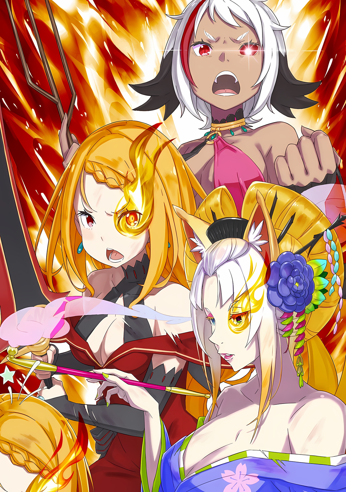

……Среди полей боя, рисующих борьбу за столицу Империи, два места превратились в сцены, которые особенно выделялись.

Одно из них — второй бастион, где величественно расправлял крылья прилетевший из-за неба «Облачный Дракон», и где сцена была окрашена в белый цвет, дабы предотвратить распространение его повреждений на окрестности.

Другим местом был первый бастион, где палящее горячее небо было окрашено в красный цвет…… сила девушки в центре всего этого сделала окружающую среду настолько суровой, что выживание любого живого организма было под вопросом.

???: …………

Мерцая подобно пламени солнца, тело Аракии прыгнуло сквозь красное небо.

Наглядно продемонстрировав свои способности «Пожирательницы Духов», Аракия преобразила мир; он уже превратился в ад, пожирающий жизни тех, кому не хватало силы, выходящей за рамки разумного.

Аракия: Я обязательно…

*……Верну принцессу.*

Это была главная и единственная причина, по которой Аракия вышла на поле боя.

Это было не из лояльности или патриотизма, как Генерал Первого класса Империи, не из гордости или достоинства быть одним из сильнейших существ, которыми были «Девять Божественных Генералов», не из гнева за свой род или каких-либо злобных мыслей о собственных амбициях.

У других членов «Девяти Божественных Генералов» были свои мотивы и причины для борьбы.

У нее же не было ни одной такой благородной основы, на которой можно было бы поддержать такую силу, тем не менее, выступая в качестве сильнейшей силы на стороне столицы Империи, Аракия, «Вторая», господствовала на поле боя.

Однако, учитывая ее происхождение…… учитывая тот факт, что она была «Пожирательницей Духов», это было само собой разумеющимся.

От них требовалась сила, и так уж повелось, что «Пожиратели Духов» вынуждены были использовать эту силу не для себя, а ради других, и Аракия не была исключением.

Прежде всего, «Пожиратели Духов» были необычными существами, которые только и могли иметь такую природу.

Духи были существами, присутствующими повсюду на просторах земли и неба.

Поедая этих Духов, вбирая их силу, «Пожиратели Духов» становились с ними единым целым…… это было необычное действие, эквивалентное вбиранию самой природы в собственное тело, поэтому неизбежно возникали самые разные эффекты, как заметные, так и незаметные.

Если те вбирали Духа огня, температура его тела повышалась, а если Духа ветра, то существовала опасность, что их внутреннее тело разорвется на части. Если принять Духа воды, то это могло поставить под угрозу циркуляцию крови, а если Духа земли, то можно было стать единым целым с землей и даже потерять человеческий облик.

На самом деле, из-за этих побочных эффектов многие начинающие «Пожиратели Духов» переставали быть людьми.

Созданные в древние времена для противостояния одинокой «Ведьме», очаровавшей всех, которой подчинялся даже бессловесный Великий Дух, они были существами, созданными для борьбы, подобно Племени Они, способному чувствовать миазмы.

После смерти той «Ведьмы» «Пожиратели Духов» утратили свое первоначальное предназначение, но фракция в Империи Волакия, нацеленная на эту силу и полезность, попыталась восстановить их.

Аракия была одной из тех людей, признанных за свои редкие способности в этом деле.

Ее редкие способности были двумя основами, необходимыми для «Пожирателя Духов»…… то есть телом, способным выдержать поглощение Духа, и душой, способной оставаться человеком даже после этого процесса.

Прежде всего, метод, с помощью которого «Пожиратели Духов» извлекали силу из Духов, был нетрадиционной техникой, а метод обхода различных условий для извлечения только их силы был сопряжен с большим количеством рисков. В этом заключалась их большая разница с Пользователями Духовных Искусств, которые заимствовали силу Духов, и с рыцарями-аколитами из Святого Королевства Густеко, которые получали свою силу через систему взаимосвязи.

Для двух последних требовалось приложить усилия для установления отношений с целевым Духом, но если договор был заключен, то не было никакой опасности в использовании их силы до тех пор, пока отношения с ним не разрывались.

С одной стороны, даже для поддержания своей силы «Пожирателям Духов» требовалось постоянно пополнять свои запасы новыми жертвами, и их продолжала пугать возможность потерять свою физическую и психическую сущность с каждым пополнением.

Если их разум и тело поддадутся Духу хотя бы раз, их тело навсегда потеряет свою первоначальную форму, а разум ассимилируется, утаскивая его в нечеловеческое измерение.

С другой стороны, чрезмерно сильное эго сильно мешает сродству с Духами, делая невозможным полное раскрытие потенциала «Пожирателя Духов».

Поэтому, чтобы быть в гармонии с силой Духа, которого он принял, «Пожиратель Духов» должен был иметь почти разбавленное чувство собственного достоинства и эго. Однако, как уже упоминалось выше, слишком слабое эго могло привести к легкой ассимиляции с захваченным Духом, и существовала большая вероятность потери человечности.

Чтобы этого не произошло, «Пожирателей Духов» наделяли опорой…… то есть, заменяя их слабое эго и самоощущение, «Ядром», чтобы они не теряли себя из виду.

Функция «Запечатления», подобная той, когда только что вылупившаяся птица считает первого встречного своей родительской птицей, глубоко укоренилась в инстинктах «Пожирателей Духов», формируя их основу, подобно опоре.

Огромная сила «Пожирателя Духов» использовалась ради нее, а его наивный ум восполнялся ею.

Несомненно, именно опора была причиной существования «Пожирателя Духов».

……Без всякого стремления к предательству «Пожиратель Духов» продолжал самоотверженно служить своей опоре.

После многих жертв, которые были настолько многочисленны, что при их подсчете можно было почувствовать себя подавленным, «Пожиратели Духов» древних времен были воскрешены в современности. Даже жители Империи не смогли бы оправдать этот успех, учитывая количество отданных жизней.

Поэтому девушка, ставшая единственным примером успеха, как существо с бесценными способностями, была представлена Императору того времени, Драйзену Волакии, и тот одарил ее как приемную сестру одной из дочерей, унаследовавших его собственную кровь.

Неизвестно, какое впечатление произвела на Императора Драйзена Волакию подаренная им девушка, и по какой причине он отдал ее своей собственной дочери.

Если и можно было что-то сказать, так это то, что девушка действовала именно так, как хотела фракция, планировавшая возродить силу «Пожирателей Духов», поэтому Драйзен решил установить опору для представленной ему девушки.

Ведь……

……«Пожирательница Духов» Аракия совершенствовалась как существо, более упрямое и могущественное, чем все ее предшественники, которые когда-то были призваны сражаться против «Ведьмы».

△▼△▼△▼△

Мир начал раскаляться в полном издевательстве над здравым смыслом и простое дыхание раздувало как легкие, так и кровеносные сосуды, проходящие по телу, они все сильнее набухали от такой жары, что даже капли слез, увлажняющие пересохшие глаза, испарялись.

В обстановке, когда жизнь поглощалась мгновение за мгновением, любой несерьезный подход не позволит приблизиться достаточно близко, чтобы взглянуть в ее глаза. Каждая жизнь, которая была не в силах идти в ногу с изменившимся миром оставалась позади, увядала и умирала.

По этой причине, кроме Аракии, оказавшейся в центре этого изменения мира, только два человека стояли на этой огромной земле под красным небом — Йорна и Присцилла.

Даже они не могли избавиться от ощущения, что их жизни медленно угасают.

Йорна: ……Кх.

Щеки Йорны заалели от чувства потери, после того как ее четвертая заколка заметно распалась.

«Техника Брака Душ» позволила многочисленным подношениям, сделанным Йорне, спасти ее жизнь. Благодаря этому, она не получила физических травм, и ее движения были беспрепятственными, даже когда она сражалась с настоящим монстром, которым была Аракия.

Однако……

Йорна: Если бы только я могла избавиться от этой боли в груди.

То, что заколка спасла ее жизнь, само по себе было доказательством любви, вложенной в эти подарки.

Заколки ни в коем случае не были выдающимися или дорогими. Это были всего лишь различные вещи, которые жители города, находящегося под защитой Йорны, приносили в дар, используя свои рога, чешую и части тела.

Здесь были только любовь, уважение и доверие. Поэтому за них нельзя было назначить никакой цены.

Присцилла: Заколка опять разбилась? Как и другое украшение минуту назад, они продолжают исчезать, дорогая мамочка.

В то время как разбитые кусочки простого украшения струились сквозь пальцы Йорны, Присцилла приземлилась рядом с ней, и шлейф ее красного платья затрепетал.

С головокружительно сияющим «Мечом Света» в руках, Присцилла с прекрасным профилем демонстрировала бесстрашное выражение лица. ……На ее замечание Йорна слегка сузила глаза,

Йорна: Нет нужды говорить, что дары моих любимых детей используются как простые спасители моей жизни, все это совершенно отвратительно.

Присцилла: Что за восхитительные слова от того, кто вечно продлевает свою жизнь, дорогая мамочка. Неужели ты не решаешься назвать меня любимым ребенком, хоть я и никогда не преподносила тебе ни одного подарка?

Йорна: …………

Присцилла: Не умеешь подыгрывать, да? ……Тогда я буду говорить прагматично, как ты того желаешь.

Пожав открытыми бледными плечами, Присцилла перевела взгляд вперед. На такое отношение и тон Йорна ответила: «Прагматично, говоришь?».

В ответ на это Присцилла слегка приподняла подбородок.

Присцилла: Интересно, как долго мы еще сможем сражаться сней?

Она подняла свои багровые глаза к небу. ……И тут же на Присциллу и Йорну обрушился поток водяных копий.

Йорна: ……!

Стиснув зубы, Йорна приготовилась к яростному ливню водяных копий и пригнулась.

Водяные копья были сжаты до толщины пальца, но не стоит недооценивать силу, которой может обладать один палец.

Плотно сжатый поток, пронзая все на своем пути и безжалостно разрушая любые потенциальные угрозы, мог одним смертельным ударом разорвать человека на части.

Овладеть такой сложной техникой, требующей огромного количества воды, чтобы грубо расколоть землю так легко, точно непросто. Несмотря на всю свою опасность, они, к тому же, летели в непоследовательном порядке.

Йорна: ……Кх, Присцилла!

Все еще пригнувшись и прилагая все свои усилия, чтобы уклоняться от ливня водяных копий, Йорна выкрикнула имя Присциллы, которая держала в руках «Меч Света», с намерением отразить поток воды.

Взмахнув сияющим мечом, она последовательно рассекла поток воды, сделав его совершенно бесполезным, несмотря на то, что в нее было направлено вдвое больше водяных копий, чем в Йорну.

Между ними двумя было легко догадаться, кому Аракия придает большее значение, судя по количеству воды.

Йорна: …………

Танцевальное фехтование Присциллы, кружащей в воздухе алым клинком, завораживало своей грациозностью.

Однако вряд ли можно было сказать, что она полностью отразила атаку Аракии.

Подобно тому, как минуту назад она намекнула на оставшиеся украшения на теле Йорны, у Присциллы в ходе битвы разбилась большая часть драгоценностей, которые украшали ее.

Не только у Йорны было ограниченное количество попыток.

Присцилла: Даже если от меня и живого места не останется, да? ……Какая нелепая надежда.

Когда Присцилла получила колющий удар в свою грудь, драгоценный камень ее ожерелья треснул и рассыпался.

Алые глаза Присциллы не дрогнули перед судьбой драгоценности, спасшей ее жизнь, но вместо этого они были прикованы исключительно к фигуре Аракии в небе.

Однако, увидев профиль Присциллы, смотрящей на Аракию, Йорна не могла поверить своим глазам. На мгновение трудно было поверить, что в этих глазах что-то не так.

Этим было……

Йорна: Присцилла, ты жалеешь, что Аракия такая?

Присцилла: Глупости. ……Все в этом мире создано для моего удобства.

Она, фыркнув, ответила на вопрос Йорны и наклонилась вперед, чтобы побежать.

То, как она оставила свою мать, чтобы броситься к отчужденной приемной сестре, создавало впечатление, что она скрывала свои чувства к ним обеим, чтобы не смотреть им в глаза.

Йорна: Я также полна сожалений.

Она не знала, что произошло между Присциллой и Аракией.

Хотя она и была в состоянии знать, возможность узнать об этом была отнята у нее вместе с жизнью. В своем предыдущем воплощении Йорна погибла во время тяжелых родов, когда рожала Присциллу.

После этого состоялась «Церемония Императорского Отбора», и дочь Императорской семьи Волакия… Приска Бенедикт… потерпела поражение в отборе и лишилась жизни.

Это должна была быть вся жизнь дочери, известной в предыдущем воплощении Йорны, Сандры Бенедикт.

И все же……

Йорна: …………

По какой-то причине прошло время, и обстоятельства сложились таким неправдоподобным образом, что они воссоединились.

Они воссоединились не как Сандра и Приска, а как Йорна и Присцилла, и благодаря чуду, которое изначально не должно было быть возможным, мать и ребенок проходят через этот ад вместе.

……Да, и они пойдут его вместе.

Аракия: Принцесса.

Пробормотав это слово, все ее тело буквально переполнилось силой.

Будь то огонь или вода, ветер или земля, свет или тень, существо бесконечных превращений, использующее весь состав мира, направило всю свою энергию на приближающуюся Присциллу.

В ответ на поведение Присциллы, которая собиралась принять на себя потоки воды и молний, устремившиеся к ней, используя только свое тело и меч, раздался крик……

Йорна: ……Я люблю тебя.

Мгновение спустя поднятый «Меч Света» Присциллы уже собирался столкнуться с водой и молнией прямо над ней, как вдруг они внезапно исчезли. ……Нет, они не исчезли и не просто превратились в дым.

Несомненно, они были отсечены ударом Меча Света.

Однако вспышка, созданная багровым мечом, была еще более изощренной, чем раньше.

Присцилла: Это…

С легким удивленным выдохом Присцилла нахмурила брови.

Со всех сторон к ней приближались ветры красноватого пламени. Но Присцилла, не колеблясь, отбросила палящие ветры ударом, легко рассекая их.

Словно в подтверждение своих слов, она опустила рукоять заветного меча и осторожно коснулась своего лица. Кончики пальцев нежно погладили ее собственные глаза, но, скорее всего, она не почувствовала ничего необычного.

Йорна уже знала. Это было нечто совершенно иное, чем обычный эффект, сопровождающий пламя.

……Это была связь, которую Йорна разделяла со своим любимым ребенком, принявшая форму пламени, горевшего в ее глазах.

Присцилла: …………

Она стояла прямо, держа в руке заветный алый меч, а ее левый глаз пылал.

Это было доказательством защиты Йорны, дарованной жителям Города Демонов Хаосфлейм. С помощью «Техники Брака Душ» часть силы Йорны могла быть передана тому, кого она хотела защитить.

Изначально это была секретная техника, дарованная Йорной для защиты своих детей, у которых не хватало сил и техники, чтобы сражаться самим, поскольку они разделяли связь, которой не может быть наделен ни один воин.

Но здесь и сейчас возникло исключение из этого правила.

Существо, наделенное силой и техникой боя, а также сокровенным мечом, которым не имел права владеть никто за пределами Императорской семьи Волакия, отвечало требованиям любимого ребенка, которого она хотела защитить, несмотря на свою силу.

Йорна: Присцилла……

Присцилла: Наконец-то ты готова признать меня своим ребенком, дорогая мамочка.

Йорна: Как дерзко. ……Я не собираюсь быть глупой матерью, которая просто смотрит, как ее дочь покидает мир. А если это и случится, то я пойду за тобой в самый ад.

Она больше не собиралась оставлять Присциллу одну.

Та фыркнула, услышав ответ Йорны, подтверждающий свою решимость, стоя рядом с ней. В доказательство этого она почувствовала что-то странное на своем лисоподобном лице, заставив ее осторожно провести по нему рукой.

Причина дискомфорта крылась в ее глазах…… Там скрывалось пламя, точно такое же, как и у Присциллы.

Два пользователя «Техники Брака Душ», которая не могла быть использована без удовлетворения особых условий, выполнили их и дополнили души друг друга. ……Явление, которое действительно никогда не могло произойти, все же произошло.

И тогда, став свидетелем этого,

Аракия: ……Почему?

Вырвался слабый голос и ее взгляд упал на землю, словно проклятие.

На Йорну и Присциллу, стоявших бок о бок, смотрела Аракия, вознесенная в небо. Она провела рукой по лицу и повязке, закрывающей левый глаз.

Затем она резко сорвала ее, и……

Аракия: Почему! Почемупочему… почему… ты получила его!

Обнажив свой гнев, она показала красный глаз, лишенный всякого света под повязкой. Аракия взывала к ней этим невидящем красным глазом, в котором отражалась женщина в фиолетовом кимоно.

Йорна получившая от Присциллы благословение «Техники Брака Душ», стояла на земле с горящими глазами.

Аракия, не получившая благословение от Присциллы, парила в воздухе, с обычными глазами.

Аракия: Принцесса… моя… кх.

Присцилла: Не заблуждайся, Аракия. Даже если твое желание осуществится и я уступлю, ты ведь все равно осталась бы моей, а я никогда не стала бы твоей.

Аракия: ……Кх.

Присцилла: Правда я не собираюсь никогда и никому уступать.

Под ее решительным взглядом, Аракия слегка дрогнула.

Однако, после этого сурового заявления Присциллы, раздался несильный звук хлопка.

Этим было……

Присцилла: Дорогая мамочка, по какой причине ты ударила себя по голове?

Йорна: Ты не должна говорить в такой манере. Я не помню, чтобы я воспитывала своих детей такими высокомерными.

Присцилла: Во-первых, дорогая мамочка, я не помню, чтобы ты вообще меня воспитывала.

Йорна: В таком случае, похоже, что шанс наконец-то появился.

Сказав это, Йорна опустила кисэру, которое стукнуло Присциллу по затылку, и медленно покачала своей головой, а затем посмотрела на Аракию.

В ее глазах был неизменный гнев и легкая растерянность от того, что только что произошло.

rezero7arc | Иллюстрация **Ранобэ** Том 33 | Разукрасил @112oVic2

Неподвижно глядя на нее, Йорна положила кисэру обратно в рот и вдохнула фиолетовый дым, стоя среди адского пейзажа.

Затем она улыбнулась несколько веселой улыбкой, которая никак не соответствовала ситуации,

Йорна: Наконец-то ты увидела меня, Генерал Первого класса Аракия. ……Пришел шанс искупить свою вину за то, что я не смогла воспитать тебя, вместе с Присциллой, как и должна была.

Аракия: Что ты……

Йорна: Проще говоря….

Йорна выдохнула фиолетовый дым, впитывая недоумение, прозвучавшее в этих словах.

Окутанная дымом, исходящим из ее губ, ее глаза горели доверием дочери, некогда Сандры Бенедикт, матерью которой, на сегодняшний момент, являлась Йорна Миссигр.

Йорна: ……Я не из тех родителей, которые ленятся в воспитании своих детей. Приготовьтесь, девочки.

Именно так она сурово заявила о своих намерениях.
