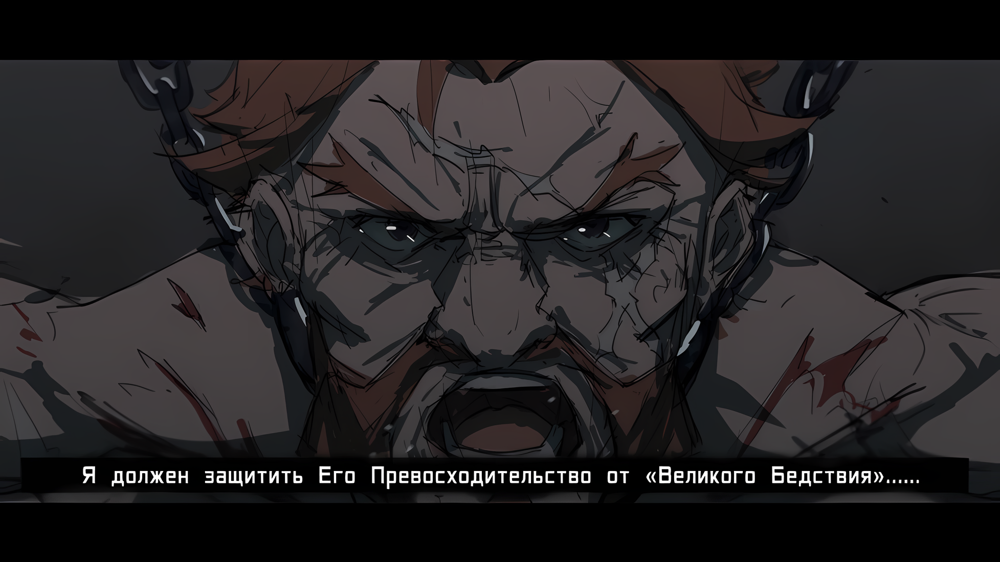

……Когда мир сотрясали толчки, небо раскололось на белое и красное, и множество столкновений привело к событию катастрофических масштабов, Рем решилась действовать.

Рем: Если делать шаг, то сейчас или никогда.

В столице Империи, где, вероятно, происходила битва невообразимого масштаба, свобода Рем была максимально ограничена, ведь она все еще находилась в заточении в особняке Беллстетза.

Она не могла сделать ничего действенного, даже когда чувствовала, что запах гари становится все сильнее и сильнее день ото дня. Чувствуя глубокий стыд за это, Рем больше не могла молча оставаться на месте.

В конце концов, она больше ни разу не встречалась лицом к лицу с Беллстетзом, хозяином особняка и виновником ее заточения, с момента их первой случайной встречи. По этой причине не было никакой возможности узнать, что думал этот старик, озабоченный будущим Империи из-за своей собственной философии и свержения тогдашнего Императора Абела, о том, как все это привело к великой битве, охватившей всю Империю.

Впрочем, даже если бы представилась такая возможность, они, скорее всего, не поняли бы друг друга.

Рем: В конце концов, мы с Беллстетзом-сан придерживаемся совершенно разным позициям.

Даже если это прозвучало холодно, в итоге Рем пришла именно к такому выводу.

Только сильные люди или те, у кого есть свобода действий, могут сочувствовать и принимать во внимание обстоятельства тех, кто находится в другом положении. Поскольку Рем не подходила ни к одну из этих двух вариантов, ей пришлось принять решение:

Кого она сделает своим врагом, а кого будет считать союзником?

Без этого Рем не испытывала враждебности ни к Беллстетзу, ни к Мэделин. Тем более что с неспособностью Абела правильно объяснить ситуацию и неразумными просьбами Присциллы справиться было гораздо сложнее.

Поэтому то, что она будет пытаться делать впредь, не будет враждебностью или мятежным намерением по отношению к ним, лишь результатом выбора, чьим же союзником она станет.

Рем: …………

С началом битвы за столицу Империи, несмотря на то, что особняк Беллстетза был построен в глубине города, последствия ожесточенной битвы все еще ощущались.

Естественно, особняк также был приведен в состояние повышенной готовности, а Рем, будучи более или менее военнопленной, было приказано ждать в отведенной для нее комнате, так что ее свобода была еще более ограничена, чем обычно.

Однако, с точки зрения охраны особняка, Рем все равно была не более чем ковыляющей девушкой, а система безопасности не была подстроена так, чтобы оставлять стражника у ее комнаты днем и ночью.

……Воспользовавшись этой небрежностью, Рем бесшумно выскользнула из комнаты.

Затаив дыхание, она переползла со светового люка своей комнаты на крышу особняка.

Поскольку она старалась не издавать ни звука, охрана не заметила тайных маневров Рем. Было бы жестоко винить в этом их небрежность — вероятно, им и в голову не пришло бы, что девушка с тростью может таким образом улизнуть из комнаты.

Это было бы так, если бы Рем действительно была девушкой, которая не может свободно ходить без трости.

Рем: Я ожидала худшего, но….

Конечно, это не было ложью, что Рем жаловалась на свой недостаток и пользовалась тростью до сих пор.

Однако, поскольку ее неполные «Воспоминания» беспокоили окружающих она постоянно тренировалась ходить, так как не могла позволить своей больной ноге навсегда остаться таковой.

Когда усилия принесли плоды, и она стала в некоторой степени способна стоять, ее осенило. ……Если она заставит их поверить в то, что она хромает, это может пригодиться.

На самом деле, она еще не задумывалась, как именно это может пригодиться.

Напротив, если бы ее бесполезный секрет был раскрыт, она могла бы нечаянно привести всех в боевую готовность. Однако, поскольку ее неприятности действительно оказались полезными, она, пожалуй, могла сказать, что осталась в преимуществе.

Однако она не могла ослабить бдительность. Ведь она могла сказать, что ее преимущество использовалось с пользой, только когда эти действия стали бы приводить к каким-то результатам.

Если кто-то из кожи вон лезет, чтобы заполучить преимущество, оно теряет смысл, если тот им не пользуется.

В первую очередь Рем старалась не думать о том, чье влияние заставило ее пойти на такие махинации.

В любом случае……

Рем: ……Надеюсь я смогу остаться незамеченной.

Когда она забралась на крышу, цель Рем… сбежать из особняка, была уже не та.

Это был трудный выбор, но кроме нее в особняке в плену находился и Флоп. Он никак не мог выбраться один, к тому же особняк был окружен высокой стеной. В отличие от крыши, перелезть через нее было бы сложно, так что, похоже, не было смысла даже думать об этом.

Рем выбралась из своей комнаты, намереваясь связаться со всеми «Наследными Принцами», которые собрались где-то на этом участке земли.

Если верить тому, что она слышала, «Черноволосого Наследного Принца» называли лидером восстания. Несмотря на сомнения в том, является ли он законным ребенком Абела, у него, вероятно, была одна-две мысли о нынешнем состоянии Империи.

Если Рем удастся установить с ним контакт, может появиться хоть капля надежды на то, что ей удастся выбраться из ситуации, в которую она попала.

Рем: Мне нужно убедиться, что я и Флоп-сан, а также Катя-сан в безопасности.

Она чувствовала, что ей нужны союзники, которые могли бы сотрудничать друг с другом.

Она осторожно пробиралась по крыше к краю, стараясь не издать ни звука. Несмотря на то, что она старалась ступать тихо, не было никакой гарантии, что стражники ее не найдут и она сможет удачно скрыться.

Чтобы не упустить такую возможность, она была готова рискнуть жизнью в случае, если ее заметят. По этой же причине она не могла оставаться в стороне.

Этим было.…

Рем: ……Кх.

Внезапно странное явление, появившееся в далеком небе, заставило скелет Рем чуть ли не вылететь из тела.

Краем зрения она уловила, что за стенами столицы Империи происходит битва, а нависшее небо превратилось в необычное зрелище.

Находясь на таком расстоянии от событий, Рем не могла знать подробностей о том, что «Облачный Дракон» Мезорея опустился на вершину звездообразных стен, защищающих столицу, «Пожирательница Духов» Аракия превратила облака в пламя, а Могуро Хагане возвышался над самой крепостью.

Не зная реальной действительности, Рем напряглась, инстинктивно почувствовав опасность. В тот же миг она потеряла силы, чтобы остаться стоять на крыше.

Когда изо рта Рем вырвался звук «Ах», ее тело одновременно соскользнуло вниз по склону крыши. Она чуть ли не упала вниз, но вместо этого быстро изо всех сил ухватилась за край крыши.

Рем: Было близко……

Если бы она закричала или упала вниз, оправданий бы не было.

Едва держась за край крыши, Рем выдохнула с облегчением. Медленно она попыталась вернуться на крышу, а затем……

Рем: ……? Это…?

Поскольку ее цель все еще была далеко, она висела на месте, возвращаясь с места падения. Дверь в самом углу, привлекла внимание Рем, пока она держалась за край.

Несмотря на то, что ей было разрешено относительно свободно входить и выходить в пределах особняка и она уже везде успела осмотреться, это был первый раз, когда она заметила дверь в отдельное здание, куда вход был запрещен. Обойдя особняк по крыше, она забрела в условно недоступную часть.

Рем: Потайная дверь…? Но для чего?

Когда в голове возникли вопросы о ее открытии, она на мгновение застыла в нерешительности.

Ее предварительной целью было установить контакт с далеким наследным принцем. Это дало бы ей более четкое представление о ситуации, а также больше шансов найти выход из нее.

С другой стороны, неожиданная потайная дверь могла в итоге оказаться обычным погребом для спиртного. Стоило ли рисковать, чтобы попасть внутрь?

Рем: …………

Ей даже не нужно было думать о том, что было рациональнее. ……И все же Рем выбрала иррациональный вариант.

Опустив руки на край крыши, она спустилась к проходу со скрытой дверью. Она старалась ступать как можно тише, но ее шаги все равно были слышны. Однако небо, напугавшее ее ранее, оставалось все таким же необычным, так что стража особняка должна быть достаточно рассеянной.

Смело полагаясь на это, Рем приложила руку к потайной двери и распахнула ее.

Рем: Лестница, ведущая в подвал……

Дверь не была заперта, вероятно, потому, что в этом не было необходимости, а не по неосторожности.

Вряд ли это было похоже на место, куда незваные гости не должны были заходить. Поскольку Рем более или менее прибыла в особняк по приглашению, у нее не было причин жаловаться.

Оказавшись на лестнице, от которой исходил холодный воздух, и в тусклом помещении, где не было света, Рем затаила дыхание и направилась вниз, проводя руками по стене.

Существовала вероятность, что ее ждет невероятный ужас.

Возможно также, что Беллстетз заманил в ловушку нечто возмутительное и ужасающее.

Однако……

Рем: ……Здесь кто-нибудь есть?

С зерном таинственной неуверенности Рем задала вопрос в темном подвале, в который она попала.

Он был слабо освещен, но можно было почувствовать, что он не такой уж и просторный. Кроме того, в глубине помещения находилось большое присутствие, которое можно было различить лишь смутно.

Хотя оно казалось массивным, но отнюдь не чудовищным.

Человек с довольно крупным телосложением; такой человек был прикован цепями и прижат к задней стене подвала.

Этот человек услышал вопрос Рем и……

???: Его Превосходительство, я должен…

Рем: ……Вы?

???: Винсент Волакия, Его Превосходительство Император, я должен… защитить…

Низкий, изношенный голос жалобно отозвался в спертом воздухе подвала.

Искренний тон, содержащийся в голосе, был сильным и мощным, наполненным беззаветной преданностью.

Рем: …………

После этих слов Рем решила делать шаг за шагом, сокращая расстояние между собой и человеком.

При этом в темноте смутно вырисовывалась фигура привязанного крупного мужчины. Его тело было очень огромным, а на лице виднелись белые шрамы……

???: …Гоз… Ральфон.

Спустя мгновение Рем поняла, что это, вероятно, было имя, которое он пробормотал.

На самом деле, оно звучало знакомо.

Если она правильно помнила, он был одним из «Девяти Божественных Генералов»…… одним из самых могущественных и известных существ в Империи Волакия.

Гоз: Я должен защитить Его Превосходительство от «Великого Бедствия»….

Этот человек был похож на льва, настолько, что его голос звучал как героический рев, а его покрытое шрамами лицо нервно дрожало.

rezero7arc | Арт от Rokaroka

△▼△▼△▼△

Серена: ……Ты ведь сказал это, верно, Абел? Это ты распустил слух о «Наследном Принце», не так ли?

Серена Дракрой, женщина с характером, наблюдавшая за ходом осады столицы Империи из главного лагеря повстанцев, стоя со скрещенными руками, задала этот вопрос Абелу. Он медленно поднял свое лицо, закрытое маской Они.

Эскадрилья Летающих Драконов Серены появилась с дальнего запада в качестве подкрепления. С участием первоклассных наездников, владеющих навыками укрощения летающих драконов, превосходство в воздухе на поле боя неожиданно склонилось на их сторону.

Конечно, были некоторые поля, где летающие драконьи наездники были в невыгодном положении из-за присутствия «Облачного Дракона» и «Пожирательницы Духов», но не обязательно было держать все поле боя под своим контролем.

Достаточно было пробить одну брешь, и даже стены столицы Империи, славившиеся своей прочностью, начали бы рушиться с этого момента.

Для этого были предусмотрены соответствующие меры; по крайней мере, Абел так считал. Поэтому, зная, что на поле боя бывают слабые и тупиковые ситуации, он продолжал периодически отдавать приказы.

Абел: Похоже, у меня теперь есть время на твою пустую болтовню? Если уж на то пошло, не следует ли тебе следить за передвижениями своих подчиненных?

Серена: Да, конечно. Но меня огорчает, что ты воспринимаешь это как болтовню. Я заняла позицию из-за твоего письма и быстро перешла на твою сторону. Поскольку мой приход был так важен для твоей стратегии, более внимательное отношение ко мне не заставит тебя потерять лицо.

Абел: Сказано в духе никчемного простолюдина.

Серена: Даже если я говорю как обыватель, я бы не хотела вести себя так. Мне просто слишком любопытен ответ на прошлый вопрос.

Пожав плечами, Серена отвела взгляд от неба и посмотрела на Абела.

Ответ, о котором она говорила, вероятно, был подкреплением с запада, а также ответом на военный потенциал за пределами Эскадрильи Летающих Драконов Серены.

Хотя она догадывалась о непредвиденных подкреплениях и о том, кто их возглавляет, она сожалела о неосторожности своих прежних слов и действий.

Это привело к словам, с которых Серена начала свою пустую болтовню.

Серена: «Черноволосый Наследный Принц», это ведь ты распространил эту историю. И разве не этот Наследный Принц возглавляет ту группу в разгар их славного буйства?

Абел: Вкратце, ты считаешь, что этот переполох на поле боя устроил незаконнорожденный отпрыск Императора?

Серена: Нет, мои извинения. Это такая фигура речи. Я не верю, что «Черноволосый Наследный Принц» действительно сын Его Превосходительства. По всей вероятности, у Его Превосходительства нет детей.

Покачав головой на слова Абела, Серена ответила довольно уверенным тоном. Когда он поднял бровь на ее уверенный ответ, она продолжила: «В любом случае».

Серена: Его Превосходительство никогда не брал в жены кого-либо, и нет никаких упоминаний о том, что он когда-либо вступал в интимную связь с женщиной. Я пыталась соблазнить его раньше, но он полностью игнорировал меня. Это должно послужить веским доказательством.

Абел: ――. Ты в своем уме?

Серена: Конечно, я совершенно серьезно.

Абел: Я не спрашивал, серьезно ли ты или нет, я спросил, в здравом ли ты уме.

Взгляд Абела стал суровым, поскольку ему представили довольно неубедительную причину для ее аргументации.

Серена была одним из самых выдающихся Верховных Графов в Волакии, и поскольку Абел так высоко ценил ее способности и амбиции, он считал ее одной из необходимых сил в этой решающей битве. Однако, если он судил о чем-то на основе непонятных стандартов, это само по себе означало, что есть над чем подумать.

Серена, пытавшаяся взглянуть на ситуацию глазами Абела, сказала: «Подожди», расцепив руки и вверх одну из них,

Серена: Я не шучу, просто это самая существенная причина. То, что Его Превосходительство не соблазнился мной, расстраивает, но в то же время на что-то намекает.

Абел: …………

Серена: Что Его Превосходительство не интересуется женщинами. Говоря более прямо, у него нет намерения произвести потомство.

Абел, потерявший дар речи, посмотрел на Серену, которая продолжила: «Это должно быть так, верно?».

Серена: Я не говорю, что он расхититель женских покоев, но у Его Превосходительства нет сына. По крайней мере, не на данный момент. Но даже если бы Его Превосходительство был интимным расхитителем, у него все равно могли бы быть дети, несмотря на эту склонность. Есть две возможности: он либо бесплоден, либо…

Абел: Намеренно не производит потомство.

Серена: Именно. В любом случае, я не думаю, что существует такой человек, как «Наследный Принц». Поэтому история о незаконнорожденном ребенке вообще сомнительна. Но если простое сомнение может вызвать такую гражданскую войну, то наша страна вполне оправдывает свое название.

Улыбка Серены, с небольшим поворотом щек, была искренней и радостной.

Абел не обратил внимания ни на ее отношение, ни на ее догадки. Примечательно, что Серена не нуждалась в мнении Абела.

Такие люди, как она, способны подтвердить свои собственные идеи без подтверждения со стороны других.

Другими словами, она не искала подтверждения у Абела……

Серена: С какой целью ты выдумал существование наследного принца? После победы нашей стороны в этой битве, сядешь ли ты на освободившийся трон и что будешь делать с Империей?

……Она спросила, собирается ли он оставить будущее Империи Волакия в руках «Наследного Принца».

Абел: …………

На тихий вопрос Серены, он спокойно закрыл один глаз.

Кто-то мог бы подумать, что сейчас самое подходящее время задавать такие вопросы и отвечать на них, ведь битва вот-вот достигнет своего апогея. Но пока они сражались, было бы слишком глупо не думать о том, что будет после победы.

Естественно, поскольку они сражались с намерением победить, им нужно было планировать и послевоенный период.

Абел: Почему ты спрашиваешь меня?

Серена: Я не имею в виду, что «Наследный Принц» является… незаконнорожденным сыном Его Превосходительства, но я считаю, что он — твой самый верный представитель, который возглавит эту большую гражданскую войну. После войны, если ты и наследный принц собираетесь объединить усилия, разве не очевидно, кого мы должны спросить о будущем Империи?

Абел: ……Ха.

У Абела вырвался вздох, когда он услышал продолжающиеся мысли Серены.

Между тем, он был впечатлен эффективностью эффекта «Преграды Опознавания» маски, закрывающей его лицо.

Впечатляет, насколько хорошо она могла скрыть его личность и истинные чувства.

Серена: Что случилось? Я что-то не так сказала?

Абел: Я не смеюсь над тобой. Скорее, я восхищаюсь твоей проницательностью. Просто когда выводы расходятся, сам процесс еще сильнее разойдется. Небезосновательно, заметь.

Серена: Ну……

Губы Серены скривились в разочаровании от комментария Абела.

Но, как уже было сказано, ее проницательность впечатляла. Вполне естественно было предположить, что его целью была победа в этом восстании и захват трона Империи Волакия.

Он поставил на место человека, называющего себя «Наследным Принцем», который захватил бы контроль над троном. Если возможно, Император мог бы даже убить свою марионетку в какой-то момент и забрать трон себе.

Но……

Абел: Без сомнения, я не намерен передавать трон. Твоя оценка ошибочна.

Серена: То есть ты хочешь сказать, что все мои предположения полностью ошибочны?

Абел: Не все. Ты права, я распространил информацию о существовании «Черноволосого Наследного Принца» с намерением найти его бесчинствующим на поле боя. Но серьезность вопроса в другом.

Серена: Серьезность?

Абел: Серьезность в том, чтобы поднять его на сцену и держать в узде. Последнее не имеет большого значения. ……В любом случае, эта его наивность не может оправдать жертвы других.

Серена крутила головой и была озадачена до крайности.

Однако Абел тоже не обязан был ей все объяснять. На данный момент он должен был дать ей ответы, которые она хотела получить, и разрешить ее послевоенные проблемы.

В некоторых случаях Серена могла бы даже положить конец этому восстанию, лишив его головы прямо сейчас и принеся ее с собой в Кристальный Дворец.

Все было бы пресечено еще в зародыше этой ситуации, но в определенной степени за счет приятной жертвы Абела.

Абел: Отбрось нерешительность и милосердие и используй свою наивность по максимуму. Это то, что делает тебя по-настоящему особенным. ……Нацуки Субару.

Серена назвала его «Наследным Принцем», который, вероятно, все еще опустошал поля сражений на западе.

Даже у Абела в голове не было абсолютно целостного образа человека, чье имя он только что произнес. В его памяти он был суматошным, с ним приходилось иметь дело как с «женщиной» под прикрытием, потом еще в добавок и с детской внешностью.

Губы Абела искривлялись при виде Субару, его суматошных метаний направо и налево, когда тот попадал в ситуацию, открыто демонстрируя свою наивность и неопытность. С твердым отвращением.

……Нет, это была ненависть, или, возможно, более подходящий способ выразить это — ярость.

Солдат: ……Кто ты!?

Абел, скрывая свои негативные эмоции за маской Они, уже собирался ответить на вопрос Серены, как вдруг палатка захлопнулась.

Несколько солдат, охранявших главный лагерь, достали оружие и проявили сильное чувство осторожности. Судя по виду, они направили оружие на стройный мужчина, появившейся из-за пределов лагеря.

Он поднял пустые руки и издал смешок, оглядывая лица солдат, направивших на него оружие.

Стройный мужчина: Ну, я не ожидал, что меня так радушно встретят. Я довольно популярный парень, не так ли?

Солдат: Не шути так! Откуда ты тут вообще взялся?!

Стройный мужчина: Ведомый звездами… не слишком ли поэтично звучит?

Гнев солдат раздулся, когда они подумали, что их дразнят двусмысленным ответом.

Однако отношение мужчины не изменилось в ответ на их угрожающее поведение. Он сам прекрасно понимал, что его отношение не изменится от этого.

И именно поэтому……

Абел: ……Опусти оружие. Это существо не представляет угрозы.

Солдат: Бх, но……

Абел: Даже если бы ты дал ему нож, он все равно ничего не смог бы сделать. Он клоун, единственное умение которого — играть словами.

Стройный мужчина: Чтооо~, какое неприятное описание. Это ранило в меня самое сердце, вы знаете?

Он призвал осторожных солдат опустить оружие. Нежный мужчина, которого он пощадил, выразил свой протест Абелу, надув губы.

Затем Серена, стоявшая рядом, тоже недоверчиво посмотрела на него.

Серена: Почему ты здесь? Ты случаем не «Звездочет»?

Стройный мужчина: ……Убирк, будьте любезны. Рад познакомиться с вами, Верховная Графиня Дракрой. Но опять же……

Когда мягко выглядящий человек……Убирк представился, он завораживающе улыбнулся со странным утонченным лицом.

Убирк, который должен был находиться в Кристальном Дворце в столице Империи, напыщенно и помпезно объявил смысл своих слов.

Убирк: ……Я принес разговор о событиях после «Великого Бедствия», если вы, конечно, переживете его, верно?
