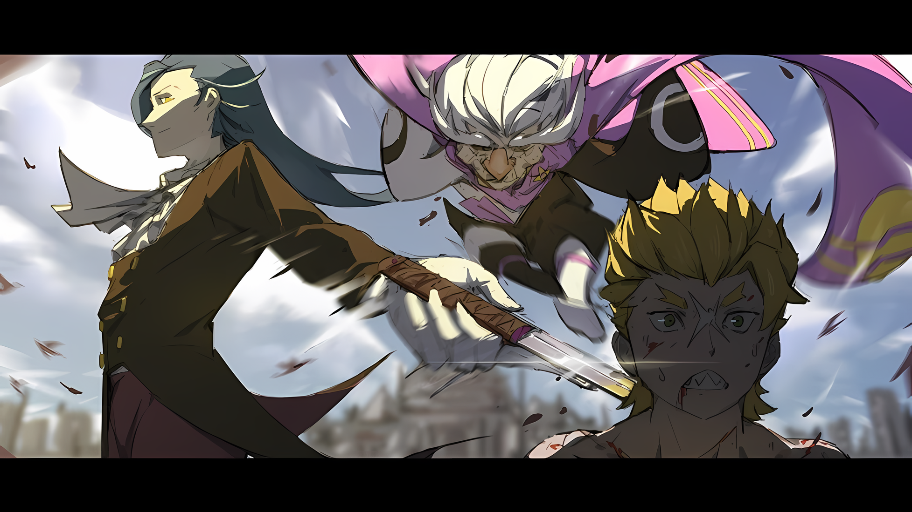
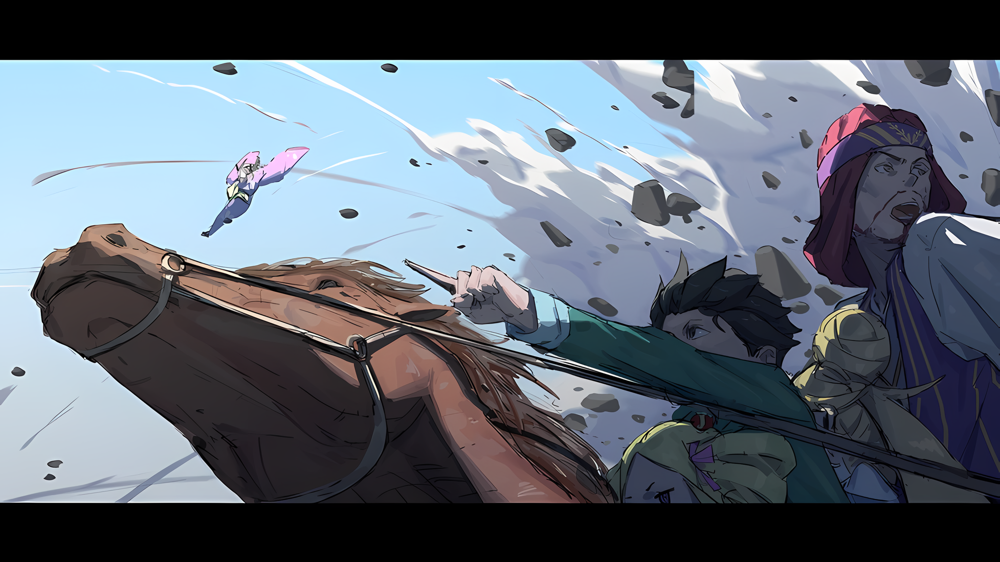

Прижав кулаки к земле, он встал, перенапрягая уже итак дрожащие колени.

Сила тяжелых ударов отозвалась в центре его тела, и внутренние органы закричали, будто их месили.

Раны и синяки можно было надежно залечить, просто всасывая силу земли сквозь подошвы. Однако незнакомые приемы, использованные его противником, преодолевали такую грубую защиту.

Противник был одним из сильнейших в Империи, а так же с отвратительным поведением и таким же характером.

Его приемы, отточенные тренировками за пределами человеческих знаний, безжалостно издевались над безрассудным Гарфиэлем.

Однако не было причин трусить из-за недостатка опыта или возраста.

Гарфиэль, не способный ни на что ловкое, просто требовал победы. Он не мог выбрать другой путь, тем более……

???: Как будто я могу просто трусить рядом с тобой.

Стиснув зубы, Гарфиэль поднял голову и дал волю своей мысли.

Его взгляд оставался неподвижным, в то время как внимание было приковано не к его несомненному врагу, а к человеку, стоящему рядом с ним, его личному «Врагу».

???: Ну и ну. Твой неумолимый дух — это, конечно, достоинство, но не разумнее ли в данной ситуации направить его на того старика, а не на меня?

Гарфиэль: «Отложенный Кагрикон». Не неси чепухи. Я этим занялся задолго до сегодняшнего дня.

???: Ну, это было примерно полтора года назад… И это только то, что знаешь ты, признаться честно, на этом все далеко не заканчивается.

Пожав худыми плечами, мужчина… Розвааль, ответил довольно мутно.

Без грима и костюма клоуна, чтобы скрыть свою истинную сущность, он сохранил ауру благородного дворянина.

Это была искусная маскировка, которая не позволяла показать, насколько извращенным он был в своей основе.

Действительно, без совета мерзкого Розвааля ситуация могла быть смертельной.

Поскольку Гарфиэль знал об этом, в его животе почувствовался жаркий гнев.

С другой стороны……

???: ……Я немного не понял момента, когда ты сказал, что уже дрался с шиноби.

Эти слова пробормотал старик маленького роста, которого легко можно было принять за гнома.

Размахивая рукавом правой руки, которая отсутствовала ниже запястья, и с выражением лица, которое делало его похожим на добродушного старика, было совершенно непостижимо, насколько он был страшен на самом деле.

Гарфиэль с болью осознавал, что это тоже было частью техник шиноби.

Все в нем, его жесты, слова, действия и даже его слабый вид были инструментами, чтобы принести противникам только смерть…… Шиноби использовали все свое существование как смертоносное оружие, чтобы покончить со своей целью.

Как глава шиноби, этот старик пристально смотрел на Гарфиэля и другого человека…… вернее, на Розвааля. Он не обвинял его в грубом вмешательстве в поединок один на один, но его беспокоило другое.

……То, что он уже сражался с шиноби, а так же хвастливость его заявления.

???: Основное правило боя с шиноби — потерять жизнь. В случае, если шиноби погибает, деревня получает уведомление, и следующего отправляют до тех пор, пока противник не умрет. Как же ты до сих пор жив?

Розвааль: В этом отношении все немного сложнее. Видимо, у шиноби, с которыми я столкнулся, тоже были свои обстоятельства. Не знаю, правильное ли это слово, но они были беглецами.

Ольбарт: Беглые шиноби…

Прошептал старик поглаживая пальцами свои длинные белые брови.

Гарфиэль не понимал слов, которые произносил Розвааль. Существование шиноби было всего лишь малодостоверным слухом, но даже тогда их роль была сомнительной.

Естественно, никто не знал о реальном положении дел. Он никогда раньше даже не слышал о термине «беглый шиноби».

Ольбарт: Шиноби, которые сбежали из деревни, хотя такого не происходило довольно давно?

Однако вместо того, чтобы отрицать незнакомые слова, он лишь откровенно рассказал об их содержании.

Это прозвучало так, словно он был в курсе ситуации с деревней и этими шиноби, а все остальное, вероятно, было правдой. Он хватался за то, что попадало ему в руки, не по обязанности, а как за образ жизни.

В этом и заключался секрет успеха в жизни шиноби по имени Ольбарт Дарккенн.

Розвааль: Я не знаю, сколько должно пройти времени, чтобы ты мог использовать выражение «довольно давно», но, возможно, оно находится за пределами твоего представления. Во всяком случае, я встретил этих шиноби почти сорок лет назад.

Ольбарт: Аа?

Пожав плечами, «Порочный Старик», Ольбарт, поставил под сомнение его ответ.

Тот же вопрос возник и у Гарфиэля. Скорее всего, все, что он сказал до сих пор, было просто случайным высказыванием, и он восхитился наглостью этого человека.

Хотя он так и не удосужился узнать возраст Розвааля, ему было максимум около тридцати лет — что отличало его от Эмилии или Беатрис. Он не мог родиться сорок лет назад.

И с этой нелепой выходкой против Ольбарта……

Ольбарт: ……Шаске и Райзо, верно? Ты говоришь о тех сбежавших шиноби.

Розвааль: Охо.

Ольбарт: Они покинули деревню 40 или 50 лет назад, и единственные, кто остался в живых, из всех им подобных. Остальные были убиты, так что других кандидатов нет.

Когда Гарфиэль отверг его рассказ как шутку, Ольбарт стал подыгрывать ему еще более упорно. Рядом с подростком, который с недоумением смотрел на него, Розвааль закрыл один глаз.

Он посмотрел на Ольбарта своим жутким желтым глазом,

Розвааль: Что ж, полагаю, я обязан ответить, прав ты или нет?

Ольбарт: Неа. Это хорошая тактика — держать противника в напряжении, когда поединок на острие ножа…… Возможно, у тебя талант шиноби.

Розвааль: Я ценю комплимент, но отказываюсь его принимать. Талант, к которому я стремлюсь, и путь, по которому я хочу идти, были определены задолго до сорока лет назад.

Ольбарт: Какакакака! Понял…… Ну что ж, ничего не поделаешь.

Розвааль, покачав головой, проигнорировал похвалу Ольбарта.

Старик рассмеялся, не обращая на это внимания, и сразу после этого его фигура стала туманной. В мгновение ока расстояние между ними исчезло. Его старая нога ударила цель в шею.

Однако……

Гарфиэль: Кх!

Гарфиэль затаил дыхание, когда легкий ветерок коснулся его шеи.

Смертоносный удар влетел в его шею, едва оцарапав кожу. Ольбарт нанес удар, но был вовремя остановлен.

Розвааль: Следуя только что состоявшемуся разговору, ты целишься не в меня, а в него.

Ольбарт: Избавляйся от своих врагов. Сначала самых простых. Довольно хрестоматийно, не так ли?

Сила и резкость, которых нельзя было ожидать от такого маленького роста, не могли оставить невредимой даже хорошо натренированную шею Гарфиэля от прямого удара Ольбарта.

Но помешало этому безрассудному столкновению стать реальностью то, что между шеей Гарфиэля и ногой Ольбарта проскочил кинжал особой формы… Нет, скорее не кинжал, а оружие с частями для нанесения ударов.

Называемое «Сай», это было неизвестное оружие, используемое в западной стране Карараги, и даже Гарфиэль видел его впервые.

Оно только что спасло ему жизнь.

Владельцем сая был Розвааль, который, к унизительному факту, второй раз подряд спас Гарфиэля.

Гарфиэль: Аааооо!

В тот момент, когда его опалило это унижение, правая рука Гарфиэля взметнулась вверх, буквально убивая ветер.

Естественно, целью был «Порочный Старик», который оставался подвешенным в воздухе на оси своей бьющей ноги. Поскольку у него не было возможности уклониться в воздухе, он пробил его туловище и лишил его возможности сражаться.

Ольбарт: Опа-ча.

rezero7arc | Арт от Rokaroka

Однако перед самым ударом Ольбарт увернулся необычайно ловким движением тела и прыгнул по диагонали вниз, зацепив носком ноги только сай Розвааля.

Уклонившись от разжатого кулака и нырнув под него, он ползком выбрался из зоны поражения. Сразу же Гарфиэль сделал шаг вперед……

Розвааль: Как насчет того, чтобы немного успокоиться?

Гарфиэль: Гха!

Тело, планировавшее вскочить, было оттянуто назад за талию, чтобы унять ветер в его парусах.

Гарфиэль заметил, что Розвааль зацепил кончик своего сая за пояс его одежды. Ему стало интересно, что он пытается сделать, и в тот момент, когда он попытался огрызнуться, он разгадал его намерение.

Потому что вращающееся черное лезвие, пролетая мимо, задело нос Гарфиэля.

Гарфиэль: Кх.

Розвааль: В тот момент, когда вы разделились, он бросил летящий клинок в твою слепую зону, заложив руки за спину. Бросок — это всего лишь мелкий трюк, но у шиноби есть целый кладезь таких приемов. Не говоря уже о том, что наш противник — высший класс.

Ольбарт: Если ты думаешь о чем-то настолько напыщенном, как быть на вершине узкого пространства, люди будут показывать на тебя пальцем и смеяться над тобой. Быть на вершине шиноби — это не то, чем можно хвастаться.

Не заботясь о том, что пропустил атаку, Ольбарт закрыл один глаз и бдительно смотрел на них.

Гарфиэль снова стиснул зубы от унижения из-за того, что он остался в стороне. Розвааль спас ему жизнь не раз и не два, а уже трижды.

В схватке с Кафмой ему удалось преодолеть свой силовой барьер.

Несмотря на это, он ничего не мог сделать против этого человека, который насмехался над его боем с Кафмой. Это был позор для самого Гарфиэля и для Кафмы, который проиграл ему, однако…

Розвааль: …Гарфиэль, не ошибайся в оценке его силы.

Гарфиэль: А…?

Розвааль: Ты силен. Поэтому твой противник пытается избежать боя не в своей тарелке. Как только ты поймешь его хитрость, большая часть твоей слабости исчезнет.

Он вытащил еще один сай, говоря это сжимавшему кулак Гарфиэлю.

С короткоствольным оружием в обеих руках Розвааль больше не выглядел Главным Придворным Магом, которого знал Гарфиэль, он скорее пытался сохранить облик простого воина.

На мгновение возникло замешательство, но после паузы он понял его намерение.

Розвааль должен был подчиниться ограничению, согласно которому в данной ситуации нельзя было использовать магию.

Если бы он воспользовался магией, его истинная личность могла быть раскрыта. Если это произойдет, гражданская война внутри Империи может перерасти в войну между Королевством и Империей.

Таким образом……

Розвааль: Все, что я могу сделать, это обеспечить прикрытие… Ты — ключ к битве против Генерала Первого класса Империи, Гарфиэль.

Гарфиэль: …………

Розвааль: Это правда, что у нас плохая химия. В конце концов, ты прямолинеен и честен. В таком случае, я найду обходной путь для устранения этого недостатка. Итак, у меня есть……

Гарфиэль: ……Скверный характер.

Он криво улыбнулся Гарфиэлю, услышав эти искаженные слова из его уст.

Розвааль: Да, у меня скверный характер. Вполне надежно, не так ли?

Гарфиэль: Пха! Хватит болтать!

В ответ на подмигивание, Гарфиэль вытер рот тыльной стороной ладони.

Он вытер кровь, которая все еще текла от предыдущих ударов, и глубоко выдохнул. С грохочущего неба пришло ощущение палящего жара и сильного холода, каждый из которых был не менее угрожающим, чем другой.

Одной мысли о том, что эти покалывающие ощущения направлены на его товарищей, достаточно, чтобы онеметь всему телу.

Однако……

Гарфиэль: Только сейчас.

*Если я не сосредоточусь на враге передо мной, следующего раза не будет.*

Ольбарт: Теперь, когда двое против одного, это начинает меня раздражать.

Гарфиэль сделал глубокий вдох, а Ольбарт выдохнул, оценив ситуацию. И на слова старика он нахмурился со словами «Оо?»,

Что в этом странного? Может, это и раздражает, но это уже было двое против одного, с момента, как появился Розвааль.

Гарфиэль: У тебя так же два противника, так что нет смысла жаловаться на то, что это два против одного.

В ответ на его подозрение, Ольбарт согнул шею.

«Порочный Старик» прикоснулся к своим длинным белым бровям,

Ольбарт: Двое против одного только тогда, когда двое сотрудничают… То, что было до сих пор, так это просто пара нахальных юнцов, ну а теперь стало раздражать.

Гарфиэль: Тогда, может, сдашься, раз уж ты в невыгодном положении?

Ольбарт: Какакака! И бегство от врага, и отказ от битвы — худший вид позора, хуже собачьей смерти. Кроме того, ну……

Гарфиэль: Кроме того?

Ольбарт провел пальцем по выщипанной белой брови и обнажил зубы.

Вопреки своей улыбке, маленький старик переполнялся огромным боевым духом,

Ольбарт: ……По-моему, когда двое против одного — это не повод сдаваться.

Мгновенно улыбка старика померкла, и его фигура снова исчезла из виду.

В случае с «Порочным Стариком», места, где он мог находиться, являлись не только левой и правой стороной, а так же небом и землей. Нервы Гарфиэля были на пределе при виде этих возможностей.

Розвааль: ……Внутри.

По подсказке звучного голоса Гарфиэль отступил на полпути.

Мгновение спустя его глаза встретились с глазами старика, поднявшегося из-под земли,

Гарфиэль: Оооаааа!!!

Удар сконцентрированный всем телом был нанесен в нижнюю часть его обзора, в то же время как Ольбарт вскочил на колени.

Кулак Гарфиэля врезался в колени старика, которые были похожи на засохшие ветки.

Ударные волны прокатились по земле, заставляя ее трескаться и распространяя ужасающие разрушения.

С этим первым прямым ударом началась смертельная битва с шиноби в прямом смысле.

△▼△▼△▼△

……Как всегда опоздавший герой.

Хотя в этом было что-то роковое, Субару это не нравилось.

Правильнее было бы сказать, что он перенесся в другой мир, и в процессе переживания различных событий в этом мире он пришел к мысли: «Лучше так не шутить».

Субару: Если бы это было игрой или мангой, это было бы нормально.

События в вымышленном мире нуждаются в таком развитии для оживления.

Однако для Субару, который действительно жил в неспокойном мире, чем быстрее на сцене появится герой, героическая личность или человек со способностями, превосходящими человеческое понимание, чтобы разрешить конфликт, тем лучше.

Лучше всего, чтобы герой появился как можно быстрее и быстро избавился от корня проблем.

Если люди говорят, что это неинтересно с точки зрения повествования — это нормально. Обсуждать, было ли это весело или нет, можно только тогда, когда у них хватит бы на это ума.

Субару: И все же жалко, что мы прибыли последними!

Покачиваясь на лошади Галевинд, Субару с сожалением смотрел вперед.

Эта битва вокруг столицы Империи должна была решить ее судьбу. Трудно было сказать, кому жаловаться, но сейчас Субару сгорал от ярости на собственную тупость.

Несмотря на то, что он думал о том, как сильно он это ненавидит, в итоге он оказался таким же героем, который прибыл с опозданием.

В конце концов……

Субару: Разве это не похоже на то, что герои, склонные к опозданиям, больше всего стремятся достичь наилучшего исхода в бою!?

Причина, по которой опаздывающие герои прилагали столько усилий, заключалась в том, что они сами очень сожалели о том, что опоздали.

Герой с болью осознавал, что его друзья, люди, которых он должен был защищать, или те, кого он не хотел потерять, пережили за это время тяжелые и болезненные времена. Именно поэтому.

Впервые Субару узнал, на чем основывалась борьба героев, последовавшая за тем, что они с самого начала не смогли вовремя прибыть на поле боя. ……В этом они тоже винили себя.

Субару: Давай сделаем это, Беатрис!

Беатрис: Эль Шамак!

С этим пониманием, Магия Тени маленькой девочки, прижавшейся к груди Субару, была высвобождена — черные облака появились из воздуха, одно за другим, и окутали головы выстроившихся Имперских солдат.

Лишить людей зрения, чтобы уменьшить их боевую мощь… это не тот случай. Солдаты с окутанными тенью головами были лишены не зрения, а, скорее, самой боевой силы.

Батальон Плеяд: ОООООААААА!!!

Застывшая на месте шеренга Имперских солдат с покрытыми головами была смята первой атакой Батальона Плеяд, ворвавшегося к ним со своим необычным стилем боя.

Лишить их сил, чтобы отобрать у них оружие и броню, а также повредить им конечности, чтобы оставить их позади, было общей тактикой батальона, отражающей стиль боя и намерения их босса, Субару.

Не то чтобы он стремился никого не убивать.

Тем не менее, он выбрал метод, который привел бы к как можно меньшему количеству человеческих смертей. Так было лучше для душевного спокойствия Нацуки Субару, и в то же время……

Субару: ……Я ненавижу Империю Волакия.

Это была его месть, месть Империи, которая заставляла людей сражаться и убивать друг друга, только для того, чтобы стать воином.

???: Шварц, мы приближаемся к городским стенам. Нам нужно решить, идти ли дальше в город Империи или направиться к другим бастионам, чтобы обеспечить поддержку.

Сотрясая землю, Густав Морелло бушевал со своим необычайно огромным визави.

Назначенный губернатором «Острова Гладиаторов» и незаменимым мозгом Батальона Плеяд, он орудовал четырьмя толстыми сильными руками и демонстрировал огромную боевую мощь, сдерживая приближающихся Имперских солдат.

Пока мощные руки Густава наносили удары по солдатам и без труда отправляли их в полет над головой, Субару увидел приближающиеся стены, а именно четвертый бастион стены в форме одного из углов звезды, окружавшей город.

Завоевание каждого бастиона было условием перевеса в этой осаде.

Субару: Что вы думаете, Густав-сан? Как мы должны атаковать?

Густав: Я не в том положении, чтобы решать это. Я просто представлю возможные преимущества и недостатки. ……Если мы войдем в город Империи и доберемся до Кристального Дворца, то сможем ускорить завершение битвы. Если мы пойдем к другим бастионам, чтобы оказать поддержку, мы сможем уменьшить потери с обеих сторон с помощью наших основных сил. Вот и все.

Субару: Как тревожно! Как тревожно, но все же……

Хотя Густав умел сохранять спокойствие даже в разгар боя, Субару ненавидел его характер, поскольку он никогда не помогал ему принимать решения в таких ситуациях.

Однако представление возможностей никогда не заставляет человека выбирать их.

Пока Густав продолжал держать строй, Батальон Плеяд оставался единым, не распадаясь на части.

Если бы была еще одна причина такого отношения Густава и единства батальона……

Субару: Густав-сан! Возьмите с собой Хиайна и половину знаменосцев для поддержки других сражений! Вайц! Возьми вторую половину и держи эту позицию! Я оставляю это вам!

Поскольку Субару было доверено принимать решения на месте, он должен был исполнять их надлежащим образом.

Густав: ……Я признаю свою позицию.

Хиайн: Я всегда за, братишка! Мы все вместе в этой лодке!

Вайц: Конечно, мы в одной лодке, ящер…! Поскольку это твоя просьба, я послушаюсь……

Услышав решение Субару, все, кто был призван, один за другим ответили.

Он принял экстравагантное решение принять оба варианта, предложенных Густавом. Но даже в этом случае пришлось бы разделить силы на каждое поле боя, но……

Субару: ……Если это мы, то у нас все получится!

Можно было легко заметить, как энтузиазм членов отряда еще больше возрос после его заявления.

И именно поэтому они были его товарищами, с которыми он сражался вместе на том адском острове, прежде чем они перебрались сюда.

Идра: Шварц, что нам делать!?

Субару: Все уже решено! Мы совершим грандиозный вход через стену!

Идра задал ему вопрос, держа поводья лошади Галевинд, скачущей галопом вместе с Субару.

Он бодро ответил на очевидный вопрос, указывая на крепостные стены перед собой. Затем, устремив взгляд на внушительную стену, он открыл рот и сказал,

Субару: Уничтожь ее, Танза! Я рассчитываю на тебя!

???: ……Шварц-сама очень хитер.

Получив ободряющий крик Субару, маленькая тень проворно выпрыгнула прямо с его стороны.

Подняв подол своего кимоно и оттолкнувшись от земли, она направилась к стенам. Она была незаменимым членом Батальона Плеяд, попав к Субару по странной причуде судьбы.

Просто… она была самым сильным нападающим в отряде Плеяд.

Танза: Хиааа!!!

Летя как пуля, Танза крутанулась в воздухе, после чего деревянный сандаль, который она носила на ногах, пробил стену.

После одного удара прочная стена разлетелась вдребезги, и фигура Танзы проникла за нее. Ударная волна образовала трещину в четвертом бастионе, и трещина распространилась по всему его периметру.

rezero7arc | Арт от Rokaroka

Субару: Впередвпередвпередвперед!!!

Все: ОООООО!!!

Затем, по приказу Субару, импульс Батальона Плеяд вбежал прямо в то место, куда Танза нанесла первый удар.

Это была уже не атака отдельного члена батальона, а удар единого живого существа, Батальона Плеяд, перед которым не смогли устоять даже стены Имперского города Рапганы, гордившегося своей силой.

Субару: …………

Раздался громовой рев и взметнулось ужасное облако пыли, а затем стены были разрушены силой.

Увидев это ошеломляющее зрелище, Субару принял позу триумфатора, а Беатрис в его объятиях широко раскрыла свои круглые глаза.

Беатрис: Чтобы эта стена была так легко… какой абсурд, я полагаю…

Танза: ……Это все Батальон Плеяд.

Она вылетела из стога пыли в ответ на испуганное бормотание Беатрис.

Стряхивая пыль со своего кимоно, она была из тех девушек, чье выражение лица едва заметно, однако в этот раз она, казалось, была немного горда собой.

Хотя она и не проявляла особого товарищества, она осознавала, что является членом Батальона Плеяд. Иначе на нее не подействовала бы «Сила Единства».

Однако Беатрис, похоже, не понравилось отношение Танзы.

Беатрис: Какое дерзкое выражение лица…!

Танза: Называйте меня дерзкой, но я родилась с таким лицом.

Беатрис: Выражения лица бывают разные, я полагаю! Их можно с легкостью менять.

Луис: Уу! Аа, уу!

Глядя вниз на явно отстраненную Танзу, Беатрис, сидевшая верхом на лошади, покраснела. Затем, как бы принимая сторону второй, Луис, прижавшаяся к спине Субару, тоже начала суетиться.

Мальчик крикнул: «Подождите, подождите, подождите, успокойтесь!» взбешенным девочкам.

Субару: Не ссорьтесь! Мы — команда! Товарищи! Единое целое!

Беатрис: Га…?

Танза: Поняла, Шварц-сама.

Беатрис: АаАа, я полагаю.

Беатрис в замешательстве покачала головой на те слова, в то время как Танза поклонилась ему со знанием дела.

Знание событий на Острове Гладиаторов было разницей между этими реакциями, но губы Субару искривились, поскольку атмосфера, казалось, все больше и больше становилась искрой для гнева Беатрис.

Однако в момент, когда Субару решил выступить посредником……

???: Будь ты проклят…!

Субару: А?

Одинокий Имперский солдат, подкравшийся среди пыли, образовавшейся из-за рухнувших стен, поднял меч и направил его на Субару.

Даже если в это трудно было поверить, Субару явно был лидером этой группы для стоящего перед ним вражеского солдата. В Империи было принято не недооценивать детей.

Поэтому меч солдата был равнодушно направлен на Субару……

Луис: Уау!

Мгновенно сила, удерживающая Субару сзади, стала сильнее, и его зрение в мгновение ока изменилось.

Все произошло очень просто: за миллисекунду лошадь Галевинд переместилась… Нет, она телепортировалась с того места, где стояла до этого.

Идра: Чего, что…? Бхааф.

Внезапная телепортация поразила Идру, который держал поводья, а затем его непроизвольно вырвало, так как внутренние органы были взбудоражены. Субару тоже помнил ощущения от этой необычной силы, которой обладала Луис.

Затем……

Беатрис: Шамак.

Солдат: Ч…!? Ку… Куа!?

Короткое пение Беатрис затуманило чувства Имперского солдата, и плавный удар Танзы великолепно подрезал его ноги, повалив его тело плашмя на землю.

После этой мгновенной демонстрации командной работы двое, достигшие ее, обменялись взглядами с повозки.

Танза: Отличная работа.

Беатрис: Согласна, твое движение было неплохим, я полагаю.

Таким образом, напряженная атмосфера, царившая ранее, полностью изменилась, так как они признали друг друга.

Субару: Что ж, приятно видеть, как маленькие девочки потеплели друг к другу… Кстати, Луис! Не делай этого так внезапно, ты вывернула желудок Идры наизнанку! Хотя это очень помогло!

Луис: А, а!

Субару: Хммм, хороший ответ! Идра, сделай глубокий вдох! Это может быть первый и последний раз, когда такое случается.

Идра: Я… я постараюсь…

Благодаря силе телепорта Луис, по крайней мере, один непредвиденный форс-мажор был предотвращен.

Если бы дело дошло до драки, Субару без колебаний воспользовался бы этой возможностью, как бы сильно Идру ни тошнило.

Субару: Не то чтобы я мог справиться с двумя или тремя подряд… Густав-сан! Хиайн! Вайц!

На призыв вновь ожившего Субару, лица перед рухнувшей стеной обернулись к нему. Одно за другим, они пристально смотрели в глаза знакомому лицу.

Субару: Я рассчитываю на всех вас!

Густав: Моя задача — выполнять свои обязанности. Ты должен делать то же самое.

Вайц: Давайте сделаем это! Время для триумфального возвращения Батальона Плеяд в полном и внушительном составе!

Хиайн: Шварц, мы будем защищать это место до последнего… Иди и забери этот трон…!

Группа Густава отправилась на другое поле боя, группа Вайца осталась, чтобы защищать рухнувшие стены, а Субару оставил своих надежных людей на их соответствующих постах, а сам ткнул Идру в грудь затылком.

Когда тот получил удар головой, Идра выглядел так, будто держал его на руках, сидя верхом на лошади Галевинд,

Идра: Ну, мы внутри. Похоже, мы первые.

Храбро смеясь, Идра поскакал через обломки городских стен во внутренний город. Покачиваясь на той же лошади, Субару тоже въехал в город Империи Рапгану.

Городской пейзаж столицы Империи, скрытый в высоких стенах, не был виден снаружи целиком, но это было методичное, упорядоченное и дисциплинированное расположение зданий.

Субару: Представитель города должен быть нервным, чтобы построить все таким образом.

Если бы собеседник слушал, он мог бы возразить, какая глупая придирка — ведь он не отвечал за пристройку к городу, который был построен сотни лет назад.

Итак, высказав это одностороннее впечатление, Батальон Плеяд ворвался в столицу Империи.

Их целью было……

Беатрис: Субару! Каков план, я полагаю!?

Танза: Шварц-сама, что мы будем делать?

Луис: Уау! Ау, аа, уу!?

Субару: Конечно, это очевидно! Отправляемся прямо в Кристальный Дворец города Империи! Давайте вмажем этим теплым приветствием прямо в напыщенное лицо Его Превосходительства Императора!

Субару, получив этот вопрос от всех девочек сразу, ответил всем коллективно.

Беатрис, Танза и Луис кивнули в ответ на ответ Субару, но только Идра, вынужденный находиться рядом со всеми, тихо пробормотал.

Идра: С четырьмя детьми на поле боя…… Наверное, у меня все-таки никогда не было таланта воина.

Да, это была подходящая мысль для мельника.

△▼△▼△▼△

……В то самое время, когда Батальон Плеяд под командованием Нацуки Субару прорвал городские стены и первым наконец-то вошел в столицу Империи Рапгану.

???: Конечно, никто не ожидал от них такой настойчивости.

В Кристальном Дворце, в том самом месте, куда устремились все повстанцы, осаждавшие столицу Империи в своих планах по свержению основ Империи, и сжигавшие свои жизни, дабы попасть туда, позвучали эти слова.

Тронный зал располагался в самом возвышенном, самом престижном помещении замка. На стене за ним висело национальное знамя с изображением волка, пронзенного мечом, а перед ним расстилался кроваво-красный ковер, на котором стоял трон, объединяющий всю власть Империи, и сидящий на нем Император.

Молодой, умный и безжалостно красивый, как отточенное лезвие, Император не изменил выражения своего лица даже тогда, когда к нему стекались толпы людей с мечами, которые будут приставлены к его горлу.

Несмотря на то, что он сам говорил, ситуация все же превзошла его ожидания.

Даже если……

???: Из бесчисленных нитей, которые ты проложил, к какому слою ты это отнес?

???: …………

Поскольку это был тронный зал, эти слова были слишком непочтительны, чтобы произносить их Императору, восседавшему на своем троне.

Однако не нашлось ни верного слуги, чтобы осудить, ни солдат, чтобы обезглавить этого наглеца, и в комнате эхом отдавались звуки самонадеянных шагов незваного гостя по ковру.

Кроме того, в тронном зале отсутствовала еще одна непостижимая вещь.

Если бы в комнате были другие люди, они бы не обратили внимания на этот факт. ……Или, возможно, даже не нахмурились бы.

Потому что для того, чтобы признать этот факт, нужно было иметь достаточную причину, чтобы прорваться сквозь препятствия к признанию.

Однажды древнему Императору был преподнесен дар от племени, с которым его связывала дружба.

Маска, которая напоминала о» Племени Они», племени, созданном ради убийства самых страшных существ в мире, и заставляла тех, кто смотрел на нее, отводить глаза в страхе перед тем, что находится по ту сторону маски.

Поэтому нелегко было понять, что тон голоса человека в маске Они был точно таким же, как у Императора.

Затем, перед Императором Винсентом Волакией появилось некое присутствие с тем же тоном голоса, что и у него, и гордо и бесстрашно прошло по тронному залу, как будто он был его собственным.

Им был……

Абел: Должен признать, я не впечатлен. …Даже глядя снизу вверх на трон, с которого меня прогнали…

Это было триумфальное возвращение законного Императора, у которого до этого не было иного выхода, кроме как оставить свой трон.
