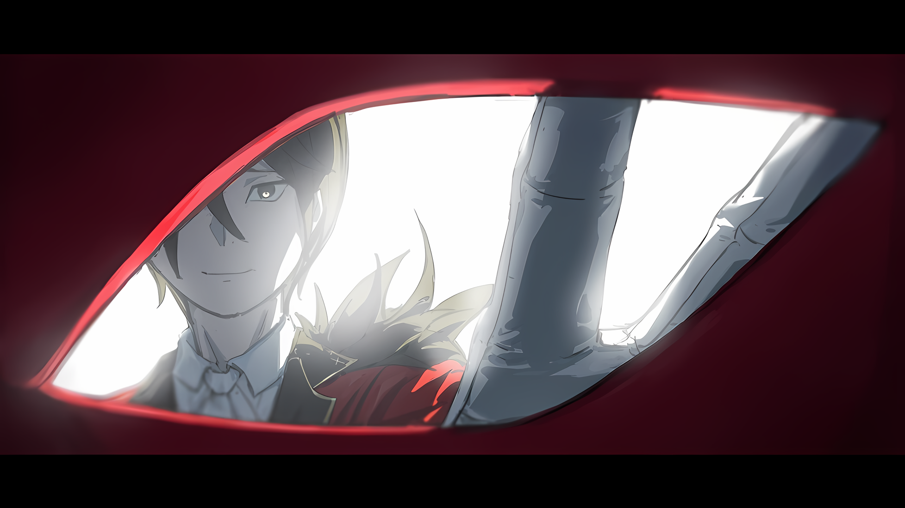

Когда Беллстетз Фондальфон заметил что-то странное и возвратился в тронный зал, он обнаружил, что дверь в самую почтенную комнату Кристального Дворца закрыта.

Слово «Закрыта» означало не просто запирание двери.

В данном случае «Закрыта» буквально означало, что дверь полностью отгорожена от внешнего мира. Это было проявлением намерения хозяина дворца никогда не впускать никого постороннего.

Однако……

???: ……В таком случае, интересно, о каком из двух намерений Императора лучше помнить, уважаемый премьер-министр?

Беллстетз остановился, его глаза чрезвычайно сузились и стали почти как нитки, глядя на клоунскую манеру деликатного человека, который, вытянув руки, стоял перед закрытой дверью.

Человек, стоявший там со слабой улыбкой на лице, был своего рода исключением, так как ему было позволено входить и выходить из Кристального Дворца по своему усмотрению из-за его особенности «Звездочета», что делало его неожиданным существом, которое имело положение ни друга, ни врага.

Беллстетз: Убирк-доно, что касается тронного зала……

Убирк: Я не собираюсь оставлять вас на произвол судьбы, поэтому скажу вам правду. Его Превосходительство Император уже здесь. И настоящий, и поддельный, так что они уже должны были встретиться лицом к лицу.

Беллстетз: ……Не понимаю.

Несмотря на то, что он обо всем догадывался, Беллстетз решил ответить именно так, подперев рукой подбородок.

Поскольку он сказал: «Не понимаю», не было никаких сомнений в том, что ему трудно принять ситуацию. На реакцию Беллстетза Убирк наклонил голову, говоря: «Не понимаете?».

Убирк: Это так трудно понять? Вам, наверное, интересно, как настоящий Император попал сюда? Если так, то меня вел шепот звезд……

Беллстетз: Даже на поле боя можно пройти по тропинке, свободной от стрел. Даже если солдаты рубятся друг с другом в тесном кругу, ты сможешь пройти не пролив и капли своей крови, не говоря уже об ударах их мечей, верно говорю?

Убирк: Да, это так. Но это еще не все.

Он кивнул с ухмылкой, делая вид, что что-то скрывает.

Как бы смешно это ни звучало, Беллстетз своими глазами видел его аномальные способности.

Однажды Убирк неторопливо прошел сквозь буквально ливень снарядов в Лесу Мечей, не получив ни единой царапины. Он утверждал, что следует за шепотом звезд, но Беллстетз не мог определить, правда ли это или ложь о его сверхчеловеческих боевых способностях.

Если что-то и можно было сказать наверняка, так это то, что он был окутан силой за пределами человеческого понимания, будь то шепот звезд или его собственные способности.

И поскольку он был так полезен, ни настоящий Винсент Волакия, ни поддельный Винсент Волакия не хотели упускать Убирка.

Все было……

Беллстетз: Ты будешь служить путеводным светом для предотвращения «Великого Бедствия».

Убирк: Ооо~, не из признания моей собственной человечности?

Беллстетз: Если кто-то и мог быть призван в Кристальный Дворец из-за своей человечности, так это Генерал Первого класса Гоз. Кроме него, все остальные призываются из-за их способностей. Я не исключение.

С точки зрения управления государством, личные привязанности — это не более чем шум крыльев насекомого, который следует игнорировать.

Такова была точка зрения Беллстетза, и почти наверняка такой же точки зрения придерживались и оба Винсента.

Это был не вопрос хорошего и плохого, симпатий и антипатий, а скорее тема, которую следует обсуждать с точки зрения необходимости.

В этом отношении Беллстетз был лишь необходимым винтиком на данном этапе. Если бы его позиция стала ненужной или бесполезной, от него бы без проблем избавились.

Убирк также не должен отступать от своей роли, независимо от его решимости.

Беллстетз: Если бы ты знал об этом, ты бы не упустил из виду наш заговор с сидящим на троне Его Превосходительством, не так ли?

Убирк: Вы считаете мои действия предательством? Тут все тяжко. В конце концов, чтобы предать, нужно, чтобы тебе сначала доверяли. Или вы хотите сказать, что доверяете мне?

Беллстетз: Нет, абсолютно.

Убирк: Вот как? Мне больно это слышать, но……

Положив руку на лоб, Убирк выглядел забавным, когда говорил, как ему больно. Было ли это от умиротворения или от чего-то другого, но Беллстетз никогда не видел, чтобы он не мог сохранить нормальное выражение лица.

Раньше он никогда не считал его неприятным, но в этот момент он впервые посчитал его бельмом на глазу.

Настоящий Винсент Волакия, изгнанный из Кристального Дворца и отказавшийся от титула Императора…… сейчас вернулся туда обратно и был привлечен к решающей сцене.

Убирк: Позвольте мне ответить на один вопрос, уважаемый премьер-министр… Я не изменил своей точки зрения.

Беллстетз: ……Какой именно?

Ранее он спросил, кем тот является, союзником или врагом. Услышав это, Убирк сложил руки перед грудью, издав звук, который эхом разнесся по воздуху.

Убирк: Конечно, я хочу предотвратить «Великое Бедствие» и сохранить мир со спокойствием в Империи Волакия.

Беллстетз: ――. По этой причине противостояние по ту сторону этой двери необходимо?

Убирк: Да, именно так. Все, что я делаю, я делаю ради этого. ……Биение моего сердца; дыхание, которое раздувает мои легкие; поток крови моего тела; абсолютно все.

Беллстетз: …………

Он молча смотрел на Убирка, который продолжал постукивать по своей груди.

Его неизменная улыбка, непоколебимая манера поведения и немного дьявольский взгляд казались в глазах Беллстетза здравыми и серьезными.

Он не мог с уверенностью сказать, были ли эти здравомыслие и серьезность заглядыванием по ту сторону безумия.

Беллстетз: ……Ваше Превосходительство, что же вы будете делать?

Пока Убирк стоял, охраняя большую дверь, а два Императора стояли друг против друга по другую сторону двери, Беллстетз бормотал про себя, думая о человеке, которого он изгнал.

Ему было все равно, обезглавят ли его, выжгут ли его душу или подвергнут любой другой жестокой казни.

Если Винсент Волакия, один из мудрейших Императоров в истории Империи, действительно хотел стать Императором, то так тому и быть.

Поэтому….

△▼△▼△▼△

???: Всегда быстрый в действиях, а так же легкий в словах человек. Я бы не стал рассчитывать на что-то в духе «Звездочета», который возлагает свою веру к небу.

???: Во-первых, я не ожидаю от этого существа никакой лояльности. Если бы иерархия устанавливалась на ее основе, Волакия не сохранилась бы в таком виде до наших дней. Но опять же…

???: …………

???: Если бы моя гибель произошла из-за того, что я не смог усомниться в положительных и отрицательных сторонах скрытых тобой амбиций, тогда можно было бы сказать, что вполне естественно, что перспектива того, что я вот так ступлю на пол дворца, была бы такой далекой.

Ступая по кроваво-красному ковру, Абел начал свою речь тому, кто стоял у него перед глазами: взгляд первого был прикован ко второму, чьи руки были скрещены.

Не было места для споров о том, кто помог Абелу оказаться здесь. Этот человек, вчитывающийся в особенности того, что выходило за рамки нормы, вкладывающий душу и сердце в исполнение желаний Наблюдателей, не имел себе равных в том, что касалось выхода за пределы игрового поля.

Это было сродни выстрелу из пушки. Однако пушки, которую нельзя было сместить со своего места, если не были выполнены кое-какие условия.

Определить условия для принудительного изменения нахождения этой пушки было особенно трудной задачей, поскольку заставить ее зашевелиться было обоюдоострым мечом. Тем не менее, ему это удалось.

Тот факт, что сейчас он вновь ступил в тронный зал, из которого был изгнан, был тому доказательством.

Интриги, утайки до этого момента — не будет преувеличением сказать, что все это было сделано для того, чтобы отвоевать эту возможность.

Абел: …………

Лицо человека, сидящего на троне, на который он положил глаз, лицо человека, которому он собирался задать вопрос, Абел видел много раз.

Это было его собственное лицо. Это выходило далеко за рамки логики, вроде простого близкого знакомства или чего-то подобного.

Это было лицо, которое для других могло показаться лицом самого Винсента Волакии, но для Абела, который знал человека, овладевшего искусством маскироваться под это лицо в течение многих лет, оно казалось плохо сделанной маской.

Однако маска остается маской, даже если она плохо сделана.

Она скрывает истинное лицо человека, утаивая его мысли, делая его невидимым. Отныне Абел говорил не глазами, а словами.

И, кроме того, он задавал прямые, пронзительные вопросы, лишенные всяких осколков и ловушек.

Абел: ……Сбылись ли твои желания сместить меня и присоединиться к Беллстетзу?

Вопрос, произнесенный Абелом, наверняка вызвал бы чье-нибудь возмущение, если бы его кто-то услышал.

Последствия драмы изгнания, начавшейся в одной из комнат Кристального Дворца, уже распространились по всей Империи. Даже сейчас Имперские солдаты и мятежники сталкивались у стен, окружающих столицу Империи, их жизни постоянно разлетались по ветру.

Люди, живущие в столице, тоже доверяли свои жизни исходу событий.

На этом фоне вопрос Абела был из тех, которые нельзя не назвать неторопливыми.

Тем не менее, он высказался именно так. Мятежник, который предпочитал не тратить что-либо попусту, который разработал столько хитроумных схем, чтобы добраться до этого места, высказался именно так. Потому что это было необходимо.

Чтобы определить, что Абел… нет, настоящий Винсент Волакия, должен узнать в предстоящем диалоге с фальшивым Винсентом Волакией.

Наконец, после паузы, слишком долгой, чтобы быть колебанием, но слишком короткой, чтобы назвать ее созерцанием……

Винсент: ……Нет, еще нет. Я еще не достиг того результата, к которому стремлюсь.

Голосом, подражающим собеседнику, был дан ответ лжеимператора истинному Императору.

Абел: …………

Для этого ответа Абелу тоже понадобилось время.

Он сделал паузу, чтобы перевести дух, не допуская ни колебаний, ни раздумий.

А затем……

Абел: Ты еще не получил того, что искал, да?

Когда это вырвалось у него изо рта, он закрыл оба глаза. …Вопреки естественной привычке.

Абел никогда не закрывал оба глаза одновременно. Он был вынужден постоянно держать один глаз открытым, чтобы его подготовка не оказалась слишком слабой, как для Императора, управляющего своей Империей.

Дело было не в том, что для Абела, который благодаря тренировкам и самосознанию был способен держать один глаз открытым даже во время сна и сохранять свое сознание в полусне, это был первый раз за несколько лет, когда наступила темнота в результате закрытия обоих глаз.

Дело было в том, что таким образом, обладая самой возможностью сделать это, Абел утверждал собственные намерения.

Другими словами,

Абел: Это обман.

С того момента, как он ступил в тронный зал, в голосе и взгляде Абела не было ни гнева, ни разочарования. То же самое относилось и к тому, что он оказался перед человеком, который совершил акт предательства, вонзив нож в его спину. Лишь его непоколебимое самообладание позволило ему сделать это.

Голос Абела, старательно отвергавший все эмоции, впервые зазвучал с оттенком.

Тон презрения, которое он перестал скрывать, направленный на человека, замаскировавшегося в его собственном облике.

Винсент: …………

Лжеимператор, пригревшись на своем троне, не проронил ни слова.

Он молчал. Хотя, было бы полезно, если бы его молчание было вызвано пустяковой гордостью.

Абел: Сместив меня с трона, ты убрал проклятого Гоза, поскольку он узнал о ситуации; также ты посмел предугадать и разрушить мои планы после моего побега и принял личное участие в уничтожении Города Демонов. Тлеющие угли распространились на всю страну, позволив, чтобы в пределы столицы Империи, куда никогда не допускались мятежники, вооруженные своими замыслами восстания, наконец-то ступили запятнанные, хамские ноги.

Винсент: Ты считаешь, что это не произошло бы, если бы на троне был ты?

Абел: Начнем с того, что если бы я был на троне, то все это сейчас не свершилось бы. В результате пламя, которое ты устроил, испепелило Империю. Однако.

На этом Абел прервал свою фразу и протянул руку к маске Они, закрывавшей его лицо.

И тогда……

Абел: ……Существует способ немедленно погасить это пламя.

Сказав это, он сорвал маску, прикрепленную к его лицу, тем самым показав свое настоящее лицо собеседнику.

С ликом, смотрящим на него сверху вниз, оба одинаковые во всех отношениях, как две капли воды, два Императора столкнулись лицом к лицу. Настоящий и ненастоящий, идеальное зеркало, в котором никто не смог бы обнаружить несоответствия.

Абел: …………

Он был мудрым человеком. Действия и слова Абела должны были ясно передать его намерения.

Когда дело зашло так далеко, он достаточно хорошо понимал свое невыгодное положение и все трудности в осуществлении своего плана. Настало время, когда непреодолимые волны разума должны были смести вынашиваемые планы.

Если препятствия, на которые они устремили свои взоры, если «Великое Бедствие», с которым предстояло бороться, было одним и тем же, то это было бы вполне логично.

Отныне……

Абел: Я…

Он собирался объявить о своем намерении вернуться на то место, где он должен был находиться.

Он издаст указ, которому трудно будет противостоять, и таким образом разрешит битву, начатую по глупым причинам.

И это случилось как раз перед этим.

Винсент: ……Ваше Превосходительство.

Это одно выражение оборвало остальные слова Абела.

Это было выражение, которое не следовало произносить с таким видом и таким голосом. Уничижая себя и ставя того, к кому оно было обращено, в более высокое положение, это было глупое заявление того, кто потерял осознание собственного положения, чего не должно было происходить.

Как только это прозвучало, слова Абела прервались на мгновение.

Возможно, это был второй раз, когда Абел… Нет, Винсент Волакия, обманул его ожидания в Кристальном Дворце, и это был, возможно, роковой момент.

В первый раз он был свергнут с трона. А теперь же, во второй раз……

Винсент: …………

Проскользнув в этот мгновенный промежуток, лжеимператор поднялся с трона.

Встав, разница в их высоте, которая была лишь в том, что один смотрел на другого сверху вниз, увеличилась на мгновение. Однако это ощущение исчезло в мгновение ока. Это больше не имело значения.

Причиной тому было……

Винсент: ……Ваше единственное упущение в том, что у вас был вид на доску только с высоты птичьего полета.

Фигура, сообщившая ему об этом, сократила расстояние за один вдох и возникла перед Абелом.

△▼△▼△▼△

……Внутри Кристального Дворца в столице Империи Рапгане один истинный Император и один лжеимператор находились на расстоянии дыхания друг от друга.

В этот самый момент в местах осады столицы одновременно произошли различные изменения.

Каждая из них была вызвана различными чувствами и убеждениями, но все они имели только одну общую черту.

События, происходящие в этих местах, были для всех нежелательными.

???: ……Эль Фура.

Взяв в руки палочку, она создала порыв ветра в пересохшем воздухе поля боя.

Обычно эта магия была направлена на то, чтобы точно перерезать горло противника с минимальными усилиями. Однако Рам поняла, что против врага на этом поле боя это будет неэффективно.

Сформировав орду, каменные големы стояли на ее пути, словно у них не было собственной жизни.

У них не было ничего похожего на самосознание, они атаковали приближающиеся объекты механически, и хотя они имели гуманоидную форму, им не хватало того, что можно было бы назвать жизненно важными точками человеческого тела.

Независимо от того, была ли у них оторвана голова или отрублены конечности, они нападали на своих врагов, используя в качестве оружия оставшиеся части тела.

Поэтому фирменная тактика Рам была неэффективна.

Но она не могла просто бросить полотенце, как благородная девица, которая совершенно не способна сделать что-либо самостоятельно.

???: ……Пускай!

В ответ на взгляд Рам, шагнувшей навстречу орде, строй коричневокожих боевых дев также выдвинулся на передовую. Члены «Племени Судрак» бесстрашно вышли на поле боя с луками наизготовку, нацелили стрелы и выстрелили в надвигающиеся каменные преграды.

Направив свой ветер на каждую из стрел, Рам с силой попыталась рассеять проблему.

Стрелы, несущиеся по ветру, обладали высокой скоростью и вращением, и стоило одной из них попасть в каменного голема, как наконечник стрелы испускал порыв ветра такой силы, что разбивал каменного голема вдребезги.

Стрела продолжала лететь с неослабевающей силой и по цепной реакции вонзалась в следующих за ней каменных големов, вызывая те же разрушения и увеличивая урон.

Всего одна выпущенная стрела разрушала от двух до трех каменных големов.

В дополнение к этому……

Рам: Фура.

Шепот и нежное пение создавали ветер с длиной волны, отличной от разрушительной, и почти ласково разрывали землю, разбрасывая камни.

И тут же стрелы, упавшие на землю после разрушения каменных големов, взвились в воздух и вернулись в руки бегущих судракиек, чтобы быть опять натянутыми, выпущенными в каменных големов. Снова и снова.

Рам: Фура, Эль Фура, Фура, Эль Фура.

Чередование напевов, быстрое использование магии подряд было похоже на тонкое движение, объединяющее одну и ту же систему магии.

Женщины Судрак, не испытывавшие ничего, кроме уважения и восхищения к Империи Волакия, овладевшей военным искусством в ущерб развитию магии, не могли постичь этого необычайного мастерства.

Ей казалось, что она вдевает нитку в иголку с закрытыми глазами и связанными руками или совершает сверхчеловеческий подвиг, продевая одну и ту же нитку в десять или двадцать отверстий одновременно.

Благодаря появлению на поле боя Рам и ее высокоэффективной магии ветра, пробивная сила Судрак возросла в несколько раз.

Женщины-воины, оставшиеся с верой и чувствами Зикра Османа, использовали свою сохранившуюся силу, чтобы сокрушить силы почти непробиваемого третьего бастиона.

???: Ааа, как же приятно! Люблю возможность поддать врагу вместе с товарищами!

С блестящими черными кинжалами в руках, Мизельда сказала это, мчась по полю боя.

Хотя у нее был протез ноги, ее нетвердая походка не создавала ощущения недостатка. Мизельда преодолела передний край поля боя, где безжалостно летали стрелы ее союзников, и, размахивая кинжалами в обеих руках, разбивала каменных големов как ураган и пробивала брешь в их группе.

??? Сестра сама сможет увернуться от них! Не останавливайся! Пусть ветер Рам несет наш дух!

Таритта, которая держала в руках лук, сделала три выстрела за то же время, которое потребовалось остальным судракийкам, чтобы сделать один, и, устремив взгляд на спину старшей сестры, бесчинствующей на передовой, обратилась с призывом к своим братьям.

В соответствии с этим, когда их стрелы нанесли сокрушительный удар по группе каменных големов, Зикр и остальные, вернувшие свои жизни после того, как они должны были быть выброшены, бросились в бой, чтобы разрушить их боевой строй.

???: Так, так и вот так! У каменных говнарей сегодня точно не их день!

Во главе группы, издавая вульгарный голос, стоял человек с элегантным, плавным владением мечом, противоречащим его явному характеру. Проведя убийственный удар по каменным големам, человек с повязкой на глазу одним движением выровнял поле боя.

Если исходить из того, что было описано до сих пор, это была военная ситуация, которую можно было бы назвать подавляющим превосходством.

Однако……

Зикр: Отступаем!!!

Зикр, сидя на спине лошади Галевинд с красивой шерстью, крикнул, и группа, бегущая по линии фронта, немедленно разделилась. Сразу после этого сверху на центр группы обрушилась «Стена».

Громовой рев и сильные сотрясения охватили землю, явление, без преувеличения, напоминало сражение с крепостью… угроза Могуро Хагане, ставшего единым целым с городской стеной, не уменьшалась, сколько бы каменных големов ни было отбито.

Буквально, одним взмахом руки Могуро, прогресс битвы, в которую они ввязались, был сведен на нет в мгновение ока.

Вместо равномерного движения битва разворачивалась с одним шагом вперед и двумя назад.

Но……

Рам: ……Что?

Рам, сосредоточившаяся на продвижении вперед на поле боя, а также на передаче и усилении стрел, сузила свои светло-малиновые глаза и задумалась над произошедшими изменениями.

Сначала признаки заметила только она, но постепенно это стало изменением, привлекшим всеобщее внимание…… изменением на поле боя над третьим бастионом.

Изменение в виде……

Джамал: ……Куда нахуй! Не смей такое вытворять! Ты как-никак Генерал Первого класса!

Могуро Хагане, превратившийся в огромную фигуру невероятных размеров, получил удар в спину от вульгарного ругательства Джамала.

Да, в спину. ……Могуро Хагане, сделавший гигантский шаг в сторону Имперского города, повернулся спиной к Рам, судракийкам и толпам воинов, с которыми он столкнулся на поле боя.

???: Не хорошо! Она не просыпается!

Тряска за плечи, крики и легкое постукивание по щекам все никак не могли разбудить полудракона в ее объятиях…… Мэделин Эшарт.

Эмилия, вытащив ее из снега, где та неподвижно лежала, изо всех сил пыталась хоть немного разрядить суматошное поле боя, но у нее ничего не получалось.

Эмилия: Мезорея……

Серебряные волосы Эмилии развевались на холодном ветру, пока она держала на руках Мэделин, все еще погруженную в упрямый сон с закрытыми глазами; когда она вдруг повернулась, то увидела, что происходит битва между двумя необычными существами.

С одной стороны был облаченный в облака Дракон, который самим своим существованием выделялся в сравнении с другими существами.

А с другой стороны, был маленький ребенок с синими волосами, летающий по полю боя с таким боевым стилем, который посрамил бы любого взрослого или Эмилию.

Битва между «Облачным Драконом» Мезореей и Сесилусом Сегмунтом стала легендарной.

Сесилус: Шая!

Без всякой видимой помощи подошвы его зори уперлись в ледяную стену, и тело Сесилуса понеслось по воздуху под углом параллельно земле.

Не имея ничего, за что можно было бы ухватиться, человеческое тело обычно падает на землю. Однако он проигнорировал эти природные принципы и использовал возвышающуюся ледяную стену как точку опоры, с которой можно было подобраться к Дракону над головой Эмилии.

Сделав мощный шаг, Сесилус молниеносно настиг Мезорею.

Мезорея хлопал крыльями и пытался сохранить дистанцию, но оказался во власти его маневров и был беззащитен перед ударом ледяного меча в открытую шею после того, как Сесилус уклонился от размашистых когтей.

*Мезорея: «……РЫЫАААА»*

Страдальческий крик Дракона, совсем не похожий на драконий, а так же высокочастотный звук ледяного меча, разбившегося о шею Дракона, донесли до окружающих слуховую картину его конца. Была ли это прочность чешуи «Облачного Дракона», которая разбила в дребезги ледяной клинок, закаленный как железо, или скорость меча Сесилуса, который разбил ледяной клинок?

В любом случае, ледяной меч сделал свое дело, оставив летящего по воздуху Сесилуса без защиты.…

Сесилус: Я избалован таким количеством вариантов выбора! Нет никаких ограничений, да и никаких мелких уловок!

Высокий голос, сравнимый со звуком разрушающегося ледяного меча, был показателем естественного голоса Сесилуса и волнения его чувств.

За его словами, произнесенными приятным тоном, последовал второй звук разлетающегося вдребезги льда…… нет, не второй, а третий и даже четвертый подряд.

Сесилус: Цы-цы-цы!

Сесилус, подпрыгнувший вверх и не имеющий способов защиты в воздухе, по крайней мере, так можно было бы подумать, не уступал.

Он вытаскивал множества ледяных орудий, которые он запихнул в свою одежду, одно за другим, созданные Эмилией… точнее ее Искусством Ледяного Призыва.

Со спины, с пояса и между бедер, предметы, которые Сесилус использовал, догоняя убегающего в небо Мезорею, один за другим взмахивались его руками в воздухе, сдирая с Дракона чешую.

Мечи, топоры, копья и ледяные молоты неистово метались, и «Облачный Дракон» был поставлен в оборонительное положение. Или, возможно, это выражение было неправильным, так как он не мог защищаться.

Эмилия: Ого…

Ее глаза могли следить за ним, потому что она была далеко и не попала под перекрестный огонь, но если бы Сесилус двигался прямо перед ней, Эмилия, вероятно, не смогла бы уследить за его остаточными силуэтами.

Увидев такой уровень неожиданности, она посчитала, что Сесилус, возможно, смог бы победить Мезорею, даже если бы Мэделин не проснулась.

Хотя ее сердце было не в том состоянии, чтобы не чувствовать разочарования по этому поводу.

Эмилия: Ты ведь тоже сражаешься за того, кто тебе дорог, ведь так?

Она опустила уголки своих аметистовых глаз при виде бессознательного лица спящей Мэделин.

Мэделин всегда была враждебной, злой и не желала ее слушать, но Эмилия не знала ее настолько хорошо, чтобы ненавидеть за это.

Она только знала, что причина ее гнева кроется в чувствах к близкому человеку, и Мезорея спустился, чтобы помочь ей в этом.

Если бы Мезорея умер, пока Мэделин спала, в какую ситуацию попал бы ее разум?

Эмилия: Мэделин, проснись! Просыпайся!

Они были в самом разгаре битвы. Более того, Сесилус спас жизнь Эмилии от опасности.

Невозможно было быть настолько эгоистичным, чтобы просить его отступить или не убивать Мезорею.

Таким образом, оставалась только Мэделин. Только она могла закончить битву без потери ее собственной жизни или Мезореи, который пришел ей на помощь.

Сесилус: О, понял! Значит, слабость в суставе крыла!

Несмотря на надежды и соображения Эмилии, анализ, проведенный Сесилусом, который был в разгаре битвы, продолжался.

Вспоминая бой с Волканикой, Эмилия не имела представления о слабостях существа, известного как Дракон, однако Сесилус, похоже, был другим.

Удар его меча пришелся в сустав драконьего крыла, как он и сказал, и он продолжил сражаться в воздухе, используя тело Дракона как опору, не выпадая из воздуха и уворачиваясь от атак крыльев и хвоста, которые пытались отбросить его.

В одно мгновение характер крика изменился, и на белый снежный покров капнула голубая кровь.

Это было доказательством, что косая сабля справилась с его прочной чешуей.

Сесилус: Если Дракон потеряет крылья, чем он будет отличаться от наземного дракона? Будет ли у тебя шанс научиться сражаться на поверхности за всю твою долгую жизнь?

Он не насмехался и не принижал его.

Тон голоса Сесилуса остался прежним; если уж на то пошло, он говорил это, чтобы подбодрить себя. Но даже Эмилия была уверена, что то, о чем он говорил, вот-вот станет реальностью.

Если Эмилия была убеждена, то Мезорея, на которого был направлен меч, должен был быть убежден еще больше.

Дракон с поврежденными крыльями упал на землю.

Эмилия, у которой не было крыльев и которая, так-то не являлась Драконом, не могла представить, насколько это невыносимо. Но она понимала, насколько это лишит Мезорею шансов на победу.

Трудно было поверить, что против Сесилуса, за которым нельзя было угнаться даже в небе, получится удержаться на земле.

*Мезорея: «……Дракон!!!»*

Мгновение спустя раздался низкий голос Мезореи, пытавшегося отмахнуться от надвигающегося унижения.

Ударив Мезорею в бок, Сесилус вскочил на ноги, и его удар пришелся по суставу крыла. Перед самым ударом он сделал вращательное движение и перевернулся в воздухе.

Драконья лапа Мезореи взметнулась вверх перед Сесилусом, который целился в крыло.

Человеческое тело можно легко разорвать на части, если оно попадется под когти.

Даже Сесилус, умеющий быстро двигаться, не был в этом случае исключением, в этот момент Эмилия почти что закричала. Однако ее недокрик был связан не со смертью Сесилуса, а с другим зрелищем.

Эмилия: Ой, это было близко!

Замахнувшаяся лапа Дракона, конечно же, поймала Сесилуса в воздухе.

Однако он направил свои подошвы против лапы Дракона, наносящей свирепый удар, что позволило ему пробежать по ней.

Он пробежал по локтю Дракона вплоть до кончика его когтя и использовал его в качестве опоры.

Он смог преобразовать удар, который разнес бы его тело на части при столкновении, в возможность убежать и отпрыгнуть в сторону; именно его смехотворная скорость ног позволила ему избежать верной смерти.

Сесилус: Красавица-сан!

Эмилия: Ах, да!

Когда ее назвали красавицей, она не нашла, что сказать в ответ.

Инстинктивно почувствовав, почему ее так назвали, Эмилия отпрыгнула от лапы Дракона и бросила новое ледяное оружие в сторону Сесилуса, который приземлился на ледяную стену.

Он быстро подобрал его и повернулся к Мезорее, согнув колени и готовясь к новому прыжку, продолжая наступление.

Открытое расстояние, которое могло быть преодолено в мгновение ока, было шансом Мезореи на победу, так как он находился в таком положении, куда не могли дотянуться никакие атаки Сесилуса.

Естественно, Мезорея приложил бы к этому всю свою энергию. ……По крайней мере, он должен был это сделать.

Сесилус: Хм?

Он наклонил голову и присел, дабы приготовиться к немедленной атаке.

Несмотря на молчаливое понимание и его позицию, что он должен сделать первый ход, ожидаемой атаки не последовало.

Эмилия, похоже, сомневалась в том же, что и Сесилус. Прежде чем все осознать, она поняла, что это была последняя черта, доведенная до предела, которая решала победу или поражение.

И все же Мезорея не двигался. Наоборот….

*Мезорея: «…………»*

Непосредственно перед этим моментом, Мезорея попытался взмахнуть своей лапой, чтобы избавиться от Сесилуса. Но он остановился в воздухе, и его белые глазные яблоки с различимыми черными частями уставились в одну точку.

Однако не на Сесилуса, который пытался загнать его в угол, чтобы испытать унижение.

Кроме него, стоявшего на ледяной стене, и Эмилии, которая держала на руках Мэделин, на этом белом поле боя было еще одно присутствие, которое Мезорея не мог игнорировать.

Неподвижный Мезорея, словно пораженный, поднял взгляд еще выше в небо.

Он остановился и посмотрел на точку в небе, расположенную намного, намного выше самого него.

Эмилия: ……Там что-то… летает?

Эмилия проследила за взглядом Мезореи и сосредоточилась на пепельных, покрытых снегом облаках.

Даже выше в небе, чем то место, где парила огромная фигура Мезореи, была тень чего-то летящего, едва различимая для зрения Эмилии.

Единственными вариантами, которые она могла рассматривать для полета в небе, были Дракон перед ней, летающие драконы, которые в большом количестве летали по полю битвы, или Розвааль, заблудившийся во время своего путешествия.

Или……

*Мезорея: «……Невозможно.»*

Пробормотав это, он все еще хлопал крыльями.

Тело бездействующего Дракона возобновило свое движение. Однако это не было движением для решительной атаки, как в предыдущий раз,

Сесилус: Вааа!? Эй, эй, эй, подожди-подожди, как так!?

Как только Сесилус увидел его движение, его выражение лица задрожало от сильнейшего шока.

До этого момента его выражение лица казалось счастливым, независимо от того, что с ним делали, но теперь его глаза поспешно стали монохромными. Это было вполне естественно. Он ожидал, что его противник бросится в атаку, но то, что Мезорея повернулся спиной, было просто невероятно.

*Мезорея: «…………»*

Не обращая внимания на голос Сесилуса, Мезорея взмахнул крыльями и рванул в небо.

Как только Дракон решил лететь и начал двигаться, его скорость была необычайной: он развернулся и поднялся в небо так стремительно, словно это была стрела, выпущенная с полной силой.

Сесилус: Ты думаешь… я позволю тебе это сделать!?

Чтобы не дать Дракону сбежать, он согнул колени не для контратаки, а для взрывного выброса силы из ног, чтобы преследовать его.

Маленькое тело сделало невероятный толчок, заставив толстую, огромную ледяную стену треснуть и рассыпаться от его подошвы.

По прямой линии фигура Сесилуса превзошла скорость Дракона, и он сомкнулся с его крыльями. Он приближался. Ближе, ближе и ближе, пока…

Сесилус: ……Ах, черт, похоже, я не дотянусь.

Не важно, как быстро он передвигался на ногах и как далеко он мог прыгать, он не мог стереть расстояние до Дракона, который уже был в небе.

Увы, Сесилус не успел за ускользающим Мезореей, и на пределе прыжка потерял темп и упал обратно вниз. Если бы «Облачный Дракон» изменил цель и напал на Сесилуса, тот бы оказался в опасности.

Но Мезорея не стал наносить ответный удар. Вместо этого он поднялся ввысь и рванул в небо.

И……

Сесилус: ……Он направляется в столицу?

△▼△▼△▼△

……Во время осады столицы Империи изменения произошли во многих местах, но среди них особое значение имели события, произошедшие именно в двух из них.

В то самое время, когда все это происходило за пределами Кристального Дворца, в тронном зале два Императора встретились лицом к лицу, их взгляды были настолько близки друг к другу, что их ресницы могли бы коснуться ресниц другого.

Абел: …………

Глава повстанцев, Абел, имеющий определенную цель, на месте изменил собственное мнение.

Он наклонился вперед, чтобы сделать свой лучший ход…… или, скорее, сделать следующий блестящий ход, который у него был, против человека с лицом, идентичным его собственному, приблизившемуся к нему прямо на глазах.

Абел: ……Тц.

Резкий удар пришелся по его левой ключице и его мысли покраснели от сильного удара.

Приглядевшись, он увидел, что в руке того, кто стоял прямо перед ним, было то, что ударило его в основание шеи… железный веер… излюбленное оружие человека в таком же облике, как у него. Предмет, который он узнал с полувзгляда.

Обращение с этим оружием требовало чего-то особенного, и он не раз в прошлом сомневался в том, насколько это могущественная вещь.

Абел: …………

Тот факт, что он получил ответ на свои прошлые вопросы и боль, пронизывающая его мозг, были сознательно выброшены из его мыслей.

*Мысленно представляй себе приоритеты текущего момента и немедленно формулируй меры по их решению. Принимая во внимание сочетание целесообразности и эффективности, наряду с травмами, расставляй приоритеты.*

Но……

Винсент: Это не настольная игра. Вот почему, как мне кааажется, вы не достойны быть воином.

Быстрее, чем Абел успел выбрать из огромного количества вариантов, возникших в его голове, воин использовал прием, который проник в его тело и вены, но не в голову.

Безжалостно схватив руку Абела, он забрал предмет, который держала ослабевшая конечность, и в следующее мгновение зрение Абела покрылось тьмой.

Абел: …………

*Он выколол мне глаза или каким-то образом ослепил?*

Мгновение размышлений, которые были сведены на нет тем фактом, что сразу после этого зрение вернулось. Если так, то каков был истинный смысл действий другой стороны? И одновременно с этими мыслями он понял.

……То, что его собственное лицо было покрыто чем-то знакомым.

Абел: Ты……

Его губы, двигавшиеся быстрее, чем руки и ноги, издали звук, когда он взглянул в черные глаза перед собой.

После слов Абела, на которого он надел ранее снятую маску Они, лжеимператор перед ним… нет, Чиша Голд… скривил губы, губы на чужом лице.

Осознав, что на его собственном лице была ужасно декадентская улыбка, глаза Абела расширились.

Мгновение спустя……

rezero7arc | Арт от Rokaruka

Абел: …………

……Белый свет хлынул внутрь, пробив стену тронного зала, и пронзил спину того, кто стоял на вершине Империи, Винсента Волакии.
