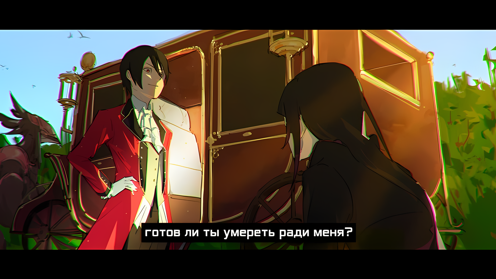
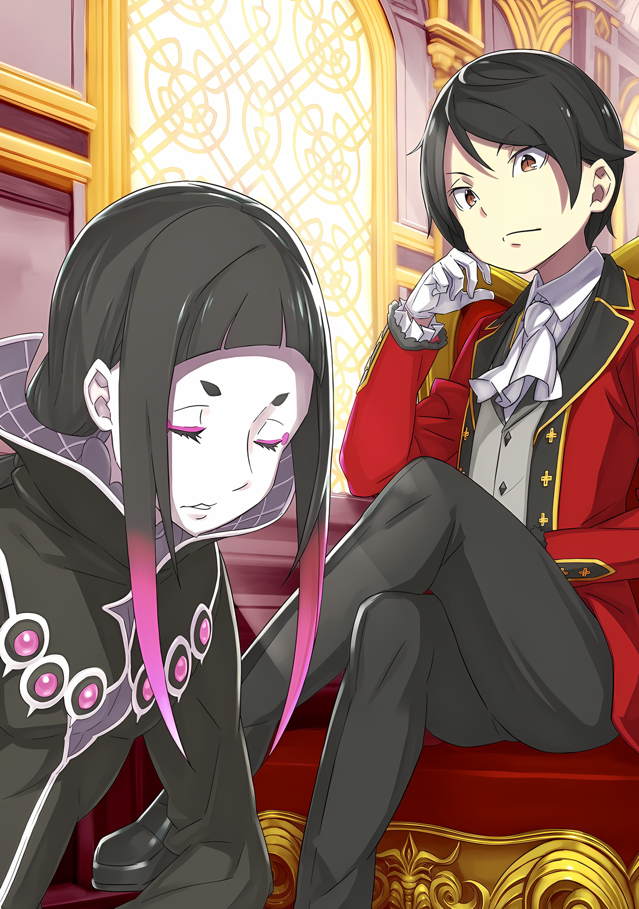
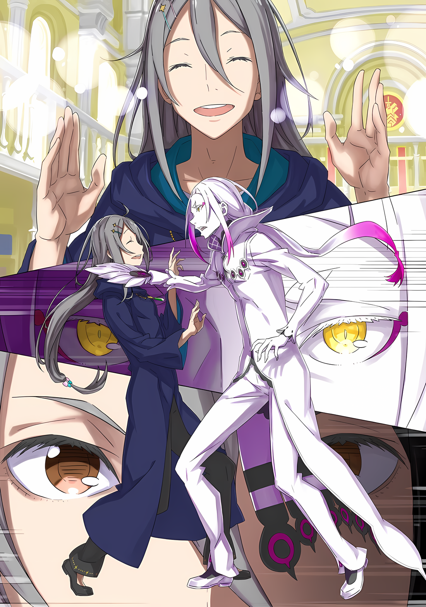
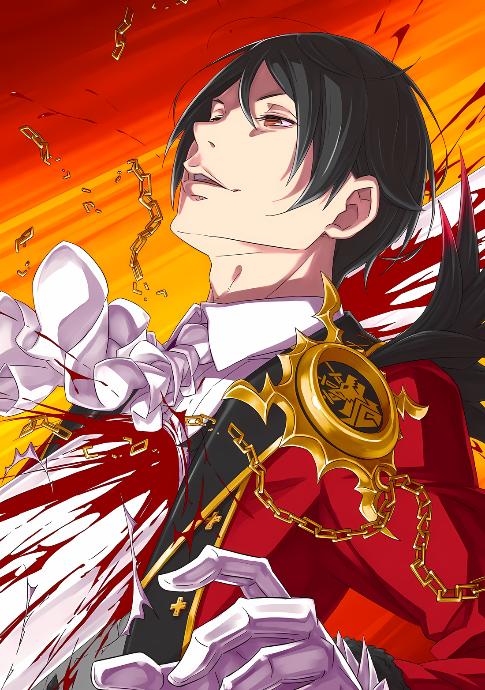

Маска Они не скрывала того, как напряглось лицо мужчины, когда его оттолкнули.

Подобное выражение легко поддавалось неверному толкованию. Несмотря на свой ум, а может быть, и благодаря ему, Император часто сокращал свои высказывания, даже если они были неблагоприятными; его лицо было не менее выразительно, чем рот.

Если кто-то и мог уловить истину за этим лицом, то, вероятно, только он сам, проведший несколько лет рядом с Императором.

Чиша: Или… возможно…

Если бы в этом месте находилась младшая сестра Императора, которую он считал священной во всех смыслах этого слова, она бы тоже догадалась?

В любом случае, сравнивать сейчас было бессмысленно.

В конце концов, в этом мизерном, изолированном во времени и пространстве месте не было никого, кроме него самого.

△▼△▼△▼△

???: Чеша Трим, готов ли ты умереть ради меня?

При их первой встрече, назвав свое имя, он получил в ответ вопрос, касающийся вопросов жизни и смерти.

Чеша, которому в то время было четырнадцать лет, считал себя зрелым для своего возраста, но встреча с этим мальчиком, на два года младше него, заставила его пересмотреть свои взгляды.

То, что демонстрировал подросток на его глазах, было настоящей зрелостью, в то время как его собственный случай был простым тщеславием.

rezero7arc | Арт от Rokaroka

???: …………

Как только прозвучал вопрос, мальчик ждал, не сводя с него своих черных глаз.

Его волосы и глаза, словно пропитанные тьмой, считались необычными чертами даже в такой богатой расовым разнообразием стране, как Империя Волакия. Хотя цвет глаз Чеши отличался, он также родился с черными волосами. За это он часто становился объектом насмешек, поэтому он мог посочувствовать мальчику.

А может и нет. Думать о том, что у них есть что-то общее, чтобы сочувствовать, было не иначе как наглостью.

Физические характеристики, какими бы редкими они ни были, были мелочью по сравнению с тем, что делало мальчика особенным. Если отбросить поверхностные совпадения, само происхождение ребенка возвышало его над простыми людьми, а утонченное, предприимчивое поведение было также продуктом его воспитания.

Он находился в уникальном положении, когда он должен был расти таким образом, чтобы выжить.

Если быть точным……

Чеша: ……Принц Винсент Абеллюкс.

Его имя сопровождалось титулом, ролью, полученной при рождении.

Этот черноволосый юноша, Винсент, был сыном Драйзена Волакии, верхушки Империи Волакия, а потому одним из нескольких детей, наделенных возможностью однажды встать на вершину Империи.

У него было более двадцати братьев и сестер, обладавших подобными качествами, но это нисколько не умаляло его благородной крови.

Несмотря ни на что……

Чеша: …………

Он вспоминал свой прежний образ действий, пытаясь разрешить одно сомнение: как он оказался рядом с таким выдающимся парнем, не говоря уже о том, что ехал с ним в одной карете?

Все началось с простого акта помощи.

Он наткнулся на карету, колесо которой застряло в канаве. Ее толкали и тянули, тщетно пытаясь освободить колесо. Он подошел к месту происшествия и освободил застрявшую повозку из глубокой канавы, вставив под нее доску и используя ее как рычаг.

К его удивлению, эта повозка принадлежала семье Абеллюкс, а на ее борту сидел сам Винсент Абеллюкс, известный тем, что поднялся на вершину власти благодаря «Чуду Абеллюкса».

«Чудо Абеллюкса» — так называлось восстание, которое началось с того, что вассал дома Абеллюкс предал их многолетнее покровительство, вступив в сговор с другой семьей. Но, несмотря на блестящую тактику, они потерпели поражение от рук одиннадцатилетнего полководца. В конце концов, все участники заговора были уничтожены.

Члены его семьи и солдаты поддались беде и растерянности, и Винсент, чье имя в те времена оставалось невоспетым, несмотря на его статус, без промедления разработал для них план. И проявив небывалую ловкость, он все-таки добился победы.

Вассалы, стоявшие за восстанием, недооценили Винсента как врага, посчитав его легкой добычей, которую они могли бы обезглавить в качестве трофея. Эти самонадеянные заблуждения стали причиной их гибели.

Факты и апокрифические слухи стали достоянием гласности, что создало ему весьма возмутительную репутацию.

Будучи гражданским Империи, Чеша тоже слышал эти истории, но никогда не задумывался о том, насколько велика вероятность того, что ему придется с ним связываться…… И вот, волею судьбы, он оказался перед человеком, которого боялась вся общественность.

И тогда, эта фраза была брошена в его сторону. ……Готов ли он умереть за него или нет.

Чеша: …………

Чего он хотел добиться этим вопросом, Чеша не мог понять.

Прежде всего, его пригласили на борт, дабы проводить его в особняк в честь благодарства за помощь с каретой.

Разумеется, Чеша не имел права отказаться. Как бы он ни возмущался, его мнение не имело никакого веса.

Поэтому он уступил часть своего времени и шагнул в карету. Как только он ступил на сиденье, Винсент приступил к допросу.

Было неуместно начинать этот разговор со знакомым, который лишь помог ему возобновить путешествие. Но этот мальчик был принцем по рождению, а потому привык, что люди прислушиваются к его желаниям.

Тем не менее, относительно недавно он уничтожил целую семью и ее прислужников в гневе на вассала, совершившего предательство по отношению к нему. Никто не стал бы винить двенадцатилетнего ребенка в том, что после такого опыта у него развилось крайнее недоверие к людям.

Возможно, его разум не успокоится, пока ему не удастся подтвердить преданность каждого, даже случайного прохожего.

Молчание длилось уже десять с лишним секунд…… более чем достаточно, чтобы оно стало неуважительным.

Речь шла о фигуре не просто высшей, а верховной. Тем не менее, он понимал, какой ответ он должен дать, и какой ответ хотел услышать другой.

Очевидно, что собеседник хотел услышать одну-единственную фразу: «Да, я готов».

Это было испытанием для Чеши, как гражданина Империи. Либо он поклянется в непоколебимой верности и вечном служении принцу, либо навлечет на себя гнев, зная, что в нем, возможно, заложено семя тирана.

Выдержав неподобающее расстояние между ними, он глубоко склонил голову перед возможным государем….

Чеша: Мои извинения, но, боюсь, я не готов.

rezero7arc | Иллюстрация к **Ранобэ** Том 33 | Разукрасил @112oVic2

И вот, он произнес тот единственный ответ, которого ему следовало избегать.

Чеша: …………

Опустив голову, Чеша проклинал себя за то, что совершил такой ляп под влиянием импульса. Более того, ему захотелось схватиться за голову от смущения из-за отсутствия самоконтроля.

Из-за своего нетерпения он попал в неприятности с влиятельным человеком и был изгнан из родного города. Раз за разом он говорил себе, что его поведение может разрушить его перспективы, но он так и не смог исправиться.

И вот, наконец, он дал худший из возможных ответов худшему из возможных адресатов.

Вскоре он погибнет одним из самых глупых способов: став жертвой собственного идиотизма.

Однако он не мог поступить настолько нагло, чтобы дать нужный ответ в нужной манере на вопрос о смерти, тем более таким повелительным тоном, каким он был произнесен.

Если бы его сердце разбилось или его гордость угасла, он бы уже умер, даже будучи живым.

Ему не был дорог стиль Волакии, но, тем не менее, он был человеком Империи.

Поэтому он не жалел о своем ответе.

Ему было жаль, что он выместил свое жалкое разочарование на мальчике, который просто искал что-то, что могло бы развеять его собственные проблемы с доверием.

По крайней мере, это чувство вины исчезнет, как только разъяренный клинок отсоединит его голову от плеч……

Винсент: Прекрасно. Сохрани это мнение, ибо в дальнейшем ты будешь служить мне.

Чеша: ――. Я буду служить?

Винсент: Не заканчивай свои утверждения повышением тона. Иначе они будут выглядеть как вопрос.

Чеша: Дело не в том, что вы неправильно расслышали, я хотел, чтобы это прозвучало именно так… Значит ли это, что вы меня не казните?

Винсент: Сразу после нескольких секунд как я взял тебя к себе? Это было бы бессмысленно.

Закрыв один глаз, Винсент нахмурился с оттенком раздражения.

Бессмысленный вопрос раздражал его, но он не протестовал, когда ему отказали в клятве верности. Это показалось Чеше странным, но он сохранил самообладание и еще раз проанализировал ситуацию.

По какой-то причине Винсент, казалось, не замечал его непочтительности.

Более того, он, похоже, рассматривал возможность нанять Чешу в качестве своего помощника.

Чеша: Прошу прощения, но я никак не могу взять в толк. Это ваше хобби — шутить с теми, кого вы собираетесь лишить жизни?

Винсент: Скажи, почему ты с таким упорством настаиваешь, чтобы я тебя убил? Это гораздо более непонятно, смею заметить.

Чеша: Не хочу обидеть, но хорошо известно, что вы не очень хорошо относитесь к тем, кто выступает против вас.

К тому времени, когда он понял, что его замечание снова было неуместным, оно уже вырвалось из его уст.

Однако, поскольку ему удалось совершить один проступок, Чеша перешел в более смелую позицию, готовый выяснить, сколько еще он сможет совершить, прежде чем достигнет порога и поставит на кон свою жизнь.

Как и всякий раз, когда он наслаждался книгой, добывал новые знания или доказывал свои теории с помощью казни, он был полон решимости расшифровать нераскрытые мысли принца.

Если в результате этого он погибнет, то так тому и быть.

В то время как Чеша пожертвовал почти всем своим будущим ради этой безрассудной затеи, Винсент, теперь уже понимая контекст, кивнул, сказав: «Ааа», прежде чем продолжить,

Винсент: Если ты имеешь в виду последнее восстание, то я привел в пример эту семью, потому что это было необходимо. Ты должен оцепить любого рыцаря, который может попытаться совершить то же самое. Страх производит лучший эффект для этого.

Чеша: И поэтому же вы приказали расчленить и выставить на дороге передовой отряд слуг зачинщика?

Винсент: Если жизнь должна быть прервана, то лучше сначала использовать ее по максимуму. Люди должны умирать эффективно.

Так ответил Винсент, опираясь подбородком на руку, сидя в карете. Его строгий, реалистичный взгляд на вещи оставил Чешу в растерянности.

То, о чем упомянул Чеша, было первой и главной контратакой, которую Винсент предпринял, чтобы подавить восстание — уничтожение вражеского авангарда, плюс варварское осквернение их трупов.

После сильных мучений, когда их искалечили еще при жизни, их трупы были выложены в ряд на поле боя. Ходили слухи, что если тех поймают, это повлечет за собой подобное наказание, и поэтому остальные предатели решили пренебречь соглашением с главным заговорщиком и оставить себя в роли зрителей.

Оставшись один, без всякого пути к отступлению, заговорщик отправился на встречу с Винсентом, но в итоге оказался в ловушке его кровавой интриги. Они, а также их родственники и помощники погибли, вкушая тот же ад, что и остальные солдаты.

Естественно, с появлением этой информации общественность изменила свое представление о Винсенте Абеллюксе, превратив его в жестокого, кровожадного принца. Но……

Чеша: Может быть, эти слухи — ваше собственное творение?

Винсент: Если одно мое присутствие вызывает в тебе ужас, то я могу сказать, что их цель не осталась невыполненной.

Чеша: Хахааа, приятно слышать, полагаю…

Все больше и больше его мысли казались слишком впечатляющими для двенадцатилетнего подростка.

С другой стороны, хотя Винсент и простил его непочтительность, Чеша не ожидал, что сможет выполнить то задание, которое он для него приготовил.

Винсент: Интересно, какой именно цели я жду от тебя?

Словно прочитав мысли Чеши, Винсент задал следующий вопрос.

Он был более туманным, чем предыдущий, и, более того, требовал, чтобы он разгадал тайну собственным умом. Несомненно, перед ним стояла трудная миссия, но ему нужно было точно определить, в чем она заключается.

Действительно, очень сложная задача.

Рожденный в Императорской семье, Винсент был обречен рано или поздно принять участие в предстоящем обряде Империи. Какую цель он мог найти в таком простом плебее, как Чеша?

Чеша: Вряд ли я смогу сделать что-то большее, чем помочь выыытащить застрявшее колесо.

Винсент: И это принесет мне пользу.

Чеша: Хохо, я полагаю, вы планируете с этого момента довольно часто застревать в канаве, если вам так нужна моя сила?

Он был почти склонен поздравить себя с достижением нового рубежа в неуважении этой отягчающей остротой.

Однако, услышав это, ни одна часть лица Винсента не дрогнула.

Винсент: Верно. Дорога, по которой я еду, изобилует канавами, и я не могу избежать их всех. Однако я не могу оставаться в канаве и ждать, пока проблема решится сама собой; в противном случае меня ждет смерть. А значит, мне нужен метод, чтобы вытащить себя, когда я застряну.

Чеша: ……Прежде чем мы продолжим, вы уверены, что разговор все еще идет о колесах?

Винсент: Я ни разу не отклонился от темы с тех пор, как мы начали разговор.

От этого странного ответа по телу Чеши пробежал холодок, но не потому, что он почувствовал угрозу, а потому, что он наконец-то понял, что его собеседник — это феномен.

Кроме того, вышеупомянутый феномен странно высоко ценил его.

Чеша сделал такой вывод на основании того, что, несмотря на непочтительное отношение, грубые ответы и невежливые реплики, Винсент, похоже, не был заинтересован в том, чтобы убить его.

Было ли это доказательством достоинств Чеши, или доказательством принципов Винсента?

Как бы то ни было, проснувшись сегодня утром в своем ветхом жилище, он и представить себе не мог, что его ждет такой насыщенный событиями день.

Винсент: …………

Пока Чеша молчал, Винсент смотрел на него, положив голову на руку и закрыв один глаз.

Этот жест создавал одиозное впечатление, что он наслаждается удовлетворением от того, что заткнул рот своему сопернику. Потеряв все силы сопротивляться, Чеша перевел свой недовольный взгляд на Винсента и внезапно осознал это.

Чеша: Понятно, вы никогда не закрываете оба глаза одновреееменно.

Винсент: Вот оно.

Чеша: А?

Поднеся руку к своему острому подбородку, Винсент ответил на замечание Чеши кивком.

Не понимая смысла этого предложения, Чеша наклонил голову.

Винсент: Если ты хочешь знать причину, по которой я не казнил тебя, то она кроется в этом.

Объяснение Винсента было коротким, но по его лицу было видно, что он считает его исчерпывающим. Как только Чеша заметил это, все встало на свои места.

Этот хитроумный мальчишка посрамил многих взрослых своими замыслами и тем, как безудержно он распоряжался своим талантом принца Волакии, но все же ему было двенадцать лет.

……Если бы это было не так, он бы уже понял, насколько наивно ожидать от окружающих мудрости, равной его собственной.

△▼△▼△▼△

……Чиша Голд.

Таково было новое имя, присвоенное Чише Трим при поступлении в особняк Абеллюкс в качестве новобранца Винсента.

Чиша: Поскольку моя семья вернулась в родной город, я бы предпочел, чтобы мое настоящее имя не получило широкой огласки, чтобы не доставлять им неоправданных хлопот. Хотя, полагаю, вам будет легко убить все мои заботы……

Винсент: Ты очень упорно изображаешь меня кровожадной скотиной. Может быть, ты также ответственен за прозвище «Кровожадный Принц», которым меня называют на улицах?

Чиша: Почему же, я полагаю, что это еще одна из ваших стратегий, основанных на страхе. Я слышал рассказы о том, как родители упоминали вас в поучительных сказках для детей, например, «Веди себя хорошо, а то придет Кровожадный Принц».

Винсент: Придет, но с какой целью? Как будто я буду беспокоиться.

Чиша: О, а что если вы придете и наймете их против их воли, как вы сделали со мной? Довольно пугающе, как по мне.

Винсент: Советую тебе следить за языком, иначе я могу закончить тем, что оправдаю эти выдумки твоей кровью.

В разговорах с Винсентом стирается грань между серьезностью и шуткой.

Если бы возникла необходимость, Винсент, не задумываясь, заплатил бы чужой жизнью. Однако он никогда не стал бы этого делать, если бы в этом не было необходимости. Он обращался с человеческими жизнями так же, как с деньгами или товарами.

Общаясь с ним, нельзя было не заметить, что он рассматривал каждого человека как ограниченный ресурс, имеющий равную ценность.

Причина смены имени на Чиша Голд соответствовала его заявлению: он беспокоился, что кто-то в его родном городе возмутится новостью о повышении Чеши Трима и вовлечет его семью в месть.

Несмотря на это, даже если бы его семье был причинен вред, он не стал бы из кожи вон лезть, чтобы помочь.

Пусть в глазах некоторых он был черствым, но между ним и его родней существовала определенная дистанция, и именно поэтому он был достаточно сострадателен по отношению к родственникам, которые пренебрегли им в самый критический момент.

Забавно или нет, но фамилия Голд относилась к семье, уничтоженной Винсентом в наказание за предательство.

Возможно, это была небольшая месть Винсента за грубость Чеши; но, не считая этого, он ввел общественность в заблуждение, пустив слух, что пощадил одного из семьи Голд, приговорив их к унижению за неспособность выйти из-под его контроля, что укрепило его положение как «Кровавого Принца».

Что касается имени, Винсент предложил изменить его на одну букву, чтобы оно звучало похоже на его первоначальное имя, как и надеялся Чеша. Поскольку у него не было причин жаловаться, и в этот раз, похоже, не было никакого злого умысла, хотя он и счел это снисходительным, он все-же одобрил идею.

Несмотря ни на что, после целой жизни, проведенной в остракизме за склонность к теории, а не к практике, и за неуклюжесть в общении, перерождение Чеши в «Чишу» принесло долгожданные перемены.

В его отдаленной деревне никогда не было столько книг и занятий, которыми он мог бы предаваться.

Он получил возможность поселиться вдали от тех, кто несправедливо презирал его за неумение пахать и убирать урожай, и он не променял бы это ни на что на свете.

Однако……

Винсент: Колесо опять в канаве, Чиша. Докажи свою полезность.

Каждый раз эти слова предупреждали его о том, что Винсент собирается доставать его из-за проблемы, стоящей на несколько лиг выше застрявших колес кареты, инициируя дискуссию, которая будет продолжаться до тех пор, пока не появится решение.

Стремление Винсента делало его силой, с которой приходилось считаться.

Как Винсент воспринимал и воспринимает мир, решая различные вопросы одновременно, с последовательной сосредоточенностью, несмотря на то, что у него два глаза и одна голова, как у обычных людей?

Конечно, хозяин обязан вмешиваться в дела своих владений, но ожидать этого от двенадцатилетнего подростка было неразумно, тем более, когда у него не было взрослых, на которых можно было бы положиться.

Но любые соболезнования, которые посторонний человек мог бы направить на Винсента, рассеивались, когда он сталкивался с его работой.

Работа с Винсентом требовала от Чиши огромного количества специальных знаний, что не оставляло ему времени на безделье.

Как только они решали одну проблему, появлялась новая; иногда возникала еще одна, пока решалась текущая. И пока он ломал голову над разными проблемами одновременно, владения Абеллюкс продолжали развиваться.

Качество жизни улучшилось, а первоначальные опасения жителей сменились одобрением.

Винсент обладал способностью превращать ужас в восхищение, а рабство — в обожание, причем и то, и другое было вполне заслуженным.

Его не беспокоило мнение других о себе, и в этом заключалась причина, по которой он обладал вышеупомянутой способностью.

Винсент: Чиша, ты хорошо изучил систему защиты от наводнений. Пора освободить этого некомпетентного администратора от его должности. Я предъявлю ему обвинения в растрате, и он будет обезглавлен.

Чиша: По моему скромному мнению, такие обвинения не заслуживают обезглавливания.

Винсент: Значит, он заработал свою прибыль благодаря усилиям? Это то, что ты пытаешься сказать?

Чиша: ……Эта тема слишком далека от моей специальности.

Винсент: Если бы то, что он прикарманил, компенсировалось его работой, я бы не обращал на него внимания. В противном случае, его будет ждать возмездие. Отказавшись исправить свой проступок, даже после неоднократных предупреждений, он сам истощил положенные мне надбавки.

Под резкой инициативностью и решительностью Винсента скрывалась его привередливая сторона, контрастировавшая с его ожиданиями по отношению к другим и, как основополагающий фактор, склонявшая его критиковать тех, кто не мог им соответствовать, таких как лентяев.

Однако Винсент не был меритократом; он не осуждал людей только за их некомпетентность.

Если бы он изложил свою доктрину словами……

Винсент: ……Человек должен заниматься тем делом, которое соответствует его способностям.

Он желал, чтобы все жили, не жалея сил, без передышки.

Зная это, мальчик по имени Винсент Абеллюкс и обстоятельства, стоявшие за его придирчивым перфекционизмом, казалось, начали сиять в другом свете.

Как бы невероятно это ни звучало, Винсент не обладал непоколебимой уверенностью в себе и не гордился собой.

Он постоянно жаждал большего.

Для большего он постоянно жаловался.

За большее он постоянно боролся.

В глубине души Винсента лежала движущая сила. Это была не благодарность за дарованное ему положение, а яростная решимость исполнить роль, которую это положение требовало.

И мотивом, который заставлял Винсента питать эти яростные чувства, был……

Винсент: ……Есть один презренный человек, его имя Страйд Волакия.

Через некоторое время после присоединения к Винсенту, Чиша обнаружил, что он сам нахмурился, услышав слова, которые произнес его хозяин.

К счастью, или, скорее, к доказательству того, что Винсент был точен, у Чиши действительно был некоторый талант вытаскивать колеса из канав, благодаря чему ему удалось не потерять работу.

Тем не менее, его постепенно направили на этот путь.

Плюсы и минусы его позиции выявлялись один за другим, склоняя чашу весов так, что трудно было сказать, какая сторона весит больше.

И Чиша все еще размышлял над этим, когда Винсент впервые выдал нечто, не связанное с работой, нечто, идущее откуда-то из глубины его души.

Чиша: Страйд Волакия, да? Простите мое невежество, должно быть, я недостаточно образован, раз никогда не слышал этого имени.

Винсент: Нет, твоя образованность не виновата. На самом деле, твоя жизнь была бы под угрозой, если бы ты знал эту информацию. В конце концов, существование этого человека давно стерто из записей Императорской семьи Волакии.

Чиша: …………

Чиша подумал о том, что Винсент мог просто подвергнуть его опасности, раскрыв это так неосторожно, но, учитывая его положение, было трудно прервать его, как только он начал говорить.

Кроме того, его интересовал тот человек, который был изгнан из Императорской семьи.

Чиша: Ну, изгнать кого-то из Императорской семьи не представляется возможным. Даже если бы это было сделано, их кровь все еще течет в жилах. К тому же, именно для этого и существует «Церемония Императорского Отбора».

«Церемония Императорского Отбора», проводимая для того, чтобы определить следующего правителя Империи.

Эта церемония — соревнование, в котором потомки Императора убивали друг друга, чтобы достичь вершины Империи, она была ярким воплощением сущности нации, восходящей к самому ее основанию.

Последний, кто останется в живых, будет возглавлен как Император.

И как Император Волакии, он мог завладеть «Мечом Света», эмблемой своего правления.

Чиша: Хотя, теоретически, можно выжить и без битвы, если отказаться от права наследовать трон, так, по-крайней мере, я слышал.

Винсент: Простое умолчание. Это фантазия, не что иное, как инструмент, чтобы заранее отсеять тех, кому, несмотря на обладание правом на власть, не хватает смелости торжествовать на церемонии. И это означает, что твои опасения верны.

Чиша: Поэтому отстранение члена Императорской семьи немыслимо.

Винсент: Тем не менее, Страйд Волакия понес это немыслимое наказание, и поэтому был отстранен от участия в ансамбле церемонии. Но даже если учесть, что после этого «Церемония Императорского Отбора» прошла как по маслу, то, вероятнее всего, он не избежал смерти.

Взгляд Винсента, более холодный, чем обычно, был окрашен глубоким презрением к этому человеку.

Страйд Волакия, человек, которого отстранили от должности члена Императорской семьи Волакии, вычеркнув из исторических записей…… Он был как раз из тех, кто вызывал ярость Винсента.

Тем, кто не выполнял возложенную на него роль и не проявлял свои природные способности в полной мере, он не предлагал никакого помилования.

Чиша: ……И все же, как вы узнали о его существовании, когда никто не должен был об этом знать, Винсент-сама? Может быть, болтливый джентльмен с высоким статусом вам это рассказал?

Винсент: Ты никогда не боялся перешагнуть через порог своей дерзости, не так ли? ……Записи.

Чиша: Записи?

Винсент: Да, записи Страйда Волакии. Они были спрятаны в библиотеке Кристального Дворца, где я их и нашел. Жаль, что такой интригующий фолиант оказался полон нечитаемых, бессмысленных надписей.

То, как Винсент скривил губы в досаде, было жестом нескрываемой ненависти.

Винсент обычно терпимо относился к перевариванию и оценке вещей. Он проделывал этот мыслительный процесс с впечатляющей скоростью, что, к лучшему или к худшему, почти создавало впечатление, что он судит без предварительного обдумывания. Любому покажется необычным наблюдать, как тот же Винсент проявляет такие негативные эмоции.

Чиша: А что в них было написано? Вы их когда-нибудь мне покажете?

Эта тема вызвала у него интерес.

Тем не менее, в глубине души он прекрасно понимал, что его внимание отвлекается от содержания записей, стремясь выяснить, из-за чего так страдает его беспокойный хозяин.

Зная о внутренних мыслях Чиши или нет, Винсент закрыл один из своих черных глаз и, пронзив его взглядом, заговорил.

Винсент: Я не покажу их тебе. ……Только не эту антологию никчемных бредней о Наблюдателях и тому подобных вещах.

△▼△▼△▼△

???: Ну, без обид, но ты, похоже, слишком много думаешь, всегда ищешь причины и все такое. Чеша, я не думаю, что нормальные люди строят планы, хмурясь так интенсивно, как Его Превосходительство или ты.

Чиша: ……Во-первых, пожалуйста, следи за своими словами; во-вторых, меня зовут Чиша.

???: О боже, мне так жаль! Что может быть более невежливым, чем перепутать имя коллеги-актера?! Я очень глубоко задумаюсь над тем, что я сделал. ЧишаЧишаЧишаЧишаЧишаЧишаЧиша!

Чиша: …………

С энергией, не требующей описания, голубоволосый мальчик продолжал говорить.

Юноша, которого звали Сесилус Сегмунт, был того же типа, что и Чиша много лет назад: кто-то, в ком Винсент почувствовал потенциал и взял к себе.

Если человек обладал большим мастерством и готовностью его реализовать, Винсент брал его к себе.

Он не задавался вопросом ни о происхождении, ни о статусе человека. Хотя эти идеалы нажили ему немало недоброжелателей, никто из них не мог отрицать, что под его правлением домен Абеллюкс расцветает с каждым годом все больше.

Несмотря на то, что престижное происхождение не являлось обязательным условием, разрыв в уровне образования делал слишком трудным поиск среди простолюдинов другого выдающегося должностного лица. Поэтому нагрузка на Чишу никогда не уменьшалась.

Однако……

Сесилус: Хороший военный офицер нуждается только в мускулах. Хотя, в моем случае, как актеру, мне нужно еще и великолепие, но я и так единственный в своем роде в обоих этих аспектах!

Чиша: Ты говоришь довольно уверенно… Но, вероятно, у тебя достаточно сил, чтобы хвастаться. Что, по иронии судьбы, делает ее более беспокойным, но меняяя это не касается.

Энергичный маленький ребенок… возможно, он был слишком взрослым, чтобы называться так, будучи на шесть или семь лет младше Чиши; хотя это казалось естественным для последнего, которому сейчас восемнадцать лет. К сожалению, Сесилусу не хватало характерной миловидности, присущей мальчикам его возраста.

И не из-за внешности или поведения, а из-за того умения, которым он с гордостью хвастался.

Чиша: …………

После вступления в дом Абеллюкса Чиша сам обучался боевым искусствам для самообороны и телохранительства, но он осознавал, что его мастерство было на уровне обычного человека. И вместо того, чтобы использовать собственное тело, он умел управлять толпой.

Конечно, ему следовало забыть об этом предлоге и впредь не пренебрегать тренировками, если он хотел совершенствоваться. Но даже на взгляд такого неопытного человека, как он сам, Чиша мог сказать, что сила Сесилуса намного превосходит норму.

Чиша уже встречался с феноменом изобретательности.

Но он и представить себе не мог, что столкнется с таким феноменом вооруженной мощи, как этот.

Чиша: Чем больше я узнаю, тем меньше понимаю, чего Винсент-сама… то есть, Его Превосходительство желает.

Сесилус: Ну вот, опять ты глубоко задумался, Чиша. Но не волнуйся, я здесь, чтобы дать тебе ответ. Это то, что люди называют… предвестием, да!

Так заявил Сесилус, ткнув проворным пальцем в сторону Чиши, чьи глаза расширились.

Посмотрев на его реакцию, он убрал палец и продолжил.

Сесилус: Подожди, ты никогда не слышал этого термина? Тогда позволь мне объяснить. Предвестие — это показ важной информации в сюжете, но маскировка ее в……

Чиша: Да, я знаю определение «предвестия». Выражение, которое ты сейчас видишь на моем лице, означает, что я не могу понять, почему ты об этом заговорил.

Сесилус: Ааа, понятно! Все довольно просто, просто чтобы ты знал. Говорю же, что общее между тобой и Его Превосходительством — это постоянное стремление найти смысл в каждой мелочи.

Развеселившись, Сесилус начал стучать своими ладонями по груди, смеясь. Затем, он прервал хлопки и закружился на месте, указывая открытыми ладонями на все, что его окружало.

Сесилус: Хорошо, давай предположим, что во всем есть смысл! То есть, все то, что ты не можешь объяснить в данный момент, служит предвестием того, что рано или поздно должно произойти в этом сюжете! Сердце замирает, не правда ли?!

Чиша: Расходование неучтенных средств и накопление товаров сомнительного происхождения кажется мне не столько предвестием будущего, сколько свидетельством распространенной коррупции и взяточничества.

Сесилус: Ты вообще себя слышишь?! То, о чем ты только что упомянул, можно решить в настоящем! А я говорю о том, что ты не можешь. Ну же, Чиша, я знаю, ты ведь намного умнее!

Чиша: …………

Резко остановившись на крутящихся ногах, Сесилус возразил его словам, раздраженно нахмурив брови.

Хотя ему было неприятно видеть, как он раздражается на него без ясного мотива, Чиша каким-то образом нашел в этих словах крошечный клочок спасения.

Пока он трудился, чтобы выполнить требования, которые Винсент предъявил ему вместе со своей должностью, в глубине его сознания оставалось одно сомнение: почему именно он?

Прошли годы, за которые он успел узнать Винсента как человека, но он все еще не мог этого объяснить.

Потому что эта проблема относилась не к Винсенту, а к самому Чише.

Не имея ответа, который помог бы ему излечиться, пребывание рядом с Винсентом тяжело отразилось на его психике, но теперь……

Чиша: ……Если это так, может ли мое присутствие само по себе тоже что-то предвещать?

Сесилус: Оо? Ты уже впитал знания, впечатляет. Что ж, учитывая твой ум, неудивительно, что ты так быстро учишься! Вот это заслуживает моего абсолютного уважения; у меня бы так, никогда не получилось!

Чиша: Если ты хочешь проявить ко мне уважение, может, начнешь обращаться ко мне почетно? Я твой старший, превосходящий тебя и по возрасту, и по званию, не так ли?

Сесилус: Оу, но формальное обращение к другу кажется слишком отдаленным, не находишь? Мы будем плыть в одной лодке, сейчас и в течение многих последующих дней. Так что давай отбросим все эти досадные формальности, не так ли?!

Чиша: Другу……

С этими безоговорочными словами и похлопыванием по плечу, мальчик оставил Чишу без слов.

Хотя его удивила та фамильярность, с которой он смог сократить расстояние между ними, настоящий шок наступил, когда он понял, что на его пути до сих пор никто ни разу не назвал его другом.

За несколько лет, прошедших с тех пор, как он покинул родной город, был взят Винсентом, усердно учился у вышеупомянутого, вкалывал на работе, он ни с кем не сблизился.

Конечно, были люди, которые ценили его по деловым соображениям, но они здесь не в счет.

Чиша: …………

Сесилус: В чем дело? Хм, возможно, ты прав, тогда мне стоит начать с почестей? Как в тех историях, где расстояние сокращается шаг за шагом, до самого конца, когда двое понимают, что их пути пересеклись! Такое развитие событий по-своему очаровательно, так что я не против сдать немного назад…

Чиша: Нет, не нужно. ……Его Превосходительство предпочитает работу, выполненную быстро.

Не то, чтобы он понял весь бред Сесилуса, но если в конце концов они все равно прибудут в пункт назначения, то он предпочел бы выбрать кратчайший путь.

Обругав себя за то, что вынашивает мысли, так глубоко запятнанные доктриной Винсента, Чиша решил не отрицать идеалы Сесилуса, а, напротив, принять их.

Если бы он подражал стилю речи этого человека……

Чиша: Я ожидаю, что ты используешь свои возможности, когда это будет необходимо, ради исполнения желаний Его Превосходительства. Это, несомненно, причина, по которой тебя выбрали…

Сесилус: Это предрекаемая роль, которую я должен буду исполнить, верно?! Ты можешь доверять мне, Чиша! Может быть, я и бесполезен во всем, что не касается боя, но в бою я никому не позволю себя догнать!

Чиша: Я очень на это надеюсь.

Стройный ребенок надул свою тонкую грудь, хвастаясь своими гипотетическими подвигами, но Чиша не смеялся над ним.

По усмотрению Винсента, как и по своему собственному, он предоставит Сесилусу Сегмунту место, соответствующее его уровню.

Более того……

Чиша: ……Полагаю, пока что я должен ждать того дня, когда исполню предрекаемую мною роль.

Чиша прошептал эти слова, ассимилируя роль, о которой говорил его молодой друг.

И как будто судьба прислушалась к нему, ведь примерно через шесть месяцев после этого события началась «Церемония Императорского Отбора» с участием Винсента Абеллюкса.

△▼△▼△▼△

После смерти бывшего Императора, Драйзена Волакии, началась «Церемония Императорского Отбора».

Из-за своих неоспоримых талантов Винсент Абеллюкс считался врагом для других братьев и сестер, попав в осаду, состоящую из их концентрированных атак.

Однако, как оказалось, Винсент оправдал свою первоначальную репутацию и ожидания, одержав ошеломляющую победу на «Церемонии Императорского Отбора».

Победив всех своих братьев и сестер, Винсент Абеллюкс был украшен короной крови Империи Волакия… Нет, родился Семьдесят Седьмой Император, Винсент Волакия.

Часть кровавого пути, пройденного Винсентом, часть великой реки крови, пролитой им, была, возможно, частично обусловлена вкладом Чиши и Сесилуса, которые служили его подчиненными.

Однако, что касается этой «Церемонии Императорского Отбора», роль, которая ожидалась от Чиши, в плане, осуществляемом ради победы Винсента, была совсем иной, чем «освобождение колеса из канавы».

Во время битвы Чише было доверено сделать последний ход на доске……

Чиша: ……Ваша младшая сестра спаслась невредимой. Возможно, у нее довольно вспыльчивый и несдержанный характер, но я уверен, что она понимает свое положение. Полагаю, на данный момент все улажено.

Это произошло в кабинете, а именно в комнате Кристального Дворца в столице Империи Рапгане.

В комнате, которую использовал Император, стоявший на вершине политики страны, Чиша почувствовал, как знакомое лицо снова обращается к нему, и эта ситуация, вероятно, займет у него много времени, чтобы справиться с ней в такой спокойной манере.

Несмотря на то, что сам Император восседал на троне, обладающем значительной властью, он не проявлял никаких признаков нарушения своей обычной манеры поведения. Даже когда его заверили в непоколебимости победы на «Церемонии Императорского Отбора», он не показал и проблеска улыбки от чувства выполненного долга.

Винсент никогда не смеялся. По крайней мере, не во время игры за принца или Императора.

Когда он не играл принца, его губы складывались в озорную ухмылку. Однако возможности для этого, похоже, значительно уменьшились по сравнению с тем временем.

Он стал Императором. А значит, он не допустит и мгновения, чтобы Император не был Императором.

……Нет, он не мог допустить ни одного момента, когда это было бы не так.

Чиша: Я не мог поверить своим ушам, когда вы спросили о способе спасения Приски-сама.

Предполагая, что никто больше не слышит, Чиша рассказал о величайшем секрете этой итерации Империи Волакия, в котором он был непосредственно замешан.

Одновременно с завершением «Церемонии Императорского Отбора» было объявлено о рождении нового Императора.

Но дело в том, что «Церемония Императорского Отбора», в ходе которой только последний из Императорской семьи становился наследником престола, была проведена не полностью. ……Два кандидата остались в живых.

Этими двумя кандидатами были Винсент Абеллюкс и Приска Бенедикт.

Приска Бенедикт была описана как трагическая принцесса, которая лично выпила чашу с ядом и лишилась жизни.

На самом деле она действительно выпила яд, но не лишалась жизни.

Она не пила яд из чаши, а сделала это скорее для того, чтобы спасти своего слугу, который так переживал за нее, что ухватился за возможность спасти ее жизнь.

Яд задержал сердце Приски ровно на столько, чтобы все было закончено, прежде чем оно забилось вновь.

«Церемония Императорского Отбора» закончилась и Приска Бенедикт была похоронена в гробнице.

Винсент Абеллюкс стал Императором, а Приска Бенедикт приняла другую личность, жизнь не под этим именем…

Чиша: Если бы я был из семьи, которая служила Империи с древних времен, я бы, возможно, сделал замечание Его Превосходительству за его возмутительное желааание. Однако я происхожу из семьи простолюдинов.

Не было никаких оснований для того, чтобы особенно ценить престиж или традиции.

К ним следовало проявлять определенное уважение, даже признавать их ценность, но не следует понимать их как нечто высшее. В Империи Волакия престиж и традиции были просто терпимы.

И именно поэтому……

Чиша: У меня не было ни малейших колебаний об участии в этом плане.

Винсент: …………

Пока Император хранил молчание, внутренние мысли Винсента могли быть непостижимы, но его действия были ясны.

С самого начала среди своих многочисленных братьев и сестер Приска всегда была для Винсента особенной. Хотя она блистала в глазах Чиши благодаря своей проницательности, Винсент положил глаз на младшую сестру не только из-за ее способностей, хотя он был намного старше ее.

Несмотря на высокомерие, Приска уважала Винсента и относилась к нему как к старшему брату по крови.

Поскольку «Церемония Императорского Отбора» была судьбой Императорской семьи Волакии, они взаимно признали, что им не дано сосуществовать даже при компромиссах…… Пока Винсент не разрушил эту судьбу своей собственной рукой.

Это очень обрадовало Чишу и, прежде всего, принесло облегчение.

Подход Винсента заключался в том, чтобы продемонстрировать все свои возможности в рамках той должности и роли, которая была ему уготована.

Винсент не изменил себе со дня их встречи и до сегодняшнего дня. Так какой же резон мог проявиться в том, что он, как никто другой, решил разрешить Приске выжить?

Если бы ее нашли живой, он бы сам оказался под угрозой, и вспыхнуло бы насилие, после чего основа доверия, которую Император заложил в Империи Волакия, могла быть утрачена.

Как Император Волакии, какой аргумент он мог бы привести в оправдание этого?

Никаких. Конечно, у него его не было. Это не было рациональным решением.

Это было желание, рожденное эмоциями, надеждой, молитвами.

Винсент Абеллюкс не хотел убивать свою любимую сестру.

Отныне Приска Бенедикт оставалась жива, а Винсент носил корону из фальшивых слов.

Это радовало Чишу.

Винсент решил, что он хочет вернуть Приску к жизни, а не держать ее в живых, и попросил Чишу найти способ избавиться от препятствия — колеса, застрявшего в канаве.

Чиша: Предвестие, не так ли?

В его голове промелькнула бессмыслица, которую Сесилус произнес перед началом «Церемонии Императорского Отбора».

Даже то, что в данный момент не имело никакого смысла, то, что казалось бессмысленным, в далеком будущем могло обрести смысл. Его можно было понять, ведь он присутствовал именно с этой целью.

Как его собственная позиция, так и действия Чиши, возможно, были основой для этого будущего.

Чиша: Ну, действительно, неприятно признавать, что то, о чем говорил Сесилус, было актуально, и я знаю, как он приходит в восторг от своей правоты, поэтому я никогда не расскажу ему об этом.

Винсент: Ты был таковым уже некоторое время, но в последнее время я задумывался над этим… Неужели ты полностью потерял свой цвет, а вместе с ним и все, что ты наработал, служа себе?

Чиша: Удивительно, но с тех пор, как я избежал забвения смерти, дела у меня идут неплохо.

Понимая, что это неуважительно, Чиша пожал плечами перед Винсентом. Император сменил позицию, но он не стал бы упрекать его за это, если бы это не было сделано публично.

В соболиных глазах Винсента отражение Чиши было таким, как он и говорил: абсолютно белым и лишенным цвета.

В период «Церемонии Императорского Отбора», после того, как Чишу чуть не убили в схватке с врагом, его черные волосы потеряли весь свой цвет, став полностью белыми.

С тех пор он по какой-то причине стал носить белое, прямо противоположное черному одеяние. Даже железный веер, который он предпочтительно использовал, стал полностью белым, а его одежда стала однотонной.

Конечно, это было не просто его забавой.

Оказавшись на грани смерти и потеряв свой цвет, Чиша пробудил в себе странную «Способность». Чтобы справиться с этой «Способностью» окрашивать себя в цвет других, он должен был постоянно сохранять осознанность.

Это была необходимая мера, чтобы он мог осознавать, во что должен окраситься.

Как бы то ни было, подробности этой «Способности» Винсент тоже скрывал. Естественно, он никому не стал бы об этом рассказывать. Не говоря уже о болтливом Сесилусе или других людях, с которыми он был мало связан.

Всегда полезно иметь туз в рукаве, козырь или пару секретных ходов наготове.

Однако……

Чиша: Если бы Ваше Превосходительство наконец освободило меня за проделанную мной огромную работу, то, думаю, необходимость в подобных махинациях отпала бы.

Винсент: Предположим, ты был бы на моем месте, ты полагаешь, что я бы отстранил тебя от должности и оставил в живых, будучи в курсе самых важных фактов Империи, которые должны храниться в тайне, и позволил бы тебе спокойно спать по ночам?

Чиша: Развивать гипотезу внутри другой гипотезы — несколько плохая манера, но, полагаю, потерять голову перед тем, как покинуть замок… это все, что у меня есть в запааасе на данный момент.

Винсент: Если ты понимаешь это, и если тебе дорога твоя жизнь, то продолжай покорно служить мне. Пока ты можешь доказать, что ты мне полезен, я буду держать твою голову на плечах.

Заявив это высокомерным тоном, Винсент поставил локти на стол и положил подбородок на руки.

Трудно было сказать, были ли они серьезны в этом легкомысленном обмене мнениями, но Императору, который не жалел слов для других, было необходимо позволить ему высказаться таким образом, чтобы убедиться в этом.

Согласно этому обмену, статус Чиши Голд и ожидаемая от него роль останутся неизменными, хотя Винсент и стал Императором, но……

Чиша: ……Положение Священной Империи Волакия может измениться, а может и нет.

Уже сейчас сияние «Меча Света», абсолютного символа Империи Волакия, было предано.

«Церемония Императорского Отбора», которая проводилась с момента основания Империи, была завершена совсем не так, как это было до сих пор. Таким образом, то, что обычно следовало за церемонией, также кардинально изменится в будущем в квинтэссенции.

Пойдя по этому пути, отдав предпочтение собственным желаниям и выбрав спасение младшей сестры, Винсент проделал все это.

Открылся новый путь, отличный от того, который существовал до сих пор. Чиша почувствовал, что его слегка разжигает этот факт и предвкушение, связанное с ним.

Однако он никогда не показывал этого ни в своем выражении лица, ни в словах, ни в поведении.

Это было потому, что он осознавал дурное влияние своего друга, Сесилуса.

△▼△▼△▼△

……Дни проходили в головокружительном темпе.

Была восстановлена некогда существовавшая система «Девяти Божественных Генералов», а ранги Имперской знати были изменены.

Избавившись от тех, кто пользовался высоким статусом только благодаря истории, путь Империи Волакия, под национальным флагом которой был изображен «Волк, пронзенный мечами», был навязан внутри и за пределами ее границ без исключений.

Уклад, сохранившийся до предыдущего Императора, который бездумно поверил в неписаное правило, что сильный абсолютно прав, и позволил Империи внутренне разрушиться, был полностью дезавуирован, а изначальный принцип, что сильных нужно уважать, был вычеркнут.

Те, кто сидел на своих кровных связях и социальном положении семьи, были лишены того, что их олицетворяло, в то время как те, кто бдительно ждал удобного случая, получили шанс принять вызов.

Со стороны могло показаться, что правление Винсента Волакии ничем не отличается от прошлого Империи.

Однако реальность была совершенно иной. Те, кто знал, что происходило за кулисами, испытали это на собственном опыте.

Вскоре об этом узнали многие в Империи и даже за ее пределами.

О величии переделки и реформирования Империи Винсентом Волакией.

Бесполезные конфликты прекратились, а абсурдные бои насмерть больше не вызывали одобрения.

Доказательство силы больше не основывалось на военной доблести человека, а те, кто имел амбиции, не соответствующие им, доказывали своей жизнью, как трудно по-настоящему реализовать их.

Они словно наблюдали за процессом полного перекрашивания понятия «Силы».

Однако……

???: Я буду «Первым», Аня будет «Второй», а после присоединения Ольбарта, Чиша станет «Четвертым». Выбор Его Превосходительства не так уж плох, но Чиша, твое лицо не выглядит таким уж радостным, не так ли?

Чиша: Я «Четвертый», потому что иначе мне не совсем подходит. Как Сесилус знает, я…

Сесилус: Слаб по физической силе. Так-так, я не претендую на то, чтобы понять твои чувства, но, полагаю, именно так определяется порядок старшинства в мире, которым правит Его Превосходительство. Трудно понять, кто из них кто, когда есть смешанные стандарты, но я все равно чувствую себя довольно позитивно по этому поводу.

Винсент: В чем же причина? Кроме того, статус «Первого» останется у тебя посмертно.

Сесилус: Вы вырвали слова прямо у меня изо рта! То, что вы это сделали — самая большая причина. Но это не единственная. Я думаю, что присутствие Чиши изменит вашу точку зрения.

Чиша: Точка зрения… Другими словами, могу ли я понимать это как способ борьбы?

Сесилус: В этом суть. Если мы с тобой сойдемся в схватке, Чиша, ты умрешь в мгновение ока; но что, если ты соберешь тысячу человек? Это может занять тысячу секунд!

Чиша: Не думаю, что до этого дойдет. Однако я понимаю, к чему ты клонишь. Пока пройдет тысяча секунд…

Сесилус: Его Превосходительство, или кто-то другой, может выполнить свою цель. Мой главный недостаток, как главного действующего лица этого мира, в том, что в этом мире есть только один я.

Были и такие, чья сущность не изменилась бы ни на йоту, даже если бы они обрели более высокое положение или если бы изменился путь Империи.

Сесилус воплощал в себе этот первый принцип. Причина заключалась в том, что в самые древние эпохи Империи Волакия «Сильные» пользовались всеобщим уважением.

Все в Империи знали, что тот, о ком идет речь, был непопулярен, не обладал характером, который нравился бы всем, а так же не имел характера, чтобы быть примером для кого-то.

И все же, если бы кого-нибудь спросили, кто самый сильный в Империи, его грудь раздулась бы от гордости, словно он был связан с ним лично.

Они скажут, что именно Сесилус Сегмунт самое могущественное существо в Империи.

Тот факт, что Чиша считался способным получить тысячу секунд, если он соберет людей против Сесилуса, также был причиной, почему он чувствовал себя спокойно с должностью «Четвертого» из «Девяти Божественных Генералов», не отказываясь от нее.

Поэтому, хотя он и считал, что его переоценивают, Чиша смирился с этим положением и ролью. Ведь по большей части, все шло хорошо.

Если и возникали какие-то проблемы, то это были……

???: ……Боже мой, разве это не отвратительно~, Генерал Первого класса Чиша. Сегодняшняя судьба хороша, не так ли?

Тот человек, который начал разговор в такой дружеской манере, слегка улыбнулся ему.

Когда казалось, что в Империи все идет хорошо, зловещее чувство, которое он испытывал по отношению к существу, представившемуся «Звездочетом», и чьи приходы и уходы в Кристальный Дворец были разрешены, казалось черным пятном на его белом теле.

……То, что зловещее чувство не было ошибкой, было доказано много лет спустя.

Звездочет: ……Наступление «Великого Бедствия» было передано в виде заповеди. Это достойно сожаления, Ваше Превосходительство.

В центре кабинета Императора человек, который по всем правилам не должен был там находиться, объявил об этом с выражением, которое словно пыталось сказать: «Я торжествую от всего сердца».

Чиша, присутствовавший на собрании, нахмурился, услышав слова «Звездочета» Убирка.

Чиша: ……«Великое Бедствие»?

Он не помнил, чтобы слышал об этом, но в то же время это звучало как нечто, что не могло быть хорошим знаком.

Это также можно было назвать великой катастрофой. Можно предположить, что это будет что-то непростое. Однако, что обеспокоило Чишу, так это одно дополнение, которое сделал Убирк.

Почему этот человек до сих пор говорит о Винсенте такие вещи, как «жаль» и тому подобное?

Чиша: Убирк-доно, я не сомневаюсь в вашей подлинности как «Звездочета». Во многих случаях вы смогли предвидеть мятежи, катаклизмы и события, которые могли произойти в нашей стране. Во многих случаях ваши пророчества помогли ограничить ущерб, Убирк-доно.

Убирк: Прости, Генерал Первого класса Чиша. Однако~, у меня есть одна поправочка. Я не делал никаких пророчеств. Я лишь передаю шепот звезд. Это не моя заслуга.

Чиша: ……Я уважаю ваше мнение, Убирк-доно. Конечно, мы должны быть готовы справиться с «Великим Бедствием», но могу я спросить, чего вы ожидаете?

Выражение лица Убирка в ответ Чише, которое до этого было загадочным, приняло форму улыбки.

Чиша задал вопрос, который необходимо было задать, но при этом с подозрением смотрел на Убирка, чье лицо было богато выражениями, но ни одно из них не было искренним.

Роль человека, который называл себя «Звездочетом», была похожа на роль пророка или предсказателя.

Однако точность его предсказаний была необыкновенной, что отличало его от пророков, которые, по мнению людей, использовали элемент театральности для поднятия боевого духа.

Однако недостатком было то, что многие детали были неясными и несколько округлыми в плане того, насколько они относились к личности Убирка.

Но, как упомянул Чиша, было несколько ситуаций, которые были спровоцированы Убирком и разрешились без серьезных происшествий, независимо от того, были ли это стихийные бедствия или техногенные катастрофы.

Именно благодаря тому, что Винсент оценил его способности, ему был разрешен свободный доступ в Кристальный Дворец.

Чиша не очень-то стремился активно использовать непостижимого Убирка, но Винсент придерживался мнения, что все, что можно использовать, нужно использовать.

Например, это относилось и к предоставлению должностей тем, кто служил его братьям и сестрам, погибшим на «Церемонии Императорского Отбора». Держать Беллстетза Фондальфона рядом с собой в качестве премьер-министра, даже несмотря на то, что он был самой лучшей кандидатурой, было безумием.

Однако премьер-министр был человеком, удивительно сильно верившим в Империю, и пока Винсент продолжал вести себя как Винсент, можно было не опасаться, что Беллстетз обнажит против него клыки.

В любом случае……

Чиша: Если вы заходите так далеко, что называете это «Великим Бедствием», то избежать его должно быть невероятно трудно. К счастью, и Генерал Первого класса Сесилус и Аракия всегда свободны… Ну, можно сказать, что эти двое всегда свободны, потому что опасно оставлять их врозь……

Убирк: ……Это будет разрушением, Генерал Первого класса Чиша.

Чиша: Мм?

Вспоминая лица Сесилуса и Аракии, «Первого» и «Второй», у которых была особая причина быть здесь, Чиша был наполовину погружен в уныние, когда неожиданный звук вернул его к реальности.

Нахмурив брови, он дал ему еще одну возможность высказаться.

В ответ Убирк предварил свои замечания словами: «Как я и сказал»,

Убирк: То, что грядет, Генерал Первого класса Чиша, это разрушение. «Великое Бедствие» — это средство разрушения, которое уничтожит Империю Волакия. Это то, что принесет разрушение, недоступное даже свету солнца. Хотя~…

Чиша: …………

Убирк: С самого начала «Меч Света» не мог быть использован в полную силу. Верно~?

Как только Чиша, стоявший позади Винсента, услышал это, он выскочил к середине комнаты и приставил железный веер, который он достал, к шее Убирка, нарушив его равновесие.

И как только он собирался вонзить свой железный веер в голову Убирка, который упал на пол, не жалея его……

Винсент: ……Не стоит, Чиша. Нет смысла убивать его.

Чиша: Но… Ваше Превосходительство. Это существо знает о том, о чем не имеет права знать. Ваше Превосходительство ведь не говорило ему об этом?

Винсент: Глупости. Я бы никогда не позволил своему рту проболтаться клоуну. Скорее всего, как ты выразился, он узнал это от звезд.

Убирк: Хаха, верно. Скажи, я, кажется, только что был на грани смерти?

Ткнув пальцем в железный веер, который остановился прямо перед ударом, Убирк изобразил неполную улыбку.

Глядя на это, Чиша на мгновение задумался, действительно ли ему следует избавиться от него, затем тяжело вздохнул и сделал большой шаг назад.

Чиша: Я прошу прощения за свою невежливость. Однако я бы попросил вас воздержаться от таких неосторожных замечаний, так как я не могу гарантировать, что в следующий раз моя рука снова не дрогнет.

Убирк: Гм, как неосторожно с моей стороны. Как и ожидалось от одного из «Девяти Божественных Генералов», хотя ты и называешься гражданским служащим, твои навыки — это навыки воина.

Чиша: Не нужно лести. Скорее…

Прервавшись на этом, Чиша отвел взгляд от Убирка и обернулся, чтобы посмотреть себе за спину.

Там Винсент, в той же позе, что и при найме «Звездочета», сидел за большим столом, за которым он работал, и смотрел в их сторону.

Столкнувшись с этими черными глазами, Чиша вдруг вспомнил, как они познакомились.

Когда он впервые столкнулся лицом к лицу с Винсентом, они оба находились на примерно одинаковом расстоянии друг от друга, внутри кареты.

Почему он вдруг вспомнил тот момент? Скорее всего, его ощущения сейчас были похожи на те, что были тогда.

Его душевное состояние было таким же, как тогда, и Чиша не мог не спросить Винсента.

Чиша: Ваше Превосходительство, вы, кажется, не удивлены пророчеством Убирка-доно. Могу ли я узнать истинную причину этого?

Убирк: Умм~, я не занимаюсь пророчествами… Эээ…

Чиша: Мои извинения. Однако, могу дать совет помолчать, иначе «следующий раз» может случиться.

Когда Убирк попытался вклиниться в разговор без приглашения, железный веер задел его щеку и вонзился в стену. По его порезанной щеке потекла капля крови и он поднял обе руки в знак обещания о молчании.

Даже не взглянув в его сторону, Чиша посмотрел на Винсента… Нет, Чиша уставился на него.

К его удивлению, Винсент закрыл один глаз и сказал,

Винсент: Мне уже сообщили о признаках бедствия. Наблюдатели шепнули, что грядущее «Великое Бедствие» приведет к гибели Империи.

Чиша: ……Почему вы не поделились со мной этой информацией…… нет.

Пораженный содержанием речи Винсента, язык Чиши остановился как раз в тот момент, когда он собирался возразить. Незадолго до этого, в словах, которые произнес Винсент, он почувствовал неописуемый ужас.

Размышляя о причинах этого, он слегка расширил глаза.

Чиша: Ваше Превосходительство, если я не ослышался, вы сказали, что вам дали это указание… Наблюдатели, не так ли?

Давным-давно, много долгих лет назад, он слышал о них от Винсента.

«Страйд Волакия» был изгнанным членом Императорской семьи, человеком, которого Винсент назвал мерзостью и презренным существом, в чьих записях было записано выражение «Наблюдатели».

И теперь Винсент сам произнес это выражение. Оно так же было связано со «Звездочетом», Убирком, выражение, природу которого он постиг еще в те времена.

Чиша: Ваше Превосходительство, под Наблюдателями вы подразумеваете «Звезды», о которых говорит Убирк-доно?

Винсент: ……У меня такое же восприятие. То, что произнес Убирк, это своего рода объявление о том, на что смотрели Наблюдатели.

Чиша: ――. Значит, вы верите, что Страйд Волакия тоже был «Звездочетом»?

Винсент: На мой взгляд, вероятность этого высока. Но он отличался от других, провозгласивших себя «Звездочетами». Если бы ты проанализировал содержание его записей, то заметил бы враждебность «Страйда Волакии» по отношению к Наблюдателям.

Недовольство Чиши Винсентом росло по мере того, как разворачивались откровения.

И до, и после того, как он стал Императором, он добровольно взвалил на себя непомерную нагрузку, но все равно нагружал себя такими проблемами, которыми не поделился с Чишей.

Ради того, чтобы скрыть это от него, он, конечно, пошел на многое.

Если на него было возложено столько усилий, он должен был поделиться ими с самого начала.

Убирк: Пожалуйста, успокойся, Генерал Первого класса Чиша. У Его Превосходительства были свои причины не обсуждать это с тобой. Я уважаю это решение.

Чиша: Кажется, я предупреждал насчет «следующего раза».

Убирк: Я знаю, знаю. Но если Его Превосходительству трудно говорить об этом, я подумал, что будет лучше, если это сделаю я. Вот почему я присутствую вместе с Генералом Первого класса Чишей, не так ли?

Все еще держа руки поднятыми, Убирк смотрел на Винсента через плечо Чиши.

Его раздражало, что он ведет себя так, будто понимает мысли Винсента, но тот не опроверг его предположение.

В таком случае, Чиша тоже не имел права отвергать его. Кроме того, существовал предел тому, сколько сокрытий он мог на себя взвалить.

Чиша: Я бы рекомендовал вам отказаться от напыщенности и тщательно подбирать слова.

Убирк: Я ценю твою заботу. Что ж, тогда я проинформирую тебя вкратце. ……О «Великом Бедствии», которое принесет гибель Империи.

Несмотря на предупреждение о напыщенном поступке, Убирк на мгновение прервал себя.

Однако гнев на него перевесил интерес к последующим словам. Следовательно, Убирк остался безнаказанным за игнорирование предупреждения и продолжил плести свою историю.

Этим продолжением было……

Убирк: ……Смерть Его Превосходительства Винсента Волакии будет сигналом к началу заповеди.

△▼△▼△▼△

Бестактный «Звездочет» вышел из комнаты, оставив в кабинете только вершителя судеб Империи и его доверенное лицо. ……Нет, Чиша уже не был уверен, правильно ли оценивать себя так.

Ведь он не мог бы претендовать на роль доверенного лица, если бы тот не мог раскрыть ему свое сердце.

Неожиданно, возможно, злобные заявления, которыми осыпали «Звездочета», заявления о том, что он клоун, были уместны и для него самого.

Чиша: Когда я замаскировался и заменил Ваше Превосходительство, «Звездочет» ко мне не подходил. Возможно, эти инструкции были даны и Вашим Превосходительством?

Винсент: Если бы о том, что держится в секрете, было бы опрометчиво говорить, то все планы будут сведены на нет. Таким образом, вполне естественно связать концы с концами, пока что-то не пошло не так.

Чиша: Полагаааю, я бы сделал то же самое.

Это был не столько сговор, сколько то, что Убирк, который выглядел так, как будто у него была свобода действий, тоже был на коротком поводке у Винсента.

Между двумя сторонами было заключено секретное соглашение, касающееся «Великого Бедствия».

Однако……

Чиша: Не понимаю. Зачем скрывать это даже от меня?

Винсент: ――. Чтобы избавиться от ненужных и громоздких мыслей.

Чиша: Ненужных и громоздких……

Винсент: Осознавая это, ты можешь подумать о том, чтобы спасти меня. Однако это бесполезная мысль.

Покачав головой в горизонтальном положении, Винсент сказал это без всяких колебаний.

Несмотря на то, что на кону стояла его жизнь, он не отступал от правды. Однако его собственное принятие этой правды и принятие правды Чиши были совершенно разными вопросами.

Чиша: Вполне естественно, что я должен ставить жизнь Вашего Превосходительства на первое место. Почему вы называете это бесполезным?

Винсент: Вспомни все истории, которые до сих пор приводил «Звездочет», утверждая, что это его заповедь.

Чиша: Истории, приведенные Убирком-доно…

Когда ему это сказали, Чиша задумался.

Если «Великое Бедствие» было единственным, что Винсент скрыл от Чиши, то он был хорошо осведомлен обо всех других пророчествах, которые принес Убирк.

Все они были полезными предвестниками стихийных бедствий и восстаний, и то и другое было предзнаменованием ситуаций, которые могли привести к несчастью. Благодаря этому удалось свести ущерб к минимуму……

Чиша: ……Хотя и с разной степенью ущерба, все эти ситуации все же произошли.

Винсент: Верно. Но никогда не было случая, когда можно было бы предотвратить его, будучи информированным о его признаках. Будь то техногенная или природная катастрофа, первый ход всегда случается. Даже если нам удается справиться с последующим ущербом.

Так некогда сказал Убирк.

Винсент: «Великое Бедствие», о котором он говорил, начнется с моей смерти.

Чиша: ……Кх, тогда то, что я должен сделать, это защитить жизнь Вашего Превосходительства и бросить вызов пророчеству «Звездочета»!

Винсент: Ты думаешь, я не попытался выяснить, возможно ли это?

Резкое возражение Чиши было сведено на нет неторопливыми словами Винсента.

Естественно, все идеи, пришедшие к нему в пылу эмоций, были проверены Винсентом.

В прошлом другие пророчества Убирка, не связанные с «Великим Бедствием», снова и снова подвергались сомнению, дабы проверить, можно ли их предотвратить.

Выполняя роль Императора в полной мере за кулисами……

Чиша: ……Ваше Превосходительство.

Винсент: Что?

Чиша: У меня есть вопрос, который возник только сейчас.

Внезапно, когда собственный холодный, мрачный голос проник в его мозг, Чиша заговорил.

Он сказал, что у него есть вопрос, но в этот момент его мозг был оцепеневшим. Он буквально полностью оцепенел. Будь то ментальный блок, как реакция из-за переутомления мозга или ментальное сопротивление.

Однако, независимо от причины оцепенения, вопрос уже был им задан и Император услышал его.

И тогда……

Винсент: Я разрешаю. Говори.

Чиша не мог отказывать выбору Императора.

Следовательно, он не мог отказаться от разрешения Императора говорить.

И вот, когда Чиша почувствовал, что его собственный мозг онемел, он задал свой вопрос.

Чиша: С каких пор вы знаете о признаках «Великого Бедствия»?

Винсент: ……Записи.

Он тихо открыл ящик стола, который использовал для выполнения своих обязанностей и достал старую переплетенную книгу и положил ее на стол.

Записи, которые однажды стали темой для разговора, но которые он никогда не видел. Записи, оставленные Страйдом Волакией, передававшие знаки……

Чиша: Ваше Превосходительство, все что вы делали до сих пор……

Встреча с Чишей, первоначально Чешей Тримом, прогулки с ним бок о бок, время, проведенное вместе с ним, найм Сесилуса, участие в «Церемонии Имперарского Отбора», спасение жизни Приски Бенедикт, пойдя против собственных принципов, и прокладывание нового пути в качестве Императора Империи Волакия.

Весь путь Винсента Волакии был для того, чтобы……

Винсент: ……Свести к минимуму ущерб после моей смерти, вызванный «Великим Бедствием». Это цель реформы «Девяти Божественных Генералов».

Чиша: …………

Винсент: ……Твоя цель, Чиша Голд.

△▼△▼△▼△

Чиша: Я требую знать, кто эти Наблюдатели, и чтобы вы раскрыли любую информацию о них.

Прижимая раскрытый железный веер к чужой шее, Чиша произнес угрозу низким тоном.

Однако, когда Чиша направил эту жуткую враждебность на него, выражение лица Убирка, прижавшегося спиной к стене, было беззаботным, неспособным понять ситуацию, как бы ошеломленным.

Хоть выражение его лица и не изменилось, Убирк обратился к нему со словами «Генерал Первого класса Чиша», а затем продолжил,

Убирк: Я думал, что ты обсуждал это с Его Превосходительством Императором несколько дней назад, и что ты смирился с этим внутри, Генерал Первого класса Чиша…

Чиша: Мне потребовалось несколько дней, чтобы просмотреть предварительные условия и убедиться, что в них нет ошибки. К сожалению, в настоящее время нет возможности напрямую отклонить мысли Его Превосходительства.

Убирк: Я уверен, что все было бы так же, даже если бы ты обсудил это со мной. Но, как и ожидалось от Генерала Первого класса, который также служит двойником Его Превосходительства, ты действительно много подражаешь ему.

Пока его удерживали на месте, Убирк заговорил, на что Чиша сделал слабый озадаченный взгляд. Приняв эту реакцию Чиши, он покачал головой, а затем заявил,

Убирк: Его Превосходительство также спросил, есть ли способ нарушить заповедь. Но~, я могу ответить тебе то же самое, что и тогда. Нет.

Чиша: ――. Какова ваша цель? Убирк-доно, вы представились как «Звездочет», тем самым получив возможность оставаться в Кристальном Дворце и передавать пророчества от Наблюдателей. Люди, кроме Его Превосходительства, не слишком осведомлены о вашем существовании. Если Его Превосходительство скончается, как гласит пророчество, вам не избежать гибели.

Убирк: Ты так ясно выразился, что мне больно… Но~, Генерал Первого класса Чиша, твое предположение ошибочно.

Чиша: ……….

Убирк: Важнее, чем мое собственное уничтожение, является выполнение и реализация заповеди. Моя цель — предотвратить разрушение, которое последует за «Великим Бедствием».

Когда он это сказал, ухмылка исчезла с лица Убирка.

Его лицо, лишившись искусственных эмоций, утратило теплоту. При взгляде на него с близкого расстояния у Чиши создалось впечатление, что он впервые видит настоящее лицо Убирка.

На мгновение он заподозрил, что это произошло из-за какой-то его техники……

rezero7arc | Иллюстрация к **Ранобэ** Том 33 | Разукрасил @112oVic2

Убирк: У меня нет такой силы. Разве я не избавился от собственного Злого Глаза на твоих глазах, Генерал Первого класса Чиша, чтобы показать, что с самого начала не питал злобы к Его Превосходительству? Или это не так?

Чиша: ――. Нет, все в порядке. Если я не ослышался, вы, Убирк-доно, заявили следующее: ваша цель — предотвратить разрушения, которые последуют за «Великим Бедствием».

Убирк: Да, это верно. В этом отношении эта цель совпадает с целью Его Превосходительства.

Отвечавший Убирк был лишен колебаний, и Чиша не уловил в его мнении никакой фальши.

Ему не было смысла лгать, дабы выставить себя, а не Винсента, в хорошем свете перед Чишей. Хоть лицо Убирка все время показывало, что ему безразлично, умрет ли он или нет, он останется недоволен, если Чиша сейчас с ним расправится.

Кроме того, если у Винсента были некоторые мысли по поводу поведения Убирка и он воспринимал его как помеху, то причины не отсылать его были понятны.

Винсент и Убирк работали над одной и той же целью.

Чиша: Мне не кажется, что Убирк-доно думает о предотвращении «Великого Бедствия». Почему так?

Убирк: О, это просто. «Великого Бедствия» нельзя избежать. Это такое устоявшееся правило, когда оно произойдет непременно. Моя цель в том, что как только «Великое Бедствие» произойдет, предотвратить разрушения, которые оно принесет. Другими словами…

Чиша: Другими словами?

Убирк: Если «Великое Бедствие» не произойдет, моя заповедь не будет исполнена. По этой причине, даже если все факторы, которые могли бы вызвать «Великое Бедствие», будут нейтрализованы, я стану упомянутым фактором.

Это был фанатичный образ мышления, где средства и цели были перепутаны.

Слушая этот непонятный абсурд, Чиша с еще большей силой вонзил железный веер, который уже был у шеи Убирка. Веер, направленный на жизненно важную точку, перережет ему горло в миг, если его владелец приложит достаточную силу.

Позволив Убирку самому понять это, голос Чиши стал более резким.

Чиша: Тогда будет лучше, если я устраню этот фактор сейчааас своими же руками.

Убирк: Я бы хотел, чтобы ты этого не делал, но я не собираюсь тебя останавливать. Хотя~ позволь мне сказать тебе одну вещь: если ты убьешь меня, появится следующий «Звездочет». Вот как это работает.

Чиша: …………

Убирк: Четыре крупных катастрофы уничтожат мир. Пришла возможность остановить одну из них. Мы — терминалы самоочищения и самозащиты, созданные звездами, и есть бесконечное множество заменителей.

Глядя в эти глаза, из которых ничего нельзя было почувствовать, Чиша стиснул зубы.

Чиша почувствовал то, что здесь не было ни угроз, ни лжи, и что сам Убирк, по крайней мере, говорил серьезно.

……Чтобы предотвратить разрушения, вызванные «Великим Бедствием», он сделает так, чтобы оно непременно произошло.

Это заявление было слишком абсурдным, слишком нелогичным, но это было приглашение к войне на истощение, в которой в качестве щита использовались бесчисленные жизни, и даже Винсент не мог ничего с этим поделать.

Однако появилась возможность, что, вероятно, некоторые из «Звездочетов», принесших заповеди, сами послужили искрами, сыграв роль в материализации их пророчеств.

Но если бы они убедились в этом и избавились от всех «Звездочетов», искоренив их, поскольку условия их появления были неизвестны, то, скорее всего, им пришлось бы убить всех, кто способен стать таковым.

Это было бы равносильно уничтожению страны.

Убирк: Его Превосходительство достоин восхищения. Привязанность к отдельным людям — это то, что составляет очень малую часть моей натуры, но я должен снять шляпу перед Его Превосходительством за то, какой он есть. Это, можно сказать, редкость для «Звездочетов».

Чиша: ……Какая несмешнааая шутка, что Убирк-доно восхищается кем-то настолько сильно.

Убирк: Я действительно имею в виду это. Нет никого, кто мог бы спокойно принять свою смерть, предрешенную заповедью. И все же Его Превосходительство делает все приготовления к смерти после себя. Даже если у него не осталось надежд на жизнь, он не отказался от борьбы. Воистину, Король Волков-Мечей.

Слова Убирка, произнесенные торжественно, выражали его восхищение Винсентом.

Волк-Меч, о котором он говорил, «Волк, Пронзенный Мечами», который был национальной эмблемой Волакии, был праздником образа жизни воина, который не дрогнул, получив смертоносные раны.

В этом смысле, как заявил Убирк, образ жизни Винсента был образом жизни самого Волка-Меча.

Убирк: Генерал Первого класса Чиша, я всю свою жизнь посвятил тому, чтобы всем сердцем исполнить свою заповедь. Но~, я не считаю, что моя заповедь прекраснее всего. Если ты говоришь, что это трудно принять, Генерал Первого класса Чиша, ничего страшного, если ты попробуешь.

Чиша: Попробовать… убить Убирка-доно, и тех, у кого такая же роль, вы это имеете в виду?

Убирк: Я сказал, что существует большое количество замен, но есть предел. Предел количества человеческих жизней. Стоило бы попробовать это при поддержке Генерала Первого класса Сесилуса.

И снова Убирку было трудно понять, насколько это предложение исходило из того, что он действительно чувствовал.

На мгновение Чиша все же подумал, что это неплохая идея, что доказывает, насколько он был потрясен.

Если бы он поступил так, как сказал Убирк, рассказал об этом Сесилусу и направил его, а тот, возможно, только и делал, что болтал об этом, они могли бы уничтожить граждан Империи.

……Нет, это тоже было невозможно.

Если бы Винсент обнаружил этот заговор, он немедленно пресек бы любую подобную чепуху. Сесилус был другом, но его приоритеты были очень четко определены в его сознании.

Для Сесилуса Винсент был важнее Чиши. И именно поэтому Сесилус Сегмунт был «Первым», хотя его голове нельзя было доверять ни на йоту, когда речь шла о мышлении.

Чиша: Тем не менее, возможность раскрыть это Сесилусу не приходила мне в голову, и это довольно смешно, что я такое говорю.

Неуместное, глубокое чувство вырезало слабую улыбку на губах Чиши.

В его голове возник яркий образ Сесилуса, надувшего губы и бурно протестующего….

Чиша: …………

Он вдруг отчетливо вспомнил обмен мнениями, который произошел между ними однажды.

*«Сесилус: В этом суть. Если мы с тобой сойдемся в схватке, Чиша, ты умрешь в мгновение ока; но что, если ты соберешь тысячу человек? Это может занять тысячу секунд!»*

*«Чиша: Не думаю, что до этого дойдет. Однако я понимаю, к чему ты клонишь. Пока пройдет тысяча секунд…»*

*«Сесилус: Его Превосходительство, или кто-то другой, может выполнить свою цель. Мой главный недостаток, как главного действующего лица этого мира, в том, что в этом мире есть только один я.»*

В памяти всплыло улыбающееся лицо его друга, когда он говорил о случайных вещах.

Внезапно ему пришла в голову одна мысль.

Чиша: Убирк-доно, я хотел бы спросить у вас кое-что. ……Эти заповеди, которые вы получаете, каким образом они до вас доводятся?

Получив вопрос, Убирк слегка расширил глаза от удивления.

Затем он наклонил голову, вновь обретая свою обычную атмосферу кротости, которая исчезла, и……

Убирк: По-разному. Чаще всего я получаю их в чем-то вроде сна.

Чиша: Значит это относится и к заповеди о «Великом Бедствии», которую вы передали Его Превосходительству?

Накапливая вопросы, Убирк кивнул с выражением недоумения на лице. Выдохнув при этом ответе, Чиша медленно придал форму своим мыслям.

Чиша: Если в заповеди, которую вы получили, присутствует момент, когда Его Превосходительство теряет жизнь…

Чистый белый цвет исчез, и таким образом он закрасил свое неуверенное «я», которое можно было перекрасить в любой цвет.

И появился……

Чиша: ……Винсент Волакия, который там умрет, но какой ииименно?

△▼△▼△▼△

……Чиша Голд, в прошлом Чеша Трим, не считал себя человеком с очень высоким чувством преданности и не обещал непоколебимого повиновения Его Превосходительству Императору.

Это заявил не кто иной, как сам Винсент Волакия.

В свое время Чишу спросили, готов ли он умереть за Винсента, на что он ответил, что не готов.

Чише было велено помнить об этом, когда он будет служить ему.

В соответствии с этим заявлением и с этими чувствами Чиша пришел служить Винсенту.

Поэтому он не собирался умирать ради Винсента.

Даже если он и не клялся в непоколебимой верности Винсенту, он клялся в верности, основанной на здравом смысле. Как один из людей Империи, как один из Генералов Первого класса Империи, он также испытывал некоторое чувство уважения к Его Превосходительству Императору.

Поведение, которое как будто противоречило приказу Винсента, было абсурдным.

Поэтому выбор Чиши был сделан не ради Винсента, а ради тех самых чувств, которые возникли в самом начале, когда он случайно столкнулся с принцем на той дороге.

Тогда многие окружающие его люди избегали вмешиваться в происходящее, когда увидели эту карету, в которой, как они могли с первого взгляда определить, ехали люди высокого класса.

Они были бы не против помочь, но если бы они оказались не в состоянии это сделать, вместо этого навлекая на себя досаду, их жизнь оказалась бы под угрозой.

Вполне понимая мысли этих людей, Чиша подошел к карете.

Не то чтобы он хотел помочь людям.

Однако он счел зазорным упустить возможность проверить свои способности к учебе, которые в родной деревне считались бесполезными.

Действительно, так было и на этот раз.

Шанс проникнуть в мысли Винсента Волакии, человека, чья изобретательность могла заставить все идти в соответствии с его гипотезами, вероятно, больше никогда не представится.

Более того, с самого детства Винсент Волакия готовил себя к торжественному принятию этого момента.

Другими словами, это был вызов на участие в решающем поединке, на который была поставлена жизнь Винсента Волакии.

Человек, чья кровь закипит, как только будет брошена перчатка, человек, чей дух будет подниматься все выше и выше, когда он поймет, что его противник действительно могущественен, человек, чья душа воспламенится, чтобы сразить своего противника. Это был человек Империи.

Чиша Голд тоже был человеком Империи.

Какие чувства, какие мысли были в голове у Винсента Волакии, когда он решил забрать Чишу под свою опеку, чтобы он учился у него, чтобы после его собственной смерти стал способен использовать тот же интеллект, что и он сам, было непонятно.

Он не понимал, да и не хотел понимать.

Как только до него дошло, что не понимает всего этого, у него прошло много горячечных мыслей.

Винсент как-то обмолвился, что и сам испытывал такие же мысли.

И таким образом……

Чиша: Разрушение, вызванное «Великим Бедствием»…. Да что это ваше «Великое Бедствие», не смешииите меня.

«Великое Бедствие» было названо именно так по причине того, что эта катастрофа каким-то образом попытается растоптать и ввергнуть в разорение Империю Волакия. Однако, с точки зрения Чиши, это было забавно.

Ведь «Великое Бедствие» начнется со смерти Винсента Волакии.

«Великое Бедствие» не началось бы без смерти Винсента, другими словами, Империя не могла бы быть разрушена, если бы ему позволили жить, так разве он не проиграл еще до того, как началось разрушение?

Если отбросить Винсента Волакию в сторону, то в чем заключалось грядущее разрушение, в чем заключалось «Великое Бедствие»?

……Винсент Волакия, Семьдесят Седьмой Император Священной Империи Волакия.

Чиша: Его Превосходительство сам является Империей. Полное опустошение и разорение земли после смерти Его Превосходительства — невероятно абсурдная, бьющая в глаза комедия из всех комедий.

Он высмеивал еще невиданное «Великое Бедствие» с манерой речи сродни Сесилусу.

Высмеивая «Великое Бедствие», которое он, скорее всего, никогда не увидит, он высунул язык.

Чиша: Разве собака, которая стремится вырвать ничтожную победу, сможет убить нашего Волка-Меча? ……Не смей недооценивать Винсента Волакию, которого я поддерживал, которого я формировал.

*Если ты тот, кто может убить его, то чего ты ждешь? Если ты говоришь, что убьешь его, то действуй.*

*Предсказанное разрушение, не смей думать, что ты можешь избавиться от нашего Императора, нашей Империи.*

*В тот день, когда я вытащил колесо из канавы, это было ради этого момента.*

*Ради того, чтобы высмеять это разрушение, все это было……*

Чиша: ……Предвестием. Хотя, я совершенно точно не скажу этого, иначе Сесилус придет в восторг.

△▼△▼△▼△

……Белый свет ослепительно сверкнул в тронном зале, и сразу же после этого обильно брызнула алая кровь.

rezero7arc | Иллюстрация к **Ранобэ** Том 33 | Разукрасил @112oVic2

На красном ковре стоял стройный мужчина, облившийся свежей, только что пролитой кровью.

Человек, на лице которого была надета нелепая маска Они, расширил свои черные глаза, застыв в шоке от событий, развивавшихся на его глазах.

А перед этим человеком, стоявшим неподвижно, распростерлось тело, из которого хлынуло огромное количество крови, и которое рухнуло на пол.

Его грудь, лишенная какой-либо защиты, была пробита сзади, уничтожив сердце без малейшей жалости, уничтожив все, что необходимо для поддержания жизни.

Абел: …………

Так как некому было поддержать падающее тело, оно беспомощно рухнуло на ковер.

При этом упавшее тело не шелохнулось, не дернулось, не глотнуло воздуха, не произнесло ни единого слова.

С пронзенным сердцем никто не сможет выжить.

Следовательно, это было неизбежное событие, конец судьбы, который должен был наступить.

Абел: …………

Этот человек умер.

Он был Чешей Трим, стал Чишей Голд, и, наконец, Винсентом Волакией, этот человек умер.

……И это было всем, что произошло в тот момент.
