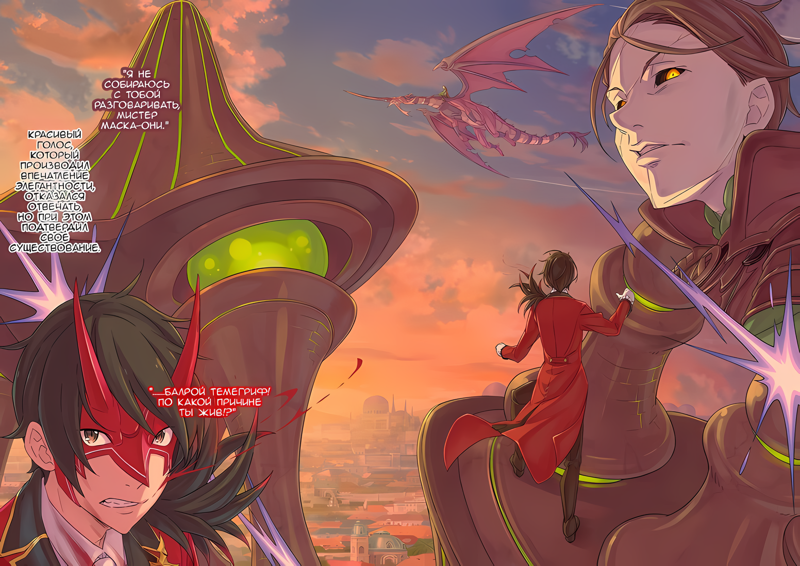
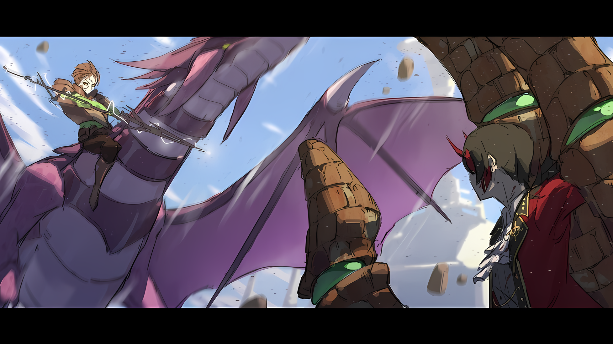
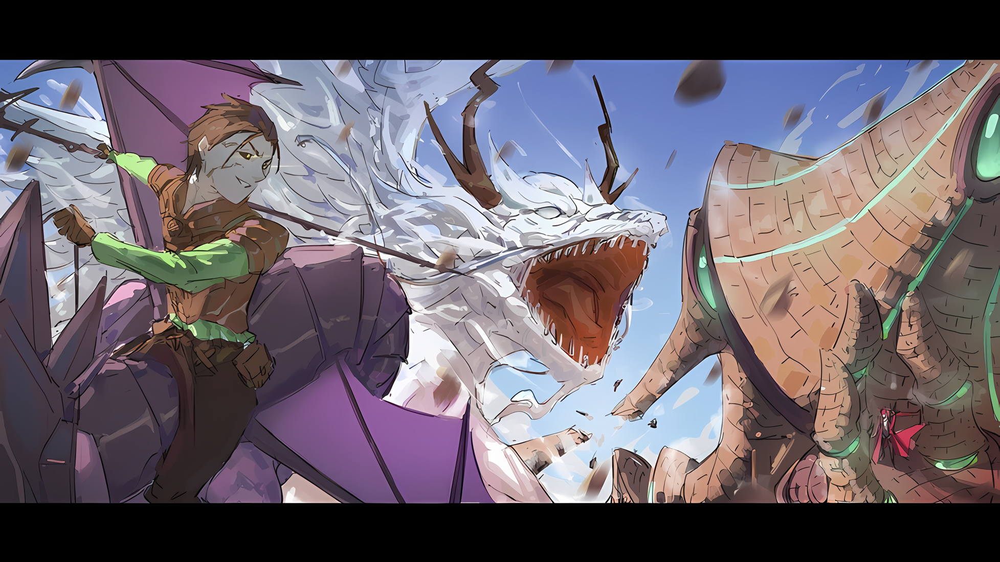
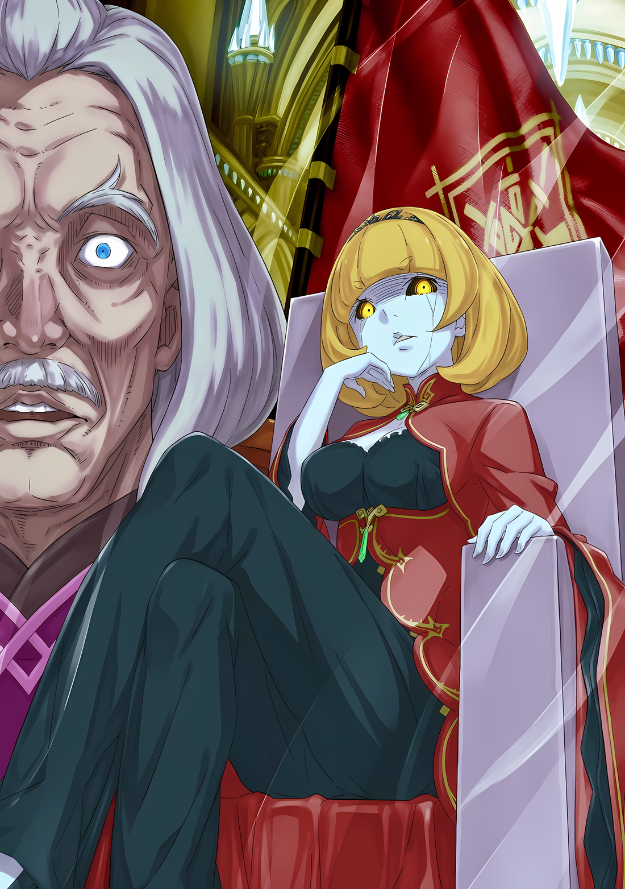

……Последний поступок Чиши Голд, выдававшего себя за Императора, был непостижим.

???: …………

Будучи свергнутым с трона, Винсент Волакия стал называть себя Абелом, заручился поддержкой «Племени Судрак» в массивных джунглях на востоке и лично возглавил восстание, потрясшее Империю.

Это было не то, на что он рассчитывал, планируя будущее, но это был скорее план Чиши, который намеренно пошел на все, совершив тем самым предательство и изгнав Винсента из столицы Империи. Он не стал бы так просто менять свои планы.

Поэтому он принял меры, чтобы ясно дать ему понять, что его действия и мотивы бесполезны.

Сужденная смерть, вызванная «Звездочетом», была тем, с чем Абел давно смирился, с того самого момента, когда он обрел самосознание принца Волакии.

В тот момент, когда было получено повеление и предвидение, когда было предсказано, что после смерти Императора, взошедшего на трон, начнется «Великое Бедствие», которое должно было привести к разрушению.

Само его имя не называлось.

Однако в то время, когда он узнал об этом предсказании, у него была уверенность, что именно он взойдет на трон Императора.

Он был уверен, что если не он, то Империя Волакия не будет спасена.

Другим своим братьям и сестрам он не мог доверить эту великую обязанность.

Вложив в дело все свои возможности и потенциал, Винсент Абеллюкс займет место Императора, и как Винсент Волакия, он примет меры, чтобы Империя не погибла.

Таков был план Винсента Волакии, на который Абел поставил свою жизнь.

Он восстановил систему «Девяти Божественных Генералов», которым все поклонялись в Империи Волакия, где почитались сильные, а на их вершине поставил безошибочно узнаваемого сильнейшего.

Исказив образ жизни Империи, и без того изобилующий бессмысленным варварством, он привел их к тому, что они утратили свое нежелание к упорядоченному насилию.

Таким образом, он оставил столько потенциала, сколько мог, чтобы Империя выжила даже после его смерти.

Все это было частью плана, на который он поставил свою жизнь.

Абел: …………

Тело, не способное ни на что, кроме как лежать лицом вниз, продолжало изливать огромное количество крови из груди — его сердце было пробито.

Черные волосы и черные глаза; каждый раз, когда он смотрел в зеркало, его лицо вызывало в нем гнев и разочарование от недостатка власти, от недостатка знаний. Это лицо, вместе с его выражением, было пропитано кровью, пока оно смотрело в никуда.

Его нынешнее тело, проявившееся благодаря «Способности», которую он, по его словам, обрел на пороге смерти, не вернулось к своей первоначальной форме, даже когда его жизнь подошла к концу.

Он больше никогда не увидит эту форму, никогда больше эта дерзкая речь не ударит по его барабанным перепонкам.

Никогда.

Абел: Зачем.

Вопрос, который не должен был быть задан, сорвался с его губ.

Тот, кто должен был ответить на этот вопрос, никогда больше не откроет своего рта. И все же, губы, которые должны были избегать всего, что их владелец считал как бессмысленное, произнесли этот вопрос.

Пророчество о «Великом Бедствии», если знать его условия, можно было избежать.

В прошлом он уже искал этот способ. Он рассказал ему такие сведения, которые должны были заставить его понять, что это невозможно. И все же, поскольку Чиша все еще не был убежден, он напрасно совершил предательство.

Таким образом, их противостояние в тронном зале должно было стать доказательством того, что не существует средств, с помощью которых можно было бы избежать «Великого Бедствия».

Он обучал Чишу, чтобы после собственной смерти доверить ему управление Империей. Думать так же, как он, приходить к тем же выводам, что и он, чтобы он мог выполнять функции доверенного лица Винсента Волакии.

Поэтому, если бы он действительно был Винсентом Волакией, он должен был принять поражение с изяществом.

Принять поражение и опустить оружие, положить конец этой бесполезной битве, вернуть трон вернувшемуся Абелу, чтобы тот мог поприветствовать смерть, а затем, с помощью этого, якобы противостоять разрушению «Великого Бедствия».

Этого не случилось. Это была глупая авантюра.

Даже если бы он умер вместо Абела, как Винсент Волакия, если бы «Великое Бедствие» не сочло это приемлемым, это было бы глупой авантюрой, которая закончилась лишь бесполезной смертью.

А именно этого Абел терпеть не мог — смерти, неэффективной до крайности.

Хотя Чиша Голд, по всей видимости, знал об этом.

Абел: Зачем.

Эти слова окутывали бесконечное сомнение и недоумение, окрашенное в глубокий алый цвет текущей крови.

Даже если бы он спросил еще раз, наступил бы очередной слой молчания, оставшийся без ответа. Это также было тем, что Абел ненавидел: неэффективность до крайности, а затем……

???: ……Ну, разве это не потому, что это был плохой план?

Сразу же после этого был выпущен второй выстрел белого света, который молнией устремился прямо к стоящему Абелу.

△▼△▼△▼△

Удар, носящий с собой смерть, полетел в сторону Абела быстрее стрелы, назвать его мощь легкой было бы апогеем лжи.

Начнем с того, что Абел никогда не был бойцом.

Так как шок от непосредственно предшествовавшего события еще не прошел, он был совершенно не в состоянии отреагировать на белое сияние, на мгновение промелькнувшее в его зрении.

Следовательно, то, что спасло Абелу жизнь в тот момент, не являлось его собственным суждением.

???: …………

Это случилось как раз в тот момент, когда Абел был на грани того, чтобы быть пробитым светом, приближающимся к нему спереди и готовым вот-вот пронзить его сердце.

Ревущий звук и сильные толчки неистово сотрясли тронный зал…… Нет, весь Кристальный Дворец, и огромный удар разрушил его прочные стены. Источник удара не ограничился разрушением стены, а вклинился между Абелом, который стоял прямо.

Со звуком, напоминающим всплеск воды, белый свет уничтожил эту помеху. Таким образом, то, что на волосок спасло жизнь Абелу, было……

Абел: ……Огромная рука, Могуро Хагане!?

Могуро: Человек у трона, защищать. Приказ, Его Превосходительства.

Предмет в виде стены, внезапно появившийся перед глазами Абела, был правой рукой Могуро Хаганэ, который появился в тронном зале.

Могуро, «Метеор», известный также как сам Кристальный Дворец, должен был участвовать в ожесточенной схватке, развернувшейся на поле боя, приняв в свое тело стены столицы Империи Рапганы.

И все же……

Абел: Так это все Чиша…?!

Предыдущее заявление Могуро было доказательством того, что он получил приказ защищать Абела.

Значит, тот, кто приказал ему вернуться издалека, был тем, кто сидел на троне, обладающем функцией влияния на Метеор; никто иной, как Чиша Голд.

То, что жизнь Абела снова станет мишенью сразу после того, как он сам был застрелен, было его предсказанием.

Абел: ……Кх, Могуро Хагане! Вытащи меня наружу!

Могуро: Кто, ты. Мой, приоритет, Его Превосходительство…

Абел: Император мертв! Если я умру, его смерть будет напрасной!

Могуро: …………

Внимая этим властным словам Абела, Могуро заметил рухнувший силуэт, когда он заглянул в тронный зал.

Состояние Могуро было таково, что трудно было определить, где находятся его глаза. Однако, как только зеленые шары, появившиеся из-за городских стен, замерцали, он также осознал смерть Императора, который рухнул лицом вниз.

Могуро: Тело…

Абел: Это лишнее! Не думай о мертвых!

Закричав на Могуро, когда он пытался достать труп Императора, Абел прыгнул к титанической правой руке, стоявшей перед ним. Когда он вцепился в один из пальцев руки, похожей на кисть, Могуро вытащил руку из тронного зала, в результате чего Абела омыли бушующие ветры, унося его в небо.

Могуро: …………

Могуро стал единым целым со стенами, изменив их структуру, дабы облегчить себе передвижение.

Теперь его тело представляло собой огромного голема высотой более пятидесяти метров, вместе с этим, Абел возвысился к небесам, благодаря его руке.

С этой высоты был виден городской пейзаж столицы Империи, путь, пройденный Могуро от третьего бастиона, который они защищали, а также здания, затоптанные на этом пути. Было очевидно, что он направился прямо к этому месту, не заботясь ни о чем другом.

Кроме того, хотя сражения на каждом бастионе еще продолжались, причины их конфликтов уже исчезли, и поэтому те, кому нужно было подготовиться к предстоящей битве, напрасно тратили свои жизни.

Их жизни напрасно тратились……

Абел: ……Кх

В его мыслях возникло беспокойство, и Абел приложил силу, цепляясь руками за огромного голема.

Сейчас было не время вспоминать ушедшие события, ведь его мысли и так разлетелись на множество осколков. События уже разворачивались. Все было так, как он и сказал Могуро. ……Если он умрет сейчас, эта смерть будет напрасной.

По крайней мере, он должен выяснить, имела ли эта смерть смысл или нет.

Абел: Я не умру.

Голос дрогнул, как будто его выжали, Абел прикусил губу и пристально посмотрел вниз.

Даже если он сейчас повысит голос, он не дойдет до тех, чьи жизни столкнулись на поле боя. Однако он должен сообщить им, что смысл в этой битве потерян, любыми средствами.

Могуро: Опасность.

Пока Абел размышлял, голос Могуро, похожий на звук шторма, ударил по его барабанным перепонкам.

Разница в их телосложении была настолько значительной, что каждое действие Могуро было сродни действиям человека по отношению к муравью. Однако он не специально сотрясал его барабанные перепонки.

Повернувшись спиной к Кристальному Дворцу, Могуро, держа Абела в правой руке, развернул свое колоссальное тело. Когда звуки последовательных ударов отразились от внешней стороны правой руки, в которой он был зажат, щеки Абела исказились.

Последовательность ударов исходила не с одного направления, скорее, они сыпались со всех сторон.

Враг просто превосходил его числом. ……Нет, предполагаемый сбор магов, способных так точно нацеливаться на врагов, был бы немыслим в Волакии.

Иными словами, это была не многочисленная группа, а мастерство одного человека.

Действительно сильного человека, который создавал иллюзию одновременной атаки большого количества людей со всех сторон…… Воскресив в памяти воспоминания о том времени, когда его мысли остановились от шока, Абел поднял лицо.

Тот стиль боя, голос того нежелательного ответа присутствовали в его воспоминаниях.

Это был……

Абел: …………

Могуро скрутил свое тело, защищая Абела от ливня выстрелов, и спустился вниз.

Взглянув на небо, он увидел след тени, движущейся слишком быстро, чтобы глаза могли засечь ее. Хоть и крайне редко, эта форма могла быть замечена в пределах Империи Волакия.

Акробатический полет наездников позволял управлять летающими драконами… Но в Империи не было наездников, способных скользить по небу с такой скоростью.

Точнее говоря, это был уровень способностей, известный как «Предельные Возможности Полета», область, в которой сильнейшему наезднику летающего дракона Империи не было равных.

Через мгновение белый свет рассеялся и раздался звук ломающегося от удара огромного тела Могуро, и часть разбитой стены коснулась щеки Абела. Не искажая своего лица от боли, он увидел его.

Всадник на драконе пронесся мимо видения его черных глаз, закрытых маской Они… Пепельно-коричневые волосы, трещины, проходящие по лишенным цвета чертам лица, и темные глазные яблоки, похожие на безлунную ночь, с золотистым сиянием в них.

Его облик казался слишком неузнаваемым, но даже так его невозможно было не узнать.

Абел: ……Балрой Темегриф! По какой причине ты жив!?

Балрой: Я не собираюсь с тобой разговаривать, мистер Маска-Они.

Красивый голос, который производил впечатление элегантности, отказался отвечать, но при этом подтвердил свое существование.

Вновь исчезнув из виду, враг, который направил своего летающего дракона, чтобы рассечь воздух… Балрой Темегриф, был безошибочно тем преступником, который целился в тронный зал Кристального Дворца снаружи и тем, кто выстрелил в сердце фальшивому Императору.

Известный как Магический Снайпер, он был человеком, царившим на вершине всех наездников летающих драконов.

Цветная иллюстрация к **Ранобэ** Том 33 | Перевод неофициальный и выполнен под контекст перевода rezero7arc | Клин djoenfoej

Один из «Девяти Божественных Генералов», он был «Девятым» во времена восстания, произошедшего в Империи в прошлом……

Могуро: Балрой, умер. Ты, фальшивка.

Его восприятие было таким же, как и у Абела, и в тот момент, после своих слов, гигантский Могуро контратаковал.

Охватив Абела правой рукой, он взмахнул левой рукой своего огромного тела, и, буквально рассекая воздух, начал атаку на летающего дракона Балроя.

Люди склонны считать, что большие существа движутся медленно, но это была лишь иллюзия, вызванная тем, что их взгляды находились далеко от происходящего.

Помимо защиты Абела от магического обстрела, он блокировал все атаки противника до этого момента. Движения Могуро были быстрыми, ловкими и точными.

Могуро: Быстрый. Дотошный.

Однако, даже с рефлексами и ловкостью Могуро, подчинить себе Балроя, который превратил все небо в свои владения, было невозможно.

Особая черта наездника летающего дракона не ограничивалась только скоростью, но и возможностью двигаться вверх, вниз, влево, вправо, вперед и назад. Возможность двигаться во всех мыслимых направлениях была его главным преимуществом, которое нельзя было отнять.

Кроме того, Балрой не был обычным наездником на летающем драконе, он являлся их вершиной.

Абел: Он облачился в ветер…!

Тактика Балроя заключалась в обстреле при перемещении с помощью магии, но его сильные стороны, как одного из редких магов в Империи, не ограничивались только наступательными действиями.

Окутав ветром летающего дракона, которым он управлял, он осуществил маневр, недоступный другим наездникам, увеличив его скорость и смягчив удары, благодаря чему его невозможно было поймать.

Однако для того, чтобы применить его на практике, необходима была сильная координация с его летающим драконом.

Абел: Неужели этот летающий дракон тоже вернулся из потустороннего мира?

Наездники на летающих драконах могли похвастаться огромной силой в бою, но их главным недостатком было то, что на их обучение требовалось время, а также то, что они не могли ездить на спине любого летающего дракона, кроме того, которого они выбрали в качестве партнера.

Чтобы убить наездника на летающем драконе, сначала нужно убить его летающего дракона. Причина для смерти Балроя не была исключением.

Однако Балрой взмыл обратно. В буквальном смысле слова, он парил в небе вместе со своим любимым драконом.

Абел: «Великое Бедствие»……

Не было похоже, что возникли какие-либо явные или заметные повреждения.

Однако, поскольку Чиша лишился жизни, как Винсент Волакия, оставалось только подозревать, что события, выходящие за рамки человеческого понимания, которые произошли после этого, были связаны с «Великим Бедствием».

Но даже в этом случае было бы нелепо, чтобы Балрой Темегриф был носителем «Великого Бедствия».

Конечно, Балрой был вершиной наездников летающих драконов, поистине могущественной личностью среди сильнейших в Империи.

Если бы он был склонен к этому, ему не составило бы труда покончить с жизнью Абела.

И все же……

Могуро: Затрясет. Терпение.

Абел: Неважно, сделай это!

Неорганический голос послал сильный ветер, и Абел повысил голос в ответ.

В следующее мгновение Могуро, сделав выпад, нацеленный на врага, опустил руку к собственным ногам. Даже если бы это называлось «Ногами», глядя на огромное тело Могуро, казалось, что он стал одним целым с улицей.

Перед тем, как приблизиться к улице Империи, его левая рука издала скрипящий звук, и через мгновение сопротивления, выкорчеванная улица была величественно поднята в небо.

Абел: …………

Зрелище разлетающихся частей района было тем, что Абел видел совсем недавно в Хаосфлейме. Тогда это тоже было абсурдное зрелище, но это было не что иное, как жители города, собравшиеся вместе, чтобы бросать разрушенные здания.

Однако в случае Могуро это был подвиг силы, лишенный замысловатости, безошибочный акт насилия.

Это зрелище доказывало, что Могуро Хагане был необыкновенным, доказывало, что он был одним из «Девяти Божественных Генералов».

Без сомнения, Балрой тоже был выдающейся личностью, но Могуро, помимо других членов «Девяти Божественных Генералов», также обладал такими же качествами. Поэтому Балрой не мог быть носителем «Великого Бедствия».

Конечно, если бы в него бросили вырванную из земли улицу и ничего больше, проницательный Балрой просто уклонился бы и покончил с этим.

Поэтому, бросив блок города, который можно было назвать пушечным ядром, Могуро……

Могуро: Измельчение.

После взмаха левой руки, она превратилась в бесчисленное множество снарядов, преграждающих путь Балрою по воздуху.

Шрапнель разлетелась во все стороны, каждый кусок представлял собой массу камня или комок земли размером даже больше человека. Разбросанные одним ударом Могуро, они были таковы, что обычный человек, скорее всего, получил бы смертельную травму даже от легкого ранения.

Естественно, если бы Балрой попал под этот удар, то даже он, овладевший Методом Потока, получил бы смертельный удар в воздухе. И чтобы избежать этого…

Балрой: Карийон!

В соответствии с резким голосом среди бури ветра, его летающий дракон взмыл в воздух, чтобы проскочить мимо пулевого дождя валунов.

Взмахивая крыльями и рассекая воздух, его летающий дракон нацелился на ту область, где непрекращающийся ливень валунов был немного слабее….

Абел: Очевидно, это ловушка.

Могуро специально оставил область, где ливень был немного слабее, однако, даже если Балрой и Карийон знали, что это была уловка, они не могли позволить себе попасть под шрапнель, поэтому у них не было выбора, кроме как лететь туда.

Оставалось лишь решить, сможет ли Балрой, летящий на своем любимом драконе на большой скорости, уклониться от ожидаемого удара Могуро.

Окутанный ветром летающий дракон ускорился, взмывая в небо и уничтожая выстрелами мешающие осколки.

Могуро вскинул отведенную назад левую руку, и удар, способный просверлить дыру в мире, пронесся по небу столицы Империи.

Разворачивалась дуэль «Девяти Божественных Генералов», которая никогда не могла быть реализована при жизни Балроя, и перекрестившись в воздухе, они начали свой поединок……

……В этот миг, быстрее, чем они успели врезаться друг в друга, облака столицы разлетелись от звука взрыва и его ударной волны.

rezero7arc | Арт от Rokaroka

Абел: ……Кх

Хотя прямых повреждений от взрывной силы удалось избежать, остаточная ударная волна была настолько сильной, что казалось, она оторвет тело Абела от Могуро.

Но в какой бы тяжелой ситуации ни оказалось его стройное тело, Абел никогда не закрывал глаза. Отныне его глаза крепко вцепились в события того момента.

Абел: Могуро, рука……

Как раз перед тем, как вращающаяся левая рука Могуро смогла продемонстрировать свою мощь, убив Балроя, произошло некое вмешательство, и часть голема, в месте плечевой кости человека, была разрушена.

Энергично вращаясь, рука Могуро, достаточно огромная, чтобы соперничать с размерами самого замка, металась в воздухе. Неторопливо выскользнув и пролетев под повреждениями, Балрой уцелел под градом осколков… Мало того, он выбрался совершенно невредимым.

Затем, появился тот, кто уничтожил руку Могуро и тем самым спас Балроя из затруднительного положения……

*???: «ЫЫААААААА……!!!»*

Когда раздался глубокий голос, пронзивший атмосферу, произошло яростное столкновение. Могуро снесли руку и нарушили позицию, а затем заставили сверкнуть его зелеными глазами от вида того, кто явился на поле битвы.

Для Абела это вмешательство тоже было непредвиденным. Впрочем, этого следовало ожидать.

В конце концов, противником был тот самый Балрой Темегриф, который восстал после смерти.

*???: «ТЫ! ОТВАЛИ ОТ ДРУЗЕЙ ДРАКОНА!!!»*

Выпустив когти, он легко прорвал тело Могуро, созданное из городских стен, и с ревом ударил по нему хвостом, разрушив одну из его частей, после чего масса Могуро уменьшилась в мгновение ока.

Это произошло чрезвычайно резко, но это было само собой разумеющимся. ……Этот противник был одной из самых сильных форм жизни в мире.

Абел: «Облачный Дракон», Мезорея…… то, что живет внутри, Мэделин Эшарт!?

*Мезорея: «РЫЫЫААААААААА!»*

rezero7arc | Арт от Rokaroka

Воющий Дракон яростно бился всем своим телом, и от его столкновения огромная фигура Могуро сильно раскачивалась. С каждым ударом стены трескались, и их осколки падали на столицу Империи.

Кристальный Дворец, восхваляемый как самый красивый замок в мире, был растоптан, его сады подверглись опустошению, а городской пейзаж Империи, построенный в хорошо организованном, упорядоченном виде, разрушался с каждой секундой.

Кроме того, катастрофы, обрушившиеся на столицу, на этом не закончились.

Абел: …………

Неразличимый среди громовых звуков гнева Дракона, повреждающий тело Могуро, до ушей Абела донесся звук разрушения, сродни тому, как рушится мир, доносящийся издалека.

Он направил свой взгляд туда, за Кристальный Дворец…… туда, где находился резервуар, цистерна, которая использовала истоки среди гор и служила источником воды для всей столицы… его оплот был пробит левой рукой Могуро, которая была рассечена всего несколько мгновений назад.

Через мгновение от места, куда проникла рука, появились трещины, и вода из резервуара начала просачиваться наружу. Постепенно набирая силу, в скором времени вся плотина разрушилась и превратилась в поток грязи, текущий через столицу Империи.

Ее жители, а также Имперские солдаты и повстанцы, участвовавшие в битве, должны были как можно скорее укрыться……

Могуро: ……Ошибка.

Сразу после того, как он услышал не совсем тихое бормотание Могуро, тело Абела охватило чувство парения.

Оглянувшись через плечо и почувствовав, как его внутренности поднимаются вверх, он увидел, что его не отбросило, а, скорее, рука Могуро, за которую держался Абел, была пробита Драконом выше запястья.

Не то чтобы он был мишенью. Скорее, это был не более чем результат безрассудной атаки.

Однако……

Абел: ……Ох.

Подхваченное импульсом свободного падения, тело Абела перевернулось в воздухе.

Его руки, которые цеплялись за Могуро, оторвались от голема, и даже если бы он все еще держался за него, это, скорее всего, стало бы причиной его смерти, ведь рука изначально была крепкой городской стеной.

Однако, даже если бы рука Могуро не стала причиной его смерти, при такой скорости Абел врезался бы во что-то, очень похожее на нее, и его судьба была бы точно такой же.

Абел: Мне нужно……

*Найти что-нибудь;* оглядевшись вокруг, взгляд Абела остановился на одной точке.

Однако эта точка не была источником помощи.

В поле зрения Абела попало большое отверстие в Кристальном Дворце, через которое Могуро вытащил его наружу.

Отверстие вело в тронный зал. Он не мог заглянуть внутрь, но его внимание привлекло это место.

Он был тем, кто сказал «не думай о мертвых», но сам практически испил того же яда.

Абел: …………

Он не знал, нашел ли он способ выйти из тупика или нет, даже с этой единственной секундой.

Но то, что он не потратил эту секунду впустую, было доказательством непреклонного духа Абела, неизгладимым шрамом, выгравированным на его душе навечно.

Но если бы он вот так бросился на смерть, то рассуждения о шраме, выгравированном на его душе, не имели бы никакого смысла.

???: Тянуу……!!!

Абел: ……Кх!?

Не понимая, что ему делать, Абел выставил свои конечности так, чтобы уменьшить повреждения от удара, но прежде чем это произошло, его с силой встретило мягкое ощущение.

Неосознанно задержав дыхание, тело Абела отскочило, и он снова почувствовал это ощущение. Повторяя это бесчисленное количество раз, Абел на мгновение заметил, что подпрыгивает на расстеленной ткани.

Кто-то расстелил кучу ткани под падающим Абелом и таким образом предотвратил его жестокое падение.

Осмыслив реальность своего спасения от смерти, он тут же скатился с полотна и с его края поставил ногу на твердую землю. Опустившись на одно колено, он поднял лицо, чтобы увидеть того, кто совершил это деяние……

???: ……Ну~, время для заповеди пришло!

Абел: …………

???: Вы «Его Превосходительство» или же Его Превосходительство? В любом случае, «Великое Бедствие» наступило! Не будете ли вы сражаться против «Великого Бедствия» вместе со мной!?

*Ты действительно так рад исполнению пророчества?*

Раскинув руки, его манера поведения и голос были радостными и слишком неуместными, когда битва между титаном Могуро и «Облачным Драконом» привела к разрушению города у него за спиной, человек… Убирк… улыбнулся.

Он праздновал момент, когда заповедь, данная ему как «Звездочету», без сомнения, исполнилась.

△▼△▼△▼△

Громоподобный звук ломающихся стен раздался, сильно сотрясая Кристальный Дворец. Убедившись, что произошло нечто решающее, Беллстетз Фондальфон вошел в тронный зал.

И тут……

Беллстетз: Это… Чиша-доно?

Стена тронного зала осыпалась, и среди свежей пыли Беллстетз обнаружил на алом ковре черноволосого Императора, мрачно опустившего уголки своих глаз.

Подойдя ближе, он увидел, что тело, лежащее лицом вниз, было пробито в грудь. Сердце, которое должно было биться внутри, разорвалось и нить его жизни оборвалась.

Хотя он не был военным, он все понял с первого взгляда. Это была мгновенная смерть. Не было времени даже почувствовать боль.

Беллстетз: Учитывая то, что мы сделали, можно сказать, что это довольно милосердный конец.

С тех пор как он совершил предательство, подняв восстание против Императора Винсента Волакии, Беллстетз смирился с тем, что его смерть не будет мирной.

Как сообщник, Чиша тоже должен был смириться.

Но опять же……

Беллстетз: Хотя, судя по моему разговору со «Звездочетом», похоже, что ты целился на нечто другое.

Несмотря на явное предательство, Беллстетз не собирался его осуждать.

Скорее, его истинными чувствами было восхищение.

Для того чтобы получить желаемое, человек должен исчерпать все свои силы в попытках добиться своего; такова была сущность Империи.

Ни Беллстетз, ни Чиша не обладали боевой мощью, необходимой для соблюдения мантры Империи, но они были похожи в том смысле, что оба компенсировали недостаток своей изобретательностью.

Новая форма Империи, созданная Императором Винсентом Волакией, также признала и подтвердила это как форму силы.

Беллстетз также одобрил этот способ ведения дел в Империи, и, придерживаясь его, Чиша показал великолепный пример.

Своей собственной силой. ……Для человека Империи Волакия это был почетный поступок.

Беллстетз: Хотя, похоже, будет трудно найти время, дабы произнести хвалебные слова.

Опустив взгляд на труп, Беллстетз посмотрел на дыру в стене, откуда дул шторм. С другой стороны он мог констатировать присутствие огромного тела, окрашенного в камни…… присутствие Могуро Хаганэ.

Учитывая эти обстоятельства, было бы странно, если бы Могуро убил Чишу.

По своему положению он был союзником Чиши, а последний играл роль Императора. Причиной смерти был удар в грудь, но гигантскому телу Могуро было бы невозможно нанести удар с такой точностью.

Если и были причины для беспокойства, так это странные слова, которые «Звездочет»… Убирк, оставил после себя, когда проходил мимо Беллстетза, направляясь к выходу из Кристального Дворца.

Беллстетз: «Великое Бедствие» и разрушения, которые оно принесет…… Только вот, о чем я могу не знать в Империи?

???: ……Божечки, неужели тебе никто не сообщил? В таком случае, может быть, я введу тебя в курс дела?

Беллстетз: …………

Его щеки напряглись, когда он внезапно услышал голос, Беллстетз медленно перевел взгляд назад.

Его взгляд, направленный в сторону большого отверстия, вернулся к рухнувшим останкам Императора. Затем он бросил взгляд дальше вверх, в самую глубину тронного зала — на трон.

Несмотря на то, что весь замок сотрясался от ударов, трон стоял на своем месте, не шелохнувшись. Национальный флаг с изображением Меч-Волка колыхался на ветру, а перед ним стоял силуэт, опираясь подбородком на руку.

Августейшая фигура, восседавшая на троне, где должен был сидеть Его Превосходительство Император, смотрела на Беллстетза.

Беллстетз: Чт…

По правилам, он должен был поднять строгий голос и упрекнуть в неуважении человека, сидящего на троне.

Однако он был не в состоянии сделать это. Правда, от потрясения он потерял дар речи, но, помимо этого, Беллстетз не обладал достаточной квалификацией, чтобы упрекнуть ее.

В Империи должность премьер-министра занимала второе место по авторитету после Императора и Императорской семьи.

Можно было сказать, что Генералы Первого класса, прославленные как «Девять Божественных Генералов», занимали аналогичное положение, но более важным был тот факт, что в стране не было почти никого, кого Беллстетз, занимая пост премьер-министра, не мог бы упрекнуть.

Тем не менее, он не смог упрекнуть другую сторону.

Причиной было……

???: Подумать только, ты все еще жив, знаешь, Беллстетз, а ты довольно живуч. ……Скажи, кто победил на «Церемонии Императорского Отбора»? Братик Винсент? Или же Приска?

Девушка из Императорской семьи Волакии, с трещинами на бледном и красивом лице, спросила его.

Госпожа, которой Беллстетз Фондалтфон служил раньше; принцесса Империи, которая должна была погибнуть, потерпев поражение на «Церемонии Имперского Отбора», Ламия Годвин скрестила ноги на троне.

rezero7arc | Иллюстрация к **Ранобэ** Том 33 | Разукрасил V!c.ll2o
