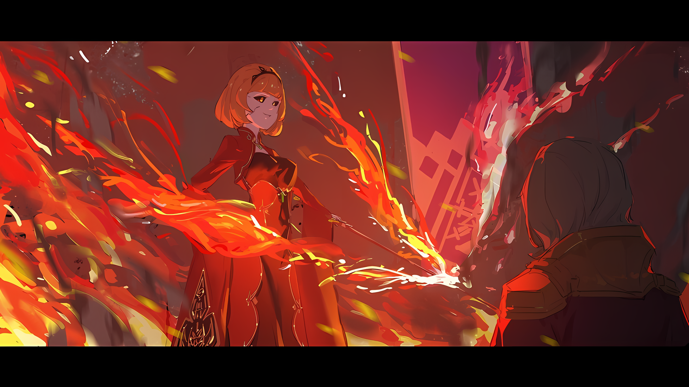
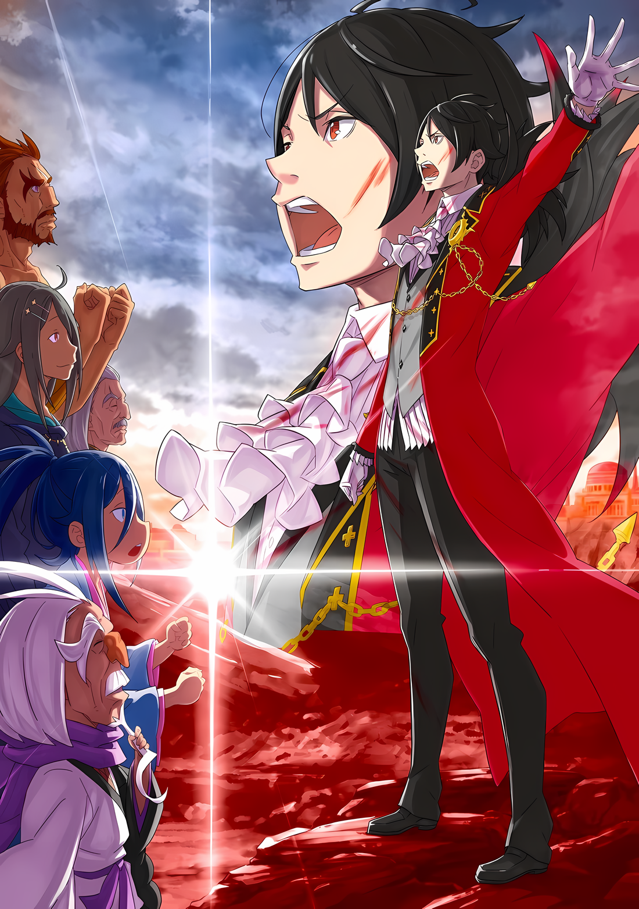

Ему вспомнилась одна неприятная история.

Как он помнил, ее когда-то рассказывала Петра.

Петра: У Мастера очень скверный характер. Он ужасно разговаривает, пристает ко мне, и кажется, ему нравится, когда его ругают; и порой это странно, но он действительно хорошо обучает.

Такова была природа Петры, что она не могла несправедливо унизить человека, который ей не нравился, хоть она и не хотела в этом признаваться.

Можно ли сказать, что она и Гарфиэль были близки по возрасту и, возможно, даже дружили? Ему нравилась ее благородная натура; неудивительно, что Фредерика была так увлечена ею.

Если говорить о личностях, склонных к потерям, то любовь Гарфиэля к Субару и Отто, вероятно, была из того же ряда. В конце концов, это доказывает кровное родство брата и сестры.

Если так, то Гарфиэль должен был признать и это.

Розвааль Л. Мейзерс был злопыхателем в лагере, замышлявшим непростительные проступки, и естественным врагом, которого он давно недолюбливал.

Тем не менее, его учения были верны, и это помогло Гарфиэлю выжить.

Розвааль: Гарфиэль, этот сюрикен покрыт ядом. Но даже если ты уклонишься от него, он затем взорвется. Что нужно сделать?

Гарфиэль: А ты, я вижу, не торопишься со словами!

Завыв, Гарфиэль топнул ногой по земле, и сразу после этого она поднялась, чтобы послужить щитом. Легкий звук сюрикена, вонзившегося в землю, а затем звук взрыва опалил атмосферу.

Как правильно понял Розвааль, урона не удалось бы избежать, если бы он парировал удар щитом.

Его острые клыки скрипнули от этого факта……

Гарфиэль: Что дальше?

Розвааль: Мой черед.

Получив немедленный ответ на свой вопрос, Гарфиэль повернулся к стоящему позади него Розваалю.

Мгновение спустя он использовал свой сай в обеих руках, чтобы отбить брошенный в него кунай. Увидев мелькнувшую над головой тень, Гарфиэль без колебаний запустил в нее кулак.

Его удар был встречен другим резким поднятым ударом и раздался звон.

Атака была заблокирована Ольбартом, который остановил свой череподробительный удар в сторону головы Розвааля. Чудовищный старик парировал атаки Гарфиэля ногами, и тем временем ворчал:

Ольбарт: Чертовщина, это уже становится проблемой. Двое против одного, разве это не несправедливо?

Гарфиэль: Не пытайся менять правила, старикан!

Ольбарт: Какакака! Я волен говорить все, что захочу.

Ольбарт отпрыгнул назад, отводя ногу от удара кулака и используя ее как трамплин. На мгновение Гарфиэль собрался сделать шаг вперед, чтобы последовать за ним,

Гарфиэль: …………

Когда он остановился, сюрикен, пронесшийся рядом с ним, пролетел прямо под его носом и разорвал воздух.

Он прозевал эту атаку, однако отделался лишь глубоким выдохом. Розвааль, стоявший рядом с ним, изменил выражение лица, снова взявшись за сай.

Губы Гарфиэля искривились при виде этого зрелища.

Гарфиэль: Чему ты улыбаешься?

Розвааль: Ничему-ничему. Ну, я просто восхищался поразительной скоростью твоего роста. Даже без моих слов ты сумел предугадать внезапную атаку. Ты учишься всему, пока сражаешься.

Гарфиэль: Ты намекаешь, что я просто хитрю, не так ли? Крутой я не будет таким же ублюдком, как ты или тот старик.

Розвааль: Знаешь, чтобы быть гнусным, тоже нужен талант. Как я вижу, у тебя нет предрасположенности к гнусности. Ты примерно на одном уровне с Эмили.

Гарфиэль: Конечно же нет! Не сравнивай меня с ней!

Он огрызнулся на замечание Розвааля, но, произнеся его вслух, подумал, что эта реакция могла бы обидеть Эмилию, если бы та услышала ее.

Как бы то ни было, он подумал об Эмилии и других членах лагеря, которые, возможно, были на поле боя как и Гарфиэль, и задумался о том, кто сражается вместе с ними. Он глубоко вздохнул, подумав о судракийских женщинах и Хейнкеле, а также о безопасности Рам, которая присоединилась к ним.

Ольбарт: Вижу, у тебя много свободного времени? Твои люди в трудном положении, ведь так? Уверен, что мы владеем более сильным составом.

Гарфиэль: ……Кх

Слова Ольбарта расстроили попытки Гарфиэля вернуть самообладание и смириться с ситуацией.

Ощущение, что его мысли читают, заставляло человека подозревать, что на поле боя его намерения могут быть предсказаны; это была нежелательная ситуация.

Но рядом с нетерпеливым Гарфиэлем Розвааль просто пожал плечами,

Розвааль: Твой противник хочет, чтобы ты разгорячился. В твоем случае это может устранить любые колебания, но нехорошо подмешивать примеси в твой пыл. Кроме того……

Гарфиэль: Кроме того?

Розвааль: Он и так был довольно болтлив, но разве он не увеличил количество замечаний, которые пытаются нас обмануть? Похоже, что старик тоже весьма раздражен.

Ольбарт: ――. Ты отвратительный юноша, не так ли?

По мере того как он говорил, блеск в длинных, покрытых бровями глазах Ольбарта приобретал оттенок досады.

И, услышав заявление Розвааля, Гарфиэль понял очевидную истину — его противник был так же раздражен затянувшейся битвой, как и он сам.

Ольбарт смеялся, когда его провоцировали и дразнили, не потому, что мог себе это позволить, а потому, что хотел, чтобы его противники поверили, что у него есть для этого возможность, дабы одержать психологическую победу.

В то время как в случае с Гарфиэлем его чувства можно было сразу увидеть по его лицу и голосу.

Таким образом, в этом виде психологической войны оппонент мог победить в мгновение ока, водя его за нос.

Розвааль: В случае, когда ты превосходишь противника в силе и он выходит на одно игровое поле с тобой, ты можешь победить. Однако…

Гарфиэль: Знаю. Если ублюдок сильнее меня и дерется только на том ринге, на котором умеет, то, как бы я ни старался, я не смогу найти способ победить. Но….

Тот факт, что Гарфиэль сейчас сражался в Империи Волакия, был результатом довольно неудачного сочетания различных случайностей.

Но как бы ни складывались кости, нельзя было отрицать реальность, которая предстала перед ним.

И в последующие годы битвы, сравнимые с этой, могли происходить бесконечно, пока он был с Эмилией и Субару.

Это означало……

Гарфиэль: ……Я закончил с нытьем.

Розвааль: Мм, это верно. Отлично. Думаю, это конец твоих игр в детство.

Гарфиэль сморщил нос от театральности Розвааля.

Для него не было ничего радостного в том, что он поздравил или похвалил его за личностный рост. Однако ему нравилось выражение «это конец твоих игр в детство».

С этого момента Гарфиэль продолжал жить дальше как человек, который повзрослел.

Ольбарт: ……О боги. Вот почему я ненавижу молодых. В отличие от стариков, у которых нет возможности для роста, вы все можете быть просвещены.

Ольбарт вздохнул, вывернув шею и оторвав лодыжку ноги от земли.

Однако в легкомысленном уничижении «Порочного Старика» слышалась неподдельная враждебность. ……Да, враждебность. До этого момента Ольбарт считал Гарфиэля человеком низшего ранга и стремился устранить его.

Это был знак того, что в Гарфиэле наконец-то признали врага.

Гарфиэль: Наконец-то…

Его кровь пылала от энтузиазма, ведь он заслужил право сразиться с Ольбартом.

Он снова вдохнул через нос, сильно и глубоко, а затем выдохнул через рот. После, он почувствовал кровь, циркулирующую в его теле, и свою силу, которую нельзя было увидеть……

Ольбарт: Хаа?

Внезапно раздался неуклюжий звук, нарушивший концентрацию Гарфиэля.

Его произнес Ольбарт, стоявший перед ним, и на мгновение он подумал, что это была техника шиноби, чтобы нарушить его спокойствие. Однако это было не так.

Вместо этого Ольбарт создал щель под собой.

Гарфиэль: …………

Он был главой шиноби. Возникшая щель была мала, как игольное ушко, но Гарфиэль не мог не вздохнуть, ведь никогда прежде он не проявлял подобной расслабленности.

То, что привело к этому являлось…

???: ……Погодипогодипогоди! Я считаю, что нечестно вот так отступать в самом разгаре боя, я считаю, что это пустая трата времени, ты не улавливаешь волну настроения! Я уверен в том, что ты не сможешь уловить ее лучше меня, верно?

По полю боя бежала фигура, издавая шумный голос и оставляя за собой облако пыли.

Маленький мальчик, который производил впечатление неуместного бойца, кричал пронзительным, высокопарным голосом со значительного расстояния…… Однако скорость, с которой он бежал, была необычной.

Кричащий мальчик смотрел в небо, преследуя огромное существо, которое хлопало крыльями.

С первого взгляда Гарфиэль понял, что это был Дракон, приземлившийся на другом поле боя, расположенном на некотором расстоянии отсюда. Это он понимал, но ситуацию, когда мальчик и Дракон играли в догонялки, он понимал с трудом.

Поле боя, на котором может произойти все, что угодно… хотя у него было сильное предчувствие, что так оно и есть…

Ольбарт: ……Почему этот ублюдок Сеси такой маленький?

Глаза Гарфиэля сузились от непостижимого зрелища, но тут до его ушей донесся приглушенный голос.

Ольбарт, стоя на одной ноге и все еще не открывая бреши, похожего на игольное ушко, отвлекся на Дракона и мальчика… вернее, на кричащего мальчика.

А затем……

Ольбарт: Ну, Чеши, ты перенял мой стиль, не так ли?

Затуманенные глаза старика наполнились удивлением и подозрением, после чего они прояснились и вместо этого наполнились гневом.

Это была эмоциональная перемена, длившаяся менее десяти секунд, но он понятия не имел, какой ход мыслей вызвал эту перемену в Ольбарте.

Но если это было одно из немногих открытий, сделанных «Порочным Стариком» за всю его жизнь, в то же время коварный Розвааль не собирался упускать его из виду.

Розвааль: ……Ты, должно быть, действительно не в курсе ситуации, если можешь позволить себе отвести взгляд от нас.

Всадив в него кончик сая, который он крепко сжимал, Розвааль шагнул в образовавшуюся тонкую щель.

От неожиданности удар задел левое плечо Ольбарта, от чего тот дрогнул. Набирающая скорость масса железа ударила старика в плечо, заставив его скрежетать зубами, пока его миниатюрная фигурка вплавлялась в землю.

Это была техника плавания сквозь землю, которую он несколько раз демонстрировал во время этой битвы.

Однако……

Розвааль: Гарфиэль!

Гарфиэль: Знаю!

Как бы его ни раздражало напоминание Розвааля, он уже мог разглядеть в нем стратегию.

В конце концов, «Божественная Защита Земляных Духов» Гарфиэля была Божественной Защитой, которая черпала ману из земли через подошвы его ног. Другими словами, она связывала его с землей.

Даже если противник находился под землей, если он сконцентрируется, отследить его местоположения можно…

Гарфиэль: ……А?

Внезапно все волоски на теле Гарфиэля встали дыбом, так как его охватило странное чувство.

Он почувствовал отвратительное ощущение, как будто его шею лижет грубый язык. Это ощущение исходило не от Ольбарта, а от гораздо большего и широкого пространства.

Розвааль: Гарфиэль?

В ответ на неподвижность, Розвааль окликнул его.

Не совсем в противовес предыдущим действиям Ольбарта, Гарфиэль также сделал щель. Проем, которым несомненно воспользовался бы чудовищный старик.

Однако нападения не последовало. Напротив……

Розвааль: Следы старика исчезли?

Он пробормотал эти слова, нахмурив брови и не ослабляя хватку своего сая.

И он был прав, не было никаких следов Ольбарта, которые должны были быть там. Конечно, очевидно, что противник был шиноби и скорее всего, он умел скрывать свое присутствие в максимально возможной степени.

Однако это было не так. Было видно, что присутствие Ольбарта казалось все отдаленнее и отдаленнее.

Он удалялся от Гарфиэля и Розвааля с бешеной скоростью, а затем……

Гарфиэль: Какого черта, это чувство…

Розвааль: Гарфиэль, старик…

Гарфиэль: Как странно, хотя скорее отвратительно, словно «Ветры Айхии портящие воду»……

Розвааль, все еще настороженно относящийся к Ольбарту, не разделял с Гарфиэлем чувства опасности.

Если он не мог ее почувствовать, то, скорее всего, причиной была не мана. Это было огромное, приближающееся неимоверное ощущение, которое Гарфиэль чувствовал под ногами.

……Гарфиэль, обладавший «Божественной Защитой Земляных Духов», заметил это ощущение быстрее всех.

Гарфиэль: Земля поля битвы… Нет, земля Волакии… разбушевалась?

Он чувствовал ужасающие крики земли.

Любая обида на то, что битва осталась незавершенной, или возможность разрушить одну из стен была упущена, рассеялась перед тяжестью того, что стояло на их пути.

Гарфиэль: Розвааль! Сейчас же взлетай и оповести всех!

Розвааль: …………

Гарфиэль, забыв псевдоним Розвааля, который он должен был использовать в Империи, позвал его и тот не стал вмешиваться, возможно, из уважения к срочности ситуации.

Он крикнул с чувством неотложности, несмотря на свою ненависть к собеседнику.

Содержанием крика было…

Гарфиэль: ……Вся Волакия обращается против нас!

△▼△▼△▼△

……Ламия Годвин была одной из дочерей Драйзена Волакии, 76-го Императора Империи Волакия, которая сражалась против Винсента Абеллюкса и Приски Бенедикт на «Церемонии Императорского Отбора» и потерпела поражение от последней.

На «Церемонии Императорского Отбора», где все братья и сестры были вынуждены убивать друг друга, пока не останется только один, она создала союз с другими своими братьями, чтобы победить наиболее вероятного кандидата на Императорский трон, Винсента, и преуспела в том, чтобы загнать свою оппозицию в угол, используя превосходные схемы и ловушки.

Однако ее план не смог перевернуть первоначальные предположения, союз распался, и в конце концов она погибла в дуэли против своей ненавистной сестры Приски.

Среди тех, кто участвовал в «Церемонии Императорского Отбора», было принято считать, что она получила бы трон, учитывая ее возраст и возможности на тот момент, если бы не Винсент.

Однако поражение оставалось поражением. Столкнувшись с неопровержимой реальностью, тело Ламии было сожжено в пепел пламенем «Меча Света». Это должно было быть неопровержимой реальностью.

Однако……

Беллстетз: Ее Превосходительство Ламия, но каким образом…

Обычно Беллстетз держал глаза лишь чуть-чуть открытыми, но сейчас они открылись достаточно, чтобы заметить серый цвет его зрачков и показать его изумление перед человеком, стоящим перед ним.

Перед его трепещущим взором предстало не что иное, как лицо, которое все еще жило в его памяти, лицо его хозяйки, Ламии Годвин, сидящей на троне с развевающимся на ветру флагом позади нее.

За исключением потрескавшегося, бескровного белого лица и прекрасных красных глаз, которые превратились в жуткое золотое сияние, выделявшееся в кромешной тьме.

Ламия: Беллстетз, ты не услышал мой вопрос? «Церемонию Императорского Отбора» выиграл братец Винсент? Или же Приска? Только не говори, что это была сестрица Палладио? Это был бы кошмар, если бы кто-то еще, кроме этих двоих, участвовал в соревновании после моего поражения.

Беллстетз: ――. Его Превосходительство Винсент Абеллюкс заполучил трон после поражения Вашего Превосходительства. До настоящего времени он продолжал править в течение девяти лет.

Ламия: Однако он умер. То, что лежит у меня под ногами, это ответ на мой вопрос?

Перехватив слова Беллстетза, Ламия посмотрела на лежащий труп, опираясь подбородком на руку. Хотя она не могла разглядеть лица со своего места, она смогла отличить тело от других своих кровных братьев и сестер.

Технически Беллстетз догадался, что лежачий Винсент на самом деле не настоящий Винсент, а перевоплотившийся Чиша Голд, но это было уже не важно.

Беллстетз: Со всем уважением, Ваше Превосходительство Ламия, не могли бы вы меня выслушать?

Ламия: В чем дело, Беллстетз? Ты был моим верным приспешником. Если у тебя есть вопросы, я отвечу на них.

Беллстетз: По какой причине вы вернулись? Позвольте добавить, что на этом троне восседает не кто иной, как Император Волакии. ……Ваше Превосходительство не обладает такими правами.

Он произнес это, прекрасно понимая, что это звучало неуважительно и, скорее всего, вызовет недовольство его собеседника.

В свое время он служил и делал все возможное, чтобы она стала достойным преемником трона Империи. В то время он был бы в восторге, если бы увидел Ламию в таком виде, сидящую на Императорском троне.

……Он почувствовал, как в глубине его груди закипает невыносимая ненависть и гнев.

Беллстетз: Примите мудрое решение, Ваше Превосходительство. Мы потерпели поражение.

Благоговейно прижав руку к груди, Беллстетз напутствовал Ламии, как уже делал когда-то.

Когда она была еще молода, а так же красива и умна, у Ламии хватало гибкости выслушивать рекомендации Беллстетза, отнестись к ним серьезно, обдумать и переварить их и позволить им привести ее к правильному ответу.

Эта хитрая, ядовитая добродетель Ламии……

Ламия: Ты болен, Беллстетз. Сколько бы ты ни любил и ни посвящал себя ей, эта страна никогда не отплатит тебе тем же.

Наклонив шею, Ламия ответила с неизменным выражением лица, как будто оно было застывшим, и Беллстетз немедленно зашевелился.

Когда он направил руку в сторону Ламии, кольцо на его пальце загадочно сверкнуло.

Это был «Метеор*», подаренный Беллстетзу в знак того, что он стал премьер-министром.

**ранее известный как «Мития».*

Беллстетз: Приготовьтесь!

Его воля вызвала ответную реакцию, и из драгоценного камня светящегося кольца вырвался огненный шар.

Также одержимый Винсентом во имя самозащиты, он выпустил накопленную ману в виде магии в сторону той, кому он когда-то клялся в верности…… Нет, чтобы атаковать того, кто был ее подобием.

И вот так, беззащитная Ламия на троне была поглощена огненным шаром….

Ламия: Глупец. Ты используешь пламя против члена Императорской семьи Волакии!

В следующее мгновение ослепительный красный свет озарил тронный зал, и пламя пронеслось по диагонали в обоих направлениях. Взрыв обогнул Ламию и трон, врезался в стену, где был спущен флаг, и поднял вверх пылающий огненный шар.

Если бы его не тронули, огонь мог перекинуться на флаг и охватить пламенем весь Кристальный Дворец. Однако внимание Беллстетза было сосредоточено на настоящем, а не на будущем Кристального Дворца.

Ламия поднявшись с трона, держала в руке светящийся заветный меч багрового цвета.

Этот безошибочно узнаваемый меч принадлежал гордости и радости Империи Волакия……

Беллстетз: ……«Меч Света» Волакии.

Ламия: Вполне естественно, что он есть у члена Императорской семьи Волакии, да?

rezero7arc | Арт от Rokaroka

Он снова открыл веки, и в этих широко раскрытых глазах, как у обычного человека, он увидел бегущую к нему Ламию, держащую в руке блестящий «Меч Света».

Размахнувшись, Ламия уменьшила расстояние между ним и мечом. Если же этот ослепительный багровый цвет не окажется фальшивкой, то существование Беллстетза будет стерто, да так, что от него не останется и пепла.

Ему нужно было двигаться, но он не мог.

Он не мог так поступить, но что еще важнее, он был ослеплен сиянием.

Империю Волакия символизировало сияние ее «Меча Света».

Ламия: Прощай, Беллст….

Вспышка света упала на Беллстетза, и он сам понял в этот момент, что жизнь нечестивца, притворявшимся верным подданным и потрясшим Империю до самых ее основ, подходит к концу.

???: Ыыааагх!!!

Огромная дверь тронного зала внезапно распахнулась и что-то с огромной силой влетело с другой стороны. С неограниченной скоростью оно столкнулось лоб в лоб с Ламией, которая замахивалась в этот момент своим мечом в сторону Беллстетза, а затем снесло тонкое тело Имперской принцессы.

Ламия: Пфа… Что…

Беллстетз, почувствовав, что смерть перед ним отдаляется, увидел, что с Ламией столкнулся брошенный топор. Это было одно из оружий, помещенных в доспехи, которыми были украшены залы Кристального Дворца перед тронным залом…… сверкающее изделие с церемониальными украшениями.

Несмотря на это, за топором всегда хорошо ухаживали, и он был готов к использованию на поле боя, поскольку в Империи было принято не выставлять напоказ оружие, которое на самом деле было бесполезным.

Он атаковал Ламию и яростно отбросил ее в заднюю часть тронного зала.

Беллстетз: Кто…

Беллстетз задумался, кто мог бросить топор. В тот момент он обернулся, но прежде чем он смог убедиться, кто это был, к нему сразу же приблизились громкие шаги.

???: Ты ублюдок, Беллстетз Фондальфон! Я все время был против того, чтобы такой, как ты, был премьер-министром!

Беллстетз был схвачен за воротник и поднят на ноги огромной рукой, которая заставила его встать лицом к лицу с бородатым гигантом. У него был громкий голос, соответствующий его крупному телу, и суровое лицо, которое выглядело так, словно было сделано специально для него.

Его обнаженная верхняя часть тела была покрыта броней из натренированных мышц, а бодрость духа ничуть не уменьшилась, хотя он находился в плену уже больше месяца.

Беллстетз: Генерал Первого класса Гоз Ральфон……

Гоз: Тебя будут судить публично! Конечно, Генерал Первого класса Чиша, который спланировал и осуществил эту измену, виновен не меньше! Независимо от твоих истинных намерений, ты виновен в заговоре против Его Превосходительства и твоих собственных союзников!

Беллстетз: …………

Гоз: В первую очередь! Не стоит недооценивать нас, офицеров, и наших солдат! Сколько бы испытаний ни выпало на нашу долю, «Великое Бедствие» будет сокрушено нашими общими усилиями!

Здоровым мужчиной, который так громко говорил, был Гоз Ральфон.

Он был одним из «Девяти Божественных Генералов» Империи «Пятого» ранга, который из-за своей лояльности и неудачного времени стал второй после Винсента жертвой планов Беллстетза и Чиши.

Однако, поскольку его вмешательство помогло Винсенту бежать из столицы Империи, Беллстетз не мог относиться к нему спокойно ради собственной цели.

Так уж устроен мир и сам Путь Империи, что когда обе стороны отдают все силы ради своей цели, только одна сторона выигрывает, а другая проигрывает. Поэтому он не испытывал ни малейшего желания извиняться за это.

Беллстетз: Почему ты находишься здесь… Тебя должны были заковать в цепи в подвале моего особняка.

Гоз: Храбрая девушка спасла мне жизнь! У нее сильное сердце… тебе не повезло, что ты заключил ее поблизости со мной! Она — леди, которой должна гордиться Империя!

Беллстетз: ……Понятно, это была она.

В его голове промелькнула мысль о синеволосой девушке, которую он держал в плену в своем особняке.

Она была ценным пользователем магии исцеления и, по словам Мэделин, была девушкой из клана Они. Благодаря ее способностям и расе, он намеревался сделать ее кандидатом в супруги Императора.

Он оценил ее как волевую и энергичную женщину, но, видимо, это была еще недооценка.

Впрочем, он собирался не слишком зацикливаться на этом, раз уж провал плана стал очевиден.

Однако то, что вызывало беспокойство, касалось правдивости появления Гоза……

Беллстетз: Генерал Первого класса Гоз, ты уже слышал о «Великом Бедствии»?

Гоз: Я не слышал подробностей! Однако мне сказали, что оно произойдет ценой жизни Его Превосходительства! Я должен спросить об этом у Чиши… Но мой приоритет — жизнь Его Превосходительства! Говори, ублюдок, где ты держишь Его Превосходительство……

Гоз объявил Беллстетзу о своих намерениях, ответив излишне громким голосом.

Беллстетз внутренне восхитился и даже возмутился тем, что Чиша держал информацию о «Великом Бедствии» при себе, и что даже так она дошла до Гоза, но это было все, что он почувствовал.

На полпути своих слов Гоз что-то заметил, и его глаза расширились.

А затем……

Гоз: Что… Его Превосходительство… Его Превосходительство!

С криком он рухнул на колени. Беллстетз, отброшенный импульсом, упал на свои ягодицы, но Гозу было все равно, он держался за рухнувший на красный ковер труп, который больше никогда не сможет двинуться.

Гоз расширил глаза, и из них хлынули слезы, попадая в его густую бороду. В тот момент, он сильно сжал свой большой кулак о ковер, и слезы капали уже с его бороды.

Гоз: Его Превосходительство…! Гоз Ральфон опоздал…! Какая глупость! Какое безрассудство! Эту глупость уже не искупить иначе, как смертью…!

Беллстетз: Г-Гоз, Генерал Первого класса! Успокойся! Этот человек…

Гоз: Это не та ситуация, в которой можно сохранять спокойствие! Черт бы тебя побрал, премьер-министр Беллстетз! Ты доволен этим!? Ты лишил жизни Его Превосходительство, а теперь и саму Империю……

Беллстетз: Погибший — Генерал Первого класса Чиша!

Он громко заставил замолчать Гоза, который в ярости смотрел на труп Императора, пронзенный в грудь.

Гоз широко раскрыл свои глаза смотря на Беллстетза, издавшего редкопроизносимый крик, а затем внимательно осмотрел лежащий труп.

Гоз: Это Генерал Первого класса Чиша…? Нелепо! Если так, то что же произошло!

Беллстетз: Я не знаю подробностей ситуации. Однако я думаю, что смерть Генерала Первого класса Чиши под видом Его Превосходительства и беспрецедентной ситуации… могут иметь отношение к «Великому Бедствию».

Успокоив Гоза, на которого обрушился шквал эмоций, Беллстетз упорядочил и свои собственные мысли.

Возможно, его смерть как Императора и переворот, который он совершил вместе с Беллстетзом, были частью заговора, задуманного Чишей Голд.

И это не было никак не связано с событиями «Великого Бедствия», которые то и дело всплывали в памяти.

Если кто-то и знал что-то о «Великом Бедствии», то это был……

???: ……Это просто ужасно… так внезапно. Со мной так не обращались с тех пор, как я родилась и как умерла.

Гоз: …………

Из глубины комнаты послышался тихий голос.

Это была Ламия, которая, как предполагалось, была сбита с ног ударом топора, дико брошенного ворвавшимся Гозом.

Прежде чем продолжить, следует отметить, что ее присутствие не было забыто.

Несмотря на последующую бурную перепалку с Гозом, Беллтетз не упомянул о ней, потому что сила этого топора была явно смертоносной.

Гоз Ральфон был «Генералом», которым восхищались многие другие Генералы, он уступал только Чише Голд в командовании большими армиями, но он также обладал выдающимися индивидуальными боевыми навыками по сравнению с Чишей.

Если бы Гоз развязал атаку с намерением сбить противника с ног, тело обычного человека, получившего такую атаку, было бы разорвано одним ударом.

Однако для Ламии это было не так. ……Строго говоря, абсолютно не так.

Ламия: Ну, это тело… Кажется, оно не чувствует боли, так что, думаю, так даже лучше.

Сказав это, Ламия встала и наклонила голову, медленно соединяя правую половину своего тела вместе…… которая была разбита, как керамика.

Не в шутку или метафору, а в самом прямом смысле этого слова. Из ран не текла кровь, а раздробленные части извивались и соединялись вместе, как лед, заполняющий озеро.

Это было не просто каким-то незаметным воскрешением, когда кто-то вернулся к жизни и внезапно снова начал двигаться.

Гоз: Премьер-министр Беллстетз, если я не ошибаюсь, этот человек…

Беллстетз: ――. Это Ее Превосходительство Ламия Годвин. Она скончалась девять лет назад во время «Церемонии Императорского Отбора».

Гоз: Что Ее Превосходительство Принцесса, которая должна была умереть на Церемонии Императорского Отбора, здесь делает!? А я еще и напал на Ее Превосходительство Ламию!? Не говорите мне, что Его Превосходительство Император сохранил жизнь своей сестре!?

Беллстетз: Этого не может быть. Его Превосходительство Винсент Волакия не испытывает привязанности к подобным чувствам. Учитывая ее странную внешность, проблема в Ее Превосходительстве Ламии.

Поправив рефлекторную близорукость Гоза, Беллстетз внимательно посмотрел на Ламию, которая все еще восстанавливала свое тело, и пришел к такому выводу.

Если это было возможно, он хотел бы продлить разговор с Ламией, чтобы получить больше информации.

Беллстетз: Не кто иной, как я, закрыл окно для переговоров.

Ламия: Да, похоже на то. Хотя я намеревалась как следует все обсудить. Так что же произошло?

Беллстетз: Хороший вопрос. Возможно, я впал в отчаяние, думая, что мои союзники предадут меня, когда я приму этот последний великий вызов в своей жизни. Я весьма удивлен этой своей стороной.

Гоз: Сейчас не время так говорить! Ваше Превосходительство Ламия! Я — Гоз Ральфон, Генерал Первого класса, служащий Его Превосходительству Императору Винсенту Волакии! Прошу вас оказать мне любезность и позволить вас связать!

После того, как Гоз нанес такой наглый удар, Ламия, скорее всего, осталась бы глуха к его словам, заявив о своей готовности говорить.

Когда Ламия кивнула, Гоз сделал большой шаг к ней. Даже когда в его руках больше не было боевого топора, у него оставались руки, которые были толстыми, как бревна.

Даже с силой «Меча Света» и сопутствующими физическими улучшениями, способностей Ламии не должно было хватить, чтобы остановить Гоза.

Хотя она не была из тех, кто мог бы понять разницу в силе между ними обоими….

Ламия: Я отказываюсь. Я не собираюсь лишать себя свободы сразу после пробуждения.

Гоз: Тогда придется силой……

Ламия: ……К тому же…

Если она не желала слушать, Гоз собирался сделать еще больший шаг вперед.

Завораживающие золотые глаза Ламии замерцали, и ситуация изменилась. ……Вокруг нее одна за другой возникли тени, обитающие в той же кромешной тьме золотого цвета.

Гоз: Что за черт!?

Он вскрикнул от ужаса, а Беллстетз потерял дар речи.

Словно тени, поднявшиеся с земли, появились еще более жуткие фигуры с такими же глазами и потрескавшейся кожей, потерявшей свой цвет, как у Ламии.

Уже одно это поражало, однако шок Беллстетза и Гоза на этом не закончился.

Кроме того, они узнали всех, кто появился……

Ламия: ……Мне жаль, что вы цепляетесь за Империю, которой все равно придет конец.

Произнеся это, Ламия подняла «Меч Света» к небу. Таким же образом, более двух десятков фигур вокруг нее потянулись к небу, обнажив свои багровые мечи, так как все они были членами Императорской семьи, обладающие правами, делавшими их невосприимчивыми к огню.

△▼△▼△▼△

……Битва между «Восьмым» рангом Могуро Хагане и новым «Девятым» рангом Мэделин Эшарт, а так же старым «Девятым» рангом Балроем Темегрифом, бушевала рядом с Кристальным Дворцом.

Необыкновенная битва, развернувшаяся в непосредственной близости, была столкновением между гигантской гуманоидной городской стеной и «Облачным Драконом», а подкрепление в виде сильнейшего всадника Империи на летающем драконе сделало эту битву ожесточеннее и ввело ее в историю Империи.

Рев и грохот земли стали криками Империи Волакия, а вода, вытекающая из разрушенных водоемов, превратилась в мутный поток, который потек в сторону столицы Империи.

Столица Империи Рапгана, а точнее, сама Священная Империя Волакия находилась в самом разгаре беспрецедентных потрясений, предвещавших ее гибель.

И все же, несмотря на эти обстоятельства……

???: Вы «Его Превосходительство» или же Его Превосходительство? В любом случае, «Великое Бедствие» наступило! Не будете ли вы сражаться против «Великого Бедствия» вместе со мной!?

«Звездочет» с распростертыми руками и широкой улыбкой на лице, не глядя на разрушающиеся улицы столицы, был более чем не в своей тарелке; это было похоже на кошмарный сон, легко попирающий понимание обычных людей.

Но увы. Тот, кто столкнулся с ехидной улыбкой «Звездочета», был тем, кому меньше всего позволялось быть обычным человеком в Империи.

Абел: ………

На мгновение он взглянул на чудо, которое спасло ему жизнь.

От падения с огромной высоты Абела спасла ткань, натянутая именно в том месте, где он упал…… импровизированный прокладочный материал, собранный из комнат Кристального Дворца и окружающих зданий.

Механизм, спасший его, был ясен. Однако, вопрос был в том, почему его удалось подготовить.

Его нельзя было так просто подготовить, если не знать, что кто-то… нет, что Абел упадет с такой высоты именно в это место.

Абел: Как много ты знал!

Как только он пришел к такому выводу, протянутая рука Абела схватила улыбающегося Убирка за грудь. Он с силой дернул его к себе и глаза Убирка расширились, а сам он воскликнул «Уоо».

Лицом к лицу, Абел безжалостно уставился на него,

Абел: План Чиши… Нет, не так. Насколько заранее ты знал, чья смерть приведет к «Великому Бедствию»? Ты же говорил, что это будет моя смерть…

Убирк: Да, все так, как я и говорил. ……Смерть Винсента Волакии станет началом «Великого Бедствия», которое приведет к гибели Империи.

Абел смотрел на него с расстояния дыхания, но спокойная манера поведения Убирка не дрогнула. Возможно, это было не столько самообладание, сколько отвратительное предвкушение или ликование иного рода.

На самом деле Убирк был в приподнятом настроении, словно наконец-то появилась возможность, которой он так долго ждал.

Но……

Абел: Я Винсент Волакия.

Убирк: Нет-нет! Ваше Превосходительство! Это не так. Это неправда. Я скажу еще громче — это ложь, Ваше Превосходительство.

Абел: …………

Убирк: Генерал Первого класса Чиша Голд безоговорочно выполнил роль Винсента Волакии. Его Превосходительство собственноручно слепил Генерала Чишу Голд ради этой цели.

Абел: Я…

*Держал Чишу рядом с собой не для этого.*

Он считал, что когда наступит «Великое Бедствие», ему понадобится кто-то, способный взять на себя ответственность за все и вся в Империи, дабы заменить Императора, который не сможет оказаться рядом.

Кто-то, кто после смерти Винсента будет достойным преемником и спасет Империю.

Абел: Почему ты принял участие в этом плане?

Убирк: Чего?

Абел: Как «Звездочет», ты заинтересован только в выполнении и осуществлении своей заповеди. Тогда, если ты хотел, чтобы «Великое Бедствие» произошло, ты должен был использовать мою жизнь. Почему ты решил пойти на поводу у неопределенных планов Чиши? Это бессмыслица.

«Звездочет» — это марионетка заповеди в человеческом обличье.

Сколько бы они ни притворялись симпатичными или уступчивыми, внутри у них была лишь одержимость своей заповедью и фанатичное желание ее исполнить.

Его приоритеты должны были быть ясны. Так почему же он встал на сторону плана Чиши?

Абел: Какова была твоя причина? Ответь мне.

Убирк: Ммм~, я думаю, вы обидитесь, если я скажу это, Ваше Превосходительство.

Абел: Говори.

Убирк: Ну, для меня не имело значения, будет ли это сам Его Превосходительство или Генерал Первого класса Чиша. Будет хорошо, если это произойдет, и будет плохо, если этого не произойдет. Если «Великое Бедствие» не случится даже после того, как Генерал Первого класса Чиша умрет под видом Его Превосходительства, тогда мне придется что-то сделать с самим Его Превосходительством… Вы понимаете, о чем я говорю?

Абел: ――. В таком случае, эта ситуация — то, на что ты надеялся?

Когда Убирк высунул язык в озорной манере, Абел спокойно принял его мысли. В то же время он понял, что дальнейший разговор с ним бесполезен.

Ослабив хватку и отпустив его, Абел медленно повернулся. В его поле зрения сквозь маску Они отражались несколько фигур, державших край ткани, которая спасла Абела.

Ни одно из этих лиц никогда раньше не появлялось в Кристальном Дворце, но……

Абел: Эти люди, они тоже часть твоей фракции?

Убирк: Нас не так много, чтобы называть нас фракцией~, не так ли~?

Пожав плечами, Убирк покрутился и раскинул руки перед своими сообщниками. Толпа из примерно десяти человек, собравшаяся без учета возраста и пола, состояла из таких же «Звездочетов», как и он.

Даже если попытаться избавиться от них, их число только увеличится. Хотя, поскольку было неизвестно, как отбираются пешки Наблюдателей, он оставил их в покое, несмотря на то, что знал об их существовании.

Убирк: Как я уже сказал, мы действуем в соответствии с предписанием. Что вы собираетесь делать, Ваше Превосходительство?

Абел: Что я…

*Собираюсь делать?* Абел попытался высказать свои мысли, размышляя об этом.

Однако, в середине ответа, землю потряс громкий удар. На некотором расстоянии от Абела и остальных, часть тела Могуро упала на землю, издав сильный звук.

Битва все еще продолжалась. Однако, поскольку битва была двое против одного, их преимущество против Могуро было неоспоримым.

Балрой Темегриф, человек, который должен был быть мертв, вместе со своим любимым летающим драконом был воскрешен.

Самое худшее, что можно было из этого заключить, это то, что дело не ограничилось только ими двумя.

Убирк: Беспорядки в столице и кризис в Империи, события, которые не поддаются разуму, действительно являются проявлением «Великого Бедствия».

Он задрал подбородок, указывая на небо, пока Абел прикрывал глаза от летящей вниз пыли.

Воскрешенные мертвецы и Дракон воссоединились, предвещая нарастающий ущерб, который, вероятно, на этом не закончится.

Убирк: «Ведьма» Королевства, «Ночной Плач» Городов-государств, «Крах» Священного Королевства и «Великое Бедствие» Империи… Четыре катастрофы, которые уничтожат мир, это время приближается. Даже сейчас.

Абел: …………

Убирк: О, и Ваше Превосходительство, это, конечно, только мое личное мнение, но…

Убирк нарочито хлопнул в ладоши, как бы говоря о чем-то, что он не упомянул. Затем «Звездочет» указал на битву Могуро… Нет, он указывал на что-то другое.

Он указывал не на битву, а на тронный зал с большой дырой в Кристальном Дворце, который сотрясался от волн ожесточенной битвы.

Убирк: Почему я сотрудничал с планом Генерала Первого класса Чиши, а не с вами~? Я искренне говорю, что меня бы устроили оба варианта, но… я думал, что с Вашим Превосходительством вероятность будет выше.

Нагло смеясь, Убирк опустил руку, указывающую на Кристальный Дворец, и тем же движением направил ее на Абела.

Убирк: Я отдаю приоритет исполнению заповеди. Моей целью было начать «Великое Бедствие», а затем~ минимизировать разрушения, которые она принесет. ……И я не изменил своему приоритету.

«Звездочет» был одержим реализацией и исполнением своей заповеди, он был живой марионеткой, порабощенной своей целью.

Это восприятие оставалось неизменным. И, не меняя этого восприятия, Убирк изложил причины своих действий, обоснование своего выбора и будущее, к которому он стремился.

Он сказал, что для того, чтобы спасти Империю Волакия от «Великого Бедствия», он отдаст предпочтение Абелу.

Абел: ……Чиша Голд, ты…

Поскольку он сам был бесцветен, какое будущее и какие ожидания рисовали ему эти замаскированные черные глаза, пропитанные цветом Винсента Волакии?

Почему он не понимал, что такие слова, как «Надежда» и «Мечты» — всего лишь глупое бегство от реальности?

Убирк: ……О?

Неожиданный взрыв прогремел в ушах Абела, когда он поднес руку к лицу и схватился за щеку своей маски Они. Убирк издал вопросительный звук в ответ, а затем раздался тяжелый звук чего-то упавшего рядом с ними.

Абел увидел, что что-то упало на ткань, на которую он сам приземлился чуть ранее.

Однако, в отличие того момента, сейчас ткань не была натянута и не выполнила своего предназначения в качестве амортизирующего материала.

И все же……

Гоз: Ты был прав, что ткань будет разложена! Премьер-министр Беллстетз! Ты жив!?

Беллстетз: Это изрядно потрепало мое тело, но как-то… Хм?

Убрав накрывавшую их ткань, из-под нее вышли крупный мужчина с обнаженной верхней частью тела и беловолосый старик, которого он нес на руках.

Оба выглядели знакомо, и Абел никогда не думал, что столкнется с ними в этом месте.

Убирк: Ооо~, это ли не Генерал Первого класса Гоз? Еще и премьер-министр Беллстетз в безопасности.

Беллстетз: Можно было подумать, что ты давно скрылся, но ты все еще здесь……

Гоз: Ты! Ты — тот самый «Звездочет», который проинструктировал Генерала Первого класса Чишу и премьер-министра Беллстетза обо всех этих лишних вещах! Из-за тебя Его Превосходительство… Его Превосходительство…!!!

Когда этот здоровый человек… Гоз Ральфон, который, очевидно, спрыгнул вниз из большой дыры в Кристальном Дворце, сказал это, он подошел к Убирку, неся на руках премьер-министра Беллстетза.

Теперь, когда он знал, что пытался провернуть Чиша, он подумал, что Гоза не должны были убить, но как так получилось, что он появился именно сейчас в таком состоянии после всех произошедших событий?

Как много Беллстетз общался с Чишей?

Гоз: Беспорядки в городе и прочее! Все это вызвано твоими замыслами! Ты должен умереть, чтобы искупить свою вину!

Убирк: Подождите-подождите~ минутку, пожалуйста! Я даже не был вовлечен во все эти дела и не имел никакого отношения к тому, что случилось с Генералом Первого класса Гозом! Потому что, видите ли, с точки зрения заповеди, Гоз не тот, о ком стоит беспокоиться…

Гоз: Как ты смеешь, ублюдок!

В очередной раз сказав слишком много, Убирк все больше и больше навлекал на себя гнев Гоза. Беллстетз болезненно скривился, словно Гоз забыл, что держит его на руках.

Более того, изменения в этой ситуации на этом не закончились……

???: Вау!? Чем ближе я вижу, тем более загадочным все становится! Я побежал за игнорирующим меня Драконом, только чтобы узнать, что моей заменой был большой голем! Конечно, он может послужить достойным зрелищем, но я не думаю, что он способен действовать как моя замена!

Абел: …………

Как только он услышал тявкающий, высокопарный голос, в следующий момент появился его обладатель с огромным следом ветра и облаком пыли.

Передвигаясь на подошвах своих зори, он смотрел на небо, сложив руки козырьком. Мальчик с голубыми волосами и в кимоно прибыл без предупреждения… Глаза всех расширились при виде его буйного поведения и речи, но прежде всего потому, что он выглядел как уменьшенная копия знакомой им фигуры.

Гоз: Се-Сесилус Сегмунт!?

Сесилус: Хм? Ты только что назвал мое имя? Ну, мне очень стыдно за то, что я совершил нечто настолько грандиозное, что оно распространилось с молниеносной скоростью. Честно говоря, я думал, что лучшим моментом будет то, как я разрублю того Дракона, но я ненавижу свою степень известности!

Гоз: ……Без сомнения, это Генерал Первого класса Сесилус!

Мальчик, наблюдавший за битвой между Могуро и «Облачным Драконом», обернулся и произнес эти слова с безошибочно узнаваемым чувством.

Это был, без тени сомнения, Сесилус Сегмунт, сильнейший из «Девяти Божественных Генералов» и «Первый», стоявший на пике военной мощи Империи Волакия, в облике ребенка.

Ему было как раз столько лет, когда Абел впервые взял его в подчинение под свое крыло. С тех пор, если не считать интеллекта, его тело должно было вырасти.

Абел: Почему ты ребенок… Вероятно, это работа Ольбарта Дарккенна; но, если это так…

Тогда возникнут противоречия в поведении Ольбарта во время их встречи в Городе Демонов Хаосфлейме.

Ольбарт, так или иначе, не знал о том, что Чиша маскировался под Императора. Но если предположить, что он использовал ту же технику, что и на Нацуки Субару, Медиум и Але, то он должен был усомниться в правильности своих действий, поскольку целью был Сесилус.

Его заинтересовал вопрос, зачем самому Императору понадобилось подвергать Сесилуса инфантилизации.

До него никак не доходило логическое объяснение этому. Сесилус не подвергался каким-либо исправлениям более десяти лет. До нынешнего момента ничто не могло его сковать.

Другими словами……

???: Ты слишком легкомыслен для пискли, не так ли? Не могу поверить, что кто-то так сильно опережает меня, я действительно начинаю чувствовать последствия возраста.

Как только эта мысль пришла ему в голову, тут же появился маленький шиноби — Ольбарт Дарккенн. Ему якобы был доверен бастион для защиты столицы, но он отказался от этой роли, вернувшись в Кристальный Дворец.

Когда речь зашла о причине, по которой он, глава шиноби, поступил подобным образом,

Сесилус: Ха, я думал, что стряхнул тебя, но на самом деле нет? Как здорово, старик! Даже в таком возрасте ты все еще хочешь играть на сцене, это достойно восхищения! Браво!

Ольбарт: Как громко. На данный момент ты все позабыл, не так ли?

Сесилус: Позабыл? Ну, я понятия не имею, о чем ты говоришь.

Ольбарт: Так как Сеси стал мелким, а я этого не делал, значит, виновата та задница, Чеши. Хоть я и люблю воровать чужие навыки, мне не нравится, когда воруют мои.

Сесилус: Хахахаха, это удивительно эгоистичная жалоба! Мне это не не нравится, скорее, даже очень нравится!

Над стариком, недовольно скривившим губы, смеялся гораздо более молодой Сесилус, который был едва выше его.

Гоз ожидал от «Звездочета», Убирка, ответов, а Беллстетз был лишен свободы, ведь он находился на мускулистых руках Гоза, и его мысли были сосредоточены на том, не постигнут ли его последствия все еще бушующей битвы между Могуро, «Облачным Драконом» и ожившим Балроем.

Абел: ……Да что же это такое?

Один за другим в этом месте собирались люди.

Он понял, что большинство из «Девяти Божественных Генералов» Империи Волакия прибыли в это место.

Неужели это тоже было спровоцировано Чишей?

Будучи обученным всему тому, что умел Винсент Волакия, насколько Чиша Голд превзошел его ожидания?

Он отдал свою жизнь, чтобы сохранить жизнь Абелу, а что будет после……

«Чеша: Мои извинения, но, боюсь, я не готов.»

Абел: …………

Однажды, столкнувшись с вопросом Винсента Абеллюкса, Чиша Голд ответил именно так.

Когда его спросили, готов ли он умереть за Винсента, он честно ответил, что нет.

Значит, тот, за кого Чиша отдал свою жизнь, не был Винсентом Абеллюксом.

Конечно, это было сделано не ради Абела и не ради Винсента Волакии. Это не было игрой слов, ибо то, за что Чиша отдал свою жизнь, было……

Абел: ……Внемлите моим словам! Грядет «Великое Бедствие»! Отныне, вы все должны подчиняться моим приказам!

Скрежеща коренными зубами, Абел поднял лицо, спрыгнул на обломки и обернулся. Затем, оглядев весь присутствующий ансамбль, он заявил об этом, чтобы все услышали.

После провозглашения Абела все и каждый из тех, кто был занят своими эгоцентричными делами, обратили на него внимание.

В этот момент, за исключением Убирка и Беллстетза, которые были в курсе событий, в глазах всех, включая членов «Девяти Божественных Генералов», промелькнуло сомнение: кто же этот человек?

Понимая это, Абел потянулся к маске Они и схватил ее за край. Его лицо было прикрыто ею благодаря Чише в его последние мгновения жизни; теперь, сняв маску, Абел обнажил свое настоящее лицо.

И наконец……

Абел: Я ваш Император, Винсент Волакия. ……Вершина Волков-Мечей Империи.

rezero7arc | Иллюстрация к **Ранобэ** Том 33 | Разукрасил V!c.ll2o
