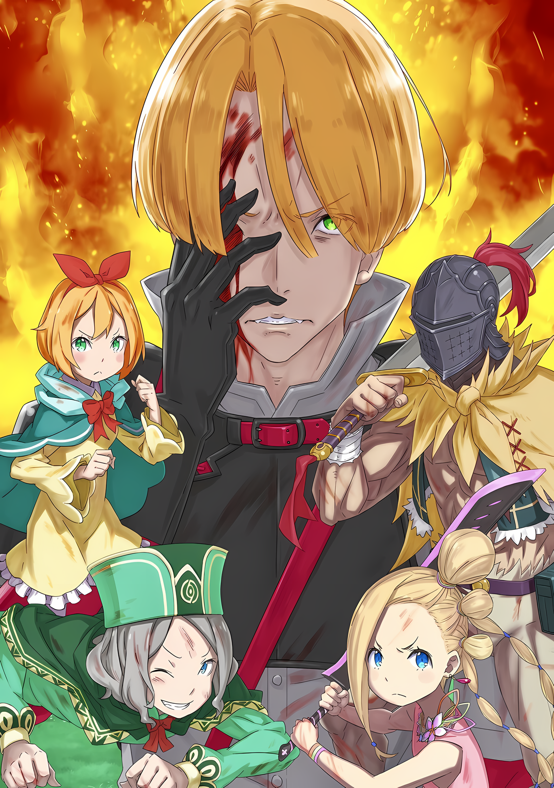
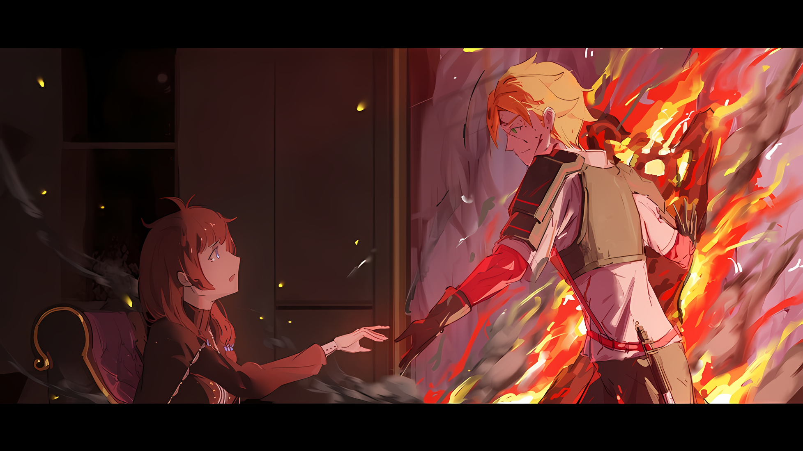
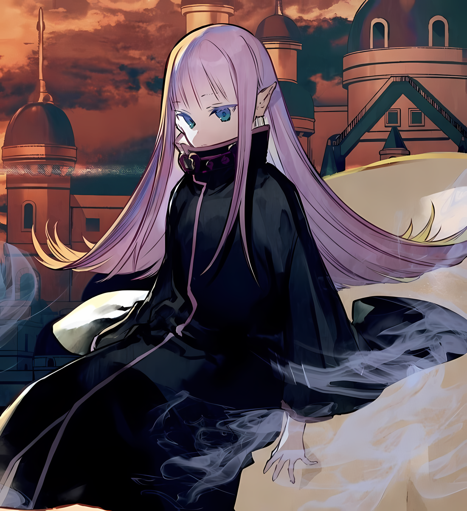

Впиваясь в землю своими звериными когтями, она рвалась вперед своим телом с такой силой, будто это летела пуля.

Ее товарищи, используя свою смекалку и боевое мастерство, пытались взять поле боя под контроль. Фредерика Бауманн помчалась через поле боя, дабы помочь им.

Прекрасный золотоволосый леопард плыл по ветру и продолжал выполнять свою роль гонца, будучи вторым по скорости среди всех, кто бродил по полю боя.

Против подавляющего превосходства обычных Имперских солдат, повстанцы, представлявшие собой, сказать прямо, разновидовую группу людей, смогли завести ситуацию в тупик благодаря информации, собранной Отто, управлению ею Абелом и способности Фредерики быстро передавать ее.

Независимо от того, осознавала ли она свой вклад или нет, в это время она разгребала грязь с важной информацией, и ее влияние эбыло особенно значительным.

Этим было……

Фредерика: ……Послание от Мастера и моего брата; в стране наметились перемены.

Тяжело дыша, толкая свое измученное звероподобное тело, Фредерика превращалась обратно в человека и спешила сообщить о своем прибытии в главный лагерь, где она была готова обнажить свое голое тело.

Эти слова Гарфиэль, переживший жестокую схватку во время путешествия по полю боя, передал ей со страстным выражением лица, в котором не было гордости за исход битвы.

Потрепанный и окровавленный, Гарфиэль выжил в смертельной борьбе, которую Фредерика даже не могла себе представить. Ее сестринское желание воспеть брату хвалу за его борьбу пришлось отложить перед лицом его отчаянной мольбы.

К счастью, Розвааль, прибывший из Эскадрильи Летающих Драконов, был рядом с ним и мог оказать ему надлежащую помощь, независимо от того, как Гарфиэль отнесся бы к этому.

???: ――. Никакой конкретики. Есть еще детали?

Фредерика: Я ничего не знаю, я могу только сказать, что это было интуитивное чувство от Божественной Защиты моего брата. Просто……

???: Просто?

Фредерика: Предчувствия моего брата верны, независимо от того, благоприятны они или нет.

Инстинкты Гарфиэля были так же хороши, как и у дикого животного; хотя он никогда не был диким, его инстинкты можно было назвать дикими. Эти инстинкты плохо работали в повседневной жизни, и он часто демонстрировал свое безобразное поведение перед Рам, но когда дело доходило до битвы, его надежность не знала себе равных.

Именно поэтому Фредерика, не раздумывая, бросилась в главный лагерь.

???: …………

Услышав ее просьбу, прекрасная Серена Дракрой…… Верховная Графиня Империи, прибывшая на их сторону со своей Эскадрильей Летающих Драконов в качестве подкрепления, выглядела задумчивой.

Ходили слухи, что она была знакомой Розвааля, к которой он пришел просить помощи. Поскольку она была его знакомой, то, вероятно, она была женщиной с сильным характером. Однако для знакомых Розвааля было также характерно то, что, помимо характера, она, несомненно, обладала прекрасными способностями.

Об этом свидетельствовал тот факт, что в настоящее время она заменяла отсутствующего главнокомандующего в центральном лагере, где контролировалось движение повстанцев, теперь уже большой армии.

???: Фредерика-сама! Вот плащ, который вы можете надеть!

Пока она задумчиво смотрела на профиль Серены, на плечи Фредерики был накинут красный плащ. Это был плащ, который разрешалось носить только «Генералам» Империи Волакия, но, к счастью, тот, кто его накинул, не знал значения этого украшения.

Поэтому Фредерика улыбнулась, радуясь этому жесту чистой доброй воли.

Фредерика: Спасибо, Шульт-сама. Я прошу прощения за свой неприличный вид.

Шульт: Нет, вовсе нет! Фредерика-сама так много работала и бегала! Я думаю, это достойно восхищения!

Натянув поплотнее плащ, она поблагодарила Шульта за гостеприимство. Но именно он склонился перед Фредерикой, и было видно, что его маленькое тело было наполнено очарованием.

Чувства Шульта, оставленного в главном лагере и вынужденного с ужасом наблюдать за ходом битвы, должно быть, были еще более болезненными, чем у Фредерики, которая, по крайней мере, была способна выполнять роль гонца.

Тем не менее, было похвально, что он выразил ей слова благодарности после ее возвращения.

???: Да, Фрее замечательная. Уу хотела пойти сражаться как сумасшедшая вместе с Мии и остальными.

Рядом с ним стояла кивавшая и скрестившая руки Утаката, чьи черные волосы были выкрашены в розовый цвет на концах.

Вздрогнув от воинственного комментария маленькой девочки и сказав: «Интересно», Фредерика вернула свое внимание к Серене.

Она погладила большой белый шрам от меча на левой стороне лица и ответила:

Серена: Признаки перемен в земле Волакии, да? Как глупо было бы игнорировать слова того, кого Розвааль так высоко ценит.

Фредерика: Итак…

Серена: Хотя это и безумие, но это также согласуется с тем, что сказал человек, который исчез вместе со «Звездочетом.» Это было эгоистично — поручить мне великую задачу, которую могла выполнить только я. Как будто…

Фредерика: Как будто?

Серена: Это была гордость, словно он был самим Императором. Даже несмотря на то, что мы оказались в положении Его свержения.

Серена, скрестив руки, вздохнула со сложным выражением, в котором не было ни гнева, ни веселья.

Она говорила о человеке в маске Они — Абеле. Первоначально он отвечал за общее командование повстанцами, однако он покинул главный лагерь и доверил эту роль ей.

В связи с этим Серена не сообщила никаких подробностей о том, какой у них состоялся последний разговор.

Фредерика: Серена-сама, что вам сказал Абел-сама перед уходом?

Серена: ――. Развязка близка. Однако…

Она сделала паузу и ее миндалевидные глаза наполнило негодование. Ее хорошо очерченный подбородок указывал на поле битвы, «Раскаленная Леди», известная своим огненным присутствием, продолжила говорить.

Серена: Решение не будет принято ни одной из сторон, ни столицей Империи, ни повстанцами, оно будет безрезультатным.

Фредерика: Оно будет… безрезультатным?

Выражение лица Серены говорило о том, что даже она не знает что это значит, не говоря уже о Фредерике.

Какой ситуации можно было ожидать, когда произойдет битва такого масштаба, а результат так и останется неокончательным? Прежде всего, было бы неуместно использовать слова, которые гласят, что все усилия окажутся напрасными, особенно обращаясь к человеку, которому он доверил командование над полем боя.

Абел, оставляя этот факт недосказанным, до фатальной степени не понимал человеческого сердца; это следует признать.

В любом случае……

Шульт: Означает ли это, что битва завершена? Если да, значит ли это, что Присцилла-сама, Ал-сама и Хейнкель-сама вернутся?

Фредерика: Шульт-сама…

С меланхолией в круглых глазах Шульт встал на цыпочки и оглядел поле боя.

Взгляд мальчика остановился на углу все более сурового поля боя…… красное небо и белое небо, два поля боя, которые даже Фредерика не смогла преодолеть.

Одно лишь приближение к ним вселяло в ее звериные инстинкты чувство ужаса, уверенность в смерти, которую ее тело не смогло бы выдержать.

Фредерика: …………

По этой причине она не чувствовала себя способной с готовностью произнести слова утешения.

То, что происходило под этими небесами, несомненно, было явлением, превосходящим воображение Фредерики. Ей стало стыдно, и она опустила уголки глаз.

Утаката: Шуу, не волнуйся. Прии и Йоо сильны. Они такие же сильные, как Мии и Таа.

Шульт: Утаката-сама…

Утаката: Называй меня Уу-чан.

Шульт: Утаката-чан-сама…

Надув грудь, Утаката грубо погладила рукой розовую кудрявую голову Шульта.

Это было детское и необоснованное утверждение, но оно нашло отклик у него, потому что он не колебался. Губы Фредерики слегка раздвинулись, когда Шульт кивнул головой.

И снова повернулась лицом к Серене,

Фредерика: Что вы собираетесь делать, Серена-сама? Если вы решите не отказываться от интуиции моего брата, тогда вам нужно разобраться с тем, что сказал Абел-сама…

Серена: Я в затруднительном положении. Нет нужды говорить, что времени на колебания нет. ……Смотри.

Серена снова вздернула подбородок, а Фредерика ответила: «А?», и устремила взгляд на поле боя. В своих изумрудно-зеленых глазах Фредерика издалека увидела изменения на поле боя, а именно, то, что разъяренная гигантская крепостная стена в форме человека и один из «Девяти Божественных Генералов» устремились к столице Империи.

Фредерика: Они… направляются к Кристальному Дворцу?

Серена: Чем дальше, тем больше все идет именно так, как он и сказал… хм. …Хоть я и не знаю правдивости заявления твоего брата о том, что Волакия станет нашим врагом…

На безрассудные действия «Стального», Могуро Хагане, Серена нахмурилась с лицом, которое, казалось, догадывалось о происходящем.

И тогда……

Серена: Передай всем. ……Прекратить все боевые действия, как только в Кристальном Дворце произойдет что-то ненормальное. А также готовиться к тому, что все может закончиться безрезультатно, в битве, где было напрасно пролито и потеряно много крови и жизней.

△▼△▼△▼△

……С пронзительным звуком Меч Синего Дракона, варварский меч и топор ударились друг о друга, рассыпая в воздухе искры.

Все это была сталь, которой безжалостно орудовали, с целью отнять жизнь у противника.

Хоть она и оцепенела, ужас угрозы жизни всколыхнул ее кожу и кости.

Она никогда не считала себя психически хрупкой. Скорее, она всегда думала, что по сравнению с другими детьми ее возраста, она был наделен большим мужеством, в сочетании с пережитыми сценами резни, которые она пережила.

Однако если бы человек испытал боль на коже от ожогов, вызванных взрывом, и ощущение перехвата дыхания, словно легкие были сжаты под давлением, то основа его веры в себя, скорее всего, была поколеблена.

Самой важной причиной этого чувства было……

???: ……!

Даже в разгар ожесточенной битвы на них был направлен презрительный взгляд.

Взгляд мужчины, как бы говорящий, что он не забыл о ней и держит оружие наготове, был самым главным фактором, усиливающим ощущение удушья у Петры.

Это был Имперский солдат с банданой, обернутой вокруг головы и с топором в руках.

Этот человек, имени которого они не знали, был истинной личностью их грозного врага, который сейчас терзал Петру и ее товарищей.

Пока этот человек жив, смерть всегда будет его сопровождать.

Независимо от ситуации, обстоятельства могли измениться в мгновение ока. Петра крепко стиснула зубы, так как стоящий перед ней человек, казалось, был примером этого абсурда.

Стоя на коленях на земле, Отто пытался отдышаться. Приняв на себя основной удар магического камня, использованного для экстренной эвакуации, Отто выглядел неважно.

Вот почему Петра никогда не могла позволить себе быть слабой на поле боя, где и сильные, и слабые ставили на кон свои жизни.

Медиум: Хааа! Ал-чин!

Ал: Да, мисс Медиум.

Девушка с высоким голосом, не подходящим для пахнущего кровью поля боя, и парень с удрученным голосом работали вместе, обмениваясь ударами меча с мужчиной с убийственным намерением.

В сотрудничестве с Медиум, которая использовала свое маленькое тело по максимуму, Ал сражался с Имперским солдатом. Их боевой мощи никак не хватало, чтобы одолеть противника, и их ожесточенная схватка все продолжалась.

Ал не обижался на то, что он такой, какой есть, но Петра была разочарована им как подкреплением.

Петра: Вот бы это был кто-то вроде Гарфа-сан или Эмили……

Они были не только надежными союзниками, но и наверняка превзошли бы своего противника по способностям.

Способности Ала были не очень высоки в оценке Петры. Несмотря на то, что он был лучше Петры и Отто, она чувствовала, что он слабее любого из Племени Судрак.

Однако, если его сила не была столь выдающейся, то же самое можно было сказать и о противостоящем ему Имперском солдате.

Конечно, этот солдат был слаб по сравнению с Эмилией, Гарфиэлем и «Девятью Божественными Генералами» Империи. Тем не менее, она боялась его.

Для того чтобы отогнать жука, усевшегося на цветок, не нужна была сильная магия. Его можно было бы смахнуть пальцем или даже слить водой. Такие же мысли всплывали в поведении этого Имперского солдата.

На этом поле боя Петра и остальные члены ее группы были не более чем трудолюбивыми маленькими жуками……

???: ……А ты заноза в заднице, парень.

Внезапно в уши застывшей Петры влетел мужской голос.

На мгновение ее плечи дрогнули от неожиданности. Но это был голос не одного из группы Петры. Скорее, голос доносился со стороны, где Ал сражался со своим противником.

Ал: Ха! Нгха! Получай!

Мужчина взмахнул топором, целясь в толстую шею Ала. Однако в тот момент, когда его Меч Синего Дракона задел его одноручный меч, он тут же развернулся, и две, а затем три тяжелые атаки последовали одна за другой.

Алу удалось парировать шквал ударов с помощью причудливых рискованных движений рук.

Петре было совсем не по себе, что она даже издавала пару криков и вздохов, наблюдая за происходящим.

Отто: Я бы хотел как-нибудь поддержать Ала-сан, но…

Отто, казалось, испытывал такое же беспокойство, и в его голосе было больше нетерпения, чем усталости.

В битве Ала явно чувствовалась срочность, и хотя ему повезло, что он смог выжить до сих пор, было уже пять случаев, когда один неверный шаг мог привести к его смерти.

Петра сомневалась, будет ли шестой раз.

Солдат: Ты все еще заноза в заднице.

Однако, похоже, мнение Имперского солдата несколько отличалось от мнения Петры и ее товарищей.

Мужчина, который продолжал уклоняться от атак, хотя и на честном слове, сделал большой шаг назад, после чего поднял руку без топора и слегка махнул ею в сторону Ала и Медиум.

Сразу же после этого в воздухе вспыхнул огненный шар и яростно устремился к ним, испепеляя небо.

Ал: Эйэйэй!

Медиум: Ой-ей…!

Она не понимала почему, но Дух был вынужден подчиниться солдату несправедливым образом.

Ал и Медиум в полном недоумении отбежали, пытаясь спастись от приближающегося огненного шара. Он проскочил мимо них и перекинулся на окружающие деревья и траву на земле, отчего раздулось пламя.

Отто: Это нехорошо… кх.

Петра поняла, что только что пробормотал Отто.

Когда она посмотрела, пламя, вызванное огненным шаром, не обожгло Ала и остальных, но вместо этого сожгло их окружение. Пламя окружило Петру и остальных, стоявших перед Имперским солдатом, и перекрыло им путь к отступлению.

Пылающее пламя образовало круг и захватило их.

Даже если бы он промахнулся, Имперский солдат, возможно, просто хотел перекрыть им путь к отступлению. Но в этой ситуации Петра и остальные скрежетали зубами от разочарования, в то время, как их противник наклонил голову.

Солдат: Мне это очень не нравится.

Ал воскликнул на это тихое, совершенно неуместное замечание звук «Аа?».

Держа в руке меч Синего Дракона, он указал на пылающие окрестности,

Ал: После всего произошедшего, это все, что ты хочешь сказать? Береги то, что у тебя есть, все ресурсы. Как ты думаешь, насколько тяжело растениям приходится работать, чтобы производить кислород для людей и их возможности сделать глубокий вдох, чтобы быть в порядке……

Солдат: Я должен был убить тебя около шести раз, но я не смог убить тебя ни в каком случае. Даже когда я вынуждал тебя уклоняться в моментах, где ты не должен был способен уклониться. Это отвратительно.

Ал: Не могу поверить, что ты только что это сказал. Чувак, знаешь, сегодняшний день — это самая настоящая боль.

В ответ Ал пожал плечами и стал еще больше ему не доверять.

Не зная предела его силы, Имперский солдат, казалось, был в замешательстве. Честно говоря, было очень противно соглашаться с этим человеком, но Петра испытывала те же сомнения относительно Ала.

Ал выглядел так, словно собирался умереть, но все же не умер.

Он всячески отбивался от атак Имперского солдата, и все же сумел избежать ранений своими рискованными движениями. ……Точнее, он смог избежать только смертельных ранений.

Но это не было похоже на то, что он скрывал свои силовые способности. Это выглядело очень необычно.

Из-за всего этого солдат не смог нанести решающий удар, чтобы сократить их преимущество.

Солдат: Даже если отнести его к моей категории, такое чувство, словно тебя нет никакой подготовки, и ты просто размахиваешь своим мечом. Если так подумать, вон тот парень, скорее больше похож на меня.

Отто: ……Ты имеешь в виду меня? Если да, то я хотел бы заявить возражение в защиту своей чести.

Медиум: Вот именно! Твой злой характер совсем отличается от его! Ты более опасен и коварен!

Отто: Будучи на моей стороне, ты все равно наносишь мне удары в спину.

Отто, неожиданно втянутый в дискуссию, горько усмехнулся.

Его поведение немного расстроило Петру, но это быстро прошло.

Петра: …………

Отто взглянул и подмигнул Петре. Немного задумавшись, она почувствовала в его выражении лица не только горечь, но и нечто другое: он собирался что-то сделать.

Не говоря ни слова, он хотел, чтобы она попыталась угадать его мысли.

Солдат: Это все как-то затянулось.

Как только Петра догадалась об этом, Имперский солдат холодным голосом щелкнул пальцами.

Сразу после этого на свет появилось около десяти огненных шаров, каждый из которых был меньше прежнего. Они разлетелись во все стороны с немыслимой скоростью, от чего загорелись не Петра и остальные, а окружающие деревья и земля.

Он сделал это, чтобы расширить пламя, окружавшее их, и сопутствующие ему пламя и черный дым……

Медиум: Ай, ай, ай, ай! Все горит, все горит!

Ал: Успокойся, мисси! Иди сюда, пока твои косички не сгорели!

Окруженная пламенем, Медиум подпрыгивала вверх и вниз, держа свои длинные косы. Она пересекла линию пламени, подскочила к Алу и оглянулась на него со слезами на глазах.

Снова крепко сжав свой варварский меч, она уставилась на человека, который сделал это……

Медиум: А!?

Ал: Он серьезно…?

Удивление Медиум совпало с недоумением Ала.

Причиной их реакции было исчезновение Имперского солдата, который устроил это пламенное зрелище.

Медиум: …………

Фигура солдата исчезла среди пламени и черного дыма. Отступил ли он, чтобы спрятаться от пламени, или просто ждал, пока они медленно сгорят дотла?

Ал Тц……

Медиум: Он исчез! Нам тоже нужно убираться отсюда, пока мы не сгорели!

Взгляд Ала, прикрытый шлемом, метался вокруг, ища фигуру человека, исчезнувшего в пламени. Все это время он держал Меч Синего Дракона у своей шеи в странной позе, пока его глаза искали Имперского солдата.

Рядом с ним Медиум также оглядывалась по сторонам, нетерпеливо ожидая врага, которого она не могла найти, и просила покинуть территорию возрастающего огня.

Конечно, вполне естественно было думать, что первоочередной задачей здесь должно было стать бегство из этой опасной зоны, а не упущение возможности спастись, зациклившись на местонахождении их врага.

Однако……

Петра: …………

Отто положил свою руку на руку Петры и слегка надавил на нее. Она восприняла этот жесткий захват как молчаливое указание.

Петра была полностью согласна с этим предостережением, указывающим на то, что им не следует терять бдительность.

Затем она положила свою вторую руку поверх руки Отто……

Отто: ……Спасибо, Петра-чан.

Сразу же после произнесения этих слов благодарности он сдвинулся с места и упал на спину. ……Мгновение спустя, в воздухе прозвучал горизонтальный взмах топора.

Петра: …………

Убийственное намерение Имперского солдата, пробиваясь сквозь дым от распространяющегося пламени, нанесло удар.

Человек, лишенный уверенности в этом моменте, слегка расширил глаза от этого факта. Но, словно быстро придя в себя, он попытался отвести топор, которым только что размахнул…

Петра: Дзивальд!

Солдат: Гха.

Петра, подняв пять пальцев, выпустила из каждого из них маломощный Дживальд, который попал Имперскому солдату в лицо. Один из пяти выстрелов пронзил правый глаз их противника.

Ее атака была направлена на подавление противника и используя свою силу, она успешно достигла своей цели, а человек, которому выжгли глаз, закричал в агонии и немного отшатнулся.

Затем сверху на него прыгнула вертящаяся фигура.

Медиум: Вперееед!

За пламенем Ал сгорбился, и Медиум спрыгнула с его спины, используя ее как трамплин.

Вертикально прокрутившись, она взмахнула крепко зажатым в обеих руках варварским мечом и нанесла Имперскому солдату, потерявшему равновесие, беспощадный удар.

Медиум: Арьяя!

Раздался тяжелый звук, и красный оттенок смешался с оттенком горящего пламени.

Звук, раздавшийся эхом, не был звуком раскалывающегося черепа под варварским мечом. Петра увидела, что мужчина добровольно встретил размашистый удар меча лбом.

Этот жесткий звук, вероятно, был причиной нахождения брони под его банданой. Поэтому именно так он и принял удар Медиум. Хотя, нельзя было сказать, то что он был невредим.

Неловко размахивая топором, он приложил дрожащую свободную руку ко лбу и в этот момент его сознание тянуло его вниз, вниз и вниз….

Солдат: Черт…

rezero7arc | Иллюстрация к **Ранобэ** Том 33 | Разукрасил V!c.ll2o

Бандана, испачканная кровью, упала с головы мужчины. Лоб мужчины был рассечен, даже с бронированной банданой, и кровотечение из его рассеченного лба, казалось, невозможно было остановить.

Обильно истекая кровью, он уставился на Отто и Петру.

Взгляд его глаз, казалось, спрашивал, как была обнаружена его внезапная атака……

Отто: ……Я тебе этого не скажу. Я тебе не мамочка.

Несмотря на то, что Отто лежал на земле, он все равно говорил так, словно гордился своей победой.

В ответ Имперский солдат щелкнул языком, вытер ладонью кровь со лба и……

Медиум: А! Подожди! Нечестно просто взять и вот так убежать!

Он не стал проявлять безрассудство и прыгать на лежавшего человека.

С закрытым правым глазом, пораженным жаром и кровью, Имперский солдат исчез за пламенем, снова став невидимым, Петра в этот момент была начеку, ожидая новой внезапной атаки.

Ал: Он не вернется… Он не выглядит настолько отчаянным, чтобы продолжать сражаться в таком отчаянном положении.

Петра: Не согласна. Разве не похоже, что только мы были в отчаянии?

Ал: Я знаю, что ты чувствуешь, мисс. Но именно другая сторона убежала без последнего слова. Мы победили. ……Это наша победа!

Медиум: Мы победиилии!

Ал и Медиум прокричали победный клич, направляясь в ту сторону, откуда только что исчез Имперский солдат.

При виде этих двоих у Петры немного отлегло от сердца. Хотя, она не была уверена, что их крики на самом деле могут беспокоить Имперского солдата.

В любом случае……

Петра: В конце концов, откуда ты знал, как прочитать движения этого человека? Это была авантюра, не так ли?

Отто: Это не моя заслуга, это благодаря тебе, Петра-чан.

После помощи Ала, убравшего Меч Синего Дракона в ножны, Отто обратился к Петре. Однако она не могла приписать себе все заслуги.

Отто: Я был его целью в первую очередь, поэтому я знал, что последняя атака будет направлена на меня. Именно звук шагов подсказал мне время и направление атаки.

Медиум: Шагов?

Петра: Канал Отто-сана позволяет ему слышать голоса подземных существ… верно?

Отто: Все верно.

Петра сцепила руки перед грудью, а Отто кивнул головой.

С самого начала он использовал свою «Божественную Защиту Духовной Речи», чтобы держать под контролем все поля боев. Именно по этой причине он стал мишенью для врагов. Однако они понятия не имели, как появился этот Имперский солдат, избежав Божественной Защиты Отто, ведь он должен был знать всю ситуацию, слыша голоса животных и насекомых.

Для восприятия такого противника, прежнего метода было недостаточно.

Петра: Так вот почему подземные существа… были бесполезны, как сказал Отто-сан, поскольку у них нет глаз, чтобы видеть, что происходит снаружи.

Отто: Хотелось бы мне, чтобы ты выбирала слова более тщательно! …В любом случае, я слушал животных и насекомых под землей и определял, где он находится, по звуку его шагов. Получалось немного неточно, но Петра-чан помогла мне уловить голоса с помощью своей Магии Света.

Петра: Отто-сан, ты подал мне сигнал с таким уродливым выражением лица.

Он попросил у Петры поддержки с помощью Магии Света, крепко сжав ее руку.

С ее помощью Отто использовал свою Божественную Защиту и угадал позицию противника по звуку его шагов, избежал последней засады и, напротив, стал причиной болезненного удара противнику, заставив его отступить.

Отто: --. По правде говоря, я хотел сделать так, чтобы он не смог продолжать бой.

Петра: Согласна. Он не был сильным, он просто умел убивать. Что еще важнее……

Медиум: Горячо, горячо, горячо! Мы должны быстро убираться отсюда, иначе нас испечет!

Отступление опасного противника не обязательно преодолевало ситуацию с горящей окружающей местностью.

Ал прислонился плечом к Отто и сказал: «Да, ты права», услышав жалобу Медиум. После этого, Петра вместе с Медиум повела их за собой, ища место, где воздействие пламени было менее сильным.

И вот, группа попыталась уйти, пока пламя не охватило их……

Отто: Давайте уберемся отсюда как можно скорее. Появилась срочная причина вернуться в главный лагерь.

Ал: ……То, как ты сейчас это сказал, не похоже на прелюдию к героической истории, где ты хвастаешься тем, как ты выжил в борьбе с опасным противником.

Отто: Да, это новости гораздо хуже. Эта информация имеет огромное значение. ….Я услышал ее случайно, пока пытался уследить за шагами противника.

Это было неприятное предисловие, которое было произнесено как раз в тот момент, когда одно затруднение должно было закончиться.

Преследуемая жаром пламени, но все же не в силах пропустить его заявление, Петра повернулась и увидела позади себя Отто с мрачным лицом… которым, он оглядывал все поле боя.

Отто: Похоже, что все поле боя вот-вот окажется под угрозой с совершенно иной стороны, чем Дракон, горящее небо и прочее. На самом деле, это происходит уже прямо сейчас.

Причиной этих слов стало то, что Отто Сувен получил эту информацию благодаря «Божественной Защите Духовной Речи», по совпадению, в то же самое время, что и его брат по лагерю, благодаря своей «Божественной Защите Земляных Духов».

△▼△▼△▼△

???: ……Я слышал, что приближается так называемое «Великое Бедствие», которое поставит под угрозу Империю Волакия. Я — Генерал Первого класса Империи! Я «Генерал», который все еще жив, хоть и живет в позоре! Чего бы мне это ни стоило! Я не умру, не оказав услугу Его Превосходительству Императору!

Получив такие сведения от крупного человека, прикованного к стене под землей… человека, представившегося Гозом Ральфоном… Рем поняла, что другие проблемы, кроме восстания, скоро потрясут столицу Империи.

Хотя Гоз и сильно ослаб после одноразовой кормежки в два дня во время заточения, он стал на удивление энергичным и восстановил свои жизненные силы после того, как Рем применила свою магию исцеления.

Она подумала, что, скорее всего, этот эффект был вызван в основном его собственными убеждениями.

Гоз: Девушка, твое лечение спасло мне жизнь! В обычной ситуации, я бы пригласил тебя к себе домой и представил мою спасительницу жене и детям, но сейчас я должен отправиться к Его Превосходительству! Я отплачу тебе позже!

Рем: Ааа… угу, хорошо.

Гоз: Если возможно, уходи отсюда и присоединяйся к армии! Генерал Первого класса Могуро Хагане или Генерал Второго класса Кафма Ирулюкс не причинят тебе вреда! Избегай других Генералов Первого класса! Твои слова до них никак не дойдут!

Освободившись от цепей, Гоз провозгласил это чрезвычайно громким голосом. Он с огромной скоростью выскочил из подвала и, отчитав солдат, стороживших особняк, приказал им сопроводить его к Кристальному Дворцу, который был виден издалека.

В ответ на это мнения стражников разделились надвое.

Казалось, что даже солдаты особняка разделились на тех, кто знал о существовании Гоза, и тех, кто не знал. Тех, кого держали в неведении, это не забавляло, в то время как те, кому информация была раскрыта, чувствовали глубокое доверие, оказанное Беллстетзом.

Поэтому……

Гоз: Понятно. Значит, вы будете стоять у меня на пути?

Ничего не надев, стоя с голой верхней частью тела, покрытой мускулистой броней, Гоз устремил взгляд на стражников, которые достали оружие и преграждали ему путь.

Он был безоружен, а время, которое он провел в заточении, составляло не день и не два. Он был далеко не в идеальном состоянии. Однако тот факт, что стражники противостояли ему, не говорил о том, что у них шансы на победу.

Гоз: Это хорошо. Так же, как я предан Его Превосходительству Императору, вы все преданы премьер-министру. Я непременно доведу эту честь до конца!

Когда он смотрел на противостоящих ему солдат, исходящая от него подавляющая аура была очевидна.

Последовавший за этим односторонний бой Гоза в стиле «голого кулака» тоже был очевиден.

Огромный кулак взметнулся, и одним ударом снес несколько стражников.

Небольшое преимущество в количестве не имело значения. Это был момент ошеломляющего подавления.

Рем: Я слышала ваше имя от Абела-сан как одного из «Девяти Божественных Генералов», но……

На самом деле, единственные из «Девяти Божественных Генералов», которых Рем видела лично, были Аракия и Мэделин в городе-крепости Гуарал.

Даже по сравнению с ними обоими, Гоз не соответствовал своему статусу.

Возможно, в данный момент он был не в своей тарелке из-за того, что у него не было оружия, снаряжения, а сам он был уставший.

Гоз: Вы хорошо сражались! Вот почему вы — Волки-Мечи Империи!

Прямо посреди избитых солдат Гоз поднял руки вверх и страстно произнес похвалу.

Если она не ошибалась, она слышала, что именно он рисковал своей жизнью и стал жертвой, чтобы освободить настоящего Императора Абела. Однако он был в таком приподнятом настроении, что казалось ложью, что он был измучен тем, что его заточили.

Было непонятно, почему его вообще заточили в подвале особняка.

Гоз: Еще раз, премьер-министр Беллстетз Фондальфон! Я не позволю, чтобы все шло по твоим планам! И ты тоже, Генерал Первого класса Чиша! Ууаааа!!!

Прежде чем они успели обсудить все детали, Гоз смело выскочил из главных ворот особняка Беллстетза вместе со стражей, которая была на его стороне.

Ошеломленная доблестью «Рыцаря Льва», Рем не могла ничего поделать, кроме как прикрывать его спину, пока тот покидал ее.

Однако……

Рем: Здесь я больше не нужна.

Неожиданный поворот событий: солдаты в особняке исчезли, и Рем больше ничего не препятствовало.

Она проверила, живы или мертвы солдаты, сбитые Гозом. Оказав минимальную помощь тяжелораненым, она использовала один из длинных мечей как трость, передвигаясь по особняку и направляясь к комнате, в которую заходила много раз.

И тут……

Рем: Катя-сан, это я, это Рем. Пожалуйста, выйди.

Катя: ……Я совершенно не хочу выходить. Ч-что это был за громкий голос только что?

Рем: Я знаю, что ты чувствуешь. Но человек с громким голосом уже ушел. Думаю, нам стоит поговорить о том, что мы будем делать дальше.

Катя: Что мы будем делать дальше…

Голос Рем побудил Катю, которая не позволяла ей войти, принять решение через дверь в ее комнату.

В настоящее время храбрость Гоза, к лучшему или худшему, уничтожила солдат особняка, поэтому необходимость покидать особняк в спешке уменьшилась.

Однако……

Рем: «Великое Бедствие»……

Именно поэтому Гоз поспешил на встречу с Императором, который, по слухам, находился в Кристальном Дворце.

Если быть точным, главной причиной, по которой Гоз отправился в Кристальный Дворец, было противостояние с самозванцем, выдававшим себя за Императора. Тем не менее, было верно, что целью было предотвратить то таинственное бедствие.

В любом случае, Гоз советовал не сидеть сложа руки.

Если это так……

Катя: ……Н-нет причин уходить отсюда, в конце концов. Я — заложница.

Рем: Больше не осталось стражников, которые могли бы нас задержать. Больше нет причин продолжать оставаться в заложниках.

Катя: Но все же……

Рем: ……Я понимаю. Пожалуйста, хотя бы открой дверь. Я хотела бы убедиться, что ты в безопасности.

Рем была в растерянности, и все же Катя, неустрашимая ее настойчивостью, наконец сдалась.

После нескольких мгновений молчания по последней просьбе Рем послышалось движение колес инвалидного кресла, и дверь была отперта. И вот дверь в комнату была открыта.

Рем: Извини. Поспешим.

Катя: А!? Чт-что ты…!

Рем: Прости, то, что я просто хотела убедиться, что ты в безопасности — было ложью.

Войдя в комнату, Рем обнаружила Катю у двери, быстро зашла за ней и вытолкнула ее инвалидное кресло из комнаты.

Запаниковавшая Катя попыталась сопротивляться, но она была бессильна остановить колеса и не смогла противостоять силовым действиям Рем.

Катя: Подожди! Я должна кое-кого дождаться…

Рем: Я это прекрасно понимаю. Но ждать здесь небезопасно. Даже если мы будем ждать твоего жениха, давай хотя бы пойдем в безопасное место.

Катя: Безопасное? В столице нет более безопасного места, чем это…

*Так что никаких причин для побега*, хотела сказать Катя.

Но в момент, пока она говорила, она внезапно подняла свою голову и расширила глаза, затем она начала резко крутить головой влево и вправо, чтобы посмотреть на Рем, которая стояла позади нее.

Ее реакция заставила Рем тоже посмотреть наверх и увидеть большую тень над их головами, пока они шли по коридору особняка.

……Над особняком возвышалась колоссальная крепостная стена в форме человека, уходящая к центру столицы Империи.

Рем: …………

То, что гигантская нога несется по городу, проходя совсем рядом, шокировало ее больше, чем нападение повстанцев, пытавшихся вторгнуться в столицу Империи или буйство Гоза.

Рем и Катя в тревоге посмотрели друг на друга, и затем колеса инвалидного кресла резко начали свое движение с соответствующим звуком.

Катя: Кажется, это не совсем безопасное место…

Рем: Да. Давай поторопимся.

Как и ожидалось, гигантский шаг только что был одним из исключений во всем этом фиаско, но было бы глупо со стороны Рем начать говорить об этом и навлекать на себя недовольство Кати.

Катя, послушно передвигаясь вместе с Рем, которая везла ее инвалидное кресло, направилась к…

Катя: Твой спутник находится на постельном режиме, не так ли? Что ты собираешься делать?

Рем: Ему действительно не следует много двигаться. Однако я не могу не сказать ему об этом…

Ответив на слова Кати, Рем вместе с ней дошла до намеченной комнаты.

В этой комнате находился Флоп О'Коннелл, которого привезли в особняк вместе с ней. Он еще не полностью оправился от тяжелых ранений и все еще находился под домашним арестом.

Согласно ее ответу Кате, его лучше оставить отдыхать, если это вообще возможно, но……

Рем: Флоп-сан, это я. Можно войти?

Флоп: Хм, Миссис!? Я сейчас открою.

Рем постучала в дверь и получила быстрый ответ, за которым сразу же последовало открытие двери. Глаза Рем и Кати расширились, когда они увидели, что Флоп, который, очевидно, притаился у двери, крепко сжимает в руках маленькое ручное зеркальце.

Рем: Эмм, Флоп-сан, что это за зеркальце?

Флоп: Ну, вообще, оно должно было стать оружием. Вы же тоже слышали очень громкие голоса чуть ранее, не так ли? В городе становится шумно, и я подумал, что кто-то враждебный мог ворваться сюда.

— ответил Флоп, вертя в руках зеркальце, напоминая Рем и Кате, что они пока что военнопленные и заложники, поэтому в их комнатах нет вещей, которые можно было бы использовать как оружие.

Однако зеркало в качестве контрмеры не было идеальным вариантом.

Рем: ……Ты хочешь сказать, что смог бы сражаться с помощью этого зеркальца?

Флоп: К сожалению, это почти все, что было в этой комнате. Но я никогда раньше не сражался с зеркальцем, так что, возможно, у меня к этому дремлющий талант! Что скажешь, Миссис?

Рем: Наверное, да. Однако я бы хотела перестать говорить о ненужных вещах и делать то, что необходимо.

Флоп ответил на взгляд Кати своим обычным тоном, который был по-своему обнадеживающим, но в то же время она хотела отложить это на время, ведь они были в такой тяжелой ситуации.

Независимо от……

Рем: Это Катя-сан. Я встретила ее в этом особняке.

Флоп: Я Флоп О'Коннелл. Ты, должно быть, подруга Миссис, о которой я так много слышал.

Катя: ….Не помню, чтобы я дружила с этой девушкой, но.

Флоп: Если это так, то ты должна быть готова к этому. Завести хороших друзей — это ключ к лучшей жизни. Даже если это не так, нет ничего плохого в том, чтобы иметь много друзей.

Катя: Я… наверное, не так хороша в этом, как ты…

Как и ожидала Рем, у Флопа был характер, с которым Кате было не очень комфортно. Тем не менее, его нрав был таков, что он не возражал, если она была с ним откровенна, так что это была бы лучшая ситуация, если бы Катя просто обиделась на него.

Рем: Флоп-сан, ситуация в столице сейчас……

Флоп: Я более или менее знаю об этом. Мэделин-кун приходила ко мне прямо перед тем, как отправиться на битву.

Рем: ……Мэделин-сан приходила встретиться с тобой?

Это была неожиданная личная связь; она знала, что Мэделин навещала Флопа, но никогда не ожидала, что они станут друзьями, даже дошло до того, что она пришла поприветствовать его перед тем, как отправиться на битву.

Однако, если один из «Девяти Божественных Генералов» говорил с ним напрямую, то вполне возможно, что Флоп знал о ситуации, происходящей снаружи, больше, чем Рем.

Рем: Что ж, тогда мы можем быстро поговорить об этом. Стражи у особняка уже нет, так что мы можем остаться или сбежать на свое усмотрение, но… Я считаю, что мы должны сбежать.

Флоп: Интересно, это как-то связано с громкими звуками и ужасными землетрясениями, которые только что произошли?

Рем: Да. Но дело не только в этом. Может случиться что-то еще хуже.

Катя: Ч-что-то еще хуже! Ты шутишь…?

В ответ на беспокойство Рем о Флопе, Катя побледнела и задрожала, услышав это.

Речь шла не о том, чтобы напугать Каю и заставить ее подчиниться, а скорее о реальной, хотя и неподтвержденной, возможности опасности. С другой стороны, это было не более чем «что-то может случиться», так что это не давало никакой уверенности в том, чтобы сделать шаг.

Флоп: И все же, я думаю, тебе стоит уйти отсюда, Миссис.

Рем: ……Верно.

На утверждение Флопа, Рем без колебаний кивнула.

Несмотря на то, что они находились под домашним арестом, жизнь в особняке была не такой уж и некомфортной. Хотя им не разрешалось покидать территорию, они могли ходить друг к другу в комнаты, о раненом теле Флопа заботились, Рем могла встречаться с Катей, и не было причин для сильного гнева или ненависти к Беллстетзу, который должен был быть их врагом.

Что касается причины его восстания, то у Рем было подозрение, что в этом больше виноват Абел-Винсент.

Тем не менее, если оставить в стороне эти обстоятельства, чувства Рем были, пожалуй, самой решающей причиной, по которой она хотела покинуть особняк.

Такое пребывание в плену могло обеспокоить многих людей, которые хорошо к ней относились.

Именно поэтому ей нужно было как можно скорее выбраться из такой несправедливой и нечестной ситуации.

Флоп: Хорошо, я понял тебя. У меня тоже нет возражений. Миссис и мисс Катя, пойдемте.

Рем: Ты уверен?

Флоп: Даже если я останусь, я мало что могу сделать, кроме как лежать в постели. Я все еще торговец, так что мне нужно быть физически активным, иначе меня начнет мучить беспокойство.

Он усмехаясь сжал свой кулак, чтобы Рем не расстраивалась. Затем вмешался, сказав: «Кроме того».

Флоп: Вообще, мне доверили послание. Если бы я случайно проспал и упустил возможность передать его, я бы не смог встретиться с миром, да и с сестрой тоже.

Рем: Послание… от кого оно?

Флоп: Волка-Меча Империи, который сам взял на себя клеймо предателя и, на мой взгляд, пошел на большую авантюру.

Флоп подмигнул, и Рем выглядела взволнованной его ответом.

Очевидно, это был не тот человек, которого Рем имела в виду, но было приятно знать, что Флоп пойдет с ней.

Рем: Как видишь, толкать инвалидное кресло Кати-сан, неся на спине Флопа-сан, будет нелегко, так что…

Катя: Ты упрекаешь меня в том, что делаешь, но не собираешься позволять мне делать это самой!

Рем: Пока ты в безопасности, я с удовольствием оставлю это на тебе…

Если обстановка была небезопасной, у нее не оставалось другого выбора, кроме как сделать это. Как и ожидалось, Рем не собиралась спасать их в меру своих возможностей, но если она могла это сделать, то у нее не было выбора.

Даже если это идет наперекор с чувствами другого человека, она все равно так поступит. ……Зная, что со стороны это будет выглядеть не очень хорошо.

Рем: …………

На мгновение Рем показалось, что она делает то же самое, что и протянутая к ней рука, и ее сердце дрогнуло от смешанных чувств.

Она быстро стряхнула это чувство и кивнула Кате и Флопу со словами «Ну что ж»,

Рем: Будьте осторожны, когда мы покинем особняк. Если мы кого-то встретим, будьте настороже. Мы не знаем людей, которые приедут в Имперскую столицу.

Катя: Не говори таких страшных вещей. …Ты не ранен? Сможешь идти?

Флоп: Хаха, спасибо за заботу. К счастью, Миссис самоотверженно поработала со своей магией исцеления. Поврежденная плоть хорошо заполнилась и я думаю, что моя кровь начинает восстанавливаться. Что касается моего физического состояния, думаю, мне просто нужно сказать, когда вы будете готовы двигаться.

Рем: Я приму это во внимание. Мои ноги тоже не в идеальной форме, а Катя-сан вообще в инвалидном кресле.

В очередной раз она поняла, что каждый из троих собравшихся здесь был физически неуверен в себе. Тем не менее, для них было крайне важно объединить усилия, так как они не могли позволить себе потерять кого-либо из них.

И вот, с большим энтузиазмом,

Флоп: Кстати, Миссис, а что насчет всех остальных людей, которые находятся в плену, кроме нас?

Рем: Я забыла об этом…

Флоп указал на это, и Рем приложила руку ко лбу.

В особняке было отдельное здание, и в нем, кроме Рем и остальных, содержались пленники, в том числе несколько человек, утверждавших, что они — «Черноволосый Наследный Принц», незаконнорожденный сын Императора Волакии.

Большинство из них, очевидно, использовали как повод для восстания против Императора. Однако для Беллстетза, который поднял восстание из-за вопроса о наследнике Императора, это не было проблемой. Поэтому их по возможности держали в качестве военнопленных, чтобы выяснить, подлинные они или нет.

Рем: Их нельзя назвать ни нашими врагами, ни нашими союзниками, поэтому я, честно говоря, хотела бы их проигнорировать.

В настоящее время, если отбросить Катю, положение Рем и Флопа было очень сложным и трудным.

Несмотря на то, что у нее не было никаких веских причин или претензий, она неохотно присоединилась к повстанцам под предводительством Абела. Однако она была отделена от этой группы и не была знакома с группой пленных принцев.

Рем и ее группа понятия не имели, добрые они или злые, и их отношение к ним тоже было неизвестно.

???: …………

Вот почему ее мнение было таким, как она только что высказала.

Однако ее будет беспокоить тот факт, что она оставила их в запертом отдельно стоящем здании и сама покинула особняк со своей группой, чтобы спастись от надвигающейся, непонятного «Великого Бедствия».

Даже если было трудно спасти всех, она хотела уменьшить количество жертв, насколько это возможно.

Поэтому стражникам, избитым Гозом, было оказано минимальное лечение.

Катя: ……Почему бы нам просто не найти ключ и не повесить его так, чтобы они сами смогли его достать?

Рем: А…

Катя: Я не знаю. Я не знаю, но если это опасно, я не хочу в это вмешиваться. Но я не могу не колебаться. Это же не странно!?

Рем: Нет-нет, это не странно. Верно?

Видя, что Рем волнуется, Катя предложила компромисс.

У нее в голове было только одно из двух: помочь или не помочь. Слова Кати спасли ее.

Как она и сказала, было бы неплохо найти ключ от отдельного здания и сделать так, чтобы пленникам было несложно его достать. Это обеспечит безопасность пленников и ее собственное спокойствие.

Флоп: Похоже, ты все предусмотрела.

Флоп удовлетворенно кивнул в завершение разговора Рем и Кати.

Тем временем он заплетал в косу свои длинные светлые волосы, а затем осторожно положил руку на дверь. Он толкнул ее и открыл,

Флоп: Ну, сейчас мне нужно найти ключ от отдельного здания…… Давайте подождем немного.

Флоп, который уже собирался войти в дверь, резко закрыл ее, отказавшись от своих предыдущих слов. Рем и Катя расширили глаза от его неожиданного поступка.

Однако он приложил палец к губам и сказал: «Тише». Затем он слегка приоткрыл дверь, чтобы выглянуть наружу. Стоя рядом с Флопом, Рем тоже выглянула наружу.

Рем: ……А.

Катя: Эй, что такое? У меня совсем нехорошее предчувствие по поводу твоей реакции…!

Когда Рем поняла, почему Флоп закрыл дверь, она поперхнулась, а голос Кати дрогнул от их реакции.

Но она не сразу смогла найти слова, чтобы унять ее тревогу.

А все потому, что и для Рем, и для Флопа это была сцена, которая находилась за пределами их воображения.

Во дворе особняка Беллстетза стояли не солдаты, а какие-то другие фигуры.

Ими были…

Флоп: …Почему-то они выглядят болезненно бледными, не так ли? Может они просто не выспались?)

Внешний вид фигур, окутанных кровожадной аурой, был настолько странным, что шутка Флопа прозвучала очень сухо.

Бледные лица без признаков жизни и трещины по всей коже — группа людей с чертами, которые с первого взгляда можно было назвать причудливыми, заняла особняк премьер-министра Империи.

△▼△▼△▼△

Флоп: ……С первого взгляда они все похожи на Имперских солдат, не так ли?

Закрыв бесшумно дверь, Флоп пробормотал слова, затаив дыхание вместе с Рем и Катей.

По правде говоря, сцена, которую они только увидели, была настолько чуждой, что Рем, лишенная самообладания, чтобы даже обратить внимание на детали, не смогла подтвердить безответственное утверждение Флопа.

Это было просто……

Катя: Т-там жуткие люди вошедшие в особняк…? Не значит ли это, что кто-то из повстанческой армии пытается убить Его Превосходительство Императора?

Рем: Похоже, что с ними невозможно общаться, и от них исходил другой запах. Не то чтобы они были сердиты, перевозбуждены или что-то в этом роде, скорее……

Флоп: Как будто они существа, которые отличаются от людей, но выглядят как человек. У меня также возникло ощущение, что будет трудно добиться взаимопонимания, поговорив с ними. Такое чувство, что мои раны вскрылись, а это плохой знак.

Хотела она того или нет, но Рем согласилась с мнением Флопа.

Поскольку она не проверяла, что находится снаружи, Катя не видела и не понимала, о каких людях говорят эти двое, но, если бы она посмотрела, ее бы точно потрясло.

Глядя на свою подругу, которая, как ей казалось, обладала совершенно иным чувством логики, Рем внезапно задумалась.

Рем: Только не говорите что это «Великое Бедствие»…?

О выражении «Великое Бедствие» она слышала только от Гоза, но предполагала, что это нечто гнусное, независимо от его точной природы. Услышав о приближении бедствия и увидев существ снаружи, она не могла не поверить, что между ними есть связь.

Более того, это была всего лишь интуиция Рем, как практикующую целительную магию, но……

Рем: Не было ощущения, что в них есть жизнь. Как будто…

Катя: Ты же не хочешь сказать, что это мертвецы? Называть их чем-то вроде пустышек будет смешно…

Флоп: Хотя, возможно, еще слишком рано смеяться над этим. Те, что снаружи, выглядели как Имперские солдаты, и, если подумать, их доспехи, а также лица, похоже, были в несколько потрепанном состоянии. Возможно, есть шанс, что они все еще с ранами, полученными при жизни… Что вы думаете?

Катя: Что я думаю? Понятия не имею!

Выражение Флопа, верное его натуре, заставило Катю потерять голову и в недоумении таращить глаза по сторонам.

Но то, что она бурно отвергала это, служило неоспоримым доказательством того, что и она по поведению Рем и Флопа поняла, что происходит что-то ненормальное.

Еще хуже было то, что.…

???: …Гаах.

???: Кху.

???: …Ахх.

Последовательно раздавались стоны от боли, стоны стражников снаружи, которых вырубил Гоз, Рем отложила их лечение на потом, но теперь они издавали предсмертные крики.

Хотя, честно говоря, не похоже, чтобы она убедилась в этом собственными глазами.

Флоп: …Похоже, с ними действительно будет трудно поговорить и прийти к взаимопониманию.

Слова Флопа, щеки которого сильно порозовели, повествовали о конечной судьбе солдат, существование которых невозможно было опровергнуть.

Загадочные силы с бледными лицами, продемонстрировали желание госпереворота, расправившись с теми солдатами. Обсуждать было нечего. ……То, что Рем, да и все остальные, станут исключением из этого правила, было трудно представить.

Рем: Я……

Если бы она хотя бы поместила солдат в какую-нибудь комнату, было бы все по-другому?

Если бы их, рухнувших и беззащитных, переместили в безопасное место, их произвольной гибели можно было бы избежать. В этом случае вина за их гибель лежала бы на Рем, которая не сделала всего возможного.

Катя: ……Кх, разве сейчас время думать об этом!

Рем: К-Катя-сан…

Катя: Если ты сейчас впадешь в депрессию, то умрут не только эти трое. Я не хочу… ничего подобного…!

Когда Рем с досадой опустила лицо вниз, ее схватили обе руки Кати, по одной руке на каждой щеке, и с силой подняли ее голову. Катя со слезами на глазах огрызнулась на нее, как бы упрекая ее, пытаясь надавить на слабое сердце Рем.

От импульса Кати и совершенно искренних слов у нее перехватило дыхание.

После этого она тихо кивнула,

Рем: Флоп-сан, ситуация изменилась. У нас нет другого выбора, кроме как идти отпирать то отдельное здание.

Флоп: В-верно, Миссис. Я думал о том же. Не знаю, удастся ли нам наладить дружеские отношения с теми принцами, которые были задержаны в том здании, но всегда есть мысль, что враг моего врага — мой друг

Рем: Да. С общим врагом есть вероятность, что мы сможем работать бок о бок.

С этим заявлением Флоп немедленно одобрил изменение курса. Видя единодушие между ним и Рем, Катя покачала головой вверх-вниз в знак согласия и заговорила,

Катя: Если решено, тогда приступайте, приступайте уже! Пожалуйста, сделай все возможное, чтобы взломать замок в отдельно стоящее здание. Ты ведь сможешь, правда?

Рем: ……К счастью, я подобрала меч, чтобы заменить трость, так что я смогу использовать его.

Меч, скорее всего, сломается, но взамен она сможет, по крайней мере, разрушить замок на двери.

Больше они не могли ходить по особняку в поисках ключа. Это было бы слишком сложно и долго.

Флоп: Нам нужно попасть туда до того, как они обратят свое внимание на отдельно стоящее здание, но проблема в том, что…

Рем: Кресло Кати-сан…

Все взгляды были устремлены на инвалидное кресло.

Инвалидная коляска высокого класса, подаренная ее женихом, была очень хорошо сделана, но, несмотря на это, невозможно было скрыть звуки вращения колес и работы многочисленных деталей.

Она не подходила для ситуаций, когда нужно было двигаться незаметно.

Катя: Я… я…

Столкнувшись с той же сложной задачей, взгляд Кати застыл, мерцая влево и вправо, вверх и вниз.

Однако, поскольку у нее была физическая инвалидность, Катя и ее коляска были неразлучны. Она и сама это осознавала, и после некоторого времени заговорила.

Катя: Оставьте меня и идите откройте то здание. Я буду ждать вас здесь в одиночку…

Рем: В одиночку… Но, я не могу согласиться на такое…

Катя: Я запрусь в своей комнате! Они не узнают, что я там, если я закроюсь в тишине, верно? Если эти люди — нежить или что-то в этом роде, наверное, безопаснее оставаться незамеченной и не делать глупостей. Но я не говорю вам двоим идти и делать что-то опасное.

Тот факт, что она ответила так быстро, и что ее голос повысился, был не более чем доказательством того, что ее внутренние мысли были сумасшедшими.

Но то, что предложение Кати прозвучало от того, что она собрала всю ту мизерную храбрость, которой обладала, Рем и Флоп понимали до боли.

Они понимали, что ее чувства и ее вера не должны быть отвергнуты.

Рем: Флоп-сан, останься с Катей-сан и…

Флоп: Нет, ты должна помнить о решимости мисс Кати, Миссис. Шансы на успех выше, если мы вдвоем справимся с этим. В худшем случае, один из нас может послужить приманкой.

Рем: …………

Это действительно был наихудший сценарий, но если она отвлечет свой взгляд от того, о чем хотела не думать, ей не удастся избежать подавленности ужасной ситуацией, когда она действительно окажется в ней.

Поэтому, несмотря на возможность того, что худший вариант ее одолеет, Рем кивком согласилась.

Рем: Я разблокирую отдельно стоящее здание и обязательно вернусь.

Катя: С-сделай это как подобает. Ты должна вернуться. Обещай!

Рем: ……Обещаю.

Взяв ее за руку, Рем обменялась с ней словами твердого обещания.

Неся заботу Кати, такой неуклюжей, какой она была, Рем хранила ее в своем сердце, чтобы не забыть. И с этим Рем и Флоп кивнули друг другу, и вышли из комнаты.

Флоп и Рем: …………

Сдерживая свое дыхание и прячась, двое вышли в коридор, и, осматривая окрестности в поисках этих жутких «Врагов», они продвинулись к задней части особняка, где находилось это отдельное здание.

Пока они шли, ветер доносил до них запах крови убитых солдат. Враги, которых было более десяти, бродили по особняку, не опасаясь опасности.

Флоп: …Кажется, они что-то ищут.

Рем: Возможно, живых людей?

Флоп: Нет, у меня такое чувство, что им было на руку убрать стражу подстать их положению. Их не так много, чтобы тщательно прочесывать особняк, скорее всего, у них есть более определенная цель.

Не высовываясь по дороге, Рем и Флоп обменивались мыслями о поведении врагов.

Услышав острое мнение Флопа, Рем ощутила некую досаду, что она всегда ошибается на каждом шагу.

Флоп: Я не уверен в этой идее, она мне просто пришла в голову.

И то, что Флоп сглаживал ситуацию, расстраивало ее.

По крайней мере, она способствовала бы освобождению тех, кто заключен в отдельном здании, тем самым компенсируя это.

Рем: …Этого ведь будет недостаточно.

К счастью, сенсорные функции странного вида «Врагов», похоже, не сильно отличались от человеческих и не были наделены невероятными способностями, недоступными пониманию Рем и Флопа.

Благодаря этому им каким-то образом удалось приблизиться к зданию, избежав обнаружения. Правда, тут же возникла проблема.

Флоп: Как и ожидалось, они не совсем упустили его из виду, да?

Став свидетелем того же зрелища, что и Флоп, Рем молча кивнула, соглашаясь с его словами.

Пока они прятались за зданием и осматривали окрестности, можно было заметить проблему — три фигуры «Врагов». Поскольку они что-то искали, для них было бы неестественно не остановиться у такого заметного строения.

Проблема заключалась во внутреннем пространстве здания; если наследные принцы действительно были заключены внутри, «Враги» расправились бы с ними без единого слова, как только они ворвались бы в дверь.

Терять время было нельзя. Если они не начнут действовать прямо сейчас, их жизни будут потеряны.

Флоп: Миссис, я привлеку их внимание. Ты можешь заняться ими, пока я их буду отвлекать?

Рем: …………

Флоп: Я не против, если мы поменяемся ролями, Миссис, но с моим-то состоянием, я думаю, что скорее ты преуспеешь в этом. Я хочу, чтобы ты приняла решение прямо сейчас.

Это было решительное заявление, но медлить было нельзя.

Приняв решение, Рем на секунду закрыла глаза и затем быстро их открыла.

После чего……

Рем: Давай сделаем это. Я обойду сзади. Флоп-сан, это займет всего пару секунд.

Флоп: Да, я оставлю это тебе. Не хочу хвастаться, но служить приманкой — одна из моих сильных сторон.

Она кивнула на надежный ответ Флопа, и они разделились.

Поскольку трое «Врагов» находились прямо перед входом в здание и планировали прорваться через большую дверь, Рем и Флоп разошлись в разные стороны, как бы разминаясь с противниками.

Рем: …………

Прижавшись к нему, Рем проверила на ощупь стальной меч, который она взяла с собой для того, чтобы взломать замок.

Она никогда не имела опыта обращения с мечом, да и ранение других не было ее сильной стороной. Если уж на то пошло, то сломанный палец Субару — это все, на что хватило боевого опыта Рем. Можно было сказать, что это далеко не прочный фундамент для ее уверенности в себе.

Но была ли у нее уверенность в себе или нет, было неважно. Она должна была сделать это.

Сделать или умереть.

Флоп: Эй, джентльмены, у вас все в порядке? Я торговец, которому нечего продавать. Сейчас я просто хочу заявить вам о себе!

Внезапно Флоп выскользнул из-за здания и начал разговор с «Врагами».

Ему пришлось привлечь их внимание в самый ответственный момент без какой-либо серьезной подготовки, и если говорить о поведении Флопа, то оно было слишком напористым, чтобы проскользнуть мимо них.

Враг: ……Кто ты, к чертям, такой?

Ошеломленные появлением Флопа, «Враги» обернулись, и один из них, очевидно, произнес это.

Его голос был холоден, но в нем чувствовался определенный интеллект, что стало для Рем довольно большим сюрпризом, поскольку она предполагала, что общение с ними, не говоря уже о переговорах, будет невозможен.

Однако……

Флоп: О божечки, это значит, что вы умеете разговаривать? Если это так, то, возможно, мне стоит изменить свое отношение, как вы думаете?

Враг: Ааа, тогда ты все неправильно понял. Все в Империи умрут.

Флоп: Понятно. Оказывается, в конце концов, нет никаких возможностей для переговоров!

Громко утвердил Флоп, чтобы завуалировать жестокий ответ «Врага». Недвусмысленная реплика растопила сердце Рем, в котором на мгновение возникло колебание, и заставила ее зашевелиться.

Выслушав все до конца, она не колебалась в своих дальнейших действиях.

Рем: ААААААА!

В тот момент, когда она решилась сделать шаг и начать нападение, хотя и знала, что должна молчать, она издала звук. Если бы она не подняла таким образом свой боевой дух изнутри, она не смогла бы продолжить последующие действия.

Подняв меч вверх и с мощью обрушила его на повернутого к ней спиной «Врага». Те выкрикнули «Чего!?», но дважды, и даже трижды она взмахнула мечом в оцепенении.

Не давая «Врагам», обратившим свое внимание на Флопа, возможности развернуться, последовала хаотичная серия ударов. Она не знала, что нужно сделать, чтобы вывести их из строя, и сколько времени это займет, поэтому размахивала мечом с безрассудством.

Она осознавала твердое ощущение отскока своей руки, хотя все остальное было довольно размыто.

Тем не менее……

Флоп: Миссис! Все в порядке! Ты их уже прикончила!

Рем: Ах…

Откликнувшись серьезным голосом, Рем пришла в себя и увидела перед собой фигуру Флопа.

Оглядевшись в поисках «Врагов», которые были между ними двумя, Рем обнаружила их у своих ног, поверженных… вернее, она нашла куски тех, что когда-то было этими «Врагами».

При взгляде на это, на совершенно неожиданный способ их уничтожения, ее глаза расширились от удивления.

Флоп: Для моих глаз это выглядело так, будто они разбились вдребезги. На самом деле, если посмотреть на останки, кажется, что они разбились, как керамика или стекло.

Рем: ……Как ты думаешь, они… мертвы?

Флоп: По крайней мере, я считаю сомнительным, что они вообще были живы до того, как их разбили на куски.

Флоп ответил ей, присев и держа разрозненные куски «Врагов» между пальцами.

Услышав его ответ, Рем испытала довольно неприятное чувство, когда поняла, что это именно тот ответ, которого она ожидала.

Для нее отнятие жизни у живого существа было чем-то отвратительным, чего следовало избегать по мере возможности.

Таким образом, она осознала, что постыдное ожидание не оправдалось: она хотела защитить свой разум от сомнений в том, являются ли побежденные ею «Враги» живыми существами или нет.

Флоп: Миссис, их спутники тоже скоро это заметят. Давай поспешим открыть здание.

Он принял решение отложить чувства Рем на время. Она также не возражала против действий Флопа, считая их правильными.

Как минимум, она пыталась придать законность своим действиям; и когда она уже была на пороге отпирания отдельного здания, она что-то заметила.

Рем: А?

Под ее ногами фрагменты «Врагов», которых она измельчила в мелкий порошок, неестественно извивались, причем эти извивания отличались от тех, что возникают под действием ветра или землетрясения.

???: ……Мы так просто не умрем. Потому что мы уже мертвы.

Рем вздрогнула, и в тот момент, когда она почувствовала беспокойство, в ее сознании прозвучал голос «врага».

Обернувшись, Рем и Флоп увидели, как якобы побежденные «враги» регенерируют. Разбитые куски керамики сплавились вместе, как будто время повернулось вспять; хотя были видны трещины, похожие на швы, они были восстановлены до первоначального состояния.

Рем и Флоп: …………

Окаменев от этого невозможного зрелища, Рем и Флоп застыли на месте.

Она решила поступить наоборот, как Флоп в Гуарале, когда он защитил ее, и вложила силу в свои ноги, надеясь, что сможет хотя бы заслонить Флопа.

Однако из-за волнений в голове ее колени оставались неподвижными, а итак искалеченные ноги не позволили ей осуществить задуманное.

Если уж на то пошло, то это привело к фатальному падению ее позы перед «Врагами».

Она должна была поднять его, она должна была поднять меч. Она должна была сделать это, быстрее, чем ее противник, и все же.

Она не успеет.

Рем: ……Кх.

Раздалась вспышка серого тусклого света с размашистым ударом. «Враг», лишенный всякой пощады, собирался ударить Рем мечом в своей руке… И это случилось именно в тот момент.

???: ……Эль!

???: Минья!!

Два высоких голоса перекрыли друг друга, возвестив о необычном явлении, которое произошло сразу после этого прямо на глазах у Рем.

На ее глазах фиолетовые кристаллы нанесли прямой удар по трем «Врагам» с мечами, пробив их грудные клетки. На этом изумление не закончилось.

Враг: Гхаа.

А затем, в момент, последовавший за воем боли одного из пронзенных «Врагов», все их тело превратилось в тот самый темно-фиолетовый кристалл, который пронзил их грудь. И снова они разбились вдребезги.

Если и было какое-то отличие, то оно заключалось в том, что «Враги», превратившиеся в фиолетовые осколки, не подавали признаков оживления.

А тем, кто едва успел спасти Рем и Флопа, был……

???: ……Не заставил себя ждать, Рем! Настоящая звезда вышла на сцену!

Смело объявив об этом, маленький силуэт спрыгнул с большой лошади, которая перепрыгнула через внешнюю стену и проникла на территорию особняка.

И вот, черноволосый мальчик с неприятными глазами, держа на руках маленькую девочку в платье, повернулся к Рем, закрыл один глаз и сверкнул зубастой улыбкой.

Она потеряла дар речи из-за его вычурного вида и заявления, и, наконец, заговорила.

Рем: ……Кто ты?

Юноша, который так галантно появился, был человеком, который, по крайней мере, на взгляд Рем, был незнаком.

△▼△▼△▼△

……Тут раздался громкий, сильный стук в дверь, от которого у Кати по спине пробежал холодок.

Катя: Нет-нет-нет, не входите, не приближайтесь…

Оттолкнув инвалидное кресло в глубь комнаты, она вцепилась в свои кудрявые волосы и судорожно молилась.

Она отправила Рем и Флопа и заявила, что будет ждать их в одиночку. Она собиралась оставаться незаметной как можно дольше, даже дышать как можно реже.

И все же «Враг» знал о ее существовании, и теперь она была напугана до смерти.

Катя: Я вечно невезучая. Я всегда была такой, такой, такой невезучей…

То, что «Враг» наткнулся на эту комнату, было чистой случайностью в попытке найти выживших. Однако ей ужасно повезло, раз они так легко нашли ее.

Возможно, Рем и Флоп не успеют вернуться вовремя. Такая удобная вещь никогда бы с ней не случилась.

Катя: …Брат.

Очевидно, она не могла видеть другого человека за дверью.

Однако, по словам Рем и Флопа, третья сторона, бродящая снаружи… не являющаяся ни Имперскими солдатами, ни повстанцами… имела вид мертвецов.

Говоря о мертвых, первым человеком, который пришел Кате на ум, был ее родной старший брат, Джамал О'Рейли. Неожиданная смерть брата, которого она считала неубиваемым.

Даже будучи мертвецом, она не могла отделаться от мысли, что хотела бы увидеть его хотя бы еще раз.

Однако, когда речь зашла о необъяснимой ситуации, когда мертвые действительно ходят вокруг, на ум пришла не одержимость братом, а скорее жалость к себе; это было совершенно неприглядно.

Она даже не смогла испытывать такого возвышенного сострадания, как молитва о безопасности Рем и Флопа и надежда на то, что они выживут вместо нее. У нее было только чувство самосохранения, чувство самосохранения, которому она не могла помочь.

*Я просто несовершенный и беспомощный человек, который не заслуживает ничьей любви.*

Катя: Я такова.…

Ожидать, надеяться и желать спасения было ошибкой само по себе. Из-за таких дерзких мыслей Рем и Флоп могут оказаться в роли сопутствующего ущерба.

Не было ли это результатом невезения и неумелости Кати, в результате чего они оказались втянуты в это?

У нее замерло горло, когда эти бесконечные отчаянные мысли были прерваны скрипом двери, которую наконец-то начали открывать.

Перед лицом такой безнадежной ситуации она проклинала свое тело, казалось, неспособное даже нормально кричать.

Однако……

Катя: А?

Именно тогда, когда она подумала, что дверь вот-вот будет полностью открыта, произошло это.

По ту сторону двери «Враг», пытавшийся проникнуть внутрь, прекратил движение. ……Точнее, он был вынужден остановиться из-за своих повреждений.

Все тело «Врага» вспыхнуло и охватилось пламенем.

А затем……

???: Тот Микро-дух, которому я угрожал, был последним.

Новый голос, отличающийся от горящего «Врага», донесся до Кати с другой стороны двери.

Катя подняла голову, как будто ее напугал звук того голоса. Она повернула свою инвалидную коляску и добровольно взялась за дверь.

Дрожащей рукой она отперла дверь, которую так боялась открыть.

За дверью стоял мужчина, пиная ногой обгоревший и обугленный труп «Врага».

???: Заставил тебя ждать, Катя. ……Пойдем-ка отсюда.

rezero7arc | Арт от Rokaroka

Он где-то потерял свою привычную бандану, а его обычно вздыбленные волосы были опущены. Катя широкими глазами смотрела на мужчину, лоб и щеки которого были покрыты засохшей кровью.

Затем, когда она повернулась к мужчине,

Катя: Поздно… ты так поздно, идиот! Я… я бы умерла, если бы ты их не убил!

А затем она со слезами на глазах бросилась к своему жениху, который так безжалостно появился.

△▼△▼△▼△

….В Кристальном Дворце столицы Империи, на звездчатых стенах и в оплоте повстанцев разворачивались различные ситуации.

Среди них были те, кто был в курсе всех обстоятельств, и те, кто не знал абсолютно ничего.

Все эти существа были собраны вместе на поле битвы, превращенном в горнило хаоса… нет, это была преобразованная Империя Волакия.

Там, где бушевало кровопролитие, где почиталась гибель людей, подобная падению листьев с дерева, где правильным считалось предпринимать действия ради расцвета амбиций. Ее обширные земли пульсировали, и те, кто вписан в историю Империи, возникали один за другим.

Как это можно назвать, если не кошмаром?

???: ……«Великое Бедствие».

Действительно, если не называть это кошмаром, то можно было назвать только «Великим Бедствием».

«Звездочёты», населявшие Империю Волакия, твердили, что это одно из масштабных катастроф, которое приведёт мир к гибели, как гласила заповедь, которой они были наделены.

Это само по себе было вопросом несущественным по отношению к сути, которая привела к обстоятельствам, известным как «Великое Бедствие».

Важно было то, что эта катастрофа привела к разорению почвы Империи, и в ее конце желание будет исполнено.

Для этого нужно было сделать все возможное, принять все меры, потратить абсолютно все.

Умирать и приносить смерть, убивать и быть убитым — такими средствами на обширных землях Волакии накапливались горы трупов.

Если вся пролитая кровь Волакии была основой плана, то оставалось только одно.

???: Осталось только довести план до конца. ……Необходимо тщательно все обдумать.

С этими словами, носительница «Великого Бедствия», символа разрушения, очень, очень тихо произнесла себе поздравительные слова.

rezero7arc | Арт от ?
