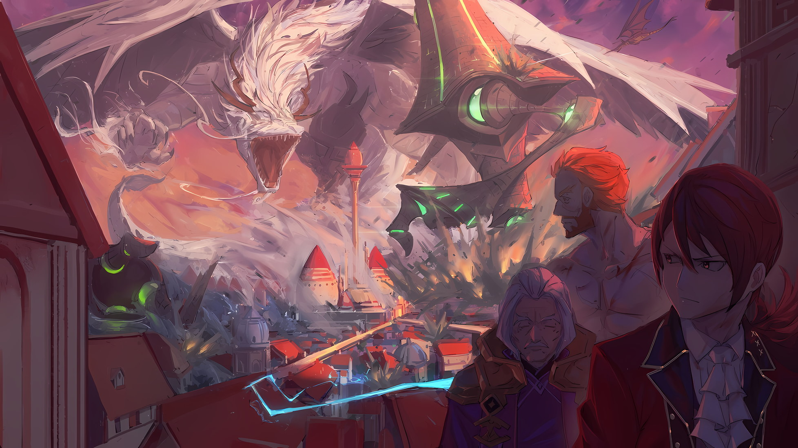

*※※※※※※※※※※※*

…Битва между имперскими войсками и повстанцами, начавшаяся на поле боя в Рапгане, столице Империи Волакия, вступила в свою заключительную фазу, посеяв семена хаоса по всей стране.

То же самое можно было сказать и о смерти «Винсента Волакии», который был убит пулей света перед троном в Кристальном Дворце, самой внутренней части столицы Империи. «Девять Божественных Генералов», которым было приказано охранять городские стены, защищающие имперский город, отказались от своих обязанностей, так как на поле боя внезапно появились неизвестные бойцы, в дополнение к таинственной группе с запада, которая открыла огромную брешь в линии фронта, что, несомненно, способствовало хаосу, разбросанному по всему городу. Не было никаких сомнений в том, что это тоже были семена хаоса.

Однако в настоящее время, местонахождение семени, которое больше всего проросло в этой военной ситуации, было…,

Винсент: …Повинуйтесь мне! Ситуация уже больше не относится к сфере вооруженного конфликта между имперской армией и повстанцами! Вмешательство третьей стороны изменило условия победы!

Стоя на груде обломков, мужчина возвысил свой голос на импровизированной сцене.

Он был красивым мужчиной, с проницательными черными глазами, оттененными горячим интеллектом, засохшей кровью, прилипшей к его черным волосам, и голосом, который хорошо разносился даже на ревущем поле боя.

На поле боя, где господствует насилие… нет, в Империи Волакия, где господствует насилие, можно было только гадать, что могло привлечь людей к бессильной фигуре этого человека.

Никто не высмеивал этого человека, даже если бы захотел. Они просто обратили свое внимание и прислушались.

Текущая в их жилах имперская кровь и образ жизни, который определял не кто иной, как сам человек, не позволяли слушателям отворачиваться от голоса, вознесенного на бесформенный пьедестал.

…От самого Винсента Волакии, который кричал с вершины обломков как Император.

Все: …

Громкое заявление Винсента было услышано уважаемым строем людей.

Среди них были Гоз Ральфон и Ольбарт Данкелькен, члены «Девяти Божественных Генералов», а также Беллстетз Фондальфон, имперский премьер-министр, и даже «Звездочет» Убирк, которому разрешили войти в имперский дворец в особой роли.

Учитывая, на чьей стороне каждый из них был во время конфликта незадолго до этого, присутствующие были таковы, что можно было легко сказать, что их встреча лицом к лицу на таком расстоянии, без охраны, была довольно фатальной.

Однако…,

Винсент: Могуро Хагане подавляет его, но тот, с кем они столкнулись в небе над головой, — Балрой Темегриф, который, как предполагалось, должен был быть мертв. Каким-то образом он воскрес вместе со своим любимым драконом.

Беллстетз: У меня есть для вас сообщение по этому вопросу. …Я столкнулся с Ее Превосходительством Ламией Годвин в зале для аудиенций. Я полагаю, что она та же самая особа, какой была раньше.

Гоз: Почему ты! Этот отчет должен быть поднят мной! Ваше Превосходительство! Там присутствовала не только Ламия, но и другие члены Императорской Семьи, которые погибли на «Церемонии Императорского Отбора»!

На слова Винсента откликнулись Беллстетз и Гоз.

Гоз, который оставался неизменно верен Винсенту, несмотря на его исчезновение, все еще был раздосадован предательством Беллстетза.

Тем не менее, поскольку изначальной заботой Беллстетза было процветание Империи Волакия, отношение старика можно было назвать естественным, когда речь шла о ситуации, когда на карту было поставлено само существование Империи.

Отвергнув такое негодование как тривиальное, Винсент сузил круг тревожных мыслей.

Винсент: Убирк, ты заранее знал о причине «Великого Бедствия». Если это так, то являются ли возрождение Балроя Темегрифа, Ламии и других членов Императорской Семьи Великим Бедствием?

Убирк: Что касается этого вопроса, я могу ответить и «Да», и «Нет», Ваше Превосходительство. Шепот подсказывал мне, что смерть Винсента Волакии станет толчком к «Великому Бедствию», и я строил всевозможные планы, чтобы предотвратить падение Империи…

Винсент: Тебе были неведомы детали?

Убирк кивнул с беззаботным выражением лица и ответил: «Да~, это так».

Ответ был несколько ожидаемым, но полученная уверенность была полезна для Винсента. Убирк и его «Коллеги-Звездочеты» противостояли «Великому Бедствию», о чем свидетельствовал тот факт, что они спасли Винсента от падения.

Винсент: Если это так, то в текущей ситуации твое присутствие в настоящее время выходит за рамки рассмотрения. Маневрируй, только чтобы не умереть.

Гоз: Ваше Превосходительство! Пожалуйста, предоставьте эту ситуацию мне, и поставьте на первое место свою собственную безопасность! Я, Гоз Ральфон, сделаю все, что в моих силах, чтобы искупить вину за свое отсутствие…

Винсент: …Молчать.

Гоз: …!

Взглянув на разгоряченного Гоза, Винсент одним своим словом подавил его порыв.

Гоз хотел получить шанс доказать свою преданность Императору и искупить вину за задержку в критический момент, но его работы было достаточно, когда он помог Винсенту сбежать от восстания Чиши.

Если бы не упорный бой Гоза, Винсент был бы схвачен Чишей, и весьма возможно, что даже такая ситуация не смогла бы создаться в столице Империи. Да, такая ситуация была создана.

Винсент: …

Винсент положил руку на подбородок и нарисовал мысленную карту столицы Империи, собирая воедино ситуацию.

Хотя потеря крови и истощение организма сказывались на его способности мыслить, к счастью, боль в ключице от удара Чиши в тронном зале пробуждала его сознание. Его решимость была также сильна.

Он не думал, что даже эта боль была частью плана Чиши, но…,

Сесилус: Эм, извините, что прерываю всеобщую болтовню, но у меня есть роль, чтобы очаровать мир по-своему. Ничего, если я отлучусь?

Гоз: Что!? Генерал Сесилус!? О чем вы говорите!?

Сесилус: Время от времени мне приходится слышать об этом мистере генерале, но меня это не очень интересует, так что это не укладывается у меня в голове. Может, вы приняли меня за кого-то другого? В таком случае было бы очень жаль, если бы этого мистера генерала сравнивали со мной!

В этой ситуации не только мысли Винсента крутились вокруг да около.

Более того, в радиусе нескольких десятков метров… что было всего лишь одним шагом для огромного тела Могуро… продолжалась битва против дуэта «Облачного Дракона» Мезореи и Балроя.

Вода из разбитого водоема, который можно было увидеть издалека, хлынула наружу, и это был лишь вопрос времени, когда волны хлынут на всю столицу Империи. Кроме того, Сесилус, который суетился, стал совсем крошечным.

Хотя Гоз, Беллстетз и даже Ольбарт проявили выжидательную позицию в отношении решения Винсента, только эта молодая молния не вписывалась в его план.

Не только его внешность, но и содержание его мыслей, казалось, было склонно к незрелости, поэтому Сесилус не испытывал доверия к заявлению Винсента.

Сесилус: Это была великолепная речь! Я уверен, что то, что вы Император Волакии — это факт, но, к сожалению, я не преклоняюсь перед другими только потому, что они Императоры. Если вы хотите изменить мой путь, вам придется подготовить для меня дорожку из цветов!

Винсент: …Точно так же, как это сделал Нацуки Субару, не так ли?

Сесилус: …? К сожалению, я не знаю, кто это. Это имя похоже на кого-то из моих знакомых, но я не могу вспомнить. Мне кажется, что я уже говорил об этом ранее с одной красивой девушкой.

Сесилус ответил, выворачивая шею и переминаясь с ноги на ногу.

Он не был уверен, кто была та «красивая девушка», о которой тот беспокоился, но, когда молодой Сесилус вступил в битву за столицу Империи, Винсент убедился в этом.

Убедился, что Нацуки Субару был тем, кто возглавлял неожиданную группу, опустошившую поле боя с запада, и что он также был тем, кто привел с собой Сесилуса.

И тогда…,

Винсент: Не только в текущей ситуации, но и в том, что ты не выполняешь мои приказы, нет ничего нового. Не стесняйся, бегай, как хочешь.

Сесилус: О, вы очень понятливы. Однако я не намерен послушно выполнять чьи-то приказы, независимо от того, что мне говорят. Итак, я откланяюсь, если вы не возражаете.

Винсент: Сесилус.

Сесилус махнул рукой Винсенту, который решил позволить ему делать то, что он хочет, и уже собирался уходить. Когда его окликнули сзади, юная молния обернулся с вопросом «Да?».

Взгляд Винсента встретился с глазами Сесилуса, в которых все еще было так же трудно разобраться, как и при их первой встрече.

Винсент: Я подготовлю для тебя сцену, согласно нашему предыдущему соглашению.

Сесилус: …Ахаха.

После короткого заявления Винсента Сесилус удалился со смехом.

Скорость молниеносных движений, не оставляющая даже следа, и это при том, что он был еще в незавершенном состоянии; вот почему титул сильнейшего Волакии принадлежал этому человеку и был непоколебим.

В любом случае…

Беллстетз: Ваше Превосходительство, все ли в порядке? Что касается генерала Сесилуса…

Винсент: У меня нет времени на пустяки, вроде вашего с Убирком лечения. Что еще более важно…

Разбирательство с исчезнувшим Сесилусом было менее срочным, чем решение текущей проблемы.

Винсент встретился взглядом с узкими глазами Беллстетза и заговорил голосом, который могли услышать Гоз, Ольбарт и остальные, стоявшие позади него,

То, что он сказал, было…

Винсент: …Мы покинем столицу Империи. Мы отступим, сохранив при этом как можно больше нашей военной мощи.

*△▼△▼△▼△*

Верхом на красном коне Галевинд группа пронеслась по имперскому городу в вихре неразберихи и хаоса.

Знаменосцами были знакомые лица Нацуки Субару, с флангов — кавалерист Идра Мисанга и сильная девочка Танза, с которой способность Эскадрона Плеяд к прорыву оставалась сильной.

Субару: К тому же, добавим к ним двух ведущих звезд, Беатрис и Луи, и мы те, у кого есть преимущество!

Впереди Идра держал поводья, а за его спиной, на коротких руках Субару, словно сэндвич, сидела Беатрис, затем Луи, уютно устроившаяся на его спине.

Непреднамеренно четверых детей возглавил взрослый Идра, но…,

Беатрис: …Минья!

Луи: Уау!

Танза: Я прошу прощения.

Рука Беатрис поднималась, когда она выпускала фиолетовые стрелы, Луи неограниченно атаковала, телепортируясь сквозь пространство, а Танза сжимала кулаки, без усилий пробиваясь сквозь тех, кто преграждал им путь.

Перепрыгнув через разрушенные городские стены в столицу Империи, Субару и компания направились к Кристальному Дворцу, видневшемуся вдалеке… сверкающему замку, где правил фальшивый Император.

Фальшивый Император, который находился в этом замке, выдавал себя за Винсента Волакию.

Если бы его удалось победить, это положило бы конец великой гражданской войне в Империи Волакия, в которую неизбежно был втянут Субару.

Итак, поверив в это, он ринулся в бой, готовый разбушеваться и посеять хаос.

Идра: Шварц! Эти парни появляются, где бы мы ни проезжали! Что это такое?

Голос Идры, хотя и не был похож на крик, был хриплым от глубоко укоренившегося страха.

Возможно, страх ощущался через поводья в его руках, когда походка лошади Галевинд начала сбиваться, но было бы неразумно ожидать, что он просто стерпит или забудет об этом.

Как бы то ни было…,

Субару: Что же действительно происходит с этими бледнолицыми парнями?!

Они знали, что как только въедут в столицу Империи, то, естественно, встретят решительное сопротивление со стороны имперских солдат.

Однако только на начальном этапе Субару и компания столкнулись с имперскими солдатами в столице Империи. С того момента он и остальные встретились со странно выглядящими существами, у всех них были бледные лица.

Эти существа с бледными лицами, золотыми глазами и стеклянными трещинами по всему телу, преграждали Субару и остальным путь с холодным и бессердечным выражением лица.

…Нет, они стояли на пути не только Субару и компании.

Танза: Шварц-сама, эти люди, они тоже нападают на имперских солдат.

Танза ударила ногой по группе бледнолицых и прижала их к стене, бросив отчет как таковой.

По ее словам, то, что разворачивалось на краю ее зрения, было присутствием «Врага», который нападал не на Субару и компанию, а на имперских солдат, охранявших город.

Конечно, этих «Врагов» не волновали чувства Субару, в отличие от Эскадрона Плеяд. Они были неумолимы в своих попытках лишить имперских солдат жизни, используя оружие, которым они владели.

Вот почему…,

Субару: …Танза! Будь добра!

Танза: Я поняла.

Услышав неразумную просьбу Субару, Танза ускорилась, ударив ногой по земле.

Она, как несущийся мяч, ворвалась в ряды врага… имперских солдат, и настигла тех, кто собирался лишить себя жизни, ударив их в спину своими ботинками на толстой подошве.

???: …Кх!

Послышался короткий крик боли, и подбитый «Враг» врезался в здания с обеих сторон.

Танза взглянула на разрушенные здания и на имперских солдат, чьи жизни были спасены из-за густого столба дыма, а затем сказала: «Идите вперед», отпустив их.

К счастью, спасенные солдаты предпочли покинуть территорию, а не пытаться нацелиться на спину Танзы.

Субару: Это полезно… но что насчет этих парней?

Усилия Танзы позволили избежать нежелательных смертей; однако Субару принял на себя всю тяжесть ее удара и остался задыхаться от разрушений, вызванных «Врагом», который врезался в здания и разнес их вдребезги.

Причина, по которой «Враг» не поднялся, заключалась отчасти в том, что удары Танзы были очень мощными, но что еще более важно, потому что они были не в состоянии подняться.

Тело «Врага» было разорвано на куски. Однако оно не было гротескным трупом, а скорее было разбито вдребезги, как будто они уронили на пол фарфоровую чашку.

Крови тоже не было. Как будто в их телах не было крови.

Субару: Как они работают? Это как кукла или, может быть, робот…?

Беатрис: …Быть не может быть, «Таинство Бессмертного Короля», в самом деле?

Субару: …! У тебя есть идея, Беатрис!?

Субару не пропустил слов, слетевших с милых вишневых губ Беатрис, которая прильнула всем своим телом к его груди, полностью доверяя ему.

Беатрис опустила голову в ответ на реакцию Субару,

Беатрис: Разновидность магии, которая после смерти возвращает душу в тело, из которого она вышла… запрещенная техника, я полагаю. Первоначально она была исследована Матушкой, но, предположительно, осталась незавершенной.

Субару: Запрещенная техника для воскрешения мертвых, значит, что-то типа некромантской магии? Какая-то часть моей головы все еще немного затуманена, но, блин, твоя Матушка ни на что не годна!

Беатрис: В самом деле, это не первый раз, когда Субару плохо отзывается о Матушке. Но Бетти расстроится, если ты продолжишь это говорить, так что будь осторожен, я полагаю.

По предложению Беатрис, приподняв брови, Субару высунул язык и закрыл один глаз в раздумье.

Однако мнение милой Беатрис нельзя было игнорировать. Что если некромантия с таким названием, как «Таинство Бессмертного Короля», была тем, что создавало этих «Врагов»?

Субару: Ты имеешь в виду, что среди «Девяти Божественных Генералов» есть кто-то вроде некроманта* или что-то в этом роде?

* В этой главе Субару использует как японское слово «некромант» (死霊術師), так и английское (ネクロマンサー).

Беатрис: …Если это так, тогда странно, что Авель не обсудил такие вещи заранее, в самом деле. Кроме того, я полагаю, это означало бы, что мы не смогли бы отличить друга от врага.

Субару: Я думаю, это возможно в Империи с такой жуткой этикой, но… подожди! Ты знаешь, кто такой Авель!?

Беатрис: …Бетти знает, в самом деле.

Услышав это неожиданное имя из уст Беатрис, глаза Субару расширились. На его удивление, она подтвердила это с горьким выражением лица.

То, что Беатрис общалась с Авелем, и что это был не просто другой человек с таким же именем, было ясно видно по ее горькому лицу.

Поскольку Авель был, по сути, несовместим со всеми, очевидным объяснением было бы то, что он несовместим и с Беатрис.

Желудок Субару скрутило при одной мысли о том, какому непочтительному отношению Авель подверг Беатрис, но…,

Субару: …Конечно, этот парень здесь.

Невозможно было представить, чтобы Авель не находился в центре осады в этой великой битве. Но, поскольку он не знал специфики состава сил повстанцев, он почувствовал другие эмоции, когда ему ясно сказали, что это так.

Если Авель был здесь, то выходкам Субару стоило бы уделить некоторое дополнительное внимание.

Субару: Тогда, может, мне оставить борьбу с зомби им? Или будет лучше, если я с милой и зомби-умной Беатрис прибегу, чтобы разобраться с… ай-ай-ай! Что!?

Беатрис: Хм, я полагаю. Выражение лица Субару было немного раздражающим, в самом деле.

Субару: Почему! Этот взгляд в моих глазах — нечто среднее между очарованием и дерзостью — от рождения, ты знаешь!?

Беатрис: Полагаю, меня раздражает то, с каким странным облегчением ты выглядел, когда услышал имя Авеля.

Губы Субару надулись, когда Беатрис ущипнула его за бедро с иррациональным обвинением.

Хотя трудно было точно сказать, насколько, суждения Беатрис о Субару, возможно, стали строже за то время, что они были разлучены.

Конечно, он признавал превосходство Авеля в плане способностей. Но в обстоятельствах этого масштабного конфликта он не испытывал никакого утешения, слыша его имя.

По любым меркам, встреча с Беатрис была более радостным событием, чем встреча с Авелем.

Субару: Ты для меня номер один, Беатрис, не пойми неправильно.

Беатрис: Тогда докажи это в дальнейшем, в самом деле.

Субару: О, конечно!

В ответ на благосклонное суждение Беатрис, Субару похлопал Идру по плечу и заставил лошадь Галевинд остановиться.

В окрестностях не было никаких признаков присутствия врагов или мирных жителей, но он хотел определиться с планом действий на будущее.

Танза: Шварц-сама, если вы закончили флиртовать, что бы вы предложили нам сделать?

Субару: Ты ведешь себя так колюче! Я не флиртовал… но Беатрис! Прекращается ли эта магия зомби, когда заклинатель побежден?

Уязвленный пустым выражением лица Танзы, Субару поинтересовался мнением Беатрис; Беатрис, отвечая на вопрос, теребила пальцами свои вертикально закрученные волосы, и они вдвоем, с одинаковым выражением на лицах,

Беатрис: Я полагаю, что виды магии, которые воздействуют на тела других людей, — это преимущественно Магия Тьмы и Магия Света. С любым из этих атрибутов, в общем и целом, при смерти заклинателя, действие магии фактически прекращается. Так что, подобным образом, было бы приятно думать, что это так и есть, я полагаю.

Танза: К этой фразе примешивается некоторое принятие желаемого за действительное. Разве это не очевидно?

Беатрис: Даже Бетти никогда не видела, чтобы «Таинство Бессмертного Короля» было реализовано, в самом деле! Нельзя быть настолько по-детски безответственной, чтобы выносить бессистемные суждения на основе домыслов, я полагаю.

Субару: Успокойся, успокойся! Значит, у тебя нет никаких предположений о зоне действия или о том, откуда используется магия?

Беатрис: …Прискорбно, но это зависит от заклинателя, в самом деле.

В ответ Беатрис разочарованно посмотрела на Танзу, словно думая, что она может снова пренебрежительно отнестись к ней. Однако та не стала критиковать ее за то, что она признала свою неадекватность.

В этом отношении Танза не унижала даже тех, с кем у нее были не самые лучшие отношения.

Субару: Сейчас нет времени на препирательства; кроме того, Беатрис, то, что ты сказала, помогло. Спасибо.

Беатрис: Полагаю, это был не очень достойный похвалы ответ.

Щеки Беатрис надулись, когда он, поблагодарив, погладил ее по голове. Его так и подмывало потрогать пальцами ее пухлые щечки, но он также чувствовал, что попал в затруднительное положение.

Учитывая обстоятельства, эта атака зомби была явно необычной ситуацией.

Поскольку имперские солдаты подвергались нападению, было, конечно, возможно, что в армии повстанцев был некромант и что беспринципный и бессердечный Авель, возможно, прибегнул к бесчеловечной тактике; однако что-то было не так с реализацией и с тем, как зомби появлялись из ниоткуда.

Эти зомби явно создавали впечатление, что они не вторглись в город извне, а скорее были созданы внутри города и бесчинствовали в нем.

Если это была стратегия Авеля, то лучшим вариантом действий было бы начать войну на истощение с самого начала. Вполне возможно, что использовались какие-то военные приемы, о которых Субару не знал.

Субару: Как и ожидалось, если они начнут использовать зомби, мне придется подумать о том, как с ними бороться.

Более того, хотя это было смутное впечатление, он чувствовал, что Авель не стал бы использовать «Мертвецов» в военных целях, несмотря на то что прибегал «Смерти» в политических целях.

Он подозревал, что взгляд Авеля на жизнь и смерть, или, если уж на то пошло, общий взгляд Волакии, не допускал этого.

Поэтому…,

Субару: Существование этого Зомби Мейстера следует считать нарушением. Если война не закончится, когда мы победим фальшивого Императора в замке, тогда…

Идра: Что теперь, Шварц? Мы последуем твоему примеру.

Субару: Идра…

Субару приложил руку к подбородку, когда Идра повернул к нему голову, чтобы произнести эти слова доверия.

Это не было знаком того, что он перекладывает ответственность на Субару, а скорее подтверждением его готовности рисковать своей жизнью вместе с ним в ситуации, которая может снова привести их к смерти.

Субару добился этого положения по собственной воле.

Он просто обязан был выполнить эту ответственность. И благодаря Идре и членам Эскадрона Плеяд, Субару мог протянуть руку еще дальше, чем раньше.

Субару: Я не совсем уверен, что делать в этой ситуации, но, в конце концов… ай-ай-ай-ай! Ай-ай!

Беатрис и Танза: Субару! Шварц-сама!

Субару кивнул, осознав свою ответственность, но вскрикнул от боли, когда Беатрис ущипнула его за бедро, и от еще другой боли, на что Беатрис и Танза расширили глаза.

На этот раз Субару почувствовал боль, потому что его дергали за волосы.

И виноваты в этом были не Беатрис или Танза, и уж тем более не Идра, а…,

Субару: Какого черта, Луи! Не дергай меня за волосы! Это жизненно важная стратегия защиты — заботиться о них с раннего возраста, чтобы я не страдал от облысения, когда стану старше…

Луи: Ууау! Уу! Ау! А…у!

Субару: Что?

Луи отчаянно умоляла о чем-то Субару, который защищал свой потянутый скальп.

Она похлопала Субару по спине, а затем указала на северную часть имперского города… направление, где располагается Кристальный Дворец, но немного в стороне от проторенных дорог… постоянно побуждая его.

*Направляйся туда*, он знал, что именно это она имела в виду.

Субару: Там что-то есть?

Луи: Ау!

На вопрос Субару Луи ответила высоким голосом.

Следует также отметить, что Луиc, казалось, была довольно эмоционально стабильна сейчас, когда ей удалось встретиться с Субару. Сам Субару также испытывал искреннее облегчение по поводу ее безопасности, несмотря на их сложные отношения.

Вдобавок ко всему, если бы было что-то, к чему Луи так отчаянно взывала, то это было бы…,

Субару: …Беатрис, позволь спросить тебя одну вещь. Вы все вместе?

Беатрис: …Не все, в самом деле.

В ответ на тихий вопрос Субару, Беатрис уклонилась от четкого заявления.

Однако было ясно, что Беатрис уклоняется не для того, чтобы напустить на себя вид, а чтобы избавить Субару от шока. Поняв это, он также осознал, почему она была двусмысленна.

Итак…,

Субару: Танза, Идра! И еще, Беатрис и Луи, планы меняются!

Придя к выводу о том, что нужно делать, Субару обратился к окружающим его людям с лошади Галевинд.

Скорее всего, битва вокруг столицы Империи не утихнет, а наоборот, еще больше усилится. Поскольку зомби и их Мейстер были неизвестными существами, приготовления шли полным ходом.

Конечно, он мог выдвинуть такую теорию, но…,

Субару: Во-первых, мы направляемся туда, куда указывает Луи! Позвольте мне забрать там кое-что важное!

Беатрис: Если это Луи, то… Она будет там, я полагаю.

Решение Субару дало Беатрис представление о месте назначения, на которое указывала Луи.

Кивнув на слова Беатрис, Субару повернулся к Танзе и Идре, которые тоже смотрели на него, и продолжил.

Этим было…,

Субару: …Забирайте Рем и бегите из имперского города с таким количеством людей, с каким сможете! Мы бежим наперегонки со временем!

Итак, он загадочным образом принял решение в том же направлении, что и человек, которого в этот момент не было.
