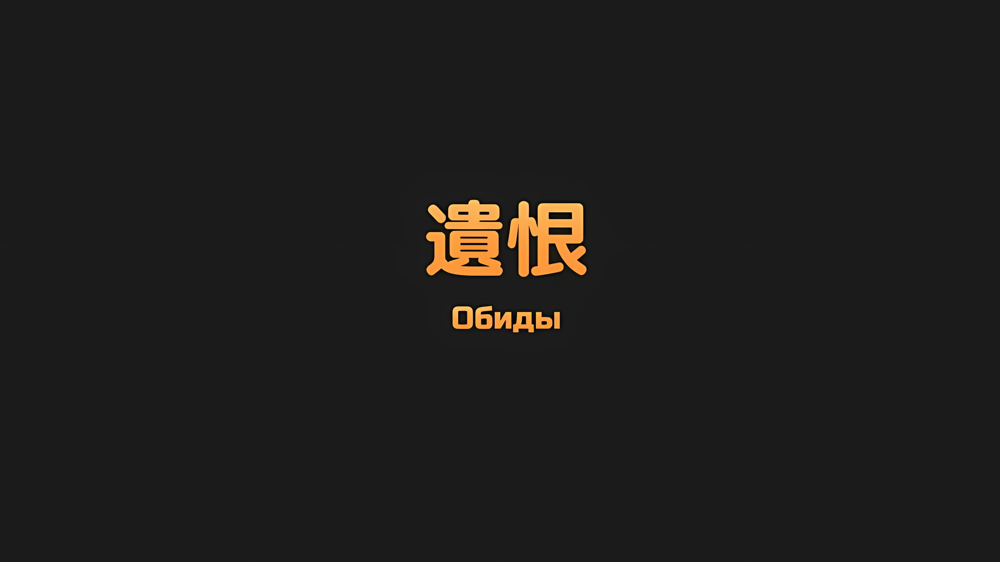

*※※※※※※※※※※※*

…Беатрис была в растерянности, как вести себя с маленькой девочкой по имени Луи.

Когда Магическая Кристальная Пушка выстрелила из Кристального Дворца, их отношения позволили им сотрудничать в отправке ее в другое пространство.

Без таинственной способности Луи к телепортации было бы невозможно добраться до этого места. Если бы они не прибыли, на поле боя погибло бы много людей, начиная с Зикра.

Этот единственный поступок не мог снять с Луи ответственность за то, что она является Архиепископом Греха «Чревоугодия».

И все же…,

Луи: Аау!

Беатрис: Я полагаю, Бетти может быть уверенной, что у тебя нет враждебности к Субару и остальным.

Неуклюже сидя на трясущемся седле, хотя размером они были с детей, три человека, помимо основного наездника, ехали на бегущей красной лошади Галевинд.

На спине лошади Галевинд сидели Беатрис и Луи, а между ними Субару; в отличие от Беатрис, которую на руках держал Субару, Луи ловко встала на лошадь, коснувшись его плеча и указывая в одном направлении.

…С точки зрения Беатрис, ситуация в столице Империи Рапгане представляла собой горнило хаоса.

Начиная со столкновения между регулярной армией и повстанцами, неквалифицированные летающие драконы и бывшие летающие драконы сражались друг с другом за небо; белый мир и красный мир переступили границы нормального, гиганты и драконы взбесились, и, наконец, мертвецы восставали один за другим, чтобы опустошить город изнутри.

Будучи склонной к самоизоляции, никому не оказывая поддержки, Беатрис лишь в редких случаях вмешивалась напрямую, но безумие и непоследовательность этого мира напомнили ей хаотические времена четырехсотлетней давности…

Беатрис: …«Ведьмы».

Вспоминая те ушедшие дни, Беатрис, естественно, произнесла это слово.

Если и могло быть что-то, что символизировало ту эпоху четырехсотлетней давности, то это, несомненно, были «Ведьмы».

Ехидна, создательница Беатрис и та, кого она обожала как свою мать, тоже была одной из тех, кого причисляли к «Ведьмам».

В остальном, та эпоха, в которой было несколько «Ведьм», несущих на себе смертные грехи; и та эпоха, когда все боролись за выживание, была мрачным периодом, похожим на сбывшийся детский кошмар.

Нынешняя ситуация в столице Империи была повторением того же самого. …Она задалась вопросом, что могло спровоцировать это, и ее сердце учащенно забилось.

Пока Беатрис держала это разочарование в своем сердце…,

Субару: …Держись, Рем!

Сразу же позади себя она услышала задыхающийся, но решительный голос Субару.

Луи, голос которой звучал как рычание, и Субару, торопивший скачущую лошадь в указанном ею направлении, не сомневались, что там находится девушка, которую он искал.

Когда Беатрис подумала о результатах времени, проведенного Субару с Луи, в груди у нее помутилось, но она поняла, что между ними было доверие.

Беатрис тоже не сомневалась, что Рем была там, в том направлении, куда указывала Луи.

Оглядываясь назад, Луи потратила большое количество маны, чтобы ликвидировать Магическую Кристальную Пушку, и отправиться прямиком к Субару, чтобы попытаться спасти исчезающую Беатрис. Она обладала способностью находить тех, кого искала.

Может ли это быть кто угодно или только тот, кого она знала, было неясно.

Субару: Огромный дворец!

Идра: Что нам делать, Шварц!? Стены здесь высокие! Может, нам зайти спереди…?

Субару: Нет, это будет пустой тратой времени! Танза!

Этот обмен мнениями происходил, пока они пересекали несколько улиц и приближались к намеченному зданию.

Это был дворец, занимавший внушительный участок земли в северной части столицы Империи, и его окружение указывало на то, что это была резиденция человека высокого ранга.

Естественно, стены вокруг дворца были высокими, чтобы обеспечить надлежащую безопасность.

Но…,

Танза: Я не хочу, чтобы у вас сложилось неправильное впечатление.

Сказав это, девочка-олень, голос которой был таким же безэмоциональным, как и ее лицо, ударила ногой по земле с малейшим намеком на неодобрение в ее чертах и бормотании.

Танза, девочка, врезавшаяся прямо в стену перед собой, продолжила,

Танза: Я не инструмент Шварца-сама для разрушения стен.

Сразу после ее заявления ботинки Танзы на толстой подошве ударились о стену дворца, которая, вероятно, была пропитана Божественной Защитой Земли. От этого удара стена, которая должна была усилить оборону, прогнулась, и, в конечном счете, была пробита, рухнув на землю.

В сопровождении грохота и порыва ветра из-за стены появился силуэт девушки. Словно нырнув с головой в клубящийся дым, лошадь Галевинд, несущая Беатрис и остальных, влетела на территорию поместья.

А затем…,

Луи: Уау!

Беатрис: …Субару, вон там, в самом деле!

На территории просторного поместья выстроилось множество зданий, отделенных от главного дома, из-за чего они на мгновение почти потеряли чувство направления. Однако, оглядевшись по сторонам точно так же, как Субару, Беатрис открыла свои круглые глаза и стала искать цель, а затем заметила скопление людей.

В тот же миг Луи тоже посмотрела в ту сторону, что и Беатрис, и закричала, подкрепляя ее уверенность.

Впереди них, у входа в отдельное здание, стояло несколько фигур.

Перед плотно закрытой дверью виднелась лишь спина в потрепанном снаряжении имперского солдата, а лицом к ней стояли две фигуры, одну из которых Беатрис не узнала.

…Второй фигурой была девушка, которую знала Беатрис.

Субару: …Эль!

Беатрис: Минья!!!

Тупой меч был поднят, нацелившись на девушку и ее спутника.

Как только они заметили его, Беатрис и Субару, держась за руки, подняли противоположные руки и произнесли магическое заклинание. Последовавшая за этим темно-фиолетовая стрела поразила спины бледнолицых мужчин, превратив их в кристаллы.

Враги: Гах.

Раздался горький крик, но никаких дальнейших действий со стороны мужчин допущено не было.

С высокочастотным звуком, похожим на треск льда, фигуры мужчин раскололись на куски и рассыпались в прах.

Лошадь Галевинд добралась до девушки, которая, едва избежав смерти, удивленно расширила глаза, и, будучи вытащенной за руку, Беатрис приземлилась на землю вместе с Субару.

И тут…,

Субару: …Я заставил тебя ждать, Рем! Настоящая звезда вышла на сцену!

Прикрыв один глаз и оскалив зубы, Субару сделал напыщенное заявление.

Несмотря на его детскую внешность, Беатрис глядела на своего партнера из объятий, гордясь его неизменной храбростью, с которой он пытался помочь кому-то другому.

Глаза девушки, чья жизнь была спасена, расширились, когда она встретилась взглядами с Беатрис и Субару.

Как бы то ни было, волнение и эмоции задрожали у нее в горле…,

Рем: …Кто вы?

Cпросила она с сомнением в голосе, в атмосфере, которая была не очень дружелюбной.

*△▼△▼△▼△*

Субару: Нет, это я, это я! Я немного меньше ростом, но я говорю тебе, что это я! Ты ведь поняла, да?

Рем: …Я благодарна за помощь, но я не совсем понимаю.

Субару: Не может такого быть!

Субару замахал руками, опечаленный таким неожиданно холодным ответом Рем.

Он чувствовал себя подавленным такой реакцией, особенно потому, что думал, что после безнадежного опыта, после спасения из опасной для жизни ситуации, его наверняка будет ждать глубоко эмоциональная встреча.

Конечно, раз он, будучи Субару, уехал и уменьшился, а Рем осталась в неведении, он подумал, что требовать от нее открытого счастья тоже было бы неразумно.

Субару: В этом смысле, если отбросить Луи, которая уже знала меня в таком состоянии, это нечто, что Беатрис сразу же приняла это…

Беатрис: Дело не в том, что Бетти ничего не подумала об этом, я полагаю. Просто, независимо от того, уменьшился ты или нет, это не изменит того, что ты партнер Бетти, в самом деле. Более того…

Субару: Более того?

Опустившись на землю из рук, в которых ее держали, Беатрис посмотрела на Субару и Рем, сравнивая их. Затем, сузив свои необычные узорчатые глаза,

Беатрис: Это отношение полностью отличается от того, что Бетти слышала от Субару, я полагаю. Эта девушка… Рем должна была быть нежной по отношению к Субару, в самом деле. Это была ложь, я полагаю?

Субару: Нет, это не было ложью! Просто сейчас она многое забыла!

Беатрис: Забыла…

После холодного обращения Рем, Беатрис стала излишне подозрительной.

Вероятно, именно сомнение в том, действительно ли Субару заставил всех, кто не помнил Рем в ее состоянии «Спящей Красавицы», поверить в историю, которая отличалась от реальности.

Это было немыслимое недоразумение. Во-первых, что-то вроде лжи о личности Рем, когда она спала, было за гранью кощунства, и это тоже делало Субару несчастным.

В ответ на объяснения Субару, Беатрис молча повернулась обратно к Рем,

Беатрис: В самом деле, ты не помнишь Бетти?

Рем: …Нет, я думаю, что это наша первая встреча.

Беатрис: …Понятно, полагаю. Теперь я понимаю, в самом деле.

Рем: Кажется, это вас убедило, но, в конце концов, кто вы такие? Я благодарна за помощь, но…

По лицу Беатрис было видно, что из ответа Рем она поняла, что Субару не сказал ничего подходящего. С другой стороны, сомнения Рем оставались невысказанными.

Даже если бы Субару и Беатрис были убеждены в одностороннем порядке, вопросы Рем только продолжали бы накапливаться.

Хотя его собственное внутреннее чувство дискомфорта относительно уменьшилось, отношение Рем ясно говорило о том, что большой Субару и маленький Субару совершенно разные.

Субару: Как бы то ни было, я — это я! Рем, в любом случае, давай погово…

???: О боже!? Мне было интересно, кто нам помог, но это Мистер! Это Мистер, верно! Спасибо, что примчался!

Субару: Ах, смотри, Флоп-сан понял… Э!? Флоп-сан!?

Говоря это, Субару пытался как-то разгадать непонятливость Рем, но тут его ошеломил вид Флопа, светловолосого молодого человека, который внезапно появился из-за ее спины.

Придя на помощь Рем, он даже не подумал о том, что Флоп может быть с ней.

Субару: Почему ты здесь? Тебя похитили вместе с Рем?

Флоп: Боже мой, это довольно смело — прийти на помощь Миссис, ничего не зная, не правда ли! Но, в целом, такое понимание не является ошибочным. Точнее было бы сказать, что поскольку я получил смертельную рану, Миссис сопровождала меня, чтобы оказать лечение!

Субару: Смертельную рану… Аах, ты прав! Это ужасная травма!

Флоп был весел, как никогда; но, не обращая внимания на эту до смешного яркую личность, кожа, видимая сквозь прорехи в его одежде, была обмотана бинтами, и цвет его лица казался несколько бледным.

Судя по его опыту на «Острове Гладиаторов», Флоп был серьезно ранен до такого уровня, что даже стоять было бы очень трудно.

Похоже, что слова о том, что он получил смертельную рану, не были преувеличением.

Субару: Но, тогда Рем тоже… Боже, ты слишком бесстрашна.

Рем: Пожалуйста, подождите. Вы пытаетесь плавно перевести разговор в другое русло, но… Флоп-сан, называя этого мальчика так…

Флоп: Ах, может быть, такие вещи легко заметить только третьему лицу? Как и думает Миссис, это Мистер. Только с более детским лицом!

Рем: …

Услышав слова Флопа, Рем снова уставилась на Субару.

Столкнувшись с сомнением, появившимся в ее бледно-голубых глазах, Субару изменил угол своего лица, чтобы лучше видеть ее, и оскалил зубы. Оттенок сомнения сменился тревогой, которая затем быстро перешла в удивление.

Рем: Я думала, я думала, что ты очень странный человек, но… ты не только можешь переодеваться в женщину, но даже превращаться в ребенка?

Субару: Это неправильно! Эта ситуация выходит из-под моего контроля! Не так ли, Беатрис?

Беатрис: Субару, ты снова переодевался в неизвестном Бетти и остальным месте, я полагаю…?

Субару: Не зацикливайся на этом прямо сейчас!

И Рем, и Беатрис смотрели на Субару с сомнением, ошеломляя его. Флоп, стоявший рядом с обменом, при этом поднес палец к своему ухоженному лицу,

Флоп: Ну, не только Мистер переоделся в женщину, в конце концов, я и Шеф тоже сделали это. Все вместе мы действительно выглядели как девушки, и фигуры у нас тоже были прелестные.

Субару: Это потому, что в то время я вложил все свои очки в показатель харизмы. В любом случае! Я рад, что мы смогли встретиться.

Похлопав себя по груди от облегчения, Субару улыбнулся и Рем, и Флопу. Последний откровенно кивнул в ответ на улыбку, а Рем, обдумав все возможные варианты,

Рем: …Ты прошел через все эти трудности, чтобы найти меня?

Субару: Ну, конечно. Нет, я не знал, что тебя похитили, пока был в пути, но как только я узнал об этом, мои эгоистичные чувства вспыхнули с новой силой. Единственное, что заставило меня быть уверенным, что ты здесь…

Луи: Уу!

И как раз тогда, когда он отвечал на вопрос Рем, ворвалась причина его уверенности.

Зажатая между Субару и Рем, Луи подскочила к последней. Ее золотистые волосы развевались, когда она обнимала Рем, и, хотя та была удивлена и издала «Вау», она приняла объятия девушки.

Когда это лицо было так близко к ней, в глазах Рем появилось облегчение.

Рем: Луи-чан, я вижу, ты в безопасности. Я беспокоилась, что он мог плохо с тобой обращаться, ведь ты сама пошла за этим человеком.

Луи: Аауу!

Субару: Неважно, как ты на это смотришь, но неужели я действительно обращался с ней так плохо, что ты аж настолько волнуешься… я делал это? Я делал это, не так ли? Наверное, да. Но сейчас я об этом жалею.

Погладив Луи по голове, когда она обнимала ее, Рем сделала такой комментарий, на что Субару надул свои губы.

На самом деле, если Рем и Луи расстались в то время, когда Субару и остальные отправились в Хаосфлейм, то именно в этот момент отношения Субару и Луи были наихудшими.

И дело было не только в том, что по дороге Субару мог воспользоваться случаем и бросить Луи в поле. Можно сказать, что переживания Рем были бесконечными.

Но опять же…,

Субару: Сейчас я не думаю о том, чтобы что-то сделать с Луи. Мы помирились.

Рем: …Это правда? Луи-чан?

Луи: Ууу!

С широкой улыбкой на лице Луи кивнула головой, и вопросительный знак над головой Рем был окончательно развеян ее ответом.

Поскольку его тело уменьшилось, обстоятельства, которые, вероятно, были его самым большим затруднением, протекали спокойно, и Субару вздохнул с облегчением. Затем, схватившись за его руку,

Беатрис: …Несмотря на то, что Бетти намеревалась смириться с этим, эта сцена все равно вызывает очень неприятные ощущения. Такая вещь, как эта девушка и Рем, которые так дружелюбно относятся друг к другу, это странное чувство, я полагаю.

Несмотря на то, что Беатрис пробормотала это, Субару в душе криво улыбнулся.

Однако, учитывая, что, когда Субару впервые отправили в Империю Волакия, он оказался вместе с Луи, цели которой были ему совершенно неизвестны, и Рем, которая отнеслась к нему враждебно, он был полностью согласен с Беатрис.

В конце концов, благодаря какой-то причинно-следственной связи, Архиепископ Греха «Чревоугодия», причина превращения Рем в «Спящую Красавицу», теперь проводил с ней время в такой дружеской манере.

Субару: …Я все еще не нашел правильного ответа на этот вопрос, но…

Память Рем все еще не вернулась. Происхождение Луи тоже оставалось неизвестным.

Однако им удалось выжить и воссоединиться с Рем таким образом, а Луи продемонстрировала настолько дружелюбное отношение к ним, насколько это было возможно. Таким образом, они должны были найти решение.

Поэтому…,

Танза: …Шварц-сама, я не думаю, что у нас есть много времени, чтобы так расслабляться.

Видя атмосферу этого воссоединения, девочка вмешалась вовремя и по веской причине.

Услышав вмешательство Танзы, маленькой девочки в кимоно, которая прочла атмосферу, Субару повернулся к ней и сказал: «Да». Затем, продолжая бдительно следить за окрестностями с лошади, Идра тоже вошел в поле его зрения, и…,

Идра: Мы нашли человека, которого вы ищете. Кстати, больше никого не похитили, верно?

Беатрис: Насколько Бетти слышала, больше никого быть не должно, в самом деле.

Рем: Я тоже никого не заметила. А Флоп-сан…

Флоп: Я тоже не знаю ни о каких других знакомых, которых привели сюда. Если только по неосторожности Медиум не была похищена или что-то в этом роде! Кстати, как она, Мистер!

Субару: Она не была похищена в то время, когда мы были разлучены. …Но она уменьшилась.

Флоп: А? Что? Что ты сказал?

Флопу, который беспокоился о безопасности своей сестры, Субару утаил тот факт, что Медиум тоже уменьшилась.

Кроме уменьшенного вида, она была совершенно здорова; несомненно, Медиум благополучно покинула Хаосфлейм и присоединилась к группе в Гуарале.

Не было времени согласовывать детали ситуации и пререкаться по поводу того или иного вопроса.

Чтобы гарантировать столь оживленное и веселое времяпрепровождение, им нужно было двигаться.

Субару: Итак, включая Рем и Флопа-сан, я хочу сбежать с как можно большим количеством людей, есть ли еще кто-нибудь в этом поместье?

Рем: Есть девушка по имени Катя-сан, с которой я здесь познакомилась. А еще есть отдельно стоящее здание…

Субару: Здесь?

Кивнув, Рем перевела взгляд на плотно закрытую дверь рядом с ней.

Ему нужно было быстро победить врага, поэтому он не проверил это должным образом, но казалось, что Рем и Флоп пытались открыть это здание,

Флоп: Говорят, что внутри находятся «Черноволосые Наследные Принцы» из разных мест.

Идра: «Черноволосые Наследные Принцы»… Подделки Шварца.

Флоп ответил на внутренние вопросы Субару, а Идра неодобрительно отозвался о его содержании.

Мнение Идры о том, что они — фальшивые Шварцы, разделяли все в «Эскадроне Плеяд», и это была одна из больших неправд, которые Субару им рассказывал.

«Черноволосый Наследный Принц», о котором говорили по всей Империи, был незаконнорожденным сыном Императора Винсента Волакии, а все те, кто присвоил себе это имя в разных регионах, были всего лишь подделками.

Настоящим «Черноволосым Наследным Принцем» был никто иной, как Нацуки Шварц.

Идра: Те, кого использовали в качестве оправдания то тут, то там, чтобы начать восстание? Если говорить прямо, мне не нравится такой небрежный подход к делу.

Беатрис: Бетти согласна с Бородой, я полагаю. Инициатору это тоже не нравится, в самом деле.

Идра: Б-Бородой…

Идра явно выразил свое недовольство самозваными Наследными Принцами, которых, похоже, держали в плену внутри отдельно стоящего здания, на что Беатрис кивнула в знак согласия.

Откровенно говоря, Субару было больно слышать слова Идры. Комментарий Беатрис подтвердил его догадку о том, чья это была затея.

Честно говоря, трудно было понять, были ли некоторые из фальшивых Наследных Принцев хорошими парнями, или же некоторые из них были плохими парнями…

Танза: Шварц-сама, что бы вы хотели сделать?

Субару: Нет, разве нам действительно есть что обсуждать? Если их оставить здесь, рано или поздно зомби определенно убьют их, так что у нас нет другого выбора, кроме как помочь.

Танза: …

Приглушенным голосом Субару ответил Танзе, которая спрашивала о его решении.

Глаза Танзы расширились при ответе о «Черноволосых Наследных Принцах»… она была единственной, кому с «Острова Гладиаторов» говорили, что заявление Субару о том, что он является наследником Императора, было ложью, распространяемой с целью создания беспорядков.

Огромная причина, по которой товарищи из «Эскадрона Плеяд» доверяли Субару и были готовы участвовать в этой битве за столицу Империи, заключалась в том, что они верили, что он — «Черноволосый Наследный Принц».

Если бы плененные фальшивые Наследные Принцы были освобождены, шансы на то, что эта ложь будет разоблачена, возросли бы.

Субару: Но, это — то, а это — это.

Даже зная об опасениях Танзы, Субару не стал бы жертвовать человеческими жизнями ради защиты лжи.

Конечно, можно было надеяться, что этот акт сострадания будет возвращен, и что фальшивые Наследные Принцы будут спокойно ценить усилия Субару и его друзей.

Беатрис: Как и ожидалось от «Субару» Бетти, я полагаю.

Беатрис гордо смотрела на Танзу, крепко держа Субару за руку. На мгновение между ними снова возникла дрожь, но он отбросил ее.

Приняв это во внимание, они направились к двери отдельно стоящего здания.

Субару: У Рем или Флопа-сан есть ключи от входа?

Рем: Н-нет, я не знала, где ключ, поэтому решила открыть дверь силой.

Флоп: Вы можете доверять силе Миссис. Как вы уже знаете, мои руки такие же хилые, какими кажутся.

С Луи, прикрепленной к Рем у бедра, Флоп демонстрировал свои слабые бицепсы. Субару почесал щеку, услышав ответы этих двоих, и трогательно повернулся лицом к Танзе,

Субару: Ты станешь снова моим «Мастер-Ключом»?

Танза: …Я не знаю, что такое мастер-ключ, но я понимаю, что вы хотите сказать. Шварц-сама, я хотела бы повторить вам это…

Субару: Танза — не инструмент для разрушения стен, верно? Прости меня.

Направившись к Субару, который покорно склонил голову, Танза издала глубокий-преглубокий вздох.

Однако это был не просто вздох, с глубоким состраданием Танза мягко произнесла: «Пожалуйста, отойдите в сторону», чтобы попросить Субару и Рем отойти от двери, и взялась обеими руками за большой висящий на ней замок.

Затем, внезапным и сильным рывком тонких рук Танзы, замок открутился.

Это было довольно шокирующее зрелище, но Субару и Идра уже привыкли к нему.

Рем и Флоп удивленно уставились на невероятное проявление сверхчеловеческой силы Танзы, а Субару, видя такую реакцию со своей стороны, облегченно вздохнул и медленно открыл дверь в одинокое здание.

А затем…,

Субару: Я думаю, что у каждого из нас есть свои обстоятельства, но на данный момент, почему бы нам не отбросить в сторону наши неприятные обиды и не поработать вместе, чтобы выбраться из этого места?

Таким образом, стараясь не потревожить осторожных обитателей, Субару вошел в уединенное здание… Внутри него были ряды узких тюремных камер, в которых сидели фальшивые Наследные Принцы, которых Субару поприветствовал.

Фальшивые Наследные Принцы: …

На зов Субару к нему повернулись лица четырнадцати или пятнадцати молодых парней.

Поскольку их называли «Черноволосыми Наследными Принцами», и считая в обратном порядке от текущего возраста Императора Винсента=Авеля, следовало ожидать, что они будут примерно того же возраста, что и Субару в настоящее время.

Тем не менее, вид фигур этих детей, скрытых от посторонних глаз в тюремных камерах, вызывал тошноту.

Танза: Однако каждая из их камер просторна, и выглядит тщательно убранной, так что нет ощущения, что это такая уж плохая обстановка.

Заглянув внутрь одиночного здания со стороны, Танза добавила свое собственное мнение к впечатлениям Субару.

Как она и сказала, помещение было чище, чем минимально необходимое. Казалось, что фальшивых Наследных Принцев должным образом кормили, и никого, кто страдал бы крайней слабостью, найти не удалось.

Танза: Более или менее, похоже, что они были подготовлены на случай, если один из них окажется настоящим Наследным Принцем.

Беатрис: Возможно, им также не по вкусу мучить детей, в самом деле.

Рем: …Учитывая темперамент домовладельца, кажется, что это может быть и то, и другое.

От Танзы до Беатрис, а затем и до Рем, каждый из них поделился своими впечатлениями о внутреннем уединенном здании, при этом описании Субару подумал, что владелец этого большого дворца… скорее всего, он был важной фигурой в столице Империи.

Учитывая эти обстоятельства, тот факт, что они захватили так много кандидатов на место «Черноволосого Наследного Принца», также указывал на мятежный дух по отношению к фальшивому Императору, который понимал, что не существует такого понятия, как фальшивый Наследный Принц.

Субару: То, что его сын — подделка, этот человек знает лучше всех… Секундочку? Возможно ли, что фальшивый Император не знает? Если Авель был из тех, кто легкомысленно относится к отношениям с женщинами, то…

Рем: Я не могу сказать этого наверняка, но я не могу представить, что это одна из сторон Авеля-сан.

Субару: Согласен. Этот парень, разве он не считает свою собственную переодетую сущность самой красивой женщиной в мире?

Вспоминая то время, когда он называл себя Нацуми Шварц, Авеля — Вьянкой, а Флопа — Флорой, Субару говорил о таких воспоминаниях.

Во всяком случае…,

Субару: Сейчас я собираюсь открыть тюремные камеры. Снаружи будет довольно оживленно, со всеми этими грохотами и трясками, знаете ли. Давайте отбросим наши обиды и сбежим все вместе!

Фальшивый Наследный Принц: …Сбежать? Но все камеры заперты.

Изнутри, среди фальшивых Наследных Принцев, которые происходили из разных племен и имели разный цвет кожи, кто-то сказал это в ответ, на что Субару ответил: «Ох».

У всех них были черные волосы и черные глаза, что не очень-то часто встречается в этом мире, и поэтому своими физическими чертами они были похожи на Субару, в то же время чувствуя определенное родство с ними,

Субару: Не беспокойся о замке. У нас есть решение прямо здесь.

Танза: Действительно, прямо здесь.

Субару указал большим пальцем в сторону Танзы, и девочка поклонилась, показывая сломанный замок в своих руках фальшивым Наследным Принцам.

Все их лица выглядели удивленными, их скептические выражения исчезли. Вместо этого чувство благоговения было направлено на Танзу,

Субару: Похоже, что вытащить вас не составит труда. Танза здесь, она все сделает… Рем!

Рем: Д-да.

Субару: А где та, которую ты встретила здесь, и о которой ты недавно говорила?

Рем: …Если ты имеешь в виду Катю-сан, то,

Положив руку на голову Луи, Рем застыла, повернувшись лицом к внешней стороне пристройки. Судя по ее реакции, эта Катя, вероятно, была в главном здании.

Им удалось уничтожить трех зомби в районе той самой пристройки, но другие, скорее всего, проникли во дворец. Они должны были найти способ каким-то образом вытащить девушку, о которой идет речь, до того, как ее обнаружат.

Субару: Есть ли у этой Кати какие-нибудь отличительные черты?

Рем: У нее каштановые вьющиеся волосы и глубокие глаза. И еще…

Субару: И еще?

Флоп: У мисс Кати больные ноги. Из-за этого, пока мы с Миссис шли сюда, она пряталась в другом здании.

Субару: Ее ноги…

Субару положил руку на подбородок в ответ на то, что Флоп ответил вместо Рем.

К счастью, поскольку у них была лошадь Галевинд, на которой приехали Субару и остальные, можно сказать, что это была идеальная ситуация для перевозки человека с больными ногами. Поскольку их общая мобильность все равно значительно снизилась бы, если бы они взяли с собой фальшивых Наследных Принцев, это, вероятно, не было бы проблемой.

Субару: Я обеспокоен тем, что Танза — наш единственный достойный боец.

Беатрис: С тем состоянием, в котором сейчас находятся Бетти и Субару, я полагаю, эта олениха нас бы не превзошла.

Идра: Хотя я не на одном уровне с Вайцем или Густавом-доно, я тоже могу дать бой.

Субару, обеспокоенный их боевой силой, получил успокаивающие ответы от Беатрис и Идры.

Конечно, они не могли слишком полагаться на Идру, поскольку он был нужен им, чтобы держать поводья лошади Галевинд, но умение Субару заключалось в том, чтобы полностью использовать карты в своей руке, чтобы оптимально адаптироваться к текущей ситуации.

Субару: Если я возьму на себя роль фальшивого Наследного Принца, и хотя бы один человек сможет сесть на коня…

Рем: Эм, я беспокоюсь за Катю-сан, так что если это возможно,

Субару: …Виноват, все верно.

Рем обратилась с нетерпением к Субару, который пытался собраться с мыслями.

Субару кивнул в ответ, чувствуя необходимость быстро устранить причину ее беспокойства. На данный момент, пока он и Беатрис были там, они могли справиться с зомби.

Субару: На всякий случай, Танза тоже должна пойти с нами. Чтобы успокоить эту Катю, если Рем или Флоп-сан тоже придут, то…

Субару как раз собирался сказать, что они смогут обойтись без лишнего шума.

???: …Вам не нужно об этом беспокоиться. Я уже вывел Катю в целости и сохранности.

Субару: …

Таким образом, слова Субару были прерваны голосом, доносившимся из-за отдельно стоящей пристройки. …Нет, то, что его прервали, не было причиной того, что его слова остановились.

Это было потому, что сердце Субару пронзило что-то холодное в том голосе, который он слышал.

Беатрис: …Субару?

Поскольку Субару держал руку Беатрис, она заметила, что что-то не так, поскольку все его тело инстинктивно напряглось.

Но, не реагируя на слова Беатрис, Субару быстро направился ко входу в отдельную пристройку, прежде чем Рем и Флоп, которые уже стояли там, успели обернуться.

Чтобы подтвердить, кто это был. …А затем, чтобы держать это подальше от Рем.

Тот, кто стоял там, был…,

???: Я действительно должен сказать, что это какое-то необычное совпадение. Как еще мы могли оказаться в такой ситуации?

Субару: …

???: Я думаю, у нас обоих есть свои обстоятельства, но… пока что, почему бы нам не отбросить в сторону наши неприятные обиды и не поработать вместе, чтобы выбраться из этого места?

Таким образом, мужчина повторил заявление Субару, сделанное незадолго до этого, как бы в насмешку, и пожал плечами.

…И вот, противник, с которым у Субару завязалась самая неприятная и судьбоносная связь за время его пребывания в Империи, Тодд Фанг.
