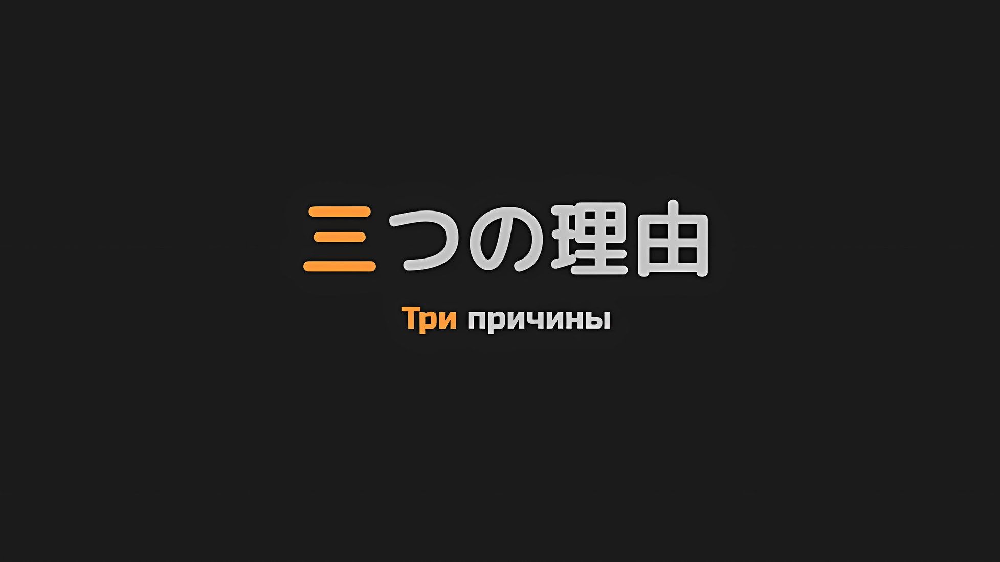

*※※※※※※※※※※※*

Выскочив из входа в отдельно стоящее здание, Субару встал перед мужчиной, который слабо улыбался.

Это окаменение было, пожалуй, самым глупым выбором, который он мог сделать перед лицом этого человека. Однако для Нацуки Субару, который пережил всевозможные трудности, даже «Смерть», снова и снова, неописуемая жуть этого человека заставляла его разум помутиться.

Чувство страха, которое не мог внушить даже Архиепископ Греха, и ощущение, что его заманили в ловушку.

Перед лицом Тодда Фанга Субару испытывал это чувство.

Субару: …

Вокруг Субару возникло недоумение, и он рефлекторно остановился, услышав голос.

Это была Беатрис, она держалась с ним за руки, стоя перед тем же противником, что и Субару. Кроме нее, Танза и Идра также бросали сомнительные взгляды на Субару, который стоял неподвижно.

Хотя в его голове пронеслась мысль, что он должен немедленно предупредить их, чтобы они были осторожны, но…,

Рем: …Катя-сан!

И, прежде чем Субару успел пошевелить дрожащими губами, Рем закричала высоким голосом.

Когда он посмотрел, бледно-голубые глаза Рем были обращены к Тодду у двери… Нет, они были направлены не на него, а прямо за ним.

Субару было трудно отвести взгляд от Тодда и переключить свое внимание в этом направлении, но как только он это сделал, он понял цель крика Рем.

За спиной Тодда пряталась девушка в инвалидной коляске.

Девушка взглянула на них, ухватившись за подол одежды Тодда, подозрительными глазами, которые обозревали мир из-под вьющихся каштановых волос; она идеально соответствовала чертам лица, которые описывала Рем.

Это само по себе было радостно… Нет, тот факт, что она была рядом с Тоддом, означал…,

Рем: Пожалуйста, держись от нее подальше…!

Луи: Ууу!

Рем, которая, похоже, пришла к тому же выводу, что и Субару, повысила свой голос и посмотрела на Тодда. Луи, которая всегда была рядом с ней, взбудоражившись ее боевым духом, тоже зарычала, глядя на него.

Несмотря на то, что Тодд потерял свою фирменную бандану и распустил оранжевые волосы, его жестокость и опасный творческий потенциал, вероятно, не уменьшились.

Даже в этой ситуации нетрудно было предположить, что он попытается использовать девушку… Катю, как щит, чтобы манипулировать Субару и остальными, заставляя их выполнять его приказы.

Конечно, из предыдущих враждебных столкновений Субару с Тоддом было очевидно, что уступки и выполнения приказаний в конечном итоге приведут к «Смерти».

Субару: …С этого момента и далее.

*Если мне суждено умереть, я не могу быть уверен в том, как далеко назад я вернусь.*

К счастью или к несчастью, в зависимости от того, как на это посмотреть, во время всей череды событий: вмешательства в осаду столицы Империи, прорыва через городские стены и въезда в город, Субару ни разу не потерял свою жизнь.

Независимо от того, нужно ли было благодарить за это или винить, Субару не знал отправной точки «Посмертного Возвращения».

Он смог встретиться с Луи и Беатрис, а также воссоединиться с Рем и Флопом.

Честно говоря, ситуация складывалась хорошо, даже слишком хорошо. Невозможно было подсчитать, сколько повторных попыток потребуется, чтобы снова достичь этой точки.

Однако…,

Субару: …Я сделаю то, что должен.

Если он решал, кого спасать, кому позволить выжить и с кем двигаться вперед, то Субару с непоколебимым сердцем твердо решил принять этот исход.

По этой причине он смог спасти всех гладиаторов, связанных с «Островом Гладиаторов», и сражаться бок о бок с ними в составе Эскадрона Плеяд до сегодняшнего дня. …Он никогда бы не сдался, несмотря ни на что.

Даже если бы препятствие, которое ему нужно было преодолеть для этой цели, было самим воплощением страха, который заставлял его сердце замирать.

Итак, Субару смочил языком свои пересохшие губы и решительным движением…,

Катя: П-пожалуйста, подождите! Вы все неправильно поняли! Меня не взяли в плен, Рем!

Рем: Катя-сан?

Катя: Недоразумение… Да, это недоразумение! Тодд вам не враг!

Катя попыталась двинуться вперед, вращая колеса своей инвалидной коляски, громко настаивая на том, что это было недоразумение и что Тодд не был их врагом. Однако Тодд положил руку на ее тонкое плечо, не давая ей двигаться вперед.

Катя, энергично подавшись вперед, посмотрела на Тодда слезящимися глазами,

Катя: Подожди, что ты делаешь! Ты подвергаешь себя опасности!

Тодд: Ты единственная, кто сейчас находится в опасности. Не двигайся вперед самостоятельно.

Катя: Д-для кого, по-твоему, я это говорю…!

Тодд: Конечно, это ради меня. Но это не значит, что я могу не замечать, как девушка, которую я люблю, подвергает себя опасности.

Катя: Ах…

Покрасневшая и с силой набросившаяся на него, Катя замолчала от этих слов.

Не от смущения или стыда, а главным образом потому, что его возражение говорило о том, что он беспокоится о ней.

Это было совершенно честное заявление с явным намерением ввести в заблуждение, во что Субару было трудно поверить.

Рем: Катя-сан, может ли быть, что этот человек…

Слегка вздохнув, Рем спросила об этом Катю с испуганным видом. Хотя она не совсем четко сформулировала вопрос, смысл его был ясен.

Было ли это признаком ее нерешительности и беспокойства, но Рем положила свою тонкую руку на плечо Луи. В ответ на ее вопрос, Катя кивнула головой, прикусив губу.

Катя: Я уже несколько раз говорила тебе об этом. …Он, знаешь ли, мой.

Рем: Твой жених.

Катя: Вот и все…

После своего первоначально нерешительного заявления Катя четко ответила на вопрос Рем.

Глаза Рем дрогнули, когда ей это сказали, и она явно была взволнована. Субару был потрясен до глубины души не меньше ее.

Субару: Жених…

От той встречи до последовавших за ней событий у Субару не осталось никаких хороших воспоминаний о Тодде, но помимо его безумно осторожного и неумолимого характера, история его «Невесты» произвела сильное впечатление.

Тодд, который служил имперским солдатом и разбил лагерь недалеко от леса, где находилось «Племя Судрак», часто говорил о своем желании вернуться к своей невесте.

Но после серии кровавых столкновений с Тоддом его ожидания относительно его человечности померкли, и это стало далеким воспоминанием, которое просто засело в уголке его сознания…

Субару: Так она действительно существовала…

И эти слова были настолько неуместны для Тодда и его очаровательной невесты, что ему пришлось проговориться.

Несмотря на то, что Рем, вероятно, даже не слышала монолога Субару, она посмотрела на Тодда с подозрением в своих строгих глазах,

Рем: Ты действительно жених Кати-сан?

Тодд: Да, это правда. Как я уже говорил, это нетрадиционная договоренность. Я никогда не думал, что Катя и ты так хорошо поладите во время вашего заключения во дворце премьер-министра.

Рем: …

Тодд: Не смотри на меня так. Конечно, я не говорю, что у нас была хорошая первая встреча или хорошие отношения, но такова ситуация, в которой мы оказались. Мы оба должны отбросить в сторону наши обиды, верно?

Пожав плечами на молчаливый взгляд Рем, Тодд нагло заговорил. Затем его взгляд обратился не к ней, а к Субару.

Затаив дыхание, Субару встретил взгляд Тодда. Холодный пот струился по его спине.

Однако…,

Тодд: Это именно то, что сказал этот парень, не так ли?

Субару: …Ах.

В поведении Тодда не было и намека на враждебность, когда он закрыл один глаз и подмигнул ему.

Оставаясь верным своим словам, Тодд отбросил свою враждебность, наряду с осторожностью, и протянул руку, как будто это было обязанностью человека, предлагающего сотрудничать друг с другом, чтобы выйти из этой ситуации.

Флоп: Мистер, Миссис, кто такой Солдат-кун?

При виде того, что Субару и Рем замолчали, мягкое лицо Флопа приняло серьезное выражение.

В ответ на его вопрос Субару не мог говорить небрежно, отчасти из-за своего нынешнего вида. Вместо этого Рем продолжила: «Этот человек»,

Рем: У меня уже было несколько встреч с ним раньше. И каждый раз моя жизнь подвергалась опасности.

Катя: Ха…

Глядя на Катю, Рем изо всех сил старалась подобрать правильные слова и при этом говорить правду. Услышав это, глаза Кати расширились, и она посмотрела на Тодда, который стоял рядом с ней.

Ее губы задрожали, когда она спросила своего жениха с его стороны.

Катя: Э-это правда? Тодд, ты тот, о ком мне рассказывала Рем…

Тодд: Если это насчет той юной леди, то это правда. Сказал же тебе, что есть обиды. Я солдат. Иногда мне приходится обращать на кого-то свое оружие. Таким образом, я думаю, это просто одна из нежелательных ситуаций.

Рем: «Нежелательных» звучит как-то эгоистично…

Тодд: Если это про то, что было в Городе-крепости, то это только потому, что я увидел в твоем спутнике угрозу. Если ты про то, что было до этого, то я просто выполнял приказ, как любой другой солдат. У меня нет ничего личного против вас.

Сказав это, Тодд взял топор, который носил на поясе. На мгновение Субару и остальных охватило напряжение, но он, держа одну руку вытянутой, отбросил свое оружие, не напрягаясь.

Топор прочертил параболическую дугу, скользнув по земле и оказавшись под ногами Субару и его команды.

Луи: Аау.

Луи подняла топор и попеременно смотрела то на лицо Субару, то на лицо Рем.

Это, по-видимому, не была бомба в форме топора, а скорее это было похоже на чистый акт разоружения.

Тодд поднял руки и помахал Субару и остальным, которые осознали этот факт.

Тодд: Как видите, я вам не враг. Для всех нас было бы прискорбно, если бы мы тратили время впустую, вот так пялясь друг на друга, верно?

Флоп: …Миссис, я тоже считаю, что нам следует конструктивно поговорить. Что ты об этом думаешь?

Рем: …

Сжав свою руку, Рем посмотрела в сторону Субару.

Только Субару и Рем могли разделить свою настороженность по отношению к Тодду и уровень угрозы, которую он представлял. Что касается их знакомых, то Луи тоже была там, когда Субару, Флоп и остальные подверглись нападению Тодда в Городе-крепости, но ни на одном из их лиц не отразилась опасность.

Поэтому…,

Беатрис: Бетти последует решению Субару, в самом деле.

Взявшись за руки с Субару, Беатрис дала ему только смелость сделать выбор, не оказывая на него никакого влияния.

Она была не единственная; и Танза, и Идра оставили будущее на выбор Субару. …Одного факта, что эти двое и Тодд оказались в одном месте, было достаточно, чтобы заставить его сердце замереть.

Если возможно, он хотел бы как можно скорее убрать присутствие Тодда подальше от них, но…,

Субару: …Катя-сан — подруга Рем. Я хочу, чтобы как можно больше из нас выбрались отсюда невредимыми. У нас нет времени на склоки здесь, вот что я думаю.

Рем: …Я, конечно, понимаю, но…

Субару повесил голову и прикусил губу, а Рем в досаде надула щеки.

Он не знал, какие действия предпримет Тодд, если ему отказать. Это было беспокойство, которое Рем тоже разделяла. Теперь, когда он был здесь, его нельзя было отпускать.

Это была та же причина, по которой нельзя оставлять бомбу без присмотра, не зная, когда она может взорваться.

Катя: Н-не волнуйтесь! Э-этот парень до безобразия живучий! Я уверена, что он будет полезен, чтобы помочь мне и всем вам спастись!

Тодд: Эй-эй, ты не должна сравнивать своего жениха с чем-то вроде жуков Зодда.

Видя беспокойство Субару и Рем, Катя неуклюже поддержала Тодда. Язвительно улыбнувшись ее защите, он провел рукой по своим волосам,

Тодд: Что ж, раз уж вы приняли меня, я должен отплатить вам тем же. Спасибо, мне тоже придется проявить себя перед Катей, которая так легкомысленно относилась ко мне.

С этими словами Тодд заговорил как надежный молодой человек, и, не обращая внимания на чувства Субару, у которого в душе возникло неизбежное напряжение, перехватившее ему горло, он присоединился к остальным.

*△▼△▼△▼△*

…Есть три причины, по которым Субару не мог отвергнуть присутствие Тодда Фанга в этой ситуации.

Первой было присутствие Кати, невесты Тодда.

За время, проведенное во дворце, у нее сложились дружеские отношения с Рем, и, несмотря на свой острый язык, она оказалась хорошим человеком, показав Субару и компании, что не является гнусной особой. Судя по всему, она не имела ни малейшего представления о том, кто такой Тодд в основе своего характера; но, какие бы обвинения ни выдвигали Субару и компания, еще неизвестно, кому она поверит — своему жениху или им.

Если так, то должен ли кто-то из-за неприязни к Тодду расставаться с Катей?

Ее инвалидное кресло ничем не уступало тому, что Субару изготовил для Рем. То, как она опиралась на него всем своим весом, выглядело таким жалким, что он не мог оставить ее позади.

Пока Катя и Тодд были близки до такой степени, что казались единым целым, было вполне логично, что они не могли отказать ему.

Вторая причина заключалась в том, что все действия Тодда в предыдущих попытках были отменены из-за «Посмертного Возвращения».

Благодаря своей безжалостной натуре и холодному рассудку, Тодд неоднократно загонял Субару в угол, лишая его жизни… И не только это, иногда он лишал жизни дорогих друзей Субару.

Так, Флоп, сопровождавший Субару, Танза, Идра и другие были однажды убиты Тоддом.

Сильные чувства ненависти и страха Субару к Тодду, вероятно, были вызваны тем, что тот лишил жизни его друзей прямо на его глазах больше, чем любой другой человек, с которым он когда-либо сталкивался в этом мире.

Однако, поскольку в результате «Посмертного Возвращения» эти события на самом деле не произошли, даже если бы Тодд обратил свое оружие против них, то он не нанес бы вреда сравнимого с прошлым.

Ни великий пожар в судракийском пуще, ни безжалостные нападения в Городе-крепости, ни резня гладиаторов на «Острове Гладиаторов» — ничего из этого не произошло. …Только то, что Тодд мог такое совершить.

И третья и последняя причина…,

Тодд: …Цельтесь от груди вверх! Все, что ниже талии, только выиграет вам немного времени!

Субару: Тц, Беатрис!

Беатрис: Поняла, в самом деле! Минья!

По указанию резкого голоса, Субару и Беатрис одновременно вытянули руки перед собой.

Перед их ладонями, подняв облако пыли, фиолетовые стрелы были выпущены в несколько бледнолицых врагов-зомби, сбив их с ног и заставив кристаллизоваться.

Однако некоторые из них избежали серьезных ранений…,

Субару: Извини, но даже если их туловище в таком состоянии…

Танза: Даже если голова цела, она будет просто раздроблена.

Зомби, которые не были сразу же выведены из строя, попадали под каблук падающей ноги Танзы. Их кристаллизованные туловища были разбиты, оставив их неспособными что-либо сделать после того, как их четыре конечности были отброшены.

Без начавшегося процесса регенерации, неповрежденная голова зомби, отлетевшая в сторону, потеряла свой цвет и рассыпалась, словно песок.

Однако он не хотел испытывать душевную боль при виде этого.

Тодд: Теперь нам следует устранить препятствия на задних улицах. Ваша магия необычайно хорошо действует на этих парней, спасибо вам. Сколько маны у вас в распоряжении?

Беатрис: …В самом деле, еще много. Я могу повторять это десять тысяч или сто тысяч раз, а может даже и больше.

Тодд: Это обнадеживает. Но не предпринимайте ничего слишком опрометчивого. Вы, ребята, — мой спасательный круг.

Похвала за успешное уничтожение группы зомби, преградивших им путь, оставила Субару и Беатрис в смешанных чувствах.

Односторонняя победа над зомби была разумным выбором. С другой стороны, было несколько неприятно, что именно Тодд похвалил их.

Оставив в стороне чувства Субару и остальных,

Тодд: У меня было много встреч с этими бледнолицыми парнями до того, как я воссоединился с Катей во дворце. Они, кажется, не находятся ни на чьей стороне, ни на стороне регулярной армии, ни на стороне повстанцев, и с ними невозможно начать общаться.

Флоп: О, правда? Но мы, похоже, смогли поговорить с теми, кого Мистер и остальные уничтожили во дворце.

Тодд: Способность говорить и способность общаться похожи, но это совсем не одно и то же, не так ли? Они не будут тебя слушать, и они не умрут, если ты размозжишь им головы или отрежешь их. С ними трудно иметь дело.

Танза: Солдаты, которые не умирают… именно так, как сказал нам спутник Шварца-сама.

После рассказа о грозных характеристиках зомби Флоп и Танза задумались.

Однако они учитывали мнение Тодда, и это был очень точный анализ, который Субару не мог проигнорировать.

Тодд: Подводя итог, можно сказать, что их нельзя победить честными средствами. Мечи, копья и прочее оружие — лишь временная мера. Лучший способ…

Флоп: Это Мистер и Платьице.

Танза: Магия.

Тодд: Я также поджарил некоторых из них до углей с помощью духа, который был у меня на попечении, и они больше не поднимались. Однако я не проверял, действует ли это как на обычный огонь, так и на магический.

Субару: …

Тодд: Ну, если вам интересно, то при ударе выше шеи им требуется больше времени для восстановления, чем при ударе в любую другую часть тела. Ноги регенерируют на удивление быстро, так что не надейтесь лишить их подвижности.

Даже Субару, который знал его истинную природу, был впечатлен готовностью Тодда давать такие советы.

Как только вопрос о принятии их в группу был решен, Тодд щедро поделился информацией о зомби, выдавая ее по ходу дела.

Естественно, он, как и Субару со своей группой, прошел через столицу Империи, где бродило множество зомби, чтобы присоединиться к Кате. Сделав это, Тодд, вероятно, имел эффективные стратегии против зомби и знания, которые помогли бы им спастись.

Эта перспектива была третьей причиной, по которой Субару приветствовал Тодда.

Субару: Тем не менее, я и понятия не имел, как далеко это зайдет…

Вспышка зомби произошла вскоре после того, как Субару и его группа перебрались через городские стены.

На мгновение Субару подумал, что именно они могли спровоцировать вспышку зомби, но они решили растоптать эту мысль и двигаться дальше, поскольку это был страх, на который нельзя было ответить.

Как бы то ни было, от вспышки зомби до настоящего времени, даже несмотря на то, что время для расследования должно было быть примерно одинаковым как для группы Субару, так и для Тодда, глубина информации, собранной им для выживания, была невероятно велика.

Именно это его отношение, не только к зомби, но и ко всему, кому угодно и где угодно, способствовало необычайной решительности и способности Тодда доводить дело до конца.

Рем: Катя-сан, ты в порядке?

Катя: Д-да, если не считать того, что меня немного потрясли все эти незнакомые люди… А ты как, в порядке?

Рем: Я гораздо больше боюсь таких, как Присцилла-сама и Мэделин-сан, против них у меня нет никаких шансов.

Катя: У таких людей отвратительный характер…

Рем и Катя медленно отставали от Субару и его боевой группы, пытаясь пробиться вперед. Она толкала ее инвалидное кресло, а Луи сопровождала беззащитных девушек, пока они беспокойно оглядывались по сторонам.

Из-за плохой дороги и выбора маршрута, чтобы обойти группу зомби, в сочетании со скоростью фальшивых Наследных Принцев, возглавляемых Идрой и лошадью Галевинд, их скорость передвижения была не быстрой.

Тем не менее, они неуклонно приближались к крепостным стенам столицы Империи.

Флоп: Мистер, почему у тебя такое вытянутое лицо? Ты все еще беспокоишься о Солдате-куне?

Субару: Флоп-сан…

Сложное выражение лица Субару, которое было одновременно и счастливым, и горьким, было замечено Флопом, который все еще внимательно наблюдал за окружающей обстановкой.

Будучи проницательным человеком, Флоп мог видеть, что Субару опасается Тодда больше, чем нужно… по крайней мере, больше, чем было необходимо при том объеме информации, которым он располагал на данный момент.

Конечно, он не мог раскрыть тот факт, что Флоп был убит раньше, потому что это противоречило бы правилам «Посмертного Возвращения».

Субару: Флоп-сан, как я уже говорил…

Флоп: Обратить свое внимание на то, что задумал Солдат-кун, верно? Я помню это, и поэтому мисс Танза находится возле него как можно больше, как ты и просил.

Субару: …

Флоп: Хотя ты и стал меньше ростом, а твое лицо моложе, твой образ мыслей стал более зрелым и осторожным, Мистер. Ты всегда делаешь все возможное, чтобы не волноваться, и это является достоинством. Но знаешь, предложение переодеться, чтобы завоевать Город-крепость, мне нравится эта твоя сторона.

Увидев мягкую и нежную улыбку Флопа, Субару смутился, а затем криво улыбнулся.

Даже без его нынешней внешности, по сравнению с первоначальным телом, Субару осознал, насколько Флоп хорош в роли старшего брата. Неудивительно, что Медиум так его уважала.

Беатрис: …Кх, Субару, посмотри вниз на наши ноги, я полагаю.

Субару: Наши ноги… хах, уаах.

Когда разговор подошел к концу, Беатрис повела Субару за руку, и у их ног… Намочив подошвы своих ботинок, они увидели воду, текущую по наклонной земле.

За Кристальным Дворцом было прорвано вместительное водохранилище, и объем воды, поступающей в город, начал серьезно возрастать. Врагом были не только имперские солдаты и зомби, но и вода.

Если они будут слишком долго отступать, то в конце концов их поглотит поднимающаяся вода…

Тодд: Если мы не уберемся отсюда до того, как это произойдет, для всех нас все будет кончено.

Тодд, который подошел к ним, ясно выразил ощущение кризиса, которое испытывал Субару.

Субару слегка напрягся, и независимо от того, понял ли он его тревогу, Тодд направил острие своего возвращенного топора в сторону Кристального Дворца.

Тодд: Похоже, что у Генерала Первого Класса Могуро нет ни единого шанса против «Облачного Дракона». Это лишь вопрос времени, когда он проиграет. Было бы лучше, если бы он был один на один, но два на одного — это смертельно… После того, как Генерал Первого Класса будет побежден, как будет действовать враг?

Субару: Как они будут действовать, у тебя есть идеи?

Тодд: Независимо от «Облачного Дракона», всадник летающего дракона, сотрудничающий с ним, выглядит как труп. До сих пор все трупы нападали, как только видели нас. Другими словами…

Субару: Зомби пытаются убить живых.

Тодд: Это напрягает, но так оно и есть.

Тодд наклонил голову в раздумье, и Субару понял, что он хотел сказать.

Целью зомби было уничтожить всех до единого живых людей, которые попадались им на пути. По этой причине, если бы существовал способ убить много людей, неудивительно, что они выбрали бы его.

Каменный гигант сражался с белым Драконом прямо перед дворцом, и, если бы он проиграл, зомби полностью разрушили бы стены водохранилища, вызвав беспрерывное наводнение.

Если бы это произошло, то группа Субару и жители столицы Империи, а также солдаты регулярной армии и армии повстанцев, которые сражались снаружи, были бы сметены.

Тодд: Это раздражает. Но мне нравится, как ты называешь их зомби. Нам нужно было какое-то название для них. Так что с этого момента давайте называть их просто зомби.

Беатрис: Что ты думаешь об этих зомби, в самом деле?

Внезапно Беатрис, которая до этого молчала, задала этот вопрос Тодду.

Тодд, который несколько раз пробормотал слово «зомби», чтобы ознакомиться с ним, сделал озадаченное лицо в ответ на вопрос Беатрис,

Тодд: Что я думаю?

Беатрис: До сих пор большинство зомби, с которыми мы сталкивались, были имперскими солдатами, как и ты, я полагаю. Я могу сказать это по их внешнему виду, в самом деле. Как ты относишься к убийству своих собственных союзников…

Тодд: Во-первых, они не мои союзники. Они просто носят такую же одежду. Если они мертвы, то они не солдаты или что-то в этом роде. Их не нужно признавать ничем, кроме как проблемными препятствиями.

Беатрис: …

Тодд: Говоря о том, чьи они пешки и каковы их цели, я не думаю, что сейчас это важно для выживания. Об этом должны думать и решать большие шишки.

Он дал сдержанный ответ, и Беатрис молча согласилась закончить разговор.

Тодд пожал плечами на ее отношение и снова посмотрел на Субару,

Тодд: У тебя есть надежный партнер, но для тебя будет лучше обсудить это с ней, если ты чувствуешь себя измотанным. Вопреки ожиданиям, даже просто выплеснуть то, что у тебя на душе, может принести пользу.

Субару: …Я буду иметь это в виду.

В ответ на мрачный ответ Субару, Тодд оставил его со словами «Сделай это» и продолжил путь.

Действуя в качестве разведчика на предстоящем пути, Тодд обнаруживал позиции зомби и составлял план, как отогнать их назад, который Субару и его команда затем рассматривали и реализовывали, чтобы обезопасить свой путь отступления. В настоящее время все шло довольно хорошо.

Однако…,

Беатрис: Субару, если ты устал, ты можешь поговорить с Бетти о чем угодно, я полагаю.

Когда Беатрис посмотрела на лицо Субару, он выглядел измотанным.

Отчасти это было связано с тем, что он продолжал проявлять бдительность по отношению к Тодду, а также потому, что магия Беатрис использовала его ману.

Но самым большим психологическим бременем было уничтожение зомби.

Было больно уничтожать зомби, которые могли говорить и обладали чем-то близким к той воле, которая была у них при жизни.

Насколько было бы лучше, если бы, подобно Тодду, он мог просто отмахнуться от них как от пугал, преграждающих путь.

Флоп: Впрочем, я думаю, что это тоже одно из достоинств Мистера.

Субару: …Я не знаю. Рем опять надерет мне задницу за нерешительность.

Флоп: Миссис так бы не поступила.

Субару: …

Флоп: Я не думаю, что она так поступит.

Странно, но повторенные слова Флопа были убедительными.

Флоп выжил в этой безжалостной Империи ни с помощью физической силы, ни с помощью магии, а только благодаря словам. Возможно, единственным величайшим оружием, которым он обладал, была его человечность.

Субару: Благодаря Флопу-сан, я чувствую себя немного лучше!

Флоп: Слава богу! Я бесполезен, так что, если бы Мистер впал в депрессию, я бы не смог найти способ спасти его! Упс, но…

Субару: Но?

Флоп: Благодаря мне, я думаю, что, возможно, чувства Платьице были немного задеты.

Когда Флоп указал на это, Субару обернулся и сказал: «А?». Там стояла Беатрис, держась за руки с ним и глядя на него своими милыми, круглыми глазами.

Щеки Субару напряглись от ее реакции, а щеки Беатрис вспыхнули,

Беатрис: Пренебрегаешь Бетти, когда она беспокоится о тебе, повезло тебе, в самом деле. Интересно, сколь быстро Субару подружится с очередным красавчиком и снова проявит неуважение к Бетти, я полагаю.

Субару: Какая невероятная дезинформация! Нет, я вовсе не игнорирую тебя, ясно? Во-первых, такие парни, как Флоп-сан и Сеси — исключения, Идра и Вайц — нюансы, хотя и лишены красивой внешности… Однако Хиайн весьма обаятелен.

Беатрис: Не нужно оправдываться, в самом деле!

Она внезапно отвернула от него лицо, и Субару застонал от боли, как будто ему жестоко вспороли грудь.

Беатрис тоже волновалась за него. И хотя Флоп сформулировал свои слова более умело, в глубине души он чувствовал сожаление по отношению к ней.

Несмотря ни на что, после побега из этого места он должен был полностью посвятить себя тому, чтобы загладить вину перед Беатрис.

Субару: Сейчас все, что я могу сделать, это искренне гладить тебя своей рукой…

Рем: …Что, по-твоему, ты делаешь в такой ситуации?

Субару: Ва!

Субару был удивлен, когда кто-то окликнул его сзади. Рем, окинув его сомнительным взглядом, все еще держала Луи, цепляющуюся за ее талию, когда она настороженно огляделась по сторонам и сказала,

Рем: Даже если ты принял такую форму, твоя личность точно не изменилась.

Субару: О? Значит ли это, что ты достаточно хорошо знаешь мою природу, чтобы понять, кто я такой?

Рем: Поправка. Теперь, когда твое тело уменьшилось, твоя сдержанность стала несуществующей по сравнению с тем, что было раньше.

Субару: Это та часть, над которой я бы действительно хотел, чтобы ты посмеялась и пропустила мимо ушей, свалив все на дикую природу ребенка.

Даже резкое мнение Рем было приятным стимулом для Субару после того, как он был разлучен с ней некоторое время.

Подсознательно Субару подтянул лицо и выглядел счастливым, стараясь не выдать своего беспокойства Рем.

В дополнение к этому, говоря о ком-то, кого он не хотел беспокоить,

Катя: Эй, Тодд тебя не беспокоит? Приносит ли он надлежащую пользу?

Субару: …

Нерешительно спросила Катя, которую Рем катала в инвалидном кресле.

По сравнению с фальшивыми Наследными Принцами, которые были освобождены из заключения и самостоятельно следовали за Субару и его группой, когда те отступали, Катя испытывала сильное чувство беспомощности из-за невозможности передвигаться самостоятельно.

Казалось, она ужасно беспокоилась не только о себе, но и о Тодде, и было ясно, что она испытывала застенчивую привязанность к своему жениху.

Видя искреннее беспокойство Кати, Субару повернулся в сторону конца переулка, куда направлялся Тодд,

Субару: Да, он полезен. У него хороший нюх и хорошее зрение. Его точные указания очень помогли нам избежать неприятностей.

Катя: Я-я понимаю. Тогда это хорошо…

Катя, опустив глаза, с облегчением похлопала себя по груди.

Как бы ни было обидно, но это были не бездумные слова, сказанные только для того, чтобы успокоить Катю, а справедливая оценка работы Тодда на тот момент.

На самом деле, как солдат, Тодд работал безупречно. Его разведка и выбор маршрута в значительной степени способствовали их выживанию в этой ситуации, когда им пришлось спасаться бегством, даже с учетом того, что пришлось перемещать большое количество людей.

У Тодда не было эффективного способа поразить зомби, но он был выдающимся в том, что подставлял их под атаки Субару и Беатрис, которые действительно обладали эффективными навыками. …За исключением того, что Субару страдал от морального износа из-за большего количества потерь, чем нужно, в присутствии Тодда не было никаких недостатков.

Субару: …

…Нет, Рем, чье взаимодействие с Катей казалось сложным, также испытывала такое же умственное напряжение из-за присутствия Тодда, как и Субару.

Субару: Такими темпами…

Смогут ли они все вместе выбраться из столицы Империи без происшествий?

Пока Субару пытался ответить на безответные вопросы о том, как он хотел бы, чтобы все происходило…,

Тодд: …Катя, я же говорил тебе держаться подальше, не так ли? Не догоняй нас.

Тодд, который был в разведке, вернулся и нашел Катю с Субару и остальными, и предупредил свою невесту.

При словах Тодда на лице Кати появилось выражение облегчения за его безопасность, затем оно быстро перешло в выражение несогласия с этими словами, а затем ее выражение снова изменилось.

Казалось, она была немного обеспокоена появлением Тодда.

Катя: Тодд, что-то случилось?

Тодд: …Боже, только в такие моменты твои инстинкты тебя и не подводят, женщина.

Сказав это, Тодд провел рукой по своим волосам без банданы и начал рассказывать о том, что он увидел, посмотрев в сторону Субару и остальных.

Этим было…,

Тодд: …Впереди отсюда стоит довольно крепкий на вид зомби. Член Племени Циклопов, он, вероятно, был тем, кто больше всех выделялся в сегодняшней битве.

И он заговорил.
