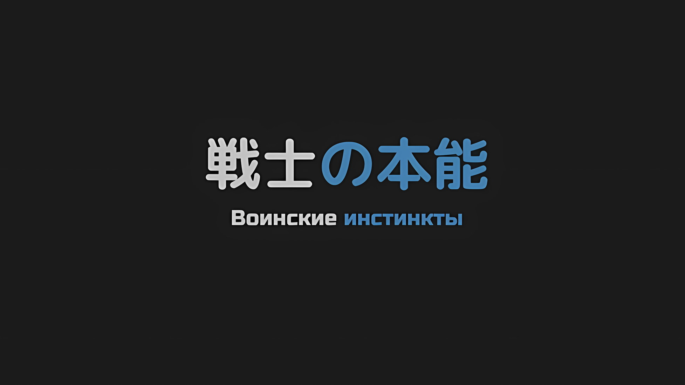

*※※※※※※※※※※※*

…«Гигантский Глаз» Измаил, был доблестным воином и надеждой Племени Циклопов.

В центре его мужественного лица большой голубой глаз четко и без колебаний устремил свой взгляд в будущее. …Нет, однажды он уже устремлял свой взгляд.

Теперь же единственный глаз Измаила был похож на золотую луну, появившуюся в безлунную ночь; это было проявление дурного предзнаменования.

Измаил: …

Чтобы принести славу и престиж своему племени, Измаил решительно бросил вызов в битве за столицу Империи и ступил на поле боя как мятежник, желающий захватить голову Императора Винсента Волакии. Верный своей репутации, он быстро прорвал оборону регулярной армии и достиг городских стен.

Однако на этом продвижение Измаила закончилось.

Разверзшийся адский огонь основательно испепелил Измаила и всех воинов Племени Циклопов, которые последовали за ним. Несмотря на то, что ему удалось выжить, побывав на грани между жизнью и смертью, в итоге он нашел свою погибель на острие ножа убийцы, лишенного эмоций.

Действительно, он потерял свою жизнь. …Так и должно было быть.

Измаил: …

Его тело, разорванное в клочья артиллерийским огнем, несомненно, должно было умереть.

Тем не менее, тело Измаила, ужасно обожженное и разорванное на части, отрастило новые конечности, и, неся на плече свой боевой топор, он ступал по столице Империи, опустошенной войной.

Двигая своим холодным, безжизненным телом, он не испытывал ничего, кроме бурлящих эмоций отвращения и ненависти…

Измаил: …Где же ты, проклятое омерзительное чудовище?

*△▼△▼△▼△*

Тодд: До сих пор мы сталкивались только с мелкими сошками и не встречали никого уровнем бывшего «Генерала», но противник перед нами будет более чем подходящим для этого. Как таковой, он доставляет довольно много хлопот.

Субару: Когда ты говоришь «Генерал»…

Тодд: Бывают исключительные личности, которых оценивают за их военную тактику и стратегическую проницательность, но в большинстве случаев важно их собственное мастерство. Этот парень один из таких… он не сравним с Генералом Первого Класса, но у него определенно есть потенциал стать Генералом Второго Класса.

Субару: …

Тодд: Если бы мы сравнивали по простым способностям, он, вероятно, мог бы убить всех нас в одиночку.

С невозмутимым видом Тодд завершил свой безнадежный доклад их уничтожением.

Тем самым он указал, насколько смертельно опасным для группы был грозный зомби, который их поджидал, и что дурацкая удача, которая защищала их до сих пор, иссякла.

Катя: Н-но, ты же хитрый парень, ты можешь что-нибудь придумать, верно? Ты ведь до сих пор так хорошо справлялся, с помощью этих детей.

Сказала Катя, повысив голос, в то время как ее глаза не отрывались от Тодда.

Детьми, о которых она говорила, были Субару и Беатрис, которые магически кристаллизовали зомби, и Танза, которая уничтожала врагов, проскользнувших мимо.

К счастью, до сих пор Луи не приходилось вступать в бой, чтобы защитить Рем и остальных последователей, а два главных нападающих, вместе со здравым смыслом Тодда, проложили путь к успеху команды.

Однако…,

Тодд: При определенном равенстве сторон, грубая сила может быть эффективной. Однако при столкновении с противником, имеющим значительный разрыв в силе, она становится бессмысленной. Независимо от того, насколько сильно дует ветер, он не может разрушить замок.

Катя: Ух…

Флоп: Итак, ты думаешь, что будет трудно пойти по этому пути, Солдат-кун?

Тодд: Да. …Я бы так сказал, но мы не можем так легко изменить наш путь.

Он кивнул на середине фразы Флопа, а после покачал головой. Затем он повернулся к тому пути, с которого они пришли, — к Кристальному Дворцу.

Тодд: Более того, та сторона закончила свою битву. Вода скоро прибудет.

Когда Тодд без эмоций отметил это, вдалеке раздался рев.

Посмотрев в том же направлении, они увидели огромную человекоподобную фигуру, которая столкнулась с Драконом возле Кристального Дворца; оба ее колена были разрушены, а обмякшее тело упало на землю, прорвав периметр дворца.

За густым шлейфом дыма белый Дракон, победивший колоссального бога, издал боевой клич.

Учитывая эту сцену, ни одно существо, включая зомби, не смогло бы понять, что звук, раздавшийся громким эхом, был боевым кличем.

Тодд: Если наша предыдущая догадка верна…

Субару: Я не знаю, успеем ли мы вернуться назад тем же путем, которым пришли, и найти другой маршрут.

Беатрис: Я полагаю.

Это был вывод, который мог загонять их все дальше и дальше в угол, но, когда они изложили словами ход событий, в котором у них не было иного выбора, Беатрис, объединившаяся с Субару, также подтвердила его мысль.

Тодд в ответ откинул подбородок, а Танза скромно подняла руку: «Ну что ж», — сказала она.

Танза: Тогда ситуация зашла в тупик, верно? Перед нами сильный враг, но даже если бы мы вернулись назад, время не позволило бы нам это сделать.

Флоп: Ха-ха, мисс Танза, это очень пугающий вывод. И вправду, если мы будем рассматривать только ту информацию, которую нам сообщили, то это действительно похоже на тупик, что очень тревожно, но я уверен, что есть и другие ходы, которые мы можем предпринять!

Танза: Например, что?

Флоп: Впрочем, не мне это знать! Я уверен, что здесь есть кто-то, кто может что-нибудь придумать, верно?

В ответ на заявление Флопа, Танза, которой было трудно сдерживать свои эмоции, нахмурила свои круглые брови и отвела взгляд.

В таких ситуациях, как эта, Субару был счастлив и благодарен за то, что люди думали о нем, когда речь заходила о ком-то, на кого они могли бы положиться. Давление тоже присутствовало, но это также заставляло его чувствовать, что он должен оправдать их ожидания.

Более того…,

Рем: Ты можешь как-то справиться с этим?

Действительно, Танза была не единственной, кто возлагал большие надежды на Субару.

Субару: …

Рем, которая толкала инвалидное кресло Кати, вцепившись в ручку до такой степени, что ее пальцы побелели, задала ему этот вопрос с дрожащими бледно-голубыми глазами.

По сравнению с полным доверием, которое Катя, находившаяся прямо перед ней, питала к Тодду, это было нечто столь хрупкое, как замок из песка или тонкий лед.

Несмотря на это, сердце Субару было взволновано.

Проявив бдительность по отношению к Тодду, который сопровождал их, Субару смог вернуть свое внимание к текущей задаче и использовать свой разум на полную катушку.

Тодд: Если мы быстро не решим, идти нам или возвращаться, то мы не успеем вовремя.

Пока Субару проводил мозговой штурм, Тодд добавил требования, как бы напоминая ему.

*Если мы идем, все, что нам нужно, — это сила. Если мы возвращаемся, все, что нам нужно, — это удача и время. …Если предположить, что я вернусь через «Посмертное Возвращение», то у последнего шансов на успех будет больше.*

Субару: Нет, я не могу сказать это наверняка.

*Если я буду повторять «Посмертное Возвращение» и устраню неправильные маршруты, мы, возможно, в конечном итоге достигнем другого выхода кратчайшим путем, если предположить, что есть цель.*

*Если мы не успеем вовремя, какой бы маршрут мы ни избрали, мы не сможем выбрать последний вариант.*

*С другой стороны, если мы выберем вариант борьбы…,*

Субару: Сможем ли мы сразиться с сильным врагом…

Среди группы, бежавшей с ним, только Беатрис с Субару, Луи, Танза и Тодд могли считаться обладателями приличной боевой силы, а Идра был запасным вариантом.

Из них Субару был чем-то вроде бонуса для Беатрис, и он хотел доверить Идре сопровождение небоевых людей, таких как Рем и Катя, Флоп и фальшивые Наследные Принцы.

*По сути, есть четыре человека, которые могут выступить в роли бойцов — Беатрис, Луи, Танза и Тодд… Великолепно, единственные люди, которым я могу доверять, это маленькие девочки, и у меня нет времени смеяться над этим.*

Это было то, о чем Субару только что думал.

Субару: …

Субару поднял голову, в задумчивости подперев рукой подбородок, и его глаза встретились со взглядом Тодда, который в тот же момент случайно посмотрел в его сторону.

В тот же миг в голове Субару сверкнула молния, и это наэлектризовывающее ощущение было очень надежным и горьким.

Причиной было…,

Субару и Тодд: …Давайте победим этого зомби.

…Потому что Субару остро осознавал в своей душе, что они оба одновременно пришли к обоюдному выводу, и что для его осуществления потребуется сочетание силы и мудрости.

*△▼△▼△▼△*

…Измаил обернулся в тот момент, когда услышал громкий шум, не похожий на другие в его окружении.

Измаил: …

Его старое, обожженное тело сменилось совершенно новым, потрескавшимся. Измаил, герой Племени Циклопов, принял широкую стойку и наклонился, чтобы одним глазом уловить приближение большой тени.

Когда Измаил стоял на улице, над его головой параболически пролетел, словно в шутку, один из домов, составляющих имперский город, который был вырван с улицы целиком.

Его с силой оторвали от земли и бросили, разбросав повсюду куски, как крошки от буханки хлеба. На самом деле это было не так уж и мило, и большинство людей наверняка были бы раздавлены насмерть.

Но все же…,

Измаил: …Как медленно!

«Гигантский Глаз» Измаил, был вне пределов возможностей большинства людей.

Летающий дом летел по траектории, чтобы приземлиться в центре улицы, оставляя только перед и позади себя пути отхода, когда левая и правая стороны были плотно заблокированы.

Но то, что они целенаправленно предусмотрели путь к отступлению, означает, что ему придется сыграть им на руку.

Поэтому Измаил не стал бежать ни вперед, ни назад, а вместо этого поднял свой боевой топор.

Это был огромный топор, который было бы трудно поднять даже двум сильным воинам, но Измаил легко маневрировал им и мог с легкостью разрубить любое препятствие.

В этот раз та же участь постигла брошенный дом.

В момент удара лезвие топора вонзилось прямо снизу вверх, вошло в передний край и рассекло большой дом на две вертикальные части с такой силой, как будто разрезало крупного мужчину по всей длине от паха.

Разрубленный дом больше не мог выполнять свою роль жилища: мебель, посуда и одежда, оставленные домовладельцами, разлетелись по улицам, не причинив никакого вреда физическому телу Измаила.

Однако…,

Измаил: …Кх.

Сразу же после того, как Измаил сделал эффектное движение, камень прилетел прямо ему в лицо.

Конечно, это не сработало бы против Племени Циклопов, чье зрение не имело себе равных по сравнению с другими расами. Наклонив голову, Измаил увернулся от летящего снаряда и нырнул в клубящуюся пыль, оставшуюся от дома, прищурив свой глаз.

«Враг» находился в том же направлении, откуда были брошены и дом, и камень.

…Техника зрачков Племени Циклопов позволила Измаилу переключить взгляд на мир.

Глаз Измаила, который был способен использовать цвет для передачи эмоций цели, увидел множество красных мерцаний, исходящих из направления брошенной атаки. …Цвет воли к борьбе.

Это само по себе было желанным, и все тело Измаила наполнилось силой.

Во время осады имперского города, в битве с разбойниками или любой другой расой, не было ничего более унизительного, чем сражаться с теми, кто не носил цвета воина.

Воин против воина, боец против бойца, только в таких битвах есть ценность в состязании мастерства.

Источник враждебности, обуревавшей якобы мертвое тело Измаила, был велик по отношению к тем, кто осквернил честь столь универсальных боевых искусств.

Измаил: Это бой…

Ступив на усыпанные грязью улицы, тело Измаила двинулось навстречу врагу.

Те же каменные снаряды, что были брошены раньше, пытались перехватить его, а следующий массивный снаряд — дом — последовал по параболической траектории; он не считал, что это была тактика труса или слабого человека.

Только то, что это была прекрасная тактика, которую он уважал и которую нужно было разрушить.

Измаил: Смерть воина должна наступить от рук воина.

Скорость и точность летящих камней были довольно высоки. И хотя он отвечал минимальным количеством уклонений и парирований своим поднятым боевым топором, если бы он получил должный удар, его кости были бы неизбежно раздроблены.

Излишне говорить, что массивный дом, подброшенный в воздух, был снарядом такой силы, что немедленно бы вывел свою цель из строя.

Однако…,

Измаил: Не думайте, что это ваше исключительное право отправлять что-то в полет!

Воющий Измаил взмахнул своим боевым топором, отбив второй дом-пушечное ядро, и вогнал острие своего оружия в улицу с такой силой, что разорвал землю столицы Империи.

Продолжая вспарывать землю, Измаил взмахнул своей длинной ногой и нанес удар, который разнес ее вперед, как картечь. Естественно, он не ожидал, что это будет эффективный удар по врагу на другой стороне улицы.

Измаил: Это просто отвлекающий маневр, но…

В отличие от Племени Циклопов, другие расы, не обладающие особыми глазами, не смогли бы видеть сквозь завесу пыли, которая танцевала вокруг них.

Измаил спрятался в пыли и осколках уличного мусора, что значительно снизило его шансы попасть под брошенные в него камни, и получил передышку, чтобы продвинуться дальше.

Измаил: Большой мужчина и маленькая девочка…

Когда Измаил заглянул сквозь дымовую завесу, он отчетливо увидел другую сторону и разглядел, что там были мужчина и девочка.

Мужчина взял на себя роль сдерживать Измаила с помощью камней, а маленькая девочка рядом с ним вырывала из земли целые дома и бросала их в воздух как массивные снаряды.

Это были хорошо скоординированные усилия, но в то же время, что приводило в замешательство, так это неопытность, с которой они действовали.

Измаил, отточивший свое мастерство на поле боя, все понял.

Ни один из этих двоих, перешедших в наступление, не был настоящим воином. Тем не менее, они каким-то образом развили в себе воинский дух, который Измаил, ставший объектом нападения, действительно уважал.

Иногда поле боя может в одно мгновение превратить не-воина в воина.

То же самое произошло с тем мужчиной и девочкой.

Измаил: Великолепно.

Выражая похвалу, оказывая им уважение, он должен был убить их, несмотря ни на что.

С абсолютным совершенством, без каких-либо колебаний, без малейших ошибок, он должен тщательно уничтожить их. Искореняя все до последней частицы их жизни, он должен высосать из них само существование.

Он должен разорвать их на части, оторвать им головы и выпить кровь из их выпотрошенных сердец…

Измаил: …

Он чувствовал, как в его собственном сознании разгорается яростная жажда смерти, крови и человеческих жизней.

В то же время, когда Измаил разорвал третий дом-пушечное ядро, раздался пронзительный звук разбитого оконного стекла, и он увидел в нем свое отражение.

Измаил улыбался.

Уголки его рта искривились, словно аплодируя злобному жару, струившемуся по его холодному телу, в котором не циркулировала настоящая кровь. Это была отвратительная улыбка, от которой не пахло ничем, кроме крови, и которая ни разу не появлялась на его лице, когда он был еще жив.

Измаил: Хаха, хахаха, ХАХАХАХАХА!

Вместо того чтобы почувствовать отвращение к этой улыбке, внутри него вскипело неистовое возбуждение, которое вырвалось со звуком смеха.

Смеясь и продолжая ухмыляться, он удачно отбил один из камней, летевших в его сторону. Бросившись к следующему дому-пушечному ядру, он разрубил его своим боевым топором, совершая самоубийственную атаку.

Они продолжали швырять в него чем попало, отступая назад, и он подскочил к двум воинам. …Нет, он прыгнул к своей добыче.

Взмахнув своим боевым топором в сторону пятого здания, которое, казалось, было их последним сопротивлением, Измаил попытался благословить аплодисменты своей кипящей «крови» настоящей кровью, и…,

???: …Как и ожидалось, наличие только одного глазного яблока очень ограничивает твое зрение, не так ли?

Измаил: …

Дом летел по параболической дуге, и, снеся его входную дверь своим топором, он хотел распространить эту разрушительную силу, заставив все изгибающиеся строительные материалы лопнуть, как мыльный пузырь.

Но не успел Измаил это сделать, как чей-то смешок ударил по его барабанным перепонкам.

*…Нет, нет, нет, нет, нет, ни в коем случае.*

Этот смешок не был «Чьим-то».

Для Измаила этот голос был в высшей степени отвратителен, он был символом недоброжелательства, объектом презрения.

Измаил: ТЫ…!!!

Его боевой дух, поднятый накануне, исчез, а во всем теле Измаила поселилась ледяная жажда крови.

Перед расширенным, черно-пятнистым, золотым глазом Измаила предстал оранжевоволосый имперский солдат, лежащий плашмя на полу разрушенного дома…

…Несомненно, он был заклятым врагом Измаила, который стал причиной его смерти.

Измаил: …РААААААААААААААА!

В тот же миг, изогнув свое тело в порыве ярости, боевой топор Измаила изменил свою траекторию.

Из вертикального удара топора, который мог бы расколоть дом прямо пополам, он мгновенно перешел в наклонную траекторию и уже собирался обрушиться на лежащего имперского солдата…,

Измаил: …Ох.

Не успел он направить всю свою мощь на своего заклятого врага, как имперский солдат внезапно исчез из поля зрения Измаила, вскочив на ноги под влиянием своего собственного боевого клича.

Это не было чем-то из этого измерения, вроде движения с огромной скоростью.

Он исчез в буквальном смысле слова.

Измаил: …

В следующее мгновение мысли Измаила полностью окрасились в черно-белые тона.

Ненависть, вспыхнувшая к его заклятому врагу, потеряла свое направление, и в его сознании воцарилась пустота, вызванная столь странным явлением. Но незадолго до этого момента «Гигантский Глаз» Измаил уловил несоответствие.

Он увидел девочку с длинными золотистыми волосами, вцепившуюся в кожаный ремень отвратительного тела его распростертого заклятого врага.

Измаил: …

Причина и намерение были неясны; впрочем, он не считал, что эта информация не имеет отношения к делу.

Несмотря на то, что время контакта было коротким, имперский солдат ни за что не стал бы бездумно таскать ненужные вещи; таково было негативное доверие, которое отвлекло мысли Измаила.

Вслед за этим…,

Измаил: …Гах!!?

Пронзительный удар рассек левое плечо Измаила, и он издал крик боли.

Внутри дома, где разрушения были прерваны, то, что пробило стены и поразило Измаила, независимо от того, было ли это точно нацелено или просто являлось удачным выстрелом, было камнем, выпущенным с большой скоростью.

Он думал, что при таком ударе его кости сломаются, и в соответствии с этим убеждением, эта сила заставила бы его левое плечо яростно разорваться, в результате чего тело Измаила начало бы кричать… Но этого не произошло.

Тело Измаила потеряло цвет крови, а на коже в нескольких местах образовались трещины. Когда камень врезался в него, раздался ужасающе короткий звук, и он разлетелся вдребезги.

Как будто сам Измаил был таким же, как оконные стекла разрушенных домов.

Измаил: …

На мгновение, когда его левая рука разлетелась вдребезги, мысли Измаила остановились.

Однако, хотя он и был удивлен, отсутствие ожидаемой боли не позволило его мыслям разлететься на куски. Следовательно, он мог чувствовать себя непринужденно, не упуская из виду следующее изменение.

Измаил: Моя рука…

Его рука, сломанная в плече и упавшая на пол наклоненного дома, восстановилась благодаря необъяснимым движениям, как будто время повернулось вспять, все трещины заполнились, а раздробленные фрагменты вернулись.

Менее чем через две секунды все стало так, как будто повреждений вообще никогда не происходило.

Измаил: Ха…!!!

Измаил быстро переложил боевой топор из правой руки в свежеотремонтированную левую, и, намереваясь проверить ее на ощупь, он нанес удар своим оружием, на этот раз по полуразрушенному дому-пушечному ядру.

Разрушив здание, построенное из камня и дерева, Измаил купался в обломках, когда прорывался наружу… Затем он протянул правую руку навстречу приближающемуся чувству враждебности.

Широко раскрытой правой рукой он поймал летящий камень размером с кулак.

Если бы он не избежал удара, то кости его правой руки, очевидно, были бы болезненно разрушены. Но тело Измаила разрушилось не так, как разрушается человеческое тело, а как неорганическая материя.

Затем он был восстановлен до своего первоначального состояния с более высокой способностью к регенерации, чем способность человеческого тела к восстановлению.

Измаил: Это, это истинная природа этого тела…!

Неосознанно отвлекаясь от неестественной ситуации, в которую он попал, Измаил двигался со жгучей ненавистью.

Подаренное ему в результате непонятного воскрешения, это отталкивающее тело отдалило Измаила от понятий крови, боли и даже от того, что было необходимо для жизни, — самого понятия «Смерти».

В таком случае…,

Измаил: …Хах.

Выдохнув, Измаил увидел подле себя желаемое зрелище.

Мужчина и девочка, которые уже некоторое время решительно атаковали Измаила, стояли прямо за ним, а его трусливый заклятый враг исчез, едва атаки достигли его.

С помощью неизвестной техники, в тот момент, когда он исчез из поля зрения глаз Измаила, он появился позади этих двоих, и воины объединили усилия с трусом.

В этот момент его восхищение воинами сменилось ненавистью.

Измаил: Все вы заплатите за это издевательство над войной своими жизнями!

Пиная обломки разнесенного дома, тело Измаила полетело как стрела.

Когда его тело устремилось прямо к врагам, девочка решила, что времени на то, чтобы добраться до следующего дома, не хватит, и поэтому она начала бросать камни, как бородатый мужчина, стоявший рядом с ней.

Однако…,

Измаил: …Это бесполезно, бесполезно, ЭТО БЕСПОЛЕЗНО!

Не размахивая своим боевым топором, чтобы отбить их, камни настигли Измаила на большой скорости, однако ни остановить его действия, ни обескуражить его сердце они не смогли.

Даже если какая-то часть его тела попадала под камень и разбивалась, она мгновенно восстанавливалась, и он не получал никаких повреждений.

С новым телом, которое утратило истинное ощущение жизни, Измаил пытался добиться истинного ощущения жизни от других, купаясь в их крови, и вот, навстречу застывшим лицам своих врагов…,

Измаил: …

Пытаясь протянуть руку, он что-то почувствовал.

Бородатый мужчина, девочка в кимоно, имперский солдат, которого он считал своим ненавистным врагом, ни одно из выражений их лиц не изменилось.

Бородатый мужчина и девочка стали красными, в то время как его заклятый враг снова стал синим; это произошло в тот момент, когда он определил эти цвета.

…Измаил почувствовал присутствие кого-то позади себя, когда он прыгнул в сторону своих врагов.

Измаил: …Кх.

Воинские инстинкты Измаила забили тревогу, и он развернулся в воздухе, чтобы посмотреть на чужака.

Широко раскрыв свой «Гигантский Глаз», в его золотой зенице отразился человек, которому каким-то образом удалось в одно мгновение оказаться у него за спиной… Нет, это был не один человек. Там были три фигуры.

Маленький мальчик с черными волосами, а на руках у него была молодая девушка в платье.

И, молодая блондинка, которая только что должна была быть рядом с его заклятым врагом, прижималась к спине мальчика.

Все трое были маленького роста, однако, пылая ярко-красным боевым духом, они подняли руки.

???: Эль…

На пробормотанное заклинание воинские инстинкты Измаила немедленно отреагировали, и он отбросил обломки ногой.

Однако, сдерживая эти инстинкты, Измаил вытянул руку, чтобы взмахнуть своим боевым топором. Не отбиваясь и не уклоняясь от атаки врагов, он упивался этим, выполняя контратаку.

Атака, которая была бы невозможна с его прежним телом, теперь стала рубящим ударом, способным уничтожить его врагов и…,

???: Минья…!!!

Вспыхнуло аметистовое свечение, и Измаил осмелился поймать его, когда оно полетело в его сторону.

Он, планировавший контратаковать, даже не понимал этого.

…Он не понимал, что герой Племени Циклопов, «Гигантский Глаз» Измаил, никогда бы не совершил столь глупый выбор.
