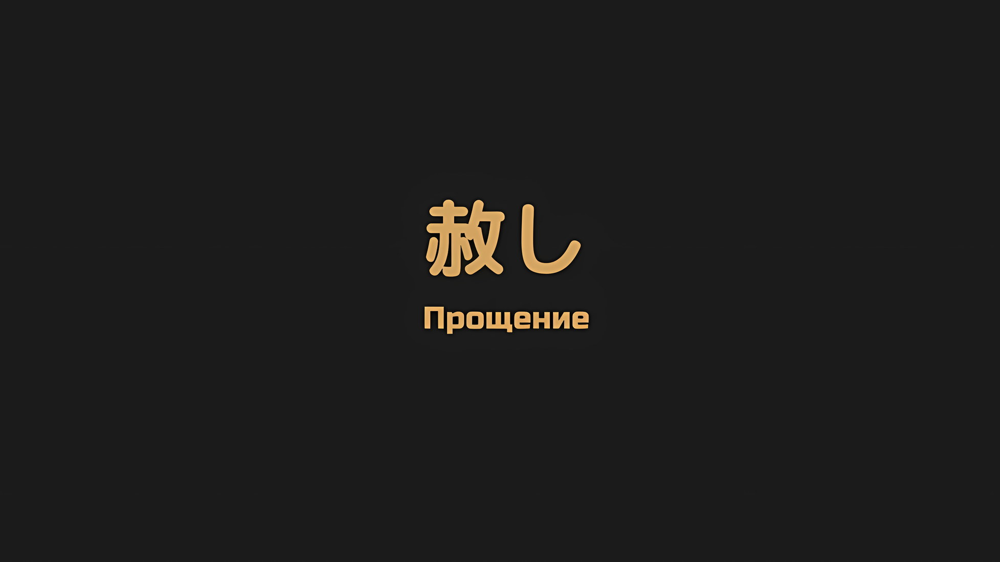
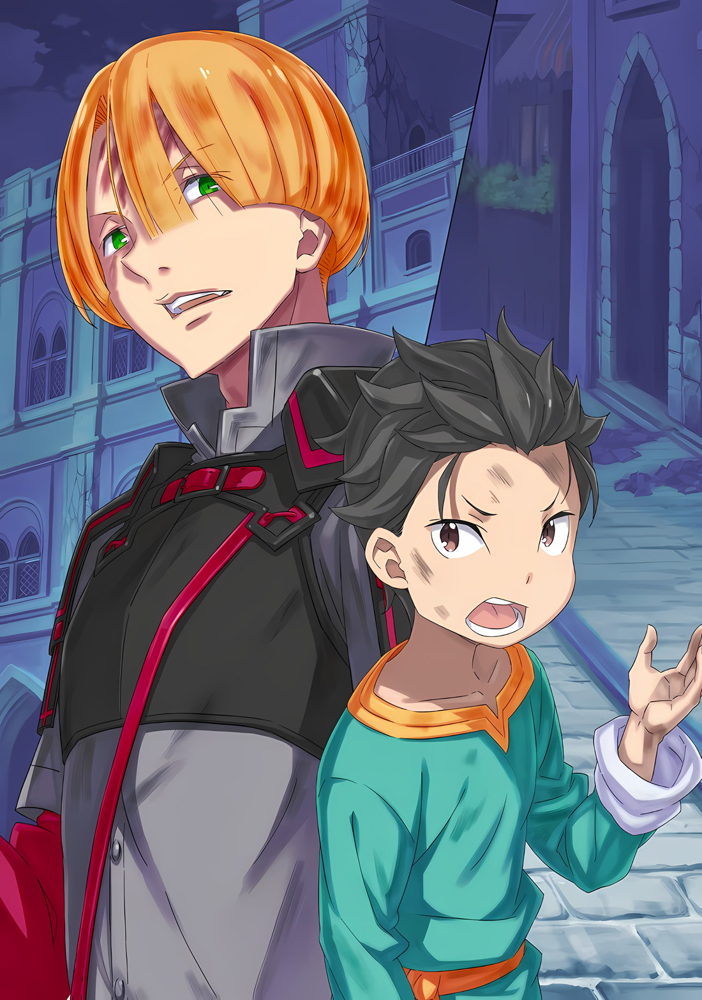
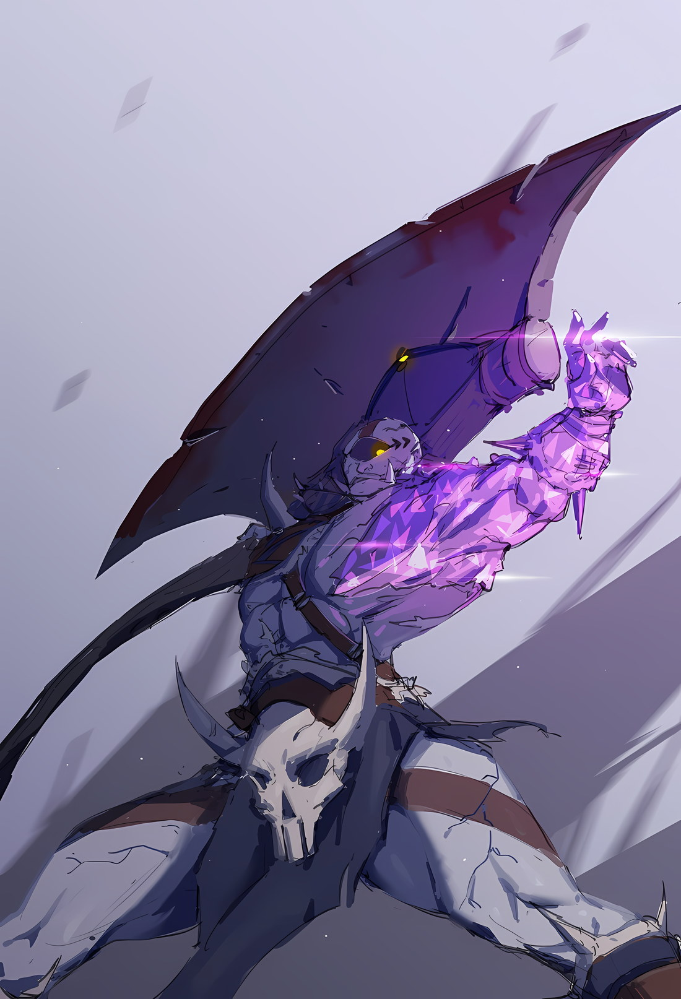
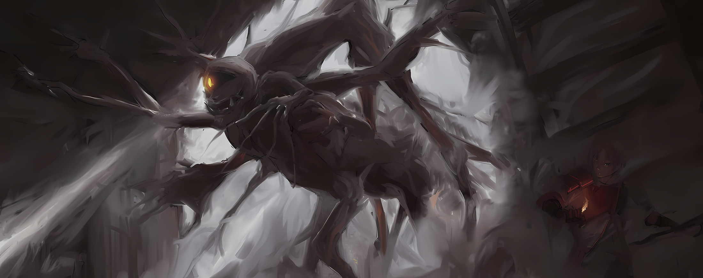

*※※※※※※※※※※※*

Тодд: …Они только недавно превратились в зомби. Некоторые из них были живы всего несколько часов назад. Те, кто погиб в этой битве, возвращаются к жизни один за другим… Но мы пока не можем сказать это наверняка.

Субару: Я понимаю, что ты имеешь в виду, когда говоришь, что они только что превратились в зомби. Как будто они не знают, в чем заключаются их собственные слабости. Мы не единственные, кто мало что знает о зомби…

Тодд: Они сами по себе такие же. Однако, если у них есть голова, чтобы говорить, у них, вероятно, есть и голова, чтобы думать. Чем больше времени мы им дадим, тем больше они смогут заполнить те неизвестные части, и тем больше исчезнут их возможные слабости.

Субару: Вот почему нам нужно нанести удар до того, как враг будет полностью подготовлен… ох.

Тодд: Что? Что ты заметил?

Субару: …

Тодд: Не скромничай, просто скажи это.

Субару: Я не скромничаю. Просто зомби на самом деле не понимают своих собственных тел. Так что если мы сообщим им……

*△▼△▼△▼△*

Он позволил Луи прильнуть к своей спине и крепко прижал Беатрис к груди.

Та же исходная позиция, что и тогда, когда они ехали верхом на лошади Галевинд; однако ситуация, в которую они попали, была довольно экстремальной, и у него не было времени беспокоиться о девушках.

Окружающий пейзаж изменился в одно мгновение, и вскоре рядом с домом, который разлетелся вдребезги от яростного удара, Субару и его союзники появились в воздухе, приняв на себя спину враждебного зомби.

Танза, которая кидала дома, и Идра, который бросал обломки, атаковали волнами… если выразить словами, это была довольно забавная стратегия ведения войны, но забавными были не только слова, но и картинка.

Дело было не в том, почему ребенок кидает более крупные объекты, чем взрослый. В первую очередь, сама тактика бросания дома была смешной.

Тем не менее…,

Танза: Поскольку я получаю любовь Йорны-сама, то я должна сделать хотя бы это.

Поскольку она безоговорочно приняла это таким образом, влияние этой сцены можно было отложить на потом.

На самом деле, таинственное усиление всего Эскадрона Плеяд распространялось и на Идру, но оно было не так хорошо, как у Танзы, которая находится в соединении с Йорной. Все дело было в том, чтобы быть нужным человеком в нужном месте.

С этой точки зрения, внимание их противника было привлечено волновыми атаками с использованием больших и малых орудий… Как только его внимание было сосредоточено на Тодде, Субару и его союзники провели неожиданную атаку с использованием телепорта.

Субару: …

Зомби изогнулся в воздухе; у врага с характерным одноглазым лицом почернела белая часть большого глаза в центре лица, а золотой зрачок ярко светился.

Ужасно жестокая, пахнущая кровью злая усмешка была выгравирована на его губах, посылая дрожь по позвоночнику Субару.

Неужели он всегда был человеком, который истерически смеялся в разгар битвы? Или, возможно, он изменился с тех пор, как стал зомби; они не знали, что именно.

Однако…,

Беатрис и Субару: Эль…

Субару и Беатрис быстро и одновременно подняли руки и направили их на врага перед собой.

Если их противник с максимальными усилиями и без колебаний попытается избежать атаки Субару и Беатрис, то их стратегия потерпит неудачу.

В таком случае, возможно, даже приложив все усилия, они не смогли бы превзойти этого противника.

Но этого не случилось. Потому что Субару… нет, потому что Субару и его команда заставили его оказаться в этой ситуации.

Измаил: …Кх.

И действительно, зомби развернулся с пугающей походкой и, поймав Субару и остальных в свой большой единственный глаз, он принял позу, размахивая своим боевым топором вместо того, чтобы принять меры уклонения.

Это была стратегия, которая заключалась в том, чтобы принять атаку Субару и команды, а затем победить их контратакой… традиционная тактика нанесения урона, чтобы нанести больший ущерб противнику, но отчаяние, вложенное в атаку здесь, было иным.

Тело зомби регенерировало нанесенные раны практически мгновенно.

Вот почему враг думал, что сможет без риска принять атаку Субару и его команды, а затем использовать это для собственной контратаки.

К несчастью…,

Беатрис и Субару: Минья…!!!

…Без его ведома, это был путь к поражению, который проложили Субару и его союзники.

Замахнувшись боевым топором для контратаки, враг получил серьезный удар от фиолетовых стрел, выпущенных из поднятых рук Субару и Беатрис.

Три ярко мерцающие стрелы из аметистового кристалла пронзили левую половину тела циклопа.

Измаил: Блестящая тактика, но…

Не обращая внимания на пронзившие его фиолетовые стрелы, враг оскалил зубы и завыл на свою добычу, Субару и его друзей.

Тело зомби, как ни странно, при разрушении ломалось хрупким образом, подобно тому, как трескается керамика, хотя и сохраняло некоторую прочность.

Затем его сломанное тело восстановилось, как при воспроизведении видео задом наперед, и зомби начал атаку как ни в чем не бывало…,

Измаил: Чт, о…?

…Но он не мог этого сделать.

Аметистовые стрелы, пронзившие тело зомби, не разнесли его вдребезги, а превратили его в такие же аметистовые кристаллы, как и стрела. Затем кристаллизованная часть тела зомби треснула, и на этот раз его тело разлетелось на куски, но части не регенерировали.

Особая эффективность Магии Тени против зомби… это было слабое место врага, которое было выявлено во время их отступления до этого момента.

…Хотя возможностей для проверки за длительный период времени было не так много, у зомби было замечено несколько общих характеристик.

Например, смертельная рана у зомби была ближе к сердцу, чем к голове.

Однако, поскольку пробивание груди не убивало их, слово смертельная рана, возможно, не совсем верное. Тем не менее, это был факт, что зомби, которые регенерировали раны на своих телах с аномальной скоростью, восстанавливались медленнее, когда раны были близки к их сердцу.

Поскольку кровь не текла при потере руки или ноги, казалось, что сердце, вероятно, больше не служило для перекачки крови в организм, но оно не утратило своей функции жизненно важной части человеческого тела.

Поскольку были выявлены те характеристики зомби, которые невозможно было победить, именно Магия Тени Беатрис была признана эффективной при победе над зомби.

Беатрис объяснила, что Магия Тени «Минья» обладает эффектом замораживания времени цели, что было своего рода магией мгновенной смерти, и, похоже, она была особенно эффективна против зомби, которые полагались на свою регенерацию.

По словам Тодда, если сжечь тело зомби дотла, они могли бы остановить регенерацию врага точно так же, как если бы ударили его Миньей, но не было смысла просить о том, чего у тебя нет.

Субару: Это самое сильное использование руки, которое у нас есть!

Независимо от силы вражеских зомби, их можно было победить, если поразить Миньей Беатрис.

В этом случае результатом обдумывания стратегии удара было то, что враг, который продолжал демонстрировать свои способности при жизни, понял, насколько выгодно превратиться в зомби.

Беатрис: Они не повреждаются от атак. Я полагаю, что если на кого-то нападут и тот обнаружит, что может быстро исцеляться, любой подумает о том, чтобы положиться на эту силу.

Субару: До того, как он превратился в зомби, я уверен, что он легко избежал бы этого.

Луи: Ау!

Это было провозглашением победы Субару, Беатрис и Луи… вернее, одновременно восхищение и жалость к их врагу.

Этот воин, вернувшийся к жизни в виде зомби, несомненно, был весьма искусным воителем в жизни. Даже в образе зомби его боевые способности не претерпели заметных изменений, но идеология, с которой он подходил к битве, была искажена.

Если бы только он не был настолько самонадеян, чтобы думать, что получить удар не будет проблемой.

Субару: Он никак не мог всерьез воспринять этот удар.

Измаил: …

Глаза зомби расширились, вращаясь от шока, вызванного магией, которой он подвергся.

В его взгляде был водоворот смешанных эмоций, смесь изумления и понимания, когда он осознал свое поражение; Субару прикусил нижнюю губу и проклял неразумную судьбу, постигшую этого воина.

Даже если Субару проклинал себя за то, что кристаллизовал левую половину его тела и заставил его вкусить смерть во второй раз…,

Танза: …Шварц-сама!

Сразу же после того, как мгновение сентиментальности омыло его сердце.

Танза срочным голосом позвала Субару, и тот внезапно осознал истинное положение вещей. Вращаясь в воздухе, отворачиваясь, а затем снова поворачиваясь к нему лицом, взгляд вражеского зомби изменил цвет.

Не то чтобы цвет характерных золотых глаз мертвеца изменился.

Но изумление и понимание, плававшие в нем, исчезли, и на смену им пришла острая враждебность.

В какой-то момент противник почти принял свое поражение вместе с ударом.

Это изменило цвет его глаз. …Пожалуй, последнее слово Субару послужило катализатором.

Измаил: Еще нет.

Субару: …Он не умер!

Перед Субару, который ахнул от увиденного зрелища, враг, чья кристаллизация продвигалась по левой стороне его тела, что-то подбросил ногой в воздух.

Это был осколок разбитого дома-пушечного ядра. Хотя это был всего лишь фрагмент, он был размером с голову человека. Подбросив его в воздух, последующий удар раздробил левую руку зомби от плеча и разнес ее.

В свою очередь, разлетевшиеся обломки полетели прямо в лицо Субару…

Луи: Уау!

Перед самым ударом Субару успел увидеть, как его череп разлетается на осколки.

Это был бы смертельный удар, но он не достиг Субару. Потому что фигура Луи вмешалась до того, как атака попала в него, заняв его место.

Субару: Луи…!

Вцепившись в его спину, Луи с силой толкнула тело Субару вниз, убрав его с пути обломков и оказавшись на линии огня.

В результате Луи попала под обломки без защиты, была оторвана от тела Субару и отлетела в сторону.

Беатрис: Субару, не отводи взгляд, в самом деле!

Беатрис окликнула растерянного Субару, когда Луи отлетела в сторону. Она держала свое тело в объятиях Субару и протянула руку, чтобы атаковать противника.

Однако противник был не настолько простодушен, чтобы получить смертельный удар дважды.

Измаил: …Кх.

С осколками руки, летящими по воздуху, противник умело прочитал преследование Миньи Беатрис и использовал то немногое, что осталось от области его левого плеча, чтобы принять удар.

Он взял на себя повреждения в областях, которые уже были кристаллизованы, сведя к минимуму прогрессирование вреда, вызванного развитием трещин.

Это было поистине мастерство исключительного воина…

Луи: Уа…

Как только он был потрясен его мастерством, воротник Субару был схвачен вытянутой рукой.

Он бросил свой боевой топор… Нет, потеряв способность владеть боевым топором, он продемонстрировал свою одержимость не дать Субару сбежать.

Измаил: Оооох!!

Субару: Гах!

Тело Субару, которое держало Беатрис, было с силой отброшено на землю рывком вражеской руки. Задыхаясь от боли, вызванной ударом спины о твердую поверхность, Субару увидел вблизи форму противника и попытался быстро поднять руку.

Но, однако, решительная фигура противника встретилась с его взглядом, и его движение остановилось.

…По тому, как он выглядел, полный амбиций и воли к борьбе, трудно было поверить, что это было от уже мертвого тела.

Субару: …Хк.

Беатрис: Субару!

Танза: Шварц-сама!

Шея Субару была сдавлена, и отчаянные голоса ударили по его барабанным перепонкам, когда он задыхался.

Слыша эти нетерпеливые голоса и звук смертельного скрипа костей в своей шее, руки Субару все еще не поднимались. Дело было не в том, что он был лишен сил, а скорее в том, что в его сердце больше не было вдохновения.

Хотя он знал, что если он не сделает этого, то умрет.

Хотя он знал, что если он не убьет, то убьют его.

Беатрис: Минья!

Субару, неспособный двигаться, был вытеснен Беатрис, которая пригнулась и направила свою магию на врага.

Накрыв Субару, он также накрыл и Беатрис, которая была в его объятиях. Естественно, магия достигла цели с расстояния, которое следовало бы назвать стрельбой в упор.

Однако враг выстоял. …Правая рука, обхватившая шею Субару, защищалась насмерть, и даже если его туловище было кристаллизовано, враг, по крайней мере, пытался забрать его с собой.

Тодд: Это потому, что ты странно милосерден.

Сразу же после произнесения этих беспечных слов голова врага, который пытался убить Субару своим горящим глазом, была отсечена у шеи.

Вместо нее с другой стороны исчезнувшей головы врага возник Тодд с каменно-холодным видом.

Субару: …

Тодд взмахнул топором в своей руке и обезглавил зомби.

Отрубленная Тоддом голова попыталась обратить свою ненависть на него,

Танза: Как ты смеешь!

И тогда Танза пинком безжалостно снесла ему голову. Как бы то ни было, голова циклопа продолжала отскакивать по улице, как футбольный мяч.

Затем туловище, оставшееся после головы, медленно рассыпалось, полностью превратившись в темно-фиолетовые кристаллы.

Танза: Вы в порядке, Шварц-сама?!

Субару: …Кхе, кхе, я, я в порядке. Извини, спасибо за помощь.

Отряхиваясь от осколков развалившегося торса противника, Субару поднял руку к бегущей к нему Танзе, заверяя ее, что он невредим.

Танза с облегчением услышала его ответ, а затем на лице Субару появилось выражение внезапного осознания,

Субару: Луи! Где Луи? Она прикрыла меня и…

Идра: Кажется, ничего серьезного. Хотя похоже, что она попала под обломок и у нее сотрясение мозга.

Поспешный Субару получил ответ от Идры, который сидел на корточках неподалеку.

У его ног лежала Луи, ее верхняя часть тела была подперта, кровь струилась со лба, а голова неустойчиво качалась.

Субару: Ее голова плохо выглядит…! Беатрис, пожалуйста!

Беатрис: …Конечно, знаю, я полагаю.

Субару: Пожалуйста…!

Субару оценил состояние Луи и вскочил на ноги, потянув Беатрис за руку. На мгновение в ее поведении промелькнула неуверенность, но Субару этого не заметил.

Беатрис была единственной из присутствующих, кто мог использовать магию исцеления.

Другого пользователя, Рем, попросили пойти с небоевыми людьми в обход зоны боя в сторону внутреннего города, чтобы избежать тотального сражения с сильным противником.

Чем больше им удавалось оттеснить сильных врагов от крепостных стен, тем больше было шансов, что они смогут безопасно выбраться из города, но именно здесь сказалось отсутствие возможных целителей.

Субару: Луи, с тобой все будет хорошо…!

Субару присел на корточки рядом с Луи и Беатрис, когда она прижала руку к ране на лбу; пока Беатрис активировала магию исцеления, Субару держал Луи за руку.

Крепкая хватка Субару была слабо возвращена, и он повторно произнес: «Мне жаль…».

Все, что он мог сделать, это лишь извиниться. Потому что это была полностью вина Субару.

Тодд: Значит, эта девочка тоже может использовать магию исцеления? У вас тут много людей с редкими способностями.

Затем Тодд позвал Субару, который наблюдал за лечением Луи.

Он нес на плече топор, которым отрубил голову врагу, не сводя взгляда со слегка напряженной фигуры Субару,

Тодд: И все же, если ты будешь продолжать в том же духе, их талант пропадет даром. Ты ведь понимаешь это, не так ли?

Субару: Тодд…

Тодд: Тот, кто возлагает уверенность в том, что он не умрет, на что-либо, кроме своих собственных сил, слаб.

Субару: …

Тодд: Это относится не только к циклопу, которого мы только что прикончили, но и к тебе.

Причина, по которой он не смог ответить на эти равнодушные слова, заключалась в том, что они безошибочно попали в цель.

Тот момент слабости, который промелькнул в сознании Субару, когда он увидел, что его враг стряхнул с себя надвигающееся поражение и ухватился за победу. Это было, как сказал Тодд, результатом того, что его переполняла жажда жизни.

Субару не был настолько наивен, чтобы отмахнуться от этого как от чего-то само собой разумеющегося, но…

Танза: Разве не грубо так говорить?

Тодд: …

Танза: Шварц-сама — это человек, который внес большой вклад в текущую битву. То, как ты говоришь о нем, указывая на это, просто…

Тодд: Не огрызайся на меня. Я признаю его вклад. Просто я считаю его недостаточным. Человек, который внес наибольший вклад, это либо ты, либо девчонка, которая рухнула вон там.

Щеки Танзы напряглись, когда Тодд сказал это, указывая подбородком на девочку.

Девочка, которая взяла на себя главную роль в борьбе с таким сильным противником, казалось, не заботилась о похвале в свой адрес, а скорее беспокоилась о Субару, которого задели эти бессердечные слова.

Она была девочкой, которая почти не меняла выражения лица, но чувства, которые она скрывала внутри, были довольно сильными.

Со времен «Острова Гладиаторов» ее отношения с Субару значительно углубились, и поэтому, когда его оскорбили, она, по понятным причинам, проявила гнев от имени Субару.

Отсутствие невесты Тодда, Кати, в этой ситуации также добавило интенсивности ее тону.

Танза: Ты считаешь себя правильным, несмотря ни на что? В таком случае…

Тодд: Я сказал не огрызайся на меня. То, что я сказал, — это просто факт. То, что на свете существуют монстры, которые настолько невероятно сильны, что могут быть уверены, что не умрут, и что есть другие, которые думают, что не погибнут по внешней для этого причине. …Ни ты, ни я не являемся ни тем, ни другим.

Танза: То есть…

Тодд: Если первый будет союзником, все пройдет легко, но я бы не хотел, чтобы второй был союзником. Если они враги, можно воспользоваться их преимуществом, как мы только что и сделали. План твоего друга сработал точно.

Танза: …Кх, ты не можешь…

*Говорить за Шварца-сама*; пыталась ли она огрызнуться на него такими словами?

С лицом, слегка покрасневшим от гнева, Танза попыталась наброситься на Тодда. Но, быстрее, чем Субару успел остановить ее, вмешался Идра.

Поддерживая тело Луи, он выкрикнул ее имя: «Танза».

Идра: Достаточно. Это на тебя вовсе не похоже. Твоя изюминка в том, что ты всегда сохраняешь хладнокровие, верно?

Танза: …Просто я не умею управлять колебаниями своих эмоций. Кроме того, Идра-сама, вы тоже должны понимать.

Идра: Под пониманием ты подразумеваешь…

Танза: В конце концов, Идра-сама, вы и я связаны со Шварцом-сама. Что бы ни чувствовал Шварц-сама, это должно передаваться и нам в немалой степени.

Идра: …

Идра нахмурился и промолчал, услышав жалобу Танзы, когда она повернулась к нему спиной. Увидев выражение лица Идры прямо перед собой, Субару невольно сглотнул.

Несмотря на то, что Эскадрон Плеяд был благословлен исключительной силой, которую они получили от воздействия «Кор Леониса» Субару, люди, с которыми у него были близкие отношения… Идра и другие, которые были выходцами из того же подразделения, а также Танза, у которой были более тесные отношения с Субару, чем у других, получили его недостатки.

Субару почувствовал облегчение от того, что Танза и другие не посчитали это его неудачей или отсутствием добродетели.

С другой стороны, он чувствовал сожаление и то, что ему все еще чего-то не хватает.

Действительно, именно в тот момент Субару так и подумал.

Луи: Аа, а…

Внезапно, Луи сжала руку Субару и издала слабый голос.

Как обычно, подробности того, что она имела в виду, не сформировав слова, были неизвестны. Однако было ясно, что она беспокоится о Субару. Даже несмотря на то, что она была в ситуации, когда пострадала больше, чем он.

Беатрис: Если она может говорить, то волноваться не стоит, в самом деле. Если лечение закончится, лучше вывести ее наружу и попросить Рем осмотреть ее, я полагаю.

Субару: Я понял. Да, это верно. С большим трудом мы расчистили путь. Если мы задержимся здесь…

*Не исключено, что соберутся и другие зомби, следя за тем, чтобы не перепутать приоритеты;* это произошло в тот момент.

…*Вшух*, он услышал странный звук, прорезающий ветер.

Субару: …

Это было похоже на раскачивание веревки, к которой было привязано что-то легкое, но события, которые произошли сразу после того, как он услышал звук рассекающего ветра, вовсе не были легкими.

Танза: Кха

Вырвался короткий стон, и тело Танзы задрожало.

Затем, когда она посмотрела вниз на свое дрожащее тело, ее круглые глаза расширились. …Пронзив ее спину и живот насквозь, высунулось что-то похожее на щупальце с острым кончиком.

Щупальце, пронзив маленькое тело Танзы, протянулось со стороны улицы, разрушенной после битвы, далеко от того места, где находились Субару и остальные.

Вытянутое, как извивающаяся змея, происхождение этого щупальца было…,

Субару: …А?

Гротескное туловище, растущее из головы, которую отбросили пинком, и протягивающее щупальца наружу, было фигурой того самого зомби.

*△▼△▼△▼△*

Субару: …

Мгновенная остановка, мысли Субару были окрашены в белый цвет фигурой, попирающей его воображение и понимание.

Но чтобы этот момент не стал роковым, раздался голос.

Беатрис: Субару!

Лицо Беатрис побледнело, и она закричала, возвращая внимание Субару к реальности.

Звук, похожий на прилив крови к его голове, эхом отдался в сознании Субару, и он снова окинул взглядом представшую перед ним сцену… одноглазый зомби, стоящий на разрушенной улице, его гротескный вид привлек его внимание.

На его голове был тот же черный глаз с золотым зрачком, что и раньше.

Однако ниже шеи было не крепкое тело воина, а чудовище, которое можно было назвать гротескным, с разной толщиной и длиной парных левых и правых рук и ног.

Одна из рук монстра вытянула щупальце… Нет, это было не совсем верно. Это было не щупальце, а палец, и он пронзил тело Танзы насквозь.

Танза: …Ах.

В тот момент, когда он увидел это, монстр убрал свой длинный палец, который пронзил тело Танзы насквозь, и ее тело снова задрожало.

Из ее тела, пронзенного насквозь, хлынула кровь, и она с бессильным стуком рухнула на колени.

Субару: Танза…!!!

Идра: …Кх! Это плохо! Шварц!

Сразу же после его крика, Субару, который вытянул руки и начал бежать, был с силой оттолкнут ладонью Идры, выставленной сбоку.

Тело Субару легко взлетело в воздух от усиленного толчка Идры. Однако, благодаря своему перевернутому зрению, он быстро понял, что его толчок был правильным решением.

В то место, где незадолго до этого находился Субару, ударили сморщенные пальцы монстра.

Тротуар и здания вдоль дороги были разрезаны вертикально с ужасающей остротой, разрушая город; если бы не толчок Идры, тело Субару тоже могло бы быть разрезано.

Как бы то ни было, тело Субару продолжало лететь по воздуху с огромным импульсом…,

Тодд: Тц! Только не говорите мне, что он регенерировал из своей отрубленной головы.

Тодд схватил Субару за руку, потянувшись снизу вверх.

Застыв при звуке голоса Тодда, доносящегося сверху, Субару был потрясен значением его слов… регенерировать из отрубленной головы, «Ты, должно быть, шутишь», — пробормотал он.

Тодд: Несмотря на то, что мы раздавили и кристаллизовали его туловище, он все еще двигается! Как это возможно!?

Субару: Я не хочу этого признавать, но мы должны посмотреть правде в глаза — он жив. Эта жуткая внешность…

Беатрис: Это потому, что формула регенерации его тела повреждена! Я полагаю.

Беатрис была единственной, кто дал ответ на вопрос Тодда, держа Субару.

На ее милом личике застыло выражение разочарования, когда она смотрела на гротескного монстра,

Беатрис: Возможно, это результат отвержения смерти от повреждений, которые должны были убить его, я полагаю!

Тодд: …Другими словами, он отказывается умирать даже больше, чем другие зомби… Нет, поскольку они уже умерли, может быть, правильнее сказать, что он отказывается возвращаться к смерти?

Субару: Ах…! Беатрис! Идра! Скорее спасайте Танзу…!

Идра: Я знаю! Я знаю, но…

В ответ на отчаянную мольбу Субару, Идра стиснул зубы и повысил голос.

Он разделял ту же заботу о раненой Танзе. Однако, если они будут действовать безрассудно, то привлекут внимание монстра. Уже было очевидно, что атаки монстра могут достичь Эскадрона Плеяд.

Если Идра падет, их шансы на победу исчезнут.

Этим было…,

Субару: То есть, в первую очередь…

Луи была ранена осколками, и Танза также получила серьезные ранения, которые явно были опасны для жизни.

Зомби, которого, как они думали, они смогли одолеть, не только не был полностью побежден, но и превратился в гротескное существо, встав у них на пути. Казалось, что они попали в тупик.

Субару: …Не будь смешным.

Субару оборвал глупую мысль, которая ненадолго пришла ему в голову.

Тупиком судьбы, были петли, которые не могли быть разрешены, что бы человек ни делал. Тодд, который нес Субару, уже приводил к подобной ситуации.

Однако Субару был там. …Кроме того, Субару был спасен.

Даже если бы он отказался от себя, он не смог бы отказаться от всех остальных.

Тодд: …У тебя отвратительный взгляд.

Субару: Э?

Тодд: Это взгляд человека, который по-разному относится к своей и чужой жизни.

Субару переключил передачу, услышав громкий звук в своей голове. Тодд пробормотал эти слова, внимательно глядя на выражение его лица, но Субару не мог понять, что у него на уме.

Однако не было никаких сомнений в том, что отвращение, должно быть, просачивалось сквозь него.

Тодд: Пошли.

Коротко сказав это, Тодд сильно ударил ногой по земле, удерживая Субару.

А затем, невероятным образом, он повернулся спиной к Танзе, Беатрис и всем остальным и бросился бежать.

Субару: Что!? Что ты делаешь! Если мы отделимся от всех…

Тодд: Тебе нужно присмотреться повнимательнее. Цель этой штуковины — мы двое, ты и я.

Сказав это, Тодд наклонился всем телом и спрыгнул на боковую дорогу.

В тот же миг на заднем плане Тодда появился палец, который, казалось, пронзил тротуар насквозь, и запах гари защекотал ноздри Субару.

На мгновение перед его глазами что-то промелькнуло.

Это было то чудовищное существо, его единственный глаз зловеще светился, оно гналось за Субару и остальными.

Тодд: Похоже, цель этой твари — я, который убил его первым, и ты, который убил его во второй раз.

Субару: …кх! Так ты заманил его подальше от всех остальных?

Тодд: Когда вовлечены другие, ты не можешь мыслить здраво.

Тодд посмотрел на Субару своими зелеными глазами и сказал это.

Субару был потрясен, и когда на него уставились эти ледяные глаза, он почувствовал страх, равный или больший, чем приближающаяся гротескная фигура.

Даже в этой ситуации взгляд Тодда, брошенный на Субару, был не более чем оценивающим.

Тодд: Ты сможешь придумать способ справиться с этим без своего партнера?

Субару: Что если нет?

Тодд: В таком случае, хотя я и ненавижу это, мы ничего не можем сделать, кроме как оставить все на волю случая.

Субару понял, что Тодд на самом деле не имел в виду то, что сказал.

Поскольку у них были одинаковые условия, когда они были мишенью, Тодд мог использовать Субару в качестве приманки и сбежать, если бы ситуация стала неблагоприятной для него.

Сейчас он этого не делал, потому что план использования Субару в качестве приманки для побега имел мало шансов на успех.

И наоборот…,

Субару: …Если есть способ, ты ведь поможешь мне, верно?

Тодд: …

В ответ на вопрос Субару, выражение лица Тодда снова напряглось.

Тодд умело использовал препятствия, чтобы скрыться из поля зрения монстра и уклониться от его атак. Тем временем Субару, которого он нес на руках, продолжал осматриваться в поисках определенного здания в столице Империи.

Это было то самое здание, о котором упоминал Идра, когда они убегали.

Он придумал план, помимо того, чтобы нанести удар с помощью Миньи, но поскольку у него не было способа заманить врага в здание, он исключил его как вариант…

Тодд: Ты сможешь это сделать?

Субару: …Я сделаю это.

Тодд: ……

Как только Субару ответил на вопрос, Тодд слегка удивленно приподнял брови, а затем усмехнулся, жестоко искривив уголки своего рта.

И тогда…,

Тодд: Хорошо. …Я последую твоему плану.

*△▼△▼△▼△*

…Пока он преследовал свои убегающие цели, мысли «Гигантского Глаза» Измаила разлетелись на тысячи осколков.

Измаил: …

С мерцающим зрением и разрозненными мыслями, его хамские движения были далеки от изысканных.

Со скребущими по земле конечностями разной длины, с неустойчивостью новорожденного зверя, врезаясь в стены и в землю, он протягивал руки, пальцы, к тем спинам, которые все больше отдалялись.

Причину своей одержимости этими двумя убегающими врагами Измаил уже не мог вспомнить.

Уже сейчас, когда то, что когда-то было Измаилом, кануло в Лету, гротескное чудовище отращивало новые конечности из трещин, которые оно получало при каждом падении, постоянно усиливая свою отталкивающую внешность.

…Это, несомненно, было буйное поведение способности к регенерации, на которое указала Беатрис.

Однако после воскрешения по чужой воле, мутации, происходящие в теле Измаила, который был чрезвычайно отчужден от понятия смерти, были чем-то таким, что даже заклинатель не смог бы контролировать.

Достигнув своей цели, уничтожив две мишени своей одержимости, что стало бы с монстром после этого?

Измаил: О̷͚͇̞́̅̊̌О̸͓̙̰̘̄̓̕о̷͚͈͇̏͑̉͂̒о̸̢̛̻̥̲̲͌̐́о̸̛̲̙̜͔̂͒̒̉о̸̥̟͙̅…

Жутко издавая полые рыки, этот монстр не представлял для него никакого интереса.

Измаил: …

Большая из двух его целей несла меньшую, пока они бежали, и как только казалось, что он может схватить их за спины, они отступали, и таким образом ситуация, заставлявшая его повторять неудачные удары, продолжалась.

Однако противники не могли продолжать бежать вечно. Благодаря тому, что Измаил продолжал свой бесформенный бег, по всему его падавшему телу вырастали конечности, и он уже не мог упасть.

А раз он не мог упасть, значит, тот, у кого больше конечностей, должен бежать быстрее.

Поэтому к своим целям, пытающимся убежать, мало-помалу, мало-помалу, мало-помалу Измаил сокращал расстояние, сокращал расстояние, сокращал расстояние, сокращал расстояние, сокращал расстояние……

Измаил: С̵̘͐̑ͅи̴̪̇̌͐͆н̵̧̗̺͕̄͆͘͝ӣ̷̱͉̐̚ͅй̴̰̜̺̊́͜ͅ!

С коротким ревом палец Измаила вонзился в спину и плечи убегающей цели.

Хлынула кровь, и на лице Измаила появилась гнусная улыбка, когда он услышал крики своего врага. Это было приятно. С невероятным наслаждением он хотел слышать все больше и больше криков, все больше и больше крови.

Опрометчиво свернув на другой путь, его противники, в отличие от того, какими они были до этого момента, излучали чувство отчаяния.

Преследуемые Измаилом, настигаемые монстром, ненавидящие мысль о том, что их разорвут на куски, его цели отчаянно бежали. Целясь в их конечности, особенно в верхнюю часть тела, он ранил бы их.

Если бы он целился им в ноги, его цели уже не смогли бы убежать. Если это произойдет, то все закончится.

Если это закончится, он будет одинок. Если все закончится, он будет разочарован.

Вот почему, во веки веков, чтобы это никогда не заканчивалось…

Измаил: Ö̷͚̜̯́̀͝Ơ̸̛̙͎͍̖͋͌Ǫ̷̦̓̈̈́͝ͅͅO̷̙͉͒̑̌̐o̷̩̞̟͋̄̓ǫ̸͔̲͗̋o̵͉̮̰͌͝ǫ̵̐̽̓ò̶̮̟̟͕̂͒

Издавая низкий боевой клич, от которого дрожал воздух, Измаил врезался в здания и топтал улицы, отталкиваясь от залитой водой земли в погоне за своими целями.

Он мгновенно сократил расстояние; возможно, выносливость его убегающих врагов наконец истощилась, и, проливая кровь, они щелкали языками, прыгая в соседнее здание.

Поскольку бежать было некуда, они сделали глупый выбор — нырнули в тупик.

Почувствовав конец охоты, Измаил… Нет, монстр, который перестал быть Измаилом, снес закрытую дверь и проскользнул внутрь.

Его конечности умножились, тело раздулось, и с каркасом, несравненно большим, чем его первоначальное тело, он не мог легко открыть дверь и войти в здание.

Затем, войдя в тусклое здание, в котором скрылись его цели, монстр осмотрелся внутри.

Источников света было мало, но даже если он и превратился в такое гротескное состояние, один только его особый глаз остался неизменным. Моргнув, он изменил свое восприятие мира и стал искать фигуры своей спрятанной добычи.

Пока он искал, монстр все понял.

Измаил: …

…В здании, в которое он вошел, было так много развевающейся муки, что этого было достаточно, чтобы окрасить все тело монстра в белый цвет.

Темнота была не единственной причиной его затуманенного зрения, но и потому, что воздух внутри здания был наполнен рассыпанной мукой. Оглядевшись вокруг, он увидел, что здание было уставлено полками, и на каждой полке стояли мешки, наполненные до отказа.

Эти мешки были разорваны, и большое количество муки было разбросано по всему зданию.

???: То, что победит тебя, не будет магией или убийственной техникой.

В то самое время, когда покрытый мукой монстр заметил ситуацию внутри здания, он услышал голос сзади. Монстр обернулся, и в поле его зрения появился маленький ярко-красный силуэт.

Это была одна из убегающих целей… Нет, в какой-то момент убегающие цели превратились в одного человека. Отделившись от большого, маленький, которого он потерял из виду, теперь стоял там.

И затем…,

???: Отведай это, свет науки… Взрыв пыли!!!

Сразу после этого крика, все вокруг маленькой фигурки одним махом окрасилось в красный цвет…,

…Сильнейший взрыв разнес мукомольную мельницу, и монстра поглотил ярко-малиновый лотос.

*△▼△▼△▼△*

*Идра: …Шварц, послушай, давай используем эту мельницу в качестве ориентира. Это здание, рядом с которым находится водяное колесо.*

Идра, взявший с собой небоевых людей и бдительно следивший за окружающей обстановкой, подстегивая коня Галевинд, был сыном мельника до того, как его отправили на «Остров Гладиаторов».

Субару не знал точно, какую роль играет мельник, но ему говорили, что они используют силу водяного колеса, чтобы перемалывать пшеницу в муку.

Другими словами…,

Субару: Если мы используем ингредиенты из этой мельницы, мы сможем произвести взрыв пыли.

Взрыв пыли — это явление, при котором легковоспламеняющиеся порошкообразные материалы рассеиваются в воздухе, и при возгорании огонь распространяется в результате цепной реакции, воспламеняясь и взрываясь одновременно.

В дополнение к замкнутому пространству мельницы, где большое количество пшеничной муки разлетелось во все стороны, если в нее с определенной силой бросить зажигательный материал…,

Субару: …Я и понятия не имел, что в конечном итоге он окажется таким мощным.

Прислонившись спиной к обшарпанной стене, Субару, кашляя, пробормотал это.

Перед глазами Субару была мукомольная мельница, разлетевшаяся на куски в результате взрыва пыли, и обугленные останки монстра, который был поглощен этой детонацией.

Когда им с Тоддом понадобилось заманить монстра в ловушку и победить его вместе, план, который пришел Субару в голову, состоял в том, чтобы устроить взрыв пыли с помощью мельницы.

Конечно, устроить взрыв пыли было не так-то просто, и у него не было уверенности в том, что он сможет успешно провести туда своего противника.

Поэтому не только сила Субару сделала план таким успешным.

Субару: …Ты жив, Тодд?

От удара взрыва Субару встал, моргая глазами и качая головой.

После распределения ролей, Тодд взял на себя обязанность привлечь внимание монстра и убежать, пока мукомольная мельница не будет готова, в то время как Субару пробрался внутрь и метко разметал пыль по зданию.

Затем, когда Тодд увидел, что время пришло, он ворвался на мельницу и бросил зажигательную смесь в то место, куда он направил монстра. Кроме того, именно Тодд приготовил это зажигательное средство.

Субару: Тодд, Тодд…!

Тодд: …Не надо так жалобно взывать ко мне. Я все еще жив.

Субару: …Хк!

Субару, взывавший к области вокруг эпицентра взрыва, о чем свидетельствовало множество оставшихся углей, услышал слегка хриплый голос и повернулся лицом в ту сторону.

Приглядевшись, он заметил место, где стена мельницы обрушилась на разрушенную улицу, и увидел Тодда, стоящего на одном колене. Углядев идущего к нему Субару, он выплюнул слюну изо рта и сказал,

Тодд: Ты чуть не убил меня, парень.

Субару: …Ты выставляешь меня плохим парнем. В конце концов, я же говорил тебе, что это будет очень мощно, да?

Тодд: Иногда случается подобный несчастный случай, но когда я услышал принцип, лежащий в его основе, это обрело смысл.

Как и ожидалось, Тодд дышал с трудом, когда упал обратно на улицу. Затем, когда он посмотрел в сторону взорванной мельницы,

Тодд: Что случилось с нашим противником?

Субару: Его разнесло. Полностью… Смотри.

С этими словами Субару указал на часть взорванного монстра, которая была видна с их позиции. Затем часть, опаленная углями, рассыпалась, как песок, и потеряла свою форму.

Как и в случае с распылением других зомби, это было результатом полного уничтожения способности к регенерации.

Субару: Как твои раны?

На этот раз, убедившись, что они победили грозного зомби, Субару задал вопрос Тодду.

Когда они распределяли работу, поскольку они не могли позволить себе быть пойманными врагом, Тодду, который мог продолжать убегать некоторое время, не оставалось ничего другого, как играть роль приманки. Однако он сам вызвался на эту роль.

Это противоречило ожиданиям Субару, что Тодд будет категорически избегать любого плана, который мог бы поставить под угрозу его собственную жизнь.

Тодд: Это была бы не очень хорошая история, если бы я легко потерял свою жизнь, не желая получать свежие раны. Мы оба просто выполняли свои роли. Хотя…

Субару: Ах…

Тодд: Я изранен практически везде. Я чувствую, что мне не хватает много крови.

Сказав это, Тодд поднял руку, и стало ясно, что его ранение было довольно серьезным.

Хотя у него не было ран, которые можно было бы назвать глубокими, его плечи и бедра были пропитаны кровью, а лицо было бледным от количества крови, которую он потерял.

Если не принять меры, это, несомненно, поставит под угрозу его жизнь.

Субару: Я немедленно…

*Пойду и позову Беатрис*, — с такими намерениями Субару пытался двигаться.

После расставания с Субару и Тоддом, Беатрис, несомненно, была в панике. Но он был уверен, что она отдаст приоритет лечению Танзы.

Безопасность Луи и Танзы также вызывала беспокойство, поэтому им нужно было поспешить, чтобы встретиться с Беатрис и остальными.

И затем…,

Тодд: …В конце концов, если мы так много сделали, Катя не сможет пожаловаться.

Субару: А?

Тодд: Мы говорили об этом во дворце, не так ли? Потому что она, кажется, считает меня ленивым. Я помог нам сбежать, победил действительно сильного врага и даже получил почетные ранения. Только не говори мне, что ты тоже собираешься присвоить все заслуги себе, а?

Тодд сказал это, пожав плечами, с бледным лицом, из которого сочилась кровь. На мгновение Субару растерялся, а затем издал «Хах» и слабо выдохнул.

Несмотря на то, что он был в таком избитом состоянии, его мысли все еще занимала Катя. Возможно, он планировал, таким образом, снять психическое напряжение Субару, но в любом случае.

Субару: Катя-сан действительно важна для тебя, да.

Тодд: Это само собой разумеющееся. Она моя невеста. Катя — это сама моя жизнь.

Тодд заявил об этом без всякого стыда.

Услышав такой ответ, Субару сделал глубокий вдох, на мгновение задержал его, а затем, сказав: «Хорошо», разгорячился.

Даже сейчас он боялся Тодда. То, что сделал этот человек, оставило глубокие шрамы на его сердце.

Тем не менее, факт оставался фактом: они сотрудничали, чтобы победить этого монстра здесь. Даже будучи полностью избитым, Тодд посвятил себя тому, чтобы все, включая Субару и его друзей, смогли выбраться отсюда живыми.

Если это так, то теперь настала очередь Субару.

Субару: Подожди здесь… Нет, кто-то, кто слышал взрыв, может прийти сюда. Пока просто возвращайся со мной по пути. Как только мы найдем подходящее место, жди меня там.

Тодд: Ахх, я понимаю. Я рассчитываю на тебя, поэтому, пожалуйста, не оставляй меня здесь.

Субару: Я бы этого не сделал!

Тодд заставил Субару задуматься о том, что, возможно, можно было бы закончить все, не делая этого.

Однако, даже если бы Субару был настроен враждебно по отношению к Тодду, он не был уверен, что смог бы оставить его там, на грани смерти.

Субару: Нет, если я буду слишком много думать об этом, я застряну в колее. В любом случае…

Даже если бы он подставил плечо Тодду, разница в их росте затруднила бы это. Субару осмотрел взорванную мельницу, надеясь найти что-нибудь, что он мог бы использовать в качестве импровизированной трости.

Затем он нашел опорный столб для полки, который был взорван прямо посреди тлеющих углей…

Субару: …

…В этот момент раздался резкий звук.

Субару: …Почему.

В тот момент, когда раздался этот звук, Субару опустил глаза и крепко сжал кулаки. Когда его губы задрожали, плечи затряслись от страха, а черные глаза дрогнули, он пробормотал.

Субару: Почему.

Тодд: …

Не получив ответа на свой вопрос, Субару повернулся и выдохнул.

Обернувшись, Субару увидел перед собой лезвие топора, которое было занесено вниз и остановилось всего на волосок от того, чтобы размозжить ему череп.

…Ибо его сдерживало, видимое лишь Субару, «Невидимое Провидение».

Тодд: Тц, виноват, виноват.

Слегка прищелкнув языком, Тодд выпустил топор из рук и отпрыгнул назад. Его быстрые движения не показывали никаких признаков потери крови или травм, и Субару стиснул зубы.

Даже это было притворством. Боль от его травм, мольба Субару о помощи, разговоры о его чувствах к Кате, которые смягчили его сердце, — все это было всего лишь притворством.

Субару: ПОЧЕМУ…?!

Субару трижды задал один и тот же вопрос, глядя на Тодда с лицом, которое, казалось, вот-вот расплачется.

Пристально глядя на него, он почувствовал, как от всепоглощающего разочарования на глаза наворачиваются слезы.

Субару: До сих пор ты ничего не натворил. Ты никого не убивал. Я мог бы даже простить тебя!!!

Тодд: Тихо и постепенно ты подорвал мое доверие к тебе.

Слушая крики Субару и доставая нож вместо топора, который он выпустил, Тодд приготовился.

Тем самым был ознаменован необратимый раскол между Нацуки Субару и Тоддом Фангом.
