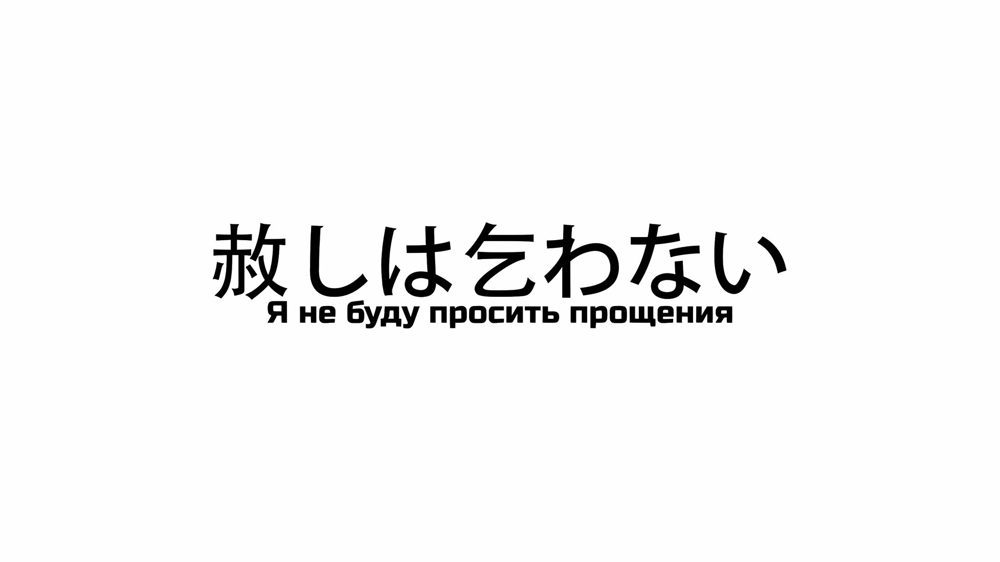
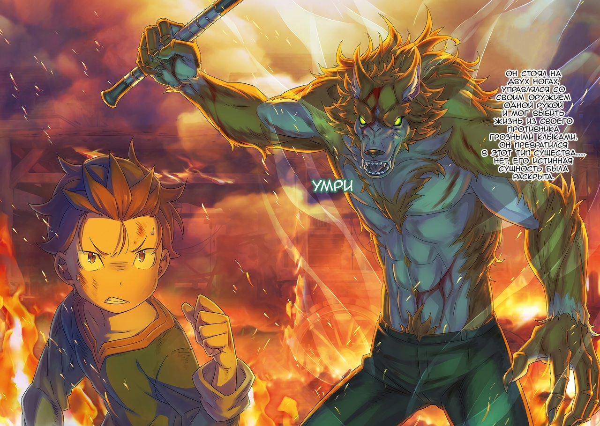
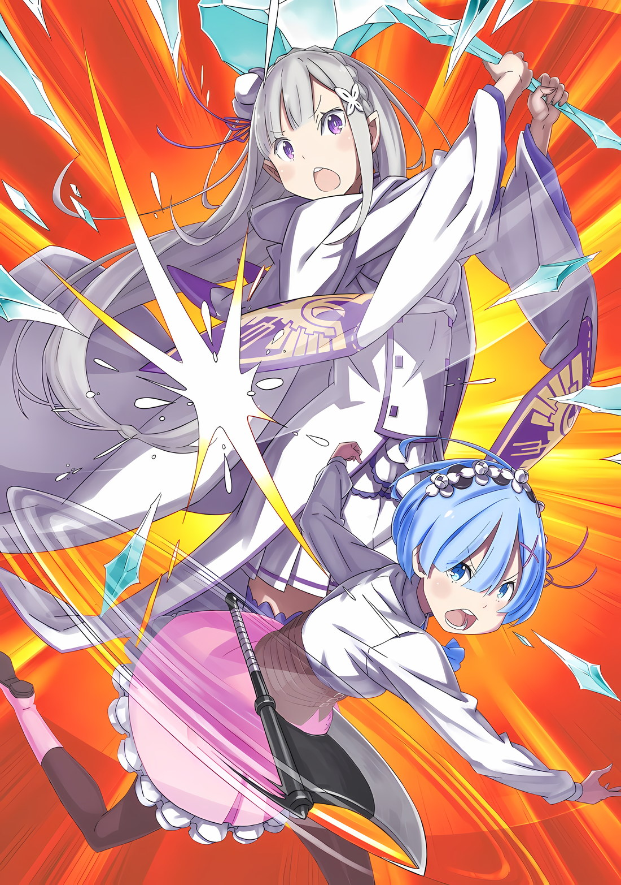

*※※※※※※※※※※※*

Кровь хлестала из пробитого плеча и бедра, неровное дыхание, наполненное лихорадочным жаром, и иссушенный кровью цвет лица говорили о том, что отсчет времени до его смерти пошел.

Если он не получит немедленного лечения, его жизнь будет в опасности, так как обратный отсчет времени уже нельзя будет остановить.

Однако, если бы была применена магия исцеления, он определенно был бы спасен. Это была абсолютно излечимая травма.

Субару: Даже если так, почему…

Рядом с разрушенной мельницей, среди стойкого запаха горелого дерева от оставшихся углей, Субару столкнулся с «Врагом» в медленно наполняющейся водой столице Империи.

И все же, это был тот, кого уже нельзя было назвать «Врагом», Тодд Фанг.

…Субару больше не хотел называть Тодда «Врагом».

С самой первой их встречи Тодд постоянно причинял ему всяческие страдания. Он много раз становился мишенью и его убивали, смерть и страх запечатлелись в его памяти, что породило глубоко запрятанную обиду.

Каждый раз, когда Субару «Посмертно Возвращался» и справлялся с нападениями Тодда, он в конечном счете исправлял каждую произошедшую трагедию.

Лес, в котором жило «Племя Судрак», был сожжен дотла, что привело к их уничтожению. Во время внезапного нападения в Городе-крепости Гуарал Флоп был убит множество раз. Во время операции по захвату мэрии Гуарала Субару испытал ощущение хождения по натянутому канату, который был подожжен.

Кульминацией всего этого стала резня на «Острове Гладиаторов» Гинунхайв, где были убиты Танза, Идра, Хиайн, Вайц, Густав, старик Нулл и многие другие его товарищи. Однако Субару удалось отменить этот исход.

Субару не собирался притворяться, будто действий Тодда никогда не было.

Просто благодаря тому, что Субару пытался защитить то, что было ему дорого, путем «Посмертного Возвращения», эти действия Тодда постепенно были стерты.

Причина, по которой Субару считал Тодда врагом, заключалась в чем-то, что существовало только в его сознании.

И, наконец, теперь, когда на столицу обрушилось беспрецедентное бедствие, и они были вынуждены отступить, Тодд проявил готовность сотрудничать с Субару и остальными, чтобы защитить свою невесту.

Действительно, без сотрудничества Тодда было бы трудно найти эффективные контрмеры против наплыва зомби, и потребовалось бы множество повторных попыток, чтобы добиться результата, при котором все бы спаслись.

То же самое было верно и для битвы с тем зомби, одноглазым воином.

Для того чтобы победить этого извращенного врага, превратившегося в монстра, Субару требовалось сотрудничество Тодда. Они оба знали, что друг без друга их жизни будут под угрозой.

Поэтому им нужен был еще один шаг.

Если бы только он сделал еще один шаг, Субару мог бы идти рядом с Тоддом, подавляя свои противоречивые эмоции.

И все же…,

Субару: Почему…!

Тодд: Не говори так лицемерно. Ты предотвратил это только что, потому что у тебя тоже было небольшое предчувствие. Ты ведь не отреагировал на мое намерение убить, ты просто был настороже все это время, верно?

Тодд закрыл свой налитый кровью правый глаз, когда Субару заговорил дрожащим голосом.

С таким лицом, будто он имеет дело с неразумным ребенком, взгляд Тодда упал на парящий в воздухе топор… или так ему казалось, когда оружие схватила черная рука.

По мнению Субару, топор был синонимом Тодда.

Субару не раз и не два получал удары топором Тодда по голове. И хотя он выхватил топор из его рук, одного взгляда на него в углу зрения было достаточно, чтобы Субару заскрежетал молярами от беспокойства.

Тодд попал в самую точку. Субару с самого начала относился к нему настороженно.

Поэтому, когда Субару повернулся спиной к раненому Тодду, он активировал «Незримое Провидение», чтобы защитить свою голову, поскольку голова была бы самым верным способом убить его в случае нападения.

Однако он, конечно, не хотел, чтобы это произошло.

Ничего из того, что произошло, никогда не должно было произойти.

В таком случае…,

Тодд: Моя вина, моя вина. Я попался прямо в твою ловушку.

Субару: Это неправда…

Тодд: Мы отделены от остальных, поэтому сразу после того, как мы разобрались с врагом, я подумал, что это мой шанс, но… Ты отличный актер.

Субару: Ты ошибаешься…

Тодд: Ты планировал подорвать меня тем взрывом? Если это так, то очень жаль, что твоя цель не была достигнута.

Субару: Нет! Я действительно хотел сотрудничать с тобой…!

Тодд: …Избавь меня от своей лжи.

У Субару перехватило горло, когда раздался холодный голос Тодда.

Прикрыв один глаз, Тодд смотрел в глаза Субару взглядом, лишенным тепла и влажности. В его взгляде не было и намека на оценку, которая была всего несколько мгновений назад.

Тодд уже закончил оценивать Субару, и именно поэтому он был таким сейчас.

Тодд: Ты тоже должен был осознать это в глубине души. Мы просто не можем понять друг друга.

Субару: …

Тодд: Внешне я подозрителен к окружающим, а ты веришь другим до последнего. Сколько бы мы ни обменивались словами, наши ценности различны.

Медленно меняя позицию, Тодд настороженно наблюдал за Субару, особенно за его топором, который парил в воздухе. Субару прикусил губу и с печалью смотрел на Тодда за парящим топором.

Тодд сказал, что они не могли понять друг друга. Субару продолжал размышлять, так ли это на самом деле.

Он задавался вопросом, действительно ли нет никакого способа сделать так, чтобы это получилось.

Субару: Если ты убьешь меня здесь, как ты справишься с зомби и…

Тодд: Ты не знаешь, когда нужно остановиться. Пока я выбираюсь из столицы Империи, все хорошо. Благодаря твоей помощи, мы смогли доставить Катю к городским стенам. После этого мне будет лучше без тебя.

Субару: Почему! У меня нет намерения причинить вред Кате-сан! Я даже не собирался с тобой драться! И все же!

Тодд: …Но ты был готов выбрать, спасать Катю или нет, верно?

Субару: А…?

Тодд, стоя перед Субару, который повысил голос, произнес одно холодное замечание.

Щеки Субару затвердели, так как он почувствовал себя так, словно его облили холодной водой.

Он понятия не имел, что тот имел в виду.

Начнем с того, что это противоречило тому, что утверждал Субару. Не было необходимости выбирать, поскольку он не имел намерения причинить вред Кате, так что такое обвинение было неуместным.

И все же, мысли Субару замерли.

…Тодд не упустил этот момент.

Тодд: …Я не буду просить прощения.

Проскользнув сквозь щель, в которой Субару споткнулся о свои слова, Тодд опустил свою стойку и бросился на него.

Ощущение сокращающегося расстояния между двумя сторонами было настолько велико, что каждая клеточка тела Субару закричала. Он немедленно приказал своей «Невидимой Руке», которая вытянулась в воздухе, метнуть топор, который он схватил, обратно в Тодда.

Однако…,

Субару: Кк, гааахк!?

Мгновенно зрение Субару окрасилось в ярко-красный цвет из-за ощущения жжения, пронзившего его правую ляжку.

В ляжке правой ноги Субару торчал нож.

Он был в руке Тодда всего мгновение назад. Прежде чем прыгнуть, он метнул нож в ляжку Субару в момент, когда тот был не в состоянии соображать, заставив его принять основную тяжесть удара.

Затем, пока он был отвлечен болью, «Невидимая Рука», которая должна была бросить топор, прервалась… парящий топор отлетел назад, а удар Тодда вперед врезался в грудь Субару.

Субару: Уф.

Тело Субару с криком боли упало навзничь, не в силах перенести вес на раненую ногу. Он ударился затылком и спиной, и его рассеянные мысли стали еще более разрозненными.

Его нога, грудь, голова, спина, а затем лезвие топора, падающее перед ним…

Субару: Ааааааа!

Он отчаянно закричал и заставил черную руку остановить топор в момент замаха вниз.

Из груди Субару высунулась «Невидимая Рука», чтобы остановить топор, который приближался к кончику его носа, и он мобилизовал свои собственные две руки, чтобы удержать дрожащее лезвие от падения, тем самым сопротивляясь убийственному намерению своими тремя руками.

Затем Тодд, держа топор, тоже надавил изо всех сил, чтобы с силой прижать раскачивающееся лезвие.

Его нога, которую проткнули, болела. Его грудь, куда его пнули, болела. Его спина, которой он ударился, болела. Болела и его голова. Если бы этот топор прошел через его лицо, это было бы мучительнее, чем все это вместе взятое, и, кроме того, такая боль была бы смертельной.

Тодд: Ты слишком упрям… кх. Сдайся и умри…!

Субару: Нет, ни за что… Абсолютно, ни за что…!

Держа руку на гребне топора, Тодд использовал весь свой вес, чтобы попытаться убить Субару.

Субару сопротивлялся тремя руками, включая «Невидимую Руку», но две руки ребенка и Полномочие, у которого не было никаких преимуществ, кроме невидимости, не могли оттолкнуть Тодда.

Со стороны это могло бы показаться очень абсурдным и жалким смертельным боем.

Битва между Субару и Тоддом была грубой и бесцеремонной на таком критическом этапе битвы за столицу Империи Рапгану, где множество солдат и воинов состязались в мастерстве и владении оружием.

У них не было ни специальных навыков, ни особого оружия, ни козырей, которые могли бы превзойти других.

По меркам Империи Волакия, это была низкосортная битва между жизнью и смертью… Решающая битва между Нацуки Субару и Тоддом Фангом, двумя людьми, которые не могли понять друг друга.

Тодд: Ты чертовски непоследователен! Твои глаза говорят, что ты готов умереть в любой момент, ты готов эгоистично положить на чашу весов жизни других людей, но когда дело доходит до этого, ты отчаянно сопротивляешься. Это жутко!

Субару: Не говори, что-то настолько неразумное…! Черта с два я готов умереть, когда угодно. Я также никогда не ставил чью-либо жизнь на весы…! Я не хочу умирать!

Тодд: Умри!

Субару: Нет!

Глаза Тодда, наполненные черным, убийственным намерением, были готовы заморозить бешено колотящееся сердце Субару. Пока продолжалось скрежетание лезвия топора, зажатого между ними, их ожесточенная битва не могла продолжаться вечно.

Потому что…,

Субару: Гх, гк…

Субару подавил стон, застрявший в горле, когда из мочек его ушей потекла кровь.

Это была обратная реакция из-за сильного использования Полномочия «Невидимой Руки». Это был пронзительный предупреждающий сигнал от разрушающегося тела Субару. Однако у него не было другого выбора, кроме как положиться на это. Иначе падающее лезвие рассекло бы лицо Субару на две части.

Тодд: Этот странный трюк, кажется, близится к своему пределу.

Жуткое выражение лица Субару и хлынувшая кровь помогли Тодду понять последствия использования «Невидимой Руки». Он знал, что если он будет продолжать в том же темпе, Субару достигнет своего предела первым.

*Чего бы это ни стоило, прежде чем это произойдет…* вот о чем он думал в тот момент.

Оба: …Кх!?

Субару и Тодд, соперничавшие за смертоносный топор, на мгновение были отвлечены оглушительным ревом.

Это было что-то далекое от центра столицы Империи, далекое от Субару и его спутников… водохранилище на окраине города, за Кристальным Дворцом, которое удерживало большое количество воды, достигло своего предела и начало разрушаться.

С грохотом по всей подпорной стене разверзлись трещины, и огромное количество воды хлынуло в столицу Империи. Это было похоже на то, как будто гигантская волна надвигалась на мир без каких-либо океанов, и когда вздымающиеся волны прокатились по столице Империи, последствия достигли смертельной схватки Субару и Тодда.

И тогда…,

Субару: Ух, ахххх…!!!

Тодд: …Кх.

На краткий миг внимание Тодда было отвлечено на ревущий звук, и Субару собрал все силы, на которые был способен.

Когда его тело лежало на земле, забыв на время о боли от ножа, вонзившегося ему в ногу, он перевернулся на бок и со всей силой своей «Невидимой Руки» потянул лезвие топора так, что оно ударилось о землю рядом с его головой.

Даже Тодд, вложивший всю свою силу в топор, не смог противостоять такому импульсу. Топор опустился прямо рядом с головой Субару, и Тодд вместе с ним упал на землю.

Субару: Хаа, хаа… фух.

Субару продолжал перекатываться из стороны в сторону, чтобы создать дистанцию между собой, Тоддом и топором.

Нож в его ноге неоднократно ударялся о землю и причинял ему сильную боль. Он плакал, переворачиваясь на другой бок, терпя агонию, так как сбежать было для него важнее.

В конце концов, после десяти или двадцати перекатов, тело Субару, ударившись об остатки здания, было вынужденно остановиться. Там ему каким-то образом удалось приподняться на руках, из его рассеченного лба текла кровь… и тут он заметил это.

Тодд: …Этот парень просто выводит из себя.

Тодд поднялся на колени, что-то сердито бормоча. Повернувшись лицом к удаляющемуся Субару, он заметил топор, глубоко вонзившийся в его левое плечо.

Субару: …

Когда Субару удалось избежать топора в своей отчаянной попытке, Тодд упал на него сверху.

Лезвие топора вошло глубоко, раздробив ему ключицу так сильно, что казалось, оно достигло сердца, но Тодд, вытирая рот и сплевывая кровь, не выказал ни малейшей слабости умирающего человека.

Было ощущение, что он был слишком крепким.

Его тело было изрезано в разных местах из-за того, что он служил приманкой для зомби, он получил сопутствующий урон от взрыва пыли, и в довершение всего этого из его тела торчал топор, но его это, казалось, не волновало.

Причина беспечности Тодда наконец-то стала понятна Субару.

Это было…,

Тодд: …Ты заметил это? Виноват, виноват.

В тоне Тодда прозвучало явное раздражение, в котором не было ни легкомыслия, ни свободы действий.

Это был голос, полный чрезмерного гнева скорее на себя, чем на своего оппонента за то, что он позволил увидеть то, что никто никогда не должен был увидеть, и что он не хотел раскрывать.

В полной мере проявив свой гнев, Тодд с силой вырвал топор из собственного плеча. Из сильно изуродованной раны только раз сильно брызнула кровь… и затем кровотечение сразу прекратилось.

Эта способность к восстановлению была чем-то таким, что должно было развиться у вида, чтобы предотвратить негативные последствия ранений во время боя или охоты. Именно такую способность к восстановлению Субару несколько раз наблюдал в этом мире.

Хотя внешне он ничем не отличался от Субару, в его жилах определенно текла другая кровь.

Он был получеловеком. И…,

Субару: …Ты что, наполовину зверочеловек?

Тодд: Верно. Но сам по себе не совсем.

На глазах у озадаченного Субару Тодд сузил свои глаза и подтвердил только половину его подозрений. Он ответил на его вопрос половинчатым ответом.

Его щеки нечеловечески исказились, а глаза загорелись кровавой яростью…,

Тодд: …Я оборотень.

*△▼△▼△▼△*

…В этом мире существовали определенные вещи, которые считались отвратительными уже одним своим существованием.

Среди таких отвратительных существ особенно выделялись полуэльфы, обладающие тем недостатком, что были связаны с «Ведьмой», которая однажды чуть не уничтожила мир. Эта репутация была распространена во всех странах.

В других местах, в Городах-государствах Карараги, безволосые полулюди считались несчастьем; а в Священном Королевстве Густеко, чем ближе волосы и глаза были к черному цвету, тем более отчужденным становился человек, поскольку считалось, что Духи таких не любят.

Аналогичным образом, в Империи Волакия, где сосуществовали различные расы полулюдей, были две расы, существование которых не одобрялось… люди-кроты и люди-волки.

В древние времена эти две расы, люди-кроты и люди-волки, были осуждены за предательство самой любимой женщины в Империи Волакия и ее смерть — преступление, за которое их никогда не простят.

В результате люди-кроты покинули свою родину и сбежали из страны, зарывшись под землю. А на людей-волков, которые не знали, как спастись, охотились до тех пор, пока не уничтожили.

Гнев Империи распространялся на соседние земли, и, если бы кто-нибудь из людей-кротов или людей-волков был обнаружен в другой стране, они были бы депортированы через границу в Империю для казни. Такова была история охоты на людей-кротов и людей-волков, как ее обычно называли.

В наше время говорили, что люди-кроты использовали свои способности зарываться под землю, чтобы скрыться от внешнего мира. Что касается выживших людей-волков, то они маскировали свое происхождение под людей-собак, чтобы скрыть свою истинную сущность, и только одна личность в мире… Халибель, «Хвалитель», сильнейший в Городах-государствах Карараги, публично называл себя человеком-волком.

Империя, чьим национальным гербом, по иронии судьбы, был волк, пронзенный мечами, безжалостно охотилась на людей-волков.

Волк Меча был самым почитаемым символом в Империи, в то время как волк, убегающий из страха быть пронзенным мечом, был самым презираемым.

Таким образом, в этом мире как существование людей-волков, так и полузверолюдей с кровью людей-волков… «Оборотней» продолжало нести на себе проклятие, которое никогда не могло быть прощено.

*△▼△▼△▼△*

Субару: Оборо… тень…

Субару был совершенно ошеломлен, когда Тодд заявил об этом, вертя в руке топор, который он вытащил из собственного плеча.

Знать о малоизвестном секрете Тодда, который часто вступал с ним в конфликт, и не знать, какую эмоцию испытывать, положительную или отрицательную, — это было одно, но больше всего на свете сейчас он чувствовал страх.

Звучание слова «Оборотень» в его ушах стало для него неожиданностью. Это было инстинктивное отвращение.

…Субару ничего не знал об истории остракизма «Оборотней» в этом мире.

Он ничего не знал о том, что и люди-волки, и люди-кроты вызывали отвращение в Империи, что причиной тому было предательство женщины по имени Ирис, что ее истинной личностью была Йорна Миссигр, или что ее любимым Императором был не Винсент Волакия.

Он ничего не знал ни об одном из этих обстоятельств.

Даже ничего не зная о них, душа Субару понимала. …Насколько чуждым было существование «Оборотней» в этом мире.

Тодд: Этот удивленный взгляд немного отличается от того, что я ожидал. Ты удивлен тем, что я наполовину зверочеловек, но не удивленным тем, что я оборотень.

Тодд посмотрел на молчащего Субару и нахмурил брови с таким выражением лица, словно отказывался от своих ожиданий.

Тодд: Но теперь мы можем сделать это без всяких странных оговорок, верно? Оборотни созданы для того, чтобы быть повешенными. Это проклятие, которое течет в их крови. Ты тоже…

Субару: Почему?

Тодд: Хмм?

Субару: Почему, неужели до этого дошло? Я никогда…

Он не мог сказать, что никогда не думал об убийстве Тодда.

Но дело было не в крови Тодда или его происхождении, а в том, что его собственные действия были несовместимы с действиями Субару, и у него не было другого выбора, кроме как вступить с ним в конфликт.

И все же, то, как Тодд говорил сейчас…,

Субару: Не веди себя так, будто твоя кровь — это причина, по которой ты стал моим «Врагом».

Тодд: …

Субару: Ты сталкивался со мной, много раз, потому что это была проблема между мной и тобой! А не из-за того, кто ты есть, и не из-за того, что твоя кровь провоцирует меня!

Скрежеща коренными зубами, Субару уперся кулаком в землю и поднялся на ноги.

Сильная боль от ножа в его ноге; она пронеслась по его телу с огромной скоростью, но она также прояснила его сознание и гнев, который кипел в его груди.

Субару: Ты стал оборотнем сам по себе…!

Тодд: Ох, сам по себе? Я не буду слушать это от тебя…

Субару: Заткнись, черт возьми! Почему, почему ты такой!

Ни одна вещь не шла Субару на пользу, и когда он испытывал позитивные чувства, это вызывало негативные действия, а когда у него были позитивные мысли, это вызывало негативные проблемы.

После того, как он помог Кате, спас Рем и Флопа и объединил усилия, чтобы победить грозных зомби, теперь он пытался убить Субару, подавившись этой идеей, и, в довершение всего этого, он был оборотнем.

Субару: Почему!

Тодд: Не говори мне о том, кем рождаются люди. Так оно и есть. Моя мать могла переспать с собакой. Если подумать, в задней части моего дома всегда жила большая собака, может, это был мой отец?

Субару: Нет, это не так! Это как раз ты говоришь о рождении!

Тодд: …

Субару: Я не тот, кто смотрит на тебя так… Кх.

Субару понятия не имел, какую жизнь вел Тодд как оборотень.

Да он и не хотел этого знать. Если бы он знал, то наверняка стал бы искать причину, чтобы простить Тодда. Поэтому он и не хотел знать. Субару не хотел прощать Тодда по какой-то неизбежной причине.

Вот почему…,

Субару: …Я принял решение.

Пробормотал Субару напряженным голосом, в голове у него все смешалось от гнева и боли.

Услышав бормотание Субару, глаза Тодда сузились. Даже без слов тишина заставила его задуматься о том, что он решил сделать.

И тогда Субару объявил о своем решении.

Субару: Я не собираюсь убивать тебя. Все пойдет не так, как ты хочешь.

Тодд: …

На тихое заявление Субару, Тодду нечего было сказать в ответ.

Однако он не стал молчать. …Он рассмеялся.

Тодд: Ха, хахаха, ха! Ха! Ха! Ха! Ха!

Взъерошив волосы рукой, в которой не было топора, Тодд открыл рот и рассмеялся. Не заботясь о том, что его волосы и лоб были испачканы кровью, Тодд широко открыл рот и разразился смехом.

Затем, посмеявшись некоторое время, он осторожно покачал головой,

Тодд: Ты чудовище. Похлеще того зомби.

Более отчетливо, чем когда-либо, он посмотрел на Субару, и в его глазах были видны эмоции.

Субару понял, что это были за эмоции, которые скрывались за этим черным убийственным намерением; это был первый раз, когда они проявились. Много раз до этого он видел это в зеркале.

Это был страх. …Именно страх перед непостижимыми вещами является основополагающим фактором «Смерти».

Тодд: Отсутствие самосознания — плохая черта. Ты выбираешь между жизнью и смертью. Кого спасать, кому позволить умереть — ты решаешь сам. Я проявлю благосклонность к тем, кто подлизывается ко мне, но мне нет дела до тех, кто этого не делает. Я без колебаний буду льстить кому угодно, но…

Субару: …

Тодд: Как я могу иметь отношения с человеком, который решает, кому жить, а кому умереть, основываясь на своих переменчивых прихотях?

…Таков был ультиматум Тодда Фанга.

Субару: …

Выплюнув это, кости Тодда заскрипели, когда его форма изменилась.

Раны, выглядывавшие сквозь прорехи его формы имперского солдата, были закрыты, а его кожа покрылась шерстью животного, цвет которой совпадал с цветом волос на его голове. Его нос выпятился, рот стал шире, словно его разорвали, а недавно выросшие белые зубы начали заостряться, превращая его облик в свирепого зверя.

Оборотень, он выглядел именно так, как и заявлял.

Он стоял на двух ногах, управлялся со своим оружием одной рукой и мог выбить жизнь из своего противника грозными клыками. Он превратился в этот тип существа… нет, его истинная сущность была раскрыта.

Тодд: Умри.

С этими словами Тодд снова шагнул к Субару.

Его шаг был размашистым, а скорость, с которой он отталкивался от земли задними лапами, просто поражала. Его целью было убить Субару, объект его неведомого страха, не позволив своему противнику, знавшему его истинную личность, остаться в живых.

Боевой дух Субару взорвался, когда он осознал это.

Субару: …Незримое Провидение.

Тодд, ставший оборотнем, с топором в руке бросился на Субару.

Прежде чем лезвие смогло достичь его, Субару подхватил обломки черной рукой, торчащей из его груди, и отбил топор в другую сторону, мимо головы Тодда.

Тодд: …Кх!

Но даже если топор исчез, у Тодда теперь было другое оружие — его клыки.

Субару использовал «Невидимую Руку» для блокировки топора и теперь не мог полагаться на свое Полномочие, чтобы блокировать клыки Тодда.

Вместо этого Субару собственноручно вытащил нож, который был воткнут ему в ногу.

Субару: Гх, ааа!!!

Крича от сильной боли, к которой он так и не смог привыкнуть, Субару взял нож, который он вытащил, в обе руки, и зажал его в щели между клыками Тодда.

Смыкающиеся острые клыки были остановлены ножом, и лицо Субару опустилось вниз, когда изо рта кусающего нож оборотня потекла слюна, капая ему на щеки.

Тодд: …Ох!!!

Субару: Аааааа!!!

Вот так, его клыки выдвинулись вперед, сомкнувшись на шее Субару.

Отчаянно пытаясь удержать его, Субару закричал от боли…

Субару: Я… не собираюсь тебя убивать…!

Он закричал, когда его собирались убить, как раз перед тем, как кончики его клыков вонзились ему в шею.

Тот, кто собирался отнять жизнь, был наказан тем, чья жизнь собиралась быть отнятой.

Даже если его толкнут на край и откусят голову, даже если он лишится жизни, даже если его отправят обратно туда, где он был в середине битвы.

По причинам, неизвестным Субару, Тодд испытывал чувство горя и обиды на весь мир.

Это произошло в тот момент..

???: …Достаточно.

Раздавшийся голос застал Субару врасплох, звучно затронув его душу.

Каждый вздох зверя, каждый слабый гул земли, каждая частичка продолжающегося хаоса в различных частях столицы Империи — все это было шумным адом, где каждый звук бушевал так, как ему заблагорассудится.

Но даже в таком мире ничто не могло помешать этому голосу.

Как будто само существование Нацуки Субару было создано для того, чтобы резонировать с этим голосом.

Тодд: Гх…

Сразу же после этого, когда его тело прижалось к телу Субару, пытаясь вонзить свои клыки, чтобы покончить с его жизнью, Тодд был снесен мощным ударом, врезавшимся в него сбоку.

Субару: …

Перед ним Тодд, ставший оборотнем, оказался на виду, и в глазах Субару отразились сияющие осколки льющегося дождем льда. То, что разбросало их, было молотом, сделанным изо льда.

Мощным ударом с использованием большого ледяного молота Тодд был отправлен в полет.

А та, что замахнулась ледяным молотом обеими руками, заставляя танцевать свои длинные серебристые волосы, была девушка в белом наряде с потрясающе красивой фигурой…,

Субару: …Эмилия.

Губы Субару бессознательно шевельнулись, чтобы повторить имя, которое внезапно промелькнуло у него в голове.

Девушка оглянулась, ее аметистовые глаза моргнули и встретились с его черными очами. Субару, очарованный красотой ее глаз, невольно ахнул.

Эмилия: Вы там, идите сюда!

Субару: А?

Он забыл дышать, или, возможно, задержал дыхание, но оно было насильно прервано.

Белые пальцы, протянувшись с огромной силой, подхватили тело Субару на руки с такой мощью, которую нельзя было вообразить по ее внешнему виду. Не раздумывая, девушка, Эмилия, подхватила Субару, который был испачкан кровью, согнув колени со словами: «Хорошо».

Эмилия: Хаа!

С криком Эмилия подпрыгнула, оттолкнувшись ногой от стены соседнего здания и вскочив еще выше, на крышу дома. Субару, заключенный в ее объятия, был ошеломлен, но вскоре все понял.

Под ними улица под зданием, где приземлилась Эмилия с Субару на руках, была с огромной скоростью сметена грязным потоком, поглотившим все, что попадалось в поле зрения.

Эмилия: Это было опасно… Вас чуть не поглотила вода.

При виде этого ошеломляющего зрелища Эмилия с облегчением похлопала себя по груди.

Реакция Эмилии не передавала особой срочности или ощущения трагедии, хотя сцена отчаяния была ошеломляющей, поскольку и руины зерновой мельницы, которая была взорвана взрывом пыли, и улица, по которой Тодд тащил зомби, пока все приготовления для их плана не были подготовлены, были поглощены внезапным наводнением.

Если бы она была немного медленнее, Субару был бы поглощен потоком, как и говорила Эмилия. Если бы это случилось, он никак не смог бы выжить…,

Эмилия: …Кх, этот парень!?

Тодд, который был на грани того, чтобы загрызть Субару до смерти, был отправлен Эмилией в полет.

Если бы ему не удалось спастись, он был бы также поглощен потоком воды? Если бы его поглотила сила воды, Тодд никак не смог бы выжить.

Забыв о боли в ноге, Субару быстро огляделся и стал искать Тодда на грязных улицах столицы Империи, поглощенных мутной водой. Субару даже не знал ответа на вопрос о том, хотел ли он, чтобы Тодда нашли или нет.

Эмилия: Эй, расслабьтесь! Кого вы ищете… О! Присмотревшись повнимательнее, я вижу, что вы сильно ранены! Мне нужно немедленно вас вылечить…

Пока Субару лихорадочно озирался по сторонам, Эмилия заметила рану на его ноге и подошла, чтобы усадить его на край крыши,

Эмилия: Держитесь! Скоро здесь будет специалист по магии исцеления…

Субару: У меня нет на это времени! Оставь меня в покое, и…

Эмилия: Вы тот, кто должен хорошо заботиться о своих ногах…

Эмилия приподняла бровь, глядя на Субару, когда он попытался встать, отмахнувшись от ее совета. Однако ее ругань была прервана до того, как достигла своего завершения.

Ее большие аметистовые глаза широко раскрылись, и он увидел, как сцена позади него отражается в ее прекрасных очах.

Когда Субару сидел на краю крыши, оборотень выскочил из-за его спины, прорвавшись сквозь воду, и открыл свою зияющую пасть, чтобы укусить Субару за шею.

Субару: …

Либо укус утянет его в воду, либо он безжалостно перекусит ему яремную вену. Это был момент, который даже Эмилия, находящаяся прямо перед ним, не смогла бы вовремя остановить.

Упорство Тодда не поддавалось даже наводнению и пыталось вырвать жизнь Субару.

В этот момент…,

???: …Не трогай.

Шум сильного ветра донесся до него, когда он услышал шаги, ступающие по крыше.

Ни измученный Субару, ни слишком отстраненная Эмилия не смогли остановить атаку Тодда.

Вместо этого к нему подскочила девушка с сердитыми светло-голубыми глазами.

???: …Его!!!

Одновременно с этим криком был выпущен топор, которым со всей силы замахнулись.

Субару отбил топор, когда оборотень бросился на него. Каким-то образом он попал в руки этой девушки и был направлен обратно против своего владельца, который пытался укусить Субару.

Тодд: …Гах.

Вторая атака пронеслась над раной на его левом плече, куда когда-то глубоко вонзился топор. Удар сбил человека-волка с ног, и его огромное тело было отброшено в мутную воду.

С громким всплеском и столбом воды, на этот раз оборотень… Тодд Фанг ушел под воду.

???: Хаа, хаа, хаа…

Девушка, которая размахивала топором, тяжело дыша, с вздымающимися плечами, прижимала голову Субару к своей груди. Сделав это, она выронила топор из своих дрожащих рук в воду и опустилась на колени.

Затем светло-голубые глаза Рем и черные глаза Субару встретились.

Рем: Похоже, с тобой все в порядке.

Субару: Я не совсем в порядке, но…

Субару ответил Рем колеблющимся тоном, опустив уголки глаз со слабым чувством облегчения.

Затем он огляделся в поисках Тодда, которого ударом Рем отбросило в воду. …Его нигде не было видно. Его никак нельзя было найти. И даже если бы его нашли…

Субару: …Кх.

С разочарованием и горечью, поднимающимися внутри него, Субару положил руку себе на грудь.

Субару и Тодд никак не могли по-настоящему понять друг друга. То, что Субару хотел, чтобы он понимал, и то, что Тодд не хотел, чтобы его понимали, — ничего из этого.

Именно это и расстраивало его. Это было так неприятно и разочаровывающе.

С этим чувством беспомощного разочарования…,

Эмилия: Рем! Слава богу. Исцели раны этого мальчика! Затем, быстро, к Субару…

Рем: Погодите! Это тот самый ребенок! Этот мальчик и есть он! Это тот, кто называет себя Нацуки Субару…

Эмилия: Ха!? Этот ребенок — Субару!? Но он такой милый…?

Медленно, мало-помалу, силы Субару покидали его на краю крыши, а прямо перед ним две девушки, которые помогли ему… Эмилия и Рем, кричали то одно, то другое о Субару.

Затем в его голове промелькнула мысль: *сколько времени прошло с тех пор, как я видел этих двух людей, разговаривающих друг с другом вот так передо мной…?*

Субару: Тодд, ты полный придурок…

С этим чувством разочарования и поражения, ставшим последней каплей, сознание Субару внезапно померкло.
