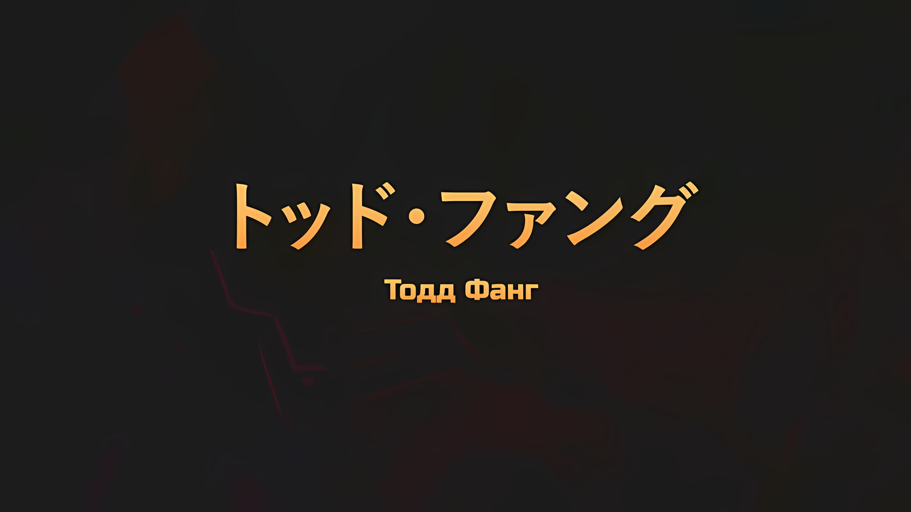
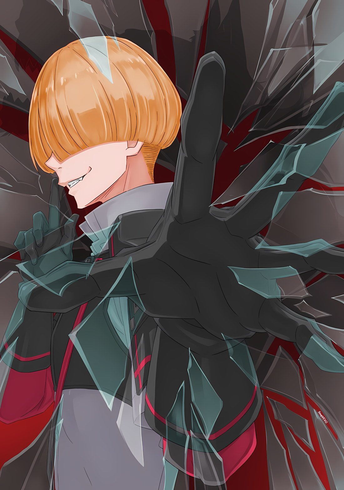

*※※※※※※※※※※※*

…Тодд Фанг — солдат Империи Волакия, состоящий в звании Рядового Первого Класса.

Он жених Кати Орели, младшей сестры его сослуживца Джамала Орели. Начиная с того момента, когда он был отправлен в Джунгли Будхейм на востоке Империи, и заканчивая сражением с повстанческой армией в Городе-крепости Гуарал, он занял официальную должность подчиненного «Пожирательницы Духов», Генерала Первого Класса Аракии.

Осада столицы Империи Рапганы была начата повстанцами, которые одновременно подняли восстание.

В этой битве он участвовал в качестве солдата, сражаясь изо всех сил, с оружием в руках, доблестно противостоя повстанцам, чтобы защитить граждан столицы Империи… И прежде всего, чтобы защитить свою невесту Катю.

Его истинной идентичностью было существование, которое считалось отвратительным в Империи Волакия, — «Оборотень»; подвергаясь исторической дискриминации и преследованиям, он пришел к установлению собственного образа жизни как существа, несовместимого с другими.

Это, без сомнения, был оборотень Империи, известный как Тодд Фанг.

*…Я не намерен рассказывать вам больше, чем это.*

