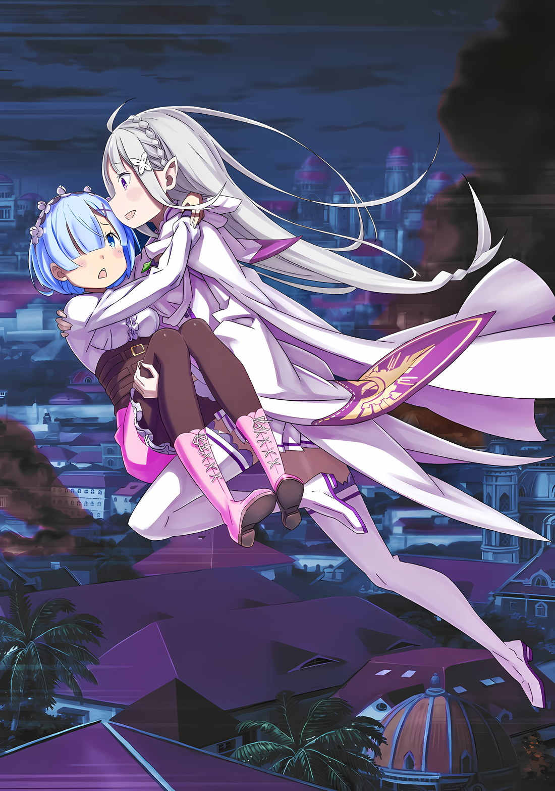

*※※※※※※※※※※※*

…Когда «Облачный Дракон» влетел в столицу Империи, оставив Мэделин позади, Эмилия решила последовать за Сесилусом, который гнался за ним, но она отстала и решила спрятаться в городе.

Эмилия: Эй, вы там! Возьмите эту девушку и отступите! Я заморозила ее конечности, чтобы она не сопротивлялась, поэтому, пожалуйста, обращайтесь с ней помягче!

Она не забыла доверить замороженную Мэделин солдату, который внимательно изучил ситуацию.

Мэделин, замороженная во льду, не подавала признаков пробуждения, а так как ее конечности были сильно заморожены, опасения по поводу того, что она вызовет беспорядки в штабе, должны были быть минимальными.

Эмилия: …Чувствуется очень неприятная атмосфера.

Оставив Мэделин на попечение кого-то другого, Эмилия создала ледяную лестницу и перелезла через городские стены. Она чувствовала тревогу от атмосферы, которая царила в столице Империи.

Сам воздух не должен был меняться внутри и снаружи городских стен, но на коже, определенно, ощущалось покалывание, которое грозило выбить сердце Эмилии из колеи.

Однако она не могла позволить себе поддаться покалывающему ощущению в своем сердце и отступить.

Эмилия: Мезорея и Сесилус направились ко дворцу.

Битва с «Облачным Драконом» Мезореей закончилась бы полным поражением Эмилии, если бы не вмешался Сесилус. Только благодаря ему ей удалось выстоять, но она постоянно размышляла о том факте, что чуть не потерпела поражение.

Эмилия: Несмотря на то, что я просила всех проделать весь этот путь до Волакии.

Конечно, все беспокоились о Субару и Рем, которых отправили в полет. Если бы она сказала что-то подобное сейчас, никто бы не стал винить только Эмилию.

Тем не менее, на Эмилии лежала ответственность как на самом важном человеке в лагере.

Эмилия должна была осознавать важность Розвааля как ее сторонника, а также важность другого, совершенно иного рода. Она должна была признать важность усилий каждого, чтобы исполнить свои собственные желания.

Поэтому…,

Эмилия: Поэтому… я должна очень усердно работать, чтобы выполнить то, что, как я сказала, могу сделать.

Перебравшись через высокие городские стены, Эмилия наконец-то вышла на улицы столицы Империи и увидела городской пейзаж.

Хотя атмосфера столицы Королевства Лугуника сильно отличалась от атмосферы столицы крупного государства, упорядоченное и аккуратное расположение зданий и функциональных зон даже с точки зрения Эмилии можно было воспринять как результат продуманного городского планирования.

Император Империи, должно быть, имел четкое видение будущего и прилагал все усилия, чтобы сделать этот город и страну лучше.

Эмилия: Даже если ты очень стараешься, вот как это получается, хах…

Однако впечатление, которое кто-то мог бы получить от городского пейзажа столицы Империи и ее нынешнего состояния, разительно отличалось.

Независимо от того, каких намерений придерживался Император, когда речь шла об управлении Империей, ответом, к которому пришла часть имперских граждан, было это восстание, и Эмилия была на стороне, поддерживающей его.

Хотя можно сказать, что это произошло постепенно или в результате обстоятельств, Эмилия не встала на их сторону бездумно; она выслушала их, обсудила это со своими товарищами и приняла решение.

Конечно, она не думала, что было бы лучше лишить Императора жизни, как того хотели многие предатели, а скорее захватить его в плен и вести переговоры с Авелем и другими.

Однако надежды и желания Эмилии были преданы так, как она и представить себе не могла, в результате событий, произошедших в столице Империи.

Эмилия: …Что?

Вдалеке, возле великолепного здания под названием Кристальный Дворец, расположенного на задворках столицы Империи, виднелась гигантская фигура, столкнувшаяся с «Облачным Драконом», взлетевшим с поля боя.

Столкновение между двумя гигантскими существами еще больше увеличило опасность осады столицы Империи на один или два уровня, но было еще кое-что, что удивило ее больше.

…В Кристальном Дворце, где бушевала ожесточенная битва, и по всей столице Империи в большом количестве появлялись бледные фигуры, нападающие на убегающих людей.

Эмилия: Я не хочу…

В тот момент, когда Эмилия заметила их присутствие, холодок пробежал у нее по спине.

Чувство, которое испытывала Эмилия, не было просто физическим отвращением, вероятно, именно ее природа как Пользователя Духовных Искусств заставляла ее испытывать к ним неприязнь.

Духи были естественными сущностями, которые, по желанию мира, появлялись на свет.

С другой стороны, то, что вызывало у нее дрожь, было неестественными сущностями, нечистыми существами, которых мир не признавал, и Эмилия интуитивно чувствовала это как Пользователь Духовных Искусств.

В то же время Эмилия поняла, что внутренний конфликт Империи, который был болезненным и печальным, превратился в жестокую борьбу за выживание между не только людьми, но и нечеловеческими существами.

Эмилия: …

В тот момент, когда она поняла это, значение этого поля боя изменилось внутри Эмилии.

Чтобы максимально использовать имеющиеся возможности, Эмилия подняла обе руки и произвольно создала ледяные лестницы в пределах досягаемости звездообразных городских стен, окружающих столицу Империи.

Создавая ледяные лестницы везде, где только можно, Эмилия превратила ситуацию, когда невозможно было войти или выйти, не пройдя через городские ворота, в ситуацию, когда можно было войти или выйти из других мест, кроме ворот, тем самым увеличив пути эвакуации.

Эмилия: Все! Бегите к стене! Не обязательно идти к воротам, вы можете сбежать оттуда!

Громко крикнув, Эмилия спустилась с городских стен в город.

Как только она это сделала, появилось бледное существо, словно выросшее из-под земли, и потянулось к Эмилии. Она безжалостно сразила его ударом ледяного меча.

Эмилия: Я думаю, у вас, ребята, тоже есть свои цели, но…

Эмилию нельзя было безропотно уговорить сесть за стол переговоров, когда другие нападали на нее без объяснения причин.

Все, кто стоял на ее пути, были одеты в военную форму имперских солдат, и когда они подверглись атакам прорывавшейся сквозь них Эмилии, их тела разбивались и рушились, как керамика. Однако их изломанные тела немедленно начинали срастаться, и они возвращались в свое первоначальное состояние, неспособные быть полностью побежденными.

Эмилия: Если это так, то…

Даже оказавшись в невыгодном положении, Эмилия проявила свою смелость, не отступив.

Против противника, который встанет, даже если раздавить, Эмилия предпочла замораживать его ударами меча, а не разбивать вдребезги.

Эмилия: Хия! Хаа! Урья, урья, урья!

Сражаясь с одним, затем с двумя, затем с тремя, а затем с четырьмя восставшими «Врагами», Эмилия пинала стены, землю и улицы имперского города во всех направлениях, прыгая и нанося удары.

«Враги», атакованные Эмилией и получившие ледяные повреждения, как и следовало ожидать, не могли восстановить свои раны до первоначального состояния. Однако были и такие «Враги», которые сами разрушали свои ледяные части, а затем восстанавливали их.

Эмилия: Что ж, тогда я лишу их этого подхода!

Если противник отвечал, то Эмилия еще больше превзошла бы их реакцию.

Если замораживание какой-либо части тела не помогало, она атаковала «Врагов», замораживая все их тело. Конечно, сила, используемая при этом против одного такого «Врага», была бы больше, но она ничего не могла с этим поделать.

Ее недостающая выносливость была восполнена решимостью, и Эмилия расчистила улицы всего района.

Эмилия: Вперед, быстрее! Если вы уйдете прямо сейчас, они не встанут у вас на пути, бегите, бегите!

Эмилия направляла жителей столицы Империи, которые не спешили спасаться бегством, делая улицы, которые она расчистила, понятными для всех. Сама она тем временем направилась в противоположном направлении от тех, кто мчался к городским стенам, и на полной скорости понеслась по дороге вглубь города.

Эмилия: Кто-то совершает все эти злодеяния…!!!

«Враги», появляющиеся один за другим, были вызваны неестественным явлением.

Это означает, что, подобно магии или проклятиям, в их появлении участвовала чья-то воля. Если заклинатель был там, то, по сути, не было бы никакого разрешения, если бы они не были остановлены.

Существовал предел того, что Эмилия могла заморозить.

К счастью, Эмилия, обладавшая невероятно большим запасом маны, все еще могла двигаться, но после сражения с Мэделин, при участии Мезореи, создания лестниц, ведущих внутрь и наружу городских стен всего мгновение назад, а затем сражения с «Врагами», которые появлялись один за другим, она чувствовала усталость.

Эмилия: Хотя быть немного энергичнее других должно быть моей сильной стороной… кх.

Жалея о своей нехватке сил, Эмилия бежала по улицам столицы Империи.

Она могла бы двигаться быстрее, если бы направилась прямо к Кристальному Дворцу, но ей нужно было защищать людей, на которых по пути нападали «Враги». Это был предел ее скорости, так как она помогала им.

Пока она размышляла об этом, она увидела на улице другую группу людей, изо всех сил старающихся не попадаться на глаза «Врагу»…,

Эмилия: Я проложу путь, сейчас же!

Там было четверо «Врагов», которые, казалось, собирались помешать группе выйти на улицу; в тот момент, когда они повернулись спиной, Эмилия спрыгнула с крыши здания, и прежде чем они успели обернуться, чтобы увидеть ее, сверкнуло ее ледяное лезвие…

Эмилия: …

Голубовато-белый, сверкающий ледяной меч рассек атмосферу, превратив четырех «Врагов», попавших под удар, в ледяные статуи.

Убедившись, что ее «Враги», застывшие с выражением удивления на лицах, были должным образом заморожены, Эмилия преобразовала свой ледяной меч в ману и повернулась к другой стороне улицы.

Эмилия: Теперь вы в безопасности! Если вы будете использовать лед как ориентир, то сможете выбраться отсюда!

???: Б-большое спасибо. Вы спасли нас.

Эмилия окликнула их, и голос ответил с другой стороны.

Эмилия подняла руку в ответ на их благодарность и подумала о том, чтобы возобновить путь к центру, как только люди благополучно перейдут дорогу.

Она так и думала, но…,

Эмилия: Ого, как много детей…

Широко раскрыв глаза, Эмилия увидела, что с другой стороны улицы выскользнула группа из почти двадцати человек. Более того, большинство из них были детьми лет десяти, и все с темными волосами.

Эмилия моргнула глазами на эту необычную группу, так как черные волосы сами по себе были редкостью.

Было слишком много детей, чьи лица не были похожи друг на друга, чтобы все они принадлежали к одной семье, и это навело ее на мысль, что, возможно, это не так.

Затем один из немногих взрослых в группе помахал Эмилии рукой,

???: Эй, эй, вы действительно спасли нас! В любом случае, у нас дел по горло, мы просто пытаемся убежать и спрятаться. У меня были проблемы с решением, играть ли мне самому роль приманки или нет.

Эмилия: Вот как? В таком случае, я рада, что вы этого не сделали. Дальше все будет хорошо, так что все должны работать вместе и не проявлять нетерпения.

???: Понятно. Мисс, я благодарю вас от всего сердца! Ну что ж, Миссис! Мисс Катя!

Катя: Н-не кричи так громко… Будет плохо, если эти парни снова появятся…!

Это была девочка на том конце линии, которая ответила на зов светловолосого молодого человека с веселой улыбкой. Эмилия была слегка удивлена, когда увидела маленькую девочку, ехавшую в инвалидной коляске.

Эмилия: Кроме той, которую сделал Субару, это первая, что я вижу.

Инвалидные коляски были полезны для транспортировки людей с больными ногами, но такое приспособление встречалось редко. Эмилия знала о них еще и потому, что видела настоящую инвалидную коляску, которую Субару с трудом спроектировал и собрал для спящей девушки.

Теперь, когда Субару и Рем были отправлены в полет, эта инвалидная коляска осталась в особняке Розвааля, но…,

Рем: Катя-сан, пожалуйста, не сердись так… Я понимаю твою тревогу после разлуки с женихом.

Катя: Н-не говори лишнего! Ты ведь тоже все это время переживала за этих детей…! Не разговаривай только со мной.

Рем: Это не было моим намерением.

Эмилия, чей взгляд был прикован к девочке со слабыми ногами, не сразу узнала девушку, стоявшую позади нее и толкавшую инвалидную коляску.

Держась за ручки на спинке инвалидной коляски и толкая ее, там стояла девушка с голубыми волосами…,

Эмилия: …Рем?

Рем: …

Непроизвольно, губы Эмилии произнесли это имя, и ее глаза встретились с глазами девушки, которая удивленно подняла голову.

Она пристально вглядывалась в лицо девушки, которая смотрела на нее широко раскрытыми глазами. Эмилия впервые видела ее с открытыми глазами, она выглядела точь-в-точь как та девушка, которую Эмилия очень хорошо знала.

Этого и следовало ожидать, ведь Эмилия слышала, что эта девушка и та, которую она знала, были близнецами. …И узнала она об этом не от кого иного, как от своего надежного Рыцаря.

Рем: Вы знаете меня?

Подняв бровь, девушка… Рем подозрительно посмотрела на Эмилию.

Эмилия ахнула от этого вопроса девушки, прижавшей одну руку к груди. Застряв в середине разговора пары, девочка в инвалидном кресле смотрела туда-сюда между лицами Эмилии и Рем.

А затем,

Катя: Е-еще один твой знакомый? Как много людей ищут тебя… Вах!

Эмилия: Рем!

Перепрыгнув через женщину, бормочущую что-то с кислым видом, Эмилия сократила расстояние и взяла Рем за руку.

Глаза Рем расширились от ее движений, но Эмилия не была достаточно собранной, чтобы обратить внимание на ее удивление. Все еще сжимая ее руку, она прослезилась при виде Рем перед собой.

Эмилия: Проснулась… Рем проснулась! Потрясающе! Это грандиозно! Быстрее, я должна сообщить Рам и Субару!

Рем: П-погодите, пожалуйста, кто вы такая?

Эмилия: Ммм, было сообщение от Рам о встрече на выходе, так может она уже на выходе? Ну и дела! Почему Субару пропал в такое время… Умм, эмм…

Рем: Пожалуйста, послушайте, что я говорю!

Из-за стольких неожиданных происшествий в голове Эмилии царил полный беспорядок, и именно Рем затормозила ее мысли.

Она сердито уставилась на Эмилию, которая все еще сжимала ее руку,

Рем: Вы тоже назвали меня Рем… Вы кто-то, кто знал меня раньше?

Эмилия: Ах, нет, на это немного сложно ответить. Я не помню тебя, когда ты не спала. Итак, это странно, но кажется, что мы встречаемся впервые.

Рем: Я не знаю, что вы имеете в виду…

Эмилия: Ммм, я не очень хорошо умею объяснять, поэтому не уверена, что смогу донести это правильно…

Эмилия почувствовала себя виноватой и задумалась о том, что сказать озадаченной Рем.

Это было прекрасное чувство — иметь возможность говорить с Рем, когда она бодрствует, но для Эмилии она была младшей сестрой Рам, и девушкой, которая спала больше года. Она была тем человеком, чьи «Воспоминания» из того периода, когда она была в сознании, были украдены силой Архиепископа Греха «Чревоугодия».

Если бы не слова Субару и не сходство Рем с Рам, убедившее ее в том, что ее «Воспоминания» о ней действительно были украдены, сама Эмилия не испытывала бы никаких особых чувств.

Однако кое-что можно было понять из рассказа Рем и из того, что знала сама Эмилия.

Это было…,

Эмилия: Рем, возможно ли, что ты не помнишь, что произошло до того, как ты проснулась?

Рем: …Ну, я не знаю, как относиться к тому, что было до и после моего пробуждения, но да.

Эмилия: …Значит. Вот как это бывает.

У нее была надежда, что, возможно, когда Рем проснется, у нее появятся «Воспоминания» о времени, проведенном с Эмилией и другими, и что она сможет рассказать ей об их предыдущих отношениях.

К сожалению, эта надежда не оправдалась, но все же,

Эмилия: Но тебе не нужно ни о чем беспокоиться. Возможно, ты действительно беспокоишься, потому что многого не понимаешь, но я помогу тебе, а Рам и Субару будут рядом с тобой!

Рем: …Кто вы для меня?

Эмилия: Если бы я просто описала наши отношения, я бы сказала, что мы гость и горничная. Но я не думаю, что это единственный тип отношений, который у меня есть с Рам, так что, думаю, я хочу иметь нечто большее и с тобой, Рем.

Рем: …

Эмилия: Оказывать друг другу помощь, когда мы в ней нуждаемся, думать вместе, когда у нас возникают проблемы, и сталкиваться с трудными вещами бок о бок… Может быть, я не очень хорошо могу объяснить такого рода отношения.

Когда Эмилию спросили, кем она приходилась Рем, она не была уверена.

Причиной тому было то, что ее отношения с Рем были сведены к нулю и должны были быть собраны заново. Таким образом, она смогла бы рассказать только о том, как она хотела бы их собрать, и о своих перспективах на это.

Эмилия: Я хочу найти с тобой общий язык, Рем. Давай вместе сделаем все, что в наших силах.

Это было искреннее убеждение Эмилии и ее перспективы на будущее.

Рем: …

Услышав ответ Эмилии, глаза Рем расширились, а губы несколько раз открылись и закрылись.

Однако мысли не так-то легко облекались в слова, и ее губы открывались и закрывались снова и снова. Вот так просто момент, казалось, медленно ускользал, но…,

Флоп: Миссис, у меня такое чувство, что она на твоей стороне.

Рем: Флоп-сан…

Флоп: Я встречал много людей как торговец, но редко встретишь кого-то настолько прямолинейного. Я уверен, что ей можно доверять.

Это был светловолосый молодой человек по имени Флоп, который сказал это заикающейся Рем.

Услышав его яркое и жизнерадостное утверждение, Рем подняла брови, а затем снова повернулась, чтобы посмотреть на Эмилию. Та встретила этот взгляд с гордостью в груди.

Увидев такое отношение Эмилии, Рем тихонько вздохнула,

Рем: …Я верю, что вы та, кто знает меня, и что у вас нет злого умысла.

От нерешительности Рем ее сердце на мгновение сжалось. Глаза Эмилии расширились, а ее бледно-голубые глаза слегка сузились,

Рем: Хм, ранее вы упоминали имя «Субару»…

Эмилия: А? Да, упоминала. Субару — это тот, кто очень беспокоится о тебе и всегда дорожил тобой…

Рем: …Если это правда…

Рем опустила глаза на ответ Эмилии, и ее взгляд устремился в конец переулка… в ту сторону, откуда только что пришла группа Рем. Это был не совсем взгляд в переулок, а скорее взгляд назад, на дорогу, по которой они только что прошли.

Эмилия подумала о том, что бы это могло значить, и наклонилась вперед со словами: «Возможно ли, что».

Эмилия: Ты была с Субару? С Субару все в порядке? Он ведь не совершает ничего безрассудного, верно?

Рем: Значит, вы тоже так считаете. Этот человек часто поступает безрассудно.

Эмилия: Хмм, да. Он трудный мальчик и… О! Если подумать об этом.

Рем: О чем?

Эмилия: Меня зовут Эмилия, просто Эмилия. Раз уж ты все забыла, я, наверное, должна была начать с представления.

Хоть Эмилия и помнила ее имя, Рем, в свою очередь, не знала как зовут ее, и сколько бы времени не прошло, если бы она не представилась, та не смогла бы назвать ее по имени.

Услышав имя Эмилии, глаза Рем слегка распахнулись от удивления.

Рем: Эмилия-сан…

Эмилия: Хм, да. Итак, Рем, насчет Субару, он там?

Рем: Они вон там, я почти уверена в этом…

Услышав двусмысленные слова Рем и увидев, как потемнело выражение ее лица, Эмилия подняла брови, предчувствуя недоброе.

Учитывая состояние столицы Империи и тот факт, что Рем, Флоп, девочка в инвалидной коляске и дети были единственными, кто находился в движении, не очень-то в духе Субару было находиться отдельно от них.

Тем не менее, если бы Субару двигался без Рем и остальных…,

Эмилия: Что ж, он снова ведет себя безрассудно… Я должна быстро добраться до него!

Рем: Раз вы сразу знаете, чего ожидать, значит, он все-таки такой человек…

Эмилия: Да, у Субару есть привычка красоваться, поэтому я всегда за него волнуюсь.

Рем: Значит, он все-таки такой человек…

Рем кивнула головой в знак согласия с оценкой Эмилии о Субару.

Эмилия была счастлива вот так обменяться парой слов с Рем, но срочность сложившейся ситуации не позволяла вести продолжительную беседу.

Что делало это настроение еще более настоятельным, так это то, что…,

Катя: …Хк! Ч-что!? Что это!?

Внезапно вдалеке раздался довольно громкий взрыв. Женщина в инвалидном кресле, плечи которой вздрогнули от этого звука, беспокойно огляделась по сторонам.

Хотя с ее места было трудно что-либо разглядеть, Эмилия могла видеть красный столб огня, поднимающийся с дальней стороны столицы Империи, за которым следовал шлейф черного дыма.

Это был очень сильный взрыв.

Атмосфера не казалась напряженной, так что это не было похоже на взрыв, вызванный магией. Возможно, он был зажжен Огненными Магическими Камнями или что-то в этом роде.

Рем: Вон там…

Эмилия: Случайно, не в том ли направлении находится Субару?

Рем: …Да.

Посмотрев в сторону взрыва, потрясенная Рем кивнула на вопрос Эмилии.

Как только Эмилия увидела взрыв, она не могла не подумать, что Субару имеет к этому какое-то отношение. Ей захотелось помчаться туда прямо сейчас и присоединиться к Субару.

Но также было очень трудным решением оставить Рем здесь одну, учитывая, как будут чувствовать себя Рам и Субару, и Эмилию почти переполняло желание сделать и то, и это.

Катя: …Т-ты пойдешь в сторону взрыва? Тогда, тогда, возьми с собой эту девушку. Она полезна.

Эмилия: А?

Рем: Катя-сан?

Путаницу в мыслях Эмилии остановила Катя, женщина в инвалидном кресле, которая была крайне напугана звуком взрыва.

Она робко посмотрела на Эмилию, несколько раз встречаясь с ней взглядом, а затем отводя его,

Катя: Послушай, она может использовать магию для заживления ран. Если бы у тебя это было, ты бы справилась, даже если бы они были бы немного безрассудны. К тому же… Это было и у тебя на уме все это время.

Рем: …Я думаю, что это Катя-сан беспокоится о таких вещах.

Катя: Я в порядке! Видишь ли, Тодд — это чертов отморозок. Он обязательно вернется со спокойным и собранным выражением лица, несмотря ни на что. Но эти ребята, знаешь, не такие крутые, как Тодд.

Рем: Да, но…

Затрудненная речь Кати, хотя и прямолинейная, была сочувственной по отношению к чувствам Рем. Возможно, это было потому, что эта задумчивость была хорошо передана.

Рем не смогла кивнуть на слова Кати. Увидев ее нежелание, та повысила свой голос и сказала: «Забудь об этом!»,

Катя: С этого момента, этот человек… ты же знаешь, она уже позаботилась об этом, верно? Это… что с тобой, серебряные волосы и длинные уши, это дурной знак, не так ли?

Эмилия: О, я не хочу поднимать эту тему, это может тебя обеспокоить, так что не смотри на меня сейчас.

Если люди узнают, что Эмилия полуэльф, это может отпугнуть их, даже в Империи. Поэтому она спрятала оба своих уха руками, чтобы они могли забыть об этом.

Катя снова посмотрела на Рем, гадая о реакции Эмилии,

Катя: Если это из-за меня, то ты слишком беспокоишься. Я позволю вон тому симпатичному парню с лохмами отвезти меня. Делай то, что хочешь, и делай это правильно…

Рем: …

Катя: И-и пока ты этим занимаешься, убедись, что Тодд ничего не испортил. Это все, что я хотела сказать! Давай, теперь не мешкай…

С этими словами Катя закрутила колеса своей инвалидной коляски и двинулась прочь от нее. Рем издала тихое «Ах» из-за решения Кати пойти без нее, а затем опустила глаза.

Однако, пока она плотно закрыла глаза,

Рем: Флоп-сан, могу ли я оставить Катю-сан на твое попечение?

Флоп: Да, она в надежных руках! Давайте просто пройдем через этот последний рывок с фальшивыми Наследными Принцами-кунами, с которыми мы так усердно работали вместе.

Рем: Да. …Катя-сан, большое тебе спасибо.

Рем глубоко поклонилась Флопу, который стукнул себя в грудь и был готов принять командование. Щеки Кати покраснели, и она отвернулась со словами «Хмф».

Пока Рем и Катя обменивались улыбками, Эмилия с нежностью смотрела на них.

Эмилия: Когда мы выберемся отсюда, пожалуйста, расскажи мне, чем ты занималась до сегодняшнего дня, Рем. Я, Рам, Субару и все остальные очень хотели бы это услышать.

Рем: Я не думаю, что это будет интересная история… Но я поняла.

Когда Эмилия протянула свою руку, Рем немного замешкалась, прежде чем взять ее в ответ.

Эмилия улыбнулась этому прикосновению, а затем мягко притянула ее к себе. Неожиданно глаза Рем расширились, и она, споткнувшись, упала на грудь Эмилии.

Затем Эмилия подняла тело Рем и сказала: «Хорошо!»,

Эмилия: Прости. Мы не можем позволить себе тратить время, так что позволь мне нести тебя, чтобы мы могли идти немного быстрее!

Рем: В-вы довольно сильны, не так ли?

Эмилия: Да, я такая. …Берегите себя, все! Мы еще встретимся!

С Рем на руках, Эмилия окликнула Катю, Флопа и остальных вокруг себя. Затем, с криком «Яяя!», она спрыгнула с этого места и поднялась на крышу здания.

Флоп: Миссис и мисс Эмилия! Пожалуйста, будьте осторожны!

Катя: Т-тебе лучше вернуться к нам…

Под эти одобрительные возгласы Эмилия посмотрела вниз на Рем, которая была у нее на руках,

Эмилия: Держись крепче. Я собираюсь бежать немного быстрее!

Рем: …Какие отношения у нас с вами были раньше?

Рем крепко прижалась к ней, бормоча что-то про себя. У Эмилии не было четкого ответа.

Эмилия: Я бы тоже хотела знать об этом!

С этим решительным заявлением она снова пустилась в глубь столицы Империи с Рем на руках.

Продолжая двигаться дальше, Эмилия бежала, и бежала, и бежала, чувствуя, как Рем крепко прижимается к ней, а затем…,

Эмилия: Достаточно.

…В этот момент воссоединение было завершено.
