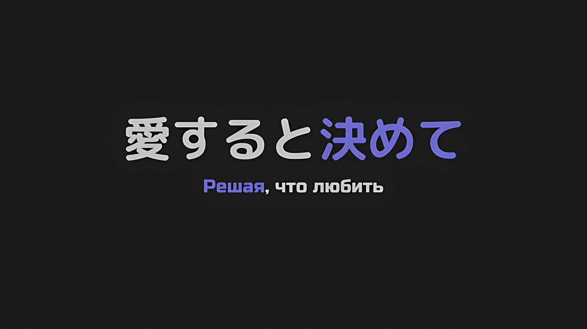
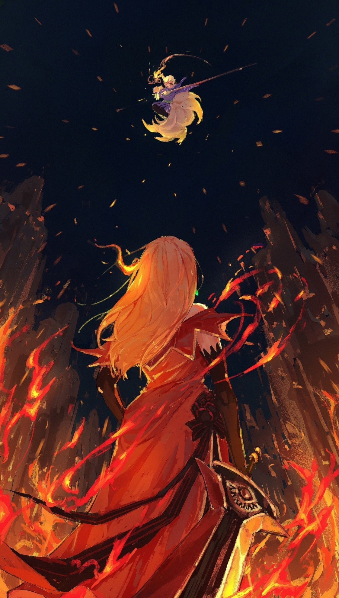
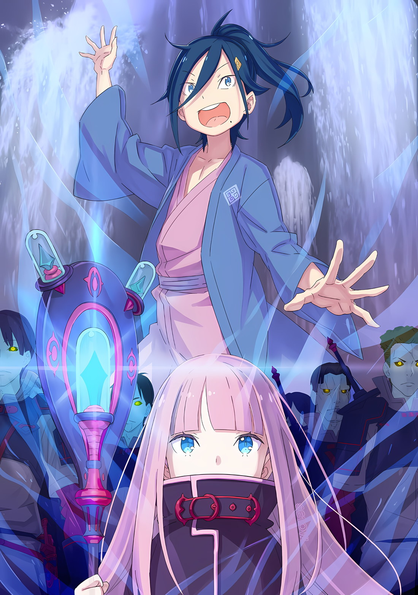
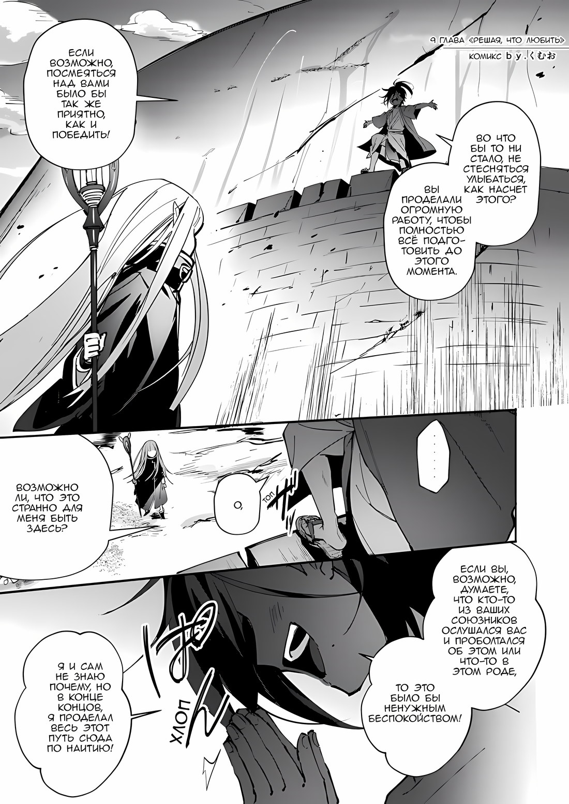
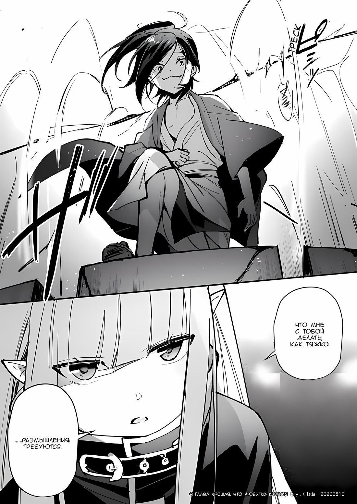

*※※※※※※※※※※※*

…Вывод войск из столицы Империи Рапганы.

Хотя это решение было признано необходимым, оно все равно стало крупным инцидентом в истории Империи.

Столица Империи, находившаяся под непосредственным руководством Императора, не только позволила «Врагу» продвинуться к Кристальному Дворцу, но и сам Император даже был вынужден оставить дворец, а также город и прибегнуть к бегству. Падение его власти было неизбежным.

Однако…,

Гоз: Учитывая, что мы не знаем намерений этих зловещих парней, суждение Вашего Превосходительства будет наилучшим вариантом действий.

Ольбарт: Какакакка! Разве Император, покидающий дворец для того, чтобы спастись, не является чем-то неслыханным? По крайней мере, я никогда не слышал ничего подобного до этого возраста.

Гоз: Не смейся, Генерал Первого Класса Ольбарт! Если ты подумаешь о чувствах Его Превосходительства… Если ты подумаешь об этом, я! Черт возьми! Непременно, под командованием Его Превосходительства, мы отвоюем дворец и столицу Империи!!!

Убирк: Вааваааа~, мы убегаем? Ваше суждение спокойно и быстро! Что касается меня, то я не настроен бороться до последнего вздоха, поэтому я думаю, что это правильное решение.

В тот момент не было никого, кто возражал бы против решения Винсента.

Это произошло потому, что Винсент назначал должности, основываясь на практических способностях, а не на лояльности, что оказалось оправданным. Хотя восстание и было спровоцировано из-за разницы во мнениях, в конечном итоге его самый близкий и надежный союзник предал его. Таким образом, любые различия в лояльности были всего лишь погрешностью.

В любом случае, пора было начинать отступление.

Винсент: Ольбарт Данкелькен, выиграй нам немного времени. Если оставить Могуро Хагане одного, он быстро потерпит поражение. Мы не можем допустить, чтобы водохранилище было уничтожено.

Ольбарт: Боже, нехорошо переутомлять пожилых людей. Как насчет того, чтобы вместо меня использовать Гоза?

Винсент: Гибкость и быстрота — отличительные черты шиноби. Выполняй свой долг без колебаний.

Ольбарт: …Просто предупреждаю, даже я не смогу его поймать, если он сосредоточится на полете, понимаете?

В вышине умерший Балрой Темегриф в полете рассекал небо столицы Империи. Выслушав Ольбарта, который недвусмысленно сказал, что у того остались навыки, полученные еще при жизни, когда тот был величайшим всадником на драконах из Империи Волакия, передав тем самым жесткость их противника, Винсент все же доверил эту задачу чудовищному старику.

Как сказал Ольбарт, хотя между ними и были некоторые различия в способностях, Гоз все равно мог выполнять ту же роль.

Однако, если говорить о различиях в способностях, существовала еще одна роль, которую Гоз должен был сыграть. Этот громогласный и властный «Генерал» пользовался исключительным доверием своих войск.

Поэтому…,

Винсент: Гоз Ральфон, используй свою абсурдную громкость. Отныне все, что нам нужно для отступления из столицы Империи, — это рабочая сила. Собери все разбросанные войска поблизости.

Гоз: Да! Предоставьте это мне, Ваше Превосходительство! Прямо сейчас!!!

Не раздумывая, Гоз кивнул и своей голой верхней частью тела запрыгнул на близлежащую груду обломков. Там он сделал глубокий вдох и закричал на весь мир, где эхом отдавался громовой шум титанической битвы Могуро.

Его невероятно громкий голос вызывал возражения в клокочущем воздухе столицы Империи.

Гоз: Слушайте внимательно, Волки Меча Волакии!!! Это приказ главы Волков Меча, Его Превосходительства Винсента Волакии! Следуйте за моим голосом! Следуйте за ним!!!

Когда была отдана директива Гоза с громкостью, которая звучала как грохот выстрела из магической каменной пушки, Винсент заткнул уши и посмотрел на Ольбарта, словно проверяя его. Ольбарт, который тоже закрыл уши, медленно покачал головой и сказал,

Ольбарт: Я не могу сделать ничего подобного. Значит, вы просто выбрали подходящего человека для этой задачи, верно?

Произнеся только эти слова, фигура Ольбарта исчезла в небе, оставляя за собой след.

Чудовищный старик карабкался по растрескавшимся стенам Кристального Дворца, оставшимся после битвы, используя их в качестве опоры для ног. На полпути он запрыгнул на массивное тело Могуро и вмешался в сражение, где сотрудничали «Облачный Дракон» и «Магический Стрелок». «Порочный Старик» продемонстрировал свою силу и начал манипулировать ситуацией.

Ольбарт, возможно, и что-то сказал о том, что не может угнаться за своим летающим противником, но, с его снаряжением шиноби и скрытыми техниками, у него, скорее всего, было бесчисленное множество способов справиться с ситуацией.

Если бы чудовищный старик присоединился к битве, невыгодное положение Могуро, скорее всего, было бы в некоторой степени устранено.

Убирк: Ваше Превосходительство, есть ли что-нибудь, что вы хотите, чтобы мыыы~ сделали?

Винсент: …Сколько вас, «Звездочетов», в округе?

Пока Гоз собирал людей, Винсент спросил это у Убирка, которому больше нечего было делать. Тот ответил на его вопрос: «Хорошооо~» и приложил пальцы обеих рук к щекам.

Убирк: Давайте посмотрим, в пределах диапазона, где слышны наши голоса, наааас~ двадцать семь.

Винсент: Больше, чем я ожидал. Тогда обойдите все дома, открывая двери одну за другой. Скажи им, что Император и войска покинут столицу, так что даже если они останутся в городе, они только зря потратят свои жизни.

Убирк: Понял! Вот оно, вот оно! Тотальная война… Объединение усилий всей Империи Волакия, чтобы противостоять «Великому Бедствию», это то, что я хотел воплотить.

Винсент: Быстро, сделай это.

Винсент вздохнул, отгоняя взволнованного Убирка, который не мог сдержать своего восторга от того, что смог достичь своей цели в качестве члена «Звездочетов».

Затем Винсент посмотрел на Беллстетза, который хранил молчание, чтобы не мешать его мыслям и рассуждениям.

Он был тем человеком, который присоединился к Чише Голд, зачинщику гражданской войны, и вызвал хаос в Империи, свергнув Винсента с трона.

Винсент: Ты довольно молчалив.

Беллстетз: В нынешней ситуации две головы, отдающие команды, могут только посеять смуту. Если бы, гипотетически, Волк Меча родился с двумя головами, это означало бы…

Винсент: Что отсечение одной из двух голов — твоя обязанность?

Беллстетз: Если понадобится, этот старик с удовольствием предложит вам свою голову.

Сцепив руки за спиной, Беллстетз спокойно заявил о своей решимости.

Хотя он был далек от воинской доблести, в нем горела гордость имперского человека. Винсент не верил, что Беллстетз восстал из-за жажды власти, как и не верил, что слова, которые он только что произнес, были формальным оправданием.

Проще говоря, движущей силой Беллстетза была беззаветная преданность Империи.

По этой причине, когда он видел угрозу для Империи, он немедленно отказывался от своей прежней политики и планов и без колебаний вставал на одну сторону с Винсентом, как он делал это сейчас.

Винсент: Когда Гоз Ральфон, «Звездочет» и остальные закончат свои приготовления, мы немедленно начнем отступление. Беллстетз, твое мнение. Будь краток.

Беллстетз: …При всем должном уважении, Ваше Превосходительство, если вы собираетесь отступить, пожалуйста, следуйте своим собственным мыслям.

Винсент: …

Винсенту, который попросил высказать краткое мнение, ответил Беллстетз.

Хотя эти слова были загадочными, Беллстетз не хотел вводить его в заблуждение. После минутного размышления Винсент понял смысл этих слов.

Следовать своим собственным мыслям, то есть мыслям Винсента Волакии.

…Это был тот же образ мыслей, которому следовал Чиша Голд.

Беллстетз: Если генерал Чиша заменил вас, зная предсказание, и сотрудничал со мной, чтобы узурпировать трон…

Винсент: …Он, должно быть, догадывался, в чем будет заключаться «Великое Бедствие», и подготовился к нему.

Беллстетз: Все так, как вы говорите. И это является тем, что только Ваше Превосходительство Император может заметить, и никто, кроме Вашего Превосходительства Императора, не заметил бы.

Пока Беллстетз говорил, Винсент размышлял, прикрыв один глаз.

Мнение, высказанное премьер-министром, было понятным. …Нет, оно было разумным. Даже без совета Беллстетза Винсент пришел бы к такому же выводу, но это сократило время.

Чиша поставил на карту свою жизнь, чтобы остаться в образе Винсента на троне. А что, если он оставил Винсенту нечто большее, чем просто «Будущее», в котором он, как предполагалось, был вычеркнут?

Это было…,

Гоз: …Ваше Превосходительство! Все солдаты вернулись с лицами солдат! Что вы желаете сделать?

В тот момент, когда мысли Винсента пришли к такому выводу, с груды обломков яростно спрыгнул Гоз.

Оглядываясь по сторонам, один за другим, вокруг них собирались имперские солдаты, которые приходили со своими экипированными мечами и лязгающими доспехами, стая Волков Меча. Перед лицом этой беспрецедентной ситуации они, должно быть, были сбиты с толку и встревожены. Однако, следуя призыву «Рыцаря Льва» Гоза Ральфона, они собрались вместе, а когда поняли, что впереди их ожидает Император Волакии, то ужесточили выражения лиц и стойки.

???: …

Таков был ужасный и отвратительный образ жизни людей Империи.

Но для того, чтобы бороться с грядущим бедствием, Волк Меча не должен забывать о своем голоде. Потратив на это годы, вспоминая былые времена, Винсент поднял глаза к небу.

Накопление национальной силы, поддержание дисциплины и морального духа солдат ради того, чтобы оставить после себя Империю, способную противостоять бедствию. …Этот план провалился, но уходить как неудачник он не собирался.

Винсент: Могуро Хагане! Не позволяй этим подонкам воспользоваться Магической Кристальной Пушкой! Если ты выполнишь это, то я исполню твое желание!

Могуро: «*…*»

Неизвестно, дошел ли его голос, который он довел до предела, до Могуро, сражавшегося с самым сильным существом в мире, — «Драконом».

Однако этот благородный «Метеор» внимательно прислушивался к человеческим словам. Казалось, что у него нет ушей, но на них можно было положиться.

Затем, дав указания собравшимся «Генералам», Винсент опустил взгляд и посмотрел на лица солдат, собравшихся вокруг него.

Затем, глядя на этих Волков Меча, чья воля к борьбе не ослабевала, он продолжил.

…Чиша Голд, если бы он действительно воплощал Винсента Волакию,

Винсент: Мы покидаем столицу Империи! Мы направляемся на северо-запад, в Укрепленный Город Гаркла!

Тогда в этой стране должен быть разработан план противодействия «Великому Бедствию», — таково было то, о чем он громко заявил.

*△▼△▼△▼△*

…Как имперские солдаты, так и повстанцы, которые были частью поля боя, начали понимать, что борьба за определение курса Империи Волакия изменила форму.

При той степени замешательства, которая распространилась повсюду, и изменении обстановки, поразительной для полностью увлеченных сражением, Волки Меча осознали такую атмосферу и почувствовали вмешательство неблаговидных намерений.

Таким образом, когда от командиров с изменившимися выражениями лиц посыпались приказы, мышление обеих сторон, откровенно скрещивавших руки, изменилось благодаря их слегка восстановленному самообладанию и боевой интуиции.

Благодаря этому обе стороны, которые всего несколько мгновений назад яростно сражались друг с другом, прекратили боевые действия, заменили звание имперского солдата или повстанца на титул «Гражданин Империи» и объединились, как стая волков.

В этот момент Винсент Волакия, находившийся в центре столицы Империи, и Серена Дракрой, находившаяся в осаде вокруг города, только что подняли свои голоса в качестве главных командиров.

Проще говоря, изменения, которые почувствовали все имперцы, были обстоятельствами, требующими немедленных действий. Совершенно не связанное с этими событиями, поле битвы все еще пылало ярко-красным цветом, способным превратить в пепел всех остальных.

…«Пожирательнице Духов» Аракии, защищавшей первый бастион, противостояли Присцилла Бариэль и Йорна Миссигр, великолепные и завораживающие женщины с сильным характером.

Йорна: …Люби меня.

Когда над миром доминировало красное, сияющее пламя, Йорна галантно ударила ногой по земле, и в одном из ее глаз зажегся огонь.

Подол ее кимоно очаровательно развевался, и когда длинные ноги Йорны, которые делали ее высокой для женщины, коснулись земли, грунт в следующее мгновение поднялся и помог ей бежать как в скорости, так и в инерции.

Это был не Город Демонов Хаосфлейм, а всего лишь земли вокруг столицы Империи, территория Императора Волакии.

Давным-давно, за пределами воспоминаний о прошлом, ставшем далеким как для Йорны Миссигр, так и для Сандры Бенедикт, она когда-то мечтала о столице Империи, которая казалась ей такой недосягаемой.

Но там, куда она никогда не могла добраться своими силами, держась за руки с человеком, который был настолько благороден и настолько другого статуса, что она боялась прошептать, что любит его, стояла она.

«Техника Брака Душ» Йорны могла быть дарована только тем, кого она любила.

…Тогда, с любовью к этому человеку, которая никогда не могла угаснуть, почему Йорна не любила ту самую землю, которую любил он?

Йорна: …Меня лишили всего этого.

Император Волакии, который в то время был известен как «Терновый Король», и Ирис, девушка, которая влюбилась.

Она приютила, поддерживала и шла тем же путем, что и свергнутый с трона Император. Видя мужество и благородство юной девушки, многие воспевали хвалу «Терновому Королю», желая благословения их совместному будущему.

Однако из-за людей-кротов, которые их обманули, манипулируя ими с помощью лести, и людей-волков, которые предали их из-за амбиций и высокомерия, это будущее потеряло свой идеальный конец.

Рай, который должен был построить «Терновый Король», строительство того обещанного мира было заброшено. Император, которым управляло заблуждение, связал душу девушки, которая должна была исчезнуть, с кровью предателей земли Империи.

С тех пор Ирис возрождалась снова и снова, меняя имя и внешность.

Любя кого-то, будучи любимой кем-то, она продолжала жить.

Но в то же время эта Империя Волакия, сама ее земля, была единственной вещью, которую она не могла полюбить. Возможно, она ненавидела ее потому, что это было так далеко от мечты, о которой она когда-то грезила.

Но, тем не менее, такие вещи были мелочью по сравнению с тем, что было действительно важно.

Йорна: …Люби меня.

Независимо от того, могла ли она любить или нет, ей надо было просто решить полюбить.

Это была Империя, о которой остались не только счастливые воспоминания. Счастье и несчастье были двумя сторонами одной медали, как когда она была Ирис, так и на протяжении многих жизней после того, как она перестала быть Ирис.

То же самое было верно и для любимых детей Йорны в Городе Демонов… Иногда ее переполняла их любовь, а иногда она злилась на их мелочность.

Йорна: …Все это меня устраивает.

Да, когда звучное «Любовь» отозвалось внутри Йорны, пылающая земля возрадовалась.

Твердая почва, которая должна была только улавливать ее шаги, радостно подалась вперед, и подпрыгивающая земля послужила Йорне опорой для ног, отправив ее высоко в небо.

Крутанувшись, Йорна на толстых каблуках настигла Аракию в воздухе.

Аракия попыталась пропустить это через себя, слившись с окружающим ее воздухом. Однако удар Йорны пробил коричневую кожу, сквозь которую он должен был проскользнуть.

Аракия: …А?

Ее подставленное плечо взорвалось болью, и Аракия слабо ахнула от невозможного удара.

Тело Аракии, которое было ассимилировано либо с огнем, либо с ветром, либо с тенью, взорвалось от удара, и выражение ее лица, которое редко демонстрировало такие пламенные эмоции, было окрашено болью и удивлением.

Для Аракии, которая постоянно использовала все преимущества черт «Пожирателя Духов», чтобы одержать верх в каждой схватке со своими врагами, это было поистине громом среди ясного неба.

Но Йорна не была ни удивлена, ни удовлетворена тем, что ее удар попал в цель. Используя пятку, которой она нанесла удар, как точку опоры, она подняла свою верхнюю часть тела и взмахнула кисэру, которое держала в тонких пальцах, проводя последующую атаку.

Аракия: Эх, ах, ух.

Раздался звук последовательного удара чего-то твердого о ее плоть, и выражение лица Аракии постоянно искажалось.

Ее голос вырывался из горла, как будто она не могла понять, какие ощущения испытывает. Это был способ отвергнуть стоящий за этим факт, а не саму боль.

«Почему», — спросила она Йорну. Глаза Аракии расширились, даже тот, из которого она больше не могла видеть.

Йорна: Если есть любовь, то нет смысла в бестактных колебаниях.

Аракия: Любовь…?

Йорна: Ты ведь приемная сестра моей недисциплинированной дочери, не так ли?

Ответ Йорны с лучезарной улыбкой наполнил лицо Аракии выражением непонимания.

Несмотря на то, что она получила ответ, ее щеки затвердели от того факта, что она его не поняла. Затем Аракия свободно взлетела в небо на большой скорости, чтобы скрыться, вызвав катастрофические волны природных явлений.

У Йорны, находившейся в воздухе, не было никакой возможности избежать ее натиска дерева, огня, земли, металла и воды.

Йорна: Как это было и до того, как я заключила мир с Империей.

Смахнув эти слова с ослабевших губ, Йорна помчалась в воздушном пространстве по поднимающимся одна за другой земляным опорам.

В душе она была возмущена, но в то же время полна радостной эмоциональной привязанности: если она решила полюбить Империю Волакия во всей ее полноте, тогда сама земля откликнулась бы и продолжила горячо поддерживать ее.

Избегая на каждом шагу огненного дождя, водяных копий, огромных волн ветра и световых вспышек, Йорна снова приблизилась к Аракии.

У Аракии больше не было преимущества в воздухе, так как земля достигала того места, куда ступала Йорна, позволяя ей достичь той же высоты.

Аракия: …Ах.

Она ассимилировалась с духами в атмосфере и стала прозрачной для вражеских атак.

Поскольку она слишком привыкла уклоняться таким образом, Аракия не успела среагировать на приближающуюся опасность от Йорны, и получила удар ногой прямо в свой гладкокожий торс.

Разрушительная сила проникла в заднюю часть тела Аракии, заставив шторм, которым она себя окружила, мерцать в мире красного пламени.

Аракия: …Кх.

Наконец, боль проступила на лице Аракии, пересилив ее удивленный взгляд.

Это был определенно признак того, что атака Йорны выбила Аракию из колеи. Несмотря на то, что до сих пор события развивались в пользу Йорны, она все еще не была настроена оптимистично.

Это было потому, что…,

Аракия: Ты бы никогда… кх!

С искаженными от боли и гнева щеками, Аракия схватила ветку дерева и ударила ею Йорну.

Эту ветку просто подобрали и использовали как обычный предмет, но она ни разу не сломалась, даже в разгар этих стихийных бедствий. Подобно великому сокровенному мечу, она показала свою истинную ценность в руках «Пожирателя Духов».

Йорна поймала качнувшуюся ветку своим кисэру, которое она держала в поднятой руке. Уголок ее рта слегка дрогнул, когда они пристально посмотрели друг на друга.

Йорна: Кху…

Сила заблокированной ветки дерева заставила Йорну испустить горловой стон через кисэру.

«Техника Брака Душ» Йорны могла переносить боль и раны на ее собственные драгоценные вещи. Естественно, это была секретная техника, которая требовала соответствующего уровня привязанности и преданности.

Однако заколки, серьги и обидомэ* Йорны, подаренные ей ее любимыми жителями Города Демонов, не были поглощены. Несмотря на это, сама Йорна страдала от боли.

*Обидомэ — это брошь, которая прикрепляется на пояс-шнур спереди, одно из немногих ювелирных украшений, которые можно надевать с кимоно.

Ответ был прост и ясен — любовь никогда не была односторонней.

Йорна: …Люби меня.

Как только она решила полюбить Империю со смесью любви и ненависти, а также дисциплинировать Аракию, с которой она вступила во враждебные отношения, ей нужно было стремиться к совместимости, а не навязывать ей одностороннюю любовь.

Это было прямо противоположно тому, как изначально предполагалось использовать «Технику Брака Душ» Йорны Миссигр.

*△▼△▼△▼△*

Присцилла: …

В воздухе Йорна и Аракия столкнулись в ожесточенной схватке.

Присцилла, держа в руке ослепительный «Меч Света», с пламенем в одном глазу, доказывающим, что ее любят, нахмурилась при виде того, как ее мать и приемная сестра безудержно сцепились.

Как пользователь той же «Техники Брака Душ», она понимала причину действий Йорны.

Однако, поскольку они обе были пользователями «Техники Брака Душ», Присцилла могла понять запретную природу того, что делала Йорна.

Присцилла: Сосредоточившись только на силе техники, ты не обращаешь внимания на ее слабости. Ты тоже безрассудна, дорогая мамочка.

Йорна с первого взгляда поняла, как игнорировать природу Аракии как «Пожирателя Духов» и пропускать ее атаки через себя, но это требовало точного обращения с магией и решимости самой получать раны.

И Присцилла, и Йорна не были незнакомы с «Техникой Брака Душ» — тайным искусством, которое требовало столь редкий талант, что не имело исторических наследников, и для его использования на практике необходимо было обладать невероятным чувством баланса.

Короче говоря, усилия Йорны были рискованной авантюрой, которая не только предотвратила бы атаки Аракии на нее, но и могла бы даже разорвать ее связь с близкими, которые дарили ей подарки.

Присцилла: …

Присцилла не была ни глупой, ни бессердечной настолько, чтобы не задуматься о том, почему Йорна пошла на столь рискованную авантюру, чтобы встретиться лицом к лицу с Аракией.

Ради Присциллы Йорна приняла это табу.

…Она хочет избежать ситуации, в которой Присцилле пришлось бы убить Аракию.

Присцилла: С моим Мечом Света мне не придется переживать тот же кризис, что и дорогой мамочке.

Резать то, что хочется резать, и сжигать то, что хочется сжигать — такова была истинная суть свойств «Меча Света».

Если бы истинная сила меча Присциллы была продемонстрирована, его белое пламя могло бы наносить удары без учета характеристик Аракии, даже если бы та имела в союзниках все природные явления.

Сохраняя эффект «Техники Брака Душ», атакующий мог добраться до своего противника.

Именно это и произошло, когда Присцилла и Аракия встретились впервые за почти десять лет, и в этих обстоятельствах Присцилла не могла и подумать о том, чтобы сделать то же самое.

Поэтому Йорна стукнула Присциллу по голове и сражалась на передовой как таковая.

Присцилла: Вот так стукнуть меня по голове…

Соблазнительно было возразить, была ли она ей матерью, но это было именно так.

Размышляя о своих чувствах, она поняла, что до того, как Йорна стукнула ее по голове своим кисэру, Присцилла проявляла нехарактерный для нее энтузиазм.

Дойдя до этого момента, она почувствовала, что должна сама разобраться с Аракией.

Однако…,

Присцилла: …Карма «Пожирателя Духов», не так ли?

Было неизбежно, что такой искусственный вид, как Аракия, будет наделен особенно искаженными характеристиками.

Чтобы обладать великой силой, нужно заплатить соответствующую цену. Не говоря уже о «Мече Света» Присциллы или «Технике Брака Душ», то же самое можно было сказать и о силе «Пожирательницы Духов» Аракии.

Конечно, Присцилла слышала о том, каким существом была рождена Аракия, когда сопровождала ее. Она даже провела собственное исследование. Однако она не была достаточно осторожна.

В результате у Аракии, которая не могла стоять без поддержки, появилась опора в виде Присциллы.

Присцилла: Если солнце мое лучезарное спрятать, то мир окутается тьмой.

В течение десяти лет Аракия жила в мире, погруженном во тьму.

Возможно, для кого-то было невозможно исполнить роль Присциллы, но разве кто-то не пролил бы луч света на эту тень?

Когда она решила, что не может взять с собой Аракию, то подумала, что это сделает Винсент, но…

Присцилла: Это было бы невозможно.

Нахмурив брови от собственных мыслей, Присцилла отбросила эту идею.

В то время, когда она была еще молода и сообразительна, Присцилла… Приска ошиблась. Она думала, что может доверить такое задание своему старшему брату, но это был просчет.

Когда битва за столицу Империи приняла столь радикальный оборот, и когда она узнала о силе других «Девяти Божественных Генералов», помимо Аракии, собранных ее старшим братом, Винсентом Волакией, она заметила. Она поняла.

Винсент намеревался бороться с чем-то совсем иным и более великим, чем восстание.

Более того, он не собирался выжить в конце этого сражения. По окончании битвы кому он собирался доверить свой потерянный трон?

Преданность Аракии не могла измениться ради кого-то другого.

Присцилла: Глупости.

Практически все сначала было изготовлено в виде доски на столе, а затем мир был сконструирован в соответствии с этим как реальность.

В этом была сила Винсента, но независимо от того, насколько хорош был его ум, если бы его предполагаемая форма совершенства была ошибочной, мир, каким он его представлял, был бы, несомненно, искажен.

Однажды он будет вознагражден за свою неосведомленность. Или, возможно, это произойдет в этой битве, однако…

Присцилла: Мы были в разлуке десять лет. Довольно, старший брат, ты должен отдалиться от своей младшей сестры.

Присцилла шагнула вперед, бросая позор на своего брата, который отсутствовал на сцене.

Небо окрасилось в красный цвет от пламени, а земля бушевала по приказу «Ярчайшей». Казалось, будто небо и земля отказываются от вмешательства солнца, Присциллы.

Однако такому самонадеянному миру Присцилла Бариэль… или, скорее, ее дочь, ранее известная как Приска Бенедикт, могла сказать только одно.

Присцилла: …Сей мир меняется в угоду мне.

*△▼△▼△▼△*

В тот момент было неправильно отожествлять испытываемые Аракией чувства с унижением и позором.

Унижение означало, что не должно существовать названия для чувства, когда тебя опускают из-за сожаления.

Позор означал, что не могло быть никакого чувства гордости в том, чтобы быть опозоренной из-за отставания.

У Аракии не было привязанности к своему имени или какой-либо гордости.

Самый высокий ранг «Второго», исключая Сесилуса, чье присутствие среди уважаемых «Девяти Божественных Генералов» Империи считалось совершенно ошибочным. Эта особа обладала непревзойденными качествами, известными как «Пожиратель Духов», не только в пределах Империи, но и во всем мире, что делало ее абсолютной силой.

Несмотря на статус и способности, которых так желали многие люди, эти вещи не могли стать «Опорой», поддерживающей Аракию как личность.

Аракия определяла себя как зверя в дикой природе.

Звери, живущие охотой на других существ, не гордились своими клыками и когтями. …Нет, Аракия только так думала, но у зверей была своя гордость и свои способы действий.

В таком случае, самовосприятие Аракии было далеко даже от звериного.

Огонь, ветер, вода, земля, свет, тень — неприкасаемые явления.

Не было никакой воли, которая вмешивалась бы, только осознание желаемого.

Аракия хотела стать феноменом, ни человеком, ни зверем.

Она хотела быть феноменом, который не чувствовал бы себя униженным или опозоренным.

Если так…,

Аракия: Я…

Аракия попыталась превратиться в ветер, чтобы справиться со шквалом яростных атак. Однако она не смогла справиться с ними полностью. Ветер был захвачен, а удары оставили боль и тяжесть внутри Аракии.

Вырвался крик боли, и лицо Аракии исказилось от огорчения. Как «Пожиратель Духов», она не часто испытывала боль в бою, но она ни в коем случае не была от нее застрахована.

Аракия уже испытала все виды боли в детстве.

Чтобы она обрела способности «Пожирателя Духов», взрослые, окружавшие Аракию, испробовали все возможные ритуалы и техники, повторяя их снова и снова.

Не боясь боли. Она не трусила, вспоминая прошлое.

Однако сам факт осознания был для Аракии сильнее боли.

Огонь не испытывал боли, как и не умирал, если его тушила вода.

Была ли Аракия ничем иным, как огнем, который будет страдать от боли и умрет, когда его потушит вода?

Аракия боялась признаться себе в том, что она не может быть феноменом.

Аракия: Я…

Йорна: …Умолкни, ты.

Движимая разочарованием, она попыталась заговорить, но пощечина ее оппонента пришлась ей по лицу.

Сила атаки снесла Аракию с головы до ног. Хотя она быстро восстановила свою первоначальную форму, боль осталась, как и ущерб, нанесенный психике Аракии.

Это было не унижение и не позор, а кажущееся отрицание ее существования. Словно цепляясь за свою драгоценную жизнь, Аракия приподняла землю, направив ладонь в сторону Йорны, которая прыгнула на нее.

Она не знала, что происходит, но и Приске, и Йорне каким-то образом удалось избежать атак Аракии. Как только Йорна запечатала свою технику, их атаки стали достигать ее. В то же время, атаки Аракии также начали настигать Йорну.

Аракия: …Кх.

Только один раз, один удар, одно попадание.

Йорна сама повысила уровень своих физических способностей, либо с помощью неизвестной техники, либо с помощью магии. Однако, если она не использовала свою технику, чтобы избежать урона, значит, атаки Аракии пробьют ее насквозь.

До тех пор, пока она была в состоянии ударить…,

Аракия: Принцесса и…!

Если ей удастся избавиться от надоедливой Йорны, она останется наедине с Приской и собой.

Если это произойдет, то, конечно, все будет хорошо.

*???: «Если ты чего-то хочешь, то разумнее пойти и получить это, чем ждать, верно?»*

Да, Тодд так говорил.

Слова Тодда странным образом вызвали сильный резонанс в сознании Аракии.

Это было не потому, что они говорили об удобных вещах или основывались на личных симпатиях или антипатиях.

Слова Тодда были лишены каких-либо эмоций по отношению к Аракии. Это было утешительно. Как человек не любит огонь или воду, так и Тодд не испытывал никаких чувств к Аракии.

То, что к Аракии относились так бессодержательно, было спасением.

Вот почему…,

Аракия: …

Ветка дерева в ее руке вспыхнула от верхушки до хвоста и превратилась в черную пыль.

Ветка была просто вещью, которую она подобрала; она не обладала особой силой. Это был просто четкий индикатор, определяющий, куда Аракия намерена направить свою силу.

То, что она сожгла эту деревянную палку, говорило о том, что она высвободила свою огневую мощь, которую не нужно было направлять.

«Пожирательница Духов» Аракия считалась одной из сильнейших в Империи, и ее величайшая сила проявилась лишь однажды во время стычки с Сесилусом Сегмунтом.

Поскольку противником был Сесилус, никакого ущерба нанесено не было, но от вспышки Аракии северная часть столицы Империи превратилась в выжженную пустошь. Император, Винсент, сказал Аракии, что второй раз такого не потерпит. Позже, по предложению Чиши, выжженная земля была повторно использована в качестве водохранилища, но удар был достаточно сильным, чтобы перерисовать карту.

Присцилла: …Сей мир создан для моего удобства.

…Разрыв, изданный уверенным и достойным голосом, заглушил все вокруг.

Вспышка «Меча Света» поглотила пламя, которое могло бы выжечь мир дотла.

Приска подскочила к Йорне, ее длинные, прекрасные волосы развевались на горячем ветру, Аракия отражалась в ее глазах, один из которых горел пламенем, а другой нет.

И затем…,

Присцилла: Дорогая мамочка.

В тот момент, когда ее губы шевельнулись, Йорна, выйдя из-за спины Приски, нанесла свирепый удар ногой.

Приска, которая выровняла свои ноги с подошвой для разящего удара, преобразовала его импульс в собственное движение вперед, оттолкнувшись и приблизившись к Аракии со скоростью, которую можно было принять за скорость света.

Затем Приска подняла «Меч Света», который держала в руке,

Присцилла: Аракия.

Со вспышкой и одним-единственным словом все движения Аракии были перекрыты.

Рефлекторное защитное действие Аракии, уклонение, которое смешивало ее с атмосферой, было искажено и раздавлено вспышкой Приски, безжалостно пронзившей все ее тело.

Аракия: …

Сознание Аракии было отрезано.

По иронии судьбы, как и тогда, когда она превратила северную часть столицы Империи в выжженное поле, самая мощная огневая мощь Аракии была высвобождена, но сразу после этого она была поражена вспышкой Сесилуса, и ее сознание отключилось аналогичным образом.

Но, наконец, в конце концов, она услышала.

Присцилла: Мой Меч Света режет то, что я хочу разрезать, сжигает то, что я хочу сжечь. …И поражает то, что я хочу поразить.

Сказав это, Присцилла взмахнула «Мечом Света»… Когда Аракия падала, она не осознавала, что в ее сторону было направлено не лезвие меча, а скорее рукоять.

*△▼△▼△▼△*

…Мальчик улыбался. Независимо от времени, он всегда улыбался.

Даже если изменился цвет неба, даже если эти обширные земли яростно потрескались, даже если на мир обрушилось стихийное бедствие, еще невиданное этими голубыми глазами, и даже если беспрецедентные события пытались встать на его пути, он улыбался.

Сошел ли он с ума? Да, он был сумасшедшим.

Был ли он пьян? Да, он был пьян.

Не от битвы. Не от алкоголя. Не от любви. Не от крови.

Абсолютно, основательно, бесспорно, он был маньяком. Определенно, несомненно, недвусмысленно, он был пьяницей. Этот мальчик продолжал улыбаться.

Если бы он этого не делал…,

Мальчик: …Занятые люди не стали бы пялиться на сцену со скучным актером, не так ли?

Даже когда ничего не происходит, могут пролиться слезы. Но возможно ли, чтобы, даже когда ничего не происходит, можно было улыбаться?

Если да, то улыбка стала бы началом чего-то нового. Улыбка означала бы, что история начинает разворачиваться.

Началась ли она уже или только начинается, он не знал.

Иными словами, улыбка была доказательством того, что кто-то твердо решил подняться на сцену; именно так определил это мальчик.

Поэтому…,

Мальчик: Во что бы то ни стало, не стесняться улыбаться, как насчет этого? Вы проделали огромную работу, чтобы полностью все подготовить до этого момента. Если возможно, посмеяться над вами было бы так же приятно, как и победить!

???: …

Мальчик: О, возможно ли, что это странно для меня быть здесь? Если вы, возможно, думаете, что кто-то из ваших союзников ослушался вас и проболтался об этом или что-то в этом роде, то это было бы ненужным беспокойством! Я и сам не знаю почему, но в конце концов, я проделал весь этот путь сюда по наитию!

Весело улыбаясь и хлопая в ладоши, он твердо поставил свои зори на твердую поверхность и перестал напускать на себя лоск.

Оплот водохранилища был расколот, вода продолжала вытекать, а перед ним, преграждая путь, стоял мальчик… Сесилус Сегмунт — и видел перед глазами фигуру антагониста.

Это была…,

???: Что мне с тобой делать, как тяжко. …Размышления: Требуются.

…С большим количеством мертвых людей, следующих за ней, там стояла «Ведьма» невысокого роста.

